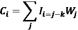
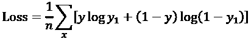

# 第九章：使用卷积神经网络（CNN）进行抽象图像分类

卷积神经网络（CNN）在视觉领域的发明，至今仍是应用数学史上最具创新性的成就之一。凭借其多层（可见层和隐藏层）结构，CNN 将人工智能从机器学习带入了深度学习的领域。

在*第八章*《使用前馈神经网络解决 XOR 问题》中，我们看到 `f`（`x`，`w`）是任何神经网络的构建块。一个函数 `f` 会将输入 `x` 和权重 `w` 转换为输出。这个输出可以直接使用，或者输入到另一个层中。在本章中，我们将概括这个原理并引入多个层。同时，我们将使用带有图像的数据集。我们将拥有一个训练数据集和一个验证数据集，以确认我们的模型有效。

卷积神经网络（CNN）依赖于线性代数的两大基本工具：卷积核和函数，并将它们应用于本章所述的卷积操作。这些工具在数学中已经使用了数十年。

然而，解决现实问题的突破来自于 Yann LeCun、Yoshua Bengio 等人的非凡想象力——他们构建了一个多层的数学模型，才使 CNN 能够应用于实际问题。

本章描述了卷积神经网络（CNN）的奇妙之处，它是**人工神经网络**（**ANNs**）的支柱之一。我们将从零开始构建、训练并保存一个 CNN。所描述的分类模型将用于检测食品加工生产线上的生产故障。图像检测将超越物体识别，并以概念的形式产生抽象结果。

一个 Python TensorFlow 2 程序将逐层构建并训练。附加示例程序将展示关键功能。

本章将涵盖以下主题：

+   1D、2D 和 3D CNN 之间的区别

+   向卷积神经网络添加层

+   卷积核和滤波器

+   图像处理

+   ReLU 激活函数

+   核心初始化

+   池化

+   扁平化

+   全连接层

+   编译模型

+   交叉熵损失函数

+   Adam 优化器

+   训练模型

+   保存模型

+   可视化模型的 PNG

我们将从介绍 CNN 开始，并定义它们是什么。

# 引入卷积神经网络（CNN）

本节描述了卷积神经网络的基本组件。`CNN_SRATEGY_MODEL.py` 将展示构建抽象图像检测模型所需的基本 CNN 组件。对于机器和人类而言，概念是认知的构建块。CNN 是深度学习的支柱之一（多层和神经元）。

本章将使用 Python 的 TensorFlow 2 版本，并通过现在已并入 TensorFlow 的 Keras 库来运行。如果你没有安装 Python 或不想进行编程练习，本章是自包含的，包含图表和解释。

## 定义卷积神经网络（CNN）

卷积神经网络处理信息，比如图像，并从中提取意义。

举个例子，假设你需要用一支普通铅笔和一张纸来表现太阳。那是一个阳光明媚的日子，太阳非常明亮—亮得有些过头。你戴上了一副非常厚重的太阳镜。现在你可以看太阳几秒钟。你刚刚应用了一个颜色降低滤镜，这是卷积神经网络中的第一步操作之一。

然后，你试图画出太阳。你画了一个圆圈，圆圈中间涂了一些灰色。你刚刚应用了一个边缘滤波器。最后，你多次在圆圈上描摹，使它更容易被识别，逐渐将你看到的内容转化为它的表现形式。现在，画出了一个圆圈，圆圈中间有一些灰色，周围有几条射线，任何人都能看出你画的是太阳。你微笑了；你做到了！你拍摄了一张太阳的彩色图像，并将它的数学表现形式转化为一个圆圈，这大概长得像这样：


图 9.1：圆形的数学表示

你刚刚经历了一个卷积神经网络的基本过程。

**卷积**这个词意味着你将你看到的太阳逐区域地转化成了一幅画。但是，你并不是一次性地看完整个天空。你进行了多次眼动，以逐区域地捕捉太阳，画画时也是如此。如果你用数学方式表示你如何将每个区域从视觉转化为纸面上的抽象，那将是一个卷积核。你可以看到，卷积操作将一个对象转换为更抽象的表现形式。这不仅限于图像，还可以应用于任何类型的数据（文字、声音和视频），我们希望从中提取模式。

有了这个概念，下面的图表展示了本章模型中的连续数学步骤，用于让机器处理图像，就像你所做的那样。卷积神经网络是一系列步骤，将把你看到的内容转化为分类状态。

在图表中，每个方框代表一个层。每个层有一个来自前一层的输入。每一层将转换输入并生成一个输出，作为下一个层的输入。在每一层，分类图像所必需的关键特征将被提取。

在你的例子中，它的作用是判断你的画作是否代表太阳。这属于一个二分类模型（是或不是，或者 1 或 0）。


图 9.2：CNN 的架构

请注意，输出的大小逐渐减少，直到输出达到 1，即二元分类状态（返回 1 或 0）。这些连续的步骤或层，代表了你从观察太阳到绘制它的过程。如果我们绘制得不好，没人认出那是太阳，这意味着我们需要回到第 1 步并更改一些参数（在这种情况下是权重）。这样，我们就能通过训练更好地表示太阳，直到有人说，“是的，那是太阳！” 那时概率 = 1。另一个人可能会说那不是太阳（概率 = 0）。在这种情况下，可能需要更多的训练。

如果你进行绘制太阳的实验，你会注意到，作为人类，你一次用眼睛和铅笔转化一个区域。你会在每个区域中重复相同的方式。你所做的数学重复就是你的**卷积核**。每个区域使用一个卷积核是最快的绘制方式。对我们人类来说，事实上，这也是我们唯一能绘制的方式。CNN 就是基于这个过程。

在这一部分，我们通过用绘制太阳的比喻，探讨了 CNN 模型的一些关键方面。这只是开始卷积神经网络的一种方式，实际上有成百上千种不同的方法。然而，一旦你理解了某个模型，你就具备了实现其他变体所需的理解。

在接下来的部分，我们将看到如何初始化并构建我们自己的 CNN。

## 初始化 CNN

`CNN_SRATEGY_MODEL.py`使用 TensorFlow 2 构建 CNN。TensorFlow 2 在开发方面进行了巨大的改进。Keras 的数据集、层和模型现在都是 TensorFlow 实例的一部分：

```py
import tensorflow as tf
from tensorflow.keras import datasets, layers, models 
```

CNN 只需要两行代码就可以构建层！在 TensorFlow 2 中，对于每一层，我们只需调用`layers.<add your layer here>`，就完成了！

使用的模型是一个 Keras `sequential()`，通过 TensorFlow `from tensorflow.keras`实例调用：

```py
classifier = models.Sequential() 
```

就这样，我们只用了几行代码就开始构建了自己的 CNN。TensorFlow 2 简化了整个创建 CNN 的过程，使其变得简单直观，正如我们将在本章中看到的那样。

让我们在接下来的部分开始在我们 CNN 的基础上构建，并添加一个卷积层。

## 添加一个二维卷积层

在本章中，我们将使用二维模型作为示例。二维关系可以是现实生活中的图像，也可以是本章中描述的其他许多物体。本章描述了一个二维网络，尽管也有其他类型的网络。

+   一维 CNN 主要描述的是时间模式，例如，一系列声音（音素 = 词的部分）、单词、数字以及其他任何类型的序列。

+   体积模块是三维卷积，例如识别一个立方体或视频。例如，对于自动驾驶汽车来说，区分一张广告上人物的二维图片和一个即将横穿道路的行人三维图像是至关重要的！

在本章中，将会对不同种类的图像应用一个二维空间卷积模块。主要程序`CNN_STRATEGY_MODEL.py`将描述如何构建和保存一个模型。

`classifier.add`将会向模型中添加一层。**classifier**这个名字并不代表一个函数，它只是这个特定程序中随便给这个模型起的名字。模型最终将拥有`n`层。请看下面这一行代码：

```py
classifier.add(layers.Conv2D(32, (3, 3),input_shape = (64, 64, 3), activation = 'relu')) 
```

这行代码包含了大量信息：滤波器（应用了卷积核）、输入形状和激活函数。这个函数还包含了更多的选项。一旦你深入理解这些内容，你就可以根据自己每个项目的需要，逐一实现其他选项。

### 卷积核

为了开始直观地理解，我们来看一个日常模型。这个模型稍微有点数学化，且更接近于卷积神经网络（CNN）的核表示。想象一下在一栋办公楼的地板上铺满了非常小的方形瓷砖。你希望每一块瓷砖从脏变干净，例如。

你可以想象一个清洁机器，能够一次性将 3×3 的小瓷砖（像素）从脏变干净。如果看到有人拿着一台巨大的清洁机器来同时清理所有 32×32 块瓷砖（像素），你一定会笑出声来。你知道它会非常笨重、缓慢且难以使用。更何况，你还需要每一块地面大小都配一个大机器！卷积核不仅是一种高效的滤波方式，卷积核卷积还是一种节省时间的资源处理方式。那个小清洁机器就是卷积核（脏到干净的滤波器），它将帮助你节省时间，执行卷积操作（清理一个 3×3 区域的所有瓷砖），将地面从脏到干净地转变。

在这种情况下，已经添加了 32 个不同的滤波器，每个滤波器使用的是 3×3 大小的卷积核：

```py
classifier.add(layers.Conv2D(32, (3, 3)... 
```

使用卷积核作为滤波器是卷积神经网络的核心。`(32, (3,3))`表示`(滤波器数量, (卷积核大小))`。

#### 一种直观的方法

为了直观地理解卷积核，可以参考阳光和清洁瓷砖的例子。在这一节中，猫的照片将展示卷积核是如何工作的。

在一个分析猫的模型中，初始的照片应该是这样的：


图 9.3：猫的照片用于模型分析

在这个层的第一次运行中，即使没有经过训练，一个未经训练的卷积核也会转化这张照片：


图 9.4：猫的照片转化

第一层已经开始隔离猫的特征。边缘开始显现：猫的身体、耳朵、鼻子和眼睛。单单这个第一滤波器（32 个之一），使用一个 3×3 的卷积核—在没有训练的情况下—已经产生了有效的结果。卷积核的大小可以根据需要变化。例如，一个 3×3 的卷积核需要比 1×1 的卷积核更多的权重。1×1 的卷积核只有一个权重，这限制了它表示的特征的大小。规则是卷积核越小，我们需要找到的权重就越少，也会进行特征压缩。当卷积核的大小增加时，权重和特征的数量也会增加，同时所表示的特征数量也会增加。

每一层都会使特征更加突出，使用越来越小的矩阵和向量，直到程序获得清晰的数学表示。

现在我们已经有了一个直观的滤波器工作方式的理解，接下来让我们探索一下开发者的方法。

#### 开发者的方法

开发者喜欢先看到结果，以决定如何解决问题。

让我们通过`Edge_detection_Kernel.py`和一个边缘检测卷积核，快速而具体地理解卷积核：

```py
#I.An edge detection kernel
kernel_edge_detection = np.array([[0.,1.,0.],
[1.,-4.,1.],
[0.,1.,0.]]) 
```

卷积核是一个 3×3 的矩阵，就像猫的例子一样。但其数值是预设的，而不是通过权重进行训练的。这里没有学习过程；只是需要应用一个矩阵。与卷积神经网络（CNN）不同的是，CNN 会通过权重和偏置来自动学习如何优化卷积核。

`img.bmp` 被加载，3×3 的矩阵被应用到加载图像的每个区域：

```py
#II.Load image and convolution
image=mpimg.imread('img.bmp')[:,:,0]
shape = image.shape 
```

卷积应用前的图像是字母`A`（字母识别）：


图 9.5：字母“A”

现在，卷积对图像进行转换，如以下代码所示：

```py
#III.Convolution
image_after_kernel = filter.convolve(image,kernel_edge_detection,mode='constant', cval=0) 
```

现在字母 A 的边缘清晰地以白色显示，如下图所示：


图 9.6：A 字母的白色边缘可见

顶部的原始图像显示了一个非常粗的 A。前面的图表展示了一个通过细边缘识别的、清晰的 A 特征，神经网络可以通过少量数学操作对其进行分类。卷积神经网络的第一层会训练找到正确的权重，从而自动生成正确的卷积核。

现在我们已经有了一个直观且实用的开发者视角来理解滤波器，接下来让我们将一些数学方法加入到我们的思路中。

#### 一种数学方法

初始图像有一组可以显示的值，如下所示：

```py
#II.Load image
image=mpimg.imread('img.bmp')[:,:,0]
shape = image.shape
print("image shape",shape) 
```

代码将打印出图像的数值输出，如下所示：

```py
image shape (100, 100)
image before convolution
[[255 255 255 ..., 255 255 255]
 [255 255 255 ..., 255 255 255]
 [255 255 255 ..., 255 255 255]
 ..., 
```

卷积滤波器通过数学函数`filter.convolve`来应用，以变换图像并进行滤波。

卷积滤波器函数使用多个变量：

+   3×3 核的空间索引以便应用；在这种情况下，它必须知道如何访问数据。通过空间索引* j *来执行此操作，它管理网格中的数据。数据库也使用空间索引来访问数据。这些网格的轴决定了空间索引的密度。核和图像使用`j`在`W`（加权核）上进行卷积。

+   `W`是加权核。

+   `I`是输入图像。

+   `k`是`W`中心的坐标。在此情况下，默认值为 0。

这些变量然后作为以下方程表示的`filter.convolve`函数的输入：



CNN 依赖于核。花足够的时间通过掌握 AI 所需的三维领域来探索卷积：直观方法、开发测试和数学表示。

现在我们已经对卷积滤波器的工作原理有了数学上的理解，接下来我们来确定卷积层的形状和激活函数。

### 形状

`input_shape`定义了图像的大小，这里是 64×64 像素（高度×宽度）：

```py
classifier.add(...input_shape = (64, 64, 3)...) 
```

`3`表示通道数。在此情况下，`3`表示 RGB 颜色的三个参数。每个通道的值可以在 0 到 255 之间。

### ReLU

激活函数提供了影响加权数据计算转化的有用方式。它们的输出将改变分类、预测或网络所构建的其他目标的过程。此模型应用了**整流线性单元**（**ReLU**），如下代码所示：

```py
classifier.add(..., activation = 'relu')) 
```

ReLU 激活函数将以下函数的变体应用于输入值：

`f(x)` = max{0, `x`}

该函数对负值返回 0；对正值返回`x`；对 0 值返回 0。函数的一半域将返回零。这意味着，当你提供正值时，导数将始终为 1。ReLU 避免了像逻辑 sigmoid 函数的压缩效应。然而，选择使用一个激活函数而不是另一个将取决于每个 ANN 模型的目标。

用数学术语来说，**整流线性单元（ReLU）**函数将所有负值变为 0，而所有正值保持不变。

`ReLU.py`程序提供了一些函数，包括一个 NumPy 函数，用于测试 ReLU 的工作原理。

你可以输入测试值，也可以使用源代码中的值：

```py
import numpy as np
nx=-3
px=5 
```

`nx`期望一个负值，`px`期望一个正值，用于测试`relu(x)`和`lrelu(x)`函数。如果你希望在测试过程中包含零值，请使用`f(x)`函数。

`relu(x)`函数将计算 ReLU 值：

```py
def relu(x):
    if(x<=0):ReLU=0
    if(x>0):ReLU=x
    return ReLU 
```

在这种情况下，程序将返回以下结果：

```py
negative x= -3 positive x= 5
ReLU nx= 0
ReLU px= 5 
```

负值的结果变为 0，正值保持不变。因此，导数或斜率始终为 1，这在许多情况下是实用的，并且在调试 CNN 或其他任何 ANN 时提供了良好的可见性。

定义如下的 NumPy 函数将提供相同的结果：

```py
def f(x):
    vfx=np.maximum(0.1,x)
    return vfx 
```

通过反复试验，ANN 研究提出了几种 ReLU 的变种。

一个重要的例子发生在许多输入值为负时。ReLU 会不断产生零值，使得梯度下降变得困难，甚至不可能。

通过使用泄漏 ReLU，找到了一种巧妙的解决方案。泄漏 ReLU 不会对负值返回 0，而是返回一个可以选择的小值，例如 0.1 而不是 0。见以下方程：

`f(x)` = max{0.1, `x`}

泄漏 ReLU 解决了“死亡”神经元的问题。假设你有一层在激活神经元时总是返回负值。此时，ReLU 激活将总是返回 0。这意味着这些神经元“死了”。它们将永远不会被激活。为避免这些“死亡”神经元，泄漏 ReLU 提供了之前看到的小正值（0.1），确保神经元不会“死”。

现在梯度下降会正常工作。在示例代码中，该函数的实现如下：

```py
def lrelu(x):
    if(x<0):lReLU=0.01
    if(x>0):lReLU=x
    return lReLU 
```

尽管 ReLU 有许多其他变种，但有了这些，你就能了解它的作用。

输入一些自己的值，程序将显示结果，如下所示：

```py
print("negative x=",nx,"positive x=",px)
print("ReLU nx=",relu(nx))
print("ReLU px=",relu(px))
print("Leaky ReLU nx=",lrelu(nx))
print("f(nx) ReLu=",f(nx))
print("f(px) ReLu=",f(px))
print("f(0):",f(0)) 
```

结果将显示如下 ReLU 结果：

```py
negative x= -3 positive x= 5
ReLU nx= 0
ReLU px= 5
Leaky ReLU nx= 0.01 
```

我们已经处理了输入图像的一个大表示。现在我们需要缩小表示的大小，以便获得更好、更抽象的表示。通过池化一些像素，我们还将减少后续层的计算量。

## 池化

CNN 包含隐藏层。输入是可见的。然后，随着各层工作以转换数据，“隐藏”的工作在进行。输出层再次是可见的。让我们继续探索这些“隐藏”层！池化减少了输入表示的大小，在本例中是图像。最大池化是将最大池化窗口应用于图像的某一层：

```py
classifier.add(layers.MaxPooling2D(pool_size = (2, 2))) 
```

这个`pool_size` 2×2 的窗口将首先找到图像矩阵左上角 2×2 矩阵的最大值。这个第一个最大值是 4。因此，它是右侧池化窗口的第一个值。

然后，最大池化窗口跳过 2 个格子，找到 5 是最高值。5 被写入最大池化窗口。这个跳跃动作称为**步幅**。步幅值为 2 将避免重叠，尽管一些 CNN 模型的步幅会有重叠。这一切都取决于你的目标。请看下面的示意图：


图 9.7：池化示例

输出大小现在从 62×62×32（滤波器数量）变为 31×31×32，如下图所示：


图 9.8：输出大小变化（池化）

还有其他池化方法，例如平均池化，它使用池化窗口的平均值，而不是最大值。这取决于模型，并展示了训练模型时需要付出的辛勤努力。

## 接下来的卷积和池化层

CNN 的接下来的两层与之前描述的前两层采用相同的方法，源代码实现如下：

```py
# Step 3 Adding a second convolutional layer and pooling layer
print("Step 3a Convolution")
classifier.add(layers.Conv2D(32, (3, 3), activation = 'relu'))
print("Step 3b Pooling")
classifier.add(layers.MaxPooling2D(pool_size = (2, 2))) 
```

这两层将输入大幅缩小为 14×14×32，如下图所示：


图 9.9：卷积层和池化层

在卷积神经网络中，可以插入一个填充层。随着我们逐层缩小图像，卷积网络中的滤波器会对中心像素产生比对外部像素更大的影响。假设你开始在一张纸上绘画，你倾向于填充纸的中心而避开边缘。纸的边缘包含的信息较少。如果你决定对边缘应用填充，图像将更加完整。在神经网络中，填充具有相同的功能。它通过添加值确保边缘也被考虑进去。填充可以在池化之前或之后实现。例如，我们将在*第十三章*，*使用 TensorFlow 2.x 和 TensorBoard 可视化网络*中实现一个填充的例子。

下一层可以对池化部分的输出应用展平，如我们将在下一节中看到的。

## 展平

展平层将最大池化层的输出转换为一个大小为 `x` * `y` * `z` 的向量，像下面的代码所示：

```py
# Step 4 – Flattening
print("Step 4 Flattening")
classifier.add(layers.Flatten()) 
```

在这种情况下，层向量将是 14 × 14 × 32 = 6,272，如下图所示：


图 9.10：展平层

该操作创建了一个标准层，具有 6,272 个非常实用的连接，用于后续的全连接操作。展平操作完成后，可以实现一个完全连接的全连接网络。

## 全连接层

全连接层是完全连接的。通过到目前为止计算的尺寸缩减，可以实现完全连接，如前所示。

这个顺序模型中的连续层已经将图像的大小缩小到足以使用全连接层来完成任务。`dense_1`是第一层，如下所示：


图 9.11：全连接层

展平层生成了一个 14×14×32 大小的 6,272 层，每个输入都有一个权重。如果没有经过前面的层，展平层会生成一个更大的层，这会减慢特征提取的速度。结果将无法有效生成任何东西。

通过连续的层和尺寸缩减，滤波器提取了主要特征，接下来的全连接操作将直接通过 ReLU 激活进行预测，然后使用逻辑 Sigmoid 函数生成最终结果：

```py
print("Step 5 Dense")
classifier.add(layers.Dense(units = 128, activation = 'relu'))
classifier.add(layers.Dense(units = 1, activation = 'sigmoid')) 
```

现在我们已经有了全连接层，让我们来探讨全连接层的激活函数。

### 全连接层激活函数

ReLU 激活函数可以像其他层一样应用于全连接层。

ReLU 激活函数的定义域应用于第一次全连接操作的结果。ReLU 激活函数将对值>=0 的输入输出初始输入，对值<0 的输入输出 0：

`f`(input_value) = max{0, input_value)

如*第二章*《构建奖励矩阵——设计你的数据集》所述，逻辑激活函数应用于第二个全连接层操作。

它会产生一个介于 0 和 1 之间的值：

*LS*(`x`)={0,1}

现在我们已经在*LS*激活函数后构建了最后一个全连接层。

最后一个全连接层的大小为 1，将对初始输入进行分类——在此案例中为图像：


图 9.12：第二个全连接层

现在模型的各个层已经添加完毕，训练可以开始了。

# 训练一个 CNN 模型

训练 CNN 模型包括四个阶段：编译模型、加载训练数据、加载测试数据，以及通过多轮损失评估和参数更新周期运行模型。

在本节中，训练数据集的主题选择将是来自食品加工行业的一个示例。这里的思想不仅是识别物体，而是形成一个概念。我们将在*第十章*《概念表示学习》中进一步探讨概念学习神经网络。暂时让我们先训练我们的模型。

## 目标

该模型的主要目标是检测食品加工传送带上的生产效率缺陷。使用 CIFAR-10（图像）和 MNIST（手写数字数据库）有助于理解和训练一些模型。然而，在这个例子中，目标不是识别物体，而是识别概念。

以下图像展示了一个包含可接受产品数量的传送带段，这里是巧克力蛋糕的部分：


图 9.13：巧克力蛋糕部分示例

这些图像可以代表从巧克力蛋糕到道路上的汽车或任何其他类型的物体。重点是检测物体行列中是否存在“差距”或“空隙”。为了训练 CNN，我使用了包含我偶尔画的物体的图像，目的是训练系统“看”到这些差距。

然而，有时生产会放慢，输出会下降到警报级别，如下图所示：


图 9.14：巧克力蛋糕部分示例

警报级别图像显示了一个差距，这将显著减慢工厂包装部分的速度。前面的图像中有三行物体。在第一行，可以看到五个小物体（这里是蛋糕块），在第二行，只有三个。在第三行，只有两个物体。因此，第二行和第三行缺少物体。在这种情况下，这个差距是生产线上的一个真实问题。每帧中可接受物体的数量是一个参数。

现在我们已经有了目标，开始编译模型吧。

## 编译模型

编译一个 TensorFlow 2 模型需要至少两个选项：损失函数和优化器。你评估你损失了多少，然后优化你的参数，就像在现实生活中一样。已经增加了一个度量选项来衡量模型的表现。通过度量，你可以分析你的损失并优化你的情况，如以下代码所示：

```py
classifier.compile(optimizer = 'adam', loss = 'binary_crossentropy', metrics = ['accuracy']) 
```

让我们来看一下模型编译的一些具体方面，从损失函数开始。

### 损失函数

损失函数提供了模型的状态 `y₁`（权重和偏置）与其目标状态 `y` 之间的距离信息。

二次损失函数的描述在本章中应用于案例研究模型的二进制交叉熵函数之前。

#### 二次损失函数

让我们刷新一下梯度下降的概念。假设你在一座山丘上，想要走下山。你的目标是到达 `y`，山谷的底部。现在你的位置是 `a`。谷歌地图显示你仍然需要走一段距离：

`y` – `a`

这个公式在目前是很不错的。但现在假设你几乎到了山底，而前面的人丢了一枚硬币。你现在必须放慢速度，而谷歌地图在这个缩放级别下并没有太多帮助。

然后你必须通过一个二次目标（或成本）函数来缩小到更小的距离：

`O` = (`y` – `a`)²

为了便于分析，`O` 被除以 2，得到一个标准的二次成本函数：


`y` 是目标。`a` 是应用权重、偏置，最后应用激活函数的操作结果。

通过结果的导数，可以更新权重和偏置。在我们的山丘示例中，如果每步移动一米（`y`），那比每步移动 0.5 米（`y`）要多得多。根据你在山丘上的位置，你可以看到，不能应用一个恒定的学习率（从概念上讲，就是你的步长）；你需要像优化器 Adam 一样进行调整。

#### 二进制交叉熵

当学习速度变慢时，交叉熵非常有用。在山丘的例子中，它在底部变慢了。但请记住，一条路可能会把你带到旁边，也就是说，你暂时被卡住在某个高度。交叉熵通过能够在非常小的值（山上的步伐）下正常工作来解决这个问题。

假设你有以下结构：

+   输入 = {`x₁`, `x₂`, …, `xₙ`}

+   权重 = {`w₁`, `w₂`, …, `wₙ`}

+   偏置（或有时更多）是 `b`

+   激活函数（ReLU、逻辑 Sigmoid 或其他）

在激活之前，`z`表示经典操作的总和：


现在将激活函数应用于 `z`，以获得模型的当前输出。

`y₁` = *act*(`z`)

有了这个思路，可以解释交叉熵损失公式：



在这个函数中：

+   `n`是输入训练集的总项目数，对于多类数据，选择对数的底数（2，`e`，10）会产生不同的效果。

+   `y`是输出目标。

+   `y₁`是之前描述的当前值。

这个损失函数始终为正，值前有负号，且函数以负号开始。输出产生的小数字趋向于零，随着系统的进展而变小。

损失函数使用这个基本概念，结合更多的数学输入来更新参数。

二元交叉熵损失函数是一个二项式函数，它会输出 0 或 1 的概率，而不是像标准交叉熵那样输出 0 和 1 之间的值。在二项分类模型中，输出将是 0 或 1。

在这种情况下，当`M`（类别数量）= 2 时，不需要求和！[](img/B15438_09_005.png)。二元交叉熵损失函数如下所示：

损失 = –`y` log `y₁` + (1 – `y`) log (1 – `y₁`)

该损失函数方法的核心概念是让 CNN 网络为优化器提供信息，以便相应地自动调整权重。

### Adam 优化器

在山坡示例中，你首先用大步伐通过惯性下坡（因为你朝着正确的方向走，步伐较大）。然后，你需要走得更小一步，去找到物体。你根据需要调整你的步伐，这就是**自适应动量估计**（**Adam**）的含义。

Adam 不断地将过去的平均梯度与当前梯度进行比较。在山坡示例中，它比较的是你行进的速度。

Adam 优化器是经典梯度下降方法的替代方案。Adam 进一步通过将其优化器应用于数据集的随机（随机）小批量来进行扩展。这种方法是随机梯度下降的高效版本。

然后，Adam 通过将**均方根偏差**（**RMSprop**）加入过程，进一步创新，应用每个参数的学习权重。它分析权重均值的变化速度（例如我们山坡示例中的梯度变化），并相应地调整学习权重。

### 度量标准

度量标准用于在训练过程中评估模型的表现。度量函数的行为像一个损失函数。然而，它并不用于训练模型。

在这种情况下，`accuracy`参数为：

```py
...metrics = ['accuracy']) 
```

在这里，值趋向 0 表明训练是否在正确的轨道上，值升高到 1 时，表明训练需要 Adam 函数优化，以便重新调整训练轨道。

这样，我们已经编译好了我们的模型。现在我们可以考虑我们的训练数据集。

## 训练数据集

训练数据集可以在 GitHub 上获取。数据集包含了之前提到的用于食品加工传送带示例的图像。我创建了一个包含一些重复图像的训练数据集，用来简单地说明 CNN 的架构。在实际项目中，需要通过反复试验精心设计，创建一个合适的数据集，以涵盖 CNN 面临的所有情况。

类 `A` 目录包含生产线所生产的合格产品的合格级别图像。类 `B` 目录包含生产线所生产的不可接受产品的警报级别图像。

数据集中的图像数量有限，原因如下：

+   在实验训练过程中，生成的图像得到了良好的结果。

+   训练和测试阶段运行得更快，以便研究该程序。

模型的目标是检测警报级别，这是 CNN 的一个抽象概念应用。

### 数据增强

数据增强通过生成扭曲版本的图像来增加数据集的大小。

`ImageDataGenerator` 函数生成所有图像批次，图像以张量格式呈现。它会通过扭曲图像（例如剪切范围）进行数据增强。数据增强是一种快速利用已有图像并通过扭曲创建更多虚拟图像的方法：

```py
train_datagen =
tf.compat.v2.keras.preprocessing.image.ImageDataGenerator(
rescale = 1./255,shear_range = 0.2,zoom_range = 0.2,
horizontal_flip = True) 
```

代码的描述如下：

+   `rescale` 将在输入图像不为 `0`（或 `None`）时进行缩放。在本例中，数据将乘以 1/255 后再进行其他操作。

+   `shear_range` 将每个值按相同的方向偏移，在本例中由 `0.2` 确定。它会在某一点略微扭曲图像，产生更多虚拟图像以进行训练。

+   `zoom_range` 是缩放的值。

+   `horizontal_flip` 设置为 `True`。这是一个布尔值，随机地将输入水平翻转。

`ImageDataGenerator` 提供了更多的实时数据增强选项，如旋转范围、高度偏移等。

### 加载数据

加载数据通过 `train_datagen` 图像预处理函数（如前所述）进行，并在以下代码中实现：

```py
print("Step 7b training set")
training_set = train_datagen.flow_from_directory(directory+'training_set',
target_size = (64, 64),
batch_size = batchs,
class_mode = 'binary') 
```

本程序中的流程使用了以下选项：

+   `flow_from_directory` 将目录 + `'training_set'` 设置为存储两个二进制类别的路径，用于训练。

+   `target_size` 将图像调整为指定的尺寸。在这个例子中，是 64×64。

+   `batch_size` 是每批数据的大小。默认值是 32，在本例中设置为 10。

+   `class_mode` 决定返回的标签数组：`None` 或 `'categorical'` 将返回二维的独热编码标签。在这种情况下，`'binary'` 返回一维的二进制标签。

看过训练数据集后，让我们继续看测试数据集。

## 测试数据集

测试数据集流遵循与训练数据集流相同的结构。不过，出于测试目的，可以根据模型选择使任务更简单或更困难。为了使任务更具挑战性，可以添加带有缺陷或噪声的图像。这将迫使系统进行更多的训练，并促使项目团队更加努力地进行模型的微调。我选择使用一个小型数据集来展示 CNN 的架构。在实际项目中，选择包含 CNN 将面临的所有情况的正确数据需要时间，并且是一个反复试错的过程。

数据增强提供了一种高效的方式来生成扭曲的图像，而无需向数据集中添加图像。许多其他方法可以在必要时同时应用。

### 在测试数据集上的数据增强

在这个模型中，数据仅通过重缩放处理。可以添加许多其他选项来使训练任务更加复杂，例如避免过拟合，或者仅仅因为数据集较小：

```py
print("Step 8a test")
test_datagen = tf.compat.v2.keras.preprocessing.image.ImageDataGenerator(rescale = 1./255) 
```

构建数据集是人工智能项目中最困难的任务之一。如果数据增强有效，它可以成为一种解决方案。如果无效，必须使用其他技术。一种技术是，在可能的情况下，收集非常大的数据集，然后仅通过数据增强稍微扭曲数据以用于训练。

### 加载数据

加载测试数据仅限于模型所需的部分。其他选项可以微调当前任务：

```py
print("Step 8b testing set")
test_set = test_datagen.flow_from_directory(directory+'test_set',
target_size = (64, 64),
batch_size = batchs,
class_mode = 'binary') 
```

永远不要低估数据集微调。有时候，这一阶段可能会持续几周，才能找到合适的数据集和参数。

一旦数据加载完成，CNN 分类器就可以开始训练了。现在我们来看看如何进行训练。

## 使用分类器进行训练

分类器已构建并可以运行：

```py
print("Step 9 training")
print("Classifier",classifier.fit_generator(training_set,
steps_per_epoch = estep,
epochs = ep,
validation_data = test_set,
validation_steps = vs,verbose=2)) 
```

你会注意到，在本章中，我们为训练数据和测试数据分别设置了不同的目录。在*第五章*，*如何使用决策树增强 K 均值聚类*中，我们将数据集拆分为训练子集和测试子集。这同样可以应用于 CNN 的数据集。这是一个你需要根据具体情况做出的决定。

例如，有时测试集会比训练集更具挑战性，这也证明了分开存放的目录是合理的。在其他情况下，分割数据可能是最有效的方法。

`fit_generator` 函数，它按批次生成模型并进行拟合，包含了通过以下参数运行训练会话的主要超参数。超参数设置决定了训练算法的行为：

+   `training_set` 是前面描述的训练集流。

+   `steps_per_epoch` 是从生成器中输出的步骤总数（样本批次）。以下代码中使用的变量是 `estep`。

+   `epochs`是对数据输入进行的总迭代次数的变量。前面代码中使用的变量是`ep`。

+   `validation_data=test_set`是测试数据流。

+   `validation_steps=vs`与生成器一起使用，定义了程序开始时在以下代码中通过`vs`定义的测试样本批次数量：

    ```py
    estep=100 #10000
    vs=1000 #8000->100
    ep=3 #25->2 
    ```

在训练过程中，会显示一些度量指标：损失、准确率、迭代次数、层结构信息，以及算法计算的步骤。

以下是显示的损失和准确率数据示例：

```py
Epoch 1/2
 - 23s - loss: 0.1437 - acc: 0.9400 - val_loss: 0.4083 - val_acc: 0.5000
Epoch 2/2
 - 21s - loss: 1.9443e-06 - acc: 1.0000 - val_loss: 0.3464 - val_acc: 0.5500 
```

现在我们已经构建并训练了模型，需要保存它。保存模型将避免每次使用时都重新训练模型。

## 保存模型

通过保存模型，我们就不需要每次使用时重新训练它。只有在需要微调时，我们才会重新进行训练。

TensorFlow 2 提供了一种方法，通过一行代码和一个序列化文件来保存模型的结构和权重：

以下代码中保存的`model3.h5`包含了模型结构和权重的序列化数据。它包含了每一层的参数和选项。这些信息对微调模型非常有用：

```py
print("Step 10: Saving the model")
classifier.save(directory+"model/model3.h5") 
```

模型已经构建、训练并保存。

### 下一步

模型已经构建并训练完成。在*第十章*，*概念表示学习*中，我们将探索如何加载并运行该模型，而无需重新训练。

# 摘要

构建和训练 CNN 只有通过辛勤工作、选择模型、合适的数据集和超参数才能成功。模型必须包含卷积、池化、展平、全连接层、激活函数和优化参数（权重和偏差），这些都是训练和使用模型的坚实基础。

训练 CNN 以解决现实生活中的问题可以帮助向经理或销售潜在客户推销 AI。在这种情况下，使用该模型帮助食品加工厂解决输送带生产力问题，进一步将 AI 引入日常企业生活。

一个能够识别图像中抽象概念的 CNN 将深度学习推向更强大的机器思维。能够检测图像中的物体并从结果中提取概念的机器代表了 AI 的真正最终水平。

一旦训练完成，保存模型提供了一种实用的方法，可以通过加载并应用它来对新图像进行分类。本章在我们训练并保存模型后结束。

*第十章*，*概念表示学习*将深入探讨如何设计符号神经网络。

# 问题

1.  CNN 只能处理图像。（是 | 否）

1.  核函数是用于卷积的预设矩阵。（是 | 否）

1.  池化是否有池化矩阵，还是随机的？

1.  数据集的大小总是需要很大。（是 | 否）

1.  在网络上，所有可用的图像库使得找到数据集不再是问题。（是 | 否）

1.  一旦构建了 CNN，训练它不会花费太多时间。（是 | 否）

1.  训练好的 CNN 模型只适用于一种类型的图像。（是 | 否）

1.  相比于交叉熵函数，二次损失函数的效率较低。（是 | 否）

1.  现代 CPU 和 GPU 的性能下，深度学习 CNN 的表现不再是一个实际问题。（是 | 否）

# 进一步阅读和参考资料

+   TensorFlow 2: [`www.tensorflow.org/beta`](https://www.tensorflow.org/beta)
