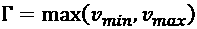
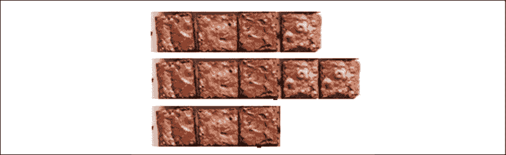
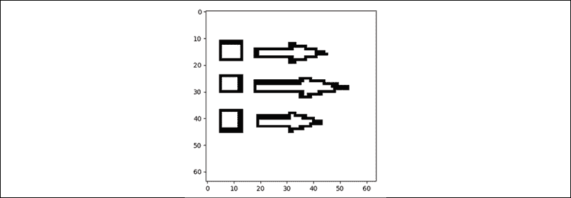
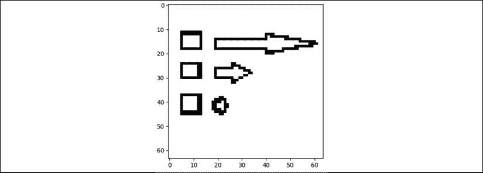
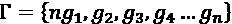
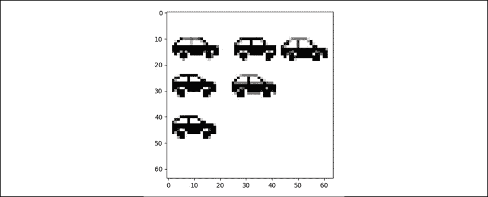
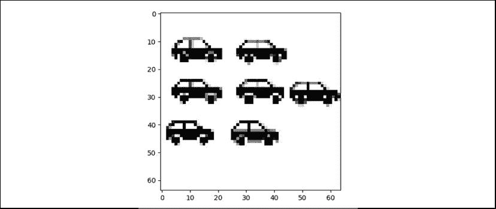
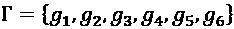
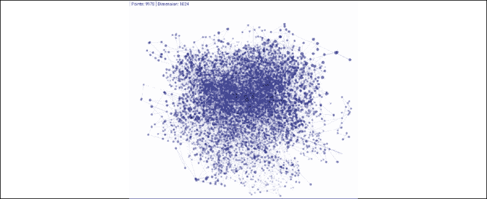

# 第十章：概念表征学习

理解前沿的机器学习和深度学习理论仅标志着你冒险的开始。你所获得的知识应该帮助你成为 AI 的远见者。把你所看到的一切都当作机会，看看 AI 如何融入你的项目。挑战极限并超越它们。

本章侧重于通过视觉表征进行决策，并解释导致**概念表征学习**（**CRL**）和**元模型**（**MM**）的动机，二者共同构成了**CRLMMs**。

概念学习是我们人类将世界从混乱分割为类别、类、集合和子集的能力。作为一个孩子和年轻人，我们获取了许多事物和概念的类别。例如，一旦我们理解了“洞”是什么，我们就可以将其应用于任何我们看到的某种空洞的事物：黑洞、墙上的洞、银行账户中的洞（如果钱丢失或透支了），以及数百种其他情况。

通过进行概念学习，我们人类不必在每种情况中反复学习相同的概念。例如，洞就是洞。所以当我们看到一个新的情况，比如火山口时，我们知道它只是一个“大的”洞。我在职业生涯初期就注册了一个 word2vector 专利。然后，我迅速将其应用到 concept2vector 算法中。随后，我成功设计并开发了 CRLMM 方法，用于**自动规划和调度**（**APS**）软件、认知聊天机器人等，正如我们将在接下来的章节中看到的那样。元模型一词意味着我将一个单一模型应用于多个不同领域，就像我们人类做的那样。

概念表征还提供了概念的视觉图像。为了进行规划，人类需要可视化必要的信息（事件、位置等）以及更关键的*视觉维度*，比如*图像概念*。人类思维通过*心理图像*进行。当我们思考时，心理图像与数字、声音、气味和感觉一起流经我们的思维，将我们的环境转化为类似视频片段的奇妙多维表征。

本章将涉及以下主题：

+   CRLMM 方法的三步法：

    +   转移学习以避免为每个类似案例的变化开发新程序

    +   域学习，以避免每次域发生变化时都开发一个新程序

    +   使用 CRLMM 的动机

    多年来，我已经成功地在 C++、Java 和逻辑编程（Prolog）中以多种形式在企业网站上实现了 CRL。在本章中，我将使用 Python 通过 TensorFlow 2.x 来说明这一方法，使用在*第九章*，*使用卷积神经网络（CNNs）进行抽象图像分类*中构建的**卷积神经网络（CNN）**。

+   使用 CNN 模型的转移学习来泛化图像识别

+   域学习，将在一个领域训练的图像识别扩展到另一个领域

我们将从本章开始，探讨迁移学习的好处，以及概念学习如何促进这一过程。

# 通过迁移学习创造利润

迁移学习意味着我们可以在另一个类似的案例中使用我们设计和训练过的模型。这会使模型非常有利可图，因为我们不需要为每个新案例设计一个新模型或编写一个新的程序。这样，你就能通过降低新实现你训练过的模型的成本，为公司或客户创造利润。把一个好的 AI 模型看作是一个在类似案例中可以重复使用的工具。这就是为什么概念学习更具普遍性和抽象性且有利可图的原因。这是我们人类适应的方式。

在推理和思考方面，我们通常会使用一些词语配合心象。我们的思维包含概念，我们基于这些概念构建解决方案。

来自*第九章*的训练模型，*基于卷积神经网络（CNNs）的抽象图像分类*，现在可以对某一类型的图像进行分类。在本节中，训练过的模型将被加载，并通过迁移学习进行泛化，以便分类类似的图像。

你会注意到，我在例子中没有使用太多的图像。我的目标是解释过程，而不是深入讨论如何构建大规模数据集，因为那本身就是一个任务。主要目标是*理解*CNNs 和概念学习表示。

## 迁移学习背后的动机

迁移学习提供了一种成本效益高的方式，可以在同一公司内部将训练好的模型用于其他目的，例如在*第九章*中描述的食品加工公司，*基于卷积神经网络（CNNs）的抽象图像分类*。

本章描述了食品加工公司如何将模型用于其他类似的目的。

成功做到这一点的公司将逐步推广解决方案的应用。通过这样做，演绎抽象将发生，并推动其他 AI 项目，这将为公司的管理层和提供解决方案的团队带来丰硕的成果。

### 演绎思维

演绎使用推论来得出结论。例如，食品加工传送带上缺少产品将导致包装生产力问题。如果不足够的产品到达包装环节，整个生产过程将会放慢。

通过观察公司其他领域的相似问题，管理人员会得出推论，例如*如果产品流经工艺流程的数量不足，生产将会放慢*。

### 演绎抽象

负责提升公司效率的项目团队需要找到问题的*抽象表示*，以通过组织或软件实施解决方案。本书主要讨论解决问题的 AI 方面。组织过程需要定义 AI 如何融入其中，并进行多次现场会议。

### AI 需要解决的问题

在这个特定的例子中，工厂的每个部门都有一个每小时或每天定义的**最优生产速率**（**OPR**）。每小时的 OPR 方程可以总结如下：

OPR : min(`p`(`s`)) <= OPR <= max(`p`(`s`))

其中：

+   `p`是给定部门的生产速率（工厂的不同生产部门）`s`。

+   `p`(`s`)是该部门的生产速率。

+   min(`p`(`s`))是历史最低值（经过几个月的反复试验和分析）。低于该水平，整个生产过程将减速。

+   max(`p`(`s`))是历史上的最大值。超过该水平，整个生产过程也会减速。

+   OPR 是最优生产速率。

第一次看到这个方程时，它看起来很难理解。困难之处在于你需要将过程可视化，而这正是本章的目标。每个仓库、行业和服务都使用生产速率作为约束，以达到盈利水平。

可视化要求在两个层次上进行表示：

+   确保如果包装部门没有收到足够的产品，它将不得不减慢生产速度，甚至有时停止生产。

+   确保如果包装部门收到过多的产品，它将无法进行包装。如果输入是没有中间存储的传送带（现代趋势），那么必须减慢速度，从而减缓或停止之前阶段的生产过程。

在这两种情况下，减慢生产将导致糟糕的财务结果和通过延迟交付造成的严重销售问题。

在这两种情况下，OPR 差距是一个问题。为了解决这个问题，需要另一个层次的抽象。首先，让我们把 OPR 方程分成两部分：

OPR >= min(`p`(`s`))

OPR <= max(`p`(`s`))

现在，让我们通过方差变量`v`来找到一个更高的控制水平：

`v`[min] = |OPR – min(`p`(`s`))|

`v`[max] = |OPR – max(`p`(`s`))|

`v`[min]和`v`[max]分别是两种情况下方差的绝对值（分别是产品不足以生产和生产过多的情况）。

最终的表示是通过一个控制、检测和学习速率来完成的（希腊字母 gamma）：



给定公司某一部门的最优生产速率与其最小速度（每小时产品数）之间的方差将导致下游部门的减速。例如，如果生产的蛋糕太少（`v`[min]），蛋糕包装部门将会等待并不得不停止生产。如果生产的蛋糕过多（`v`[max]），该部门将不得不减慢生产速度或停止生产。两者都会在无法轻松管理中间存储的公司中造成问题，这对于食品加工行业来说尤其如此。

通过这一单一的概念，正如在*第九章*中介绍的*卷积神经网络（CNN）在图像分类中的应用*，TensorFlow 2.x CNN 可以开始学习一个基本的生产概念：什么是物理差距。让我们回到人类身上。一旦我们理解了“差距”是某种洞或空白空间，我们就能通过这个差距概念识别并表示数千种情况，这里我们把它转换成一个名为 gamma 的参数（）。让我们先探索这个概念，然后进行实现。

## 差距概念

教授 CNN 差距概念将有助于它将思维能力扩展到许多领域：

+   如前所述的生产中的空隙

+   自驾车可进入的车道上的空隙

+   任何不完整或有缺陷的区域

+   任何开启或窗口

让我们教给 CNN差距概念，或者简单来说，。差距的符号是希腊字母“gamma”，所以它简单地发音为“gamma”。因此，我们引导 CNN 学习如何识别一个我们称之为 gamma 的差距（）。目标是让 CNN 理解抽象概念——一个空白空间或洞，表示为*gap*（差距）和希腊字母 gamma（）。

为了实现这个目标，*第九章*中训练并保存的 CNN 模型——*卷积神经网络（CNN）在图像分类中的应用*——现在需要被加载并使用。为了理解概念的含义，可以想象一下，如果没有足够的客户订单，或者到处堆满了未完成的产品，所带来的成本。物理差距的财务转化表现为设定目标上的利润**差异**。我们都知道，这些差异会带来多么大的痛苦。

## 加载训练好的 TensorFlow 2.x 模型

技术目标是加载并使用训练好的 CNN 模型，然后将相同的模型应用于其他类似的领域。实践目标是教会 CNN 如何使用 **概念**来增强调度、聊天机器人及其他应用程序的思维能力。

加载模型有两个主要功能：

+   加载模型以编译并分类新的图像，而不进行模型训练

+   层层显示所用的参数，并展示在学习和训练阶段达到的权重

在接下来的部分中，我们将加载并显示模型，而不进行训练。

### 加载并显示模型

使用`READ_MODEL.py`读取保存的模型时，只需要有限数量的头文件，如下所示：

```py
import tensorflow as tf
from tensorflow import keras
from tensorflow.keras import datasets, layers, models
import matplotlib.pyplot as plt
from keras.preprocessing.image import load_img
from keras.preprocessing.image import img_to_array
import numpy as np
from PIL import Image
#Directory
directory='dataset/'
print("directory",directory) 
```

现在从文件中加载已保存的`model3.h5`模型，如下所示：

```py
#____________________LOAD MODEL____________________________
loaded_model = keras.models.load_model(directory+"model/model3.h5")
print(loaded_model.summary()) 
```

加载的模型需要进行编译：

```py
# __________________compile loaded model
loaded_model.compile(loss='binary_crossentropy', optimizer='rmsprop', metrics=['accuracy']) 
```

读取并显示模型并非一项形式主义操作。

打印结构提供了有用的信息：

```py
print("GLOBAL MODEL STRUCTURE")
print(loaded_model.summary()) 
```

训练后的模型可能在所有数据集上都能或不能正常工作。在这种情况下，以下输出将指示可以通过其结构修复的问题，例如如下所示：

```py
MODEL STRUCTURE
Model: "sequential"
_________________________________________________________________
Layer (type)                 Output Shape              Param #   
=================================================================
conv2d (Conv2D)              (None, 62, 62, 32)        896       
_________________________________________________________________
max_pooling2d (MaxPooling2D) (None, 31, 31, 32)        0         
_________________________________________________________________
conv2d_1 (Conv2D)            (None, 29, 29, 32)        9248      
_________________________________________________________________
max_pooling2d_1 (MaxPooling2 (None, 14, 14, 32)        0         
_________________________________________________________________
flatten (Flatten)            (None, 6272)              0         
_________________________________________________________________
dense (Dense)                (None, 128)               802944    
_________________________________________________________________
dense_1 (Dense)              (None, 1)                 129       
=================================================================
Total params: 813,217
Trainable params: 813,217
Non-trainable params: 0 
```

一旦展示了全局结构，就可以查看每一层的结构。例如，我们可以查看`conv2d`层：

```py
DETAILED MODEL STRUCTURE
{'name': 'conv2d', 'trainable': True, 'batch_input_shape': (None, 64, 64, 3), 'dtype': 'float32', 'filters': 32, 'kernel_size': (3, 3), 'strides': (1, 1), 'padding': 'valid', 'data_format': 'channels_last', 'dilation_rate': (1, 1), 'activation': 'relu', 'use_bias': True, 'kernel_initializer': {'class_name': 'GlorotUniform', 'config': {'seed': None}}, 'bias_initializer': {'class_name': 'Zeros', 'config': {}}, 'kernel_regularizer': None, 'bias_regularizer': None, 'activity_regularizer': None, 'kernel_constraint': None, 'bias_constraint': None}
{'name': 'max_pooling2d', 'trainable': True, 'dtype': 'float32', 'pool_size': (2, 2), 'padding': 'valid', 'strides': (2, 2), 'data_format': 'channels_last'} 
```

每个参数都包含非常有用的信息。例如，`'padding':'valid'`表示未应用填充。在此模型中，卷积核的数量和大小在没有填充的情况下提供了令人满意的结果，形状逐渐减小直到最终的状态层（分类），如下所示：

```py
initial shape (570, 597, 4)
lay: 1 filters shape (568, 595, 3)
lay: 2 Pooling shape (113, 119, 3)
lay: 3 filters shape (111, 117, 3)
lay: 4 pooling shape (22, 23, 3)
lay: 5 flatten shape (1518,)
lay: 6 dense shape (128,)
lay: 7 dense shape (1,) 
```

然而，假设你想控制某一层的输出形状，以便空间维度不会比必要的更快地减小。一个原因可能是下一层将探索图像的边缘，我们需要使用适合形状的卷积核来进行探索。

在这种情况下，可以通过`0`值添加大小为 1 的填充，如以下矩阵所示：

| 0 | 0 | 0 | 0 | 0 | 0 |
| --- | --- | --- | --- | --- | --- |
| 0 | *`1`* | *`3`* | **24** | *`4`* | 0 |
| 0 | *`3`* | *`7`* | *`8`* | *`5`* | 0 |
| 0 | *`6`* | *`4`* | *`5`* | *`4`* | 0 |
| 0 | *`5`* | *`4`* | *`3`* | *`1`* | 0 |
| 0 | 0 | 0 | 0 | 0 | 0 |

大小为 2 的填充会在初始形状的周围添加两行和两列。

考虑到这一点，通过添加尽可能多的选项来微调训练模型，将提高结果的质量。可以通过逐层提取已保存模型文件中的权重来查看权重，如以下代码片段所示：

```py
print("WEIGHTS")
for layer in loaded_model.layers:
    weights = layer.get_weights() # list of numpy arrays
    print(weights) 
```

分析程序使用的权重将提供有关优化过程如何进行的有用信息。有时，程序可能会卡住，权重看起来可能不太对劲。毕竟，CNN 和其他程序一样，可能包含一些不完美的地方。

查看以下输出，例如，可以帮助理解系统出错的地方：

```py
WEIGHTS
[array([[ 6.25981949e-03,  2.35006157e-02, -1.28920656e-02, ...,
        -8.34930502e-03,  2.00010985e-02, -1.84428487e-02],
       [-1.01672988e-02,  1.87084991e-02,  2.49958578e-02, ...,
        -2.92361379e-02, -2.33592112e-02, -1.64737436e-03],
       [-2.71108598e-02,  2.53492035e-03, -2.90711448e-02, ..., 
```

现在我们可以使用已加载并检查过的模型。

### 加载模型以便使用

使用`CNN_CONCEPT_STRATEGY.py`加载模型需要有限数量的头文件，如下所示：

```py
import tensorflow as tf
from tensorflow import keras
from tensorflow.keras import datasets, layers, models
import matplotlib.pyplot as plt
from keras.preprocessing.image import load_img
from keras.preprocessing.image import img_to_array
import numpy as np
from PIL import Image 
```

加载模型是通过使用与之前描述的`READ_MODEL.py`相同的代码完成的。一旦加载模型，使用`model.compile`函数编译模型，如下所示：

```py
# __________________compile loaded model
loaded_model.compile(loss='binary_crossentropy', optimizer='rmsprop', metrics=['accuracy']) 
```

用于此示例的模型和图像识别功能已分为两部分实现。首先，我们使用以下函数加载和调整图像的大小，例如：

```py
def identify(target_image):
    filename = target_image
    original = load_img(filename, target_size=(64, 64))
    #print('PIL image size',original.size)
    if(display==1):
        plt.imshow(original)
        plt.show()
    numpy_image = img_to_array(original)
    inputarray = numpy_image[np.newaxis,...] # extra dimension to fit model
    arrayresized=np.resize(inputarray,(64,64))
    #print('Resized',arrayresized) 
```

模型期望输入数组中有一个额外的维度来进行预测，因此需要添加一个维度以适应模型。在此示例中，需要一次识别一张图像。

我添加了以下两个预测方法，并返回其中一个：

```py
#___PREDICTION___
    prediction = loaded_model.predict_proba(inputarray)
    return prediction 
```

有两种预测方法，因为基本上，在项目实施阶段，CNN 中的每个组件都需要进行检查，以选择最佳和最快的组件。要测试`prediction2`，只需更改`return`指令。

一旦 CNN 开始运行，可能会很难发现问题所在。在构建网络时检查每一层和组件的输出，可以在完整模型生成成千上万的结果后节省微调时间。

以下示例检测了食品加工厂中传送带上的产品  **空隙**。该程序加载存储在`classify`目录中的第一张图像并预测其值。程序描述了预测结果：

```py
MS1='productive'
MS2='gap'
s=identify(directory+'classify/img1.jpg')
if (int(s)==0):
    print('Classified in class A')
    print(MS1) 
```

该程序显示（可选）如下所示的形状图像，表示传送带在该点上有足够数量的产品：



图 10.1：输出（形状图像）

程序随后做出并显示预测`0`，这意味着在该生产线的传送带上没有发现实际的空隙：

```py
directory dataset/
Strategy model loaded from training repository.
image dataset/classify/img1.jpg predict_proba: [[ 0.]] predict: [[ 0.]]
Classified in class A
Productive
Seeking... 
```

`Seeking...`表示程序将在分类方向分析第二张图像。它加载、显示并预测其值，如下所示：


图 10.2：输出（形状图像）

预测（*值* = 1）正确检测到了传送带上的空隙，如下所示的输出：

```py
image dataset/classify/img2.jpg predict_proba: [[ 1.]] predict: [[ 1.]]
Classified in class B
gap 
```

现在，CNN 的预测结果已被验证，实施策略需要获得批准。CNN 包含了应用数学的奇迹。CNN 本身就是深度学习的代表。研究人员可能会花费数百小时研究它们。

然而，商业世界中的应用数学需要考虑盈利。因此，CNN 的各个组件似乎是不断发展的概念。添加的卷积核、激活函数、池化、扁平化、全连接层以及编译和训练方法，作为架构的起点，而非最终结果。

#### 使用迁移学习实现盈利或看到一个项目被停止

在某些时刻，公司将要求成果，并可能在未能交付这些成果时搁置项目。如果电子表格能够提供更快速且足够的解决方案，深度学习项目将面临潜在的竞争和拒绝。许多学习人工智能的工程师在接触真正的 AI 项目之前，必须先担任标准 SQL 报告专家的角色。迁移学习是一个有利可图的解决方案，可以提高 IT 部门的可信度。

迁移学习似乎是目前构建和训练 CNN 程序的成本问题的解决方案。你的模型可能通过这种方式带来回报。其思想是让一个基础的 AI 模型为你的客户和管理层快速带来利润。然后，你将获得大家的关注。为此，你必须定义一个策略。

### 定义策略

如果一位深度学习 CNN 专家对高级经理说这个 CNN 模型可以分类 CIFAR-10 图像中的狗、猫、汽车、植物等，那么答案可能是，*那又怎样？我的三岁孩子也能做到。事实上，我的狗也能！*

会议中的 IT 经理甚至可能脱口而出，“我们现在已经拥有所有决策工具了，而且我们的利润在增长。为什么还要投资 CNN？”

向现实世界公司营销 AI 的核心问题在于，它首先依赖于对 CNN 必要性的信仰。电子表格、SQL 查询、标准自动化和软件完成了 99%的工作。大多数时候，许多工作并不需要 CNN 来替代；仅仅是自动化的电子表格、查询或标准的软件就足够了。几十年来，工作已经被分解成足够简单的部分，可以用基础软件取代人类。

在展示 CNN 之前，数据科学家必须先了解公司通过使用 CNN 能够赚取多少利润。

理解、设计、构建和运行 CNN（卷积神经网络）与业务并没有太大关系。我们在理解和运行这些复杂程序上投入的所有努力，如果不能证明解决方案能产生利润，最终将毫无意义。没有利润，实施成本无法回收，没人会听一个关于即使是非常优秀的程序的演示。

高效应用模型意味着先在公司一个领域实施，然后再扩展到其他领域，以实现良好的投资回报。

#### 应用模型

以食品加工公司为例，其中一个包装生产线存在性能问题。有时，随机地，传送带上会缺少一些蛋糕，如下图所示：


图 10.3：食品加工公司示例

为了启动一个具有成本效益的项目，可以在传送带上方安装一个便宜的网络摄像头。它每 10 秒钟拍摄一张随机样本图片，并处理它，以找出图像中央区域内的空隙。我们可以清楚地看到一个空白、缝隙或洞。如果检测到孔洞，意味着有些蛋糕未能成功进入传送带（生产错误）。

通过在某些蛋糕缺失时自动向生产机器人发送信号，可以提高 2%到 5%的生产率。生产机器人随后会向生产线发送信号，实时增加生产以弥补缺失的单位。这种类型的自动控制在各种自动化食品生产线上已有应用。然而，这为在生产线实施这一方法提供了一个低成本的起点。

### 通过将模型用于其他问题来实现盈利

假设食品加工实验在传送带上使用数据集类型`d[1]`和 CNN 模型`M`运作良好，这足以鼓励在同一公司中将其推广到另一个数据集`d[2]`。

迁移学习是指通过有限且具有成本效益的附加训练，从`M`(`d[1]`)到`M`(`d[2]`)，使用相同的 CNN 模型`M`。虽然会出现一些变化，但可以通过调整几个参数并根据一些基本的数据集准备规则处理输入数据来解决：

+   **过拟合**：当模型迅速适应训练数据，并且准确率达到 100%时，这可能是问题也可能不是问题。在传送带上分类孔的情况下，过拟合可能不会造成严重影响。形状总是相同的，环境保持稳定。然而，在不稳定的情况下，面对各种不同的图像或产品，过拟合会限制系统的有效性。

+   **欠拟合**：如果准确率降到较低的水平，例如 20%，那么 CNN 将无法工作。数据集和参数需要优化。也许需要增加`M`(`d[2]`)的样本数量，或减少，或者将其分成不同的组。

+   **正则化**：正则化通常涉及到解决`M`(`d[2]`)的泛化问题，而不是`M`(`d[2]`)的训练误差。可能需要改进激活函数，或者实现权重的方式需要关注。

你可以应用任意数量的方法来找到解决方案，就像标准软件程序的改进一样。

#### 迁移学习的结束和领域学习的开始

迁移学习可以用于此示例中的类似类型的物体或图像，如上所述。在同一公司内，使用相同模型训练越多相似的图像，将产生越高的投资回报率（ROI），并且这家公司会要求你提供更多的 AI 创新。

领域学习以*第九章*中描述的模型为基础，*卷积神经网络（CNNs）在抽象图像分类中的应用*，并能够对其进行泛化。泛化过程将引领我们进入领域学习。

# 领域学习

本节关于领域学习的内容架起了经典迁移学习（如前所述）与我在企业项目中发现的另一种领域学习应用之间的桥梁：教机器学习一个概念（CRLMM）。本章重点讲述的是如何教机器识别除食品加工公司外的其他情况中的空缺。

## 如何使用这些程序

你可以先阅读本章内容以理解概念，或先尝试运行程序。按你觉得最适合的方式进行。无论如何，`CNN_TDC_STRATEGY.py`加载训练好的模型（你无需在本章中重新训练），而`CNN_CONCEPT_STRATEGY.py`则用于训练模型。

### 本节中使用的训练好的模型

本节使用`CNN_TDC_STRATEGY.py`将训练好的模型应用于目标概念图像。`READ_MODEL.py`（如前所示）通过添加变量目录路径（用于`model3.h5`文件和图像）以及分类消息，已转换为`CNN_TDC_STRATEGY.py`，如下所示的代码：

```py
#loads,traffic,food processing
A=['dataset_O/','dataset_traffic/','dataset/']
MS1=['loaded','jammed','productive']
MS2=['unloaded','change','gap']
#____________________LOAD MODEL____________________________
loaded_model = keras.models.load_model(directory+"model/model3.h5")....") 
```

加载的模型现在针对待分类的图像：

```py
s=identify(directory+'classify/img1.jpg') 
```

模型的每个子目录包含四个子目录：

+   `classify`: 包含待分类的图像

+   `model`: 用于分类图像的训练好的`model3.h5`模型

+   `test_set`: 概念图像的测试集

+   `training_set`：概念图像的训练集

现在我们已经探讨了模型的目录结构，接下来让我们看看如何在不同情况下使用它。

### 训练后的模型程序

对于本章，你不需要训练模型。它已经在*第九章*《使用卷积神经网络（CNN）进行抽象图像分类》中训练好。目录路径已经变成了变量，可以访问之前描述的子目录。路径可以像下面的代码那样调用：

```py
A=['dataset_O/','dataset_traffic/','dataset/']
scenario=3 #reference to A
directory=A[scenario] #transfer learning parameter (choice of images)
print("directory",directory) 
```

你无需为本章运行训练。模型已经在*第九章*《使用卷积神经网络（CNN）进行抽象图像分类》中训练好，并自动存储在书中提供的虚拟机的各自子目录中。这意味着当你需要检测各种类型图像的空隙时，你只需更改场景以适应你将从摄像头帧接收的图像类型：蛋糕、汽车、面料或抽象符号。

本章的重点是理解概念。你可以在不运行程序的情况下阅读本章，或者可以打开程序而不运行它们，或者运行它们——只要你觉得舒服。主要目标是掌握这些概念，为后续章节做准备。

我们已经加载了模型和场景。接下来，我们将使用训练好的模型来检测生产线是加载还是未加载。

## 空隙 – 已加载或未加载

空隙概念刚刚变成了一个多义性图像概念（多义性意味着不同的含义，如*第六章*《使用谷歌翻译创新 AI》所解释的那样）。

在蛋糕的情况下， 空隙在其 `g[1]` 子集的意义和概念中是负面的，并且应用于卷积神经网络（CNN），将其与负面图像 `n` + `g[1]` 联系起来：

*ng*[1] = {缺失、不足、降低生产效率...不好}

充满产品的图像是正面的，`p` + `g[2]`：

*pg*[2] = {良好的生产流，无空隙}

在这个例子中，CNN 学会了如何区分抽象表示，而不仅仅是像蛋糕那样的图像。另一个 （概念空隙数据集）子集是已加载/未加载的。“空隙”不是一个特定的对象，而是一个可以应用于数百种不同情况的普遍概念。这就是我使用“概念空隙数据集”一词的原因。

以下是已加载的抽象图像。方框代表生产机器，箭头表示加载时间。

这意味着 `x` 轴代表时间，`y` 轴代表机器生产资源：



图 10.4：抽象图像 1

CNN 模型运行并产生以下结果：

```py
directory dataset_O/
Strategy model loaded from training repository.
image dataset_O/classify/img1.jpg predict_proba: [[ 0.]] predict: [[ 0.]]
Classified in class A
loaded
Seeking... 
```

CNN 将其识别为正确加载的模型。任务超出了简单的分类。系统需要识别它以做出决策。

另一张图像产生了不同的结果。在这种情况下，以下截图中出现了一个负载不足的空隙：



图 10.5：抽象图像 2

并且 CNN 输出不同的结果，如下所示：

```py
Seeking...
image dataset_O/classify/img2.jpg predict_proba: [[ 1.]] predict: [[ 1.]]
Classified in class
unloaded 
```

将“未装载”视为“欠载”。无论如何，未装载或欠载代表空的空间。空隙概念已将`g[3]`和`g[4]`添加到其数据集中。现在我们有：



中的四个`g[1]`到`g[4]`子集是：

*ng*[1] = {缺失、不足、生产缓慢……不好}

*pg*[2] = *pg*[2] = {良好的生产流动，无空隙}

`g[3]` = {已装载}

`g[4]` = {未装载}

剩下的问题将需要一些时间才能解决。`g[4]`（空隙）有时可以代表一个机器的机会，尤其是当它的工作负载不佳时，可能会有更多生产空间。在某些情况下，`g[4]`会变成*pg*[4]（`p` = 正面）。在其他情况下，如果生产速度下降，它将变成*ng*[4]（`n` = 负面）。

在本节中，我们了解了如何识别生产线中的“空隙”。如前所述，“空隙”是一个通用概念，指的是任何地方的空白区域。接下来，我们将探索堵塞或“畅通”交通车道。

## 空隙 – 堵塞或畅通车道

本章中的模型可以扩展到其他领域。自动驾驶汽车需要识别自己是否处于交通堵塞中。此外，自动驾驶汽车还必须知道在检测到足够空间（空隙）时，如何变换车道。

这会生成两个新的子集：

`g[5]` = {交通堵塞、交通繁忙……交通过多}

`g[6]` = {畅通车道、交通轻微……正常交通}

该模型现在能够检测到`g[5]`（交通堵塞），如下图所示：



图 10.6：交通堵塞示例

以下输出显示正确：

```py
directory dataset_traffic/
Strategy model loaded from training repository.
image dataset_traffic/classify/img1.jpg predict_proba: [[ 0.]] predict: [[ 0.]]
Classified in class A
jammed 
```

`g[6]`也显示正确，如下图所示：



图 10.7：交通堵塞示例

潜在的车道变换已经变得可能，如下代码所示：

```py
Seeking...
image dataset_traffic/classify/img2.jpg predict_proba: [[ 1.]] predict: [[ 1.]]
Classified in class B
change 
```

我们已经将 CNN“空隙”检测模型应用于几种类型的图像。现在，我们可以更深入地探讨使用“空隙”作为示例的概念数据集理论。

## 空隙数据集和子集

此时，（空隙概念数据集）已经开始学习多个子集：



在其中：

*ng*[1] = {缺失、不足、生产缓慢……不好}

*pg*[2] = *pg*[2] = {良好的生产流动，无空隙}

`g[2]` = {已装载}

`g[3]` = {未装载}

*pg*[4] = {交通堵塞、交通繁忙……交通过多}

*ng*[5] = {畅通车道、交通轻微……正常交通}

请注意，`g[2]`和`g[3]`尚未有标签。食品加工上下文提供了这些标签。概念检测需要一个上下文，CRLMM 将提供这一点。

### 一般化（空隙概念数据集）

（空隙概念数据集）的一般化将为元模型提供一个概念工具。

（空隙概念数据集）指的是两元素（对象、位置或生产线上的产品）之间的负面、正面或未确定空间。

（gamma）也指时间中的空隙：过长、不过长、过短或不够短。

代表两个位置之间的距离：过远或过近。

可以表示两方之间的误解或理解：意见的分歧或趋同。

所有这些示例都指的是将空间和时间视为空间的空隙。

## 应用于维度的概念表示学习元模型的动机

CRLMM 将图像转换为概念。这些抽象概念随后会嵌入到向量中，成为 softmax 函数的 logits，进而转化为复杂人工智能程序的自动调度、认知聊天机器人等的参数。

概念的优势在于它可以应用于许多不同的领域。仅凭一个概念，“空隙”（一个洞，空白空间，等等），你就可以描述成百上千的情况。

在一些人工智能项目中，降维根本无法产生良好的结果。例如，在飞机、火箭和卫星发射器的维修调度中，成千上万的特征进入系统，没有任何遗漏。在火箭上，某个地方一个遗漏的螺丝可能导致灾难；在飞机的引擎中，一次错误可能引发事故；卫星的单一部件故障会影响其精度。

必须考虑维度问题。有些人使用“维度灾难”这个表达，而我更倾向于称之为“维度的祝福”。让我们来看看这两种方式。

### 维度灾难

给定项目的特征数可能达到非常大的数量。以下示例包含 1,024 个维度：



图 10.8：维度灾难

上述表示中的每个点代表一个维度，比如图像中的特征。

比如，要求 CNN 分析图像中的成千上万个特征，可能会导致无法得到准确的结果。由于每一层本应减少分析数据的规模以提取重要特征，过多的维度可能会使模型的训练变得不可能。记住，每个维度都可以包含需要训练的特征权重。如果维度过多，训练将变得既漫长又难以计算。

遵循标准的 CNN 设计提供了一个良好的起点。这种方法的局限性出现在结果未达到预期时，例如在接下来的章节中我们将要探讨的一些案例中。在这些情况下，CRLMMs 将提高解决方案的生产力，提供一个有用的抽象模型。

当一个解决方案需要大量未减少的维度时，卷积核、池化和其他维度减少方法无法应用，CRLMM 将为系统提供一副*眼镜*。这时，维度的“福音”就变得非常有用。

### 维度的福音

在一些项目中，当模型达到项目的极限时，维度性反而是一种福音。

让我们以使用我们的 CNN 模型制造火箭为例。我们想要识别表面上的裂缝。这些表面上有瓦片，用于保护火箭在穿越大气层时免于过热。瓦片之间的裂缝可能导致致命事故。

如果我们取出几块瓦片，拍一张照片并通过我们的 CNN 模型处理，它*可能*会检测到裂缝。这个概率与错误之间的差异可能意味着火箭的严重故障。

这意味着我们可能不希望减少特征的数量，这样就需要权重，并增加维度的高数字。

我们可以决定不使用池化（如我们所见，将多个维度合并为一个）。这可能会导致计算问题，正如我们在上一段所见。要么会有过多的权重需要计算，要么计算可能会花费太长时间。

在这种情况下，我们可以将框架的大小缩小到我们正在检查的火箭部件的最小部分。我们可以决定让我们的相机一次只扫描最小的表面，将最小尺寸的框架发送给我们的 CNN。

在这种情况下，即使没有池化，层中也会包含更多的数据，但计算仍然是合理的。

在这种情况下，维度的“福音”在于，避免池化（分组）后，我们检查更多的细节，这可以使我们的模型在检测微小裂缝时更加可靠，因为我们将其训练成能够看到非常小的裂缝。

维度的诅咒通常导致维度减少。但正如我们刚才看到的，情况不一定是这样。

# 总结

在本章中，*第九章*中构建的 CNN 架构，*使用卷积神经网络（CNN）进行抽象图像分类*，被加载用于分类食品加工公司中的物理裂缝。该模型使用图像概念，将 CNN 推向另一个层次。神经网络可以发挥其巨大的认知潜力，开启人工智能未来的大门。

然后，训练好的模型通过识别相似类型的图像来应用迁移学习。其中一些图像代表了导致训练好的 CNN 识别概念差距的概念。图像概念代表了一种创新潜力的途径，将认知引入神经网络中。

 概念差距被应用到不同领域，使用 CNN 作为训练和分类工具进行领域学习。

 概念差距有两个主要特征：负 n 差距和正 p 差距。为了区分这两者，CRLMM 提供了一个有用的附加工具。在食品加工公司中，在右侧的食品加工输送带上安装网络摄像头，为系统提供了判断差距是正向还是负向的背景。

牢记这些概念，让我们在下一章构建**高级规划与调度**（**APS**）的解决方案。

# 问题

1.  维度灾难导致在机器学习算法中减少维度和特征。（是 | 否）

1.  迁移学习决定了一个项目的盈利能力。（是 | 否）

1.  读取`model.h5`并不会提供太多信息。（是 | 否）

1.  没有意义的数字足以取代人类。（是 | 否）

1.  聊天机器人证明了肢体语言并没有那么重要。（是 | 否）

1.  目前的人工神经网络提供了足够的理论来解决所有的 AI 需求。（是 | 否）

1.  聊天机器人现在可以在所有情况下取代人类。（是 | 否）

1.  自动驾驶汽车已获得批准，不需要概念训练。（是 | 否）

1.  各行业可以实现 AI 算法来满足他们的所有需求。（是 | 否）

# 进一步阅读

+   更多关于 Keras 层的内容：[`keras.io/layers/about-keras-layers/`](https://keras.io/layers/about-keras-layers/)

+   更多关于概念学习的内容：[`www.sciencedirect.com/topics/psychology/concept-learning`](https://www.sciencedirect.com/topics/psychology/concept-learning)

+   更多关于认知科学、大脑和思维的概念模型：[`catalog.mit.edu/schools/science/brain-cognitive-sciences/`](http://catalog.mit.edu/schools/science/brain-cognitive-sciences/), [`symsys.stanford.edu/undergraduatesconcentrations/cognitive-science-cogsci-concentration`](https://symsys.stanford.edu/undergraduatesconcentrations/cognitive-science-cogsci-concentration)
