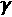

# 第十一章：结合强化学习与深度学习

亚马逊是全球领先的电子零售商之一，销售额超过 2500 亿美元。亚马逊的电子商店销售额超过了其其他所有业务，如 AWS 订阅服务（例如高级服务）、零售第三方卖家服务以及实体店。

本章聚焦于服装生产活动，这是亚马逊最近为其市场之一注册的专利。Prime Wardrobe 甚至提供试穿并轻松退货的服务。这一新活动需要进行规划和调度。亚马逊对此十分重视，并为服装制造系统控制其服装产品的生产过程注册了专利。

人工智能已经在服装行业的自动化规划和调度中发挥作用，从客户订单到交付全过程都涵盖在内。

谷歌成功地将深度学习与强化学习（Q 学习）结合在一个**深度 Q 网络**（**DQN**）中，该系统能够在视频游戏和其他任务中超越人类。谷歌的 AlphaGo DQN 取得了令人印象深刻的成绩。

本章不仅仅描述亚马逊的流程或特别是谷歌的流程。我还加入了我在现实生活中的实施案例，这些内容我们将从头开始使用 Python 进行探索和构建。因此，我们将结合多个系统（亚马逊、谷歌和我的实现）中的一些思想。

我们将通过将**概念表示学习元模型**（**CRLMM**）添加到强化学习中，为服装制造业带来创新。

我们将从零开始，逐步构建一个可以在现场实施的原型，基础设施正在为接下来的章节中的更多应用奠定基础。

本章将涵盖以下主题：

+   今天和明天的规划与调度

+   进一步概括第*10 章*中描述的 CRLMM，应用于服装生产过程中的概念表示学习

+   为 CRLMM 的**卷积神经网络（CNN）**提供来自生产线摄像头的帧的模拟输入

+   引入一个优化器，它将使用应用于生产站点的权重，通过奖励矩阵输入到**马尔可夫决策过程（MDP）**中，进而更新这些权重。

+   构建一个将在生产线中持续运行的程序（没有开始，也没有结束），并使用之前提到的三个组件。

我们将从今天和明天的规划与调度开始。市场正从预定的流程慢慢转向实时流程。让我们看看具体是如何做到的。

# 今天和明天的规划与调度

当亚马逊决定推出 Prime Wardrobe 时，它为客户带来了一个新服务，使他们能够订购、试穿并购买衣物、鞋子和其他配饰。客户可以建立一个购买计划。购买计划是一个在特定时间内需要完成的任务清单。购买计划的一个例子可能是：

+   将衣物放入箱子中

+   在家试穿衣物

+   如果衣物不合身，则退货

+   购买保留的商品

一旦客户同意按照这个计划进行，时间顺序变得至关重要：

+   首先，必须选择一个盒子。

+   然后，是一个配送期。

+   然后是一个试用期（你不能永远试用产品）。在此期间，客户可以选择不购买任何商品。

+   最终，客户确认购买。

无论亚马逊 Prime Wardrobe 是否能在未来几年继续作为一项服务，先例已然设立；就像实体书店每年消失一样，在线购买服装将继续扩展，并占据更多市场份额。

此外，企业将继续扩展其生产基地，成为制造与分销巨头。仓库将逐步取代许多商店，正如本书某些章节中所提供的仓库示例。

**供应链管理（SCM）**与 APS 相结合，已成为一种必需品。SCM-APS 约束在全球市场上不断变化（取决于制造商）。APS 代表先进的计划与调度或自动化的计划与调度。我们将在接下来的部分《实时制造革命》中探讨这两个概念的区别。我们将超越亚马逊对这一主题的处理，因为实时交付已成为市场上所有参与者的一个约束。

市场的压力促使亚马逊开始生产自有品牌服装。亚马逊已经推出了自有品牌的时尚标签，涵盖全球销售的服装和配饰。

为了证明其确实有意开展业务，亚马逊注册了多个专利，包括一项用于*混合现实镜子*、服装制造系统等的专利。有了混合现实镜子，顾客可以直观地看到衣物的合身效果。

在接下来的部分中，我们将深入探讨亚马逊服装自营生产计划的规划与调度方面，这将对服装工厂产生与以前对实体书店和所有类型商店相同的影响。许多新的工作将会出现，如人工智能领域、网站开发以及市场营销和 SCM 相关的数十万个工作岗位。同时，也将有许多工作消失。所做的改进将促进医疗进步，并且推动国防工业的发展。社会和经济的影响超出了本书的范围，可能也超出了我们的理解，就像历史上所有的颠覆性时代一样。

我们将详细关注亚马逊专利定制服装过程的主要方面。如前所述，无论是否成功，先例已经设定。

## 实时制造过程

今天，客户希望尽快获得购买的产品。如果等待时间过长，客户会转向其他地方。几乎实时交付已成为任何公司营销的关键概念。亚马逊的方法一直是实时的。突破了数百年的商业物理限制，亚马逊的品牌将制造过程推向了前沿。

### 亚马逊必须扩展其服务以应对竞争。

如果亚马逊继续从供应商那里购买产品，而不是自己制造，可能会避免许多动荡。研究人员花费大量时间开发能够解决传送带问题的人工智能时，可以通过安装几个传感器并使用传统软件解决方案来实现。

人类本可以继续使用马匹代替汽车，使用纸张代替计算机。在短期内，我们可以避免与这些技术的要求和影响相关的大量工作和变革。然而，从长远来看，最终获胜的是进步和创新。

一旦公司成功推出了一项颠覆性创新，竞争对手要么跟随，要么消失。亚马逊需要继续参与那些仅仅将商品存储在仓库之前的流程。例如，通过参与制造，亚马逊可以缩短将产品交付给客户所需的时间。于是，亚马逊提出了这项服装制造专利，并结合 3D 打印机等创新提高其生产力。

同样，人工智能领域也需要不断推动超越其不断扩展的舒适区。研究人员必须面临艰难的行业问题，积累经验，产生能够实现更高层次机器学习和应对更大挑战的新算法。

### 一场实时制造革命

尽管人工智能软件非常引人注目，但它并不是唯一改变我们生活的革命性技术。在 1950 年代和 1960 年代，消费者们正在发现购买新产品的乐趣，例如洗碗机、彩色电视和时尚收音机。他们为能够获得这些产品而感到无比高兴，以至于愿意等待几天甚至几周才能得到他们梦寐以求的具体型号。供应商可以将订单积压几天，然后再慢慢开始工作。

如今，消费者已经失去了那份耐心。如果某人想在线购买一件产品，它必须在几天内送到。如果不行，消费者就会转向其他供应商。这对供应商施加了压力，迫使其立即启动交付流程。实时性就是在你收到请求通知的几秒钟内开始着手完成事情的过程。

实时性是改变全球每一个过程的强大力量。

今天，服装制造业以及一般制造业都遵循先进的规划与调度过程。“先进”既指复杂的算法，也指预见性的（提前计划的）过程。AI 算法中提前规划的方面正在经历一场革命。

亚马逊和所有制造过程一样，需要自动化规划和调度以满足缩短的交货时间。

两个系统的根本区别是时间因素，以下对比表中有所显示。先进系统和自动化系统之间的差异看似微小，但像亚马逊这样的公司将通过这些差异改变历史进程。理论上，两种系统都可以完成这两种任务。在实践中，这些方法将在未来几年里在各自的细分领域中专业化。制造飞机时，一个复杂的*先进*算法仍然需要提前*计划*（几天到几周），并且需要大量人工决策。制造基本的 T 恤时，*自动化*规划可以快速且自动地在实时中完成（秒到小时）。

自动化规划与调度的趋势正成为先进规划与调度的压缩版。

以下表格中的数字并不反映准确的数值，而是反映趋势：

| **功能** | **先进的规划与调度** | **自动化的规划与调度** |
| --- | --- | --- |
| 长期计划 | 1 个月到 5 年 | 几天到不到一个月 |
| 短期计划 | 1 天 | 1 分钟 |
| 生产或事件测量 | 一般每日考虑 | 实时 |
| 调度 | 1 小时到 1 周 | 实时 |
| 有问题时的重新规划 | 1 小时到 1 个月 | 实时 |
| 重新调度 | 1 小时到 1 周 | 实时 |
| 资源调整 | 1 天到 1 个月 | 实时 |
| 负载均衡 | 1 小时到 1 周 | 实时 |
| 规划与调度的自动化功能 | 80% | 99% |

尽管这个表格包含的是近似信息，但背后的趋势非常强劲。我们已经看到了先进与自动化概念的区别，接下来我们也来澄清计划与调度之间的区别：

+   **计划**由为未来生产做准备的过程组成：采购物料组件、调整人力资源和物理资源。例如，亚马逊有一份年度商业计划：提前整合必要资源以准备生产。这意味着要采购或建设仓库、雇佣员工，以及采购基本物料资源（如箱子、标签和其他组件）。

+   **调度**是在较短时间范围内与时间因素对照的计划。调度决定了计划中的每个部分何时开始优先生产。例如，现在仓库已经建设或采购（计划），那么下周一和接下来的几周，包装工作应该在什么时间开始（调度）？

    日程可以看作是计划的放大版。

如果有人走进杰夫·贝索斯的办公室，带着在某个地点建立仓库的计划，说明实施的成本和大致时间安排，那是可以的。那个人正在呈现一个为期两年的项目。这个项目将在 10 个月后启动，并持续两年。

然后，那个人可能（我建议不要！）说：“*计划很棒，因为 10 个月后就能完成。但我担心 1 年后第二班次下午 4 点的日程安排。他们应该在早上 7:30 开始，还是 7:45？*”杰夫·贝索斯将不再听。他不会关注这个细节。那个级别不在他的工作描述中。他必须专注于更高层次的事务。对于一位高层管理者来说，知道一年后下午 4 点会发生什么是毫无意义的！

一个先进的计划与排程系统通常从企业资源规划（ERP）中导入数据，以制定未来的计划。而自动化计划与排程程序则主要通过传感器检测数据，实时反应并优化。当前章节讨论的是自动化计划程序，而不是先进的计划与排程系统。

将先进的 APS 与自动化 APS 之间的演变视为应用于计划排程时间压缩的后勤 sigmoid 函数。以下是一些例子：

+   先进的制造汽车计划跨度为 1 个月到 1 年。

+   自动化计划的谷歌地图行程，用于自动驾驶汽车在起点的时间：几秒到一分钟，具体取决于该地点的连接状态。

+   制造一辆汽车的时间表：1 天到 1 个月。

+   按照谷歌地图行程来驾驶自动驾驶汽车的时间表 = *实时*

总结来说，当前的趋势代表了人类过程历史上的一场革命。

亚马逊的制造专利反映了实时应用革命在各个领域的变革。

规划已转向实时规划，如下方公式所示：


其中：

+   `x` 是生产的数量或任何单位事件。

+   `t[x]` 是 `x` 开始和结束所需的时间 (`t`)。

+   一个后勤函数会压缩 `t[x]`。

+    (lambda) 是学习因子；一个任务执行得越多，它就越被优化。

`Xₜ` 是在给定时间 `t` 下，一组 `n` 个任务的总权重：

`Xₜ` = {`x₁`, `x₂`, `x₃` … `xₙ`}

`Xₜ` 和 `Z`(`Xₜ`) 之间的差异是：

+   `Xₜ` 是制造产品所需的实际时间。

+   `Z`(`Xₜ`) 不是实际所需的时间。`Z`(`Xₜ`) 是一个激活函数的结果，它将时间作为 `Xₜ` 在 RL-DL-CRLMM 网络中的输出进行压缩。`Z`(`Xₜ`) 是一个权重因子。

进一步减少权重因子的关键是物理生产过程和其他物理事件（例如输出等），我称之为 lambda： 代表了所有能够减少生产周期的现实生产改进，以及像生产输出等自然事件。

在*第十章*，*概念表示学习*中，被引入以减少差距。在本章中，将进一步概括，以优化。

这意味着 RL-DL-CRLMM 系统将优化制造过程。我们现在将探索一种改变游戏规则的自动化服装制造过程，并用 Python 构建它。

# 将 CRLMM 应用于自动化服装制造过程

亚马逊通过自动化的计划和调度系统，而不是先进的计划和调度系统，将服装制造带得更接近消费者。

人工智能将推动现有流程。在本节中，RL-DL-CRLMM 系统将优化服装制造过程。

## 服装制造过程

亚马逊的服装制造专利可以总结如下：

+   **P1**：按产品和尺寸对服装客户订单进行分组。这个过程自工业服装制造的起源以来就存在了。

+   **P2**：自动切割铺布。铺布是一叠布料。它就像在一叠几张纸上同时切割一个圆圈。

+   **P3**：将服装零件的包裹通过传送带移动到组装线（见*第十章*，*概念表示学习*）。

+   **P4**：根据产品的不同，执行其他操作（如包装、印刷或其他）。

+   **P5**：通过仓库和配送优化存储和分配过程，以及更多的流程（例如，跟踪和数据分析，找到迟到的配送并优化其路线）。

以下图表示了一个服装制造公司的生产流程。首先，布料被切割，然后堆叠在一堆堆中，通过传送带送到缝纫站以组装服装：


图 11.1：服装生产流程

一个网络摄像头安装在 P3 上方，即传送带上。下图展示了安装在传送带上的网络摄像头：


图 11.2：网络摄像头在传送带上冻结帧

网络摄像头每`n`秒冻结一帧（在红色矩形内）。该帧是稍后描述的 CRL-CNN 的输入。

这张图片是对概念的表示。实际上，网络摄像头可能位于传送带的起点，甚至在切割过程的输出上方。对于本章中的原型，请记住，每隔`n`秒钟，会将一个静止帧发送给训练过的 CNN。

这个 P1 到 P5 的流程图提供了一个服装制造过程的总体概念。在实际公司中，还需要更多的过程：市场调研、设计产品、测试原型、为牛仔裤增加制造工艺（例如，用激光打孔）等。

迄今为止描述的每个过程都是 30 多年前单独发明的，包括应用于服装行业的自动切割和输送带。对于许多阅读过亚马逊相关专利的服装专家来说，*这里有什么新鲜的？* 这一问题跃然心头。而这正是心智陷阱！认为亚马逊的服装专利没有包含新的组件是一个错误。

**时间压缩**是亚马逊创新过程的核心。将制造过程与消费者的需求几乎实时对接是一场颠覆性的革命。将 3D 打印机加入到时间压缩的方程式中，你将轻松想象我们未来的消费市场。然而，人工智能也有权进入优化竞争之中。

为了说明这一点，让我们构建一个优化 P3（输送带）的 AI 模型。虽然现有很多解决方案，但一个 RL+DL 很可能会胜过它们，就像在许多领域一样。

第一步是通过训练进一步推广 *第十章*，*概念表示学习* 中描述的  模型。然后，RL-DL-CRLMM 可以被建立。我们将首先探讨 CRLMM 如何被训练来分析生产中的网页帧。

## 训练 CRLMM

*第十章*，*概念表示学习*，介绍了 CRLMM，使用 （缝隙概念）来说明一个示例。

在前几章中，围绕 （缝隙概念）设计了概念子集，如下所示：

+   ，其中包含 *pg*[i] (`p` = 正向) 和 *ng*[i] (`n` = 负向子集)

+   *ng*[1] 是  的子集； *ng*[1] = {缺失， 不足，降低生产效率 … 不良},

+   *pg*[2] 是  的子集； *pg*[2] = *pg*[2] = {良好生产流动，无缝隙}

+   `g₂` = {已加载}

+   `g₃` = {未加载},

+   *pg*[4] = {交通堵塞，重度交通 … 交通过于拥堵}

+   *ng*[5] = {畅通车道，轻度交通 … 正常交通}

`CNN_STRATEGY_MODEL.py` 需要被训练来识别服装生产环境中的 ，并记住如何识别以前的  概念：

+   服装包在输送带（P3）上流动的切割段 P2（A 和 B）输出。

+   记住如何对食品加工公司的蛋糕进行分类，以便教模型识别更多情况。

+   记住如何进行交通分析（见 *第十章*，*概念表示学习*）。

+   学会如何分类缝隙的抽象表示。

### 推广单元训练数据集

为了推广单元训练数据集，创建了六种类型的图像。每个图像表示每隔 `n` 秒由摄像头拍摄的一帧图像，图像展示了一个经过输送带的场景。四张图像是具象的，具有具象绘画的意义。两张图像将 CRLMM 程序提升到了更高的抽象层次。

### 食品输送带处理 – 正向 p 和负向 n 缝隙

在食品加工行业的例子中（参见*第九章*，*使用卷积神经网络（CNN）进行抽象图像分类*），传送带上的间隙大多数时候是负的，*负伽马* = *n*。

以下画面显示第一条生产线已完成，但第二和第三条生产线尚未完成：


图 11.3：食品传送带处理框架

相反，当传送带上几乎没有间隙时，负载被视为正的，*正伽马* = *p*。

以下画面显示每条生产线的产品数量是可接受的：


图 11.4：食品传送带处理框架

如前面图像所示，无论传送带上的产品是什么，间隙始终是一个间隙，都是空的空间。我们现在将应用我们的模型来处理其他间隙，不论对象是什么。在这种情况下，我们将检测服装传送带上的间隙。

#### 服装传送带处理 – 未确定的间隙

在服装传送带的处理中，间隙通常是未确定的。这本身构成了一个主要的优化问题。当然，如果传送带为空或已饱和，方差将引起人工操作员的注意。然而，大多数时候，优化能够解决这个问题。

以下画面展示了相对较为满载的服装包生产流，服装需要在生产线上进一步组装（通过缝制）。


图 11.5：满载的生产流

以下画面清楚地显示了一个间隙，意味着将送到缝制站的数量不会很高：


图 11.6：生产流（间隙）

为了优化这个问题，需要做几个观察：

+   传送带的实时问题排除了高级规划和调度。

+   这个问题需要实时自动化的规划和调度。

+   自动化规划和调度解决方案将必须同时进行实时规划和调度。

+   它将考虑规划约束（如以下章节所解释）来预测输出。

+   它将考虑调度约束，以优化缝制部分。

亚马逊等公司已经慢慢但坚定地将许多规划视野问题（更长时间的）缩短到更短的调度视野，将供应链管理（SCM）的极限推得越来越远。

#### 间隙抽象概念的开始

显示的间隙具有负面或正面属性，具体取决于上下文。CRLMM 模型现在需要学习所有前面提到的间隙的元概念抽象表示。这些间隙都是某种类型的流动间隙。某些东西正在从一个点移动到另一个点，且是以小包的形式进行的。因此，这些包的大小通常不同，这导致了间隙的产生。

这些概念可以应用于牛群、赛马、团队运动进攻（如足球、橄榄球、篮球、手球等各类领域）、奥运比赛、马拉松、传送带等诸多场景。

当流中的包接近时，个体的心理图像浮现出来。每个人都有一个定制版本。下图展示了一个无间隙概念的泛化表示：


图 11.7：一个无间隙概念的泛化表示

然后，包中有领导者和跟随者。接着，抽象表示也随之出现。下图展示了一个概念间隙的泛化表示：


图 11.8：一个间隙概念的泛化表示

人类对于他们观察的每个事物并没有流动检测间隙的功能。人类的大脑包含了物理记忆或其他数据集，但更重要的是，他们还拥有抽象数据集。

我们每一个数十亿的思维类人双足动物都拥有极其高效的抽象数据集。前面展示的元概念意味着通过推理，人类拥有一个中心元概念，并通过经验将符合它的记忆数据集融入其中。

一个元模型使用这些数据集。`dataset`目录中的数据集包含了一个 CRLMM 系统的起始部分。程序将学习什么是*流间隙*，然后通过分析上下文将其应用于它所看到的事物。

这个数据集的目标是导向一个 CRLMM，正如以下章节所解释的那样：

+   抽象学习到的元概念应用于一个情境；在此情况下是一个框架。

+   CRLMM 随后确定这是一个间隙情况还是非间隙情况。

+   然后，CRLMM 会做出决策，使用基于决策权重导向激活函数的思维优化器。这意味着它不仅仅是一个数学上的*squash*。它在*权衡*决策过程中的利弊。

在本节中，我们的 CRLMM 已经学会了识别服装传送带上的间隙。如果我们要实现这一点，我们需要将项目中的传送带的多个网页框架添加到我们的数据集中进行训练。现在，让我们继续使用这个例子并运行预测程序来分类间隙。

### 运行预测程序

训练使用了同样的`CNN_STRATEGY_MODEL.py`程序，该程序在*第九章*，*基于卷积神经网络（CNNs）的抽象图像分类*中有描述，旨在为后续章节提供通用模型。

一旦上一节的数据集安装完成，模型即可在不同领域进行预测，无需进一步训练。

相同的`CNN_CONCEPT_STRATEGY.py`函数在*第十章*，*概念表示学习*中已进行了实现。

只修改了数据集的路径，以及需要显示的预测信息：

```py
#II. Convolutional Neural Network (CNN)
#loads,traffic,food processing
A=['dataset_O/','dataset_traffic/','dataset/']
MS1=['loaded','jammed','productive']
MS2=['unloaded','change','gap']
display=1     #display images
scenario=2    #reference to A,MS1,MS2
directory=A[scenario] #transfer learning parameter (choice of images)
CRLMN=1       # concept learning
print("Classifier frame directory",directory) 
```

CRLMM 现在已经学会了表示现实生活中的记忆和与之相关的推理，在一个元概念中。我们的 CRLMM 准备好组装成 RL-DL-CRLMM 的三个组成部分之一，正如我们将在下一节中看到的那样。

# 构建 RL-DL-CRLMM

RL-DL-CRLMM 程序的完整代码是 `RL_DL.py`。它是建立在前几章和本章前几节的知识与程序基础上的。

RL-DL-CRLMM 包含三个组件：

+   一个 CRLMM 卷积网络，将分析每一帧它从位于切割部分传送带上方的网络摄像头接收到的画面，这些画面包含着服装包的图像。

+   一个使用修改版 `Z`(`X`) 的优化器，实时规划装配站的加载方式。

+   一个 MDP，将接收优化器函数的输入，并调度装配站的工作。它还会产生修改过的 `Z`(`X`) 更新值，用于下一帧中每个装配站的权重。

在物理世界中，传送带传输服装包，每 `n` 秒拍摄一张图片（帧），并且 RL-DL-CRLMM 运行。RL-DL-CRLMM 的输出将指令发送到传送带，并指导服装包进入优化后的装配站负载，如前所述。

由于 `RL_DL.py` 描述了一个连续的 RL-DL-CRLMM 过程，程序没有明确的开始或结束。各个组件是独立的，由输入触发，并通过输出触发其他组件。

因此，组件将按照处理顺序进行描述，而不是按代码内联顺序。这是因为通过 `def` + `function()` 定义的函数先于它们的调用。代码行号将被插入到代码行后的注释中，格式如下：`# [Line 38]`。

## 一个循环过程

一旦系统的三个主要组件（CNN、MDP、优化器）就位，这个 RL-DL-CRLMM 的循环特性就形成了一个类似流动的系统，永远没有开始也没有结束。

为了定义一个循环过程，我们以一个日常例子为例。顾客 C 去超市购买商品。该商品之前存储在我们命名为 B 的仓库中。一个名为 A 的工厂生产了这个商品。如果你观察整个供应链的某一时刻，你会发现它没有明确的起点或终点：

+   如果你是 A，你需要监控 C 的需求，以便将产品发送给 B。

+   如果你是 B，你需要监控从 A 传来的信息，以满足 C 的需求。

+   如果你是 C，你正在为 A 创造需求，要求其向 B 交付产品。

在现实生活中的供应链中，没有开始也没有结束。同样适用于自动化生产现场中这一几乎没有记忆的系统中的功能流。传送带的网络摄像头提供了一系列帧，迫使系统进入类似流动的循环行为。

## 实现一个 CNN-CRLMM 来检测间隙并进行优化

CNN-CRLMM 函数在 *运行预测程序* 部分和 *第十章*、*概念表示学习* 中有所描述。预测函数是后续 MDP 输出分析的一部分。`CRLMM` 函数按如下代码调用：

```py
def CRLMM(Q,lr,e):    # [Line 180] 
```

该函数的第一部分压缩了下一节中描述的 `W` 向量。第二部分分析输入帧。

由于此时系统未连接任何网络摄像头（这必须在项目实施过程中完成），因此做出了随机选择一帧图像的决定。以下随机代码模拟了现实生产中随机发生的情况：

```py
 status=random.randint(0,1) 
```

在现实情况中，随机数量的物品会通过传送带。当状态被确定后，CNN 模拟从直接位于传送带上的网络摄像头获取的视频流中添加一帧冻结图像。它运行前面描述的身份（图像）函数，并返回优化器的 `gap` 或 `no gap` 场景（参见优化器部分）。以下代码描述了一个缺口识别过程：

```py
 if(status==0):
        #Add frame from video stream (connect to webcam)
        s=identify(directory+'classify/img1.jpg',e)
    if(status==1):
        #Add frame from video stream (connect to webcam)
        s=identify(directory+'classify/img2.jpg',e)
    s1=int(s[0])
    if (int(s1)==0):
        print('Classified in class A')
        print(MS1[scenario])
        print('Seeking...')
    if (int(s1)==1):
        print('Classified in class B')
        print(MS2[scenario])
    return s1 
```

一旦检测到 `status`，无论切割系统的负载输出是高还是低，都必须做出决策。这将通过 MDP 来完成。

## Q-learning – MDP

通过在此 CNN-CRLMM 程序中添加 MDP Q-learning 决策功能（见 *第一章*，*通过强化学习入门下一代人工智能*），我们现在进入了认知 RL-DL 程序的世界。

在这个实时系统中，没有开始，没有结束，也没有超出几帧的真实记忆。

`mdp01.py` MDP 程序已经并入 `RL_DL.py`。因此，本章仅描述所做的更改。

MDP 参数紧跟在导入包之后。图中的每个顶点都有其字母和位置，如下代码片段所示：

```py
L=['A','B','C','D','E','F']    # [Line 37] 
```

当程序运行时，以下图形将显示当前帧的红色（目标顶点）。接下来由 MDP 做出选择，具体描述如下：


图 11.9：输出（目标顶点）

注意，这是一个无向图，图中有顶点（彩色点）但没有边（线）方向。MDP 将为此模型中的每一帧提供方向。

在该模型中，每个顶点代表一个组装站。每个组装站都有高负载或低负载。由于产品不断进出并进行生产，工作负载很少保持稳定。

### MDP 输入和输出

此模型中的 MDP 过程使用奖励矩阵作为输入，并生成一个权重向量。

#### 输入是一个中立的奖励矩阵

MDP 奖励矩阵被设置为 `0`，除非表示可以物理访问的图形边缘的值，这些设置为 `1`，是一个小的中立值。

如此，MDP 无法提供令人满意的结果，超出再现这个无向图的结构。奖励矩阵现在已经初始化并复制，如以下代码所示，从第 41 行开始；在第 43 行，`R`（奖励矩阵）被构建，而在`Ri`中，`R`的副本被创建：

```py
# R is The Reward Matrix for each state built on the physical graph    [Line 41]
# Ri is a memory of this initial state: no rewards and undirected
R = ql.matrix([[0,0,0,0,1,0],
               [0,0,0,1,0,1],
               [0,0,0,1,0,0],
               [0,1,1,0,1,0],
               [1,0,0,1,0,0],
               [0,1,0,0,0,0]])
Ri = ql.matrix([[0,0,0,0,1,0],
                [0,0,0,1,0,1],
                [0,0,0,1,0,0],
                [0,1,1,0,1,0],
                [1,0,0,1,0,0],
                [0,1,0,0,0,0]]) 
```

`Ri`是初始状态零奖励矩阵的副本。每当新的一帧开始时，`R`会被重置为`Ri`。MDP 以无记忆、无向图和无监督的方法训练每一帧的装配位置计划。

`Q`是学习矩阵，其中奖励将被学习/存储，如第 58 行代码所示：

```py
Q = ql.matrix(ql.zeros([6,6]))    # [Line 58] 
```

#### MDP 函数的标准输出

装配站的负载不是生产的精确数量。它们是权重，在这个连续过程中不断更新，后续章节将进一步解释这一点。

在程序的初始状态下，顶点的初始权重在以下代码行（第 40 行）中被设置为`0`：

```py
W=[0,0,0,0,0,0]    # [Line 40] 
```

权重向量（以数组表示）包含每个装配站位置或顶点的一个值。

初始状态不是一个真正的开始。它就像视频中的暂停按钮。初始状态可以来源于假期（没有生产）、维修日（没有生产）或缺少输入订单（没有生产）。初始状态只是一个权重等于`0`的情况，因为传送带或装配站上什么也没有。

权重向量是优化器的第一部分（见下文章节）。MDP 在优化无向图后生成一个输出矩阵。优化器将会提供一个目标。

程序包含与*第一章*、《通过强化学习开始使用下一代人工智能》中相同的源代码，贝尔曼方程从第 1166 行开始。MDP 生成其结果，如下输出所示：

```py
[[ 0\. 0\. 0\. 0\. 105.352 0\. ]
[ 0\. 0\. 0\. 130.44 0\. 201\. ]
[ 0\. 0\. 0\. 130.44 0\. 0\. ]
[ 0\. 161.8 105.352 0\. 105.352 0\. ]
[ 85.2816 0\. 0\. 130.44 0\. 0\. ]
[ 0\. 0\. 0\. 0\. 0\. 250\. ]]
Normed Q :
[[ 0\. 0\. 0\. 0\. 42.1408 0\. ]
[ 0\. 0\. 0\. 52.176 0\. 80.4 ]
[ 0\. 0\. 0\. 52.176 0\. 0\. ]
[ 0\. 64.72 42.1408 0\. 42.1408 0\. ]
[ 34.11264 0\. 0\. 52.176 0\. 0\. ]
[ 0\. 0\. 0\. 0\. 0\. 100\. ]] 
```

请记住，整个 DQN-CRLMM 不仅基于无向无记忆 MDP 函数，而且没有真正的开始和结束，因为它是一个连续且几乎无记忆的过程。

#### MDP 输出矩阵的图形解释

每次运行后，MDP 矩阵还会生成路径值的图形解释，即从一个顶点到另一个顶点（字母到字母）的路径，并显示在以下输出中：

```py
State of frame : 3 D
0 A E 161.8
1 B D 201.0
2 C D 201.0
3 D D 250.0
4 E A 130.44
4 E D 201.0
5 F B 161.8 
```

通过这种方式，如果从最高到最低的边（线条，进而是字母之间的值）中取值，它就能直观地展示 MDP 函数是如何通过图计算路径的。

`RL`是字母向量。每一帧后它为空。它将通过查找每条边的值来填充。它将包含由边（由值表示的线）连接的顶点（节点和点）的字母。

`RN`是边的值。以下代码展示了如何实现`RL`和`RN`并更新权重向量（`W`）中位置的权重：

```py
 #Graph structure    [Line 187]
    RL=['','','','','','']
    RN=[0,0,0,0,0,0]
    print("State of frame :",lr,L[lr])
    for i in range(6):
        maxw=0
        for j in range(6):
            W[j]+=logistic_sigmoid(Q[i,j])
            if(Q[i,j]>maxw):
                RL[i]=L[j]
                RN[i]=Q[i,j]
                maxw=Q[i,j]
                print(i,L[i],RL[i],RN[i]) 
```

上述代码中的逻辑函数在 `RL` 和 `RN` 被更新时也在不断更新。

## 优化器

我为服装行业的面料优化编写了多个优化器。在这个例子中，优化器将用于调节生产流程。

术语“优化器”并不是前几章中使用的 CNN `rmsprop` 优化器，它在以下代码中表示：

```py
loaded_model.compile(loss='binary_crossentropy', optimizer='rmsprop', metrics=['accuracy'])    # [Line 92] 
```

术语“优化器”指的是一种优化该制造站点生产的功能。它不是用于训练 CNN 的优化器。例如，这个优化器既是一个激活函数，又是一个调节器，从零开始构建，目的是优化生产。这表明，有时你需要发明所需的优化器，以为客户或公司生成一个有利可图的解决方案。

### 优化器作为调节器

这个实时生产的 RL-DL-CRLMM 概念应用于 P3，目的是优化 `Z`，使其在组装站的负载分配上达到最佳，正如之前所解释的那样。这意味着通过以下方程尽可能减少 `Z`：


为了实现这个优化目标，`Z` 需要被拆解并应用到代码的战略部分。

#### 实现 Z – 压缩 MDP 结果矩阵

MDP 函数的输出提供了以下 `Q` 矩阵：

```py
Q :
[[ 0\. 0\. 0\. 0\. 321.8 0\. ]
 [ 0\. 0\. 0\. 401\. 0\. 258.44]
 [ 0\. 0\. 0\. 401\. 0\. 0\. ]
 [ 0\. 0\. 0\. 500\. 0\. 0\. ]
 [ 258.44 0\. 0\. 401\. 0\. 0\. ]
 [ 0\. 321.8 0\. 0\. 0\. 0\. ]] 
```

每一行代表图中的一个顶点：A、B、C、D、E 和 F。每个获得的值需要在以下 `z`(`x`) 函数中进行压缩：


以下代码中的第一步是通过 `logistic_sigmoid` 函数对 MDP 过程为每一行（顶点）`x` 提供的权重进行压缩：

```py
#Logistic Sigmoid function to squash the weights    [Line 118]
def logistic_sigmoid(w):
    return 1 / (1 + math.exp(-w)) 
```

该函数通过将 MDP `Q` 输出矩阵转换为每一行每一列的权重向量来调用，如以下代码所示：

```py
 for i in range(6):    # [Line 191]
        maxw=0
        for j in range(6):
            W[j]+=logistic_sigmoid(Q[i,j]) 
```

在这一点上，MDP 的每个值都失去了任何现实生活中的价值。它只是一个权重，就像其他网络一样。不同之处在于，整个系统是受控制的。在实际项目中，通过报告跟踪计算是必要的，以便进行维护。即便是自动化系统，也需要质量控制。

现在，MDP 矩阵已被压平为一个权重矩阵，如下输出所示：

```py
Vertex Weights [3.5, 3.5, 3.0, 5.0, 3.5, 3.5] 
```

每个顶点（图中的字母）现在都有一个权重。

#### 实现 Z – 压缩顶点权重向量

压缩后的 `W`（顶点权重）在每一帧分析后增长，并且每次运行 MDP 时，`W[j]+` 会持续应用，而 `W` 永远不会被设为零。

主要原因：

+   一旦启动，RL-DL-CRLMM 就是一个持续的过程，只要输送带在运行，就没有开始和结束。

+   输送带正在将组装（主要是缝纫）工作传送到组装站，这些工作需要一些时间（`t`），表示为 `t[x]`，其中 `t` 是时间，`x` 是任务，在 `Z` 方程和程序中的 `W` 向量中体现。

+   因此，工作在每个顶点（A 到 F）上堆积起来，这些顶点代表一个组装站。

这就是为什么在`Z`方程中实现了变量，如本章早期的初始方程所示，具体如下：


 实现这一点有两个原因：

+   缝纫或组装站将它们完成的工作发送到生产线上的下一道工序，例如包装。因此，每隔`m`分钟，它们的工作负荷就会减少，负载特征权重也会下降。

+   生产经理们不断地在组装线上的学习曲线中工作。当新产品到达时，团队需要一些时间来适应。它们的产出比平时稍慢。然而，经过良好训练的团队会定期缩短学习期。

 将两个概念结合在一个变量中。这可能对一些项目来说足够了。如果不够，需添加更多的工作和变量。

在这个模型中， 是通过以下方式激活的：

+   `oif`表示`W`向量  更新的频率。在本例中，`oif`被设置为`10`。这意味着每 10 帧，`oir`将被应用。

+   `oir`表示前面描述的两个原因的输出率。该变量将按给定的百分比压缩`W`向量。在本例中，`oir=0.2`。这意味着只有 20%的权重将被保留，其余的已经完成。

以下代码展示了如何实现`oif`和`oir`：

```py
# input_output_frequency : output every n frames/ retained memory    [Line 315]
oif=10
#input_output_rate p% (memory retained)
oir=0.2
fc=0 #frequency counter : memory output
for e in range(episodes):
    print("episode:frame #",e)
    fc=fc+1
    #memory management : lambda output
    if(fc>=10):
        for fci in range(6):
            W[fci]=W[fci]*oir
            fc=0
            print("OUTPUT OPERATION - MEMORY UPDATED FOR ",L[fci],
                  " ",oir,"% retained") 
```

`W`向量再次被压缩，如下输出所示：

```py
OUTPUT OPERATION - MEMORY UPDATED FOR A 0.2 % retained
OUTPUT OPERATION - MEMORY UPDATED FOR B 0.2 % retained
OUTPUT OPERATION - MEMORY UPDATED FOR C 0.2 % retained
OUTPUT OPERATION - MEMORY UPDATED FOR D 0.2 % retained
OUTPUT OPERATION - MEMORY UPDATED FOR E 0.2 % retained
OUTPUT OPERATION - MEMORY UPDATED FOR F 0.2 % retained 
```

优化器提供了每个缝纫站状态的更新信息。每个缝纫站都是 MDP 函数的一个位置。接下来，我们将看到 MDP 函数如何使用优化器提供的信息。

### 找到 MDP 函数的主要目标

`W`，权重向量，在每一帧后会更新，带有*短期记忆*，记住`n`帧的信息。这意味着每隔`n`帧，它的记忆就会清除无用的信息。

优化器的目标是为 MDP 函数提供一个目标。在第一次循环中，由于没有任何信息，优化器选择一个随机状态，如以下代码片段所示：

```py
 #first episode is random
    if(e==0):
        lr=random.randint(0,5) 
```

这意味着在 MDP 图上将选择一个随机的组装站，代表六个组装缝纫站。一旦该周期完成，系统将进入一个循环实时周期（参见下一节）。

第二个周期有`W`向量可以依赖。

这会运行`crlmm`（前面描述过）CNN-CRLMM 网络，以确定框架是否具有间隙或无间隙特征，如以下代码所示：

```py
 crlmm=CRLMM(Q,lr,e)    # [Line 388] 
```

优化器将使用`W`来：

+   如果框架上的 CNN 输出结果为`no gap`（概率为零），请选择具有*稍微*最小权重的顶点（缝纫站）。由于没有间隙，这意味着有许多部分需要缝合。因此，将工作交给负载较低的组装站比交给其他站点要好得多。

+   如果 CNN 对画面输出的结果产生 `gap`（概率为 1），请选择*某种程度上*权重最高的顶点（缝纫站）。因为有 gap，这意味着没有太多的物品需要缝制。因此，将工作交给一个已经有较高工作量的组装站要好得多。这将平衡负载，并优化所有站点的负载分配。

+   引入选择，在每种情况下为 MDP 功能找到一个目标组装站。它将在一种情况下寻找权重最高的站点（顶点、字母、图中的点），在另一种情况下寻找权重最低的站点。

+   添加之前提到的*某种程度上*的概念。系统必须保持相对自由，否则它将不断选择相同的最佳缝纫站，剥夺其他站点的工作。因此，每种可能性（`gap`或`no gap`）都限制为在六个位置中随机选择三个位置，针对每个权重等级（高或低）。

以下代码片段展示的优化功能，在现实工业生产线上可能非常有利可图：

```py
 if(e>0):
        lr=0
        minw=10000000
        maxw=-1
        #no G => Finding the largest gap (most loaded resource or a distance)
        if(crlmm==0):
            for wi in range(3):
                op=random.randint(0,5)
                if(W[op]<minw):
                    lr=op;minw=W[op]
        #G => Finding the smallest gap (a least loaded resource or a distance)
        if(crlmm==1):
            for wi in range(3):
                op=random.randint(0,5)
                if(W[op]>maxw):
                    lr=op;maxw=W[op] 
```

`lr` 是为 MDP 强化学习功能选择的主要位置，如下列代码所示：

```py
 print("LR TARGET STATE MDP number and letter:",lr,L[lr]) 
```

强化学习每次都必须运行，因为它面对的是传送带在自动化服装系统中不断变化的新画面。

现在，MDP 奖励矩阵已重置为其初始状态，如程序中的这些行所实现：

```py
 #initial reward matrix set again
    for ei in range(6):
        for ej in range(6):
            Q[ei,ej]=0
            if(ei !=lr):
                R[ei,ej]=Ri[ei,ej]
            if(ei ==lr):
                R[ei,ej]=0 #to target, not from 
```

目标位置被初始化为一个适合程序的 gap 或 no-gap 哲学的值。如果没有 gap，值较高，最终缝纫站的负载也较大。如果有 gap，值较低，那么该站点的负载也会较低，如以下代码所示：

```py
 #no G
    rew=100
    #G
    if(crlmm==1):
        rew=50
    R[lr,lr]=rew
    print("Initial Reward matrix with vertex locations:",R) 
```

我们刚刚探讨了 MDP 过程。然而，我们正在查看的整体程序是一个 24/7 不间断运行的循环过程。在任何给定时刻，我们的 AI 程序的所有组件都会同时运行。让我们看看是如何实现的。

## 循环模型——一个没有开始和结束的流动系统

我们已经成功地将生产的线性流（传送带、优化器和缝纫站）转化为循环过程。

由于 RL-DL-CRLMM 模型不断运行，因此它可以同时在以下所有节点运行：

+   A = 使用网络摄像头和 CNN-CRLMM 捕捉切割部分的输出画面

+   B = 使用 CRLMM 分析负载（每个缝纫部分的直方图）

+   C = 使用 MDP 优化缝纫站

ABC 是一个流。但由于每个过程都在不停地运行，我们可以同时看到以下所有流程：A、B、C 或 B、C、A 或 C、A、B。

以下图表表示了循环过程：


图 11.10：循环 RL-DL-CRLMM

该图描述了一个自动化过程。然而，让我们回到一步，假设我们在一个仍由人工做决策的工厂中。这个过程是循环的，意味着它不会停止或开始。它 24 小时全天候运行。我们假设车间经理是一个优化器，用蓝色条形图表示。车间经理会观察各个缝纫站，查看哪些站点有很多工作要做，哪些站点的工作量较少。然后，车间经理会观察输送带（带有包裹图像的网框），这个输送带将切割好的布料包送到缝纫站进行缝制。比如，车间经理会选择输送带上有空隙的几个包裹，分配给工作负载较少的缝纫站。一旦做出选择，车间经理将根据计算图（MDP）手动指引包裹到正确的缝纫站。

让我们更详细地探讨这些步骤。

**Step X**：当以下框架到达时，CRL-CNN 被激活：


图 11.11：CRL-CNN 被激活

该解决方案调用了`CRLMM`函数，如以下代码所示：

```py
 crlmm=CRLMM(Q,lr,e)    # [Line 388]
    print("GAP =0 or GAP =1 status: ",crlmm) 
```

以下输出显示了图像的状态：`gap`、`no gap`：

```py
image dataset/classify/img1.jpg predict_probability: [[ 0.]] prediction: [[ 0.]]
Classified in class A
Productive
Seeking...
GAP =0 or GAP =1 status: 0 
```

以下是各缝纫站（顶点 A 到 F）所考虑的权重：

```py
 MDP_GRAPH(lr,e)    # [Line 390]
    print("Vertex Weights",W) 
```

程序以文本形式显示它们：

```py
Vertex Weights [9.4, 11.100000000000001, 10.2, 12.0, 11.7, 10.0] 
```

程序还显示了各缝纫站权重的以下条形图：


图 11.12：各缝纫站权重的条形图

**STEP X+1** 优化器分析权重以做出决策：将少量工作分配给工作量大的缝纫站，将大量工作分配给工作量较少的缝纫站。

通过这样做，优化器确保每个缝纫站的工作负载是最优的。如果某个缝纫站的工作积压很多，那么将大量的工作分配给工作量较少的缝纫站是合理的。这样，所有缝纫站都将以最大容量运转。

（gamma）现在已经达到一个点，它理解“空隙”是两个状态之间的比较和概念距离的推断：

+   **过载**：过多

+   **欠载**：不足

 现在包含了两个抽象概念：

+   从不足到过多

+   不足到缺乏

循环过程的目标是保持条形图的大致相同高度——不是精确高度，但也不是 A 没有工作要做，E 却过载的情况。

**步骤 X+2**：本章中描述的 MDP 接收指令来优化给定的缝纫工作站，并将工作分配给周围的工作站。这通常是一个生产约束：一个工作站缝制 T 恤的袖子。例如，附近的工作站缝制 T 恤的口袋。MDP 从目标位置开始分配工作。在这种情况下，目标位置是 A-E-D 区域中的一个缝纫工作站（运行 Python 程序时，该区域会以颜色显示），如下图所示：


图 11.13：MDP 分配工作

MDP 将结果直接发送到传送带，传送带自动遵循传送给它的路径指令。

然后，MDP 更新权重，清空奖励矩阵，并等待新的奖励矩阵。系统返回到步骤 X。

正如你可能注意到的，整个过程完全没有人工操作员参与。

# 摘要

将人工智能应用于亚马逊的实时销售、生产和交付，将项目推进到现实。

学习机器学习和深度学习，使用 MNIST、CIFAR 等现成数据集以及现成程序，是掌握人工智能的前提。学习数学是必须的。

构建几个可以做各种理论事情的程序是不可避免的。然而，在企业压力下管理一个实际项目将使 AI 专家提升到另一个层次。AI 专家必须将 AI 理论付诸实践。企业规格的约束使得机器学习项目变得令人兴奋。在这些项目中，专家们学习到关于 AI 解决方案如何运作以及如何改进的宝贵信息。

本章介绍了带有优化器的 RL-DL-CRLMM 模型。我们学习了市场如何从提前规划制造到实时规划具有挑战性的经典流程演变。我们看到消费者希望尽快收到购买的产品。如果该产品没有现货以满足需求，它必须几乎实时生产并交付给客户。为了自动化这个过程，我们构建了一个 Python 程序，能够扫描一个服装传送带，该传送带利用 CNN 检测裁剪过程中的空隙，使用优化函数选择最佳的缝纫工作站，然后用 MDP 构建图形来表示优化后的路径。

下一章探讨了这个解决方案的一个应用，使用 SVM 在物联网背景下应用于自动驾驶汽车情境、群体 AI 和基础 AGI。

# 问题

1.  CNN 可以训练来理解一个抽象概念吗？（是 | 否）

1.  避免使用概念，仅使用现实生活中的图像更好么？（是 | 否）

1.  规划和排程是同一回事吗？（是 | 否）

1.  亚马逊的制造专利是一次革命吗？（是 | 否）

1.  学习仓库如何运作没有用处。（是 | 否）

1.  在线营销不需要人工智能。（是 | 否）

# 进一步阅读

+   关于亚马逊的服装制造创新和服装市场的更多信息可以在这里找到：[纽约时报](https://www.nytimes.com/2017/04/30/technology/detailing-amazons-custom-clothing-patent.html)，[亚马逊 Prime Wardrobe](https://www.amazon.com/learn-more-prime-wardrobe/b?ie=UTF8&node=16122413011)
