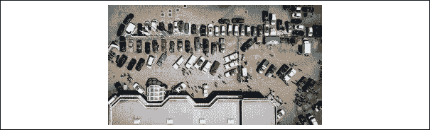
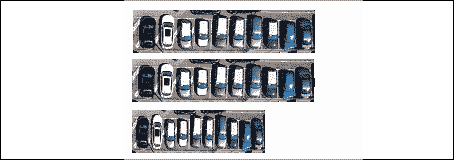
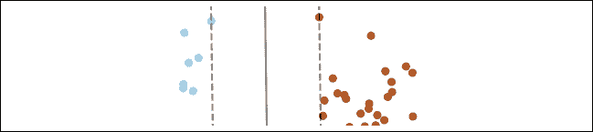
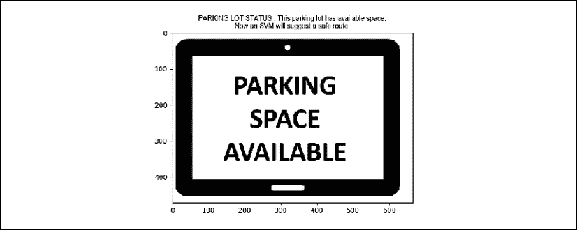

# 第十二章：人工智能与物联网（IoT）

有些人说，**物联网**（**IoT**）将最终成为第四次工业革命。让我们等几年，直到一切尘埃落定，再让历史学家来判断我们经历了怎样的革命。

无论如何，**互联物体**在过去二十年里至少已经改变了我们的生活。考虑到我们近年来所见所闻，我们可以肯定地说，物联网（IoT）已经成为一种颠覆性技术。

人工智能的*刚刚*开始了它在人类智慧中的漫长旅程。新的、令人难以置信的创新正等待着我们。理解前沿的机器学习和深度学习理论只是你冒险的开始。认真对待你所看到的一切，并看它如何融入到你的项目中。

你的思想必须保持开放，接受那些尚未到来的创新。例如，概念表示学习（参见前几章）将人类概念的力量添加到神经网络中。

本章将上一章的技术应用于自动驾驶汽车的例子。上一章使用了网络摄像头和程序，并向输送带发送指令。这属于物联网的范畴。现在，我们将为程序添加一个**支持向量机**（**SVM**），并将其带到城市街头看看会发生什么。

本章分为三个主要部分：公共服务项目、模型配置和模型运行。

本章将涵盖以下主题：

+   自动驾驶解决方案

+   为旅行规划器引入安全路线参数

+   将 CNN（卷积神经网络）应用于停车场

+   将 SVM 应用于旅行规划中的安全性

+   教授一个 MDP（马尔可夫决策过程）来找到最安全的路线（不一定是最短的路线）

让我们从概述我们将要进行的项目的问题和目标开始。

# 公共服务项目

这个例子中的总体项目是实现一个自动驾驶的从家庭到无家可归者庇护所的配送服务：

+   家庭中有衣物和食物，希望将其捐赠给需要的人。

+   自动驾驶汽车可以远程启动，前往家庭并将货物运送到庇护所。

+   自动驾驶汽车不需要停车基站。它可以随时停放，随时出发，并在服务站进行自动电动充电加油。

在本章中，我们将专注于自动驾驶汽车，当它完成配送并寻找有空位的停车场时。我们将需要这些信息来做出决策。

一些物联网项目计划在每个停车位上安装传感器，并将信息传送到控制中心。市议会觉得这样做太贵了。相反，市议会决定采用一种更具成本效益的解决方案。该项目的网格中所有可能的停车场将安装网络摄像头。这个智能网格用于将物品从家庭运送到庇护所。

我们将首先通过设置 RL-DL-CRLMM 模型来解决这个问题。

# 设置 RL-DL-CRLMM 模型

本节描述了如何为这个项目设置上一章的模型，并添加一些功能。

在*第十一章*，*《结合强化学习与深度学习》*中，RL-DL-CRLMM 模型分析了实时传送带上待缝制布料的网络摄像头图像。目标是确定这些布片中是否存在空隙（没有太多布片待缝制）或没有空隙（有很多布片待缝制）。然后模型选择了最佳缝纫站。如果缝纫站有大量工作要做，最好优化为少量布片进行缝制。缝纫站工作量少时，最好优化为大量布片进行缝制。通过这种方式，RL-DL-CRLMM 优化了每个缝纫站的工作负载，如下图所示：


图 12.1：服装生产流程

这将导致以下循环优化模型：


图 12.2：循环 RL-DL-CRLMM

我们在*第十一章*，*《结合强化学习与深度学习》*中探讨的 RL-DL-CRLMM 模型包含以下组件：

+   一个 CRL-CNN 用来查看图像中是否有空隙。在本章中，我们将使用相同的模型来看是否在代表可用停车位的停车场中存在空隙。

+   优化器将依赖于 SVM，将安全性概念添加到行程选择中。然后它将使用优化规则做出决策，如*第十一章，结合强化学习与深度学习*中所述。

+   如*第一章*所述的行程的 MDP，*《通过强化学习开启下一代人工智能之旅》*。

本章的 RL-DL-CRLMM 模型，专注于寻找一个有可用停车位的停车场并前往那里，模型将变为：


图 12.3：循环 RL-DL-CRLMM

本模型中的 CRL-CNN 寻找的是停车场中的空位，而不是传送带上的空隙。

RL-DL-CRLMM 模型包含一个**卷积神经网络**（**CNN**）和一个**马尔可夫决策过程**（**MDP**），通过一个优化器将它们连接起来。优化器包含一个 SVM（安全性评估）和一组规则。

该系统现在将被称为 CRLMM。

## 应用 CRLMM 模型

在*第九章*，*《使用卷积神经网络（CNN）进行抽象图像分类》*中，CRLMM 程序`CNN_STRATEGY_MODEL.py`经过训练，用来实时识别食品加工厂传送带上的切割布片的（gamma 概念）输出。上一章的结尾把提升到了更高的抽象层次。

只要（gamma）属于数据集中的一个未确定状态，它的泛化就包括了模棱两可但相似的概念。直到本章为止，这些就是（大写 gamma）已经学习到的概念（概念表示学习）。

 = {间隙，非间隙，负载，无负载，负载不足，负载足够，负载过多，车道上的停车空间，传送带上高负载产品与缺失产品之间的距离，缝纫站上的重物… `n`}

本章的下一步是使用前几章中构建的 CRLMM 来识别停车场中的停车位，并向自动驾驶车辆发送信号：

+   现在将把间隙视为空间。

+   现在将把空间视为两个物体之间的距离（间隙）。

+   将需要一个上下文来判断这两个物体之间的空间是正距离还是负距离。

让我们来看看我们将用来实现目标的数据集。

### 数据集

在*第九章*，*卷积神经网络（CNNs）进行抽象图像分类*到本章使用的数据集是示例数据集。在实际项目中，获取来自摄像头的实时帧需要一些工作。可能会有照明限制、前提条件等。然而，基本理念保持不变。

如前几章所述，本章的`dataset`目录在 GitHub 上包含以下内容：

+   训练集

+   测试集

+   由`CNN_CONCEPT_STRATEGY.py`训练的模型

+   `CNN_CONCEPT_STRATEGY.py`使用的`classify`目录

如前几章所述，从配置良好的摄像头流出的完整帧流可能需要几周甚至几个月才能准备好。它们本身就是项目。

项目首先会决定使用摄像头或可以将图像发送到嵌入在 RL-DL-CRLMM 程序中的 CNN 的 IP 摄像头。CNN 将对视频流发送的每张图像进行分类，判断它是否包含间隙或可用停车空间。

摄像头通常连接到计算机，然后计算机将信息发送到远程服务器。IP 摄像头可以直接将信息发送到远程机器。这两种解决方案都是连接的物联网设备。IP 摄像头可能更贵。为了证明解决方案是可行的，实施团队可能会先从摄像头开始。一旦项目被接受，IP 摄像头可能从长远来看会更好。在本章中，我们将把摄像头当作是一个起初预算有限的研究项目。因此，我们假设图像来自摄像头。

在这个例子中，已演变为空间（车与车之间的间隙检测），用于寻找停车位。

以下是没有！[](img/B15438_12_006.png)-空间的模拟冻结帧，摄像头位于一栋建筑物上，指向停车场：



图 12.4：模拟的冻结帧

我通过转换图像来模拟一些计算机视觉技术，这些技术本可以用于简化图像：



图 12.5：停车场几乎没有空隙（停车位不足）

以下帧表示屏幕右侧一个小但足够的停车位。这些示例中的图像是为了解释系统是如何构建的。我为这个例子创建了这张图片，以显示是否有可用的停车位！[](img/B15438_12_006.png)。再次说明，我在计算机视觉处理后模拟了一张图像，这很容易做到，但超出了本书的范围。它展示了停车场中几种可用停车位的更高级别表示：


图 12.6：停车场几乎没有空隙（停车位不足）

### 使用训练好的模型

该模型是通过使用与*第九章*《卷积神经网络（CNN）的抽象图像分类》相同的`CNN_STRATEGY_MODEL.py`程序训练的。

只需确保以下程序头部中的目录指向`dataset/`，这是情境 2：

```py
A=['dataset_O/','dataset_traffic/','dataset/']
scenario=2 #reference to A
directory=A[scenario] #transfer learning parameter (choice of images)
print("directory",directory) 
```

模型存储在`/dataset/model`中。要测试模型，使用了前一章中改进的`CNN_CONCEPT_STRATEGY.py`。只需更改消息并将帧分类循环限制为`2`，如下所示的代码片段：

```py
MS1='available'
MS2='space'
I=['1','2','3','4','5','6'] 
```

以下加载的图像在应用 CNN 模型之前已经调整过大小：


图 12.7：调整大小后的图像

#### 对停车场进行分类

我们已经展示了模型的工作效果。然而，在接下来的章节中，我们将使用随机函数模拟发送的图像，而不是实际图像。

现在，CRLMM 已经训练好了，可以区分满的停车场和有空位的停车场。一旦找到有空位的停车场，SVM 会作为中间步骤接管，正如我们将在下一节看到的那样。

# 添加 SVM 功能

自动驾驶汽车已经将包裹送到了避难所。现在它必须找到一个停车场并停在那里。与许多其他系统不同，它没有一个基地，这节省了城市许多无用的行程成本。

## 动机——使用 SVM 提高安全性

支持向量系统为行程计算添加了一个新功能——**安全性**。

大多数系统，如 Google Maps，关注的是：

+   最短行程

+   最快的行程

+   交通

然而，自动驾驶汽车必须采取额外的预防措施。许多人在某些道路上感到不安全。无论如何，安全第一。一旦找到合适的停车场，SVM 必须避免交通。

目标是找到一条穿过交通的路径，即使距离较长。一个`p`参数允许距离有`p`%的偏差。例如，10%允许距离延长 10%，并且会提供安全通行，如下所示的 SVM 结果所示：


图 12.8：交通路径

需要注意的是，数据点**不是**实际坐标，而是一个更高维度中的表示，具体解释见下节。

## 支持向量机的定义

SVM 通过将数据转换为更高维度来对数据进行分类。然后，它会将数据分类为两类，例如。

在本节中，将使用 SVM 来区分有风险的驾驶位置和安全的驾驶位置：

代码中的示例是随机的（就像真实生活中的交通一样），但该模型可以进一步发展。

安全性是该模型的关键，因此每个驾驶位置（道路、交叉口）都具有与此目标相关的特征：

+   该位置的事故数量

+   该位置的交通状况

+   在该位置的驾驶经验（近乎发生事故且没有问题）

所有这些数据都可以输入到 SVM 程序中。该程序将转换数据，使其线性可分（参见*第八章，通过前馈神经网络解决 XOR 问题*）。

左侧的蓝点代表良好的位置，而右侧的棕色点代表有风险的位置。一个函数将读取另一个表格中的数据点的纬度和经度特征，并将其转换回 GPS 格式。

例如，左侧的蓝点可能是：

+   位置 A

+   过去十年中的一次事故

+   一年内通过该点没有问题

一个棕色点可能是：

+   位置 D（距离 A 几街区）

+   十年内发生 74 起事故

+   一年内通过该点发生了 15 次问题

因此，蓝点和棕色点与前面图表中的实际位置无关。它们是**标签**。它们的特征已按预期分开。

为了将数据发送到 GPS 导航系统，只需要找到初始数据集中的位置的 GPS 坐标即可。

例如，会选择位置 A，而不是位置 D。因此，程序会查看数据集并找到其 GPS 位置。

让我们给以下 SVM 图加上些文字说明：



图 12.10：SVM 图

+   点划线之间的空间是**边界**。它有点像橄榄球或足球队之间的边界。当球员（数据点）排成队时，一个看不见的空间或边界将它们分开。

+   与这些边界接触的点是关键的，因为它们决定了边界最初的位置。正如橄榄球或足球运动员排成队形一样，SVM 会计算这一点（参见以下 Python 函数）。这些特殊的数据点被称为**支持点**。它们也被称为**支持向量**。

+   在边界中间的垂直线是**决策线**。

+   由于一条直线将这些点分开，因此数据集是线性可分的。这意味着可以在数据点之间画一条直线，并将它们分成不同的类别。在这种情况下，系统希望获取安全位置（蓝点）并避免不安全的位置（棕色点）。

现在我们定义了什么是 SVM，接下来我们将在 Python 中实现它。

## Python 函数

`sklearn`包提供了以下的`svm`函数：

```py
from sklearn import svm
from sklearn.datasets import make_blobs 
```

`make_blobs`函数为本例生成各个方向上均匀的数据。因此，它是一个**各向同性**分布（*iso* = 相等，*tropy* = 方式）的随机数据。一个**blob**包含数据点。这些数据点代表特定区域内汽车的集中度，计算方式是根据它们的经纬度得出的。

scikit-learn 包含一个高斯因子用于生成函数。高斯核应用从均值开始的标准差。想象你在沙盒中玩耍，做了一个小土丘。然后，你用手将土堆切成两半。均值就是你切割沙堆的位置；标准差则通过两侧下坡的坡度来表示。

收集一个好的数据集可能需要几天，甚至几周的时间。但使用 scikit-learn，你可以通过一行代码完成，如下代码片段所示：

```py
 #100 cars clusters(concentration of cars) represented   [Line 323]
    X, y = make_blobs(n_samples=100, centers=2, random_state=7) 
```

这个函数提供了许多参数。使用的参数如下：

+   `n_samples`表示在集群之间分布的点的数量。在这个例子中，`100`已经代表了一个区域内汽车集中度的子集群。

+   `Centers`是生成数据的中心数量。在本例中，`2`表示接近当前自动驾驶汽车位置和未来目的地的区域。

+   `random_state`是随机数生成器的种子。这是随机数序列的起始点。因为我们认为是随机的，其实是伪随机的，所以它有一个确定性的基础。

在这个例子中，使用了线性核来拟合模型，如下代码所示：

```py
 # the model is directly fitted. The goal is a global estimate    [Line 326]
    clf = svm.SVC(kernel='linear', C=1000)
    clf.fit(X, y) 
```

scikit-learn 的 SVM 包含一个惩罚参数，这就是`svm.SVC`中的`C`。还有许多其他选项，但关键的选项是核。线性核会产生线性分割，如前面的截图所示。

一个 RBF 核会产生不同的结果。结构看起来更具正则化。如以下截图所示，RBF 核作为一种高效的结构正则化函数：


图 12.11：正则化结构路径

请记住，SVM 可用于 MNIST 和 CIFAR 数据集上的图像识别。例如，人工智能提供了多种解决给定问题的方法。选择合适的工具取决于你灵活的试错方法。

绘图行指令从第 300 行开始。需要考虑的主要代码行是那个用于找到并使用决策线的函数（参见前面的定义），并在边界两侧分散数据点。这个通过使用以下`decision_function`来实现：

```py
 Z = clf.decision_function(xy).reshape(XX.shape) 
```

结果将如之前所示显示。现在，SVM 已成为这个自动驾驶汽车（SDC）模型中 CRLMM 的一部分。我们准备好运行 CRLMM，以寻找自动驾驶汽车的可用停车位。

# 运行 CRLMM

自动驾驶汽车的任务是一个循环任务（没有开始，也没有结束），就像前一章中描述的 CRLMM 一样：

+   如果它处于一个停车场，可以通过家或避难所来激活。

+   如果它在某个家中，它会前往避难所。

+   如果它处于一个避难所，可以去一个家或一个停车位。

+   如果需要充电，可以在充电空间（或者更可能是在停车空间）进行充电，这在一些城市已经实现。

在某一时刻，自动驾驶汽车必须从一个特定的家出发，前往一个停车位。其行程的这一部分是以下章节的主题。

## 寻找停车位

`CRL-MM-IoT_SVM.py`使用了前一章中描述的精调版`RL_DL.py`。

一个无-（无伽玛，无间隙，无空位）结果是不可接受的。我们寻找的结果是带有间隙的图像。

如果`crlmm`函数（该函数将停车场图像分类为已满或可用空间）返回`0`，程序将检测到并显示一条消息。代码样本包含以下代码片段的行号：

```py
 if(crlmm==0):    # [Line 392]
                full = load_img("FULL.JPG")
                plt.subplot(111)
                plt.imshow(full)
                plt.title('PARKING LOT STATUS : This parking lot is full.' + '\n' + 'Another webcam is consulted', fontname='Arial', fontsize=10)
                #plt.text(0.1,2, "The frame is the input of a trained CNN")
                plt.show()
                '''
                plt.show(block=False)
                time.sleep(5)
                plt.close()
                '''
                print("This parking lot is full, searching...") 
```

程序显示以下完整的标志，并在几秒钟后关闭：


图 12.12：停车场状态

程序必须找到一个停车位。因此，它将尝试搜索好的停车场，如以下代码片段所示：

```py
 for search in range(1000):    # [Line 391]
            if(crlmm==0): 
```

一千次搜索看起来很多，但对于机器学习程序来说并不困难。

此外，在大城市寻找可用停车位可能非常痛苦。往往情况下，它不适用：可能没有足够的空闲停车位来确保你能够在到达目的地的时间内找到一个。

对于这个原型，最佳搜索次数限制为`2`。超过该值时，将激活以下`CRLMM`函数：

```py
 if(search>2):    # [Line 405]
                    a=1
                crlmm=CRLMM(Q,lr,e,a) 
```

在两次无果的搜索后，程序激活了`a`，这是`CRLMM`函数的标志。

`CRLMM`函数现在包含一个随机搜索功能，模拟选择一个停车场并提供一个一级状态：

```py
 status=random.randint(0,10)    # [Line 199]
    if(status>5):
        status=1
    if(status<=5):
        status=0 
```

状态表示对停车场可用性的概率估计。`a`标志模拟一个尚未添加的程序，该程序将扫描所有停车场并运行此函数以找到一个可用的停车位。

在初次会议上展示原型时，你总是需要足够的材料来说服别人，但如果做得过头，成本将成为一种风险，尤其是在你的想法被拒绝的情况下。

因此，如果激活了`a`，系统会模拟扫描（待开发）并将状态强制设为`1`，如以下代码片段所示：

```py
 if(a>0 and status==0):    # [Line 204]
        #add an available search function here that scans all the
        #webcams of then network until it finds one that suits the model (not too far parameter and available)
        status=1 
```

程序接着继续运行，并使用训练好的 CNN 来识别一个可用的停车场（参考以下截图），如前面的配置部分所解释：


图 12.13：网络摄像头冻结停车场的一帧

现在，已经找到一个有空车位的停车场（画面左上角的空白区域），搜索功能停止，接下来的 `break` 指令被激活：

```py
 if(crlmm==1):    # [Line 408]
                    a=0
                    break 
```

一旦找到停车位，就会达到 `break` 指令。一旦检测到可用停车位，我们就可以决定如何到达停车场。

## 决定如何到达停车场

当 `crlmm==1` 时，CRLMM 程序找到了一个合适的停车场，如以下代码所示：

```py
 if(crlmm==1):    # [Line 412]
            available = load_img("AVAILABLE.JPG")
            plt.subplot(111)
            plt.imshow(available)
            plt.title('PARKING LOT STATUS : This parking lot has available space.' + '\n' + 'Now an SVM will suggest a safe route ', fontname='Arial', fontsize=10)
            #plt.text(0.1,2, "The frame is the input of a trained CNN"
            plt.show()
            '''
            plt.show(block=False)
            time.sleep(5)
            plt.close()
            '''
            print("This parking lot has available space...") 
```

它显示以下信息和一个标志：



图 12.14：停车场状态

现在我们找到了一个可用的停车位，我们需要为自动驾驶车辆找到一条安全的路线。这意味着自动驾驶系统将避开交通，以便更容易进行自主机器学习程序。现在是时候激活该功能了。

### 支持向量机

CRLMM 现在要求选择一条安全的路线，即使这意味着需要更长的时间（或距离）。自动驾驶车辆需要严格遵循安全优先的政策。

程序达到了以下的 SVM 功能：

```py
 print("This parking lot has available space...")    # [Line 424]
            SAFE_SVM() 
```

配置部分中描述的 SVM 提供了穿越交通的安全路径，如下图所示：


图 12.15：交通图

例如，在这个随机的案例中（大多数情况下交通是随机的），左边的蓝点表示交通较稀疏的区域，棕色的点表示交通较密集的区域。现实中的目标是为程序中的 MDP 提供信息，使其能够找到通过稀疏交通的路径，以确保安全，减少自动驾驶系统在密集交通中可能出现的错误。过去事故的统计权重和车辆经验也可以被加以利用，创建一个更深层次的安全模型旅行规划器。

假设自动驾驶车辆需要前往棕色区域的一个点，SVM 将：

+   建议尽量走过蓝点区域，只在棕色区域中行驶。

+   将信息发送到 Google Maps。这将需要一个额外的脚本，用来读取一个包含每个数据点 GPS 坐标的数据集。

许多驾驶员在繁忙的高速公路或密集的城市中感到不安全。将最安全路线功能加入到地图软件中将会有所帮助。

SVM 将数据点提升到更高的层级（请参考本章配置部分的解释）。

SVM 功能中表示的点**不是**实际的位置，而是一个抽象的表示。分割线需要通过一个功能，将这些信息转化为实际位置的数据点。

一旦 SVM 边界被转换为位置数据点，行程或旅行图就会被激活。

### 行程图

原型展示了一个基于 SVM 推荐和权重向量的行程图仿真，通过以下功能调用：

```py
 print("SAFE PASSAGE SUGGESTED")    # [Line 426]
            MDP_GRAPH(lr,e) 
```

以下图表显示了最安全的路线（用红色表示），即使这意味着需要更长的时间（或距离）：


图 12.16：优化器选择了最安全的行程

出于原型的目的，SVM 并未直接连接到图中，这将需要昂贵的时间成本。

相反，插入了以下`random.randint`函数，模拟了任何情况下停车位的随机可用性：

```py
 for wi in range(6):    [Line 430]
                op=random.randint(0,5)
                if(W[op]>maxw):
                    lr=op;maxw=W[op] 
```

请记住，对于向潜在客户或经理的初步展示，进一步开发原型是没有意义的。

这种原型比幻灯片展示更强大，因为它证明了你的合法性。幻灯片是静态的，无法证明你在特定主题上的能力。一个原型将展示你的专业知识。一旦我们获得了最安全的位置，就可以像上一章那样更新 MDP 的权重向量。

### 权重向量

权重向量被显示出来。在这个模型中，权重代表位置，就像在上一章中一样。然而，在本章中，权重是一个评级：

+   当某个区域在过去`n`年内发生过少量事故时，每个权重都会有一个较高的安全排名。这就是**安全排名**。这个排名应当成为我们行程软件的一部分，我们应该被告知。

+   自动驾驶汽车的经验将根据每个权重进行定制。这是其自身的驾驶记录。由于软件故障导致的差点事故会降低权重。良好的行驶记录将提升权重。对人类来说看似简单的事情，可能对软件来说是困难的，反之亦然。

现在，系统显示了使用的权重，并将在原型通过后开发一个内部更新程序。以下代码调用了一个管理自动驾驶汽车最安全路线权重的函数，并显示了一个直方图：

```py
 print("Vertex Weights",W)    # [Line 428]
            MDP_CRL_graph(W,lr) 
```


图 12.17：更新后的权重顶点的直方图（最安全的路线）

我们检测到了一个可用的停车位，要求 SVM 提供通往该停车位的最安全路径，更新了每个区域的权重，并将信息发送给 MDP 计算安全路径。

# 总结

本章与上一章一样，描述了一个没有人工参与的物联网连接过程。这一趋势将在未来几年扩展到各个领域。

这也表明，掌握如何使用工具需要努力，尤其是在学习人工智能时。为特定市场构思解决方案不仅仅需要努力工作。创造力不是靠工作获得的，它是在摆脱任何形式约束的过程中培养出来的。

一旦解决方案被构思出来，就面临着一个微妙的界限：是为展示开发过多，还是展示不足。CRLMM 提供了一种框架，帮助构建技术解决方案（CNN、MDP、SVM 和优化器），同时考虑到他人理解的日常概念。

本章还展示了一个人工智能模型可以包含一组算法，包括 RL、DL、SVM 和 CRL 认知方法等。

下一章将带我们更深入地了解神经网络和 TensorFlow 2，窥视人工神经网络（ANN）的内部过程。

# 问题

1.  在任何情况下，快速到达目的地总比安全更重要。（是 | 否）

1.  自动驾驶汽车永远无法真正取代人类司机。（是 | 否）

1.  未来是否会有带机器人灭火的自动驾驶消防车？（是 | 否）

1.  大城市是否需要投资自动驾驶汽车，还是应该避免它们？（投资 | 避免）

1.  你会信任自动驾驶公交车带孩子上学放学吗？（是 | 否）

1.  你能在高速公路上的自动驾驶汽车里睡觉吗？（是 | 否）

1.  你想为一个城市的项目开发一个自动驾驶程序吗？（是 | 否）

# 深入阅读

+   欲了解更多关于支持向量机（SVM）的信息，请参考以下链接：[`scikit-learn.org/stable/modules/svm.html`](http://scikit-learn.org/stable/modules/svm.html)，[`scikit-learn.org/stable/auto_examples/svm/plot_separating_hyperplane.html#sphx-glr-auto-examples-svm-plot-separating-hyperplane-py`](http://scikit-learn.org/stable/auto_examples/svm/plot_separating_hyperplane.html#sphx-glr-auto-examp)
