# 第十三章：使用 TensorFlow 2.x 和 TensorBoard 可视化网络

在本章中，我们将窥视机器在“思考”过程中，如何通过深度学习神经网络的各层进行处理。使用 TensorFlow 2 构建**卷积神经网络**（**CNN**）的顺序分类器所需的代码行数大大减少。运行分类器只需点击一下。然而，当程序出现问题时，理解程序的运行逻辑变得更加困难，而可视化各层的输出可以大有裨益。

可视化 CNN 各层的输出可以深入了解组成整个过程的每个独立步骤。

在本章中，和前几章一样，我们将定义 CNN 的各层。这一次，我们将增加更多层并提取每一层的输出，生成输出图像。我们将从头开始，采用从下到上的方法，使用 Python 中的 TensorFlow 2 构建此过程。

一旦输出被定义，我们将显示卷积层、池化层、丢弃层、扁平化层和全连接层的输出。

查看各层的输出提供了对各层功能的直观理解。能够可视化模型的全局图使得 CNN 的架构得以显现。

我们将使用 TensorBoard 来探索概念模型、训练轮次与准确度的关系，以及数学函数操作的细节。这些图表和测量将通过从上到下的方法，使用 Google Colaboratory 构建。

Google Colaboratory 提供了一个免费服务器，预装了可用的库和模块。我们将使用 Google Colaboratory 笔记本来探索 TensorBoard 的功能。本章分为三个主要部分。前两部分介绍如何使用 TensorFlow 2.2 构建一个顺序分类器并显示各层的输出。第三部分介绍如何使用 TensorFlow 2 版本的 TensorBoard 展示图形信息和准确度测量。

本章将介绍以下主题，并为 CNN 提供视觉上的深入理解：

+   一层一层地构建 CNN

+   显示数据集

+   显示 CNN 各层的输出

+   使用 Google Colaboratory

+   使用 TensorBoard 可视化神经网络架构

+   使用 TensorBoard 可视化准确度测量

让我们从讨论如何在 CNN 中探索各层的输出开始本章内容。

# 使用 TensorFlow 以两步法探索 CNN 各层的输出

许多商业智能领域的企业合同要求对任何自动化和关键决策算法进行解释过程。对于算法编辑者，无论是否为人工智能，提供解释通常是强制性的要求。我们需要为此做好准备。

此外，一旦人工智能在生产环境中运行，维护变得至关重要。开发人员经常从一个部门转到另一个部门，从一个公司转到另一个公司。必须维护程序的人需要详细了解它。

探索和可视化 CNN 是一个很好的方式，让我们亲自实践，打开跑车的引擎盖，看看引擎是如何运作的！

+   首先，我们将逐层构建 CNN。我们将使用 TensorFlow 2 从底到顶构建顺序分类器。

    我们不会直接使用 Keras 模型；我们将使用 TensorFlow 集成的 Keras 模块，这样将标题的行数减少到只有两行：

    ```py
    import tensorflow as tf
    from tensorflow.keras import datasets, layers, models 
    ```

+   然后我们将探索各层的可视化输出，以深入了解它是如何“思考”的。

好的，现在让我们开始构建吧！

## 构建 CNN 的各层

在*第九章*中描述了 CNN，*使用卷积神经网络（CNN）进行抽象图像分类*。在接下来的示例中，CNN 将包含更多层，以便逐步可视化神经网络如何提取特征。

我们将使用一个数据集，通过一个图像探索 CNN 的各层。该图像在训练数据集中重复多次，而测试数据集足够用来构建和运行模型以可视化神经网络的各层。

数据集中包含一张重复多次的花朵图像——一朵虹膜花。

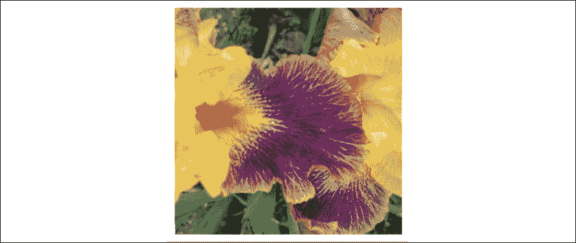

图 13.1：我们在本章中探索的图像

目标不是让图像有很多变化，而是简单地看看 CNN 是如何逐层表示虹膜的。数据集中包含了一张重复的图像。然而，你可以更改这些图像，使用你自己的数据集，然后使用相同的代码如下所示展示图像：

```py
cv_img=[]
images = []
for img_path in glob.glob('dataset/training_set/img/*.png'):
    images.append(mpimg.imread(img_path))

plt.figure(figsize=(20,20)) #20,10
columns = 5
for i, image in enumerate(images):
    plt.subplot(len(images) / columns + 1, columns, i + 1)
    plt.imshow(image) 
```

结果将是一个包含来自数据集的图像行的图形：

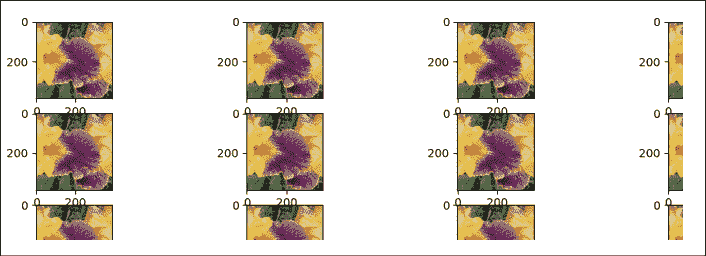

图 13.2：显示数据集

我们将首先导入神经网络模块：

```py
import tensorflow as tf
from tensorflow.keras import datasets, layers, models 
```

构建 CNN 只需要几行代码。这看起来非常简单，因为它似乎是一个黑箱。在我们的例子中，*第九章*中描述的结构，*使用卷积神经网络（CNN）进行抽象图像分类*，在这里的增强版，只需几分钟就能从第 30 行到第 68 行创建：

```py
#initializing the Tensorflow 2 classifier
classifier = models.Sequential()
#adding the convolution layers to the layers
classifier.add(layers.Conv2D(32, (3, 3), padding='same', input_shape = (28, 28, 3), activation = 'relu'))
classifier.add(layers.Conv2D(32, (3, 3), activation='relu'))
...
#adding dense-dropout-dense layers
classifier.add(layers.Dense(units = 512, activation = 'relu')) 
```

当我们探索各层的输出时，我们将在下一节回到这些层。这里需要关注的主要点是代码的简洁性。虽然在几分钟内构建一个 CNN 作为一个黑箱可能行得通，但当问题出现时，要理解每一层需要对各层的表示有更深入的理解。

在探索这些层之前，程序会打印分类器（CNN）的结构：

```py
#Printing the model summary
print("Model Summary",classifier.summary()) 
```

模型包含相当数量的层来进行探索：

```py
Model: "sequential"
_________________________________________________________________
Layer (type)                 Output Shape              Param #   
=================================================================
conv2d (Conv2D)              (None, 28, 28, 32)        896       
_________________________________________________________________
conv2d_1 (Conv2D)            (None, 26, 26, 32)        9248      
_________________________________________________________________
max_pooling2d (MaxPooling2D) (None, 13, 13, 32)        0         
_________________________________________________________________
dropout (Dropout)            (None, 13, 13, 32)        0         
_________________________________________________________________
conv2d_2 (Conv2D)            (None, 13, 13, 64)        18496     
_________________________________________________________________
conv2d_3 (Conv2D)            (None, 11, 11, 64)        36928     
_________________________________________________________________
max_pooling2d_1 (MaxPooling2 (None, 5, 5, 64)          0         
_________________________________________________________________
dropout_1 (Dropout)          (None, 5, 5, 64)          0         
_________________________________________________________________
conv2d_4 (Conv2D)            (None, 5, 5, 64)          36928     
_________________________________________________________________
conv2d_5 (Conv2D)            (None, 3, 3, 64)          36928     
_________________________________________________________________
max_pooling2d_2 (MaxPooling2 (None, 1, 1, 64)          0         
_________________________________________________________________
dropout_2 (Dropout)          (None, 1, 1, 64)          0         
_________________________________________________________________
flatten (Flatten)            (None, 64)                0         
_________________________________________________________________
dense (Dense)                (None, 512)               33280     
_________________________________________________________________
dropout_3 (Dropout)          (None, 512)               0         
_________________________________________________________________
dense_1 (Dense)              (None, 3)                 1539      
=============================================================== 
```

请注意这个总结。当选择你想要探索的层数以可视化输出时，它将非常有用。

然后，模型被编译：

```py
# Compiling the convolutional neural network (CNN)
classifier.compile(optimizer = 'rmsprop',
    loss = 'categorical_crossentropy',metrics = ['accuracy']) 
```

然后处理（重新缩放）并定义训练和测试数据集：

```py
train_datagen = ImageDataGenerator(rescale = 1./255)
test_datagen = ImageDataGenerator(rescale = 1./255)
training_set = train_datagen.flow_from_directory(
                                  'dataset/training_set',
                                  target_size = (28, 28),
                                  batch_size = 16,
                                  class_mode =
                                  'categorical')
test_set = test_datagen.flow_from_directory('dataset/test_set',
                                           target_size = (28, 28),
                                           batch_size = 16,
                                           class_mode =
                                           'categorical') 
```

如果我们在这里停下来，CNN 就能正常工作。但我们真正理解了这个模型吗？我觉得不是。当然，安装好一个现成的数据集后，只需点击几下即可运行 CNN。这种黑盒子的方法固然可行，但是探索一层的视觉输出能更好地代表网络。接下来我们来看看这个。

## 处理 CNN 层的视觉输出

关键在于专注于一幅图像，实际上 *看见* CNN 逐层计算的“心理”、视觉表示。

为了处理这些层，程序首先选择一个图像供激活模型使用：

```py
#Selecting an image for the activation model
img_path = 'dataset/test_set/img/img1.png'
img1 = image.load_img('dataset/test_set/img/img1.png', target_size=(28, 28))
img = image.img_to_array(img1)
img = np.expand_dims(img, axis=0)
img /= 255.
plt.imshow(img[0])
plt.show()
print("img tensor shape",img.shape) 
```

然后可视化过程分几步进行，这将带领我们深入 CNN：

+   **选择要可视化的层数量使用** `e` **变量**：回到之前显示的模型摘要，你可以选择要停在哪一层。在这个例子中，我们选择停在 `e=12`。你可以选择从 `e=4` 开始可视化第一卷积和池化层：

    ```py
    #Selecting the number of layers to display
    e=12 #last layer displayed
    layer_outputs = [layer.output for layer in classifier.layers[0:e]] 
    ```

    如果 `e=3`，程序会在 `max_pooling2d` 处停止：

    ```py
    Displaying layer: conv2d
    Displaying layer: conv2d_1
    Displaying layer: max_pooling2d 
    ```

+   **选择要探索的前 n 个层**：程序参考 `layer_outputs` 提取它需要可视化目标层的信息：

    ```py
    # Extracting the information of the top n layers
    activation_model = models.Model(inputs=classifier.input,
                                    outputs=layer_outputs) 
    ```

+   **应用激活模型来提取请求的层**：激活模型迫使分类器开始工作并通过层。这样，我们可以窥探其“思考”过程，看看它如何表示输入：

    ```py
    # Activating the model
    activations = activation_model.predict(img) 
    ```

+   **检索层名称以及层的视觉表示以显示**：层名称帮助我们理解我们正在观察什么。使用我们之前打印的模型摘要作为地图，查看当显示层名称时所处的位置，以及该层输出的表示：

    ```py
    #layer names
    layer_names = []
    for layer in classifier.layers[:12]:
        layer_names.append(layer.name) 
    ```

+   **处理层输出并将其组织成网格**：为了避免观看给定层表示的变化的顺序显示，我们将它们组织成一个网格图像：

    ```py
    # Processing the layer outputs
    for layer_name, layer_activation in zip(layer_names,
            activations):
        #getting the layer_names and their activations
        n_features = layer_activation.shape[-1] #features in the layer
        size = layer_activation.shape[1] #shape of the feature map
        n_cols = n_features // images_per_row #number of images per row
        display_grid = np.zeros((size * n_cols,
                                 images_per_row * size)) #size of the display grid
        for col in range(n_cols): #organizing the columns
            for row in range(images_per_row): #...and rows to display
                image = layer_activation[0,:, :,
                    col * images_per_row + row] #retrieving the image...
                image -= image.mean() #...and processing it in the...
                if(image.std()>0): # ...following lines to display it
                    image /= image.std()
                    image *= 64
                    image += 128
                    image = np.clip(image, 0,
                        255).astype('uint8')
                    display_grid[col * size : (col + 1) * size,
                        row * size : (row + 1) * size] = image 
    ```

+   **显示处理后的层输出**：现在工作已经完成，我们只需显示层名称以及相应的网格：

    ```py
     #displaying the layer names and processed grids
        print("Displaying layer:",layer_name)
        scale = 1\. / size
        plt.figure(figsize=(scale * display_grid.shape[1],
                            scale * display_grid.shape[0]))
        plt.title(layer_name)
        plt.grid(False)
        plt.imshow(display_grid, aspect='auto', cmap='viridis')
        plt.savefig("dataset/output/"+layer_name)
        plt.show() 
    ```

注意，这些图像是通过 `plt.savefig` 保存在输出目录中以便后续使用。

你将获得一个图层名称列表，其中包含你选择可视化的图层。例如，你可以查看前七个图层的图像。你可以通过以下图表或运行程序查看它们。无论如何，分析层的最佳方法是仔细观察第一层，然后再观察最后一层。你会发现，CNN 正在精确地提取图像的抽象表示，并显示更高的维度。难以用人眼感知层之间差异的原因有两个因素：

+   分析的元素数量对我们来说极为困难。通常我们的大脑会在我们不知不觉中完成这个过程！

+   有多个卷积层，而不是一个层，后者会迅速完成获取图像抽象表示的过程。它是逐层处理的，就像人类大脑一步步处理图像一样。

看一下第一个层和最后一个层，然后回过头来观察各层之间的差异。

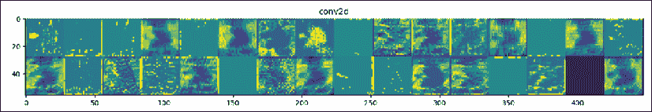

图 13.3：卷积层

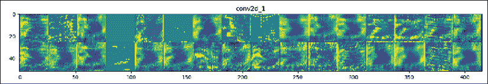

图 13.4：卷积层

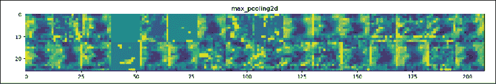

图 13.5：池化层

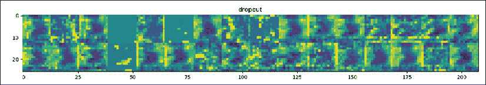

图 13.6：丢弃层

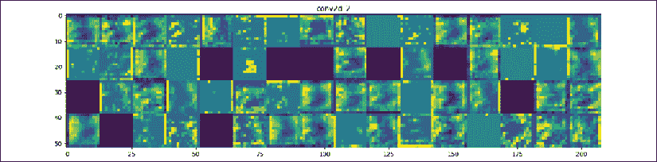

图 13.7：卷积层

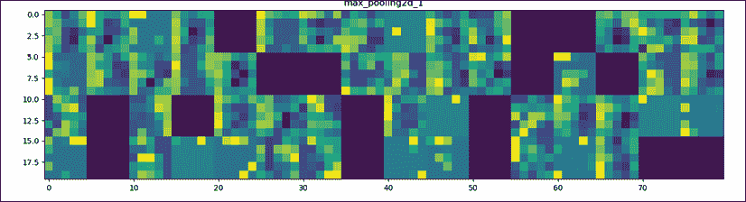

图 13.8：卷积层

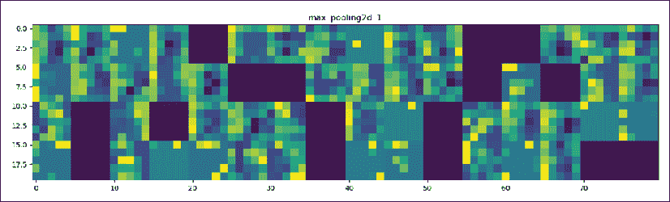

图 13.9：池化层

可视化 CNN 层的输出提供了一个绝佳的方式来理解和分析神经网络。让我们更进一步，分析这些层。

### 分析 CNN 层的视觉输出

输入图像是混乱的，直到某种形式的智能将其理清。任何形式的智能都会检测出其中的模式和结构。机器智能通过增加抽象层级来实现同样的目标，方法是通过降维。将混乱转化为有序表示的过程是当今神经网络这一伟大发明的核心。

运行 `cnn_layers.py` 时，层输出将会显示。让我们来探索其中的一些层。你可以通过简单地更改第 107 行中 `e = <number-of-layers>` 变量的值来探索其中的部分或全部层。

#### 卷积层激活函数

卷积层的一个关键选项是激活函数。在以下的 `cnn_layers.py` 中使用了 `relu`：

```py
#adding more convolution layers to the layers
classifier.add(layers.Conv2D(64, (3, 3), padding='same', activation = 'relu'))
classifier.add(layers.Conv2D(64, (3, 3), activation='relu')) 
```

关于 ReLU 的更多内容，请参阅*第九章*，*使用卷积神经网络（CNN）进行抽象图像分类*。

`relu` 为 `Conv2d` 层生成以下输出：


图 13.10：conv2d 输出 1

现在去第 33 行，将 `relu` 替换为 `softmax`，如下所示：

```py
classifier.add(layers.Conv2D(32, (3, 3), padding='same',
    input_shape = (28, 28, 3), activation = 'softmax')) 
```

输出有很大不同，正如我们所看到的：


图 13.11：conv2d 输出 2

人眼需要一些时间来适应这种变化。看看每个版本。试着在闭上眼睛几秒钟后记住它，然后再看另一个版本。我们的脑海里会下意识地做这件事，这也是为什么我们需要刻意做这个练习的原因。

你应该使用哪一个？欢迎来到深度学习！对于这个问题没有确定的答案。这是一个试错的过程。一个激活函数可能适合某个模型，而不适合另一个模型。即使在训练过程中网络的准确度是可以接受的，当新数据产生不良结果时，你可能需要随着时间的推移更改激活函数。

关于 softmax 的更多信息，请回到*第二章*中的解释，*构建奖励矩阵 - 设计你的数据集*。

让我们尝试`sigmoid`逻辑斯谛激活函数，它也在*第二章*中有描述：

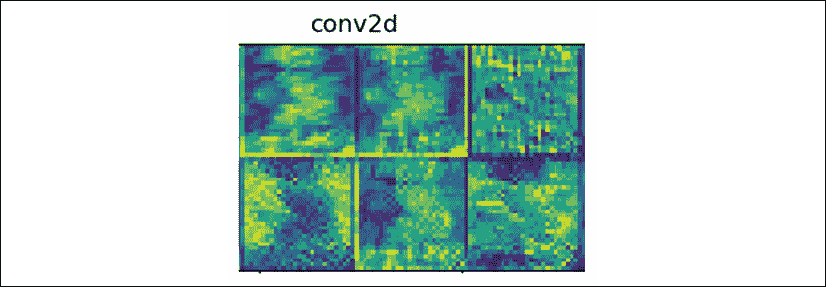

图 13.12：conv2d 输出 3

再次注意差异。观察每个激活函数下第 1 行的最后一张图像。这些差异非常有趣，因为它们提供了各种可能的表示。

尝试其他激活函数，感受一下人工神经网络如何通过减少需要处理的维度，将它所感知到的信息转化为更高层次的抽象。

#### 卷积层通过各层传递的高层次表示

注意，通过以下输出，从`conv2d`到`conv2d_5`，顺序分类器所达到的惊人抽象级别，实际上这是`cnn_layers.py`中的第六层（0 到 5）卷积层。

网络从一个相对形象化的表示开始，逐步达到 `conv2d_5` 的高度抽象级别。我们实际上处于机器的“思维”中，观察它思考和学习！

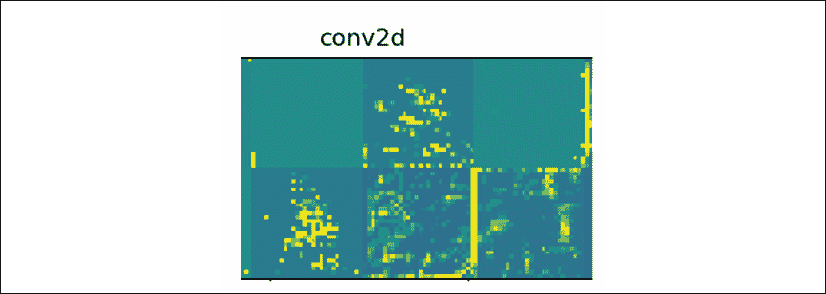

图 13.13：初始 conv2d 输出

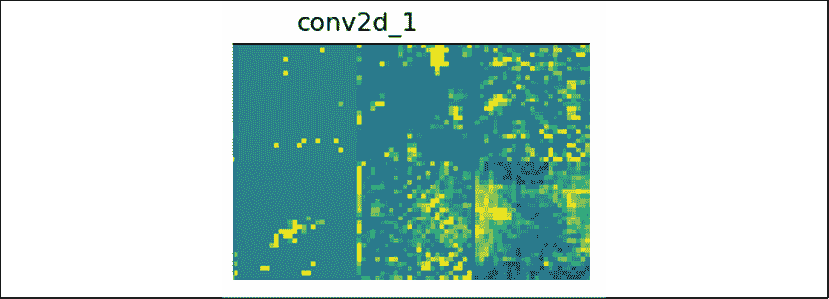

图 13.14：conv2d_1 输出

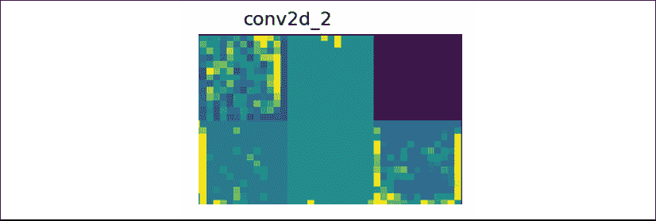

图 13.15：conv2d_2 输出

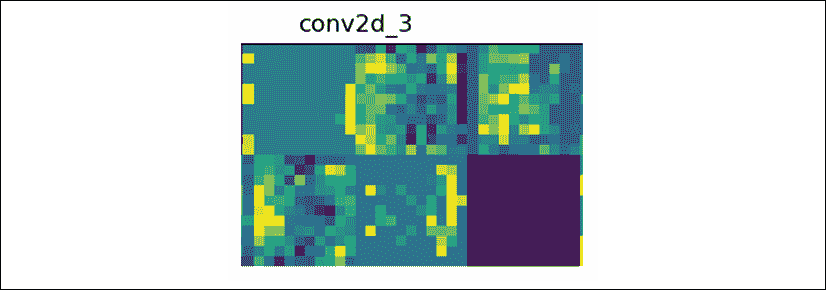

图 13.16：conv2d_3 输出

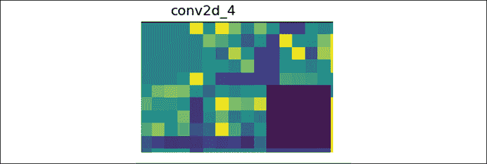

图 13.17：conv2d_4 输出

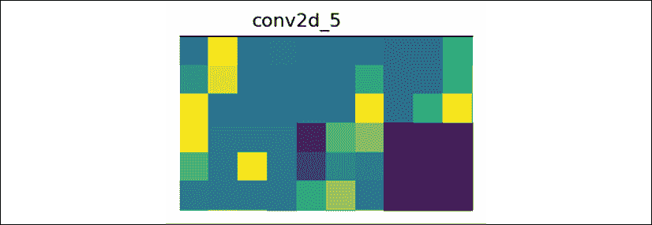

图 13.18：conv2d_5 输出

这一抽象过程在很大程度上得益于其他层次，如池化层。

#### 池化层获取更高层次表示

池化层将减少输入的维度数量，并选择它找到的最具代表性的特征：

```py
#adding a max pooling layer to the layers
classifier.add(layers.MaxPooling2D(pool_size=(2, 2))) 
```

让我们探讨一下这个例子中前两个池化层的演变：

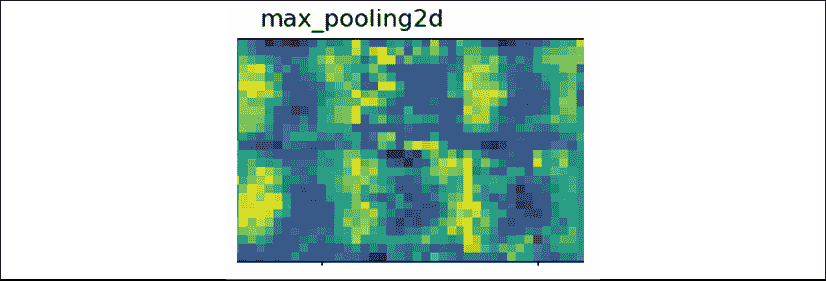

图 13.19：max_pooling2d 输出

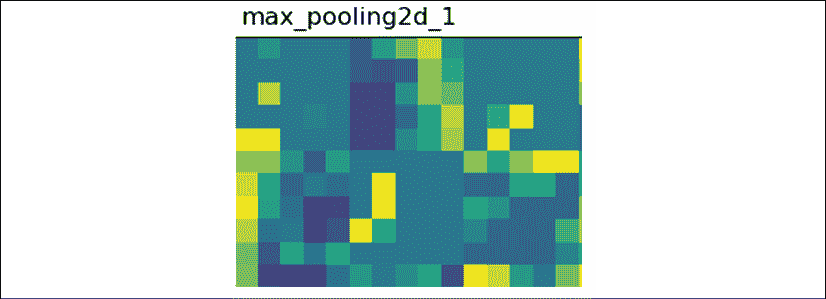

图 13.20：max_pooling2d_1 输出

再次，我们可以看到 CNN 所能达到的强大抽象级别。

关于池化层的更多信息，请阅读*第九章*中的解释，*使用卷积神经网络（CNNs）进行抽象图像分类*。

#### Dropout 层通过各层传递的高层次表示

dropout 层提供了一种放弃许多特征的方式，以达到简化的更高层次表示：

```py
classifier.add(layers.Dropout(0.5)) # antes era 0.25 
```

并非总是需要添加 dropout 层，因为这取决于你正在探索的模型的生产力和架构。在这个例子中，前两个 dropout 层是非常具有指导意义的。dropout 也是一种避免过拟合的方式。模型学习如何提取关键特征以获得抽象表示，而不是字面表示。

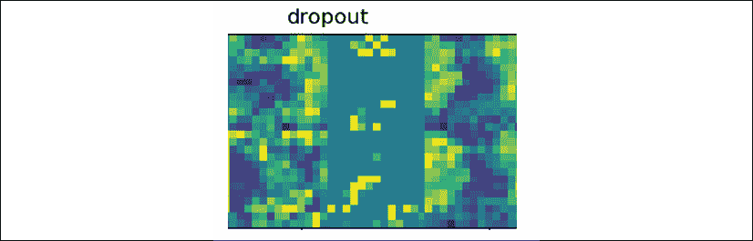

图 13.21：dropout 输出

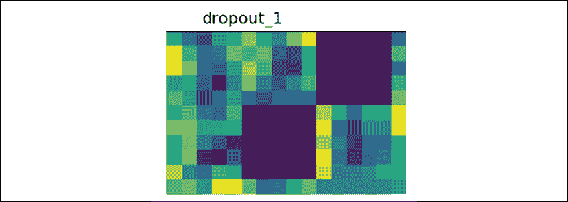

图 13.22：dropout_1 输出

再次观察 dropout 层如何加速抽象过程。我们可以看到 CNN 的“大脑”在运作。

#### 推荐

我建议你尝试不同的激活函数和各种层的选项，然后运行程序，感受一下 CNN “机器思维”过程中的运作。即使它是一个纯粹的数学架构，它也能很好地展示 CNN 的“机器思维”方式，尽管它完全不是人类，但它有自己的“机器思维”方法。

现在我们已经从下到上探索了 CNN，让我们看看如何使用 TensorBoard 从上到下观察 CNN 的准确性。

# 使用 TensorBoard 分析 CNN 的准确性

在本节中，我们将首先开始使用免费的 Google Colaboratory 服务器，然后探索一些 TensorBoard ANN 测量功能。

## 开始使用 Google Colaboratory

你只需几个步骤就能获得免费的 Google Colaboratory 服务器实例：

1.  确保你有一个 Google 账户并登录。

1.  点击以下链接，它将带你到 Google Colaboratory：[`colab.research.google.com/notebooks/welcome.ipynb#recent=true`](https://colab.research.google.com/notebooks/welcome.ipynb#recent=true)

    你将被带到以下页面：

    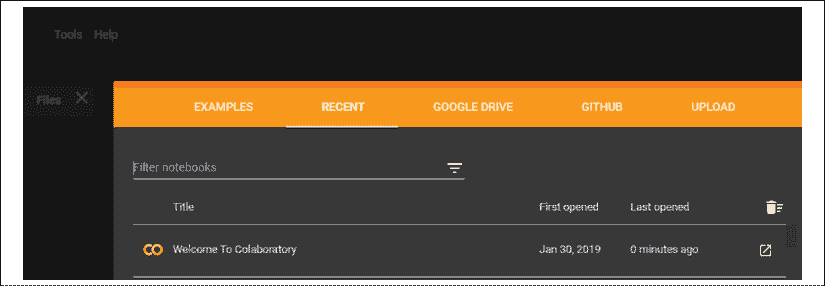

    图 13.23：Colaboratory 初始登陆页面

1.  点击右上角的**UPLOAD**选项：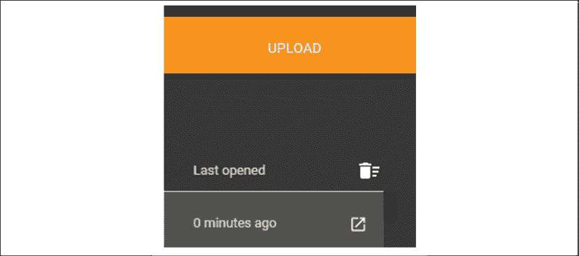

    图 13.24：上传选项

    你可以选择或拖放一个文件，然后上传它。

1.  上传 `TF_2_graphs.ipynb`。

    你可以从这个链接下载程序并上传它：[`github.com/PacktPublishing/Artificial-Intelligence-By-Example-Second-Edition/blob/master/CH13/TF_2_graphs.ipynb`](https://github.com/PacktPublishing/Artificial-Intelligence-By-Example-Second-Edition/blob/master/CH1)

1.  程序打开后，你将看到以下页面：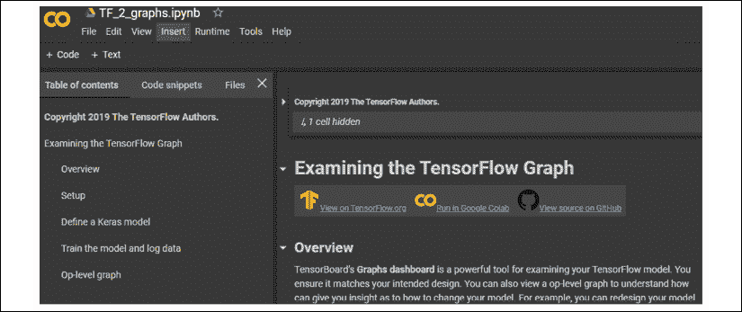

    图 13.25：一个 Colaboratory 笔记本

1.  在菜单中点击**文件**并将笔记本保存到你的 Google Drive：

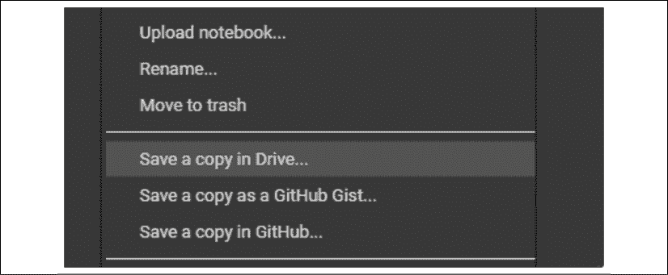

图 13.26：文件菜单

文件保存后，你就准备好了！

你有许多运行时选项，例如选择使用 CPU 还是 GPU，显示选项（例如背景），以及更多使用 Google Colaboratory 的方式。我推荐阅读文档以了解可用的众多选项。

你现在在自己的免费 Colaboratory 服务器上，准备好探索你的笔记本。

## 定义并训练模型

我们将运行笔记本，然后分析结果。这将提供对 Google Colaboratory 以及一些 TensorBoard 功能的介绍。

首先，通过点击**运行所有**选项来运行程序，位于**运行时**菜单中：

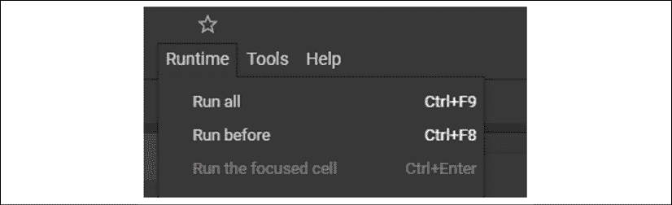

图 13.27：运行时选项

程序将遍历其单元格并提供关于训练过程的信息。为了获取这些信息，我们将探索 TensorBoard 的一些关键功能。

我们将首先安装 TensorFlow，然后运行 TensorBoard。

+   **安装 TensorFlow 并启动 TensorBoard**：如你在前一节看到的，除非单元格包含错误，否则你无需逐个运行程序单元。在这种情况下，点击单元格中的运行按钮：


图 13.28：运行单元格

单元格将执行代码。在这种情况下，它将安装 TensorFlow 2.x：

```py
# Ensure TensorFlow 2.0 is installed.
!pip install -q tf-nightly-2.0-preview
# Load the TensorBoard notebook extension.
%load_ext tensorboard 
```

安装完成并加载 TensorBoard 后，程序会遍历头部导入必要的模块。

小心 TensorBoard 版本！你可能安装了一个旧版本或者是用于其他项目的不同版本。在运行此程序之前，检查一下你环境中任何正在使用 TensorBoard 的应用。运行之前仔细检查配置。如果存在风险，使用另一个环境或仅查看笔记本而不运行它。

+   **程序现在定义了一个简化的模型，你现在已经熟悉**：以下模型已简化，目的是展示 TensorBoard 的工作原理。当然，在探索完笔记本后，你可以添加更多的层。

    ```py
    # Define the model.
    model = keras.models.Sequential([
        keras.layers.Flatten(input_shape=(28, 28)),
        keras.layers.Dense(32, activation='relu'),
        keras.layers.Dropout(0.2),
        keras.layers.Dense(10, activation='softmax')
    ]) 
    ```

+   **模型接着使用优化器和准确率指标进行编译**：现在需要编译并运行模型，以便提供测量输出：

    ```py
    model.compile(
        optimizer='adam',
        loss='sparse_categorical_crossentropy',
        metrics=['accuracy']) 
    ```

    关于 Adam 优化器和交叉熵的更多内容，参见*第九章*，*使用卷积神经网络（CNN）进行抽象图像分类*。

模型现在已经训练完成，准备接受 TensorBoard 的度量回调。

在程序运行训练时，它将保存主要功能的日志以供展示。模型的图表可以通过一行在 TensorBoard 中显示，且有许多其他功能。

```py
%tensorboard --logdir logs 
```

以下是模型的图表，包含了许多细节：

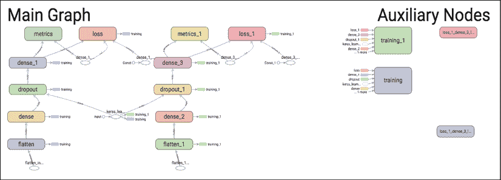

图 13.29：TensorFlow 图表

如果你想要简化视图，模型的概念性视图也已展示：

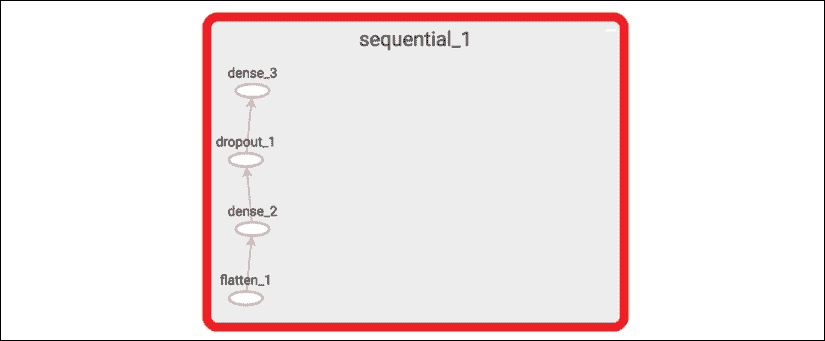

图 13.30：TensorFlow 图表的部分视图

我们已经通过 TensorBoard 图表探索了神经网络模型的架构。接下来，让我们看看如何可视化模型训练过程中的度量。

## 引入一些度量

在训练过程中，程序将关键信息保存在日志目录中，现在可以显示这些信息。

+   **Epoch 准确性**：如果准确性随着 Epoch 增加而提高，说明分类器在进展，并且学习是正确的。如果准确性下降了，我们就有麻烦了！我们需要回头检查数据集、激活函数以及层的设计。

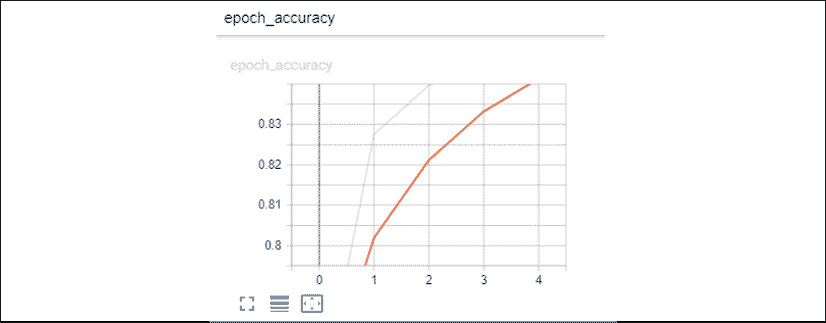

图 13.31：模型的准确性

+   **基础流程，包括激活函数**：TensorBoard 具有深入功能。你可以深入查看 TensorFlow 2.x 正在计算的实际操作：

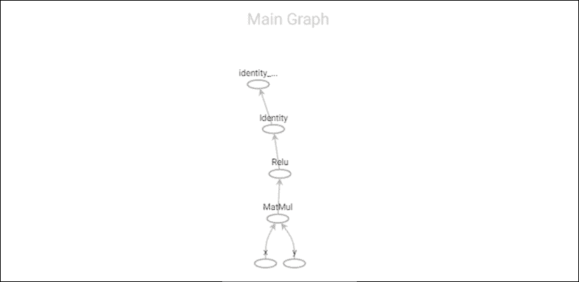

图 13.32：激活函数

+   **探索激活函数的细节**：一旦你看到了操作的流程，你甚至可以深入查看它是如何构建的：

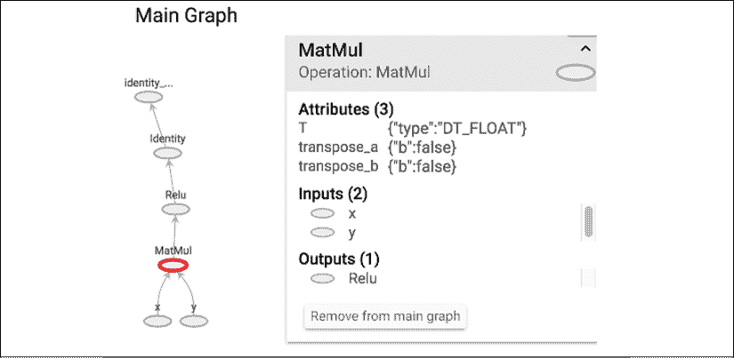

图 13.33：激活函数

这些 TensorBoard 图形和测量结果帮助你深入了解模型的工作原理。它们提供了对第一节中探索各层输出时所获得的见解的补充。

在本节中，我们通过多种可用的图形和工具，探讨了 TensorBoard 的架构功能，并衡量了我们模型的训练表现。

# 概述

在本章中，我们从内部探索了深度学习。我们看到，使用 TensorFlow 2.x 构建 CNN 现在变得容易，但深入了解其“思维”方式提供了关键的见解。

我们首先构建了一个拥有多层的 CNN。CNN 的抽象层次随着每一层的增加而提高。每层减少维度数使得模式显现。神经网络可以被描述为一个从混乱到有意义的过程。

在构建完 CNN 后，我们编写了一个程序，可以读取各层的“心智”图像。每层的输出展示了网络如何创建模式和结构。由于我们人类通常通过心智图像思考，CNN 的输出图像帮助我们理解机器是如何学习的。

最后，我们使用了 Google Colaboratory 服务器，通过在 TensorFlow 2.x 上运行的 TensorBoard 可视化了 CNN 学习过程的测量结果。衡量 CNN 训练过程的准确性至关重要。通过可视化这些测量结果，可以更容易地看出问题所在。TensorBoard 提供了一个模型图，帮助我们从源代码到人工神经网络（ANN）的心智模型进行转换。

总结这一章，我们可以说，人工智能通过数学将我们周围的混乱转化为可理解的结构和模式。

在下一章中，我们将进一步探讨并学习如何可视化神经网络的另一个方面：权重。我们将使用限制玻尔兹曼机（RBM）的权重，结合主成分分析，在 TensorBoard 中创建可视化表示。

# 问题

1.  一个 CNN 总是有相同数量的层。（是 | 否）

1.  ReLU 是最佳激活函数。（是 | 否）

1.  不需要编译一个顺序分类器。（是 | 否）

1.  最好在不运行预测的情况下查看层的输出。（是 | 否）

1.  查看层的输出时，层的名称没有任何意义。（是 | 否）

1.  TensorFlow 2.x 不包括 Keras。（是 | 否）

1.  Google Colaboratory 只是一个存储库，类似于 GitHub。（是 | 否）

1.  Google Colaboratory 无法运行笔记本。（是 | 否）

1.  可以在 Google Colaboratory 笔记本中运行 TensorBoard。（是 | 否）

1.  准确度在 TensorBoard 中显示。（是 | 否）

# 进一步阅读

+   有关激活函数的更多信息，请访问 [`keras.io/activations/`](https://keras.io/activations/)。

+   点击此链接查看更多关于 Google Colaboratory 的信息：[`colab.research.google.com/notebooks/welcome.ipynb#recent=true`](https://colab.research.google.com/notebooks/welcome.ipynb#recent=true)。
