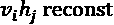
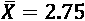

# 第十四章：使用限制玻尔兹曼机（RBM）和主成分分析（PCA）准备聊天机器人的输入

在接下来的章节中，我们将探索聊天机器人框架并构建聊天机器人。你会发现，创建一个聊天机器人的结构只需几次点击。然而，任何聊天机器人都无法在没有设计输入以准备所需对话流程的情况下建立。本章的目标是展示如何从数据集中提取特征，然后使用这些特征收集基本信息，以便在*第十五章*，*搭建认知 NLP UI/CUI 聊天机器人*中构建一个聊天机器人。

对话的输入需要深入研究和设计。在本章中，我们将构建一个**限制玻尔兹曼机**（**RBM**），它将分析一个数据集。在*第十三章*，*使用 TensorFlow 2.x 和 TensorBoard 可视化网络*中，我们研究了卷积神经网络（CNN）的层并显示了它们的输出。这次，我们将探索 RBM 的权重。我们将进一步使用 RBM 的权重作为特征。RBM 的权重可以转换为特征向量，供**主成分分析**（**PCA**）算法使用。

我们将使用 RBM 生成的特征向量，利用 TensorBoard Embedding Projector 的功能构建一个 PCA 展示。然后，我们将使用获得的统计数据为聊天机器人的输入打下基础。

为了说明整个过程，我们将使用流媒体平台数据作为示例，展示这一过程是如何完成的。流媒体已成为几乎所有智能手机拥有者的核心活动。Netflix、YouTube、Amazon 或任何提供流媒体服务的平台面临的问题是如何向我们推荐合适的视频。如果观众观看了一部视频，而平台没有展示一个相关的类似视频供其观看，观众可能会选择使用另一个平台。

本章分为两部分：

+   构建 RBM 并将其扩展为自动特征向量生成器

+   使用 PCA 来表示 RBM 的权重作为特征。TensorFlow 的 Embedding Projector 具有内置的 PCA 功能。生成的统计数据将为*第十五章*，*搭建认知 NLP UI/CUI 聊天机器人*中的对话结构提供基础。

让我们首先定义我们正在使用的基本术语和目标。

# 定义基本术语和目标

本章的目标是准备数据，以便创建我们将在*第十五章*，*搭建认知 NLP UI/CUI 聊天机器人*中构建的聊天机器人的输入。

创建一个聊天机器人需要准备工作。我们不能在没有足够信息的情况下直接进入项目。在本案例中，我们将检查一个基于电影偏好的数据集。我没有选择下载庞大的数据集，因为我们首先需要专注于理解过程，并使用基础数据构建模型。

数据集的大小在在线平台上每天都在增加。当我们在流媒体平台上观看电影时，例如 Netflix，我们可以喜欢这部电影或点击“点踩”按钮。

当我们在在线平台上对一部电影表示赞同或不赞同时，我们的偏好会被记录下来。这些电影的特征为平台提供了宝贵的信息，平台可以根据这些信息展示我们偏好的电影：动作、冒险、浪漫、喜剧等。

在本章中，我们将首先使用 RBM 提取用户或一组用户观看过的电影的描述（例如动作片、冒险片或喜剧片）。我们将利用 RBM 生成的输出权重，创建一个反映用户偏好的特征文件。

用户偏好的特征文件可以被视为一个人的“心智数据集”。这个名称一开始可能听起来有些陌生。然而，一个人的“心智”表示超越了标准的年龄、收入和其他无关紧要的数据。像“爱情”、“暴力”和“视野”（更广阔的视野、冒险）这样的特征，能让我们比驾照上的信息更深入地了解一个人。

在本章的第二部分，我们将使用 RBM 的输出，即一个人“心智”的特征，作为 PCA 的输入。PCA 将计算这些特征之间的关联性以及它们的变化，并且我们将通过 TensorBoard 展示这些结果。

然后，我们将通过 RBM 提取的关键特征，*看到*一个人心智的表现。这些信息将帮助我们在*第十五章*中创建一个定制化的聊天机器人。

让我们进入第一阶段，构建一个 RBM。

# 介绍并构建 RBM

RBM 是随机且无向的图模型，通常由一个可见层和一个隐藏层构成。它们曾在 Netflix 的竞赛中被用于预测未来的用户行为。这里的目标不是预测观众将会做什么，而是确定观众是谁，并将数据存储在观众的个人档案结构化的心智数据集中。输入数据代表了要训练的特征，以了解观众 X。每一列代表 X 潜在个性和品味的特征，每一行代表 X 观看过的电影的特征。以下代码（以及本节内容）在`RBM_01.py`中：

```py
np.array([[1,1,0,0,1,1],
         [1,1,0,1,1,0],
         [1,1,1,0,0,1],
         [1,1,0,1,1,0],
         [1,1,0,0,1,0],
         [1,1,1,0,1,0]]) 
```

该 RBM 的目标是通过计算观看过的电影特征，定义 X 的个人档案。输入数据也可以是图像、文字或其他形式的数据，和任何神经网络一样。

首先，我们将探索架构并定义什么是基于能量的神经网络。接着，我们将在 Python 中从零开始构建一个 RBM。

## RBM 的架构

使用的 RBM 模型包含两层：可见层和隐藏层。存在多种类型的 RBM，但通常它们具有以下特性：

+   可见单元之间没有连接，这就是它被称为*限制性*的原因。

+   隐藏单元之间也没有连接，进一步强化了网络的限制属性。

+   与前馈神经网络（FNN）不同，RBM 没有像在*第八章*《使用前馈神经网络解决 XOR 问题》中所探讨的那样的方向性。因此，RBM 的模型是一个*无向*图。

+   可见层和隐藏层通过一个权重矩阵和一个偏置向量连接，它们是以下图中的线条：


图 14.1：可见单元和隐藏单元之间的连接

网络包含六个可见单元和两个隐藏单元，产生一个 2×6 的权重矩阵，我们将为其添加偏置值。

你会注意到没有输出。系统从可见单元运行到隐藏单元再返回。我们正在使用这种类型的网络进行特征提取。例如，在本章中，我们将使用权重作为特征。

通过强制网络通过一个权重矩阵将其包含在 6 个单元中的数据表示为 2 个单元，RBM 创建了特征表示。隐藏单元、权重和偏置可以用于特征提取。

## 一种基于能量的模型

RBM 是一种基于能量的模型。能量越高，获得正确信息的概率越低；能量越低，概率越高——换句话说，准确度越高。

为了理解这一点，我们回到在《第一章，*通过强化学习开始下一代人工智能*》中观察的那杯茶：


图 14.2：一杯茶的复杂性

在《第一章》中，我们通过茶杯的全局内容和温度观察了它的微观状态。然后，我们使用马尔科夫决策过程（MDP）来进行微观状态计算。

这次，我们将关注茶杯的温度。`x` 将是茶杯中所有分子的全球温度：

+   如果 `x` = 1，这意味着温度非常高。茶刚刚沸腾。

+   如果 `x` = 0.5，这意味着温度已经下降。

+   如果 `x` = 0.1，这意味着温度还是有点暖和，但茶正在冷却。

温度越高，分子在茶杯中越活跃，能量水平越高，感觉就越热。

然而，温度越高，越接近非常热，我们能喝下它的概率就越低。

这导致了温度 `x` 的概率 `p`：

+   `x` -> 1, `p` -> 0

+   `x` -> 0, `p` -> 1

如你所见，在一个能量驱动的系统中，我们会努力降低能量水平。假设我们有一个对热饮耐受度未知的人，我们想知道他们是否能喝下我们的这杯茶。没人愿意喝冷的（低能量）茶，当然，但是如果我们关注的是一个人能否喝下这杯茶而不觉得太烫（高能量），那么我们就希望这杯茶的能量尽可能低（也就是冷却）！

为了说明我们这杯茶的 `p`(`x`) 系统，我们将使用欧拉数 `e`，它的值为 2.718281。`p`(`x`) 是我们能否喝下这杯茶的概率，`p` 是概率，`x` 是温度或能量。

我们将开始引入一个简单的能量函数，其中 `p`(`x`) = `e`^((–)^x^)：

+   `p`(`e`^((–1))) = 0.36

+   `p`(`e`^((–0.5))) = 0.60

+   `p`(`e`^((–0.1))) = 0.90

你可以看到，随着 –`x`（能量）减小，概率 `p`(`x`) 增加。

RBM 学习函数的目标是通过优化权重和偏置来降低能量水平。通过这样做，RBM 增加了优化隐藏单元、权重和偏置的概率。

为了计算 RBM 的能量，我们将考虑网络的完整架构。让我们再次显示我们的模型，如下所示：


图 14.3：可见单元和隐藏单元之间的连接

该 RBM 模型包含以下值：

+   `E`(`v`, `h`) 是能量函数，考虑了可见单元（输入数据）和隐藏单元。

+   `vᵢ` = 可见单元（输入）的状态。

+   `aᵢ` = 可见单元的偏置。

+   `hⱼ` = 隐藏单元的状态。

+   `bⱼ` = 隐藏单元的偏置。

+   `w`[ij] = 权重矩阵。

结合这些变量，我们可以为 、 和 *ij*（作为权重矩阵的行和列）定义 RBM 的能量函数，如下所示：


现在我们对 RBM 有了更好的理解，并了解了其背后的原理，让我们开始考虑如何从零开始使用 Python 构建一个 RBM。

## 在 Python 中构建 RBM

我们将使用 `RBM_01.py` 从头开始构建一个 RBM，完全手动，不依赖任何预构建的库。这样做的目的是从上到下理解一个 RBM，看看它是如何工作的。在构建机器的过程中，我们将深入探索更多的 RBM 理论。

### 创建类和 RBM 的结构

首先，创建 RBM 类：

```py
class RBM:
    def __init__(self, num_visible, num_hidden):
        self.num_hidden = num_hidden
        self.num_visible = num_visible 
```

类的第一个函数将接收隐藏单元的数量（`2`）和可见单元的数量（`6`）。

权重矩阵在第 20 行使用随机权重值进行初始化：

```py
 np_rng = np.random.RandomState(1234)
        self.weights = np.asarray(np_rng.uniform(
            low=-0.1 * np.sqrt(6\. / (num_hidden + num_visible)),
            high=0.1 * np.sqrt(6\. / (num_hidden + num_visible)),
            size=(num_visible, num_hidden))) 
```

偏置单元现在将在第 27 行插入到第一行和第一列：

```py
 self.weights = np.insert(self.weights, 0, 0, axis = 0)
        self.weights = np.insert(self.weights, 0, 0, axis = 1) 
```

该模型的目标是观察权重的行为。观察权重将决定如何根据可见单元和隐藏单元之间的计算来解释该模型的结果。

第一行和第一列是偏置，如前面的代码片段所示。仅对权重进行分析，以便进行性能分析。现在，权重和偏置已就位。

### 在 RBM 类中创建训练函数

在第 30 行，创建了训练函数：

```py
 def train(self, data, max_epochs, learning_rate): 
```

在此函数中：

+   `self` 是类。

+   `data` 是一个 6×6 的输入数组，包含 6 行电影和 6 列电影特征：

    ```py
    np.array([[1,1,0,0,1,1],
              [1,1,0,1,1,0],
              [1,1,1,0,0,1],
              [1,1,0,1,1,0],
              [1,1,0,0,1,0],
              [1,1,1,0,1,0]]) 
    ```

    本章中的 RBM 模型使用的是 **可见二进制单元**，如输入所示，这是该模型的训练数据。RBM 将使用输入作为训练数据。

    一个 RBM 可以包含其他类型的单元：softmax 单元、高斯可见单元、二项单元、修正线性单元等。我们的模型专注于二进制单元。

+   `max_epochs` 是 RBM 训练的轮数。

+   `learning_rate`是应用于包含权重和偏置的权重矩阵的学习率。

我们将在第 35 行的第一列插入偏置单元`1`：

```py
 data = np.insert(data, 0, 1, axis = 1) 
```

初始化偏置的策略还有其他方法。这是一个试错过程，取决于你的项目。在这种情况下，`1`的偏置单元足以完成任务。

### 训练函数中计算隐藏单元

在第 37 行，我们通过计算隐藏单元的值，开始训练 RBM，持续`max_epochs`：

```py
 for epoch in range(max_epochs): 
```

第一个阶段是专注于隐藏单元。我们通过点积矩阵乘法激活隐藏单元的概率：

```py
 pos_hidden_activations = np.dot(data, self.weights) 
```

然后，我们应用了逻辑函数，如同在*第二章*中所看到的，*构建奖励矩阵 - 设计你的数据集*：

```py
 pos_hidden_probs = self._logistic(
                pos_hidden_activations) 
```

逻辑函数在第 63 行被调用：

```py
 def _logistic(self, x):
        return 1.0 / (1 + np.exp(-x)) 
```

我们将偏置设置为`1`：

```py
 pos_hidden_probs[:,0] = 1 # Fix the bias unit. 
```

我们现在已经计算出了带有随机权重的隐藏状态概率的第一次迭代。

### 为重建和对比散度随机采样隐藏单元

有许多采样方法，例如吉布斯采样，它具有随机化方法，以避免确定性样本。

在这个模型中，我们将选择一个随机样本，该样本选择的隐藏概率值超过一个随机值样本的值。`random.rand`函数生成一个随机矩阵，值介于`0`和`1`之间，矩阵的大小为`num_examples`×`self.num_hidden+1`：

```py
 pos_hidden_states = pos_hidden_probs >
                np.random.rand(num_examples, self.num_hidden + 1) 
```

这个样本将用于我们将在下一节中探讨的**重建**阶段。

我们还需要计算用于**对比散度**（更新权重矩阵的函数）阶段的关联，这是接下来所解释的：

```py
 pos_associations = np.dot(data.T, pos_hidden_probs) 
```

可见数据单元`v`与隐藏单元`h`的点积可以表示如下：


现在点积已经实现，我们将构建重建阶段。

### 重建

RBM 使用其输入数据作为训练数据，使用随机权重矩阵计算隐藏权重，然后*重建*可见单元。与其他神经网络的输出层不同，RBM 重建可见单元并将其与原始数据进行比较。

以下代码应用与之前描述的隐藏单元相同的方法来生成可见单元：

```py
 neg_visible_activations = np.dot(pos_hidden_states,
                self.weights.T)
            neg_visible_probs = self._logistic(
                neg_visible_activations)
            neg_visible_probs[:,0] = 1 # Fix the bias unit 
```

这些负向可见单元将用于评估 RBM 的误差水平，如此处所解释。

现在，我们已经通过隐藏单元状态样本生成了可见单元，接下来我们生成相应的隐藏状态：

```py
 neg_hidden_activations = np.dot(neg_visible_probs,
                self.weights)
            neg_hidden_probs = self._logistic(
                neg_hidden_activations)
            neg_associations = np.dot(neg_visible_probs.T,
                neg_hidden_probs) 
```

请注意，`neg_associations`可以表示为以下形式：



这里，我们已经完成了以下操作：

+   使用包含训练数据的可见单元计算正向隐藏状态

+   从这些正向隐藏状态中随机选择一个样本

+   重建负向（从隐藏状态生成的，而非数据）可见状态

+   然后，由可见状态生成的隐藏状态

我们已经通过此过程*重构*了可见状态。然而，我们需要评估结果并更新权重。

### 对比散度

为了更新权重，我们不使用梯度下降。在这个能量模型中，我们使用对比散度，它可以表达如下：


字母是学习率。学习率应该是一个小值，并且可以在整个训练过程中进行优化。我总共使用了一个较小的值 0.001。

更新权重的源代码如下：

```py
 self.weights += learning_rate * ((pos_associations -
                neg_associations)) 
```

在多个时代中，权重会进行调整，从而降低能量和误差水平，进而提高概率的准确性。

此时，我们将展示 RBM 在整个训练过程中误差水平和能量值的变化。

### 误差和能量函数

在第 56 行，误差函数计算数据提供的可见单元与重构的可见单元之间差异的平方和：

```py
 error = np.sum((data - neg_visible_probs) ** 2) 
```

对于能量函数，我们可以使用原始的能量方程：


在我们的代码中，我们不会使用偏置，因为我们通常将其设置为`1`。

我们还需要一个函数来衡量 RBM 能量的演变。

能量将通过概率函数`p`来衡量：


`Z`是一个**配分函数**，用于确保每个`x`输入的概率之和不超过 1：


配分函数是每个`x`的所有单独概率之和：


相应的代码将计算 RBM 的能量，随着 RBM 经历多个时代，能量会逐渐降低：

```py
 energy=-np.sum(data) - np.sum(neg_hidden_probs)-
                np.sum(pos_associations * self.weights)
            z=np.sum(data)+np.sum(neg_hidden_probs)
            if z>0: energy=np.exp(-energy)/z; 
```

你会注意到，误差函数和能量函数都不会影响训练过程。训练过程基于对比散度。

误差和能量值将通过提供有关 RBM 训练行为的一些见解，来衡量模型的效率。

这是在过程开始时和结束时这些测量值的示例：

```py
Epoch 0: error is 8.936507744240409  Energy: 1586106430052073.0
...
Epoch 4999: error is 4.498343290467705  Energy: 2.426792619597097e+46 
```

在第 0 个时代，误差很高，能量也很高。

在第 4999 个时代，误差足够低，模型能够生成正确的特征提取值。能量显著降低。

## 运行时代并分析结果

一旦 RBM 为`n`个时代优化了权重-偏置矩阵，该矩阵将为 X 人物的分析系统提供以下信息：

```py
[[ 0.91393138 -0.06594172 -1.1465728 ]
[ 3.01088157 1.71400554 0.57620638]
[ 2.9878015 1.73764972 0.58420333]
[ 0.96733669 0.09742497 -3.26198615]
[-1.09339128 -1.21252634 2.19432393]
[ 0.19740106 0.30175338 2.59991769]
[ 0.99232358 -0.04781768 -3.00195143]] 
```

一个 RBM 模型使用随机值，每次训练时都会产生稍有不同的结果。

RBM 将训练输入并显示添加到 X 个人档案中的特征。

特征的权重已经为 X 人物进行了训练。第一行是偏置，检查第 2 列和第 3 列。接下来的六行是 X 人物特征的权重：

```py
[[ 0.913269 -0.06843517 -1.13654324]
[ 3.00969897 1.70999493 0.58441134]
[ 2.98644016 1.73355337 0.59234319]
[ 0.953465 0.08329804 -3.26016158]
[-1.10051951 -1.2227973 2.21361701]
[ 0.20618461 0.30940653 2.59980058]
[ 0.98040128 -0.06023325 -3.00127746]] 
```

权重（以粗体显示）是第 2 到第 6 行，第 2 到第 3 列。第一行和第一列是偏置项。

解释 RBM 权重的方式仍然是需要小心构建的策略。在这种情况下，尝试了一种创新方法来确定营销行为。RBM 还有许多其他用途，例如图像处理。在这种情况下，权重矩阵将通过汇总特征的权重行来提供 X 的个人档案，如下代码所示：

```py
 for w in range(7):
        if(w>0):
            W=print(F[w-1],":",r.weights[w,1]+r.weights[w,2]) 
```

现在，特征已被标记，如下输出所示：

```py
love : 2.25265339223
happiness : 2.28398311347
family : -3.16621250031
horizons : 0.946830830963
action : 2.88757989766
violence : -3.05188501936
A value>0 is positive, close to 0 slightly positive
A value<0 is negative, close to 0 slightly negative 
```

我们可以看到，除了标准的电影分类之外，X 喜欢一些广阔的视野，不喜欢暴力，并且喜欢动作片。X 认为幸福和爱情很重要，但目前并不看重家庭。

RBM 已为 X 提供了个人档案——这不是一个预测，而是通过聊天机器人准备好建议，或者只是构建 X 的机器心智数据集。

我们已从数据集中提取了主要特征，并使用 RBM 对其进行处理。接下来的步骤是将权重作为特征向量用于 PCA。

# 使用 RBM 的权重作为 PCA 的特征向量

在这一部分，我们将编写一个增强版的 `RBM_01.py`。`RBM_01.py` 生成了一个名为 X 的观众的特征向量。现在的目标是提取 12,000 个观众的特征向量，例如，为主成分分析（PCA）提供足够数量的特征向量。

在 `RBM_01.py` 中，首先在矩阵中提供了观众 X 喜欢的电影。现在的目标是生成 12,000 个观众特征向量的随机样本。

当前的任务是创建一个 RBM 启动器，运行 RBM 12,000 次，以模拟随机选择观众及其喜欢的电影，即观众喜欢的电影。然后，每个观众的特征向量将被存储。

`RBM_launcher.py` 首先将 RBM 导入为 `rp`：

```py
import RBM as rp 
```

`RBM_launcher.py` 的主要目标是执行运行 RBM 的基本功能。一旦 `RBM` 被导入，特征向量的 `.tsv` 文件将被创建：

```py
#Create feature files
f=open("features.tsv","w+")
f.close 
```

当调用导入的 `RBM` 函数 `rp` 时，它将附加特征文件。

下一步是创建包含元数据的标签文件：

```py
g=("viewer_name"+"\t"+"primary_emotion"+"\t"+"secondary_emotion"+
    "\n")
with open("labels.tsv", "w") as f:
    f.write(g) 
```

你会注意到“情感”一词的使用。在这里，“情感”指的是情感分析的特征，而不是特指人类情感。在此背景下，请将“情感”理解为情感分析特征。

现在，我们准备运行 RBM 12,000 次以上，例如：

```py
#Run the RBM feature detection program over v viewers
print("RBM start")
vn=12001
c=0
for v in range (0,vn):
    rp.main()
    c+=1
    if(c==1000):print(v+1);c=0;
print("RBM over") 
```

`rp.main()` 调用了 `RBM.py` 中的 `main()` 函数，我们将增强此函数以适应当前的过程。

我们将逐步在另一个名为 `RBM.py` 的文件中增强 `RBM_01.py`。我们将从第 65 行开始调整代码，创建一个 RBM 启动器选项：

一个名为 `pt` 的变量被设置为 `0` 或 `1`，取决于是否希望显示中间信息：

```py
 # RBM_launcher option
    pt=0  #restricted printing(0), printing(1) 
```

由于这是一个自动化过程，`pt` 设置为 `0`。

10 部电影的元数据存储在 `titles` 中：

```py
 # Part I Feature extractions from data sources
    # The titles of 10 movies
    titles=["24H in Kamba","Lost","Cube Adventures",
            "A Holiday","Jonathan Brooks",
             "The Melbourne File", "WNC Detectives",
             "Stars","Space L","Zone 77"] 
```

从第 71 行开始，创建了一个包含每部电影六个特征的电影特征矩阵，其特征与 `RBM_01.py` 中的特征相同：

```py
 # The feature map of each of the 10 movies. Each line is a movie.
    # Each column is a feature. There are 6 features: ['love', 'happiness', 'family', 'horizons', 'action', 'violence']
    # 1= the feature is activated, 0= the feature is not activated
    movies_feature_map = np.array([[1,1,0,0,1,1],
                                   [1,1,0,1,1,1],
                                   [1,0,0,0,0,1],
                                   [1,1,0,1,1,1],
                                   [1,0,0,0,1,1],
                                   [1,1,0,1,1,0],
                                   [1,0,0,0,0,0],
                                   [1,1,0,1,1,0],
                                   [1,1,0,0,0,1],
                                   [1,0,0,1,1,1],
                                   [1,1,0,0,1,0],
                                   [1,1,0,1,1,1],
                                   [1,1,0,0,1,1]]) 
```

矩阵的每一行包含一部电影，每一列代表该电影的六个特征之一。如果值为`0`，表示该特征不存在；如果值为`1`，表示该特征存在。

在未来几年，每部电影的特征数量将扩展为无限数量，以进一步优化我们的偏好。

创建一个空的输出矩阵。在`RBM_01.py`中，结果已经给出。在这个例子中，它将被随机选择填充：

```py
 #The output matrix is empty before the beginning of the analysis
    #The program will take the user "likes" of 6 out of the 10 movies

    dialog_output = np.array([[0,0,0,0,0,0],
                              [0,0,0,0,0,0],
                              [0,0,0,0,0,0],
                              [0,0,0,0,0,0],
                              [0,0,0,0,0,0],
                              [0,0,0,0,0,0]]) 
```

现在，随机电影选择器将为每部电影和每位观众生成喜欢或不喜欢的选择：

```py
 #An extraction of viewer's first 6 liked 6 movies out n choices
    #Hundreds of movies can be added. No dialog is needed since a cloud streaming services stores the movie-likes we click on
    mc=0   #Number of choices limited to 6 in this example
    a="no" #default input value if rd==1
    #for m in range(0,10):
    if pt==1:print("Movie likes:");
    while mc<6:
        m=randint(0,9)# filter a chosen movie or allow (this case) a person can watch and like a movie twice=an indication
        b=randint(0,1)# a person can like(dislike) a movie the first time and not the second(or more) time
        if mc<6 and (a=="yes" or b==1):
            if pt==1:print("title likes: ",titles[m]);
            for i in range(0,6):dialog_output[mc,i]=
                movies_feature_map[m,i];
            mc+=1
        if mc>=6:
            break 
```

我们可以选择是否显示输入：

```py
 #The dialog_input is now complete
    if pt==1:print("dialog output",dialog_output); 
```

对话输出是平台通过其喜欢/不喜欢界面收集的数据。RBM 正在进行训练会话：

```py
 #dialog_output= the training data
    training_data=dialog_output
    r = RBM(num_visible = 6, num_hidden = 2)
    max_epochs=5000
    learning_rate=0.001
    r.train(training_data, max_epochs,learning_rate) 
```

现在，RBM 训练会话的结果从第 185 行到第 239 行被处理，用以将获得的权重转换为特征向量及相应的元数据：

```py
###Processing the results
    # feature labels
    F=["love","happiness","family","horizons","action","violence"]
    .../...
        control=[0,0,0,0,0,0]
        for j in range(0,6):
            for i in range(0,6):
                control[i]+=dialog_output[j][i]
    ###End of processing the results 
```

现在的目标是选择由特定观众挑选的某部电影的主要特征。例如，这个特征可以是“爱情”或“暴力”：

```py
 #Selection of the primary feature
    for w in range(1,7):
        if(w>0):
            if pt==1:print(F[w-1],":",r.weights[w,0]);
            tw=r.weights[w,0]+pos
            if(tw>best1):
                f1=w-1
                best1=tw
            f.write(str(r.weights[w,0]+pos)+"\t")
    f.write("\n")
    f.close() 
```

次要特征同样非常有趣。它通常提供比主要特征更多的信息。观众通常会倾向于观看某一类型的电影。然而，次要特征因电影而异。例如，假设一位年轻观众喜欢动作片。“暴力”可能是主要特征，但在某些情况下，次要特征可能是“爱情”，而在其他情况下则是“家庭”。次要特征存储在该观众的特征向量中：

```py
 #secondary feature
    best2=-1000
    for w in range(1,7):
        if(w>0):
            tw=r.weights[w,0]+pos
            if(tw>best2 and w-1!=f1):
                f2=w-1
                best2=tw 
```

元数据保存在标签文件中：

```py
 #saving the metadata with the labels
    u=randint(1,10000)
    vname="viewer_"+str(u)
    if(pt==1):
        print("Control",control)
        print("Principal Features: ",vname,f1,f2,"control")

    f= open("labels.tsv","a")
    f.write(vname +"\t"+F[f1]+"\t"+F[f2]+"\t")
    f.write("\n")
    f.close() 
```

在这个例子中，这个过程将重复 12,000 次。

特征向量`features.tsv`文件已经创建：


图 14.4：特征向量文件

特征向量`labels.tsv`元数据文件与特征向量文件匹配：

```py
viewer_name    primary_emotion    secondary_emotion
viewer_8481    love               violence
viewer_3568    love               violence
viewer_8667    love               horizons
viewer_2730    love               violence
viewer_3970    love               horizons
viewer_1140    love               happiness 
```

你会注意到“爱情”和“暴力”出现得很频繁。这是因为我构建数据集时，大多数选择了包含动作和某种形式的角色之间温馨关系的电影，这在年轻一代的电影中很典型。

现在特征向量和元数据文件已创建，我们可以使用 PCA 来表示这些点。

## 理解 PCA

PCA 在营销中被 Facebook、Amazon、Google、Microsoft、IBM 和许多其他公司高效应用，此外，还有其他特征处理算法。

面向服装、食品、书籍、音乐、旅游、汽车及其他市场消费者群体的概率机器学习训练仍然非常高效。

然而，人类不仅仅是消费者；他们是有感情的个体。当他们联系网站或呼叫中心时，标准答案或刻板的情感语调分析方法可能会受到一个人神经状态的影响。当人类与医生、律师及其他专业服务人员接触时，若发生重大个人危机，需要一种人情味。

在这种情况下，PCA 的目标是提取关键特征来描述一个个体或一个群体。PCA 阶段将帮助我们建立 X 的心智表示，无论是与 X 沟通，还是将 X 的心智作为一个强大、*深思熟虑* 的聊天机器人或决策者来使用。

PCA 不是一个简单的概念，所以我们需要花些时间来正确理解它。我们将从一个直观的解释开始，然后再深入了解背后的数学原理。

PCA 将数据表示为更高层次的形式。

举个例子，假设你在你的卧室里。房间里有一些书、杂志和音乐（可能在你的智能手机上）。如果你把你的房间看作一个三维笛卡尔坐标系，房间里的物品就会有特定的 `x`、`y`、`z` 坐标。

为了进行实验，将你最喜欢的物品放在你的床上。将你最喜欢的物品放在一起，次喜欢的物品稍微远一些。如果你将你的床想象成一个二维笛卡尔空间，你就刚刚让你的物品改变了维度。你把你最重视的物品带入了更高的维度。现在，它们比那些对你来说价值较小的物品更为显眼。

它们不再处于原来的位置；它们现在在你的床上，并且根据你的兴趣，位于特定的坐标上。

这就是 PCA 的哲学。如果数据集中的数据点数量非常庞大，那么一个人的“心智数据集”的 PCA 总是会与另一个人的 PCA 表示不同，像 DNA 一样。“心智数据集”是一个人思想、图像、文字和情感的集合。它不仅仅是经典的年龄、性别、收入等中性特征。“心智数据集”将带我们走进某个人的内心世界。

这就是概念表示学习元模型（CRLMM）应用于一个人心智表示的方式。每个人都是不同的，每个人都值得拥有一个定制化的聊天机器人或机器人处理。

### 数学解释

计算 PCA 的主要步骤对于理解如何从直观方法过渡到 TensorBoard 嵌入投影仪使用 PCA 表示数据集非常重要。

#### 方差

方差是指一个值发生变化的情况。例如，夏天太阳升起时，温度逐渐变暖。方差由某一时刻的温度和几小时后的温度之间的差异来表示。协方差是指两个变量一起变化的情况。例如，当我们在外面时，天气越来越热，我们会出更多的汗来使身体降温。

+   **步骤 1**：计算数组 `data1` 的均值。你可以通过 `mathfunction.py` 来检查这一点，如下所示的函数：

    ```py
    data1 = [1, 2, 3, 4]
    M1=statistics.mean(data1)
    print("Mean data1",M1) 
    ```

    答案是 2.5。均值并不是中位数（数组中的中间值）。

+   **步骤 2**：计算数组`data2`的均值。均值的计算是通过以下标准函数实现的：

    ```py
    data2 = [1, 2, 3, 5]
    M2=statistics.mean(data2)
    print("Mean data2",M2) 
    ```

    答案是 。`X` 上方的横线表示它是一个均值。

+   **步骤 3**：使用以下方程计算方差：


现在，NumPy 将通过计算每个 `x` 减去均值的绝对值，求和并将总和除以 `n` 来计算方差，代码示例如下：

```py
#var = mean(abs(x - x.mean())**2).
print("Variance 1", np.var(data1))
print("Variance 2", np.var(data2)) 
```

一些方差根据数据集的总体来计算，使用 `n` - 1。

程序输出的方差结果如下所示：

```py
Mean data1 2.5
Mean data2 2.75
Variance 1 1.25
Variance 2 2.1875 
```

我们已经可以看到 `data2` 的变化远大于 `data1`。它们是否匹配？它们的方差是否接近？它们是否以相同的方式变化？我们接下来要做的目标是，了解两个词语，举例来说，是否经常一起出现或靠得很近，同时考虑到嵌入程序的输出。

#### 协方差

协方差将告诉我们这些数据集是否一起变化。该方程遵循与方差相同的理念，不过现在两个方差被结合在一起，看它们是否属于同一组：


与方差类似，分母可以是 `n` - 1，这取决于你的模型。此外，在这个方程中，分子被展开，以便可视化协方差的共同部分，如 `mathfunction.py` 中的以下数组实现：

```py
x=np.array([[1, 2, 3, 4],
            [1, 2, 3, 5]])
a=np.cov(x)
print(a) 
```

NumPy 的输出是协方差矩阵 `a`：

```py
[[1.66666667 2.16666667]
 [2.16666667 2.91666667]] 
```

如果你增加数据集中的一些值，它将增加矩阵部分的值。如果你减少数据集中的一些值，协方差矩阵的元素将会减少。

观察矩阵中某些元素的增减变化需要时间和观察。如果我们能找到一个或两个值来为我们提供这些信息呢？

#### 特征值和特征向量

为了理解协方差矩阵，特征向量会指向协方差的方向。特征值将表达给定特征的大小或重要性。

总结来说，特征向量将提供方向，特征值则提供协方差矩阵 `a` 的重要性。通过这些结果，我们将能够在多维空间中使用 TensorBoard 嵌入投影器表示 PCA。

设 `w` 为 `a` 的特征值。特征值必须满足以下方程：

```py
dot(a,v)=w * v 
```

必须存在一个向量 `v`，使得 `dot(a,v)` 与 `w*v` 相同。

NumPy 将通过以下函数来进行计算：

```py
from numpy import linalg as LA
w, v = LA.eigh(a)
print("eigenvalue(s)",w) 
```

特征值（按升序排列）将在以下输出中显示：

```py
eigenvalue(s) [0.03665681 4.54667652] 
```

现在，我们需要特征向量来查看这些值应该应用的方向。NumPy 提供了一个函数来同时计算特征值和特征向量。因为特征向量是通过矩阵的特征值计算的，如下代码所示：

```py
from numpy import linalg as LA
w, v = LA.eigh(a)
print("eigenvalue(s)",w)
print("eigenvector(s)",v) 
```

程序的输出如下所示：

```py
eigenvector(s) [[-0.79911221  0.6011819 ]
 [ 0.6011819   0.79911221]] 
```

特征值以 1D 数组的形式出现，包含 `a` 的特征值。

特征向量以二维方阵形式呈现，列中包含相应的值（每个特征值的值）。

#### 创建特征向量

剩下的步骤是将特征值从最高到最低进行排序。最高的特征值将提供主成分（最重要的部分）。与其对应的特征向量将是其特征向量。你可以选择忽略最低的特征值或特征。在数据集中，将会有数百个，甚至通常是数千个特征需要表示。现在我们得到了特征向量：

特征向量 = FV = {特征向量[1]，特征向量[2] … `n`}

`n`表示可能有更多特征需要转换为 PCA 特征向量。

#### 推导数据集

最后一步是转置特征向量和原始数据集，并将行特征向量与行数据相乘：

显示的数据 = 特征向量行 * 数据行

#### 总结

特征值的最高值是主成分。与其对应的特征向量将决定数据点在乘以该向量后将朝哪个方向排列。

## 使用 TensorFlow 的嵌入式投影仪表示 PCA

TensorBoard 嵌入式投影仪提供了一个内置的 PCA 功能，可以快速配置以满足我们的需求。TensorBoard 可以作为独立程序调用，也可以嵌入程序中，如我们在*第十三章*中看到的，*使用 TensorFlow 2.x 和 TensorBoard 可视化网络*。

我们将提取观众营销细分的关键信息，这些信息将用于开始构建*第十五章*中的聊天机器人，*设置认知 NLP UI/CUI 聊天机器人*。

首先，访问此链接：[`projector.tensorflow.org/`](https://projector.tensorflow.org/)

对于以下功能，请记住，TensorBoard 嵌入式投影仪在每个步骤中都在工作，具体时间可能根据你的机器不同而有所不同。我们通过点击**加载**来加载由`RBM_launcher.py`和`RBM.py`生成的数据：


图 14.5：加载按钮

当**从计算机加载数据**窗口出现时，我们通过点击**选择文件**来加载特征向量`features.tsv`文件：


图 14.6：加载特征向量文件

我们通过点击**步骤 2（可选）**中的**选择文件**来加载`labels.tsv`元数据文件：


图 14.7：加载 TSV 文件

为了获得我们 12,000 多个特征的良好表示，请点击**球形化数据**，默认模式下该选项未勾选：


图 14.8：球形化数据

我们现在选择标签为**secondary_emotion**，颜色为**secondary_emotion**，并按**secondary_emotion**进行编辑：


图 14.9：管理标签

为了获得数据的良好视图，我们激活夜间模式，以使月亮应处于活动状态：


图 14.10：激活夜间模式

此时，我们有一个漂亮的 PCA 表示法，它像地球一样旋转，或者像我们大脑中的想法，或我们正在分析的所有观众的想法，具体取决于我们如何使用这些特征。图像中的点是数据点，表示我们通过 RBM 计算的特征，然后通过 PCA 使用图像进行表示。这就像窥探内心世界：


图 14.11：特征的 PCA 表示法

给定一个人或一组人的特征的 PCA 表示法提供了创建聊天机器人对话的重要信息。让我们分析 PCA，以准备聊天机器人的数据。

## 分析 PCA 以获取聊天机器人的输入入口点

目标是收集一些信息，以启动我们的认知聊天机器人。我们将使用 TensorBoard 提供的过滤器。

选择**secondary_emotion**作为我们过滤器的基础：


图 14.12：过滤数据

我们正在分析的特征如下：

```py
F=["love","happiness","family","horizons","action","violence"] 
```

我们需要查看每个特征的统计数据。

我们在 TensorBoard 的搜索选项中键入特征，如“爱情”，然后点击下拉箭头：


图 14.13：TensorBoard 的搜索选项

PCA 表示法会实时改变其视图：


图 14.14：RBM 特征的 PCA 表示法

“爱情”有 643 个点。注意，“爱情”点位聚集在一个相对令人满意的位置。它们大多集中在图像的同一区域，而不是分散在整个图像中。这种分组表明，RBM 提供的特征在本次实验的 PCA 中是足够正确的。

我们对每个特征重复该过程，以获取每个特征的点数并进行可视化。在 GitHub 上为本章提供的数据集中，我们得到了：

+   爱情：643

+   幸福感：2267

+   Family: 0

+   Horizions: 1521

+   动作：2976

+   暴力：4594

    **重要**：如果再次运行`RBM_launcher.py`，该结果会发生变化，因为这是一个随机的观看者电影选择过程。

结果提供了关于我们为聊天机器人所针对的营销领域的有趣信息：

+   暴力和动作指向动作电影。

+   Family=0 表示更年轻的观众；例如，青少年更感兴趣的是动作而不是创建家庭。

+   发现幸福感和爱情是他们正在寻找的视野的一部分。

这通常出现在超级英雄系列和电影中。超级英雄通常是孤独的个体。

我们将在*第十五章*中看到如何构建聊天机器人并实现此目标，*设置认知 NLP UI/CUI 聊天机器人*。

# 总结

在本章中，我们准备了创建聊天机器人输入对话框的关键信息。使用 RBM 的权重作为特征是第一步。我们看到，可以使用神经网络从数据集中提取特征，并通过优化的权重进行表示。

处理电影观众的喜好/不喜欢可以揭示电影的特征，这些特征进一步提供了一个市场细分的心理表征。

将 PCA 与 RBM 链式连接，可以生成一个向量空间，几次点击即可在 TensorBoard 嵌入投影器中查看。

一旦设置好 TensorBoard，我们分析了统计数据，以了解数据集来源的市场细分。通过列出每个特征的点数，我们找出了驱动该市场细分的主要特征。

在发现我们分析的市场细分的一些关键特征后，我们可以进入下一章，开始为观众构建聊天机器人。同时，我们将保持后门可用，以防对话表明我们需要微调特征向量统计数据。

# 问题

1.  RBM 基于有向图。（是 | 否）

1.  RBM 的隐藏单元通常是相互连接的。（是 | 否）

1.  在 RBM 中不使用随机采样。（是 | 否）

1.  PCA 将数据转换为更高的维度。（是 | 否）

1.  在协方差矩阵中，特征向量显示了表示该矩阵的向量方向，而特征值显示了该向量的大小。（是 | 否）

1.  无法在机器中表示人类大脑。（是 | 否）

1.  机器无法学习概念，这就是为什么经典的应用数学足以为各个领域制作高效的人工智能程序。（是 | 否）

# 进一步阅读

+   想了解更多关于 RBM 的内容，请参考：[`skymind.ai/wiki/restricted-boltzmann-machine`](https://skymind.ai/wiki/restricted-boltzmann-machine)

+   本章源代码的原始参考网站可以在这里找到：[`github.com/echen/restricted-boltzmann-machines/blob/master/README.md`](https://github.com/echen/restricted-boltzmann-machines/blob/master/README.md)

+   原始的 Geoffrey Hinton 论文可以在这里找到：[`www.cs.toronto.edu/~hinton/absps/guideTR.pdf`](http://www.cs.toronto.edu/~hinton/absps/guideTR.pdf)

+   想了解更多关于 PCA 的内容，请参考这个链接：[`www.sciencedirect.com/topics/engineering/principal-component-analysis`](https://www.sciencedirect.com/topics/engineering/principal-component-analysis)

+   可直接使用的 RBM 资源可以在这里找到：[`pypi.org/project/pydbm/`](https://pypi.org/project/pydbm/)
