# 第十五章：设置一个认知 NLP UI/CUI 聊天机器人

仅 Facebook 上就有超过 30 万个聊天机器人。再加上一块砖石几乎毫无意义，除非你给你的聊天机器人一个目的，并为其提供真实的内容。认知内容代表了吸引比成千上万的竞争者和 SEO 专家更多注意力的核心目标。我们将在本章中使用 RBM-PCA 链式算法，使聊天机器人更上一层楼。我们将使用 RBM-PCA 提供的信息来设计我们的对话。

正如你将在第一部分中发现的那样，使用 Dialogflow 创建一个代理并开始一个对话几乎不需要任何努力。Google Dialogflow 提供了直观的功能，可以在短时间内启动聊天机器人。Dialogflow 的教程可以在几分钟内帮助你实现这个简单目标。理解什么是代理，教它提问并提供答案，这些都能由一个 10 岁的孩子完成。我通过让一个 5 岁和 9 岁的孩子使用这个软件进行了实验。他们甚至没有意识到这是一项工作，他们玩得很开心！

在 Dialogflow 中，你不需要知道如何编程，也不需要是语言学家或其他任何类型的专家。那么，你的市场差异化会是什么呢？*内容*。你的聊天机器人需要有一个目的，提供精心准备的内容，而不仅仅是问答简单问题。

除了创建你的第一个对话框，本章的目标将为你提供一种目的感和内容，这将帮助你制作有意义的聊天机器人。

话虽如此，让我们一起创建一个代理和一个简短的对话，以说明如何创建聊天机器人，同时也提供有意义的内容。

本章将涵盖以下主题：

+   基于*第十四章*的准备工作，创建一个认知代理，*使用限制玻尔兹曼机（RBMs）和主成分分析（PCA）准备聊天机器人的输入*

+   学习 Dialogflow 和聊天机器人的基本概念

+   将聊天机器人部署到你的网站上

我们将从基本概念开始，然后创建一个包含实体、意图、对话和履行功能的代理。我们将使用上一章中建立的准备工作。我们将通过拼写修正和对话来测试其 UI。然后，我们将通过设置机器学习语音识别和语音功能来测试聊天机器人的**对话用户界面**（**CUI**）能力。

# 基本概念

在创建代理之前，我们需要了解基本概念。

这不是一个 Dialogflow 课程，而是一个入门章节，帮助我们开始制作自己的 NLP CUI 聊天机器人。我们将从定义一些关键术语开始。

## 定义 NLU

**NLU** 代表 **自然语言理解**。NLU 是 **自然语言处理**（**NLP**）的一个子集。自然语言指的是我们日常使用的语言，无需强迫自己学习准确的词汇来从机器中获取信息。

如果我们必须学习一个仅包含能与系统兼容的词汇的字典，那么直接阅读文本会更容易。自然语言处理（NLP）涵盖了所有形式的自然语言处理，包括自然语言理解（NLU）。通过人工智能，NLU 在尝试理解给定句子的意思方面变得更加深入。

## 为什么我们称聊天机器人为“代理”？

聊天机器人是指至少有两方参与的对话。在我们的例子中，机器人是一个 NLU 模块。虽然这么说并不算是一个很吸引人的营销方式，它听起来像是：“你现在正在与一个 NLU 模块对话。”你不能假装一个机器人是一个人。*代理* 这个词传递了商务代理、体育经纪人或特工的印象，这听起来很神秘！它的含义是指一个收集信息的计算机系统。现在，它是一个具备 NLU 能力的 NLP 代理。

## 创建一个代理以了解 Dialogflow

学习 Dialogflow 的最快方法是从头开始创建一个对话。登录 Dialogflow 并进入控制台。以下是 Dialogflow 仪表板的一个截图，你可以看到右上角有控制台的链接：


图 15.1：访问 Dialogflow 控制台

一旦点击 **转到控制台**，如果你尚未登录系统，将要求你登录。拥有 Google 账号是前提条件：


图 15.2：使用 Google 账号登录

按照登录指引操作并成功登录后，你将进入 Dialogflow 控制台。

点击右上角的下拉菜单，不论当前显示的是哪个默认代理。会显示现有的或默认的代理列表：


图 15.3：代理列表

向下滚动列表，直到你看到 **创建新代理**（如果没有此选项，请点击 **创建代理**）。点击 **创建新代理**，你将进入以下窗口：


图 15.4：输入代理的名称

将代理命名为 `Agent + <你的名字或首字母>`，以确保你将拥有一个唯一的名字。我将本章的代理命名为 `cogfilmdr`。因此，本章中的代理将被称为 `cogfilmdr`。让 Google 创建一个默认的代理结构，主语言为英语。

完成后，点击左上角的设置按钮：


图 15.5：设置按钮

你将进入你的代理配置窗口。

目前，我们只有一个重要的选项需要检查。API 的版本必须是 V2 API。V1 API 将于 2020 年 3 月停止使用：

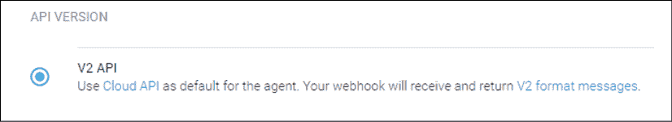

图 15.6：使用 V2 API

代理已经创建，我们可以开始创建实体。

## 实体

大多数聊天机器人教程首先讲解意图。我不同意这个做法。一旦你知道你的目标，在这种情况下是根据*第十四章*的内容，选择一部电影，*使用限制玻尔兹曼机（RBM）和主成分分析（PCA）准备聊天机器人的输入*，那么在构建结构之前，先搭建一些砖块是很有道理的。

Dialogflow（或任何聊天机器人）使用实体从用户的发言中提取有用的信息（不一定是一个句子）来理解他们的动机。

我们将使用*第十四章*中创建的实体。我们将首先创建一个名为`movies`的实体，其中包含在*第十四章*中使用的 10 部目标电影。

```py
 titles=["24H in Kamba","Lost","Cube Adventures",
            "A Holiday","Jonathan Brooks",
            "The Melbourne File", "WNC Detectives",
            "Stars","Space L","Zone 77"] 
```

在窗口左侧点击**Entities**：

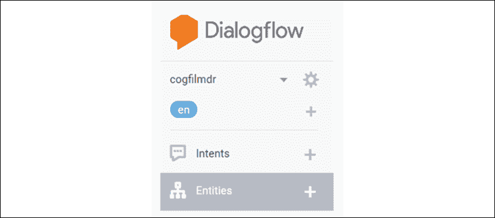

图 15.7：Dialogflow 菜单

然后，点击**CREATE ENTITY**：


图 15.8：创建一个实体

你将被要求提供一个实体名称：

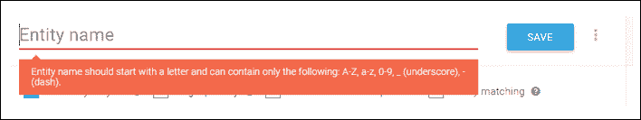

图 15.9：输入实体名称

输入`movies`。在保存实体之前，我们必须输入我们选择的电影：

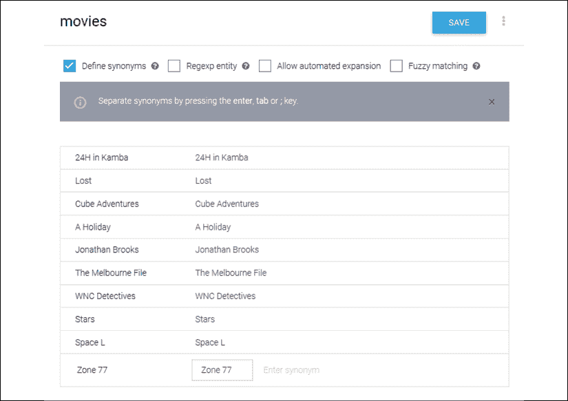

图 15.10：实体列表

你会注意到，一旦你添加了一个电影，默认的同义词会自动填充。如果你愿意，可以添加其他同义词。

一旦输入标题，点击**SAVE**按钮，这是必须的（这不是自动保存接口）：


图 15.11：保存实体

我们现在将创建特征实体。在*第十四章*中的`RBM.py`程序中的特征如下：

```py
# Each column is a feature. There are 6 features: ['love', 'happiness', 'family', 'horizons', 'action', 'violence'] 
```

我们将它命名为`features`，按照与`movies`实体相同的过程，然后点击**SAVE**：

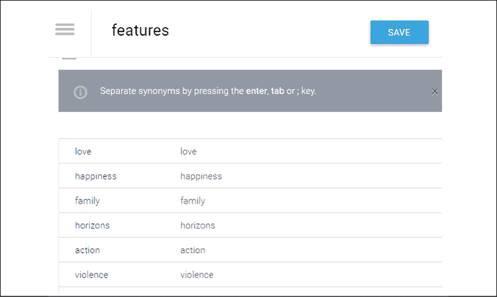

图 15.12：创建一个特征实体

点击代理下方的**Entities**，你将看到代理的实体列表，如下图所示：

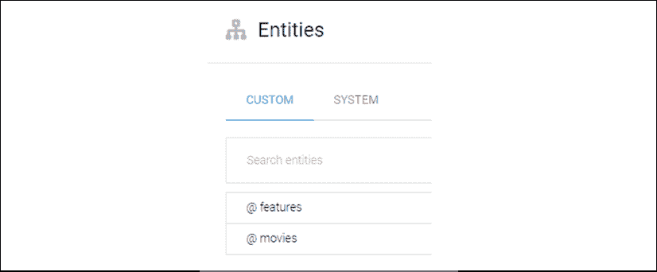

图 15.13：实体列表

如果你点击一个实体，会出现可能的选择列表。

现在你的代理已经知道了电影和特征实体，创建意图就有意义了。

## 意图

一个意图是明确的意图，表示要做某件事。我将代理命名为`cogfilmdr`。对于这个代理，用户的意图可能是请求推荐一部电影。

要触发响应，我们必须输入训练短语。

**训练短语**是用户通过文本或语音输入的一组词汇。你输入的句子越多，你的聊天机器人就会越智能。这就是为什么如果现有的代理满足你的需求，从一个现成的 Dialogflow 开始是有意义的。

为了创建我们的示例对话，我们将使用 GitHub 上提供的*第十四章*的数据集结果，*使用限制玻尔兹曼机（RBM）和主成分分析（PCA）准备聊天机器人的输入*。主要术语已经提取，并显示了其特征，这些特征我们用 TensorBoard 进行了展示。当我们从 RBM 中提取数据时，我们按照以下方式对特征进行了排序：

```py
Love: 643
Happiness: 2267
Family: 0
Horizons: 1521
Action: 2976
Violence: 4594 
```

我们在 PCA 中展示了特征空间：

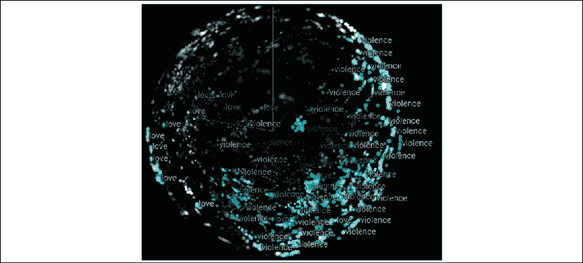

图 15.14：特征的 TensorBoard 表示

**提醒**：如果`RBM_launcher.py`再次运行，这个结果会自然改变，因为它是一个随机的观众-电影选择过程。

在开始聊天机器人项目时，最好非常小心，不要直接跳到自动生成对话的阶段。最好从一个简单且结构良好的聊天机器人开始，它仅执行有限数量的任务。我称之为“封闭型聊天机器人”，意味着我们控制对话的每个方面。“开放型聊天机器人”意味着信息会自动流入，从而创建自动对话。这可以作为目标，在聊天机器人作为“封闭型聊天机器人”运行一段时间后，利用 AI 算法准备的信息创建自动对话。

我们在*第十四章*所做的工作结果提供了关于我们为聊天机器人目标市场所针对的营销细分的有趣信息。

暴力和动作指向动作片。家庭=0 指向年轻观众，比如青少年，他们更感兴趣的是动作而不是创建一个家庭。发现幸福和爱是他们正在寻找的目标之一。这在超级英雄系列和电影中非常典型。超级英雄往往是孤独的个体。

我们现在将通过进入**意图**窗口来创建一个意图：


图 15.15：选择意图选项

**意图**窗口出现。点击**创建意图**：

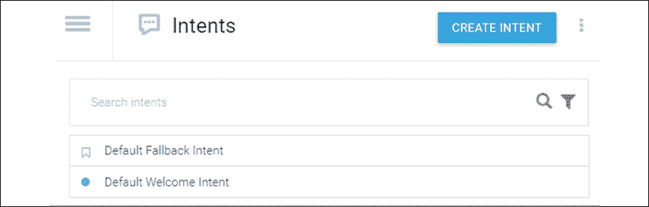

图 15.16：创建意图

意图窗口会出现，几步之内就能创建一个问答对话：

+   首先，输入`choose_movie`作为意图名称。

+   然后，在训练短语部分，输入：“我想看你们的一部电影。”

到此为止，我们有了一个意图名称和一个可能的用户问题：

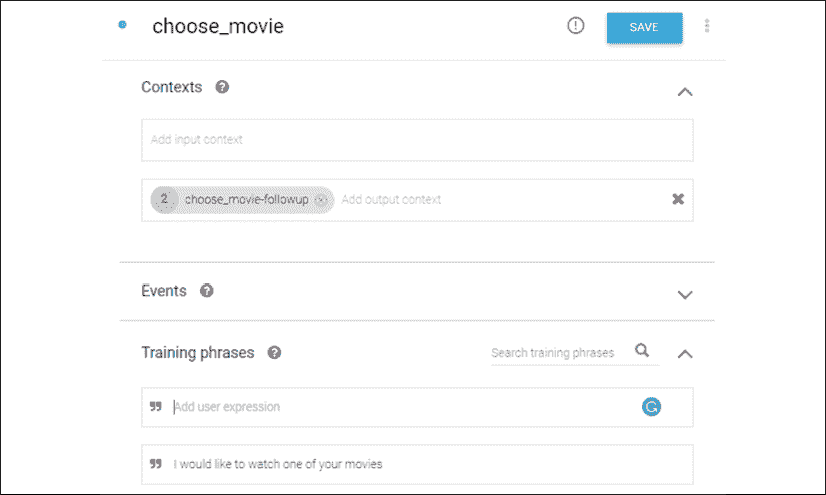

图 15.17：输入意图信息

现在，我们需要根据从*第十四章*中获取的该市场细分的统计数据来提供响应。我们将使用*动作*这个词来涵盖那些包含暴力和幸福结局的电影，就像典型的超级英雄电影一样。为此，请滚动到**文本响应**部分，添加响应并输入“你想看一部动作片吗？”，如下图所示：

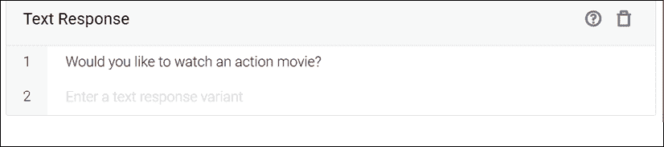

图 15.18：输入文本响应

现在我们已经有了一个基本的对话，接下来保存并测试它。为此，请前往控制台窗口右上角的测试控制台：

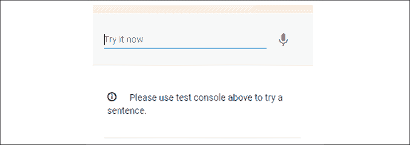

图 15.19：测试控制台

我们可以使用 CUI 或文本：

+   **文本对话**：输入用户短语：“我想看你们的一部电影。”

    用户会对代理人的回答感到惊讶：“你想看一部动作片吗？”


图 15.20：响应

这个建议对用户来说是一个惊喜，可能看起来有些奇怪。这是因为我们用来准备对话的 RBM-PCA 方法是针对一个市场细分的。

高级机器学习缩短了用户请求到满意回应的路径。它为用户节省了时间和精力。

+   **CUI**：点击测试控制台中的麦克风图标。确保麦克风已授权，否则它将无法工作：


图 15.21：麦克风

当你点击麦克风时，这将触发对你请求的录音。说：“我想观看你的一部电影。”然后，点击停止按钮来停止录音。请求的回应将显示：

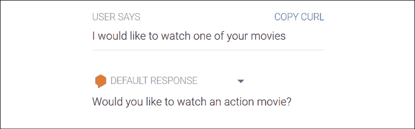

图 15.22：文本回应

为了回答这个问题，我们需要使用 Dialogflow 的上下文功能。

## 上下文

上下文意味着 Dialogflow 将记住对话，并使用后续交流，而不必每次从头开始。

用户请求观看一部电影，而机器人建议了一部动作片。机器人会通过上下文记住这一点，并继续对话。

点击菜单中的代理**意图**，然后悬停在**选择电影**上。你将看到**添加后续意图**出现。这意味着主意图的所有变量都可以存储，并且可以添加一个后续意图，记住之前说过的话，就像我们在对话中一样。

点击**添加后续意图**：


图 15.23：添加后续意图按钮

在这种情况下，代理已经计划了两个选项，*是*或*否*。我们将在本章探讨*是*的答案，而更复杂的*否*的答案将在*第十六章*，“提高聊天机器人情商缺陷”中讨论。

在*第十四章*中，我们创建了一个电影特征矩阵，包含了电影标题和特征：

```py
 # Part I Feature extractions from data sources
    # The titles of 10 movies
    titles=["24H in Kamba","Lost","Cube Adventures",
            "A Holiday","Jonathan Brooks",
            "The Melbourne File", "WNC Detectives",
            "Stars","Space L","Zone 77"]
    # The feature map of each of the 10 movies. Each line is a movie.
    # Each column is a feature. There are 6 features: ['love', 'happiness', 'family', 'horizons', 'action', 'violence']
    # 1= the feature is activated, 0= the feature is not activated
    movies_feature_map = np.array([[1,1,0,0,1,1],
                                   [1,1,0,1,1,1],
                                   [1,0,0,0,0,1],
                                   [1,1,0,1,1,1],
                                   [1,0,0,0,1,1],
                                   [1,1,0,1,1,0],
                                   [1,0,0,0,0,0],
                                   [1,1,0,1,1,0],
                                   [1,1,0,0,0,1],
                                   [1,0,0,1,1,1],
                                   [1,1,0,0,1,0],
                                   [1,1,0,1,1,1],
                                   [1,1,0,0,1,1]]) 
```

我们现在需要将这些信息转置到一个可以用来为对话添加内容深度的图表中：

| **电影/特征** | 爱情 | 幸福 | 家庭 | 视野 | 动作 | 暴力 |
| --- | --- | --- | --- | --- | --- | --- |
| 24 小时在坎巴 | 1 | 1 | 0 | 0 | 1 | 1 |
| 丢失 | 1 | 1 | 0 | 1 | 1 | 1 |
| 立方体冒险 | 1 | 0 | 0 | 0 | 0 | 1 |
| 假期 | 1 | 1 | 0 | 1 | 1 | 1 |
| 乔纳森·布鲁克斯 | 1 | 0 | 0 | 0 | 1 | 1 |
| 墨尔本档案 | 1 | 1 | 0 | 1 | 1 | 0 |
| WNC 侦探 | 1 | 0 | 0 | 0 | 0 | 0 |
| 星星 | 1 | 1 | 0 | 1 | 1 | 0 |
| 太空 L | 1 | 1 | 0 | 0 | 0 | 1 |
| 区域 77 | 1 | 0 | 0 | 1 | 1 | 1 |

我们已经通过直接提议一部动作片来稍微惊讶了用户，而无需通过冗长的列表。我们正在使用所有通过输入、中间 AI 输出和最终输出获得的信息。

现在，我们通过使用 RBM-PCA 链式算法提取的动作-暴力-幸福特征，进一步筛选符合这些特征的电影。

图表中只有以下电影符合动作-暴力-幸福特征：

+   24 小时在坎巴

+   丢失

+   假期

+   区域 77

我们会随机选择“Zone 77”。一旦我们输入了许多可能性，可以在回应区域或通过脚本提出随机选择。这个开发超出了本章的范围。在这个例子中，我们假设观众会对我们提出的建议感到满意。我们处于对话的*yes*场景中。在*第十六章*《提高聊天机器人的情商缺陷》中，我们将探索这个对话的*no*场景，这需要更多的认知设计来保持满意度路径的简短。

目前，让我们建议“Zone 77”。为此：

1.  点击**添加后续意图**。

1.  选择**yes**。

现在，你有了一个与对话关联的后续意图：


图 15.24：后续意图

点击**choose_movie - yes**。意图将会出现。你会注意到，Dialogflow 已经在**训练短语**部分填写了几个*yes*的形式，如下图所示：

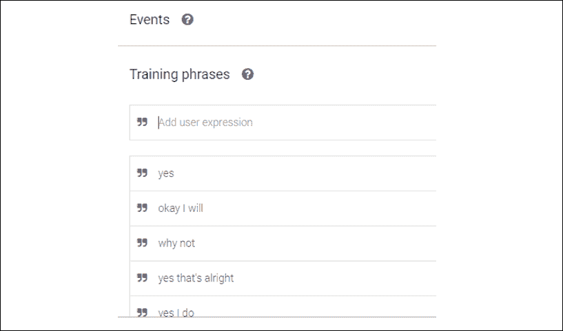

图 15.25：训练短语

在这种情况下，剩下的工作就是滚动到**回应**部分并添加我们的回答：

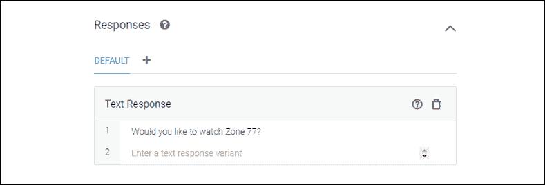

图 15.26：文本回应

现在，我们回到意图，并为这个后续添加一个*yes*后续，用来处理观众的*yes*回答，就像我们之前做的一样：

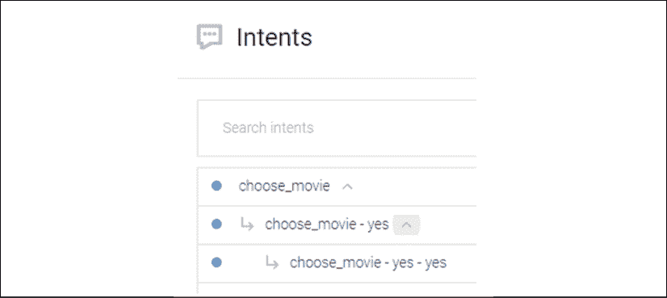

图 15.27：后续意图

现在，我们点击**choose_movie - yes - yes**，我们将看到 Dialogflow 为我们准备的*yes*回答：

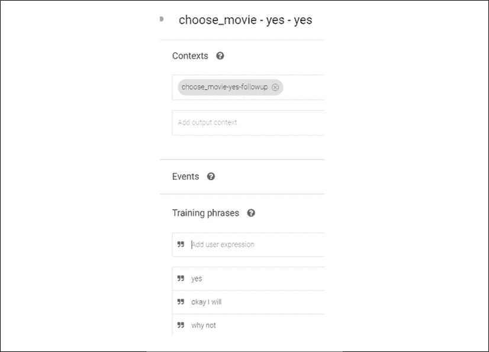

图 15.28：后续意图的训练短语

然而，这次我们希望用脚本来回答，而不是我们手动输入的回答。

为了实现这一点，我们可以使用履行。

# 向代理添加履行功能

对话在日常生活中很容易变得无聊，尤其是在聊天机器人中。当我们开始猜测对方要说什么时，我们的大脑会慢慢漂移开来。我们无法控制。人类是一个好奇的物种。**履行**将改变对话的视角。这就是我所说的超越实用方法的*目标*，它表示履行将商业逻辑添加到对话中。

为了使对话具备可持续性，即使从实际角度来看，它也必须足够吸引用户，让用户想要回来，探索更多关于你的聊天机器人的内容，而不仅仅是获取业务信息。

如果你查阅字典中的**fulfilling**，你会发现它的意思是提供幸福或满足感，这正是你希望你的聊天机器人传达的目标感。

话虽如此，为了达到这一目标，还需要做一些工作。Dialogflow 提供了多种工具，帮助用户、设计师和开发人员实现履行。

一开始，Dialogflow 使用内置的、无缝的 Node.js 版本来实现履行功能。

## 定义履行

提供各种履行或附加对话功能：

+   **Webhook**：Webhook 是通过 HTTP 传输的事件。它作为一个`POST`发送，其中包含发送到预定 URL 的数据。它作为 HTTP 回调工作。发送到该 URL 的数据将由服务器端的脚本进行解析。一旦服务处理完信息，它将执行某个操作并将数据作为响应发送回来。

    我们在这个示例中不会使用 webhook。然而，需要注意的是，你可以使用 webhook 在另一个环境中创建自己的对话。你甚至可以生成自动对话并从 Dialogflow 调用它们。

    如果你有兴趣准备对话并上传它们，你可以转到屏幕左侧代理的**训练**页面并上传短语：

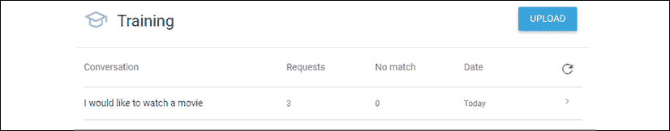

图 15.29：训练窗口

你还可以上传代理，甚至是由 Google Dialogflow 设计的预构建代理。对于我们的示例，我们将使用内联编辑器。

+   **使用内联 Node.js 编辑器进行履行**：定义一个 webhook URL 可能是最简单的方法。然而，使用内联编辑器提供了 Node.js 功能，带来更多潜力。

+   **使用内联 Node.js 编辑器和 Firebase Cloud Functions 进行履行**：内联 Node.js 可以在几行节省时间的代码中调用大量 Firebase Cloud Functions。

## 使用履行 webhook 增强 cogfilmdr 代理

当用户回答*是*想观看《Zone 77》时，我们可以用回应或链接到网站来回答。要使用回应，请转到**意图**窗口中的 yes - yes 后续对话：

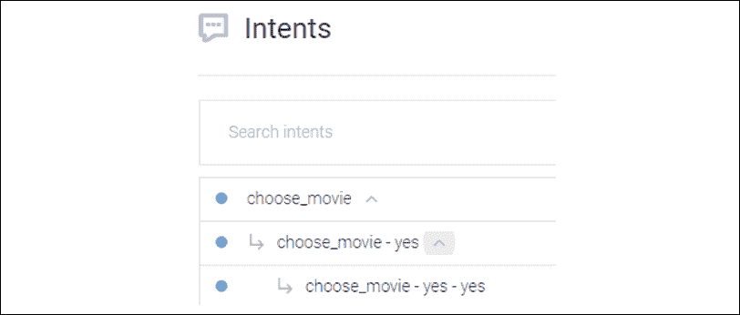

图 15.30：意图和后续意图

点击**choose_movie - yes - yes**并向下滚动到**文本响应**，然后添加类似“好的，点击电影并观看”的回应，如下图所示：

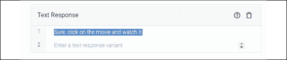

图 15.31：文本响应

我们还可以通过激活**将此意图设置为对话结束**选项来决定这是最终的，并且是对话的结束：


图 15.32：对话结束选项

但我们现在不会这样做；让我们继续向下滚动，激活内联 webhook 功能：


图 15.33：启用 webhook 功能

现在我们将进入**履行**窗口：

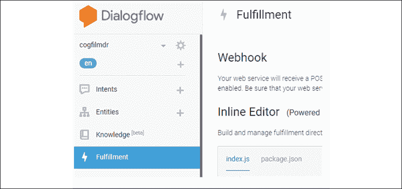

图 15.34：访问履行界面

首先，启用内联编辑器：


图 15.35：内联编辑器

为了给对话增添一些趣味，假设聊天机器人在一个酷炫的创业咖啡店里，并且在个人屏幕上观看电影是一项吸引顾客的服务。你可以与耳机一起观看电影（你、朋友、家人），例如。我们将这项服务添加到对话中。

我们进入脚本的`intentMap`并添加一个`gotomovie`函数：

```py
let intentMap = new Map();
intentMap.set('Default Welcome Intent', welcome);
intentMap.set('Default Fallback Intent', fallback);
// intentMap.set('your intent name here', yourFunctionHandler);
// intentMap.set('your intent name here', googleAssistantHandler);
intentMap.set('choose_movie-yes-yes', gotomovie); 
```

推荐的格式是`intentMap.set(<Intent>,<function>)`。

完成后，我们现在编写带有我们自己文本和网站链接的函数：

```py
function gotomovie(agent) {
    agent.add('This message is from Coffee Shop movie fans!');
    agent.add(new Card({
    title: 'A blog for Coffee Shops with movies to watch with friends and family',
    imageUrl: 'https://www.eco-ai-horizons.com/coffeeshop.jpg',
    text: 'The button takes you to the movie selection we have\n  Great to have you here! :-)',
    buttonText: 'Click here',
    buttonUrl: 'https://www.primevideo.com/'
    })
    );
} 
```

现在我们要做的就是点击**部署**，就完成了！

我添加了一个链接到 Amazon Prime Video，表明您可以使用 IBM Watson、Google、Microsoft、Amazon 等服务来增强您的聊天机器人！

**重要**：您可以在此编辑器中自定义所有对话，并使用一系列 Google Cloud 函数。天空甚至都不是极限，您可以飞往火星！

以我们的示例为例，一旦脚本被部署，我们会回到对话的开头，直到我们到达这一点，这将带我们到我们希望观看的电影。在此示例中，我只是展示了一个流媒体网站。

您可以在 GitHub 上的`dialogflowFulfillment.zip`中的`CH15`获取完整的`index.js`脚本，并将其复制到编辑器中，而无需导入整个包。

## 让机器人在您的网站上运行

让我们通过几个点击，在您的网站上运行一个机器人。

1.  向下滚动到**集成**，选择您希望部署的代理：无论是您自己的代理还是咖啡店代理。

1.  启用**Web 演示**选项。

1.  将显示类似以下内容的嵌入代码：

    ```py
    <iframe height="430" width="350" src="img/81298e0c-1acb-44bb-9c68-89666805342a"></iframe> 
    ```

复制您希望实现它的网站页面上的代码。

要先进行测试，您可以将网址复制到浏览器中并进行测试。

**注意**：如果您在浏览器中启用该站点的麦克风，您可以使用语音对话。不要忘记通过`https`访问页面，否则麦克风可能会被阻止。此外，在没有一些额外开发的情况下，无法在此 HTML 页面中激活履行。

然而，您也可以在控制台中点击 Google Assistant，通过几个点击创建一个应用程序，然后将其部署到智能手机和 Google Home 等设备上。如果您创建了一个不错的聊天机器人，您可以让全世界在几个点击内使用它！

# 机器学习代理

NLP 聊天机器人如果没有机器学习来进行文本识别、语音、句子、语音实体、意图以及对话的其他许多方面，是无法正常工作的。

在本节中，我们将探讨以下内容：

+   语音转文本

+   文本转语音

+   拼写修正

让我们看看如何在这些上下文中应用机器学习。

## 在聊天机器人中使用机器学习

通常，当我们听到聊天机器人中的机器学习时，我们会想到在对话过程中作为响应运行的机器学习程序。

在本节中，我们将重点介绍机器学习如何用于改进聊天机器人并使其正常工作。

## 语音转文本

如果没有语音转文本功能，您就无法在像 Google Home 或 Amazon Echo 这样的智能扬声器上实现聊天机器人或任何语音应用。智能扬声器将在未来几年在我们的生活中发挥越来越重要的作用。

点击代理名称旁边的设置按钮，然后点击**语音**：


图 15.36：语音选项

我们将重点介绍语音识别功能的主要设置：

+   **增强语音模型**：这是一个高级机器学习选项，仅限企业版。它展示了语音识别技术的进步。在标准版中，系统已经能够相当不错地工作；而在高级版中，它使用数据记录功能来增强语音识别。

+   **自动语音适应**：这非常有趣，因为此功能使用创建的意图和实体来训练并适应代理对话的语音识别。在免费版中也可以按以下方式激活：

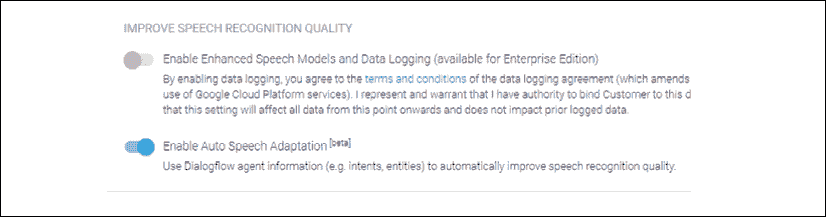

图 15.37：启用自动语音适应

在离开此界面之前，请保存设置。

## 语音合成

现在，我们可以进入 **语音** 标签并启用 **自动语音合成** 功能。我有一个云账户。如果你在实验室无法激活此功能，我们将使用免费的在线网站测试机器学习算法的可能性和限制。

**注意**：有一个增强版语音识别模型选项，但你必须升级到企业版才能使用。

点击代理名称旁边的设置按钮，然后点击 **语音**：

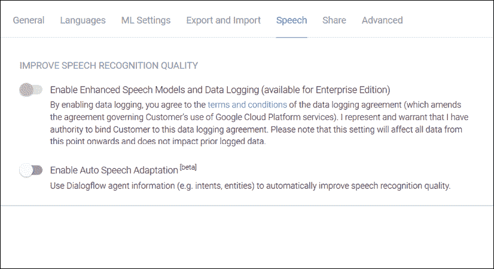

图 15.38：语音选项

我们将首先配置语音合成的主要设置：

+   **代理语言**：从 `en(English)` 开始，以覆盖最广泛的受众。然而，值得注意的是，Dialogflow 在多种语言中都能产生不错的语音效果。

+   **语音**：在尝试不同的 WaveNet 模型变体之前，先从 `Automatic` 开始。WaveNet 模型通过神经网络从零开始构建语音。

+   **语速**：你可以将其保持在 `1`，或者加速语速或减慢语速。例如，对于体育解说，语速可以更快。

+   **音调**：你可以将语音的音高调整为高音或低音。

+   **音量增益**：你可以调整音量大小，最好的做法是初始时将其设置为 `0`。然后，在测试代理时，看看是否需要调整。

设置好这些参数后，保存模型：

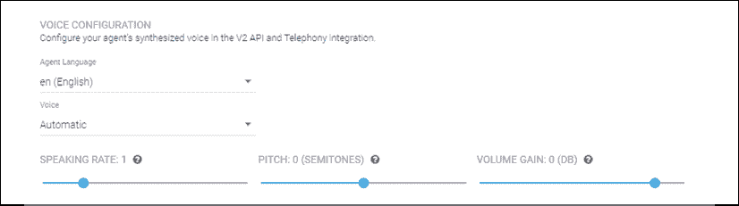

图 15.39：语音配置

现在，通过输入一句话并点击 **播放** 按钮，测试你的配置或尝试不同的设置：

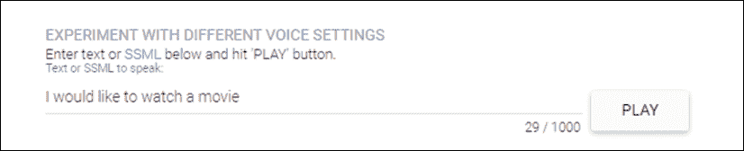

图 15.40：尝试不同的语音设置

一旦完成语音参数的设置，我们需要设置拼写机器学习功能。

## 拼写

在我们探索 Google 提供的机器学习算法的可能性和限制之前，剩下的一步是需要激活机器学习拼写功能。

为此，我们将点击 **ML 设置** 标签，激活 **自动拼写修正**，并定义一个可接受的阈值，低于此值，我们的代理将拒绝识别错误。

点击代理名称旁边的设置按钮，然后点击 **ML 设置**：


图 15.41：ML 设置标签

你将有多种选项来解决用户的拼写错误。它的工作方式类似于搜索引擎的拼写校正，当我们输入错误时，例如 Google 会建议正确的拼写。

选项如下：

+   **机器学习分类阈值**确定一个信心分数，低于该分数时，意图将不会被触发，除非存在回退意图（一个通用响应）。

+   **自动拼写校正**使用机器学习来纠正用户的拼写错误。它应该被激活。

+   **自动训练**可能会减慢对话速度，因此建议谨慎使用此功能。

+   **代理验证**在训练过程中自动验证代理。请注意，每次保存一个意图时，训练都会被触发，例如。

以下截图展示了你可能希望开始使用的默认值：

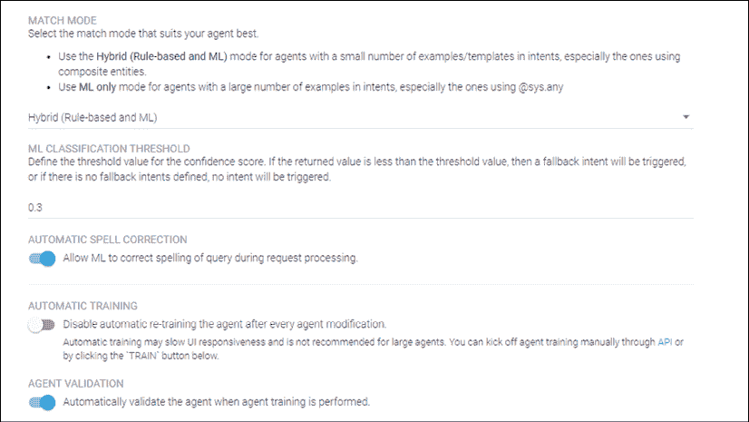

图 15.42：机器学习设置选项

每次更改选项时，请点击**训练**按钮。

## 为什么这些机器学习算法很重要？

如果它只是一个教育类聊天机器人，例如 `cogfilmdr` 代理示例，错误是可以接受的。这虽然令人不悦，但可以接受。正如我们在*第十六章*《提高聊天机器人的情感智能缺陷》中看到的那样，如果聊天机器人将被大量用户使用，这意味着需要多天的训练、测试以及为这些功能的机器学习限制创造解决方法。而这仅仅是针对一种语言！

如果我们部署多种语言，这意味着需要很多天，乘以语言数量！即使是机器学习，工作也非常艰难。没有机器学习的话，那就不可能完成。

机器学习不仅仅重要，它是至关重要的：

+   如果聊天机器人无法识别因为简单拼写错误而出现的书面话语，我们会收到投诉、差评，搜索引擎优化的船也会沉没。

+   如果聊天机器人无法识别你在 Google Home 或任何智能音响上的语音，那就意味着很多麻烦，甚至可能需要退款。

+   如果聊天机器人的回答听起来像一个 20 世纪的机器人假声音，那么没有人会愿意使用它。

聊天机器人中的机器学习将持续存在，但在情感智能方面仍有改进的空间，正如我们将在下一章中探讨的那样。

# 总结

Google Dialogflow 提供了一整套工具，允许你在 Google Cloud 上构建聊天机器人，为其添加服务，并通过你的认知程序进行自定义。

一个好的聊天机器人符合需求。在开发之前思考架构，避免模型的欠拟合（功能不足）或过拟合（不会使用的功能）。

精心准备的人工智能，如*第十四章*《使用限制玻尔兹曼机（RBM）和主成分分析（PCA）准备聊天机器人输入》中所展示的，为聊天机器人提供了坚实的基础，通过使对话从开始到目标的路径更短且高效。

确定正确的意图（聊天机器人需要完成的任务）、确定描述意图的实体（短语和词语的子集），以及创建恰当的对话将需要相当长的时间。

如果需要，添加服务和特别定制的机器学习功能将提升系统的质量。具有语音识别、语音对话和拼写纠正功能的 CUI 使聊天机器人使用起来更加流畅。

我们在本章构建的对话基于*是*的答案。我们假设在*第十四章*中使用 RBM 和 PCA 生成的概率是正确的。然而，人类并不容易被固守在刻板印象中。

*第十六章*，*改善聊天机器人情商不足*，通过基本概念、Dialogflow 功能和认知方法来探讨情商，从而提升聊天机器人的内容。

# 问题

1.  聊天机器人能像人类一样沟通吗？（是 | 否）

1.  聊天机器人一定是人工智能程序吗？（是 | 否）

1.  聊天机器人仅需要语言进行沟通。 （是 | 否）

1.  人类仅仅用语言聊天吗？（是 | 否）

1.  人类只用语言和数字思考。 （是 | 否）

1.  构建认知型聊天机器人需要精心的机器学习准备。 （是 | 否）

1.  为了使聊天机器人发挥作用，需要规划对话流程。 （是 | 否）

1.  聊天机器人具备通用人工智能，因此无需预先开发。 （是 | 否）

1.  除了翻译 API 外，聊天机器人没有其他功能也能很好地进行翻译。 （是 | 否）

1.  在大多数情况下，聊天机器人已经能够像人类一样进行对话。 （是 | 否）

# 深入阅读

+   关于 Google Dialogflow 的更多信息，请参考此链接：[`dialogflow.com/`](https://dialogflow.com/)

+   关于聊天机器人和 UI 开发的更多信息，请参考此链接：[`www.packtpub.com/application-development/hands-chatbots-and-conversational-ui-development`](https://www.packtpub.com/application-development/hands-chatbots-and-conversational-ui-development)
