# 第十六章：提升聊天机器人的情感智能缺陷

情感依然是非理性和主观的。AI 算法从不放弃理性和客观性。由此产生的认知失调，使得生产一个高效的聊天机器人变得更加复杂。

在*第十四章*，*使用限制玻尔兹曼机（RBM）和主成分分析（PCA）准备聊天机器人输入*中，我们构建了一个理性的链式算法流程，结合了 RBM 和 PCA 方法。由此，我们提取了一个市场细分的关键客观数据。根据这个市场细分及其特征，我们设计了*第十五章*，*设置认知 NLP UI/CUI 聊天机器人*中的对话。该对话是理性的，我们为用户提供了一个可能的服务选择。我们是出于善意来做这一切，希望能尽可能缩短从请求到结果的路径。这是一个*是*的路径，一切顺利进行。

在本章中，我们将面对人性带来的意外反应。*否*的路径将挑战我们的对话。我们面临的问题之一是情感的多义性，用户的情感信号容易混淆。

我们将通过从*第十四章*，*使用限制玻尔兹曼机（RBM）和主成分分析（PCA）准备聊天机器人输入*和*第十五章*，*设置认知 NLP UI/CUI 聊天机器人*中获取的信息，来应对*否*的意外路径，并进入数据记录的世界。

数据记录将提供关键的背景数据，以满足用户需求。目标将是创造情感，而不仅仅是随机地对用户的情感状态做出反应。

最后，我们将开启通过 RNN-LSTM 方法自动生成文本的研究之门。这个想法是基于数据记录，未来创造自动对话。

本章将涉及以下主题：

+   情感多义性

+   闲聊

+   数据记录

+   创造情感

+   探索 RNN-LSTM 方法

我们将首先探讨简单地对情感做出反应与创造情感之间的区别。

# 从对情感的反应，到情感的创造

设计一个能够对用户表达做出反应的聊天机器人是一回事。但像人类一样在对话中创造情感则需要更深入地理解聊天机器人如何管理情感。让我们从情感的多义性开始。

## 解决情感多义性问题

我们将通过解决情感的多义性问题来增强聊天机器人的情感智能。我们习惯于用词语来定义多义性，而不是情感，因为多义性是指一个词可以有多个含义。在*第六章*，*如何使用决策树增强 K 均值聚类*中，我们探讨了“coach”这个词带来的困惑。“Coach”可以指巴士或体育教练，这导致了英语到法语翻译的问题。

多义性同样适用于人工智能对情感的解读。我们将通过两个例子来探索这一领域：问候语和肯定语。

然后，我们将深入探讨语音识别和面部分析作为“灵丹妙药”解决方案的谬误，这些谬误误导我们认为面部表情的情感解读很简单。

### 问候问题示例

要实现这一章节，请打开 Dialogflow，进入在*第十五章*，*设置认知 NLP UI/CUI 聊天机器人*中创建的名为`cogfilm+<你的唯一 ID>`的代理。

假设某人向聊天机器人发送"嗨"。几乎每个人都会认为这是一个好的开始。但真的如此吗？

让我们探讨一些可能的解释：

+   **"嗨"意味着这个人非常紧张和烦躁**：这可能是一个高层经理，从不使用"嗨"来打招呼，不喜欢聊天机器人，或者怀疑正在测试的这个机器人是否有任何价值。

    这个经理通常会说："早上好"、"下午好"和"晚上好"。

+   **"嗨"意味着"那又怎样？"**：这更像是"嗯，嗨"。这可能是一个人 P，讨厌刚刚对他说"早安"的 Q。

+   **"嗨"，意味着"我有麻烦了"**：这可能是一个通常很开朗、快乐的人，他们说："大家好，今天一切还好吗？" 但是今天，他们只是简单地说了一个"嗨"。这会引起其他人的警觉反应，比如"你还好吗？" "发生了什么事吗？"

+   **"嗨"，意味着"我在试图友好"**：这可能是一个通常早上脾气暴躁、坐下来盯着笔记本直到咖啡因起作用的人。但今天，这个人完全精神饱满，清醒过来并说："嗨"。这可能引发其他人的警觉反应，比如"某人昨晚过得很愉快！我错了吗？"并伴随着一些笑声。

我可以继续列举成百上千种其他"Hi"的使用情况。为什么？因为人类有无数的行为可以反映在与他人初次见面时的那个"Hi"中。

这也适用于没有说"再见"或以多种方式说再见的情况。一个人在早晨和别人告别的方式可以有非常多的含义。

因此，这也是我们面临的挑战之一。在进一步探讨之前，让我们再看一个挑战，考虑一下确认示例。

### 确认示例

假设某人向聊天机器人发送或说"是的"。这真的是"是的"吗？

+   **"是的"，就像"随便吧"**：用户讨厌这个聊天机器人。对话很无聊。用户想，如果他们不说"是的"然后赶快结束，这段对话会一直持续下去。

+   **"是的"，就像"我不敢说不一样"**：用户并不想说"是的"。问题可能是："你对你的工作满意吗？" 用户可能担心答案被记录和监控。用户害怕受到制裁。尽管这个人讨厌他们的工作，回答仍然会是"是的"，或者甚至可能是"我当然喜欢！"

+   **“Yes”作为一个善意的“是”，但在之后让人后悔**：一个人对购买说“是”，是因为聊天机器人中广告的压力。但几分钟后，那个同样的人会想：“我怎么会说是并买了这个？”因此，一些平台允许在产品或服务交付之前就进行退款。

就像“Hi”一样，我可以列出数百个情感多义性的情况，涉及“Yes”。

现在，既然我们已经理解了眼前的挑战，让我们来探讨一下之前提到的银弹谬论。

### 语音识别的谬误

许多编辑和开发者相信，语音识别通过检测语音的语气可以解决情感智能的问题。

然而，情感多义性同样适用于语气。人类在感到威胁时往往会隐藏情绪，而在信任环境时则会敞开心扉。

让我们回到“Hi”和“Yes”的例子。

**用兴奋的语气说“Hi”**：例如，一个人 X 进入办公室。有人说：“哦，嗨！很高兴见到你！”人 Y 用非常开心的语气回答“Hi”。谷歌 Home 或亚马逊 Alexa 在他们的研究实验室中会生成 0.9 的概率，认为对话进行得很顺利。

这可能是真的，也可能是假的。

例如，Y 讨厌 X。X 知道这一点并故意说：“很高兴见到你！”Y 知道 X 知道他们彼此讨厌，但不会先爆发情绪。所以 Y 用非常开心的语气回答“Hi”。

在那时，许多人转向面部分析。

### 面部分析的谬误

情感多义性也适用于面部分析。许多人认为深度学习面部分析可以解决多义性的问题。

我最近看到一篇开发者的帖子，帖子里有一张显然是强迫微笑的照片，配文说幸福感可以通过深度学习面部分析来检测！

让我们来看看两种基本的面部表情并探讨它们：微笑和皱眉。到现在为止，你应该知道情感多义性同样适用于这两种情况。

#### 一种微笑

如果有人微笑，并且深度学习（DL）面部分析算法检测到这个微笑，意味着这个人很高兴。这是真的吗？也许是真的，也许不是。

也许这个人真的很高兴。也许这个微笑是讽刺的，意味着“是的，当然，梦想一下，如果你愿意，但我不同意！”它也可能意味着“给我让开”或者“我很高兴因为我要伤害你”或“我很高兴见到你”。谁知道呢？

事实上，没人知道，有时甚至连微笑的人自己也不知道。有时一个人会想：“我为什么要对她/他微笑？我讨厌她/他！”

#### 一种皱眉

如果有人皱起眉头，并且深度学习面部分析算法检测到这个皱眉，这意味着这个人感到悲伤或不高兴。这是真的吗？也许是真的，也许不是。

也许这个人那天很高兴，事情进展顺利，而这个人可能只是忘记了带一本书，比如，来到这个地点之前把书忘在了家里。也许就在下一秒，这个人会微笑，心想：“那又怎么样？今天真是个好日子，我根本不在乎！”

也许这个人不高兴。也许这个人正在愉快地看某种球赛，而他们最喜欢的球员错过了某个机会。紧接着，这个人想：“哦，那又怎样？反正我的队伍在赢，”然后笑了起来。有些人在思考时会皱眉，但这并不意味着他们不高兴。

我们现在可以看到，词语、语调和面部表情上存在成千上万种情感多义性的案例，因此没有什么神奇的解决方案可以突然克服人工智能在解读人类情感时所面临的固有困难。

我们现在将探讨一些现实的解决方案。

## 小对话

小对话根本不是解决聊天机器人情商问题的灵丹妙药。事实上，即使不谈论聊天机器人，我们在某种情况下都会遭遇情感困扰。小对话只会在对话中加入一些无关紧要的短语，比如“哇”，“酷”，“哎呀”，“太棒了”等。

*我们不需要追求完美，而是要展示善意*。每个人都知道情商和多义性的问题。有时候，如果对方在对话中展现了善意来弥补错误，人类是可以接受对话中的错误的。

小对话是弥补过错的一小步，展示了善意。

为了实现“让顾客开心”的目标，请向下滚动主菜单到**小对话**，点击该选项并启用，如下图所示。我们将专注于**礼貌**和**情感**：


图 16.1：菜单中的小对话

### 礼貌

礼貌有助于在出现问题时让对话更加顺畅。情商并不是每次都能 100%正确地回答。

*情商（EI）是适应环境、纠正错误，并始终努力缓解紧张情绪。*

首先，点击**启用**，这将在对话过程中触发小对话回应：


图 16.2：启用小对话

您会注意到**礼貌**的进度条显示为 0%。我们需要提升情商：

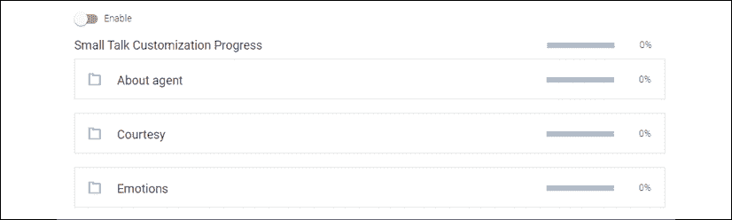

图 16.3：小对话主题

我们将仔细回答用户可能提出的第一个“问题”或他们可能表达的短语：**这很糟糕。**

我们现在遇到麻烦了！这是最糟糕的情况。我们得努力弥补这个问题。

情感多义性使得情形变得极其难以处理。我们最不想做的就是假装我们的机器人是聪明的。

我建议采取两种行动方案：

首先，仔细回答，表示我们需要进一步调查，可以这样说：

*对此我非常抱歉。您能否请描述一下为什么这很糟糕？我们会定期检查我们的历史日志，并不断改进。您也可以通过<您的客户服务邮箱>给我们发邮件，我们会尽快回复。*

您可以按以下方式输入这个回答并点击**保存**按钮：

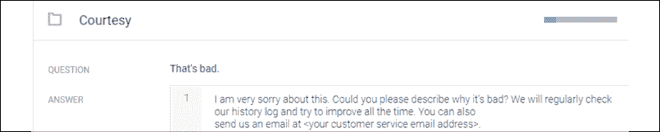

图 16.4：礼貌

你会注意到，**礼貌**进度条已跳至 17%。我们已经覆盖了对话中的一个关键领域。当我们没有填充完整时，默认答案会被提供，但它们是随机的，因此，如果你启用此功能，最好输入自己的短语。

现在，在右上角的测试控制台中输入“That's bad”来测试对话。你会看到回应出现：

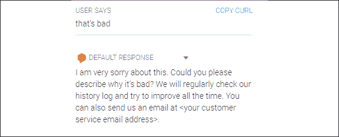

图 16.5：默认响应

如果你输入“bad”而不是“That's bad”，也能正常工作，因为 Dialogflow 的机器学习功能：

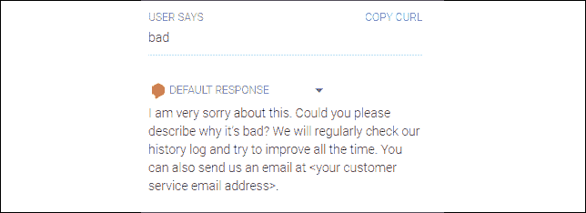

图 16.6：默认响应

**数据日志记录**将极大地帮助提升聊天机器人的质量。

我们将在下一节探讨数据日志记录。但是，首先让我们检查一下我们的情感。

### 情感

我们将处理第一个反应：**哈哈哈！** 如果我们回到情感多义性的问题，知道用户随时都能说出这句话，我们又陷入麻烦了！

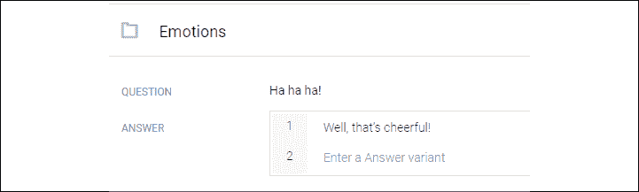

图 16.7：管理情感

用户是高兴，还是在取笑聊天机器人？谁知道呢？即使有面部分析和语调分析，一个快速的“哈哈哈！”也很难解释。

我建议给出一个低调谨慎的回答，比如“嗯，这真是愉快啊！”。

这样可以让用户觉得聊天机器人有幽默感。当你点击**保存**时，**情感**进度条会跳升。

你会注意到，除了 Dialogflow 检测到的变体之外，你还可以直接在响应中输入变体。此外，如果用户输入的短语不在对话中，意图列表中会有一个回退意图。

闲聊可能使对话更流畅，但它只是情商的一部分，无论是在聊天机器人中还是在日常生活中。

数据日志记录将帮助我们迈出更大的一步。

# 数据日志记录

在*第十五章*，*设置认知 NLP UI/CUI 聊天机器人*中，我们通过后续意图考虑了对话的上下文。然而，即使是后续意图也不能提供应对用户意外答案的解决方案。

为了增强对话，数据日志记录通过记住对话中的关键方面，为聊天机器人创建长期记忆。

用户和 Dialogflow 设计者必须同意 Google Dialogflow 数据日志记录功能的条款，如本页面所述：[`cloud.google.com/dialogflow/docs/data-logging`](https://cloud.google.com/dialogflow/docs/data-logging)。

隐私是一个严肃的问题。然而，你会注意到，当你使用搜索引擎搜索某个产品时，最终你会看到或收到与搜索相关的广告。这就是数据日志记录。

做出这个决定取决于你的目标和目标受众。假设用户接受了协议条款。那么，数据日志记录将被激活，接着数据日志记录将为聊天机器人提供长期记忆。

本章的其余部分将探讨数据日志记录，假设用户已经清楚地接受了这一功能。

Google Cloud，像所有聊天机器人平台（亚马逊、微软等）一样，提供日志功能来改进聊天机器人。许多功能、接口和服务为提升对话质量提供了极大的支持。

数据日志记录可以推动认知适应性对话超越语音识别任务。

我们将通过对话历史的方式来探索一种实现方法。请转到**历史**：


图 16.8：菜单中的对话历史选项

您将看到过去对话的列表：

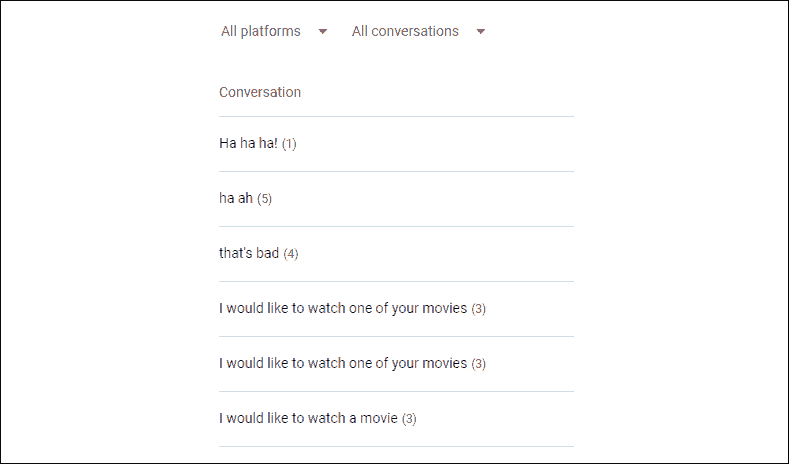

图 16.9：对话历史

注意**所有平台**列表，其中包含 Google Assistant 和其他平台的信息。您可以通过点击屏幕右侧的**查看 Google Assistant 上的工作方式**来部署聊天机器人。从那里，您可以按照指示操作，使其在智能手机、Google Home 等设备上运行。此外，您还将获得先进的日志数据，以改进聊天机器人。

如果您在*礼貌*部分测试了“那太糟了”，则交互历史将会出现：

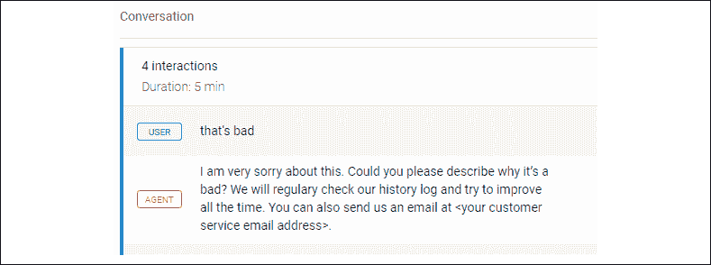

图 16.10：聊天机器人交互

了解用户名的一种方式是在出现问题时询问用户他们的名字。这对于定制对话非常有用。我们可以为此人或此类人群设置特殊的对话。举例来说，我们可以要求用户在回答中提供姓名和电子邮件地址。当我们手动或通过脚本分析**履行**部分的数据日志时，我们可以追踪问题并在个人层面上改进聊天机器人。

完成**小聊**部分并激活数据日志授权后，我们可以继续创建情感。谷歌将通过我们的数据日志功能继续改进聊天机器人。

如果我们知道哪个用户说了什么，我们就可以改进对话，正如我们将在下一节中看到的那样。

# 创建情感

当用户输入涉及情感多义性的模糊回答时，聊天机器人很难考虑前面章节中描述的数百种可能性。

在本节中，我们将重点讨论用户尝试获取某种服务（例如在流媒体平台上观看电影）的情况。

一个高效的聊天机器人应该*激发用户的情感*。最有效的方法是：

+   生成*客户满意度*。客户满意度是聊天机器人在无摩擦、可预期的对话中应尽力产生的最终情感。如果客户对回答不满意，紧张和沮丧情绪会积累。

+   使用像*第十四章*中 RBM-PCA 方法这样的功能，*使用受限玻尔兹曼机（RBM）和主成分分析（PCA）准备聊天机器人的输入*，建议选项以缩短对话路径，从而缩短对话持续时间，使用户“开心”。

现在我们将探讨在*第十五章，设置认知 NLP UI/CUI 聊天机器人*中遇到的对话*否*路径。

要访问对话的*否*路径，请转到**意图**，点击**choose_movie**意图，然后点击**添加后续意图**，在下拉菜单中选择**no**：


图 16.11：添加后续意图

**choose_movie - no**选项现在应该出现：


图 16.12：后续选项

点击**choose_movie - no**。

谷歌已经进入了几个默认的“否”变体，如下截图所示：

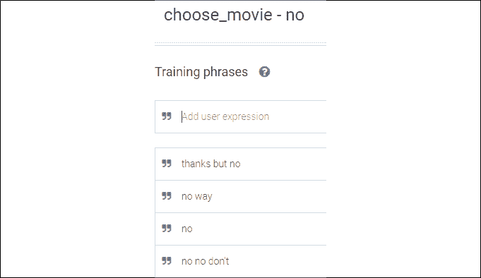

图 16.13：Dialogflow 训练短语

这个“否”回应令聊天机器人感到意外。在*第十四章*中，这一市场细分已经被探讨过。某些事情出了问题！

聊天机器人正在处理一个特定的市场细分，即“动作”超级英雄粉丝类型的观众。回答“否”意味着我们需要检查其他可用的特性。

在*第十四章*中，*使用限制玻尔兹曼机（RBMs）和主成分分析（PCA）准备聊天机器人的输入*，在`RBM.py`程序中的特性是：

```py
 # Each column is a feature. There are 6 features:
    # ['love','happiness','family','horizons','action','violence'] 
```

目前预测的“动作”特性组合包括以下几个特性：

动作 = {幸福，动作，暴力}

以下特性没有被考虑：

{爱情，家庭，视野}

由于我们希望保持路径简短，必须找到一种方式来提问，使得：

+   涵盖这三个特性

+   可以为另一个市场细分使用现有的特性矩阵

观众可能还具有：

+   最近看过足够多的动作电影

+   从超级英雄的生活阶段逐渐成长，开始寻找其他类型的电影

在这两种情况下，观众的市场细分可能与包含家庭-爱情价值观的另一个细分市场重叠。

正如我们在*第十五章*的*为代理添加履行功能*部分中看到的，*设置认知 NLP UI/CUI 聊天机器人*，我们可以使用脚本来：

+   涵盖这三个特性

+   为另一个市场细分使用现有的特性矩阵

经典的市场营销细分考虑了年龄因素。我们继续沿这个方向进行，准备好面对这样一种可能性：观众，这位年轻的超级英雄粉丝，逐渐变老并进入另一个与`RBM.py`中使用的年龄-电影类型细分重叠的细分市场，这发生在*第十四章*：

```py
 movies_feature_map = np.array([[1,1,0,0,1,1],
                                   [1,1,0,1,1,1],
                                   [1,0,0,0,0,1],
                                   [1,1,0,1,1,1],
                                   [1,0,0,0,1,1],
    .../... 
```

我们应该在矩阵中加入一些爱情-家庭特性，并配上相应的电影。然后我们将获得另一个市场细分。最终，聊天机器人将管理多个市场细分，这是许多流媒体平台的标准做法。

*第十五章*中*设置认知 NLP UI/CUI 聊天机器人*的图表变体可能如下：

| **电影/特性** | 爱情 | 幸福 | 家庭 | 视野 | 动作 | 暴力 |
| --- | --- | --- | --- | --- | --- | --- |
| 坎巴 24 小时 | 1 | 1 | 0 | 0 | 1 | 1 |
| 迷失 | 1 | 1 | 0 | 1 | 1 | 1 |
| 魔方冒险 | 1 | 0 | 0 | 0 | 0 | 1 |
| 节日 | 1 | 1 | 0 | 1 | 1 | 1 |
| 乔纳森·布鲁克斯 | 1 | 0 | 0 | 0 | 1 | 1 |
| 墨尔本档案 | 1 | 1 | 0 | 1 | 1 | 0 |
| WNC 侦探 | 1 | 0 | 0 | 0 | 0 | 0 |
| 明星 | 1 | 1 | 0 | 1 | 1 | 0 |
| 太空 II | 1 | 1 | 1 | 0 | 1 | 0 |
| 区域 77 | 1 | 0 | 0 | 1 | 1 | 1 |

这个特征矩阵包含了上一矩阵中缺失特征的电影：《太空 II》。

流媒体平台包含许多营销细分：

`M` = {`s[1]`, `s[2]`, … `s[n]`}

许多这些营销细分包含了不同的变体、合并特征、组合等。

由于数据日志记录已被激活，从此时起我们现在可以获得以下信息：

+   是否该观众已观看过此营销细分中提供的几部电影之一。这是另一个棘手的问题，因为某些观众可能会想重新观看某部电影。

+   观众的全新营销细分。

为流媒体平台构建聊天机器人将需要数月的设计工作，并有许多构建可能性。对于这个示例，我们将专注于年龄进展场景，尽可能缩短对话路径，并提供以下响应：

"你想看《太空 II》吗？这是一个讲述一家人在太空冒险的大片。虽然有些动作场面，但它主要讲述的是一家人如何在太空中生存的故事。"

向下滚动至**文本响应**部分，输入如下响应，然后点击**保存**以触发训练过程：

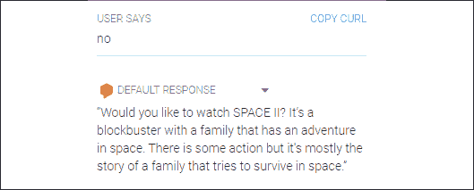

图 16.14：训练过程概览

如果观众回答"是"，则对话将引导至该电影的页面。要继续此方向，请返回到*第十五章*，*设置认知 NLP UI/CUI 聊天机器人*，并根据需要添加对该对话部分的"是"后续交换。

我们为代理添加了一些情感智能。接下来，我们将通过文本增强与**递归神经网络**（**RNNs**）一起探索聊天机器人架构的未来。

RNN 可以处理序列数据，例如单词序列、事件序列等。

# 针对未来自动对话生成的 RNN 研究

聊天机器人未来的发展方向是基于数据记录的对话、其认知意义、用户个人资料等，自动生成对话。随着 RNN 的进展，我们将越来越接近这一方法。有许多生成方法可以自动生成声音和文本序列。理解 RNN 是一个很好的起点。

RNN 模型基于序列，在此案例中是单词。它分析序列中的任何内容，包括图像。为了加速思维数据集的处理，可以在这里应用数据增强，就像在其他模型中对图像所做的那样。

初步查看其图形数据流结构显示，RNN 是一种与之前探讨过的其他神经网络类似的神经网络。以下图表展示了 RNN 的概念性视图：

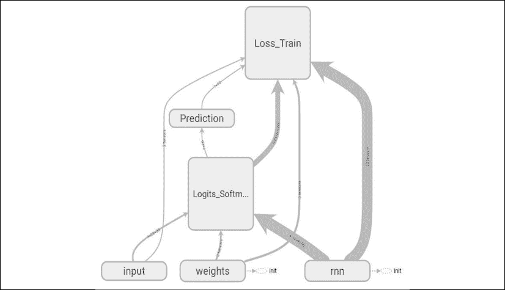

图 16.15：数据流结构

`y` 输入（测试数据）进入损失函数（**Loss_Train**）。`x` 输入（训练数据）将通过权重和偏差转换为带有 softmax 函数的 logits。

查看图表中的 RNN 区域显示以下**基本 _lstm_ 单元**：

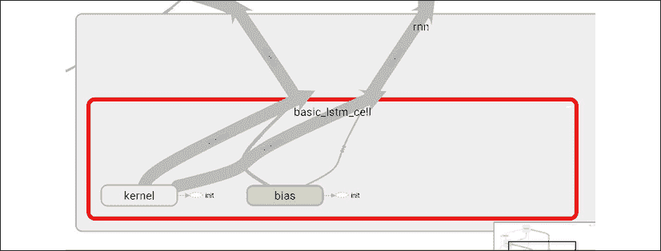

图 16.16：基本的 lstm_cell——图中 RNN 区域

RNN 的 LSTM 单元包含“遗忘”门，当序列变得对 RNN 单元过长时，它们可以防止梯度消失。

## RNN 的应用

RNN 包含一些函数，这些函数接收一层的输出，并将其反馈给输入，模拟时间的序列。这个反馈过程接受一个序列中的信息，例如：

*The* -> 电影 -> 很 -> **有趣** -> 但 -> 我 -> 不 -> 喜欢 -> *它*

RNN 会将一堆单词展开成序列，并解析左右窗口中的单词。例如，在这句话中，RNN 可以从 *interesting*（加粗）开始，然后读取左右的单词（斜体）。这些是 RNN 的一些超参数。

这种序列特性为序列预测打开了大门。与其同时识别整个数据模式，不如识别数据的序列，就像这个例子一样。

一个没有 RNN 的网络会将以下向量识别为一周，这就像其他任何模式一样：

星期一

星期二

星期三

星期四

星期五

星期六

星期天

RNN 会通过展开数据流来按顺序探索相同的数据：

星期一 -> 星期二 -> 星期三 -> 星期四 -> 星期五 -> 星期六 -> 星期天

主要的区别在于，一旦训练完成，网络会预测下一个单词；如果输入是星期三，星期四可能是输出之一。这将在下一节中展示。

### RNN、LSTM 和梯度消失

为了模拟序列和记忆，RNN 和 LSTM 会使用反向传播算法。在某些情况下，LSTM 是 RNN 的改进版。

RNN 在计算更深层次的网络梯度时经常会遇到问题。有时，由于序列的特性，它的梯度会消失（接近 0），就像我们在记忆序列变得太长时一样。

反向传播（就像我们在序列中一样）变得不那么高效了。有许多反向传播算法，如常用的基础反向传播。该算法执行高效的反向传播，因为它在每个训练模式后都会更新权重。

一种强制梯度不消失的方法是使用 ReLU 激活函数，`f`(`x`) = max(0, `x`)，通过这种方式迫使模型上的值不至于停滞。

另一种方法是使用一个包含遗忘门的 LSTM 单元，该遗忘门位于输入和输出单元之间，有点像我们在记忆序列中卡住时，会说“算了”然后继续前进。

LSTM 单元将充当一个具有 0 和 1 值的记忆门，例如。这个单元会遗忘一些信息，以便对它已经展开成序列的信息有一个新的视角。在最近的 TensorFlow 版本（2.0 及以上）中，你可以选择在某一层使用 RNN 或 LSTM 单元。你的选择将取决于多个因素，关键因素是梯度的行为。如果在 RNN 单元中梯度消失，你可能需要改进你的模型，或者切换到 LSTM 单元。

需要牢记的 RNN 关键思想是，它会将信息展开为序列，记住过去的内容来预测未来。LSTM 的主要思想依赖于其“遗忘”门，避免梯度消失。在 TensorFlow 2.x 中，您可以通过几行代码选择使用 RNN 或 LSTM 单元。

让我们在 Google Colaboratory 上运行一个示例。

## 使用 RNN 进行文本生成

要查看程序，登录到您的 Dialogflow 账户，上传 `text_generation_tf2.ipynb`（该文件位于本书 GitHub 仓库的 `CH16` 目录中）到您的 Google Colaboratory 环境，并将其保存在您的 Google 云端硬盘中，正如 *第十三章* 中 *Google Colaboratory 入门* 部分所解释的那样，*使用 TensorFlow 2.x 和 TensorBoard 可视化网络*。

这款 TensorFlow 作者编写的程序设计得非常适合教学目的。程序通过设置 TensorFlow 2.x 和必要的库开始运行。

在这一节中，我们将重点关注程序的主要部分，您可以在之后探索、运行和修改它。

## 向量化文本

RNN 的主要输入步骤是将一系列单词（字符串）转换为 **数字表示**：

```py
# Creating a mapping from unique characters to indices
char2idx = {u:i for i, u in enumerate(vocab)}
idx2char = np.array(vocab)
text_as_int = np.array([char2idx[c] for c in text]) 
```

我们为每个字符获得一个数字值：

```py
{
  '\n':   0,
  ' ' :   1,
  '!' :   2,
  '$' :   3,
  '&' :   4,
  "'" :   5,
  ',' :   6,
  '-' :   7,
  '.' :   8,
  '3' :   9,
  ':' :  10,
  ';' :  11,
  '?' :  12,
  'A' :  13,
  'B' :  14,
  'C' :  15,
.../... 
```

您会注意到，这个“字典”可以有两种解释方式：

+   character2number

+   integer2character

RNN 会运行其计算，但预测结果将以字符的形式输出。

例如，程序可以将加载文本的第一序列提取出来，并生成对应的整数映射，如下所示：

```py
# Show how the first 13 characters from the text are mapped to integers
print ('{} ---- characters mapped to int ---- > {}'.format(
    repr(text[:13]), text_as_int[:13])) 
```

在这个示例中，结果是：

```py
'First Citizen' ---- characters mapped to int ---- > [18 47 56 57 58  1 15 47 58 47 64 43 52] 
```

RNN 会处理数字序列、整数片段或文本的窗口进行训练，然后做出预测。为此，程序会创建示例和目标，就像所有神经网络在训练批次中的操作一样。

## 构建模型

使用 TensorFlow 2 构建神经网络已经变得非常简单，几行代码就可以完成，甚至可能在示例程序中错过它们！

在进入这些几行代码之前，让我们先澄清一些基本概念：

+   **顺序**模型包含一堆或一组层。

+   **嵌入**将每个字符的数字表示存储在一个向量中。

+   **GRU** 代表门控递归单元。GRU 包含一些门控，用来管理隐藏单元，保留一些信息并遗忘其他信息。当序列变长时，RNN GRU 有时会出现混乱，从而错误地处理梯度，导致梯度消失。更高效的 LSTM 单元同样是递归网络单元的一部分，具备与单元的反馈连接、输入门、输出门以及遗忘门。但最终，选择何种类型的单元始终取决于您的项目背景。无论如何，必须牢记的核心概念是递归网络用于管理数据序列，在保持过去记忆的同时忘记一些信息。

+   **密集**层，在此指的是输出层。

+   **时间步长**是预定义的序列长度。在另一个模型中，如果我们在处理时间相关的数据，它可能是真实的时间。

一个顺序模型只建立了三个层次：

```py
def build_model(vocab_size, embedding_dim, rnn_units, batch_size):
    model = tf.keras.Sequential([
        tf.keras.layers.Embedding(vocab_size, embedding_dim,
                                  batch_input_shape=[batch_size,
                                                     None]),
    tf.keras.layers.GRU(rnn_units,
                        return_sequences=True,
                        stateful=True,
                        recurrent_initializer='glorot_uniform'),
    tf.keras.layers.Dense(vocab_size)
    ])
    return model 
```

就是这样！如果模型在训练阶段需要，你可以将基础的 `rnn_units` 替换为 LSTM 层。一旦模型建立，模型将：

+   看起来像是字典中的嵌入。

+   执行 GRU 一个时间步。

+   稠密层接着会生成**logits**（参见*第二章*，*构建奖励矩阵 – 设计数据集*），使用似然函数，一个概率分布来进行预测。

以下图示总结了 TensorFlow 作者程序的过程：

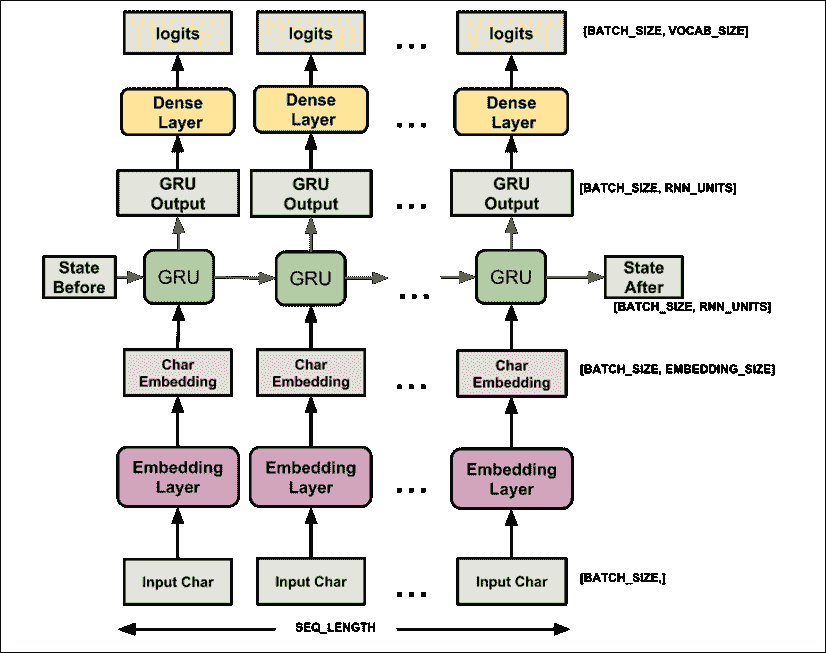

图 16.17：TensorFlow 模型

## 生成文本

在尝试和训练模型后，程序将自动生成文本，例如：

```py
print(generate_text(model, start_string=u"ROMEO: ")) 
```

如你所见，`ROMEO:` 已被设置为起始字符串。接着显示出以下的预测来源于莎士比亚的初始文本，并在程序开始时加载：

```py
ROMEO: Isick a tranch
It wast points for a sisten of resold thee, testement.
Petch doth my sweety beits are so of my sister.
KING RICHARD III:
Thou forget,
How did you burzenty day, 'tis oatly; heaven, for a womanous dear!
This is thy for mercy to the Kanging;
He that from the brothers of Gloucestersherding blame,
Thisble York, se me? 
```

你可以返回程序的开始部分并更改 URL。将莎士比亚的内容改为你自己的文本：

```py
path_to_file = tf.keras.utils.get_file('<YOUR FILE NAME>',
    '<YOUR URL>') 
```

在运行程序之前，进入**运行时** -> **更改运行时类型**：

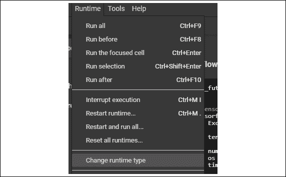

图 16.18：运行时类型

点击**更改运行时类型**：

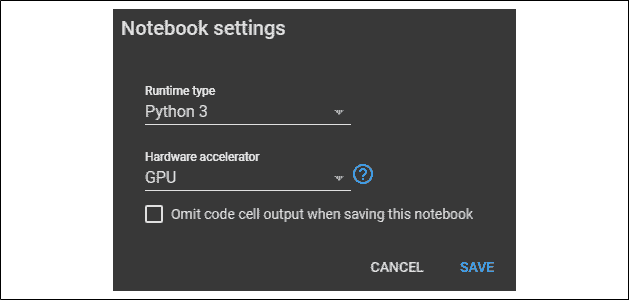

图 16.19：笔记本设置

我建议使用 GPU。此外，如果你想在保存笔记本时保存程序运行结果，确保**保存此笔记本时忽略代码单元输出**未被勾选。

现在你已准备好探索并进行自己的研究，为自动文本生成的未来做出贡献！

# 总结

情感多义性使得人际关系丰富而充满令人兴奋的不可预测性。然而，聊天机器人仍然是机器，无法处理用户短语的广泛可能解释。

现有技术要求大量工作才能让一个认知 NPL CUI 聊天机器人正常运行。小型对话能让交流更加顺畅。它不仅仅是一个次要特性；礼貌和愉快的情感反应是使对话顺利进行的关键。

我们可以通过有意义的对话创造用户的情感，从而减少现有技术的局限性，这种对话能够带来更温暖的体验。客户满意度构成了高效聊天机器人的核心。一种实现这一目标的方法是基于数据日志的认知功能实现。当用户在我们期待“是”的时候回答“不是”，我们看到了聊天机器人需要适应，就像我们人类一样。

认知数据记录可以通过我们在*第十四章*中探讨的准备工作实现，*通过受限玻尔兹曼机(RBM)和主成分分析(PCA)准备聊天机器人的输入*，以及在*第十五章*中探讨的认知对话，*搭建认知 NLP UI/CUI 聊天机器人*，以及本章构建的自适应对话。在我们的例子中，观众更改了市场细分，聊天机器人记录了新的用户画像。Dialogflow-fulfillment 脚本可以管理整个自适应过程，尽管这超出了本书的讨论范围。

我们研究了通过 RNN 处理数据序列的过程，最终实现自动对话。使用认知方法的聊天机器人，例如本章中的 RBM-PCA 和自适应数据记录推理，将来能够构建自己的对话系统。

以下章节将探讨通过基因、生物神经元和量子比特来实现更高层次人工智能的方法。下一章将探讨遗传算法，并将其应用到混合神经网络中。

# 问题

1.  当聊天机器人无法提供正确的回应时，需要由实际的人工客服接管对话。（是 | 否）

1.  日常生活中或与聊天机器人交互时，小谈话没有任何意义。最好直接切入主题。（是 | 否）

1.  数据记录可以用来提高语音识别的准确性。（是 | 否）

1.  聊天机器人代理的对话历史将包含有价值的信息。（是 | 否）

1.  现代技术无法利用用户对话的数据记录。（是 | 否）

1.  RNN 通过数据序列进行预测。（是 | 否）

1.  RNN 可以自动生成聊天机器人的对话流，适用于所有应用程序。（是 | 否）

# 进一步阅读

+   关于 RNN 的更多信息：[`www.tensorflow.org/tutorials/recurrent`](https://www.tensorflow.org/tutorials/recurrent)

+   关于文本生成的更多内容：[`www.tensorflow.org/tutorials/text/text_generation`](https://www.tensorflow.org/tutorials/text/text_generation)
