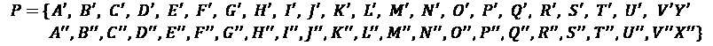
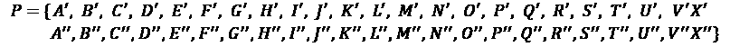
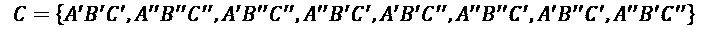
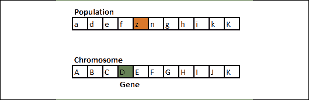
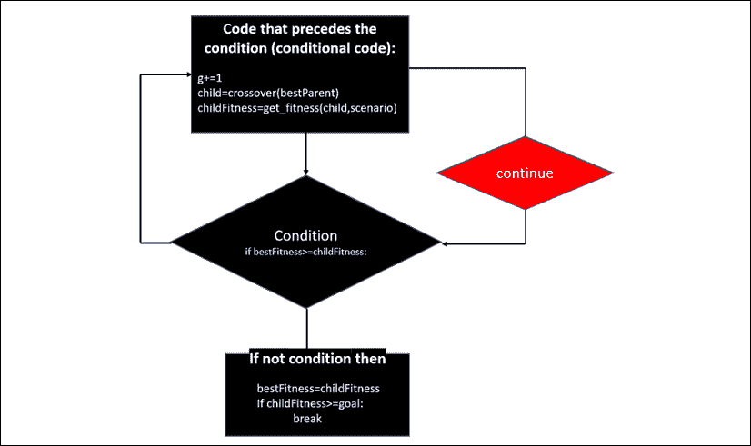
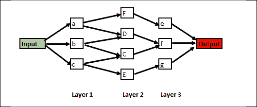

# 第十七章：混合神经网络中的遗传算法

在本章及接下来的两章中，我们将探索我们体内的世界。首先，在本章中，我们将使用我们的基因模型作为优化工具。在*第十八章*，*类脑计算*中，我们将进入我们的生物大脑活动并创建类脑网络。最后，在*第十九章*，*量子计算*中，我们将更深入地利用我们体内的量子材料来构建量子力学模型以进行量子计算。

我们体内这些微小实体（基因、神经元、量子比特）中的任何细微变化都可能改变我们的整体存在。

在本章中，我们将发现如何进入我们的染色体，找到我们的基因，并了解我们的繁殖过程是如何工作的。从那里开始，我们将开始在 Python 中实现一个进化算法，即**遗传算法**（**GA**）。

查尔斯·达尔文提出了“适者生存”作为进化的模型。从某些方面来说，这个模型是有争议的。在 21 世纪的社会中，我们倾向于尽可能地为那些不是最强者的人提供支持。然而，在数学中，我们没有这种伦理问题。

在人工智能中，我们需要提供一个准确的解决方案。如果我们生成多个解决方案，我们可以将“适者生存”应用于抽象数字。

在某些情况下，遗传算法显著减少了找到问题最优解所需的组合数。通过生成数学后代、选择最适应者并产生新的、更强的抽象世代，系统通常比通过排列组合传播达到更优的解决方案。

一个设计良好的遗传算法（GA）可以优化神经网络的架构，从而生成混合神经网络。

本章将涵盖以下主题：

+   进化算法；遗传算法

+   扩展遗传算法的基因以优化工具

+   混合神经网络

+   使用遗传算法优化 LSTM

让我们首先从了解进化算法是什么开始。

# 了解进化算法

在这一节中，我们将从遗传到基因深入了解这个过程，然后在构建我们的 Python 程序时进行表示。

人类的连续世代激活某些基因而不激活其他基因，从而产生了人类的多样性。一个人类的生命周期是成千上万代人类中的一段经历。我们每个人都有两个父母、四个祖父母和八个曾祖父母，这一代人加起来有 2³个先祖。假设我们将这种推理扩展到每个世纪四代人，然后跨越大约 12,000 年，即上一个冰川时期结束时，地球开始变暖。我们得到：

+   4 * 1 世纪 * 10 世纪 = 1,000 年和 40 代人

+   40 代人 * 12 = 480

+   将多达 2⁴⁸⁰个数学先祖加到今天地球上的任何人身上！

即使我们将时间限制为 1000 年，也就是 2⁴⁰，这意味着一千年前我们的祖先有 1,099,511,627,776 个后代。但有一个问题，这个数字是不可能的！今天，我们已经达到了人类人口的峰值，仅为 7,500,000,000。因此，这意味着我们的祖先有很多子女，他们互相结婚，甚至是各个程度的表亲，形成了一个巨大的大家族，无论我们的肤色或发色是什么！

## 人类的遗传

首先，男性通过精子与女性的卵子结合来完成受精。受精卵开始生长，并在经过一段冒险后诞生，最终成为现在写下或阅读这本书的我们。

为了从受精卵成长为人类成年人，我们必须收集外界的许多东西，吸收并转化它们。

我们将食物和物质转化，直到成长为类似于我们祖先的模样，这个过程叫做遗传。

如果生命是平静而安静的，什么显著的变化都不会发生。然而，我们的环境已经对我们施加了持续不断的压力，直到数百万年前，当我们只是某种在海洋中漂浮的细菌时，这种压力才开始产生。这种压力促成了持续的自然选择；有用的会存活下来，而无用的则会灭绝。

这种压力一直延续到今天，迫使我们人类要么在基因上适应，要么灭绝。那些未能适应环境压力的人类已经灭绝。我们今天活着的幸存下来。

进化可以定义为一种不断冲突的状态。一方面，我们面临着无情、常常是敌对的环境；另一方面，我们同样顽强的基因；许多基因消失了，但其他基因变异、适应，并通过遗传得以延续——事实上，它们现在仍在这样做，谁知道接下来会发生什么呢？

### 我们的细胞

在我们的细胞中，细胞核包含个人的生物数据，形式为染色体。我们的细胞每个都有 46 条染色体，这些染色体由 23 对染色体组成。其中一对是性染色体，决定我们的性别。

在染色体内，我们拥有基因，尤其是线粒体基因组，它是存在于微小细胞中的 DNA，这些细胞将我们的食物转化为细胞的燃料。每个细胞都是一个微观的忙碌工厂，包含着成千上万个基因！

人类基因组描述了一个不可思议的序列集合，这些序列构成了我们在细胞 23 对染色体中的构建块。

### 遗传是如何工作的

除了性细胞外，我们从母亲那里继承了她 46 条染色体中的 23 条，从父亲那里继承了他那里的 23 条染色体。反过来，我们父母的细胞也包含他们父母——我们的祖父母——的染色体，依此类推，以不同的比例继承。

让我们通过一个例子来看看我们所面临的复杂性。我们以我们的父母之一为例，不管是母亲还是父亲。`P`代表该父母的染色体集合。

带有单引号的字母代表其父亲—我们祖父—的染色体，带有双引号的字母代表其母亲—我们祖母—的染色体。

我们可以为你父亲的性细胞表示如下：



对于你的母亲，第一组中的最后一个染色体将在她的性细胞中是一个`X`：



女性是`X`-`X`，男性是`X`-`Y`。

想象一下可能性！

如果我们只从父母的某一个细胞中取出`A`、`B`和`C`，我们已经获得了以下集合，`C`，这是我们将继承的八种组合：



如果我们将此扩展到二十三对染色体，分布将达到 2²³，即 8,388,608 种可能性。

我们的进化过程包含了适用于进化算法的潜力。

## 进化算法

在本节中，我们将进一步深入研究进化算法，并将其与我们的 Python 程序更加紧密地结合。进化算法可以应用于任何需要组合的领域：调度、DNA 医学研究、天气预报、神经网络架构优化以及无限多的领域。

*进化计算*是一组应用试错技术来重现生物进化的抽象数学版本的算法。这一数学模型并不声称已经解决了进化的难题，因为进化自然无法简化为几个方程式。

然而，我们的生物环境产生了框架，这些框架虽然是我们想象的产物，却使我们能够创造出高效的抽象算法。

进化算法属于*进化计算*类别。一个进化算法包含诸如变异、交叉和选择等过程。许多模型能够实现为进化过程设定的目标。

遗传算法（GA）引入了进化算法的范畴。

我们将首先定义遗传算法（GA）中涉及的概念，这些是 Python 程序的构建块。

### 从生物模型到算法

创建 GA 模型有多种方式。你可以复制前面部分描述的人类模型，或者简化它，甚至创建另一种视角。

我们的模型将包含染色体中的一组基因，并且包含一个与之互动的种群：



图 17.1：基因中的染色体

我们的模型是一个抽象的算法模型，而不是人类染色体（如成对出现）的实际表现形式。例如，个体染色体中的一个基因将与种群中基因集进行交互。这个过程将在接下来的部分中定义。

### 基本概念

让我们首先描述 Python 程序构建块的概念：

+   **目标**：目标定义了我们希望在`n`代后获得的子代的长度和属性。

    在我们的模型中，目标可以是指定的，也可以是未指定的。

    一个指定的目标包含一个长度和它的值：

    ```py
     target = "Algorithm" # No space unless specified as a character in the gene set 
    ```

    在这种情况下，我们的环境要求精确的基因集合以保持在该环境中的适应性。请参见下面的适应度函数。

    一个未指定的目标包含一个长度，但没有其实际值，这必须通过 GA 在`n`代后找到：

    ```py
     target="AAAA" #unspecified target 
    ```

    在这种情况下，我们的环境不需要精确的基因，而是需要具有维持适应环境特征的基因。请参见下面的适应度函数。

+   **种群**：种群首先定义了一个随机选择的个体，我们称之为**父母**，它将包含一定长度的基因字符串：

    ```py
    def gen_parent(length) 
    ```

    种群还定义了父母可以与之互动以产生孩子的潜在个体。在我们的基因模拟中，种群的大小由种群的基因集合表示（请参见下面的点）。

+   **父母的基因集合**：父母的基因集合将首先是一个随机基因集合。

+   **种群的基因集合**：这个父母将随机遇到种群中另一个具有随机基因选择的人。这个种群由一个基因集合表示，我们将从中随机抽取基因：

    ```py
    geneSet = "abcdefghijklmnopqrstuvwxyzABCDEFGHIJKLMNOPQRSTUVWXYZ!.-" 
    ```

    由于一个给定的种群可以拥有这些基因中的任意一个或多个，因此我们的种群从一开始就非常庞大。

+   **选择**：我们将从我们的基因集合中随机选择基因，以模拟父母与另一个父母的相遇：

    ```py
     index=random.randrange(0,len(parent)) 
    ```

+   **交叉**：然后，我们将从父母和从种群中随机抽取的基因形成一个孩子，种群由基因集合表示。

    在我们的模型中，一旦完成基因的随机选择，该基因将被种群中的随机基因替换，种群由基因集合表示：

    ```py
     if(newGene!=oldGene):childGenes[index]=newGene; 
    ```

    请注意，在我们的算法中的交叉过程中，新基因必须与旧基因不同。因此，我们的算法可以避免在繁殖阶段陷入某些局部组合。一个接一个的孩子，我们将不断产生新的世代。

+   **突变**：我们不会接受来自父母相同的基因来形成孩子。如果我们检测到这种情况，我们将随机改变一个基因，以确保每一代都是不同的。

    如*交叉*段落中所述，我们不会接受与父母基因完全相同的孩子。正如本章的遗传学部分所示，孩子继承父母的基因时，不太可能完全相同。*多样性*是产生一代又一代能够适应环境的孩子的关键。

    在我们的模型中，已引入强制突变的多样性规则：

    ```py
     if(newGene==oldGene):childGenes[index]=alternate; 
    ```

    因此，我们引入了一个备用基因，正如我们在构建 Python 程序时将看到的那样。

+   **孩子**：孩子定义了一组基因，包含与父母相同数量的基因，但具有新的基因。通过一代代的孩子基因字符串，将会产生新的世代，并完成与适应度函数的选择过程。

+   **适应度**：适应度定义了在给定模型中，后代的价值。最适应的个体将被选为下一代的父代。

    在我们的模型中，我们有两个适应度函数，这些函数由情境变量来定义。

    如果`scenario=1`，则会激活指定的目标情境。该目标将根据周围环境进行指定，以适应环境。

    例如，极地熊变白是为了与周围的雪和冰融为一体，而在其他地区，熊通常是棕色的，例如为了与周围的植被融为一体。

    因此，适应度函数有一个目标需要达到。例如，在程序中的某个实例中：

    ```py
     target="FBDC" 
    ```

    这个目标可能意味着许多事情，正如我们所看到的。对于熊来说，也许它们染色体中的某些基因会触发它们的颜色：白色或棕色。

    如果我们模拟自然的程序在给定的代中没有产生正确的基因，意味着熊没有正确变异，并且将无法生存。Python 程序的适应度函数通过仅保留使后代朝正确方向进化的基因字符串，模拟自然选择。

    在这种情况下，指定的目标是一个已识别的基因串，它将决定生死存亡。

    ```py
    def get_fitness(this_choice,scenario):
        if(scenario==1): 
    ```

    正如我们稍后将看到的，`scenario==1`将确保达到生存所需的精确基因集合。

    如果`scenario=0`，则会激活一个未指定的目标。目标的长度未指定。然而，特征集将定义种群的基因集的值。这个特征包含数值，能为你希望解决的任何优化问题打开大门，正如我们在 Python 程序示例中所看到的那样。这个数值集合被称为 KPI 集，因为这些值是我们将在模型中探索的系统的关键性能指标：

    ```py
    KPIset ="0123456772012345674701234569980923456767012345671001234"   #KPI set 
    ```

    `KPIset`特征集与种群的基因集大小匹配。

## 在 Python 中构建遗传算法

我们现在将从零开始构建一个遗传算法（GA），使用`GA.ipynb`。

你可以使用`.py`版本。代码是相同的，尽管本章中的行号是指`.ipynb`版本的 Jupyter notebook 单元。

随时可以返回到前一部分，*基本概念*，查阅用于描述后续部分中 Python 程序的定义。

### 导入库

该程序从零开始构建，没有使用任何高级库，以便更好地理解遗传算法。三行代码足以让一切运行起来：

```py
import math
import random
import datetime 
```

### 调用算法

在这个程序中，我们将探索三种情境。两种情境生成指定目标，一种生成未指定目标。

我们将从指定的目标开始，然后转向更高级的未指定目标，这将为我们使用遗传算法（GA）构建混合网络做准备。

我们将首先进入程序的*调用算法*单元。第一步是定义我们将在第 3 行使用的情境类型和适应度函数类型：

```py
scenario=0   # 1=target provided at start, 0=no target, genetic optimizer 
```

如果`scenario=1`，程序将生成确切的基因以形成一个具有几代的随机种子父代的子代。

如果`scenario=0`，程序将生成一个具有一系列代的随机种子父代的基因类型的最佳特征。

在第 4 行，`GA=2`定义了我们正在处理的目标。

如果`GA=1`，则定义了种群的基因集和目标。调用主函数：

```py
if(GA==1):
    geneSet =
        "abcdefghijklmnopqrstuvwxyzABCDEFGHIJKLMNOPQRSTUVWXYZ!.-"
    # target with no space unless specified as a character in the geneSet
    target = "Algorithm"  # No space unless specified as a character in the geneSet
    print("geneSet:",geneSet,"\n","target:",target)
    ga_main() 
```

在这一点上，打印出了种群的基因集以及目标：

```py
geneSet: abcdefghijklmnopqrstuvwxyzABCDEFGHIJKLMNOPQRSTUVWXYZ!.-
 target: Algorithm 
```

最后一行调用了`ga_main()`，即主函数。

### 主函数

该程序的`ga_main()`单元格中的代码。

`ga_main()`函数分为三个部分：父代生成、子代生成和总结。

### 父代生成过程

父代生成从第 2 行到第 7 行运行：

```py
 startTime=datetime.datetime.now()
    print("starttime",startTime)
    alphaParent=gen_parent(len(target))
    bestFitness=get_fitness(alphaParent,scenario)
    display(alphaParent,bestFitness,bestFitness,startTime) #no childFitness for generation 1 so default value sent 
```

+   `startTime`指示了开始时间，该时间被打印出来：

    ```py
    starttime 2019-10-12 10:32:28.294943 
    ```

+   `alphaParent`是由后续的 Jupyter 笔记本单元格中描述的`gen_parent`函数创建的第一个父代。

+   `bestFitness`是由`get_fitness`函数估算的适应度，在本章节中将对其进行描述。

+   `display`函数描述了这个过程的结果。

现在我们有一个创建父代的过程：`gen_parent`，`get_fitness`和`display`。

现在，让我们在继续主函数之前探索一下父代生成函数。

### 生成一个父代

父代生成函数单元格以零基因和目标长度开始：

```py
def gen_parent(length): 
```

`length` = 目标的长度。目标是`"Algorithm"`，因此`length=9`。

在过程的开始阶段，由于这个函数的目标是随机产生一个包含与目标长度相等的基因字符串的父代，因此父代没有基因。

生成一个父代的基因字符串如下：

```py
 genes=[]                        #genes array 
```

现在，在单元格的第 3 行开始`while`循环以填充`genes[]`，直到达到目标的长度：

```py
 while len(genes)<length:  #genes is constrained to the length
        #sampleSize: length of target constraint
        sampleSize=min(length-len(genes),len(geneSet))
        #extend genes with a random sample the size of sampleSize extracted from geneSet
        genes.extend(random.sample(geneSet,sampleSize)) 
```

+   `sampleSize`是从基因集`geneSet`中需要的基因样本，用于为父代选择一个随机基因。

+   `genes.extend`从`geneSet`中添加一个随机基因到`genes`数组中。

一旦父代的基因集`genes[]`达到了目标的长度，`return`函数将父代发送回主函数`ga_main()`，在那里它将通过`display`函数显示。这次随机运行中父代的输出是：

```py
aFJPKzYBD 
```

自然地，每次运行时父代都会有所不同，因为这是一个随机过程。

现在，基因字符串返回到`ga_main()`函数：

```py
 return ''.join(genes) 
```

现在，让我们探索一下适应度函数和`display`函数。

### 适应度

在`ga_main()`函数的这一点上，打印出了开始时间，并创建了父级：

```py
#I PARENT GENERATION
    startTime=datetime.datetime.now()
    print("starttime",startTime)
    alphaParent=gen_parent(len(target)) 
```

在创建子代的多代之前，我们需要评估父代的适应度：

```py
 bestFitness = get_fitness(alphaParent,scenario) 
```

在这一段中，我们将只描述指定的目标案例，这是`scenario=1`的一部分。我们将创建一个以给定选择为目标的适应度函数。在这种情况下，只计算正确基因的和：

```py
def get_fitness(this_choice,scenario):
    if(scenario==1):
        fitness = sum(1 for expected,
            actual in zip(target,this_choice) if expected==actual) 
```

+   `this_choice`是由前面的代码片段中描述的`gen_parent`函数生成的父代基因字符串。

+   `scenario`表示该函数是计算适应基因的和，还是评估基因的特征。在本例中，计算的是正确基因的和。

+   适应度是通过将目标（预期值）与实际值（`this_choice`变量）进行比较时，找到的正确基因的数量。

+   如果`expected==actual`，则和会增加。

+   `zip`在 Python 中是一个高效的功能，它可以同时遍历两个列表。

一旦计算出适应度（适应基因的和），函数将返回该值到`ga_main()`函数：

```py
 return fitness 
```

父代将通过`main_ga()`中的一个函数进行显示。

### 显示父代

此时，`ga_main()`已打印了开始时间，创建了一个父代，并评估了其适应度：

```py
def ga_main():
    #I PARENT GENERATION
    startTime=datetime.datetime.now()
    print("starttime",startTime)
    alphaParent=gen_parent(len(target))
    bestFitness=get_fitness(alphaParent,scenario) 
```

程序现在将显示第一代的基本信息：父代调用了来自`main_ga()`的`display`函数，第 7 行：

```py
 display(alphaParent,bestFitness,bestFitness,startTime) 
```

+   `alphaParent`是父代的基因字符串

+   `bestFitness`是其适应度

+   由于还没有子代，`bestFitness`作为子代适应度的默认值被发送。

+   `startTime`

在显示父代单元格中，第 2 行，`display`函数接收了由`main_ga()`发送的数据：

```py
def display(selection,bestFitness,childFitness,startTime): 
```

`display`函数计算它所用的时间，并在几行中打印出信息：

```py
 timeDiff=datetime.datetime.now()-startTime
    print("Selection:",selection,"Fittest:",bestFitness,
          "This generation Fitness:",childFitness,
          "Time Difference:",timeDiff) 
```

+   `selection`是这一代的基因字符串。

+   `bestFitness`是迄今为止创建的最佳基因字符串的值。

+   `childFitness`是这一代的适应度值。第一代的适应度是父代的适应度，父代目前拥有最适合的基因。父代是另一个父代的子代，尽管这个父代是我们目前考虑的第一代。

+   `timeDiff`是处理较大基因集时的重要值。它将有助于检测算法是否运行良好或是否已达到极限。

输出将显示父代的基因以及每一代更接近目标所定义的最适应代：

```py
Selection: BnVYkFcRK Fittest: 0 This generation Fitness: 0 Time Difference: 0:00:00.000198 
```

该输出会在每次程序运行时有所变化，因为这是一个随机算法，模拟了我们自然和人工环境中发生的随机事件。

在探索创建无限代的循环之前，让我们先构建交叉函数。

### 交叉和变异

我们的模型包含一个带有变异规则的`crossover`函数，以确保多样性。

`crossover`函数从父代开始。

```py
def crossover(parent): 
```

每一代的每一个子代将成为另一子代的父代。

如同自然界中一样，父代基因中的一个随机基因将被选中进行替换：

```py
 index=random.randrange(0,len(parent))#producing a random position of the parent gene 
```

`index`指定将被替换的基因的确切位置：


图 17.2：基因中的染色体

我们可以看到，染色体中的基因`D`将被种群中个体的基因`z`所替代。

现在，我们模拟繁殖阶段。子代继承父代的基因：

```py
 childGenes=list(parent) 
```

父代的基因串通过`list`函数转换为一个列表。

算法将父代的基因存储到一个变量中，以便替换：

```py
 oldGene=childGenes[index]        # for diversity check 
```

`oldGene`将与新生成的基因进行比较，以确保多样性得到尊重，从而避免陷入局部循环。

在种群的基因集中随机选择一个新基因，模拟子代与某个个体之间的相互作用，个体数量无限：

```py
 newGene,alternate=random.sample(geneSet,2) 
```

请注意，在此过程中，新的基因`newGene`会被随机选择，同时一个备用基因`alternate`也会被选择。`alternate`被选中来替换`newGene`，以避免做出错误的选择。

如果新基因`newGene`与旧基因`oldGene`不同，那么子代可以继承新基因：

```py
 if(newGene!=oldGene):childGenes[index]=newGene;  #natural crossover 
```

新基因成为子代基因串的一部分。

然而，如果`newGene`与`oldGene`相同，这可能会影响整个遗传过程，导致代代相传的子代没有进化。此外，算法可能会陷入困境或浪费大量时间做出正确选择。

这里备用基因的作用开始显现，并成为子代基因串的一部分。这个交叉规则和备用规则模拟了该模型的变异过程。

```py
 if(newGene==oldGene):childGenes[index]=alternate;  #mutation introduced to ensure diversity to avoid to get stuck in a local minima 
```

多样性已得到验证！

该函数现在返回子代的基因新串，以便可以计算其适应度值：

```py
 return ''.join(childGenes) 
```

### 生成子代的多代

此时，我们已经生成了父代并探讨了基本概念和函数。

我们已准备好进入代数循环。首先，我们将查看代码，然后用流程图表示，并描述代码的各行。

一旦父代被创建，我们进入循环，模拟多代的进化过程：

```py
 while True:
        g+=1
        child=crossover(bestParent)        #mutation
        childFitness=get_fitness(child,scenario) #number of correct genes
        if bestFitness>=childFitness:#
            continue
        display(child,bestFitness,childFitness,startTime)
        bestFitness=childFitness
        bestParent=child
        if scenario==1: goal=len(alphaParent);#number of good genes=parent length
        if scenario==0: goal=threshold;
        if childFitness>=goal:
            break 
```

该循环最适合用流程图表示：



图 17.3：遗传算法流程图

流程图中的过程基于 Python 的`continue`方法：

1.  条件之前的代码：

    +   增加代数计数器：

    ```py
     g+=1 
    ```

    +   调用`crossover`函数生成子代：

    ```py
     child=crossover(bestParent) 
    ```

    +   调用适应度函数以获取适应度值：

    ```py
     childFitness=get_fitness(child,scenario) #number of correct genes 
    ```

1.  判断`childFitness`是否高于获得的`bestFitness`的条件：

    ```py
     if bestFitness>=childFitness: 
    ```

    +   如果条件为`True`，则进化必须继续，直到子代比父代更适应。这样就会将过程发送回`while`循环的顶部。

    +   如果条件为`False`，则意味着子代比父代适应度更高，此时代码将跳出条件。

1.  条件和`continue`方法之外的代码：

    +   代码显示了子代，`bestFitness`变为`childFitness`，而`bestParent`现在是子代：

    ```py
     display(child,bestFitness,childFitness,startTime)
            bestFitness=childFitness
            bestParent=child 
    ```

    +   我们模型的两个场景目标已定义。`scenario==1`的目标是通过正确的基因达到目标长度。`scenario==0`的目标是达到我们将在下一节中定义的阈值：

    ```py
     if scenario==1: goal=len(alphaParent);
            if scenario==0: goal=threshold; 
    ```

1.  循环的`break`条件：

    当适应度最强的子代在多个包含满足目标基因的代之后被创建时，进化过程将停止：

    ```py
     if childFitness>=goal:
                break 
    ```

`n`代的输出将如下所示：

```py
Genetic Algorithm
geneSet: abcdefghijklmnopqrstuvwxyzABCDEFGHIJKLMNOPQRSTUVWXYZ!.-
 target: Algorithm
starttime 2019-10-12 20:47:03.232931
Selection: Xe!bMSRzV Fittest: 0 This generation Fitness: 0 Time Difference: 0:00:00.000953
Selection: Xe!bMSRhV Fittest: 0 This generation Fitness: 1 Time Difference: 0:00:00.002404
Selection: Xl!bMSRhV Fittest: 1 This generation Fitness: 2 Time Difference: 0:00:00.004391
Selection: XlgbMSRhV Fittest: 2 This generation Fitness: 3 Time Difference: 0:00:00.006860
Selection: XlgoMSRhV Fittest: 3 This generation Fitness: 4 Time Difference: 0:00:00.009525
Selection: AlgoMSRhV Fittest: 4 This generation Fitness: 5 Time Difference: 0:00:00.011954
Selection: AlgorSRhV Fittest: 5 This generation Fitness: 6 Time Difference: 0:00:00.013745
Selection: AlgorSthV Fittest: 6 This generation Fitness: 7 Time Difference: 0:00:00.016339
Selection: AlgorithV Fittest: 7 This generation Fitness: 8 Time Difference: 0:00:00.019031
Selection: Algorithm Fittest: 8 This generation Fitness: 9 Time Difference: 0:00:00.022239 
```

我们可以看到在本章的*Display parent*部分中`display`函数所描述的所有代的展示。

### 汇总代码

一旦进化过程结束，汇总代码将接管：

```py
#III. SUMMARY
    print("Summary---------------------------------------------------")
    endTime=datetime.datetime.now()
    print("endtime",endTime)
    print("geneSet:",geneSet);print("target:",target)
    print("geneSet length:",len(geneSet))
    print("target length:",len(target))
    print("generations:",g)
    print("Note: the process is stochastic so the number of generations will vary") 
```

进化循环的示例输出为：

```py
Summary---------------------------------------------------
endtime 2019-10-12 20:47:03.257112
geneSet: abcdefghijklmnopqrstuvwxyzABCDEFGHIJKLMNOPQRSTUVWXYZ!.-
target: Algorithm
geneSet length: 55
target length: 9
generations: 782
Note: the process is stochastic so the number of generations will vary 
```

在继续之前，需要指出的是，对于 55 个元素中的 9 个元素使用排列时，为了达到目标，需要进行 10 ** 15.36 次计算，而不是在本示例中的 782 代。因此，遗传算法是生成排列的有效方式。

我们现在已经探讨了进化过程的核心和 Python 代码。接下来，我们将构建未指定的目标和优化代码，这将引导我们进入混合神经网络的领域。

## 未指定的目标用于优化神经网络的架构，采用遗传算法

在本节中，我们为通过混合神经网络优化神经网络架构奠定了基础和动机。物理神经网络的架构将通过遗传算法进行优化。

我们将研究一个物理神经网络，并通过遗传算法优化其架构。

### 一个物理神经网络

我们将从一个名为 S-FNN 的物理网络开始，这是一个**前馈神经网络**（**FNN**）。请仔细观察以下图像，并花足够的时间理解其架构：



图 17.4：神经网络的架构

这个物理网络具有一些重要的特定特征：

+   这是一个前馈神经网络（FNN）

+   共有三层。

+   每一层的神经元并非与下一层的所有神经元完全连接。三层之间的连接并非基于所有的可能性，而是基于过去运行此网络时，最优连接的统计结果。

    连接是通过多次运行该网络得到的，目的是确定哪些连接是最佳的。

+   这里表示的连接是最具生产力的连接，导致输出为`1`而非`0`。输出为`1`表示成功，而输出为`0`表示失败。

+   输入是数据集中的随机值，若为成功则必须分类为`1`，若为失败则分类为`0`。

+   经过对该网络过去运行的仔细研究，发现该网络的生产力在本示例中完全依赖于第二层中神经元的数量和质量。

让我们利用所学知识，将其应用到足球队的架构中。

### 这个神秘的 S-FNN 本质是什么？

S-FNN 是一个足球队的架构！它是给定比赛前，足球队 3-4-3 阵型的表示。

像抽象神经网络一样，我们为每一层选择的神经元数量和质量至关重要。在我们这个抽象的**人工神经网络**（**ANNs**）世界中，有许多问题需要解决。我们应该保留多少个？应该通过池化层消除多少个？通过丢弃层应该放弃多少个？我们怎么知道呢？在处理大数据集和大网络时，试验和错误需要多长时间？

现在，让我们回到图表，阅读以下解释，并开始寻找解决神经网络架构复杂性的方法：

+   **输入**代表基于过去比赛统计数据，输入比赛中的最佳选择目标。

+   **第 1 层**是由三个神经元表示的防守层，包含三个球员。

+   **第 2 层**是中场，是第 1 层活动的转化结果，过去比赛的统计数据展示了最适合的连接。输入的初始球已经在这些层之间流动，经过每场比赛的演变。

+   **第 3 层**是攻击层，它决定了输出的分类；1 代表成功，表示进球，0 则表示失败。第 2 层与第 3 层之间的连接展示了每场比赛中找到的最适合的结果。

**待解决的问题**：在我们的例子中，第 2 层已被确定为该队的关键层。多年来，它一直是一个弱点。让我们看看我们的遗传算法如何帮助找到这一层的最适合球员。

我们可以按照如下方式运行`scenario==1`（指定目标），目标是`ga==3`：

```py
if(scenario==1 and GA==3):
    target="FBDC"  # No space unless specified as a character in the geneSet
    print("geneSet:",geneSet,"\n","target:",target)
    ga_main() 
```

`geneSet`是足球市场上所有可用球员的种群，`target`是我们物理网络第 2 层所需的基因串：

```py
Genetic Algorithm
geneSet: abcdefghijklmnopqrstuvwxyzABCDEFGHIJKLMNOPQRSTUVWXYZ!.-
target: FBDC 
```

该目标在本次运行中经过 851 代后找到。

然而，我们希望遗传算法（GA）能够根据特征自行找到球员，而不指定目标。让我们一步步地探索这一过程，每次细胞地分析。

### 调用算法单元

从第 7 行到第 12 行，我们定义了第 2 层网络所需的目标架构的参数：

+   `geneSet`是我们网络第 2 层所有可用球员的集合，无论他们是在队内还是在市场上：

    ```py
    geneSet="abcdefghijklmnopqrstuvwxyzABCDEFGHIJKLMNOPQRSTUVWXYZ!.-"   #gene set 
    ```

+   `KPIset`，即关键绩效指标集，是每个球员在中场市场上的表现分数。该集的每个整数包含一个 0 到 9 之间的分数，基于球员在担任中场时的比赛统计数据：

    ```py
    KPIset ="0123456772012345674701234569980923456767012345671001234"   #KPI set 
    ```

    KPI 集与基因集中的每个成员相匹配。

+   `threshold`是我们需要达到的中场球员表现总和，才能在队伍中建立强大的中场。

    ```py
    threshold=35 
    ```

我们的目标是根据基因的特征和 KPI 属性找到一串基因。

目标是达到阈值。

我们在第 23 行调用了我们的进化函数：

```py
if(scenario==0 and GA==2):
    target="AAAA"                         #unspecified target
    print("geneSet:",geneSet,"\n","target:",target)
    ga_main() 
```

正如你所看到的，`target`被设置为一个没有意义的值，这个值将迅速演化。遗传算法（GA）将需要找到一个适应的序列。

我们可以跳过前一节中描述的中间适应度函数，集中在适应度单元中的场景上。

### 适应度单元

我们已经在前面的章节中描述了适应度单元的适应度函数。我们将专注于未指定目标的代码，即`scenario==0`。

场景的第一部分计算每个基因（潜在中场球员）的表现之和：

```py
 if(scenario==0):
        cc=list(this_choice) # cc= this choice
        gs=list(geneSet)     # gene set
        cv=list(KPIset)      # value of each KPI in the set
        fitness=0
        for op1 in range(0,len(geneSet)): #2.first find parent gene in gene set
            for op in range(0,len(target)):
                if cc[op]==gs[op1]:       #3.gene identified in gene set
                    vc=int(cv[op1])       #4.value of critical path constraint
                    fitness+=vc 
```

基因序列（中场球员）的集体适应度存储在`fitness`变量中。

然而，我们不能接受相同的基因两次，否则就意味着我们在场上有了一个中场球员的克隆！因此，我们添加了一些安全代码，在这种情况下将`fitness`设置为`0`：

```py
 for op in range(0,len(target)):
                for op1 in range(0,len(target)):
                    if op!=op1 and cc[op]==cc[op1]:
                        fitness=0    # no repetitions allowed, mutation enforcement 
```

现在，我们可以回到`ga_main()`并完成我们的过程。

### `ga_main()`单元

我们已经在前面的章节中描述了适应度单元。现在，我们将专注于未指定目标的代码，即`scenario==0`。

在`ga_main()`单元中，我们只需要检查第 22 到第 24 行：

```py
 if scenario==0: goal=threshold;
        if childFitness>=goal:
            break 
```

如果`scenario==0`，则`childFitness`必须`>=goal`（KPI 总和）。

我们已经找到了我们的中场球员！

我们现在将显示结果：

```py
Genetic Algorithm
geneSet: abcdefghijklmnopqrstuvwxyzABCDEFGHIJKLMNOPQRSTUVWXYZ!.-
 target: AAAA
starttime 2019-10-13 09:08:21.043754
Selection: PNVx Fittest: 18 This generation Fitness: 18 Time Difference: 0:00:00.001252
Selection: LNVx Fittest: 18 This generation Fitness: 24 Time Difference: 0:00:00.004130
Selection: LNVq Fittest: 24 This generation Fitness: 27 Time Difference: 0:00:00.004708
Selection: LNFq Fittest: 27 This generation Fitness: 29 Time Difference: 0:00:00.010362
Selection: LBFq Fittest: 29 This generation Fitness: 31 Time Difference: 0:00:00.015797
Selection: CBFq Fittest: 31 This generation Fitness: 33 Time Difference: 0:00:00.024712
Selection: CBFt Fittest: 33 This generation Fitness: 34 Time Difference: 0:00:00.032680
Selection: CBFD Fittest: 34 This generation Fitness: 35 Time Difference: 0:00:00.048524
Summary---------------------------------------------------
endtime 2019-10-13 09:08:21.094005
geneSet: abcdefghijklmnopqrstuvwxyzABCDEFGHIJKLMNOPQRSTUVWXYZ!.-
target: AAAA
geneSet length: 55
target length: 4
generations: 154
Note: the process is stochastic so the number of generations will vary 
```

在这种情况下，遗传算法（GA）选择了中场球员 C、B、F 和 D。

现在我们已经掌握了理解人工混合神经网络所需的所有成分、概念和知识。

# 人工混合神经网络

在前一节中，我们使用遗传算法（GA）优化了一个物理神经网络。

在本节中，我们将把刚刚探索过的*混合*概念扩展到人工神经网络（ANNs）。原则是相同的，因此，凭借你现在掌握的概念，你将能够直观地理解我们在本节中将要优化的递归神经网络（RNN）。

人工智能在社会中的未来依赖于人类（多样性）、机器（人工智能和物联网）以及自然（可持续的生存项目）之间的集体智慧。

在人工智能领域，这种多样性体现在集成算法、元算法和混合系统中。深度学习已经证明了其有效性。我们可以在几行代码中使用 TensorFlow 2.x 创建一个神经网络。然而，往往需要花费数天、数周，甚至数月的时间来微调依赖大量数据的人工神经网络（ANN）模型，以提供可靠的模型。这就是混合神经网络必要的原因。

深度学习网络可以使用任何形式的其他类型算法来成为一个更高效的系统。在我们的案例中，我们选择了进化算法，这些算法可以用于深度学习：

+   通过使用数据特征来提取符合我们寻找的模式的数据序列，从而改善输入，找到最适应的数据点

+   优化网络层的权重，以提升传统优化器的速度和性能

+   通过选择作为基因序列处理的最适应解决方案，来改进网络输出的分类阶段

+   改进定义网络架构的繁琐任务

本节将专注于通过遗传算法优化网络架构的示例：

+   创建 RNN

+   引入一个遗传算法，它将优化网络架构

**注意**：有关遗传算法表示的信息，请随时返回前面的章节以刷新进化算法的过程。还请参考前面的章节查阅神经网络的结构，特别是*第十六章*，*改进聊天机器人情感智能缺陷*，其中描述了 RNN。

## 构建 LSTM

在 Google Colaboratory 或本地机器上的 Jupyter 中打开`Genetic_Algorithm_LSTM.ipynb`，或打开`genetic_algorithm_lstm.py`。

本教育示例的模型是 LSTM。

目标是使用 GA 生成的窗口大小并以此窗口大小运行 LSTM。**均方根误差**（**RMSE**）将用于衡量配置的适应度。

简而言之，RMSE 首先计算训练数据和测试数据之间差异的平方，就像许多类似的公式一样。然后，计算结果的平方根。只需记住，RMSE 将比较我们期望得到的结果与实际得到的结果，并生成一个值。

现在让我们来探索程序的主要单元：

+   **导入所需包单元**：`Genetic_Algorithm_LSTM.ipynb`首先安装 DEAP，一个进化计算框架：

    ```py
    !pip install deap 
    ```

    我们在前面章节中从零开始构建了一个遗传算法。这次我们不需要从头开始，因为这个程序使用了一个框架。

    然后，程序安装了`bitstring`，它有助于处理二进制数据。

+   **加载数据单元**：数据中的风力预测数据来自`train.csv`，数据源为[`www.kaggle.com/c/GEF2012-wind-forecasting/data`](https://www.kaggle.com/c/GEF2012-wind-forecasting/data)。

    `wp1`到`wp7`列提供了从七个风电场收集的风力发电测量的归一化数据。LSTM 的目标是接收这一数据序列并进行风力发电预测。

+   **定义基本函数单元**：该单元准备数据集并以标准过程训练模型。我们将重点关注第 14 行：

    ```py
     window_size = window_size_bits.uint 
    ```

+   **进化模型单元**：该模型使用 DEAP 框架函数，但我们可以轻松识别我们在前面章节中探讨过的概念，并按如下方式初始化：

    ```py
    population_size = 4
    num_generations = 2
    gene_length = 10 
    ```

代码已经设置好，配备了一个现成的遗传算法来优化我们网络的窗口大小。

## 模型的目标

与我们之前的章节一样，目标是为这个网络找到最佳窗口大小，就像我们在早些章节中寻找最佳的第 2 层一样。

该模型已完成以下任务：

+   安装了包，加载了数据，并找到了 LSTM 的窗口大小

+   然后，运行遗传算法模型来测试 LSTM 的可能窗口大小

+   每一代和每个训练周期都会提供一个 RMSE 测量值

程序需要一些时间运行，但我运行的结果保存在笔记本中，供你查看。这里有一个结果，供你查看系统是如何工作的：

```py
Epoch 1/5
17200/17200 [==============================] - 207s 12ms/sample - loss: 0.0096
Epoch 2/5
17200/17200 [==============================] - 202s 12ms/sample - loss: 0.0059
Epoch 3/5
17200/17200 [==============================] - 202s 12ms/sample - loss: 0.0058
Epoch 4/5
17200/17200 [==============================] - 200s 12ms/sample - loss: 0.0057
Epoch 5/5
17200/17200 [==============================] - 200s 12ms/sample - loss: 0.0057
Test RMSE: 0.0926447226146452 
```

如同上一节所述，遗传算法优化了人工神经网络（ANN）的一个部分。你可以使用遗传算法优化人工神经网络的其他部分。天高地远！事实上，没有限制。使用遗传算法或其他算法优化架构或过程的混合神经网络将把你的项目带到另一个层次！

# 总结

进化算法为人工智能（AI）的优化潜力带来了新的光辉。本章中，我们研究了遗传如何深刻影响种群分布。环境的影响可以通过基因突变来衡量。

进一步深入，我们重点研究了一类遗传算法（GA），通过多代实现遗传变换的模拟。我们探讨了父母如何传递一些基因，以及从代际种群中选择多样基因如何产生变异。染色体会遗传一些基因，但不遗传其他基因。

自然和环境的压力将会主导。一种适应度函数评估基因串，只有最强的基因才能存活。最强的基因物质将产生交叉和突变，创造出更适应环境的后代。

遗传算法可以用于表示任何类型的数据串，以及该数据的特征。优化过程可以应用于仓储、运输和神经网络。

混合网络无疑将在未来几年中扩展，将深度学习（DL）带到新的高度。使用遗传算法优化递归神经网络（RNN）的架构，为优化任何深度学习（DL）、机器学习（ML）或自动机器学习（AutoML）架构奠定了基础。例如，混合神经网络可以使用遗传算法优化输入，进行特征降维，或作为网络的权重优化函数。

大自然为我们提供了无价的工具，可以应用于我们的人工神经网络模型。本章讨论了我们体内的隐形构建模块。在下一章《神经形态计算》中，我们将探索使我们能够适应环境的其他组件：神经元。我们将探讨如何利用生物模型的神经网络来解决复杂问题。

# 问题

1.  一个人体细胞含有 42 条染色体。（是 | 否）

1.  遗传算法是确定性的，不是随机的。（是 | 否）

1.  进化算法意味着程序代码会进化。（是 | 否）

1.  即使经过多代，孩子最好也能继承父母之一的基因。（是 | 否）

1.  多样性使得基因集变得更弱。（是 | 否）

1.  构建一个神经网络只需要几行代码，而且架构总是能正常工作。（是 | 否）

1.  使用遗传算法构建神经网络有助于优化层的架构。（是 | 否）

1.  混合神经网络是无用的，因为深度学习将不断进步。（是 | 否）

1.  你会信任遗传算法为你做决策吗？（是 | 否）

1.  你会信任一个混合神经网络来优化你的网络架构吗？（是 | 否）

# 深入阅读

+   [`github.com/DEAP/deap`](https://github.com/DEAP/deap)

+   [`pypi.org/project/bitstring/`](https://pypi.org/project/bitstring/)
