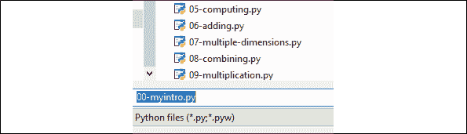

# 第十八章：神经形态计算

我们的大脑在必要时会激活成千上万甚至数十亿个神经元，使我们的身体随时准备好应对任何情况。正如我们在*第十七章*中看到的，*混合神经网络中的遗传算法*，进化已经在数千代、数百万年的时间里精细调整了生物能力。

本章将深入探讨我们体内的认知能力。我们将从前一章的染色体出发，了解使我们成为智慧生物的生物神经元。这些神经元以数十亿种方式相互作用，产生认知模式，形成心智结构。

神经形态计算利用我们大脑的强大优化能力，令人惊讶的是，它消耗的能量非常少。平均而言，我们仅消耗几瓦特的能量，比灯泡还少，用来解决非常复杂的问题。这本身就表明，我们大脑的神经结构具有一种独特的架构，而我们还未能在物理上再现它。

将神经形态计算引入现实世界需要硬件和软件，就像所有计算机科学模型一样。在本章中，我们将重点讨论软件，尽管提及英特尔在神经形态研究中涉及的硬件同样重要。这些硬件以一个名为 Loihi 的芯片的形式出现，Loihi 的名字来源于即将崛起的夏威夷水下火山，最终将突破海面。Loihi 包含成千上万的神经元及其突触、树突和轴突，模拟我们的大脑活动。IBM 和其他公司也在这一领域开展了研究。

我们大约有 1000 亿个神经元。这些芯片目前只能达到数十万个神经元。然而，通过将这些芯片连接成物理网络，神经形态计算将在不久的将来成为我们必须考虑的领域。

我们将首先定义什么是神经形态计算，然后探讨 Nengo，一个独特的神经形态框架，具有坚实的教程和文档。Nengo 是众多超出本书范围的方法之一。本章不是神经形态课程，而是一个概览，邀请你挖掘我们大脑结构的强大力量，以解决复杂问题。我们将探索的问题将使我们更接近理解大脑是如何运作的。

本章将涵盖以下主题：

+   什么是神经形态计算

+   开始使用 Nengo

+   Nengo 基本概念

+   探索 Nengo 教程和界面

+   Nengo 与经典人工智能的区别

+   将 Nengo 独特的**语义指针架构**（**SPA**）模型应用于关键研究领域

让我们从基础开始——什么是神经形态计算？

# 神经形态计算

让我们直接进入思维过程的核心，理解神经形态计算。对于人工智能专家，我希望用一句话总结从经典模型到前沿神经形态模型的历程：

*从思想到大脑*

如果我们进一步推进，*M* 是我们所有心理表征的集合，*B* 是导致思维模式的物理反应的世界。

从这个角度看，*M* 是我们到目前为止在本书中探索的所有内容的集合：

*M* = {基于规则的系统，机器学习，深度学习，进化算法… *m*}

*m* 是我们周围世界的任何数学*心理表征*。例如，在深度学习中，一个人工神经网络会试图通过搜索它能在图像中找到的模式，来理解图像中的混乱，这些模式跨越低维和更高层次的抽象。

然而，无论一个心理构建看起来多么高效，它仍然是一个*表征*，而非物理现实。

现在，让我们观察 *B* = *大脑构建*：

*B* = 现象/事件（在我们内部或外部世界）-> 物理刺激 -> 大脑中的物理神经活动 -> 目标区域的更高活动 -> 物理电学习反应 -> 人类行为

*B* 的架构将我们带得更接近现实！心理表征被最小化，从而减少了人工构建的扭曲，无论它们的效率如何。

经典的人工智能是关于构建我们认知活动的心理表征。

类脑计算是关于构建一个可以编码现实、像人类大脑一样处理它并解码结果的大脑。

请记住，像英特尔这样的公司正在提供芯片，以通过类脑计算实现令人惊叹的成果，正如我们在本章中将会发现的那样。

现在我们对类脑计算有了一些了解，让我们来看看类脑框架 Nengo。

# 开始使用 Nengo

简而言之，*Nengo 构建的是大脑，而不是像经典机器学习和深度学习中的那样构建心理表征*。

Nengo 代表 *神经工程对象*。它既具备 Nengo 的脚本能力，也具备 Nengo GUI 的图形能力。我们将使用 NEF，即 Nengo 的**神经工程框架** (**NEF**)。

Nengo 是由滑铁卢大学（加拿大安大略省）的理论神经科学中心创建的。Chris Eliasmith 在这个项目中发挥了重要作用。

在前面的章节中，我们探讨了许多认知建模的方法。Nengo 使用 NEF 来实现 SPA。

*语义指针* 是生物系统中的神经表征，它携带结构，将引导到更高层次的认知表征。

*指针*一词指的是我们在 C++ 中所熟知的指针，因为它们可以访问它们所不包含的数据。

*语义* 这个术语指的是它们不仅仅是像 C++ 中那样的数学工具，因为它们通过它们之间的距离包含了虚拟表征。

如果我们将这两个概念结合起来，就会得到一个令人震惊的概念：意义是通过生物学指针活动在我们大脑中以不同距离和状态相互作用生成的。让我们通过首先安装 Nengo 来深入了解类脑计算。

## 安装 Nengo 和 Nengo GUI

本章中，我使用了与 NumPy 和 Matplotlib 库的 Python 接口，正如我们从本书开始时所做的那样。接下来，只需通过 `pip` 安装 Nengo，例如：

```py
pip install nengo 
```

你也可以使用其他方法安装它。有关更多信息，请访问 [`github.com/nengo/nengo`](https://github.com/nengo/nengo)。

让我们安装这个不错的 HTML 5 可视化工具，并通过我使用 `pip` 安装的 GUI 与 Nengo 进行交互：

```py
pip install nengo-gui 
```

你也可以使用其他方法安装它。有关更多信息，请访问：[`github.com/nengo/nengo-gui/`](https://github.com/nengo/nengo-gui/)。

一旦两个程序都安装完成，如果你遇到任何问题，请参考包含大量信息的链接，或者联系 Nengo 的支持团队，他们提供了出色的反馈。

有许多方法可以使用 Nengo。本章描述了一种快速入门的方法，使用 Python。

设置完成后，打开浏览器，比如 Chrome，然后在命令行控制台中输入 `nengo`，它应该会在浏览器中打开 Nengo 图形用户界面（GUI），并打开一个 `default.py` Python 程序：


图 18.1：Nengo Python 代码

点击左上角的文件夹图标，然后点击 `built-in examples`：


图 18.2：Nengo 示例

一个列表将会出现。点击 `tutorial`：


图 18.3：Nengo 示例列表

一份令人着迷的教育示例列表将会出现：


图 18.4：教程部分中的示例

教程程序位于安装程序写入的目录中。

你可以在浏览器地址栏中查看教程中 Python 示例的 URL。

## 创建 Python 程序

现在，让我们通过几个步骤创建一个 Python 程序并保存文件：

+   打开一个空的 Python 文件，但暂时不要保存它

+   编写以下代码以导入 `nengo` 库并创建一个模型：

    ```py
    import nengo
    model = nengo.Network()
    with model:
        #<your code here> 
    ```

现在，将 Python 文件保存在教程中其他程序的路径下。你可以在打开 Nengo 示例时看到这个路径。只需导航到该路径以保存程序。我们将其命名为 `00-myintro.py`，以便与教程中的程序列表匹配：



图 18.5：保存 Python 程序

我们将像之前一样回到 `tutorial` 目录，并打开它以添加基本的 Nengo 对象。

Nengo 对象是 Nengo 模型的构建模块，用于创建神经元群体，将其连接到刺激函数，并管理输出。

对于我们的 Python 程序，我们将使用一些关键的 Nengo 对象，相关细节将在接下来的章节中介绍。

## 一个 Nengo 集群

一个 Nengo 集合是一组神经元。它可以被视为一个包含实数的神经元群体。

一个集合是通过以下方式创建的：

```py
nengo.Ensemble 
```

一个集合可以在一行代码中创建：

```py
ensemblex = nengo.Ensemble(n_neurons=5, dimensions=1) 
```

一旦我们向`00-myintro.py`添加了一行代码，集合的表示将在 Nengo 界面的左侧窗格中出现：


图 18.6：神经元集合

在右侧的代码编辑器中编写 Python 代码时，您可以在可视化界面窗格中查看模型的可视化流动。

一个集合可以包含一个个体的群体，一个单一的神经元。这个神经元是我们生物神经元的表现：

+   **突触后电流**（**PSCs**）通过我们的树突流动

+   然后*电流*到达神经元的核心（细胞体）。

+   如果在轴突初段（轴突丘）处的电流超过阈值，那么会产生一个*尖峰*

+   当离子通道打开时，PSCs 会在接收细胞中产生。

让我们更详细地了解一下 Nengo 的神经元类型。

### Nengo 神经元类型

我们在我们的集合中创建了 50 个神经元：

```py
ens = nengo.Ensemble(n_neurons=50... 
```

有多种神经元类型。然而，在我们的示例中，我们将使用默认的神经元，即**泄漏积分与放电**（**LIF**）神经元。

神经元动力学基于一个叫做**积分**的求和过程。这个积分与一个机制相关联，该机制将在电压超过临界值时触发（放电）。

线性微分方程与阈值结合，这些阈值将触发文件的尖峰，这是构成默认 LIF 神经元的最后组件，除非另有指定。

欲了解更多关于 Nengo 神经元类型的信息，请参见[`www.nengo.ai/nengo-extras/neurons.html`](https://www.nengo.ai/nengo-extras/neurons.html)。

### Nengo 神经元维度

在我们的示例中，`dimensions`设置为`1`；这意味着集合由一个数字（或维度）表示：

```py
ens = nengo.Ensemble(..., dimensions=1) 
```

### 一个 Nengo 节点

现在我们已经定义了神经元集合及其输出维度，我们将定义输出：

```py
node_number = nengo.Node(output=0.5) 
```

刺激将是恒定的，并将在滑块上显示如下：


图 18.7：Nengo 滑块

在某些情况下，带有数字的输出可能不够用。这个数字可以被一个导入 NumPy 的函数替代。例如，可以使用正弦波函数：

```py
node_function = nengo.Node(output=np.sin) 
```

一旦我们输入了节点功能，它将显示在界面上，并且除了先前显示的信息外，还会有新的信息：


图 18.8：界面上的节点功能

`node_function`提供了一种将非神经输入发送到 Nengo 对象的方法。

我们将在本章的`15-lorenz.py`示例中探讨这样的实现，该示例位于教程部分的 Nengo 示例中。

如果您右击`node_function`图像并选择一个值，您将看到一条表示正弦波刺激实时值的曲线：


图 18.9：节点功能

更多关于 Nengo 对象的信息，请访问 [`www.nengo.ai/nengo/getting_started.html#creating-nengo-objects`](https://www.nengo.ai/nengo/getting_started.html#creating-nengo-objects)。

## 连接 Nengo 对象

我们现在需要连接群体和节点，以使我们的系统工作。通过这种方式，群体将具备某种功能。

此时，我们有一个群体和一个节点功能，如下图所示：


图 18.10：群体和节点功能

为了连接它们，我们将添加一个 Nengo 连接：

```py
nengo.Connection(node_function, ens) 
```

更多 Nengo 前端 API 定义，请参见 [`www.nengo.ai/nengo/frontend_api.html`](https://www.nengo.ai/nengo/frontend_api.html)。

现在，让我们探索这个激动人心的视觉界面。

## 数据可视化

第一步是点击屏幕右下角的播放按钮：


图 18.11：播放按钮

这将使时间开始流动，模拟我们的大脑活动。时间是神经形态计算的独特特点之一。我们不会将一层层静态的数学堆叠成一个心理表征。使用 Nengo，我们一步一步、秒秒钟地模拟大脑活动！

一旦你点击播放按钮，就感觉像是在看我们大脑内部的运作！

我们在前一节中看到如何可视化滑块的活动，这些活动产生了刺激。我们将在本节中关注我们的群体。

如果我们右键点击群体可视化，几个选项将会出现：**值**、**放电**、**电压**、**发放模式**和**详细信息...**：


图 18.12：群体选项

+   **值**：我们的群体的值将在 –1 到 1 之间显示，例如：


图 18.13：群体的值

+   **放电**：放电活动产生了美丽的颜色，显示了我们的神经元如何响应正弦波刺激：


图 18.14：放电模式

你会注意到每个神经元都有自己的放电通道。群体的这一特性产生了各种各样的响应。

+   **电压**：电压提供了关于流经我们神经元的电流的有趣信息，这些电流来自其他神经元的刺激，进而来自更多从外部世界获取信息的神经元。

    在以下截图中，群体包含了五个神经元的群体，颜色通道提供了更多信息：


图 18.15：带有颜色模式的神经元活动

+   **发放模式**：下图中群体的发放模式是通过 50 个神经元生成的。发放模式必然与刺激和连接直接相关：


图 18.16：发放模式

我在进行的实验中观察了许多模式。我正在做的研究领域之一是将给定功能的成千上万帧的放电模式输入到人工神经网络（ANN）和随机的丘奇-图灵算法中，生成“思维”模式。例如，运行这些帧的通道可能会生成新的数据序列。这是值得实验的。

下图表示 500 个神经元的模式，这为在成千上万的帧上运行深度学习带来了复杂性：


图 18.17：放电模式

+   **细节...**：在绘图部分，我们可以可视化输入电流和调谐曲线。调谐曲线显示了神经元如何响应输入电流。如果没有模式，那么就必须有一个解释或配置问题。

    调谐曲线的可视化控制通过展示它们是如何收敛的，节省了时间！


图 18.18：调谐曲线

我们已经介绍了 Nengo 提供的一些主要可视化工具。

现在，我们将看到如何使用探针从我们的系统中检索数据。

## 探针

我们可以使用探针检索信息，无论是可视化它们，还是处理输出数据。

在本节中，我增强了`00-myintro.py`，使其能够产生数值输出和可视化输出，使用以下页面上的信息，你可以从中获取有关你项目的灵感：[`www.nengo.ai/nengo/examples/basic/single_neuron.html`](https://www.nengo.ai/nengo/examples/basic/single_neuron.html)

我创建的程序是`nengo_probing.py`，可以在本书的 GitHub 仓库中找到。该程序是一个独立的程序，无法在 Nengo 的 GUI 中运行。你不能像在 Nengo 的 GUI 中那样使用仿真命令。请在 Python 界面中运行此程序。它展示了另一种运行丰富 Nengo 软件的方法。

该程序包含额外的 Matplotlib 头文件和数据展示与处理的分布：

```py
import matplotlib.pyplot as plt
from nengo.utils.matplotlib import rasterplot
from nengo.dists import Uniform 
```

该程序包含与`00-myintro.py`相同的架构。它创建了一个集合，添加了一个函数，然后连接了这些对象：

```py
model = nengo.Network("Probing")
with model:
    ens = nengo.Ensemble(n_neurons=50, dimensions=1)
    #node_number = nengo.Node(output=0.5)
    node_function=nengo.Node(output=np.sin)
    nengo.Connection(node_function, ens)
    print(ens.probeable)
with model:
    # Connect the input signal to the neuron
    nengo.Connection(node_function, ens) 
```

现在，我们将使用`nengo.Probe`添加一个探测功能：

```py
 # The original input
    function_probe = nengo.Probe(node_function)
    # The raw spikes from the neuron
    spikes = nengo.Probe(ens.neurons)
    # Subthreshold soma voltage of the neuron
    voltage = nengo.Probe(ens.neurons, 'voltage')
    # Spikes filtered by a 10ms post-synaptic filter
    filtered = nengo.Probe(ens, synapse=0.01) 
```

为了获取一些数据，让我们运行仿真器 5 秒钟：

```py
with nengo.Simulator(model) as sim:  # Create the simulator
    sim.run(5) 
```

仿真器在显示输出之前*先*运行计算。

然后，我们可以探测数据并以数值格式显示。这样，我们可以从系统中检索输出数据，进行进一步使用，或者在几行代码中将神经形态模型与其他算法链接起来：

+   **解码输出**：解码后的输出可以进行过滤（请参见前面的过滤器）：

    ```py
    print("Decoded output of the ensemble")
    print(sim.trange(), sim.data[filtered]) 
    ```

    然后，输出数据会被显示出来，或者可以进行处理：

    ```py
    [1.000e-03 2.000e-03 3.000e-03 ... 4.998e+00 4.999e+00 5.000e+00] [[ 0\.        ]
     [ 0\.        ]
     [-0.03324582]
     ...
     [-1.26366121]
     [-1.22083471]
     [-1.18750863]] 
    ```

    Nengo 可以使用 Matplotlib 生成一个图表：

    ```py
    # Plot the decoded output of the ensemble
    plt.figure()
    plt.plot(sim.trange(), sim.data[filtered])
    #plt.plot(sim.trange(), sim.data[node_function])
    plt.xlim(0, 1)
    plt.suptitle('Filter decoded output', fontsize=16) 
    ```

    上述代码的输出如下图所示：


图 18.19：解码输入

+   **尖峰**：尖峰可以通过一行代码提取：

    ```py
    print("Spikes")
    print(sim.trange(),sim.data[spikes]) 
    ```

    输出生成尖峰序列：

    ```py
    [1.000e-03 2.000e-03 3.000e-03 ... 4.998e+00 4.999e+00 5.000e+00] [[   0\.    0\.    0\. ...    0\.    0\.    0.]
     [   0\.    0\.    0\. ...    0\.    0\.    0.]
     [   0\.    0\.    0\. ... 1000\.    0\.    0.]
     ...
     [   0\.    0\. 1000\. ...    0\.    0\.    0.]
     [   0\.    0\.    0\. ...    0\.    0\.    0.] 
    ```

    该程序生成一个与数据匹配的尖峰图：


图 18.20：脉冲输出

我们可以用宝贵的原始数据检查视觉显示。

+   **电压**：该模拟提供电压数据：

    ```py
    print("Voltage")
    print((sim.trange(), sim.data[voltage][:, 0])) 
    ```

    数据存储在一个随时可用的数组中：

    ```py
    (array([1.000e-03, 2.000e-03, 3.000e-03, ..., 4.998e+00, 4.999e+00,
           5.000e+00]), array([0., 0., 0., ..., 0., 0., 0.])) 
    ```

    该程序还会生成一个关于集体电压的图示：


图 18.21：神经元电压

到此为止，我们已经涵盖了 Nengo 的主要特性。接下来，我们将看到 Nengo 如何推动关键 AI 研究领域的研究。

# 将 Nengo 独特的方法应用于关键 AI 研究领域

将大脑神经形态模型的强大功能应用于简单的算术运算或不需要超过 TensorFlow 2.x 的经典神经网络是没有意义的。

但是，尝试用经典网络解决神经形态计算可以通过有机大脑模型更好解决的问题也是一种浪费时间。例如：

+   深度学习，TensorFlow 2。卷积模型使用独特的激活函数，如 ReLU（见*第九章*，*卷积神经网络（CNN）中的抽象图像分类*）。神经形态神经元在受到刺激时有多种反应。

+   神经形态模型整合了时间因素，而更多的静态深度学习算法则没有。运行神经形态模型时，我们更接近于基于时间驱动的生物学模型的现实。

+   人脑工程项目，[`www.humanbrainproject.eu/en/`](https://www.humanbrainproject.eu/en/)，提供了广泛的研究和示例，展示了神经形态计算如何为经典计算提供额外的见解。

我建议使用多个 AI 工具测试给定的问题，并选择最有效的一个。

SPA 示例展示了 Nengo 在多个领域的高效性。教程部分的所有示例都文档化良好且运行顺利。你可以将本章中探索的可视化功能应用到它们上，并修改代码，在你的 Python 环境中进行实验，等等。

我想重点介绍两个领域：语言学和天气表征：

+   **语言学**：`25-spa-parse.py`处理神经信号并生成单词。运行时，得益于 SPA，表现得非常神奇。代码文档化良好。

    该程序包含令人震惊的`thalamus`模块，可以模拟我们大脑中的皮层下神经核（前脑和中脑）。大脑的这一部分——基底神经节，具有高密度的连接。

    该类可以减少甚至消除低响应，并增强对刺激的高响应。这个程序值得运行和探索！Nengo 的 GUI 使得理解变得直观：


图 18.22：Nengo GUI 选项

+   **天气表示**：`15-lorenz.py`并不是一个 SPA 程序。它只有几行代码，显示了代表温度和大气变化的三大洛伦兹方程的图形。Nengo 为教学目的修改了代码，相关内容在[`compneuro.uwaterloo.ca/publications/eliasmith2005b.html`](http://compneuro.uwaterloo.ca/publications/eliasmith2005b.html)的出版物中有所解释。Nengo 的图形界面展示了一个令人兴奋的表示：


图 18.23：洛伦兹方程

`15-lorenz.py`的代码很短，程序看起来简单。但天气预报是最难通过 AI 模型表示事件的领域之一！

神经形态计算的潜力可能会成为一场真正的游戏变革。让我们进行一个思维实验。想象一下：

+   飓风就像一个活的有机体

+   它的中心与周围的一切相连

+   它“以”我们的海洋的热量和水分为“食”

+   其中的一切都可以被认为是小型飓风粒子

现在让我们继续进行实验：

+   将神经形态模型中的数十亿颗粒以流的形式输入

+   利用神经形态芯片网络的强大能力

+   利用量子计算的计算能力（见*第十九章*，*量子计算*）进行芯片输入/输出的计算

+   将 SPA 应用到飓风粒子表示中，仿佛它们是神经元，并进行预测

我认为天气预报的未来在于物理神经形态模型，这些模型将考虑数十亿个参数。

结果：我们将能够提前几个小时到几天预测飓风的路径和强度，这可能会拯救生命。

简而言之，神经形态计算才刚刚开始展示其价值。当神经形态芯片上市时，神经形态计算将呈指数级增长。

# 总结

在本章中，我们从零开始构建了神经形态 Python 程序。Nengo 中的神经元集合（ensemble）由多个神经元组成。系统随后具备刺激功能、连接和探测对象。Nengo 还提供了许多其他示例，供你探索。

NEF 旨在实现神经形态计算模型。SPA 这一新颖概念表明，我们的大脑拥有增强的指示符，这些指示符有意义，并且与我们的物理数据相连接。

神经形态计算为经典机器学习和深度学习无法解决的复杂程序开辟了巨大的前景。借助即将上市的神经形态芯片，天气预报可以挖掘机器大脑的复杂性和多样性。机器大脑通过激活成千上万的神经元，结合个体和集体行为，能够进行独特的计算。

我们在本书中介绍了许多算法和框架。我们接触到了人类历史上最强大的智能算法。从 MDP 到 GA 算法，从 KMC、KNN、PCA、NLP 和 CUI 算法到 CNN、RBM、RNN 和 LSTM 网络，我们探索了许多 AI 工具。但也许有办法构建统一的模型，我们将在未来几年看到。在此期间，神经形态计算使我们的工具箱变得极其智能。谷歌拥有优化 TensorFlow 的 TPU 硬件，神经形态计算可以依赖英特尔芯片，许多公司正在努力生产更多创新的硬件。

未来无疑将依赖混合架构，其中一些或所有 AI 工具将集成到元 AI 系统中。

在*第十九章*，*量子计算*中，我们将探讨量子力学可用的指数级硬件。量子计算机没有内存，依赖其他系统提供输入并处理输出。想象一下，一个神经形态系统与量子计算机相连！

# 问题

1.  神经形态计算重现了我们的心理活动。（是 | 否）

1.  神经形态计算重现了我们的大脑活动。（是 | 否）

1.  语义指针架构（SPA）是一种硬件架构。（是 | 否）

1.  NEF 代表神经工程框架。（是 | 否）

1.  Loihi 是一个经典芯片。（是 | 否）

1.  重现我们大脑的神经活动不能解决方程。（是 | 否）

1.  Nengo 中的集成包含算法。（是 | 否）

1.  脉冲块神经元活动。（是 | 否）

1.  放电模式可用于分析大脑活动。（是 | 否）

1.  机器学习和深度学习只是我们大脑活动的比喻。（是 | 否）

# 参考文献

本章使用的参考程序可以在[`www.nengo.ai`](https://www.nengo.ai)，[`www.nengo.ai/examples/`](https://www.nengo.ai/examples/)找到。

# 进一步阅读

+   **研究** – *如何构建大脑*，*克里斯·埃利亚斯密斯*：本书提供了神经形态计算的理论背景。

    克里斯·埃利亚斯密斯也是 Nengo 的设计者之一。

+   **软件** – Nengo（[`www.nengo.ai/`](https://www.nengo.ai/)）：Nengo 基于扎实的研究、文档和优秀的社区。

+   **硬件** – 英特尔：英特尔正在努力生产神经形态芯片（[`www.intel.fr/content/www/fr/fr/research/neuromorphic-computing.html`](https://www.intel.fr/content/www/fr/fr/research/neuromorphic-computing.html)）。
