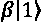
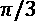

# 第十九章：量子计算

IBM 已经开始为研究和商业目的构建量子计算机。几年后，量子计算将变得具有颠覆性，并提供指数级的计算能力。谷歌、Xanadu、D-Wave、Rigetti 等公司都在将研究预算投入到量子计算中。

这一在人类历史上独特的计算能力打开了获得经典计算机无法实现的结果的大门。1994 年，彼得·肖尔展示了量子算法在整数的质因数分解和离散对数问题上优于经典算法。随后在 1995 年，洛夫·格罗弗提出了无结构搜索问题。随着量子计算机的崛起，研究可以走得更远。

量子计算机本身不会提供革命性的算法。任何算法都可以分解为能够运行在基本经典计算机上的组件。超级计算机仍然能够比量子计算机更容易地运行人工智能算法。量子计算机例如没有内存，因此它们在输入和解释输出时严重依赖经典计算机。

尽管量子计算机有其局限性，但随着时间的推移，量子计算的能力将突破我们现在想象的极限，许多公司已经在银行、医疗保健、网络安全等领域投资量子计算研究。

本章解释了为什么量子计算机优于经典计算机，什么是量子比特，如何使用它，以及量子思维实验如何引领量子思维机器的可能性。所提供的示例只是以一种创新的方式来接近量子计算。

我们将从经典计算机获取结果，将这些结果输入到量子计算机，然后解释量子计算算法提供的结果。有些进一步探讨了混合量子-经典算法，这超出了本章的范围。

在*第十八章*，*神经形态计算*中，我们探讨了如何利用大脑创建神经形态模型。在本章中，我们将通过一个研究项目创建一个更高层次的表示来构建思维。量子思维基于 CRLMM，我已经成功地将其应用于许多企业网站。在这个研究项目中，一个名为 MindX 的量子思维代表了一个随机人的思维。我们将通过一个令人兴奋的实验探索 MindX。

本章将涵盖以下主题：

+   为什么量子计算机比其他经典计算机更强大

+   量子比特是什么

+   Bloch 球

+   量子计算

+   如何构建 MindX，一个思维量子计算机研究项目

首先，让我们讨论一下量子计算机的一些基础知识，以及它们为何如此强大。

**注意**：本章是自包含的，包含量子电路的截图，供那些不愿意在阅读本章之前安装任何东西的读者使用。IBM Q 和 Quirk 可以在线使用，无需安装任何本地软件。

# 量子计算机的强大力量

在我们开始讨论 MindX 这个令人兴奋的研究项目——构建一台具有思维能力的量子计算机之前，我们应该从基础知识开始。本节描述了：

+   为什么量子计算机更快

+   什么是量子比特

+   如何测量量子比特（它的位置）

+   如何使用量子门创建量子得分（程序）

+   如何运行量子得分并利用其结果构建认知 NLP 聊天机器人

本章的目标不是深入探讨量子计算的细节，而是教你足够的知识，让你了解如何构建一台思维型量子计算机。本章的目的是简单地展示量子计算机是如何工作的，并为我们开启使用计算机的新方式。

## 量子计算机的速度

标准计算机比特只有 0 或 1 状态。经典计算机会处理 0 或 1，系统选择其中一个，但它仍然局限于选择 1 或（XOR）0，它不能同时管理这两种状态。

量子计算机不受 XOR 状态的限制，它处于 AND 状态。它可以同时管理 0 和 1 之间的值，直到进行测量！量子状态在观察之前是未知的，这意味着量子程序可以同时使用 0 和 1 之间的值。一旦被观察，量子位会因为量子状态的物理不稳定性而取值 0 或 1。

仅仅观察一个量子状态就会使状态崩溃。在量子计算中，这叫做**去相干**。这不是魔法，量子比特是不稳定的，只有在被观察时，量子状态才会崩溃。

这意味着量子计算在被测量后是无存储的。一旦测量完成，量子计算机内没有存储器。输入由经典计算机提供，输出再返回到经典计算机，由以下过程进行存储：

1.  经典计算机提供输入

1.  量子计算机处理输入并生成输出

1.  经典计算机解释输出

话虽如此，量子计算机的计算能力完全可以证明这种架构限制是合理的。

在量子位被观察之前，它可以处于 0 或 1 状态，或者介于两者之间的概率状态，如 0.1、0.7 或 0.9。

观察情况被称为测量状态。当被测量时，只有 0 或（XOR）1 将成为结果。

在状态被测量之前，可能的概率有很多。如果向系统中添加一个量子比特，我们现在有两个量子比特和四个基本组合，所有这些都可以同时存在。

与标准计算机逻辑不同，所有四种状态都可以同时用于并行处理算法。给定算法的可能状态的数量将随着涉及的量子比特数增加而扩展。可以通过以下数字估算状态的数量，其中`q`是量子比特的数量：

2^q

看着这个小方程似乎一点都不酷。现在，让我们看看它在运行最多 100 个量子比特时，可能状态数`nb`所呈现的样子：

```py
import numpy as np
for q in range(101):
    v=(2**q)
    print("Size of nb to describe",q," qubits:","{:,}".format(v)) 
```

该程序看起来也不太可怕。然而，以下的输出结果却是令人震惊的：

```py
Size of nb to describe 0 qubits: 1
Size of nb to describe 1 qubits: 2
Size of nb to describe 2 qubits: 4
Size of nb to describe 3 qubits: 8
Size of nb to describe 4 qubits: 16
Size of nb to describe 5 qubits: 32
Size of nb to describe 6 qubits: 64
...
Size of nb to describe 10 qubits: 1,024
...
Size of nb to describe 50 qubits: 1,125,899,906,842,624
...
Size of nb to describe 97 qubits:
158,456,325,028,528,675,187,087,900,672
Size of nb to describe 98 qubits:
316,912,650,057,057,350,374,175,801,344
Size of nb to describe 99 qubits:
633,825,300,114,114,700,748,351,602,688
Size of nb to describe 100 qubits:
1,267,650,600,228,229,401,496,703,205,376 
```

目前，大数据通常以拍字节为单位进行计算。一个拍字节=10¹⁵或者大约 2⁵⁰字节。

Facebook 存储着超过 20 亿账户的数据。想象一下，Facebook 在某一天管理 500 拍字节的数据。让我们来看一下 500 拍字节大概是多少，下面是相关代码：

```py
print("Facebook in the near future:")
s=(2**50)*500
print("{:,}".format(v)) 
```

输出结果相当令人惊讶，因为它展示的是一个 100 量子比特量子计算机在一次运行中能计算的数据量：

```py
A segment of Facebook data :
1,267,650,600,228,229,401,496,703,205,376 
```

这意味着，一个 100 量子比特的单一量子计算机能够运行一个计算，计算量等同于在不久的将来超过 20 亿个 Facebook 账户所代表的所有数据量。

量子计算机实际上并不会包含那样的数据量，但它表明，可以生成一个包含如此计算信息量的计算结果。

更重要的是，这还意味着一个单一的量子计算机能够运行一个单一思维的数据集（见下一节），并计算其中的关联。这一思维过程能够生成指数级的连接量。

经典的`n`比特计算机管理`n`个比特，而量子计算机则会管理 2^n 个比特或 2^q 个比特。

与量子计算机 2^q 的指数级能力相比，很快，经典计算机在科学计算中将看起来像是过去的遗物。经典计算机仍然会在使用，但量子计算机将成为探索超越当前人工智能极限的世界的工具。

想象一下你在本书中看到的所有 AI 解决方案。一旦你接触到量子计算，这些解决方案就会显得有些过时。

量子计算机将在未来的几年里在许多领域超过其他任何计算机。在一次并行计算中，量子计算机将在一次运行中完成一些经典计算机需要数年才能计算出来的任务。

现在，想一想一个由多个量子计算机组成的网络能做什么！

我们常常试图将大体量的数据与宇宙中的恒星数量进行比较，并且说：“这比我们宇宙中的恒星还要多。”但现在我们必须转向相反的方向，关注非常小的数字。

教训很清楚：未来属于纳米模型。量子计算既是一个挑战，也是一个机会。

## 定义一个量子比特

一个量子比特，或量子位，有一个物理对应物。例如，量子状态可以通过超导环中的振荡电流进行编码。谷歌和 IBM 已经尝试了这种方法。另一种方式是将量子比特编码为一个被困在电磁场中的离子，置于真空陷阱中。

光子、电子、光的状态等技术已经出现。无论采用哪种方法，50 量子比特以上的量子计算机执行的计算将超过经典超级计算机的能力。

竞争异常激烈，因为市场将迅速变得庞大。现在就为即将到来的颠覆做好准备！

## 表示一个量子比特

一个量子比特的数学表示是：

+    对于 0 值

+    对于 1 值

+    其中α是一个概率参数

+    其中β是一个概率参数

这些括号被称为括号或布拉-凯特表示法。

这种线性表示被称为叠加。它本身解释了量子计算的主要优势。

因此，量子态中 0 和 1 的叠加可以通过诸如！[](img/B15438_19_005.png) 这样的凯特（kets）来表达，而不是通过像！[](img/B15438_19_006.png) 这样的布拉（bras）表示：


α和β的概率看起来像是权重，这些量子比特可能状态的总概率必须加起来为 1。我们使用分区函数、softmax 和其他技术来确保概率和保持等于 1。这并不奇怪，因为像我们这些计算机爱好者设计了编程量子计算机的方式。

转换成数学表达式，这意味着！[](img/B15438_19_008.png) 和！[](img/B15438_19_009.png)的概率必须加起来为 1。对于量子比特的概率，值被平方，从而得出以下约束条件：


为了描述量子比特的可能状态，我们需要三个数字：0 和 1 的可能状态，以及一个数值来确定概率的值（另一个隐含的，因为总和必须为 1）。

由于量子比特在各自的状态中相互作用，交互被称为纠缠。量子纠缠指的是至少两个交互的量子比特。它们不能单独描述，必须考虑所有量子比特的所有状态。

这一现象已经在物理上得到再现，这意味着这种量子纠缠看起来很奇怪，因为它们的量子纠缠（关系）可以发生在远距离之间。一个量子比特可以影响一个物理上遥远的量子比特。

这是一种奇特的思维方式，最初并未得到广泛接受。阿尔伯特·爱因斯坦常被引用为讽刺性地称量子纠缠为“远距离的幽灵作用”。

## 量子比特的位置

表示量子比特状态的主要方式之一是使用布洛赫球。它展示了量子比特的旋转，并可以用来描述量子比特的状态。为了正确理解这一点，接下来的部分将首先回顾一下圆的某些性质。

### 弧度、度数和旋转

半径是圆心到圆周的距离，如下图所示：


图 19.1：圆的半径

圆的半径是圆直径的一半。半径`r`和圆周长`C`之间的关系是（其中！[](img/B15438_19_011.png)）：


如果半径的长度绕圆周一圈，那么该弧就形成一个弧度，如下图所示：


图 19.2：一个弧度

弧度所形成的角度大约等于 57.29°（度）。

弧度的属性可以用于旋转：

+   3.14 × 57.29° = 大约 180°

+   因此  弧度 = 180°

旋转通常用弧度表示，如  所示，以下表格展示了这一点：

| **度数** | **弧度** |
| --- | --- |
| 30° |  |
| 45° |  |
| 60° |  |
| 90° |  |
| 180° |  |
| 270° |  |
| 360° |  |

既然我们已经回顾了这一点，让我们来探索布洛赫球。

### 布洛赫球

刚才展示的弧度表是一种实用的描述旋转方式。布洛赫球，如下图所示，提供了量子比特的位置和旋转的可视化表示：


图 19.3：布洛赫球

北极和南极（极坐标）表示量子比特的基本状态：


一个量子比特可以取布洛赫球上的任何位置。

## 组合量子分数

组合量子分数由在五线谱（或电路）上定位门并添加一个测量组成。输入来自经典计算机。测量阶段后，输出返回经典计算机。原因是量子计算机没有内存，因此由于其不稳定性，无法存储中间状态。

本节使用 Quirk，一个非常有教育意义的量子电路模拟器，来展示量子门和量子作曲器。

你可以通过以下链接访问 Quirk 在线： [`algassert.com/quirk`](https://algassert.com/quirk)。

### 使用 Quirk 的量子门

量子比特由线条表示，它们从左边开始，如下所示的量子门编程接口所示：


图 19.4：量子门编程接口

门是逻辑门，用来转换量子比特的状态。

#### NOT 门

一个 NOT 门将把 ket-zero  转换为 ket-one 。它还将把 ket-one  转换为 ket-zero 。

在电路描述中，**On** 是 ket-one 状态，**Off** 是 ket-zero 状态，如下所示的量子分数所示：


图 19.5：量子分数电路描述

你可以看到：

+   一个 NOT 门符号是一个圆圈，内部有一条垂直和一条水平线

+   **On** 状态意味着该状态是 

+   布洛赫球表示位于 （从布洛赫球顶部开始，如图所示）

#### H 门

一个 H 门或 Hadamard 门将执行以下转换：


图 19.6：Hadamard 门转换

以下 50% 的概率将显示在一个矩形中，布洛赫球上的位置也将显示出来：


图 19.7：矩形和布洛赫球上的 50% 概率

门的基本作用是旋转布洛赫球上的量子比特，并在测量时产生一个可能的结果。正如此设计菜单图所示，有许多可能的门可供探索和使用：


图 19.8：门设计菜单

这些门（gates）足以构建许多算法。

### 使用 Quirk 的量子计算机程序

这里的目标是与界面互动，直观地观察电路如何运行。

使用 Quirk 构建量子程序（或电路）意味着以下内容：

+   拖放门操作，使量子比特在特定方向上旋转并产生可能的结果

+   添加另一个量子比特，重复相同操作，依此类推

+   能够进行中间测量，尽管在真实的物理量子计算机中这是不可能的（观察会导致系统坍缩）

一个程序表示如下，例如：


图 19.9：量子计算机程序表示

起初有两个量子比特，每行上方都有一个门。然后，显示中间结果，这使得模拟器具有很强的教育意义。接着，添加两个新的门。最后，在末尾添加以下测量探针：


图 19.10：测量探针

一旦测量完成，最终结果会显示在测量符号的右侧。

### 使用 IBM Q 的量子计算机程序

IBM Q 提供了一个云平台来运行真实的物理量子计算机。

创建一个免费账户并访问 IBM 量子计算作曲器。就像使用 Quirk 一样，量子门会在以下程序中拖拽，正如这个图所示：


图 19.11：拖拽的量子门

该程序可以在像 Quirk 这样的模拟器上运行，或者在真实的量子计算机上运行，如下图所示：


图 19.12：程序界面

点击**模拟**，这将启动一个模拟器。

**运行**按钮启动 IBM 物理量子计算机上的计算。这是一次令人兴奋的体验！未来触手可及。

以下输出非常有趣。它与 Quirk 在相同程序下稍有不同，但概率如预期一样加起来为 1：


图 19.13：量子计算机程序输出

IBM 还拥有一个源代码版本（QASM）的量子计算机程序，如下所示：

```py
include "qelib1.inc";
qreg q[5];
creg c[5];
h q[0];
z q[1];
y q[0];
x q[1];
measure q[0] -> c[0];
measure q[1] -> c[1]; 
```

该语言是一种开放量子汇编语言（Open Quantum Assembly Language）。它可以像任何其他语言一样在 IBM 的 Q 平台编辑器中编写。还可以下载开发工具包，且 API 功能完备。IBM 提供了关于这种方法各个方面的广泛而详细的文档。

综上所述，我们来看看量子计算如何推动 AI 项目。现在是时候定义思维型量子计算机项目了。

# 一台思维型量子计算机

思考型量子计算机不是对大脑功能的再现，而是对一个人的心灵的表现。神经形态计算是表示我们神经元以及大脑如何通过尖峰神经元进行思考的一种方法。量子计算提供了一种激动人心的方式，通过数学算法模仿我们大脑的能力，这些算法与量子比特（而非神经元）一起工作。我们才刚刚开始探索这些方法的潜力，实际上，它们很可能最终会融合成一种混合的软件和硬件解决方案。

量子 MindX 实验的目标是构建一个名为 MindX 的个人大脑，里面存储了过去的事件、对话、聊天记录和照片，这些数据保存在经典计算机上。然后，程序会将数据的子集转化为量子电路，观察会发生什么，当量子电路被放置并生成数百万种可能性时，它的行为如何。

本节描述了如何构建 MindX，一个思考型计算机，它只是一个研究项目。必须注意的是，这种方法是实验性的。它可以被视为一个高级心灵实验。我已经研究这个课题多年了。量子计算的力量无疑将推动这一领域的研究。

## 表示我们大脑的概念

输入包括对 PCA CRLMM 表示的心态编码，正如我们在*第十四章*中所构建的那样，*使用受限玻尔兹曼机（RBM）和主成分分析（PCA）准备聊天机器人的输入*。CRLMM 表示不是一个通用的词典或百科全书数据集，而是一个实际个人数据的心灵数据集，这些数据被收集、分类并转化为 PCA。

## 扩展 MindX 的概念表示

如果在这项研究实验之外实现，MindX 的心灵数据集将持续增长。它将配备传感器来处理身体温度进行情感分类、面部识别进行表情检测、身体语言探测器等。所有这些技术已经可以使用。纽约证券交易所已经拥有人工智能物联网代理，它们从外部来源收集信息来做决策。这些 AI 代理已取代了大量人类的决策工作。想象一下当量子计算成为颠覆性技术时会发生什么！

## MindX 实验

量子 MindX 实验的目的是构建一个大脑，并让它通过量子计算机的力量进行思考。本节将展示如何运行一个 16 量子比特的大脑。

描述 16 量子比特量子模拟所需的数字大小为 65,536。

本节首先描述如何执行以下操作：

+   准备数据

+   创建并运行量子分数

+   使用输出

让我们继续准备数据吧。

### 准备数据

为了准备进行更高维度的计算，我已经在企业项目中使用了概念编码方法超过 30 年，用以为我开发的算法提供嵌入式数据。这保证了高层次的抽象，以解决问题。这是一种非常有利可图的实施迁移学习和领域学习的方法。通过这种方式，你可以将相同的模型应用于许多不同的领域。

该方法包括使用本书中描述的方法嵌入数据。目标始终保持不变——将数据点转换为更高维度以可视化特征。

对于量子计算，MindX 实验中的方法保持不变。

### 转换函数 – 情境函数

在创建和运行评分之前，需要应用两个函数：情绪状态函数和量子转换函数。

情境函数包括在 PCA 维度中构建特征向量。我们在*第十四章*《使用限制玻尔兹曼机（RBMs）和主成分分析（PCA）准备聊天机器人的输入》中完成了这一任务，并在*第十五章*《设置认知 NLP UI/CUI 聊天机器人》中将其应用于聊天机器人。该聊天机器人能够使用人 X 的思维数据集构建有意义的对话。

在这一章中，量子维度将为聊天机器人提供一个初步的个人思维，而不是像机器一样能够识别、分类和预测的通用思维。

MindX 拥有一个像人类一样有偏见的思维。MindX 拥有一个异常开放的心态，能够适应每个人，这赋予了它共情能力。

MindX 可以怀疑。因此，它比教条式的机器学习得更好。

情境函数将为 MindX 机器人创建一个电影推荐情境矩阵，机器人将与消费者进行交流。在 MindX 机器人提出电影推荐的情境下，举个例子，对于 16 个量子比特，它可能是以下的某种情况：

| **量子比特** | **概念** | **图像** | **初始极性** |
| --- | --- | --- | --- |
| 1 | 城市 | 停车 | 0.146 |
| 2 | 黑暗 | 黑暗森林 | 0.5 |
| 3 | 怀旧 | 秋叶 | 0.5 |
| 4 | 担忧 | 黑暗背景 | 0.146 |
| 5 | 工作 | 难过的表情 | 0.5 |
|  | … | .. | .. |
| 15 | 考虑电影《Lost》 |  | 0.38 |
| 16 | 决定推荐《Lost》 |  | 0.0 |

MindX 不再分析人 X。它现在从其思维数据集中加载了一个共情矩阵，该矩阵包含数据和情感分析的*极性*。接近 1 的值是积极的，接近 0 或负数的值是消极的。MindX 加载了它自己的思维以及另一个人的思维。

共情使你的思维和感受被另一个人的思维和感受所染色。

刚才显示的 16 量子比特矩阵包含四列，如前面的表格所示：

+   **量子比特**：该量子比特在量子合成器中的线路

+   **概念与心理表征**：概念加载于 MindX 的情况数据集中，这一过程在*第十四章*，*使用限制玻尔兹曼机（RBM）和主成分分析（PCA）准备输入聊天机器人*中描述，我们运行 RBM 生成的特征通过 PCA 进行表示。

心理表征如下所示，出现在以下的 PCA 中：


图 19.14：主成分分析（PCA）表示的“思维”

这些特征，源自于特定年龄段的电影偏好 RBM，现在可以作为输入在量子电路中生成带有信息和噪声的随机心理活动。

这个电影示例用于解释如何创建一个具有思维能力、富有同理心的聊天机器人。此方法可应用于其他商业市场领域或任何需要聊天机器人超越预设答案进行思考的情境。许多领域，如医疗保健、制药研究和安全，将从开拓思维的量子算法中受益。

### 转换函数 - 量子函数

算法已经生成了带有标签（概念和图像）的量子比特行号。每一行还具有情感分析极性，以概率格式表示的归一化值，范围从 0 到 1。我们将考虑大脑对一个对象的负面和正面反应。请记住，“负面”接近 0，“正面”接近 1，介于两者之间的值提供了更详细的近似。0.4 到 0.6 是一个转折点。

这第一次转化为另一个维度，是初始化量子转换函数的第一步。量子转换函数由初始化所有 16 个量子比特的第一列与量子门组成。

就像数据集被转换为主成分特征一样，极性转换函数使得量子转换函数可以将数据集带入量子宇宙。

该函数将自动找到表示以下情况矩阵的数据点的归一化情感分析极性的量子门：

| **初始极性** | **量子门** |
| --- | --- |
| 0.146 | X^(1/4) |
| 0.5 | X^(1/2) |
| 0.5 | X^(1/2) |
| 0.146 | X^(1/4) |
| 0.5 | X^(1/2) |
| .. |  |
| 0.38 | X^(1/8) |
| 0.0 | Z^(1/8) |

MindX 的心态，一个随机的人，现在处于一个矩阵中，其概念已经转化为量子维度，在这个维度中，数据状态可以在整个量子得分创建过程中被追踪。

### 创建并运行得分

MindX 的思维过程在量子得分中描述。构建这个得分有两种方式：

+   手动进行，就像作曲家写音乐一样。这需要思考前一个逻辑门以及下一个逻辑门的效果，同时考虑决策过程。这就像写任何人工智能程序。

+   自动化地，通过构建一个读取 MindX 思维规则库并应用量子门的函数。你也可以将此应用于机器学习和深度学习，测试量子计算机与经典计算机的性能。

无论如何，它需要编写一个算法。这个算法是一个决策算法，会考虑情感。例如，怀疑是阻止许多人做出错误决策的原因。过多的怀疑会使人放弃某个情境。

这是一个量子转录算法，考虑了 MindX 的概念，并表示它们如何互动。这需要非常精确的思维和认知科学编程。

以下是我用 Quirk 构建的实验性量子得分：


图 19.15：用 Quirk 构建的量子得分

一旦量子得分运行并且测量完成，右侧的绿色矩形提供输出。

### 使用输出

量子得分的输出现在作为一列添加到情境矩阵中。如果你想实现这样的解决方案，记住，写这些函数会花费一些时间，需要一些汗水和茶水，才能熬过夜晚。MindX 可用于增强一个带有未计划响应的聊天机器人。MindX 已证明它具有想象力的潜力。

| **量子比特** | **概念** | **图像** | **以量子门形式表达的初始归一化极性** | **直接解读为情感分析极性的量子输出** |
| --- | --- | --- | --- | --- |
| 1 | 城市 | 停车场 | 0.146 | 0.677 |
| 2 | 黑暗 | 黑暗森林 | 0.5 | 0.691 |
| 3 | 怀旧 | 秋叶 | 0.5 | 0.5 |
| 4 | 担忧 | 黑暗背景 | 0.146 | 0.48 |
| 5 | 工作 | 悲伤的面孔 | 0.5 | 0.36 |
|  | … | .. | .. |  |
| 15 | 考虑电影《迷失》 |  | 0.38 | 0.82 |
| 16 | 决定建议“迷失” |  | 0.0 | 0.75 |

MindX 给出了关于向人物 X 推荐某部电影的 65,536 个量子状态描述。第 15 行和第 16 行表明，归一化极性值已超过 0.5，表现出对该电影的积极情感。

推理是，前几行显示了 MindX 在那个时刻感受到的人物 X 对生活的怀疑：

+   人物 X 会认同电影《迷失》

+   这部电影有一个快乐的结局（MindX 通过电影的特征知道这一点）

+   人物 X 在看完电影后，情绪可能会有所提升

你可以尝试构建量子得分。你可以在不安装任何东西的情况下使用 Quirk，并探索许多领域中的电路列表：Grover 搜索、Shor 的周期查找、量子傅里叶变换等等。

# 总结

量子计算机已经为那些无法用经典计算机进行的科学实验打开了大门。在几年内，量子计算机将成为主流，成为不可避免的存在，也是企业和研究实验室的关键资产。市场争夺战已经开始。

将 CRLMM 应用于量子计算机，可能使 MindX 成为地球上最强大的思维之一——无论是人类还是机器。

拥有无限的心智数据集和从 250 个量子比特开始的 2^q 量子计算机，MindX 能够获得像一个活了 1000 年的人的思维能力和经验。通过转换函数加载的 MindX 的思维能力和海量的实时记忆，能够帮助解决许多医学、物流和其他决策问题。

量子思维刚刚开始改变人们对世界的认知。像 CRLMM 这样的概念性 AI 模型无疑将成为下一代 AI 解决方案的起点。这些 CRLMM 模型将更加强大，因为它们将具备同理心和复杂的思维能力。

希望这篇关于量子计算的概述能为你打开通往新世界的想象大门！

人工智能刚刚开始进入我们的生活旅程。永远相信创新。永远不要相信仅仅解决一个问题而不打开一个充满问题和思想宇宙的解决方案！

# 问题

1.  除了炒作，实际上并没有量子计算机存在。（是 | 否）

1.  量子计算机能够存储数据。（是 | 否）

1.  量子门对量子比特的影响可以通过布洛赫球来观察。（是 | 否）

1.  一个用过去的经验、图像、文字和其他日常信息片段（如存储的记忆）思考的大脑，将能找到数学本身无法解决的更深层次问题的解决方案。（是 | 否）

1.  量子计算机将解决今天无法解决的医学研究问题。（是 | 否）

1.  量子计算机比经典计算机在数学问题的解决上要快得多。（是 | 否）

1.  经典计算机和智能手机处理器很快就会消失。（是 | 否）

1.  量子得分不能以源代码格式编写，而只能通过可视化界面进行。（是 | 否）

1.  量子模拟器的运行速度可以与量子计算机一样快。（是 | 否）

1.  量子计算机在进行计算时会产生中间结果。（是 | 否）

# 进一步阅读

+   **理论**：*量子计算与量子信息：10 周年纪念版*，*迈克尔·尼尔森*，*艾萨克·L·庄*

+   探索 IBM Q，了解如何实现量子得分：[`www.ibm.com/quantum-computing/`](https://www.ibm.com/quantum-computing/)

+   使用 Quirk，一个直观的量子得分设计工具：[`algassert.com/2016/05/22/quirk.html`](http://algassert.com/2016/05/22/quirk.html)
