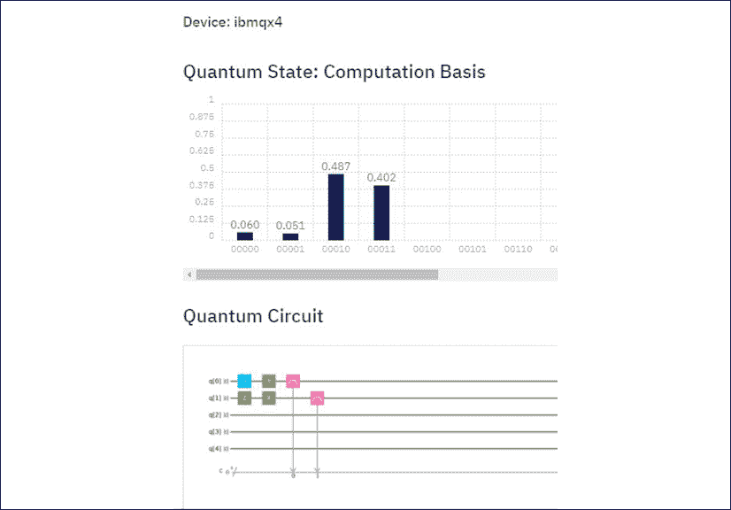
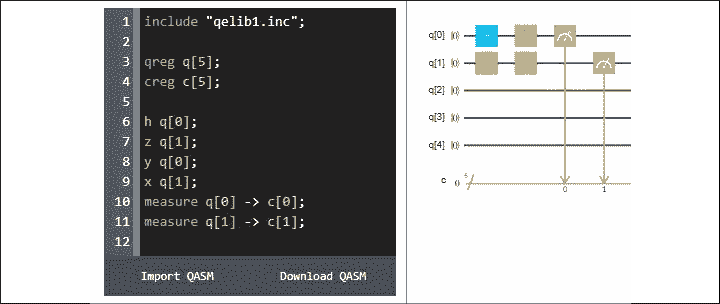

# 第二十章：问题的答案

# 第一章 – 通过强化学习开始了解下一代人工智能

1.  **强化学习是否无记忆？（是 | 否）**

    答案是**是**。强化学习是无记忆的。代理通过计算下一个状态而不查看过去。这与人类有显著不同。人类极度依赖记忆。基于 CPU 的强化学习系统在没有经验的情况下找到解决方案。人类智能仅仅证明了智能能够解决问题。仅此而已。适应性思考者可以想象出新的机器智能形式。

    必须注意，在某些情况下存在例外，但一般规则是无记忆系统。

1.  **强化学习是否使用随机（随机）函数？（是 | 否）**

    答案是**是**。在特定的马尔可夫决策过程模型中，选择是随机的。通过仅仅两个问题，你就可以看到贝尔曼方程是无记忆的，并且做出随机决策。没有人类是这样推理的。成为一个适应性思考者是一种信仰的飞跃。你必须抛弃过去的自我，开始用方程式的思维方式进行思考。

1.  **MDP 是否基于规则库？（是 | 否）**

    答案是**否**。人类基于规则的经验在这个过程中是无用的。人类的思维通常基于因果关系的规则，例如。此外，MDP 提供了有效的替代方案，可以避免长时间与无法清晰表达问题的未来用户进行咨询。

1.  **Q 函数是否基于 MDP？（是 | 否）**

    答案是**是**。`Q`这一表达方式出现在贝尔曼方程基于 MDP 流行的时期。说你在使用 Q 函数比谈论贝尔曼更时髦，因为是他在 1957 年将这一切组合在一起。事实上，安德烈·马尔可夫是俄罗斯人，他在 1913 年使用一个包含 2 万封信件的数据集，预测了信件在小说中的未来使用情况。之后他又将其扩展到包含 10 万封信件的数据集。这意味着，这一理论早在 100 年前就已存在。`Q`适应我们这个充满个性且强大的 CPU 的新世界。

1.  **数学对人工智能至关重要吗？（是 | 否）**

    答案是**是**。如果你掌握了线性代数和概率的基础，你将处于即将到来的所有技术的最前沿。值得花上几个月的晚上时间学习这个话题，或者参加一门在线课程（MOOC）。否则，你将依赖别人来向你解释事情。

1.  **本章中的贝尔曼-MDP 过程是否能应用于许多问题？（是 | 否）**

    答案是**是**。你可以将其应用于机器人技术、市场分析、物联网、语言学以及众多其他问题。

1.  **机器学习程序是否不可能自行创建另一个程序？（是 | 否）**

    答案是**否**。这并非不可能。DeepCode 已经做到了：[`www.deepcode.ai/`](https://www.deepcode.ai/)。

    不要感到惊讶。既然你已经成为一个适应性思维者，并且知道这些系统依赖于方程式，而不是人类，你就能轻松理解数学系统并不像你想象的那样难以复制。

1.  **在强化学习程序中是否需要顾问输入商业规则？（是 | 否）**

    答案是**否**。这只是一个选项。MDP 过程中的强化学习是没有记忆且随机的。顾问们的职责是管理、解释和在这些项目中进行培训。

1.  **强化学习是监督学习还是无监督学习？（监督 | 无监督）**

    答案是**无监督**。关键在于从未标记的数据中学习。如果数据是有标签的，那么我们就进入了监督学习的世界；那时我们会寻找模式并学习它们。在这一点上，你可以很容易地看到自己正在进行一场冒险——一个没有记忆、随机且没有标签的世界等待你去发现。

1.  **Q 学习能在没有奖励矩阵的情况下运行吗？（是 | 否）**

    答案是**否**。当然，一个聪明的开发者总能找到解决方法。该系统需要一个起始点。你会在第二章看到，在现实项目中找到正确的奖励矩阵是一个相当大的挑战。

# 第二章：- 构建奖励矩阵 - 设计你的数据集

1.  **原始数据可以作为神经元的输入并通过权重进行转换吗？（是 | 否）**

    如果数据是数值格式，答案是**是**。如果它是一个合适的数值格式，输入可以与权重和偏差相乘。

    如果数据不是数值格式，那么就需要一个数值编码阶段。

1.  **麦卡洛赫-皮特神经元是否需要阈值？（是 | 否）**

    答案是**是**。加权和并不意味着什么，如果你没有什么东西来衡量其值。麦卡洛赫和皮特花费了数月的时间来完成这项工作。最初，时间是方程式的一部分，就像它在我们大脑中一样。但随后，像约瑟夫·傅里叶（Joseph Fourier，1768-1830）一样，他们发现了自我重复的周期——这些周期并不需要超出该神经元的更多内容。

    沃伦·麦卡洛赫和沃尔特·皮特斯在 1943 年发明了第一个神经元并发表了论文。传说沃尔特·皮特斯在 1935 年时，12 岁的小孩生活在一个贫困的社区，被恶霸追赶，寻求藏身之所时进入了图书馆。在那里，他发现了*《数学原理》*，作者是*伯特兰·罗素*和*阿尔弗雷德·怀特海德*。总之，他不仅发现了推理中的错误，还写信给了伯特兰·罗素！从此，沃尔特被认为是数学方面的天才。与沃伦·麦卡洛赫，这位另一位天才一起，他们发明了第一个神经元。看起来很简单，但这是经历了无数个不眠之夜的结果。正如轮子的发明看似简单一样，到今天为止没有找到比它更好的东西。这个神经元的概念就是 AI 的轮子。

1.  **逻辑 sigmoid 激活函数会让权重的总和变大。（是 | 否）**

    答案是**否**。Sigmoid 函数的核心目的是在必要时减少总和，以便得到可以比较的数值。

1.  **McCulloch-Pitts 神经元会对输入的权重求和。（是 | 否）**

    答案是**是**。只有在你对权重求和时，它们才有意义。

1.  **logistic sigmoid 函数是一个 log10 操作。（是 | 否）**

    答案是**否**。Sigmoid 函数基于欧拉数 `e`，这是一个等于 2.71828 的常数。这个数字会产生自然对数。18 世纪，莱昂哈德·欧拉（1707-1783）用羽毛笔发现了这一点——那时候没有科学计算器或计算机！你是否注意到，AI 中使用的主要数学函数早在历史上就存在了？我们现在所认为的发现，实际上已经存在了几十年，有时甚至是几个世纪，这个现象将在后续章节中讨论。

1.  **如果对一个向量应用了 logistic sigmoid 函数，则不需要 logistic softmax。（是 | 否）**

    答案是**否**。计算向量中若干数值的和，然后将每个数值除以该和，能够显示涉及的比例。这是一个值得牢记的宝贵工具。

1.  **概率是一个介于 -1 和 1 之间的值。（是 | 否）**

    答案是**否**。概率的范围是 0 到 1 之间。

# 第三章 – 机器智能 – 评估函数与数值收敛

1.  **人类能打败国际象棋引擎吗？（是 | 否）**

    答案是**否**。如今，最高级别的国际象棋比赛不是在人类之间进行，而是在国际象棋引擎之间进行的。每个国际象棋引擎的开发者通过加速算法并减少 CPU 占用，为这些比赛做准备。如今，在智能手机上运行的顶级国际象棋引擎能够击败人类。在人类与人类的国际象棋比赛中，国际象棋的复杂性已经达到了极高的水平。现在，人类主要是与机器进行训练。

1.  **在人类直觉方面，处理大量数据时，人类比机器更能做出更好的决策。（是 | 否）**

    答案是**否**。即便是普通机器或智能手机的强大 CPU，结合合适的算法，能够比人类产生更好的结果。

1.  **构建一个具有 Q 函数的强化学习程序本身就是一项壮举。事后使用结果是没有意义的。（是 | 否）**

    答案是**否**。在学习 AI 时，仅仅验证结果是否正确就足够了。在实际应用中，这些结果被用于数据库或作为其他系统的输入。

1.  **监督学习中的决策树函数可以用来验证无监督学习过程的结果是否会产生可靠、可预测的结果。（是 | 否）**

    答案是**是**。在许多情况下，决策树函数非常高效。当涉及到大规模数据时，决策树函数可以用于分析机器学习过程的结果，并有助于预测过程。

1.  **强化学习程序的结果可以通过提供优先级作为输入，应用到调度系统中。（是 | 否）**

    答案是**是**。强化学习的 Q 函数输出可以作为输入注入到另一个 Q 函数中。几个结果可以在第一阶段合并，并成为第二阶段强化学习会话的奖励矩阵。

1.  **人工智能软件能像人类一样思考吗？（是 | 否）**

    答案是**是**，也是**否**。在早期，这种方法曾尝试使用基于神经科学的模型。然而，目前应用数学模型要高效得多。

    谁知道未来的神经形态计算研究会有什么发展呢？但就目前而言，深度学习作为主流，依赖于数学函数。

# 第四章 – 使用 K-means 聚类优化您的解决方案

1.  **可以在企业环境中使用随机数据构建原型吗？（是 | 否）**

    答案是**是**，也是**否**。为了开始开发一个原型，使用随机数据可以帮助确保基本算法按计划工作。

    然而，一旦原型得到了提升，使用设计良好的数据集将更加可靠。然后，一旦训练完成，随机数据可以再次帮助你观察系统在各种情况下的表现。

1.  **设计矩阵每个矩阵包含一个示例吗？（是 | 否）**

    答案是**否**。一个好的设计矩阵在每一行或每一列包含一个示例，具体取决于你希望它具有的形状。但要小心；一个包含过于高效数据的设计矩阵可能会*过拟合*。这意味着学习算法对这些数据非常有效，但无法适应新数据。另一方面，如果数据集包含过多错误，那么算法可能会*欠拟合*，也就是说它无法正确学习。一个好的设计矩阵应该包含可靠数据，一些不精确数据，以及一些*噪音*（一些能以不可靠方式影响算法的数据）。

1.  **自动引导车（AGVs）永远无法广泛应用。（是 | 否）**

    答案是**否**。这句话是不正确的。自动引导车（AGVs）将从现在开始不断扩展：无人机、汽车、飞机、仓储车辆、工业车辆等等。AGVs，加上 AI 和物联网，构成了第四次工业革命。

1.  **K-means 聚类能否应用于无人机交通？（是 | 否）**

    答案是**是**。看到交通积压的位置可以防止无人机堵塞（无人机盘旋等待）。

1.  **K-means 聚类能否应用于预测？（是 | 否）**

    答案是**是**。K-means 聚类可以用于预测。

1.  **Lloyd 算法是一个两步法吗？（是 | 否）**

    **是**，Lloyd 算法首先将每个数据点分类到最佳簇中。然后，一旦完成，它计算该簇的几何中心或质心。当没有数据点再更改簇时，算法就已经训练完成。

1.  **超参数控制算法的行为吗？（是 | 否）**

    答案是**是的**。超参数决定了计算的过程：聚类的数量、特征、批量大小等。

1.  **一旦程序运行成功，展示方式就不重要了。（是 | 否）**

    答案是**不是**。如果没有清晰的结果展示，整个训练过程最多是混乱，最差则是毫无用处的。

1.  **K 均值聚类仅仅是一个分类算法。它不是一个预测算法。（是 | 否）**

    答案是**不是**。K 均值聚类也可以作为一种预测算法使用。

# 第五章 – 如何使用决策树增强 K 均值聚类

问题将集中在超参数上。

1.  **k 聚类的数量并不那么重要。（是 | 否）**

    答案是**不是**。聚类的数量需要仔细选择，可能需要试错的方法。每个项目都会导致不同的聚类结果。

1.  **小批量和批量包含相同数量的数据。（是 | 否）**

    答案是**不是**。"批量"通常指的是数据集，而"小批量"代表数据的"子集"。

1.  **K 均值可以在没有小批量的情况下运行。（是 | 否）**

    答案是**是的**，也**不是**。如果数据量保持较小，训练周期可以在整个数据集上运行。如果数据量超出了合理的计算能力（CPU 或 GPU），则必须创建小批量来优化训练计算。

1.  **质心是否必须经过优化才能接受结果？（是 | 否）**

    答案是**是的**，也**不是**。假设你想把一把钥匙放进钥匙孔。钥匙孔代表你的视觉聚类的质心。你必须非常精确。如果你只是把一张纸扔进垃圾桶，你不需要瞄准聚类的完美中心（由垃圾桶的边缘标记）来实现目标。质心的精确度取决于算法的要求。

1.  **优化超参数不会花费太长时间。（是 | 否）**

    答案是**是的**，也**不是**。如果是一个简单的项目，时间不会很长。如果你面对的是一个大数据集，找到最优超参数会需要一些时间。

1.  **训练一个大数据集有时需要数周时间。（是 | 否）**

    答案是**是的**。媒体炒作和艰苦的工作是两个完全不同的领域。机器学习和深度学习仍然是艰难的实现项目。

1.  **决策树和随机森林是无监督算法。（是 | 否）**

    答案是**是的**，也**不是**。决策树既可以用于监督学习，也可以用于无监督学习。决策树可以从目标值开始，这使得它们成为监督学习算法。随机森林也可以以相同的方式使用。

# 第六章 – 利用谷歌翻译创新 AI

1.  **在将产品投放市场之前，是否更好等到你拥有顶级的产品？（是 | 否）**

    答案是**是的**，也是**不**。上下文才是关键。在 21 世纪初，空客公司正为完成 A380——有史以来最大的客机——而努力。工程师们在运送商业乘客之前，进行了数百项改进。我们对他们的期望一点也不低！

    就谷歌翻译而言，答案是一个巨大的“不”。通过将谷歌翻译上线并提供 API，谷歌鼓励了成千上万的 AI 开发者、语言学家、顾问和用户提供反馈和改进。此外，谷歌再次占据了网络市场的较大份额。

1.  **考虑到所做的投资，新产品应始终定价较高，以达到市场的顶端。 (是的 | 不)**

    答案是**是的**，也是**不**。同样，上下文决定了答案。当法拉利将新车推向市场时，价格必须高，原因有二；一是车的质量，二是生产成本，这使得高价才能确保创新的盈利性。同时，法拉利避免大规模生产，以保持其质量的高水平。

    当亚马逊网络服务（AWS）通过 SageMaker 将机器学习推向市场时，它实施了一项“按需付费”政策，从市场的低端开始。这个产品有其局限性，但亚马逊现在收到了大量反馈，并持续改进该产品。

1.  **发明一种新解决方案会使其自身被知晓。 (是的 | 不)**

    **是的**。一个发明社会准备接受的发明将会自行成功，无论如何。你可能会惊讶地发现，通过绘制投影图像来保存相机的图像，这一做法追溯的历史悠久，甚至没有人确切知道它是什么时候首次被使用的。没人知道它是被发明出来的，还是被发现的。无论如何，第一个*暗箱*（第一个“相机”）是具有革命性的。现在已经证明，著名的画家们曾经使用过这一技巧。图像被投影到纸张或画布上。“打印机”是手动的。画家就是“打印机”。然而，如我们所知，相机直到 20 世纪才真正变得具有颠覆性。

1.  **AI 能在不使用标准非学习算法的情况下解决大多数问题。 (是的 | 不)**

    答案是**不**。例如，创建数据集时需要使用非学习型的经典算法。此外，AI 依赖于云服务器、架构、所有编程语言中的标准算法（如 C++、Java、Python 等）和 Apache 服务器。即便是在自动驾驶汽车中，安装的传感器也需要进行标准的硬件工作，才能使其正常工作并解读信息，之后 AI 才介入解决一些问题。

    AI 就像我们的“大脑”。没有身体，它无法运作。

1.  **谷歌翻译能令人满意地翻译所有语言。 (是的 | 不)**

    阅读完这一章后，你可能会惊讶地发现，答案既是**是的**，又是**不**。如果你在你最喜欢的社交网络上，或者在电子邮件中使用谷歌翻译来说“你好”，“你好吗？”“谢谢你的消息”，以及类似的友好短语，那就足够了。

    但是当处理更详细的短语和句子时，Google Translate 会提供随机的令人满意的结果。从用户的角度来看，这是坏消息。对于开发者来说，这是一个宝藏！

1.  **如果你没有创造力，试图创新是没有用的。（是 | 否）**

    答案是一个巨大的**不**。你完全不需要富有想象力或创造力才能创新。不要让任何人让你相信这种胡说八道。如果你正在设计一个解决方案并发现缺少某个组件，去网上寻找一些替代组件，讨论一下，找到可以帮忙的人。然后通过团队合作完成它。每次都有效！

    即使是伟大的比尔·盖茨也足够聪明，向 Tim Patterson 求助来开发 MS-DOS，之后他成了亿万富翁。

1.  **如果你不是语言学家，试图改进 Google Translate 是没有用的。（是 | 否）**

    答案是**不**！再说一遍，绝对不要让任何人让你相信这种胡说八道。创新是团队合作。如果你喜欢 Google Translate 并且理解这一章的内容，并且有一些想法，和身边的语言学家合作，或者通过社交网络找到他们。这个世界是你用来改进的！

1.  **翻译太复杂，难以理解。（是 | 否）**

    **不**。一些人解释的方式过于复杂。如果你会说某种语言，你就是把自己的思想转化为语言的专家。通过努力，你可以进入翻译行业。

1.  **人工智能已经达到了它的极限。（是 | 否）**

    当然**不是**！我们只是刚刚触及了理论和应用的表面。

# 第七章 – 使用朴素贝叶斯优化区块链

1.  **加密货币是区块链今天唯一的用途。（是 | 否）**

    **不**。例如，IBM HyperLedger 使用区块链来组织供应链环境中的安全交易。

1.  **开采区块链可能是有利可图的。（是 | 否）**

    **是的**。但这是一种风险，就像任何其他的矿业操作或任何投机性努力一样。一些公司拥有巨大的资源来开采加密货币，这意味着他们能够击败小型竞争者来创建一个区块。

1.  **公司用区块链不能应用于销售。（是 | 否）**

    **不**。区块链云平台提供智能合约和在销售过程中管理交易的安全方式。

1.  **区块链的智能合约比标准的离线合同更容易编写。（是 | 否）**

    **是的**，如果它们是标准合同，这将加快交易速度。

    另一方面，**不**。如果交易复杂且需要定制，律师将不得不编写合同，然后只能在区块链云平台上使用。

1.  **一旦一个区块进入区块链网络，网络中的每个人都可以读取其内容。（是 | 否）**

    **是的**，如果没有强制执行隐私规则。

    **不**，如果强制执行了隐私规则。例如，IBM Hyperledger 提供隐私功能。

1.  **一个区块在区块链中可以保证绝对不可能发生欺诈。（是 | 否）**

    **是的**和**不是**。区块链中的一个区块一旦生成就无法再修改，从而避免了欺诈行为。没有人能篡改数据。然而，如果交易本身是非法的，那么该区块也会是欺诈性的。

1.  **应用贝叶斯定理只有一种方式。(是 | 否)**

    **不**。贝叶斯定理有很多变种。例如，使用朴素贝叶斯算法可以避免条件概率的约束。但另一种方法可能会使用条件概率。

1.  **训练朴素贝叶斯数据集需要一个标准函数。(是 | 否)**

    **不**。例如，高斯函数可以用于计算朴素贝叶斯算法等。

1.  **机器学习算法不会改变企业业务的本质。(是 | 否)**

    **不**。精心设计的机器学习将通过算法在公司内部传播，优化流程，进而颠覆各个业务领域。

# 第八章 – 使用前馈神经网络解决 XOR 问题

1.  **感知机单独能解决 XOR 问题吗？(是 | 否)**

    **是的**。1969 年时答案是“否”。解决这个问题需要一个神经网络或其他数学过程。值得一提的是，这是电路中常见的问题，尤其是在“前馈”电流的电路中，这个问题早已得到解决。

1.  **XOR 函数是线性不可分的吗？(是 | 否)**

    如果你使用一个神经元，那么答案是**否**；如果你使用至少两个神经元的隐藏层，那么答案是**是**。这是深度学习中需要解决的一个主要问题。例如，如果你无法在图片中区分一个面部的特征，那么识别这个面部将变得非常困难。想象一下，图片中一半的面部处于阴影中，另一半处于强烈的阳光下。由于一半眼睛和特征在阴影中，一个糟糕的深度学习程序可能只能捕捉到面部的一半，并且错误地分隔面部，造成边缘检测不佳。因此，线性可分性是机器学习的一个关键方面。

1.  **神经网络中层的主要目标之一是分类。(是 | 否)**

    答案是**是的**。一旦数据能够与给定的神经网络架构相匹配，预测和许多其他功能便成为可能。深度学习的关键在于能够将数据转化为通过各层获得的抽象理解后可以理解的信息片段。

1.  **深度学习是分类数据的唯一方法吗？(是 | 否)**

    答案是**否**。你可以通过 SQL 查询、电子表格、AI、机器学习以及标准源代码来分类数据。当分类涉及多个维度时，深度学习变得至关重要：首先要找到图片中的物体边缘，然后是形状，最后确定物体代表什么。要处理数百万张图片，这已经超出了标准编程或早期 AI 和机器学习程序的范畴。

1.  **成本函数显示神经网络的成本增加。(是 | 否)**

    答案是**否**。成本函数决定了训练的花费。运行 100,000 个 epoch 比运行 50,000 个 epoch 更昂贵。因此，在每个 epoch 中，必须估算训练成本（系统距离目标的远近）。因此，一个好的成本函数会减少运行神经网络的成本。

1.  **简单的算术运算足以优化成本函数吗？ (是 | 否)**

    答案是**是**。只要你知道你的成本函数是如何增加或减少的，任何有效的方法都是可以的。

1.  **前馈网络需要输入、层和输出。 (是 | 否)**

    答案是**是**。没有层，就没有网络。

1.  **前馈网络总是需要反向传播训练。 (是 | 否)**

    在变化的环境中，答案通常是**是**。由于该领域是新的，我们往往认为一旦训练完成，工作就结束了。如果数据集在重复的环境中非常稳定，比如在商店、仓库或工厂中区分各种恒定产品，那么神经网络将完成它设计的分类任务。如果引入了新产品，则可以重新启动训练。

1.  **在实际应用中，解决方案只能通过遵循现有理论来找到。 (是 | 否)**

    答案是**否**。没有学术研究，深度学习甚至不会存在。没有大学，这些使用的理念将是如此简单，以至于永远不会有好的效果。

    另一方面，研究人员需要现实世界的反馈。如果我们发现新的做法符合他们的建议，我们应该将其发布出来，帮助全球研究。这是一个双向过程。

# 第九章 – 使用卷积神经网络 (CNN) 进行抽象图像分类

1.  **卷积神经网络 (CNN) 只能处理图像。 (是 | 否)**

    答案是**否**。CNN 可以处理单词、声音或视频序列，用于分类和预测。

1.  **卷积核是用于卷积的预设矩阵。 (是 | 否)**

    答案是**是**，并且是**否**。有许多预设矩阵用于处理图像，比如本章中 `Edge_detection_Kernel.py` 中使用的矩阵。然而，在本章中，卷积核是随机创建的，然后网络训练它们的权重以适应目标图像。

1.  **池化有池化矩阵吗，还是随机的？**

    在某些情况下，当将池化层添加到模型中时，池化矩阵的大小是一个可选项，例如 2×2 的池化窗口。然而，在 AutoML 神经网络中，我们可以尝试运行优化算法，测试不同的大小，看看哪种大小能提供最佳性能。

1.  **数据集的大小必须总是很大。 (是 | 否)**

    **不**。数据集没有标准大小。它取决于训练模型。如果目标图像没有复杂的特征，例如，数据集将比具有复杂特征的数据集要小。此外，`ImageDataGenerator`函数将通过扭曲数据并使用提供的选项来扩展数据集。

1.  **在网络上有众多的图像库可供选择，找到一个数据集并不是问题。 (是 | 否)**

    答案是**是**，也是**否**。是的，因为如果模型仍然是标准的学术模型，那么现有的图像（CIFAR，MNIST 或其他）就足够了。

    不，因为在实际的企业环境中，你必须构建自己的数据集，并添加包含*噪声*的图像。噪声需要更多的精细调优，才能使模型变得可靠且具有广泛的适应性。

1.  **一旦 CNN 建立，训练它并不需要太多时间。 (是 | 否)**

    答案是**否**。无论模型是什么样的，如果你希望它可靠，训练仍然是一个耗时的过程。正如本章所示，一个模型需要许多选项和数学思维。

1.  **训练好的 CNN 模型只适用于一种类型的图像。 (是 | 否)**

    **是**与**否**。过拟合主要有三种类型：

    +   对某一类图像的过拟合，几乎没有实施后果。在这种情况下，模型足够分类和预测，能够满足设定的目标。假设你使用的是一种非常高定义的图像。CNN 将检测到我们可能试图检测的细小细节。然而，当应用程序进入生产阶段时，低质量的图像可能会导致模型无法准确识别它以前在高质量图像中检测到的内容。

    +   模型过拟合会产生实现问题，因为它无法同时适应不同类型的图像。然后，该模型将经历更多的训练。

    +   模型过拟合对某一类图像训练得很好，但在需要时无法适应类似类型的图像。

    每种情况都有其限制。只要模型有效，就没有通用规则适用。最终决定权在于你。

1.  **与交叉熵函数相比，二次损失函数效率不高。 (是 | 否)**

    答案是**否**。每个模型都有其限制。二次损失函数在某些模型上效果很好，但在其他模型上可能无法提供良好的结果。这代表了训练模型的主要问题。没有通用的规则可以帮助你，你必须动用你的神经元，或者编写一个程序来自动修改模型。

1.  **现代 CPU 和 GPU 并不会使深度学习 CNN 的性能成为一个真正的问题。 (是 | 否)**

    答案是**是**，也是**否**。如果模型足够快满足你的需求，那么性能就不会限制你项目的结果。然而，在许多情况下，性能仍然是一个问题。减少特征，专注于最好的特征，是层次结构逐层缩小分析规模的原因之一。

# 第十章 – 概念表示学习

1.  **维度的诅咒导致了机器学习算法中对维度和特征的缩减。（是 | 否）**

    **是的**。数据和特征的体量使得必须提取观测事件的主要特征（如图像、声音和文字）才能理解它。

    过拟合和欠拟合同样适用于降维。将特征减少到系统在实验室中能够工作的程度（过拟合），一旦面对实际数据，可能会毫无用处。尝试使用所有特征可能会导致欠拟合，因为应用根本解决不了任何问题。

    正则化不仅适用于数据，还适用于项目的各个方面。

1.  **迁移学习决定了项目的盈利性。（是 | 否）**

    **是的**，如果一个 AI 模型的应用第一次没有盈利，但如果用于类似类型的学习，可能会带来利润。重用某些功能无疑会产生利润。

    **不是**，如果第一次应用非常有利可图，但却“过拟合”以符合特定项目的要求。

1.  **读取 model.h5 并不能提供太多信息。（是 | 否）**

    **不是**。在这种情况下，“不是”意味着句子的断言是错误的。保存的模型确实提供了有用的信息。例如，保存 TensorFlow 模型的权重在训练过程中至关重要，有助于控制数值。此外，训练过的模型通常使用 HDF 文件（`.h5`）来加载训练的权重。层次数据格式（HDF）包含多维科学数据数组。

1.  **没有意义的数字足以替代人类。（是 | 否）**

    **是的**，在许多情况下，数学提供了足够的工具来替代人类执行许多任务（如游戏、优化算法和图像识别）。

    **不是**，在数学无法解决需要概念性问题的情况下，例如自然语言处理中的许多方面。

1.  **聊天机器人证明了肢体语言并没有那么重要。（是 | 否）**

    **是的**，在许多应用中，肢体语言并没有提供额外的信息。如果只需要一个“是”或“否”的答案，肢体语言不会为对话增加太多内容。

    **不是**，在需要情感智能来理解用户语气的情况下，检测肢体语言的网络摄像头可以提供有用的信息。

1.  **现代人工神经网络（ANNs）提供了足够的理论来解决所有的 AI 需求。（是 | 否）**

    **不是**。人工神经网络（ANNs）无法解决成千上万的问题，例如翻译诗歌小说或识别形态不断变化的图像。

1.  **聊天机器人现在可以在所有情况下替代人类。（是 | 否）**

    **不是**。需要添加概念。市场提供了所有必要的工具。要有效地与聊天机器人对话可能需要几年时间。

1.  **自动驾驶汽车已经获得批准，并且不需要概念性训练。（是 | 否）**

    **是**和**否**；这个领域存在一些争论。一方面，传感器和数学（线性代数、概率论）可能在几年内成功地在大多数驾驶条件下有效地导航道路。

    然而，某些问题在关键情况下会需要更多的概念（以及更多的机器人技术）。比如，当一辆自动驾驶汽车遇到躺在路上的伤员时，最佳的应对方式是什么？可以选择呼叫援助、如果援助到达太晚则寻找其他人、救起伤者、将其送往医院（机器人技术）等等。

1.  **各行各业可以为所有需求实现人工智能算法。（是 | 否）**

    **是**和**否**。在许多情况下，所有必要的工具都可以使用。如果合适的团队决定用人工智能和机器人技术解决一个问题，那是可以做到的。

    然而，当面临特定情况时，有些工具仍然缺失；例如，在面对突发事件时，缺少实时管理决策工具。如果系统发生故障，人类仍然能够更快地适应并找到替代解决方案来继续生产。

# 第十一章 – 结合强化学习与深度学习

1.  **卷积神经网络（CNN）可以被训练来理解抽象概念吗？（是 | 否）**

    **是**。卷积神经网络（CNN）可以分类图像并进行预测。但 CNN 可以分析任何类型的物体或表现形式。例如，一张图像可以与一个词或短语相连接。这样，图像本身就成了一个信息。

1.  **避免使用概念，只使用现实生活中的图像更好吗？（是 | 否）**

    **不**。图像提供了许多实际应用，但在某些情况下，例如解决规划问题时，仍然需要更多的东西。

    规划所需的数据集远远不止这些。

1.  **规划和调度是同一个意思吗？（是 | 否）**

    **不**。规划描述了必须执行的任务。调度则加入了时间因素。规划告诉我们做什么，调度告诉我们什么时候做。

1.  **亚马逊的制造专利是一次革命吗？（是 | 否）**

    **不**。全球的工厂已经掌握了服装制造技术。如果过程中某个部分是全新的，那才算得上是革命。然 而，服装行业的自动化已经存在超过 20 年。这个专利是现有元素的一个特殊案例，就像一款新品牌的汽车。

    **是**。凭借如此广泛的分布，亚马逊已经非常接近最终用户。最终用户可以选择一件新衣服，它会根据需求直接制造。这种互联性将改变服装制造过程，并迫使其竞争对手寻找新的生产和销售方式。

1.  **学习仓库如何运作没有用。（是 | 否）**

    **不**。在线购物需要越来越多的仓库空间和流程。仓库的数量将比商店增长得更快。仓库中的 AI 应用有许多机会。

1.  **在线营销不需要人工智能。（是 | 否）**

    **不**。相反，人工智能每天都被用于在线营销应用，而且这种情况将在未来几十年继续。

# 第十二章 – 人工智能与物联网

1.  **在任何情况下，快速到达目的地比安全更重要。（是 | 否）**

    **是的**和**不**。

    自动驾驶汽车面临与人类驾驶汽车相同的困难：按时到达目的地、遵守限速规定、或者尽可能安全地驾驶。自动驾驶汽车就像人类一样，通过经验不断提升其驾驶能力。

    是的。有时候，自动驾驶汽车在交通较少的高速公路上表现会更好。

    不行。有时，如果高速公路由于天气条件和交通拥堵变得危险，自动驾驶汽车应该选择一条更安全的道路，速度较慢且几乎没有交通。这样，如果发生困难，自动驾驶汽车能够比在高速公路上更容易减速甚至停车。

1.  **自动驾驶汽车永远无法真正取代人类司机。（是 | 否）**

    没有人能回答这个问题。随着自动驾驶汽车不断积累能力和经验，它们很可能会比人类驾驶得更好。

    在非常不可预测的情况下，人类可以通过驶离道路来避开其他汽车，或者稍微倒退一点。例如，要让自动驾驶汽车做到这一点会更加困难。

    然而，有一件事是可以肯定的。如果一个人整晚驾驶并且打瞌睡，自动驾驶汽车会检测到头部下垂的动作，接管驾驶并拯救生命。如果人在驾驶过程中发生健康问题，自动驾驶汽车也可以拯救生命。

1.  **自动驾驶消防车搭载机器人有一天能扑灭火灾吗？（是 | 否）**

    **是的**。将自动驾驶消防车与机器人结合，当消防部门面临难以扑灭的火灾时，肯定会拯救许多生命。这些被拯救的生命包括那些冒着生命危险的消防员。它可能有助于消防员专注于帮助人们，而机器人则处理更艰难的工作。这种机器人-人类团队无疑将在未来拯救成千上万的生命。

1.  **大城市需要投资自动驾驶汽车还是避免投资它们？（投资 | 避免）**

    **投资**。通过缓慢但安全的自动驾驶汽车，通勤者可以共享公共的、免费的或非常便宜的电动自动驾驶汽车，而无需自己开车。这就像有了个人司机一样。

1.  **你会相信一辆自动驾驶公交车能安全地送孩子们上下学吗？（是 | 否）**

    这个答案会随着时间推移而变化，因为技术在不断发展。

    **不**。在现有的自动驾驶车辆技术状态下，你不应该完全信任自动驾驶汽车！

    **是的**，当自动驾驶汽车、公交车和卡车证明它们能够超越人类时，自动驾驶车辆将不会犯和人类一样的错误：在驾驶时使用智能手机、与乘客交谈而不看路等。

1.  **你能在高速公路上睡在自动驾驶汽车里吗？（是 | 否）**

    **不**，在现有的自动驾驶技术状态下不行。

    **是的**，当可靠性替代了怀疑。

1.  **你想为一个城市的项目开发一个自动驾驶程序吗？（是 | 否）**

    那个问题留给你自己思考！你还可以通过直接联系公司或 AGV 制造商，将这项技术应用到仓库中的 AGV。

# 第十三章 – 使用 TensorFlow 2.x 和 TensorBoard 可视化网络

1.  **CNN 总是有相同数量的层次。（是 | 否）**

    **不是**。CNN 没有相同数量的层，甚至没有相同类型的层。层数是优化人工神经网络的一部分工作。

1.  **ReLU 是最好的激活函数。（是 | 否）**

    **不是**。ReLU 是一个有效的激活函数，但还有其他的，如 leaky ReLU、softmax、sigmoid 和 tanh。

1.  **不必编译顺序分类器。（是 | 否）**

    **不是**。这个断言应该是肯定的——这是必须的。

1.  **一个层的输出最好在不运行预测的情况下查看。（是 | 否）**

    **不是**。层的输出和预测是无关的。层的输出可以是层的变换（卷积、池化、丢弃、展平等），也可以是预测。

1.  **查看层的输出时，层的名称没有意义。（是 | 否）**

    **不是**。层次结构意味着一切！池化层和丢弃层是完全不同的。

1.  **TensorFlow 2.x 不包含 Keras。（是 | 否）**

    **不是**。TensorFlow 现在已集成 Keras，帮助构建无缝的神经网络。

1.  **Google Colaboratory 只是一个代码库，像 GitHub 一样。（是 | 否）**

    **不是**。Google Colaboratory 提供一个小型但免费的服务器，用于在线创建和运行程序。

1.  **Google Colaboratory 不能运行笔记本。（是 | 否）**

    **不是**。它可以运行笔记本。

1.  **可以在 Google Colaboratory 笔记本中运行 TensorBoard。（是 | 否）**

    **是的**。这是一个有用的功能。

1.  **TensorBoard 中显示了准确性。（是 | 否）**

    **是的**。这是一种有效的评估 ANN 效率的方法，例如。

# 第十四章 – 使用限制玻尔兹曼机（RBMs）和主成分分析（PCA）准备聊天机器人的输入

1.  **RBMs 基于有向图。（是 | 否）**

    **不是**。RBM 图是无向的、无监督的、无记忆的，决策是基于随机计算的。

1.  **RBM 的隐藏单元通常相互连接。（是 | 否）**

    **不是**。RBM 的隐藏单元通常不会互相连接。

1.  **随机采样在 RBM 中没有使用。（是 | 否）**

    **不是**。错误。吉布斯随机采样通常应用于 RBMs。

1.  **PCA 将数据转换为更高的维度。（是 | 否）**

    **是的**。PCA 的核心目的是将数据转换为较低维度，在更高抽象维度（关键维度隔离）中找到主成分（协方差矩阵的最大特征值），然后是第二大特征值，依此类推，直到最小值。

1.  **在协方差矩阵中，特征向量表示该矩阵的方向，而特征值表示该向量的大小。（是 | 否）**

    **是**。特征值表示一个特征的重要性，而特征向量提供一个方向。

1.  **不可能** **在机器中表示一个人类的思维。（是 | 否）**

    **否**。在一定程度上，通过传感器并在有限的范围内是可能的。

1.  **机器无法学习概念，这就是为什么经典应用数学足以为各个领域制作高效的人工智能程序。（是 | 否）**

    **否**。绝不要相信这一点。进展正在取得，并且将永不停歇，直到思维机器成为主流。

# 第十五章 – 设置认知 NLP UI/CUI 聊天机器人

1.  **聊天机器人能像人类一样交流吗？（是 | 否）**

    **否**。像人类一样交流意味着成为人类：拥有身体、肢体语言、感觉、气味、恐惧激素等等。聊天机器人只是模仿这些行为。

1.  **聊天机器人一定是人工智能程序吗？（是 | 否）**

    **否**。许多呼叫中心使用“按 1、按 2...按`n`”的方法，这需要精心组织，但不需要人工智能。

1.  **聊天机器人只需要用语言进行交流。（是 | 否）**

    答案并非绝对明确。

    **是**。简单的聊天机器人在受控的情况下可以通过语言进行交流。

    **否**。当涉及到多义词（同一个词或情境有多个意义）时，象形符号等可以提供更加高效的维度。

1.  **人类仅通过语言聊天吗？（是 | 否）**

    **否**。人类通过声音的语调、肢体语言或音乐等方式表达自己。

1.  **人类仅通过语言和数字思考。（是 | 否）**

    **否**。当然不是。人类通过图像、声音、气味和感觉进行思考。

1.  **构建认知聊天机器人需要仔细的机器学习准备。（是 | 否）**

    答案取决于具体情境。

    **否**。在有限的“按 1 或按 2”情境下，聊天机器人凭借有限的认知能力可以表现良好。

    **是**。与人类进行真实对话的关键是通过心理图像来提供富有同理心的交流。

1.  **为了使聊天机器人正常工作，需要规划对话流程。（是 | 否）**

    这取决于你希望聊天机器人做什么。

    **是**。它在商业环境中将提供更好的结果。

    **否**。如果你希望聊天机器人自由地交流，你需要稍微解放它。这仍然需要对对话的规划，但会更加灵活。

1.  **聊天机器人拥有通用人工智能，因此无需提前开发。（是 | 否）**

    **否**。目前这是不可能的。现实生活中只存在狭窄的（特定于一两个领域的）人工智能，与科幻电影和媒体炒作相反。

1.  **聊天机器人在没有任何其他功能（除了翻译 API）的情况下，能够完成翻译吗？（是 | 否）**

    **否**。在目前的翻译机器人历史阶段，没有额外的定制，翻译结果并不可靠。

1.  **聊天机器人在大多数情况下已经能够像人类一样聊天。（是 | 否）**

    **否**。解释语言需要更多的挑战性工作和贡献。

# 第十六章 – 改进聊天机器人情商的不足

1.  **当聊天机器人未能提供正确的回应时，需要由人工热线接管对话。 (是 | 否)**

    这取决于上下文和实用性。

    **是**。这是最佳解决方案。需要有一个互动聊天服务介入。

    **否**。在许多情况下，这将是太昂贵了。一块好的支持屏幕就可以完成工作，并向支持团队发送电子邮件。

1.  **闲聊在日常生活或与聊天机器人交互时没有任何意义。最好直接进入正题。 (是 | 否)**

    再次，这取决于具体的上下文。

    **是**。如果是紧急情况的机器人，当然！

    **否**。如果聊天机器人的任务是执行繁琐的行政功能，适度的闲聊会让系统更加耐受。

1.  **数据日志记录可以用于改善语音识别。 (是 | 否)**

    **是**。完全正确。更多的数据意味着更好的机器学习训练。

1.  **聊天机器人代理的对话历史将包含有价值的信息。 (是 | 否)**

    **是**。完全正确。更多的反馈意味着更多的机器学习进展。

1.  **现今技术无法利用用户对话的数据记录。 (是 | 否)**

    **否**。我们当然可以解析数据记录并提取有价值的信息。

1.  **RNN 使用数据序列来做出预测。 (是 | 否)**

    **是**，它是这样。

1.  **RNN 可以自动生成聊天机器人的对话流程，适用于所有应用。 (是 | 否)**

    **是**和**否**。它能做到，但在自动对话流程的历史阶段，这个质量仍然有时很差！

# 第十七章 – 混合神经网络中的遗传算法

1.  **细胞含有 42 条染色体。 (是 | 否)**

    **否**。每个细胞有 46 条染色体。

1.  **遗传算法是确定性的，而非随机的。 (是 | 否)**

    **否**。遗传算法是随机的，这使它比许多确定性算法更高效。

1.  **进化算法意味着程序代码会进化。 (是 | 否)**

    这没有一个明确的答案。

    **否**。程序就像其他程序一样运行。

    **是**。在某些情况下，当它被用于优化混合神经网络中的神经网络时，它会改变系统的参数。此外，也可以使用遗传算法向 CNN 中添加或移除层。

1.  **即使经过多代，孩子最好继承父母之一的基因。 (是 | 否)**

    **否**。当然不是！我们需要多样化的基因才能保持适应性的基因群体。

1.  **多样性使得基因集变弱。 (是 | 否)**

    **否**。多样性越大，基因池越丰富，更能适应并保持适应性。

1.  **建立神经网络只需几行代码，而且架构总是有效的。 (是 | 否)**

    这取决于你所说的“工作”是什么意思。

    **是**。例如，使用 TensorFlow 2.x 构建神经网络只需要几行代码，它就能工作。

    **否**。神经网络可以运行，但在其架构和超参数经过微调之前，它很可能不会高效。

1.  **用遗传算法构建神经网络有助于优化层的架构。 (是 | 否)**

    **是**。有可能将遗传算法扩展到层优化中。每一层可以是一个基因，然后可以运行各种替代方案以检查它们的准确性。

1.  **混合神经网络是没用的，因为深度学习将不断进步。 (是 | 否)**

    **否**。深度学习会达到一个渐近线，正如所有系统一样。到那时，可以向深度学习架构中添加新的维度，比如遗传算法。

1.  **你会信任遗传算法为你做决策吗？ (是 | 否)**

    **是**，如果系统设计得当。如果你不信任遗传算法，那就否！

1.  **你会信任一个混合神经网络来优化你网络的架构吗？ (是 | 否)**

    **是**，如果系统设计得当。否，如果它不可靠或有偏差。

# 第十八章 – 类脑计算

1.  **类脑计算再现了我们的心理活动。 (是 | 否)**

    **否**。这正是关键。类脑计算始于低层次的、非符号的神经元大脑活动刺激，这些刺激尚未形成高级的心理活动。我们的心理活动已经使用符号，并且包含以词语、图像、数字以及各种构建形式的表示。

    然而，如果我们指的是转换为心理活动的输出结果，我们可以说**是**。我的意思是，"是"和"否"的回答限制了我们对人工智能的看法。

1.  **类脑计算再现了我们的大脑活动。 (是 | 否)**

    **是**。这正是关键！核心概念是从大脑活动到由神经元尖峰形成的结构。

1.  **语义指针架构（SPA）是一种硬件架构。 (是 | 否)**

    **否**。语义指针就像计算机程序指针，例如 C++ 指针。不同之处在于，它们携带的是部分表示意义，因此叫做“语义”。

1.  **NEF 代表神经工程框架。 (是 | 否)**

    **是**，这是正确的。

1.  **Loihi 是一个经典芯片。 (是 | 否)**

    **否**。绝对不是！Loihi 是英特尔的类脑计算芯片，包含大量的神经元。人类大脑大约有 1000 亿个神经元。想象一下，快的话，你将拥有一个由类脑计算芯片（英特尔或其他厂商）构成的网络，达到了这个数量。再想象一下，通过类脑计算可以做什么，尤其是语义指针。

1.  **再现我们大脑的神经活动不能解决方程。 (是 | 否)**

    **否**。当然，我们可以使用类脑计算通过 SPA 方法来求解方程。

1.  **Nengo 中的一个集成包含算法。 (是 | 否)**

    **不是**。但是这个问题很棘手！基本上，Nengo 使用如前所述的非符号化方法。然而，它包含许多通过神经计算解决的算法的 Python 教程，形成了一个完整的问题解决方案。

1.  **尖峰阻止神经元活动。（是的 | 不是）**

    **不是**。但这又是一个棘手的问题。尖峰反映了神经元活动的水平。所以，在这个方面，答案是“不是”。但一个尖峰神经元可以抑制另一个神经元，从而间接地阻止它。

1.  **放电模式可以用来分析大脑活动。（是的 | 不是）**

    **是的**。在神经计算中，放电模式会随时间变化，提供有关神经元如何到达给定状态的有用信息。

1.  **机器学习和深度学习只是我们大脑活动的隐喻。（是的 | 不是）**

    **是的**。这就是深度学习所面临的核心问题。它们是我们大脑神经活动的高级表现。

# 第十九章 – 量子计算

1.  **超越炒作，目前还没有量子计算机存在。（是的 | 不是）**

    **不是**。错误。你现在已经可以在 IBM Q 的云平台上运行量子计算机：[`www.research.ibm.com/ibm-q/`](https://www.research.ibm.com/ibm-q/)。

    以下截图是我在量子得分上运行的一个真实量子计算机（IBM）计算结果，详细解释在章节中：

    

    图 A.1：IBM 量子计算机计算

1.  **量子计算机能存储数据。（是的 | 不是）**

    **不是**。不稳定性目前阻止了任何形式的存储。

1.  **量子门对量子比特的影响可以通过布洛赫球体来观察。（是的 | 不是）**

    **是的**。布洛赫球体将显示量子比特的状态。

1.  **一个通过过去经验、图像、词语和其他日常信息（如存储的记忆）思考的大脑，将会找到数学单独无法解决的问题的更深层次解决方案。（是的 | 不是）**

    这个问题没有单一普遍接受的答案。就像量子比特一样，答案介于“是”（1）和“不是”（0）之间！

    **不是**。错误。许多研究人员认为仅凭数学无法解决所有人类问题。

    **是的**。正确。仅凭数学无法替代深入思考。即使计算机拥有惊人的计算能力，并且能够在国际象棋中击败人类选手，例如，它们仍然不能在没有经过设计和训练的过程中适应新情况。概念需要被添加并且经历（包括记忆）。

    我敢打赌，机器思维的概念将会逐渐成为主流，用于解决深度思维问题。

1.  **量子计算机将解决今天无法解决的医学研究问题。（是的 | 不是）**

    **是的**。这一点毫无疑问。量子计算机的强大计算能力能够为表观遗传学研究提供指数级的 DNA 测序程序。

1.  **量子计算机能比经典计算机更快地指数级解决数学问题。（是的 | 不是）**

    **是的**。经典计算机以 2 × `n`（位数）运行，而量子计算机则以 2^n（`n` 为量子比特的数量）运行！

1.  **经典计算机和智能手机处理器很快会消失。（是 | 否）**

    **不是的**。量子计算机需要非常大的空间和物理稳定性，因此这一点短期内不会发生。而且，经典计算机和智能手机可以存储数据，但量子计算机不能。

1.  **量子得分无法以源代码格式编写，只能通过可视化界面实现。（是 | 否）**

    **不是的**。错误。例如，IBM 可以将量子得分从量子代码转换为 QASM 界面或同时显示两者，如下所示：

    

    图 A.2：QASM 界面

1.  **量子模拟器可以运行得和量子计算机一样快。（是 | 否）**

    **不是的**。绝对不行！模拟器展示了量子得分在真实量子计算机上会如何表现。虽然模拟器可以帮助构建得分，但量子计算机的运行速度会比模拟器快得多。

1.  **量子计算机在运行计算时会产生中间结果。（是 | 否）**

    **不是的**。这是不可能的。量子比特太不稳定了。对其进行观察会导致系统崩溃。然而，像 Quirk 这样的模拟器非常有用。由于它们不是实际的量子计算机，因此可以显示中间结果来设计量子得分。
