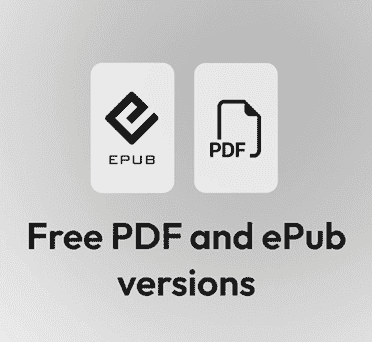

# 前言

**《人工智能优化手册》**旨在培训商业领袖、数据科学家和人工智能工程师，在整个人工智能项目生命周期中实现变革性的商业价值。它不仅涵盖了模型优化的技术方面，还包括将人工智能成功投入生产的战略、领导力、项目选择、AI/MLOps 以及负责任的 AI 治理等关键要素。本书介绍了几个关键框架，例如人工智能项目生命周期（从战略到原型到生产再到迭代），以提供持续产生高质量、高影响力输出的验证方法。

本书指导您如何制定人工智能战略，选择高影响力项目，并从试点到生产的整个生命周期进行导航。它还详细说明了如何使用 MLOps 以及最近出现的 LLMOps（用于生成式人工智能）来实施这些系统，以确保解决方案可扩展且可靠。通过使用真实世界案例研究进行实用、动手的方法，本书还深入探讨了人工智能项目失败背后的概念。这确保了您不仅学会如何构建某些东西，而且理解为什么战略一致性和负责任的治理对于产生可扩展的商业成果至关重要。学会有效管理这个整个生命周期是人工智能快速发展的领域中一种赋权的技能集。

本书分为五个部分：

+   *第一部分*，*为人工智能成功奠定基础*，建立了任何成功人工智能项目所需的战略基础。我们将从分析为什么大多数人工智能项目失败开始，表明这些失败主要是策略、执行和整合失败，而不是技术失败。我们将分析常见的陷阱，例如目标不一致（追求技术“替代指标”而不是商业价值）、部门化开发、薄弱的数据基础以及对人工智能迭代和非确定性本质的误解。在确定了出错的地方后，本部分将这些经验教训转化为构建成熟人工智能战略的实用框架。这包括使用 ICE 框架等评估流程来优先考虑项目路线图，利用 NIST AI RMF 等既定模型构建稳健的治理和合规性，以及设计一个将数据视为产品的现代数据战略。最后，我们讨论了需要可扩展的人工智能平台、基于原则的算法选择策略以及混合“中心辐射”组织结构来管理变革。

+   *第二部分*，*将项目与业务影响对齐*，提供了一个连接策略与执行的实用蓝图，从选择高影响 AI 项目开始。我们将首先详细说明如何分析和优先考虑倡议，超越仅仅关注技术新颖性，转向关注诸如业务影响、最终用户定义以及涵盖数据、技术堆栈和人才的全面可行性分析等因素。这包括用于机会规模化的定量方法，如 T 恤尺度和自下而上的可比性，以及严格的成本效益分析来证明潜在的 ROI。一旦确定项目，我们将涵盖获取领导支持的关键下一步，通过早期吸引利益相关者，构建一个引人入胜的故事，关注业务价值的“如此何”，呈现分阶段路线图，并设定现实期望。在获得赞助后，我们将展示一个构建有效的**概念验证**（**PoC**）的剧本，作为一个小规模、低风险的实验来测试可行性，详细说明关键的 PoC 后决策：是进行细化、转型还是推进到 MVP。最后，我们将介绍一个全面的框架，用于衡量 PoC 的性能，而不仅仅是技术模型指标，包括证明其价值并确保清晰生产路径所需的必要系统、业务和安全指标。

+   *第三部分*，*部署和证明机器学习价值*，提供了一个关于机器学习系统完整、端到端生命周期的全面指南，从定义其目的到证明其对业务的因果影响。我们将从成功的基石框架开始，超越简单的准确性，定义多维、与业务对齐的目标，防止意外伤害的基本护栏指标，以及跟踪长期目标的代理指标。接下来，我们将深入“产品化”，这是将模型从实验笔记本操作化为稳健、生产级系统的关键过程，探讨 MLOps 最佳实践，代码和数据的可重复管道的重要性，以及模型服务架构的选择。最后，我们将探索因果推断的科学，以回答关键问题，“系统是否做到了它打算做的事情？”，涵盖“黄金标准”的 A/B 测试（RCTs），以及多臂老虎机等高级观察技术和优化方法。

+   *第四部分*，*新兴主题：生成式 AI 和 AI 代理*，探讨了正在改变企业的 AI 技术的新前沿。我们将从用商业友好的术语解释生成式 AI 和 LLMs 开始，涵盖从市场营销和客户服务到代码生成等各个职能的关键用例，以及实际采用考虑。在此之后，我们将定义 LLMOps 并详细说明它是如何将传统的 MLOps 扩展到处理大型语言模型的独特运营生命周期，包括提示编排、微调和专门的监控。最后，我们将探索 AI 代理的新兴世界，讨论它们是什么，它们自动化复杂多步任务的可能性，以及构建和治理这些自主系统的框架。

+   *第五部分*，*负责任的 AI 和治理*，提供了一个确保 AI 解决方案是道德的、公平的、合规的和可持续的关键框架，首先定义**负责任的 AI**（**RAI**）及其核心支柱（FEAT）。然后，它提供了一个通过治理委员会、风险评估清单（风险评分 = 可能性 * 影响）和战略**人机协作**（**HITL**）方法来实施这些原则的实用指南。本部分还解决了值得信赖的 LLMs 的独特挑战，例如“幻觉”，并概述了不断发展的全球监管格局，包括欧盟 AI 法案，最后展望了未来趋势，如量子计算，并展望了 2030 年完全优化、由 AI 驱动的企业的愿景。

# 这本书面向的对象

这本书是为那些负责从人工智能中驱动业务价值的关键个人和团队设计的。它面向以下人群：

+   **高级领导者和 C 级高管（CXOs、CDOs、CDAOs）**：如果您负责制定企业 AI 战略、培养以 AI 为先的文化，或做出关键的支持和资源决策，这本书提供了将技术倡议与可衡量的业务成果对齐的框架。

+   **AI 科学家和技术实践者**：如果您是数据科学家或应用 AI 科学家，这本书不仅将指导您构建模型，还将指导您学习“销售”您提出的 AI 解决方案给高级领导和最终用户的至关重要的、通常被忽视的技能。它提供了如何构建问题框架、进行成本效益分析和展示价值以获得支持的实用技巧。

+   **AI 产品经理和策略师**：如果您负责制定 AI 产品的上市策略、管理项目路线图或确保团队按计划进行，这本书提供了一个完整的生命周期视图，从项目选择和机会规模到衡量成功。

+   **机器学习工程师（MLEs）**：对于那些专注于将可行的原型部署到生产中的专业人士，本书提供了构建系统所需的关键背景，这些系统不仅技术上可靠，而且可扩展、可靠且具有影响力，包括策略、治理和业务对齐。

+   **商业领导者和利益相关者**：如果你是与技术团队合作的业务方面领导者，这本书将揭开人工智能生命周期的神秘面纱。它将使你能够提出正确的问题，参与选择具有高影响力的项目，并理解你在开发和采用过程中的关键角色。

# 本书涵盖的内容

*第一章* ，*理解人工智能产品的风险*，描述了人工智能项目失败的共同模式。它提出，大多数故障不是技术失败，而是策略、执行和整合不佳的结果。它探讨了具体的陷阱，如目标不一致、部门化开发、薄弱的数据基础和缺乏生产就绪性。

*第二章* ，*构建企业人工智能策略*，概述了成熟人工智能策略的结构要素。它提供了一个逐步指南，将业务倡议与技术开发对齐，使用如 ICE 框架进行路线图优先级排序。本章涵盖了全面人工智能策略的基本支柱，包括治理、现代数据策略、可扩展的人工智能平台和组织变革管理。

*第三章* ，*选择具有高影响力的人工智能项目*，提供了一项实用指南，用于选择能够带来最佳回报的人工智能倡议。它详细说明了如何通过评估数据、技术堆栈和人才来执行可行性分析。本章还介绍了机会规模化的定量方法和进行成本效益分析的框架。

*第四章* ，*超越构建：获得对人工智能项目的领导支持*，描述了获得高级领导赞助的关键步骤。它提出，技术团队必须通过构建引人入胜的故事来“销售”他们的解决方案。本章提供了以下建议：尽早吸引利益相关者、用“如此何”来证明投资合理，并设定现实期望。

*第五章* ，*构建人工智能原型并衡量您的解决方案*，详细说明了如何执行一个成功的原型，作为一个低风险实验来测试可行性。它提供了一个五步“原型剧本”，并涵盖了关键的后原型决策：是否完善、转型或构建最小可行产品。最后，它介绍了一个框架，用于通过 360 度视角衡量模型、系统、业务和安全指标的性能。

*第六章* ，*超越准确性：定义采用指标的指南*，解释了为什么简单的准确性是机器学习模型成功的一个足够衡量标准。它是一个定义全面、多维度的指标框架，与业务目标相一致，包括使用护栏指标来防止意外伤害。本章还涵盖了如何将技术模型性能与业务价值联系起来，使用代理指标实现长期目标，以及使用多目标优化来平衡权衡。

*第七章* ，*从模型到市场：实现机器学习系统的运营*，详细介绍了“产品化”的过程，即从将实验模型转变为可扩展且可维护的生产级系统。它强调，现代机器学习需要管理整个可重复的管道（包括数据、代码和基础设施），而不仅仅是静态的模型文件。文本探讨了 MLOps 实践、基础设施选择（如 IaaS 与 PaaS 的比较）以及模型服务策略（如 REST API 或流式传输）等，这些都是成功部署和监控机器学习系统所必需的。

*第八章* ，*从指标到测量：实验和因果推断*，专注于因果推断，即证明机器学习系统*导致*了特定的商业结果的科学，超越了简单的相关性。它提供了关于随机对照试验（A/B 测试）作为“黄金标准”来衡量影响的全面指南，涵盖了假设驱动的设计和统计分析。本章还探讨了高级方法，如用于优化的多臂老虎机，以及当 A/B 测试不可行时的观察技术，如提升建模。

*第九章* ，*企业中的生成式 AI：开启新机遇*，探讨了生成式 AI 的变革性影响，详细介绍了关键企业用例，如通过聊天机器人增强客户参与度，以及通过共飞行员民主化企业智能。本章提供了实施的最佳实践和通过成本节约和员工体验等指标衡量投资回报率的最佳实践。重要的是，它还概述了何时不应考虑生成式 AI，例如，对于纯粹数学分析或高风险、可靠的决策，传统工具更为合适。

*第十章* ，*理解通用人工智能操作*，将通用人工智能操作定义为加速和优化 LLM 系统生命周期的基本过程，强调它在指标、人才和培训等方面与传统 MLOps 的不同之处。本章通过解释三个核心优化技术来详细说明“构建”阶段：RAG 用于将外部数据与模型固定，微调用于在特定任务上使模型专业化，提示用于指导模型。它以“运营化”阶段结束，涵盖了关键的生产实践，如离线和在线评估、持续日志记录和监控以及成本管理。

*第十一章* ，*AI 代理解析*，介绍了 AI 代理作为使用规划、工具交互和记忆来自动化复杂、重复性任务的自主程序。它提供了何时应用它们的指导，例如在动态工作流程中，以及在低错误容忍度或低延迟情况下避免它们的情景。本章还回顾了单代理系统与多代理系统之间的区别，流行的代理框架如 LangChain 和 AutoGen，以及代理可观察性对于评估和监控的必要性。

*第十二章* ，*负责任人工智能简介*，将负责任人工智能定义为与伦理目标对齐的实用框架，将其与道德人工智能（道德原则）和可信赖人工智能（可靠性）区分开来。它介绍了**公平性、伦理、问责制和透明度**（**FEAT**）的核心支柱，并确立负责任人工智能对于真正的优化是必要的，因为它建立用户信任并确保模型优化以实现公平的结果，而不仅仅是技术指标。

*第十三章* ，*实施 RAI 框架、指标和最佳实践*，提供了实施 RAI 的实际路线图。它详细介绍了建立治理结构，如 RAI 委员会，使用道德风险评估清单（风险评分 = 可能性 * 影响），以及战略性地整合**人机交互**（**HITL**）以进行高风险决策。本章还涵盖了强制性的文档，如模型和系统卡片，以及用于量化公平性、可解释性和安全性的特定指标。

*第十四章* ，*构建可信赖的 LLM 和生成式 AI*，探讨了 LLM 的独特伦理挑战，放大潜在的社会偏见和隐私风险，如数据泄露。它详细介绍了使用可解释性方法实现透明度的策略，概述了公平性指标以减轻偏见，并提供了应用级指南，如内容过滤和用户披露，以建立信任。

*第十五章* ，*负责任人工智能的监管和法律框架*，比较了全球对 AI 监管的演变方法，对比了欧盟全面、基于风险的 AI 法案与美国灵活、分部门的做法。它介绍了**了解你的 AI**（**KYAI**）流程，用于识别和评估 AI 风险，并详细介绍了新的 GenAI 特定风险，如“影子 AI”数据泄露。本章提供了可操作的合规策略，包括进行**AI 影响评估**（**AIIAs**）和建立 AI 治理委员会。

*第十六章* ，*人工智能优化的未来：趋势、愿景和负责任实施*，通过探讨新兴趋势，强调真正的优化需要将创新与责任相结合，从而结束了本书。它讨论了规模定律、量子计算、自主智能体 AI 的兴起以及**可解释人工智能**（**XAI**）对于建立信任的必要性。本章考察了人工智能对未来工作和社会可持续性的深远影响，最终形成一个“2030 年 AI 驱动型企业”的愿景。

# 为了充分利用这本书

如果记住以下事项，跟随起来会更容易：

+   **将框架作为实际工具使用**：在优先考虑自己的倡议时，积极使用**影响、信心、易用性**（**ICE**）框架进行评分。在规划项目时，使用成本效益分析框架和五步 PoC 剧本来指导你的流程。

+   **使业务与技术对齐**：在构建之前，使用*第三章*中的因素作为清单，对你的数据、技术堆栈和人才进行可行性分析。使用*第一章*中的对齐问题“强迫”业务团队和数据团队之间的关键对话。

+   **从第一天开始嵌入责任**：不要将伦理和治理视为事后之想。将 RAI 的支柱和实施框架，如模型卡和系统卡，作为开发过程中的强制性步骤。积极考虑 LLM 的独特风险和不断变化的监管环境，以建立信任。

+   **从案例研究中学习**：研究成功和失败的案例研究。将来自 PoC（如问题定义不明确和数据处理质量差）失败的预测性维护的教训作为诊断清单，以避免在自己的组织中重蹈覆辙。

+   **思考端到端生命周期**：成功的 PoC 只是开始。反思项目如何从原型过渡到可扩展、生产系统，使用 MLOps、LLMOps 和 AI 代理原则。考虑这些优化、可重复的过程如何与你的长期企业战略相连接，并增强你组织的整个 AI 成熟度和治理模型。

## 图片免责声明

本标题中的一些图片是为了说明上下文而展示的，图形的可读性对于讨论并不至关重要。请参阅我们的免费图形包下载图片。

## 下载彩色图片

我们还提供了一份包含本书中使用的截图/图表的彩色图片的 PDF 文件。您可以从这里下载：[`packt.link/gbp/9781806115112`](https://packt.link/gbp/9781806115112) 。

## 使用的约定

本书使用了多种文本约定。

**粗体**：表示新术语、重要词汇或您在屏幕上看到的词汇，例如在菜单或对话框中。例如：“考虑的主要模型是 **基础设施即服务** ( **IaaS** )、**平台即服务** ( **PaaS** )、**软件即服务** ( **SaaS** ) 和 **容器即服务** ( **CaaS** )。这些模型在运营努力、灵活性和成本方面都提供了一套独特的权衡。”

警告或重要注意事项如下所示。

查看技巧和窍门如下所示。

## 关于人工智能使用的免责声明

作者承认使用了尖端的人工智能，如 ChatGPT、OpenAI API、Gemini、Claude 和 GitHub Copilot，目的是为了提高本书的语言和清晰度，从而确保读者有一个顺畅的阅读体验。重要的是要注意，内容本身是由作者创作的，并由专业出版团队编辑的。

# 联系我们

我们始终欢迎读者的反馈！

**一般反馈**：请发送电子邮件至 `feedback@packtpub.com`，并在邮件主题中提及本书的标题。如果您对本书的任何方面有疑问，请通过 `questions@packtpub.com` 发送电子邮件给我们。

**勘误**：尽管我们已经尽一切努力确保内容的准确性，但错误仍然可能发生。如果您在本书中发现错误，我们非常感谢您向我们报告。请访问 [`www.packtpub.com/submit-errata`](http://www.packtpub.com/submit-errata) ，点击 **提交勘误** ，并填写表格。

**盗版**：如果您在互联网上发现我们作品的任何形式的非法副本，如果您能提供位置地址或网站名称，我们将不胜感激。请通过 `copyright@packtpub.com` 联系我们，并提供材料的链接。

**如果您有兴趣成为作者**：如果您在某个领域有专业知识，并且您有兴趣撰写或为本书做出贡献，请访问 [`authors.packtpub.com`](http://authors.packtpub.com/) 。 

# 分享您的想法

读完《人工智能优化手册》后，我们非常乐意听到您的想法！请 [点击此处直接进入此书的亚马逊评论页面](https://packt.link/r/1806115115) 并分享您的反馈。

您的评论对我们和科技社区都至关重要，并将帮助我们确保我们提供高质量的内容。

# 随书免费福利

这本书附带免费福利以支持您的学习。现在激活它们以获得即时访问（有关说明，请参阅“*如何解锁*”部分）。

以下是您通过购买可以立即解锁的快速概述：

| **PDF 和** **ePub 副本** | **下一代** **基于 Web 的阅读器** |
| --- | --- |
|  |  |
|  在任何设备上阅读此书的免 DRM PDF 副本。 使用您喜欢的电子阅读器的免 DRM ePub 版本。 |  ** 多设备进度同步 **：在任何设备上继续您上次中断的地方。 ** 高亮和笔记 **：捕捉想法，将阅读转化为持久的知识。 ** 书签 **：保存并随时回顾关键部分。 ** 暗黑模式 **：通过切换到暗色或棕褐色主题来减少眼睛疲劳 |

|

# 如何解锁

扫描二维码（或访问[packtpub.com/unlock](https://www.packtpub.com/unlock)）。通过书名搜索此书，确认版本，然后按照页面上的步骤操作。 |  |

| *注意：请保留您的发票。直接从 Packt 购买不需要* *发票*。 |
| --- |

# 加入我们的 Discord 和 Reddit 空间

您不是唯一一个在导航碎片化工具、不断更新和不确定的最佳实践的人。加入一个不断壮大的专业社区，分享那些没有进入文档的见解。

| 通过了解我们的作者的最新动态、讨论和幕后洞察来保持信息畅通。加入我们的 Discord 空间[`packt.link/z8ivB`](https://packt.link/z8ivB)或扫描下面的二维码： | 与同行建立联系，分享想法，并讨论实际的生成式 AI 挑战。在 Reddit 上关注我们[`packt.link/0rExL`](https://packt.link/0rExL)或扫描下面的二维码： |
| --- | --- |
