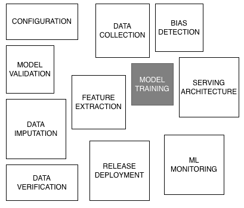
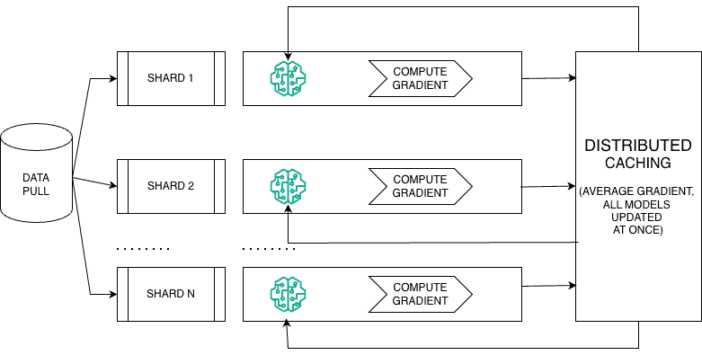
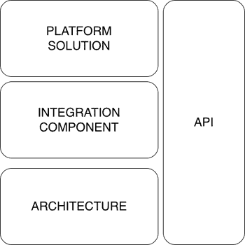

# 第七章：从模型到市场：实现机器学习系统的运营

在上一章中，我们为机器学习（**ML**）的成功奠定了基础框架。我们了解到，为了实现现实世界的价值，我们必须定义成功的样子，超越简单的模型评分，转向一个多维度的视角，包括与业务目标一致的 SMART 指标、预防意外伤害的护栏指标和跟踪长期目标的代理指标。有了对要衡量什么的这一关键理解，我们现在面临战斗的第二阶段：运营化。

一个拥有完美指标但仍然停留在研究项目中的模型是一个错失的机会。为了使公司真正从机器学习中受益，我们必须弥合从实验模型到生产级系统的差距。这意味着不仅仅是部署模型，还要让人们接受它，将其融入业务的日常运作中，并确保它与公司的战略保持一致。为了使公司受益，我们需要确保其运营化。我们这是什么意思？这不仅仅是部署模型。这是让人们接受它，展示其影响，并将其融入业务的日常运作中。此外，它还需要与公司的短期和长期战略保持一致。你可以拥有世界上最具复杂性的 ML 模型，但如果没有人使用它，或者运行成本高昂，或者更糟糕的是，它与公司的目标不一致，你就是在错失良机。

在本章中，我们将重点转向真正实现这些模型运营化所需的因素，确保它们能够从笔记本和概念验证环境转移到可扩展且可维护的生产系统。这包括对模型产品化所需的技术和组织考虑因素的深入研究：支持持续部署的基础设施、监控和可观察性的作用，以及反馈循环如何帮助模型在实时环境中进化。

这一转型的核心推动力是代码模块化，无论是通过过程脚本、面向对象设计还是高级框架。我们将探讨这些不同的方法如何影响机器学习管道的维护性和灵活性。框架提供了强大的抽象，简化了分布式系统的设计，处理硬件加速，并实现大规模的可重复性。

最后，我们将探讨最近在**大型语言模型**（**LLMs**）和基于代理的编排方面的进步，如何重塑机器学习系统的构建和部署方式。有了如 LangChain 和 Langraph 这样的应用框架，基于深度学习的框架如 PyTorch 和 TensorFlow，以及新兴的协议如**模型上下文协议**（**MCP**），开发者现在拥有前所未有的工具集来构建智能、情境感知且持续学习的系统。

本章旨在为您提供从实验模型到稳健、企业级机器学习系统所需的实用工具和架构思维。无论您是在构建第一个流水线还是扩展生产模型集群，这里讨论的概念对于正确且可持续地完成工作至关重要。

本章涵盖了以下关键主题：

+   理解可持续运营的基础

+   连接软件开发生命周期（SDLC）和机器学习开发周期

+   AI/ML 部署的基础设施和架构选择

+   机器学习系统下一步是什么？

到本章结束时，您将了解如何将模型产品化以产生现实世界的影响，有效地模块化机器学习代码，并利用现代框架构建可扩展、可维护的人工智能系统。

# 理解可持续运营的基础

一旦定义了正确的指标并与业务目标保持一致，将机器学习解决方案投入运营的下一个关键步骤就是产品化。虽然构建高性能模型是一个关键里程碑，但它只是旅程的开始。机器学习的真正价值在于当实验原型被转化为稳健、可维护且可扩展的产品，这些产品能够无缝集成到业务流程中时。产品化为此转化提供了基础，强调可复制的代码、迭代反馈循环和纪律化的工程实践。这些实践确保机器学习系统在长时间内保持适应性、透明性和成本效益，同时最小化技术债务，在快速实验与长期可维护性之间取得平衡。在本节中，我们将探讨机器学习产品化的原则，展示它们如何加速部署并实现持续学习和业务影响。通过将这些实践与之前关于指标的讨论联系起来，我们将产品化定位为模型开发与现实世界应用之间的桥梁。

## 从沙盒到现实世界成功：产品化的必要性

将机器学习模型从实验转移到生产需要远不止在测试数据集上获得高准确率分数。在现实世界中的成功取决于模型是否能够可靠地提供商业价值，适应变化条件，并有效地扩展。机器学习模型本质上成本高昂——不仅包括初始开发成本，还包括持续维护、基础设施和监控成本。随着深度学习和大型语言模型的出现，这种复杂性急剧增加。因此，评估模型复杂性与增量商业价值之间的权衡变得至关重要。

以下表格突出了模型性能、训练时间和内存使用之间的关键权衡：

| **算法** | **训练时间复杂度** | **预测时间复杂度** | **辅助空间复杂度** | **备注** |
| --- | --- | --- | --- | --- |
| **线性回归** | **O(n*m² + m³)** | **O(m)** | **O(m)** | 运行时间和空间复杂度低。 |
| **逻辑回归** | **O(nm**) | **O(m**) | **O(m**) | 运行时间和空间复杂度低。 |
| **朴素贝叶斯** | **O(n*m)** | **O(c*m)** | **O(c*m)** | 适用于高维数据。 |
| **决策树** | **O(nlog(n)d**) | **O(d**) | **O(p**) | 适用于处理数值和分类数据，但可能容易过拟合。 |
| **梯度提升** | **O(nlog(n)dr**) | **O(dr**) | **O(pr + br**) | *br << dr*；*br* 是提升轮数，*dr* 是提升过程中每棵树的深度。 |
| **随机森林** | **O(nlog(n)*dntree**) | **O(dntree**) | **O(pntree**) | *dntree* 是随机森林中单个树的深度，而 *pntree* 是每个树中使用的参数或特征的数量。比单个决策树提供更好的泛化能力。 |
| **支持向量机 (SVM**) | **O(n²m + n³**) | **O(mnsv**) | **O(nsv**) | 训练时间高但空间复杂度低。适用于低延迟问题和小型数据集。 |
| **K-means** | **O(nmki**) | **O(mk**) | **O(nm + km**) | 对于大型数据集快速且可扩展，但对初始化敏感，需要选择 *k*。 |
| **K 最近邻 (KNN**) | **O(1**) | **O(nm**) | **O(nm**) | 无训练时间，但预测时间高。需要存储整个数据集。 |
| **层次聚类** | **O(n³) = O(n²log(n))** | **O(mn)** | **O(n²)** | 训练时间、运行时间和空间复杂度都高。不适合低延迟应用。 |
| **DBSCAN** | **O(n²) / O(nlog(n))** | **O(mn)** | **O(n)** | 在时间和空间复杂度方面优于层次聚类。处理噪声和任意形状的簇。 |
| **主成分分析 (PCA**) | **O(nm*min(n, m) + m³**) | **O(Im)** | **O(Im)** | 协方差矩阵计算的复杂度为 *O(nm × min(n, m))* 。特征值分解的复杂度为 *O(m³)* 。*O(Im)* 是变换矩阵的复杂度。有效地降低维度，但可能计算成本高。 |
| **t 分布随机邻域嵌入 (t-SNE**) | **O(n²**) | **O(nq**) | **O(n²**) | t-SNE 需要大量的计算和内存。在数据点的数量上具有二次的时间和空间复杂度。它需要 *O(3n²)* 的内存，这使得它对于大型数据集来说不切实际。 |

表 7.1：流行机器学习模型的时间和空间复杂度

## 监督学习算法

通常来说，监督学习算法在速度和资源需求上差异很大。一端有高效的工具：线性回归、逻辑回归和朴素贝叶斯。这些模型训练速度极快，通常与数据大小成线性比例（ *O(n)* ），这使得它们非常适合创建快速基线或在你拥有大量数据集且需要简单、可解释的模型的情况下使用。

在中间是树形模型。单个决策树训练非常快，预测也非常快。然而，其过拟合的倾向通常通过使用集成来解决。随机森林和梯度提升比单个树更强大、更准确，因为它们结合了数百棵树，但这也带来了代价，因为它们的训练时间显著更长，并且需要更多的内存。

然后是专家。SVMs 是两个模型的故事：使用线性核时，它们与逻辑回归一样快。但对于复杂、非线性问题，它们使用使训练时间爆炸（*O(n²)*）的核，这使得它们对于大型数据集来说不切实际。最后，KNN 是“懒惰的学习者”。在训练期间它不做任何工作；它只是记住整个数据集。这使得预测非常慢（*O(n*m)*）且内存密集型，因为它必须将每个新点与所有旧点进行比较。

## 无监督学习算法

对于无监督任务，如聚类，K-means 是短跑运动员。它非常快，并且扩展性好，使其成为将大型数据集划分为预定义数量（*k*）的簇的首选。相比之下，DBSCAN 要慢一些，但更加灵活；它可以找到形状奇特的簇，并自动识别噪声，而无需你指定簇的数量。在另一端是层次聚类，它非常慢（*O(n²)*到*O(n³)*）且内存密集型，使其仅适用于需要探索嵌套簇结构的小数据集。

对于降维，PCA 是标准且高效的选项。它通常在将数据转换到低维空间时非常快，尽管如果特征数量庞大（*m*）时，其速度可能会受到影响。另一方面，t-SNE 是一个专为可视化设计的强大工具。它在创建高维数据的 2D 或 3D 有意义的地图方面表现出色，但因其著名的慢速（*O(n²)*）和内存密集型，限制了其在以视觉探索为主要目标的较小数据集上的使用。

因此，你已经构建了一个表现出很多潜力的优秀机器学习模型。接下来是什么？最困难的部分不仅仅是创建一个智能算法；而是将这个算法转化为一个可靠的产品，让人们可以使用。这个关键步骤被称为**产品化**。

想象一下：一位杰出的厨师可以在他们的厨房里创造出一道令人惊叹的新菜肴。产品化是将设计餐厅和系统化的过程，以便每晚都能为数百名顾客完美地复制这道菜肴。

要成功做到这一点，过程需要针对现实世界进行工程化。这意味着以下内容：

+   **模块化设计**：将模型构建成可互换的部件，这样就可以轻松更新或修复某个部分，而不会破坏整个系统

+   **稳健的版本控制**：对所有更改进行严格的记录，就像一个详细的食谱，跟踪对食谱的每一次调整

+   **自动化管道**：创建一个“装配线”，自动测试和部署模型的最新版本，确保质量和速度

+   **深思熟虑的基础设施**：选择合适的硬件和云服务，以确保模型能够处理重负载而不会崩溃

简而言之，产品化是酷炫实验和有价值的商业工具之间的桥梁。它是确保机器学习模型提供一致、可靠结果的工程基础，也是我们将要深入探讨的内容。

在此之前，让我们讨论一下为什么反馈循环很重要。

在离线测试中，庆祝模型达到高准确率是很常见的。然而，这往往无法转化为生产成功。现实世界环境是动态和不可预测的，仅基于历史数据训练的模型一旦部署可能会表现不佳。反馈循环对于缩小这一差距至关重要。它们使模型在部署后能够持续学习和模型优化。在生产中可能会出现一些挑战：

+   训练数据中缺失的行为模式

+   从特征集中排除的关键影响因素

+   导致模型过度拟合某些子组的采样偏差

反馈循环允许组织系统地解决这些挑战：

+   **用户反馈**：最终用户可以揭示模型预测中的差距，这些差距在内部测试中被忽略。例如，一个电子商务推荐系统可能会忽略季节性，导致产品建议不佳。

+   **数据漂移监控**：随着时间的推移，用户行为或市场条件的变化可能会降低模型性能。监控漂移可以及时进行模型重新训练。

+   **数据增强**：在生产中遇到的新边缘情况可以丰富训练数据集，提高模型的鲁棒性。

最终，从原型到生产的旅程是迭代的。部署的模型必须持续监控、优化和重新训练，以保持其有用性。在积极的反馈循环支持下，产品化将静态模型转化为自适应、高性能的系统。

## 超越反馈：为什么产品化加速了机器学习价值创造

反馈循环只是方程的一部分。产品化解锁了对于长期机器学习成功至关重要的额外好处：

+   **可扩展性**：实验模型往往在现实世界的数据量或用户负载下失败。产品化确保系统可以有效地扩展。

+   **可维护性**：生产系统需要严格的监控和维护。产品化鼓励诸如版本控制、自动化测试和模块化设计等实践，以简化维护工作。

+   **创新**：产品化的系统可以加快创新速度。通过模块化组件，团队可以轻松地尝试新的模型或数据源，而不会影响整个流程。

+   **技术债务管理**：快速实验往往会导致捷径，积累技术债务。产品化提供了减少这种债务、清理代码库和构建更稳定系统的机会。

考慮一個電商推薦引擎。沒有產品化，添加新類別或擴展到更大的用戶群將會很麻煩。然而，產品化系統是設計來通過模塊化架構和數據科學與工程團隊之間清晰的移交來應對變化的商業需求。

## 代碼可重現性：可靠系統的基礎

可重現性對擴展和維護機器學習解決方案是基礎。沒有它，協作、錯誤调试和部署將充滿風險。關鍵的可重現性實踐包括以下幾點：

+   **版本控制**：如 Git 和**數據版本控制**（**DVC**）等工具幫助跟蹤代碼、數據集和模型的變更

+   **容器化**：Docker 和 Kubernetes 在開發和生產中創建一貫的運行環境

+   **自動化管道**：CI/CD 工具自動化測試和部署，減少人為錯誤

這些做法確保模型可以可靠地重現、審計和跨團隊、系統轉移。可重現性是堅固 AI 產品化的不可商量的先決條件。將思考的第一原理應用於機器學習代碼，鼓勵清晰、高效和可維護。有效的代碼設計重點在於簡單性、模塊化和關注點分離：

+   **可讀性和模塊化代碼**：乾淨、結構良好的代碼提高協作並加快錯誤调试

+   **全面的文檔**：清晰的解釋幫助團隊理解模型行為並隨時間維護代碼

+   **數據、模型和邏輯的分離**：解耦數據管道、模型訓練和推斷層次增加靈活性並減少系統脆弱性

在現代機器學習架構中，這通常涉及整合特徵存儲或數據 API，以解耦特徵工程與建模。這種設計提高了可擴展性和部署速度。

### 最小化技術負債

未受控制的技術負債可能會損害 M 項目。它通常來自匆忙的實驗、未記錄的工作流程和臨時的管道擴展。為了減少技術負債，考慮以下幾點：

+   **標準化實踐**：建立共享的編程、數據和模型治理標準

+   **定期重构**：安排時間進行代碼庫清理和優化

+   **模塊化管道**：設計管道，使單個组件可以獨立發展

主動管理技術負債確保機器學習系統隨時間保持適應性和可持續性。

### 平衡實驗與重构

機器學習開發需要在快速實驗和嚴謹工程之間取得精巧的平衡。兩者都是持續成功的必要條件。

有效策略包括以下幾點：

+   **隔離實驗**：在沙盒環境中快速原型設計最小化生產風險

+   **定期重构**：定期分配時間進行清理和優化代碼庫

+   **控制釋放**：僅將徹底驗證的變更整合到生產系統中

这种平衡在不牺牲长期可维护性的情况下促进创新，从而产生稳定且适应性强的人工智能解决方案。

AI/ML 产品化不仅仅是一项技术练习；它是长期商业价值的战略推动者。通过嵌入循环反馈、确保代码可重复性、应用良好的工程原则和管理技术债务，组织可以将有希望的 AI 实验转化为耐用、可扩展的解决方案。

产品化确保模型不仅在实验室中准确，而且在现实世界中具有影响力。它将机器学习从一项研究努力转变为可靠、可重复且持续改进的商业能力。通过采用这些基础实践，组织可以释放人工智能的潜力，并构建能够多年带来可衡量影响的系统。

随着组织从实验转向生产，下一个关键步骤是将 AI/ML 工作流程与既定的软件工程实践对齐。这需要弥合传统**软件开发生命周期**（**SDLCs**）与机器学习系统独特需求之间的差距。

**注意**

我们强调，成功的 AI 部署不仅限于构建准确的模型——它需要产品化，将原型转化为可扩展、可维护的解决方案，并集成到业务流程中。关键实践包括建立反馈循环、确保可重复和模块化代码、管理技术债务，以及平衡快速实验与系统重构。这些基础使 AI 系统能够适应和随着数据及业务需求的变化而进化，确保持续的价值。最终，产品化弥合了开发与现实世界影响之间的差距。

# 桥接软件开发生命周期（SDLC）和机器学习开发周期

机器学习系统的发展与传统软件开发有相似之处，但由于其动态特性，也引入了独特的复杂性。与以代码为主要成果的传统软件不同，机器学习系统同样依赖于数据、模型配置和基础设施，所有这些都在不断进化。这需要强大的生命周期管理实践，包括代码、数据和基础设施的版本控制，以确保可重复性和可维护性。此外，机器学习不仅仅是交付一个静态的模型文件，而是管理一个整个管道，该管道自动化数据处理、模型训练、评估和部署。通过过程编程、面向对象原则和现代框架的模块化设计是处理这种复杂性的关键，它使机器学习系统可扩展、可维护，并能适应变化。本节探讨了这些基础概念，将它们与**软件开发生命周期**（**SDLC**）进行比较，同时强调机器学习系统的动态、进化特性以及模块化代码库的最佳实践，以支持可持续的 AI/ML 操作。

## 机器学习中的代码和数据版本控制

在软件开发生命周期（SDLC）中，代码版本控制是一种标准做法，它允许开发者跟踪变更、回滚到先前版本以及协同代码开发。然而，在机器学习（ML）的开发周期中，数据版本控制同样重要。在传统的软件开发中，只要代码保持不变，软件的行为相对稳定。但在机器学习系统中，即使代码保持不变，底层数据的变更也可能极大地影响模型的行为。

如果没有对数据和代码进行适当的版本控制，AI/ML 团队可能会发现难以在部署后重现结果或解释模型行为。一个模型可能是在特定的数据集上训练的，当新数据可用时，其性能可能会显著变化。因此，为了确保可重现性和在部署中保持一致性，代码和数据都应该进行版本控制。

此外，版本控制不仅限于数据和代码，还扩展到基础设施。基础设施版本控制确保了模型训练的环境（例如特定的硬件配置、依赖项和库）是可重现的。当在本地、云端或边缘设备上部署模型时，这一点变得至关重要。

正如代码版本控制允许在传统的 SDLC 中进行回滚一样，模型版本控制确保团队可以在新部署导致意外结果时回滚到先前模型。

### 机器学习是模型文件包还是流水线？

机器学习最关键且常常被误解的一个方面是，它仅仅是一个模型文件包，还是一个完整的流水线。简短的回答是，机器学习是一个动态且不断发展的组件，需要三个层次的版本控制：数据、代码和基础设施。如果没有在这些维度上进行适当的版本控制和跟踪，重现结果和维护机器学习系统将变得极其困难。

一个常见的误解是，共享一个 pickle 文件（`.pkl`或`.h5`）或任何其他序列化的模型文件（例如，TensorFlow 保存模型、ONNX 或 PMML）就足以重现机器学习模型的输出。然而，这远远不够。模型文件本质上是无上下文的已学习参数的冻结状态，没有关于用于训练它的数据、预处理流水线、超参数，甚至是在训练期间使用的特定硬件或软件堆栈的信息。没有这些元数据和支持性基础设施，仅仅共享模型文件就像给别人一个上锁的保险箱，但没有提供钥匙或开启它的组合。

### 为什么持续整个机器学习流水线很重要

为了确保机器学习系统是可重现和可维护的，我们需要存储和版本化不仅训练好的模型，还包括整个流水线，这包括以下内容：

+   **数据处理步骤**：在将原始数据输入模型之前应用的精确转换。这包括处理缺失值、特征工程、缩放和对分类变量进行编码。

+   **特征选择和工程**：用于生成模型所依赖特征的特定步骤。如果这些步骤没有进行版本控制，即使是最优秀的训练模型，在新的数据到来时也可能无法正确工作。

+   **模型训练配置**：在训练模型时使用的超参数、训练轮数、优化器设置和验证标准。

+   **代码库版本控制**：用于训练和部署模型的特定代码、库和依赖项的版本。

+   **基础设施依赖**：在机器学习管道中使用的运行时环境、GPU 可用性、基于云的服务或容器化部署策略。

例如，考虑一个电子商务平台的推荐系统。如果数据科学家仅仅共享训练好的模型文件，而没有记录特征提取逻辑（例如，用户行为数据是如何转换为输入向量的），那么试图后来复现该模型的另一位工程师可能会因为预处理中的细微差异而产生不同的结果。

一种更稳健的方法是使用 MLflow、DVC 或 Kubeflow Pipelines 等工具来跟踪和管理机器学习模型的整个生命周期。这些工具有助于版本控制、实验跟踪和部署一致性，确保机器学习管道在不同环境中保持可重复和可扩展。

下面的图示说明了构成完整且可重复的机器学习管道的各种组件，它不仅包括模型训练，还包括数据处理、部署和监控。它强调了在长期可靠性和可扩展性方面，坚持每个阶段的重要性：



图 7.1：超出模型训练的机器学习管道组件，包括数据、部署和监控

既然我们已经为生产工作流程建立了组件，下一步关键步骤是讨论构建管道的最佳实践。由于机器学习与典型的软件开发生命周期（SDLC）管道不同，因此以下章节将广泛讨论框架及其相关的优势。

## 管道：确保可扩展性和稳定性

在大规模部署机器学习模型时，管道的概念是其中最关键的组成部分之一。管道自动化了数据摄入、预处理、模型训练、评估和部署的端到端流程，确保系统稳定、可扩展且可重复。

在传统的机器学习工作流程中，模型通常被视为静态文件。一旦训练完成，它们就会被保存并部署。然而，这种方法会导致一些挑战，例如确保模型在更新的数据上重新训练、处理模型版本控制以及集成新功能。

谷歌有影响力的论文《机器学习系统中的隐藏技术债务》强调了构建管道而不是依赖静态模型文件如何帮助管理技术债务。该论文认为，机器学习系统中的复杂性不仅来自模型本身，还来自处理数据、特征工程、监控等周围的系统。

一个设计良好的管道确保以下内容：

+   **数据持续刷新**：新数据被自动摄取、处理并通过模型。

+   **模型重新训练是自动化的**：每当引入新的数据或特征时，模型可以重新训练、评估和重新部署，无需人工干预。

+   **端到端可追溯性得到保持**：管道跟踪过程的每个阶段，确保每个模型版本都是可重现的。

通过构建管道，机器学习团队可以自动化部署过程，降低人为错误的风险。它们还使得在多个环境中扩展模型、集成新的数据源和尝试新的模型变得更加容易。

### 机器学习代码中的模块化：过程化编程、OOP 和框架

代码模块化在确保人工智能/机器学习解决方案的可维护性、可扩展性和适应性方面发挥着关键作用。包括过程化编程、**面向对象编程**（**OOP**）和框架在内的各种模块化方法提供了不同的利益和权衡。选择正确的方法对于构建健壮和可扩展的机器学习系统至关重要。

过程化编程侧重于编写计算机按步骤执行的指令序列。虽然在小项目中，过程化代码易于编写和理解，但在大型系统中，它很快就会变得难以控制。随着代码库规模的扩大，缺乏模块化会导致代码重复、调试困难和技术债务的增加。

对于人工智能/机器学习系统，当代码库较小时，过程化编程可能有效，但随着更多数据源、模型和特征的添加，管理起来变得更加具有挑战性。这就是面向对象编程或框架变得重要的地方。以下是一个面向对象编程的示例：

```py
# Procedural approach for data preprocessing
import pandas as pd
from sklearn.preprocessing import StandardScaler
def load_data(filepath):
    return pd.read_csv(filepath)
def preprocess_data(df):
    scaler = StandardScaler()
    df[[‘feature1’, ‘feature2’]] = scaler.fit_transform(
        df[[‘feature1’, ‘feature2’]]
    )
    return df
data = load_data(‘data.csv’)
data = preprocess_data(data) 
```

当项目规模较小时，这种方法是有效的，但随着步骤数量的增加（例如，处理缺失值、特征选择和模型训练），过程化代码的管理和调试变得更加困难。

面向对象编程（OOP）提供了一种通过组织成可重用对象来模块化代码的方法，这些对象封装了数据和方法。与过程化编程相比，OOP 在初始设置上可能更困难，但它提供了显著的长远利益，尤其是在机器学习系统中。在 OOP 中，模型、数据集和预处理步骤可以表示为对象，每个对象都有自己的方法和属性。这种结构使得维护、扩展和调试代码库变得更加容易，因为系统某一部分的更改不太可能影响其他部分。

面向对象编程（OOP）的主要挑战在于它需要在前端采用更加严谨的设计方法。然而，一旦设置完成，它能够显著提高代码的可维护性和可扩展性，尤其是在大型、复杂的系统中。以下代码展示了面向对象的风格。代码结构是可重用的类，而不是独立的函数调用：

```py
class DataPreprocessor:
    def __init__(self):
        self.scaler = StandardScaler()
    def fit_transform(self, df):
        df[[‘feature1’, ‘feature2’]] = self.scaler.fit_transform(
            df[[‘feature1’, ‘feature2’]]
        )
        return df
# Usage
preprocessor = DataPreprocessor()
data = preprocessor.fit_transform(data) 
```

使用面向对象编程，可以将不同的组件（如数据预处理、模型训练和评估）模块化，这使得维护和扩展机器学习项目变得更加容易。

### 框架：复杂工作流程的可扩展解决方案

虽然结构化代码（无论是过程式还是面向对象）带来了极大的清晰性和可维护性，但在机器学习中存在更深层次的挑战，这些挑战需要不仅仅是良好的代码组织。随着项目的增长，它们面临的设计模式无法解决的复杂性。可扩展性、分布式计算、硬件加速和可重复性等问题成为核心关注点，尤其是在生产级系统中，大型数据集和密集型模型是常态。框架在这里作为不可或缺的工具介入。

要理解框架的重要性，思考一个简单但基本的场景是有帮助的：在多台机器上分布式训练模型。假设你有一个跨越 10 台机器的数据集。在这种情况下，模型训练不是独立地拟合 10 个不同的模型。相反，你仍然希望产生一个单一的统一模型，该模型能够从所有可用数据中受益。

但这是如何实现的呢？这不仅仅是将所有数据发送到一台机器的问题，那样会违背分布式处理的目的。相反，采用了分布式训练方法，其中每台机器处理其数据的一部分，计算模型的部分更新，然后与其他机器同步这些更新。这些机器通过以下方式通信：通过协调更新的集中式参数服务器，或者通过使用集体通信协议直接在点对点方式下共享梯度，例如由库（如 Horovod 或**NVIDIA 集体通信库**（**NCCL**））提供的协议。

以下图展示了数据并行方法在分布式训练中的应用，涉及将数据分割并在多个节点上并行训练：



图 7.2：分布式训练的数据并行方法

在同步情况下，不同批次数据的梯度在每个节点上分别计算，但跨节点平均以对每个节点中的模型副本应用一致的更新。

手动设计和构建这类分布式系统将是一项巨大的工程任务，需要网络、并行计算、优化等方面的专业知识。然而，现代机器学习框架抽象了这些细节的大部分。例如，TensorFlow、PyTorch 和 Horovod 等框架使开发者能够在规模上训练模型，而无需担心分布式计算的底层机制。

但框架的价值不仅限于分布式训练。它们还提供了对机器学习流程每个阶段都至关重要的能力。它们处理硬件加速，自动利用可用的 GPU 或 TPU。它们提供模型检查点工具，使训练作业能够在中断后恢复，而无需从头开始。它们支持自动日志记录和实验跟踪，这对于研究和生产中的可重复性至关重要。它们还易于与云平台和编排工具集成，使得模型能够无缝地从实验过渡到部署。

同样，TensorFlow Extended 流程是一系列组件，它们实现了机器学习流程，专门设计用于可扩展、高性能的机器学习任务。这包括建模、训练、推理服务以及将部署管理到在线、原生移动和 JavaScript 目标。

每个框架通常都有其擅长的领域。例如，Scikit-learn 仍然是涉及结构化或表格数据的经典机器学习任务的首选解决方案。它特别适合小规模问题和快速原型设计。相比之下，TensorFlow 和 PyTorch 在深度学习应用中占据主导地位，尤其是在图像、音频和文本等非结构化数据方面。在图神经网络领域，PyTorch Geometric 提供了专门工具，使得构建旨在从图结构数据中学习的模型变得更加容易。在概率建模和贝叶斯推理领域，PyMC3 和 TensorFlow Probability 等框架为构建复杂的概率模型提供了强大的抽象。

以下图展示了用于构建和管理机器学习应用的模块化开发者平台：



图 7.3：一个模块化开发者平台

平台解决方案层提供用于调试、测试和监控模型工作流程的工具。集成组件连接外部系统、数据源和模型提供者。架构层定义了系统的核心运行时和执行框架。API 与所有层并行运行，使程序性访问和无缝集成成为可能。

随着 LLM 的兴起，框架生态系统显著扩大。在这个领域，出现了新的框架来管理 LLM 带来的特定挑战，例如将多个提示链接起来、集成外部数据源以及跨多个代理编排推理。LangChain 和 LangGraph 是两个突出的例子，它们简化了由 LLM 驱动的应用程序的开发。这些框架使得构建复杂的工作流程变得更容易，其中模型与工具、数据库和 API 交互，同时保留交互过程中的记忆。这种记忆保留的概念，即系统可以从一步带到另一步携带上下文，是使系统表现出通用智能的基础。

最近，如 MCP 等进步更进一步，为不同 LLM 代理之间共享上下文和内存提供了基础设施，增强了它们的协作能力。这些机制允许 LLM 驱动的系统记住之前的交互，使它们能够解决多步问题、进行长对话推理或在多个代理之间协调行动。

在许多方面，框架是现代机器学习中的无名英雄。没有它们，现在被认为是常规的许多事情，从在大型数据集上训练模型到大规模部署，对于所有但最专业化的团队来说都将遥不可及。它们不仅结构化代码，还提供了现成的解决方案，解决机器学习、软件工程和分布式系统交叉处出现的问题。

从本质上讲，框架允许机器学习从业者专注于建模和实验，而不是分布式计算、硬件优化或工作流程编排的底层工作。它们提供了一个无形的支架，支撑着整个机器学习生命周期，从研究到生产，同时促进可重复性、效率和可扩展性。

通过提供这些高级抽象或 API，这些框架已经促进了人工智能领域的关键创新。无论是训练一个在 PB 级数据集上运行的模型，还是构建一个具有长期记忆能力的对话式人工智能代理，框架使得这些想法的实现变得比以往所需的努力少得多。随着该领域的持续发展，框架很可能会继续处于这一进步的核心，推动下一波可扩展、智能系统的浪潮。

下面是一个关于 scikit learn 框架的概述，作为一个**最小化**的示例，它优化了简洁性、可读性和可重用性：

```py
from sklearn.pipeline import Pipeline
from sklearn.preprocessing import StandardScaler
from sklearn.linear_model import LogisticRegression
pipeline = Pipeline([
    (‘scaler’, StandardScaler()),
    (‘model’, LogisticRegression()) ])
pipeline.fit(X_train, y_train) 
```

这种方法确保数据预处理和模型训练是同一工作流程的一部分，提高了可维护性并降低了不匹配转换的风险。

下面是框架的优势：

+   内置的最佳实践，用于确保可重复性和效率

+   预优化的函数，可减少开发时间

+   与云平台和分布式计算的集成

然而，当处理框架不支持的情况时，框架也可能成为限制因素。在这种情况下，结合面向对象原则和框架实用工具的混合方法通常是最佳解决方案。

与传统软件不同，ML 系统必须管理动态组件，如数据、模型和基础设施，以及代码，在 LLMs 的情况下还要管理内存。因此，可重复性、版本控制和管道持久性是必不可少的。无论是通过过程编程、面向对象编程还是框架，模块化设计对于构建可扩展、可维护和健壮的 ML 解决方案是基础。这些实践不仅简化了开发，还使系统能够在生产环境中平稳地演进。

**注意**

ML 开发需要管理动态组件，而不仅仅是代码，包括数据和基础设施，以确保可重复性。与传统软件不同，ML 需要全面的版本控制和管道持久性，而不是静态模型文件。通过过程、面向对象或基于框架的方法进行模块化设计，增强了可扩展性和可维护性。这些原则使 ML 系统在生产环境中能够高效地演进。

在理解了结构化编程范式和第三方框架如何支持 ML 系统的开发和扩展之后，下一步是探索支持这些解决方案在生产环境中可靠运行的底层基础设施和架构选择。

# AI/ML 部署的基础设施和架构选择

在实际场景中部署 AI/ML 模型时，选择适当的基础设施至关重要。不同的云服务模型提供不同层次的服务抽象，从对底层基础设施的完全控制到完全托管服务。主要考虑的模型是**基础设施即服务**（**IaaS**）、**平台即服务**（**PaaS**）、**软件即服务**（**SaaS**）和**容器即服务**（**CaaS**）。每个模型在运营努力、灵活性和成本方面都呈现独特的权衡。

## 在 AI/ML 部署中理解 IaaS、PaaS、SaaS 和 CaaS

在将 AI/ML 模型部署到实际环境中时，选择合适的基础设施对于平衡控制、灵活性和易用性至关重要。不同的云服务模型提供不同层次的服务抽象，从对基础设施的完全控制到完全托管服务。需要考虑的四种主要模型是 IaaS、PaaS、SaaS 和 CaaS。每个模型都在运营努力、灵活性和成本之间提供了权衡：

+   **IaaS**通过在云上提供虚拟化计算资源（如虚拟机、存储和网络）来提供最大的控制和灵活性。使用 IaaS，组织对其环境拥有完全控制权，这允许进行定制配置和设置，但也意味着他们需要负责管理和维护底层基础设施。

    +   **IaaS 的关键特性**：

        +   **完全控制**：用户控制操作系统、存储和网络配置，这提供了显著的灵活性。

        +   **定制**：IaaS 高度可定制，允许进行特定的硬件和软件配置。

        +   **可扩展性**：用户可以根据需求增加或减少资源。

    +   **优点**：

        +   **灵活性**：IaaS 为 AI/ML 工作负载提供了最高级别的灵活性。数据科学家和工程师可以选择精确的硬件规格，包括 GPU 或 TPU，用于大规模训练或推理任务。

        +   **大型运营的成本效益**：对于需要大量计算资源的大型、连续 AI/ML 操作，IaaS 可能更具成本效益，因为用户只需支付他们使用的部分。

    +   **缺点**：

        +   **运营开销**：管理底层基础设施需要显著的技术专长和资源，增加了运营复杂性。

        +   **维护**：用户负责维护基础设施，例如更新操作系统、管理安全和处理故障。

    +   **用例**：IaaS 非常适合具有显著技术专长、大规模 AI/ML 工作负载和特定计算资源需求的企业。例如，进行深度学习且需要大量 GPU 处理的复杂模型的公司通常会选择 IaaS。

+   **PaaS**通过提供一个包含操作系统、中间件和运行时环境的平台来简化大部分基础设施复杂性。用户专注于开发、部署和管理应用程序，无需担心基础设施管理。

    +   **PaaS 的关键特性**：

        +   **预配置环境**：该平台附带预配置的开发工具、数据库和服务器。

        +   **简化部署**：PaaS 允许开发者快速部署应用程序，无需担心底层硬件或操作系统。

        +   **内置可扩展性**：随着需求的增长，PaaS 解决方案提供易于扩展的选项。

    +   **优点**：

        +   **缩短上市时间**：开发者可以专注于构建和部署 AI/ML 模型，无需管理基础设施的复杂性。这导致开发周期更快。

        +   **减少运营工作量**：PaaS 减少了系统管理、安全管理硬件维护的需求。

        +   **集成工具**：许多 PaaS 解决方案都内置了机器学习工具，如模型部署、监控和版本控制系统，这使得集成 AI/ML 工作流程更加容易。

    +   **缺点**：

        +   **较少的灵活性**：PaaS 环境比 IaaS 更受限制。如果平台不支持特定配置或工具，这些工具对于高级人工智能/机器学习模型是必需的，用户可能会遇到限制。

        +   **成本**：虽然 PaaS 减少了运营开销，但由于内置服务和可扩展性的溢价费用，对于持续、高容量的人工智能/机器学习工作负载来说可能更昂贵。

    +   **用例**：PaaS 对于希望加快开发和部署过程，而不想管理基础设施复杂性的组织来说很合适。例如，希望快速原型化和部署机器学习模型的 AI 创业公司可能会更倾向于使用 PaaS。

+   **SaaS** 在云上提供全面管理的软件解决方案，用户所需参与的最小化。服务提供商处理从基础设施到应用程序管理的所有事情。在人工智能/机器学习背景下，SaaS 平台提供预构建的 AI 工具、API 和服务，企业可以直接将其集成到其工作流程中。

    +   **SaaS 的关键特性** :

        +   **预构建解决方案**：SaaS 平台提供现成的 AI/ML 服务，如自然语言处理、图像识别和推荐引擎。

        +   **零基础设施管理**：所有基础设施、软件更新和安全都由提供商管理。

        +   **易于集成**：SaaS 解决方案旨在易于集成到现有工作流程中，所需定制的最小化。

    +   **优点** :

        +   **最小技术开销**：SaaS 消除了对基础设施或平台管理的需求，使团队能够完全专注于业务用例。

        +   **快速部署**：SaaS 解决方案可以快速部署，无需开发或对人工智能/机器学习有深入的技术专业知识。

        +   **可预测的成本**：SaaS 模型通常是基于订阅的，这使得预算可预测。

    +   **缺点** :

        +   **有限的定制性**：SaaS 解决方案提供的灵活性有限。用户必须依赖平台提供的功能和能力。

        +   **对供应商的依赖**：企业变得依赖于 SaaS 供应商进行更新、可扩展性和性能改进。

        +   **数据隐私**：使用 SaaS，敏感数据可能需要通过第三方供应商进行传输和存储，从而引发潜在的隐私问题。

    +   **用例**：SaaS 对于寻求快速且易于使用的人工智能解决方案，而不愿在基础设施或人工智能专业知识上大量投资的企业来说非常理想。例如，一家营销公司可能会使用基于 SaaS 的 AI 工具进行客户细分和定位，而无需构建定制模型。

+   **CaaS** 通过提供基于容器的虚拟化，在 IaaS 和 PaaS 之间提供了一个中间地带。容器允许将应用程序及其依赖项打包在一起，确保它在不同的环境中保持一致性。在人工智能/机器学习部署中，容器可以用来封装模型，使它们易于携带并在各种基础设施设置中部署。

    +   **CaaS 的关键特性** :

        +   **容器编排**：CaaS 解决方案通常包括 Kubernetes 等工具，用于编排、扩展和管理容器化应用程序。

        +   **可移植性**：容器可以轻松地在不同环境中移动，从本地到云再到混合环境，而无需更改应用程序或其依赖项。

        +   **自动化管理**：许多 CaaS 平台提供容器集群的自动化管理，从而减轻了用户的管理负担。

    +   **优点**：

        +   **灵活性和可移植性**：容器通过允许模型部署在任何支持容器的基础设施上，提供了灵活性，确保了环境之间的一致性。

        +   **可扩展性**：使用 CaaS，容器化 AI/ML 模型的可扩展性变得更加简单。编排平台如 Kubernetes 使得管理大规模部署变得更加容易。

        +   **减少基础设施管理**：虽然不如 PaaS 或 SaaS 那样无需过多干预，但 CaaS 通过抽象容器编排来减少基础设施管理的工作量。

    +   **缺点**：

        +   **设置复杂性**：设置和管理容器，尤其是在大规模生产系统中，可能需要容器化技术的专业知识。

        +   **操作开销**：虽然低于 IaaS，但 CaaS 仍然需要一定程度的基础设施管理，尤其是在扩展容器化的 AI/ML 应用时。

    +   **用例**：CaaS 非常适合那些希望在减少基础设施管理复杂性的同时，寻求灵活性和可移植性的组织。例如，一家在多个环境中部署 AI 模型的公司，无论是在本地还是云中，都可以从 CaaS 提供的可移植性和一致性中受益。

### 比较 IaaS、PaaS、SaaS 和 CaaS 的经济效益

在选择这些云服务模型之间，重要的是要考虑控制、复杂性和成本之间的权衡：

+   IaaS 提供了最大的控制权，但需要大量的操作努力。对于大规模、资源密集型操作来说，它具有成本效益，但可能因维护和管理成本而增加。

+   PaaS 抽象了大部分基础设施复杂性，使得开发和部署应用程序更快、更容易。虽然 PaaS 减少了操作开销，但由于对托管服务的溢价，对于持续的大规模操作来说可能更昂贵。

+   SaaS 提供了最少的操作工作量，因为所有内容都由供应商管理。然而，它提供的灵活性最少，通常适合那些需要快速解决方案而不需要大量定制的业务。

+   CaaS 在灵活性和易用性之间取得平衡，为部署 AI/ML 模型提供了一个更可移植和可扩展的选项。CaaS 比 PaaS 更复杂，但提供了对基础设施的更好控制，同时与 IaaS 相比，减少了部分操作开销。

    **注意**

    组织必须仔细评估其具体需求、技术能力和预算，以选择合适的模型。对于需要控制基础设施的、高度专业化的 AI/ML 工作负载的企业，IaaS 或 CaaS 可能更为合适。对于优先考虑速度、灵活性和低运营负担的企业，PaaS 或 SaaS 将是理想的选择。在将 AI/ML 用例部署到现实世界时，组织面临从产品化到模块化、数据与代码版本控制、管道自动化和基础设施选择等一系列挑战。通过根据其具体需求选择合适的服务模型（IaaS、PaaS、SaaS 或 CaaS），企业可以优化运营效率，降低成本，并确保可扩展和可维护的 AI 解决方案。

随着我们从架构基础转向在生产中部署 ML 模型的现实，考虑支持运营卓越和长期可持续性的周围工具，如日志记录、版本控制、监控和工件管理，是至关重要的。

## 支持模型部署的其他 MLOps 设计考虑因素

将 AI/ML 模型投入运营的过程远远超出了构建和部署模型。它包括定义正确的成功指标、确保持续监控和改进、处理长期和多目标优化，以及将模型集成到可以提供真实商业价值的应用程序中。将模型集成到多样化的环境中，从基于云的系统到偏远地区的边缘设备，需要对模型大小、数据隐私和资源约束进行深思熟虑的方法。

随着企业继续采用 AI/ML 模型，关注运营效率和模型可扩展性将是释放其全部潜力的关键。联邦学习和模型扩散等新兴技术为确保 AI 解决方案不仅性能高，而且适应现实世界约束提供了有希望的途径。通过解决这些挑战，组织可以推动 AI/ML 技术的采用，改进其业务流程，并实现长期成功。

### 部署 ML 模型到生产的规划和工具

将 ML 模型部署到生产涉及几个关键步骤和规划方面，以确保平稳运行、可维护性和可扩展性。需要各种工具和最佳实践来处理 ML 生命周期的不同阶段。在此，我们概述在部署 ML 模型之前需要关注的重点领域，并讨论每个领域可用的工具：

+   **代码版本控制**：这确保了不同版本的 ML 管道，包括预处理脚本、训练代码和推理逻辑，得到良好的管理。它有助于跟踪变更、与团队协作，并在必要时回滚到先前状态。

    +   **常用工具**：

        +   **GitHub**：一个广泛使用的源代码管理和版本控制平台

        +   **GitLab**：类似于 GitHub，但具有内置的 CI/CD 功能

        +   **AWS Code Commit**：与 AWS 服务集成的托管源代码控制服务

        +   **Bitbucket**：支持 Git 和 Mercurial，常用于企业应用

    +   **最佳实践**：

        +   使用分支策略（例如，GitFlow）来管理开发、测试和生产版本

        +   实施代码审查和拉取请求以确保质量控制

        +   使用 CI/CD 管道自动化代码部署

+   **工件管理**：一旦训练好机器学习模型，应将其安全存储以进行版本控制、检索和部署。这确保了在不同环境中始终使用相同的模型版本。

    +   **常用工具**：

        +   **JFrog Artifactory**：支持多种包格式的通用工件仓库管理器

        +   **Azure Artifacts**：集成到 Azure DevOps 中，用于存储依赖项和构建工件

        +   **Nexus 仓库**：支持二进制文件、Docker 镜像和机器学习模型

    +   **最佳实践**：

        +   将训练好的模型与元数据（包括超参数和数据集版本）一起存储

        +   使用语义版本控制对模型工件进行版本控制

+   **构建和部署工具**：自动化构建和部署过程对于保持生产环境中的效率至关重要。

    +   **常用工具**：

        +   **Jenkins**：广泛使用的 CI/CD 工具，用于自动化构建和部署

        +   **GitHub Actions**：在 GitHub 内直接提供工作流程自动化

        +   **Poetry**：Python 的依赖管理工具，简化了打包和版本控制

        +   **AWS CodeBuild**：AWS 中的完全托管构建服务

    +   **最佳实践**：

        +   使用容器化（Docker）以实现一致的部署环境

        +   使用 CI/CD 管道自动化测试和部署

+   **日志和监控**：这些对于在生产环境中检测问题、跟踪模型性能和故障排除至关重要。

    +   **常用工具**：

        +   **Elasticsearch**：用于日志和基于搜索的分析的分布式搜索和分析引擎

        +   **Prometheus**：用于监控应用程序和基础设施，具有实时警报功能

        +   **Fluentd 和 Logstash**：日志收集、转换和存储的工具

    +   **最佳实践**：

        +   集中存储日志并对日志进行索引以提高检索效率

        +   实施故障和性能异常的实时警报

+   **可视化和仪表板**：可视化日志、性能指标和业务 KPI 对于保持运营洞察至关重要。

    +   **常用工具**：

        +   **Grafana**：与 Prometheus 集成的强大仪表板工具，用于可视化性能指标

        +   **Kibana**：与 Elasticsearch 协同工作，用于分析和可视化日志和搜索查询

        +   **Tableau 和 Power BI**：用于创建业务智能仪表板

    +   **最佳实践**：

        +   为可视化工具设置**基于角色的访问控制**（**RBAC**）

        +   创建用于监控机器学习性能和基础设施指标的定制仪表板

+   **模型监控和日志记录** : 随时间跟踪模型性能对于检测漂移、偏差和准确度下降至关重要。

    +   **常用工具** :

        +   **MLflow** : 跟踪实验、管理模型并促进部署

        +   **Kubeflow** : 用于训练、服务和监控模型的 Kubernetes 原生机器学习平台

        +   **AWS SageMaker 模型监控器** : 监控生产中的模型以检测漂移

    +   **最佳实践** :

        +   根据模型性能衰减自动触发重新训练

        +   将模型预测与输入特征一起存储，以便审计和分析

+   **容器化和编排** : 在生产环境中部署机器学习模型通常需要可扩展、便携和高效的基础设施解决方案。

    +   **常用工具** :

        +   **Docker** : 将机器学习模型及其依赖项打包到轻量级容器中

        +   **Kubernetes** : 部署和管理容器化应用程序的编排工具

        +   **Amazon EMR** : 大数据处理的管理集群平台

    +   **最佳实践** :

        +   使用容器化推理服务器（例如，TensorFlow Serving 或 TorchServe）进行可扩展部署

        +   使用 Kubernetes 中的自动缩放策略优化资源分配

+   **数据版本化和管理** : 版本化数据集确保机器学习实验的可重复性和可追溯性。

    +   **常用工具** :

        +   **DVC** : 管理数据集和机器学习管道

        +   **Google BigQuery** : 支持大规模分析的无服务器数据仓库

        +   **Delta Lake** : 用于管理结构化和半结构化数据的开源存储层

    +   **最佳实践** :

        +   以不可变格式（例如，Parquet 或 ORC）存储数据集以提高效率

        +   实施访问控制以规范数据修改

+   **机器学习部署的托管云服务** : 云服务提供商提供简化机器学习部署和扩展的托管服务。

    +   **常用工具** :

        +   **Azure Functions** : 事件响应中执行代码的无服务器计算服务

        +   **AWS Lambda** : 无需管理基础设施的函数执行

        +   **Google Cloud Run** : 自动扩展部署容器化应用程序

    +   **最佳实践** :

        +   使用无服务器架构来构建轻量级、事件驱动的机器学习应用

        +   与 API 网关（例如，Amazon API Gateway）集成以暴露机器学习模型作为服务

            **注意**

            将机器学习模型部署到生产需要跨多个维度进行仔细规划，包括代码版本控制、工件管理、监控和基础设施。利用合适的工具有助于确保可重复性、可扩展性和可维护性。组织应采用最佳实践，如版本控制代码和数据、自动化 CI/CD 管道，并实施强大的监控解决方案以简化机器学习操作。通过仔细选择和集成这些工具，机器学习模型可以高效地部署、监控和维护以实现长期成功。

### 模型服务实践

将机器学习模型部署到生产环境是将 AI 研究转化为实际应用的关键步骤。然而，选择正确的部署策略对于确保效率、可扩展性和响应性至关重要。包括 REST API、共享数据库、流式模型部署、图模型架构、向量嵌入架构和强化学习在内的各种部署方法，满足不同的运营需求。

本节探讨了这些方法，并提供了一个决策框架，以帮助根据性能、延迟和用例要求选择适当的模型服务方法：

+   **基于 REST API 的模型部署** : **表示状态传输应用程序编程接口**（**REST API**）是用于服务机器学习模型最广泛使用的方法之一。在此方法中，模型被封装在 API 中，并作为服务公开，允许外部应用程序发送请求并接收预测。

    +   **优点** :

        +   容易与 Web 应用程序和微服务集成

        +   可通过负载均衡器进行扩展

        +   可以使用 Docker 进行容器化，并使用 Kubernetes 进行编排

    +   **挑战** :

        +   处理大规模实时推理请求时存在高延迟

        +   需要额外的基础设施来管理身份验证和速率限制

    +   **示例用例** : 一个欺诈检测系统，其中金融应用程序将交易详情发送到 API，API 返回欺诈概率分数

+   **用于模型服务的共享数据库** : 在这种方法中，机器学习模型生成预测，这些预测存储在数据库中，然后由各种应用程序访问。

    +   **优点** :

        +   确保一致性，因为所有用户都访问相同的预测结果

        +   减少了不需要实时推理的模型的计算开销

    +   **挑战** :

        +   预测更新基于批处理，限制了实时适应性

        +   随着预测数量的增加，存储开销也在增加

    +   **示例用例** : 一个推荐系统，它预先计算个性化的内容建议并将它们存储在数据库中以供用户检索

+   **流式模型部署** : 流式模型部署涉及使用 Apache Kafka、Apache Flink 或 Spark Streaming 等技术将模型与实时数据处理管道集成。

    +   **优点** :

        +   通过动态更新模型以包含传入数据支持持续学习

        +   适用于需要低延迟和实时决策的应用程序

    +   **挑战** :

        +   需要强大的基础设施和监控来处理大规模数据流

        +   在调试和维护流式处理管道时增加了复杂性

    +   **示例用例** : 对社交媒体帖子进行实时情感分析，其中传入的文本被即时处理以检测情感变化

+   **图模型架构** : 当需要动态捕捉实体之间的关系时，例如在社会网络或知识图中，使用基于图的模型服务。

    +   **优点** :

        +   适用于需要深度关系分析的应用

        +   使高效查询和遍历相互连接的数据成为可能

    +   **挑战** :

        +   需要专门的数据库，如 Neo4j 或 Amazon Neptune

        +   对于大规模图，计算密集

    +   **示例用例** : 将实体（用户、账户和交易）之间的关系建模为图进行金融交易中的欺诈检测

+   **向量嵌入架构** : 基于向量嵌入的服务存储数据的高维表示，从而实现快速相似性搜索和推荐。

    +   **优势** :

        +   优化用于需要最近邻搜索的应用，如图像检索和推荐系统

        +   使用**近似最近邻**（**ANN**）技术进行高效的存储和查询

    +   **挑战** :

        +   需要专门的库，如 FAISS 或 Annoy 进行优化索引

        +   处理大型嵌入空间时内存消耗高

    +   **示例用例** : 存储为向量嵌入的用户偏好的个性化电影推荐，与电影嵌入进行匹配

+   **基于强化学习的服务**：**强化学习**（**RL**）模型根据环境的反馈动态更新其策略。

    +   **优势** :

        +   随时间推移不断改进的自适应学习机制

        +   适用于需要实时调整的决策应用

    +   **挑战** :

        +   计算成本高，因为需要持续的训练和推理

        +   需要大量的历史数据来启动学习过程

    +   **示例用例** : 基于需求和对竞争者行为的实时调整的电子商务动态定价模型

#### 选择合适的模型服务方法的决策标准

在选择部署策略时，需要考虑各种因素，包括性能要求、延迟约束和用例的具体情况。以下决策标准可以帮助指导选择过程：

+   **性能要求** :

    +   如果模型需要处理高吞吐量请求，建议使用具有负载均衡的 REST API 或流部署

    +   对于依赖于预计算输出的应用，共享数据库方法更有效

+   **延迟考虑** :

    +   对于需要实时决策的应用（例如，欺诈检测、自动驾驶汽车等），流模型或向量嵌入架构是理想的

    +   相比之下，批量处理工作负载（例如，预测性维护）可以利用基于数据库的部署

+   **可扩展性需求** :

    +   如果模型必须根据需求动态扩展，基于 Kubernetes 的 REST API 部署或流框架是最佳选择

    +   对于涉及大量相互连接数据的用例，图模型架构提供了可扩展性的优势

+   **复杂性和可维护性**：

    +   REST API 为标准应用提供了最简单的集成

    +   流式部署和强化学习（RL）需要更复杂的基础设施和监控

    +   图架构需要专门的数据库和查询优化

+   **用例对齐**：

    +   **Web 应用程序**：REST API 部署

    +   **推荐系统**：向量嵌入架构

    +   **金融欺诈检测**：图模型部署

    +   **自主系统**：基于强化学习（RL）的服务

        **注意**

        高效地服务机器学习模型需要一个经过深思熟虑的部署策略，该策略与应用程序的需求相一致。部署方法的选取，无论是 REST API、共享数据库、流模型、图模型、向量嵌入还是强化学习（RL），都取决于性能需求、可扩展性、延迟约束和复杂性考虑。通过利用正确的模型服务方法，组织可以提升其 AI 驱动应用程序，确保在生产环境中具有高效率和可靠性。

虽然部署模型是一个重要的里程碑，但在现实世界环境中保持其有效性需要持续学习和适应。将反馈循环集成到机器学习系统中，使模型能够随着用户行为、环境变化和业务目标的发展而进化，从而推动长期性能和相关性。

### 集成反馈循环以实现持续改进

机器学习模型并非孤立存在；它们在动态环境中运行，其中用户偏好、外部条件和业务目标会随着时间的推移而演变。为确保持续改进和长期有效性，将反馈循环集成到机器学习管道中至关重要。反馈机制允许模型适应、细化预测并基于现实世界的观察优化结果。

本节探讨了基于用户、环境、特定领域和指标的反馈类型，并概述了将反馈无缝集成到机器学习管道中的策略。

下面是用于模型改进的反馈类型：

+   **用户反馈**：用户反馈是改进机器学习模型最有价值的来源之一，特别是对于推荐系统、搜索引擎和个人化算法。

    +   **示例**：

        +   **电子商务推荐系统**：客户点击、购买和停留时间提供了对产品兴趣的隐式信号

        +   **搜索引擎**：查询重构、点击率和跳出率有助于改进搜索排名模型

        +   **聊天机器人和虚拟助手**：用户情感分析和重复性问题突出了需要调整模型的部分

    +   **集成策略**：

        +   实施对用户交互的实时监控，并收集显式（评分、评论）和隐式（点击、悬停和会话持续时间）反馈

        +   利用 bandit 算法根据新的反馈动态调整推荐

        +   使用 A/B 测试来衡量将用户反馈纳入模型改进的影响

+   **强化学习和自适应系统的环境反馈**：在动态环境中，动作影响未来状态，强化学习提供了一种结构化的方式来整合来自环境的反馈。

    +   **示例**：

        +   **自动驾驶汽车**：根据不断变化的道路条件调整驾驶策略

        +   **交易算法**：根据市场波动更新投资组合策略

        +   **动态定价**：根据实时需求和竞争对手的行为调整产品价格

    +   **集成策略**：

        +   使用奖励函数评估模型动作并确定最佳调整

        +   实施离策略学习，从过去的交互中学习而不需要重新训练整个模型

        +   利用多臂老虎机在探索（新策略）和利用（最优策略）之间进行平衡

+   **针对特定行业的领域特定反馈**：不同的行业需要针对独特约束和目标定制的专用反馈机制。

    +   **示例**：营销和媒体组合优化专业人员在不同渠道（电视、数字广告和社交媒体）之间分配预算，并需要反馈机制以动态调整支出：

        +   **短期反馈**：**点击率**（**CTR**）、转化率和参与度指标提供即时性能信号

        +   **长期反馈**：品牌知名度、客户**终身价值**（**LTV**）和保留指标表明更广泛的战略成功

    +   **集成策略**：

        +   使用多触点归因模型分析客户旅程并根据相应调整渠道权重

        +   应用因果推断技术（例如，差异法和倾向得分匹配）来估计营销干预措施的真实影响

        +   利用贝叶斯优化根据不断变化的反馈持续微调媒体组合分配

+   **基于指标的反馈（短期与长期优化）**：指标作为模型成功的代理，但区分短期和长期目标是至关重要的。

    +   **示例**：

        +   **短期指标**：准确率、精确率、召回率和点击率（CTR）

        +   **长期指标**：客户保留、盈利能力和品牌价值

    +   **集成策略**：

        +   定义中间代理（例如，客户参与度得分）与长期目标相关联

        +   在强化学习中设计奖励函数，平衡短期收益和长期稳定性

        +   使用帕累托前沿分析同时优化竞争目标

短期指标，如准确率、精确率、召回率或 CTR，更容易衡量，但如果过度优化，可能会导致意想不到的后果，例如过度拟合用户点击而忽视长期参与度。长期指标，如客户保留、盈利能力和品牌价值，提供更深入的策略洞察，但更难量化，通常需要间接的测量方法。

#### 在机器学习管道中实现无缝反馈集成机制

为了使反馈机制投入运营，组织必须制定稳健的策略，将反馈循环直接集成到机器学习管道中：

+   **自动化反馈收集和处理**：为了简化反馈集成，组织应实施自动数据收集和处理管道。

    +   **最佳实践** :

        +   使用 Apache Kafka 或 AWS Kinesis 等工具建立事件驱动架构以捕获实时反馈

        +   在特征存储（例如，Feast 或 Tecton）中存储结构化反馈以确保模型间的一致访问

        +   使用数据版本控制工具（例如，DVC 或 MLflow）跟踪反馈数据的变更

+   **持续模型重新训练和部署**：为了使模型与最新的反馈保持更新，组织应实施持续重新训练和部署管道。

    +   **最佳实践** :

        +   使用 CI/CD 工具（例如，Jenkins 或 GitHub Actions）采用 MLOps 实践来自动化模型重新训练和部署

        +   实施漂移检测算法以监控用户行为的变化并在必要时触发重新训练

        +   利用在线学习框架逐步调整模型，而无需完全重新训练

+   **人机交互**（**HITL**）**集成**：在自动化反馈不足的情况下，集成人类反馈确保了更高质量的模型更新。

    +   **最佳实践** :

        +   实施主动学习技术，当模型的不确定性高时，模型会向人类请求标签

        +   使用众包平台（例如，Amazon Mechanical Turk）收集领域专家的反馈

        +   建立反馈仪表板，使分析师和决策者能够审查和验证自动预测

+   **平衡探索与利用**：为确保持续改进，模型必须在利用现有知识（利用）和尝试新策略（探索）之间取得平衡。

    +   **最佳实践** :

        +   使用ε-贪婪策略偶尔测试替代推荐

        +   实施汤姆森抽样根据反馈动态分配资源

        +   应用上下文赌博来根据用户交互实时优化决策

            **注意**

            将反馈循环集成到机器学习管道中对于保持模型的相关性、提高性能和确保与业务目标一致至关重要。通过利用用户反馈、环境反馈、领域特定反馈和指标驱动反馈，组织可以创建自适应、自我改进的机器学习系统。一个良好的反馈集成策略确保模型持续进化以满足用户、行业和长期目标的变化需求。

MLOps 是一门专注于自动化和简化生产中机器学习模型部署、监控和管理学科的学科。借鉴 DevOps 的原则，MLOps 确保了机器学习系统的稳定性、可扩展性和可维护性，同时减少了技术债务。

首先，我们应该理解在生产机器学习中 MLOps 的需求。与传统软件开发不同，机器学习引入了新的复杂性，例如以下内容：

+   **数据依赖**：模型依赖于不断演变的数据集，这使得它们容易受到数据漂移的影响

+   **模型版本控制**：与代码不同，机器学习模型会随着重新训练而持续变化，需要版本控制

+   **管道复杂性**：端到端机器学习管道涉及数据预处理、特征工程、训练、验证、部署和监控

+   **操作化**：确保可重复性、持续集成和部署并非易事

MLOps 通过标准化机器学习系统的生命周期来弥合研究和生产之间的差距，从而提高可靠性和效率。

MLOps 的关键组件包括以下内容：

+   **自动数据摄取和验证**：在训练前确保数据质量

+   **特征工程管道**：标准化特征生成以避免重复

+   **模型版本控制和实验跟踪**：使用 MLflow 和 DVC 等工具跟踪模型变化

+   **CI/CD for ML pipelines**：使用 Jenkins、GitHub Actions 或 Kubeflow 自动化训练、测试和部署

+   **监控和日志记录**：实时跟踪数据漂移、模型性能和系统健康

+   **模型重新训练和回滚**：对于性能下降的模型，自动重新训练并具有回滚机制

采用 MLOps 最佳实践通过提高可重复性、可扩展性和可维护性来减少机器学习技术债务。

## 系统性反馈：机器学习系统中的持续学习

机器学习模型不是静态的工件；它们必须从现实世界反馈中持续学习以保持准确性和有效性。系统性的反馈循环通过以下方式帮助改进模型：

+   **在线和离线反馈循环**：

    +   **离线反馈**：使用新标记数据进行的定期批量更新

    +   **在线反馈**：从用户交互中实时学习，例如推荐系统中的 RL 更新

+   **实施反馈机制**：

    +   **用户反馈**：显式评分、参与度指标和 CTR

    +   **领域特定反馈**：专家注释和人工审查

    +   **性能指标**：监控精确度、召回率、AUC-ROC 和准确度变化

+   **反馈集成挑战**：

    +   **反馈延迟**：离线模型在更新方面存在延迟

    +   **反馈数据的偏差**：用户交互可能会加强现有偏差

    +   **自动化风险**：过度依赖未经验证的反馈可能导致漂移

一个健壮的反馈机制确保机器学习系统随着用户需求和业务目标的变化而发展。

## 数据漂移、模型漂移和监控策略

由于数据分布的变化和现实世界数据中演变模式的改变，机器学习模型会随时间退化。理解和缓解这些漂移对于维持模型性能至关重要：

+   **理解数据漂移**：当输入特征随时间变化时，就会发生数据漂移，导致训练数据和生产数据之间的差异：

    +   **数据漂移的类型**：

        +   **特征漂移**：单个特征分布的变化（例如，平均客户年龄随时间增加）

        +   **概念漂移**：输入和输出之间关系的变化（例如，在重大政策变更后欺诈检测模型失效）

        +   **先验概率偏移**：类别分布演变（例如，节假日欺诈交易的增加）

+   **理解模型漂移**：当训练好的模型由于数据漂移或外部条件变化而导致性能下降时，就会发生模型漂移：

    +   **模型漂移的主要原因**：

        +   用户行为的变化

        +   改变交互的新产品特性

        +   影响数据模式变化的监管变化

+   **检测和缓解漂移**：

    +   **漂移检测指标**：

        +   **Kolmogorov-Smirnov**（**KS**）测试

        +   **人口稳定性指数**（**PSI**）

        +   Jensen-Shannon 散度

    +   **缓解策略**：

        +   在最近数据上的持续再训练

        +   老数据和新技术数据的动态加权

        +   模型集成方法以调整漂移特征

监控数据和模型漂移确保机器学习系统随时间保持稳健和相关性。

## 机器学习系统中的架构考量

构建可扩展的机器学习架构需要平衡灵活性、性能和运营效率：

+   **微服务与单体机器学习架构**：

    +   **单体架构**：集中的机器学习管道，易于开发但难以扩展

    +   **微服务架构**：模块化方法，允许独立扩展数据处理、模型推理和监控等组件

+   **基础设施选择**：

    +   **云与本地**：云平台如 AWS Sagemaker 和 Google Vertex AI 提供可扩展性，而本地解决方案提供更大的控制权

    +   **容器化和编排**：Docker 和 Kubernetes 使跨多个环境的可扩展部署成为可能

+   **实时与批量处理**：

    +   **批量处理**：适用于周期性模型再训练和评分

    +   **实时推理**：适用于欺诈检测和推荐系统等应用的低延迟推理

设计可扩展的机器学习架构确保高效的生产化和长期可维护性。

## 偏差识别和缓解

机器学习模型中的偏差可能导致不公平的结果、监管问题以及信任丧失。识别和缓解偏差对于负责任的 AI 部署至关重要：

+   **机器学习模型中的偏差类型**：

    +   **采样偏差**：训练数据中某些群体的代表性不足

    +   **标签偏差**：主观标签导致学习偏差

    +   **自动化偏差**：过度依赖算法决策而没有人类监督

    +   **测量偏差**：影响预测的不准确特征收集

+   **偏差检测技术**：

    +   **差异影响分析**：检查不同人口群体受到的影响

    +   **反事实公平性测试**：检查当敏感属性（例如，种族和性别）被改变时，模型决策是否会发生变化

    +   **可解释性工具**：SHAP 和 LIME 帮助解释模型决策

+   **偏差缓解策略**：

    +   **重新平衡训练数据**：确保多样化的代表性

    +   **公平性约束**：结合公平性感知算法，如对抗性去偏

    +   **后处理调整**：校准模型输出以减少差异

缓解偏差对于道德人工智能和遵守公平性法规至关重要。

**注意**

建立机器学习系统的强大运营基础需要实施 MLOps 最佳实践，整合系统反馈，监控漂移，设计可扩展的架构，并缓解偏差。通过遵循 MLOps 框架中概述的结构化方法，组织可以构建弹性、可扩展且值得信赖的机器学习解决方案。通过自动化、持续监控和公平措施解决隐藏的技术债务，确保人工智能驱动应用程序的长期可持续性和运营卓越。

随着我们完成对 MLOps 和部署策略的探索，同样重要的是展望未来，关注正在塑造人工智能/机器学习系统下一阶段的挑战和创新，尤其是那些为现实世界、资源受限环境设计的系统。

# 机器学习系统接下来是什么？

在将人工智能/机器学习模型应用于商业成功的过程中，一个关键挑战是确保模型能够很好地集成到它们设计的支持的应用环境中。仅仅在开发或云环境中拥有高性能的模型是不够的。模型需要在现实世界的场景中高效部署，在这些场景中，必须解决诸如计算资源、网络可用性和隐私问题等限制。

在许多情况下，企业在生产环境中可能无法访问与模型开发期间相同的基础设施。例如，在偏远地区运营的组织，如物流或农业部门，可能并不总是有可靠的云访问或高性能计算基础设施。这要求人工智能/机器学习模型轻量级，能够在计算能力有限的边缘设备上运行。同样，模型可能需要在没有持续 Wi-Fi 或云服务访问的情况下运行，这进一步复杂化了它们的部署。

## 减少模型大小：扩散技术用于小型设备

人工智能/机器学习模型，尤其是深度学习模型，以其大型规模和计算需求而闻名。模型扩散技术旨在在保持其准确预测能力的同时，减小这些模型的大小。为此目的，最常用的技术包括以下几项：

+   **模型剪枝**：这项技术涉及从模型中移除不太重要的参数，在保持性能的同时减小其大小。剪枝可以在训练期间或模型训练完成后进行。

+   **量化**：在量化过程中，模型参数的精度会降低。例如，可以使用 8 位整数来代替使用 32 位浮点数表示权重。这种精度降低有助于减小模型的大小和计算需求，使其能够在性能较弱的机器上运行。

+   **知识蒸馏**：这项技术涉及训练一个较小的“学生”模型来模仿较大的“教师”模型的行为。学生模型更轻便，更适合在边缘设备上部署，但仍然捕捉到教师模型学习到的重要模式。

这些方法允许企业在内存、处理能力和网络连接有限的设备上部署人工智能/机器学习模型，确保运营过程不受硬件限制的阻碍。

## **联邦学习**：确保数据隐私和高效学习

在将人工智能/机器学习模型投入运营时，另一个关键考虑因素是数据隐私和最小化数据传输。传统的机器学习方法通常依赖于从各种来源收集数据，将其集中，然后在集中数据集上训练模型。然而，在隐私法规（例如，GDPR）或网络限制阻止大规模数据传输的场景中，这种方法可能不可行。

**联邦学习**（**FL**）为这一挑战提供了一个有希望的解决方案。在 FL 中，模型在多个设备或服务器（称为“客户端”）上训练，每个客户端都持有本地数据样本。而不是将数据传输到集中服务器，每个客户端使用其数据训练模型的一个本地版本，并且仅与中央服务器共享学习到的参数（如模型权重）。服务器从所有客户端汇总这些更新以创建全局模型。这允许以分布式方式发生学习，确保以下方面：

+   **数据隐私**：敏感数据保留在本地设备上，不进行传输，从而降低隐私泄露的风险。仅共享模型更新（而非原始数据），这有助于保持隐私合规性。

+   **最小数据传输**：由于客户端和服务器之间仅交换模型参数，这种方法显著减少了需要传输的数据量，使得联邦学习（FL）更适合网络带宽有限或连接断断续续的环境。

+   **高效学习**：尽管 FL 具有去中心化的特性，但汇总的模型通常与在集中收集的数据上训练的模型表现相当，甚至更好。这是因为 FL 通过利用更多样化的数据源而受益，这可以提高在各种环境中的泛化能力。

例如，在医疗保健行业，联邦学习可用于构建患者诊断的预测模型，而无需医院共享敏感的患者数据。每家医院都可以使用其内部数据本地训练模型，并将更新共享以提高全局模型，同时不违反隐私法规。

## 优化资源受限环境

在业务在计算资源低或连接性有限的环境中运营（如偏远行业、农村医疗保健或由物联网驱动的供应链）的情况下，AI/ML 模型需要优化以在这样环境中高效运行。这可以通过以下组合方法实现：

+   **边缘计算**：在边缘设备（如手机、传感器或物联网设备）上部署模型确保推理可以在本地进行，而无需将数据发送回云端。这减少了延迟并降低了持续连接的依赖性。

+   **设备端学习**：在某些情况下，模型需要在设备本身实时学习和适应，尤其是在数据模式快速变化的环境中。可以采用边缘学习算法在设备上微调模型，而无需访问集中式数据或训练资源。

+   **压缩算法**：如模型压缩、参数共享和低秩矩阵分解等技术，允许模型在资源受限的环境中适应，而不会在精度上造成重大损失。

通过确保 AI/ML 模型即使在资源受限的环境中也能有效运行，企业可以扩大其 AI 解决方案的覆盖范围，并确保在各种运营环境中无缝采用。

**注意**

这最后一章深入探讨了机器学习的未来，重点关注通过新兴趋势解决当前挑战。它探讨了针对效率的创新，例如用于小型设备的扩散技术、模型剪枝、量化以及知识蒸馏，以及隐私保护协同学习的进步，例如联邦学习。为了跟上这些快速发展的技术，您应积极关注领先的 AI 研究会议（例如 NeurIPS、ICML 和 ICLR），阅读信誉良好的 AI/ML 期刊和博客，参与在线课程和社区，并参与行业报告和开源项目。

# 摘要

本章探讨了成功实施 AI/ML 系统所需的基础要素。它首先强调了明确定义成功指标的重要性，区分了短期指标，如准确率或点击率，以及长期目标，如客户保留或业务影响。接着，它探讨了传统的 SDLC 与传统 ML 工作流程的不同之处，以及如何通过重新思考数据、实验和部署时间表来使两者保持一致。讨论随后转向基础设施和架构选择，包括云、本地和边缘环境，以及支持可扩展模型部署所需的工具。关键考虑因素包括模型服务策略、集成到应用环境以及利用 MLOps 来管理生命周期复杂性。本章还深入探讨了持续学习和适应的机制，介绍了来自用户行为、环境和指标的反馈循环，以及 A/B 测试、因果建模和奖励塑造等技术。

最后，本章展望了在受限或去中心化环境中运行的 ML 系统的演变需求。它强调了通过模型压缩、扩散和蒸馏实现轻量级部署，以及使用联邦方法进行隐私保护学习。这些见解共同提供了一个前瞻性的视角，以构建具有弹性、可扩展性和适应性的 ML 系统，这些系统能够在多样化的业务环境和基础设施现实中保持有效性。

在我们过渡到下一章时，我们将通过探讨组织如何严格评估由 AI 驱动的决策和模型干预来在此基础上构建。接下来的讨论将重点从*运营准备就绪*转向*经验验证*，涵盖实验设计、因果推理和以指标驱动的评估框架，这些框架不仅确保模型在生产中表现良好，而且确保它们产生可衡量的、值得信赖的影响。

|

# 获取本书的 PDF 版本和独家额外内容

扫描二维码（或访问[packtpub.com/unlock](http://packtpub.com/unlock)）。通过名称搜索本书，确认版本，然后按照页面上的步骤操作。 |  |

| *注意：请妥善保管您的发票。直接从 Packt 购买不需要发票。* |
| --- |
