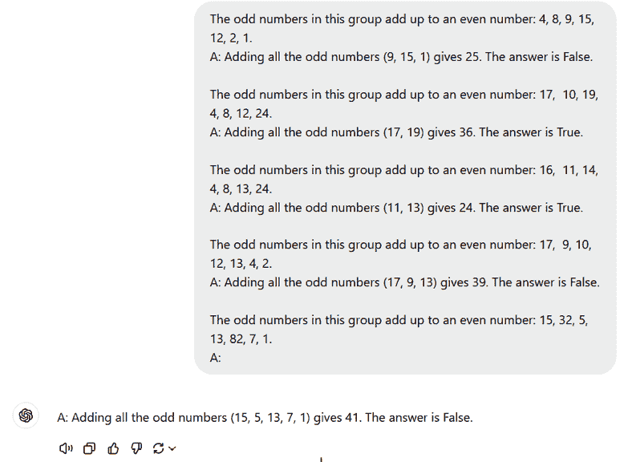
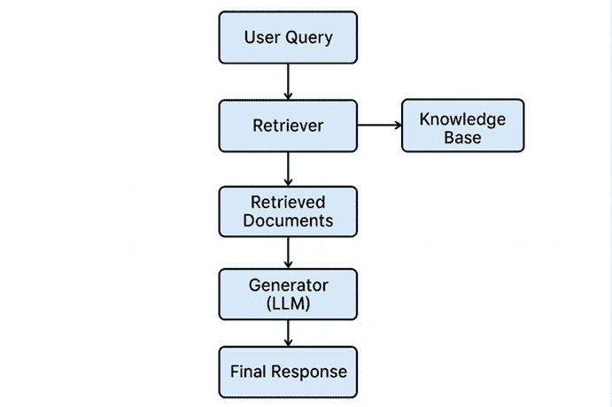
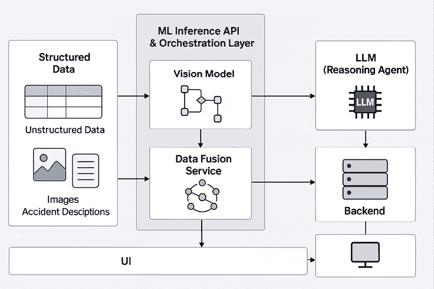

# 第十章：理解 GenAI 运营

**大型语言模型**（**LLMs**）在 2018 年随着 BERT 的推出而受到关注。尽管“GPT”自 2019 年以来就已存在，但它被用于名为“ChatGPT”的应用中，并于 2022 年推出。这就是互联网爆炸的时候，在可用五天内就获得了 100 万用户（[yahoo.com/news/chatgpt-gained-1-million-followers-224523258.html](https://yahoo.com/news/chatgpt-gained-1-million-followers-224523258.html)）。这表明市场中有正确的兴奋情绪。然而，在企业和应用中构建类似的东西，其中你期望用户进行商业化，完全是另一回事。

企业 AI 很困难。选择合适的模型、优化技术和评估指标可能很困难。选择可能会决定你的企业解决方案的成功与否，这可能会影响公司整体适应。这就是 GenAI **运营**（**Ops**）发挥作用的地方。实施 GenAI Ops 可以帮助你做出关于模型、数据、评估指标和优化技术的正确选择，并部署一个生产就绪的解决方案。在本章中，我们将探讨 GenAI Ops 的什么、为什么和如何。

我们将涵盖以下关键主题：

+   GenAI Ops 的什么和为什么

+   GenAI Ops 的生命周期

+   案例研究 – 企业 LLM 解决方案背后的幕后

+   案例研究 – 智能索赔处理平台

    **重要定义和免责声明**

+   **LLM 系统**：任何由 LLM 驱动的应用、工作流程或系统。这一点很重要，因为在本章中，我们将详细讨论 LLM 系统的评估，而不是实际大型语言模型的评估。

+   **混合精度训练**：一种在深度学习中使用的技巧，通过在单个模型中结合不同的数值精度来提高计算效率。通常，它涉及使用**16 位浮点**（**FP16**）精度进行大多数操作以减少内存使用并提高速度，同时保留**32 位浮点**（**FP32**）精度进行关键计算以保持准确性。

+   **用户提示**：用户向 AI 系统给出的特定问题，以指导 AI 执行特定任务。

+   **系统提示**：开发者提供的一组指令，用于定义 AI 模型的整体行为和角色。

+   **知识蒸馏**：一种机器学习技术，其中较小的、更简单的模型（“学生”）被训练来复制较大的、更复杂的模型（“教师”）的行为。目标是把知识从教师模型转移到学生模型，使学生能够以减少的计算资源实现相似的性能。

在本章中，我们假设你具备 GenAI 的背景，特别是 LLMs 和**小型语言模型**（**SLMs**），因为我们不会深入探讨架构，而是分享构建成功的 GenAI 系统的实用技巧和窍门。

请注意，*GenAI Ops*和*LLMOps*经常被互换使用，尽管它们背后的意图是相同的。

# 什么是 GenAI Ops？

GenAI Ops（LLMOps）是一个旨在加速和优化模型在整个生命周期中的创建、开发、评估和监控的过程。

## 为什么需要 GenAI Ops？

让我们探讨在构建 GenAI 应用程序时，为什么 GenAI Ops 是一个重要的概念。以下是一些原因：

+   GenAI Ops 对于优化您的 LLMs 的性能至关重要，这可能涉及微调模型、添加新的数据点等，以提高准确性和实现所需的回报率。

+   它帮助您积极监控您的模型，发现潜在的问题，并立即缓解它们

+   它降低了风险，并确保用户获得最可靠的经验

+   它帮助您根据应用程序的使用情况调整规模，使您能够节省成本，并确保您的用户获得最高级别的体验。

+   GenAI 是一项昂贵的任务；GenAI Ops 确保您可以通过企业内部定义的过程获得 GenAI 的最大收益。

### GenAI Ops 与 MLOps 有何不同？

当 MLOps 已经存在时，AI 从业者经常质疑 GenAI Ops 的必要性。尽管 LLM 和基于 ML 的应用程序在概率应用方面有相似之处，例如，但它们之间也存在导致分离流程的潜在差异。以下表格突出了其中的一些差异：

| **功能** | **MLOps** | **GenAI Ops** |
| --- | --- | --- |
| **人才** | 数据科学家和 ML 工程师 | 数据科学家、AI 工程师和应用开发者 |
| **指标** | 模型指标，如准确性和精确度 | 模型指标，如扎根性和连贯性；操作指标，如延迟和每分钟令牌数 |
| **训练过程** | 从头开始构建 | 在基础模型或 API 调用上进行微调 |
| **人类反馈** | 可选 | 不可或缺 |

表 10.1：MLOps 与 GenAI Ops 之间的差异

GenAI Ops 不仅仅是使用最新的 AI 技术，而是关于正确的人、平台和过程的融合。正确的人包括商业和技术人员、合规性、法律和早期采用者或商业用户。正确的平台是关于稳健地托管它，并为最终用户提供最佳体验。流程是关于拥有一个简化的系统来衡量和监控您的 LLM 系统的性能，这样您就可以在注意到模型轻微退化或任何类型的性能问题时采取主动，而不是被动反应。

在本节中，我们介绍了 GenAI Ops 的概念，为什么它是必要的，以及它与 MLOps 的不同之处。在下一节中，我们将详细探讨 GenAI Ops 的生命周期。

# GenAI Ops 的生命周期

组织对 GenAI Ops 的看法不同。没有一条路径是神圣的，它对你的组织和用例高度可定制。以下小节提供了一个高级流程，概述了你在构建 AI 应用程序时需要考虑的所有步骤。

## 构思

这是第一步；过程从构思开始。公司开始探索他们想要利用语言模型的使用案例。AI 实践者或数据科学家通常在这一步探索 SLMs 或 LLMs 的可能性，以优化和以成本效益的方式构建他们的应用程序。这是你也要涉及其他利益相关者，如产品或项目经理，来设计你整体产品愿景的步骤。指定的团队随后制定一个初始使用案例，并定义该使用案例的成功标准。一旦确定了使用案例，数据科学家将开始考虑用户提示和系统提示，并选择一个基础模型。在此阶段，强烈建议寻求解决方案架构师、顾问和公司内部专家的专业建议。

结果是一个定义了的使用案例，包括执行计划和为构建该使用案例所选定的模型。

## 构建

这是你细化初始计划并评估所选模型、用户提示和元提示/系统消息是否适合你的步骤。看到某件事是否有效的方法是将其付诸实践。在这个阶段，你将利用公司的沙盒/创新环境来构建解决方案，并查看它是否按预期工作。有很大可能性你将想要调整解决方案的某些元素。因此，这一步骤的部分内容是实验不同的 LLM 优化技术，如提示工程、**检索增强生成**（**RAG**）或微调，以获得期望的结果。根据选择的方法，你还需要一个评估计划，这可能包括添加**主题专家**（**SMEs**）来评估你的响应，使用 LLM 作为评判者，等等。我们将在接下来的章节中详细说明。

在我们进入 GenAI Ops 的第三阶段之前，让我们详细讨论所有优化技术。

当考虑优化由 LLM 驱动的解决方案时，通常有三种技术：RAG、提示和微调。通常，AI 开发者从提示开始，然后转向 RAG。在 RAG、提示和微调之间选择时，重要的问题是你要优化什么。LLM 优化不是一个线性的流程，这意味着，更常见的情况是，企业 LLM 解决方案需要这些技术的组合，或者根据用例的复杂性，一次同时使用所有三种技术。我们将在接下来的章节中详细说明这一点。

### 提示

提示是一种方法，你可以为你的 AI 解决方案提供详细的指令，以实现预期的输出。像人类一样，模型也需要细致的指令来提供高质量的输出。

提示可以分为两种类型：

+   **制作系统消息**：这些为模型提供了一种个性或语气，以便相应地行事。系统消息也是引入护栏和减少幻觉的绝佳方式。开发者在后端配置这些。例如，你是一位编写准确 Python 代码的程序员。如果你不知道某事，就说出来。

+   **制作用户提示**：这些是由用户驱动的，因此它们基本上是用户如何以自然语言与 LLM 交互。自从 ChatGPT 推出以来，我们一直在做这件事。

提示的优势如下：

+   提示易于实现，不需要高级技术技能

+   它是经济高效的，因为你在利用预训练模型

+   可以根据评估结果快速调整提示，而无需重新训练模型（参考[`medium.com/@myscale/prompt-engineering-vs-finetuning-vs-rag-cfae761c6d06`](https://medium.com/@myscale/prompt-engineering-vs-finetuning-vs-rag-cfae761c6d06)）。

#### 提示的最佳实践

这里，我通过提示提供了相关示例，以便它能够适应我的思维过程，然后回答问题。因此，它产生了正确的输出。它不仅仅打印了`41`；它还展示了它是如何得出解决方案的。

+   设计精确的元提示是一个迭代的过程。创建一个包含不同元提示和响应的电子表格对于跟踪调整不同元提示如何影响系统性能是至关重要的。

+   开发可重用的提示模板或模式，帮助用户轻松快速地适应不同的用例。

+   **思维链**（**CoT**）提示是在模型输出其思维过程并回答最终问题时。这种提示技术非常适合复杂推理问题。让我们通过一个示例来进一步了解：



图 10.1：示例 CoT 提示的说明

在这里，我通过提示提供了相关示例，以便它能够适应我的思维过程，然后回答问题。因此，它产生了正确的输出。它不仅仅打印了`41`；它还展示了它是如何得出解决方案的。

另一个需要注意的重要事项是，由于我提供了一些示例，这被称为**少样本学习**。让我们解码什么是少样本学习；它指的是模型通过在提示中仅给出几个示例就能执行新任务的能力。以下是一个少样本提示的示例：

+   **任务**：将情感分类为正面或负面

+   **示例 1 输入**： “我喜欢这个产品！”

+   **输出**：正面

+   **示例 2 输入**： “这太糟糕了。”

+   输出：负

这里需要注意的重要一点是，即使在 CoT 提示中，您也在进行少样本学习，因为您在提示中提供了示例，但主要区别在于思维链提示通常用于推理/逻辑用例，例如数学工作负载，因为它鼓励模型在给出最终答案之前**逐步推理**。

### RAG

RAG 是一种优化 LLM 的方法，使其更加接地，以便它们可以通过权威的知识库访问知识。关键是要知道，权威的知识库经过验证，以确保信息是准确和更新的。为了类比，想想 RAG 就像是一场“开卷考试”。在开卷考试中，学生被允许携带参考材料，如教科书或笔记，他们可以使用这些材料查找相关信息来回答问题。开卷考试背后的理念是，考试侧重于学生的推理技能，而不是他们记忆特定信息的能力。同样，事实性知识从 LLM 的推理能力中分离出来，并存储在外部知识源中，可以轻松访问和更新。

以下是 RAG 的优势：

+   **经济高效**：微调基础模型是昂贵的，但在 LLMs 中引入新的信息到 RAG 中更便宜

+   **增强用户信任**：RAG 提供准确的信息以及来源，例如研究论文中的脚注，从而提高用户对检索信息的信任

+   **保持相关性**：GenAI 模型通常使用过时的信息进行训练，但 RAG 允许您使用关于您用例的最新和相关信息进行训练

RAG 引入了一个信息检索组件，它首先利用用户输入从新的数据源中检索信息。用户查询和相关信息被提供给 LLM，LLM 使用最新的知识和训练数据来创建更好的响应。

以下步骤概述了该过程：

1.  **数据收集**：收集您应用程序所需的所有相关数据。例如，对于一个内部聊天机器人，这可能意味着所有关于内部数据源的知识手册

    **小贴士**

    确保在 RAG 应用程序中使用的数据是相关且更新的，以限制幻觉和错误响应。

1.  **数据分块**：数据分块是将您的数据分解成更小、更易消化的信息块。这允许模型有效地检索相关数据块。您如何执行分块也会影响模型的表现。例如，如果您处理的是 1000 页的手册，分块应该这样进行，即每个块讨论一个特定主题。这样，当用户提问时，模型可以快速检索所需的数据块。以下列表包含了一些基于用例可以选择的分块策略。

1.  列表需要更全面，但最相关的在企业中适用：

    +   **固定标记重叠**：在此技术中，文档被分割成块以在两个不同的块之间重叠信息。这对于在分块过程中不丢失信息非常重要，并确保保留所有数据。

    +   **语义**：在此技术中，文档基于语义相似性进行分割。首先，使用滑动窗口（通常是句子、上一句和下一句）将文档分为三个句子的句子组。为每个句子组生成嵌入，并在嵌入空间中将相似的组合并形成块。合并的相似度阈值使用百分位数、标准差和四分位距等指标确定。因此，块的大小可以在块之间变化。

    +   **混合分块**：这结合了基于内容类型和文档结构的多种策略。例如，文本可以按句子分块，而表格和图像则分别处理。这对于技术报告、商业文件或产品手册很有帮助。

1.  **文档嵌入**：一旦完成数据分块，通过嵌入将这些数据转换为向量表示是必不可少的。嵌入是保留文本数据语义意义的数值表示。在选择合适的嵌入模型时，请记住，通过相似度搜索进行检索的有效性高度依赖于用于表示文档和查询的嵌入质量。因此，选择嵌入模型将显著影响检索精度，影响 LLM 响应的质量以及整体 RAG 应用的质量。

1.  **处理用户查询**：一旦用户输入查询，它也会被转换为嵌入。然后，使用余弦相似度（或类似方法）将查询嵌入与文档嵌入进行比较，以找到最相关的信息块。

1.  **使用 LLM 生成响应**：检索到的文本块和初始用户查询被输入到语言模型中。算法将使用这些信息通过聊天界面对用户的问题做出连贯的响应。

接下来，我们将探讨 RAG 的示例用例：

+   具有内部知识库的聊天机器人，以帮助员工更快地找到信息并提高生产力。

+   为外部客户提供个性化推荐引擎，以改善客户服务和用户体验。

+   作为研究学习和解决复杂推理问题的智能伴侣。例如，它可以协助医生和研究人员快速检索与患者病例或医疗状况相关的最新研究成果或临床数据。

#### 实施 RAG 的最佳实践

现在我们已经了解了 RAG 的工作原理和优势，以下是我们构建和部署了几个 RAG 解决方案后学到的几点最佳实践：

+   **数据预处理**：

    +   确保你的数据中包含 RAG 所需的元数据。这将提供额外的上下文信息。一些元数据的例子可能是日期或年份，如果用户可以随时提出任何时间敏感的问题。

    +   对文档进行排序可以帮助大型语言模型更好地理解上下文。假设你正在从一份文档中检索几个片段，这些片段只有在正确排序的情况下才有意义；那么，按照那个顺序插入片段是至关重要的。

    +   在执行向量搜索之前，根据特定标准过滤数据，例如使用正则表达式或元数据来缩小搜索范围。如果用例是获取最新信息，那么在执行向量搜索之前过滤数据，比如在 2024 年，是最好的。这将有助于检索相关信息，并提高延迟。

    +   在将数据输入到 RAG 系统之前，确保数据是干净和更新的。部署能够检测数据漂移的系统，以便从业者知道何时更新数据或底层模型。聊天机器人失败是因为旧数据没有给用户提供正确的信息，导致用户群流失。

    +   强健的数据管道对于适应源数据的变化至关重要。这种适应性确保了 RAG 系统即使在输入数据的性质发生变化时也能保持高效和有效。

+   尝试不同的模型以确保最佳准确性和速度。如果你的用例更简单，从 SLM（序列到序列模型）开始可能有益，这样可以节省成本并提高速度。

+   从简单的 RAG 架构开始，并在评估性能时进行定制。如果你同时调整分块策略和嵌入模型，你将无法了解模型性能背后的驱动因素。

+   提前定义评估指标，例如基础性、连贯性等，并准备基准评估以进行比较。

+   RAG 系统中的可扩展设计是关于预测和解决生产中潜在延迟问题的。这将确保你的用户获得恒定的吞吐量，从而提供出色的用户体验。

+   对于你的 RAG 系统，始终遵循分阶段推出方法。从一个有限的用户群开始，随着你对你的 AI 应用越来越有信心，逐渐增加用户数量。

+   建立严格的数据隐私、安全和遵守数据保护法律的规定。拥有一个强大的系统来防止提示注入和恶意行为是至关重要的。请参阅[`nexla.com/ai-infrastructure/retrieval-augmented-generation/`](https://nexla.com/ai-infrastructure/retrieval-augmented-generation/)。

+   尽可能使用混合搜索；关键词和基于上下文的搜索技术结合了两者之长。这提高了搜索结果的准确性和相关性。请参阅[`medium.com/@juanc.olamendy/rag-best-practices-enhancing-large-language-models-with-retrieval-augmented-generation-6961c8b834ff`](https://medium.com/@juanc.olamendy/rag-best-practices-enhancing-large-language-models-with-retrieval-augmented-generation-6961c8b834ff)。

下图说明了 RAG 方法的工作原理：



图 10.2：RAG 的步骤

我们希望这一节能帮助您更深入地理解 RAG 的工作原理，何时使用它，以及构建时需要注意的事项。现在，让我们探索另一种强大的技术，称为微调。

### 微调

**微调**涉及在特定领域的数据集上训练预训练模型，以便为特定任务做准备。将预训练模型想象成一个在学校已经学习了一般知识的学生（例如，语言、数学和科学）。微调就像给这个学生提供特定职业的专业培训，比如法律或医学，他们在应用已经学到的知识的同时，在特定领域进行额外的实践。

下面是微调的步骤：

1.  准备您的数据集：

    +   **训练示例**：这些是用于教导模型如何正确响应的具体实例或数据点。

    +   **针对不希望的行为**：一些示例应关注模型当前响应不理想或不正确的情况。通过识别这些问题案例，您可以提供更好的指导。

    +   **理想的响应**：对于这些有针对性的示例，包括您希望模型产生的完美响应。将其当前响应与期望值进行比较，有助于模型学习正确的行为。

您至少需要有 50 个演示来查看模型在微调后是否有所改进。

1.  将数据分为训练集和测试集：

    +   将训练数据和测试数据都输入到微调任务中；这将帮助您获取两个数据集的统计数据，并计算模型在微调后的改进程度。

    +   训练模型后，您将使用这个测试集来评估其性能。通过比较模型在测试集上的预测与实际正确响应，您可以衡量其准确性和有效性。

1.  创建新的微调模型。确定适合您用例的合适模型。进行实验或咨询专家可能有助于选择适当的模型。

1.  评估结果，并在必要时回到*步骤 1*。这是最重要的步骤。在开始微调之前确定评估指标。OpenAI 默认为你提供训练损失、训练令牌准确率、验证损失和验证令牌准确率。这作为一个良好的基准，但你应该也有一种方法来比较与提示工程和 RAG 的结果，以计算在实施 RAG 或提示工程解决方案后获得的 LIFT。

微调的原因如下：

+   如果你希望拥有模型并确保数据不会离开你基础设施的四壁，微调是最好的选择。

+   当 SLM（序列语言模型）足以满足你的用例时，微调可能是一个正确的选择。这是一个质量与延迟之间的权衡。

+   如果用例或领域非常狭窄，微调可能更好。一个例子是，你的企业使用高度复杂的语法从数据库中检索信息；微调模型以学习你的语法可能是一个合适的选择。

+   如果用例如此复杂，以至于提示工程不切实际，因为你无法教授这个特定用例的所有工作原理并将其包含在提示中，微调可能是一个正确的选择。

#### 微调的最佳实践

到现在为止，你应该已经理解了微调的为什么和怎么做。现在，让我们探索在为你的企业用例微调时需要记住的关键要点：

+   微调的成功取决于预训练模型的质量。在选择预训练模型时，考虑其大小、训练数据类型以及训练要执行的任务非常重要。例如，如果你正在微调一个图像识别模型，你可能想选择一个在大型图像数据集上训练的预训练模型（参考[`saturncloud.io/blog/a-comprehensive-guide-to-fine-tuning/`](https://saturncloud.io/blog/a-comprehensive-guide-to-fine-tuning/)）。

+   对于较小的模型，需要更多的数据长度和广度来实现优化的微调性能。重要的是要迭代不同的模型，看看哪个最适合你的用例。对于数据长度，考虑至少 100 个好的例子，包括边缘案例，以便模型能够更好地学习。

+   逐步调整超参数以优化模型的表现。学习率、批大小和训练轮数等超参数可以显著影响模型的表现。请注意，训练轮数对训练的影响最大。标准的训练轮数是 4，批大小通常是 256，推荐的学习率乘数是 0.1 或 0.2。

+   确保微调数据在质量和数量上都是最优的：

    +   数据集应该是多样化的，包括正确和错误的响应

    +   数据集不应存在语法、逻辑或风格问题；否则，这会降低模型的表现

    +   确保所有您的训练示例都符合预期的推理格式

微调可以是一种强大的探索技术，但对于组织来说可能成本高昂。现在，让我们探索另一种强大的技术来优化您的 GenAI 解决方案：提示。

### 结合 RAG、提示工程和微调：完美的三合一

这三种技术不是相互排斥的；您不必选择其中之一。根据用例，您可能希望成对使用它们，单独使用，或全部一起使用。让我们用一个例子来理解这一点。假设您正在为 XYZ 公司构建一个客户服务聊天机器人：

+   **提示工程/提示**：您可以使用提示来定义聊天机器人的角色、语气和如何处理不同的查询。

+   **RAG**：您可以集成包含公司文档、常见问题解答和产品信息的知识库。这使得聊天机器人能够访问并利用相关信息，准确回答客户问题。

+   **微调**：您可以在客户交互数据集上微调聊天机器人，教它理解常见的客户问题，提供有用的解决方案，并保持积极和专业的语气（参考[`www.linkedin.com/pulse/prompt-engineering-rag-fine-tuning-benefits-when-use-deependra-verma-7g8dc/`](https://www.linkedin.com/pulse/prompt-engineering-rag-fine-tuning-benefits-when-use-deependra-verma-7g8dc/)）。

总结前面的讨论，以下是一个表格，帮助您选择正确的优化技术：

| **参数** | **潜在场景** | **优化技术** | **注意事项** |
| --- | --- | --- | --- |
| 准确性 | 缺少上下文过时/有偏见的信息 | RAG 提示数据预处理 | 金规则是尝试 RAG、提示或两者结合，同时提高准确性。如果 RAG 和提示未能增强用例，微调将无济于事。 |
| 一致性 | 结果不一致语气不符合预期推理不正确 | 微调提示 | RAG 可能在这里没有用，因为“结果不一致”通常意味着元提示存在问题。因此，始终从调整元提示开始，如果不起作用，再进行微调。 |
| 成本 | 每分钟高**令牌数**（**TPM**）高模型成本数据类型处理 | 模型优化（混合精度训练和知识蒸馏）选择 SLM 而不是 LLM |  |
| 性能 | 高延迟数据泄露 | 选择不同的模型提示优化 |  |

表 10.2：选择正确的优化技术

在 RAG、提示或微调中选择最合适的技巧可能是一个具有挑战性的决定。通常情况下，两种或三种技术的组合才能创建有影响力的 AI 解决方案。现在，让我们探索这个 GenAI Ops 阶段的最佳实践。

### 建设阶段的最佳实践

这里有一些建设阶段的最佳实践：

+   一个经验法则是尽可能避免微调。它很昂贵，可能不会为您的投资带来价值。

+   从提示工程开始，并评估您的结果。提示工程的结果可以作为基线，以查看微调是否改善了情况。

+   如果提示工程的结果令您满意，那么有 90%的几率微调会使它变得更好。如果它不与提示一起工作，那么有 25%的几率它会与提示一起工作。

+   微调需要针对特定任务的广泛标记数据集。如果这种数据很少，那么就坚持使用 RAG。

+   微调可能计算密集，而 RAG 利用现有数据库来补充生成模型，可能减少了对广泛训练的需求。

+   结果是一个强大的**概念验证**（**POC**），包含部署和监控应用程序的生产执行计划。

在本节中，我们探讨了构建 GenAI 解决方案的三个关键技术（RAG、微调和提示），以及它们如何结合以创建稳健的企业应用程序。我们还涵盖了每种方法的最佳实践，以确保有效实施。接下来，我们将详细探讨运营化阶段。

## 运营化

一旦有了 POC，就是时候在生产中部署您的应用程序了。运营化阶段包括几个主要步骤：构建 CI/CD 管道，并监控您的应用程序的道德、运营和成本指标。记住，这是一个基于 LLM 的解决方案，可能会迅速变得昂贵；因此，监控 TPM、成本使用趋势等非常重要。本节将重点关注揭示如何构建一个稳健的 LLM 系统评估策略，以及如何在生产中优化 GenAI 解决方案的性能。

### 评估

评估是 GenAI Ops 生命周期的重要组成部分。鉴于 LLMs 的概率性质，持续监控和评估您的 LLM 应用程序的性能是必要的。在此需要注意的是，评估在两个层面上进行：一个是 LLM 性能，另一个是 LLM 系统性能。我们将在这里讨论 LLM 系统的性能。

让我们看看为什么 GenAI 系统评估很难：

+   系统提示和用户提示的不同版本可能会改变模型的响应，使性能变得多变且难以跟踪。

+   缺乏良好的基准。我们将在下一节中讨论这一点。

+   在线评估中引入人类会引入不希望的偏差。

+   为特定用例定义正确的指标很困难。

让我们探讨一些实用的评估技术。

#### 离线和在线评估

**离线评估**是在您将 LLM 的性能与预先选择的基准数据集进行比较的地方。这是一种评估诸如扎根性和事实性等方面有效的方法。以下是一些执行离线评估的策略：

+   **黄金数据集**：这些是经过精心挑选的数据集，最好由行业专家提供，涵盖了多样化的输入和输出示例，作为评估 LLM（大型语言模型）能力的基准。黄金数据集应包含“真实”标签，以衡量 LLM 评估模板的性能。这是开始你的评估之旅并证明你的最小可行产品可行性的好方法；然而，这种方法不可扩展，可能会引入人为偏差。

+   **模型作为评判者**：AI 评估 AI 是一种可扩展的评估方法。它更快、更经济。但正如我们所知，LLM 也可能犯错；因此，在评估你的模型时，让人类参与其中可能是有益的。

一旦你的解决方案投入生产，你可以在几个月内利用模型作为评判者，与人类一起监控性能。设定一个特定的阈值，如果预定的指标低于某个阈值，应向开发者发出警告，以便他们可以采取行动。

**在线评估**是评估的另一个关键方面，其中你利用真实用户数据通过直接和间接反馈来评估实时性能。ChatGPT 中的**点赞**和**点踩**功能就是在线评估功能。

Chatbot Arena 进行了一项研究（[`arxiv.org/html/2403.04132v1`](https://arxiv.org/html/2403.04132v1)），用户可以提交问题并从两个匿名的 LLM 那里获得回应。一旦他们收到回应，他们可以为回应点赞或点踩。投票过程是匿名的和随机的，以确保公平性。这些回应被收集成一个丰富的用户提示和人类偏好的数据集。这是一个很好的例子，说明了如何在企业内部模拟在线评估。

#### 评估的最佳实践

在评估时，请注意以下一些最佳实践：

+   当使用模型作为评判者时，使用你负担得起的最高效的模型。

+   持续监控 LLM 系统并根据需要迭代。

+   在线验证信息，包括使用案例专家提供反馈。没有人比他们更清楚“好”是什么样的。

+   不要等到最后才评估模型；评估应该是开发周期的一部分。

+   明确了解基于 LLM 的应用程序的目标；这将帮助你定义和优先考虑对应用程序最有意义的指标。例如，一些应用程序优先考虑语言生成的流畅性和连贯性，而其他应用程序则优先考虑事实准确性或特定领域的知识（参考[`medium.com/data-science-at-microsoft/evaluating-llm-systems-metrics-challenges-and-best-practices-664ac25be7e5`](https://medium.com/data-science-at-microsoft/evaluating-llm-systems-metrics-challenges-and-best-practices-664ac25be7e5)）。

+   构建评估可能很棘手。首先，探索现成的评估 SDK 以节省时间和精力。如果它们不适合你，那么你可以构建自己的评估框架。

根据你的用例，以下是一些选择正确评估指标的一般指南：

+   **提取结构化信息**：你可以查看 LLM 提取信息的效果。例如，你可以查看完整性（输入中是否有不在输出中的信息？）。

+   **问答**：系统回答用户问题的效果如何？你可以查看答案的准确性、礼貌性或简洁性。

+   **RAG**：检索到的文档和最终答案是否相关、有根据等？

本节作为评估的介绍，涵盖了在企业中执行评估的实际方法。在下一节中，我们将探讨 LLM 系统的日志记录和监控。

### 日志记录和监控

在运营化过程中的另一个重要步骤是日志记录和监控。这种机制有助于捕获提示、响应、评估分数以及元数据，如模型版本、输入数据等。这些数据对于调试、维护审计跟踪和检测数据或底层模型中的漂移非常重要。这也是监控你 LLM 系统成本以及用户需求变化的好方法。

组织不需要构建新的日志记录和监控系统；你可以利用任何现有的系统并集成 AI 应用程序警报。确保任何重大偏差或异常都能及时标记并发送给相关团队进行修复。你可以在《生成式 AI 应用集成模式》一书中详细了解这一点（[`www.packtpub.com/en-mx/product/generative-ai-application-integration-patterns-9781835887615`](https://www.packtpub.com/en-mx/product/generative-ai-application-integration-patterns-9781835887615)）。

#### 部署到生产后的最佳实践

目标是将 GenAI 解决方案部署到生产环境中。以下是一些在生产环境中使用解决方案时需要考虑的最佳实践：

+   **成本阈值**：一旦 AI 解决方案投入生产，最好设置阈值。对于开发者来说，重要的是要收到关于他们分配的预算的通知。还应该有一位 IT 管理员持续接收成本更新的信息。如果成本超过阈值，可能就是分析你 AI 系统运作的时候了；可能是模型选择导致成本增加，流量超过预期等情况。

+   **缓存**：通过存储频繁访问的数据，您可以在不需要重复调用我们的 API 的情况下提高响应时间。您的应用程序需要设计为尽可能使用缓存数据，并在添加新信息时使缓存失效。您可以通过几种不同的方式来实现这一点。例如，您可以根据应用程序的需要在数据库、文件系统或内存缓存中存储数据。请参阅[`platform.openai.com/docs/guides/production-best-practices`](https://platform.openai.com/docs/guides/production-best-practices)。

+   **负载均衡**：考虑负载均衡技术，以确保请求均匀地分布在您的可用服务器上。请参阅[`platform.openai.com/docs/guides/production-best-practices`](https://platform.openai.com/docs/guides/production-best-practices)。

+   **人类反馈循环**：实施一个系统，让用户可以标记不正确的响应，帮助模型随着时间的推移不断改进。

+   **毒性和偏差缓解**：定期使用 OpenAI 的 Moderation API、Perspective API 或自定义安全分类器等工具测试偏差和不适当的输出。

+   **道德合规**：确保符合法规（GDPR、HIPAA 等），保持模型生成响应的透明度。

+   **内容过滤**：应用提示工程技巧、**从人类反馈中进行强化学习**（**RLHF**）或微调，以防止幻觉和错误信息。

+   **自动扩展和负载管理**：为云部署实现自动扩展，并通过利用量化、剪枝或知识蒸馏来优化推理成本。我们在此不详细讨论，但为任何想要审查的人提供资源（[`medium.com/@sahin.samia/llm-inference-optimization-techniques-a-comprehensive-analysis-1c434e85ba7c`](https://medium.com/@sahin.samia/llm-inference-optimization-techniques-a-comprehensive-analysis-1c434e85ba7c)）。

在本节中，我们探讨了实施阶段，包括评估、日志记录和监控，以及一旦解决方案投入生产应考虑的最佳实践。在下一节中，我们将详细探讨一个案例研究，以了解 GenAI Ops 在企业中的应用。

# 案例研究 – 企业 LLM 解决方案背后的场景

LexCorp（一家虚构的公司），一家领先的专注于公司法的律师事务所，认识到 AI 革命其运营的潜力。LexCorp 拥有一支超过 200 名律师的团队，每天处理各种合同，从并购到知识产权协议。该事务所对创新的承诺使其投资于开发一个针对其独特需求的特定领域 LLM。

构建特定领域的聊天机器人涉及以下步骤：

1.  LexCorp 的聊天机器人开发始于定义业务目标，以量化聊天机器人的潜在影响。目标很简单：提供可以帮助律师提高效率并专注于重要任务的工具。

1.  开发始于广泛的数据收集，以及确定将验证输出并提供整个开发过程支持的专家。 

1.  下一步涉及确定他们将要使用的构建聊天机器人的方法。在他们的情况下，他们在 RAG 和微调之间感到困惑，但决定从 RAG 开始，以获得高效且成本更低的优化选项。

1.  他们构建了一个简单的用户界面，并将聊天机器人与确定的数据源联系起来。他们决定选择 GPT-4o 模型，因为它既经济实惠，又能处理多模态数据。

1.  接下来，他们确定了他们想要用来衡量聊天机器人性能的指标，并在几周内进行了彻底的测试，以确保聊天机器人能够生成适当的响应。

1.  为了保持大型语言模型（LLM）的更新，运维团队实施了一个强大的反馈循环。使用 AI 的律师对生成的草稿提供了持续的反馈。这些反馈被仔细分析，以确定改进的领域。定期推出更新，纳入最新的法律先例，并完善模型对复杂法律概念的理解。运维团队还监控了模型的表现，确保其达到公司对准确性和可靠性的高标准。

1.  可靠性对 LexCorp 来说是一个关键问题。运维团队采用了多种策略来确保 LLM 的输出是可靠的。他们进行了严格的测试，模拟了各种法律场景来评估模型的表现。此外，他们建立了一个人类监督系统，其中资深律师在最终确定之前审查 AI 生成的草稿。这种双层方法确保了 LLM 的输出既准确又合法。

1.  LexCorp 对卓越的承诺推动了其 LLM 的持续改进。运维团队利用了迁移学习和强化学习等高级技术来增强模型的能力。他们还探索了整合外部法律数据库，以扩大模型的知识库。

1.  定期进行培训会议，让律师熟悉 AI 的功能，营造一个人类专业知识与 AI 创新和谐共存的合作环境。

我们可以从 LexCorp 学到以下内容：

1.  通过细致的数据收集、持续的反馈、严格的测试和持续的改进，该公司成功利用了通用人工智能的力量，简化了其法律起草流程。

1.  他们从第一天起就建立了稳健的测试和评估框架，这使他们能够进行增量更新。

1.  他们从一个团队开始，然后扩展到其他团队。在 GenAI 开发中，分阶段推出极为有益。

1.  他们从一开始就涉及业务利益相关者，并定义了“成功”会是什么样子。这有助于他们获得产品所需的赞助。在利益相关者的帮助下，他们还创建了一个用于评估的黄金数据集。

1.  他们构建了一个面向流程的产品，而不是以模型为中心的产品。这意味着他们没有追求最花哨的模型，而是选择了既便宜又能满足他们用例需求的模型。

1.  他们将负责任的 AI 实践融入他们的产品中，以主动应对任何恶意攻击。

1.  他们构建了一个简单的 UI，而不是一开始就投入大量资源将其集成到他们的遗留应用程序中。集成可以在以后管理，但第一步是让用户熟悉这项技术。

这个案例研究强调了 AI 专家和领域专业人士之间协作的重要性，以实现可靠和有影响力的 AI 解决方案。

# 案例研究 - 智能索赔处理平台

一家保险公司希望自动化处理汽车事故的索赔。这个过程包括以下步骤：

+   **结构化数据**：保单详情、客户人口统计信息、历史索赔和承保限额

+   **非结构化数据**：损坏车辆的图片、自由文本的事故描述和维修发票

人工审查既慢又不一致。目标是构建一个基于 Web 的 UI，结合机器学习推理和大型语言模型推理，以提供快速、透明的决策。

让我们看看解决方案概述。该平台使用以下内容：

+   **计算机视觉机器学习模型**用于基于图像的损坏检测

+   **预测性机器学习模型**：预测索赔的估计成本和欺诈概率

+   **大型语言模型推理层**将机器学习输出和非结构化文本综合成一个连贯的解释，用于索赔决策

通过以下图表，我们可以可视化架构工作流程：



图 10.3：解决方案架构工作流程

考虑到这个可视化，让我们详细讨论架构工作流程：

1.  **数据层**：

    +   **结构化数据**：保单详情、承保限额和历史索赔（存储在关系型数据库中）

    +   **非结构化数据**：图像（存储在对象存储中）和事故描述（文本）

1.  **机器学习模型开发**：

    +   **视觉模型**：训练基于卷积神经网络（CNN）的模型（例如 EfficientNet 或 YOLO）进行损坏检测和严重程度评分

    +   **表格模型**：训练梯度提升树或神经网络进行索赔成本估计和欺诈风险预测

    +   **输出标准化**：确保每个模型使用相同的字段名称和结构输出数据。例如，如果一个模型返回`severity_score`而另一个返回`damage_severity`，编排层必须执行额外的工作来解释它们。标准化键确保所有下游组件，如 API 层，可以可靠地处理结果，而无需额外的映射或转换。

1.  **机器学习推理 API**：

    +   **容器化模型**：使用**FastAPI**或**Flask**构建 REST 端点。

    +   **端点**：有一个接受图像并返回损坏分析的端点。还有一个接受结构化数据、返回成本和欺诈风险的端点。

    +   **部署**：托管在**Azure App Service**或**AWS Lambda**以实现可扩展性。

    +   **身份验证**：使用 OAuth 或 API 密钥进行安全保护。

1.  **编排层**：数据融合服务结合了机器学习 API 和用户输入的输出。此外，它还创建了一个用于推理的统一 JSON 有效负载。

1.  **LLM 推理代理**：以下是一个提示模板或示例：

    ```py
    Context:
    - Damage: {damage_area}, severity {severity_score}
    - Estimated cost: ${estimated_cost}
    - Fraud risk: {fraud_risk}
    - Coverage limit: ${coverage_limit}
    - Customer statement: “{customer_statement}”
    Task:
    Generate a professional claim decision summary explaining approval/rejection and reasoning. 
    ```

1.  **LLM 集成**：使用**Azure OpenAI**或**OpenAI GPT API**。然后，将其封装在一个执行以下操作的代理中：

    +   调用机器学习 API

    +   构建推理提示

    +   返回结构化和自然语言输出

1.  **UI 层**：

    +   **前端**：React 或 Angular 仪表板；上传图片，输入文本，查看机器学习和 LLM 输出

    +   **后端网关**：处理对机器学习服务和 LLM 代理的 API 调用

1.  **日志、合规性和评估**：

    +   存储机器学习输出、LLM 推理文本和最终决策以供审计和合规性

    +   通过任务遵守和意图解析对代理性能进行稳健的评估

根据架构流程，现在让我们讨论核心设计原则：

1.  **以代理为中心的编排**：

    +   LLM 充当决策者，而不仅仅是文本生成器

    +   它决定何时调用机器学习工具，如何解释输出以及如何结合结构化和非结构化数据

1.  **通过 API 公开工具**：

    +   每个机器学习模型（视觉和表格）都被封装在一个 REST API 中

    +   这些 API 使用模式（名称、描述和输入/输出格式）注册为代理的工具

    +   代理可以在推理过程中动态调用这些工具

1.  **数据融合层**：

    +   在推理之前，机器学习工具的输出和用户输入被标准化为单个 JSON 有效负载

    +   这确保了 LLM 看到一个干净、结构化的推理上下文

1.  **推理提示工程**：代理使用以下模板提示：

    +   机器学习输出（损坏区域、严重程度、成本和欺诈风险）

    +   结构化数据（承保限额）

    +   非结构化文本（客户声明）

这里是一个示例：

```py
Context:
Damage: {damage_area}, severity {severity_score}
Estimated cost: ${estimated_cost}
Fraud risk: {fraud_risk}
Coverage limit: ${coverage_limit}
Customer statement: “{customer_statement}”
Task:
Generate a professional claim decision summary explaining approval/rejection and reasoning. 
```

1.  **UI 集成**：

    +   UI 仅与代理 API 交互，而不是直接与机器学习模型交互

    +   这使得用户的工作流程简单，同时在幕后实现复杂的编排

为什么使用这种方法？

+   **可扩展性**：添加新工具（例如，欺诈检测和成本优化）很容易

+   **透明度**：LLM 推理提供人类可读的解释

+   **合规性**：记录每个 ML 输出和 LLM 决策以供审计

以下是一些挑战：

+   **数据集成**：结合结构化（政策表）和非结构化（图像和文本）数据以进行连贯推理

+   **模型互操作性**：视觉和表格模型必须输出标准化的格式以供 LLM 消费

+   **提示鲁棒性**：LLM 必须处理边缘情况（例如，缺失数据和冲突信号）

+   **偏差和公平性**：避免由人口统计数据导致的决策偏差

+   **延迟**：实时推理和推理而不降低用户体验

+   **可解释性**：合规性要求每个决策都有清晰的推理

这里有一些增加的复杂性：

+   **多模态推理**：LLM 解释数值分数、文本描述和图像洞察

+   **动态提示**：根据缺失字段或异常进行调整

+   **审计跟踪**：存储 ML 输出和 LLM 推理以供合规性使用

该解决方案展示了如何结合结构化和非结构化数据以及 ML 和 LLM 推理，将传统工作流程转变为智能、透明的系统。通过利用多模态 AI，该平台不仅加速了决策过程，还通过清晰的解释建立了信任。最终，它为保险行业可扩展、合规和以客户为中心的自动化奠定了基础。

# 摘要

在本章中，我们介绍了 GenAI Ops，重点关注企业如何成功构建、部署和管理 LLM 系统。我们解释了 GenAI Ops 与传统 MLOps 之间的区别，强调了在商业环境中实现 GenAI 的独特挑战。本章涵盖了 GenAI Ops 的生命周期，从构思和构建（包括 RAG、微调和提示等优化技术）到运营、评估和监控。它还提供了最佳实践和一个案例研究，说明了法律公司如何实施特定领域的 LLM 解决方案以简化合同管理。

在下一章中，我们将进一步探讨并讨论 AI 代理。

# 参考文献

+   Abideen, Z. (2024, October 15). 15 *分块技术构建卓越的 RAG 系统*。Analytics Vidhya。 [`www.analyticsvidhya.com/blog/2024/10/chunking-techniques-to-build-exceptional-rag-systems/`](https://www.analyticsvidhya.com/blog/2024/10/chunking-techniques-to-build-exceptional-rag-systems/)

+   Amazon Web Services (AWS). (n.d.). *什么是提示工程？* [`aws.amazon.com/what-is/prompt-engineering/`](https://aws.amazon.com/what-is/prompt-engineering/)

+   Amazon Web Services (AWS). (n.d.). *什么是检索增强生成？* [`aws.amazon.com/what-is/retrieval-augmented-generation/`](https://aws.amazon.com/what-is/retrieval-augmented-generation/)

+   Bustos, J. P. & Soria, L. L. (2024). *生成式 AI 应用集成模式. Packt 出版公司.* [`www.packtpub.com/en-mx/product/generative-ai-application-integration-patterns-9781835887615`](https://www.packtpub.com/en-mx/product/generative-ai-application-integration-patterns-9781835887615)

+   Chiang, W.-L., Zheng, L., Sheng, Y., 等. (2024). *聊天机器人竞技场：一个通过人类偏好评估 LLM 的开放平台.* arXiv. [`arxiv.org/abs/2403.04132`](https://arxiv.org/abs/2403.04132)

+   DataCamp. (n.d.). *LLM 评估：指标、方法、最佳实践* . DataCamp 博客. [`www.datacamp.com/blog/llm-evaluation`](https://www.datacamp.com/blog/llm-evaluation)

+   Ferrer, J. (2024, 8 月 9 日). *优化您的 LLM 以提高性能和可扩展性* . KDnuggets. [`www.kdnuggets.com/optimizing-your-llm-for-performance-and-scalability`](https://www.kdnuggets.com/optimizing-your-llm-for-performance-and-scalability)

+   Forbes 科技委员会. (2024, 9 月 20 日). *大型语言模型 (LLM) 如何改变客户支持行业.* Forbes. [`www.forbes.com/councils/forbestechcouncil/2024/09/20/how-llms-are-transforming-the-customer-support-industry/`](https://www.forbes.com/councils/forbestechcouncil/2024/09/20/how-llms-are-transforming-the-customer-support-industry/)

+   Google Cloud. (n.d.). *GenAI Ops：它是怎样的以及它是如何工作的* . Google Cloud. [`cloud.google.com/discover/what-is-llmops`](https://cloud.google.com/discover/what-is-llmops)

+   黄，J. (2024, 3 月 5 日). *评估大型语言模型 (LLM) 系统：指标、挑战和最佳实践* . 微软数据科学（Medium）. [`medium.com/data-science-at-microsoft/evaluating-llm-systems-metrics-challenges-and-best-practices-664ac25be7e5`](https://medium.com/data-science-at-microsoft/evaluating-llm-systems-metrics-challenges-and-best-practices-664ac25be7e5)

+   Microsoft Azure. (n.d.). *GenAI Ops with Azure AI* [视频]. YouTube. [`www.youtube.com/watch?v=rdShYiURnmM`](https://www.youtube.com/watch?v=rdShYiURnmM)

+   MongoDB. (n.d.). *如何为您的 LLM 应用程序选择合适的分块策略* . MongoDB 开发者中心. [`www.mongodb.com/developer/products/atlas/choosing-chunking-strategy-rag/`](https://www.mongodb.com/developer/products/atlas/choosing-chunking-strategy-rag/)

+   MyScale. (n.d.). *提示工程 vs 微调 vs RAG* . Medium. [`medium.com/@myscale/prompt-engineering-vs-finetuning-vs-rag-cfae761c6d06`](https://medium.com/@myscale/prompt-engineering-vs-finetuning-vs-rag-cfae761c6d06)

+   Nexla. (n.d.). *检索增强生成 (RAG) 教程、示例和最佳实践* . Nexla. [`nexla.com/ai-infrastructure/retrieval-augmented-generation/`](https://nexla.com/ai-infrastructure/retrieval-augmented-generation/)

+   Olamendy, J. C. (n.d.). *RAG 最佳实践：通过检索增强生成提升大型语言模型*. Medium. [`medium.com/@juanc.olamendy/rag-best-practices-enhancing-large-language-models-with-retrieval-augmented-generation-6961c8b834ff`](https://medium.com/@juanc.olamendy/rag-best-practices-enhancing-large-language-models-with-retrieval-augmented-generation-6961c8b834ff)

+   OpenAI. (n.d.). *优化 LLM 准确性*. OpenAI API 文档. [`platform.openai.com/docs/guides/optimizing-llm-accuracy`](https://platform.openai.com/docs/guides/optimizing-llm-accuracy)

+   OpenAI. (n.d.). *生产最佳实践*. OpenAI API 文档. [`platform.openai.com/docs/guides/production-best-practices`](https://platform.openai.com/docs/guides/production-best-practices)

+   土星云. (n.d.). *全面调优指南*. 土星云博客. [`saturncloud.io/blog/a-comprehensive-guide-to-fine-tuning/`](https://saturncloud.io/blog/a-comprehensive-guide-to-fine-tuning/)

+   Verma, D. (n.d.). *提示工程、RAG 和调优：益处以及何时使用*. 领英脉搏. [`www.linkedin.com/pulse/prompt-engineering-rag-fine-tuning-benefits-when-use-deependra-verma-7g8dc/`](https://www.linkedin.com/pulse/prompt-engineering-rag-fine-tuning-benefits-when-use-deependra-verma-7g8dc/)

# 免费订阅电子书

新框架、演进的架构、研究发布、生产分析——AI_Distilled 将噪音过滤成每周简报，供实际操作 LLM 和 GenAI 系统的工程师和研究人员阅读。现在订阅，即可获得免费电子书，以及每周的洞察力，帮助您保持专注并获取信息。

在 [`packt.link/8Oz6Y`](https://packt.link/8Oz6Y) 订阅或扫描下面的二维码。


