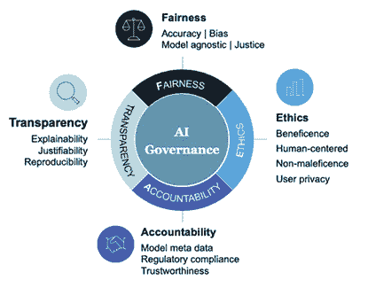
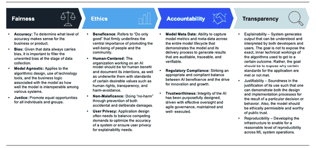

# 第十二章：责任人工智能简介

**责任人工智能**（**RAI**）是一种实用方法，要求**人工智能**（**AI**）系统与组织的价值观保持一致，支持商业和伦理目标。RAI 强调人工智能工具的负责任、公平和透明使用，侧重于问责制和结构化治理。

事实上，在商业环境中真正优化人工智能解决方案，RAI（责任人工智能）是不可或缺的。通过建立稳健的框架和优先考虑人类价值观，RAI 引导组织负责任地使用人工智能，将意图与实际影响相连接，并创造既服务于商业目标又承担社会责任的人工智能产品。

RAI 对于在人工智能中建立信任至关重要，因为它减少了可能导致法律、财务和声誉损害的风险，如偏见、隐私问题和不可预见的伤害。这种责任上的失败会直接阻碍人工智能解决方案的优化，限制其范围，侵蚀用户信任，并造成运营挑战。通过解决这些风险，RAI 使组织能够自信且道德地使用人工智能，促进增长和创新。通过 RAI 积极解决伦理问题也可以在市场上成为一个重要的差异化因素，有助于长期商业成功和持久性。

本章探讨了 RAI 的基础原则、其在商业中的重要性以及各种利益相关者在构建 RAI 解决方案中的作用。

我们在本章中将涵盖以下关键主题：

+   理解相关术语——责任人工智能、伦理人工智能和可信人工智能

+   RAI 和伦理商业实践的核心支柱

+   RAI 在商业实践中的重要性

+   谁负责使“人工智能负责任”？

+   为什么 RAI 对优化机器学习模型很重要？

到本章结束时，你将能够区分责任人工智能、伦理人工智能和可信人工智能；理解伦理人工智能框架的基础支柱；并认识到在构建协作 RAI 生态系统中的各种利益相关者的角色。

# 理解相关术语——责任人工智能、伦理人工智能和可信人工智能

虽然术语 RAI、伦理人工智能和可信人工智能经常被互换使用，但它们有各自的重点：

+   **伦理人工智能**：伦理人工智能关注指导人工智能发展的道德原则，如公平性、透明度和避免伤害。它关注人工智能的哲学和规范性方面，确保人工智能系统以道德上可接受的方式设计和使用。伦理人工智能解决人工智能实践中什么是正确和错误的问题，强调公平和包容的重要性，并且不受偏见的影响。

+   **可信赖的 AI**：可信赖的 AI 涉及使 AI 系统可靠和安全，并确保它们能够无错误或风险地执行其预期功能。它侧重于 AI 系统的技术稳健性和可靠性，确保它们能够持续且安全地运行。可信赖的 AI 类似于一辆可靠、不会抛锚且能保障安全的汽车。

+   **负责任的 AI**：RAI 是一个确保 AI 开发和部署负责任进行的框架，重点在于实际治理。它涉及创建具有明确责任界限、稳健的风险管理流程和透明决策能力的 AI 系统。RAI 解决了在 AI 系统中实施伦理原则的操作方面，使其与组织价值观和社会期望保持一致。正是 RAI 确保了系统的伦理性，这意味着它对每个人都是公平的，不歧视，无偏见，尊重隐私，并与人类价值观相一致。

RAI 作为总体框架，将伦理 AI 和可信赖 AI 的原则转化为实际的商业和技术实践。

以下这些概念之间的关键区别是：

+   **伦理 AI**：关注指导 AI 目的和设计的根本道德原则（公平和非伤害性）

+   **可信赖的 AI**：关注 AI 的工作效果（安全、可靠和可信赖）

+   **RAI**：关注 AI 的行为是否伦理（公平、包容并与社会价值观一致），以及实施所有三种实践所需的治理措施是否到位

所有这三个方面都很重要。一辆汽车（或 AI）需要是伦理的（不造成伤害）、可信赖的（运行良好）和负责任的（对社会有益），才能成为一个成功且可持续的产品。

为了说明这些概念之间的区别，想象一个在医院使用的由 AI 驱动的医疗诊断系统：

+   一个伦理的医疗诊断系统建立在道德原则之上，主要关注非伤害性的核心思想（不做伤害）。例如，开发者验证算法设计尊重患者自主权，以及用于训练的数据供应链是道德来源并尊重隐私。这关乎系统的道德设计。

+   一个可靠的医疗诊断系统是指一个可靠、一致且安全运作的系统。它已经在技术上得到验证，具有持续的高技术成功率、低误报/漏报率、对网络攻击的强大安全性，以及清晰的错误处理以防止系统故障。这关乎系统的技术性能和可靠性。

+   负责任的医疗诊断系统不仅需要是伦理和值得信赖的，它还受到一个框架的约束，确保其现实世界的应用是公平和可问责的。例如，医院的伦理委员会验证系统的技术结果在所有人口统计学群体中都是公平的（公平性），其决策对医生是可解释的（透明度），如果出现误诊，有明确的问责线。RAI 在现实世界中实现了伦理和值得信赖的人工智能的原则。在人工智能术语中，RAI 确保系统是伦理的，这意味着对每个人都公平，不歧视，尊重隐私，并与人类价值观保持一致。

# RAI 和商业实践中的伦理支柱

涉及人工智能的商业实践应有助于在用户和利益相关者之间建立信任，降低风险，并促进创新。伦理人工智能实践的核心原则，即**公平性、伦理、问责和透明度**（**FEAT**），是 RAI 的基本支柱。许多组织现在正在转向 FEAT 原则来发展符合伦理的商业实践 RAI（更多信息，请参阅[`www.mas.gov.sg/news/media-releases/2018/mas-introduces-new-feat-principles-to-promote-responsible-use-of-ai-and-data-analytics`](https://www.mas.gov.sg/news/media-releases/2018/mas-introduces-new-feat-principles-to-promote-responsible-use-of-ai-and-data-analytics)）：

以下图表直观地展示了人工智能治理框架的 FEAT 原则是如何相互交织并由这些核心支柱支持的：

图 12.1：人工智能治理框架的 FEAT 原则概述，

来自“使用 FEAT 方法避免偏见人工智能”，2022 年 4 月，麦肯锡公司，[www.mckinsey.com](https://www.mckinsey.com) 。版权所有©2025 麦肯锡公司。保留所有权利。经许可重印

+   **公平性**在人工智能开发中力求确保某些人工智能系统不对任何个人或边缘化群体进行歧视，并提供公平待遇。实施检测和减轻人工智能模型中偏见的技术，使用多样化和代表性的训练数据，以及考虑到包容性设计人工智能系统是关键步骤。这些做法有助于防止歧视，实现公平的结果，提高所有用户的性能和可靠性。

+   **伦理**涉及将伦理考量融入人工智能开发的每个阶段，以符合社会价值观并避免造成伤害。制定和遵守伦理指南，为人工智能开发者和利益相关者提供伦理培训，通过在用户和利益相关者之间建立信任和接受度来促进 RAI 的发展。

+   **问责制**要求明确 AI 系统结果的职责界限。这包括进行影响评估以评估 AI 系统对个人和社会的潜在影响，并建立如伦理委员会和独立审查委员会等监督机制。这些措施有助于识别和减轻风险，促进道德结果，并将 AI 发展与社会价值观相一致。

+   **透明度**是指使 AI 系统的运作对利益相关者可理解，可解释性是这一点的关键组成部分。使 AI 系统可解释不仅建立信任，还允许利益相关者理解决策是如何做出的，从而促进问责制和技术信心。这包括明确记录 AI 模型的训练方式、使用的数据以及决策过程。通过创建详细的数据表、模型卡、系统卡和透明度笔记，并与利益相关者保持开放沟通，企业可以建立信任并促进法规遵守。下一章提供了如何创建和实施这些卡片和笔记的实用指南。

除了核心的 FEAT 支柱外，一个健壮的 RAI 框架还必须解决隐私和安全问题，因为这些是支撑核心原则的周边支柱。**隐私**要求 AI 系统严格遵守数据保护法律和道德标准，因此用于训练、测试和运行模型的个人信息必须得到安全处理，有效匿名化，并且仅用于其预期目的。保护用户隐私是 RAI 的一个关键方面，确保道德数据处理并建立用户信任。同时，**安全**要求 AI 系统不仅技术上稳健且对恶意攻击有防御能力，而且不受意外伤害的影响。这包括进行安全评估和实施安全机制，如安全防护和冗余；这些对于降低风险和保护用户至关重要。例如，**失效模式和影响分析**（**FMEA**）可以系统地识别 AI 系统中的潜在故障点，防止危险或歧视性输出，并建立明确的紧急停机程序，从而减轻对用户以及组织的所有潜在风险。在生产中可以实施看门狗计时器等机制，以在系统无响应时自动重启系统，而冗余系统可以在主 AI 失败时保证有备份可用。

以下图表扩展了 FEAT 原则，概述了在开发 RAI 时对每个支柱做出贡献的具体组成部分和实践：

图 12.2：扩展 FEAT 方法以开发 RAI 的概述。

来自“使用 FEAT 方法避免偏见人工智能”的展示，2022 年 4 月，麦肯锡公司，[www.mckinsey.com](https://www.mckinsey.com) 。版权所有©2025 麦肯锡公司。经许可转载

隐私关乎保护与人工智能系统互动的个人数据和隐私。通过使用数据匿名化和加密等技术，并确保遵守如**通用数据保护条例**（**GDPR**）等隐私法规，企业可以增强用户信任并避免法律问题。

当人工智能系统可靠且安全地运行时，安全至关重要，可以最小化潜在的危害。进行安全评估和实施安全机制，如安全防护和冗余，对于降低风险和保护用户至关重要。道德人工智能实践对商业影响重大。它们通过展示对负责任和道德技术发展的承诺，降低与人工智能部署相关的风险，并通过创造一个值得信赖的实验和开发环境来促进创新，从而提升公司的声誉。那些将道德放在人工智能首位的公司更有可能吸引顶尖人才并获得竞争优势。

让我们以一个在医院的医疗诊断系统为例，该系统利用人工智能来展示在整个项目生命周期中成功实施道德和 RAI 实践。一家医院正在实施一个人工智能系统，用于分析医学图像（X 光和 CT 扫描），以帮助医生识别特定疾病的早期迹象，旨在提高诊断的速度和一致性，同时不损害患者安全和信任。

这里是实施步骤：

1.  **建立道德指南**：人工智能项目从 RAI 指导委员会设定一个基础道德原则开始：模型必须对所有患者公平地表现。他们要求训练数据必须代表目标患者群体的全部多样性（如年龄、性别和种族等人口统计特征），以防止算法偏见。这一主动步骤表明，对公平和患者安全的承诺从系统设计的第一天起就融入其中。

1.  **进行偏见审计**：在开发和测试阶段，重点转向可信赖的人工智能。系统将接受严格的偏见审计，其中性能不仅仅通过整体技术成功率来衡量，还要看其在特定人口细分市场中的连贯性。如果模型对特定群体的成功率下降，它将重新训练或增强，直到性能公平且可靠，从而确认初始的道德指南得到满足。

1.  **保持透明度**：为了成功部署，透明度原则被具体化。医院验证了使用该系统的每位医生都获得了模型卡片和透明度说明。这些文件清楚地说明了模型的目的、已知的局限性、用于训练的数据，以及最重要的是，它如何得出特定的诊断建议。这种清晰度促进了信任，并使人类医生能够有效地解释 AI 的输出。

1.  **保护隐私和增强安全**：最终的治理框架维护了持续的隐私和安全。技术措施包括强大的加密和访问协议，以保护敏感的患者数据（隐私）。此外，实施了一项治理政策，要求人类医生始终审查和批准最终诊断，从而确保问责制并提供人类在回路的安全保障，以保障最终患者的安全。这种持续的监督完成了负责任实施的框架。

在实施上述步骤之后，医院实现了以下成果：

+   **增强信任**：由于对道德人工智能实践的承诺，医院从客户和利益相关者那里获得了更高的信任。

+   **提升性能**：他们的 AI 模型由于定期的偏差审计和包容性设计实践，执行得更准确、更可靠。

+   **合规性**：他们成功遵守相关法规，避免了法律问题和处罚。

通过将这些商业伦理实践整合到人工智能开发中，公司可以创建既强大高效又符合社会价值观和伦理标准的人工智能系统。这种方法使人工智能技术能够对社会产生积极贡献，同时限制潜在的伤害。

RAI 是一个基本原则，通过优先考虑人类价值观、透明度、公平性、隐私、安全性和问责制来指导道德人工智能的发展。衡量其影响包括通过各种指标和评估来量化公平性、透明度和信任。将 RAI 嵌入企业可以培养创新和伦理文化，提升品牌声誉并推动长期成功。随着人工智能不断演变的格局，一种警觉和适应性的方法对企业和社会都是一项宝贵的投资。

RAI 更像是一个框架，确保人工智能系统以清晰的职责线、稳健的风险管理流程和透明的决策能力构建。正是 RAI 连接了道德人工智能开发的“为什么”和“如何”，将原则转化为实践。

# RAI 在商业实践中的重要性

企业中 AI 的采用呈指数级增长，尤其是在过去两年中，这改变了行业并加速了创新。AI 技术被用于改善医疗保健、推进研究、实现可持续实践以及开发气候解决方案，等等。这种广泛的应用带来了显著的好处，但也引发了关于 AI 系统伦理影响的担忧。因此，对优先考虑透明度、公平性、问责制和隐私的伦理 AI 解决方案的需求日益增加。最终，将 RAI 实践整合并不仅仅是一个伦理合规的问题，而是一个战略性的必要举措，它促进了信任、减轻了长期风险，并为在日益 AI 驱动的世界中实现业务优化和长期发展奠定了可持续的基础。

企业正在认识到将 RAI 实践整合到其运营中解决这些问题的必要性。例如，微软和其他主要云服务提供商已经开发了全面的框架和指南，强调透明度、问责制、公平性和隐私的重要性，并协助企业采取可操作的步骤。

利益相关者（包括客户、监管机构和投资者）对 RAI 实践的要求比以往任何时候都高。客户越来越意识到 AI 的伦理影响，并要求企业有更高的透明度和问责制。他们想知道 AI 系统是如何做出决定的，使用什么数据，以及他们的隐私是如何得到保护的。这种客户期望的转变正在推动企业采用 RAI 实践，以建立信任并维护其声誉。

监管机构也在塑造快速发展的 AI 采用格局中发挥着关键作用。各国政府和监管机构正在推出新的法律和指南；例如，欧盟的 GDPR 为数据隐私和保护设定了严格的要求，企业在开发 AI 系统时必须遵守，而欧盟 AI 法案则对不遵守规定的行为实施具有法律约束力的监管并处以罚款。同样，美国的**国家标准与技术研究院**（**NIST**）正在制定 AI 风险管理标准。这些监管要求正在推动企业采用 RAI 实践，以遵守规定并避免法律后果。

投资者在做出投资决策时越来越考虑 AI 的伦理影响。他们寻找优先考虑 RAI 实践并展示对伦理 AI 开发承诺的企业。采用 RAI 实践的公司被视为更值得信赖和可持续的，这使得它们对投资者更具吸引力。这种投资者期望的转变正在鼓励企业将 RAI 整合到其运营中，以获得资金并推动长期增长。

采纳 RAI 实践可以为企业带来显著的竞争优势。通过将自己定位为道德 AI 的领导者，公司可以提升其声誉，与客户建立信任，并吸引顶尖人才。道德 AI 实践还可以通过创造一个值得信赖的实验和发展环境来推动创新。

优先考虑 RAI 的企业在应对复杂的监管环境时处于更有利的地位，并能避免法律问题。它们还可以减轻与 AI 部署相关的风险，如偏见、歧视和隐私泄露，这些风险可能导致声誉损害和财务损失。通过积极应对这些风险，企业可以提高其 AI 系统的可靠性和安全性，这也会提升其整体性能和可靠性。

此外，采用 RAI 实践的公司可以在其组织内部培养创新和道德的文化。这种文化可以推动员工的参与和满意度，因为员工更有可能被激励并致力于为重视道德考量的公司工作。这反过来又可能导致更高的生产率和更好的商业成果。

本章强调了 RAI（责任人工智能）在当今企业中的深远影响，这种影响不容小觑。当前 AI 的广泛应用以及对于道德 AI 的日益关注，使得企业采纳 RAI 实践变得至关重要。此外，与利益相关者的期望保持一致并利用 RAI 的益处，公司可以培养信任、激发创新，并实现长期成功。

# 谁负责使“AI 负责任”？

在 AI 的开发和部署中，一个关键问题是：谁负责使“AI 负责任”？RAI 的责任不仅限于单一团队；它是在整个组织生态系统中共享和分配的职责。成功的 RAI 需要所有参与 AI 生命周期（从设计到部署）的利益相关者的持续监督和协作。成功地将负责任的 AI 付诸实践需要明确界定角色和问责制。以下结构概述了从领先的行业治理模式中改编的关键角色。 

实施 RAI 中的关键角色及其责任包括以下内容：

+   **高管领导和董事会**：负责在其组织中定义高级别的道德愿景，并为道德 AI 实践设定基调。他们负责建立道德准则，为 RAI 倡议分配资源，并培养责任和透明度的文化。他们对由 AI 系统造成的系统性损害承担最终责任。

+   **伦理委员会和独立审查委员会**：这些机构（无论是伦理委员会还是正式委员会）提供对道德人工智能实践的监督和指导。委员会与内部和外部利益相关者合作，塑造公司的道德框架并促进负责任的人工智能文化。伦理委员会制定具体政策，进行风险评估，审查人工智能项目以确保符合道德指南，并在人工智能发展中保持问责制和透明度。

+   **人工智能开发者和数据科学家**：这些专业人士负责以道德的方式设计、构建和测试人工智能模型。他们是人工智能发展的前沿。他们的角色包括实施技术缓解措施以检测和预防偏见，记录模型决策（使用模型卡），并保护用户隐私和数据权利。行业共识和领先标准建议开发者应在系统开发早期进行影响评估。

+   **部署和业务单元领导者（产品所有者和最后一公里供应商）**：这些人负责约束措施和人工智能在现实世界中的部署。他们确保人工智能系统按预期使用，建立明确的人机交互协议，并监控模型的表现及其对客户和利益相关者的影响。最后一公里供应商在人工智能如何打包、部署和使用于现实场景中承担重大责任。他们是将最终系统纳入业务流程并负责设置约束措施、安全应用人工智能以及定期审计以保持运营环境中的合规性和道德标准的实体。

+   **法律和合规团队**：这些团队负责将外部规则转化为内部行动。他们验证系统是否符合所有相关法规（如 GDPR、特定行业的法律和新兴的人工智能法案）。他们就数据隐私协议提供建议，并确保有法律约束措施在位。

+   **政策制定者和监管机构**：政府和监管机构负责制定和执行管理人工智能开发和部署的法律和指南，保护公共利益并维护人权。政策制定者必须了解人工智能技术的进步，并持续更新法规以应对新兴的伦理挑战。

+   **最终用户（外部利益相关者）**：最终用户在使人工智能负责任方面也扮演着角色。他们为人工智能系统提供宝贵的反馈，这有助于开发者改进他们的模型。用户应了解人工智能系统的工作原理以及他们的数据如何被使用，从而促进透明度并鼓励负责任地使用人工智能技术。

下表概述了这些责任，通过将每个关键角色映射到 RAI 生命周期的相关阶段：

| **RAI 生命周期阶段** | **关键角色/利益相关者****(谁)** | **核心责任****(为什么/是什么)** |
| --- | --- | --- |
| 1. 规划和战略（愿景和治理） | 高级管理层和董事会 | 定义高级别的道德愿景，设定组织基调，分配 RAI 资源，并对系统性伤害承担最终责任。 |
| 道德委员会和独立审查委员会 | 提供监督和指导，制定具体政策，审查 AI 项目是否符合道德标准，并进行风险评估。 |
| 2. 构建和测试（开发） | AI 开发者和数据科学家 | 伦理设计、构建和测试模型，实施技术偏差缓解措施，在生命周期早期进行 AI 影响评估（AIA），并提供文档（例如，模型卡片）。 |
| 3. 部署和运营（问责制和合规性） | 部署和业务单元领导者 | 实施护栏，管理现实世界的部署，建立人工介入协议，并确保模型在运营中保持合规。 |
| 最后一公里供应商 | 对 AI 的打包和部署承担重大责任，设定面向客户的护栏，并定期进行审计。 |
| 法律和合规团队 | 就数据隐私协议提供建议并执行法律和监管护栏，将外部规则转化为内部行动，并验证系统合规性。 |
| 4. 部署后和反馈（外部利益相关者） | 政策制定者、监管机构和最终用户 | 政策制定者制定/执行法律。最终用户提供有关性能、公平性和安全性的关键反馈，以帮助开发者改进模型并更新法规。 |

表 12.1：RAI 生命周期中的角色和责任

前面的表格总结了在整个 RAI 生命周期中，各利益相关者的相互关联的角色和责任。这个生命周期分为四个不同的阶段：**规划和战略**（在设定道德范围和定义风险方面的愿景和治理），**构建和测试**（开发，即构建和通过彻底的压力测试来缓解偏差），**部署和运营**（问责制和合规性设定护栏和监督），以及**部署后**（管理外部利益相关者，即监控、更新和收集反馈）。表格突出了不同利益相关者如何参与这些阶段，强调了 RAI 治理的持续性和关联性。

为了培养真正的 RAI 协作方法，避免责任差距至关重要。这要求利益相关者共同努力，通过采取以下行动来参与道德 AI 实践，这些行动将在接下来的章节中讨论。

## 避免责任差距

避免责任差距至关重要，其中利益相关者认为责任完全在于另一组。每个利益相关者都必须了解他们在培养 RAI 和积极参与道德 AI 实践中的角色。在整个 AI 生命周期和部署后，利益相关者之间的协作和有效沟通至关重要。

例如，AI 开发者应与伦理委员会紧密合作，使他们的模型与伦理指南保持一致。商业领袖应与政策制定者互动，了解监管要求并保持合规。最后一公里的供应商应实施安全机制并定期审计，以维护 AI 部署中的伦理标准。最终用户应向开发者提供反馈，并了解 AI 技术的伦理影响。

通过协作努力并积极履行这些责任，利益相关者可以创建一个强大的 RAI 生态系统。这种集体努力确保 AI 系统不仅技术先进，而且道德上可靠。

## RAI 的协作努力

考虑一个场景，InnovAIte LLC，一家致力于在多个领域开发 RAI 解决方案的前瞻性科技公司，正在开发一个用于医疗诊断的 AI 系统。公司成立了一个伦理委员会来监督项目并使其符合伦理指南。AI 开发者进行影响评估，以评估 AI 系统对病人和医疗提供者的潜在影响。商业领袖为 RAI 倡议分配资源，并与利益相关者（包括病人、医疗专业人士和监管机构）互动，了解他们的期望和担忧。政策制定者为医疗保健中 AI 的道德使用提供指南，确保 AI 系统符合相关法规。最后一公里的供应商打包和部署 AI 系统，实施安全机制并定期审计以维护伦理标准。最终用户，包括医疗提供者和病人，对 AI 系统提供反馈，帮助开发者提高其技术性能和可靠性。

这种努力还意味着 AI 系统是负责任地构建的，保护病人隐私，促进公平，并保持透明度。部署后对 AI 系统的持续监控和改进解决新的挑战，并保持系统的有效性和道德性。对所有利益相关者进行 AI 伦理使用培训和教育的努力，建立了一种责任感和意识的文化。

这样的努力有助于建立信任，推动创新，并实施 AI 技术以服务公共利益，证明成功取决于所有利益相关者履行其共同责任，确保 AI 的道德性。这个例子说明了 InnovAIte LLC 对 RAI 的基础性承诺，这一承诺将塑造其成为领先 AI 驱动企业的轨迹。

接下来，我们将探讨为什么这种承诺不仅仅是一个道德问题，而且是真正模型优化的基本驱动力。

# 为什么 RAI 对优化 AI 系统很重要？

在快速发展的**人工智能**（**AI**）领域，优化 AI 系统以实现性能和效率是首要目标。然而，真正的优化不仅限于技术指标，还需要与伦理考量进行谨慎的平衡。RAI 实践对于通过确保 AI 系统公平、透明和负责任，最终导致更稳健和有影响力的解决方案，实现这种整体优化至关重要。本节探讨了为什么 RAI 对 AI 优化至关重要，以及它如何直接增强其现实世界价值和长期可行性。

## 伦理考量的重要性

乔伊·布卢阿明尼博士的工作，尤其是她的书《揭开 AI 的面纱》*，突显了即使在黄金标准的训练数据集中也存在深刻的差距和偏差。例如，一个系统可能在基准数据集上实现高性能率，但在数据集中的所有有色人种女性上却失败。这个例子强调了超越单纯模型优化的必要性，并考虑从数据到模型再到影响的全过程。仅仅关注技术性能指标（如准确性）是不够的；我们还必须解决主观成本并确保模型不会在规模上延续偏差。

忽略这些更广泛的伦理考量，仅仅关注基准成功，可能导致在现实场景中失败的模型，从而破坏任何基于有限数据集的优化感知。RAI 迫使我们优化 AI 系统以改善性能和公平的结果，而不仅仅是抽象的指标。

### 超越狭窄的优化

随着组织的成熟，优化超越了仅仅实现最佳模型准确性或 F1 分数。真正的优化需要从数据使用到基础设施成本对整个 AI 生命周期的战略视角，并推动与可衡量的商业价值的对齐。这种更广泛的视角对于成功扩展 AI 是必要的。

这里是优化的新维度：

1.  **优化 AI 系统性能**：这不仅仅是在测试数据上测试模型的数学分数。它涉及到优化 AI 应用在现实世界中的延迟、吞吐量和决策速度。这有助于实现一个不仅准确而且足够快以提供价值的系统。

1.  **优化资源分配（成本和效率）**：这是 AIOps 的核心关注点。这意味着持续监控服务成本（推理成本、GPU 小时数、云存储）与产生的商业价值之间的对比。像模型压缩和高效部署这样的技术旨在优化 AI 系统以在最低可能的基础设施成本下运行。

1.  **优化伦理和以人为本的结果**：这与后面讨论的 RAI 原则相一致。优化必须包括最小化偏差、促进公平性和最大化可解释性。一个在技术上完美但伦理上有害的 AI 系统并不是为了长期商业可行性而优化的。

1.  **优化反馈循环**：实施一个持续学习的流程。这意味着优化收集用户反馈、监控现实世界数据漂移以及使用这些信息自动或半自动更新 AI 系统以保持其价值主张随时间推移。

### 实际应用和影响

在医疗保健领域，AI 正在革命性地改变我们诊断和治疗疾病、管理医疗保健系统和优化资源配置的方式。例如，AI 算法可以分析患者数据以检测疾病的早期迹象，制定个性化的治疗方案，并预测患者入院。这些应用展示了当与 RAI 实践相结合时 AI 系统的真正潜力，这些实践可以增强其在现实世界中的影响并改善患者结果。

当与 RAI 实践相结合时，医疗保健中 AI 系统的优化不仅提高了效率和性能，还建立了患者信任并促进了公平的医疗保健获取，从而最大化这些进步的积极影响和长期价值。RAI 旨在优化 AI 在关键领域的应用，以符合社会福祉和伦理标准。

### 挑战和最佳实践

优化 AI 系统涉及多个挑战，包括数据质量、计算需求和偏见缓解。可靠的成果依赖于高质量的数据，而有效的资源管理对于应对计算需求至关重要。通过技术如偏见检测和纠正算法来应对偏见不仅是一个伦理要求，也是优化 AI 系统性能以适用于所有用户群体的关键步骤，这有助于更广泛的采用和更可靠的成果。因此，公平性成为有效 AI 优化的关键维度。定期评估和调整 AI 系统对于保持其在现实世界环境中的性能和泛化能力是必要的。

### 持续学习的作用

持续学习和 AI 系统更新对于保持 AI 系统的相关性和准确性至关重要。随着更多数据的可用，AI 系统可以通过增量学习技术随着时间的推移不断改进，这些技术不仅提高了针对平衡指标集的性能，而且负责任地发展，优化其长期效用和社会价值观的契合度。这一学习和伦理精炼的迭代过程对于持续的 AI 优化至关重要，它既提高了效率也提高了性能。保持 AI 系统受控仍然是有价值和可操作的。

### 伦理考量与偏见缓解

伦理考量在 RAI（责任人工智能）中占据核心地位。通过积极识别和缓解偏见，以及建立透明度，我们不仅是在遵循伦理原则，而且是在构建更加稳健和可靠的 AI 系统，这些系统能够优化公平和均衡的结果，最终导致更大的信任和更广泛的接受。因此，伦理考量对于在 AI 系统中实现真正和可持续的优化至关重要。

RAI 对于 AI 优化至关重要，确保 AI 系统不仅强大高效，而且符合伦理标准，并与社会价值观保持一致。通过解决偏见，实施包括公平和透明度在内的全面评估实践，并考虑到伦理考量促进持续学习，我们可以提高 AI 系统的实际价值和长期可持续性。

这种方法促进了信任，推动了惠及所有人的创新，并有助于确保使用 AI 对社会产生积极贡献，同时最大限度地减少潜在的危害。随着我们继续推动 AI 可能性的边界，整合 RAI 实践对于实现可持续和道德的进步至关重要，这些进步真正优化了企业和社会的结果。

因此，伦理考量对于在 AI 系统中实现真正和可持续的优化至关重要。在下一节中，我们将从理论转向实践，提供在组织内部实施这些 RAI 原则的实用指南，包括框架、指标和最佳实践。

## 通过 RAI 赢得信任——现实案例研究

考虑这些成功实施 RAI 实践并见证积极结果的公司经验。

### 案例研究 1：谷歌的包容性图像识别

谷歌因其在早期图像识别 AI 中的偏见而受到批评，该 AI 难以准确识别肤色较深的人。认识到这一问题的伦理影响及其产品可用性的限制，谷歌积极应对这一问题。他们投资于更多样化的训练数据，并改进了他们的模型以减少这些偏见。对公平性的承诺不仅提高了其图像识别技术的技术性能和包容性，还增强了用户信任，并扩大了其产品对更广泛受众的吸引力。通过承担责任解决偏见，谷歌优化了其 AI 以适应更大的市场并改善了用户体验。

### 案例研究 2：一家金融机构的公平承保模型

一家金融机构试图利用 AI 改进其贷款审批流程。最初，他们的模型无意中表现出对某些人口群体的偏见，限制了信贷的获取，并可能导致监管审查。通过将公平性作为其 RAI 策略的核心原则，该机构采取了努力来识别和减轻这些偏见。他们分析了用于训练模型的 数据，移除或调整了歧视性特征，并实施了公平性指标来评估模型的输出。结果，他们开发了一个更公平的审批模型，扩大了客户基础，涵盖了之前未得到充分服务的细分市场。这不仅符合道德原则，还通过进入新市场并减轻与歧视性做法相关的潜在法律和声誉风险，优化了其业务。

这些例子说明，RAI 不仅仅是关于合规或避免负面后果；它可以成为业务优化的强大推动力，导致更具包容性的产品、更大的用户信任和扩大市场机会。

# 摘要

在本章中，我们开始了一段了解 RAI 基础原则及其在实现 AI 解决方案真正和可持续优化中不可或缺作用的旅程。我们首先定义了 RAI，强调了以道德、透明和负责任的方式开发和部署 AI 技术的重要性。这为探索更广泛的社会影响以及将道德考虑作为有效 AI 优化核心组成部分的必要性奠定了基础。

我们随后讨论了 AI 开发中的道德商业实践，强调了透明度、问责制、公平性和隐私的核心原则。通过采用这些做法，企业可以建立信任、降低风险、促进创新，最终提升其声誉和运营效率。

通过考察当前 AI 采用的格局和日益增长的道德 AI 解决方案的需求，RAI 在当今商业实践中的重要性得到了加强。我们讨论了如何满足利益相关者的期望，利用 RAI 的竞争优势，使企业成为道德 AI 的领导者，推动长期成功。

了解谁负责使 AI“负责任”揭示了这是一个涉及 AI 开发者、数据科学家、商业领袖、最后一公里供应商、伦理委员会、政策制定者和最终用户的集体努力。每个利益相关者都在确保 AI 系统以负责任的方式开发和部署中扮演着至关重要的角色，明确的责任线和协作以避免责任空白。

最后，我们探讨了为什么 RAI 不仅仅是一个道德考虑，而且是优化 AI 系统的基本驱动力。通过积极解决偏见，实施包括公平性和透明度在内的全面评估实践，以及培养具有道德考虑的持续学习，我们可以显著提高 AI 应用的现实价值、用户信任和长期可行性，从而带来更具影响力、更值得信赖和更可持续的 AI 解决方案。

随着新的 AI 进步和推理模型的兴起，理解和建立对 AI 系统的信任以负责任地构建产品和服务比以往任何时候都更加重要。RAI（可信赖 AI）是确保 AI 系统不仅技术上稳健可靠，而且在道德上合理且与社会价值观相符的最终成果。通过采用 RAI 实践，组织可以应对 AI 开发的复杂性，减轻风险，并在这个不断变化的 AI 领域中促进信任，因为这一领域需要持续适应和创新。

本章为理解 RAI 的原则和实践奠定了坚实的基础。随着我们继续前进，我们将更深入地探讨实施 RAI 的实用框架，并研究展示其影响的现实世界案例和案例研究。

# 免费订阅电子书

新框架、演进的架构、研究更新、生产分解——AI_Distilled 将噪音过滤成每周简报，供那些与 LLMs（大型语言模型）和 GenAI（通用人工智能）系统实际工作的工程师和研究人员阅读。现在订阅，即可获得免费电子书，以及每周的洞察力，帮助您保持专注并获取信息。

在 [`packt.link/8Oz6Y`](https://packt.link/8Oz6Y) 免费订阅或扫描下面的二维码。

