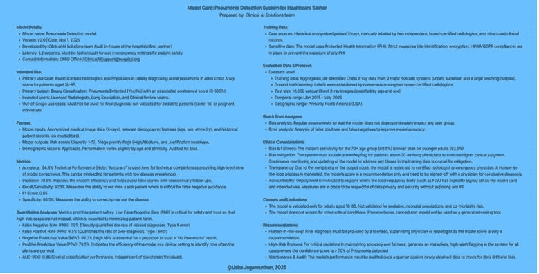

# 第十三章：实施 RAI 框架、指标和最佳实践

前一章阐述了理解**负责任 AI**（**RAI**）原则和重要性的基本基础。然而，将这些指导理念转化为具体实践需要一种结构化和深思熟虑的方法。本章作为实施 RAI 的实用路线图，将超越理论讨论，提供可操作的战略和工具，供组织在 AI 生命周期中实施。有效地嵌入伦理考量不是一种被动的愿望，而是一个需要建立明确框架、应用相关指标和采用经过验证的最佳实践的主动过程。

本章将指导您了解道德 AI 实施策略的基本组成部分。我们将从探讨道德 AI 治理的各种框架开始，例如建立专门的 RAI 治理委员会和利用道德风险评估清单。这些框架为监督和风险缓解提供了基础结构（Mucci & Stryker, 2024）。在此基础上，我们将深入研究具体的道德治理结构和流程，包括成立 AI 伦理委员会和至关重要的常规偏见审计实践，这促进了持续的警惕和问责制。

认识到 AI 系统并非完美无缺，本章还将探讨**人机交互**（**HITL**）方法的战略整合。我们将探讨在伦理考量至关重要、需要细微判断的高风险决策场景中，如何有效地融入人类监督。此外，为了超越定性评估，我们将介绍量化 RAI 的关键指标，包括公平性、可解释性、鲁棒性、隐私性和安全性。这些指标为评估和跟踪向更完善的 RAI 系统迈进提供了具体的方法。

最后，本章将概述实施 RAI 的基本最佳实践，包括数据匿名化技术、包容性数据集编目策略以及全面模型文档和透明度的关键重要性。通过采用这些实践，组织可以积极地将道德考量融入其 AI 开发和部署的工作流程。为了说明这些概念的实际应用，一个真实世界的案例研究将详细描述一家公司在建立和执行全面 RAI 计划过程中的旅程，突出所采取的步骤和取得的实际成果。

将要涵盖的关键主题包括以下内容：

+   道德 AI 治理框架

+   全球背景下的合规性

+   人机交互方法

+   RAI 指标

+   实施 RAI 的最佳实践

+   RAI 在现实世界中的应用

到本章结束时，你将具备从理解 RAI 的“为什么”到有效实施“如何做”的知识和实践指导，这将有助于建立对 AI 系统的信任，并为它们在商业和社会中的可持续和道德整合铺平道路。

# 道德 AI 治理框架

寻求实施 RAI（责任人工智能）的组织需要强大的治理框架。这些框架提供了确保道德考量在整个 AI 生命周期中得以整合的基本结构和指导原则，从构思和开发到部署和持续监控。建立清晰的职责线、记录的过程和监督机制对于构建可信赖和可持续的人工智能系统至关重要。本节介绍了组织可以采用以建立有效的道德 AI 治理的几个关键框架和组件。

道德 AI 治理的一个基本要素是建立 RAI 治理委员会。这些委员会通常由具有不同专业知识的个人组成，包括 AI 开发者、伦理学家、法律顾问、商业利益相关者和相关用户组的代表。RAI 治理委员会（组织的战略政策制定和监督机构）的主要作用是从道德角度提供关于 AI 开发和部署所有方面的指导。

他们的职责可能包括以下内容：

+   **定义道德指南和政策**：建立明确的原则和规则，以规范组织内部人工智能的开发和使用

+   **审查 AI 项目提案**：在开发开始之前评估新 AI 倡议的潜在道德影响

+   **评估模型设计和架构**：确保道德考量嵌入到人工智能系统的技术设计中

+   **监控模型性能和影响**：持续跟踪部署的人工智能系统的实际效果，以识别潜在的道德问题，包括偏差和公平性问题

+   **提供缓解和补救建议**：识别和提出任何道德风险或危害的纠正措施

+   **维护** **遵守法规和标准**：了解并遵守相关的法律和道德指南

RAI 治理委员会为所有 AI 活动提供必要的政策监督和战略方向。他们的主要职责包括建立道德阈值（例如，最大允许偏差）、审查和批准系统卡片，以及决定对在道德风险评估中确定的高风险模型采取的缓解策略。

关键的是，尽管委员会建立监控要求和审查结果，但它通常不参与日常模型性能监控。这项运营责任落在**机器学习操作** ( **MLOps** ) 团队和数据科学家身上，他们使用自动化工具（在*RAI 度量*部分稍后介绍）来持续跟踪模型性能、数据漂移和公平性指标，这些指标由委员会设定。

## 伦理风险评估清单：量化风险

另一个关键框架组件是实施伦理风险评估清单。这些清单在整个 AI 生命周期中操作化地识别潜在伦理风险。通过提示开发者和利益相关者考虑一系列伦理维度，这些清单有助于主动解决潜在的危害。

在伦理风险评估清单中，风险严重程度评分是用于优先考虑缓解努力的临界计算。确定风险评分的公式如下：

**风险评分** = **可能性** ( **L** ) * **影响** ( **I** )

**可能性** ( **L** ) 评估发生伤害的概率（例如，1=罕见，5=几乎肯定），而**影响** ( **I** ) 评估伤害的程度（例如，1=轻微，5=灾难性）。这种明确的量化允许 RAI 治理委员会将资源集中在得分最高的风险上。

我们现在将通过一个具体的风险评估示例。

考虑一下在*第十二章*中讨论的医疗 AI 诊断系统。一个已识别的风险可能是：“算法偏差导致少数族裔患者群体误诊”：

+   **可能性**：4（高 - 如果已知训练数据不平衡）

+   **影响**：5（灾难性 - 导致患者伤害，法律行动）

+   **风险评分**：4*5=20（高优先级）

所需的缓解计划将要求立即采取行动，例如使用平衡数据重新训练模型，并强制对所有受影响的群体结果进行 HITL 审查。

常见于伦理风险评估清单中的元素可能涉及以下相关问题：

+   **数据偏差**：训练数据是否反映了目标用户群体？数据中是否存在可能导致不公平结果的已知限制或偏差？

+   **模型架构偏差**：所选模型架构或设计复杂性是否适合任务，或者它是否本质上会导致某些场景中的系统性低估或高估？

+   **性能缓解**：如果模型的输出持续存在缺陷（例如，需求预测不足），是否存在明确的人类审查员可以覆盖预测的操作程序，并且该过程是否得到记录？

+   **模型可解释性和透明度**：人工智能系统的决策过程对最终用户（例如，医生或企业领导者）来说是否易于理解？是否有模型卡片和系统卡片来记录设计和限制？

+   **系统可靠性和安全性**：潜在的故障模式是什么？是否有明确的 HITL 安全措施来防止灾难性或有害的输出？

+   **问责制和责任**：是否有明确的审计系统决策的程序？如果人工智能造成伤害或发布错误决策，谁将明确负责？

+   **提示注入风险**：对于生成式人工智能模型（LLMs），系统是否已针对提示注入和其他可能导致人工智能违反其安全对齐或泄露敏感信息的对抗性攻击进行过测试？

+   **隐私和数据安全**：个人数据是否按照隐私法规进行处理？是否有匿名化和强大的安全措施来防止数据泄露？

+   **潜在的危害和滥用**：人工智能系统的潜在负面后果或意外用途是什么？有什么安全措施可以防止危害？

+   **公平性和公正性**：人工智能系统是否公平地对待所有个人和群体？是否考虑并评估了公平性指标？

+   **包容性和可访问性**：在设计和应用人工智能系统时是否考虑了不同用户群体的需求？它是否对所有预期用户都易于访问？

通过整合如 RAI 治理委员会等框架，并利用如道德风险评估清单等工具，组织可以建立一种积极主动和系统的道德人工智能治理方法，超越临时考虑，将责任嵌入其人工智能倡议的核心。这种结构化方法不仅降低了潜在风险，而且增强了利益相关者和更广泛公众对人工智能系统的信任。

除了这些总体框架之外，建立稳健的道德治理还涉及特定的结构和实践。道德治理结构至关重要，因为它们包括建立人工智能伦理委员会、定期审查人工智能项目以及明确人工智能结果的责任。此外，实施日志记录和监控机制为人工智能系统行为提供了必要的可见性，允许检测潜在的道德问题。维护全面的文档，包括数据来源、模型开发过程和决策逻辑，对于问责制、可审计性和可追溯性至关重要。同样，使用数据版本控制进行模型开发有助于建立可重复性和跟踪变化的能力，这对于理解和解决可能随时间出现的任何道德问题至关重要。这些实践，以及更广泛的治理框架，是实现人工智能系统中问责制、可审计性、可追溯性和透明度的关键步骤。

## 实施透明度：模型和系统卡片

模型卡片和系统卡片是至关重要的文档工具，它们将抽象的伦理原则转化为 AI 生命周期中的实际检查，实现了透明度和问责制的原则。

### 模型卡片：模型的文档

模型卡片是一个结构化文档，提供了 ML 模型的关键技术背景和性能细节。它是为数据科学家、开发人员和审计员设计的“营养成分标签”：

+   **关键内容**：模型细节、预期用途、训练数据描述（包括已知的偏差）、技术性能指标（特别是跨人口群体的公平性指标）以及伦理考量（潜在风险）

+   **目的**：在部署前提供技术透明度，详细说明模型的局限性，作为系统卡片的主要输入

图 13.1：高风险医疗诊断系统模型卡片模板概述

这里展示的肺炎检测模型 v2.0 模型卡片纯粹作为一个示例模板和 RAI 最佳实践的指南。提供的结果、指标和人口统计数据是假设性的，旨在说明在医疗保健领域高风险应用中必要的详细程度。具体来说，技术术语的转换和双重标签（例如，召回率/灵敏度）是将标准机器学习术语与既定的临床诊断标准对齐的最佳实践。本文件不是真实的监管文件，应仅用于教育和参考目的。

### 系统卡片：部署的文档

系统卡片是一个综合性的文档，详细说明了整个 AI 解决方案，包括 ML 模型、数据管道、人工监督流程和治理政策。它是为业务所有者和法律团队准备的“用户手册”和“治理计划”：

+   **关键内容**：系统概述（模型如何集成到业务流程中）、风险评估摘要、操作程序（谁监控系统和 HITL 过程）、系统维护计划和合规性状态

+   **目的**：为了满足问责制需求，概述完整 AI 系统的预期用途、操作风险以及业务所有者的明确责任线

#### 在生命周期中的集成

这些卡片的操作功能是作为强制性的关卡检查。模型卡片和系统卡片在系统投入生产之前，必须由 RAI 治理委员会审查和批准，以验证透明度和问责制是非协商的关卡在开发生命周期中。

虽然道德人工智能治理框架为负责任的创新建立了内部基础，但它们必须在更广泛的法律法规生态系统内运作。在下一节中，我们将探讨全球范围内的法规合规性。

# 全球范围内的法规合规性

有效的 AI 治理需要遵守多层合规结构，包括外部政府命令和内部企业标准。这是一个关键的操作挑战，因为法规在不同司法管辖区高度碎片化且持续演变。以下是不同法规的概述：

+   **全球法规框架**：组织必须警惕遵守新兴的、影响巨大的法规，例如欧盟 AI 法案（该法案为 AI 部署建立基于风险的方法）、**通用数据保护条例**（**GDPR**）（该条例对所有 AI 系统的数据处理产生重大影响），以及各种美国州和联邦指南。合规通常需要维护严格的数据来源记录并实施区域部署政策。

+   **公司特定法规（内部政策）**：除了外部法律外，许多组织还制定了严格的内部行为准则、RAI 政策和数据使用标准。这些政策通常设定了比法律最低标准更高的道德标准，反映了公司的具体价值观和对品牌声誉的承诺。法律和合规团队负责将这些内部和外部要求转化为 AI 开发团队必须遵循的可操作技术要求。

+   **文档的作用**：系统卡片等工具成为至关重要的合规资产。它们记录了模型的设计、风险缓解措施以及针对特定法规要求的合规状态，为审计师和监管机构提供了清晰的尽职调查证据。

随着组织在全球和内部合规要求的复杂网络中导航，保持透明度、问责制和可追溯性变得至关重要。然而，即使是最全面的治理框架也依赖于人类判断来指导负责任的实施和监督。下一节将探讨如何通过整合人机交互方法来加强法规合规性与道德人工智能实践之间的联系。

# 人机交互方法

HITL 方法将人类判断整合到 AI 决策过程中。在项目的每个阶段以及持续监控和集成过程中，AI 系统都应由人类专业知识指导，而不是仅仅自动化。HITL 方法在高风险决策中尤为重要，其中人类监督可以帮助降低风险并产生用户可以信赖的道德、负责任的结果。一些例子包括在医疗诊断、金融服务和自动驾驶汽车中使用 HITL。

虽然许多 AI 系统的目标是自动化，但通过 HITL 方法整合人类判断对于实现道德、负责任和可靠的成果至关重要，尤其是在复杂或高风险场景中。HITL 策略性地在 AI 生命周期的各个阶段融入人类专业知识，确保 AI 系统不仅具有自主性，而且受到人类理解、价值观和伦理考量的指导和验证。

例如，在缓解偏差审计中识别出的风险时，人类作为安全措施的角色至关重要。当面临模型架构偏差（如伦理风险评估清单中提到的：量化风险），例如一个系统性地低估风险的模型时，这一角色至关重要。在这些情况下，人类审查员的主要职责是覆盖有偏差的低风险预测，以防止系统性伤害，从而纠正模型在运营环境中的架构缺陷。本节探讨了 HITL 如何有效实施。

这里是 HITL 的关键阶段和应用：

1.  **数据收集和标注**：人类在维护用于训练 AI 模型的数据的质量、准确性和公平性方面发挥着至关重要的作用。这包括以下方面：

    +   **数据标注和注释**：人类专家为训练数据提供准确标签和注释，特别是在需要细微解释的复杂任务中，如医学图像分析或自然语言理解。

    +   **数据验证和质量控制**：人类审查和验证 AI 标记的数据，以识别和纠正错误，确保模型从可靠的信息中学习，并减轻在标记过程中引入的潜在偏差。

    +   **数据中的偏差检测和缓解**：人类监督对于识别数据集中嵌入的潜在偏差至关重要，这些偏差可能对自动化系统不明显。这涉及分析数据分布，并理解可能导致不公平表示的社会和历史背景。

1.  **模型开发和评估**：人类专业知识在指导 AI 模型的设计和评估性能方面非常有价值，尤其是在伦理方面：

    +   **特征工程和选择**：领域专家可以提供见解，确定哪些特征对模型来说最相关且符合伦理，从而帮助避免使用受保护属性的代理。

    +   **模型审查和批准**：伦理委员会或领域专家可以审查模型的架构、训练过程和评估指标，以确保与伦理指南一致，并在部署前识别潜在风险。

    +   **对抗攻击测试和鲁棒性评估**：人类可以设计和监督测试来评估模型对对抗性输入的韧性，确认模型在意外条件下不会产生有害或不可靠的结果。

1.  **模型部署和监控**：持续的人类监督对于验证人工智能系统按预期运行并在实际应用中不会导致意外的负面后果至关重要：

    +   **异常处理和干预**：当人工智能系统遇到边缘案例或模糊情况或做出不确定预测时，HITL 允许人类干预以做出最终决定或指导人工智能的反应。这在自动驾驶汽车或医疗诊断等安全关键应用中尤为重要。

    +   **实时监控和异常检测**：人类分析师可以监控人工智能系统的性能和日志，以寻找可能表明伦理违规、偏差放大或系统故障的不寻常行为或意外结果。

    +   **审计和可解释性审查**：人类可以审查**可解释人工智能**（**XAI**）技术提供的解释，以验证其准确性、可理解性和伦理性。这有助于建立信任并促进问责制。

1.  **高风险决策**：在人工智能决策对个人或社会产生重大影响的情况下，人机交互（HITL）通常是不可或缺的：

    +   **医疗诊断和治疗建议**：虽然人工智能可以提供有价值的见解，但人类医生仍保留最终决策权，考虑到患者的整体情况和伦理考量

    +   **金融服务（贷款批准和风险评估）**：人类贷款官员或风险分析师可以审查由人工智能驱动的建议，特别是在边缘群体或复杂案件中，以促进公平并防止算法偏差

    +   **刑事司法（判决和假释）**：虽然人工智能可能在风险评估中提供帮助，但最终的决定必须由人类法官和假释委员会根据法律和伦理原则做出

    +   **自主武器系统（如果部署）**：围绕自主武器伦理的辩论强烈强调对致命力量决策进行人类控制的必要性

1.  **有效实施 HITL**：成功实施 HITL 需要仔细考虑以下因素：

    +   **明确角色和责任**：规定何时以及如何进行人类干预，以及谁负责监督

    +   **设计用户友好的界面**：为人类审阅者提供直观的工具和信息，以便他们理解人工智能输出并做出明智的决定

    +   **建立升级程序**：明确界定将复杂或伦理敏感案件升级到人类专家处理的明确途径

    +   **提供充分的培训**：验证人类审阅者是否具备必要的领域专业知识以及对人工智能系统的理解

    +   **持续评估和改进 HITL 流程**：定期评估 HITL 工作流程的有效性，并根据需要做出调整

通过战略性地将人类智能和伦理判断整合到 AI 生命周期中，HITL 方法可以显著增强 AI 系统的责任感、可靠性和可信度，尤其是在具有重大社会影响的应用中。

然而，让我们也讨论一下 HITL 方法（Human-in-the-Loop）的成本和权衡。虽然对于高风险领域非常有效，但实施 HITL 系统涉及一个关键的权衡。组织必须考虑到人力成本的增加、决策过程中可能出现的延迟增加以及人类疲劳或偏见可能压倒正确 AI 推荐的风险。因此，HITL 必须战略性地部署，专注于高风险、高影响的决定，在这些决定中，降低伦理和财务风险足以证明运营成本。

# RAI 的指标

RAI 管理委员会建立了要求性能监控的政策。然而，有效的监控依赖于可衡量的数据。因此，将 RAI 运营化的下一个关键步骤是定义和监控一套全面的 RAI 指标，这些指标允许 AIOps 团队持续跟踪模型性能与委员会设定的标准之间的差异。

虽然 RAI 管理委员会专注于政策监督和战略审查，但日常模型性能监控的执行则落在 AIOps 团队和数据科学家身上。这些团队使用自动化工具持续跟踪数据漂移、公平性指标以及与委员会设定的标准相比的整体模型性能。

为 RAI 优化机器学习模型需要使用各种指标进行全面的评估，这些指标量化了与伦理原则的一致性。关键指标包括以下内容：

+   **准确性和精确度（量化性能）**：这些是评估模型性能的基本指标；例如，在医疗保健领域，高准确性和精确度对于诊断疾病至关重要。

+   **公平性指标（量化公平性）**：这些指标对于防止歧视和促进公平待遇至关重要。例如，**统计差异差异**（**SPD**）、差异影响和机会差异等指标有助于确保招聘算法和贷款审批系统的公平性。

+   **可解释性指标（量化透明度）**：这些指标有助于增强对模型决策的理解并建立信任。例如，LIME 和 SHAP 等工具，以及反事实分析，可以提供对模型预测的见解，帮助解释如金融服务领域的信用评分决策。

+   **问责制指标（量化问责制）**：这些包括治理和监督的可衡量方面，如影响评估的频率和彻底性、定期审计、AI 结果的职责分配的清晰度，以及针对识别出的伦理违规行为的记录响应。例如，在自动驾驶汽车中，安全事件审查和更新的记录过程作为问责制指标。

+   **隐私指标（量化隐私）**：确保模型的输出不会泄露敏感的 PII（个人身份信息）。差分隐私，通常通过“隐私预算”来量化，在医疗保健中保护患者数据，同时允许获得有价值的见解。

+   **安全性指标（量化安全性）**：这些指标有助于进行可靠性和安全性评估，以最大限度地减少潜在损害。例如，故障之间的平均时间、在安全性评估中确定的潜在故障模式的严重性，以及实施的安全机制的有效性。在工业自动化等领域，安全性是最重要的关注点，指标评估确保 AI 系统不会造成伤害。

+   **鲁棒性指标（量化可靠性和安全性）**：这些指标评估模型在各种条件下的稳定性和可靠性，包括噪声数据、对抗性攻击和分布变化。例如，模型在扰动数据集上的准确性或对特定对抗性攻击的韧性。

通过将这些指标整合到评估过程中，数据科学家和 AI 从业者可以自信地说，他们的模型不仅优化了性能，而且明显符合伦理标准和社会主义核心价值观。

# 实施 RAI 的最佳实践

实施 RAI 不是一个一次性任务，而是一项持续承诺，需要将伦理考量深深嵌入到 AI 开发和部署的框架中。以下扩展的最佳实践为努力构建道德、透明和负责任的 AI 系统的组织提供了更细致的指南。

## 战略治理和政策

如我们所知，有效地嵌入 RAI（责任、透明度和可解释性）始于战略层面，需要来自执行领导的明确授权。基础的最佳实践是建立 RAI 治理委员会。这个跨职能机构定义了组织的伦理原则，并设定了风险和偏差的不可协商阈值。每个 AI 项目都必须从全面的伦理风险评估清单开始，其中潜在的损害通过风险评分（可能性 * 影响）进行量化。这一初步步骤确保在编写任何代码之前，资源立即优先分配给高风险系统（如我们的医疗诊断模型）。

### 关键要点：战略和治理

让我们看看获得的关键见解：

+   **执行命令**：确立 RAI 是从上到下推动的，被视为一项商业必要性，而不仅仅是合规职能

+   **建立监督**：正式成立 RAI 治理委员会，以定义政策和审查高风险部署

+   **量化风险**：使用道德风险评估清单来量化风险（可能性 * 影响）并根据产生的风险评分优先考虑缓解措施

+   **多司法管辖区合规**：积极将全球法律（例如，欧盟 AI 法案、GDPR、CCPA 和 HIPAA）和内部道德规范翻译成清晰的技术要求，供开发者使用

## 设计即伦理

开发生命周期中的最佳实践要求采用设计即伦理的方法。这意味着道德考虑因素应融入系统设计，而不是事后改造。开发者必须严格审计训练数据中的偏差并评估模型架构本身，以确保设计不会产生系统性错误（例如，持续的低预测）。透明度通过文档化来实现。模型卡是技术细节的强制性要求，系统卡（或 AI 代理卡）是操作和治理细节的强制性要求。RAI 治理委员会对这两张卡的批准作为部署关卡检查。

### 关键要点：开发和文档

以下是关键见解：

+   **嵌入设计检查**：不仅审计数据，还要审计模型架构本身以识别系统性偏差的来源

+   **强制性文档**：在开发流程中实施模型卡（用于技术透明度）和系统卡（用于运营问责制）作为不可协商的步骤

+   **关卡检查**：将 RAI 治理委员会对模型和系统卡的批准作为生产部署的强制关卡

+   **防范 LLM 威胁**：对于 GenAI，作为系统设计的一部分，实施针对提示注入和其他对抗性攻击的具体防御措施

## 运营监控和追索

一旦部署，最佳实践侧重于持续的、现实世界的警惕。这属于 AIOps 团队的领域。监控必须超越简单的业务指标，以跟踪全面的 RAI 指标，如 SPD 和其他公平性措施。高风险系统需要强大的 HITL 协议，例如使用人类作为最终保障来覆盖有偏见或不安全的 AI 决策。一项最终要求是明确的、功能性的用户追索机制，允许受影响的个人上诉决策或报告伤害。

### 关键要点：监控和追索

这里是关键要点：

+   **持续监控**：将日常监督责任转移到 AIOps 团队，以持续跟踪技术、伦理和公平性指标

+   **战略 HITL**：有策略地使用 HITL 系统，优先考虑高风险领域（如医学诊断），在这些领域，人力成本的降低可以证明减少伤害是合理的

+   **追索机制**：为用户建立一个明确、易于访问且及时的过程，以便他们报告伤害、寻求解释并请求追索或上诉自动化决策

## 文化融合

最可持续的最佳实践是将 RAI 融入组织的 DNA 中。这需要高层领导不断强化“高层基调”，表明道德行为与利润同样受到重视。对于工程师学习公平性指标和法务团队理解模型限制而言，跨职能培训是强制性的。最终，成功是由一种优先考虑主动责任而非被动合规的文化来定义的，使每位员工都成为 RAI 框架的积极参与者。

### 关键要点：文化融合

+   **领导层支持**：保证执行团队积极倡导 RAI，将道德表现与职业发展和资源分配联系起来。

+   **普遍培训**：在所有部门（法律、开发和产品）实施强制性的、角色特定的培训，以培养对风险和责任的共同理解。

+   **问责制**：明确、不重叠的问责界限，以便每个利益相关者（从开发者到产品负责人）都能了解他们在 AI 生命周期中的具体道德责任。

通过实施这些可操作的最佳实践，组织可以超越愿望目标，构建真正符合 RAI 的系统，这些系统在实践中是道德的、透明的和可问责的。我们需要记住，这是一个持续的过程，需要持续的学习、适应和组织各层面的坚定承诺。

# RAI 的实际应用

RAI 正在应用于各个行业垂直领域，展示了其推动道德和有效结果潜力。在医疗保健领域，AI 系统用于疾病诊断和治疗建议，在保护患者隐私和公平性方面给予最高重视，通过强大的道德治理结构。

金融服务业利用 AI 进行欺诈检测和反洗钱，整合 HITL 方法以增强决策能力和保持问责制。

在零售领域，AI 模型预测客户流失并个性化营销策略，同时遵守透明度和公平性原则。监控系统利用 AI 进行安全和监控，持续监控和改进以防止偏见并维护道德标准。

在冲突矿产的背景下，智能手机制造公司实施了严格的道德采购实践，以确保其产品中使用的矿产不会资助武装冲突、童工或人权侵犯。这种方法可以扩展到 AI 采购，其中道德采购保障 AI 系统得到负责任地开发和部署，考虑到涉及的材料和过程的环境和社会影响。

在教育领域，AI 通过个性化教育内容、自动化行政任务以及为学生提供多样化需求的支持，正在改变学习体验。由 AI 驱动的工具，如智能辅导系统和自适应学习平台，在保持公平性、包容性和对所有用户的可访问性的同时，增强了教育过程。

在执法领域，AI 用于犯罪分析、人脸识别和预测性执法，帮助执法机构更有效地分配资源并提高公共安全。然而，验证这些 AI 应用是否透明、无偏见并尊重个人隐私权至关重要。

在制造业中，AI 用于预测性维护、质量控制以及供应链优化。RAI 实践确保这些应用透明、公平且负责任，降低运营风险并提高效率。通过整合伦理指南，制造商可以在保持高伦理标准的同时提高生产力。

## 伦理治理结构的现实世界例子

为了说明组织在处理 AI 伦理治理的多样性方式，以下提供了一些供考虑的例子。

### **示例 1：Meta - 一家特定公司对 LLM 安全性和伦理治理的方法**

Meta 通过一个多层次的系统来处理 AI 伦理问题，而不是一个单一的委员会，整合以下方面：

+   **内部团队**：专门的 RAI 团队跨职能合作，在整个 AI 生命周期中解决公平性、透明度、责任和安全性问题，采用基于风险的方法

+   **外部监督**：监督委员会审查涉及 AI 的内容审查决策，Meta 与外部专家和公众合作，以获得多样化的观点

+   **关键原则**：Meta 在其 AI 开发和部署中强调透明度（例如，开源）、问责制、公平性、隐私保护以及分层安全方法（例如，Llama Guard）

这种结构结合了内部责任、外部输入和核心伦理原则，以指导 Meta 的 AI 实践。

Meta 的 AI 伦理治理的一个关键方面是其对 LLM 开发中安全性的处理方法，这通过分层策略实施：

+   **模型级安全**：在数据准备和模型训练期间解决安全性问题

+   **系统级安全**：在输入和输出阶段实施保障措施，利用 Llama Guard 4 等工具进行内容过滤

+   **透明度和报告**：努力提供透明度并建立持续安全改进的反馈机制

这种多层次的方法是它们更广泛的伦理治理框架的核心组成部分，旨在在整个 LLM 生命周期中降低风险。查看 Meta AI 的*负责任使用指南*（[`ai.meta.com/static-resource/responsible-use-guide/`](https://ai.meta.com/static-resource/responsible-use-guide/)）以及他们关于 LLM 开发的公开博客文章（例如，Llama 3.2 安全性评估）。

### 示例 2：一家主要的企业软件提供商——为组织建立人工智能伦理文化

除了对安全性的关键关注，尤其是在 LLMs 中，建立强大的 AI 伦理文化还涵盖更广泛的伦理原则。为了建立一个可持续的 AI 伦理文化，公司必须超越政策，将伦理考量融入日常工程实践中。

该提供商通过将 RAI 视为核心产品功能，而不仅仅是合规义务的例子来体现这一点。他们成立了**Aether 委员会**（代表**AI 和工程研究中的伦理**），以向领导层提供建议并推动创新。关键的是，他们开发和执行了 RAI 标准，将他们的六个核心 RAI 原则（公平性、可靠性及安全性、隐私和安全、包容性、透明度和问责制）转化为公司每个 AI 项目的可操作要求和工具。这清楚地表明，责任由构建技术的团队承担。

根据麻省理工学院的斯隆管理学院，建立强大的 AI 伦理文化涉及几个关键要素：

+   **领导层的承诺**：高级领导层的坚定支持和明显承诺对于在所有 AI 项目中优先考虑伦理考量至关重要

+   **明确的伦理指导原则**：开发和传达清晰的原理和指导方针，用于人工智能的开发和部署，解决公平性、隐私和问责制等问题，以及安全性

+   **教育和培训**：为员工提供全面的 AI 伦理和 RAI 实践培训，培养对伦理责任的共同理解

+   **跨职能协作**：促进技术团队、伦理学家、法律专家和其他利益相关者之间的协作，以最大化在伦理决策中考虑不同观点

+   **透明度和问责制**：在 AI 决策过程中建立透明度和问责机制，使审查和纠正成为可能

+   **持续监控和评估**：定期监控和评估 AI 系统的伦理影响，并根据需要做出调整，适应不断发展的伦理标准和公众期望

### 示例 3：联合利华——一个结构化和可操作性的伦理治理流程

联合利华在实施 AI 伦理方面的旅程包括一个结构化的伦理治理方法：

+   **建立 AI 伦理委员会**：一个跨职能团队，负责制定伦理准则和审查 AI 项目，提供监督和指导

+   **制定 AI 伦理框架**：一个结构化的框架，用于评估 AI 应用的伦理风险和影响，促进对伦理考量的系统评估

+   **实施伦理风险评估**：对每个 AI 项目进行彻底的风险评估，考虑因素包括公平性、透明度和问责制，以及安全性

+   **培训和意识提升计划**：教育员工了解 AI 伦理和 RAI 实践，建立伦理意识和能力

+   **监控和报告**：持续监控 AI 系统的性能和影响，并报告伦理考量，促进问责制和持续改进

您可以在《麻省理工学院斯隆管理评论》上发表的文章中了解更多关于联合利华的 AI 保证流程信息，*《联合利华的 AI 伦理：从政策到流程》* ([`sloanreview.mit.edu/article/ai-ethics-at-unilever-from-policy-to-process/)`](https://sloanreview.mit.edu/article/ai-ethics-at-unilever-from-policy-to-process/))

## 示例 4：深度伪造声音模仿和金融欺诈 – 治理结构在主动风险评估中的失败

本案例研究展示了治理结构未能强制执行和执行针对 AI 生成合成媒体（深度伪造）滥用的风险评估的高成本：

+   **失败背景**：一位高级管理人员的深度伪造音频被用于授权从金融机构进行欺诈性电汇，绕过了标准的口头安全检查。合成媒体是使用现成的 AI 工具和公开来源的该管理人员音频生成的。

+   **治理失败**：失败导致违反了金融法规（数字身份中的安全/欺诈和 KYC/AML 失败），并且没有建立稳健的内部安全政策。由于未能评估和减轻与合成媒体相关的风险（使用第三方 AI 的供应链风险），这种暴露代表了重大的责任。

以下是从 RAI 治理中吸取的教训（附带可操作方案）：

+   **未能评估新的威胁**：治理结构没有要求对身份验证方法进行审计，以应对现代合成媒体威胁，违反了主动风险评估的原则。（可操作方案：强制进行合成媒体风险评估（SMRA）以验证身份验证系统）

+   **缺乏新的安全措施**：治理机构未能实施政策以更新安全协议，以应对易于获取的深度伪造技术的进步。（可操作方案：强制执行多模态身份验证并实施实时声学分析以检测声音深度伪造）

+   **供应链监管不足**：未能控制输入（公开可用的音频）和潜在输出（伪造指令）表明在数字供应链风险管理方面存在疏漏。（可操作方案：为深度伪造事件建立明确的危机沟通协议）

最终，金融机构承担了损失，突显了与新的 AI 威胁相关的道德失败和治理缺口会导致严重的财务和声誉成本。

这些例子表明，构建道德的 AI 系统需要多方面的方法。虽然安全性至关重要，尤其是在像 LLM 这样的强大技术背景下，一个全面的道德治理框架还涵盖了更广泛的原则、组织文化和结构化流程。

在其跨领域的 RAI 基础承诺之上，InnovAIte LLC 在实施道德治理结构方面取得了显著进展。最初专注于其医疗 AI 系统，公司认识到需要可扩展的治理实践，并成立了一个 AI 伦理委员会，进行了影响评估，定期进行了偏差审计，并保持了全面的文档记录。他们使用数据版本控制进行模型开发，并记录了数据溯源和转换，以促进所有 AI 项目的问责制和可重复性。政策制定者提供了关于医疗保健中 AI 道德使用的指南，确认 InnovAIte LLC 的系统符合相关法规。最后一公里供应商打包并部署了 AI 系统，实施了安全机制并定期进行审计。最终用户提供了反馈，进一步提高了系统的可靠性和道德性。

通过整合 HITL 方法并使用 RAI 的指标，InnovAIte LLC 不仅巩固了其医疗 AI 的可信度，还开发了一个适用于其扩展 AI 项目的治理框架。这种积极主动的方法促进了信任，降低了风险，并支持了创新，随着 InnovAIte LLC 成长为领先的 AI 驱动型企业。

# 摘要

在本章中，我们探讨了实施 RAI 框架的关键要素。我们讨论了建立稳健的伦理治理结构、采用 HITL 方法进行监督以及利用综合指标评估 AI 模型的重要性。通过优先考虑这些要素并在 AI 开发生命周期中整合 RAI 最佳实践，企业可以确保他们的 AI 系统不仅优化了性能，而且与伦理标准和社会主义核心价值观保持一致。虽然 InnovAIte LLC 的假设性例子有助于说明伦理治理结构的设置，但现实世界的例子提供了关键的实际经验教训：这些包括像 Meta 对 LLM 安全性的方法这样的成功流程实施，以及联合利华的结构化伦理流程，以及一个主要企业软件提供商对文化关注的稳健组织变革，以及从与深度伪造声音模仿和金融欺诈相关的治理失败中汲取的关键警告。

在本章讨论的基础原则和治理结构的基础上，下一章深入探讨了开发可信赖的 LLM 所必需的具体伦理考虑和实践。随着 LLM 能力的增强和潜在影响，对它们独特的伦理挑战和建立信任的策略进行专注的审查至关重要。

加入我们，在下一章中探索关键方面，例如偏见缓解、透明度、可解释性和 AI 系统的稳健安全机制。

|

# 获取本书的 PDF 版本和独家额外内容

扫描二维码（或访问[packtpub.com/unlock](https://www.packtpub.com/unlock)）。通过书名搜索本书，确认版本，然后按照页面上的步骤操作。 |  |

| *注意：请妥善保管您的发票。直接从 Packt 购买不需要* *发票。* |
| --- |
