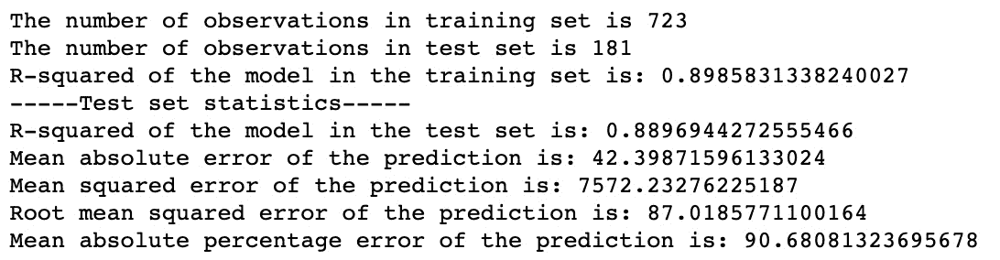
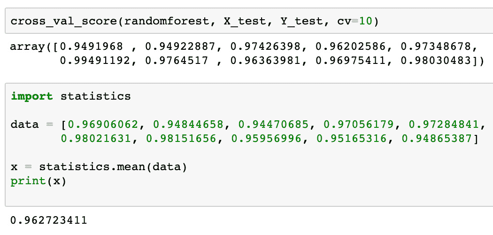
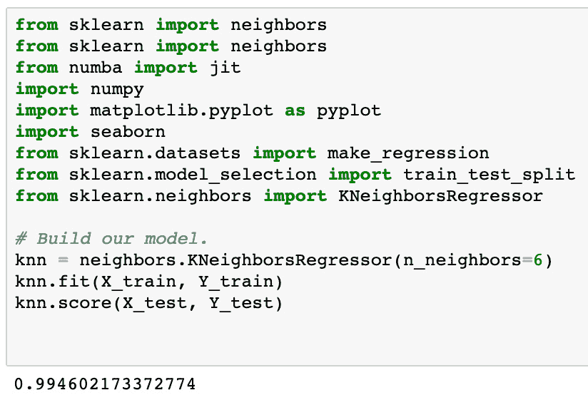

# 第二章：AI 产品的模型开发与维护

在本章中，我们将探讨模型开发的细微差别，从线性回归到深度学习神经网络模型。我们将涵盖可用于使用的各种模型以及维护这些模型所涉及的内容，从它们的开发和训练到它们的部署和最终测试。这将是一个基本概述，以理解产品经理可以从支持其产品的工程和运维团队中期待的模型维护的端到端过程。

将任何新产品推向市场涉及许多工作。如果您是产品经理已经有一段时间了，您可能对**新产品开发**（**NPD**）流程或步骤已经很熟悉了。作为本章的前奏部分，特别是那些对 NPD 流程不熟悉的人，我们将在本章的第一部分总结每个步骤。总的来说，本章将涵盖以下主题：

+   理解 NPD 的各个阶段

+   模型类型 – 从线性回归到神经网络

+   培训 – 模型何时准备好上市？

+   部署 – 工作站之后发生了什么？

+   测试和故障排除

+   刷新 – 我们更新模型的伦理问题

# 理解 NPD 的各个阶段

在本节中，我们将涵盖 NPD 周期的各个阶段，特别是与 AI/ML 产品的出现相关的部分。在每个阶段，我们将从构思阶段开始，讨论您在市场上需要解决的需求以及为什么需要通过 AI 来增强该需求的主要基础领域。在定义阶段，您为产品需求提供支持。在设计阶段，您为最终产品引入活跃的视觉和体验元素。在实施阶段，您开始构建它。在市场推广阶段，您为广泛的受众打造产品信息。在培训阶段，您测试产品并确保其按预期使用。最后，在发布阶段，您向更广泛的受众发布产品以获取反馈。让我们在以下部分更详细地了解这些阶段。

## 第 1 步 – 探索

在这个阶段，你正在进行创意构思。你需要明确你要解决的特定问题，并且在**机器学习**（**ML**）产品的背景下，这一阶段的关键部分是理解你为什么要用机器学习来解决这个特定问题。借用西蒙·西内克（Simon Sinek）在其畅销书《找到你的“为什么”》中的一句话([`simonsinek.com/books/find-your-why/`](https://simonsinek.com/books/find-your-why/))，这就是你“找到你的为什么”的时刻。这个阶段，你会思考问题的根本原因，并力求找出问题中最紧迫的部分，以便日后可以解决未满足的需求或服务不足的客户。

这需要收集关于客户所面临的特定问题的定性和定量反馈，这些问题是你希望解决的。这里最大的重点是创造力——头脑风暴潜在的解决方案，然后你可以在后续分析并进一步探索（或舍弃）这些方案。

## 步骤 2 – 定义

第二阶段完全是关于定义你的**最小可行产品**（**MVP**）。你已经收集了第一步中关于问题和潜在解决方案的所有反馈，但现在你实际上是根据这些想法构建一个计划。你得从某个地方开始，对吧？所以，这一步就是筛选你在发现阶段的创意，选择出那个最有可能解决客户最大问题的方案。在这里，所有的创意头脑风暴会经过检验并被分析，以最佳方式理解第一阶段中哪些想法是可行的。你在寻找的是，你需要的最少功能数，以创建一个版本的产品，能够解决你希望服务的客户的主要问题领域——或者假设的问题。

至于你的模型，这也是定义模型性能指标的地方，这些指标将标记出你的模型需要达到的最低性能，以便成为客户的一个良好、可行的选项。记住，这仅仅是你的最小可行产品（MVP）。其思路是，你首先从 MVP 开始，然后通过冲刺或产品开发过程进行迭代，逐步提升产品性能，或者根据客户的需求，随着时间推移增加他们可能偏好或需要的功能。模型性能的工作方式也类似。当你与客户合作时，你将共同完善产品、模型以及这些模型的性能。

## 步骤 3 – 设计

在这一过程中，第一步和第二步是识别您想解决的问题，提出想法，并定义解决该问题所需的最低工作量。现在，在第三步设计阶段，您实际构建出 MVP，并开始拼凑它可能的样子。这一步骤最为注重解决方案的找寻。在这一阶段，您会为产品的用户交互设计制作原型，定义 UI 的外观，以及产品体验如何展开。对于 AI 产品，这也是您开始识别以下章节中提到的哪些模型最适合为您的产品服务的时刻。

这一阶段完全是关于创建 UI/UX 元素的路线图。在这一阶段，您需要邀请一些客户参与解决方案的设计，并且对于 AI 产品，您需要设定一些性能基准和目标，以确保您的模型能够达到这些要求。在设计过程中将性能因素融入其中，并与最终用户管理这些期望，是清晰化概念并及早进行测试的好方法。

## 第 4 步 – 实施

实施阶段是对前三个步骤中所有构思和规划的最终考验。这是一个您将实际努力将所有策略付诸实践的阶段。实质上，这是您第一次冲刺，作为产品经理，您实际上扮演着项目经理的角色，确保最终成果能够满足您最初设定的需求。

这是执行部分，在这一阶段，您实际带入了工程师、机器学习工程师、开发人员、UI/UX 人员和项目经理来创建最小可行产品（MVP），并实现客户和领导层所期望的性能。完成后，您应该得到一个能够按照您的承诺执行的 MVP 版本。只有当您的 MVP 符合规划标准时，您才知道这一阶段成功了。

## 第五步 – 营销

营销始终在这些步骤的背后进行，因为即使*第一步*也与营销密切相关。了解客户的语言、需求和痛点是制定正确信息的关键前提。营销是将您的信息传递给更广泛市场的过程，之所以它是*第五步*，是因为您希望在传递针对现有和潜在客户的官方信息之前，先有一个可用的 MVP。

对于 AI 产品，市场营销会受到特别的审视，因为 AI 市场竞争激烈，企业处于一种沟通困境中。如果你过多地宣传你的产品以及哪些模型使其具备 AI 的特点，你就泄露了太多的“秘密调料”。如果你对赋予产品 AI/ML 能力的实际技术沟通太少，你很可能会面临批评，认为你在过度宣传产品的 AI 能力。我们可以非常自信地说，大多数公司在谈论 AI 产品时，往往倾向于少沟通而不是多沟通。在这个阶段，你需要与所有利益相关者达成一致，决定如何最好地向外界传达 AI 能力。

## 第 6 步 – 培训

在第六阶段，你将进行用户培训并记录你的产品，以便为你为 MVP 和整体产品做出的选择提供正当理由。培训用户使用你的产品的一部分内容还包括管理他们对产品性能的期望。这一部分在 AI/ML 产品中尤为重要，因为这些产品通常进行优化、排名、分类、推荐或预测未来的值，因此，帮助客户理解在何种情况下可以信任或质疑某些结果将变得尤为重要。

这个过程大多数情况下是直观的，因为在 AI/ML 中，我们无法知道自己距离预测或优化结果的偏差有多远，直到某个未来的时间点。因此，必须进行的一部分培训是与客户管理期望，让他们了解应期望的误差范围。这一步骤的关键是向他人说明你的产品以及如何与之最佳互动。

## 第 7 步 – 启动

在最后一步中，我们正式将产品推向市场。到目前为止，你已经与内部利益相关者和团队进行了沟通，收到了客户反馈，也许一两个客户已经和你合作，帮助创建你的产品并将其推向市场。也许你已经进行了软启动，或者让其他测试者/用户帮忙，但最终的最后一步是正式的硬启动。这一步的一个重要部分实际上是回归到你最初对性能和客户成功的定义。你产品的最终版本是否达到了你最初与客户设定的指标？产品的表现是否符合大家的预期？你是否在积极寻求定义未来可实现的目标？

现在我们已经涵盖了 NPD 中常见的过程，我们可以继续讨论在该开发周期中常用的模型。在接下来的部分，我们将回顾常用于生产中的最流行的 ML 模型类型，并讨论这些模型共享的一些特征。

# 模型类型 – 从线性回归到神经网络

在上一章中，我们介绍了一些你可能会遇到、使用和实现的模型类型，这些模型广泛应用于各种产品的不同用途。为了帮助你回忆，这里列出了你在生产环境中可能会用于各种产品的 ML 模型/算法：

+   **朴素贝叶斯分类器**：该算法“*天真地*”将数据集中的每个特征视为独立的变量，因此它本质上是在没有任何关于数据假设的情况下，以概率的方式寻找关联。它是众多算法中相对简单的一种，而正是这种简单性使得它在分类任务中如此成功。它通常用于二分类问题，例如判断某个内容是否为垃圾邮件。

+   **支持向量机** (**SVM**)：该算法也广泛用于分类问题，基本上会尝试将数据集分成两类，以便你可以用它来对数据进行分组，并预测未来数据点会如何在这些主要分隔线上分布。如果你在数据中没有看到明显的分组，SVM 允许你添加更多维度，从而更容易地看到数据的分组。

+   **线性回归**：这些模型自 50 年代以来就已经存在，它们是解决回归问题的最简单模型之一，例如预测未来的数据点。它们基本上利用数据集中的一个或多个变量来预测因变量。该模型中的“线性”部分试图找到最适合数据的直线，而这条直线决定了模型如何进行预测。在这里，我们再次看到一个相对简单的模型，正因为它的多功能性和可靠性，它被广泛使用。

+   **逻辑回归**：该模型与线性回归非常相似，都会使用自变量和因变量，但它并不预测数值，而是预测未来的二分类状态，例如预测某人未来是否会违约贷款。

+   **决策树**：该算法适用于分类和数值预测，因此它既能用于分类问题，也能用于数值预测问题，如预测未来的状态或价格。决策树常用于这两类问题，这也促成了它的流行。它之所以被称为“决策树”，是因为它的节点和分支类似于流程图。该模型从过去数据的流向中学习，从而预测未来的值。

+   **随机森林**：该算法在之前的决策树基础上进行构建，也适用于分类和数值问题。其工作原理是将数据分割成不同的“随机”样本，为每个样本创建决策树，然后通过平均值或多数投票来做出预测（具体取决于你是用于分类预测还是数值预测）。由于随机森林的决策过程较难理解，因此如果可解释性不是你关注的重点，可以使用它。

+   **K-最近邻**（**KNN**）：该算法专门用于分类和数值预测，因此它会寻找未来的状态，并以组的形式提供结果。每个组中的数据点数量由工程师/数据科学家设置，模型的工作方式是通过分组数据，确定数据与其邻居之间共享的特征，并根据这些邻居做出未来值的最佳预测。

+   **K-means 聚类**：该算法会将数据点分组，以便更好地观察模式（或簇），同时它也会寻找最优的簇数。这是无监督学习，因此模型会尝试找出它能够从中学习的模式，因为它没有得到使用它的工程师提供的任何信息（或监督）。另外，分配的簇数是一个超参数，你需要选择最优的簇数。

+   **主成分分析**（**PCA**）：使用无监督机器学习在非常大数据集上时，最大的问题通常是数据之间没有相关性，导致无法找到有意义的模式。这就是为什么 PCA 被如此广泛使用的原因，因为它是一种在不丢失或舍弃信息的情况下减少维度的好方法。这对于大规模数据集尤为有用，比如在基因组测序或药物发现试验中寻找模式。

+   **神经网络**：深度学习模型通常被统称为神经网络，因为它们都模拟了人类大脑通过节点层及其边缘处理信息的方式。神经网络有几种类型，每种类型都有自己的特点，但目前可以简要地说，神经网络是构成我们所说的**深度学习**模型的基础。

如果你看到一个产品被标注为 AI/ML 产品，它很可能使用了上述某种或某几种模型的组合。我们将在本书的后续章节中详细讨论这些模型，但目前，这为你提供了一个很好的入门，了解你最常遇到的机器学习和人工智能相关的模型类型。现在我们已经介绍了这些模型，让我们进一步探讨这些模型是如何训练并准备好投入生产使用的。

# 训练—何时模型准备好推向市场？

在本节中，我们将探讨收集数据以训练模型并优化超参数的标准过程，以达到特定的性能水平和优化目标。在实施阶段（NPD 过程的*第 4 步*），我们希望实现的性能水平应根据定义阶段（NPD 过程的*第 2 步*）来判断，之后才会进入市场营销阶段，制定成功标准，说明使用我们的产品时表现如何。在实施阶段发生了许多事情之后，我们才能进入这一阶段。

数据的可获取性是 AI/ML 产品中最重要的因素。刚开始时，你可能需要依赖第三方数据，这些数据可能需要购买，或者是免费的公共数据，或者可以轻松抓取的数据。这就是为什么你很可能需要与一些潜在客户建立合作关系。与那些你可以信任的客户合作，帮助你构建一个可以基于真实世界数据取得成功的产品，对于最终推出市场准备就绪的产品至关重要。你最不希望的就是基于完美的第三方数据集或免费的数据集创建产品，然后这个产品被过拟合到真实世界数据上，并且在从未见过的实际客户数据上表现不佳。

拥有多样化的数据在这里非常重要，因此除了确保数据是真实世界的数据外，你还需要确保数据能够代表多种类型的用户。除非你的产品针对非常特定的用户群体，否则你将希望有一个训练于尽可能多样化数据上的模型，以获得良好的模型性能和用户体验伦理。关于这一点，最后一部分会详细讨论。

迭代超参数调整在你持续重训模型以提高性能时也将变得极为重要。在定义阶段的性能指标和基准（NPD 的*第 2 步*）将决定你的机器学习工程师如何调整超参数。大多数时候，我们还不知道某个特定使用案例的最优模型架构是什么。我们希望探索模型在不同数据集上的表现，并从某个起点开始，这样我们就能看到哪些超参数能带来更好的性能。

注意

在定义模型优化时，我们总是使用“超参数”这个术语，因为“参数”是指模型用于做出预测的训练数据边界。涉及到模型的调整及其功能时，术语将始终为**超参数**。

超参数的例子包括：在线性模型中应使用哪些特征的程度，决策树模型中应允许的最大深度，随机森林模型中应包含多少棵树，或神经网络模型中应包含多少个神经元或层。在所有这些情况下，我们都在关注模型本身的外部设置，所有这些设置都值得根据它们产生的模型性能进行审查。拥有能够胜任 AI/ML 工程师并能够应对这些性能波动的工程师，将对创建一个能够成功的产品至关重要。

我们想要介绍一些模型的应用示例及其比较，以便为那些不熟悉 AI/ML 性能基准的产品经理提供一些关于如何评估一个模型是否优于另一个模型的思路。以下是一些你的 ML 工程师在评估是否使用最优模型时会关注的性能指标。你会注意到，其中一些名称在我们之前列出的模型类型中是熟悉的。

这些比较是在一个个人项目中进行的，该项目是我们创建的一个模型，用于预测以太币的价格，这是一种加密货币。如果你想查看整个项目的概述，可以点击这里：[`medium.com/analytics-vidhya/predicting-ether-prices-model-selection-for-machine-learning-8a50321f51a3`](https://medium.com/analytics-vidhya/predicting-ether-prices-model-selection-for-machine-learning-8a50321f51a3)。

我们希望使用的第一个模型是**普通最小二乘法**（**OLS**）回归模型，因为这是我们希望选择的线性回归模型中最简单的一种，能够为我们提供一个好的基准，之后再考虑其他模型类型。

OLS 回归模型的结果如下：

图 2.1 – OLS 回归模型结果

当你训练一个模型时，会自动生成一些指标。以下是完整指标集的一个示例，但为了比较的目的，我们将专注于*图 2.1*中的**测试集模型的 R 方值**这一行，以便得到不同模型之间可比较的误差率。**R 方值**也被称为“决定系数”，我们在回归模型中常常使用这个指标，因为它最能评估数据点距离回归模型拟合的回归线的远近。对于前面的 OLS 回归模型，我们在使用 80/20 数据划分的测试集上看到的 R 方值是**0.889**。我们使用了 80% 的数据用于训练，剩余的 20% 数据用于测试。

我们测试的下一个模型是随机森林，用于与基于树的模型进行结果比较。我们为这个随机森林示例设置的超参数之一是将交叉验证设置为`10`，这样它就会运行 10 次训练，并将这 10 次的平均值作为最终得分。这个平均值是 R 方值 0.963，高于我们的 OLS 模型！

随机森林模型的结果如下：

图 2.2 – 随机森林模型结果

最后，最后一次比较是与我们的 KNN 模型，该模型得分为 0.994。我们在这个模型中选择的超参数是 6，这意味着我们在每个分组中寻找 6 个邻居。这个 KNN 模型给我们带来了最佳的表现，因为我们理想的目标是尽可能接近完美的 1 分。然而，我们必须牢记这一点：尽管你希望尽量接近 1，但越接近 1，越应该对你的模型保持怀疑态度。

KNN 模型的结果如下：

图 2.3 – KNN 模型结果

得到这么高的分数很可能意味着我们的模型根本不工作，或者它在训练数据上表现特别好，但在新数据集上的表现不佳。这个现象被称为**过拟合**，它是数据科学和机器学习领域中的一个重要话题。其原因在于，所有模型本质上都是有缺陷的，在你进行充分的模型选择之前，它们是不可被完全信任的。选择合适的模型、训练它并将其投入使用的过程必须在严格监督下进行。如果你正在为产品或服务收费，并且试图赢得客户的信任，以便他们将来能为你和你的产品背书，那么这一点尤为重要。如果你是一个 AI/ML 产品经理，你应该关注逐步提升的良好性能，而对于从一开始就表现出色的模型性能，应该保持高度怀疑。

一旦你有了全面且具代表性的数据用于训练模型，并且你已经对这些模型进行了足够多的训练，并根据需要调整模型以获得你期望的（并承诺给客户的）性能，你就准备好向前迈进了！

现在我们已经讨论了一些模型维护的主要方面，接下来可以进入部署的内容。请记住，整个过程从构思产品、选择合适的模型应用到产品中，到根据你的训练工作评估该模型的性能，都是一个协作过程。这种协作在你训练好模型后并不会结束，反而会加剧。因为你现在的任务是，如何将这些模型准确地集成到产品的基础设施中，以便客户使用。让我们在接下来的部分中进一步探讨。

# 部署 – 工作站之后会发生什么？

在*第一章*中，我们讨论了可以用于管理生产环境中 AI/ML 产品的部署策略。在本节中，我们希望你理解从 DevOps 的角度来看，你将如何最终在生产环境中使用和部署模型，而不是仅仅在训练工作站或训练环境中进行操作。也许你正在使用像 GitLab 这样的工具来管理 AI/ML 产品中各种应用的代码仓库分支，并在那里进行实验。然而，一旦你准备好在重新训练后进行更改或更新模型，你将定期将新模型推送到生产环境中。这意味着你需要一个支持这种实验、再训练和定期部署的管道。本节将主要关注我们将一个完成的机器学习模型投入生产（即线上环境）后需要考虑的事项，这时它将被最终用户访问。

你如何管理这些未来的部署将会根据你的 AI/ML 产品是**企业对企业**（**B2B**）还是**企业对消费者**（**B2C**）有所不同。如果你管理的是 B2C 产品，你可能会分阶段进行更改，并且你可能会使用*第一章*中概述的部署策略来管理更新后的产品的接受度，并决定哪些用户群体何时能看到新的更新模型。这就是 B2C 产品的本质：它是一个产品面向成千上万，甚至数百万个消费者，你的一个产品对每个用户来说可能意味着不同的东西。如果你的产品是 B2B 产品，那么你通常在客户层面管理期望。一个客户对你的 AI/ML 产品的体验可能与另一个客户不同。你使用的模型也很可能在不同客户之间发生变化，因为你用来训练模型的数据在不同客户之间会有所不同。

另一个需要记住的事项是，如何处理关于你的模型以及所有客户之间共享的集体训练数据的讨论。对于某些产品，你可能不会面临关于是否使用所有数据来训练模型的太多讨论。然而，一些公司对其数据的访问和使用非常谨慎。例如，他们可能愿意提供历史数据来训练你的模型，只要这些数据不会被用来帮助同一同行业中其他客户的性能提升。

另一方面，一些客户可能希望你在所有数据上训练模型，以便为模型提供最全面的数据集。请记住，根据当前模型的强度，一般规律是：数据越多，你能够提供给模型的示例就越多。这意味着，理论上来说，你的示例越多，整体表现应该越强。与客户管理期望值，并了解他们的数据共享阈值，是部署周期中的一个重要部分，因为这将影响你更新频率以及如何负责任地进行部署。

你可能会有不同的团队管理部署过程中的不同领域。也许你的数据科学家创建并开发模型并训练它们，另一个团队则验证这些工作和训练数据，第三个工程师团队将模型部署到生产环境中。你还可能有一个专门从事此整个过程不同领域的 ML 工程师团队。

一旦准备好部署模型，你需要有一个团队来分析部署环境，原因如下：

+   选择访问模型的最佳方式（通常是通过 API 或终端用户正在使用的某些 UI/平台）

+   了解模型调用的频率

+   确定模型运行所需的 GPU/CPU 数量和内存大小

+   确定如何持续地向模型提供数据

我们将解决方案的选择留给现场专家，但 AI/ML 产品经理需要记住一个重要的点：为了使你的 AI/ML 算法在产品中持续运行，所需的时间/资金/努力/资源将是选择模型并策划如何在生产环境中部署它们时必须重点考虑的因素。

部署的最终部分是培训终端用户如何使用模型及其结果。可解释性对于任何 AI/ML 项目的成功都很重要，但在作为终端用户使用和依赖的产品背景下，无论是 B2B 还是 B2C 客户，你都需要考虑如何在可能产生困惑的时刻进行有效沟通。通过应用内提示或客户成功团队对客户进行培训，能够帮助终端用户学会如何激活 AI/ML 功能，从这些功能中获取所需数据，并以一种不断强化你产品价值的方式解读输出结果——这也是管理部署的一部分。

# 测试和故障排除

在*第一章*中，我们讨论了持续维护的概念，其中包括持续集成、持续交付、持续训练和持续监控。本节将以此为基础，进一步扩展如何持续测试和排查与 ML 产品相关的问题，以确保你的产品能够成功运行。一旦你完成第一次部署，我们将直接进入*第一章*中提到的持续训练和持续维护部分。

记住，管理模型部署后的性能至关重要，这将是一个高度迭代且永无止境的模型维护过程。就像传统软件开发一样，你将继续测试、排查故障，并修复你的 AI/ML 产品中的漏洞。唯一的不同之处在于，你还需要监控与模型相关的性能滞后和故障。

持续监控你的模型可以确保它始终正常运行，并且生成的输出有效。你最不希望看到的就是你的产品产生极为不准确的推荐或预测。试想，如果你的模型运行错误，客户可能需要几周甚至几个月才能发现这一问题，而这一错误在后续产生了严重的负面影响。客户会质疑你作为公司的诚信，因为他们依赖于你维护和支持他们工作流所依赖的平台。因此，他们可能会取消与你的合同，从你的数据库中提取数据，或者给你负面评价，并将负面反馈推荐给其他潜在客户。

即使你的模型各方面都运行正常，你仍然需要跟踪模型及其输出的持续性能。我们在之前的训练部分中提到的成功度量指标，就是你将创建日志并定期监控的指标，以确保模型性能没有滞后。除了统计性能指标如 F 得分或 R 平方，你还需要跟踪准确率、召回率和精确率。这整个监控模型性能的过程应该自动化，以便当某些指标超过某个阈值时，你能收到警报，避免你总是需要手动检查。

我们不仅监控模型本身，还会持续维护支持代码和文档。大多数公司通常将这项工作作为最后的优先事项，最终依赖于那些在公司待得最久的开发人员的历史知识。确保所有内容都有文档化，并定期执行这一做法。你可能会发现没有足够的培训材料，或者现有的资源不足以解释产品的功能。你还可能发现，模型用于训练的数据源存在更新问题，或者最初根本没有正确连接。也许问题出在最终用户端，他们可能没有正确访问产品的 AI/ML 功能。这些问题中任何一个都可能经常发生，这就是为什么有团队专门负责成功执行 AI/ML 产品至关重要。

每个模型都会随着时间的推移经历某种形式的退化或漂移。例如，如果新的数据进入并且模型正在训练这些数据，而这些数据没有像训练数据那样经过清理，那么模型的性能会因为数据的不一致性而受到影响。数据卫生通常是评估性能时的重要考虑因素，因为它可能会造成严重后果，而这些变化可能难以追踪。

随着时间的推移，如果你看到数据报告和格式的变化，或者有新的字段或数据类别被添加，而这些在模型最初训练时并不存在，那么你会看到结果的偏差。如果市场发生变化，或者用户群体的特征发生变化，数据也会随之变化。如果重大事件影响了整个数据集，这将对你的模型结果产生不利影响，因为你作为基础构建的基线已经不可靠，因为大部分训练数据可能不适用于新的或当前的情况。

除了训练数据外，还有一个最后重要的漂移领域，那就是通常所说的概念漂移——即客户对正确预测的期望发生变化。例如，在某些情况下，如优化垃圾邮件过滤器，你可能会发现某些新的策略意味着模型输出需要重新构思，以跟上垃圾邮件如何躲避原本有效的过滤器设置的新趋势。变化是唯一的不变，外部世界广阔且充满不可预测性。来自外部因素的任何变化都可能导致各种类型的概念漂移，迫使我们重新开始并调整模型，然后重新部署以应对不断变化的世界。

持续监控和测试是许多公司使用企业数据科学平台来跟踪其部署情况的重要原因。如果您有预算，强烈推荐使用这种平台，因为如果您与许多客户以及内部和外部应用合作，您可能会有许多“重用”案例需要处理。若您在大规模管理项目时，您会从这些平台提供的项目跟踪功能中受益。

在本节中，我们讨论了在生产环境中测试和排除模型使用问题时需要考虑的一些最重要因素，以及定期监控以保持监督的重要性。这不仅是为了保持模型的技术性能和稳健性，同时也是为了保持伦理性。在接下来的章节中，我们将更专注于在构建带有人工智能/机器学习组件的产品时的伦理考虑，探讨如何负责任地构建并借鉴一些行业最佳实践。

# 刷新 – 我们更新模型的频率伦理

当我们思考作为人类所拥有的惊人能力时，尤其是我们用来权衡不同选择或者决定是否可以信任某人的复杂大脑运作时，我们可能会觉得很难，甚至不可能相信我们可以用机器去做我们大脑能做的一小部分事情。我们中的大多数人在做出选择、选取和判断时，往往并不完全理解驱动这些体验的机制。然而，当涉及到机器学习时，除了神经网络，我们可以理解驱动某些决定和分类的基本机制。我们喜欢机器学习能够模拟我们得出结论的能力，并且我们可以运用我们的批判性思维技巧，确保这个过程尽可能没有偏见。

人工智能/机器学习的强大功能使我们能够自动化重复、枯燥、乏味的工作。例如，我们宁愿让内容审核员被算法替代，这样人类就不必每天忍受标记互联网上令人不适内容的痛苦。然而，尽管机器学习模型具有许多令人惊叹的能力，它们并不能像我们一样进行推理。那些有偏见或随时间退化的自动化结构，当它们以直接影响人类的方式部署，并且在部署后没有得到密切和定期的性能监控时，可能会造成很多伤害。这样在大规模应用人工智能/机器学习时所可能带来的伤害，是让伦理学家和未来学家夜不能寐的原因。

人工智能/机器学习的部分危险在于自动化过程本身。我们在前一部分中讨论的漂移类型影响了模型如何从其学习的训练数据中推导出意义。即使性能和维护看起来正常，也并不意味着模型没有越权，可能导致对最终用户或对可能在最终用户之后受到影响的人类造成现实世界的伤害，无论这些人是否与模型本身互动。一个常见的例子是面部识别软件的普遍且不必要的使用。

2022 年 2 月，拜登总统签署了两项法律，扩展了美国的人工智能问责制：《2021 年军事人工智能法案》和《2021 年人工智能 CT 法案》。*《财富》杂志的 Will Griffin 写道：“*尽管这项立法远未达到与欧洲联盟模式一致的监管要求，且未能满足许多人工智能伦理界的期望，但它为一套深思熟虑且不可避免的人工智能伦理监管体系播下了种子*。”* 需要记住的是，人工智能伦理和法规因所在地区的不同而有所不同。在美国，我们在立法方面依然落后于欧洲标准，无论是在制约人工智能不当行为的法律上，还是在现有法律的执行方面。

从立法角度来看，人工智能仍被视为“西部荒野”，我们可能会看到随着人工智能产品的使用案例在本十年不断扩展，朝着进一步定义人工智能如何与我们互动的方向迈进。最近，美国朝着发布一份涵盖以下领域的人工智能权利法案蓝图迈出了步伐：

+   安全有效的系统

+   算法歧视保护

+   数据隐私通知与说明

+   人类替代方案、考虑和后备

目前，我们将采用欧洲的标准来框定人工智能/机器学习产品经理应如何思考他们的产品，因为即便没有强制执行人工智能伦理的法律，企业家和技术人员依然面临风险，比如因为算法选择而失去客户、遭遇负面报道或被起诉。

欧洲委员会概述了以下四个关键领域作为伦理原则：

+   **尊重人类自主权**：“*人工智能系统不应无理地使人类从属、胁迫、欺骗、操控、条件反射或群体控制。相反，它们应设计为增强、补充和赋能人类的认知、社交和文化技能。人类与人工智能系统之间的职能分配应遵循以人为本的设计原则，并为* *人类选择* *留出有意义的机会*。”

+   **防止伤害**：“*人工智能系统不应造成或加剧伤害，或以其他方式对人类产生不利影响。这包括保护人类尊严以及心理和* *身体完整性*。”

+   **公平性**：“*虽然我们承认公平性有许多不同的解释，但我们认为公平性既有实质性也有程序性维度。实质性维度意味着承诺：确保利益和成本的平等公正分配，确保个人和群体不受不公平偏见、歧视* *和污名化的影响*。”

+   **可解释性**：“*这意味着过程需要透明，AI 系统的能力和目的需要公开沟通，决策——在可能的情况下——需要向直接或间接受影响的人解释。如果没有这些信息，决策无法被适当质疑。解释为什么一个模型生成了特定的输出或决策（以及哪些输入因素组合促成了这一点）并非总是可能的。这些情况被称为‘黑箱’算法，需要* *特别关注*。”

引用

Bruschi, D., Diomede, N. *评估 AI 伦理的框架及其在网络安全中的应用*。*AI 伦理*（2022）。[`doi.org/10.1007/s43681-022-00162-8`](https://doi.org/10.1007/s43681-022-00162-8)

)

许多公司可能会试图在公司内部设置一个 AI 伦理职位，并在未能达到某些标准时把问题归咎于这个人，甚至将其当作替罪羊。但如果仅仅这样做，这是管理 AI 程序伦理的懒惰且不道德的方式。更好的方法是培训和赋能所有参与构建 AI/ML 产品的资源，让他们了解周围的伦理问题以及可能对客户或与产品互动的第三方造成的潜在伤害。

虽然我们必须认识到，正如本章之前所讨论的，定期更新模型对保持机器学习（ML）和人工智能（AI）领域的良好伦理至关重要，但同样重要的是要关注你的产品如何影响那些下游的群体，尤其是那些根本不使用你产品的人。

我们并不是孤立存在的。正如我们在本章之前的部分所看到的，许多因素已经在 AI/ML 产品中反作用于算法，这些因素你必须时刻关注，以应对由数据不断输入和输出所带来的自然混乱。模型向各种类型的漂移倾斜的自然趋势正是要求关注伦理的原因。根据 TechTarget 的*Today I Learned*播客中的一集，FICO（信用报告和分析供应商）对 AI 用户进行的调查显示，67%的受访者没有监控他们的模型的准确性或漂移，这真令人震惊。这些 AI 用户是直接负责构建和维护 AI 系统的人，这表明与不道德的 AI/数据实践相关的问题已经成为常态。

伦理 AI 实践应在我们本章中关于模型维护的每一个步骤中应用。如果我们构建的 AI/ML 产品能够确保不造成伤害，无论是作为产品完整性的一部分，还是作为产品模型维护的一部分，我们就能毫无顾虑地推销和推广我们的产品，而不必担心市场上的报复或惩罚。每位企业家和技术专家都会与伦理商业实践建立自己的关系，但最终，如果你是一个产品的倡导者、推广者或领导者，而该产品进入市场后对他人造成了伤害，你将被要求解释为了告知客户潜在风险而采取了哪些措施。

# 摘要

本章内容涵盖了 NPD 周期，并回顾了常见的 AI/ML 模型类型。我们还概述了如何训练、部署和排除故障所选模型的过程，给我们提供了一个合理的基础，让我们了解在生产环境中使用模型时的预期。我们还简要讨论了构建具有 AI/ML 组件的产品时，一些来自最严格标准的最重要的伦理实践。

如果你有兴趣进一步扩展有关构建伦理 AI 的知识，我们在接下来的部分提供了一些有用的链接供进一步学习。请记住，AI/ML 伦理正处于一个关键的十字路口。我们正在一边航行一边建造这艘船，随着 AI/ML 产品不断进入公众视野，立法者和活动家的勤奋工作将推动采取更多措施，限制不当 AI 部署可能带来的潜在危害。虽然我们还没有完全做到，但随着每一项新进展的出现，我们离构建一个不仅拥抱 AI 的承诺，还能限制 AI 带来的问题的世界越来越近。

到目前为止，我们已经有机会介绍本书中将在后续章节中讨论的一些主要概念，具体见*第一章*。本章进一步探讨了维护 ML 模型的要求，并帮助我们熟悉构建具有 AI/ML 组件的产品的过程。这两章旨在作为入门基础，让我们能够在接下来的章节中深入探讨目前提到的概念。在*第三章*中，我们将专注于将深度学习与更广泛的 ML 这一术语区分开，并讨论传统 ML 算法与深度学习神经网络之间的一些区别。

# 其他资源

阅读并了解人工智能伦理对每个人都很重要，因为人工智能在我们日常生活中变得越来越难以避免。此外，如果你在人工智能/机器学习领域作为数据科学家、开发人员、工程师、产品经理或领导者工作，那么意识到人工智能可能带来的风险以及如何负责任地构建人工智能尤为重要。

关于伦理人工智能原则的进一步阅读，我们推荐以下可信的出版物：

+   *人工智能权利法案蓝图*：[`www.whitehouse.gov/ostp/ai-bill-of-rights/`](https://www.whitehouse.gov/ostp/ai-bill-of-rights/)

)

+   美国国防部联合人工智能中心的人工智能伦理原则：[`www.defense.gov/News/Releases/Release/Article/2091996/dod-adopts-ethical-principles-for-artificial-intelligence/`](https://www.defense.gov/News/Releases/Release/Article/2091996/dod-adopts-ethical-principles-for-artificial-intelligence/)

)

+   国家人工智能计划办公室关于*推动可信赖* *AI*的工作：[`www.ai.gov/strategic-pillars/advancing-trustworthy-ai/`](https://www.ai.gov/strategic-pillars/advancing-trustworthy-ai/)

)

+   算法正义联盟：[`www.ajl.org/library/research`](https://www.ajl.org/library/research)

)

+   AItruth.org 信任的 12 项原则：[`www.aitruth.org/aitrustpledge`](https://www.aitruth.org/aitrustpledge)

)

+   Intel.gov 的*人工智能伦理原则*： [`www.intelligence.gov/principles-of-artificial-intelligence-ethics-for-the-intelligence-community`](https://www.intelligence.gov/principles-of-artificial-intelligence-ethics-for-the-intelligence-community)

)

+   欧盟委员会的*可信赖 AI 伦理指南*：[`ec.europa.eu/futurium/en/ai-alliance-consultation.1.html`](https://ec.europa.eu/futurium/en/ai-alliance-consultation.1.html)

)

+   可信赖 AI 伦理指南：[`www.aepd.es/sites/default/files/2019-12/ai-ethics-guidelines.pdf`](https://www.aepd.es/sites/default/files/2019-12/ai-ethics-guidelines.pdf)

)

+   联合国教科文组织关于人工智能伦理的建议：[`en.unesco.org/artificial-intelligence/ethics`](https://en.unesco.org/artificial-intelligence/ethics)

)

+   “*今天我学到*”播客，讨论伦理人工智能，内容包括 FICO 首席分析官 Scott Zoldi 的见解：[`www.techtarget.com/searchcio/podcast/How-machine-learning-model-management-plays-into-AI-ethics`](https://www.techtarget.com/searchcio/podcast/How-machine-learning-model-management-plays-into-AI-ethics)

)

# 参考文献

+   *找到你的使命*，西蒙·西内克：[`simonsinek.com/books/find-your-why/`](https://simonsinek.com/books/find-your-why/)

)

+   欧盟委员会设立的人工智能高级专家组：[`www.aepd.es/sites/default/files/2019-12/ai-ethics-guidelines.pdf`](https://www.aepd.es/sites/default/files/2019-12/ai-ethics-guidelines.pdf)

+   在人工智能（AI）伦理沟通中构建**信任**：通过框架理论分析 AI 伦理指导原则：[`www.proquest.com/docview/2721197134`](https://www.proquest.com/docview/2721197134)

+   美国必须赢得人工智能伦理的竞争：[`fortune.com/2022/02/15/america-must-win-the-race-for-a-i-ethics-tech-artificial-intelligence-politics-biden-dod-will-griffin/`](https://fortune.com/2022/02/15/america-must-win-the-race-for-a-i-ethics-tech-artificial-intelligence-politics-biden-dod-will-griffin/)

+   S.1776 - 2021 年《军事人工智能法案》：[`www.congress.gov/bill/117th-congress/senate-bill/1776/text?q=%7B%22search%22%3A%5B%22s1776%22%5D%7D&r=1&s=1`](https://www.congress.gov/bill/117th-congress/senate-bill/1776/text?q=%7B%22search%22%3A%5B%22s1776%22%5D%7D&r=1&s=1)

+   S.1705 - 2021 年《人工智能通信与技术法案》：[`www.congress.gov/bill/117th-congress/senate-bill/1705/text?r=82&s=1`](https://www.congress.gov/bill/117th-congress/senate-bill/1705/text?r=82&s=1)
