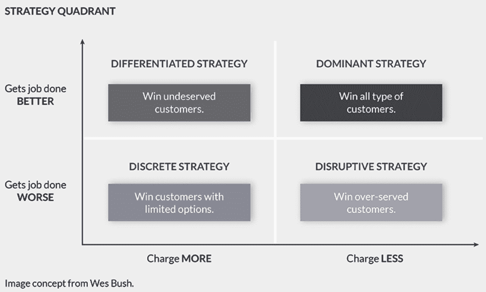

# 第四章：商业化 AI 产品

现在我们正处于**人工智能**（**AI**）融合的时代，我们可以看到许多人工智能的应用案例在各行各业中迅速扩展。在我们管理 AI 产品的工作中，我们无疑依赖 AI 顾问和博士级别的顾问来帮助我们进行建模和组织数据策略，以支持全面的 AI 运营。然而，随着 AI 浪潮的兴起，它正在渗透到各种公司和应用案例中，我们看到对通过高级学位取得的突破性成果的依赖逐渐减少。现在最重要的是熟悉即使是简单且可靠的模型的使用。专门化有其时机和地点。数据科学和人工智能是庞大的总括性术语，但根据我作为产品经理的经验，我认为我们迫切需要能够理解应用案例及其与商业视角关系的数据和 AI 通才。

在 AI 突破的时代，我们并没有像现在这样广泛的应用案例，因为数据不像现在这么丰富。如今，数据充足，我们看到了一种深刻的转变。焦点不再是研究和发现最前沿的算法来选择，而是转向获得足够的人才来使用那些经过验证的模型和算法。我们特别喜欢这种转变，因为它体现了 AI 民主化的概念，即人工智能正变得更加易于为研究和 MAANG 公司之外的更多群体所使用。

作为产品经理，你对此的哲学观点实际上取决于你问谁。有些产品经理认为，创造最佳产品的方法是从 AI 的角度进行突破性研究。另一些产品经理则认为，你可以通过使用那些已经变得普及或已经存在很长时间的模型，如回归模型，完成大量工作。

产品经理的目标是帮助实现一种不仅是商业上的成功，而且也是工业上的胜利的产品。那么，什么是工业上的胜利呢？如果我们能影响你推出一个真正能够为世界带来新的、必要的、实用的东西的产品，我们就达到了写这本书的核心目标。我们也会将其视为一种胜利。接下来，让我们来探索一些成功的 AI 产品管理案例，看看这种成功如何影响到商业的各个领域，包括预期的和意外的。

在本章中，我们将通过不同的商业模式和产品类型的视角，查看一些 AI 公司示例，包括**企业对企业**（**B2B**）和**企业对消费者**（**B2C**）的示例。我们还将审视那些在未饱和和服务不足的市场（蓝海）以及饱和和竞争激烈的市场（红海）中蓬勃发展的公司。本章的目的是突出展示一些在 AI 产品市场上取得成功的关键领域。

本章将涵盖以下主题：

+   专业人士 – 做得好的 B2B 产品示例

+   艺术家 – 做得好的 B2C 产品示例

+   先行者 – 蓝海产品的示例

+   反叛者 – 红海产品的示例

+   最伟大的 – 差异化颠覆性和主导战略产品的示例

# 专业人士 – 做得好的 B2B 产品示例

专业人士是分类产品的一个好起点。AI 首先会向那些能够盈利并允许研究和优化的用例靠拢。因为 B2B 产品是为其他企业制造并使用的，它们的用例完全面向商业世界。这影响了从市场推广到购买、销售、使用和谈判的方方面面。因此，许多 B2B 产品强调它们能够为客户在多个层面上满足的商业影响。这是学习 AI 潜在有益应用的一个好方法。

随着 AI 公司数量的增加，面临的挑战之一是它们需要数据来进行训练。具体来说，随着数据和 AI 产品的扩展，面临的一个伦理挑战是如何在提供大量数据的同时，不泄露能识别个人身份的信息，也就是**私人个人信息**（**PPI**）。总部位于英国的 AI 公司 Hazy 正是为客户提供这一能力：通过所谓的合成数据，能够推导出洞察、理解信号并共享数据。合成数据是模仿真实世界场景的数据，但它是在虚拟世界中创建的，所模仿的是与真实世界数据集的统计相似性。由于数据密集型深度学习模型的特性，合成数据在训练神经网络时更受青睐，因此 Hazy 有着光明的未来。该公司凭借其 300 万美元的资金做出了许多成就，并在短时间内吸引了大量标志性客户。

成功的 B2B 公司本质上在于其能够为所支持的企业创造成功，尽管我们身处大数据、机器学习和深度学习的数据丰富时代，但机器学习和深度学习仍然需要大量的数据进行学习和定期重新训练。Hazy 在解决企业在数据可用性方面的痛点上做得非常出色，这一点在其客户群的忠诚度中得到了体现。Hazy 保持这种忠诚度的另一种方式是通过教育其客户了解传统匿名化或掩盖现实世界数据的方式的伦理和法律后果。

另一个在 B2B 市场上推动成功的 AI 公司是总部位于加利福尼亚的游戏公司 GGWP。虽然他们不开发自己的游戏，但他们使用 AI 减少游戏文化中的毒性，并为游戏公司提供一个仪表盘，让他们能够看到用户在审查方面的表现。随着游戏公司越来越重视其游戏社区的安全和健康，他们将会依赖像 GGWP 这样的公司来确保所有用户的安全。审查一直是社交媒体公司和游戏公司讨论的话题，找到一家公司在这一领域取得成功，实在令人欣慰。

GGWP 也是一个积极的例子，提醒我们在特定领域利用 AI 代替人工工人的重要性。雇佣人工版主的最大问题，首先是他们在日常工作中承受的情感压力。扫描有害或暴力语言并不适合胆小的人，而且在持续不断地发现恶心或仇恨内容时，甚至最坚强的人也会感到沮丧。在伦理上使用 AI 来帮助我们解决那些我们不愿意承担的任务，是有很大道理的。

专业人士似乎最适合这一群体。在 B2B 世界中销售给其他企业时，大多数企业都有一套标准的操作程序，大家都比较愿意遵循。这包括从销售策略到预算或工作陈述的批准，再到通过领导层、采购部门及所有相关团队的合同审批等各个环节。因为大多数 B2B 产品关注的是成本节约、生产力或收入生成，参与其中的各方之间的互动更为结构化。专业精神的核心是能力和诚信，无论在任何时刻遇到什么情况，B2B 市场可以从很多角度看作是运转良好的机器。就像它们所代表的产品一样，这些公司本身也在寻找优化生产力、创造收入、降低销售周期和市场互动中的成本的方法。

# 艺术家——正确完成 B2C 产品的例子

艺术家们在这里向我们展示了如何利用人工智能，以一种能够为潜在数十亿未满足需求的客户提供表达方式的方式。B2C（商业对消费者）指的是那些预期将被个人消费者而非其他企业购买和使用的产品。对于 B2C 产品，通常会有一种感觉，认为你是在寻求满足许多个人的需求和口味。然而，经过进一步思考，B2C 公司实际上是在努力满足数百万人的一些共同需求。越是投入足够的精力去设想解决方案，并理解那些能够帮助如此多人解决的未满足需求，这些公司就越能够做好满足这些需求的准备。

毫无疑问，我们最喜欢的人工智能驱动的消费应用是 TikTok。这家中国巨头使用三种人工智能技术（[`dev.to/mage_ai/how-does-tiktok-use-machine-learning-5b7i`](https://dev.to/mage_ai/how-does-tiktok-use-machine-learning-5b7i)）来优化用户体验：

+   计算机视觉技术追踪视频中的图像

+   自然语言处理技术通过声音和音频记录进行学习

+   从字幕的元数据中提取信息，以便最佳地传递用户最感兴趣的内容

这个例子最重要的一点是它是一个社交媒体平台，所以我们仍然能看到在吸引人的内容和上瘾行为之间的内在冲突。根据我们自己的消费习惯，这仍然是他们面临的问题区域。我们相当确定，我们与应用上十亿个同行分享了这个担忧。就 B2C 产品而言，我们很难找到一个更好或更成功的例子。

现在，让我们将注意力转向另一个令人上瘾的应用程序。这次它也许是一个更健康的上瘾——对知识的渴望！总部位于宾夕法尼亚的 Duolingo 通过深度学习的方式，帮助人们以更高效、更专门化的方式学习语言。这个游戏化、个性化的应用程序吸引了超过 3 亿月活跃用户，并提供超过 30 种语言。Duolingo 的主要理念是，它会和你一起学习，并基于它认为你即将忘记的单词，向你提供重复的练习。这种重复模仿了我们自然学习的方式，而应用中的游戏化积分系统则给予你继续每天学习 15 分钟所需的情感鼓励。

作为附加信息，Duolingo 一开始并不是一家人工智能公司。它成立于 2009 年，起初开始尝试个性化和 A/B 测试时，迅速意识到应该开始使用机器学习进行测试。在本书后面，我们将讨论如何将人工智能功能加入到现有的非人工智能产品中。Duolingo 为我们提供了一个成功的例子，说明了如何做到这一点。

我们决定称这个团队为*艺术家*，因为艺术捕捉了时代精神以及来自社会集体的不同能量。这与市场隐形之手的概念非常契合。产品市场契合度的概念也是模糊不清的。市场想要的就是它想要的，而我们每个人都直接或间接地构成了市场，创造真正艺术的公司能够在市场所在的地方与之对接。难怪人们对学习语言感兴趣。世界日益全球化。全球就业市场支持那些能够远程或本地工作的全球人才，因此，有人可能因为好奇而搬迁或学习一门语言的想法，似乎在过去的 10 到 15 年中有所增加。

人们普遍希望自我表达，尤其是在分享 COVID-19 大流行带来的集体撤退时，这一想法支持了一个全球社交媒体应用程序的构想，帮助你几乎不费力地创造内容。TikTok 和 Duolingo 以一种方式捕捉到了集体的需求，为数百万人的生活带来了宽慰与轻松。

B2C 应用程序的业务是挖掘大众集体需求的。消费者不同于与其他企业合作的客户。没有一个庞大的潜在“看门人”群体阻碍找到有能力且愿意购买的销售对象。当将产品销售给消费者时，你只需要赢得一个人的认同。你会被诱惑去做所有人的事。从某种意义上说，我们想象选择和优先排序功能会很困难。将产品迎合潜在的数百万种观点是不可持续的。但抓住一种情感需求，激发并吸引数百万观众，会像钟声一样响亮，每个听到其回响的人都会感受到它的光辉。真是太艺术了。

# 先驱者——蓝海产品的例子

对于先驱者，我们希望专注于那些为其产品寻找新类别或新用例的公司。这些公司正在寻找新的途径为他们所提供的产品创造需求，并且这些公司通过多种方式为自己创造需求。这就被称为**蓝海**：一个仍在形成中的竞争格局，尚未看到太多竞争（至少目前如此），并且必须为自身需求进行宣传。在红海市场中探索相对简单，因为已经有了许多通道可以走。已有一个蓬勃发展的生态系统供人们学习和导航。但先驱者必须为这一知识而努力。

部分原因在于，这些公司本身需要进行足够的研发，才有足够的理由去追求他们正在帮助建设的行业。蓝海也把很多责任推给了行业中的早期玩家，要求他们创造思想领导力和宣传，首先让潜在的竞争者、投资者和客户保持好奇心。

Bearing.ai 是一家特别引起我们注意的初创公司。在新冠疫情加剧了已经紧张的供应链危机问题之后，我们真的很喜欢一个深度学习平台的想法，这个平台不仅要简化供应链路线，还要解决海洋燃油消耗的问题。我们依然觉得，我们竟然如此依赖于将商品物理运输如此长距离的方式，以及劳动力成本和原材料供应的可用性推动了我们建立的这种高度低效的全球贸易系统。我们希望，有一天，我们可以创造更高效的本地化系统来管理全球消费，但在此期间，有 Bearing 在。

Bearing 作为一个蓝海产品的典范在哪些方面做得很好？真的没有太多竞争。搜索深度学习海运路线优化产品，Google 几乎没有结果，这就是蓝海市场的核心。你不必与竞争对手争夺客户。蓝海的固有挑战在于你必须创造需求，证明你的产品存在的合理性。你必须实质性地为为何要经营以及为何世界需要你的产品提供一个引人注目的故事。这是一个棘手的游戏，但如果你做得好，你可以自由选择客户。目前，Bearing 对一小部分客户进行封闭式测试。这是蓝海的另一个优势：你可以营造出独家性。只有特定的特别人才能了解这个新的激动人心的冒险。

我们已经讨论了使用深度学习模型的道德及其解释性问题。这在某种程度上或多或少地取决于产品的成功案例。对于 Bearing 来说，深度学习模型正在优化最佳路线，对于公司及其客户来说，模型的准确性比其解释性更重要。如果有效，那就有效。在这里，我们看到更少依赖于解释模型如何得出某些结论，因为他们的客户更关心路线是否合理且确实更高效，而不太关心内部机制如何得出某些结论。如果是约会网站或物业科技公司优化租户成本，情况可能就不同了。

说到可解释的人工智能，我们的第二个蓝海例子是 Fiddler.ai。我们很高兴看到关于机器学习可解释性的话语已经达到了如此高潮，以至于我们看到了许多公司出现，他们与你合作，帮助创造所需的透明度和信任，确保我们继续以负责任和伦理的方式融入人工智能。做这件事的公司并不多，而 Fiddler 让你能够在每个生命周期阶段都能遵守法规并将模型集成到你的产品中。Fiddler 在自我辩护方面做得很出色：他们提出了可能影响每一个正在创建机器学习模型使用环境的公司的真实风险。他们还非常擅长传播他们的产品。从世界经济论坛到《福布斯》，再到 CB Insights 和 Gartner，他们得到了大量的优质媒体报道，并利用这些报道在他们所处的蓝海中为自己争取强有力的支持。

当我们想到先驱者时，我们会想到那些带着好奇心进入未知领域，并因他们的勇气而获得回报的人。蓝海尤其难以航行，因为你是在为一种产品创造需求，实际上是在创造一个市场。为了在这种市场的不确定性中生存下去所需的信念和愿景，是很少有人能够长期保持的。传播、实验和使命的建设使得先驱者从人群中脱颖而出。首个开辟的道路具有固有的美德，所有后续的道路都要感谢你为其奠定了基础。

先锋公司所做的传播工作也适用于竞争环境。当你处于蓝海时，竞争对手是你的朋友，因为他们证明了你的产品和解决方案的存在。你的竞争对手越多，你作为企业的信誉就越高，你也越能帮助创建一个由少数关键玩家组成的支持性生态系统。在很多方面，先驱者们正在向各个方向扩展并覆盖新的领域。

# 反叛者——红海产品的例子

红海是已经变得不适合生存的市场，市场中充满了成熟且完善的竞争环境。在这种环境下，许多路径已经被形成，你必须选择一条来生存并服务。你依然有机会创造新的东西，可以采取许多策略来击败竞争对手并进行专业化，但你面临的挑战是是否能凭直觉看到下一步该走向哪里。由于竞争对手的多样性和繁荣，部分挑战在于你很难确定自己真正想走的方向，或者哪些竞争者真的在分走你的市场份额。

Lacework，一家总部位于加利福尼亚的云安全公司，根据 Crunchbase 获得了总计 19 亿美元的资金支持。在竞争激烈的竞争环境中，网络安全行业非常激烈。各家公司相互竞争，新兴的创业公司不断涌现，行业巨头收购最有前景的新秀，这是一个经常变化的领域。Lacework 通过拥有自己的研究实验室（[`www.lacework.com/labs/`](https://www.lacework.com/labs/)）来测试和应对新的威胁和攻击，出色地利用新兴的机器学习应用案例。这使他们能够保持竞争力，并灵活地赢得了投资者的信心。他们现在正在进行第四轮融资，并且没有停下来的迹象。

Lacework 在提到 AI 的道德标准和实践时，给我们提供了另一个重要的观点，即致力于模型优化和多样化训练数据的研究。拥有实验室不仅使他们能够在其产品的各个领域持续更新 AI 应用程序，而且还使他们在处理对客户最紧迫的网络安全问题时，始终保持着责任感。这在特别是在激烈的市场中，为他们的客户群体建立了很多信任，这也是他们主要的成功因素之一。

我们在竞争激烈的市场中看到另一个典型案例，即位于加利福尼亚的机器翻译公司 Lilt。本地化和翻译行业也经历了内部竞争，这是一个充满翻译服务和技术提供商的市场，而 Lilt 结合了这两者。从人工智能的角度来看，Lilt 的特别之处在于，根据他们的首席执行官 Spence Green 的说法，它是*“世界上第一个也是唯一一个交互式、自学习的神经机器翻译系统”*。其创始人们在 Google Translate 工作时，基于对机器翻译不足的认识，创建了 Lilt，并且他们的努力得到了回报。该公司现在正在进行其第三轮融资，并且迄今已获得了超过 9000 万美元的资金支持。

当我们想到叛逆者时，我们想到的是勇气。在竞争激烈的市场中竞争需要极大的勇气。面对如此多的竞争者，你很容易分心并感到疲惫不堪。每个竞争者都代表着你可以发展的一个方向。如果你足够专注，其他机会可能会变得难以捉摸，试图满足所有人的公司往往会因为缺乏聚焦而遭受困扰。产品经理和领导层需要共同努力，确保产品有清晰的愿景，并且公司能够作为一个团队团结在这个愿景背后。对我们来说，叛逆者是无畏的，探索这种恐惧有助于理解那些成功的红海公司。也许这种无畏来自于一家公司在市场中不断面对众多对手时培养出的勇气。最终，你会专注于细节，并获得激光聚焦的视野。

# GOAT – 差异化的颠覆性和主导战略产品的例子

现在，我们将关注主要的市场战略，并查看每种战略的*有史以来最伟大的*（GOAT）例子。市场战略决定了你的市场推广团队的努力方向。你是要去吸引那些选择太多还是选择太少的客户？你会创造一个比竞争对手更有效的产品，还是一个更差的产品？这些问题在制定商业计划时看起来很显而易见，但当公司开始运营并获得一些客户后，这些决策可能不会像公司成立初期那样明确。

我们从创业世界中学到的最重要的一个教训就是，要学会提出那些看似已经深深融入公司使命和精神中的问题，这些问题看起来很显然。我们在过去的经验中曾经不情愿地提过这些问题，但现在不再这样了。公司如果受到足够的诱惑，可以改变它们的战略，但每一次改变都会给公司带来潜在的风险。市场战略决定了从如何构建产品到如何销售产品的方方面面。如果对市场战略的这些方面缺乏清晰的认识，可能会导致产品的构建不合适。如果在产品的沟通和销售上缺乏清晰度，可能会导致获得不适合公司的客户。

以下是来自 Wes Bush 的书《*产品驱动增长*》中的图表，展示了公司在增长战略中可以使用的四个战略领域：

图 4.1 – 四个战略领域

这张图展示了战略象限，划分了市场进入战略的各个领域，并突出了离散差异化、主导性和颠覆性战略之间的关键区域。每个公司都需要决定它的市场进入战略，因为这将影响它如何销售、如何营销其产品，以及它将使用何种语言来接触目标客户。

在接下来的部分中，我们将聚焦于差异化战略、颠覆性战略和主导战略，并为每种战略选择一个使用 AI 推动这些增长战略的例子。

## 主导战略

在**主导战略**中，你的目标是吸引各类客户：既有寻找优质产品的客户，也有希望支付更少的客户。这会整体提高你的市场份额，这也是为什么这种战略被称为主导战略，因为它采用的是“赢家通吃”的心态。我们以快时尚为例，这是我们见过的最具竞争力的市场之一。如果你是快时尚零售商，拥有更便宜的产品并不仅仅是重要的，你还必须有支持高效交付该产品的运营。以 Netflix 为例，在其巅峰时期是个很好的例子，但如今我们很难找到比 SHEIN 更合适的例子。这个中国品牌通过利用 AI 更好地预测新趋势并预测市场上某些产品的需求，来展现其主导战略，并将这些数据与供应链相结合，确保能够及时响应需求变化，令客户满意。这影响了从营销活动到应用内体验，再到产品评价的方方面面。证据也非常明显。

以前，西班牙快时尚公司 Zara 的最快周转时间为 3 周，用于创作和交付一季的新系列。而 SHEIN 将这一时间缩短到了全新的行业最佳——3 天。这是真正值得钦佩的 AI 和机器学习应用。

主导战略是通过以更低的成本、更好地完成任务来削弱他们竞争市场的战略。这是有效的，因为它在两个方面都最大化了回报。它既能获得那些希望任务完成得更好、又希望支付更少的客户。这意味着你赢得了相当大的一部分市场份额。当这种战略执行得当时，采用这种战略的公司基本上可以轻松赚钱。

## 颠覆性战略

采用**颠覆性战略**，你仍然是在以更低的价格销售产品，但它所提供的也相应减少。谁会想要这样的东西呢？那些被过度服务并被各种选择轰炸的人，他们实际上只需要比他们所面临的竞争选择更简单的工具。我们没有看到比 Canva 更好的例子了。你可以使用 Canva 编辑照片，创建从社交媒体帖子到简历的任何东西，而且执行这些操作的工具非常用户友好且简单。

这家澳大利亚创意平台利用 AI 为客户提供他们所需的更多模板和内容。虽然它提供的功能*不如*Adobe 的 Photoshop 或 Microsoft Office 套件那么全面，但它确实提供了用户所特定需要的内容，并且使用起来既免费又便宜。它迅速成长为独角兽公司，因其精准满足了客户的需求。

颠覆性战略最有趣的地方在于，它能够通过向潜在客户展示不同的视角来影响他们。颠覆改变了市场中现有权力结构的范式，一个新的风向标人物出现，激励竞争对手和客户尝试新的方式，来要求和使用产品。这种范式的变化为整个市场带来了新颖性和专业化的礼物。也许工作做得更糟，但这对一群新兴的潜在客户是有益的。也许这个新群体是其他竞争者从未考虑过的目标客户。

## 差异化战略

在**差异化战略**中，你可能会销售一种在某个细分市场上具有专业化优势的优质产品，但你也会因此收取更高的价格，以体现这种专业化。我所举的差异化战略例子来自一个与我有密切关系的公司：我曾合作过的一家英国基于机器学习的房地产科技公司，名为 Beekin。Beekin 并不是一个价格便宜的房地产科技平台，但当时它提供了其他房地产科技公司无法提供的下一代平台。我们构建了一个原生机器学习平台，能够从市场评估到预测未来行为，提供最优租赁价格。我们的客户没有太多其他竞争工具可选，因为他们的替代方案是那些拥有过时规则引擎的房地产科技巨头，而房地产科技行业正被 AI 迅速颠覆。

差异化战略在能够最好地传达其产品优势的环境中蓬勃发展。由于价格标签也较高，因此必须有一个令人信服的理由，说明为什么有人会在市场中选择差异化产品。那些与竞争者有显著不同的独特产品，在这种市场战略中表现突出。在 Beekin 的例子中，几乎没有其他竞争者将机器学习作为其产品的基础，它能够帮助很多人完成他们的工作任务。这就是差异化产品的最大优势：满足细分市场并推动行业发展。差异化的需求推动并促进了行业的成熟。一旦出现了更多有特殊且迫切需求的客户，差异化产品就会出现，向其竞争对手展示如何开始专注于某一领域，并迎合客户的需求。

让我们花点时间为迄今为止看到的所有例子鼓掌。将一个可行的、有效的产品与商业模型、产品战略和忠诚的客户群体对齐所需的工作和奉献精神，绝对是一项巨大的成就，成功值得大声庆祝和赞扬。我们从他人的成功中学到了很多，并且在为本章选择合适的示例时，感到非常有趣。

可解释性是产品经理关注的一个重要领域。你能够轻松解释你的人工智能产品，如何得出某些结论，如何理解其工作原理，这在与公众或敏感话题打交道时变得非常重要，或者当你拥有高端或企业客户，可能在后期面临风险时，这一点尤为重要。我们并不想说服你成为怎样的产品经理；相反，我们希望为你提供多种选择，供你考虑。

无论你是依赖人工智能领域最聪明的人才，还是刚从训练营毕业的机器学习实习生的帮助，都要知道，简单的模型也能做出很多事情。追求算法的完美与依赖那些被广泛使用的简单工具同样值得钦佩。这在很大程度上是一个偏好和使用场景的问题。

本章的目的是突出近年来人工智能产品的一些有前景的发展，提供多种视角，展示如何在不同的商业模型中利用人工智能。这并不是要模仿其他公司，而是要理解人工智能的哲学、行为、伦理和实践如何从一种商业模型转变到另一种商业模型。对我们来说，这是在部门层面上管理产品的关键。作为一名产品经理，你的任务是确保产品的商业成功，理解人工智能如何与您的商业模型相关联，对于风险管理至关重要。

# 总结

在本章中，我们介绍了一些近年来做得正确的、有前景的人工智能示例，目的是从同行的成功和应用案例中寻找灵感。作为产品经理，理解你的市场战略、商业模型以及所服务的市场至关重要。我们已经深处人工智能普及的时代。许多企业正在将人工智能应用于其产品和业务中，我们希望你享受这些示例，同时继续了解管理人工智能产品的细节。

在下一章，我们将戴上未来主义者的帽子，了解人工智能领域中即将出现的一些新兴趋势。我们相信，所有的产品经理都应该具备一些未来主义的素质。了解当前和近期事物的发展状况可以为评估现有战略提供一个快照。然而，在技术领域，事物发展得非常迅速。在商业领域，预测和未来目标也可能每周发生变化。

如果我们想要影响领导力、资源和时间，推动我们的 AI 产品向能够激励客户和批评者的领域扩展，我们必须安全地应对未来的潜力。让我们来看看，AI 趋势的预测是什么。

# 参考文献

+   *AI 帮助 Duolingo 个性化语言* *学习*: [`www.wired.com/brandlab/2018/12/ai-helps-duolingo-personalize-language-learning/#:~:text=The%20learning%20behind%20the%20lingo,data%20and%20make%20intelligent%20predictions`](https://www.wired.com/brandlab/2018/12/ai-helps-duolingo-personalize-language-learning/#:~:text=The%20learning%20behind%20the%20lingo,data%20and%20make%20intelligent%20predictions)

)

+   *Hazy Company* *信息*: [`www.cbinsights.com/company/anon-ai`](https://www.cbinsights.com/company/anon-ai)

)

+   *GGWP Company* *信息*: [`www.crunchbase.com/organization/ggwp-65c2`](https://www.crunchbase.com/organization/ggwp-65c2)

)

+   *Lacework* *实验室*: [`www.lacework.com/labs/`](https://www.lacework.com/labs/)

)

+   *TikTok 如何使用机器* *学习？*: [`dev.to/mage_ai/how-does-tiktok-use-machine-learning-5b7i`](https://dev.to/mage_ai/how-does-tiktok-use-machine-learning-5b7i)

)

+   *Canva*: [`www.lifeatcanva.com/en`](https://www.lifeatcanva.com/en)

)

+   *Lilt Company* *信息*: [`www.crunchbase.com/organization/lilt`](https://www.crunchbase.com/organization/lilt)
