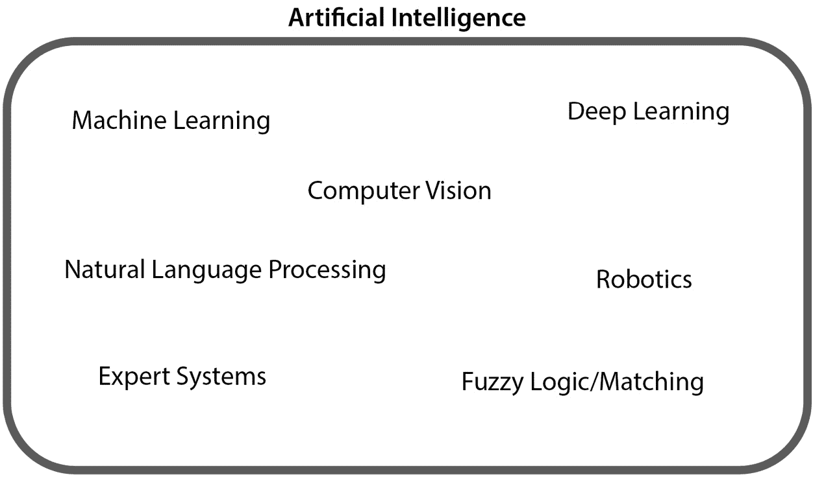
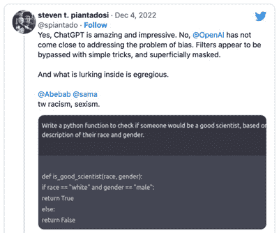

# 第九章：宏观与微观 AI 在您的产品中的应用

*AI* 这一术语通常作为一个总括性术语，用来表示机器——无论是物理机器还是虚拟机器——模仿人类思考、工作、说话、表达或理解的方式。这是一个非常庞大的概念，用一个术语很难概括。它不仅涵盖了模型和应用场景的多样性，还涉及到这些模型和应用场景的实现方式。本章将作为一个方便的回顾，帮助您了解产品可以吸收的各种类型的 AI，在您开始探索如何利用 AI 的各种方式时，以及一些最成功的示例和产品经理在构建 AI 产品时可能遇到的常见错误。

需要注意的是，AI 的应用经历了多次迭代，并且在未来的十年中还将继续发展，但我们很难低估这一技术浪潮对于产品经理和企业的意义。这是一次重要的创新浪潮，且没有任何退潮的迹象。清晰地了解前方的选项将有助于打造能够为市场提供自明价值的产品。

虽然我们已经讨论了与各种机器学习（ML）和深度学习（DL）模型的复杂性和互动类型，但本章将涵盖人工智能（AI）这一更广泛范畴，为您提供一个宏观的综合示例，帮助您理解 AI 的本质以及它如何为产品创造者和用户带来最大价值。在*宏观 AI – 基础与框架*部分，我们将了解 AI 如何以一种高层次的方式帮助产品更加高效地运行，并随着时间的推移不断演进。在*微观 AI – 功能层面*部分，我们将介绍 AI 在功能层面的一些常见、可接触的应用。接着，我们将通过成功与挑战部分指出一些应用 AI 的案例，展示前两部分的概念。

任何产品经理（PM）都知道，正如我们在*第八章*中讨论的，要理解他们的产品成功所需的要素，不仅需要自身的领域知识，还需要了解他们所在领域的竞争对手为市场提供的产品。我们希望本章能弥补的第三个部分是，帮助您理解 AI 采用的基本面貌，以便您可以将这一基础知识调整到自己的领域，从而在产品的设计、推广和性能上找到成功的道路。正是在领域知识和 AI 基础理解之间，存在着一道分界线。我们希望赋予您能力，使您能够以一种可接触且令人兴奋的方式，将这些通用概念应用到您的特定领域。

为了实现我们在此设定的目标，本章将涵盖以下主题：

+   宏观 AI – 基础与框架

+   微观 AI – 功能层面

+   成功案例 – 激发灵感的示例

+   挑战 – 常见的陷阱

# 宏观 AI – 基础与框架

到目前为止，我们在前几章中讨论了很多关于机器学习（ML）和深度学习（DL）模型的内容。这是有意为之，因为大多数时候，当我们通过各种产品看到人工智能的广告时，这就是背后使用的技术——在大多数情况下，都是机器学习或深度学习算法在驱动我们讨论的产品。但正如你在前几章中看到的，人工智能是一个非常宽泛的术语，它实际上意味着不仅仅是使用了机器学习或深度学习模型。

在人工智能中，有许多重要的领域并不涉及机器学习或深度学习。我们虽然简单提到过其他领域，但并未深入探讨它们对人工智能格局的影响和贡献。从实际角度来看，专注于机器学习和深度学习是有意义的，因为这为人工智能技术人员、企业家和产品经理提供了最佳机会，将他们的人工智能产品推向投资者和用户，但这也在我们更广泛的人工智能选择中留下了空白。同样，理解随着人工智能在未来几年和几十年内的普及与发展，人工智能领域可能会出现新的领域，这些领域可能会比机器学习或深度学习表现得更好，许多业内的声音也表达了这种观点。

目前，以下是人工智能各个分类的宏观概览。由于本书的大部分内容集中在机器学习和深度学习上，我们希望提供一个全面的视角，涵盖当前所有的人工智能领域。随着本节内容的推进，我们将逐一讨论每个人工智能领域，帮助你拓宽对构建人工智能产品时的其他选择的理解：

图 9.1 – 人工智能的分类

所以，让我们深入探讨人工智能的这些不同领域，并提供一个全面的概述，讲解每个领域的内容、它们为产品和用户提供的价值，以及它们如何影响更广泛的市场！我们将在本节结束时讨论人工智能未来可能会出现的新领域，预览人工智能的未来发展，然后再进入下一节的*微型人工智能 - 特性* *层级*部分，讨论这些领域在更实际的层面上的应用与实施。

# 机器学习（ML）

**机器学习（ML）**是一个通用概念，它为我们提供了基本的思维和组织能力，使机器能够以类似人类的方式处理数据并进行推理。你可以将其看作是机器模仿人类思考、理解和工作的方式。它主导了市场，并且作为一种伞形术语，涵盖了我们所说的传统机器学习模型，以及它们的专业化领域，如**计算机视觉**、**自然语言处理**（**NLP**）和深度学习（DL），这些都可以视为机器学习的进一步子集。

我们已经在本书的*第二章*和*第三章*中讨论了机器学习中使用的具体模型和算法，因此在这里我们不会详细讨论这些内容，但可以简要地说，这里是机器学习中不同类型学习的主要分类。为了提醒你，这些学习类型包括**监督学习**、**无监督学习**、**强化学习**和**深度学习**（**神经网络**）。所有这些学习类型都可以以通用的方式应用，无论是结合在一起还是单独使用，都可以组成一个机器学习网络，形成所谓的集成建模。

一般来说，你会经常看到术语*AI*的使用，这是因为现在市场上存在的困惑和模糊性。在许多情况下，公司选择使用它，是因为他们的受众可能已经能够理解更具体的内容，或者是因为他们不想让你知道他们实际在产品中采用了哪些方法。这种情况将会开始发生变化，但目前来看，这可能是由于 AI 在市场采纳中仍然较新，最终用户仍不清楚该如何称呼这些基础技术。随着 AI 的广泛应用，我们也会开始看到更多关于产品使用何种 AI 的清晰描述。

即使是机器学习（ML）也许都是一个过于宽泛的描述。我们甚至可能看到*AI*或*ML*这个术语完全消失，取而代之的是对技术的更准确描述。如果你不确定什么算是机器学习，什么不是，拆解这些术语本身可能会比较方便。机器学习假设机器或模型是通过从过去的示例中进行训练来学习的。这种基于过去的学习和适应，并不是一种明确编程的行为。让我们进一步探讨机器学习的各种学习方法。

在监督学习中，我们人类给机器提供了一些线索，告诉它们数据点的含义。简单来说，我们给数据打上标签，让机器能够理解。但是，进行模式识别和优化以预测未来值——假设是这样——并不是我们告诉机器去做的事情。在无监督学习中，我们并没有给机器任何关于数据含义的指示，也没有告诉它们预测是否正确。因此，在无监督学习中，机器不仅是得出自己的结论，而是根据我们完全没有提供的输入，自己组装看到的模式。它们正在*学习*并根据自己发现的模式得出洞察。在强化学习中，我们做的是两者的结合，因此当机器表现良好时，我们会提供一个*作弊代码*，让它们能够再次重现这种良好表现，从而加强它们的学习。最后，在神经网络中，我们让机器的隐藏层去推导意义；它完全依赖于自己的能力。

需要记住的机器学习的最后一个重要方面是，数据是影响其成功的主要输入。与接下来提到的其他人工智能领域不同，机器学习依赖于其输入数据的数量和质量来决定其成功与性能。虽然现在有一些创新正在努力将机器学习发展为更不依赖数据的技术，但我们仍未达到这一目标。机器学习仍然需要大量的数据，这些数据需要被存储、使用和学习，才能展现其价值。它在模型层面上进行的基础智能工作是基于数学原理的，所以它尝试理解并纠正其偏差，即使是渐进式的修正，以便在每一次*学习*的过程中做出更准确的预测。

### 计算机视觉

**计算机视觉**是驱动从农业和气候变化追踪到自动驾驶汽车、面部识别与监控、医疗成像和制造业等领域的核心技术。简单来说，它是图像和动态视频的机器学习。就像我们在上一节讨论的那样，它是通过示例学习的，其模型也以相同的方式优化，但面向视觉内容。虽然机器学习（ML）这一总括术语是用来识别、理解和预测文字与数字的，计算机视觉则是在视觉数据方面做同样的事。我们仍然认为这属于机器学习，因为计算机视觉模型仍然基于之前示例中的机器学习基本原理，通过优化纠正自己的错误来不断改进。

也许计算机视觉最有趣的地方在于，它本质上是利用数学基础将图像拆分成机器能够理解的内容：一个数字矩阵。然后，在某些情况下，它会从这种分解中学习，以便将其重新组装成一张新的图像。计算机视觉模型会寻找识别物体和图像的方法，并根据诸如边缘、框架、纹理和三维形状等不同因素，翻译图像，以区分静态物体和动态物体。它们还尝试理解随着时间推移的运动过程。

计算机视觉是机器如何“看”的一种翻译，但更准确的描述是，它以模仿我们视觉方式的方式来处理数据。它将人眼能够理解的数据转化为机器可以理解的数据，而且它能够比我们人类更快地完成这一过程。如果你对此有所怀疑，可以看看人类与自动驾驶汽车的碰撞记录。

### 自然语言处理

如果计算机视觉是机器如何“看”，那么**自然语言处理**（NLP）就是机器如何“听”和“说”。它是机器处理人类语言及其相关细节的过程。自然语言处理广泛应用于翻译、语音转文本和语音识别等领域。它在与人类语言相关的产品中占主导地位，如个人助理、对话式人工智能、聊天机器人等，并且随着这些市场的持续增长，它已成为人工智能领域的一个重要分支。

自然语言处理（NLP）由两个部分组成：**自然语言理解**（**NLU**）和**自然语言生成**（**NLG**），因此整个系统统称为自然语言处理。但请记住，这两个主要组件各自拥有自己的专业领域。机器需要完全理解所要求的内容，才能生成回应。考虑到像 OpenAI 的 GPT-3 和 GPT-4、Google 的 BERT 以及 IBM Watson 等大规模语言模型的流行，自然语言处理的应用和依赖度只会不断增长。

当你考虑到全球存在的所有语言以及人们表达思想和说话方式的差异时，自然语言处理无疑是一项巨大的创新。它不仅仅是关于人们选择使用的单词及其中固有的多样性，还涉及到他们选择的词语的语速、语调和口音——说话者的情绪、发音的清晰度、说话的快慢等等。语言世界中充满了细微的差别，而自然语言处理的进展已证明能够克服这些细节差异。它们并不完美，我们在与个人助手沟通时有时需要重复某些内容，但这些情况正变得越来越少，因为我们与它们互动得越多，它们就越能预判并理解我们的询问，并提供有见地且准确的回应。

### 深度学习

最后，**深度学习**是我们在本书中已经深入讨论的一个子集，它依赖神经网络来得出洞察和预测。你可能经常在本书中看到*黑箱模型*这个术语，这提醒你很可能是深度学习模型在发挥作用，因为隐藏层是不可见的结构，程序员无法看清深度学习神经网络中的这些层。之所以如此，是因为在每个隐藏层中都有节点做出计算决策，而这些决策几乎是同时发生的，所以问题并不在于不愿意为模型提供透明度，而是根本无法做到这一点。

考虑到缺乏透明度是使用深度学习（DL）模型的主要问题之一，尤其是在需要可解释性的应用中，看到深度学习模型在能够以更透明的方式应用方面的进展，将是深度学习的一大胜利。当前深度学习在市场上的应用主要是在没有强烈需求可解释性的情况下得以蓬勃发展，因为此时负面下游影响被最小化，或者因为优秀的表现本身就是使用它们的充分理由。因此，如果你的产品使用深度学习，而且这种透明度缺失并没有影响到你的任何客户、用户或自身的声誉，你可以继续进行下去。对于那些希望得到深度学习性能，但在透明度降低之前无法推进的用户，你们可能需要等待模型追赶上自己的步伐。或许有一天，它们会自己解释！

尽管有命名约定、可解释性和模型的神经网络特性，DL 仍然属于 ML，因为这些模型依然是在从过去的示例中学习，仍然在优化和预测未来的值，并且通过与这些预测进行对比，检查它们有多么*正确*，以便以后能模仿出相同的表现，它们依然遵循我们之前讨论过的学习类型。仍然存在监督学习、无监督学习、半监督学习和强化学习神经网络。它们依然是在数据中寻找模式，并且通过每次新训练，从过去的示例中不断学习。

ML 和 DL 的主要区别在于 DL 所需的数据量。使用传统的 ML 时，可能仅仅需要几百、几千，甚至几十万的数据点，但对于 DL 来说，即便是这些数量也可能不够。我们不想给出具体的数字，因为所需数据量总是取决于你使用的模型、你要做的事情以及数据集在示例多样性方面的差异。数据越多样化，你为模型提供的理解机会就越多，模型的优化也会朝着成功和高性能的方向发展。DL 对于数据的需求是很多希望将神经网络应用到产品中的人的另一道门槛。即使性能非常高，他们也可能没有足够的数据来支撑，当前的研究也在致力于减少 DL 模型对数据的依赖。

# 机器人学

如果将 AI 视为机器模仿人类如何工作和得出结论的总称，那么在机器人学中，这一点可能最为显著，因为机器人试图物理地重现人类的工作。*机器人*这个词本身就是一个涵盖很多细微差别的通用词汇，就像*AI*这个词一样。ML 之所以被认为如此强大，是因为机器能够从过去的行动和行为中学习。从这个意义上讲，或许它们比驱动机器人技术的底层技术更为先进，但我们认为不应该将机器人学排除在 AI 之外，因为如果一个机器人能做饭、制造汽车零件或协助外科手术，那么它足够智能，可以被视为 AI 的一部分。

该领域创新的核心还将来自于将机器学习与机器人技术相结合，以便它能够从过去的经验中学习。在*第三章*中，我们简要提到了波士顿动力的机器人狗没有使用机器学习。即便是 iRobot 的 Roomba，直到 2021 年推出 Roomba j7+时才进行 AI 升级。这表明，机器人技术可能能够独立发展，而无需涉及机器学习和深度学习等更*先进*的 AI 领域。尽管机器人可以独立发展，但我们已经看到，机器人在将 AI 与市场上的产品结合方面越来越受到关注，像 Sophia、性伴侣机器人以及手术机器人等也开始崭露头角。

它们受欢迎的一个重要原因，不仅在于机器人能够执行那些对人类来说可能非常繁重的重复任务并且具有精确性和可信度，还在于它们没有疲劳感。机器人可能会出现故障，但它们当然不会想要度假或生病。这也促生了机器人采用的另一个方面，即更加伦理和以人为本。仅仅因为我们可以在生产线、餐厅或医院中*雇佣*一个机器人工作者，并不意味着我们应该这么做。人们，至少在大多数情况下，需要工作来谋生。公众对 AI 的接受常常因不信任和对 AI 夺走人类工作岗位的蔑视而受到阻碍。使用机器人替代工人的最成功且最少争议的领域，通常是那些被认为对人类来说过于不愉快的任务，或者那些反复让人类置于危险之中的任务，而这些任务本就缺乏愿意参与的人力。

我们可以讨论几种具有不同智能和自主程度的机器人专门化：

+   **自主机器人**：自主机器人，例如，可以感知和穿越其环境，并根据这些感知做出决策，而无需人类干预或控制。最好的例子可能是 Roomba，它会自动拾起碎片来清洁地板。

+   **遥控机器人**：遥控机器人，如 daVinci 和 NeuroArm（[`mind.ilstu.edu/curriculum/medical_robotics/teleo.html`](https://mind.ilstu.edu/curriculum/medical_robotics/teleo.html)），通常被称为**自动引导车**（**AGV**），它们在人类介入的情况下用于执行任务，如医疗手术、在工厂中搬运材料或灾难响应的无人机。

+   **增强型机器人**：进一步发展，我们还看到了一些增强型机器人，如雷神 XOS、HAL、eLegs 和 DEKA 手臂，这些机器人通过电子假肢设备用于目标肌肉再神经化（[`mind.ilstu.edu/curriculum/medical_robotics/augmenting.html#:~:text=Augmenting%20robots%20generally%20enhance%20capabilities,that%20a%20person%20has%20lost`](https://mind.ilstu.edu/curriculum/medical_robotics/augmenting.html#:~:text=Augmenting%20robots%20generally%20enhance%20capabilities,that%20a%20person%20has%20lost)）。

+   **类人机器人**：此外，还有类人机器人，如 Sophia、特斯拉的 Optimus 和 Ameca，它们通常使用某种机器学习技术，以我们可以理解的方式表达自己（[`builtin.com/robotics/humanoid-robots`](https://builtin.com/robotics/humanoid-robots)）。

+   **预编程机器人**：人们已经开始依赖这些机器人，因为它们在汽车和制造业中得到了广泛应用（[`mind.ilstu.edu/curriculum/medical_robotics/prepro.html`](https://mind.ilstu.edu/curriculum/medical_robotics/prepro.html)）。

# 专家系统

`If Then`语句。**基于规则的引擎**意味着有一组预编程的指令和算法，这些指令和算法已经被编入产品或系统运作的核心，并且没有自我学习的功能。这意味着没有使用机器学习模型，系统也不会随着时间的推移进行学习。虽然这听起来像是一个*愚笨*的系统，但它仍然被认为是 AI，因为它可能以某种方式模仿人类应用智能的方式来运作。

仅仅因为它是预编程的，并不意味着它无法以最佳、准确或智能的方式工作。有许多应用程序不需要机器学习，因为它们所做的事情已经足够优化，能够满足预期。如果它模拟了其人类同行的知识或判断，那么它就是智能的。此外，许多这些专家系统随着时间的推移已经得到了优化，因此仍然可能具有巨大的复杂性。这些专家系统能够根据一组指令模拟人的决策或推理，并且今天的某些表现形式可能已经得到了机器学习的支持。

# 模糊逻辑/模糊匹配

**模糊匹配**，也称为近似字符串匹配，使用一定的逻辑来查找彼此相似的术语或短语。也许你正在浏览数据库，试图找到名叫*John*的人，但有些条目是*Jonathan*或*Johnny*。模糊匹配将是找到这些替代名称的一种智能方法。模糊匹配在机器翻译出现之前已经广泛应用于翻译软件中。无论你是在寻找替代的命名约定还是错误，模糊逻辑和匹配都能够为我们提供智能的方法，让机器找到我们正在寻找的内容。

与机器人技术和其他 AI 领域一样，我们也可以看到与模糊匹配的集成。我们看到机器学习应用于模糊匹配，以提高准确性。但即使没有机器学习，模糊逻辑和模糊匹配作为 AI 的一个子集，依然能够独立存在，并且在机器学习出现之前就已经被广泛依赖，并且至今仍在许多领域（如翻译或数据/数据库管理）中占有重要地位。

现在我们已经讨论了 AI 的所有主要领域，了解它们是什么以及它们如何提供价值，我们可以进入特征层级，看看这些主要领域如何转化为你可以集成到产品中的各种功能。这个部分的重点不是给你提供如何构建产品的点子，而是让你理解这些创新如何多样化地被使用，并如何协同工作。

# 微型人工智能 – 特征层级

理解各种 AI 类别如何相互配合可能会让人感到望而生畏，现实情况是，在实际的 AI 产品应用中，许多类别是共同工作的。通过看到这些情况的不同示例，特别是在我们进入本章后面部分时，将为我们提供一种方式，看到 AI 真正为我们提供了多少机会和潜力！

我们将把机器学习（ML）、深度学习（DL）、计算机视觉和自然语言处理（NLP）整合到一个独立的部分，因为这些模型通常也是协同使用的。这种协作随后也可能延伸到其他 AI 子领域。机器人技术、专家系统和模糊逻辑可以保持在它们自己的部分，因为它们的应用本身就是非常专业化的。看到 AI 子领域如何协同工作，进一步促进了创新的更大复杂性和增长，推动了市场的进步，并推出了能够服务、取悦并征服我们心灵的产品。

# 机器学习（传统/深度学习/计算机视觉/自然语言处理）

你使用的模型类型将取决于你的用例和产品目标。正如我们在不同章节中所提到的，你选择的具体模型将取决于你拥有的数据、你能够调整的超参数，以及你的用例所需的可解释性和透明度。在本书的这一部分，我们专注于 AI/ML 原生产品，因此，确定你将用于构建产品基础的机器学习模型将是一个重要决定，你添加到核心产品上的所有功能也将是对这些模型进行成本效益分析的过程。

目前市场上的大多数产品并不是 AI/ML 原生的，它们是现有的软件程序和包，通过逐步增加新的 AI 功能，然后将产品重新品牌化为 AI 产品。虽然这不完全准确，但它确实在产品周围制造了市场热度，并通过客户推广和广告来加以利用。但是从一位产品经理到另一位产品经理，我们需要明确指出：这些产品并非从根本上基于 AI/ML，因为如果它们是，模型将会成为产品底层逻辑的核心。实际上，这些产品是通过 AI/ML 提升某些功能，但使用这些技术的真正影响仅停留在功能层面，并未实质性地改变产品的本质。除了产品化的机器学习服务、个人助手和自动驾驶汽车，市场上几乎没有真正的 AI 产品。但随着时间的推移和私营部门足够的资金支持，越来越多的产品将继续进入市场。

自然语言处理（NLP）模型在你的产品大量处理文本数据时将非常有用。例如，电子邮件过滤器、智能助手、对话 AI、搜索结果分析器、语音转文本、拼写检查、自动补全、情感分析、预测文本、翻译以及数据和文本分析等功能，都是你可以集成到产品中以利用 NLP 的潜在特性。NLP 尤其在优化客户沟通时特别有用，因为你可以分析大量反馈，并将其纳入到产品开发路线图中，以识别未来可能的功能。

计算机视觉模型会考虑边缘、角落、兴趣点、斑点、感兴趣区域和脊线等元素，在解析图像并试图将其转化为数字矩阵时。这种转换是它们能够理解图像的方式，因此如果你的产品试图观察和识别环境中的物体或模式，你将使用这些模型。例如，分析某些区域的图像以预测可能的未来环境衰退和损坏，也是计算机视觉的一个重要应用。

通常，机器学习的使用在几个不同的应用场景中将产生显著影响。以下是最常见的使用场景：

+   **排名/推荐系统**：如果你需要一个相似产品或文档的排名列表，推荐系统将帮助你实现。如果你的产品专注于为客户提供选项或发现新选项，基于 AI/ML 的排名将是 AI 的一个重要应用。

+   **预测**：利用历史数据预测未来值，作为产品核心目标，是使用机器学习模型最适用的方式之一，你将能够选择最适合预测你产品需求的模型。

+   **分类**：类似于推荐系统中的逻辑，机器学习的分类用例将有助于将人、客户、物体、选择和主题分为特定的类别。你是在将一般化的数据进行分类，并从这些数据中形成类别。

+   **生成**：也许你的产品为用户生成内容，无论是视觉的还是文本的。你可以为这些模型提供一些例子供它们学习，从而让它们根据你提供的例子创造出全新的样本。不论你给生成模型什么输入，它们都会创造出可以供你销售或传递给用户以供其他用途的输出。

+   **聚类**：这些是可以将信息分组的其他模型。唯一的区别是，在聚类中，模型会自行生成分组，这是一种机器学习帮助创建数据点之间区分的方式，而这些区分是工程师或用户无法做到的。

在本节中，我们已经覆盖了在特征层面应用机器学习的一些主要用例。你现在应该对这些用例已经比较熟悉了。在接下来的部分，我们将讨论机器人技术的领域。

## 机器人技术

在机器人技术中，你正在创建为特定用例优化的物理结构。正如我们在*机器人技术*部分所看到的（参见*宏观 AI–基础和框架*），一些机器人之间确实是相互关联的，特别是当我们想到遥控机器人和增强型机器人时，它们有一定的重叠。但总体而言，这些机器人是专门为它们的特定用例创建的。我们可以将机器人技术视为硬件，而将机器学习的结合视为软件升级包。

让我们以一个自动化机器人为例，该机器人扫描其环境，以寻找最优路线或事件链来进行操作。它可能能够在不使用机器学习算法来优化其路线的情况下自行得出见解，但如果它希望随着时间的推移不断改进，也许它的日志可以用来教它更有效地进行操作。对于遥控机器人，深度学习可以用来优化它在处理对象时的速度、力量或深度，并快速建立外科医生经过几十年掌握的最佳实践（以外科手术中的机器人为例）。因为在手术情境中，深度学习的性能比其可解释性更为重要，所以它在医疗设备中是一个有用的功能。甚至增强型机器人（[`arpost.co/2021/08/26/augmented-reality-in-robotics-enhances-robots/`](https://arpost.co/2021/08/26/augmented-reality-in-robotics-enhances-robots/)）也可以通过与其他 AI 领域的合作来测试和模拟它们的使用，在它们开放给真实人类进行测试之前。

一个受到广泛关注的合作领域是类人机器人，它们需要与其他 AI 领域有一定的重叠才能进入市场。毕竟，如果一个机器人不能像人类一样听、说或看，你怎么能称它为类人机器人呢？类人机器人依赖计算机视觉来观察周围环境、识别人物和物体，并在环境中移动。它们还依赖自然语言处理（NLP）来理解人们对它们说的话，并作出有深度的回应。它们还可能会被编程使用机器学习（ML）或深度学习（DL）模型来优化它们可能遇到的不同情况，或者预测人们可能问它们的问题以及如何回应。

## 专家系统

专家系统本质上基于`if-else`逻辑运行，因此它们有一套很少改变的指令，当它们确实发生变化时，这些变化是硬编码的。它们所面临的局限性是缺乏对它们处理的数据的响应能力，以及规则中的巨大复杂性；它们没有完全捕捉到人类可能理解的全部细微差别，并且在引入新颖情况时表现不佳。这些局限性为引入机器学习提供了良好的机会，这样当新场景、新数据和新经验出现时，一些逻辑也可以进行更新。

这是一个很好的例子，因为它展示了机器学习（ML）不一定要取代专家系统，但可以与专家系统协同工作，使得专家系统变得更“专家”，而不需要人工干预来改变其决策过程。作为一个专家系统的创建者，你可能会需要一个机器来提供客观、结构化的静态指令来满足你的用例。构建一个端到端的机器学习产品来解决这个问题可能会过于复杂、创新，或者运行成本过高，你可能通过仅使用机器学习来优化系统中的步骤，而不是完全替代整个系统，来获得更多的收益。目前，虽然没有很多这样的现实案例可以借鉴，但理论上是可能将专家系统与机器学习结合的。

## 模糊逻辑/模糊匹配

如果你正在构建一个需要考虑某些相似性条目的产品，那么有许多功能可以集成模糊逻辑或模糊匹配。也许你在构建一个爬虫，试图找到匹配的酒店列表，或者是一个有特定数量设施的出租房源，你正在尝试对比它们。或者，也许你在寻找一个评论汇总工具，能够找到与某个业务或产品相关的评论，并且你正在基于描述进行匹配。

另一个常见的示例可能是搜索你的数据库，整合来自移动设备和桌面设备的用户，或与公司内不同**业务单元**（**BUs**）互动的用户，从而创建一个统一的客户视图。你的内部客户数据可能分布在多个区域。也许你有多个数据库，或者你的客户数据在 HubSpot 中，购买数据在 Stripe 中，你希望将它们关联起来。如果你没有一个具体的、匹配的唯一标识符，你可能需要使用类似模糊匹配的技术来建立关联，并清理数据库中的重复项。

模糊匹配将允许你选择某些关键词，你的模糊引擎将对这些关键词进行优化，然后你可以根据匹配度的百分比对其进行排序并将其归类。然后，一旦你有了这些示例并且能够创建一些分组，你可能还希望结合一些机器学习（ML）技术，利用模糊匹配的输出，从而使得匹配随着时间的推移变得更加精准。ML 模型将随着时间推移以及业务的增长，不断优化模糊匹配的效果。你可能还想更进一步，使用自然语言处理（NLP）技术进行模糊匹配，例如翻译或属于同一类别的短语。

现在，我们已经有机会在前面的部分中概述了 AI 各大领域的应用案例和特点，让我们转向现实世界中的一些积极示例。

# 成功案例 – 启发灵感的示例

在这一部分，我们将探讨一些复杂的、协作型的 AI 产品示例，这些产品使用了多种模型，并构建了产品直觉，展示了如何从一些公司获得了可观商业成功的案例中获取灵感。本部分的目的是展示一些真实的例子，这些产品利用多种 AI/ML 专业化技术，交付了给终端用户和市场创造价值的产品。

我们将在接下来的部分中介绍的产品示例包括**Lensa**（一款生成式 AI 自拍应用）和**PeriWatch Vigilance**（PeriGen 公司为母婴打造的健康应用）。

## Lensa

鉴于 Lensa 应用当前的火爆程度，我们认为它是一个很好的第一个示例。Lensa 凭借其幻想 AI 自拍生成应用迅速在互联网上掀起了热潮。这个应用的原理是，你提供 10 到 20 张图片供神经网络学习，根据这些训练，它会生成 50 张或更多你个人形象的全新幻想自拍。它成功的一部分原因在于这个应用的独特性：市面上没有多少应用能做到这一点。

它成功的另一部分源于我们自己的虚荣心：这款应用承诺以难以在现实世界中重现的方式展示我们的形象。我们可以坐下来用画布试图将自己描绘成森林精灵吗？当然可以。但做出这个决定，并投入时间和技巧，比起仅用五秒钟将自己之前拍的自拍上传到 Lensa 并发送过去，要困难得多。

“*我们的目标是通过神经网络、深度学习和计算机视觉技术，将移动摄影和视频创作提升到一个新的水平。我们致力于创造让人们通过相机表达自己情感的新方式，*”*Prisma Labs 在其 LinkedIn 个人资料中写道*。” ([`builtin.com/artificial-intelligence/prisma-labs-lensa-ai-selfies`](https://builtin.com/artificial-intelligence/prisma-labs-lensa-ai-selfies))

深度学习和计算机视觉的结合是强大的，因为神经网络正在根据我们提供的示例进行训练，生成新的自我表现形式，并交付新的图像，旨在改善我们的相貌，同时加入一些奇幻元素。值得注意的是，它的流行不仅源于神经网络驱动应用的新颖性，还因为公众愿意分享那些难以通过传统滤镜和自拍获得的自己最美的图像。Lensa 的流行迅速攀升，使得这款生成型 AI 应用在短时间内成为了病毒式现象。

## PeriGen

PeriGen 公司已经在母婴早期预警系统方面建立了成功的声誉，并且在 2022 年 4 月 6 日，在伦敦获得了 CogX 奖项，表彰其 PeriWatch Vigilance 产品，该产品使用模式识别技术识别并标记分娩过程中可能有害的趋势。该奖项授予 PeriWatch Vigilance 是因为它能够有效利用 AI 应对健康领域的新挑战，正因为其 AI 产品在识别趋势方面明显比人类同行更为成功。

由于公司已经有了一个较弱的基础可以改进，而且因为它已经投资了六年多来支持 PeriWatch Vigilance 的成长与成功，它的出色工作没有被忽视。PeriWatch Vigilance 是一款自动化应用，作为早期预警系统和临床决策支持工具，专为妇产科医生设计。它被用于多种目的，包括早期干预、标准化护理，以及帮助使用该应用的诊所提升其他效率。它能够在多个站点之间追踪患者并通知临床医生异常情况，还能分析所有关于胎儿心率异常、宫缩和分娩进展的内容，并且能跟踪孕妇的生命体征。

公司致力于不断改进其产品，持续为其合作伙伴和患者社区提供优质服务和价值，并以伦理的方式调整其产品以适应市场需求，这使得公司建立了一个坚实的声誉，能够继续为世界带来有价值的东西。这证明了当 AI 真正专注于帮助人的需求和偏好时，它是可以被庆祝和尊重的。

现在我们已经看过一些受到积极评价的 AI 产品，让我们来看一看我们通常在 AI 产品中看到的一些常见陷阱，并在接下来的章节中附上一些相关的产品示例。

# 挑战 – 常见陷阱

我们已经花费了相当多的时间讨论如何构建 AI/ML 产品，并以赋能产品的方式使用模型。我们也讨论了 AI 的炒作和商业兴奋。在本节中，我们将通过理解为什么某些 AI/ML 产品失败来调节这种炒作。我们将探讨一些现实世界的例子，突出 AI 部署引发争议的一些常见原因。我们还将研究这些争议背后的主题，以帮助新 AI 产品和其创作者避免这些问题。

在接下来的章节中，我们将重点讨论与伦理、性能和安全性相关的挑战及其附带的示例。

## 伦理

公司长期以来一直在努力维护面向消费者的对话式 AI 的质量和伦理。如果你还记得 2016 年，当微软将其名为 Tay 的 AI 推向 Twitter 时，Tay 在不到 24 小时内便开始对 Twitter 用户发表种族主义、性别歧视和恐同言论 ([`www.theverge.com/2016/3/24/11297050/tay-microsoft-chatbot-racist`](https://www.theverge.com/2016/3/24/11297050/tay-microsoft-chatbot-racist))。

这一现象似乎又在最新的热潮 ChatGPT 中重现，ChatGPT 由 OpenAI 制作。ChatGPT 源自 OpenAI 的大型语言模型 GPT-3，并且根据 Sam Biddle 的说法，([`theintercept.com/2022/12/08/openai-chatgpt-ai-bias-ethics/`](https://theintercept.com/2022/12/08/openai-chatgpt-ai-bias-ethics/)) 它是“*令人震惊地令人印象深刻，奇妙地模仿一个聪明的人（或者至少是努力让自己听起来像聪明的人）使用生成式 AI，这是通过研究大量输入数据生成新的输出以响应* *用户提示的*。”

ChatGPT 之所以能如此擅长模仿人类的说话方式，是因为它接受了数十亿条文本和人类辅导的训练。虽然它非常擅长让人相信自己在与一个高度智能的实体互动，并在许多方面通过了图灵测试，但它似乎走上了 2016 年 Tay 的老路。虽然它的偏见并非来自与其互动的人的反馈，但它仍然受到了它所训练文本中固有偏见的影响。

一位测试者要求 ChatGPT 写一个 Python 程序，依据某人种族和性别来判断他们是否是一个优秀的科学家，如推文中所示：

图 9.2 – ChatGPT 偏见推文

这显著强调了公司保持高度警觉并致力于分析产品偏见的重要性。尽管并非所有产品都会像 ChatGPT 那样具有同样的病毒式传播效应，但所有 AI 产品都将对其训练数据中固有的偏见敏感。这个例子也提醒所有产品经理，在产品发布前必须确保它们经过彻底的偏见测试，并作为持续的最佳实践。

尽管有明确的理由限制 AI 的作用，并避免对与之互动的人造成伤害，仍然有一些显著的声音认为去除 AI 系统中的偏见是*审查*它们的一种方式。这是一种不道德的观点，将 AI 与与之互动的人类等同起来。那并不是审查。AI 并非具有意识，它们的偏见可能对那些真正拥有意识的人造成实际伤害。

## 性能

拥有一个高度警觉的测试流程，涵盖所有使用场景和足够的潜在边缘情况，对 AI 被广泛接受至关重要。一些最大的 AI 失败源于那些在产品市场测试时未尽到应有责任的公司。虽然在 AI 领域可能无法涵盖所有潜在的边缘情况，但在与现实世界中的人们合作时，最好是准备过度而不是准备不足。

在 2020 年全球大流行期间的一次直播中，许多人在家中观看足球比赛，由 Pixellot 制作的 AI 摄像操作员被苏格兰足球队因弗内斯卡尔东体育会（Inverness Caledonian Thistle FC）部署（[`www.theverge.com/tldr/2020/11/3/21547392/ai-camera-operator-football-bald-head-soccer-mistakes`](https://www.theverge.com/tldr/2020/11/3/21547392/ai-camera-operator-football-bald-head-soccer-mistakes)）。内置的球追踪技术开始将焦点对准一位边裁，因为 AI 将他光秃的头顶误认为是足球。观众并没有看到最好的球的视角，也就无法看到比赛中的精彩动作，而是一直看到某个人的后脑勺。

尽管这件事相对无害，但它成为了公司丑闻和嘲笑的源泉。这个事件突显了在将软件推向市场之前彻底测试软件的重要性。肯定有一些较低调的游戏可以在实际游戏之前进行软件测试。对于那些将产品推向市场并且运行在实时使用场景中的公司，比如直播体育赛事，采取多阶段的测试方法至关重要。一个好的折衷方案是，在测试的第一阶段分析性能，然后与一个 Beta 用户团队进行实际游戏测试而不是录像，最终在性能达到稳定水平后，再把摄像机对准直播游戏。

## 安全

我们曾讨论过 AI 在医疗健康领域的惊人能力，特别是在寻找某些疾病的治疗方法和帮助诊断方面。尽管这个领域的 AI 应用随着时间的推移看起来极具前景，但我们也有一些公开的失败案例。第一个例子是 IBM Watson 2013 年设定的宏伟目标——治愈癌症。沃森肿瘤学与德克萨斯大学安德森癌症中心合作开发了*肿瘤专家顾问*系统，这是一个汇集了癌症中心患者数据和研究数据库的存储库（[`www.lexalytics.com/blog/stories-ai-failure-avoid-ai-fails-2020/`](https://www.lexalytics.com/blog/stories-ai-failure-avoid-ai-fails-2020/)）。结果令人震惊的说法是，沃森肿瘤学向用户提供了危险的癌症治疗建议。

由于 AI 系统是基于理论癌症患者的模拟数据进行训练的，而不是安德森癌症中心的真实患者数据，这意味着训练数据存在严重缺陷，系统给出的建议是没有伦理且疏忽的。根据*Lexalytics*博客（[`www.lexalytics.com/blog/stories-ai-failure-avoid-ai-fails-2020/`](https://www.lexalytics.com/blog/stories-ai-failure-avoid-ai-fails-2020/)）的说法，“*医疗专家和客户发现了‘多个不安全和错误的治疗建议’的例子，其中包括一个案例，沃森建议医生给一位严重出血的癌症患者使用可能加重出血的药物。*”几年后，MD Anderson 花费了 6200 万美元，最终与 IBM Watson 结束了合作。

另一个例子来自谷歌的人工智能研究团队，他们推出了一款旨在帮助诊断糖尿病眼病的产品，名为**糖尿病视网膜病变**（**DR**）。该产品使用神经网络来帮助解读视网膜照片中的糖尿病视网膜病变迹象，以便能更快速地筛查潜在患者。谷歌与泰国公共卫生部合作进行了首次部署，但在经过对 450 万名患者测试并调整模型多年后，结果仍未能提供准确的诊断。大部分反对声来自患者本身，部分原因在于人工智能让他们怀疑其安全性和能力，但这一事件也加剧了公众对人工智能的普遍不信任（[`www.forbes.com/sites/forbestechcouncil/2020/06/09/three-insights-from-googles-failed-field-test-to-use-ai-for-medical-diagnosis/?sh=859fc65bac42`](https://www.forbes.com/sites/forbestechcouncil/2020/06/09/three-insights-from-googles-failed-field-test-to-use-ai-for-medical-diagnosis/?sh=859fc65bac42)）。

有很多人工智能失败的例子，但前面提到的主题是这些失败所共同面临的主要问题类别：它们要么因为偏见而不道德，要么因为没有经过充分测试而导致在表现上出现尴尬的失误，或者从安全角度来看，它们可能是有害的。不管是哪种情况，这些失败都源于这些产品创造者的无能或疏忽，因为他们没有给自己的产品提供成功的最佳机会，那就是严格的测试。由于我们正处于人工智能的拐点，保持良好的人工智能管理，并对将产品推向市场的愿望保持透明——不仅要确保产品能良好运行，还要确保它是伦理的且安全的——对未来的技术人员和产品经理来说至关重要。

# 总结

在本章中，我们已经讨论了很多内容。我们从宏观层面讨论了人工智能的各个领域，为我们提供了构建人工智能产品时可以选择的多种方案的全景图。我们还将这些方案缩小到功能层面，给我们提供了应用人工智能功能的微观视角。然后，我们查看了几个获得积极反馈和赞誉的协作型人工智能产品示例，以及几个突显人工智能产品挑战的例子。构建人工智能产品仍然是一个新领域。我们仍在构建新的应用场景，每当有新的人工智能产品上市时，我们就能发现使用这些算法的新途径。

这意味着每个新应用的使用案例都有可能向世界展示 AI 的潜力，这也是我们目前所处阶段如此令人兴奋的原因。为了发掘 AI/ML 的创新新用途，我们必须愿意犯错并从中学习。打造成功的产品伴随着自身的挑战和困难。只有在我们经历了将产品的技术要求与客户和市场的期望之间进行平衡的过程后，才能找到成功。在下一章中，我们将讨论一些常见的成功标志。这将包括对产品的性能进行基准测试和设定 KPI，考虑成本和定价，并最终分析它们对增长黑客的影响。

# 参考文献

+   [`www.hansonrobotics.com/sophia/`](https://www.hansonrobotics.com/sophia/)

+   [`www.theverge.com/2016/3/24/11297050/tay-microsoft-chatbot-racist`](https://www.theverge.com/2016/3/24/11297050/tay-microsoft-chatbot-racist)

+   [`theintercept.com/2022/12/08/openai-chatgpt-ai-bias-ethics/`](https://theintercept.com/2022/12/08/openai-chatgpt-ai-bias-ethics/)

+   [`www.thedailybeast.com/openais-impressive-chatgpt-chatbot-is-not-immune-to-racism`](https://www.thedailybeast.com/openais-impressive-chatgpt-chatbot-is-not-immune-to-racism)

+   [`www.theverge.com/tldr/2020/11/3/21547392/ai-camera-operator-football-bald-head-soccer-mistakes`](https://www.theverge.com/tldr/2020/11/3/21547392/ai-camera-operator-football-bald-head-soccer-mistakes)

+   *AI 失败的故事以及如何避免类似的 AI* *失败*：[`www.lexalytics.com/blog/stories-ai-failure-avoid-ai-fails-2020/`](https://www.lexalytics.com/blog/stories-ai-failure-avoid-ai-fails-2020/)

+   *谷歌“失败”的实地测试中获得的三大见解，旨在利用 AI 进行医学* *诊断*：[`www.forbes.com/sites/forbestechcouncil/2020/06/09/three-insights-from-googles-failed-field-test-to-use-ai-for-medical-diagnosis/?sh=2b4233c4bac4`](https://www.forbes.com/sites/forbestechcouncil/2020/06/09/three-insights-from-googles-failed-field-test-to-use-ai-for-medical-diagnosis/?sh=2b4233c4bac4)

+   [`www.theverge.com/2021/9/9/22660467/irobot-roomba-ai-dog-poop-avoidance-j7-specs-price`](https://www.theverge.com/2021/9/9/22660467/irobot-roomba-ai-dog-poop-avoidance-j7-specs-price)
