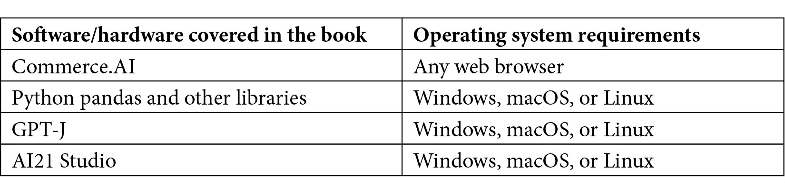

# 序言

商业的未来已到来。AI 驱动的商业正在使企业能够为消费者提供新的体验和价值。AI 将在产品和服务创新的未来中发挥至关重要的作用，改变品牌如何在多个接触点与客户互动。

Commerce.AI 将介绍 AI 的最新进展，以及它如何在多个行业中推动新产品和服务的发展。你将了解 AI 的最新进展，包括深度学习、**生成对抗网络**（**GANs**）、**自然语言处理**（**NLP**）和计算机视觉。

本书首先概述了 AI 在产品和服务创新中的不同应用，包括市场机会识别、创造产品创意和行业趋势预测。接下来，你将探讨 AI 在多个行业中的创新应用案例，从消费电子到奢侈品。最后，你将学习如何利用 Commerce.AI 的核心功能，赋能你的产品和服务团队，创造符合客户需求的创新产品和服务。

# 本书适合人群

本书将引导你完成产品和服务创新的全过程，无论你现有的技能如何。无论你是 AI 开发者、产品经理、分析师还是消费者洞察专家，本书将教你如何利用 AI 的力量进行创新。

# 本书涵盖的内容

*第一章*，*改善市场机会识别*，重点讲述了如何使用 AI 进行市场机会识别，并探讨了它如何帮助更好地理解客户的兴趣，除了他们的需求和欲望之外。这是任何希望精细化价值主张、调整客户体验或创造新产品或服务的公司必须完成的重要步骤。

*第二章*，*创造产品创意*，解释了如何利用 AI 和机器学习来寻找产品创意。我们讨论了自然语言处理（NLP）和大语言模型的概念，以生成产品创意。我们解释了如何利用 AI 分析市场数据，创造相关且受欢迎的产品创意。

*第三章*，*理解如何利用大数据预测行业趋势*，解释了如何使用先进的机器学习和数据科学技术预测未来趋势。它解释了大数据是什么，它的结构是什么，以及如何利用它来洞察未来。这对成功创造产品或服务至关重要，因为它帮助你理解消费者未来的需求。

*第四章*，*运用 AI 推动创新 – 奢侈品深度解析*，探讨了 AI 在奢侈品行业中的创新应用。分析了奢侈品公司如何利用该技术实现个性化、提升客户体验和开发新产品。

*第五章*，*运用 AI 推动创新 – 无线网络深度解析*，探讨了 AI 在无线网络行业中的应用。详细讨论了 AI 如何用于优化关键绩效指标，如星级评分、畅销排名、产品情感分析和转化率等。

*第六章*，*运用 AI 推动创新 – 消费电子深度解析*，分析了 AI 如何用于消费电子行业的创新。探讨了 AI 如何在产品定位、品牌研究、创意生成、洞察提取等方面提供支持。

*第七章*，*运用 AI 推动创新 – 餐饮业深度解析*，阐述了数据对餐饮创新团队的重要性。您将学习如何利用数据和 AI 为餐饮战略提供支持。

*第八章*，*运用 AI 推动创新 – 消费品深度解析*，阐述了 AI 在消费品行业中的应用。分析了 AI 如何用于消费品市场情报、内容生成、情感分析等众多领域。

*第九章*，*通过产品 AI 提供洞察力*，探讨了 Commerce.AI 的产品 AI 功能，帮助产品创新团队进行研究、开发、推出并跟踪成功的产品。

*第十章*，*通过服务 AI 提供洞察力*，探讨了 Commerce.AI 的服务 AI 功能，帮助服务创新团队通过真正理解客户及市场，构建下一代体验和口碑。

*第十一章*，*通过市场 AI 提供洞察力*，探讨了 Commerce.AI 的市场 AI 功能，帮助团队揭示面向客户行为变化、流行产品、崭露头角品牌及新产品机会的多维度信息、应用场景和话题。

*第十二章*，*通过语音调查提供洞察力*，深入介绍了 Commerce.AI 的语音调查，利用语音识别和自然语言理解技术。您将学习如何深入了解消费者的想法。

# 为了充分利用本书

您需要一台稳定的互联网连接和一个兼容 Python 的集成开发环境（IDE），支持 Windows、macOS 或 Linux 操作系统。所有代码示例均已在 Google Colaboratory 中进行测试，但同样适用于离线 IDE 和其他开发环境。



注意

如果你正在使用本书的电子版，建议你自己输入代码或通过书中的 GitHub 仓库获取代码（链接在下一节提供）。这样做可以帮助你避免因复制和粘贴代码而产生的潜在错误。

在阅读本书期间或之后，我们鼓励你注册 Commerce.AI 的免费试用，地址是[`www.commerce.ai/contact`](https://www.commerce.ai/contact)。

# 下载示例代码文件

你可以从 GitHub 下载本书的示例代码文件，地址是[`github.com/PacktPublishing/AI-Powered-Commerce`](https://github.com/PacktPublishing/AI-Powered-Commerce)。如果代码有更新，将会在 GitHub 仓库中进行更新。

我们还提供来自丰富书籍和视频目录中的其他代码包，访问地址是[`github.com/PacktPublishing/`](https://github.com/PacktPublishing/)。快去看看吧！

# 下载彩色图片

我们还提供一个 PDF 文件，包含本书中使用的屏幕截图和图表的彩色图像。你可以在这里下载：`static.packt-cdn.com/downloads/9781803248981_ColorImages.pdf`

# 使用的规范

本书中使用了多种文本规范。

`文本中的代码`：表示文本中的代码词汇、数据库表名、文件夹名称、文件名、文件扩展名、路径名、虚拟网址、用户输入和 Twitter 用户名。以下是一个示例：“查看更多正面评价，其中`polarity`（极性）为正，`subjectivity`（主观性）较低。”

代码块如下所示：

```py
s = df['Reviews']
df['Reviews'] = df['Reviews'].astype(str)
df = df[df['Reviews'] == s]
df[['polarity', 'subjectivity']] = df['Reviews'].apply(lambda   Text: pd.Series(TextBlob(Text).sentiment))
```

当我们希望你注意某个代码块的特定部分时，相关的行或项目会以粗体显示：

```py
s = df['Reviews']
df['Reviews'] = df['Reviews'].astype(str)
df = df[df['Reviews'] == s]
df[['polarity', 'subjectivity']] = df['Reviews'].apply(lambda   Text: pd.Series(TextBlob(Text).sentiment))
```

**粗体**：表示一个新术语、重要的词汇，或是你在屏幕上看到的文字。例如，菜单或对话框中的词汇会以**粗体**显示。以下是一个示例：“即使是积极的评价也会抱怨其范围，比如有一条评价简单地写着**短距离好**。”

提示或重要的注释

以这种方式显示。

# 联系我们

我们总是欢迎读者的反馈。

**一般反馈**：如果你对本书的任何部分有疑问，请通过电子邮件联系我们，邮箱地址是 customercare@packtpub.com，并在邮件主题中提及书名。

**勘误**：尽管我们已尽力确保内容的准确性，但错误是难以避免的。如果你在本书中发现错误，我们将感激你报告该问题。请访问[www.packtpub.com/support/errata](http://www.packtpub.com/support/errata)并填写表格。

**盗版**：如果你在互联网上发现任何非法复制的我们的作品形式，我们将非常感激你提供相应的地址或网站名称。请通过 copyright@packt.com 联系我们并附上相关材料链接。

**如果您有兴趣成为作者**：如果您在某个领域有专长，并且有兴趣撰写或为书籍贡献内容，请访问[authors.packtpub.com](http://authors.packtpub.com)。

# 分享您的想法

阅读完*AI Powered Commerce*后，我们很想听听您的想法！请点击此处直接前往该书的亚马逊评论页面并分享您的反馈。

您的评论对我们和技术社区都非常重要，将帮助我们确保提供优质的内容。
