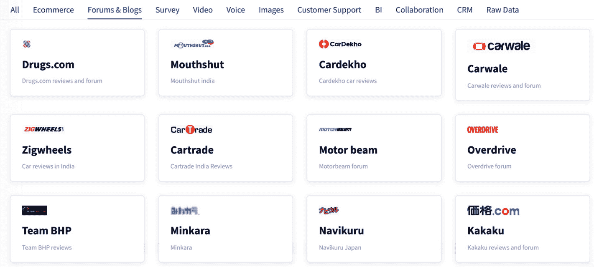
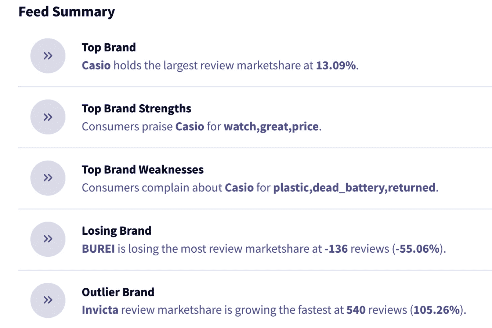
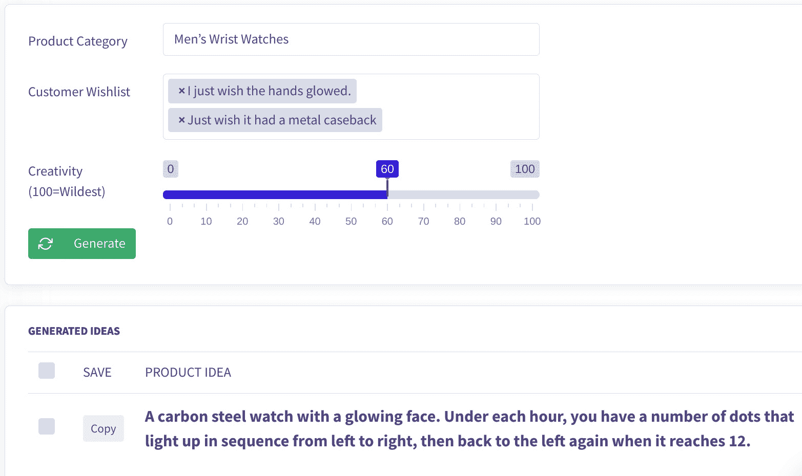

# 第二章：*第二章*：创造产品创意

提出伟大的产品创意并不容易。这既是一门艺术，也是一门科学，那些能够提出伟大创意的人，像史蒂夫·乔布斯和马克·扎克伯格一样，会被历史铭记。

在本章中，我们将探讨推动创建新产品创意的 **人工智能五大支柱**：语言理解、视觉理解、信息提取、信息组织和创造性人工智能。理解人工智能的五大支柱将帮助你在规划、管理和投资人工智能项目时更加具有战略性。

例如，一些产品团队可能希望使用人工智能生成新的产品设计，这将侧重于 *视觉理解* 支柱，而另一些团队可能希望使用人工智能来理解客户所需的功能，以此为新产品奠定基础，这将涉及 *语言理解* 和 *信息提取* 等支柱。

讲完这些内容后，我们将讨论如何构建、选择和迭代产品创意。最后，你将学习如何利用 Commerce.AI 改进产品创意过程，并利用数十亿个数据点获得竞争优势。

本章将讨论以下主题：

+   理解人工智能的支柱

+   为什么产品创意如此困难？

+   使用 Commerce.AI 进行创造性人工智能

+   构建产品创意

+   选择产品创意

+   迭代产品创意

产品创意对于企业成功至关重要。在过去，企业常常因为不了解客户的真实需求，直到产品完成后才意识到自己做错了，所以未能创造出客户想要的产品。但这种方法现在已经越来越过时。互联网为公司提供了前所未有的客户数据和洞察，让他们能够随时了解客户需求，从而借助人工智能的力量，更快、更好地开发出更符合客户需求的产品。

# 理解人工智能的支柱

这些是人工智能的五大支柱，它们为使用人工智能进行产品创新奠定了基础：

1.  **语言理解**

1.  **视觉理解**

1.  **信息提取**

1.  **信息组织**

1.  **创造性人工智能**

当你将前四个支柱与创造力结合时，你得到的就是所谓的 *创造性人工智能*。换句话说，前四个支柱是创建推动各种创造性应用的数据信息结构所必需的。

创造性人工智能是一种先进的人工智能形式，它能够解决之前被认为机器无法完成的问题，无论是设计全新的产品，还是提出真正创新的想法，比如 Google 如何利用人工智能设计出比人类工程师更快、更圆润和更具有机感的计算机芯片，或者 Autodesk 的设计师如何使用人工智能设计出比常规设计更轻、更强、更高效的骨架支架。在本节中，我们将更详细地探讨人工智能的五大支柱，以及它们如何与产品创作相结合。

## 语言理解

语言理解是读取用户心思的能力。

人工智能创新的最重要支柱之一是语言理解，它使机器能够解读人类的文本和推理，并返回用户能理解的回应。实现这一点的能力通常被称为**自然语言处理**（**NLP**）。NLP 已经存在了几十年，但直到最近，得益于深度学习算法，它才迎来了显著的进展。

与传统的机器学习方法相比，深度学习可以使用神经网络识别数据中的模式。这种方法利用大量数据集，并以比以前的方法更高的速度产生准确的结果。深度学习不仅可以预测未来的结果，还能通过语音或书面表达感知用户的意图或心态。

例如，如果你问 Google Home 设备明天旧金山的天气，它可能会回答*明天天气晴朗，最高气温 82 华氏度*。这是因为深度学习技术将你说的话解读为获取信息的请求，并基于其庞大的知识库提供它认为你需要的信息。

这里的关键点是，现代的自然语言处理（NLP）技术使机器比以往更能理解我们的意图，这意味着我们可以更容易地构建用于多种任务的对话代理（例如，在安排会议时）。好消息是，由于现代 NLP 技术相较于其他人工智能技术（如图像识别）并不复杂，我们不缺乏可以改善我们生活的应用实例。

语言理解帮助产品团队的一个方式是从现有的产品创意中生成新的产品创意。例如，假设你有一个关于为建筑工人设计新安全帽的创意。你可以利用语言理解将这一创意自动扩展为一个智能安全帽，可以监控工人的位置，并警告他们接近危险物体。总体而言，这就像是超级版的自动完成。我们将在*Transformer*部分探讨这一原理是如何实现的。

语言理解的另一个应用是帮助公司扫描在线用户评论，找出用户希望在产品中加入的特定功能。例如，如果你现在去亚马逊，查看任何热门产品的评论区，你会看到数十条客户评论在询问产品的功能，这些评论或是显式的，或是隐含的。一款受欢迎的零食评论包括*味道平庸*和*零食粘在一起了*。

通过语言理解，这些评论可以被提取并转化为客户愿望清单。产品团队可以利用这些愿望清单作为反馈信号，了解客户对产品的需求，从而在时间的推移中改进产品。

鉴于 95%的互联网数据是非结构化的，且大多数是文本数据，语言理解是 AI 的一个关键支柱。这项技术同样适用于语音数据，使得在市场调研中收集和分析客户反馈的方式发生了变化，例如语音调查。

实际上，在 Commerce.AI，我们发现 95%的研究参与者更喜欢语音调查，而不是传统的调查表单。

## 视觉理解

视觉理解是指通过图像识别物体。一个智能计算机程序能够理解图片的元素，并利用这种理解生成新的创意，AI 程序也可以通过用户反馈进行训练，从而根据客户需求开发新产品。这些程序可以收集客户反馈，例如通过我们的产品数据引擎、语音调查或焦点小组，然后利用 AI 将其转化为产品创意。这个过程产生了大量关于用户兴趣的数据。

让我们来探讨视觉理解如何在三种不同类型的产品创新中得到应用：

1.  **生成更好的产品洞察和产品反馈**

    首先，视觉理解解决了寻找关于人们需求的数据的问题，AI 系统可以被训练识别图像中的物体。这可以为产品和产品反馈提供更好的洞察。

    例如，亚马逊上列出了数百万种商品。如果考虑到亚马逊市场（Amazon Marketplace），这个数字估计接近 3.5 亿种商品。这些商品的许多列表并未详细列出照片中包含的所有视觉信息。换句话说，亚马逊的商品照片是另一个重要的商品数据来源。通过视觉理解可以帮助理解这些照片及其细节，特别是在文本描述不足时，它尤其有用。

    苹果使用面部识别技术，这是一种视觉理解的形式，使用户可以轻松解锁他们的 iPhone。它们还使用增强现实技术，另一种视觉理解，来创建个性化表情符号。

1.  **通过挖掘用户反馈开发新产品**

    除了生成更好的洞察之外，视觉理解还可以帮助你开发*新的*产品和功能。例如，许多在线评论中包含产品图片，突出显示产品的亮点功能，也可能包括缺陷。视觉理解不仅可以用来分析这些图片，还可以与常规的文本数据一起，帮助产品团队了解哪些产品和功能需要更改，并避免将来出现类似的缺陷。

1.  **为视力障碍或盲人用户开发解决方案**

    让我们再看一个与用户体验创新相关的视觉理解的好处：视觉理解还用于改进使盲人计算机用户能够更容易访问网站的软件。例如，许多产品列表中的图片缺乏*替代文本*，即盲人用户通过语音朗读听到的图像描述。有了视觉理解，这些替代文本可以自动生成。

    这可以通过使用像 OpenCV 这样的 AI 库来实现，OpenCV 是一个流行的计算机视觉和机器学习框架。OpenCV 使用像**卷积神经网络**（**CNN**）这样的技术，通过提取模式和特征来进行图像分类任务，基于之前学习的内容对图像进行分类。

这些神经网络可能会提取图像中的特征，比如颜色直方图、边缘和形状，或任何其他有助于识别和区分不同物体的特征，识别后可以将其作为替代文本（alt-text）添加。

## 信息提取

信息提取是从非结构化文本来源中提取信息的过程，旨在发现实体，并对其进行分类和存储到数据库中。这是数据科学和人工智能的重要组成部分。

在写作时，我们可以使用各种工具从非结构化文本来源中提取信息，例如自然语言处理（NLP）和深度学习。

通过对客户数据进行信息提取，你可以开始将数据转化为洞察。

### 使用客户数据

信息提取当然是提取产品数据的重要组成部分，但它也常用于客户支持服务领域，并且能够帮助你解答以下问题：

+   *客户对我们的产品有什么看法？*

+   *客户对我们产品描述中的不同声明有何反应？*

+   *哪些词汇在我们的产品评论中最常被提及？*

这些客户数据可以来自各种来源，包括论坛和博客、调查、视频、客户支持票务系统、客户关系管理系统（CRM）等。以下截图突出了客户数据来源的冰山一角：

图 2.1 – 客户数据来源示例

最理想的情况是能提前回答客户的问题，或根据用户迄今为止的反馈做出建议。这类服务可能听起来像是未来的技术，但已有一些公司提供这样的服务。例如，Expedia 刚刚推出了一款 AI 聊天机器人，利用机器学习和自然语言处理（NLP）技术帮助人们预定酒店。更具体地说，在聊天机器人中使用`我的卡不能用`时，系统需要将其处理为支付信息的请求。

意图提取器会查看所有可能的意图，并尝试将它们与用户输入的内容匹配。从技术层面来看，这通过使用在过去的对话中经过标注的用户意图训练的模型来实现。该模型能够理解用户语言中的模式，将用户的消息与意图匹配，即使关键词不完全相同。

然而，这里最大的问题是如何将自然语言处理（NLP）技术在商业中规模化使用，而不陷入使用固定回答或预选问题集的困境。聊天机器人应该能够与人类进行自然对话，而固定的回答会限制沟通中的类人特质，这意味着需要高质量的 NLP 工具。

### 使用 AI

在这里，AI 发挥了重要作用：生成可以在投入资金建设新的聊天机器人或招聘新员工从事客服工作之前进行测试的新想法。

虽然提取本身并不是解决方案，但它能够帮助我们更好地提出关于问题的问询，并识别改进的机会。数据提取为我们提供了快速了解产品评论、情感和市场数据的手段。通过提供关于客户行为的洞察（例如，用户最常用的功能以及他们遇到特定问题的频率），我们可以提出更好的问题，探究用户为何会遇到这些问题，以及如何解决它们。

提取数据后，我们可以继续进行组织工作。

## 信息组织

信息组织是对提取的数据进行整理，以获得更深刻的洞察。

信息组织创建结构并建立产品、品牌和属性之间的关系，从而促进新想法、描述甚至广告文案的创作。例如，以下屏幕截图展示了 Commerce.AI 将手表品牌的相关信息组织成**Feed Summary**。仅从这组有序的信息中，我们就可以看出，客户喜欢卡西欧的价格，但抱怨其使用塑料材质并且电池不好。

图 2.2 – 一组关于手表品牌的组织信息样本

AI 在信息组织方面比人类更快、更便宜、更有效。让我们来看一下 AI 在信息组织中能提供帮助的五种具体方式。

### 缩短信息收集时间

虽然收集数据对产品创新至关重要，但它也非常耗时。这是从用户和客户收集数据的最大缺点之一。

更具体地说，你需要在一定时间内收集大量的用户反馈或客户偏好（这会占用大量预算）。但随着机器学习和自然语言处理等强大 AI 工具的出现，你不再需要投入那么多资源来进行数据分析。

相反，你可以通过将数据分析外包给了解如何阅读用户反馈的 AI 来节省大量资金。这种方法不仅可以节省资源，还可以更快地做出关于产品的更明智的决策，从而改善业务结果。

信息组织取决于在品牌、产品类别和属性之间收集正确的产品信息。通过使用人工智能加速信息收集，我们可以更快地为信息组织提供正确的产品数据。

### 消除重复的数据收集

另一个运行调查或面试时的主要缺点是从客户或用户那里获得重复的响应。

例如，如果我想了解市场上各种产品的客户偏好，我会问一些问题，比如，“您目前使用哪款智能手机？您更喜欢哪个品牌？这些手机还有哪些标准功能？”

借助人工智能工具如机器学习和自然语言处理，您可以通过自动化任务（如发送调查或使用聊天机器人自动进行访谈）来消除重复性反馈。

### 基于大数据做出更好的建议

有时候，我们往往更倾向于依靠自己的判断，而不是分析人们的需求。一些例子包括当我们想到一个新的产品理念时，当我们想象我们希望产品拥有的功能时，以及当我们考虑改善被认定为问题的一个方面时。

由于用户经常明确提到期望的功能和产品属性，无论是在亚马逊的评论中还是 YouTube 的拆箱视频中，利用这些大数据比依靠直觉更好。高质量的有组织信息需要大数据，特别是在大规模理解客户方面。通过使用人工智能进行大数据分析，公司可以挖掘数据中的趋势和模式，这些模式和趋势他们之前可能无法看到，从而提供更高质量的信息。

### 获得现有数据的价值

当今公司最常用的反馈收集方法是询问用户问题。

然而，这种反馈通常已经存在于数百万在线产品评论中，既包括相关公司，也包括竞争对手。这些数据的问题在于它们是非结构化和无组织的，这意味着存在未开发的价值。借助人工智能，公司终于可以对这些现有数据进行结构化处理，并从中获得价值。随着人工智能变得越来越可及，产品团队开始利用这些非结构化数据，但大多数数据仍然被技术负担所困扰，分析大量原始数据仍然是一个挑战。因此，通过使用人工智能，产品团队仍然可以通过使用人工智能获得竞争优势。

### 创建热度图

机器学习有助于生成热力图，展示从多个平台（如网页——包括移动网站和桌面站点）上填写的在线表单收集到的信息，这些信息由 Google Analytics 等服务提供。这些有序的数据帮助公司在创意构思之前和过程中做出决策。通过将用户关心的内容组织成视觉层级结构，产品团队可以将创意思维过程集中于真正重要的内容。例如，假设你是一家汽车公司，用户更关注你的自动驾驶功能而不是快速充电——这将指导你的创意构思过程，重点进一步改善自动驾驶功能。

## 创意 AI

通过利用 AI 生成创意，我们可以开发更多令客户满意的产品，并将他们转化为长期用户。简而言之，我们利用最新的 AI 技术，尤其是大型语言模型，来指导产品构思。

这个过程被称为**基于语言模型的概念生成**（**CGLM**）。CGLM 是一种有效的策略，能够生成一系列符合用户需求和欲望的新颖概念。

除了生成自然语言，创意 AI 还可以使用一种叫做**生成对抗网络**（**GANs**）的技术来设计新产品。GAN 的思想是训练两个竞争的神经网络，第一个网络生成虚假的图像，第二个网络*判别*这些图像是现实的还是虚假的。生成模型不断尝试欺骗判别模型，直到真实图像与虚假图像无法区分。GAN 曾被广泛应用于制作*深度伪造*名人和政治家的照片和视频，但它们也可以用于生成产品概念，无论是新的公寓布局还是运动鞋设计。

这些类型的创意 AI 支持产品构思过程，通常这是一个漫长且艰难的过程。

# 为什么产品构思如此困难？

生成新产品创意的最流行方法之一是通过头脑风暴练习，如创意练习或思维导图技术，这些方法被设计师、建筑师和工程师用来打破创作瓶颈或在遇到难题时寻求突破。这些方法非常有用，因为它们能够使来自不同领域的人聚集在一起，分享不同的视角。

然而，这种方法在生成真正创新的商业产品方面存在局限性，因为它侧重于想象而非实际的客户需求和欲望。

另一种现在许多公司采用的技术是通过调查或焦点小组将客户纳入创意过程，让他们分享关于自己想要什么的意见。虽然这种方法更有利于融入客户反馈，但它也非常昂贵且耗时。领域专家必须手动记笔记、整理并分析反馈，并将其与外部数据结合，才能继续前进。然后，他们需要找到一种方式，与实际的产品开发团队进行协作，确保反馈被理解并得以使用。

这个冗长且昂贵的过程在收集的数据方面也有很大的局限性。焦点小组只能包含有限数量的用户。而借助 AI，可以分析所有可用的产品数据，包括文本产品评论、产品描述、视频评论、语音调查等等。AI 的速度也远超人类，这意味着这些数据可以实时提取、组织并分析，直接为产品团队提供洞察。这些整理好的数据也为创意 AI 提供了燃料，包括产品构思。最终，产品构思对成功至关重要，否则你的业务可能会变成一个未能创新的“死亡企业”。

而且这并不一定是负担重的，正如 Commerce.AI 所展示的那样。Commerce.AI 是一个平台，可以让你轻松构建和管理你的产品创意，从构思到开发再到发布。

# 使用 Commerce.AI 进行创意 AI

如我们所述，创意 AI 依赖于语言理解、视觉理解、信息提取和信息组织。通过 Commerce.AI，这些组件结合在一起，让你可以随心所欲地生成新的产品创意。

Commerce.AI 的标准分析包括产品排行榜、按市场份额排名的顶级产品和品牌的图表、按星级评定的顶级产品和品牌的评论分析、市场格局图以及更多内容。创意 AI 组件利用这些数据，并结合精选的客户愿望单信息，生成新的产品创意。类似地，你也可以生成广告文案，通常这是一个繁琐的手动任务，而现在它可以轻松完成。

正如我们所见，AI 可以具有创造力，并且是产品团队加速创新过程的强大工具。现在，我们已经了解了 AI 和产品构思的背景，接下来让我们利用这些知识，学习如何构建、选择并迭代产品创意。自然而然地，构建产品创意是第一步，但并非每个创意都会成为热门，这就是为什么在最好的创意上精心选择和迭代非常重要。

## 构建产品创意

创新新产品创意是一个严峻的挑战。借助 AI，尤其是**大型语言模型**（**LLM**），产品构思变得轻松起来。

LLM（大语言模型）可以处理大量文本信息（无论是文字评论、YouTube 视频，还是语音调查），并生成新的文本。为模型标注的数据越多，它生成原创想法的能力就越强。例如，使用 Commerce.AI 的产品创意生成器，机器学习被用来扫描来自特定类别的大量产品评论，比如男士手表，然后提取客户的愿望清单信息。

下一步是将这些客户愿望清单信息输入到 LLM 中，生成新的产品创意。在下面的例子中，给定“我希望指针能发光”和“我希望它有一个金属表背”这两个愿望，LLM 生成了如下文本：

`一款具有发光表盘的碳钢手表。每个小时下方都有一些点，这些点会按照从左到右的顺序依次亮起，然后当它达到 12 点时，灯光会再次从右到左亮起。`

](img/Figure_2.3_B17967.jpg)

图 2.3 – 基于客户愿望清单生成产品创意

如果你还没有使用过语言模型，可以尝试 OpenAI 的 GPT-3 等 AI 模型。GPT-3 是在互联网上数十亿条内容上进行训练的，用来生成新的文本，就像你手机上的自动完成功能加强版。

目前，这些系统相当基础：它们只是一个接一个地生成词语，并没有真正的智能，也不能理解它们的含义。尽管如此，GPT-3 可以被用来像人类一样进行写作，应用于多种现实场景。例如，它可以被训练为支持某个政治候选人的一致性论点；或者它可以被训练为更生动地写下某个记忆或经历；它也可以被训练为生成新的产品创意。

所以，尽管一开始听起来可能很天马行空，但这种基于名为*transformer（变换器）*的人工智能架构的技术，确实有非常实际的应用。

### 变换器

例如，GPT-3 使用**transformer（变换器）**。变换器是世界上一些最流行的自然语言模型背后的秘密武器，包括 Facebook、Google 和 Microsoft 等公司。

在技术层面，变换器使用所谓的**sequence-to-sequence（序列到序列架构）**，或**Seq2Seq**。顾名思义，Seq2Seq 是一个神经网络，它将一串元素（例如一段文本）转换为另一串元素。

Seq2Seq 模型由*编码器*和*解码器*组成。编码器接受输入序列并将其转化为一组潜在变量，这些变量随后传递给解码器。解码器负责将这些元素转换回一个序列。

举个例子，如果你有一个文本说 `The quick brown fox jumps over the lazy dog`，模型可能想知道`dog`指的是哪种动物。这个任务涉及将`dog`这个词编码为一个数值符号，以便可以根据其他符号进行计算。

例如，单词`dog`的标记可能位于`wolf`和`pet`这两个单词的标记之间。当然，这个例子极大地简化了问题，因为每个字符和每个单词都会有一个标记，从而创建出一个计算机能够用来理解语言的庞大网络。

这使得计算机能够以之前被认为不可能的方式从文档中提取语义特征。如前所述，这个模型将句子结构作为输入特征——或者你可以称之为*输入向量*——因此我们可以在这里从概念层面了解它是如何运作的。

句子是监督式序列模型（如 Seq2Seq）中的参数；它们通过编码器传输，编码器将其转化为向量（潜在变量）。这些向量随后通过一个或多个网络，再转化为序列以供输出处理（解码）。

关于术语的简要说明

这些模型之所以被称为变换器，不仅因为它们能够变换句子；它们还能够将字符转化为字符（或单词）。字符变换器不仅处理单词，还处理字母。它逐个字符地处理，而不是一次性处理一组字符。

字符变换器模型和像 Microsoft Word 或 Apple Pages 这样的文字处理器之间存在差异。然而，它们在后台做的事情是类似的：它们通过计算机算法处理原始数据，直到屏幕上出现我们人类可以轻松阅读的结果。

Transformers（变换器）是人工智能发展的关键，因为大多数人认为机器人在真正发挥作用之前需要具备出色的阅读和写作技能。无论我们希望机器人是帮我们吸尘还是为我们端上晚餐，都取决于它们的语言理解能力有多强。在教机器人执行特定任务之前，我们需要那些能够在上下文中理解自然语言句子的机器人。

虽然变换器可以在文本上进行训练，将其编码为数值标记值，但它们也可以在*像素*上进行训练，这些像素会被编码为数字（即像素的 RGB 值矩阵）。因此，变换器不仅可以像生成文本一样生成图像，如这个由 AI 图像生成帮助设计的椅子示例所示：

](img/Figure_2.4_B17967.jpg)

图 2.4 – Emmanuel Touraine 的生成设计，CC BY-SA 4.0（https://creativecommons.org/licenses/by-sa/4.0）

从产品设计到标志资产或其他设计材料，基于人工智能的图像生成器将在产品创新过程中发挥越来越大的作用。

## 选择产品创意

创新是产品团队的命脉。然而，创新新产品创意只是其中的一步。让我们探讨一下如何选择合适的产品创意来实现商业成功。

很多商业领袖低估了将产品视为一个持续过程的重要性。他们认为一旦有了一个好主意，就可以立即开始构建并推向市场。但这种思维方式从根本上是错误的。历史上最成功的产品并不是一夜之间开发出来的，而是通过系统的规划和执行过程逐步发展而来的。这一基本路径是许多公司能够年复一年持续增长市场份额的原因。

这里的一些重要问题包括：

+   *产品经理应该将精力集中在哪些方面？*

+   *他们应该专注于原始的想法（或想法），还是应该基于其他机会开发能够提供更强投资回报的产品？*

+   *如何知道哪些想法值得追求？*

每个公司都面临不同的外部竞争压力。这意味着每个公司与其产品相关的机会和威胁都是独一无二的。例如，当 Facebook 于 2004 年成立时，消费者还没有智能手机；今天，成千上万的智能手机应用程序与 Facebook 争夺用户的注意力。那么，Facebook 应该追求哪些想法呢？

为了帮助回答这些问题，您可以考虑六个关键因素：

1.  您公司的需求。

1.  产品为您的客户解决了什么问题。

1.  是否存在被竞争对手忽视的问题。

1.  解决这个问题的市场有多大。

1.  您处于产品生命周期的哪个阶段。

1.  无论是您的产品即将发布新版本，还是您当前市场上已有版本的产品。

这些问题的答案将帮助您优先考虑产品创意。例如，如果您的公司在当前产品方面已经走得很远，并且没有受到任何主要竞争威胁的困扰，那么也许可以花些时间来开发完全不同的东西。然而，如果您仍在进行开发，并为现有产品的新版做规划，那么转向新的想法可能就不太合适了。

如果您有高技能的员工，他们已经知道如何制作像您这样的产品，那么他们可能能够立刻开始构建，而不需要太多培训或再培训。或者，如果成功构建产品需要许多具有互补技能的人（像 Facebook 这样的公司就是如此），那么您可能希望在启动需要多人参与的项目之前先扩大团队（例如招聘设计师和写手）。您也可以考虑与拥有相关技能的其他组织合作（例如，Twitter 一直依赖外部承包商作为其工程团队的一部分）。

这些合作伙伴关系还可以通过将开发成本分摊到多个组织之间来帮助降低风险。

这个因素会根据公司在筹资活动和现金储备方面的不同而发生显著变化。如果你现在正在筹集资金或寻找投资者，但没有显著的收入流产生利润，那么最初在不太可能立刻盈利的风险项目上花费资金并不是那么关键。然而，一旦事情重新启动（并假设投资者继续相信你的商业模式），快速推出产品将能让它们更快地创造收入。

需要注意的是，回答所有问题的强有力答案并不保证成功；它只是帮助团队做出更好的选择，确定哪些机会足够有前景，值得在未来进一步追求。

## 迭代产品想法

然而，选择正确的产品想法并不足够。一旦选择了一个有潜力的想法，想法迭代就会接管。想法迭代是一个高度战略性的过程。

许多公司尝试在没有正式规划或迭代的情况下执行他们的原创产品想法。这些公司通常无法保持动力，最终会将有潜力但未经验证的产品淘汰。

相比之下，许多成功的产品经历了明确的迭代，这些迭代是根据组织学习的原则指导的。尽管想法本身没有改变，团队会根据用户需求添加新的功能、能力和特性。一个例子是雅虎在 2005 年收购 Flickr。当时，Flickr 已经是一个受欢迎的平台，供人们与其他用户分享照片和视频。但通过收购 Flickr，雅虎团队能够通过提供照片共享功能创造出更具吸引力的用户体验。

另一个例子是 Facebook 从*热或不热*的评分网站发展成为一个全球性的通讯和媒体平台。Facebook 起源于大学宿舍，许多早期用户希望有一种轻松的方式与朋友保持联系。但随着 Facebook 的普及，它吸引了更多希望从该网站获得更大收益的职业用户。对此，团队创造了诸如“活动”和“群组”等新功能，帮助人们找到那些他们不太熟悉但可以作为职业建议或帮助组织工作日的伙伴的朋友群体。

当然，并不是每个产品想法都会取得如此大的成功。但如果你的组织正在经历类似的创新过程，你需要确保在每个步骤都有相应的迭代策略。这里的教训是，创新过程应当由用户的需求和愿望来引导。

# 总结

人工智能是一个非常广泛的概念。我们使用这个术语的方式会根据上下文的不同而有所变化。在大多数情况下，它指的是通过从数据中学习，能够独立完成困难任务的机器。

Commerce.AI 作为一个 AI 平台，位于你和数据之间，使你能够构建出比以往更有效地解决客户问题的产品，包括通过使用创新的 AI。它从产品生态系统的各个部分捕获数据，并允许你以人类无法做到的方式提问关于产品的问题，并将原始数据转化为你可以用来改进产品并做出更好的业务增长决策的有价值的信息。

通过语言理解、视觉理解、信息提取和信息组织这几个支柱，你可以利用 AI 为产品团队提供更高效的创意构思支持。创意构思对于产品成功至关重要，但这并不是你所需的唯一技能。行业趋势在不断变化，洞察这些变化并根据变化调整产品战略需要敏锐的眼光。虽然本章探讨了如何生成产品创意，但你还需要确保你提出的产品创意符合正在流行的、可行的市场趋势。

在下一章，我们将探讨如何通过大数据预测行业趋势。
