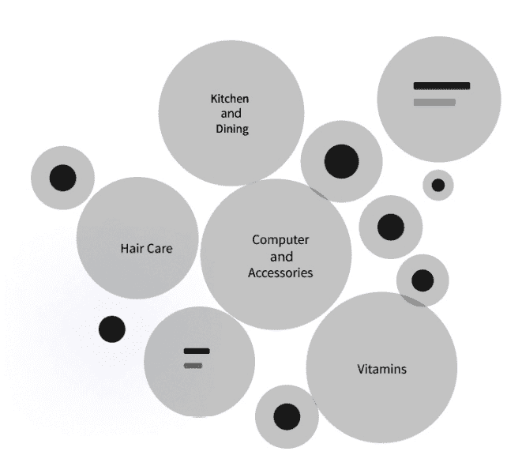
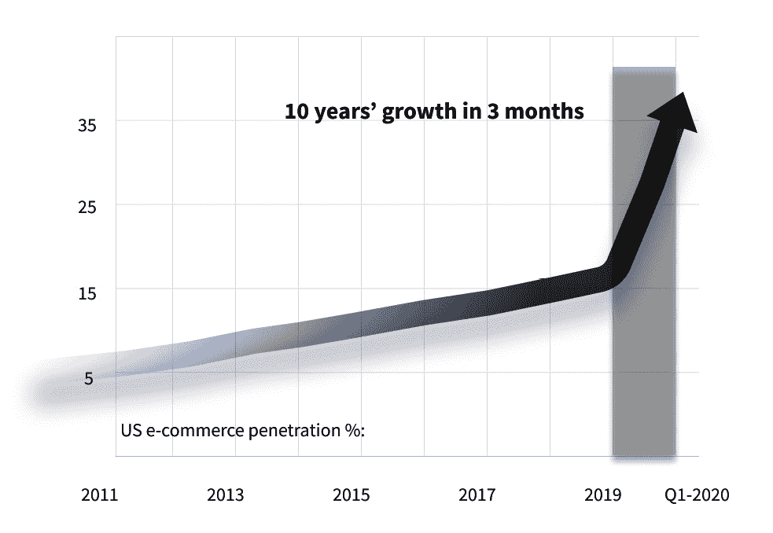
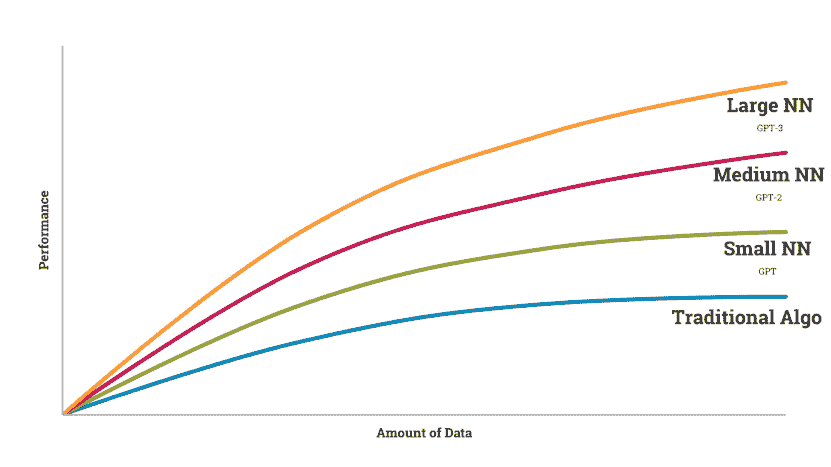
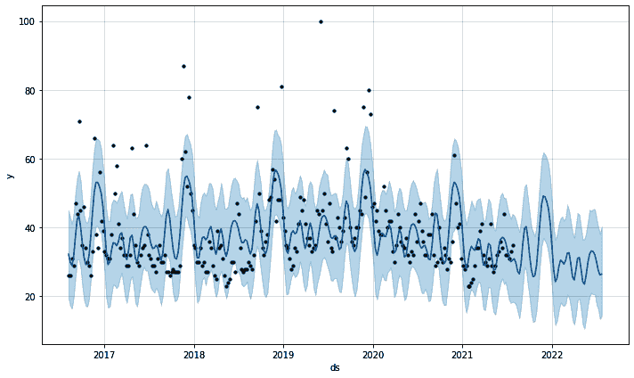
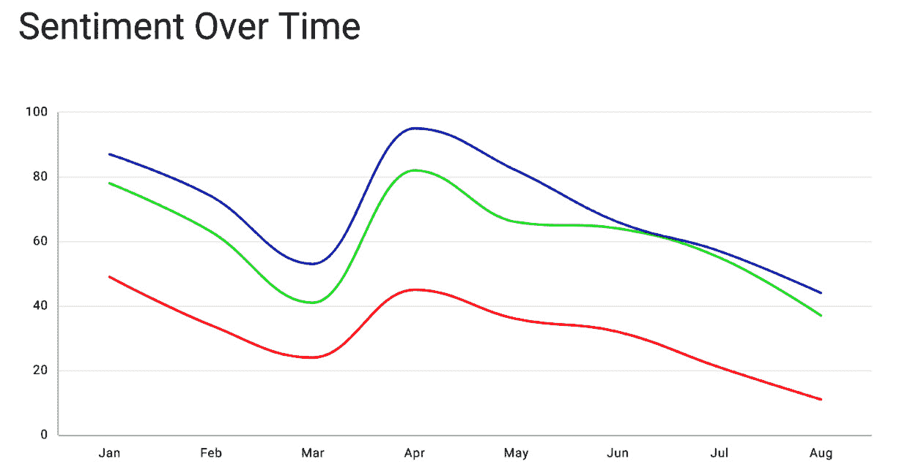
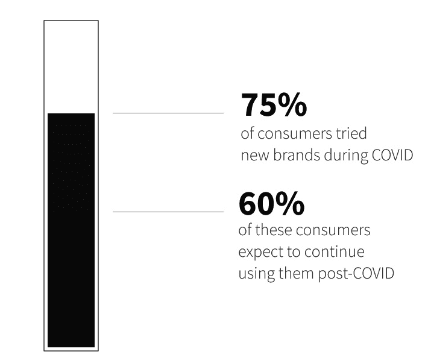
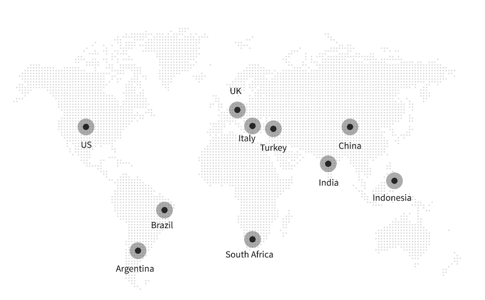

# 第三章：*第三章*：理解如何利用大数据预测行业趋势

**预测**是一项棘手的工作；没人能确切知道为什么有些预测是对的，有些预测是错的，但影响预测准确性的两个主要因素是：

+   使用了哪些数据和模型

+   预测变量时所做的假设

不幸的是，正如本章所示，大多数传统的预测方法由于没有正确考虑这些重要因素，因此预测精度较低。在这里，我们将探讨**大数据**如何改变这一切，帮助做出更准确的预测。

我们的目标不是再给你提供一个预测工具（尽管我们会讨论一些）。相反，我们想分享一些见解，解释为什么传统方法会失败，以及我们如何利用大数据来做出更好的预测。这些见解将帮助产品团队走向成功，因为准确的市场需求和情绪预测对于产品成功上市至关重要。

为此，本章将涵盖以下主题：

+   为什么传统预测会失败

+   使用大数据来支持更好的预测

+   从数据驱动的预测中获取价值

# 技术要求

你可以从本书的官方 GitHub 仓库下载本章的最新代码示例，地址是：[`github.com/PacktPublishing/AI-Powered-Commerce/tree/main/Chapter03`](https://github.com/PacktPublishing/AI-Powered-Commerce/tree/main/Chapter03)。

# 为什么传统预测会失败

传统的预测方法基于这样一个观点：你需要具备不同产品和服务的专家知识和直觉，才能建模其未来行为。然而，这种方法有其根本性限制，具体如下：

+   不可能了解所有产品和服务的所有信息。

+   了解产品今天的表现并不能很好地指导预测它们明天的表现。

+   许多产品的行为高度相关，且难以理清。

+   传统模型在今天的大数据面前变得不堪重负。

+   数据本身不断变化。

为了应对这些挑战，我们需要新的预测方法，这些方法能够处理大量异质数据，同时提供更可靠、更准确、更易于解释和更有用的预测，以供决策者参考。

让我们详细探讨这些限制，为新的预测方法的必要性奠定基础。

## 不可能了解所有产品和服务的所有信息

在预测中，你要么假设所有相关数据都已捕获，要么在预测中留出一定的误差空间。另一方面，如果你打算用机器学习模型来捕捉关于某个产品或服务的所有信息，那为什么不从一开始就做到准确呢？

当我们试图使用传统统计方法对市场需求等问题进行精细建模时，会遇到两个根本性问题：

+   统计方法在建模变量之间的相互作用方面非常薄弱。

+   统计方法在捕捉变量之间的相关性方面非常有效。

传统的统计方法无法很好地应对许多产品或服务以复杂的方式相互作用，并且在不同产品和服务之间共享属性这一事实（这也是*中间商品*这一流行概念的基础）。

一个典型的例子是航空旅行：城市间的航班市场可以看作是大市场中的一系列子市场。城市间有航班，也有区域内、洲际等航班。在每个市场中，都有许多不同的选择。这样，航空公司可以将其市场细分为多个细分市场，然后根据细分市场的需求定价，这也解释了为什么它们在某些航线上提供低票价而在其他航线上票价非常高。

大多数统计模型假设所有相关变量（例如，飞行时长或停靠次数）是独立分布的；它们忽视了相互关联的变量如何相互影响。因此，这些模型低估了未来会发生什么，因为统计模型假设客户会根据他们独特的偏好选择产品和服务，而不是基于大量相互作用的数据点，包括其他客户的行为。例如，**从众消费行为**的概念指的是在品牌之间，客户具有集体的、趋同的购买习惯。

难怪传统的统计方法在预测客户未来需求以及公司如何应对变化的环境以保持相关性方面失败。今天尤其如此，因为市场上可用的产品数据比以往任何时候都多。只要我们接受这些不现实的假设，并基于小数据集建立预测，我们的预测就永远不会比现实更准确。

## 知道产品今天的表现并不是预测它们明天表现的好方法。

这是因为像所有经济变量一样，产品不会以简单的线性方式反应。考虑使用线性回归法来预测产品销售的传统方法。在这种方法中，你基于历史销售数据来预测产品需求，且模型中很少（或没有）加入额外的知识。但如果市场中的某些因素（例如，竞争者进入某个行业或消费者的消费模式发生显著变化）发生变化，你的需求预测可能会发生巨大变化，导致实际销售与预测销售差距很大。

## 许多产品的行为高度相关，且往往难以理清。

这对传统的预测方法来说是一个问题，因为我们本质上是在尝试预测许多产品的未来行为，但我们仍然需要理解是什么让某个特定的产品或特性有可能在市场上成功或失败。这也是为什么成功的产品预测如此稀少的原因。我们在媒体中一再看到这样的情况：一家公司发布了一款新产品，它在短时间内变得流行（可能是由于某些营销活动），但随后我们发现销售下滑，或者它只是一个小众产品。

然而，由于人们对产品的反应，导致这些下降背后的原因往往不清楚。可能是产品本身不再有用，因为竞争对手改进了他们的产品；也有可能是消费者对其感到厌倦，转而去尝试其他产品。

## 传统模型无法应对今天的大数据

传统模型并没有为应对现代商业世界而设计——如今数据量太大，简单的模型根本无法预测。在传统的预测中，你会有一堆不同的输入（例如，过去一年的销售数据、调查中的客户忠诚度评分等），然后根据对这些变量的假设，得出对未来的预测。问题是：影响市场成功的数据远远超出了这些模型所能捕捉的范围。

这就是为什么传统的预测模型在捕捉大趋势方面表现不佳，无论是电子商务的兴起、社交媒体的兴起，还是实体媒体的衰退：它们根本无法处理来自各种来源的当今实时、非结构化的大数据。

## 数据本身不断变化

随着我们的数据变得越来越复杂，做出准确预测变得更加困难。这些问题被一个事实所加剧，那就是没有单一的数据来源可以反映消费者支出，甚至连消费模式也没有完整的数据。美国政府和联邦储备提供了一些个人收入和支出的统计数据，但这些并不能完整反映情况。零售商报告销售数据，但并没有提供顾客购买了什么商品或支付了多少；信用卡公司和银行可能报告一些高层次的消费模式，但缺乏细节。

还有一个问题是：随着企业不断扩大在线业务，它变得比以往任何时候都更加困难去准确追踪人们在线和线下商店的购买行为。因此，您的预测能力受限于可以手动选择的可用数据的局限性。

大数据可以帮助我们克服前面提到的挑战，了解产品和服务随着时间的推移将如何表现。

# 利用大数据实现更好的预测

因为人工智能从大数据中学习，我们可以利用它来发现关于不同产品或整个市场的大数据中的隐含模式，并克服传统预测的最大挑战。

例如，使用 Commerce.AI，我们扫描来自 100 多个来源的数十亿个产品数据点，寻找流行的产品类别，向产品团队展示值得追求的市场机会。以下图表展示了通过 Commerce.AI 数据引擎发现的一些热门产品类别。产品团队可以选择任何类别深入探讨，找到领先品牌、畅销产品、产品评论等更多信息。



图 3.1 – 热门市场细分

这些数据为特定市场类别以及更大市场细分提供了洞察。例如，在前面的图表中，我们可以看到像计算机及配件、维生素以及厨房和餐饮等市场是特别大的机会。接下来的图表显示了对整个电子商务行业进行分析的结果，显示出该行业在 COVID-19 大流行初期的 3 个月内经历了 10 年的增长：



图 3.2 – 美国电子商务渗透率增长

以亚马逊为例，您可能想知道哪些书籍在不同季节销量最好，同时也想知道哪些书籍在购买其他与食品和烹饪相关的书籍的读者中更受欢迎。或者，您可能会查看不同类型汽车的历史销售量，思考什么因素驱动了消费者在它们之间的选择。通过足够的数据，人工智能可以提供关于个别产品及其在不同场景中的表现的丰富见解（例如，*如果在超级碗期间推广我的新智能手机应用，会发生什么？*）。

算法甚至可能揭示某些特征或类别内的独特行为之间的关联（例如，*去年销售得好的哪些模型共享某些设计特征？*）。这些见解使我们作为商业经理能够做出更有根据的决策：我们现在比以往任何时候都拥有更好的工具，能够根据特定属性或相似特征预测某个产品在其他产品中的成功率（例如，*相比于像 Uber 或 Lyft 这样的应用，人们是否喜欢我们最新的智能手机应用？*）。

特别是，大数据推动了一个新兴的、快速增长的人工智能类别，称为**深度** **学习**，这对寻求预测行业趋势的产品团队具有重大影响。

## 理解深度学习

深度学习是机器学习的一个子集，机器学习是描述计算机如何在没有明确编程的情况下进行学习的领域。机器学习自 1960 年代起就已存在，并且已被应用于许多不同的场景，从玩视频游戏到识别照片。

然而，直到 2010 年代，深度学习才真正崭露头角。正是在那个时候，企业开始将机器学习技术应用于一些高度复杂的问题，如物体识别、语言翻译和计算机视觉，且依赖于大数据。深度学习非常适合这些更复杂的任务，因为大型神经网络具有多层人工神经元，并且这些神经元之间有多个连接，这帮助它们识别几乎任何事物中的模式。

每一层都会通过查看示例来*学习*数据集、图像或词性的一些特征，然后调整连接的权重，以便它们在未来的示例中能更有效地检测到相似的特征。结果是一个极其强大的模式识别算法：如果你展示给它大量某一类别的示例（比如猫的照片），它会学会识别猫；如果你展示给它大量另一类别的示例（比如狗的照片），它会学会识别狗；如果你给它一堆销售数据，它也会学会预测。这样，网络能够远远超出任何人类程序员的能力范围进行泛化。那么，为什么产品团队之前没有利用这种技术呢？事实证明，研究人员必须克服几个大障碍，才能让深度神经网络按预期工作。

深度神经网络的成功归功于几个关键因素：**计算能力的提高**和**海量的数据**。

在机器学习取得进展的过程中，一个主要的挑战是找到足够的相关数据样本，以便有效地训练我们的模型。如果我们看一下监督学习问题，其中标签与训练样本（例如，包含狗或猫标签的图像）相关联，那么当我们试图解决任何复杂问题时，标签化训练数据的质量和数量就成为了一个问题。我们常常会遇到这样的情况：一个数据集只能覆盖世界上所有可能的训练样本中的极小一部分（例如，某种物体的图像）。同样重要的是要记住，训练数据只是机器学习流程中的一部分——我们还需要有某种方法来验证我们的机器学习模型在未见过的数据上的表现，以便我们能提高它们的性能。

同时，获取大量数据是至关重要的，因为人工智能的准确率通常随着数据量的增加而提高。下图展示了自然语言模型的准确率是如何随着模型参数数量（或者更简单地说，模型的大小）增加而提升的。其他类型的神经网络，包括与预测相关的网络，也存在相同的现象。



图 3.3 – ImageNet 准确率与模型大小的关系

然而，在深度学习能够应用于海量数据集之前，它面临着另一个重大挑战：**计算能力**。当我们想到计算机时，通常会想到一堆逻辑门（与、或、非等）来执行计算。但神经网络并不是这样工作的，神经网络试图模拟我们的大脑。我们的脑袋每秒钟进行数百万次计算，涉及数十亿个神经元——而这些都是我们走路或和别人说话时完成的！

那么，我们如何通过计算机来实现这一点呢？我们需要大量的计算能力。而且不是什么计算能力都行——我们需要大量能够同时进行多种不同计算的专用硬件，如**图形处理单元**（**GPU**）集群，或更近期的**张量处理单元**（**TPU**）。这是因为机器学习模型的训练过程计算量非常大，通常采用诸如反向传播（backpropagation）等技术。所有这些都需要，因为人工智能像我们一样，是通过例子来学习的。

## 从例子中学习

在大量训练数据的支持下，随着 AI 系统从经验中学习，它们的预测能力会随着时间的推移不断提高。主要得益于近期深度学习技术的进步，AI 在基于大量例子预测趋势方面已经变得相当出色。因为它可以处理大量的训练数据，并利用数百或数千个变量构建越来越复杂的模型，AI 系统能够产生非常详细的预测，相比于人类使用大量历史市场数据建立的传统预测，它看起来相当逼真。

因此，机器学习平台已经越来越受到欢迎，并且现在在各类产品团队中广泛使用，从初创公司到财富 500 强企业都在使用。

## 通过一个实际例子进行需求预测

**产品市场契合度**（**PMF**）是产品团队的一个重要里程碑——它意味着你的产品或服务已经获得了足够的客户接受和参与，因此可以在没有额外投资者资金支持的情况下自我维持。通常，当客户与产品充分互动，成为回头客，并随着需求变化继续购买更多产品时，就达到了 PMF。

要实现**产品市场契合度**（**PMF**），你必须能够根据不断变化的客户需求和偏好预测新产品的需求，这样你才能决定是否有意义投资开发现有产品的新版本或推出全新的产品。

需求预测涉及确定在任何特定时间点（例如，下个季度）对某种功能的需求量。

让我们通过一个实际的例子来演示如何预测 Adidas Yeezy 运动鞋的需求：

1.  首先，我们将导入需要的库，分别是 Python 的 pandas 库（用于数据处理）和 Facebook 的 Prophet 库（一个 AI 预测库）：

    ```py
    import pandas as pd
    from fbprophet import Prophet
    ```

1.  接下来，我们将导入数据——5 年的全球搜索历史数据，关于`Yeezy`的搜索数据，通过 Google Trends（[`trends.google.com/`](https://trends.google.com/)）获取：

    ```py
    df = pd.read_csv("multiTimeline.csv")
    ```

    以下是相关数据的样子：

    

    图 3.4 – `Yeezy`搜索词的 Google Trends 随时间变化的兴趣

1.  前面的图表展示了`Yeezy`一词的搜索趋势，我们现在需要将其转换成可以进行预测的格式。Prophet 要求日期时间列命名为`ds`，观察值列命名为`y`，因此我们将重命名这两列：

    ```py
    df = df.rename(columns = {"Week": "ds", "yeezy: 
      (Worldwide)": "y"})
    ```

1.  构建一个现成的模型只需两行代码，我们首先实例化模型，然后将其拟合到数据中：

    ```py
    m = Prophet()
    m.fit(df)
    ```

1.  现在我们已经构建了预测模型，是时候进行预测了。我们将创建一个空的 DataFrame 来存储预测值，然后将预测值填入该 DataFrame 中：

    ```py
    future = m.make_future_dataframe(periods=52, freq='W')
    forecast = m.predict(future)
    ```

1.  现在，我们可以通过一行代码来绘制预测图：

    ```py
    fig1 = m.plot(forecast)
    ```

这样，我们就成功地预测了某个产品的需求。以下是生成的预测图表：



图 3.5 – 使用 Facebook Prophet 对 Yeezy 搜索需求进行 1 年的预测

前面的图表展示了`Yeezy`产品在一年内的 Google 搜索兴趣预测。相同的步骤可以应用于任何产品和任何时间段，甚至可以扩展到预测整个产品线或市场细分的需求。

可以使用类似的方法预测产品和功能随时间变化的情感。结合需求预测，产品团队将能够知道新产品和功能发布的*最佳时机*。

## 情感预测的实际示例

让我们按照类似的步骤来预测情感。毕竟，只有当客户情感积极时，产品发布才能成功，而且情感是不断变化的，因此准确预测客户情感至关重要。如果既有积极的客户情感，又有高需求预测，那么可能存在一个有利可图的市场机会。

尽管 Commerce.AI 的情感预测基于数十亿个数据点和大型深度神经网络，但我们可以以一个简单的例子来展示，仅用少量数据点就能进行预测。

Hugging Face 是一家领先的自然语言处理公司，提供了广泛的自然语言库。只需几行代码，我们就可以使用 Hugging Face 分析文本的情感。为了展示 Hugging Face 情感分析模型的实际应用，我们只需要提供两个参数：**任务**和**模型**。

我们可以这样实现与情感分析相关的`bert-base-multilingual-uncashed-sentiment`模型：

```py
from transformers import pipeline
st = f"I like Yeezy"
seq = pipeline(task="text-classification",  model='nlptown/bert-base-multilingual-uncased-sentiment')
print(f"Result: { seq(st) }")
```

该模型已经经过微调，可以在六种语言下执行产品评论的情感分析：英语、荷兰语、德语、法语、西班牙语和意大利语。它将产品评论的情感预测为几个星级（1 至 5 星之间）。微调意味着该模型在大量产品评论上进行了预训练，因此现在比通用语言模型更准确地应用于新的产品数据。

AI 可以通过自动识别客户对其在线购买产品的反馈情感，帮助我们更好地理解客户的反馈。这使我们能够了解在业务领域中推动客户满意度的因素——它可以帮助我们在问题变得严重之前识别出负面特征，或者识别出新增功能的机会点。另一个简单的情感分类库是由 TextBlob 提供的，它允许我们仅通过四行代码来进行情感分析：

```py
from textblob import TextBlob
text = "I just bought Yeezys and am absolutely in love!"
blob = TextBlob(text)
print(blob.sentiment)
```

TextBlob 是一个开源的 Python 库，用于处理文本数据。它让你对文本数据执行不同的操作，如名词短语提取、情感分析、分类和翻译。通过计算多个数据点（如带有时间戳的产品评论）的情感，我们可以绘制情感随时间变化的图表。

下图展示了 Yeezy 鞋评测情感在一年时间内的变化示例（上方的线表示中性评论的频率，中间的线表示正面评论的频率，下方的线表示负面评论的频率）：



](img/Figure_3.6_B17967.jpg)

Figure 3.6 – Yeezy 鞋评测情感随时间变化

现在我们已经了解了如何预测需求和情感，让我们探讨一下企业如何从这些预测中获得真正的价值。

# 从数据驱动的预测中获得价值

产品团队可以从任何类型的预测中获得价值，无论是通过简单的 Google 搜索了解某个产品的受欢迎程度，还是通过更复杂的工具，如 Commerce.AI，它允许你基于数十亿个数据点查看趋势。让我们来看一下 AI 如何在产品开发管道、预测和路线图中为我们提供价值。*Pipeline*（管道）指的是公司或团队在其 **产品管理系统**（**PMS**）中当前正在开发的所有产品的列表，比如 Jira Software 或 Trello。

管道的问题在于，如果它们没有足够频繁地进行更新，以反映市场变化和不断变化的客户需求，它们可能会变得毫无用处。假设你有 20 个产品在管道中；然而，由于市场可能在 2 个月后发生变化，这些产品可能因需求不足而无法按时发货。通过 Commerce.AI 的预测，你可以确保任何变化都能立即反映到你的管道中，并且不会错过以前可以获得的机会。你还可以基于更大的市场趋势，及时应对竞争威胁。例如，我们对消费者数据的分析表明，三分之二的消费者在疫情期间尝试了新品牌。这表明，已建立品牌的市场份额面临前所未有的威胁。以下图表展示了从 Commerce.AI 数据引擎中提取的消费者统计数据：



图 3.7 – 消费者统计

使用 Commerce.AI 还可以提供对新品发布表现的洞察，帮助团队基于来自成千上万种产品类别的历史数据，制定更具时效性的产品路线图。

简而言之，无论是管理管道还是规划预测，拥有关于当前趋势的最新信息对于做出高质量决策至关重要。与传统方法不同，传统方法下产品团队会等到足够的数据（如来自纸质问卷的线下调查数据）收集完成后，才开始做决策，而如今，企业可以直接利用实时洞察。借助今天的技术，我们不再受限于数据来源。AI 可以访问许多产品数据来源，从亚马逊到沃尔玛，再到塔吉特和 YouTube 视频评论。

此外，鉴于 AI 可以扩展到分析任何数量的数据，产品团队可以从全球范围内的各种数据源中提取洞察，他们不再受到地理位置的限制。通过这些洞察，他们可以找到最合适的地理位置来进行产品发布，在我们这个全球化的世界中，这个地点很可能远离本土。



图 3.8 – 主要商业数据来源地图

# 摘要

简而言之，传统预测的问题在于，任何试图预测复杂系统（如市场或经济）的尝试通常都会失败，因为其中存在太多的变量及其相互作用，任何简单的模型都无法捕捉到所有这些因素。AI 不仅能在产品细分领域提供更好的预测，而且在跨行业的应用中也更加有效，因为它能够扩展到任何数量的数据并进行学习，无论这些数据来自全球何处。通过了解如何预测行业趋势，产品专业人士可以确保自己不会在那些无法成功的市场机会中浪费时间，而是专注于那些能推动业务成功的火热机会。

在下一章，我们将深入探讨行业中的实际案例，特别是研究顶级奢侈品品牌如何利用数据和人工智能推动产品成功。
