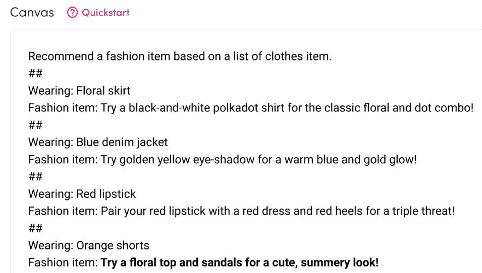
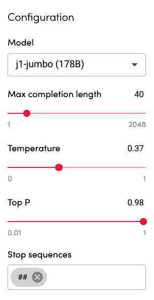
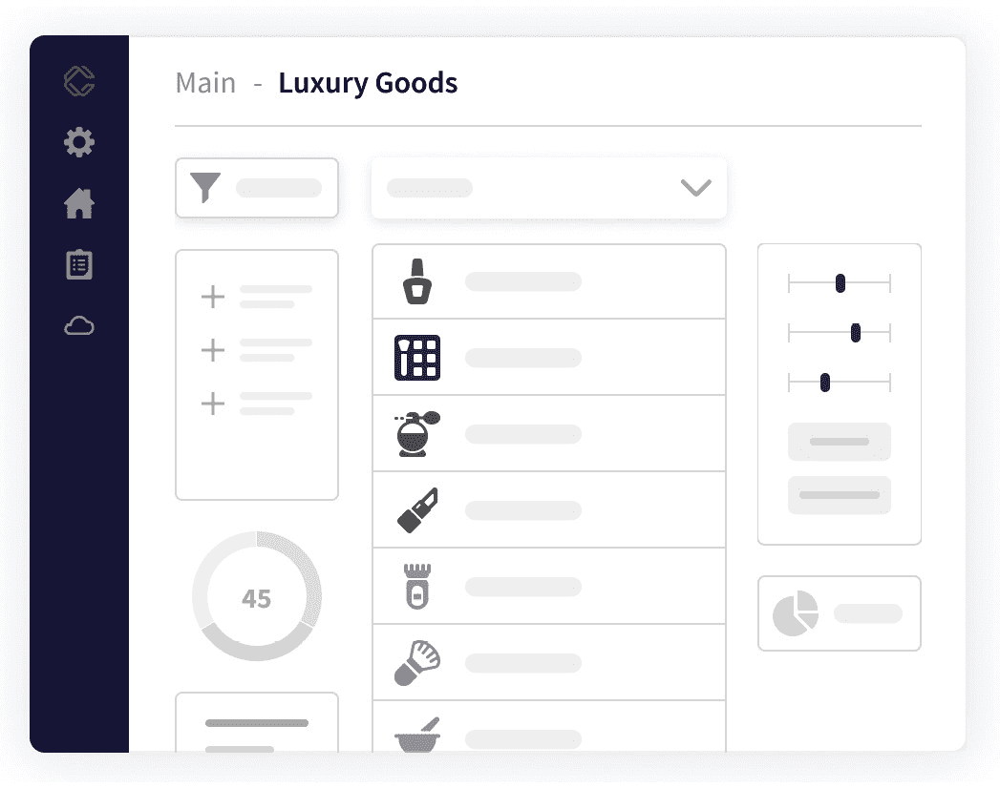
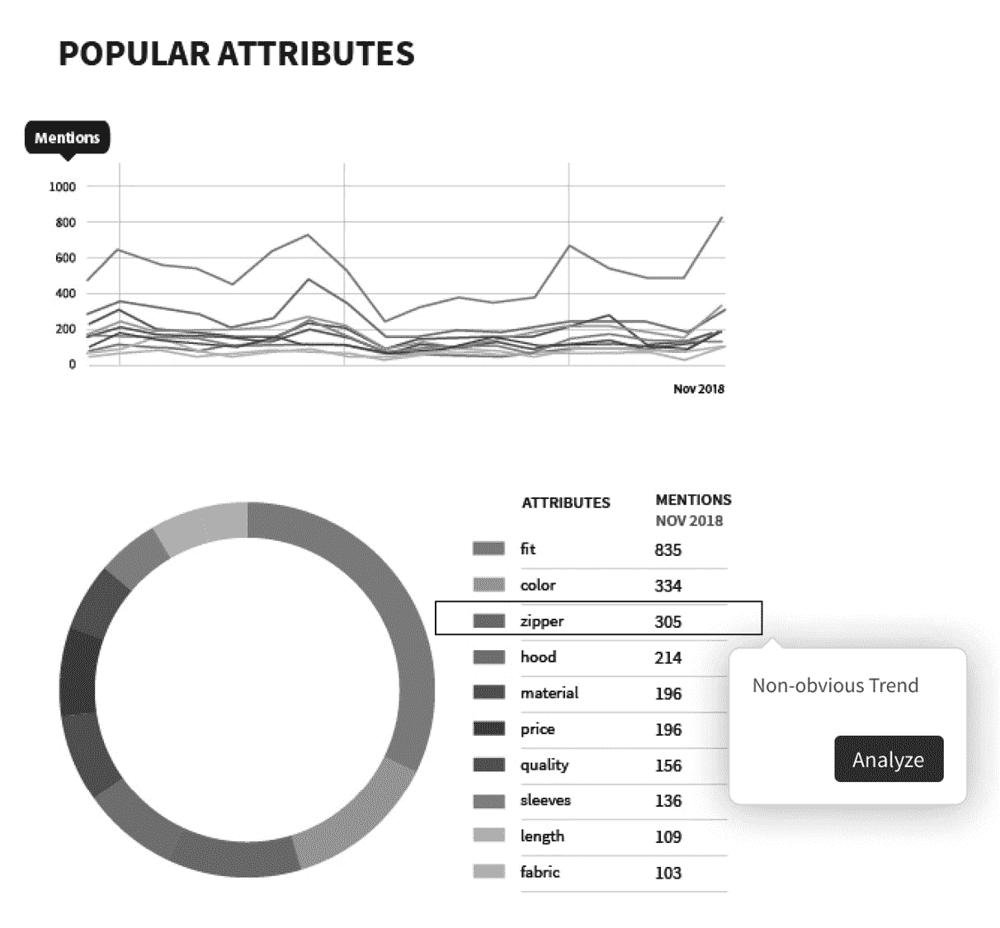
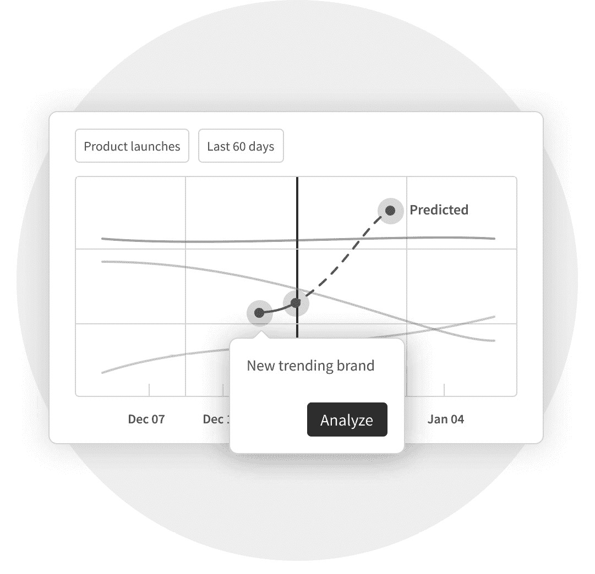

# 第四章：*第四章*：应用 AI 进行创新——奢侈品深度挖掘

奢侈品与独特性和声望相关联，这使得产品开发特别艰难。目标客户群体更为狭小和独特，传统的市场研究方法如焦点小组在奢侈市场上表现不佳，因为这些市场主要由**高净值人士**（**HNWIs**）组成。

此外，奢侈品公司的价值主要来自其品牌，因此分析品牌数据尤为重要。同时，奢侈品牌的顾客远少于大众市场品牌，这意味着通过常规手段获取数据是一个真正的挑战。

在本章中，您将了解以下主题：

+   理解奢侈品牌的挑战

+   理解数据提取过程

+   使用 Commerce.AI 来为奢侈品牌服务

无论您是否在奢侈市场运营，本章都将为您提供洞察力，了解特定品牌的运作方式、面临的挑战以及如何通过数据和 AI 克服这些挑战，这对寻求竞争优势的任何品牌都具有广泛重要性。

# 技术要求

您可以从本书官方 GitHub 仓库下载本章的最新代码示例，网址为[`github.com/PacktPublishing/AI-Powered-Commerce/tree/main/Chapter04`](https://github.com/PacktPublishing/AI-Powered-Commerce/tree/main/Chapter04)。

# 理解奢侈品牌的挑战

奢侈品牌因其高价格而脱颖而出：由于更高的品牌资产，它们比大众市场竞争对手具有更高的利润率。它们还提供超越功能的独特审美体验：精美的服装或珠宝旨在向消费者传达令人向往的形象（因此提升品牌资产）。

这些引人注目的产品吸引了消费者对风格和地位的愿望。典型消费者认为奢侈品仅高于其预算范围，但仍在其能力范围内，因此作为身份象征是令人向往的，只要品牌成功地维护其形象。因此，品牌管理对奢侈品牌至关重要。

## 品牌管理

尽管企业声誉受损在任何行业都是有害的，但对于奢侈品牌尤为重要，因为品牌形象是业务的关键品质。

例如，根据*2018 年 Edelman 赚得品牌*调查，绝大多数（78%）的中国消费者会因为品牌在社会问题上的立场而选择购买或抵制。

那些未能收集、分析和利用消费者数据的品牌将不可避免地遭遇反品牌情绪。

## 增加竞争

另一个关键挑战是奢侈市场竞争激烈，许多品牌争夺同一批客户。这使得奢侈品牌很难彼此区分。

为了在竞争者中脱颖而出并保持品牌价值，奢侈品牌需要通过全面理解客户体验来吸引和留住客户。尤其是在在线渠道的背景下，顾客能够跨多个渠道和来源比较产品和服务时，这一点尤为重要。

过去十年，“奢侈”一词变得越来越流行，因为消费者变得更加愿意为高价产品支付费用。随着全球财富的增加，对奢侈品的需求也稳步增长。

虽然大多数美国人仍然偏好更便宜的产品（例如超市自有品牌），但富裕消费者则表现出对高端产品的越来越强烈的偏好，如爱马仕的 Birkin 包或杜嘉班纳的钥匙链项链。

奢侈品市场的增长可以追溯到几个世纪的经济发展历史。在罗马帝国时期，当人们的财富空前增加时，他们在食品和葡萄酒上的支出也创下了新高；在这一时期，由于对美酒的需求增加，酿酒业得到了高度发展。

二战结束时，由于美国工厂在战争期间为满足需求而采用的大规模生产技术被应用于民用行业，如服装制造，精美西装及其他服饰的需求也呈现出类似的增长。

今天财富的快速增长可以追溯到更早的时期：许多历史学家认为，早在史前时期，人类便开始根据感知价值而非实际价值（例如贝壳或石头）进行物品交换。

简而言之，奢侈品市场有着悠久的历史，但直到最近才真正蓬勃发展，竞争也日益激烈。

### 增长推动了竞争

奢侈品市场是一个价值 3000 亿美元的行业，涵盖从手袋到游艇等各类产品，且增长速度非常快（[`www.statista.com/study/61582/in-depth-luxury/`](https://www.statista.com/study/61582/in-depth-luxury/)）。而且这一增长预计不会很快放缓：根据 Statista 的数据，全球奢侈品销售预计将以每年 5.4%的速度增长，到 2025 年将接近 4000 亿美元。

这种增长得益于多个因素，包括全球财富的增加和大规模制造技术的进步，这使得公司能够更容易地生产具有高利润率的产品。

但也许推动这一增长的最大因素是社交媒体。随着消费者越来越多地通过 Facebook 和 Instagram 等社交媒体平台获取时尚灵感，品牌已经能够将这些平台用作营销工具。他们可以在这些网站上发布最新创作的照片，并让它们被成千上万可能成为客户的人看到。

社交媒体还帮助品牌接触到年轻一代，这一代人相比老一代，更少去传统零售店或访问实体精品店。相反，他们更喜欢在线购物或通过移动应用购物，在那里他们可以一次性看到更多产品选项，并轻松比较价格，无需先亲自到店。

## 社交媒体管理

由于在线购物的兴起，许多奢侈品零售商在满足产品需求方面遇到了困难，因为消费者越来越倾向于在线寻找更便宜的替代品，而不是在实体店或精品店为设计师商品支付高价。

这意味着奢侈市场中有很多机会留给那些不一定需要雄厚资金但具有设计眼光、并懂得如何有效使用社交媒体作为营销工具的新兴品牌。

奢侈品市场对任何品牌来说都是一个难以突破的市场。问题不仅仅在于产品昂贵，还因为这些产品通常有着浮夸和轻浮的声誉。这意味着奢侈品牌必须在显得独特与显得庸俗之间找到微妙的平衡。而且这并不容易，例如，许多奢侈品袜子就要花费几千美元。

但奢侈品牌在社交媒体上比大众品牌更成功的方式也有一些。例如，它们通常拥有更精密的在线声誉管理策略，并能与顾客建立关系。它们还可以访问其他公司无法获得的顾客数据，使得它们能够个性化营销活动并以新方式与顾客互动。

让我们仔细看看这些策略是如何运作的，以及它们为何如此有效。奢侈品牌在社交媒体上往往做两件事：发布美丽的产品或活动照片，并分享关于那些穿戴这些产品或参加这些活动的人的故事。

这个策略类似于许多大型零售商使用 Instagram 的方式：发布你最新促销商品的照片，然后用相关标签标记它们，这样你的粉丝就能在浏览动态时轻松找到它们。

但是这种方式也有其局限性：奢侈品牌通过普通的社交媒体帖子只能触及有限的合格潜在客户；如果你希望你的粉丝能够自然地找到你的帖子（也就是说，不是特意关注你），你需要确保这些帖子能尽可能多地被看到。

## 匹配古怪的顾客偏好

奢侈品牌在满足顾客需求方面面临着许多挑战。大众市场品牌专注于解决具体问题，如功能需求，而奢侈品牌则还需要处理那些无形的需求。

奢侈品市场与大众市场非常不同。它不仅仅是你能看见或触摸到的东西；而是关于你的感受和想法。它关乎情感和感觉。这意味着，在向顾客传递价值时，奢侈品牌必须比大众品牌更具创造性。

这就是事情变得棘手的地方：*如何满足情感需求？* 换句话说，*如何让人们感到愉悦？* 对许多奢侈品牌而言，答案是他们必须成为理解顾客的专家，然后通过讲故事来满足他们的需求。

这样做有一些挑战：一个挑战是，我们对顾客的了解比以前少了，因为他们变得更加多元化和国际化。

我们不知道他们是谁，也不知道他们来自哪里；*我们甚至不知道他们是否存在！那么，我们如何接触他们？如何找到他们？如何与他们互动？我们应该从他们那里收集什么信息？我们如何利用这些信息为他们创造更好的产品和服务？*

这意味着奢侈品牌比以往任何时候都更依赖顾客研究，但当顾客不愿意分享太多信息时，这可能会变得非常困难。

因此，这些公司通常会转向名人作为品牌代言人，而不是依赖传统的调查和焦点小组。但尽管名人代言似乎是奢侈品牌与顾客建立联系的简单解决方案，但这里也存在一些风险：首先，名人往往不能代表普通大众，所以用他们作为代言人可能会疏远那些看起来不像巴黎·希尔顿或金·卡戴珊的潜在顾客。

名人代言还带有很多形象问题的包袱，如果名人代言人在长时间内损害了品牌的声誉，这可能会对品牌产生负面影响。

*那么，这一切对奢侈品消费者意味着什么？* 这意味着奢侈品消费者将继续在体验上花费金钱，而非有形商品。他们想要独特而难忘的东西，而不是普通且廉价的东西。他们想要独一无二的东西，而不是随处可见的常见物品，他们想要个性化的东西。

他们更喜欢故事而非统计数据；轶事而非数据表；灵感而非实际建议；浪漫而非性感魅力；神秘而非透明；魔法而非逻辑；梦想而非现实检查；惊喜而非可预测性；冒险而非安全；幻想而非实用。

## 理解独特的顾客画像

奢侈品牌面临的挑战之一是理解独特的顾客画像。让我们详细探讨四种独特的奢侈品顾客画像，以及这些不同顾客画像对产品创新的影响：**贵族**、**暴发户**、**装腔作势者**和**工人阶级**。

这四类富裕消费者的档案在 2010 年《华尔街日报》上一篇著名的文章《富裕消费者的四种类型》中进行了分类。

### 贵族

**贵族**消费者档案属于传承类，这意味着他们有足够的钱来挥霍。他们希望奢侈品牌能与众不同，以自己的方式脱颖而出。换句话说，要吸引贵族消费者，品牌需要创造出*值得炫耀的差异性*。

与此同时，他们并不想要过于张扬或激进的东西，因为那可能会引起不必要的关注。他们所想要的是既独特又排他，但又不炫耀或显得粗鲁的东西。

换句话说，贵族消费者更关注经典而非短暂流行。虽然引领潮流的设计往往是显眼的，但经典设计则大多更为低调，使其能经得起时间考验和消费者口味的变化。

这一理解对于产品创新至关重要，因为如果你的目标市场主要是贵族消费者，创造短暂流行的设计将导致失败。相反，你需要借鉴经典产品，并在保持优雅和令人愉悦的*低调*的同时，创新奢侈品概念，推动行业的边界。

### 暴发户

**暴发户**被视为相对粗俗的地位追求者，他们在地位物品上花费奢华，如闪亮的衣服、华丽的汽车和金表。他们愿意为最好的产品支付溢价，因为他们专注于自己的身份象征：*我穿什么，定义了我是谁*。

事实上，这对所有奢侈品消费者都适用；然而，暴发户特别关注别人对他们的看法。因此，他们往往会效仿明星（或他们认为是明星的人），而非通过成就来获得地位。

结果是，暴发户往往强调自己在外貌上的年轻，他们希望永远年轻。他们还渴望拥有传递青春和活力的产品。因此，针对这一阶层的时尚品牌常常通过明星代言和 T 台秀将青春和活力传递到暴发户消费者的意识中。

结果是，暴发户缺乏耐性；即使奢侈品的好处未能立刻显现，他们也期望能迅速获得满足。话虽如此，一旦这些消费者做出了购买决策，他们通常会成为忠实客户，因为一旦体验过奢华，许多暴发户便难以抗拒再次消费。

### 做作的人

*如何向做作的人营销？* **做作的人**是那些希望拥有奢侈品，却通常负担不起真品的人。因此，他们会超出预算购买仿品，或者选择*#3*或*#4*品牌，而非市场领导者的品牌。

他们想要以超值价格获得设计师品牌。他们的记忆很短暂。这有点像减肥产品的营销：人们知道大多数减肥方法不起作用，因此当你告诉他们可以再次享受他们喜爱的食物时，是否含有人工糖分、添加剂或其他东西并不重要；重要的是它尝起来好吃。  

但这一现象也有另一面：品牌创造出让这些人感觉自己属于特权阶层的商品，而无需真正融入他们的生活方式和价值观。

正因如此，奢侈品在炫耀财富的伪君子中如此受欢迎，因为它们虽然质量通常不如真正的奢侈品，但仍然能展现奢华的财富。  

对大多数奢侈消费者来说，使用仿制品是一种侮辱；然而，这类假货在某些圈子内已经获得了足够的关注，以至于一些真正的时尚品牌现在授权它们制作仿品，仅在全球特定的商店进行独家销售。  

### 无产阶级  

最终，无产阶级是那些财富较少但有强烈地位意识的客户。这些客户强烈需要通过展示自己的社会地位和财富来在社交圈和工作中感到自信。他们通过展示自己的住宅、衣服、汽车、手表等来实现这一点。  

换句话说，那些未能达到经济阶梯较高层次的人，依然在遵循消费主义的炫耀性消费价值观，以维持自己在社会中的现有地位。  

简而言之，传统的营销、产品开发和品牌管理对于奢侈品牌来说显得力不从心，因为它们面临一系列独特的挑战，尤其是考虑到它们的目标市场独特性。  

让我们探索一下，分析产品数据如何帮助奢侈品牌克服这些挑战。  

# 理解数据提取过程  

许多这些公司使用 AI 预测消费者的需求。它们利用数据来理解消费者的实际行为，然后利用这些信息来塑造它们生产、销售和营销的产品。这些公司已经掌握了如何使用数据为其客户创造巨大价值的方式。以下示例展示了这一点。  

## Tumi 使用 AI 提升营销效果  

Tumi 是一家生产高端旅行行李箱和包包的制造商。这个市场领域的品牌往往困于无聊的营销策略，集中于诸如闪购和促销代码等典型的战术。  

相比之下，Tumi 利用 AI 在其外部营销中个性化消息，并通过针对具有最高预测生命周期价值的客户来智能化其数字广告策略。Tumi 的营销收入大部分来自其电子邮件活动，因此通过个性化改进电子邮件成为提升底线的显而易见的方式。  

根据浏览器的最新行为、邮件打开率和搜索行为等数据，结合过去的购买记录，机器学习模型可以准确预测客户最有可能购买的商品以及购买时间。通过提供这些推荐，Tumi 成功地提高了销量，同时减少了外发消息的数量。

## Burberry 使用人工智能来改进其服装

Burberry 以其皮革风衣、羊绒围巾和其他奢华设计而闻名。然而，为每个季节创造新的款式并不容易，因为设计师需要数月时间根据来自全球各地门店的消费者反馈来创建新系列——这意味着店铺通常会陷入全年只销售旧款式而不是持续推出新款的困境。

现在，Burberry 通过人工智能改进其产品创新流程，旨在通过生产更好的产品、更快速、成本更低的流程，以及更有洞察力的分析来提升效率。

这个英国时尚品牌还提供基于数据驱动的个性化产品推荐，无论是在网上还是店内，到 2015 年，实现了重复购买率提高 50%的成果。此外，Burberry 使用由自然语言驱动的聊天机器人作为智能*时尚顾问*。

尽管这些时尚顾问的具体运作方式是保密的，毕竟它们是宝贵的知识产权，但我们可以看到它们可能的工作原理。我们可以使用**自然语言处理**（**NLP**）算法，借助**GPT-J**，创建一个简单的时尚顾问。

GPT-J 是一个大型语言模型，或者说是一个机器学习模型，它在大量文本上进行训练，由 Eleuther AI 团队发布。我们将展示它的使用方式，因为它是一个开源并且易于访问的工具：

1.  首先，我们可以安装 GPT-J，然后导入我们需要的库，如下所示：

    ```py
    !pip install gptj
    from GPTJ.Basic_api import SimpleCompletion
    ```

    就这样，我们准备好使用 GPT-J 了。现代大型语言模型的工作方式是通过一个叫做**预训练**的概念，即模型已经在大量的文本数据上进行训练，我们只需提供少量的数据来调整模型以完成特定任务。

1.  接下来，我们通过提供`prompt`来定义这一任务，其中包含时尚建议的例子，比如推荐蓝色牛仔夹克与金黄色眼影的搭配：

    ```py
    prompt variable, we can guide the model to act as a fashion adviser.
    ```

1.  此外，我们还需要传递一些参数，主要包括`temperature`（或随机性）、`max_length`（或模型的最大输出长度）以及`item`（或用户输入的内容，如`橙色短裤`）：

    ```py
    temperature = 0.4
    top_probability = 1.0
    max_length = 15
    item = "Orange shorts"
    ```

1.  最后，我们可以将`prompt`变量和这些参数传递给模型，生成推荐内容。如果模型生成的文本超出预期，我们将只抓取第一行文本：

    ```py
    Orange shorts generates a recommendation such as Try a dark blue top and orange heels for a bright pop of color!
    ```

即便不使用任何代码，我们也可以尝试这个相同的概念，比如在`橙色短裤`的情况下，AI21 Studio 会建议我们**尝试搭配一件花卉图案的上衣和凉鞋，打造可爱又夏日感十足的造型！**



图 4.1 – AI21 Studio 画布作为时尚顾问

与 GPT-J 类似，我们需要提供一系列设置，这些设置可以通过 AI21 Studio 中的**配置**面板来完成。



图 4.2 – AI21 Studio 配置面板

如*图 4.2*所示，设置几乎完全相同，包括最大完成长度、温度和停止序列。

## 算法高定

时尚设计师佐野幸太郎、川崎一也和机器学习工程师藤原祐介联合创建了**算法高定**。

机器学习被用于从大量的产品数据中学习，特别是时尚图像，并生成优化的时尚图案模块。

使用计算机辅助设计软件，团队可以建模新的时尚设计，确保既零浪费又舒适。

## AI 时装秀

另一个受欢迎的 AI 时尚应用是生成时装秀。

AI 艺术家 Robbie Barat 在神经网络的帮助下，利用过去的 Acne Studios 时尚系列创建了一个 AI 生成的 Balenciaga 时装秀。

## RefaceAI

AI 还被应用于时尚行业的消费和营销方面，通过使用**深度伪造技术**将消费者置入品牌内容中。

例如，RefaceAI 应用程序可以将用户替换为品牌视频中的人物。他们已经生成了超过一百万次*面孔替换*，并在与 Gucci 的测试合作中获得了 40 万次分享。

## Zalando

Zalando Research 是欧洲和英国的在线零售商，他们正在为设计师开发 AI 软件。

这些 AI 解决方案涵盖了适合度个性化、时尚图像的视觉搜索、设计多样性的判定、时尚购买推荐、生成式时尚设计等多个领域。

鉴于 AI 时尚领域的研究进展如此迅猛，我们可以预见，AI 的好处将在未来几年持续渗透到这一行业。尤其是考虑到易用的 AI 商业工具的兴起，例如 Commerce.AI，我们接下来将深入探讨。

# 使用 Commerce.AI 为奢侈品牌提供服务

Commerce.AI 的解决方案通过提供可操作的洞察，帮助客户获得竞争优势，使他们能够做出更明智的决策，并改善整体客户体验。这使得品牌能够以新的方式与客户建立联系，从而推动增长和盈利。

让我们深入探讨 Commerce.AI 应用的四个领域。

## 设计与用户研究

Commerce.AI 提供关于消费者行为的洞察，帮助公司开发与不断变化的需求和偏好更为契合的产品。我们的技术通过深入了解消费者的购买行为，帮助品牌更好地理解客户。

例如，我们可以帮助像 Gucci 或 Burberry 这样的奢侈品牌了解他们最有价值客户的偏好，以便他们在所有接触点（从产品设计到运输和处理，再到退货）提供个性化体验。

我们还帮助食品和饮料公司了解他们最忠实消费者的饮食习惯，以便他们能开发出符合目标受众特定细分群体的产品，比如喜欢甜味但拒绝人工成分的千禧一代。

拥有这些知识后，企业可以更明智地决定在何处投资创新工作，以及如何根据数据分析揭示的消费者行为最佳地接触消费者。

## 产品开发与营销

假设你是一家奢侈品牌，生产手袋或行李箱，并通过在线渠道或零售店（或两者）直接向消费者销售。你拥有一个现有的产品线，并希望将其扩展到像中国或印度这样具有巨大增长潜力的新市场，但你的现有团队在为这些市场开发产品方面没有经验。

盲目进入一个新市场是失败的根源，特别是在奢侈品牌行业中，正如我们探讨过的那样，需要考虑完全不同的客户画像和偏好。产品数据能够提供多种不同的洞察，具体取决于市场细分、品牌、客户画像等因素。因此，Commerce.AI 本质上是一个*空白的画布*——其模型如*图 4.3*所示——根据当前需求填充了相关数据：



图 4.3 – 一个 Commerce.AI 奢侈品仪表板的模型

这个过程的第一步是帮助你的团队根据行业专家提供的见解，识别出这些新市场中最重要的特征，了解客户在每个国家真正看重你的产品的哪些方面。

借助 Commerce.AI 的数据引擎，该引擎已经分析了全球范围内数十亿条产品数据点，你可以精确地找出不同市场中客户情绪和兴趣的差异。例如，在*图 4.4*中，我们可以看到一个领先服装品牌的常见品牌属性示例：



图 4.4 – 一个奢侈品牌属性分析示例

常见的产品属性或特征包括提到的**合身性**、**颜色**和**拉链**。**拉链**属性被突显为一个不显而易见的趋势，因为例如，某些产品的客户可能会在拉链上遇到问题。通过突显常见的属性，AI 可以帮助产品团队聚焦于客户最关心的话题。

同样地，一旦您的团队确定了每个国家最重要的产品特性，他们将能够创建一个按优先顺序排列的功能想法清单，通过内置在 Commerce.AI 中的在线调查工具（称为**声音调查**）测试实际客户是否真的需要这些额外功能。

一旦通过不同地理位置的真实用户使用语音调查验证，他们就可以决定哪些功能进一步开发，通过创建这些新功能的模拟版来展示其可能的外观。

## 品牌管理

Commerce.AI 帮助奢侈品公司管理其在市场中的品牌。

它利用机器学习帮助公司了解客户与其产品的互动方式，他们喜欢产品的哪些方面，以及不喜欢哪些方面。这项技术可以用来监测竞争对手的产品，并识别增长的新机会。

例如，如果您销售手表，Commerce.AI 可以告诉您哪些手表款式销售良好，哪些不好。然后您可以利用这些信息生产更多这类手表，或者基于客户反馈开发新的手表设计。

*图 4.5* 展示了这些预测可能的模拟情况。虽然品牌特定数据主要是私密的，因此无法在此分享，但 Commerce.AI 用户在预测品牌趋势方面看到了巨大的价值。



图 4.5 – 豪华品牌趋势的模拟预测

Commerce.AI 还允许奢侈品牌跟踪客户在其产品中希望的功能，并确定需要改进的领域。这使他们能够在客户通过社交媒体或其他渠道提出问题或请求新功能时迅速做出响应。

例如，如果客户在 Facebook 上发布了有关您手表品牌质量的负面评价，Commerce.AI 可以通知您的品牌团队，以便他们在问题变得更为严重之前立即解决。

除了帮助奢侈品牌改进其产品开发流程外，Commerce.AI 还帮助它们在所有渠道（社交媒体、电子邮件营销列表等）上扩展沟通努力，以便他们能快速回应关于产品的任何客户投诉或问题。

## 趋势分析

当涉及到地位趋势时，奢侈品牌被要求引领潮流，这意味着他们需要深刻了解奢侈市场的脉搏。

借助 Commerce.AI 的数据引擎，我们发现了一些对产品创新有重大影响的关键趋势，包括二手奢侈品的兴起、奢侈品租赁的兴起以及奢侈品订阅。让我们详细探讨这三种趋势。

### 二手奢侈品

Commerce.AI 数据显示，即使在 COVID-19 疫情期间奢侈品销售遭遇打击，奢侈品二手销售在过去一年仍然惊人地增长。

正如 IMARC 集团报告所述，预计未来五年二手奢侈品销售将以超过 10%的年增长率增长（[`www.imarcgroup.com/secondhand-luxury-goods-market`](https://www.imarcgroup.com/secondhand-luxury-goods-market)）。换句话说，二手奢侈品市场的增长速度远远超过其核心市场同行。

这代表了消费者偏好的巨大变化，这也是许多品牌在创新以满足这些新需求的原因。

### 奢侈品租赁

随着奢侈消费者变得更加关注环保，奢侈品租赁市场正在获得动力，越来越少的消费者愿意购买他们只会穿一两次的商品。

这催生了对珠宝套件和艺术品收藏租赁服务的新需求，这些服务可以按天或按夜租用，用于婚礼或公司会议等活动。

### 奢侈品订阅

在线零售网站已将数字订阅模式从书籍和音乐扩展到其他类别，如时尚，您可以订阅每月的送货服务，直接送到家门口。

随着像 Birchbox、CURATEUR 等服务在这一领域持续获得关注，我们预计消费者将越来越习惯于定期收到送到家门口的时尚产品。

# 总结

在本章中，我们探讨了 AI 如何帮助奢侈品牌克服与产品相关的关键挑战，包括品牌和社交媒体管理、满足独特的客户偏好，以及在竞争日益激烈的市场中脱颖而出。

在传统的产品智能环境中，分析师必须手动筛选大量数据，以发现市场机会、分析竞争对手，并创造创新的新产品。

通过 AI 解决方案，可以轻松分析数十亿个产品数据点，以在奢侈品市场中创造竞争优势。通过理解奢侈品市场的挑战和基于 AI 的解决方案，您可以开始看到 AI 如何为任何产品团队带来帮助。

在下一章中，我们将探讨如何将 AI 应用于无线网络领域的创新。与奢侈品牌一样，无线网络公司也面临一系列独特的产品相关挑战，这些挑战可以通过 AI 解决，因为 AI 能够从大量产品数据中学习并适应。
