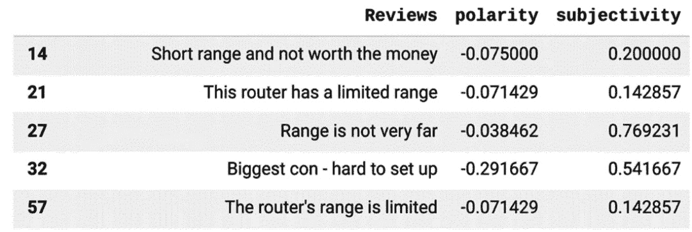
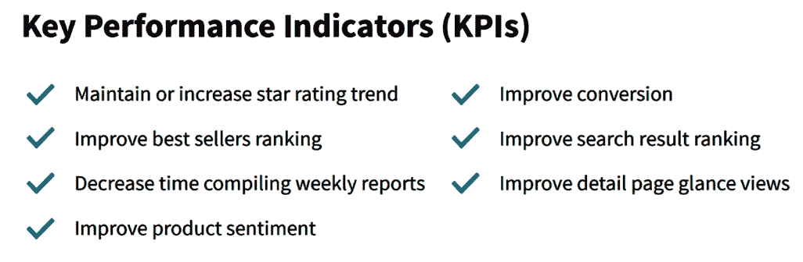

# 第五章：*第五章*：将 AI 应用于创新——无线网络深度探讨

无线网络品牌正面临日益激烈的竞争和越来越苛刻的用户需求，同时还要处理前所未有的流量。用户要求 5G、可持续设备，以及当然的持续连接。为了满足这些需求并获得竞争优势，无线网络产品团队需要大规模分析数据。

Commerce.AI 通过将客户需求与每个品牌的产品相匹配，发现产品创新机会。本章将概述无线网络品牌所面临的挑战，Commerce.AI 通过识别我们产品数据引擎的关键优势来解决这些挑战。

此外，我们还将展示无线网络品牌如何利用 Commerce.AI 的产品数据引擎识别创新机会，帮助它们理解客户需求的驱动力。

在本章中，您将学习以下内容：

+   了解无线网络品牌面临的挑战

+   分析无线网络品牌的产品数据

+   使用 Commerce.AI 进行无线网络品牌的创新

无论您是否在无线网络市场运营，本章将为您提供有关特定品牌如何运营、面临的挑战以及如何利用数据和 AI 克服这些挑战的见解，这对任何寻求竞争优势的品牌都具有广泛的意义。

# 技术要求

您可以从本书的官方 GitHub 仓库下载本章的最新代码示例：[`github.com/PacktPublishing/AI-Powered-Commerce/tree/main/Chapter05`](https://github.com/PacktPublishing/AI-Powered-Commerce/tree/main/Chapter05)。

# 了解无线网络品牌面临的挑战

首先，我们将探讨无线网络行业的经济和技术挑战，以及这些挑战如何影响无线网络品牌在市场中的定位。这将为理解为什么需要数据驱动和 AI 驱动的解决方案打下基础。

特别地，我们将讨论与无线网络流量增长及其相关性能挑战、生态系统复杂性增加，以及可持续性、5G 和数据驱动需求等问题。

## 流量增长

无线网络行业正经历着重大变革。移动设备使用量和**物联网**（**IoT**）设备的增长，以及对热点的需求，导致了前所未有的连接需求激增——并迫切需要新的方式来满足这一需求。

根据 Statista 的数据显示，过去 5 年连接到公共 Wi-Fi 热点的独立用户数量已增加了四倍 ([`www.statista.com/statistics/677108/global-public-wi-fi-hotspots/`](https://www.statista.com/statistics/677108/global-public-wi-fi-hotspots/))。自 2019 年以来，移动设备数量已超过人口总数。

然而，这一增长成本由这些热点的运营商承担，他们必须大量投资基础设施以应对增加的需求。无线网络运营商越来越有责任提供一个可靠且可扩展的网络，以满足用户日益增长的需求。

## 性能挑战

这种流量的增长对网络性能有重要影响。网络性能依然是全球有线和无线网络面临的一个问题，因为可用于信号放大的天线数量有限，卫星发射到太空的成本高昂，而手机塔必须应对来自其他无线网络的干扰。

然而，这些限制并不意味着网络性能停滞不前；恰恰相反。得益于**软件定义网络**（**SDN**）的进步，网络架构不断取得新突破，SDN 通过软件在现有的物理基础设施中创建虚拟网络，而不是依赖像交换机或路由器这样的硬件组件。

SDN 允许网络运营商在不影响最终用户体验（如速度或延迟）的情况下，动态地塑造连接设备之间的流量模式。这种灵活性使运营商可以更好地控制如何利用其网络基础设施，并可以战略性地使用它——例如，可以考虑将资源分配给某些类型的应用程序，而不是让应用程序在同一设备、网络连接或地理区域内同时运行时相互争夺有限的带宽资源。

随着这种控制力的提高，责任也随之而来；服务提供商必须确保在需求超过可用容量时，用户不会受到负面影响，这会导致下载速度变慢或连接中断。

这种前所未有的无线连接需求增长，也为能够利用这一机会的品牌提供了巨大商机，通过创新的产品和服务，围绕消费者的特定需求和偏好量身定制。

*这对你作为品牌意味着什么？* 这意味着，如果你能找出如何最好地满足客户的无线连接需求，他们可能会成为终身客户，每次连接无线时都会认同你的品牌和价值观——尤其是当你能提供比竞争品牌或非品牌替代品更好的东西时。这些宝贵的信息可以通过产品和消费者数据提取，包括来自亚马逊、沃尔玛和塔吉特等来源的产品评论。

由于今天的客户是明天的推荐客户，现如今对数据和人工智能的投资，可能在未来带来丰厚的回报，因为这些未来客户将成为忠诚的品牌倡导者和传播者，帮助引入更多的新业务。

## 增加的复杂性

品牌面临的另一个重大挑战是无线连接生态系统的日益复杂。

当你仔细想一想，一台电子设备（如芯片中的晶体管）所包含的零件比汽车引擎中的零件还要多。随着每年的推移，这些部件变得愈发重要，因为它们直接影响到我们设备的运作表现。

与此同时，消费者在选择特定应用或功能的设备时，比以往任何时候都拥有更多的选择。例如，平板电脑和笔记本电脑可用于提高生产力，而智能手机则更常用于社交媒体或娱乐。同时，穿戴设备可用于健康监测，智能音响可用于听播客或播放音乐，虚拟现实头盔可用于沉浸式体验，种种设备应有尽有。

*那么，当涉及到无线连接时，如何弄清楚你的客户需要什么——以及想要什么呢？* 这将需要大量的时间和资源投入，帮助你明确目标客户在个人无线体验方面的需求、愿望、价值观和梦想。

然后，你需要弄清楚如何通过新的产品和服务，在你品牌的整体价值主张框架内，最好地为客户提供这种体验。

## 可持续发展

无线网络品牌面临的第三大挑战是需要更加注重可持续发展。许多消费者担心他们的无线连接习惯对环境造成的影响，因此他们在日常数字生活中，正在寻求更环保的选择。

这为无线网络公司创造了巨大的机会，特别是那些能够开发帮助人们减少碳足迹的产品和服务的公司。从通过提供高效能的设备帮助人们减少能耗，甚至提供能够回馈环保组织的设备——有无数的例子证明，如何通过无线连接帮助人们过上更环保的生活。

虽然在创造可持续产品和服务时，需要克服许多挑战，但越来越多的品牌开始认真对待这一点。品牌们意识到，能够通过环保影响与竞争对手区分开来的重要性。

## 成为数据驱动

无线网络品牌面临的另一个重要挑战是需要更加数据驱动。如今，许多消费者每天都被大量的信息轰炸，以至于他们常常感到不堪重负，在面对无线连接需求时，无法做出明智的决策。

能够为客户提供相关、可操作信息的品牌，将能够在竞争中占据优势，而那些可能不那么注重数据驱动的竞争者将处于劣势。为了做到这一点，品牌需要投资于实时洞察和数据分析的交付，以帮助他们了解如何更好地满足客户在无线连接方面的具体需求——进而提高客户满意度和忠诚度。

## 5G

另一个关键挑战与 5G 相关，5G 在无线连接行业中将比 4G 带来更大的变革。5G 将开启一个全新的连接时代，其速度将是当前 4G 网络的 10 倍以上。

当 5G 真正成为主流时，人们将能够做以前只能梦想的事情，比如在旅途中无需延迟地观看电影和玩游戏——所有这一切都得益于 5G 提供的超低延迟。

但从技术角度来看，使 5G 如此令人兴奋的特点，也是它让那些希望抓住这一机会的品牌面临挑战的原因。关于 5G 的推广和采用率仍然存在许多疑问，这意味着没有保证消费者会愿意购买这种体验，或者像使用之前几代网络一样使用他们的无线连接产品和服务。

好消息是，一旦这些问题通过扩大网络覆盖和让客户了解超低延迟连接的好处得到解决，5G 产品和服务的需求增长潜力将显著增加。这意味着，如果你能够围绕超低延迟连接为客户创造一个引人入胜的用户体验，那么随着越来越多的人成为这一新功能的早期采用者，你将看到巨大的增长。

总结这些挑战，无线生态系统中的品牌拥有者应该感到幸运：在这些机会面前，任何品牌都没有理由不能通过创造满足客户不断变化需求的产品和服务而取得成功。

同样重要的是要记住，如果你能想象出来，那就说明在某个地方已经有人创造了类似的东西——现在他们正在尝试通过利用他们在硬件设计或软件开发或两者的专业知识，将你的想法做得更好。

这就是为什么品牌需要从长远角度思考自己在日益拥挤的市场中如何定位自己。分析产品数据可以帮助品牌克服这些挑战。

# 分析无线网络品牌的产品数据

数据已经成为品牌区分的关键因素，因为消费者寻求能够为他们提供额外效用、便利甚至乐趣的产品和服务。例如，Uber 和 Lyft 等按需出行服务的早期采用大部分是由于它们能够提供有关位置和预计到达时间（ETA）的实时更新。

同样的情况也适用于我们如何使用智能手机——我们越来越期望设备提供数据驱动的体验，无论是获取关于假期时附近餐厅或景点的即时信息，还是通过语音命令或应用界面实现与家用电器的无缝集成。而这一趋势没有任何减缓的迹象——到 2025 年，全球每天将生成近 500 艾字节的数据！

随着连接设备数量的增加，流经网络的数据量也在增加。这种流量的增长为品牌提供了一个巨大的机会，可以通过为用户提供增值服务和内容来区分自己。此外，品牌可以利用产品数据，特别是产品评论数据，来开发更具创新性的产品和服务。

让我们来看一个分析路由器产品评论数据的例子。

## 分析无线网络产品评论数据

一个消费者购买了一款新的无线路由器，将其连接到家庭网络并开始使用。消费者可能会在亚马逊上发布一条关于如何轻松设置设备并在家中使用的正面评论。这条评论可以帮助提高其他消费者的产品满意度和使用情况。路由器的制造商可以分析这些产品评论数据，看看消费者最喜欢设备的哪些功能，并利用这些信息改进未来的产品。

另一方面，一个沮丧的消费者可能会发布负面评论，这会把潜在买家推走。然而，这个负面评论代表了一个宝贵的学习经验，有助于发现并修复路由器的缺陷。

通过使用从这些评论中生成的数据，已经证明制造商能够提高消费者的产品满意度和使用率。

产品反馈是任何成功的产品发布或**产品生命周期管理**（**PLM**）的关键组成部分。PLM 过程使制造商能够了解客户如何使用他们的产品，并生成可操作的洞察，帮助他们就产品设计和开发做出明智的决策。这些洞察可以帮助公司改善客户体验、在市场中区分其产品并增加销售额。通过 PLM 方法生成的数据越多，公司在当今高度竞争的市场环境中就越能处于有利地位，取得成功。

让我们看一个实际例子，分析超过 700 条匿名的无线 5G 路由器产品评论：

1.  首先，我们将导入所需的依赖项，或者简单地说是我们需要分析文本、情感、关键词频率和评论的其他指标的库：

    ```py
    !pip install wordcloud
    from os import path
    from PIL import Image
    from wordcloud import WordCloud, STOPWORDS
    import pandas as pd
    import numpy as np
    import matplotlib.pyplot as plt
    !pip install textblob
    from textblob import TextBlob
    ```

1.  现在我们可以读取产品评论数据，并将其转化为一个字符串，用来创建词云，从而给出消费者讨论的高层次见解：

    ```py
    df = pd.read_csv('Reviews.csv')
    document = df['Reviews'].to_string()
    ```

1.  我们现在可以使用 `WordCloud` 库生成一个词云，像这样：

    ```py
    wordcloud = WordCloud().generate(document)
    plt.imshow(wordcloud, interpolation='bilinear')
    plt.axis("off")
    ```

    上述代码生成了一个词云，如*图 5.1*所示，除了路由器等明显的词汇外，还显示出消费者讨论最多的是**5G**和**范围**：


图 5.1 – 5G 无线路由器评论的词云

我们现在可以使用 `TextBlob` 来分析评论情感，并查看是否能发现更多有意义的见解。我们需要确保每条评论都被正确地格式化为字符串，然后通过 `lambda` 函数将 `TextBlob` 的 `sentiment` 函数应用到每条评论或 DataFrame 中的每一行。这将生成两列：一列显示 `polarity`，一列显示 `subjectivity`。

`polarity` 是一个范围在[`-1,1`]之间的浮动值，其中 `1` 代表正面陈述，`0` 代表中立陈述，`-1` 代表负面陈述。`subjectivity` 指的是个人意见、情感或判断的存在。`subjectivity` 也是一个浮动值，范围在[`0,1`]之间：

```py
s = df['Reviews']
df['Reviews'] = df['Reviews'].astype(str)
df = df[df['Reviews'] == s]
df[['polarity', 'subjectivity']] = df['Reviews'].apply(lambda   Text: pd.Series(TextBlob(Text).sentiment))
```

现在我们已经计算出了情感，我们可以轻松地按情感对产品评论进行排序和搜索。例如，以下代码将展示负面评论：

```py
df[df['polarity'] < 0]
```

看一下五条负面评论的片段，如*图 5.2*所示，表明这些评论主要与路由器信号范围差有关：



图 5.2 – 负面无线路由器产品评论的片段

让我们也看看更多正面评论，这些评论的 `polarity` 为正面，且 `subjectivity` 较低，使用以下代码：

```py
df[(df['polarity'] > 0.2) & (df['subjectivity'] < 0.5)]
```

这段代码将展示我们正面评论的片段，如*图 5.3*所示。我们可以看到，顾客对速度表示满意，尤其是在游戏方面，但有趣的是，即便是正面评论，也对信号范围提出了抱怨，例如一条评论简单地写着**信号范围短**：


图 5.3 – 正面无线路由器产品评论的片段

仅仅这些评论就能为我们提供一些关于路由器的宝贵见解，即消费者喜欢速度，但对信号范围提出抱怨。由于这些评论是关于 5G 无线路由器的，我们可以假设这两个问题都与 5G 的特性有关，5G 无线网速非常快，但信号范围却相对较差。

这可以帮助我们了解多种可能的决策。例如，通过调整路由器的位置和方向，可以简单地改善 5G 路由器的覆盖范围。许多消费者对此并不知情，因此产品团队可以利用这些评论中的洞察，将相关信息添加到产品手册中，或者甚至改变产品的拍摄方式，以突出路由器的正确放置方式。

此外，这些洞察还可以帮助指导未来的产品开发工作，优先考虑改善覆盖范围，比如通过构建更强大的天线。无线网络公司甚至可以开发一个配套产品，比如一个扩展器。

如今，企业正在利用虚拟助手，如 Siri 和 Alexa，作为竞争情报的来源——在推出任何新服务或产品之前了解客户需求，以提高市场份额，并将自家产品与竞争对手的产品区分开来。例如，可以分析这些数字助手在不同网络上的使用频率，可能会突出客户喜欢的特定功能，而这些功能也会在网络上使用，比如视频流播放功能。

如果你还没有这样做，应该审视一下你公司目前的竞争情报收集工作，并考虑如何将实时客户数据融入到现有流程中——这将为你提供更多关于客户今天（甚至明天）如何与品牌互动的洞察。

# 使用 Commerce.AI 为无线网络品牌提供服务

无线网络行业是今天最成熟却又充满活力的行业之一。从智能手机到物联网设备，从智能家居到自动驾驶汽车，每个人都依赖无线技术进行通信和连接。

无线网络品牌的业务是连接人们——这是一个巨大的机会。消费者希望在多个平台上使用自己喜欢的品牌——*那么，连接品牌如何为客户创造价值呢？他们如何才能抓住这个巨大的机会？* 在接下来的章节中，我们将探讨品牌如何通过数据驱动的解决方案来回答这些问题。

## 进入数据驱动的解决方案

数据驱动解决方案在无线网络行业的作用自 2020 年以来发生了巨大变化。进入世纪之初，只有极少数消费者能够访问在线零售网站。今天，美国超过 90%的消费者已经进行过在线购物（[`optinmonster.com/online-shopping-statistics/#:~:text=That%2091%25%20of%20the%20country's,only%20ones%20who%20shop%20online`](https://optinmonster.com/online-shopping-statistics/#:~:text=That%E2%80%99s%2091%25%20of%20the%20country%E2%80%99s,only%20ones%20who%20shop%20online.)）。

在如此强烈的消费者需求推动下，品牌必须利用数据分析才能保持竞争力。

品牌可以通过利用机器学习算法和复杂的数学模型，发掘大型数据集中的模式，而这些模式通常是人类无法察觉的。它们在幕后工作，处理大量数据，帮助企业做出更聪明的决策，从而带来实际成果，如新产品发布或顾客参与度提高。

让我们看看品牌如何利用 Commerce.AI 的机器学习算法和数据引擎来提升它们的**关键绩效指标**（**KPI**）。Commerce.AI 建立了世界上最大的产品数据引擎，分析了来自亚马逊、沃尔玛、塔吉特甚至 YouTube 视频评论和语音调查等来源的超过万亿条数据。

**预测**是从可能未在当前趋势中反映的数据中推断趋势的能力。你拥有的数据越多，你的预测能力就越强。通过这种方式，数据引擎可以帮助以更具战略性和主动性的方式获取和管理产品数据，从而帮助提高盈利能力。

特别是，品牌可以实施机器学习模型来预测和优化多个重要 KPI，如*图 5.4*所示：



图 5.4 – 产品团队的重要 KPI

让我们详细了解每个 KPI，理解它们为何对产品团队来说如此重要，需要考虑、分析和优化。

## 星级评分

维持或提升顾客满意度的评级至关重要。未能做到这一点的品牌面临失去顾客、最终失去收入的风险。

如今，消费者比以往任何时候都更希望知道自己为钱买到了什么。对于许多人来说，购买中最重要的方面是用辛苦赚来的钱所换来的价值。这意味着品牌需要确保每一笔与顾客的交易都是一次积极的体验——不仅仅是在购买时，而是在整个顾客生命周期中。

这始于确保产品质量和服务在与品牌的初次接触时符合或超出顾客的期望，并持续贯穿与顾客的所有关系阶段（例如，从初次接触到重复购买）。

在今天高度饱和的市场中保持竞争力需要强烈关注获取新顾客，同时也要保持现有顾客的忠诚；我们的分析表明，不满顾客在网上发布的负面反馈可能会对公司业绩产生严重影响（*换句话说：不要忽视负面评论！*）。

社交媒体平台如 Facebook 和 Twitter 使人们能够轻松地在网上表达他们对购买的产品或服务的担忧。这使得他们能够表达关于通过竞争对手购买的产品（甚至是同一供应商的过去购买）的任何担忧。

但重要的是，它也允许消费者提供与这些过去经历直接相关的反馈——例如，与竞争供应商/品牌提供的类似产品/服务相比，产品质量差或客户服务糟糕等问题。

而考虑到如今消费者在做购买决策时极度依赖他人的推荐，负面的在线评论可能会在消费者做出购买决策时起到决定性作用。

使用 Commerce.AI，产品团队可以分析评论、评论背后的原因以及跨几乎所有产品来源的评论趋势，帮助为新产品创新、市场营销和客户支持工作提供依据。

## 提升畅销书排名

畅销书排名仅仅是某个网站上最畅销产品的列表。这是零售商的重要指标，因为它表明哪些产品受欢迎，哪些产品需要增加库存，或者在产品存货不足时更快地售出。

换句话说，它指示了零售商应该更侧重于销售哪些产品，或者哪些产品应该更专注于推动更高的销量。事实上，许多零售商已专门设立资源来管理其畅销产品战略，甚至创造新的畅销产品，这已成为他们整体商业战略和运营团队的一部分。

*那么，如何判断哪些措施有效，哪些无效，尤其是在推动销售方面呢？* 通过分析历史数据和实时数据，识别出可以利用的趋势，以便在未来提升业绩。

历史分析通过回顾先前的时期（例如去年或上一季度）来帮助定义模式，尤其是在某些事件发生时（例如经济衰退等）。这为了解之前有效的措施提供了宝贵的见解，也常常为未来可能有效的措施提供了线索。

实时分析关注的因素包括点击流数据、访客行为和鼠标悬停操作等，还有其他一些指标，如通过电子邮件营销或网站表单的注册转化率。

简而言之，分析——无论是历史数据还是实时数据——都能帮助你识别出可以为未来的营销努力提供指导的趋势，从而推动更多转化、更高销售、增加收入和更大的盈利能力。

## 编制每周报告的时间

领先的无线网络品牌已向 Commerce.AI 寻求帮助，改善其报告流程。由于大型无线网络品牌在多个行业拥有超过 100 种产品和服务，它们很难掌握所有业务和计划的最新动态，甚至在各自的部门内部也是如此。

其中一个原因是，他们一直使用电子表格和文字处理软件来创建详细的 KPI 报告，这意味着他们不得不雇佣额外的团队成员来维护这些报告——这是一项昂贵的工作。

由于许多产品和服务分属不同的管理团队，并且跨多个垂直领域进行管理，这也使得在不同领域之间共享和传达信息变得困难。

通过使用 AI 驱动的工具自动化报告，我们的客户能够消除仅为维护电子表格而需要专门人员的需求。通过动态可视化展示多个产品和服务在不同角度下的表现模式，客户能够比以往更早发现趋势（而且还节省了人力资源成本）。

这使得客户不仅能够实时采取行动，还能够比以往更早地识别趋势，从而主动管理风险，做出关于增长机会的明智决策，而不是在问题发生后才做出反应。

通过每天分析来自全球成千上万来源的数百万条数据，我们能够为客户提供有关可能出现问题或潜在机会的可操作洞察。

## 改善产品情感

**情感分析**是一种机器学习方法，可以判断一段文本或整个产品评论的整体语气和情感。它用于了解人们在社交媒体上对品牌、产品和服务的看法——然后据此采取相应的行动。

例如，如果客户在社交媒体上对某个特定产品或服务表达了积极的情感，这可能表明他们也有可能在实体店购买该产品（如果品牌有线下门店的话）。另一方面，负面情感可能表明品牌应考虑改进其产品或服务。

过去，无线网络品牌可能依赖定性客户体验研究（如面对面访谈），但现在它们可以接触到大量数据——而且这些数据都与人们在网上体验他们的产品和服务有关。

通过使用 AI 技术，这些品牌现在能够从先前无法获取的庞大产品情感数据中获得可操作的洞察。让我们仔细看看这如何运作。

### 机器学习

数据引擎处理大量非结构化文本数据（如评论和反馈），以识别模式和趋势。然后，它利用这些洞察来指导未来的决策。

例如，基于关于特定产品或服务的最新评论，AI 引擎可以判断哪些方面需要改进，然后建议制造商如何改进——例如提高运输速度或在产品本身中开发新功能。*这就是机器学习的实际应用！*

### 数据挖掘

在无线网络品牌能够有效利用人工智能之前，他们需要能够处理大量的文本数据（即评论帖子）。他们还需要能够快速高效地挖掘这些大量信息的工具，从而发现趋势并进行持续的情感分析。

这就是 Commerce.AI 的作用所在。我们为他们提供一个基于云的平台，使他们能够轻松管理大量文本信息，并实时洞察客户在 Twitter、Facebook、Instagram 等社交媒体平台上对其产品和服务的评价。

今年到目前为止，我们已经看到我们的无线网络行业客户取得了令人印象深刻的增长，他们在人工智能技术的应用上取得了前所未有的进展，尤其是在 COVID-19 疫情中，无线网络数据的增长巨大。

### 可操作的见解

一旦无线网络品牌从产品情感分析中获得足够有意义的见解，他们可以利用这些信息相应地改进产品或服务，并确保客户在重复购买时感到满意。这是使用人工智能技术进行产品情感分析的另一个重要好处——它帮助制造商创造比以往更具意义的客户体验。

## 改进产品转化率

产品转化率衡量的是在访问一个网站后，进行购买的访客百分比。你的网站流量越大，产品转化率就越高。这个指标对于电子商务零售商来说非常重要，因为它显示了他们将访客转化为顾客的效果。

通过查看网站流量和购买指标，我们能够找出与产品网站上的高低转化相关的因素，并突显以下内容：

+   高互动度的产品类别

+   在购买之前，人们花更多时间研究的产品子类别（例如，台式电脑）。

+   在做出购买决策之前，人们曾讨论过定价策略的产品定价页面（例如，价格超过 700 美元的笔记本电脑）。

+   在人们对比了竞争产品的价格后才做出购买决策的产品评论（例如，500 美元以下的笔记本电脑）。

## 搜索结果排名

简而言之，**搜索结果排名**是基于一个算法，它决定了当用户在网站上进行搜索时，结果的显示顺序。

搜索结果排名的重要性无法过分强调。事实上，这是决定消费者是否会点击广告或购买产品的最重要因素之一。消费者在高排名的结果上转化的概率比出现在搜索结果较低位置的公司产品（无论是自然排名还是付费广告）要高。

这是因为人们往往更信任搜索结果中排名较高的来源。所以，显然，品牌在优化其搜索结果位置方面有着巨大的价值。*但是，数据和人工智能能提供什么帮助呢？*

Commerce.AI 背后的数据引擎汇总了大量关于品牌的信息，包括它们在搜索结果中的表现。这样，我们就能预测品牌在搜索结果中出现更高或更低位置的可能性，以及其整体排名。

分析以往搜索数据帮助无线网络品牌根据实际表现优化其位置，而不是仅仅依赖猜测或直觉。换句话说，它使品牌能够通过投资活动（如内容营销）来提高品牌亲和力，从而增加**点击率**（**CTR**）。

通过利用以往搜索数据，它们还可以识别出模式和趋势，从而洞察在优化搜索结果排名时什么有效，什么无效。例如，如果网站流量较低，但该网站广告的 CTR 较高，那么很可能该公司在优化 CTR 方面做得很好。

另一方面，如果网站流量高，但该网站广告的点击率（CTR）低，那么很可能是广告文案或产品列表的相关性存在问题，这些问题应该在进一步投资提高 CTR 之前得到解决（即，确保包含相关的产品列表）。

通过在早期识别这些问题，而不是等到出现问题（即花费更多资金提高可见度）后再处理，无线网络品牌能够节省时间和金钱，同时实现其期望的结果——更高的排名——而不影响其品牌价值或完整性（在广告文案/相关性方面）。

## 详情页浏览量

我们首先定义什么是详情页浏览量：即在一定时间内（例如 1 天）Amazon 产品详情页的浏览次数。这个指标变得越来越重要，因为它揭示了用户与 Amazon 上产品互动的模式——以及潜在的增长机会。

对于像 TP-Link、Netgear 和 Linksys 这样的无线网络品牌，它们销售 Wi-Fi 路由器和相关硬件，跟踪这些指标可以提供关于消费者在 Amazon 上与其产品互动的深刻见解。它还可以提供有关哪些产品详情页面元素需要优化的信息，以提高点击率、转化率和整体销售量。

对于任何通过电子商务市场（如亚马逊）在线销售商品或服务的品牌或企业来说，这些数据的重要性不容忽视。事实上，它的重要性如此之大，以至于许多大型品牌已专门设立了团队来监控这些数据。在我们与多个品牌合作进行在线零售优化的经验中，能够看到这些指标对于帮助品牌确定在亚马逊上销售的新版本产品时应该优先考虑哪些元素至关重要。

不言而喻，没有零售商希望投入时间和资源去开发新版本的商品，却发现它在市场上失败。如果零售商能够追踪消费者在特定时间段内查看每个版本的次数（即浏览视图数据），这些问题本可以轻松避免。

# 摘要

在本章中，我们了解了无线网络品牌面临的关键挑战，包括 5G 推广、实施可持续性措施、日益复杂化等问题。我们还学习了如何分析产品数据，并利用 Commerce.AI 来克服这些挑战，打造更好的无线网络产品和服务。

人工智能有潜力帮助无线网络品牌克服关键的与产品相关的挑战，包括满足日益严格的用户需求，并在竞争愈加激烈的市场中脱颖而出。

在传统的产品智能环境中，分析师必须手动筛选大量数据，以发现市场机会，分析竞争对手，并创造创新的新品。

通过人工智能解决方案，数十亿条产品数据点可以轻松分析，从而在无线网络市场中创造竞争优势。通过了解无线网络市场的挑战和基于人工智能的解决方案，你可以开始看到人工智能如何对任何产品团队都有帮助。

在下一章中，我们将探讨如何在消费电子领域应用人工智能进行创新。与无线网络品牌类似，消费电子公司面临一系列独特的与产品相关的挑战，这些挑战可以通过人工智能来解决，因为人工智能具有从大量产品数据中学习的多功能能力。
