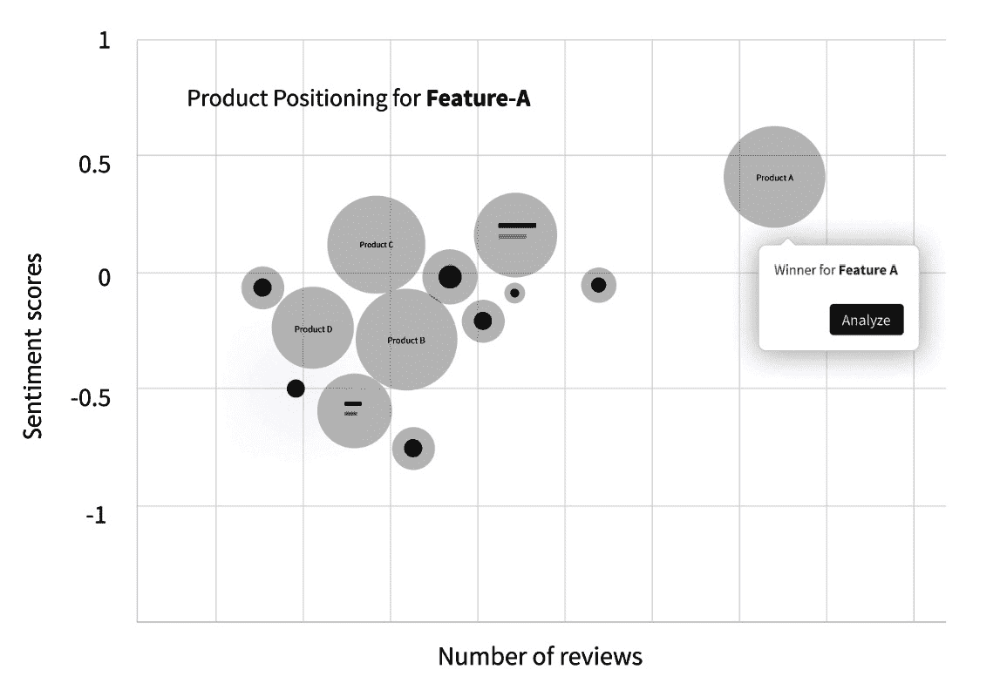
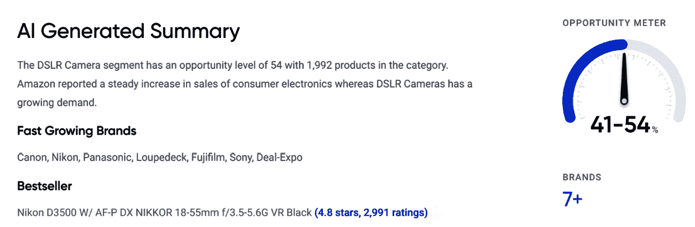
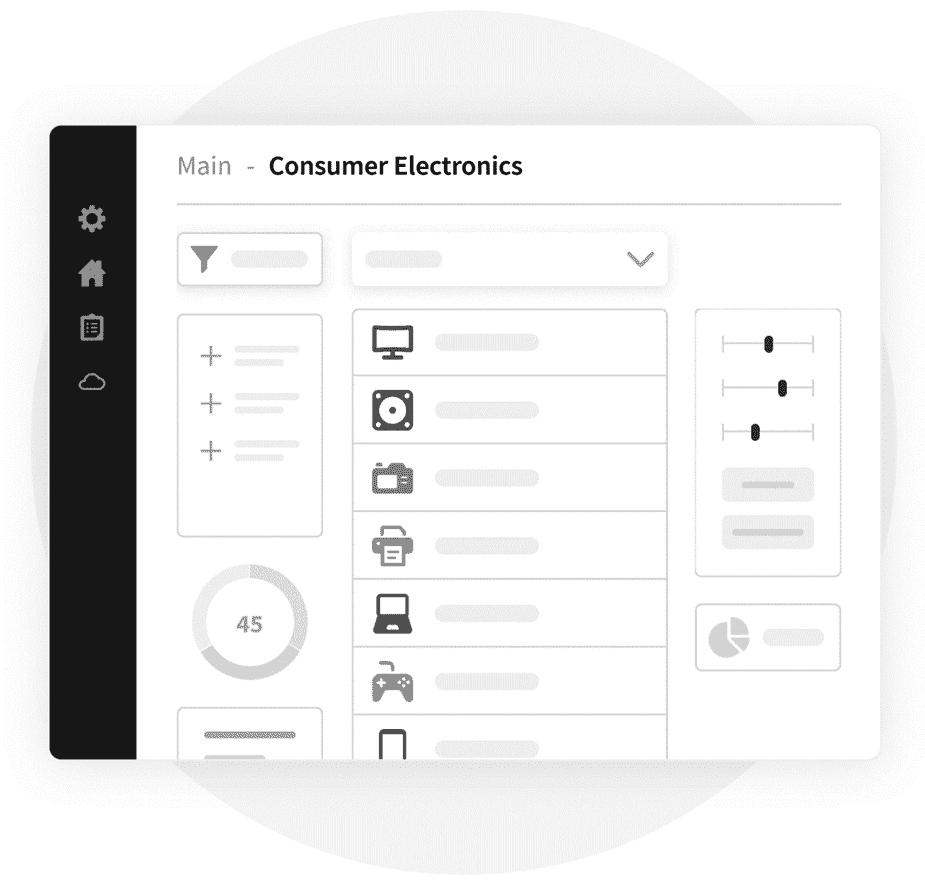
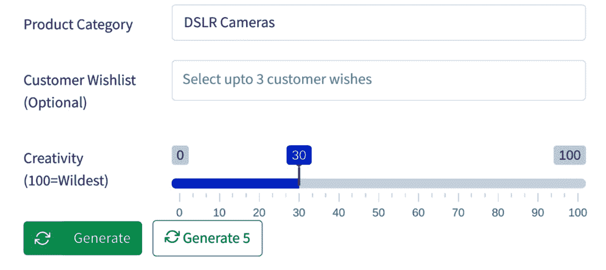
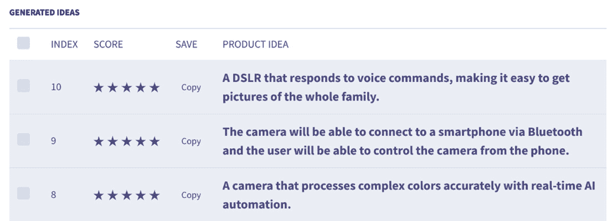

# 第六章：*第六章*：应用 AI 进行创新——消费电子深度分析

正如我们在前几章中探讨过的，AI 不再仅仅是一个流行词。它已成为许多公司增长战略的关键组成部分，大多数领先的高管表示，他们的公司正在投资于 AI 或机器学习。本章将探讨消费电子品牌如何利用 AI 来提升产品创新并推动增长。

消费电子品牌一直依赖于创新新产品的能力，以跟上技术快速变化的趋势。创新新产品使这些品牌能够保持相关性，并吸引那些希望体验与技术互动新方式的消费者。

这一点今天依然适用。例如，当消费者在众多智能家居设备中做选择时，他们需要有足够有吸引力的理由来选择你的品牌而非他人。通过利用新兴的 AI 技术，消费电子品牌能够创造出比以往更加沉浸、互动、愉悦的产品——从而帮助它们在日益拥挤的科技货架中脱颖而出。

本章将涉及以下主题：

+   了解消费电子品牌面临的挑战

+   分析消费电子品牌的产品数据

+   使用 Commerce.AI 为消费电子品牌赋能

我们将了解消费电子品牌在面对**连接消费者**、**内容消费者**以及来自各方的竞争时所面临的新挑战。我们还将探讨如何收集、分析和利用消费电子数据，以实现更加创新并克服各种挑战。

# 了解消费电子品牌面临的挑战

我们首先从探索消费电子品牌面临的挑战开始，了解为什么需要新的、创新的、数据驱动的、基于 AI 的解决方案来推动产品的成功。

我们将讨论的一些挑战包括**连接消费者**的需求、短期注意力跨度的现实、新兴内容消费者的需求，以及来自新兴市场的竞争日益增加。

## **连接消费者**的需求

**连接消费者**是一个近期出现的现象，但已经成为消费电子领域的新常态。实际上，每个消费者现在都期望能够连接互联网，并以某种方式与他们的技术互动。

这不再仅仅是智能手机和平板电脑的问题。它还涉及可穿戴设备、家庭自动化和智能音响设备，如 Alexa 或 Google Home。所有这些设备使消费者能够以有意义的方式与技术互动。

品牌在认识到这一转变时较为迟缓，因为这一变化仍然相对较新。但随着越来越多的人开始将这些设备作为日常工具，这种情况会随着时间推移而改变，这也是品牌现在需要特别关注的原因，如果他们想要在未来优化商业战略。

要在今天这个互联的世界中取得成功，品牌需要有强烈的身份认同——这首先要了解人们希望如何通过技术与品牌互动。为了有效地做到这一点，品牌应该看看人们目前如何使用技术（换句话说，*你们已经如何获胜？*）。

因此，品牌需要创造性地思考，如何将这些优势转化为更大的东西——提供更多的参与机会并与客户建立更深层次关系的东西。

例如，如果我们回想一下智能手机首次推出时——iPhone——它改变了一切，因为它非常容易接触且直观。苹果利用这种熟悉感，使得触摸屏的切换比任何其他公司都更加容易。它通过发挥在产品设计和软件开发方面的优势来实现这一点。

产品设计的重要性在这里无法过分强调：人们不仅仅是买东西；他们是使用东西、体验东西。如果你的客户不会自然而然地倾向于使用你的产品，因为它感觉自然或直观，那么市场大多数人也不会如此。

## 短期注意力跨度的新现实

平均注意力持续时间曾经要长得多。而今天，人们常说只有 8 秒钟。人们有很多选择，决定自己想关注什么，不想关注什么——随着社交媒体平台的兴起，从 Twitter 到 TikTok，关于品牌和产品的意见层出不穷。

### 对社交媒体的影响

如果品牌要在今天日益数字化的世界中取得成功，它们必须像关注实体足迹一样关注数字足迹。换句话说，消费者如何在社交媒体上看待品牌，和他们面对面看待品牌时一样重要，尤其在做出购买决策时。

今天，消费者比以往任何时候都更加意识到他们通过社交媒体对品牌拥有的影响力——即使某些品牌可能不总是以尊重这些力量的方式行事（这可能会让它们陷入困境）。

对任何品牌来说——无论是消费电子品牌还是其他类型的品牌——要想在今天取得成功，它需要在网上拥有一个活跃且参与度高的社区，与品牌及其价值观有联系。这意味着要在各种渠道上积极与社区互动（例如，Facebook 小组、Instagram 故事和 TikTok 短视频），从而与他们建立有意义的关系。

关键在于弄清楚如何最好地利用现有资源（你的员工），同时找到增加新资源的方法（如承包商和自由职业者），以帮助提升公司营销工作。

### 对产品团队的影响

不仅仅是社交媒体领域在今天这个数字优先的世界中发生了变化。短暂的注意力意味着消费者不太可能愿意（或能够）投入时间和精力去完全体验他们与之几乎没有或完全没有情感联系的产品。

为了最大化与内容的互动——无论是电影预告片、歌曲歌词视频、电视节目预览，还是书籍摘录——消费电子品牌需要思考如何创造更具吸引力的体验，超越单纯的内容本身。

这要求理解如何使用技术以提升消费者对你内容的体验，而不是取而代之。这包括允许用户以新方式与内容互动（例如通过 AR 眼镜来阅读互动故事书）；使用基于运动的媒体（如舞蹈 GIF）代替静态图像；通过 360° 视频创造*电影般*的体验；利用虚拟现实平台的直播平台；等等！

关键是，消费者花在传统媒体上的时间减少了，而花在数字媒体上的时间增多了——品牌应该利用这一机会与他们的社区建立有意义的关系。

## 满足内容消费者的需求

内容消费者自光盘时代以来发生了变化。今天，消费者不断被信息和娱乐轰炸。像 Netflix 和 YouTube 这样的在线视频服务的兴起，让消费者比以往任何时候都更容易触手可及地获得大量内容。*那么，消费电子品牌如何在这片视频内容的海洋中脱颖而出呢？*

答案是围绕内容本身创造引人入胜的体验，而不是仅仅在价格上竞争。人们每月观看数十亿小时的视频。因此，品牌在提供引人入胜的体验时，必须超越产品本身的思考。他们必须围绕产品和服务创造吸引人的叙事，以便在一个竞争激烈、客户注意力和钱包争夺激烈的市场中脱颖而出。

内容创作不再仅仅是大媒体公司或好莱坞工作室的领域；现在较小的创作者也能以相对较少的生产投入和基础设施，接触到庞大的受众群体。

这对品牌意味着，他们不能仅仅依靠自己的产品来与竞争对手区分开来；如果他们想在日益竞争激烈的市场中吸引客户的注意力和忠诚度，他们需要通过引人入胜的内容超越自我。

品牌还应密切关注客户在整个客户旅程中的社交媒体参与预期——从产品开发到分销及更远的环节——以便让客户在每个阶段的体验过程中都感到被包含。

## 需要成为数据驱动型公司

消费电子品牌需要成为数据驱动型公司。数据是新的*石油*。它推动着公司增长和创新，也决定了消费品牌的成败。

在许多情况下，消费者洞察来自数据分析，而不仅仅是人类直觉。能够有效利用数据的公司将能够改善产品和服务，同时增加与客户的互动。

另一方面，那些没有强大分析能力的公司将会在竞争中处于劣势，相比之下，具备数据分析能力的竞争者将占据优势。*那么，公司如何才能变得更加数据驱动呢？* 我们将在*分析消费电子品牌的产品数据*一节中解答这一问题。

## 新兴消费电子市场

众筹的普及和对新兴创新技术的兴趣爆炸性增长为消费电子行业带来了繁荣。每天使用技术的人数已达数十亿，并且在新兴市场中仍在快速增长。有些人将其视为一种破坏性机遇，而另一些人则将其视为威胁。

一些专家认为，随着越来越多新用户进入市场，现有公司将面临维护其主导地位的挑战，因为竞争日益激烈。

品牌还必须应对快速变化的趋势，如**虚拟现实**（**VR**）。如今，我们已经看到像苹果、三星和 Facebook 等大品牌进入虚拟现实领域。随着消费者对虚拟现实技术的熟悉度提高，传统品牌可能会相应调整其战略——甚至可能会被科技公司收购。

在这种环境中保持竞争力，你需要思考如何在保持品牌身份的一致性的同时，吸引更多的客户——数字和实体零售店、在线商店以及电子商务平台只是你今天可以与受众互动的一些例子。

现在我们已经了解了消费电子品牌面临的一些主要挑战，让我们来看看如何分析产品数据以克服这些障碍并推动前进。

# 分析消费电子品牌的产品数据

消费电子公司依赖产品数据来了解其客户和市场趋势。产品数据对于理解你的产品表现、消费者需求以及他们如何与品牌互动至关重要。

您收集的数据可以帮助您识别问题、衡量成功并做出更好的战略决策。但找到可操作且有帮助的产品信息可能很困难，尤其是当您不是消费电子产品专家时。

基于数据的产品战略是利用数据和分析来开发新产品创意、评估现有产品并改善客户的整体体验。其目标是通过改变人们与品牌的互动方式来增加客户参与度。

基于数据的产品战略具有许多好处，包括以下几点：

+   通过有针对性的优惠提高客户忠诚度和客户保持率

+   通过精简运营降低成本，同时保持质量

+   通过创新提升收入或增加利润率，从而提高盈利能力

+   通过增强对消费者偏好的理解，减少市场风险

## 基于数据的产品战略中的关键考虑因素

每个公司的数据环境都不同，取决于其规模、行业结构和商业模式。在最基本的层面上，数据战略涉及创建一个可以分析的数据库，以洞察消费者行为。

例如，您可能会收集近期购买了您产品或服务的客户的行为数据。您还可以查看历史销售数据，识别出哪些特征组合在客户中最受欢迎的模式。然后，您可以利用这些信息来指导未来的产品开发和营销活动。

公司还可以利用人工智能和机器学习算法，基于客户的线上或线下行为（例如，查看过去的购买记录或搜索历史），确定客户可能购买的产品类型。最后，公司可以与各部门（如市场营销、工程和财务）团队合作，分析这些信息，从而发现满足消费者需求的新产品或服务机会，这些需求存在于他们所服务的更广泛用户群体中。

根据我们的经验，我们可以建议客户为各行业的消费者品牌（如电子商务、快速消费品和 B2B）建立数据战略。以下是一些关键考虑因素：

+   **关注客户需求**：根据现有数据集或市场调研（线上/线下）识别您对客户行为的了解。然后，确定您还不了解的部分 —— *在您开始验证假设之前，您还需要哪些更多的数据点？*

+   **定义角色和责任**：*谁将负责流程的每个阶段？需要多长时间？他们将使用什么工具/方法？* 明确这些角色至关重要，以确保项目能够顺利完成并明确责任归属。

+   **建立能力**：*谁将确保高层管理人员持续承诺？* 这将确保在必要时提供监督和支持。

通过 Commerce.AI 的数据引擎，大部分（如果不是全部）你需要的数据已经可用。我们的产品数据引擎包含超过一万亿个数据点，涵盖数十万种产品和服务，数据来源包括上百个不同的渠道，支持多种语言。

现在我们了解了数据驱动的产品战略中的关键考虑因素，接下来我们来看看如何收集这些数据。

## 如何收集消费者数据

消费者数据是任何品牌的命脉。一个强大的消费者数据计划可以帮助公司理解是什么驱动客户购买，最终影响他们的购买决策。

在消费类科技产品领域，产品评论是品牌收集客户反馈的一个公认且有效的方式。来自满意客户的评论在营销或公关活动中可能和一个充满赞美的新闻稿一样具有影响力。

另一个很好的客户反馈来源是社交媒体：Instagram 的帖子可以提供有关消费者对你产品的审美吸引力和易用性的重要见解，而 Twitter 的推文则能展示人们如何通过笑话、表情包和其他形式的社会评论与品牌互动。

你还应该密切关注人们对竞争对手产品的评价——竞争对手关于即将发布更新的帖子，可能会引起现有用户的热议，他们希望在做出下一个购买决定之前，了解最新的功能。

如今，随着消费者数据触手可得（通过像 Reddit 这样的在线论坛、像 Mixpanel 这样的应用分析平台，以及像 Mailchimp 这样的电子邮件营销服务），我们很容易忽视一些不太明显的产品反馈来源，而这些来源往往比书面评论或推文更具可操作性。

坦率地谈论你产品中出现问题的经历是许多公司未能充分利用的宝贵输入来源。这是因为很多公司缺乏直接从客户收集此类反馈的经验。在这里，Commerce.AI 的语音调查发挥了作用：它们使各行各业的企业能够实时倾听人们通过语音表达对产品的关注。

通过利用像这些工具——结合强大的在线社区，如 Reddit——品牌可以比仅仅阅读用户评论更深入地了解是什么驱动了客户的满意或不满意。

## 如何将数据整合到产品设计中

有很多关于如何设计更具吸引力的产品的研究，但很少有研究关注如何从最终用户的角度设计产品。端到端说服性设计过程包含四个阶段：

1.  理解你的用户

1.  使用人物角色

1.  基于数据创建人物角色

1.  确定每个人物角色中的痛点

### 理解你的用户

了解你所设计对象是谁很重要，因为它可以帮助你理解他们从产品中想要什么，以及为什么他们可能需要它。你对用户了解得越多，你的产品设计就会越好（而且越不容易出现可用性问题）。

过去，产品设计师需要依赖直觉和轶事证据来理解用户如何使用技术。如今，随着大量数据的可获取性，观察用户与产品互动的方式，可以让我们了解很多关于用户的信息。

例如，你可以观察每个用户在点击离开之前，在屏幕或页面上停留了多久，或者你的网站上哪些部分的使用率最低。你还可以看到人们在做出购买决策之前点击或滚动的位置。所有这些信息将有助于你改善产品的可用性，并最终提高转化率（即将访问者转化为客户的比例）。

跟踪数据还可以通过持续进行**A/B 测试**，帮助我们快速迭代设计，直到它与我们理想的用户体验匹配。

### 使用人物角色

**人物角色**是帮助你理解用户的工具。它们可以帮助你识别需求、目标和动机，从而为产品设计提供信息。人物角色是一个虚构的个体代表，代表了目标用户群体的某些方面。其核心理念是创建一个活文档，描述目标用户的特征、动机和期望。

这使你能够在构建产品之前测试有关产品或服务如何被真实用户使用的假设。人物角色非常有用，因为它们可以让你专注于重要的内容，而不是假设用户的行为。它还可以帮助你避免在面对新用户时不断犯相同的错误，通过关注这些新用户是谁，而不是根据过去的趋势或目标市场中其他群体的行为来猜测他们可能的行为。

你可以在许多不同的方式中使用人物角色作为拼图的一部分，包括识别设计过程中的痛点、早期了解客户需求和想法、为团队创建内部愿景板，甚至在构建某个东西之前通过潜在客户测试新想法，而不是仅仅因为它看起来很酷。

### 基于数据创建人物角色

现在你已经有了一份符合特定特征和动机的人员列表，但仅凭这些信息是不够的——*你也需要数据！* 如果可能的话，尝试找到定量的方法来理解这些人是谁，以及是什么驱动他们。通过这样做，这些信息可以被融入到你的人物角色中，也能纳入到你后续的分析过程中。

例如，避免仅仅根据定性观察创造虚拟人物，而是创建一个分析报告，以数字化的方式展示这些观察结果。这样，电商公司的人可以利用这些信息来估算在黑色星期五周末运营在线商店时，应该预期的销售量——单靠定性洞察是无法提供这种信息的。

### 识别每个用户角色的痛点

现在我们已经确定了用户角色，第一步是找出他们当前无法得到的、需要的或无法轻松获得的东西——这些就是他们的痛点。

**痛点**是客户在使用某个产品或服务时遇到的问题。首先要识别出客户在你的产品上遇到的困难，然后找到为他们提供解决方案的方法。

在最基本的层面上，这个过程应该从问自己开始，*我的客户缺少什么？* 这是很重要的，因为它迫使你思考你希望在产品中加入哪些功能，以及如何让这些功能变得更加容易获得。

一旦你识别了这些痛点，下一步就是确定哪些痛点足够重要，需要你投入资源来为客户解决。记住，如果不能解决一个重要的痛点，用户会选择去别的地方寻找他们需要的东西，所以你必须选择正确的痛点。

需要记住，并非每个痛点都需要通过开发新产品或服务来解决。有时市场上已经存在解决方案，有时可以在现有的技术或设计限制下采取措施。

为了找出需要解决的问题，我们通常会观察行业中现有的趋势和模式，以及在我们之前成功解决这些问题的类似公司的数据。我们还会问自己以下问题：

+   *我们现在的客户是否觉得缺少某些东西？*

+   *现有市场上是否已有其他解决方式？*

+   *我们领域内其他公司做得如何？*

+   *我们有独特的东西吗？但是我们能借鉴他们的成功经验吗？*

+   *我们在查看类似产品/服务时，是否在行业之间发现了任何模式？*

这些问题的答案有助于你了解应该解决哪些痛点，这是产品创新的关键组成部分。

既然我们已经知道如何收集、分析和使用消费电子数据，接下来让我们探讨将这些数据转化为洞察的下一阶段：使用 Commerce.AI。

# 使用 Commerce.AI 为消费电子品牌提供服务

作为全球最大的产品数据引擎，Commerce.AI 为消费电子品牌提供了丰富的创新机会。让我们探索如何使用 Commerce.AI 更好地理解产品定位、分析消费电子市场、改善研究计划、生成产品创意等。

## 理解产品定位

理解产品定位对于了解任何产品的市场潜力至关重要。以下图表展示了如何使用 Commerce.AI 的定位图，通过比较产品的情感评分（纵轴）和**评论数量**（横轴），来了解不同产品在市场中的位置。

图 6.1 – 一个产品定位图模型，比较了情感和评论数量

以相机为例，一款入门级的傻瓜相机可能在图表上的位置低于一款高端数码单反相机，后者具备更好的功能，如更快的镜头、更大的传感器和更先进的图像处理能力。

通过从多个维度比较这些产品的客户价值，你可以迅速获得每个产品在市场中相对价值的洞察。如果只看一个维度（例如，情感），你可能会错过重要的见解。例如，如果某款相机的情感评分非常高，但只有 10 条评论，那么这个情感评分可能经不起推敲，在现实中可能会失效。

## 使用消费电子 AI 报告分析市场

消费电子市场非常庞大。根据 Statista 的研究（[`www.statista.com/markets/418/topic/485/consumer-electronics/#overview`](https://www.statista.com/markets/418/topic/485/consumer-electronics/#overview)），预计到 2022 年，销售额将超过 1.2 万亿美元。除了智能手机和笔记本电脑，还有无数其他设备可以归入这一领域，从平板电脑到虚拟现实耳机，再到家居自动化设备。根据你对这个术语的定义，如果你愿意稍微扩展定义，甚至可以包括如健身追踪器或智能手表等可穿戴设备。

由于在这些小工具上花费了大量金钱，品牌商希望了解消费者购买的产品以及为什么选择这些产品而非其他产品，这并不令人惊讶。市场研究公司对消费者行为和偏好进行了广泛的研究，以了解未来趋势如何发展，以及品牌如何通过其产品和服务满足人们的需求。

问题在于，这个庞大的市场对于产品团队来说是把双刃剑：虽然有巨大的财务机会，但面对如此海量的数据，理清头绪却变得困难。手动分析数百万个产品的产品情感和评论几乎是不可能的。

使用 Commerce.AI 的 AI 生成市场报告，这些数据会被自动分析，以前所未有的速度提供洞察力。以前需要几个月的时间由研究团队完成的工作，现在只需几次点击就能完成。

以下截图展示了关于**数码单反相机**的 AI 生成市场报告，其中包括相关**亚马逊**类别中的产品数量、增长最快的品牌、畅销产品、**品牌**数量，以及一个总结市场机会规模的**机会计量表**：

图 6.2 – 关于数码单反相机的 AI 生成市场报告片段

品牌需要了解消费者如何使用他们的产品；这为潜在的产品改进或新增功能提供了宝贵的洞察，确保在竞争对手之前就能做出改进。市场研究还可以帮助公司通过提前了解趋势，保持领先于主流消费者行为，从而维持竞争优势。

## Commerce.AI 如何帮助消费电子品牌研究？

品牌获得消费者行为洞察的一种方式是通过专门为市场研究目的设计的分析软件。

由于 Commerce.AI 运营着全球最大的产品数据引擎，分析了超过万亿个数据点，因此呈现给品牌的数据会根据他们的需求精心策划。否则，信息超载将成为常态，而产品 AI 正是旨在通过聚焦洞察来突破这一现状。以下图示展示了 Commerce.AI 中的**消费电子**仪表盘如何像一个*空白画布*，根据品牌的需求填充相关数据：

图 6.3 – 空白 Commerce.AI 仪表盘的模拟图

消费电子品牌研究需要分析大量数据。Commerce.AI 正是在这方面提供帮助——我们提供强大的分析软件，专门为商业领域的公司设计。

我们的平台从零开始构建；我们了解在管理产品线时你需要随时掌握哪些类型的数据。现在，我们进一步提升我们的专业能力，加入了深度学习功能，帮助你获得关于你产品和服务线内消费者行为的可操作洞察。

## 生成消费电子产品创意

除了分析市场和研究趋势外，我们甚至可以使用人工智能从零开始生成消费电子产品创意。**产品构思**是创新的关键组成部分，因为如果不能提出新颖且令人兴奋的创意，最终可能导致企业失败。毕竟，今天最成功的公司，从苹果到特斯拉，都是那些跳出框框、打破现状的公司。

让我们来探索一个 Commerce.AI 中的例子，看看大型语言模型如何生成产品创意。这些模型用于预测文本中最可能出现的词语，类似于传统的**自然语言处理**（**NLP**）技术用于文本分析的方式，只不过规模更大。

由于**Transformer**等架构的改进，大型语言模型最近变得更加广泛可用，这些模型现在处理大量的文本数据，包括来自全球各地的产品描述和评论。

大型语言模型特别适用于生成产品创意，因为它们是通过学习自然语言而非单一的词汇或短语。因此，它们不仅会考虑像*计算机*或*平板*这样的广泛概念，还会考虑更具体的概念，比如*iPad*或*iPhone*。

以下截图展示了实际操作过程。首先，你需要输入`DSLR Cameras`。然后，你可以选择一个**客户愿望清单**，该清单从产品评论中提取。这份**客户愿望清单**将用于启发生成的创意。如果未选择愿望清单，则评论数据将用于全面生成创意。另一个需要注意的地方是**创造力**，这是一种为大型语言模型设置的随机性参数。较高的创造力或较高的随机性会生成更多的创新想法，但可能会较少实际、现实。

](img/Figure_6.4_B17967.jpg)

图 6.4 – 比较情感和评论数量的产品定位图示意图

通过这种方法，我们已经能够轻松生成成千上万的独特产品。在下面的截图中，我们为新的 DSLR 产品创意生成了想法，例如可以通过手机控制的 DSLR、响应语音命令的 DSLR，以及通过 AI 准确处理复杂色彩的 DSLR。

](img/Figure_6.5_B17967.jpg)

图 6.5 – AI 生成的 DSLR 产品创意片段

虽然人工智能无法替代人类的创造力，但它可以帮助增强我们的创造力。在实践中，所有的产品团队都经历过*创意瓶颈*的感觉，在这种状态下很难想出新点子。通过使用人工智能，消费电子产品团队可以激发创意思维，也许能帮助找到下一个重大创意。

## 从 Shopify 提取洞察

**Shopify** 是一个主要面向**中小型企业**（**SMBs**）的平台，用于支持他们的在线商店，包括库存管理、运输、支付处理、内容创作和分析等营销工具。自 2004 年推出以来，Shopify 已成长为全球最大的独立多渠道零售商。

Commerce.AI 可以通过直接向 Shopify 客户发送语音调查，从你的 Shopify 店铺中提取见解。语音调查比文字调查更能吸引参与者并提高完成率，因为许多人觉得自由地说话比坐下来写下自己的想法更容易。

你从这些调查中获得的数据可以用来指导产品开发决策。例如，数据可能会显示某些产品或服务的方面对你的客户尤其重要。这些信息能帮助你做出明智的决策，关于你应该提供哪些产品和服务，以满足最终用户的需求。

作为消费者，我们每个人在网上购物时都有自己的偏好。有些人喜欢在购买前阅读产品描述，而另一些人则更喜欢查看图片和视频内容。作为一个电子商务品牌，你应该考虑目标客户以及他们在浏览网站时最看重的内容；这将帮助电子商务品牌设计店铺以及如何格式化产品描述和图片。

此外，一些人更喜欢通过语音而非文字与消费电子产品互动；这是因为他们觉得自然地说话比担心打字错误或拼写错误更容易。

Shopify 上有超过一百万的商家，因此你可以通过在客户群体中进行语音调查，更好地了解市场——而且这一切无需额外的开发或员工时间投入。

## 在 Slack 上共享见解

创新成功在很大程度上依赖于成功的沟通。有效地向内部团队和利益相关者传达新产品概念及其带来的好处，对于创新成功至关重要。

产品创新不是一个人的工作，也不是在单一团队或组织内孤立发生的。它需要跨多个部门和利益相关者的协作。好消息是，通过 Commerce.AI 的 **Slack** 集成，产品团队可以轻松地与远程团队成员互动，使创新过程更加高效。

目标是了解客户需求是否没有得到满足，识别出颠覆性机会，早期在流程中与潜在用户测试新想法，定义并执行市场入驻战略，并在验证了市场需求和产品或服务的需求后进行规模化。

要有效地做到这一切——特别是在产品创新方面——你需要一种轻松跨部门沟通的方法，同时仍然能够控制谁在任何时候能访问特定信息。这就是像 Commerce.AI 这样的工具派上用场的地方；它们使得跨部门沟通成为可能，帮助团队更高效地协作。

你应该优先考虑在何时共享哪些信息，关键是确保每个参与者都能在正确的时间获得正确的信息。这使得每个参与组织内创新活动的团队成员——从构建产品的工程师，到创造用户体验的设计师，再到决策哪些想法值得进一步推进的领导层——都能充分参与推动创新向前发展。

# 总结

本章中，我们学习了消费电子品牌面临的主要挑战，以及如何通过分析产品数据和使用 Commerce.AI 的数据引擎来克服这些挑战。这些挑战包括消费电子领域的更高复杂性和竞争。通过分析大量的消费者和产品数据，消费电子品牌能够发现应对这些挑战的洞察。

基于 AI 的创新在过去几年里已经颠覆了许多行业。最终，领先的消费电子品牌正在采用 AI，以保持在创新前沿。

在下一章，我们将探讨如何在餐饮行业应用 AI 创新，餐饮行业与消费电子不同，通常滞后于技术趋势，但同样通过利用数据和 AI 将大大受益。
