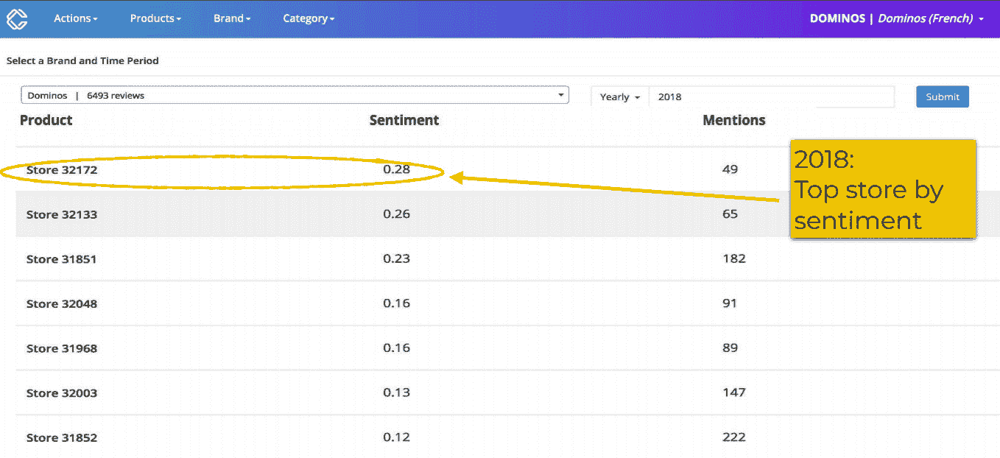
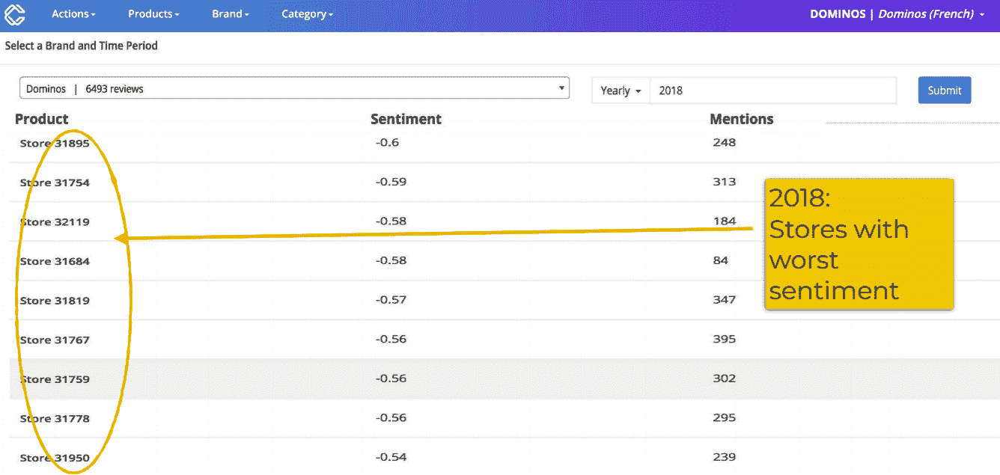
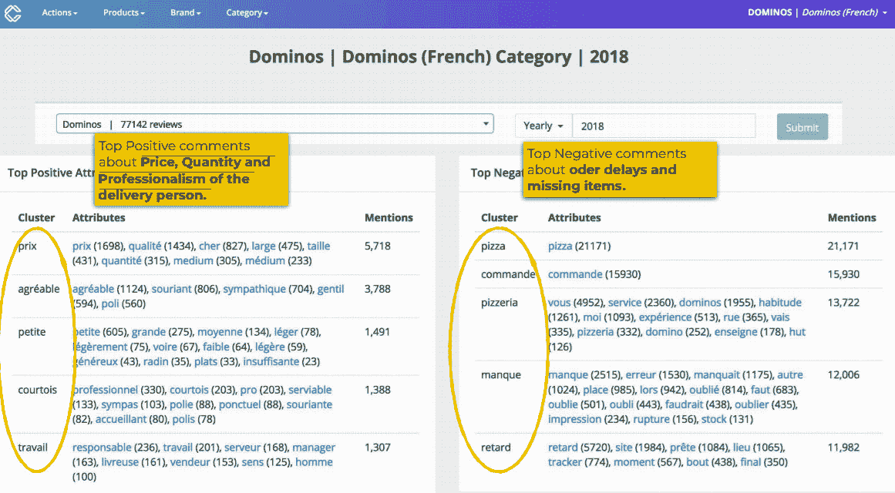
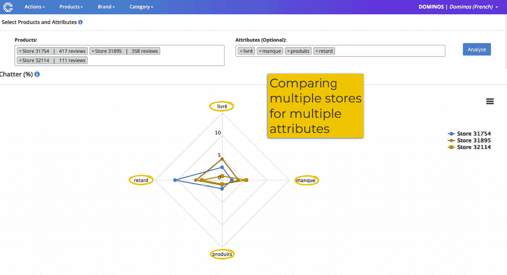
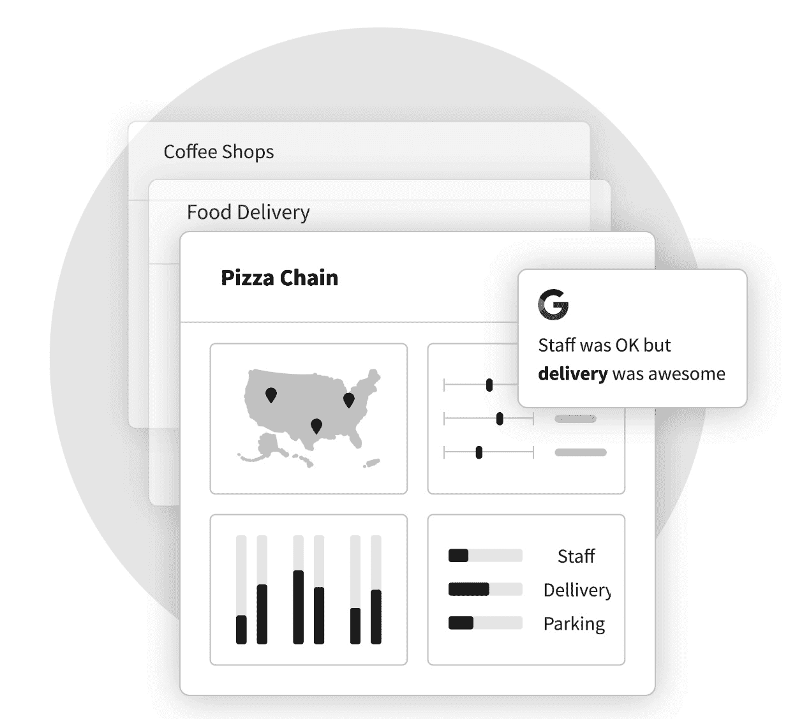

# 第七章：*第七章*：应用 AI 进行创新——餐饮行业深入分析

餐饮行业素以艰难著称。它是一个竞争激烈、利润微薄的领域，这些挑战在 COVID-19 疫情期间变得更加严重，餐馆面临的规定比以往任何时候都更加严格。

在美国，开设一家租赁餐厅的平均成本为 27.5 万美元，只有约 20%的新餐厅能在五年后生存下来。这意味着有很多失败，但也有很多机会，尤其是对于那些愿意冒险并尝试新事物的人。

在本章中，我们将讨论**人工智能**（**AI**）如何帮助克服这些挑战。我们将探讨 AI 如何用于改善运营、增加收入，同时降低成本、提高利润。我们还将讨论 AI 如何为餐饮行业的顾客创造更具吸引力的体验。

在本章中，我们将讨论以下几个主要话题：

+   了解餐饮行业的挑战

+   餐饮行业的产品数据分析

+   使用**Commerce.AI**为餐饮业提供服务

# 了解餐饮行业的挑战

餐饮行业是零售行业中最为陈旧和停滞不前的行业之一，对变革缺乏兴趣。试想一下：历史上，餐厅一直难以与其他娱乐形式，如电视、电影，甚至只是与朋友社交进行竞争。为什么你要外出就餐，而不是待在家里，点**Seamless**或**Just Eat**外卖，顺便看 Netflix 呢？

传统的实体零售正面临巨大挑战，难以自我重塑，因为消费者的消费习惯正在向线上转移。与此同时，餐饮行业自其诞生以来基本没有发生太大变化——一旦商业模式在社会中根深蒂固，就很难进行创新。

但时代在变。近年来，数据已经实现了民主化——任何拥有互联网连接和计算机的人都可以访问这些数据——这使得公司能够比以往更好地做出基于证据的决策，而非依赖直觉或猜测。

为了更好地理解为什么以及如何在餐饮行业中使用数据和 AI，让我们探索一下目前该行业面临的一些主要挑战。

## 盈利能力

第一个主要挑战是产生足够的收入以实现收支平衡。虽然最终目标是变得（或保持）高度盈利，但这一切始于达到收支平衡点。虽然盈利能力是所有企业普遍面临的挑战，但这一点在餐饮行业尤为明显，因为该行业的利润率非常低。

据估计，餐厅的平均利润率大约为 3%到 5%，许多餐厅都在为盈亏平衡而挣扎。这使得一些人称餐饮行业为*低利润*行业。那么，做到盈亏平衡需要什么？更重要的是，如何增加收入以实现盈利？

我们将这一话题分解为四个关键领域：**客户获取成本**（**CAC**）、菜单创新、定价策略和营销策略。以下小节将详细介绍每一个领域。

### 客户获取成本

这个关注点首先涉及到所有与获取新客户相关的成本——简称为客户获取成本（CAC）。这些成本包括广告费用（线上和线下），以及您可能提供的任何折扣或激励措施，以吸引现有客户反复光临。

换句话说，如果您仅仅依赖口碑推荐来获取新客户，那么您将需要在营销上做出大量投入，以便让人们了解您的位置和产品。

此外，除了考虑客户获取成本外，还需要关注竞争对手的相关成本；如果附近的其他商家提供大量折扣，那么您可能需要匹配或超过这些优惠。

您还应该了解任何可能帮助抵消餐厅成本的地方或州级激励措施。例如，如果您正在开设一个新店，那么可能会有补助金和税收减免可以帮助降低您的 CAC。

然而，这一切只是一个起点，利用来自整个餐饮行业的数据可以帮助您完善营销和客户获取策略。换句话说，行业范围内的 CAC 数据可以用于改进您自己的 CAC，从而提升盈利能力。

### 菜单创新与产品开发

影响餐厅盈利能力的下一个主要因素实际上是改变您所提供的食品。如果您目前晚上仍然提供相同的菜肴，并指望销售额增长，那么很可能事情并未按计划进行。

因此，确保您的菜单每个月都保持新鲜和有趣是至关重要的；提供超出基本美国餐点的选择有助于确保人们持续反复光临。

*菜单创新*是为现有或新客户开发新颖且激动人心的食品和饮料的过程。这是餐饮行业中的一项重要工具，能够帮助餐厅通过提供与竞争对手不同的选择，从而在竞争激烈的市场中保持相关性——从而使餐厅在人群中脱颖而出。

为了理解如何改进餐厅菜单，我们需要退后一步，看看*顾客体验*这个概念是如何渗透到我们生活中的。现在，许多人都在社交媒体平台上度过他们的生活，如**Facebook**和**Instagram**。他们也在分享关于餐厅菜肴和菜单的想法，利用这些数据可以为菜单设计提供宝贵的见解，正如我们将在本章后面探讨的那样。

### 定价策略

提高盈利能力的第三个关注点涉及到你商业的定价结构——更具体地说，是你收取的产品或服务费用背后的*原因*。如果你目前对你的产品定价过低，那么很可能导致收入损失和整体利润的下降。

简单来说，如果人们不愿意为你提供的产品支付足够的费用，那么他们很可能不会再回来购买——无论之前的购买有多好。你可以通过提高一些高需求商品的价格来增加利润，同时降低其他需求较低商品的价格。这将有助于确保销售量和平均票价之间的平衡随着时间推移保持有利。

还需要考虑竞争对手（或你自己过去可能提供的）任何促销或折扣，以及与这些变化相关的税务影响。根据当前的税法或政府激励措施，可能会有进一步增加盈利的机会。然而，最重要的是在大规模分析定价和需求数据的基础上，计算出最优定价策略。

### 营销策略与社交媒体

高效利用社交媒体是当今营销工作中越来越重要的一部分——特别是在餐饮行业本身。Facebook 已经成为接触潜在顾客的强大平台，全球用户超过 20 亿。

自然流量是指在没有付费广告的情况下，企业本可以获得的流量。实际上，付费广告能够通过引导口碑推荐，间接驱动自然流量。使用**Facebook 广告**可以通过自然方式将顾客带到你的餐厅，从而最终增加客流量——特别是考虑到近三分之一的到店顾客是通过朋友或家人的口碑推荐而来。

通过利用 Facebook 广告以及其他付费社交媒体活动（例如在**Twitter**或**Instagram**上的广告），可以触及广泛的受众，并随着时间推移显著增加销售额。但请记住，仅仅花钱在付费社交媒体活动上并不一定能带来收入的增加，因为还有许多其他因素需要考虑。

## 顾客偏好的变化

理解和预测消费者行为或许是维持竞争优势的最重要方面，尤其是在当今充满活力的餐饮市场中。

酒店业在过去几年经历了许多变化，尽管增强现实等创新带来了新的兴奋和餐饮吸引力，我们相信消费者寻求的远不止一个新噱头。为了为品牌创造长期价值，它们需要理解顾客对体验的期望——以及这些期望如何变化。

餐厅顾客的偏好发生了巨大变化。就在几年前，焦点还集中在餐品的味道、菜单的种类、等待时间和餐厅氛围等方面。如今，严格的健康和卫生措施已经成为顾客关注的重点，如果标准有所松懈，许多顾客都会抱怨。

这些不断变化的顾客偏好也影响着盈利和预测。例如，总体上就餐销售额的下降，以及账单金额的减少已经成为一种新的现实。因此，餐厅除了根据顾客的新偏好来满足他们的需求外，还需要寻找新的方式来增加收入。例如，餐厅可以考虑更改菜单，甚至实施技术手段来帮助遵守社交距离协议（例如，无接触支付选项和二维码菜单）。

偏好取决于情境。顾客看到的是什么？他们和谁一起？他们有多饿？他们在哪里就餐？他们在就餐时还做什么（例如，去附近的商店购物）？这些情境因素在决定一次体验是否值得记住以及顾客是否愿意与他人分享中起着重要作用（因此社交媒体上的互动指标变得至关重要）。

这里的关键要点是，每位顾客根据个人情况有不同的需求，这意味着没有两种体验是完全相同的。在当今竞争激烈的环境中脱颖而出需要创造力和创新：你需要一些竞争对手没有的东西——海量的产品和服务数据。

## 创建有利可图的菜单（和定价）

餐饮行业经历了许多变故。在新冠疫情之前，行业呈现出不错的增长，但 2020 年行业急剧下滑，许多小型餐厅因此倒闭。各国政府的应对措施起到了转折作用，推动了消费者可支配收入的增加以及疫情后人们更频繁外出就餐的愿望。因此，许多新餐厅在全国范围内开设，并且在技术、设计和食品质量方面出现了创新的爆炸式增长。

为了在这个动荡的环境中获得成功，餐厅必须适应并发展，以保持对当今消费者的相关性。

## 菜单工程

*菜单设计*对于餐厅的成功至关重要。一个设计良好的菜单将增加顾客忠诚度，塑造品牌形象，并推动整体收入增长。不幸的是，许多餐厅在菜单设计上面临困难。原因有很多，但其中一个最常见的问题是菜单中往往包含过时的信息。

依赖传统技术的餐厅——无论是纸质菜单、平板设备还是移动应用——都无法跟上今天餐饮行业变化的步伐。为了在竞争日益激烈的市场中有效竞争，餐厅需要新的方式来与顾客沟通，并围绕他们的饮食创造引人入胜的体验。

餐厅不仅需要设计菜单，还需要将菜单*工程化*，使其既受到消费者喜爱，又能保持高盈利性。菜单工程是打造盈利餐厅菜单最复杂、最具挑战性的策略之一。为了做到这一点，餐厅必须在产品开发和市场营销方面都进行创新。

产品开发的创新至关重要，因为这是跟上变化的消费者需求的唯一途径，同时还要提供多样性并确保顾客满意。随着消费者对健康的关注度提高，他们在饮食中寻求更多天然成分——如果你在菜单中加入这些成分，他们愿意为这些产品支付溢价。这意味着你需要投资开发有潜力成为畅销产品的新菜品。

## 维护在线评价和社交媒体营销

在线评价和社交媒体已经成为消费者在选择就餐地点时决策过程中不可或缺的一部分。然而，随着在线评价平台和社交媒体渠道的增长，餐厅发现维护在线存在感变得越来越困难。在线评价和社交媒体帖子不再仅仅是为了向消费者提供商家信息；它们已经成为消费者根据自身需求与品牌互动的方式。

在线评论和社交媒体帖子可以成为强有力的工具，帮助餐厅从竞争对手中脱颖而出——但如果处理不当，也可能适得其反。例如，负面评价或不良媒体报道可能损害品牌声誉，导致顾客未来避开该公司。

在线评价平台的出现使得人们比以往任何时候都更容易表达他们对商家的看法，但维持在线存在并非易事——尤其是在竞争激烈、外出就餐选择众多的情况下。

现在我们了解了一些餐厅面临的主要挑战，包括盈利能力、保持在线评价和社交媒体营销，接下来让我们探讨餐厅如何通过分析产品数据来克服这些挑战。

# 餐厅产品数据分析

餐饮行业是一个高度碎片化的市场，消费者可选择的产品和服务种类繁多。因此，餐厅经营者可能很难理解他们需要的数据，以推动业务中的有意义创新。

本节介绍了几种不同的数据使用方式，作为餐饮行业创新的工具，包括预测菜品成功、预测竞争对手表现、新的客户画像发现等。

## 预测菜品可能的表现

利用数据推动餐饮创新的一个重要方式是预测菜品在市场中的表现。通过分析餐饮行业整体中菜品的表现，餐厅经营者可以识别哪些菜品可能会受到消费者的青睐。这些信息可以用来为菜单、定价和营销活动做出商业决策。

传统上，餐厅依赖经验做出商业决策。然而，随着数据的增多，餐厅经营者可以利用数据科学洞察顾客可能如何响应菜品。例如，餐厅可能使用 Commerce.AI 自动监控社交媒体上对其菜品的情绪，并相应调整菜单。

在过去几年，我们看到数据科学和人工智能在各种行业中的投资增加。然而，在餐饮行业，这些工具的应用发展相对较慢。其主要原因是很难预测个别消费者如何实时响应新的趋势或创新，并且餐厅收集大量消费者数据的成本高昂且低效。

然而，随着技术的迅速发展，我们现在有能力克服这两个挑战。因此，越来越多的餐厅开始在运营中利用数据科学和人工智能。

## 预测竞争对手的表现

另一种数据使用方式是查看竞争对手类似产品或服务的历史销售信息。然后可以分析这些信息，确定新食品或饮料产品或更广泛的新产品和服务的最有前景的市场细分。

例如，如果餐厅的竞争对手最近推出了一款看起来卖得很好的新甜点，餐厅也可能会考虑推出类似的甜点。这种方法使餐饮业主能够从竞争对手那里学习，并利用他们认为在行业中尚未开发的机会。

**竞争情报**是任何企业的重要工具，但对于食品和饮料行业的企业尤其重要。这个领域的竞争格局不断变化，新的竞争者进入市场，现有竞争者则调整产品以保持竞争力。

为了跟上这些变化，餐饮业主需要对竞争对手的动向有深入了解，这样才能在市场中做出明智的决策，确定最佳的市场定位。

## 基于以往购买记录预测顾客需求

此外，数据还可以用来帮助根据顾客的以往购买记录做出有根据的预测。例如，通过查看人们在何处购买不同类型的葡萄酒或啤酒，可以确定哪些类型的葡萄酒或啤酒在某些市场/地区/行业中最有可能流行（例如，在美国红酒通常比白酒卖得好）。

将这些信息与其他消费者数据（如年龄段和购买模式）结合使用，可以帮助餐厅制定更有针对性的营销活动，直接吸引那些曾经倾向于某些类型产品或品牌的顾客。

从以往购买记录中收集的数据也能提供关于**顾客群体**在每个**市场细分**中的动机的洞察（例如，千禧一代更偏好啤酒而非葡萄酒）。通过理解不同顾客群体根据购买决策的不同情境（例如，是为自己购买还是作为礼品的一部分）做出的不同反应，就能创造出更加定制化的促销方案。

## 新的档案发现

餐饮行业中的许多产品和服务相对较新。例如，许多消费者从未吃过甜酸奶碗，或者他们从未尝试过烤制而非油炸的高蛋白食品。

为了创造有意义的创新，餐饮业主需要能够从多个维度（如食品种类、体验类型和价格区间）理解顾客的行为和偏好，从而找到改进和增长的机会。

数据可以揭示有关光顾餐厅的消费者资料的新见解。例如，数据分析可能发现，嗜甜的顾客比偏好咸味的顾客平均消费更多。这一洞察可供餐厅经营者理解其菜单中哪些菜品或产品表现良好及原因，从而可能促使新的产品开发或服务创新。

最终，数据可以成为餐饮创新的强大工具。从预测食品项目的成功和竞争者表现，到发现新的顾客画像，数据能够提供有意义的竞争优势。接下来，让我们具体看看餐厅如何利用 Commerce.AI 来推动创新。

# 将 Commerce.AI 应用于餐厅

在前面的章节中，我们已经讨论了如何在各类面向产品的行业中使用 Commerce.AI，包括奢侈品牌在*第四章*中，*创新应用 AI – 奢侈品深度分析*，无线网络品牌在*第五章*中，*创新应用 AI – 无线网络深度分析*，以及消费电子品牌在*第六章*中，*创新应用 AI – 消费电子深度分析*。

正如我们所看到的，Commerce.AI 也可以用于服务行业，包括餐饮业。这是因为服务行业的数据非常丰富，顾客会留下大量的隐性和显性反馈。

事实上，产生的数据量非常庞大，主要以客户反馈的形式出现，以至于人工整理和分析这些数据中的有意义信息几乎不可能。这时，人工智能便发挥了作用，它能够自动发现客户评价中的趋势，并预测未来的情况。

让我们看看 Commerce.AI 在餐饮行业中的五种主要应用方式：

+   分析餐厅顾客数据

+   移动调查

+   根据营销活动评估顾客的情感反应

+   与顾客保持联系

+   餐厅趋势分析

最后，我们将通过一个案例研究来了解一家法国比萨连锁店如何使用 Commerce.AI 进行餐饮创新。

## 分析餐厅顾客数据

作为餐饮技术领域的领先者之一，该平台已经处理了超过 1 万亿个数据点（来自数万个产品和服务），我们亲眼见证了公司如何利用我们的平台获得餐厅业务的洞察。这一经验帮助我们总结出一些最佳实践，指导餐厅在进行商业分析项目时，如何有效利用我们的服务。

分析餐厅客户数据也没什么不同，大多数餐厅都可以从深入分析数据中受益，以更好地了解客户。这对理解你的食品和饮料消费者如何创造可以在业务中利用的价值也很有帮助——无论是管理运营、开发新产品、改善营销活动，还是以上所有内容。但在我们深入探讨如何实现之前，先来看一下大多数餐饮企业在进行业务分析时面临的一些挑战。

当你想到餐厅业务中的数据分析时，你可能会从公司整体的报告开始——例如按单元或班次计算收入——或者从产品改进开始，比如找到每个菜单项目的最佳库存水平（包括位置）。这两者都是分析师或经理时间的绝佳利用方式，因为它们是具有可操作性的洞察，能够立即影响决策。

除非目标是找到现有数据集中元素之间的更多关联，否则这些报告不会为重新定位产品或改变消费行为提供太多洞察。

这是因为它们使用现有的模式，而没有以任何方式挑战这些模式；因此，除了相关性/因果关系之外，很少能找到其他东西，且通过分析将事情放入更有意义的背景中（例如结合所有班次信息）并没有带来任何收获。感觉就像是将更多无关的细节丢进了一个已经复杂的堆积中，没有人理解，但每个人都必须处理。

Commerce.AI 通过结合内部现有数据与大量外部市场数据，并快速总结出简明扼要的洞察，解决了这些问题。

## 移动调查

基于移动设备的调查已成为了解消费者行为与餐厅产品和服务之间关系的重要工具。

移动调查是了解顾客如何使用你的餐厅，以及他们喜欢和不喜欢餐厅哪些方面的好方法。它们还可以用来了解顾客对你食品质量的感受，是否对他们的体验感到满意，以及是否需要做出任何改变。

在餐饮行业，顾客至上，借助移动调查，你可以深入了解顾客的需求。

在 Commerce.AI 中，移动调查可以快速且轻松地完成。它们是实时了解消费者的绝佳方式，同时也可以用来定期进行*健康检查*，评估你的食品或服务质量。

这些调查的数据还可以用来为更传统的营销形式提供信息，比如印刷广告、社交媒体帖子和有机**搜索引擎优化**（**SEO**）。你甚至可以为特定受众创建定制的调查，通过电子邮件发送，并在顾客光临餐厅时展示给他们。

## 衡量顾客对营销活动的情绪反馈

营销人员花费大量时间和精力开发并执行各种方案，以增加品牌与客户的互动。他们经常问自己一个问题：*这些努力是否值得？*

我们可以通过衡量互动、销售提升以及其他指标来判断投资是否值得，但有许多因素会影响客户行为，这使得准确预测活动表现变得具有挑战性。而一个在理解某个活动如何进行中可能非常有帮助的数据来源是情绪分析。

**情绪分析**利用**机器学习**算法来识别文本内容是正面、负面还是中性。由于社交媒体帖子通常比传统营销活动更长，它们为我们提供了更多关于客户喜欢或不喜欢我们产品和服务的内容的信息。

这让我们能够快速了解活动的整体情绪，并在投入更多资金之前做出必要的调整。

Commerce.AI 提供强大的情绪分析工具，因为它与流行的第三方服务如**Google** **Analytics**和**Facebook** **Insights**集成，这两者都是衡量客户与在线业务互动时广泛使用的工具。这些集成功能让你可以使用与营销分析程序相同的数据源来分析客户情绪，这意味着你可以从第一天开始就做出更智能的决策来构建你的业务，而不是在事后根据现有客户的反馈进行调整。

## 与客户保持联系

社交媒体已成为与客户保持联系的重要渠道。公司通过 Twitter、Facebook、Instagram 等平台与他们的粉丝实时互动，从而了解消费者最关心的内容。这些知识帮助品牌在产品和服务上做出更聪明的决策，增加销售，通过个性化优惠提高客户忠诚度，并在所有渠道上增加互动。

监控关于某个品牌或竞争对手的社交媒体对话是与客户保持联系的好方法。这意味着你可以在其他人之前了解到任何新出现的问题，并在出现问题或需要解决时迅速做出反应。这也是一个在潜在新客户对你的品牌或产品类别表现出兴趣时获得提醒的好方式。

你可能听过“社交媒体**投资回报率**（**ROI**）”这个词。这是指衡量社交媒体活动的效益，无论是通过点赞、评论、分享，还是其他在公司社交平台上的互动。作为客户互动的平台，社交媒体使品牌能够倾听客户的声音，并从他们的反馈中学习。

如果你有一个客户服务团队，始终通过社交渠道如 **Facebook** **Live** 或 **YouTube** **Chats** 回答顾客问题，那么你应该能够追踪有多少人观看直播并与内容互动。当顾客在你的网站或博客文章上留下评论时，可以采用类似的方式进行追踪。通过跟踪评论数据，你可以看到谁在与你的品牌互动，以及他们在谈论你的公司和产品时说了些什么。

这里的关键 takeaway 是，公司可以利用实时数据分析工具，如 Commerce.AI，保持与客户在多个渠道上的连接，从而了解哪些类型的内容最能引起他们的共鸣，以及原因。这使得公司能够创建有针对性的内容营销活动，保持受众的参与度，并最终为业务带来更多收入。

## 在餐饮行业中发现和预测趋势

作为创新战略的一部分，你应该不断寻找为业务增加价值的新方式。餐饮行业提供了许多创新和增长的机会——但你需要找到这些机会，以便你的团队能够执行它们。

创新团队可以利用 Commerce.AI 来识别餐饮行业的潜在趋势和能够为客户增加价值的创新。

任何好的分析的目标，不仅是发现有趣的趋势，还要基于这些趋势做出*预测*，推测接下来会发生什么。例如，如果最近周日早午餐的预订数量有所增加，那么这可能是一个合适的时机，让你们餐厅连锁的创新团队发布一款专门面向这些高价值预订的新菜单项。

如果你能在顾客自己意识到之前预测他们的需求，那么你就拥有了竞争优势。这就是为什么创新团队需要依赖数据的原因。他们需要了解客户的需求，以便能够打造和推广符合这些需求的产品或服务。

为了让创新团队创造出能够吸引顾客的产品和服务，他们需要深入了解人们外出就餐时的行为。这需要他们关注餐饮行业的趋势，过去十年里这一行业经历了前所未有的变化。

## 一个案例研究——一家大型法国比萨连锁如何使用 Commerce.AI

一家领先的法国比萨连锁使用 Commerce.AI 对大量客户反馈进行分析，并评估门店服务和产品质量。这家法国比萨连锁分析了来自 385 家门店的超过 100,000 条客户评论，评估了以下指标：

+   总体评价情感

+   店铺排行榜——最佳和最差店铺

+   主要属性

+   比较各店铺的属性

让我们深入探讨这些领域。

### 总体评价情感

餐厅评论在消费者选择用餐地点时，是在线过程中的一个重要环节。实际上，消费者在决定去哪儿吃之前，会花费大量时间研究餐厅。

但这也意味着，商家需要获得关于顾客如何与其内容互动的可靠数据。而在在线评论的世界里，这一点尤其重要，因为普通消费者在做出决定前，通常会查看多个评论，以决定下一步选择哪个餐厅或体验。

好消息是？现在已经有了一个公开的标准，用于衡量各种评论平台上的情绪——它被称为*使用 Commerce.AI*。传统上，商家在利用客户反馈时，只有两个选择：忽视负面情绪，或迅速而个人化地回应（通常是使用机器人）。

这导致了评论平台上大量的冲突——负面情绪与商家老板的个人回复相伴随，商家感到有必要为自己辩护，抵制不公平的指责。从本质上来说，商家们是在“以火攻火”，而不是利用客户反馈中的数据洞察来改进他们的产品和服务。

通过 Commerce.AI，品牌可以快速且轻松地衡量整体评论情绪。这家法国披萨连锁店能够立即获得整体评论情绪的洞察，随时了解顾客的感受。

### 商店排行榜

大型餐厅连锁通常拥有数百家门店和数百万顾客，这使得很难在个体层面追踪每家门店的表现。通过应用情绪分析和人工智能技术，对来自社交媒体平台（如 Twitter）的数据进行分析，披萨连锁创新团队能够通过衡量顾客对服务和食品质量的满意度，识别出表现最好的门店，如*图 7.1*所示：

图 7.1 – Commerce.AI 中按情绪排名最佳的商店排行榜

同样，这些数据和人工智能分析能够指示出表现最差的门店，如*图 7.2*所示，从而帮助他们迅速解决需要改进的地方。目标是从领先的门店中学习，并将这些经验应用到其他门店，同时提升表现不佳的门店，改善品牌形象和顾客满意度。毕竟，每一家门店在整个品牌中都扮演着重要角色。

图 7.2 – Commerce.AI 中按情绪排名最差的商店排行榜

通过这种方法，团队能够识别出哪些门店表现不佳或具有增长机会。然后，他们可以在这些门店进行投资，提供如新的**销售点**（**POS**）系统和员工培训等资源，从而帮助提升这些门店的业绩。

使用这种数据驱动的方法还可以让连锁店为自己设定目标。例如，他们可能决定到 2025 年将门店冠军的数量翻倍；如果他们达成这个目标，显然他们在提升门店网络和增加客户忠诚度方面取得了显著进展。

### 主要属性

理解特定位置的具体属性以及如何改进它们是许多公司追求的“圣杯”。如果使用得当，数据可以成为在竞争中获得优势的强大工具。

使用人工智能来衡量门店属性，如价格、产品质量或客户服务，可以让零售商和餐饮业在竞争中获得优势。

然而，这需要从多个渠道收集大量数据。披萨连锁使用 Commerce.AI 分析其数百个门店和成千上万条客户评价的数据，衡量并分析每个门店的具体属性，突出改进领域，采用从基层创新的方式，如*图 7.3*所示：

](img/Figure_7.3_B17967.jpg)

图 7.3 – 在 Commerce.AI 中分析门店属性

在这个案例分析中，大部分属性为法语，因为我们正在分析来自法国的数据。我们可以看到，积极的属性提到如价格、数量和送餐员的专业性等，而负面属性则提到订单延迟和缺失物品等问题。

### 按属性比较门店

披萨连锁分析的 385 个门店每个都有独特的属性档案，属性如价格、质量、专业性和清洁度等的情绪各不相同。通过使用 Commerce.AI 数据引擎，我们能够比较各门店之间的这些属性，以便为任何给定的门店找到具体的改进领域，如*图 7.4*所示：

](img/Figure_7.4_B17967.jpg)

图 7.4 – 比较多个门店的多个属性

比如，我们可以看到`Store 31754`对法语单词`retard`（*延迟*）有特别强烈的讨论，这表明需要采取措施使该门店的流程更加高效。

凭借数据和人工智能的强大力量，披萨连锁能够获得无与伦比的见解，了解他们门店以及竞争对手门店的情绪，并发现满足消费者需求和欲望的机会。

从高层次来看，这些洞察可以汇总为数据驱动的报告，为创新团队提供快速的数据概览，帮助他们理解消费者的内心。在*图 7.5*中，举个例子，我们可以看到一个披萨连锁店的数据仪表板的模型图，数据将由所选品牌和门店填充。

图 7.5 – Commerce.AI 的高层消费者洞察仪表板模型图

我们可以看到来自数千条评论的数据简要汇总，比如**员工还可以，但配送非常棒**，突显了改进团队和营销其出色配送流程的机会。

总之，Commerce.AI 是一个多功能的工具，餐厅可以利用它分析客户数据、部署调查、衡量客户情绪、分析趋势等等。通过实施这些 AI 应用案例，餐厅能够领先于那些仍然依赖传统分析方法（甚至更糟的是，根本没有进行分析）的竞争对手。

# 总结

在本章中，我们探讨了数据如何成为餐饮创新团队的关键工具。利用数据来指导餐厅战略是成功应对这个不断变化的行业的重要组成部分。适时获取正确的数据，能够帮助你节省大量的试错时间，做出更聪明的决策，甚至有助于确定要销售的食物和饮品或提供的服务。

人工智能不仅仅是自动化重复任务；它还提供了人类无法单独想出的洞察。这些工具非常适合餐厅老板面临的独特挑战，从管理多个地点的库存，到理解消费者在 Instagram 等社交媒体平台上的行为。

随着消费者通过数字渠道——如 Instagram 或**Pinterest**——以新的方式与食物互动，餐厅有机会直接通过他们感兴趣或足够吸引他们分享给朋友的优惠或内容接触到他们。

在下一章中，我们将进行一次行业深度分析，探讨消费品企业如何运用数据和人工智能进行创新。像餐饮业一样，消费品企业也面临着激烈的竞争，他们可以通过数据和人工智能克服关键挑战。
