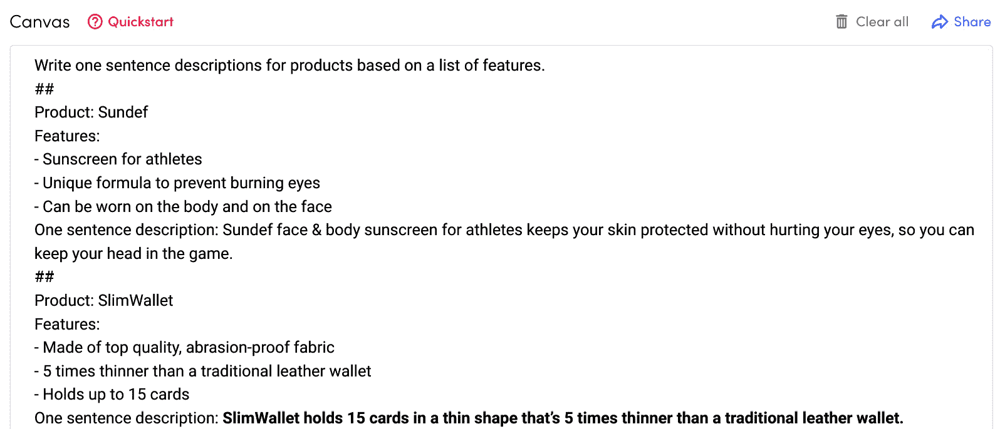
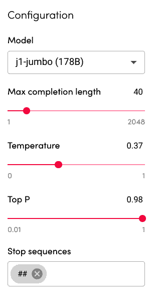
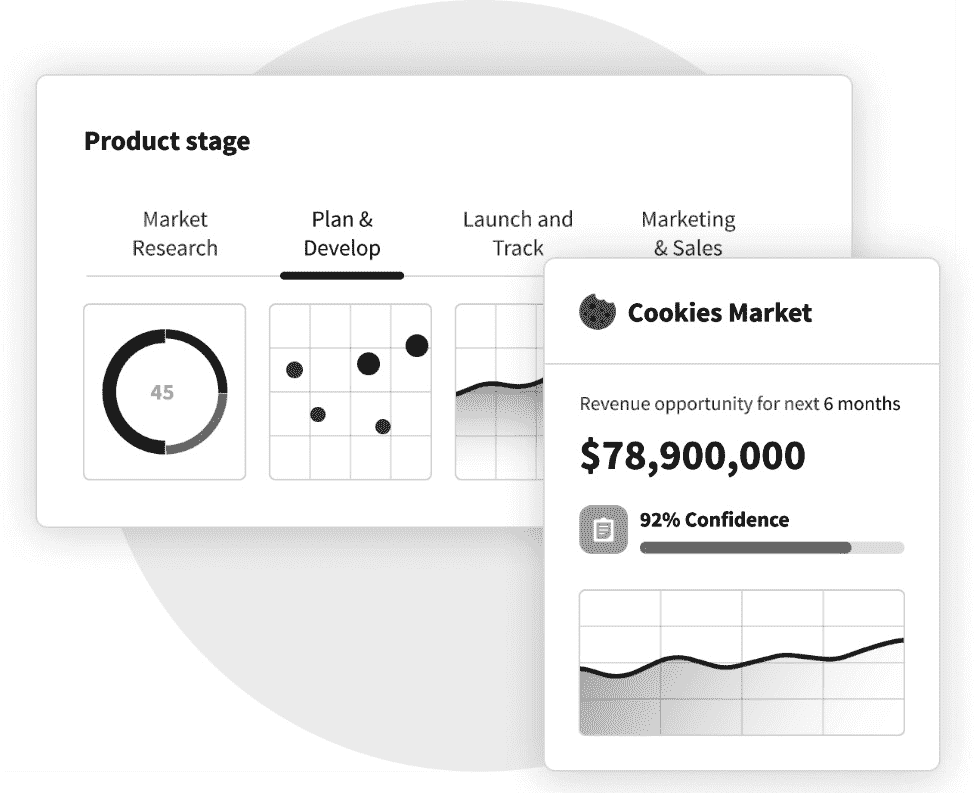
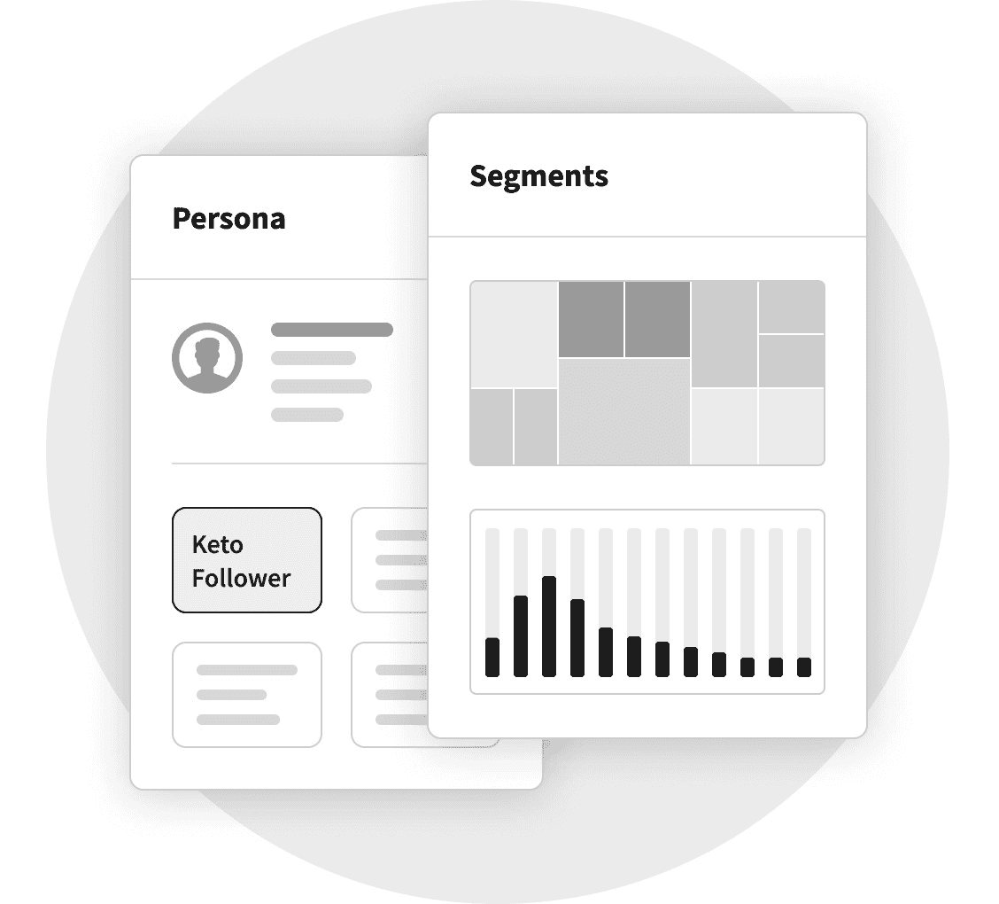
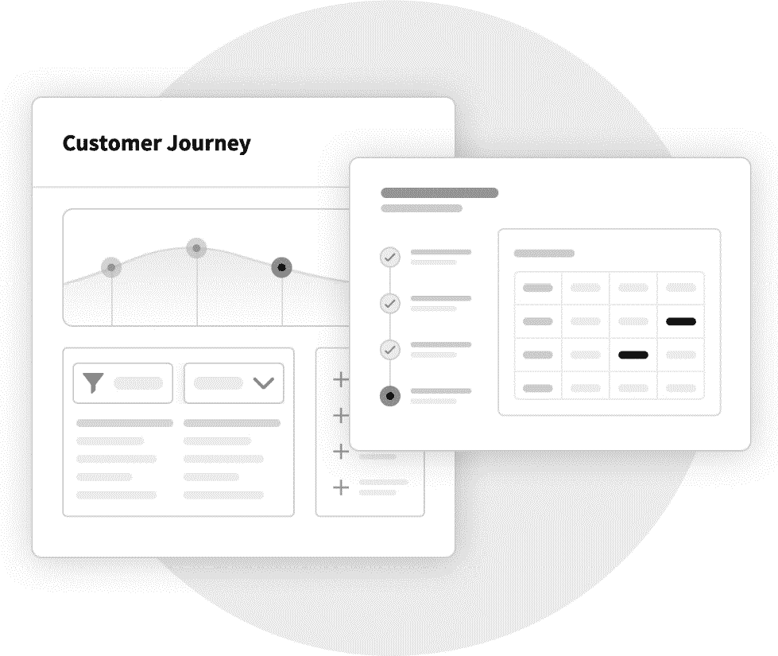
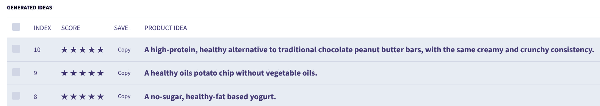

# 第八章：*第八章*：应用 AI 进行创新——消费品深度解析

消费品行业是全球经济的重要组成部分，仅在美国，它的市值就超过了 6350 亿美元——这一数字随着消费者财富的增加以及对产品和信息的更大获取而不断增长。

自 2008 年全球金融危机以来，消费品行业经历了许多逆风。购物、旅行和休闲这三大行业都面临压力。越来越少的人外出就餐或去商场，而更多的人选择待在家里看电视。

与此同时，电子商务蓬勃发展，甚至由于疫情迅速超越了实体店销售。随着消费者越来越习惯于通过数字平台购物，电子商务的增长势头将继续不减。

因此，未能适应变化的消费品公司面临失去客户的风险，因为消费者正在寻求新的方式快速、轻松地在线购买自己喜爱的产品。

在本章中，我们将探讨消费品公司如何利用数据和**人工智能**（**AI**）进行创新，并适应这些变化趋势，从而使其在竞争中保持领先。

在本章中，我们将涵盖以下主题：

+   了解消费品品牌面临的挑战

+   分析消费品品牌的产品数据

+   使用**Commerce.AI**为消费品品牌提供支持

# 技术要求

您可以从本书的 GitHub 仓库下载本章的最新代码示例：

[`github.com/PacktPublishing/AI-Powered-Commerce/tree/main/Chapter08`](https://github.com/PacktPublishing/AI-Powered-Commerce/tree/main/Chapter08)

# 了解消费品品牌面临的挑战

近年来，消费品行业受到来自不断上涨的投入成本、消费者习惯变化、新技术以及其他不可控因素（例如供应链不确定性）等方面的巨大压力。

行业内的公司必须在日益复杂的监管环境中运营，同时还要应对来自在线竞争者的激烈挑战，包括**亚马逊**和**Flipkart**等电子商务平台。在当今零售行业的快速发展中，任何零售商都不能自满或冒着落后的风险。

结果，许多小品牌由于面临多方面的挑战，包括以下几点，纷纷申请破产保护或股价跌至谷底：

+   竞争性消费品

+   消费品市场情报

+   库存管理

+   创建正确的产品组合

+   大规模创建消费品内容

+   消费品评论分析

让我们详细探讨这些挑战，这将有助于理解为何需要使用数据和人工智能以保持资金流动性，最终实现成功。

## 竞争性消费品

该行业的公司正在相互竞争，以在这个拥挤的市场中争夺市场份额，每年都有数百种新产品发布。这些公司还面临着越来越激烈的竞争环境，更多的玩家进入了消费品领域，消费者对购买的产品变得越来越挑剔和要求更高。

该行业公司面临的主要挑战之一是，它们必须不断创新，以便在竞争对手中脱颖而出，为客户提供更好的体验。创新对于这些公司保持在不断变化的环境中具有相关性至关重要，并确保它们能够持续吸引并留住客户。

**创新**是一个广泛的术语，对不同的人来说可能意味着不同的事情。对于一些人来说，创新可能仅仅意味着创造一款新产品或服务，而其他人则可能将创新视为流程改进或组织转型。不论使用何种定义，所有成功的消费品公司都在不断寻找改进其产品的方法，以保持领先地位并满足客户需求。

## 消费品市场情报

**市场情报**是消费品行业成功产品创新的关键组成部分。了解如何创建和利用洞察力对于创造满足消费者需求的产品至关重要，这也是指导公司未来长期战略决策的重要工具。

那么，什么是市场情报呢？你如何利用它帮助你的组织创造以客户为中心的、具有推动增长潜力的产品呢？市场情报是一个广泛的术语，描述了可以用来了解客户的各种不同信息来源。

它包括来自传统市场研究方法的数据，例如焦点小组和调查，以及更具创意的方法，例如社交媒体监控。任何市场情报计划的一个重要方面是确保它定期更新——否则，你就有可能落后于行业变化和发展步伐。

了解当前和潜在客户对于创造以客户为中心的产品至关重要，这样才能满足他们的需求。虽然消费品公司长期以来一直依赖数据来指导产品开发决策，但许多公司仍然在进行有效市场情报计划时面临挑战。

## 库存管理

库存管理是当今消费品公司面临的最紧迫问题之一。随着电子商务的发展，消费者可以随时随地订购产品。这导致了在线零售销售的繁荣，但也对传统的实体店构成了挑战，因为它们必须与按需购物选项竞争。

**库存管理**已成为零售商店的重要竞争因素。公司有效管理库存的能力，决定了它是否能够独立成功、成为收购目标或走向失败。因此，许多公司现在都投入了大量资源，确保他们拥有最佳的库存管理系统。

消费品行业也不例外，管理库存面临着更多的挑战。以下是一些相关因素：

+   产品过时

+   快速变化的消费者偏好

+   短生命周期的产品

让我们简要探讨一下这些因素如何为库存管理带来挑战：

+   **产品过时**：这个问题显而易见，但仍值得注意。你现在购买的产品可能在明年就过时——如果有新的创新出现，甚至可能在一个季度内就让你的产品过时。如果产品比预期更早过时，比如因为消费者兴趣的转变，那么你将面临过剩的库存。

+   **快速变化的消费者偏好**：如今人们的注意力持续时间很短，偏好即时满足而非延迟满足。因此，客户今天想要的东西，明天可能就不再需要，尤其是当新的创新层出不穷，并从情感层面吸引他们时。

+   **短生命周期的产品**：如今，在许多情况下，消费者看到一个产品仅仅几个月后就转向下一个产品——这意味着零售商需要不断更新他们的产品，否则将面临失去销售的风险。这使得库存管理变得更加重要。

## 创建正确的产品组合

**产品组合**在消费品行业是一个热门话题。几年前，分析师和投资者热衷于通过收购互补品牌或进入新市场来增加产品组合。而现在，随着新兴消费者消费习惯的变化，产品组合的关注点已经从简单的收购互补品牌转向了创造新品牌。

当公司寻找创造价值的新途径时，他们正在考虑的一种方式是通过产品创新的视角来审视他们的品牌组合。这里的理念是，如果他们能够创造出更加独特的产品，并且在设计或功能等方面与竞争对手的产品区分开来，那么他们可以通过吸引更多的客户来扩展业务。

这种方法也带来了一些实际的好处；通过在多个品牌之间创造更多差异化的产品，企业可以利用其所有品牌的规模和分销能力，通过推动销售增长或提高单次销售的利润，来为股东创造更高的投资回报。这是有道理的，因为你不仅在扩展业务，同时也在创造财务价值。

合理推测，如果一家公司推出更多独特且与竞争对手产品有所区别的产品，那么它将吸引更多客户。这就是为什么我们认为围绕产品创新的思维转变可能会导致对消费品公司投资的增加，随着时间的推移。

## 大规模创建消费品内容

**产品页面**是任何品牌接触客户并讲述其故事的重要平台。消费者在这里可以更好地了解品牌的立场以及如何使用产品。

为了推动转化率并增加销售，品牌需要比几年前投入更多的时间和精力来创建吸引人的产品页面。然而，由于时间限制和资源有限，创建高质量内容可能是困难的。

在接下来的部分，*分析消费品品牌的产品数据*，我们将讨论公司如何利用数据科学工具，如**机器学习**，来创建有效的产品页面，帮助它们在网上赢得客户——最终在各个领域提高销售量。

## 消费品评论分析

**产品评论**是许多公司最受欢迎和广泛的用户生成数据来源之一。大多数消费者的购买决策都受到产品评论的影响。

产品评论也是消费品制造商的重要*竞争情报*来源——它们可以了解消费者最喜欢哪些产品，以及消费者最看重哪些特性和功能。

企业利用这些信息来指导其产品开发和市场策略。例如，如果一家公司推出一款使用植物性活性成分的新型除臭剂，它们很可能会查看其他品牌除臭剂的现有客户评论，以获取有关消费者如何看待这项新技术的见解。

为了从这些评论中获得可操作的见解，企业传统上依赖手动方法或支付第三方来帮助处理评论过程。然而，现在市场上已有多种工具，旨在自动化分析在线产品评论数据的部分或全部方面。

传统上，自动化的**情感分析**侧重于识别产品评论中的负面语言（例如，使用委婉语代替*无聊*这个词）。这种方法生成一个意见评分，表示评论者对某个产品的看法是积极的还是消极的。

这种方法的问题在于，它忽略了评论者语言中的许多微妙差异，这可能导致在不同的行业或评论平台上应用时产生偏差的结果。

此外，评论者使用的某些术语是否作为赞美或批评并不总是很清楚（例如，*这真是太棒了*）。因此，需要更为细致的处理方式！减少自动化情感分析中的偏差需要多样化的训练数据集，这些数据集应涵盖来自多个行业和评论平台的示例——但是，我们在哪里可以找到如此多样化的数据集呢？机器学习是答案，接下来我们将探讨如何使用它。

既然我们了解了一些消费品品牌面临的主要挑战，让我们来探索如何分析产品数据，以克服这些挑战并抢占先机。

# 分析消费品品牌的产品数据

在当今消费品创新中存在的一个“大象问题”就是数据——今天有大量的客户数据可供使用。那么，为什么不是所有消费品公司都在利用这些数据来开发更好的产品呢？原来，由于涉及的复杂性以及公司内部资源的匮乏，许多公司不知道从哪里开始进行产品创新。

以下是消费品品牌可以利用产品数据的几种主要方式：

+   消费品内容生成

+   分析消费品评论

+   交货期分析

+   需求预测

+   维护充足的现金流

+   分析折扣的影响

+   识别季节性趋势

+   社交媒体分析

我们将在接下来的部分中深入探讨这些方法。

## 消费品内容生成

创建清晰简洁的产品文案是成功产品的关键。毕竟，消费者有数百万种产品可供选择，但只有有限的时间和注意力。如此庞大的产品数量是双刃剑——这意味着产品团队必须花时间在多个市场编写文案，并根据新特性和产品迭代不断进行更新。

所有这些都占用了产品创新的时间，但好消息是，这些可以通过人工智能实现自动化。特别是，我们可以创建一个由**自然语言处理**（**NLP**）算法驱动的产品文案生成器，使用 GPT-J 模型。

**GPT-J**是一个大型语言模型，或是一个机器学习模型，经过大量文本数据的训练，由**Eleuther AI**团队发布。我们将如下演示：

1.  首先，安装 GPT-J 并导入所需的库：

    ```py
    !pip install gptj 
    from GPTJ.Basic_api import SimpleCompletion 
    ```

    由于这些大型语言模型采用预训练方式，模型已经在大量文本数据上进行了训练，我们只需要少量数据来微调模型以适应特定任务。

1.  接下来，我们通过提供`prompt`来定义这个任务，其中包括从产品名称和特性生成的产品描述示例：

    ```py
    prompt variable, we can guide the model to act as a product copy generator.
    ```

1.  此外，我们还需要传递一些参数，主要包括`temperature`（或随机性）、`max_length`（或模型的最大输出长度）和`product`（或用户输入的内容，例如`SlimWallet`）：

    ```py
    temperature = 0.4 
    top_probability = 1.0 
    max_length = 5 
    product = "SlimWallet" 
    ```

1.  最后，我们现在可以将 `prompt` 变量和参数传递给模型以生成推荐。我们还会获取生成文本的第一行，以防模型过度生成：

    ```py
    query = SimpleCompletion(prompt, length=max_length,  t=temperature, top=top_probability) 
    Query = query.simple_completion() 
    lines = Query.splitlines() 
    results = [] 
    ```

    通过这样做，给模型提供一个包含三大特性的钱包输入，将生成类似于 *SlimWallet 是最时尚的*、*薄* 和 *耐用的你见过的最好的钱包* 的产品文案。

还有其他方式可以尝试相同的概念，甚至不使用任何代码，例如对于 `SlimWallet` 项目，AI21 Studio 推荐 `SlimWallet 以比传统皮革钱包薄 5 倍的形态容纳 15 张卡片`。



图 8.1 – 用于产品描述生成的 AI21 Studio 画布

与 GPT-J 一样，我们需要提供一些设置，这些设置在 AI21 Studio 中通过 **配置** 面板完成，如下所示：



图 8.2 – AI21 Studio 配置面板

这些设置（如 *图 8.2* 所示）几乎是相同的，包含最大完成长度、温度和停止序列。

## 分析消费品评论

亚马逊的产品评价多达数亿条 ([`nijianmo.github.io/amazon/index.html`](https://nijianmo.github.io/amazon/index.html))，这使得任何产品团队都不可能手动阅读和分析评论以大规模提取见解。

幸运的是，我们可以再次使用大型语言模型，并自动从评论中提取见解。让我们看看如何从产品评价中提取用户期望的特性。正如我们在 *消费品内容生成* 部分所探讨的，我们可以为预训练语言模型提供一个提示，引导它们朝着特定的使用案例发展。

在 *图 8.3* 中，我们向 AI21 Studio 提供了一个提示，提取 **需要改进的领域** 来自产品评价：


图 8.3 – 用于产品评价分析的 AI21 Studio 画布

现在，我们可以向模型提供任何产品评价，它将提取出需要改进的领域，比如 `电池续航`。然后，我们可以快速浏览数百或数千条产品评价，并统计每个项目的出现频率，以此来确定优先级。例如，也许 50 条评论要求更好的电池续航，而只有 15 条评论要求防水，这将帮助产品团队在下一轮产品迭代中优先考虑电池续航。

这个过程可以扩展到任何数量的产品和评论，实现大规模的即时见解。

就像我们通过编程生成产品描述一样，我们可以使用这个新的`prompt`变量（见*图 8.3*）通过编程从产品评论中提取改进的领域。一个例子可以在本章的 GitHub 仓库中找到，具体内容请参见*技术要求*部分。

## 交货期分析

了解产品的生产或制造所需时间，可以揭示其质量和生产过程。过长的交货期可能表明规划、生产能力或材料短缺存在问题，而较短的交货期则可能表明供应链更高效，且制造商的规划更好。

举个例子，如果你发现电池生产需要 3 天，而你的竞争对手需要 2 周，那么你就拥有了竞争优势，因为他们没有充分利用他们的生产能力。

## 需求预测

对于生产消费品的公司（如食品和服装），保持足够的库存是非常重要的，这样当消费者前来寻找时，他们总能找到准备好的产品。

然而，这需要相对于任何时刻的需求来说，拥有大量的库存，这意味着能够准确预测需求是至关重要的，以便在控制成本的同时，仍能保持足够的库存。

人工智能是一种强大的预测工具，因为它可以通过大量的历史数据进行训练，并自动找出影响需求的模式。

## 维持足够的现金流

在销售量较低的时期，保持足够的现金流有助于确保企业内有足够的流动资金，避免需要外部融资。如果企业负债过多，当收入因客户消费模式的变化（例如，消费者购买鞋子的数量少于预期）而突然下降时，可能会带来问题。

另一方面，在销售较慢的时期，现金流过少可能意味着需要推迟投资或购买，这些都是未来增长所必需的，直到经济条件好转；如果这些投资能提前开始，可能就会错失市场机会。

就像人工智能可以用于准确的需求预测一样，基于历史现金流数据，消费品品牌可以预测现金流并据此做出调整。更好的库存管理也发挥着作用，因为库存过剩和缺货都会对现金流产生负面影响。

## 分析折扣的影响

在许多消费品行业中，消费者通常可以通过零售商提供的促销活动获得全年深度折扣。折扣还可以用来吸引新客户，这些客户在成为该零售商的常客之前，可能并不清楚这些优惠。

折扣直接影响销售类似产品的公司的毛利率和净利率，因为它们有效地降低了价格。因此，虽然折扣通过增加销量在短期内有助于提升销售，但公司不应依赖于折扣进行长期规划，因为折扣最终往往会失效。

借助人工智能，消费品品牌可以预测任何特定产品或产品系列的折扣对现在和未来的影响。

## 识别季节性趋势

季节性波动在大多数行业以及这些行业中的特定领域中都非常常见。在某些情况下，这些波动源自于对假期或其他事件（如可能吸引大量人群的体育赛事）的文化偏好。

将当前的销售数据与往年数据进行比较，可以帮助公司了解哪些时期表现最好。这些信息可以用来帮助确定未来几个月的预期是否有可能达到或超越以往的预期。

## 社交媒体分析

社交媒体平台为企业提供了多种与目标受众互动的方式——其中包括企业通过员工或远程工作但仍与粉丝在线互动的承包商发布帖子来分发产品信息（例如，通过**Twitter**发布关于新产品添加到产品目录的帖子）。

员工和粉丝之间的这种互动为品牌提供了与目标受众互动的另一个机会，即使品牌没有亲自出席——社交媒体平台让那些有效利用它们的公司变得更加容易。

此外，消费者不断在社交媒体上谈论产品和品牌。借助人工智能，品牌可以更有效地进行**社交聆听**，并能够实时、大规模地分析来自社交媒体的消费者情绪和愿望清单。

现在我们已经理解了如何在不同的环境中分析产品数据，让我们更深入地探讨如何为消费品品牌使用 Commerce.AI。

# 使用 Commerce.AI 为消费品品牌

如今我们所知道的，消费品品牌面临的挑战比以往更加严峻，而解决这些挑战的方法就在于数据。然而，单纯依赖数据还不够，消费品品牌需要找到将数据转化为可执行见解的方法。

让我们探索一下 Commerce.AI 如何通过从数据中获得价值来为消费品品牌提供帮助的五种主要方式：

+   测量产品属性和趋势

+   预测收入机会

+   分析用户画像和客户细分

+   分析客户旅程

+   生成消费品产品创意

让我们在接下来的章节中探讨每一个细节。

## 测量产品属性和趋势

产品创新是推动消费品业务增长的最佳方式。然而，许多经理在理解他们的产品与众不同且更具优势的地方上遇到困难，这可能导致错失机会。

造成这种情况的原因是复杂的，但其中包括测量复杂性、可供分析的有限数据集、缺乏理解模式所需的领域专业知识，以及缺乏可以跨多个产品线应用的可靠指标。这些挑战使得公司很难有效开发新产品和服务。

让我们集中关注 Commerce.AI 的一个特定维度——与产品属性相关的情感分析——通过消费品创新的视角。我们研究中的一个有趣发现是，诸如口味或品牌期望等属性在塑造消费品品牌的购买行为中扮演着重要角色。

例如，消费者购买**Prada**的原因之一是，他们期望看到更高的价格标签和有趣的设计美学，而不是在百货商店的折扣架上购买包包时所期望的标准山寨体验。

同样，**Starbucks**之所以如此成功的原因不仅仅在于其专注于高端咖啡，还在于其客户期望它通过烘焙技术创造出有趣的新口味，而不是一再翻新旧有的经典口味。相同的逻辑也适用于技术公司与商品供应商的对比——这里发生着一些有趣的事情，值得进一步研究。

当你去除所有噪音后，产品数据中出现了两种有意义的信号：

+   关于消费品公司（CPG）与其竞争对手之间的潜在质量和感知价值创造的信号

+   关于客户支付特定价格的可能性的信号

换句话说，购买意图在产品属性和导致更高价格点的属性之间相互传播，例如服务水平或技术特性。简而言之，AI 在这个背景下通过增强传统市场监控能力，提供了真正的潜力。

*图 8.4* 通过模拟图展示了 Commerce.AI 如何衡量产品属性和趋势，并填充相关品牌和产品数据：

![图 8.4 – 一个用于衡量产品属性和趋势的 Commerce.AI 模拟图]

](img/Figure_8.4_B17967.jpg)

图 8.4 – 一个用于衡量产品属性和趋势的 Commerce.AI 模拟图

虽然了解产品属性和趋势非常重要，但收入无疑是需要考虑的关键指标。让我们更仔细地看一下衡量收入机会的方法。

## 预测收入机会

产品创新的艺术与科学一直是关于找到新的方法来满足客户的需求与欲望，同时实现收入增长。颠覆性创新往往通过从疲软或被打乱的现有企业手中夺取市场份额而获得成功。这种颠覆要求具备根据收入机会识别机会的能力。

这有助于发现新的增长驱动因素，揭示那些回顾时看不出的商业模式，帮助你在不确定的领域优先投资，并在竞争者进入未测试的领域时提供早期警告（如果你不及时反应并提供更优的产品，可能会面临行业颠覆的风险）。

借助人工智能这一赋能技术，现在无论大小组织都能轻松获得这种竞争优势；不需要雇佣昂贵的顾问或在研发实验室上投入大量资金；也无需事先具备手动挖掘大量数据的经验；同时还能获得未来路径的即时可视化，并获取有价值的见解，帮助你发现他人犯错的地方（或做对的地方）。

*图 8.5* 展示了 Commerce.AI 的原型，用于衡量收入机会，其中包括一个*置信度评分*，用于指示预测的准确性：



图 8.5 – Commerce.AI 用于衡量收入机会的原型

一旦收入机会被理解，就该更好地理解该市场中的用户画像和客户细分了。

## 分析用户画像和客户细分

**细分**是产品与市场契合度的一个关键方面，是创业者和产品经理无法忽视的因素。

话虽如此，知道何时进行用户（或潜在用户）细分，并围绕他们构建功能是很棘手的。关键在于找到合适的平衡，这需要了解你的用户画像以及客户细分。

那么，在进行客户细分之前，你需要了解什么？围绕用户画像构建功能的最佳方法是什么？又能避免哪些陷阱？继续阅读，了解如何让这个看似复杂的过程变得更简单。

本质上，**用户画像**是一个简单的共情练习。你只需要理解到底是谁在使用你的产品，他们希望通过产品达成什么目标。通过这样做，你将能够构建与现有用户需求契合的功能——或者至少是构建功能的概念，而不是去寻找可能尚未存在的新用户。

*图 8.6* 展示了 Commerce.AI 的原型，用于衡量用户画像和细分，它填充了相关的消费者数据：



图 8.6 – Commerce.AI 用于分析用户画像和细分的原型

理解用户角色和细分市场是深入了解市场的关键部分，但我们还需要通过分析客户旅程将其提升到一个新的层次。

## 分析客户旅程

**客户旅程**是客户从第一次了解你的产品到成为活跃用户的全过程。了解这一旅程以及如何影响它，对于推动创新、增加用户参与度并减少流失至关重要。

传统的分析方法侧重于衡量关键指标的变化，如收入、用户参与度或**客户获取成本**（**CAC**）。虽然这些是有用的跟踪指标，但它们往往无法讲述完整的故事。尤其是，CAC 未能考虑到拥有活跃用户（即那些每天保持活跃的用户）的长期价值。

这就是我们需要通过新方式来看待客户行为的原因。利用 AI 可以帮助我们识别模式并进行推断，这些推断对于任何人类分析师来说都太复杂或成本过高。然后，我们可以利用这些洞察来指导我们的战略，并改善我们的产品设计和开发流程。

*图 8.7*展示了 Commerce.AI 用于衡量客户旅程的模型：



图 8.7 – 一个 Commerce.AI 的客户旅程分析模型

一旦我们对市场及其潜在客户有了深入的理解，接下来就该提出产品创意了。

## 生成消费品产品创意

在*第六章*，*应用 AI 推动创新——消费电子产品深入分析*中，我们使用大型语言模型与 Commerce.AI 一起生成消费电子产品创意。在这里，我们可以使用相同的技术来生成消费品产品创意，从而帮助产品团队加快头脑风暴的过程。

通过这种方法，我们已经能够轻松地生成数千个独特的产品创意。例如，在*图 8.8*中，我们可以看到围绕*健康零食*生成的三个产品创意：



图 8.8 – 基于 AI 生成的健康零食产品创意

正如我们所见，Commerce.AI 可以用来衡量产品属性和趋势、预测收入机会、分析客户数据以及生成产品创意。这是一个强大的工具，可以加快产品开发周期，这对于领先竞争对手并抢占市场先机至关重要。

# 总结

在本章中，我们了解了消费品品牌面临的关键挑战，并通过分析产品数据和使用 Commerce.AI 数据引擎克服这些挑战的方法。

数据可以用来克服消费品领域中的重大挑战，这也是许多领先品牌和产品团队在 AI 领域进行投资以获取竞争优势的原因。

特别是，我们已经学会了如何利用 AI 执行一些任务，比如消费品内容生成、分析消费品评论和需求预测。我们还研究了消费品产品团队如何使用 Commerce.AI 来衡量产品属性和趋势、预测收入机会、分析用户画像等。通过这些方式，消费品品牌可以更好地进行创新，并推出成功的产品。

在下一章中，我们将详细探讨如何使用 Commerce.AI 的 **Product AI** 来进行产品概念和开发、产品发布以及产品管理。这些见解对于任何产品公司都非常有用。
