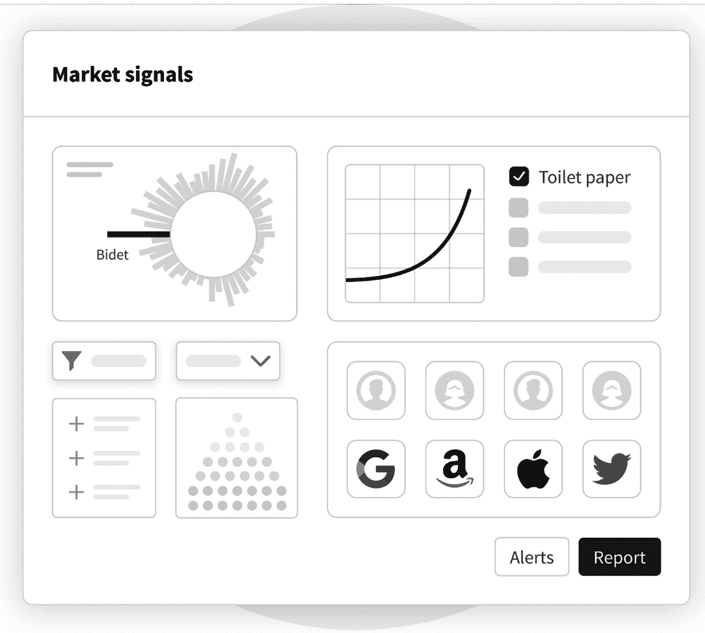
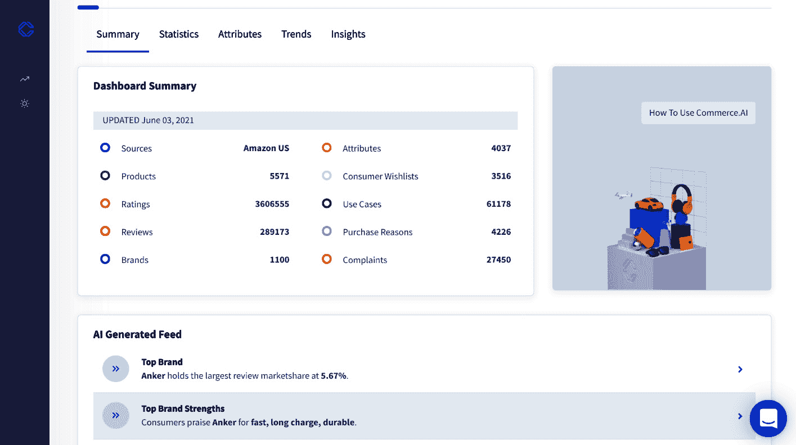
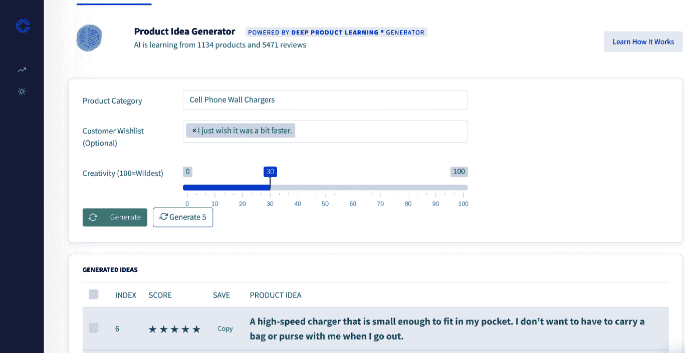
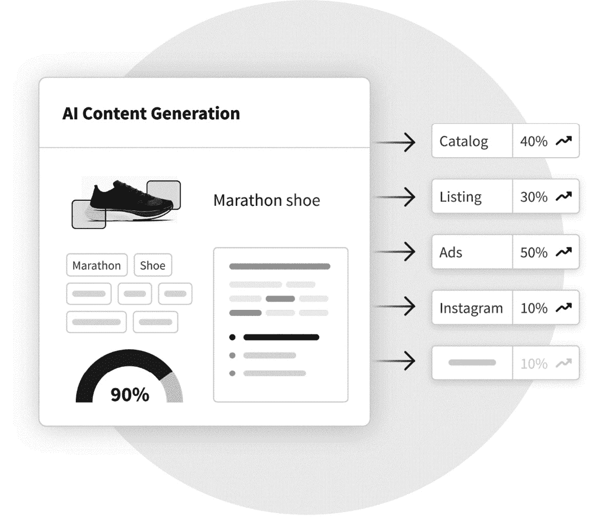

# 第九章：*第九章*：通过产品 AI 传递洞察

数据是产品团队的宝贵财富，它能帮助你为客户开发更好、更具针对性的产品。你可以利用数据生成可操作的洞察，了解人们如何与产品互动，并做出有助于提供最佳产品体验的决策。

但仅仅*拥有数据*是不够的，重要的是*如何使用它*。正如我们在本章中讨论的那样，关键是采取一种整体方法，将数据整合到整个产品创新生命周期中。在本章中，你将学习如何将数据整合进产品创新生命周期，包括与产品开发、产品发布等相关的决策。简而言之，你将学习如何利用数据更快地将更好的产品推向市场。

我们将讨论如何在产品生命周期的每个阶段使用**Commerce.AI**的**产品 AI**功能，从市场调研、产品构思和创建，到发布后的广告和销售。特别地，我们将涵盖以下主题：

+   Commerce.AI 在产品概念和开发中的应用

+   Commerce.AI 在产品发布中的应用

+   Commerce.AI 在产品管理中的应用

# Commerce.AI 在产品概念和开发中的应用

**产品构思**是一门古老的艺术，但其基本原理依然有效。其主要原则是，人们购买产品是有原因的——他们想要解决问题或满足未被满足的需求。

毕竟，猜测无疑会导致消费者不想要或不需要的产品，这样的产品最终会在市场上失败。因此，产品团队需要首先进行广泛的市场调研，以便在**产品构思过程**之前，了解消费者的需求和欲望。

在接下来的子章节中，我们将探讨产品概念和开发的以下领域：

+   市场调研

+   理解需求

+   产品构思

## 市场调研

产品开发工作流程从市场调研开始，接着是构思、设计和工程。这是大多数产品进入市场的方式。但在一个可以从一开始就提供数据洞察的按需 AI 解决方案的世界里，许多公司已经开始使用 AI 来缩短**产品开发生命周期**（**PDLC**）。通过在 PDLC 的每个步骤应用 AI，你可以确保你的产品不仅仅是由数据驱动的，而是在整个过程中真正反映数据。

产品团队的市场调研主要是了解客户在使用产品或服务时的需求。它是关于找出客户真正想要什么，探讨一个新想法是否可行。

市场研究不仅仅是了解人们当前对某个想法或产品的看法。营销人员还需要了解人们将来如何改变他们的想法，及其原因。而且，市场研究不仅仅是产品团队的事；任何产品开发阶段的所有团队（营销、设计、工程）都应该把市场研究视为过程中的关键部分。

此外，市场研究是开发产品创意最具成本效益的方法之一，尤其是当你进行大量用户测试来验证假设时。收集一些关键数据点的成本可以为你节省数月的开发时间，而这比盲目设计要高效得多。不过，传统的市场研究也有其局限性。

### 传统市场研究的局限性

传统的消费者调查既繁琐又费时，还非常昂贵，而且在面对产品创新挑战时，常常让人失望。此外，消费者偏好变化非常频繁。传统的研究方法很难捕捉用户动机的复杂性。

通过 AI 在商业中的应用，你可以更新市场研究流程，为产品创新提供令人兴奋的新途径。你可以用自动化的定量市场研究补充定性市场研究，这样可以提供你所需的数据洞察，帮助验证产品概念。

使用 Commerce.AI 的 AI 驱动市场研究报告([`www.commerce.ai/reports`](https://www.commerce.ai/reports))，你可以通过低成本的在线报告简化研究过程，发现有关客户及市场机会规模的精准洞察。

领先的产品公司正在将 AI 应用于市场研究，以改善产品开发。毕竟，*市场速度*是一项竞争优势，在这方面，紧跟客户的输入和反馈至关重要。

## 了解需求

通过市场信号理解需求是产品创新中最重要的步骤之一。数十年来，市场研究一直依赖于定量和定性方法相结合来识别消费者行为趋势，这些趋势可以用于指导你的产品策略和设计。

市场营销人员可以观察到许多不同类型的市场信号，但主要有两大类：定量观察和定性观察：

+   定量信号包括*搜索量*或*销售速度*等内容。

+   定性观察涉及*与客户交流*——既可以直接交流（通过语音调查），也可以间接交流（通过在线论坛、社交媒体或产品评论回复）。

简而言之，数字空间提供了全新的方式来观察人们如何使用产品和服务——事实上，现在关于人们与技术互动时的行为数据随手可得。企业可以收集这些数据，这些数据的价值巨大。

然而，挑战在于，数据本身并不是市场研究——它是市场研究的*起点*。营销人员需要将这些原始信息转化为关于人们想要什么、如何想要、以及为何想要的洞察力，从而理解什么会引发需求。

通过了解需求，公司不仅仅是创造一个消费者想要的产品或服务，更应该思考如何创造一个人们甚至还不知道自己需要的（但最终会喜欢的）产品或服务。

在*图 9.1*中，我们可以看到 Commerce.AI 的**市场信号**仪表盘的原型图，它从多个来源收集相关的产品数据，供品牌使用：

图 9.1 – Commerce.AI 市场信号仪表盘的原型图

如*图 9.1*所示，消费品公司在 COVID-19 大流行期间发现，坐浴盆和卫生纸的需求激增，这为创造或进入新的卫生产品类别提供了机会。通过 Commerce.AI 市场信号，品牌还可以设置警报，通知他们关于特定产品或服务的需求或兴趣激增等重要事件。

使这一过程得以顺利进行的关键是利用数据和洞察力做出关于需求结果的明智决策。你拥有的数据和洞察越多，就越能为你的产品或服务制定出更好的路线图，这将帮助你从概念到发布的整个过程。你的产品路线图越好，最终你的产品或服务的表现就会越好。

## 产品构思

在探索需求机会和市场信号后，是时候开始思考下一步该做什么了。产品开发生命周期（PDLC）中的下一阶段是*概念构思*。过去，你可能会根据自己的经验来获取灵感。但有了数据，这已成过去式。有了 AI，你现在可以访问大规模的用户数据，为新产品提供背景信息。

让我们来看一下使用 AI 进行产品构思的两种主要方式。首先，AI 通过产品数据可以揭示竞争对手已经向消费者提供的特性和属性。这些洞察可以帮助你确保下一个产品发布不会与现有产品重复，从而使你能够以更具竞争力的差异化进入新的产品市场。它还可以从数据中提取模式和趋势，帮助你了解消费者的需求和想法。

例如，假设你想扩展你的电子配件产品线并销售手机充电器。正如在*图 9.2*中所见，我们可以查看一个由 AI 生成的领先品牌和产品的动态信息流。特别是，**Anker**是该品牌，其三大优势是充电*速度快*、*续航长*和*耐用*。因此，我们知道，为了与 Anker 竞争，这些就是我们也必须提供给消费者的顶级特点。

图 9.2 – Commerce.AI 墙面充电器仪表盘摘要

AI 能够帮助你的第二种方式是生成新的产品创意。AI 可以在几秒钟内生成任意数量的产品创意，这可以节省大量时间。

让我们来看一下这如何运作。用于训练算法的数据可以来自多种来源，包括你自己的产品数据、市场数据和用户研究数据。

例如，在*图 9.3*中，我们使用**Commerce.AI** **产品创意生成器**为手机充电器创造了一个新的创意。这个创意是*一个足够小巧以便放进我的口袋的高速充电器*。这个生成的创意很合理，因为典型的充电器通常很笨重且不方便。也许产品团队会采纳这个创意，或者它会激发出另一个关于不同类型产品的创意。

图 9.3 – Commerce.AI 产品创意生成器

**机器学习**算法将分析数据并列出潜在的产品创意。这些创意清单可以包括新产品功能、新产品类别和新产品定价模型。

这里的关键点是，AI 能够在*几秒钟内*生成创意产品想法。这有助于加速创意过程，因为在不断提出新产品和功能创意时，很容易遇到创意瓶颈。

在产品构思和开发之后，接下来是制定战略并执行成功的产品发布。

# 产品发布

过去，产品经理必须依靠直觉和自身经验来做出正确的产品决策。如今，AI 正在改变这种动态，通过基于数据和过去的互动提供一种更客观的方式来做出产品决策。

让我们退一步，看看 AI 如何改变产品的世界，重点关注四个领域：

+   AI 如何改变产品发布

+   从早期信号预测需求

+   AI 在两种类型的产品发布中的应用

+   使用 AI 进行产品发布——优缺点

让我们先概述一下 AI 如何改变产品发布。

## AI 如何改变产品发布

传统的产品创新通常是围绕*以访谈为中心*的方法展开的。换句话说，产品经理认为，理解客户的最佳方式是与他们花时间相处。这种方法在过去几十年中发生了相当大的变化。如今的趋势是采用更加数据驱动的产品管理方法。

在过去的十年里，关于 AI 的炒作迅速增长。利用软件自动化重复任务的概念似乎显而易见，且如果公司想在日益快节奏的商业环境中保持竞争力，这是每家公司都应该做的事。

然而，当时组建合适的团队并从零开始构建 AI 产品是一项相当艰巨的任务。事实上，获取良好的数据集本身就需要付出相当大的努力。公司要么得自己建立数据集，要么得花费巨额资金从竞争对手那里购买。

通过 Commerce.AI，这一丰富的产品数据对任何想要使用它的公司来说都是触手可及的。AI 驱动的产品发布理念很简单——尽可能自动化工作，创造一个让人类可以专注于创新并为客户创造真正独特的产品的环境。

最终的结果是，新产品的上市时间更快，过程中面临的风险更少。这也意味着可以将宝贵的资源腾出来用于公司内其他的项目。那么，AI 究竟如何帮助产品发布呢？一种方式就是通过从早期信号中预测需求。我们来详细探讨这个概念。

## 从早期信号预测需求

首先要认识到，AI 不能在 100%的时间里都能依赖。它并非总是有效，并且有其局限性。然而，正确使用 AI 时，它能够提供关于客户行为的宝贵见解，帮助公司做出关于产品发布的明智决策，同时减少风险。

这种方法被称为**主动需求分析**，因为它使用机器学习技术预测需求的发生（而不是在销售缓慢或为零时被动反应）。通过这种方式，公司还可以确保在产品发布后有足够的库存来应对高峰需求——如果商品未能及时补货，可能会导致销售损失。

这一概念不仅仅限于产品发布——任何涉及库存管理的地方都应当通过 AI 能力进行改进。毕竟，大多数商业公司需要不断补充任意 SKU 的库存。

关键的启示是，这些类型的机器通过学习模式，使得人类可以执行高级任务，例如预测消费者行为的变化，并在问题出现之前采取行动，而不是在问题出现后再去处理。

## AI 与两种类型的产品发布

为了更好地理解公司在推出新产品时面临的挑战和机遇，观察这些问题如何在不同的环境中展开非常有帮助。特别是，我们需要关注两种主要的产品发布类型：  

+   硬启动

+   软启动  

让我们先来探讨一下硬启动的概念，以及人工智能如何帮助优化这一活动。  

### 硬启动  

**硬启动**是一次全面的、公司范围的营销活动，旨在将全新的产品或服务推向市场。通常，这涉及大量的媒体购买、广告活动和各种活动——所有这些都围绕一个目标展开：让尽可能多的人第一次尝试你的产品。希望的是，一旦他们尝试过后，他们将成为品牌的倡导者，并将你的产品推荐给朋友和家人。  

使用 Commerce.AI，你可以利用人工智能优化硬启动，通过自动化大部分沟通和内容创作过程。你还可以使用该工具集提前规划，并在大规模启动之前做好准备，确保你的内容为成功做好优化。  

此外，你还可以细分你的受众，确保每个客户获得最相关的内容，从而增加他们与公司互动的机会。你还将能够在启动后立即分析营销活动的表现，不仅查看有多少人浏览了你的内容，还能了解哪些内容表现最好。  

### 软启动  

**软启动**是将你的新产品或服务有限度地发布给一群由你（公司）精心挑选的人。这里的目标是评估客户反应并衡量**客户获取成本**（**CAC**）。换句话说，你是在测试你的产品或服务，以确定获得客户的成本，然后根据结果调整启动策略。  

通常，这涉及向特定人群发送邮件通讯，宣布软启动活动，然后再向任何想要访问的人开放。你还可以在社交媒体上进行软启动——仅宣布你的新产品已开放提前体验，并通过邀请邮件只邀请特定的人。你还可以测试不同的价格点以及不同类型的内容，以确定在每个平台上哪种方式最有效。  

即使在软启动期间没有获得足够的兴趣，如果你使用像 Commerce.AI 这样的分析工具，你可以看到哪些信息引起了客户的共鸣，并据此调整未来的营销活动。  

例如，如果某条信息吸引了更多注册用户，且每位用户的平均收入更高，那就意味着这条信息在未来的大型营销活动中可能会取得良好的效果（尤其是在你收集到更多关于真实用户行为的数据后）。  

语音调查是获取任何类型发布反馈的另一种方式。与传统的基于文本的调查不同，语音调查具有特别高的参与度和完成率，且可以在发布后用于获取有价值的见解。在*第十二章*，《语音调查》中，我们将详细讨论它们的应用。

## 使用人工智能进行产品发布——优缺点

除了帮助公司避免潜在的供应链中断，主动的需求分析还有许多优势。它有助于消除基于以往类似产品经验的猜测，了解哪些产品可能会更畅销。它还使公司能够根据潜在需求避免缺货或过度库存，从而提高效率和盈利能力，并减少库存风险。

在产品发布的背景下，使用人工智能可以降低成本并整体上简化流程。此外，人工智能帮助公司将资源集中在为客户创造真正独特的产品上，而不是花费时间和资源去搭建可能不需要的基础设施。

使用人工智能可以解放团队成员，让他们能够专注于其他更适合的任务，例如管理增长或开发全新的产品。虽然成功的产品发布至关重要，但这仅仅是开始，因此，让我们探索如何利用数据和人工智能来改善发布后的产品管理。

# 产品管理

可以公平地说，许多产品经理在任何时刻都打开着超过 100 个标签页。但如果有一个工具或服务可以监控你所有的产品，跨越所有渠道，会怎么样呢？

那么，如果你能够利用人工智能获得有关产品在市场上表现的可操作性见解呢？如果这些信息是实时更新的（实时），让你始终了解产品的表现和趋势如何呢？使用 Commerce.AI，你可以在市场和多个渠道中监控你的产品。

人工智能在产品管理中的核心原则是利用机器学习和人工智能技术，为你提供关于产品表现的可操作性见解。通过使用人工智能，你将能够做出更好的决策，了解应做出哪些改动来提升产品表现，甚至完全改变产品的方向。

在本节中，我们将探讨人工智能在产品管理中的六个领域：

+   跟踪产品需求

+   品牌管理

+   使用人工智能获取消费者洞察

+   使用人工智能进行产品跟踪

+   市场营销和商品管理

+   客户支持

让我们开始看看产品经理如何以及为什么使用人工智能来跟踪产品需求。

## 跟踪产品需求

人工智能在产品管理中的一个重要应用是**情感分析**。情感分析使用**自然语言处理**（**NLP**）技术来分析书面文本中的积极或消极情感。情感分析可以揭示用户是否认为某个特定功能对产品有用——也就是说，它可以告诉你人们喜欢或不喜欢你产品的哪些方面。换句话说，情感分析提供了人们如何谈论你的产品——好的和不好的！

因此，产品经理可以利用人工智能跟踪产品愿望，包括要改进或移除的功能，以及消费者希望在产品中新增的功能。

跟踪产品愿望清单是任何产品经理的重要任务，但要保持数据的准确性并有一个可以在产品生命周期中随时参考的系统，这可能是一个挑战。这可能导致焦点分散，以及失去对关键因素的关注，例如以下内容：

+   你的客户最需要的顶级功能或用例是什么？

+   你的产品如何与这些用例或需求对比？

+   你是否满足了他们的需求，超越了他们的期望，还是未能达到要求，甚至远远落后？

+   为了打造一个伟大的产品，你还需要了解关于这个主题的哪些信息？

Commerce.AI 提供跨渠道的实时追踪，并且还提供历史数据，让你能够随着时间推移获得背景信息。通过 Commerce.AI，你可以设置在构建新功能时最重要的变化参数，通过在部分用户中启用实验来测试新概念，并衡量他们的参与度，理解这些新想法如何影响收入或其他**关键绩效指标**（**KPI**）。然后，你可以根据这些信息做出明智的决策，确定优先实施哪些想法，并投入资源向前推进。

所有这些都可以在一个工具中完成——无需第三方软件。我们相信，这种对产品性能的整体洞察将在未来几年对许多组织变得更加重要。

## 品牌管理

产品管理和品牌管理密不可分——它们是产品公司的核心。没有品牌，我们无法理解一个公司提供的产品、它们的可信度或目标市场是什么。随着人工智能的兴起和机器学习在产品管理任务中的整合，成功地利用大数据来管理品牌变得比以往任何时候都容易。

公司现在能够利用人工智能更好地了解他们的客户是谁、如何行为、喜欢什么以及他们的位置。Commerce.AI 可以用于品牌和产品情感分析、消费者洞察以及产品追踪的结合，帮助识别机会，创造并维持更好的品牌体验。

### 使用人工智能进行品牌情感分析

Commerce.AI 的品牌情感工具建立在 NLP 技术栈上，这意味着我们利用机器学习和深度学习等技术来分析自然语言中的口语（例如，客户服务互动中的语言）。这使我们能够自动从非结构化数据中提取信息，比如社交媒体帖子或产品评价视频中的评论。

该技术使我们能够识别社交媒体帖子和评论中对品牌的正面或负面情感。情感分析是自然语言处理领域内的一个知名研究领域，专门为此目的设计的软件现在已经广泛可用，过去十年来开发了许多工具。

一般来说，情感分析算法可以分为几种类型：

+   **词频算法**（用于统计特定单词出现的次数）

+   **共现算法**（用于查看特定单词的共同出现频率）

+   **极性/一致性算法**（用于判断一条帖子表达的是更多正面还是负面情感）

通过使用这些成熟的技术结合深度神经网络挖掘线上公共对话，我们可以洞察人们对各大品牌的看法——无论是正面还是负面——帮助你更好地理解客户，并制定策略，通过发挥品牌的优势并规避潜在的弱点来推广品牌。

通过使用机器学习技术挖掘公共对话，你可以在不需要与客户面对面交流或进行冗长的市场研究的情况下，抓住隐藏在表面背后的信息。

接下来，让我们从产品管理的角度来看消费者洞察。

## 使用 AI 获取消费者洞察

AI 在产品经理工作中，特别适用于获取消费者洞察。在作为品牌经理的角色中，你可以使用机器学习和自然语言处理（NLP）来识别对你的业务目标最相关的数据类型，然后你可以将这些数据的收集和处理自动化，作为持续努力的一部分，帮助你跟进目标市场的动态。

例如，如果你正在开发一款新的移动应用，你可能首先想了解一些关于用户的基本人口统计信息（例如年龄、性别、位置等），以便在构建额外功能来吸引他们时，能更好地理解他们作为客户的需求。

同样地，如果你是一个零售商，试图为你的客户开发一个新的电子商务网站或聊天机器人体验，了解他们现在正在寻找哪些产品，能够帮助你为未来开发出更符合他们需求的产品。

如果你正在创建一个全新的网站或移动应用程序，这同样适用。你希望网站或应用的开发过程从一开始就以客户为中心，始终关注理解用户是谁。借助 AI，你可以更深入地了解你的客户，因此为他们设计更个性化的体验。

现在让我们来看看使用 AI 管理品牌的另一个重要方面——产品跟踪。

## 使用 AI 进行产品跟踪

管理产品生命周期不再是手动操作的事情——验证每个产品生命周期阶段中所有不同接触点的细节太多，从创意生成、开发到测试和发布，所有环节都需要关注。

幸运的是，AI 可以大大简化这一过程，从而加速产品推出的同时保持高标准。如果在组织内部的多个团队（例如，产品管理、工程、运营）中正确实施自动化，也可以提高团队成员之间的责任感。

产品经理的职责是确保公司产品满足客户需求，同时按时、按预算和按计划完成。像如今许多公司中的职位一样，这通常涉及多任务处理——管理跨多个部门的利益相关者，跟踪行业竞争动态，了解客户行为模式——难怪协调这些工作已经成为一项全职工作！

然而，将 AI 集成到工作流中可以释放出宝贵的时间，让你能专注于更具战略意义的活动，这些活动将有利于你的组织。

## 营销和商品陈列

在商品陈列方面，运用 AI 的一个明显步骤是选择在*正确时间*展示*合适的产品*。事实上，这可能是你从 AI 中获得的最快成功。

关键在于以对业务有实际意义的方式应用 AI。例如，如果你是零售商，应用 AI 来进行产品选择，可能意味着识别在类似商品中最畅销的产品（例如，哪些运动鞋/靴子卖得好？），并利用**A/B 测试**或其他工具来确定这些产品的哪些特定属性让它们*更具吸引力*，并将这些类型的商品推向购物者，同时将不太受欢迎的商品从网站上去除。

A/B 测试是一种有效的方式，用来衡量特定产品属性对客户行为的影响，并且电商公司常常使用它来优化其网站，以提高转化率。

*A/B 测试*中的字母*A*和*B*分别代表*控制组*和*实验组*。控制组是原始版本，而实验组则会接受特定的更改。假设你正在测试一双新的运动鞋在**Amazon**上的表现。你可能会把默认颜色从黑色改为红色，或者将价格提高 10%。然后，你会衡量有多少人点击了这个特定商品，与点击原始运动鞋的数量进行对比。

举个例子，如果你是一个在线时尚零售商，利用 AI 进行产品目录优化意味着根据流行度、性价比等属性识别热销产品，然后使用数据科学来优化产品目录内容，以便尽可能地匹配购物者的需求。

随着网络数据源的爆炸式增长，我们现在可以分析之前未曾计算过的数据点，比如流量趋势随时间的变化，或是不同类型的购物者与网站的互动方式。我们还可以从大量数据中挖掘出模式，并利用这些模式为多个渠道的决策提供支持（例如，哪些人格类型可能对不同的广告内容反应最好）。

利用客户习惯也同样重要。如今，顾客期望在各种渠道中获得无缝的购物体验，并且愿意以新的方式与品牌互动。考虑到这一点，值得思考哪些购物行为对你的品牌价值最大，以及为什么。你可以问自己以下几个关键问题：

+   产品兴趣如何根据星期几有所变化？

+   当顾客计划度假时，他们最可能进行哪些类型的购买？

+   还有其他你应该关注的购物者角色吗？

除了利用客户习惯外，赋能消费者进行发现也非常重要。当顾客看到他们感兴趣的产品和服务时，他们会停留更长时间。因此，借助 AI，你可以根据相关搜索和过去的购买历史帮助他们发现相关内容。

如果这些内容还不存在，你可以自己创建。借助 AI，开发新内容甚至是新产品创意变得前所未有的容易。技术在不断进步，能更好地理解消费者的需求和愿望，因此你可以创造出几年前根本不存在的全新内容类型和产品体验。

### 产品文案和包装

除了产品本身，成功的营销和商品陈列还包括广告文案、产品描述和产品包装等多个要素。

在*图 9.4*中，我们可以看到如何利用 Commerce.AI 的模型自动生成产品目录、商品清单、广告、**Instagram**帖子等的产品文案：

图 9.4 – 显示 Commerce.AI 的 AI 内容生成功能的模型

第一个要素，*广告文案*，是传达品牌信息的方式，同时建立信誉和信任。这是你告诉人们你的产品或服务能为他们做些什么的方式。在广告文案方面，关键是你传达的利益，以努力通过不同渠道（如 AdWords）挖掘你产品或服务的价值。

成功产品的另一个要素是产品描述。产品描述是你向人们介绍产品以及他们为什么需要它的方式。它帮助人们理解你的产品能为他们做什么，以及它将如何改善他们的生活。关键在于用与你的目标受众相关的语言传达你提供的利益，让他们能够理解你的价值主张。

最后，我们有产品包装，它是帮助人们在购买前看到和体验你的产品或服务的一种方式。关键是确保包装本身传达正确的信息，以便当某人打开盒子或拆开物品时，他们能感受到你希望他们与产品产生的情感或体验。这有助于在你和客户之间建立情感连接，以便他们在做出购买决定时，选择从你这里购买而不是从其他地方购买。

所以，这些是你可以利用人工智能进行营销和商品陈列的一些方式。现在，让我们更详细地探讨人工智能如何用于生成广告文案和产品描述。

### 人工智能如何帮助你写出更好的广告文案

广告文案至关重要，因为它帮助传达你的企业形象，展示你的独特之处，以及为什么有人应该选择与你而非其他公司或选项进行业务往来。如果做得对，这将带来更多转化率（即更多购买）。

写出有效广告文案的第一步是了解到底是谁在阅读它（例如，在社交媒体或其他地方看到它的人），以及他们可能会因为何种动机而这样做。一旦我们了解了这些信息，就可以围绕这些洞察来制定广告文案，以确保我们的信息能与目标受众产生共鸣。

写出有效广告文案的第二步是明确产品或服务的核心利益或承诺，以便直接传达给你的目标受众。在这一步，我们开始围绕你的产品或服务能为人们的生活带来哪些好处来塑造我们的信息，以便他们理解为什么要选择你而不是别人。

使用人工智能，你可以扫描大量关于消费者和其他竞争产品的数据，以准确了解你应该创建哪种类型的信息。同样，你可以在 Commerce.AI 中使用大型语言模型来自动生成文案。

### 人工智能如何帮助你写出更好的产品描述

成功产品的下一个要素是每个产品的*描述*，这些描述是与产品一起展示的。

就像人工智能可以用来生成广告文案一样，同样的模型也可以用来生成产品描述，这些描述是类似的文本，旨在将观众转化为买家。与广告文案不同，产品描述有更多的空间用于文本和解释，在**搜索引擎优化**（**SEO**）方面也起着重要作用。

通过使用人工智能为所有产品生成产品描述，你可以确保消费者能找到你的产品，从而有效提升销售。

## 客户支持

产品团队越来越多地使用人工智能来帮助他们开发更好的产品。但是，产品团队能够从人工智能中获得的洞察力和如何利用这些洞察力来支持客户之间存在脱节。在这一部分，我们将探讨产品团队如何使用人工智能来提供客户支持。

第一步是理解在产品开发中*客户支持*的含义。客户支持是帮助用户解决他们在使用产品或服务过程中遇到的问题。它是关于在问题发生之前预见到问题，并在问题发生时提供可操作的建议。它是关于理解人们的需求，以便你能够预见他们的需求并在恰当的时机为他们提供正确信息。它还是关于主动解决非问题，这样人们就不必主动联系你寻求帮助！

换句话说，客户支持完全是关于同理心——理解用户并预见他们的需求，这样你就能在恰当的时机为他们提供相关信息，无论是在他们使用你的产品或服务期间，还是在购买后。这需要对用户有深入了解，你可以通过以下问题来获得这种了解：

+   他们是谁？

+   他们来自哪里？

+   他们的目标是什么？

+   他们的痛点是什么？

+   这些与您的业务目标如何交集？

最重要的是——如何通过利用有关产品问题、比较优势和使用案例的洞察力来提升互动，从而为客户提供最佳服务，无论互动发生在哪里？

通过这种方式，客户支持和产品创新紧密相连。因此，让我们更具体地看看产品团队如何使用人工智能来提供客户支持。

### 产品团队如何利用人工智能进行客户支持

产品团队可以利用人工智能在客户之前做好准备，并利用产品问题的洞察力。

产品团队依赖数据来指导设计、工程、营销活动、合作伙伴关系等决策，但仅仅依靠数据是不够的——它必须是可操作的数据，能推动业务成果。没有洞察力的数据只是噪声；没有行动的洞察力只是盲目猜测；没有问责的行动则会导致错失目标，或者更糟——根本没有目标！

那么，当团队在决策过程中使用分析时，如何保持问责呢？答案在于将批判性思维技能应用于数据。当你将批判性思维技能应用于数据时，你能够看到模式并得出可以带来洞察的推论。

通过批判性思维，你可以开始理解产品或服务中发生了什么，为什么会发生，以及你能做些什么。这需要从单纯的分析思维（专注于数据和指标）转变为一种更全面的思维方式，考虑上下文和**用户体验**（**UX**）。通过将批判性思维技能应用于数据，你能够看到模式并得出可以带来洞察的推论。

产品团队应该问自己一些有洞察力的问题，以下是一些例子：

+   最常见的客户问题是什么？

+   客户流失的主要原因是什么？

+   最常报告的错误是什么？

+   我们的产品在可用性、可访问性等方面与类似产品相比如何？

这些类型的问题需要了解人们如何与你的产品互动，这样你才能根据实际的用户行为，而不是仅仅依赖假设或最佳猜测，做出关于设计、开发、市场营销活动和合作伙伴关系的明智决策。

它还使团队能够在流程的早期采取行动，从而避免在发布后最后一分钟匆忙修复问题。

例如，某个团队可能从在线数据源中发现许多用户在注册账户时遇到问题。该团队可以使用人工智能工具，如聊天机器人或**虚拟助手**（**VAs**），作为支持策略的一部分，这样用户就不必拨打客户支持电话寻求帮助来设置账户——相反，他们可以直接与虚拟助手沟通，虚拟助手通过视频通话或**即时消息**（**IMs**）引导他们完成过程。

在这种情况下，使用人工智能不仅可以让公司节省客户服务成本，还能通过消除用户入驻过程中的不必要步骤，为用户提供更好的体验。

最终，产品管理是一个多方面且复杂的过程，涵盖从跟踪市场、管理品牌到商品销售和客户支持等各个环节。产品经理可以通过数据和人工智能提高各个领域的效率和效果。

# 概要

正如我们在本章中看到的，Commerce.AI 的产品人工智能功能使产品团队能够轻松探索新想法，洞察用户行为，并迅速调整。它还可以帮助团队更早地推出产品，并采用更强大、数据驱动的方法。

团队应该在产品发现阶段首先使用 Product AI。无论你是在一家小型本地商业公司工作，还是在一个国际化的大型企业中，花时间了解客户真正的需求，可能是开始开发新功能之前的一项明智选择。

在这一发现阶段使用 Commerce.AI 的 Product AI 功能将为你提供关于客户需求和行为的宝贵洞察，这不仅能为你的产品战略提供信息，还能帮助你在推进创意后优先考虑功能的排序。

一旦产品准备好发布，Product AI 可以用来优化其性能。这意味着你能够快速测试想法，且付出最小的努力，从而做出是否继续推进某一特定功能集或设计的更明智决策。

最终，一旦你的产品上线，Product AI 可以提供有关产品表现的洞察，并识别需要改进的领域。这些洞察是任何产品团队持续成功的关键组成部分，使用 Product AI 的工具和数据将帮助你避免产品生命周期中的常见陷阱。

虽然 Commerce.AI 是一个强大的工具，专为产品团队设计，但它也有许多适用于服务提供商的功能。在下一章节中，我们将探讨 Commerce.AI 的 **Service AI** 功能，以及它们如何帮助你赋能前线员工、管理位置并提升服务产品。
