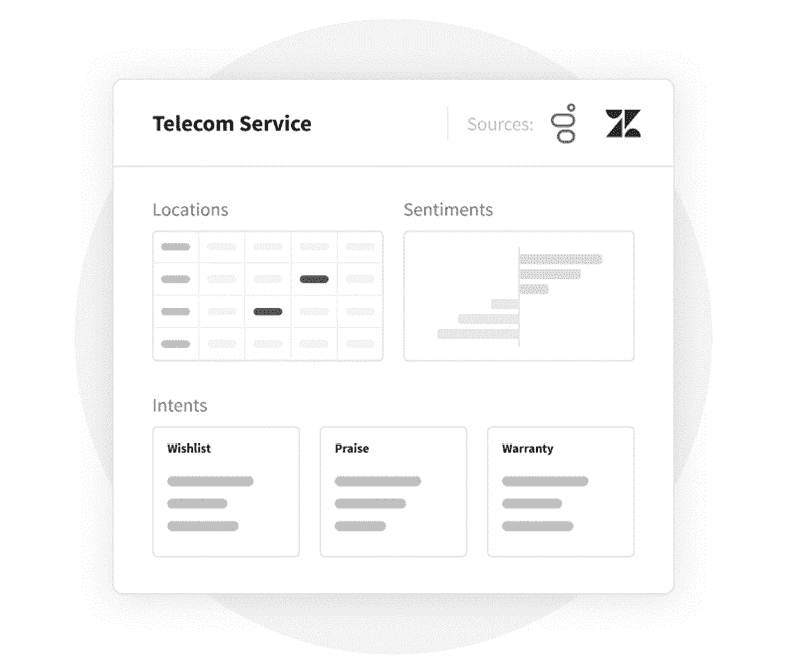

# 第十章：*第十章*：通过 Service AI 提供洞察

正如**人工智能**（**AI**）使产品团队能够增强产品生命周期一样，服务团队现在也可以利用 AI 来提升服务生命周期。

正如我们所知，仅仅为客户挑战或问题提供一个优秀的解决方案是不够的。客户洞察过程及随之而来的服务设计必须是任何希望与众不同并为客户提供更高价值体验的组织的核心。现在，你可以利用 AI 来利用数据并获得可操作的洞察，从而更好地服务于客户。

需要注意的是，AI 不能读懂人心。然而，它可以处理大量数据并提供可操作的洞察。今天，借助 AI，服务团队可以对客户旅程中的特定元素获得无与伦比的理解，这将帮助他们提供更好的服务。

在本章中，我们将讨论如何分析数据以更好地理解你的客户、商店甚至员工。然后，我们将探讨如何将这些发现传递给你的团队，以获得竞争优势。

我们将探讨 **Commerce.AI** 的 **Service AI** 的关键关注领域：

+   授权前线员工

+   管理你的位置

+   提升服务产品

到本章结束时，你将学会如何更好地理解客户喜好、购买原因和挑战，并将下次互动转化为出色的品牌体验。我们还将探讨如何大规模地比较和监控各地的客户评论，快速优化你的分店、员工和服务。最后，我们将识别增长领域和提升客户忠诚度的机会，发掘商店的新用途，并在瓶颈升级之前预先识别它们。

# 授权前线员工

在赋能前线员工时，关键在于为服务团队提供有关客户和客户互动的有意义的洞察。让我们来看一下 Service AI 如何使这一切成为可能的四个方式：

+   更好地理解客户喜好

+   更好地理解购买原因

+   更好地理解客户挑战

+   将下次互动转化为出色的品牌体验

让我们从使用 AI 更好地理解客户喜好开始。

## 更好地理解客户喜好

通过使用如 Commerce.AI 的 Service AI 等 AI 驱动的解决方案，你可以识别现有客户的产品喜好和服务偏好。这些数据可以用来创建个性化体验，满足每个客户的需求和兴趣。

例如，一家餐厅可以利用其客户数据库，包括客户信息，如人口统计数据、过去的购买历史、偏好的就餐时间（例如，周末早午餐）等，来为周五下单的客户提供深夜配送服务，并为周一下单的客户提供清晨配送服务。

或者另一家餐厅可以利用顾客过去的购买记录来判断哪些商品可能会受到那些通常在晚上较晚时段用餐或偏好外送（例如甜点）的人群的喜爱。结合这些信息与其他相关数据，餐厅可以更好地细分其客户群，并根据量身定制的产品提供，发现满足人们特定需求的新市场机会——无论这些需求是与食物相关，还是与非食物相关的。

作为消费者，我们每个人在购买产品和服务时都有不同的需求。我们在时机（早晨还是晚上）、一周中的哪天（周末还是工作日）、我们对订单的提前通知要求、最方便的配送方式（普通邮件还是快递）等方面都有不同的偏好。

但能够在顾客进入商店、网站、应用程序或其他购买渠道之前了解他们的偏好，大大提高了他们找到符合需求的商品的机会。这也给了他们一个机会，看看是否有其他他们不知道但能更好满足他们需求的选择。这可以是从食品、服装到度假和投资的任何东西——这个列表是无穷无尽的！

你需要记住的关键是，如果你能识别出客户的偏好，你可以提供无限的增值服务——而且这些服务可能来自任何地方。

## 更好地理解购买原因

顾客购买服务有许多不同的原因，这些原因远远超出了其财务价值。人们购买东西的一个主要原因是为了定义他们的社会身份。这不仅仅是自我形象的问题——更是关于成为某个群体的一部分，这种归属感对他们非常重要。

在某些情况下，这可以与社区有关——例如，购买本地商品或消费反映你所在地区或你兴趣的内容。关键在于，大多数购买行为都是由情感驱动的，而这些情感的根源与顾客的社区息息相关。人们希望感到与他人连接，才能感到生活中的幸福——他们需要那些连接和情感纽带。

人们往往在别人先做之后才会做。这意味着他们会模仿身边的人，无论是否意识到这一点。这不仅适用于服务领域，也同样适用于所有其他购买，尤其是那些消费者视为身份象征（例如高级航空公司会员）的购买，而非纯粹功能性的购买（例如保险）。这些购买往往更多是关于身份，而非价值——它们象征着你是谁。

我们的行动体现了我们的价值观。通过投入资源帮助你的团队与顾客互动，你表明作为一家企业，你关心顾客，并且重视他们到愿意为他们付出更多。这可能导致回头客和转介，因为当人们感到被重视时，他们会信任一个品牌。

这里的教训是，人工智能可以成为理解客户的强大工具，它是了解客户对你提供的产品和服务的看法以及原因的绝佳方式。通过这些发现，你可以制定出更贴合客户需求和愿望的策略。归根结底，人工智能是为了消除限制，让你以以前无法实现的方式发展，从而激发创新。

例如，团队可以使用 Commerce.AI 分析商店评论、社交媒体帖子和其他客户反馈，以了解客户对其服务的看法。这可以帮助团队更好地理解客户面临的痛点，从而激发服务创新。

另一个例子是使用人工智能分析购买数据，以了解为什么人们会选择某些产品而非其他产品。例如，如果你卖保险，你可以利用人工智能确定哪些类型的保险政策有最高的客户保持率，然后你可以根据这些信息来指导未来的服务开发工作。

## 更好地理解客户面临的挑战

从服务角度来看，客户可能面临几个主要挑战：

+   **关于你的产品或服务的问题**：第一个挑战是客户可能对你的产品或服务有疑问。这可能是一个简单的问题，比如某个特定优惠的资格标准，或者是一个更复杂的询问，例如，*你能详细解释一下这个产品特性吗？*

    当你考虑如何解决这个问题时，你会想要考虑客户已经提供给你的数据。在可能的情况下，你应该查看过去与客户的互动，并利用这些信息来指导未来的互动。如果这些互动中有任何模式浮现出来，这可以为双方节省时间和精力。如果这些模式与业务目标（如增加销售）相一致，那就更好了。

+   **提供个性化的客户互动**：第二个挑战与理解互动的背景有关。在许多情况下，现代消费者习惯于通过数字渠道接收信息，而无需与他人直接沟通。因此，以不具个人化的方式向客户提供信息可能会让双方都觉得没有帮助。在这个日益互联的世界中，提供服务的公司以及使用这些服务的客户都需要彼此更加熟悉，以便关系能够自然发展。

借助人工智能，你可以获得前所未有的客户挑战洞察，使你的服务团队能够与客户产生共鸣，从而提供更加个性化和真诚的体验。

例如，通过分析顾客与服务代表的对话，你可以获得顾客提问的类型。这些信息随后可以用来训练下一代客户服务代表。

另一个例子是使用 AI 搜索并理解某个顾客最需求的产品，然后在顾客下单时推荐类似的产品。通过理解互动的背景，你可以为顾客创造更个性化的体验，这最终会带来更高的留存率和更大的终身价值。

## 将你下次的互动转化为出色的品牌体验

过去 100 年，顾客互动是由功利逻辑驱动的（*完成任务*），几乎没有考虑到人的因素。但近年来，随着人们尝试增强顾客的参与感并改善公司与顾客之间的情感纽带，这种情况发生了变化。

通过服务 AI，品牌可以更好地理解顾客以及顾客互动背后的真正需求，同时克服理解上的巨大障碍。服务 AI 使得跨数字体验的沟通变得更加容易，并能实现那些对顾客而言重要的结果，无论你是小型企业还是大型企业。

服务 AI 的应用将使公司能够为顾客创造更加人性化的体验，这项技术可以应用于数字接触点、实体店面或任何其他品牌体验。这是为了创造有意义的互动，进而推动忠诚度。

情感连接的概念是顾客互动研究中的一个日益关注的焦点。这些时刻有助于建立与顾客的信任和忠诚。当你与潜在顾客建立了强烈的情感联系时，你会增加品牌亲和力——也就是说，顾客更有可能再次购买你的产品，而不是与没有任何关系的公司进行交易。

举个具体的例子，假设一位顾客丢失了钱包，需要更换一个新的。他们可以去商店购买一个新的，但可能不记得旧钱包的品牌或型号。在这种情况下，顾客最好直接在线购买新钱包——根本无需进入商店。

*但是如果那个顾客健忘且更喜欢线下购物呢？* *如果他们在找某个特定的东西，比如某种颜色或设计呢？* *或者他们可能想要与其他零售商比较价格呢？*

如果你能在这些情况下使用 AI 作为助手，你可以帮助顾客获得他们真正需要的东西，并节省时间和麻烦。

在更大范围内，你可以利用 AI 根据顾客的个性化需求，推荐产品和服务。例如，你可以通过 AI 根据顾客的驾驶习惯推荐一款新车型，或者你可以利用 AI 根据顾客的年龄、位置和风险因素推荐保险计划。

以这种方式使用 AI 需要不仅可操作且准确的数据。你需要了解顾客的行为和偏好，以便在推荐产品或服务时做出最明智的决策。

Commerce.AI 提供世界上最大的产品和服务数据引擎，帮助你获取这一关键情报。

在本节中，我们了解了四种为服务团队提供关于客户洞察的方法，这些方法对服务团队至关重要。一旦你了解了你的客户，就该放眼更广阔的视野，全面审视你的门店位置。

# 管理你的门店位置

现在我们已经理解了如何赋能服务前线，让我们来看看如何管理你的门店位置。门店位置是品牌成功的关键因素，因此优化每一项可能的内容对它们至关重要。特别是，我们将关注以下几个方面：

+   优化门店

+   优化员工

+   优化服务

这三个领域是相互关联的，优化它们都很重要。让我们详细了解每个领域。

## 优化门店

人们对一切都发布评论，零售门店也不例外。采用正确的方法，你可以将评论作为竞争情报的来源，帮助你了解哪些方面在门店表现良好，以及如何使它们变得更加优秀。

你将能够回答类似以下问题：*顾客最喜欢你们门店的哪些方面？* *他们批评的是什么？* *他们的投诉中是否有共同点？* 这听起来很明显，但往往直到你仔细分析问题时，才能发现解决方法。

服务 AI 的一个强大功能是能够探索聚合的评论。你可以查看所有门店的位置，然后根据属性深入分析某些子集。

接下来，我们可以进一步通过根据外部因素或类别（例如，门店类型：零售和餐厅）将不同子集拆解。每个子集可以根据它们的表现，将其与其他子集进行对比评分：*哪些门店表现优于其他门店？* *是否能清楚地看出一些门店表现优异或仍未达到预期的原因？*

一旦我们开始了解哪些表现优秀的门店和哪些表现较差的门店之间的区别，这将帮助我们得出可操作的洞察，例如识别哪些门店最需要额外的培训，或在营销策略上做出不同的改变。这将影响我们在运营、人员和资本设施等有限资源方面的投资决策，这些都是任何零售业务的关键要素。

你还可以利用 Service AI 分析不同地点随时间变化的趋势，使用多个指标，如评论数量的变化、评论评分的平均值等等。这还可以为你提供一个关于各地点“甜蜜点”的参考：*哪些门店相比其他表现相似的门店表现得好？* *是否有任何不符合这一模式的异常值？* *它们的偏差有多大，且这一偏差是增大还是减小？*

情感在理解每个分店的表现中起着重要作用。通过分析各个门店的情感，你可以找出需要改进的地方。这不仅仅适用于实体店，也适用于基于位置不同而变化的服务，例如电信服务。在*图 10.1*中，我们可以看到一个电信服务提供商利用 Commerce.AI 分析各地门店的情感并揭示客户意图，具体表现为**愿望清单**、**表扬**和**保修**部分：

](img/Figure_10.1_B17967.jpg)

图 10.1 – 电信服务的 Commerce.AI 分析效果图

**愿望清单**是消费者表达兴趣的功能或产品，可以帮助你制定产品或服务路线图。通过聚合消费者的愿望清单，Commerce.AI 帮助服务团队了解消费者的需求，并指导未来的产品开发。

**表扬**是客户满意度的一个重要指标，通过**情感分析**的视角来看，显然这些消费者非常满意。当员工与客户在各门店互动时，他们应该是讨人喜欢并且乐于助人的，当他们做对了什么时，庆祝一下总是好的！

**保修**是另一个需要跟踪的重要客户意图。对表现出对保修信息感兴趣的客户进行细分，是了解客户需求并提供适当服务的好方法。

最终，这些分析归结为做出明智的决策，决策基于数据和分析。通过将 Service AI 作为众多分析工具之一，我们可以从多个来源提取洞察，并帮助做出比单纯依赖传统方法更有依据的商业决策。

## 优化你的员工

服务创新几乎是每家公司最优先考虑的事项，但一个挑战是，服务员工常常被忽视作为一种资产。服务提供商面临的困难是如何找到合适的人才，并将其培养成具备提供出色客户体验所需技能的团队成员。

在接下来的列表中，我们将解释一些世界上增长最快的公司是如何利用人工智能和数据科学为其服务团队提供所需的优势，以推动增长和盈利的。我们将覆盖以下步骤：

1.  **理解服务员工能带来哪些价值**：优化服务员工的第一步是了解他们能够为您的业务带来哪些价值。这些机会通常来自于**机器学习**或 AI 算法，这些算法根据客户与您的品牌的先前互动，为客户提供智能推荐。

    例如，一家酒店可能会根据客人的旅行偏好或过去的入住历史推荐特定的设施。通过使用 AI 在客户与品牌之间创建个性化的互动，公司可以以比传统营销方法更低的成本提供卓越的体验。

    这一洞察对于所有类型的企业都适用，而不仅仅是涉及客户服务的企业（如酒店）。任何组织都可以通过数据科学和分析在多个接触点应用，识别个性化互动的机会，从而提高每位客户的**生命周期价值**（**LTV**）。然而，正确应用时，AI 为产品经理、设计师、作家、工程师或任何参与产品或服务创作的人提供了巨大的机会。

1.  **情感分析与客户体验分析**：利用 AI 优化服务员工的下一步是情感分析和客户体验分析。这些工具可以帮助服务员工通过提供关于客户投诉、积极互动以及其他有助于改善客户体验的有用信息，来改善与客户的互动方式。

    例如，一家航空公司可以使用情感分析来识别客户选择另一家航空公司而非自己航空公司的三个主要原因。通过利用这些洞察，他们可以通过解决驱使客户远离品牌的问题来改善机上体验。这种类型的数据科学还可以用于提高客户保持率并减少**客户流失**（客户流失率），通过主动联系那些开始离开您的公司（或完全停止与您互动）的客户。

    服务团队通常与公司其他部门隔离操作。这部分是因为传统的营销方法对服务团队效果不佳；市场细分和人口统计数据对他们的相关性较低，因为他们专注于提供一对一的客户互动。然而，这也源于服务公司相较于产品导向行业的同行，长期以来被视为表现较差的遗留观念。

1.  **提供洞察**：然而，实际上，服务组织与任何其他业务单元一样，能够实现盈利增长——它们不应被忽视。使用像 Commerce.AI 这样提供的机器学习和人工智能工具，服务组织可以在多个接触点利用数据科学，使员工能够在每个环节识别出新的参与和创新机会。

    通过在所有与客户接触点应用数据科学，公司可以更好地理解是什么驱动了用户（而非仅凭直觉），并提供卓越的体验，为双方创造长期价值。

## 优化您的服务

您为用户提供的服务是您业务的核心。您无需成为数据科学或机器学习的专家就能看到这一点。服务的质量与客户忠诚度直接相关，如果客户满意，许多客户会再次与您做生意，并推荐您的服务给他人。

这就是为什么服务提供商在其业务中利用数据科学和机器学习日益增长的能力如此重要的原因。特别是情感分析和客户画像是许多服务型企业尚未完全挖掘的两个强大工具。

通过情感分析，您可以非常早地了解用户对您服务质量的看法，并发现改进的机会。例如，如果您的产品是客户服务，您可能希望监控社交媒体上关于您团队的情感，并做出改变以改善体验。或者，如果您的用户对某个餐厅或酒店的食品质量表示批评，您可以通过情感分析查看是否有改进该体验的方式。

同样，如果您是一名电视节目制作人，您可以利用情感分析了解观众对特定节目的看法，并为未来的节目规划方向。如果观众已经厌倦了老旧的犯罪剧，想要更多的喜剧节目，那就是增加观众数量的机会。

**客户画像**是另一个强大的数据科学工具，服务提供商可以用来提升服务质量。通过客户画像，您可以收集大量关于用户的信息——例如他们住在哪里，做什么工作，或他们的兴趣爱好——并利用这些信息根据这些偏好为他们提供定制化的体验。

例如，如果某个城市的某个区域在比赛日有许多人实时观看体育集锦，那么体育酒吧可能会想在该地区安装高清电视，以便顾客在等待比赛开始时也能观看体育集锦。这种洞察力帮助企业避免浪费投资，并为顾客提供更好的服务，同时降低成本。

毫无疑问，这两种数据科学形式——情感分析和客户画像——在未来将发挥越来越重要的作用，提升服务的效率和质量。随着公司希望通过提供增强的客户体验或个性化内容（例如**Netflix**与**Blockbuster**的对比）来区分自己，它们将变得更加关键。

这就是为什么服务提供商今天必须考虑如何利用这些工具（以改善当前的客户体验）来培养忠实的客户，以便未来他们能够回头光顾。

在这一部分中，我们学习了如何在门店位置的管理和优化方面做出改进，涉及到分店、员工和服务。这些都是你服务中至关重要的部分。接下来，让我们深入探讨如何使用 AI 来提升你的服务产品。

# 提升服务产品

提升你的服务产品需要一种整体方法，即从头到尾全面审视你的服务。你的竞争对手在不断根据客户反馈和分析改进他们的服务产品，因此你也必须做到这一点。特别是，你可以通过服务 AI 在五个方面提升你的服务产品：

+   识别增长领域

+   利用 AI 打造更强的服务产品

+   识别提升客户忠诚度的机会

+   为你的门店寻找新用途

+   在瓶颈问题升级前获得预警

让我们详细探讨这些领域。

## 识别增长领域

增长收入很困难。那些在规模上取得成功的企业都有一个共同点：通过不断创造新价值并通过提供更多顾客想要的东西来增强现有产品。这一过程中，这些企业创造了巨大的*客户忠诚度*，这也是它们成功的关键。

目前，许多公司正在试图在一个钱少、竞争多的世界中找到如何增长收入的方法，尤其是随着消费者寻求数字替代传统实体店购物体验。随着电子商务的兴起，难怪如此多的公司都专注于在组织内部建立更强大的电子商务能力。

*但这对服务团队意味着什么呢？* 现在，我们将探讨如何利用 AI 创造更强的服务产品，以便为我们的客户提供更好的服务，同时可能在这个过程中推动收入增长。

## 利用 AI 打造更强的服务产品

服务团队可以为公司增长做的最重要的事情之一就是确保顾客满意。有大量研究表明，客户保持率（即顾客保持忠诚的时间）与收入增长直接相关。想想看：*如果你能留住 100%的客户，那不是太棒了吗？*

但想想这里的含义：*即使你只能保留 50%的客户，如果你能够通过不断为他们提供更多的价值并增强现有的产品，那么这不是很有意义吗？*

换句话说，单纯专注于*增长*，而不考虑提升*保持率*，就像在漏水的桶里倒水。

重要的是你的公司是否有能力在一段时间内持续为客户创造新价值。这意味着服务团队需要重新思考如何服务客户，以便在创造新价值的同时增加收入。

在为客户创造更多价值时，你不必总是重新发明轮子。事实上，许多公司今天已经开始使用 AI 来增强现有的产品，尤其是在像**Airbnb**和**Uber**这样的站点上，人们使用 AI 功能（如评分表和司机评价）来判断谁可能是一个可靠的房东或司机。

人们已经在这些网站上不断使用这些功能；你需要做的就是理解行为经济学（人类决策背后的科学）。通过这种理解，你可以判断如何最佳地部署这些工具，使它们在大规模实现你的商业目标时发挥最佳作用。

比如，假设你拥有一个销售家居装饰品（如抱枕）的电子商务网站。每天，成千上万的人从全球各地访问你的网站，搜索诸如`粉色抱枕`，甚至更具体的术语如`红色格子抱枕`。数据显示，购买红色格子抱枕的顾客往往也会购买粉色抱枕，但如果顾客没有查看任何一种，他们就不会购买任何一种。

*如果你添加了一个新的产品详情页参数，叫做*`颜色`*，展示常见的颜色配对呢？* 按颜色搜索的顾客更可能购买多件商品，从而提高平均购物车价值。这就是行为经济学的运作方式。你通过理解顾客的浏览行为，利用 AI 更好地利用现有库存。

这个例子中的关键要点是，如果你了解人们如何浏览你的网站，你就可以利用这些数据来指导未来关于哪些产品或功能应该包括或排除的决策，基于客户行为。再次强调，使用行为经济学作为指南，你可以通过在客户最需要时（或至少是他们认为最有用时）为他们提供所需的内容，从而为客户创造更多价值。我们称之为**适应性定制**。

这种适应性定制的概念对服务团队来说具有巨大的影响，帮助他们创建更强大的服务产品并推动收入增长。事实上，将这一原则应用于社交媒体平台已被证明可以显著提高用户参与率，这意味着更高的留存率和随着时间推移更大的收入增长。

## 识别提升客户忠诚度的机会

**客户忠诚度**是一个热门话题。公司每年花费数十亿用于获取和留住客户，而且由于服务市场的竞争异常激烈，形势比以往任何时候都更为严峻。

但在客户忠诚度计划中，由于资源限制，服务公司往往很难找到如何在提高留存率的同时为客户提供更多价值的方法。

简而言之：*如何为你的客户和你的企业创造双赢的局面？*

一种有前景的方法是通过像 Commerce.AI 这样的 AI 驱动的商业平台。这些平台利用数据科学转变了企业与客户之间通过服务产品互动的方式。

例如，假设你经营一家提供按需家政服务的小型企业，帮助人们维护和修理他们的家。你有一个出色的团队，能够及时提供高质量的服务，但由于客户流失率高，你的收入增长停滞不前。

你的销售团队一直在尝试与客户互动的新方式，例如为他们创建定制活动或提供一对一的辅导课程。为了为现有客户增加价值，你使用 Commerce.AI 分析你在**Yelp**和 Angie's List 上的评论情感，识别可以解决的问题以提升客户满意度，然后利用这些反馈为客户创建新服务。

这种方法有潜力提高客户参与度，同时增加客户留存率。例如，假设你的客户最近在家里遇到了水龙头坏了的问题，并提出了投诉。你迅速创建了一个服务方案，解决了她在 Yelp 上列出的其他问题。她对这种个性化服务感到非常满意，并且感激你能够迅速处理问题。

相同的原则可以应用于任何规模的服务企业。例如，你可以使用服务 AI 来识别你的主要客户，然后利用这些信息为他们创造新的服务。或者，如果你在某些区域有大量客户，你可以使用服务 AI 来识别哪些客户比其他客户使用某些功能更多。接着，你可以根据这些用户的需求为他们创造新的产品和服务。

Commerce.AI 与企业的这种整合可以通过提供比单纯交易互动更多的价值，帮助他们增强与客户的现有关系，这也是为什么我们看到像**联合利华**、**网件**、**可口可乐**、**铃木**等领先品牌都在使用 Commerce.AI。

## 寻找店铺的新用途

你的店铺可能有多种用途：提供服务的地方；建立社区的地方；获取反馈的地方；进行市场调研的地方；举办促销活动的地方；客户报名电子邮件列表的地方；赚取推荐佣金的地方；销售实物产品的地方——这个列表可以继续扩展。

*但你如何在这些使用场景中找到更好、更创新的方式来服务你的客户，并且如何跟踪你的努力成果呢？*

这就是人工智能的作用所在。由于考虑如何利用人工智能满足所有这些不同需求可能会让人感到不知所措，我们将其拆解为三个阶段，帮助你从今天开始改善你的工作方式：

1.  寻找今天使用店铺的新方式

1.  寻找未来使用店铺的新方式

1.  找出有效的方法并识别如何扩大规模

### 寻找今天使用店铺的新方式

第一步是思考如何利用你的店铺，并探索是否有任何新的方式可以使用它。

举个例子，如果你是一个服务团队，你可能希望考虑将你的店铺作为一个让客户互相交流的地方。你可以在店里举办一个聚会或活动，让人们聚在一起，互相学习。或者，也许你有一些有趣的内容，大家都愿意分享，比如如何提高工作效率的技巧，或者如何创业。现在正是时候开始思考你可以为那些希望通过你的新闻通讯或网站以外的渠道获取这些内容的人创造哪些内容。

你可能还需要考虑你团队如何使用你的商店与客户互动的方式。例如，你可以问自己一些问题：*如果你有一个电商网站，为什么不与客户举办直播问答会？* *如果你有一个社区网站，为什么不发布客户成功案例？* 这些只是两个想法，具体的可能性还有很多，取决于你提供的产品或服务类型。重要的是，这个练习有助于团队识别他们今天可以使用平台的新方式，这样他们就不会只想着未来要做的事情。

AI 可以通过帮助你识别对你的受众最有价值的内容，并找到最佳的传递方式，来帮助你发现使用商店的新方式。

### 寻找未来使用你的商店的新方式

一旦你开始以新的方式使用你的商店，下一步就是开始思考如何在未来继续使用它。这可能意味着从小处着手，并在当前的基础上进行扩展，或者意味着进入全新的领域。

例如，虽然你的商店可能当前没有预算聘请一名全职的社交媒体经理，但你可以将你的商店作为一种方式，让你的团队成员在社交媒体上与客户互动。你还可以考虑将你的商店作为团队成员分享与社区相关内容的一种方式，比如你认为大家会喜欢的精彩新文章，然后让社区中的人分享给他们自己的社区。

从根本上来说，这个阶段的重点是利用 AI 从评论和社交媒体帖子中提取客户的需求，然后将那些目前无法实现的需求进行细分，并为未来的路线图做规划。在此之前，你可以寻找创造性的替代方案来满足客户需求。

### 找出什么有效并确定如何扩大规模

最后一步是利用 AI 从实验中学习，以便将有效的做法进行扩展。你可能会发现，邀请外部团队或顾问来审查和验证每个阶段的发现是有帮助的，因为这可以帮助你专注于正确的事情。

从小处着手，保持简单，直到你弄清楚如何开始做一些更易管理的事情，再考虑最昂贵的预算支出（如购买一大块不动产或雇佣一支庞大的团队）。

现在也是考虑你的团队如何能够随时间追踪和分析这些实验结果的好时机，这样他们就可以了解在不同的使用场景中，哪些方法最有效，同时还能追踪这些方法背后的成功指标。这有助于团队理解哪些实验效果良好，以及为什么效果良好，这样他们就能在其他有潜力增长的地方重复这些实验。

## 在瓶颈升级之前获取清晰的图景

瓶颈是阻止客户充分利用服务的隐性因素。这些因素可能来自于有限的人力资源、容量、流程不完善或其他低效之处。

每个企业都知道，改善客户体验是成功的关键。然而，对于许多组织来说，全面了解所有服务方面的情况可能非常困难。让我们探讨一下 AI 如何帮助团队更清晰地了解其服务能力——通过隔离瓶颈——从而能做出更明智、更有信息支持的决策，决定将时间和资源投入到哪里。

在一个集中系统中追踪您的店铺位置、团队成员和客户互动，有助于您发现趋势并识别改进领域。这就像拥有一份数字化的*餐巾纸背面*分析，帮助您了解您的业务在哪些方面强大，在哪些方面需要改进。

当应用于服务运营时，AI 工具可以提供关于客户满意度、员工表现和店面效率的实时洞察。通过机器学习，数据驱动的系统以惊人的速度分析大量数据，快速处理文档，并在问题成为*难题*之前自动提醒您有关*问题*的情况。

在服务运营智能的情况下，AI 可以突出那些可能被人工忽视的关键瓶颈，从而让团队能在问题成为客户体验障碍之前主动解决这些问题。

例如，一家著名的法国披萨连锁店使用 Commerce.AI 来识别其配送位置的瓶颈。借助 Commerce.AI，连锁店可以轻松发现业务流程中的瓶颈，例如新员工在特定设备上的培训不足。

# 总结

在这一章节中，您已经学会了如何使用 AI 来赋能您的前线团队、管理您的店面并提升您的服务产品。

通过分析客户数据，您可以提取客户的偏好、购买原因和面临的挑战。这些信息将帮助您的前线团队更好地与客户产生共鸣并提供服务。对于您的实体店面，您可以分析围绕分店、员工和服务的数据，从而在各个层面优化流程。最后，您可以通过识别增长领域、发现新用途、提升客户忠诚度和减少瓶颈，提升甚至转型您的服务产品。

通过让 AI 在您的服务数据中发挥作用，您将解锁新的洞察和增长机会，并进一步让您的公司在市场中脱颖而出。您将成为一家*AI 优先的公司*。

在下一章节中，您将学习如何将 AI 应用于市场智能，生成可操作的洞察，帮助您改善业务。
