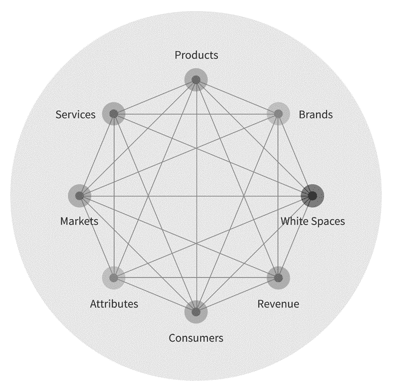
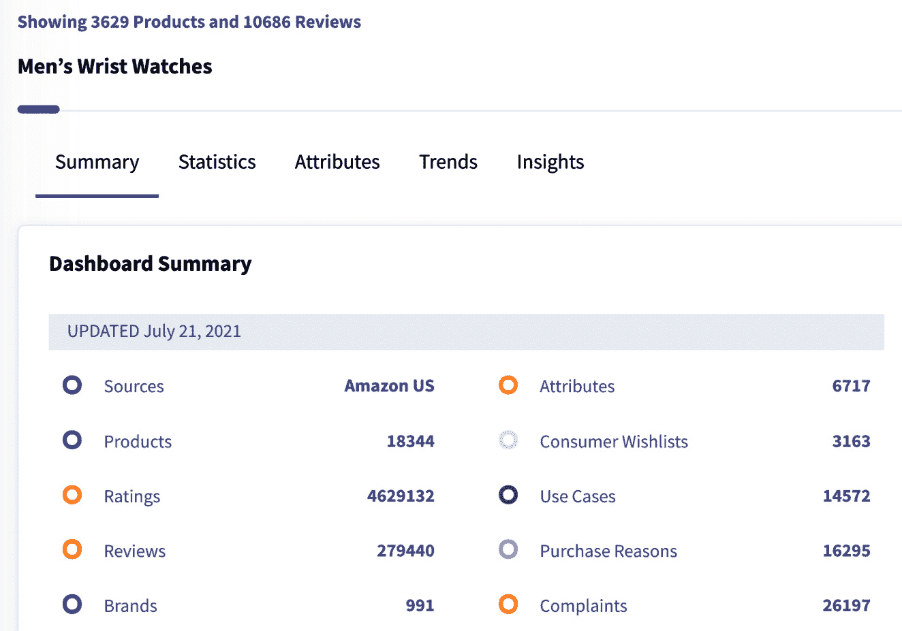

# 第十一章：*第十一章*：通过市场 AI 提供洞察

一切市场都已到来。任何可以想象的商品或服务，都可以在在线市场上找到，从航班到房地产，从音乐会门票到传统的体力劳动。

这不仅仅是我们在新闻中读到的东西——它是一个全新的现实。在我们周围，人们以前所未有的方式买卖商品和服务。那些使信息获取更加民主化的数字化力量，也使得市场变得无处不在。

过去，公司需要多年投资和数百万美元的收入，才能梦想着创造一个新的、盈利的产品线；现在，这个过程只需数周或数月。进入许多市场的门槛已经降得非常低，竞争达到了历史新高。

为了在这个新的市场环境中取得成功，产品团队需要能够识别产品数据中的趋势和模式，从中获得更多的战略决策依据。以新的方式分析数据的能力可以帮助产品团队改善其产品和服务——最终，增加收入。

在本章中，我们将探讨如何使用 AI 获得可行的洞察，从而在市场中取得成功。具体来说，我们将涵盖以下主题：

+   趋势分析与空白空间发现

+   将市场变化与品牌、产品和服务连接起来

+   理解市场 DNA

你将学习如何识别新的产品和市场机会，发现并应对市场变化，并利用市场 DNA 的概念，解读客户的声音、内心和想法。

# 趋势分析与空白空间发现

首先，我们来讨论如何通过产品创新和市场情报的视角，利用 AI 发现商业中的重大趋势。

历史上，产品团队一直依赖多种方法来识别创新的产品或功能。这些方法通常包括客户访谈、焦点小组讨论和广泛的市场调研。近年来，随着额外资源和技术的出现，产品团队能够利用基于 AI 的技术来补充甚至取代这些传统方法。

特别是，趋势分析和预测已经成为产品经理的重要工具，使他们能够识别流行趋势、新兴趋势以及潜在的有利可图的市场。

## 利用空白空间提升产品创意生成

创意生成始于市场调研——但这还远远不止如此。一旦团队通过市场信号识别出人们的需求，他们应该能够更深入地分析数据和 AI，甚至发现所谓的市场*空白空间*。空白空间指的是那些当前尚未被满足的产品细分领域，但如果产品团队能够找到进入这些领域的方法，它们就可能被开发出来。

在下图中，我们可以看到一个模型图，展示了如何通过查看各个领域的数据（包括产品、服务、品牌、市场、消费者等）来发现空白空间：

图 11.1 – Commerce.AI 空白空间分析的模型图

通过结合来自数字渠道的数据源以及关于人们在各个渠道上实际行为的定性信息（例如人们搜索的内容或他们对某个产品的喜欢与不喜欢），产品团队可以开发出高度预测性的模型，帮助他们创造更有效的产品或服务。

利用这一发现市场空白空间的概念，Commerce.AI 在超过一万亿个市场数据点中发现了 10 个*重大趋势*。让我们深入探讨这些重大趋势，它们对今天的产品团队有着重要的启示。

## 一切的虚拟化（VE）

**虚拟现实**（**VR**）因其沉浸式特性以及在硬件和软件采纳方面的顶尖表现，成为未来的数字环境。2021 年第一季度，全球销售的虚拟现实头盔增长超过 50%（[`thejournal.com/articles/2021/07/01/virtual-reality-headsets-see-explosive-growth.aspx`](https://thejournal.com/articles/2021/07/01/virtual-reality-headsets-see-explosive-growth.aspx)），这一技术终于开始拥有足够大的装机量，足以引起许多消费者的关注。随着越来越多的人接触到虚拟现实，这项技术将在未来几年内继续获得关注，推动**每用户平均收入**（**ARPU**）的增长。

这些数字只能增加，特别是随着成本持续下降，同时每花费一美元所获得的计算能力不断提升。

虽然虚拟现实（VR）目前可能还没有成为主流现象——它是你必须亲自体验才能相信的——但其基础设施已经基本到位，且采用率正在迅速上升。如果在我们的有生之年，超过十亿人开始使用虚拟现实，也不会令人感到惊讶（尽管今天看起来似乎不太可能）。

此外，像 Facebook 这样的大型企业正投入大量资源支持虚拟现实，包括数十亿美元的投资和数百名专注于该技术的员工，因此这不是昙花一现——它是一个值得的投资。

对于那些希望利用这一新技术推动业务发展的产品团队来说，有许多机会。让我们重点关注一些企业应开始思考如何在今天使用虚拟现实的领域：

+   沉浸式体验

+   转型现有行业

+   品牌与声誉

这三个领域是虚拟现实体验和产品的主要目标市场。机会是广泛的，但这需要公司思考全新的商业模式，利用这项技术独特的能力。接下来我们将详细探讨这些领域。

### 沉浸式体验

提供沉浸式体验的公司可能会在虚拟现实领域取得最大成功。虚拟现实的主要好处是它允许人们身临其境，无论是在游戏、电影、展览，甚至是另一个国家。但它不仅仅是娱乐。

公司可以使用虚拟现实来培训员工、将客户与专家对接、展示产品和服务，等等。因此，公司正在通过新渠道和新形式找到令人兴奋的方式来吸引用户——同时为他们提供传统 2D 屏幕无法带来的体验。

### 转型现有行业

在过去的几年里，我们看到公司利用虚拟现实进行飞机设计原型制作、虚拟展厅等。这些项目展示了公司如何重新审视传统行业，并通过技术——在这种情况下是虚拟化——找到新的方式与人们互动。

### 品牌建设与声誉

让人们注意到你的品牌是很困难的。这就是为什么公司花费大量广告费用——为了接触到那些看到广告的人。虚拟现实可以改变这一切，因为一旦它融入到公司的生态系统中，客户会想要与品牌互动。未来没有人会想错过新的虚拟体验；相反，每个人都会希望成为其中的一部分（特别是如果他们的朋友也在其中的话）。

## 增强现实

**增强现实**（**AR**）市场正在以惊人的速度增长，因为越来越多的消费者意识到它的潜力。像大多数新兴技术趋势一样，AR 最初针对的是一个小众群体——特别是寻求更加沉浸式和真实体验的游戏玩家——但随着时间的推移，它将继续扩展到这一初始群体之外。

各种不同群体的可接触性将会增加，例如寻求更好协作工具的企业用户，或希望在监督孩子户外玩耍时多一双眼睛的父母，以避免意外事故发生。

**增强现实**也将受益于它可以被视为虚拟现实的延伸，因为用户实际上是在数字世界中生活。这两项技术相辅相成，因为它们都为用户提供了与周围环境互动的新方式——在这种情况下，是数字增强的环境——为用户带来了全新的体验。

这种互动对那些需要与他人共享物理位置的行业尤其有用。值得注意的是，Facebook 最近正在进行一系列收购 AR 公司，如 Scape Technologies、Daqri 和 Mapillary。

正如产品团队可以使用 VR 一样，AR 也有许多创造性的应用。例如，产品团队可以利用 AR 展示新功能或操作，向用户介绍新功能如何工作，甚至用于品牌互动。同样，餐厅也可以将实时订单叠加在顾客的餐桌上，这样顾客就能看到自己的餐点还需要多长时间才能送到。

举几个例子，房地产开发商可以创建一个房产的 AR 模型并展示给潜在买家，而房主则可以使用 AR 在家中添加虚拟家具。消费者甚至使用 AR 试妆、试衣、试发型和配饰。考虑到这些可能性，难怪公司会投资 AR，以帮助他们以全新的方式与客户和潜在客户互动。

## 电子商务

随着**电子商务**的持续大规模增长，在线购物变得越来越普及。2020 年，Commerce.AI 数据引擎在几个月内实现了 10 年电子商务增长，导致全球电子商务渗透率急剧上升。

电子商务还将受益于年轻消费者对传统购物方式的依赖减少；他们认为在线购买和去商场购物没有区别。

对于实体店来说，最大的问题是所谓的出行障碍。如果你住在农村，想去实体店购物，唯一的选择就是乘飞机去其他城市购物。另一方面，线上零售商没有这个问题——你只需要打开电脑或手机，就可以进入任何愿意购买你产品或将钱寄给你的人所在的地方。

向在线零售转变已经酝酿了很长时间。几十年前，几乎不可能在线购买除书籍和办公用品之外的任何东西；而今天，多亏了像 Amazon 和 Alibaba 这样的电子商务平台，它们在各自市场的主导地位，现在几乎任何人都可以轻松地通过几次鼠标点击购买到几乎任何东西。

## 社交商务的崛起

**社交商务**在过去几年中显著增长，而且近期没有放缓的迹象，尤其是随着 Instagram 和 TikTok 等平台越来越受欢迎，成为品牌与顾客连接的途径。

另一方面，传统媒体渠道如报纸或电视广告可能会疏远一些不感兴趣的潜在顾客，尤其是在某个特定时刻展示的广告内容（除非可能是披萨广告）。这也是社交商务迅速崛起的部分原因。

目前，社交媒体在 Z 世代中最受欢迎；然而，过去几年里，它在较年长的群体中，如婴儿潮一代和 X 世代的渗透率也在迅速增加。社交媒体已经成为我们日常生活中如此根深蒂固的一部分，以至于几乎没人会停止在这些平台上花时间——能够利用这一趋势的品牌将看到其销售额大幅增长。

## 网红营销的崛起

**网红营销**是社交电商的另一个例子，近年来在过去几年的增长非常显著。未来可预见的时间里，网红营销的投入将继续增长，尤其是随着消费者越来越习惯于基于他人的推荐而非自己进行尽职调查来购买产品。

网红营销与社交电商一起成长；两者在彼此依赖的口碑推荐中都受益匪浅。

如果我们从社交媒体时代学到了一件事，那就是在线的同伴压力在影响人们并说服他们购买某些东西时往往极其强大，无论他们是否真正需要或想要它。

## 万物游戏化

**游戏化**在商业和营销中是一个热门话题，品牌和消费者都对如何利用这一概念增加互动感兴趣。这一趋势已经存在了十多年——即使是 Facebook 自创立以来就开始使用游戏化技巧——但最近，随着竞争的加剧，它所获得的关注度呈指数增长，尤其是在争夺人们有限的注意力时。

游戏化的理念是将那些本身被认为平淡或乏味的事物——在这种情况下，如购物体验——转变为人们期待去做的事情。

例如，假设你正在销售一双跑步鞋。你可以为跑步者创建一个应用程序，将跑步这件事变得有趣和令人享受——比如与其他人竞争，看看谁能跑得最远或者最快。你还可以围绕品牌建立一个社区，创造一个体验，鼓励人们与他人分享他们的锻炼成果，从而鼓励更多人加入他们的锻炼。

这甚至适用于实体店。假设你经营一家比萨饼店。你不仅仅是展示一个比萨烤炉，而是可以设计一个游戏，让人们在 15 分钟内将比萨送到社区的其他人手中。排名榜首的人将赢得一张免费比萨！

在商业和营销中，运用游戏化技巧的可能性是无穷无尽的。

## 中产阶级的崛起

从金融角度来看，**中产阶级**通常被描述为拥有 10 万美元到 100 万美元之间流动资产的人。

富裕阶层是全球商业和经济中的新权力经纪人，他们在经济和社会上的重要性持续增长。这群消费者主要由处于上中产阶级与上层阶级之间的人群组成，具体取决于用来定义其社会地位的参数（财富、教育水平、购买力等）。

随着公司利用互联网接触到他们，Z 世代的购买力在过去几十年中大幅增长，他们能够比较价格、质量水平和不同提供商的服务。这一趋势使得大多数行业中的公司几乎无法忽视这些消费者——尤其是现在他们有钱可花。

当我们将过去几年的所有因素加起来时，看到一些关于品牌如何与这个群体互动的趋势浮现出来也就不足为奇了，主要通过沉浸式内容和网红营销。

## 真实性的崛起

随着 Instagram、YouTube、Twitter、Discord 等社交平台汇聚了数十亿用户，用户们通过自我创作内容（无论是视频还是静态图片）来表达自我，我们看到越来越多真实内容的生产。

此外，今天世界上一些最大的品牌最初都是通过社交媒体平台起步，后来才发展成家喻户晓的名字。这主要得益于它们能够在真实的层面上与消费者建立联系。

社交平台不会很快消失，因此许多品牌正试图利用这些平台与消费者建立更真实的联系也就不足为奇了。简而言之，今天的消费者比以往任何时候都更可能在这些平台上信任并与品牌互动。

## Z 世代

**Z 世代**（1997 年后出生）是首批真正的数字原住民，也是最大的数字消费者群体。由于他们年轻，Z 世代的庞大规模经常被忽视，但他们将进入职场，恰逢科技和服务行业经历前所未有的增长。

Z 世代展示了与品牌互动的天生能力，能够根据他们独特的需求理解品牌应该如何与他们沟通。例如，他们比以前的几代人更看重真实性。

## 对可持续产品的需求

世界许多地方缺乏清洁水源、食物和能源，迫使消费者购买环境影响较小的产品，同时提供改善健康或表现等有价值的益处。

虽然这一直是品牌应关注的重要方面，但 Z 世代在要求品牌提供更可持续产品方面走在了前列。这些顾客希望购买对环境无害、对他们有益的产品，而不是在二者之间做出妥协。

像联合利华这样的公司已经意识到这一趋势，并创建了具有更少有毒成分、但依然有效的可持续产品线，以提供期望的结果。

总结这 10 个大趋势，我们可以说，它们是人类活动多个领域快速演变的必然结果，从商业到政府到科学。它们已经存在，并将继续影响我们日常生活的方方面面。

话虽如此，理解市场变化并不够——为了利用这些变化，企业必须能够将这些变化与他们的战略和现有资产相连接，同时识别出哪些地方可以创新，以更好地满足需求。

# 将市场变化与品牌、产品和服务联系起来

现在我们已经了解了如何通过商业数据分析市场变化，接下来我们来看看如何将市场变化与品牌、产品和服务联系起来。我们将在两个主要领域探讨这一连接：

+   衡量产品及其类别中的正负变化，并迅速、高效地做出响应。

+   识别、管理并解决产品风险领域和升级问题，并主动制定解决方案。

## 测量产品变化

测量市场变化很困难。你怎么知道市场上发生了什么，并知道如何采取行动？

仅仅意识到消费者需求的变化是不够的。你必须能够迅速行动，预测这些变化将对你的产品或服务带来什么影响，并思考如何利用这些变化。通过这样做，你可以将机会转化为竞争优势，使公司在长期内取得成功。

让我们看看三种公司利用人工智能更好理解这些变化市场的关键方式：识别机会、洞察竞争对手以及基于数据分析进行调整。

这些领域每一个都至关重要——每一个都需要人工智能技术，如情感分析和**自然语言处理**（**NLP**）。当然，考虑的事情远不止于能否识别市场变化——但是如果你能够利用 NLP 技术作为起点，它可以为你的产品团队开启新的可能性。

### 市场变化如何帮助你发现市场中的机会

那么，当消费者从直接在家里饮用自来水转向购买瓶装水时，这意味着什么？或者当消费者从为野餐和户外活动购买瓶装水，转变为每天消费瓶装水时，这意味着什么？这些都是消费者行为的变化，值得衡量。

你如何知道这些变化意味着什么？作为一家公司，你又该如何利用这些变化来获取优势——无论是通过寻找新的方式与客户建立联系，还是识别客户可能从竞争对手那里转移的地方？

无论是瓶装水、电子产品，还是其他任何完全不同的商品，NLP（自然语言处理）可以帮助我们了解消费者情绪和兴趣的变化。

这些信息可以为我们提供一个良好的依据，了解消费者未来可能购买哪些品牌，而这些洞察可以被产品经理或营销人员用来针对这些特定用户创建新的营销活动。本质上，我们将能在其他人之前识别出市场中的机会。

预测市场变化并理解这些变化对品牌和产品的影响，不仅对识别机会至关重要——它也是创造新机会的关键。通过了解哪些消费者可能对你的产品或服务感兴趣，你可以围绕该话题开始构建社区内容，同时为你的品牌创造吸引新客户的潜在机会。

### 获取竞争对手的洞察有助于你创造竞争优势。

**客户体验**（**CX**）是电子商务中的新竞争优势。这是有道理的——在今天的世界里，消费者更有可能根据品牌如何对待他们，来决定与哪些品牌进行交易。

因此，各行各业的公司都需要密切关注竞争对手的动态，以便从中学习并及时响应客户需求。通过使用诸如情感分析等 NLP 技术获取竞争对手的洞察力，你可以更好地理解消费者对你品牌的看法。

以瓶装水为例，随着人们对健康和福祉的关注增加，我们或许能看到向高端瓶装水品牌的积极转变。但这也可能意味着，某些产品线中的其他产品，如苏打水，可能会面临市场的潜在转移。

这些信息可以被任何公司内部的产品经理使用——无论是可口可乐还是其他消费品公司——来确定如何根据这些信息调整其产品供应。

### 基于数据分析做出调整可以帮助你适应市场的变化。

数据无处不在，而且比以往任何时候都更重要，企业将其作为获取市场洞察的手段。因此，现在品牌获取关于消费者行为、竞争对手销售趋势等方面的数据，比以往更为容易。有效使用这些信息，可以成为采取行动并作出明智决策的重要工具，帮助你在任何市场中做出合理的操作。

NLP 技术只是识别市场趋势和基于数据分析做出改变时拼图中的一块。但是，无论你在哪个行业工作，或者你在任何公司中的角色是什么——从市场经理到首席执行官——能够利用 NLP 技术可以帮助你比竞争对手更快地发现新兴机会，深入了解你的客户群体，从而与他们建立更有意义的联系，并做出更聪明的决策。

## 识别产品风险领域

**产品风险领域**是客户需求和行为变化的表现，这些变化可能导致产品失败或表现不佳。当这些领域得到更好的理解时，可以通过设计和开发变更积极应对。通过预见变化、市场状况，甚至竞争对手的策略，产品团队可以开发出符合客户需求变化的产品。

为了有效管理这些领域，产品经理需要了解他们的客户——他们是谁，如何表现——以便预见客户可能最看重哪些特性。在开发新产品或服务时，这些知识应为你提供有关如何在内部设计功能以及市场中存在的创新问题/机会的参考。

为了降低失败的风险，产品经理还应对其组织的能力和限制有深入的了解，以确保他们构建的产品能够在预算和时间框架内成功交付。他们应考虑竞争对手如何解决类似问题，可能使用什么技术来解决这些问题，以及他们在内部可能缺乏哪些能力，但可以通过外部合作伙伴或供应商来弥补。

这种积极主动的方法让你能够在设计过程中及早识别潜在风险。它还为你提供了在产品路线图中构建灵活性的机会，通过加入一定程度的实验性，同时考虑某些特性、策略或商业目标。

风险缓解应超越产品经理，扩展到整个产品开发团队，团队可以作为一个协调一致的单元一起工作，识别并解决可能出现的任何潜在问题。

## 使用人工智能进行产品风险管理

积极预见风险并设计出更有可能成功的产品是产品经理的宝贵资产，但对于团队来说，单独管理这一点可能会很困难。这就是人工智能可以提供帮助的地方。AI 可以通过实时分析众多数据源，包括与正在开发的产品相关的社交媒体帖子和在线对话，来全面理解市场。

通过其揭示可能被忽视的模式的能力，这一分析可以比传统方法更早识别出新兴趋势。通过这些数据来源获得的 AI 生成的见解可以持续精炼并随着时间推移更新，提供关于市场状况的更详细信息——这些都是积极主动的产品经理在尝试在竞争环境中开发创新产品时会觉得有用的内容。

作为这一持续过程的一部分，可以在问题全面爆发之前识别并采取行动应对新机会或风险，从而提供额外的好处，超越了仅仅是在发布前识别潜在问题或发布后减少失败率的目标。

这种战略情报可以为公司提供优势，帮助其创建顾客愿意为之付费的新价值主张——这是在没有 AI 技术的支持下无法做到的事情。

总结这一部分，AI 技术的使用帮助公司识别市场中的机会和风险，同时提高他们预见即将到来的变化的能力。以这种方式使用 AI 可以帮助公司通过更好地理解顾客并开发满足顾客需求的产品，获得竞争优势。要在竞争激烈的市场中取得成功，让我们一起探索市场 DNA 的概念。

# 理解市场 DNA

**市场 DNA**是一组定义市场的属性和特征。例如，一个市场可能通过参与者的属性来定义——例如其用户数量或用户的经验水平——或通过他们购买和销售的商品的属性来定义，例如订阅模式。

市场 DNA 在理解产品应该如何运作以及应具备哪些功能方面至关重要。特别是，市场 DNA 包括关键的产品特性。例如，如果你处于智能手表市场，电池续航就是一个关键特性。因此，你可能需要一款电池续航时间长的智能手表，以吸引消费者的关注。

以下截图展示了在男士腕表市场 DNA 中所涉及的特性。创新团队可以深入探索仪表盘中的**产品**、**评分**、**评论**、**属性**、**消费者愿望清单**等部分。每个特性都展示了市场特征的多维空间中的一个维度：

图 11.2 – Commerce.AI 男士腕表市场概览的截图

产品团队通常在这方面遇到困难，因为他们的任务是定义产品的目的并构建满足这些需求的功能。但很少有产品团队拥有关于顾客如何使用他们的产品的数据——尤其是在早期阶段的公司，功能集尚未完全定义。这就是 Commerce.AI 可以提供帮助的地方。

Commerce.AI 帮助产品团队从客户的市场数据中发现模式，这比传统手段（如客户访谈或焦点小组）能更快地揭示关键的产品特性。

Commerce.AI 还帮助您了解客户如何使用产品，这有助于产品团队调整功能集和产品策略。例如，如果大部分用户只是偶尔使用您的产品，而不是定期使用，这可能是一个警示信号，表明您可能需要重新思考产品的目的或目标用户。让我们通过了解市场特征、用户需求和期望、发现新的使用场景等，深入探讨这些思路。

## 发现市场 DNA 特征

在本节中，我们将讨论 Commerce.AI 的市场数据如何帮助产品团队在市场 DNA 的背景下找到关键功能——包括揭示定义市场的特定属性。我们将深入探讨商家在平台上发现的关键功能的实例，以及这些洞察如何为产品团队的决策提供指导。

与许多新产品策略一样，通常会有一种诱惑，试图为每个可能的用户构建一切。这种方法很容易导致功能蔓延和功能发布的延迟，因为你需要为更多的使用场景添加支持。

更重要的是，并不是总能明确哪些功能对于特定市场的成功至关重要。例如，您的产品或服务是否需要具备较长的使用寿命？

营销人员经常这么认为，但客户可能并没有这么强烈的需求。研究表明，人们通常更喜欢长期产品而非短期产品；然而，也有例外——比如当切换的客户体验成本过高或不方便时（例如搬家）。

因此，了解客户是希望进行一次性购买，还是期望他们的购买能够持续更长时间，可能是定义您产品策略的重要洞察。

我们平台的商业数据帮助商家了解客户如何响应他们网站上的不同定价结构和优惠——这使得商家能够更有效地调整价格，同时提高每次客户互动的收入。

通过 Commerce.AI 提供的洞察，这些商家也能够识别出他们网站上的关键功能，这些功能有助于提高转化率并增加访问者的购买频率。

这些发现可以帮助产品团队了解在开发过程中应该优先考虑哪些功能，甚至能够帮助其他使用我们平台的公司团队获得灵感，了解他们应该考虑将哪些功能融入到自己的产品/服务中。

## 利用 AI 发现用户愿望清单和新兴需求

消费者需求正在发生变化。人们使用智能手机的频率越来越高，现在他们几乎不停地使用手机进行购物。如今，我们比以往任何时候都拥有更多关于人们需求和欲望的数据——但挑战在于如何将这些信息转化为人们真正需要和想要的产品。

要做到这一点，产品团队需要一种全新的思维方式来看待用户研究。传统的用户研究方法，如焦点小组或一对一访谈，往往会产生太多噪音：许多细节并不能真正告诉你关于用户潜在动机或目标的任何有价值的信息。

这使得产品团队在开发关于如何设计更好满足用户需求的产品时，难以提出有意义的假设。这些洞察将帮助你改进团队在启动新产品和改进现有产品时的方式。

产品经理和高层管理人员早就意识到用户研究对产品开发至关重要，但过去他们常常面临有限的用户访问问题。那些经过精心规划的方案，往往在需要更多用户参与时无法如愿。

然而，今天，随着技术的进步，曾被认为不可能实现的事情变得可能：真正了解你的用户是谁，他们处于生命周期的哪个阶段（与谁相比），他们目前或潜在地如何看待和感受你的产品或服务（与其他选择相比），以及如何设计一种能够让他们长时间保持参与感的产品。

作为全球首家设计和构建平台进行大规模市场研究的公司，我们亲眼见证了这个问题乍看之下有多么令人生畏——但也看到了在开始从新方式思考后，这个问题是如何得到解决的。

## AI 与消费者生成内容

我们的客户可以比以往更加细致地了解他们的受众，通过探索和分析任何数量的**消费者生成内容**（**CGC**）来源，例如视频片段、产品图片、音频片段和社交媒体评论——甚至是联系中心数据、数据湖等。

借助我们的平台，市场研究团队可以大规模地与各大社交平台上的目标受众连接，从而获得关于他们想要影响的人群中出现的新需求和未被满足的愿望的即时洞察。

简而言之，当你询问客户他们现在想要什么以及他们未来可能感兴趣的内容——结合从 CGC 来源（如公开发布的视频和图片）中获得的见解——你能够更清晰地了解受众潜在的需求和愿望，这些需求和愿望通常是他们尚未明确表达出来的。而你越能理解这些未被满足的需求或潜在愿望，你就越能在长远的角度上创造符合他们利益的产品和服务——无论他们当时是否意识到这一点。

这就是我们认为人工智能发挥作用的地方：通过将 CGC 洞察与 AI 技术结合，你能够揭示用户行为中的模式，这些模式否则可能无法察觉。例如，我们的客户已经利用我们的平台识别出特定用户群体中的新兴趋势——例如，喜爱 Android 手机但讨厌 iPhone 的千禧一代——这些趋势可以用于市场研究。

## 利用 AI 发现新的使用场景

Commerce.AI 利用先进的机器学习技术，基于用户的先前行为和其他上下文因素，识别出最相关和最有用的产品使用场景。例如，如果你在销售一双新鞋，一位客户可能想用它来锻炼，另一位客户可能想用它去周末购物，还有一位客户可能只是想在俱乐部炫耀它。

要成功营销和销售这些鞋子，你必须克服一个挑战，那就是理解不同用户如何以不同的方式使用你的产品。

产品团队可以根据这些特定的背景设计新产品。产品经理还可以利用这些数据帮助优先考虑产品待办事项中的功能或变更——优先考虑那些可能在多个使用场景中更有用的功能，而不仅仅是专注于某个特定用户或用户群体最重要的功能。

让我们更仔细地看看一个例子：智能家居产品。智能家居产品可以用于许多不同的用途：能源监控产品、安全产品、下一个家庭扩建的面板等等。为了在这些使用场景中创造最佳体验，并因此吸引最多的客户，你需要在设计产品时考虑一些重要的背景：你的用户群体中的其他人将如何使用它？

例如，如果你正在为价格高于平均水平的家庭（例如价值超过 100 万美元的家庭）创建一款能源监测产品，你不仅要考虑人们是否会将你的产品用于节能或提高效率，还需要考虑他们是否可能把钱投入到其他家庭建设方面（例如增加一间卧室）——这可能会增加富裕用户对你产品的需求。

通过分析产品评论、社交媒体评论等，Commerce.AI 可以帮助你理解人们购买你产品的背景——以及基于这些信息，可能带来新客户的其他潜在使用场景。

# 总结

在这一章节中，我们学习了如何利用 AI 技术深入了解市场，识别新兴的机会和风险，预测消费者偏好的变化，并减少失败的风险。在某些情况下，市场的变化可能对你的业务有利——但如果你没有做好准备，它们也可能带来新的挑战。

我们探讨了 Commerce.AI 如何帮助公司利用市场变化创造新的价值主张，并改善其业务的整体健康状况。通过使用 AI 获取市场的战略洞察，企业可以帮助公司预见变化、识别机会、管理风险，甚至预测消费者在产品发布前如何回应这些产品。

Commerce.AI 不仅仅是验证假设，它通过识别新兴市场中的未满足需求以及现有市场中的空白区域，帮助团队更快找到产品市场契合度。让产品团队更好地理解这些动态，使他们能够在早期投入时间建立一个可行的产品市场契合度，同时减少在功能集确定后再去弄清楚客户需求的风险。

在下一章中，我们将讨论如何使用语音调查来了解客户如何看待某个产品或服务，以及团队如何利用这些信息来指导创新决策。
