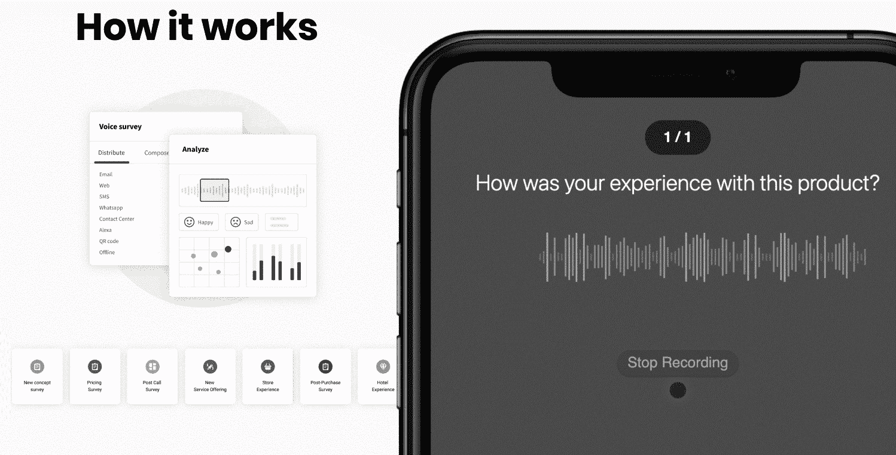

# 第十二章：*第十二章*：通过语音调查提供洞察

**语音调查**是客户研究中的最新趋势。这是因为它们简单、快速且容易执行。

与传统的（且昂贵的）文本调查不同，文本调查往往回应率低、答案不完整，语音调查被证明能够获得高响应率和深入的回答。它们可以仅凭一个想法和模板，迅速创建。

这就是为什么语音调查迅速成为产品创新的新标准。而且因为它们可以非常快速和容易地部署，任何规模的公司都可以使用语音调查与用户互动并收集反馈——比以往更快速地改进他们的产品。

在本章中，我们将学习如何使用 Commerce.AI 语音调查来实现以下目标：

+   轻松地与您的客户互动

+   改善您的产品供应

+   提升客户忠诚度

有了这些知识，您将能够开始使用语音调查来快速改善您的产品创新工作流程。这样，您将能够通过使产品团队轻松将客户反馈纳入工作流程，从而获得竞争优势。让我们从客户反馈生命周期的起点——与客户互动开始吧。

# 轻松地与您的客户互动

在这一部分，我们将解释如何利用 Commerce.AI 语音调查轻松与客户互动，通过快速创建和部署客户调查问卷，使用我们易于使用的模板。我们还将向您展示如何将调查结果应用到您的产品创新策略和工作流程中。

特别是，我们将看看如何使用这七个语音调查模板：

+   产品特性优先级排序

+   新服务提供

+   购买后调查

+   酒店体验

+   商店体验

+   通话后调查

+   定价调查

我们从探索最受欢迎的语音调查类型之一——产品特性优先级排序调查开始。

## 产品特性优先级排序

产品团队总是寻找让他们的产品变得更好的方法，特别是他们总是寻找改进**用户体验**（**UX**）的机会。不幸的是，产品团队往往希望和客户实际需求之间存在很大的差距。

这就是优先级排序发挥作用的地方。**优先级排序**本质上是在决定首先、其次、第三次要构建哪些功能，或者完全不构建！如果没有任何正式的流程或结构化的标准，产品团队可能会感到困难。这时，**产品优先级排序调查**就显得特别有用。它们是产品团队收集用户反馈的快速而简便的方式，同时也帮助识别哪些功能应该获得下一步的最高优先级。

这种方法有两个主要好处：

+   它使用户能够提供宝贵的反馈，帮助团队进行优先级排序。

+   您有机会在开始构建新产品之前观察用户的反应，这可能会节省时间和金钱。

例如，假设你是一家消费电子品牌，你正在开发一款新产品——可能是一款新智能手机。智能手机市场竞争激烈，用户似乎想要一切：大电池、多镜头高质量相机、窄边框、防水、快速充电，等等。

你已经考虑过这些功能，但你知道你需要选择其中的几个，以提供最佳的用户体验。否则，你的产品资源将被拉得很薄，每个功能的质量也难以保证。

产品功能优先级调查会让你了解用户最关心哪些功能。你将能够看到哪些功能最受欢迎，甚至可能会发现一些新的使用案例，供团队考虑。

接下来，让我们更仔细地了解一下你为什么可能想要进行产品功能优先级调查，它是如何运作的，以及谁会参与这些调查。

### 产品功能优先级调查的目的是为了什么？

这类调查非常有用，因为它直接让客户参与到你的产品开发过程中。你不再单纯地花时间研究竞争对手的产品，或是凭空想出点子，而是可以利用现有的客户洞察，确保你的创意是基于人们实际需求的。

它还直接为你提供来自你所了解的真实人物的数据——也就是已经在市场上的实际买家。这是无价的，因为它让你准确了解人们的需求，他们对功能的看法，以及其他无法仅通过研究竞争对手获得的洞察。

那些未能获得此类反馈的公司可能最终会制造出无法满足用户需求的产品，并错失提升品牌忠诚度的宝贵机会。例如，一家大型消费电子公司最近更新了其笔记本电脑系列，增加了用户多年来一直要求的所有功能。由于花费了很长时间才交付这些功能，他们受到了批评，认为他们基本上在不断地重复构建同一款笔记本电脑。一项产品功能优先级调查本可以提前发现这些改进机会。

### 产品功能优先级调查是如何运作的？

Commerce.AI 平台中的调查模板被设计成让团队可以快速轻松地根据客户反馈识别出下一个需要构建的功能。格式简单，你提供的信息将帮助你为团队优先考虑产品积压。

一旦用户完成了调查，AI 系统将分析用户的回答和偏好，以及任何现有的市场研究或竞争分析。这将帮助你清晰地了解你应该优先开发哪些功能，第二，第三，以此类推。

这些调查可以直接通过 Shopify 等平台发送给客户，这也是一些大型电子商务公司与客户直接沟通的方式。由于客户是你业务的命脉，你应该始终争取从他们那里获取反馈。如果不这样做，你可能会发布没人想要的新功能。

### 谁会参加产品功能优先级调查？

你可以将调查发送给已经使用过你产品或服务的客户，或者发送给潜在客户。你也可以使用调查来征求公司内部员工的意见，如设计师和开发人员。

在征求团队意见时，你应该给他们一个机会，提供关于他们当前正在开发或有兴趣开发的特定功能的反馈。

## 新的服务提供

在计划提供新服务或产品时，了解目标客户的需求以及他们面临的风险和挑战至关重要。结构化的客户研究方法有助于团队为产品提供基础，找到早期采用者，并获得有助于未来服务开发的洞察。

了解潜在客户的一种方式是通过进行客户访谈，这是获得用户动机和行为的宝贵工具。然而，进行个别访谈可能会昂贵且耗时。此外，定性研究方法如观察和分析常常只能得出有限的结果，因为它们生成的可操作洞察较少，无法为服务创新生命周期提供指导。

为了克服这些挑战，许多组织现在将语音调查作为理解客户需求和偏好的主要方法。语音调查允许你以最低的成本接触大量受众。

让我们看几个具体的例子。假设你经营一家餐厅连锁店，并希望了解客户偏好的点餐方式。你可以进行个别访谈，但这将是昂贵且耗时的。

或者，你可以发送一份简短的语音调查，这样你可以以更低的成本接触更多的客户，且只需几分钟就能完成。你还可以利用调查结果来指导新功能的开发，这些功能可能会改善客户体验并增加收入。

另一个例子是零售商店希望通过语音调查了解客户最感兴趣购买的商品。然后，商店可以利用这些信息开发新的产品系列，并在结账通道推广这些商品。

这将有助于商店增加销售额，同时为客户提供额外价值。正如你所看到的，语音调查为服务团队提供了一个强大的工具，用于开发符合客户需求的产品和服务，同时增加收入。

### 为什么语音调查对新服务的推出至关重要

服务行业正面临来自各个方面的挑战。服务团队面临的一些最大挑战包括：

+   电子商务的兴起

+   即时满足的需求

+   COVID-19 大流行

+   竞争加剧

电子商务的兴起不仅扰乱了产品公司，甚至许多传统的服务行业，如航空公司、酒店和餐馆。

这在很大程度上是因为人们正在远离与服务提供商的面对面互动。鉴于如今人们在网上花费的时间越来越多，这一现象也加速了。

电子商务的兴起也在其他方面改变了顾客与品牌的互动方式——例如，在客户支持方面。顾客现在期望对他们的问题和关切得到即时回应，否则他们会选择去其他地方寻求帮助或建议。

此外，今天的顾客期望即时满足。当航空旅客不得不等待超过 30 分钟才与客服代表通话时，可能会感到沮丧。或者当酒店客人需要打三次前台电话才有人回应，结果到了房间发现房间还没有打扫时，也会感到沮丧。

这些挑战，以及顾客的不满，随着 COVID-19 大流行而加剧，顾客比以往任何时候都更加关注清洁、安全和卫生。创造一个能够应对这些关注点的顾客体验，给服务行业带来了前所未有的压力。

它也为新的商业模式和收入来源创造了机会——如果服务提供商能够找到创新的方式来满足这些需求。语音调查是实现这一目标的强大工具。

最后，竞争始终是服务提供商面临的风险之一。为了在顾客心中保持相关性，组织必须通过提供高质量的体验和公平的价格来超越竞争对手。这通常需要不断地投资新产品和服务，而当资源本就紧张时，这可能变得困难。

语音调查为团队提供了直接与顾客互动的机会，讨论他们关心的议题——这种互动可以为服务团队提供宝贵的见解，了解顾客在意的内容，并帮助识别他们需要解决的痛点，如果希望发展业务的话。

## 购买后调查

顾客购买后的一刻至关重要。你现在处于顾客的“主场”，在这里他们有权告诉你他们喜欢或不喜欢你的产品或服务。

为了更好地了解顾客的情绪，企业在顾客购买后会进行离职调查。这通常是面对面的调查，涉及大约六个主要主题：

+   顾客对服务体验的满意度

+   他们是否会再次与这家公司进行业务往来

+   他们有多大可能会向他人推荐这家公司产品或服务

+   他们喜欢和不喜欢产品或服务的地方

+   可以改进的地方

+   如果有任何其他引起他们注意的评论

离职面谈调查通常需要约 10 分钟，并询问个体关于他们体验的简单问题。但要让大多数顾客参与进来并不容易。

离职面谈的一个常见批评是它们具有自我选择性，这意味着只有那些热衷于留下评论的顾客，才有可能抽出时间来完成调查。但即使你获得 1%的参与率，这些数字仍然只是你总顾客群体中的极小一部分。

虽然这些顾客可能比其他顾客更为直言不讳，但也有可能他们并不代表大多数人的意见——因此，仅凭他们的意见可能不足以得出有意义的结论。

Commerce.AI 开发了一个在线工具，团队可以在顾客购买后进行自动化语音调查。顾客已经习惯于与技术自由对话，得益于 Siri 和 Alexa 等语音助手的普及。我们发现，顾客更喜欢这种快速、轻松的反馈方式，而不是繁琐的文本反馈方式。

这使得使用传统离职面谈方法时，响应率有可能呈指数级增长，同时提供更详细且可操作的见解，帮助你了解什么因素推动了顾客满意度，哪些方面需要改进。

有了这个强大的工具，你终于可以集中精力解决顾客对你产品或服务的具体问题或顾虑，从而立即开始改进——这一切都无需给你的团队带来额外负担。

比如，假设你正在销售一系列新的护肤产品。你可以设置一个调查，询问顾客关于你和其他产品的效果，以及他们喜欢和不喜欢使用这些产品的地方。这能帮助你了解是否需要改变配方或添加成分，或者如果库存过剩，可能需要降低价格。

在*图 12.1*中，我们可以看到一个 Commerce.AI 语音调查问题的例子，询问顾客：“*您对这款产品的体验如何？*”。在后台，像自然语言理解这样复杂的技术从顾客的回答中提取洞察，而顾客看到的是一个简单直观的界面：

图 12.1 - Commerce.AI 语音调查的示意图

更具体地说，你可以使用购买后的调查来实现以下目标：

+   了解顾客对你的产品（或服务）的满意度，以及他们与市场上其他类似产品相比的喜好。

+   收集客户服务的反馈意见，以便你能够改进支持流程。

+   确定是否有与购买特定 SKU 或产品变种的顾客相关的模式，或者如果有的话，从这些模式中学习，以帮助提高销售量。

简而言之，语音调查是一种强大的工具，可以帮助你的企业解决顾客问题、改善产品质量，并增加销售额。

## 酒店体验调查

酒店面临着一套独特的挑战和机遇。它们是社交互动、专业网络和商务旅行的核心。然而，由于客户对服务和设施有着较高的期望，酒店的客户群体常常难以吸引。

另一方面，酒店有很好的机会通过数字创新来改善顾客体验。通过正确的工具和策略，数字化转型可以帮助酒店提供独特的价值主张，从而使其在竞争中脱颖而出。

例如，酒店品牌可以通过酒店体验调查获得有关宾客偏好和行为的具体洞察。以下是酒店通过调查获取有意义见解的三种方式。

### 利用数据改善现有产品和服务

调查结果可用于指导产品开发和服务改进，涵盖客房技术、餐饮服务以及整体酒店体验。

例如，酒店可能想了解客人最喜欢其设施中的哪些部分，以便未来在可能的情况下复制这些体验。通过使用这类数据，品牌可以确保他们以新的创造性方式满足客人的需求，同时随着时间的推移增加客户忠诚度。

假设一家酒店想知道客人最喜欢其健身中心的哪些功能。酒店可以利用调查结果来指导其在此领域的投资决策，例如选择能有效吸引用户并确保他们有积极体验的设备。例如，如果结果显示客人更喜欢跑步机而非椭圆机，酒店可能决定投资跑步机。

甚至可以是一些简单的美学改进，比如对健身中心进行小的装饰变化，例如增加艺术作品或更好的照明，帮助客人更享受他们的体验。不管是什么样的改进，语音调查将突出显示客户关心的方面，这样你就可以根据对顾客满意度产生实际影响的地方来分配资源。

### 识别新收入来源的机会

酒店可以利用调查结果来识别新的收入来源。例如，酒店可能发现客人喜欢使用酒店的商务中心，尽管他们并不打算与任何同事会面或参加会议。这可能意味着酒店应当投资更多的会议室，以利用这种行为并将其转化为收入来源。

也许商业中心可以升级为一个现代化、高端的空间，与酒店的其他部分相匹配，并为客人提供 Wi-Fi、舒适的座椅和其他设施。这不仅可以帮助酒店创造额外的收入，还可以让商务旅行者对该品牌更加忠诚——因此，更可能在未来入住该品牌的其他酒店。

通过这样做，你不仅能提高底线，还能同时提高顾客的满意度。

### 确保跨门店的一致性

调查结果还可以用来指导未来的产品发布，甚至是加盟协议（如果适用）。例如，酒店品牌可能想了解客人最喜欢他们酒店的哪些设施，以便尽可能在同一品牌或其他品牌的其他酒店中复制这些体验。

这被称为*平行创新*，它是一种有效的方式，可以在多个品牌之间传播创新，同时确保它们有类似的产品。通过在项目生命周期中使用调查数据，可以确保所有团队在如何最佳实现目标并向客户提供创新产品或服务方面保持一致。

## 门店体验调查

当消费者在线购物或在实体店购物时，他们的体验可能决定是否会完成购买。超过一半的在线消费者表示，零售商提供的糟糕客户服务可能会阻止他们再次购买。

由于任何商店的目标都是推动销售，因此零售商和品牌必须了解哪些因素会影响顾客的购买意图，购物体验如何改进，以及顾客是否对商店或产品本身感到满意。

让我们深入了解一个具体的例子。假设你经营一家比萨连锁店，并刚刚推出了一个新的门店设计。你希望了解顾客是否喜欢新店的外观和感觉。你可以使用 Commerce.AI 门店体验调查来了解新设计中哪些方面最有可能影响顾客的购买意图，顾客对新外观的感受，以及他们是否对整体体验感到满意。这些洞察可以帮助你优先考虑店面重新设计的工作，并确保你在正确的元素上进行投资。

你还可以使用调查来了解客户对新设计中特定方面的感受，例如照明或音乐。例如，如果顾客不喜欢进入比萨店时听到的收银机铃声，你可能需要考虑采用*无噪音*的收银系统。

利用这些数据的另一种方式是识别可能表明需要改进的领域的模式和趋势。例如，如果顾客 consistently 报告对在你比萨店的整体体验不满意，可能是时候投资于重新设计你的点餐流程了。

店铺的整体客户体验有可能推动未来的购买行为，这也是为什么零售商和品牌越来越依赖数据驱动的方法，来了解顾客如何在其实体空间中进行消费。

零售商可以使用如 Commerce.AI 店铺体验调查等分析平台，调查顾客在店内或在线时对店铺本身以及购物体验中各个环节的感受。通过更好地理解影响客户行为和满意度的因素，零售商可以做出明智的投资决策，从而提高客户忠诚度、参与度，最终推动销售。

## 售后调查

联系中心长期以来一直是提供客户支持的主要渠道，而聊天机器人和语音机器人崛起则进一步强化了这一趋势。如今，许多消费者使用联系中心与企业互动，而这些互动往往会促进销售。

当客户拨打电话给企业时——无论是报告订单问题，还是寻求购买帮助——企业应当收集这些信息，以便日后进行洞察。你可以通过进行快速的售后调查来了解出现了什么问题（如果有的话），并寻找改进客户服务体验的方法。这有助于组织通过主动解决问题，防止成本高昂的错误发生。

售后调查还可以提供关于整体客户体验质量的洞察，这可能会影响未来的收入机会（以及损失）。例如，如果你发现客服人员未能妥善跟进问题，那么可能是时候投资自动化报告功能，确保客服人员尽可能地跟进问题——特别是当这影响到你的利润时。

此外，这些洞察可以帮助你在为客户开发新产品或服务时优先考虑工作重点。例如，如果你通过售后调查了解到某些功能对客户的重视程度远高于其他功能，这可以帮助你优先考虑产品路线图的制定。

与店铺体验调查类似，售后调查还可以提供关于客户对服务交付中某些环节（如响应速度或客服人员的知识）感受的洞察。通过更好地理解影响客户行为和满意度的因素，你将能够做出有关投资的明智决策，从而提高客户忠诚度和参与度。

## 定价调查

你产品和服务的定价对企业至关重要。它们可能成为新客户的进入壁垒，影响消费者支付意愿，并向现有客户传递价值信号。

如果你销售的产品或服务定价过低，可能很难从中获得足够的收入来实现盈利。如果你销售的产品或服务定价过高，可能会导致收入和盈利的损失。定价真的非常重要！

话虽如此，定价决策可能是复杂且具有挑战性的。许多公司在定价上遇到困难，因为他们没有合适的工具或流程来设定价格、做出战略调整或预见客户可能的价格异议。

产品创新团队有巨大的机会，通过利用 Commerce.AI 定价调查的洞察来提升他们的定价表现。该调查旨在帮助你理解定价策略，并识别改进的机会。

我们提供了一个模板，你可以用它快速设计自己的定价调查，或者你也可以使用我们预设计的示例来开始。无论哪种方式，我们希望这个模板能够帮助你与客户就定价问题展开互动，并激发你重新思考如何以及在哪里为你的产品和服务设定价格。

### 为什么价格至关重要

为什么你需要了解定价策略？许多公司都有定价策略，但很少有公司围绕定价进行深入讨论。定价最终是关于在商品成本和客户对这些商品和服务的价值之间创造平衡。

能够为你的产品和服务设定价格有助于你确定每个客户细分群体能带来多少收入。它还可以帮助你识别最具盈利性的产品和服务，这些产品和服务可以跨多个业务单元或业务线进行利用。最后，了解定价策略还可以帮助你做出更好的战略决策，投资于新产品和服务。

现在我们已经了解了企业如何在各个领域部署语音调查，接下来让我们探讨如何实施你的发现来改善你的产品和服务。

# 改善你的产品和服务

你的现有产品和服务当然是你业务的基础。但是，如果你像大多数公司一样，你的产品和服务可能会有一些空白。直到现在，实际上没有很好的方法让你了解这些空白。

这就是我们创建语音调查的原因。通过语音调查进行市场研究和分析，你可以深入了解现有的产品和服务，并帮助制定新产品。让我们来探讨如何利用语音调查获取有关现有产品和客户的洞察，以及如何利用这些洞察来改善你的产品和服务。

## 获取有关现有产品的洞察

创建和推出产品只是该产品生命周期的一部分。同样重要的是要了解是什么让它成功或失败。

但是在今天这个快速发展的世界里，即便是经验最丰富的高管也可能没有足够的信息来做出关键的商业决策。因此，当您在现有的市场调研中找不到足够数据时，您需要语音调查。

通过调查问卷回答有关产品的问题，您不仅能收集更多数据，还能洞察客户的真实想法。通过让用户表达他们的想法和感受，您比让他们在文本表单中写下单字回答要更具吸引力。

这些洞察将有助于推动更好的未来产品开发和改进工作——最终提高每项新产品成功的机会。让我们探讨一下，如何运用这种方法来改善当前产品和服务，以及未来的产品。

## 如何利用调查反馈来了解您的客户

在启动任何形式的客户旅程映射项目之前，重要的是要理解您的目标客户的动机，这样您才能制定有助于提高转化率并减少摩擦点的策略。

这就是客户调查派上用场的地方，因为它们让您能够精确定位每个目标受众群体特有的痛点。例如，如果您有一个专注于小企业的**软件即服务**（**SaaS**）产品，那么您的客户可能最关心的是成本和定价。在这种情况下，您将希望在调查中加入有关定价的问题，以便了解您的目标客户关心的事项。

您还应该要求客户通过回答以下问题来评估他们对您产品的满意度：

+   您有多大可能向朋友推荐我们的产品？

+   转换到我们的竞争对手的最常见原因是什么？

+   您希望我们提供哪些功能？

通过这样做，您不仅能够了解当前使用您产品的用户的动机，还能了解潜在的未来用户。这类数据将帮助您改善未来的产品和服务。

## 如何根据这些洞察采取行动

一旦您识别出客户在哪些方面感到痛点或遇到摩擦，便是时候着手解决方案了。但首先，您需要理解*成长的烦恼*与产品根本性问题之间的区别。

如果您的某位调查对象表示他们有一些问题，比如迟到的交货或差劲的客户服务，但他们仍然计划继续购买贵公司的产品，那么这可能是一个成长的烦恼——随着公司扩大以满足需求，这个问题将得到解决。

然而，如果调查对象表示他们对上次购买体验不满意，并且计划永远不再购买贵公司的产品，这就是一个根本性问题——如果贵公司想在当前市场中成功，就必须解决这个问题。

对于产品创新团队来说，好消息是，大多数成长的痛点是可以避免的；这些问题通常是由于缺乏对客户实际需求的理解所导致的。

通过真正了解你的客户，通过调查并仔细倾听他们所说的需求，你将能够兑现你的商业承诺。因此，确保将调查结果分享给公司内部，以便理解客户需求并打造更好的产品，至关重要。

这将帮助从产品经理到数据科学家等各方，更好地理解是什么驱动着客户——以及原因是什么——从而使你能够自信地进行开发，因为你知道自己在使用任何业务中最有价值的资产——你的客户。

## 想出新产品创意

除了从现有产品线中获得洞察外，你还需要考虑可以带入市场的新的产品和服务。话虽如此，新的产品创意确实不容易。而且，你越成功，就越难，因为公司往往会变得自满，避免冒险。

大多数产品是基于客户反馈逐步开发的。这个过程可以反复迭代，每次迭代都在前一次的基础上进行改进。但如果你是一家历史上专注于解决某一个特定问题的公司呢？如果你正在尝试推出一些全新的东西呢？你该如何开始？这些问题常常是让产品团队夜不能寐的原因。

通过 Commerce.AI 语音调查，你可以深入了解客户的痛点以及他们对不同类型产品的期望。

这些信息将帮助你更好地理解目标客户的需求，从而帮助你识别哪些客户最有可能购买你的新产品——同时也能为你的下一步行动提供指导，包括产品开发。我们来通过一个具体的例子来深入探讨，例子中的公司名称已做匿名处理。

### 示例 —— 一家科技初创公司正在开发一款新产品

一家名为 SportFlix 的科技初创公司在 Instagram 和其他社交媒体平台上积累了令人印象深刻的*粉丝群*，他们通过公司的应用程序分享自己最喜欢的体育时刻的照片和视频。这个应用程序还帮助粉丝与他们最喜欢的运动员和团队保持互动——甚至可以通知用户重要事件，比如伤病和阵容变化。

SportFlix 现在正在考虑扩展到其他与观看体育相关的领域，比如玩幻想体育或查看没有现场直播的比赛分数。这将要求公司为不同类型的体育爱好者创造新产品，这些人可能与现有产品的用户有不同的需求。

SportFlix 的团队希望了解不同受众群体最感兴趣的产品类型，以便能够开发出更好地满足这些群体需求的产品。

为了做到这一点，他们需要通过语音调查回答一些问题，以便列出潜在的新产品。以下是团队可能会问的问题：

+   你看哪些体育比赛？

+   你最喜欢的球队和球员是谁？

+   在玩游戏或观看体育比赛时，你喜欢做什么？

+   你多久参加一次幻想体育联赛？

+   是什么激励你使用我们的产品，而不是其他应用？

+   我们现有的产品或未来版本中，是否有任何痛点是我们可以解决的？

通过问这些问题，SportFlix 团队将能够了解目标受众的兴趣和偏好，然后利用这些信息指导未来的产品开发。这将带来更多成功的业务，并提高客户的满意度和留存率。

例如，假设 Commerce.AI 的洞察通过分析调查反馈，发现 SportFlix 的粉丝希望有一款应用，可以在比赛期间与其他粉丝社交，同时查看最新比分。团队可以利用这些信息，帮助他们确定接下来应该在产品中增加哪些功能，甚至是是否应该开发一款全新的应用。

虽然提升产品对于保持竞争力至关重要，但客户忠诚度同样重要。话虽如此，让我们来看一下如何利用语音调查洞察来提高客户忠诚度。

# 提升客户忠诚度

客户忠诚度很重要，因为它帮助公司随着时间的推移不断增长和保持客户。反过来，增长和保持客户群将有助于企业成功——而无法满足客户需求的公司最终会面临忠诚度下降的困境。

事实上，客户忠诚度差会导致高流失率和衰退，这可能导致显著的财务损失，最终使公司走向衰亡。

但客户忠诚度不仅仅是保持现有客户，它还关系到吸引新客户。为了做到这一点，公司必须能够提供真正对目标客户有价值的产品和服务——这意味着要成为了解客户需求的专家。

通过语音调查，你可以直接从消费者那里获取反馈，无论他们身在何处。通过提高响应率和参与度，你可以更好地了解客户及其需求，从而创造出能满足这些需求的产品，进而提升客户忠诚度和客户获取。

关键是让这个过程对消费者和公司员工都尽可能简便。通过使用 Commerce.AI 语音调查，你可以深入了解目标客户的需求，从而帮助你更好地服务他们的需求，同时还可以获得关于他们的宝贵信息，这些信息将有助于吸引未来的新客户。

## 什么驱动客户忠诚度？

提高客户忠诚度对维持高水平的收入增长至关重要。让我们来看一下客户忠诚度的四个主要支柱：

+   生成品牌亲和力和对品牌的积极情感

+   提高购买频率并减少客户流失

+   通过**口碑**（**WOM**）**营销**建立品牌倡导

+   提高现有客户的收入贡献

让我们探索这些支柱，深入理解如何利用语音调查及其他方式来推动客户忠诚度。

### 生成品牌亲和力和对品牌的积极情感

消费者在与公司产品互动时的行为会对他们对品牌的认知产生深远影响，进而影响他们如何将你的品牌与其他品牌进行比较。

如果你经营的是像旅馆这样的接待行业，那么拥有享受入住体验的顾客将帮助你建立品牌亲和力并推动客户保持。顾客的入住质量受多种因素的影响，包括前台员工的响应和礼貌、房间的清洁程度以及他们所消费的食品和饮料的质量。

类似地，如果你经营的是餐厅，享受用餐体验的顾客更有可能将你的生意推荐给他人——他们也更有可能在未来再次光临。

品牌亲和力和积极情感帮助消费者做出购买决策，进而增加品牌忠诚度和购买意图。这就是为什么公司需要认真倾听客户意见；只有这样，你才能理解他们真正的看法以及他们如何将你的公司与行业中的其他品牌进行对比。

语音调查是一种强大的工具，可以帮助你准确了解客户需求，同时也能帮助你建立品牌亲和力并积极影响客户忠诚度。

### 提高购买频率并减少客户流失

增加收入的最佳途径之一是扩大客户基础——而这一切始于通过提高购买频率和减少客户流失来提升客户忠诚度。

当客户感到自己的需求得到满足并且与公司产品和服务的体验积极时，客户忠诚度最高。要实现这一点，你需要确保员工了解什么才算是真正的*满足客户需求*，这包括从产品供应到价格定位和支付选项等方方面面。

这还意味着要发现客户的痛点并提出解决方案，这正是语音调查的作用所在。通过询问客户的痛点，你可以识别他们遇到的困难领域——然后提出解决问题的方法。这有助于减少客户流失并增加客户保持率，因为你的客户更有可能将你的生意推荐给他人。

### 通过口碑营销创建品牌倡导

如果您希望消费者将您的品牌推荐给他们的朋友，那么显而易见，这些朋友将比那些与他们没有关系的人更加信任并尊重这位消费者朋友——这也就意味着传统的*口碑营销*。

询问不同人群最看重某些品牌的哪些特点，或他们与每个品牌的互动频率，将帮助公司判断是否通过口碑（WOM）成功地在目标受众中建立了品牌亲和力。如果没有，可能有改善客户忠诚度的一个方面需要提升。

研究表明，通过口碑（WOM）推荐的客户比通过其他途径（如广告或社交媒体）推荐的客户忠诚度要高得多。这是因为客户信任并尊重他们的朋友，而这些朋友往往会倾向于向他人分享他们与贵公司之间的良好体验。

### 提高现有客户所带来的收入

不言而喻，提高客户保持率是长期增加收入的一个好方法——但它在扩展客户基础方面同样至关重要。

为了帮助增加来自现有客户的收入，您需要确保他们对贵公司的产品和服务感到满意，以及任何将来可能提供的附加产品或服务。

提供卓越的客户服务将极大地帮助消费者感到他们可以信任您和您的品牌——一旦他们信任了，便更容易与他人分享他们对您的品牌的正面情感。

从客户的角度来看，这意味着更多的问题得到了有效解决，这可能导致更高的客户忠诚度。最终，语音调查是提升客户忠诚度的强大工具，涵盖其每个支柱。

# 总结

在本章中，我们了解到语音调查如何帮助公司深入了解客户的需求、期望和担忧。通过回答关于他们痛点或最看重某些品牌或产品的哪些特点的问题，消费者能为您提供有价值的信息，这些信息可以帮助您开发新产品或改进现有产品。

通过使用 Commerce.AI 的语音调查，各种类型的企业都能获得有关目标市场的可操作性见解——并利用这些信息更好地理解客户，以便在未来几年持续增长和改进。

无论您经营的是酒店连锁、多个商店、软件公司，还是其他行业，语音调查都是了解市场并更好地服务客户的强大工具。

正如你所学到的，Commerce.AI 平台是机器学习和大数据的强大结合，可以应用于产品和服务团队的创新需求。该平台提供了一套集成的分析和人工智能能力，可帮助更好地理解客户需求和偏好，预测未来趋势，并优化产品和服务组合。我们鼓励你运用所学知识进行创新，并考虑 Commerce.AI 如何帮助你的组织。
