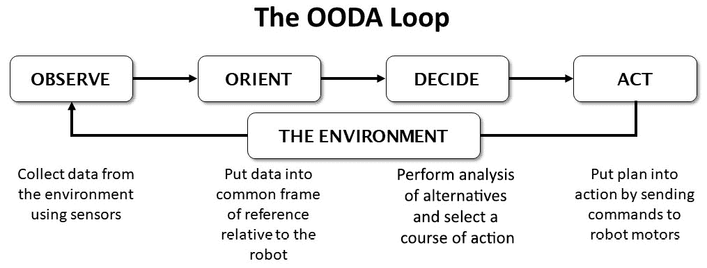
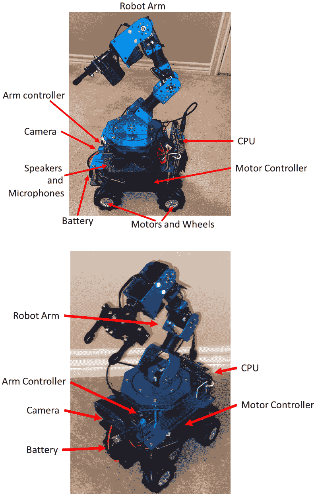
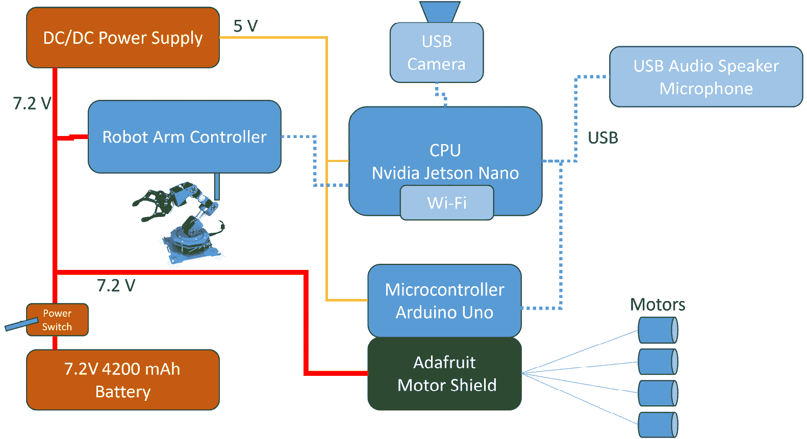
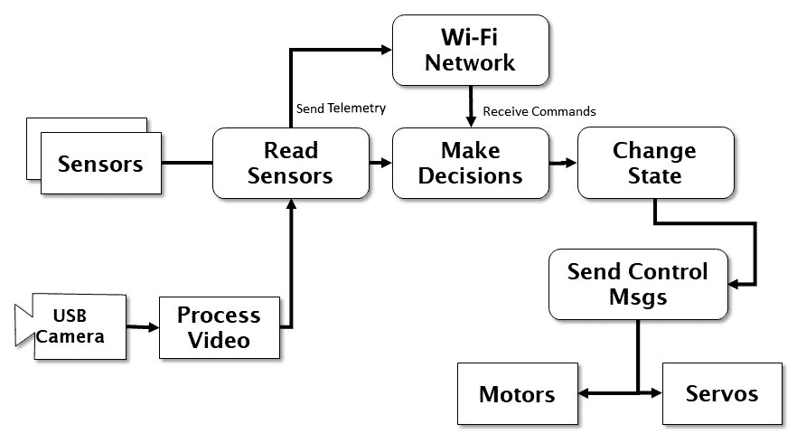
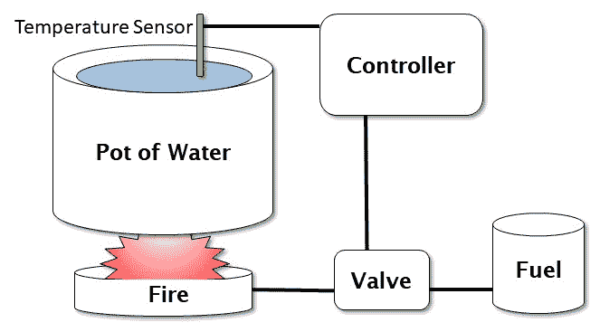
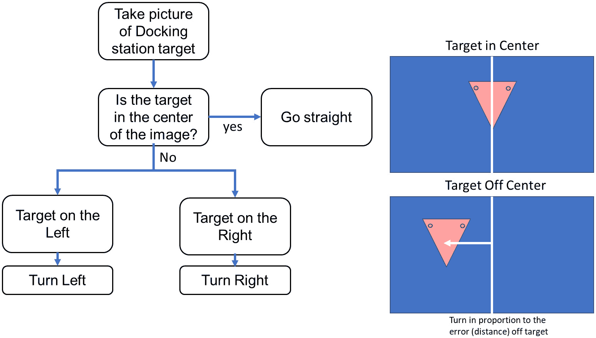
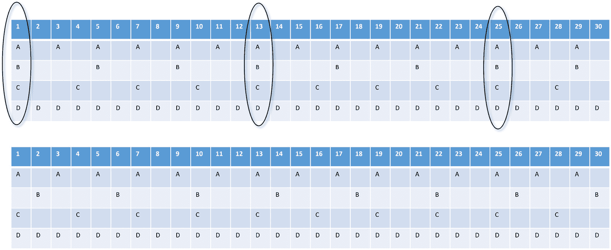
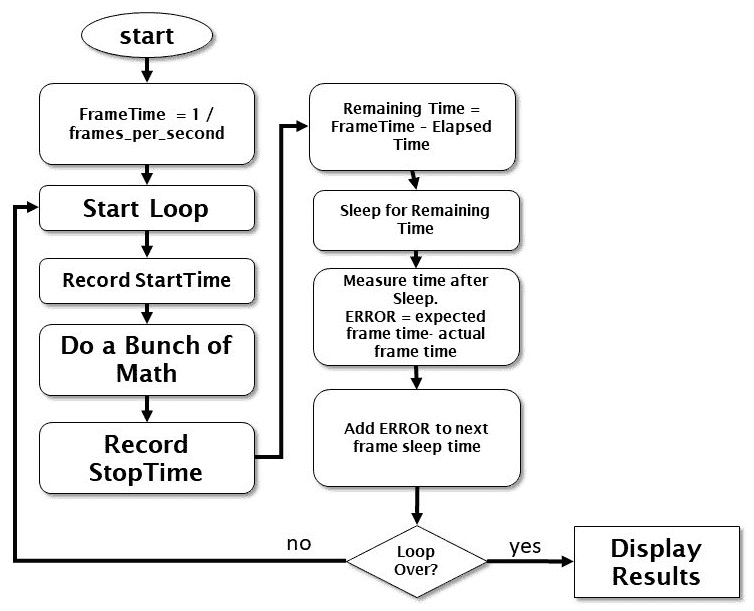
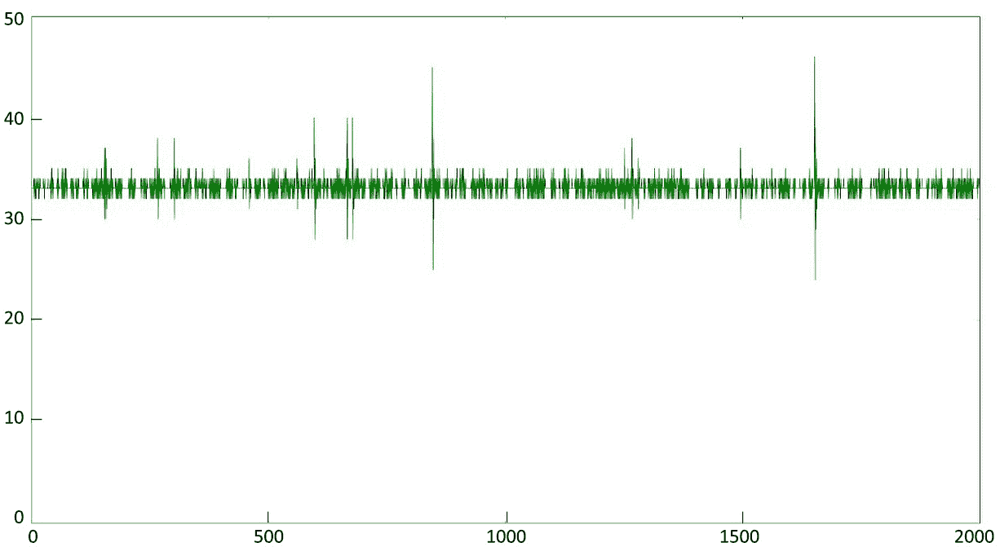

# 第一章：机器人和人工智能的基础

在这本书中，我邀请你和我一起踏上旅程，发现如何将**人工智能**（**AI**）添加到移动机器人中。我所说的**AI机器人**和更**常规机器人**之间的基本区别是机器人和其软件根据传感器提供的数据做出决策、学习和适应其环境的能力。更具体地说，我们正在告别预先编码的机器人设计的世界。我们不是预先编程所有机器人的行为，而是机器人（更准确地说，是机器人软件）将从我们提供的示例或与外部世界的交互中学习。机器人软件不会像我们用来训练人工智能系统的数据那样控制其行为。

人工智能机器人将利用其学习过程对环境以及如何实现目标进行预测，然后利用这些预测来创建行为。在我们的旅途中，我们将尝试几种人工智能的形式，包括监督学习和无监督学习、强化学习、神经网络和遗传算法。我们将创建一个能够交谈并理解命令（以及讲笑话）的数字机器人助手，并为我们的机器人创建一个**人工个性**（**AP**）。我们将学习如何教会我们的机器人无地图导航、通过试错法抓取物体，以及三维视觉。

在本章中，我们将涵盖以下关键主题：

+   机器人和人工智能的基本原理

+   什么是人工智能和自主性（以及它不是什么）？

+   人工智能的近期发展有什么新内容吗？

+   什么是机器人？

+   介绍我们的示例问题

+   何时需要为你的机器人使用人工智能？

+   介绍机器人和我们的开发环境

# 技术要求

完成本章任务的技术要求在本书的**前言**中有描述。

本书的所有代码都可在GitHub仓库中找到，网址为[https://github.com/PacktPublishing/Artificial-Intelligence-for-Robotics-2e/](https://github.com/PacktPublishing/Artificial-Intelligence-for-Robotics-2e/)。

# 机器人和人工智能的基本原理

将人工智能应用于**机器人开发**需要你，即机器人设计师或开发者，具备不同的技能。你可能之前制作过机器人。你可能有一个四旋翼无人机或3D打印机（实际上，它也是一个机器人）。熟悉的**比例-积分-微分**（**PID**）控制器、传感器循环和状态机的世界被**人工神经网络**（**ANNs**）、专家系统、遗传算法和搜索路径规划器所增强。我们希望机器人不仅仅是对其环境做出反射性反应，而是有目标和意图——并且能够学习和适应环境，并且是被教导或训练而不是被编程的。通过这种方式我们可以解决的问题可能在其他情况下是困难的、难以处理的或不可能的。

在这本书中，我们要介绍一个问题——在游戏室里捡起玩具——我们将用它作为全书的例子，当我们学习一系列将人工智能应用于我们机器人的技术时。重要的是要理解，在这本书中，过程远比目的地更重要。在书的结尾，你应该获得一些具有广泛适用性的重要技能，而不仅仅是学会如何捡起玩具。

我们要做的第一件事是提供一些工具和背景，以匹配书中开发例子所使用的基础设施。这是为了提供一个公平的竞争环境，并且不假设你具备任何实际知识。为了执行我们将要构建的一些高级神经网络，我们将使用Jetson中的GPU。

在本章的剩余部分，我们将讨论一些关于机器人和人工智能的基础知识，然后继续开发我们将用于本书其余部分所有例子的两个重要工具。我们将介绍软实时控制的概念，然后提供一个框架或模型，称为**观察-定位-决策-行动**（**OODA**）循环，以为我们机器人创建自主性。

# 人工智能和自主性（以及它不是什么）是什么？

人工智能的定义是什么？一般来说，它意味着一种表现出某些智能特征的机器——思考、推理、规划、学习和适应。它也可以指一种可以模拟思考或推理的软件程序。让我们尝试一些例子：一个通过简单规则（如果障碍物在右边，就向左走）避开障碍物的机器人不是人工智能。一个通过示例学习在视频中识别猫的程序是人工智能。一个由操纵杆操作的机器人手臂不使用人工智能，但一个能够适应不同物体以便捡起它们的机器人手臂是人工智能的应用。

你必须了解人工智能机器人的两个定义特征。首先，人工智能机器人主要是**训练**来完成任务的，通过提供示例，而不是一步一步地进行编程。例如，我们将通过用玩具的外观示例训练神经网络来教机器人的软件识别玩具——我们希望它捡起的东西。我们将提供一组包含玩具的图片的训练集。我们将特别标注图像中哪些部分是玩具，机器人将从中学习。然后我们将测试机器人，看看它是否学到了我们希望它学到的，这有点像老师测试学生。第二个特征是**涌现行为**，其中机器人表现出没有明确编程进它的演变行为。我们为机器人提供了一种本质上非线性且自组织的控制软件。机器人可能会突然对某个事件或情况表现出一些奇怪或异常的反应，这可能会显得奇怪、古怪，甚至带有情感。我曾与一辆自动驾驶汽车合作，我们确信它有细腻的情感，移动得非常优雅，因此给它起了昵称“费迪南德”，这个名字来自一部卡通片中敏感、爱花的公牛，这在九吨重的卡车上显得很奇怪，因为卡车似乎喜欢植物。这些行为只是各种软件组件和控制算法的交互作用的结果，并不代表任何更多的事情。

你在人工智能领域会听到的一个概念是**图灵测试**。图灵测试是由艾伦·图灵在1950年提出的，在一篇题为《计算机与智能》的论文中。他假设一个人类审问者会询问一个隐藏的、看不见的人工智能系统，以及另一个人类。如果提出问题的人类无法分辨出哪个人是计算机，哪个人是人类，那么那个人工智能计算机就通过了测试。这个测试假设人工智能将能够完全具备倾听对话、理解内容并给出与人类相同类型答案的能力。当前的**人工智能聊天机器人**可以轻松通过图灵测试，你可能在本周已经与人工智能在电话中互动了几次，而自己却没有意识到。

来自**人工智能协会**（**AAAI**）的一个小组提出，对于人工智能来说，可能一个更合适的测试是组装平板家具——使用提供的说明书。然而，到目前为止，还没有任何机器人通过这个测试。

本书的目标不是通过图灵测试，而是采用一些新颖的方法，利用机器学习、规划、目标寻求、模式识别、分组和聚类等技术来解决问题。许多这些问题用其他方法解决起来都非常困难。能够通过图灵测试的人工智能软件将是一个**通用人工智能**的例子，或者是一个完整、工作的人工智能大脑，就像你一样，通用人工智能不需要专门训练来解决任何特定问题。到目前为止，通用人工智能尚未被创造出来，但我们所拥有的只是**窄人工智能**或模拟在非常狭窄的应用中思考的软件，例如识别物体，或者挑选购买的好股票。

虽然我们在本书中**不是**构建通用人工智能，这意味着我们不会担心我们的创造物会发展出自己的思维或失去控制。这来自科幻小说和糟糕电影的领域，而不是今天计算机的现实。我坚信，任何宣扬人工智能**弊端**或预测机器人将统治世界的人可能都没有看到人工智能研究在解决一般问题或创造类似实际智能的东西方面的悲观状态。

# 人工智能最近的发展有什么新意吗？

“过去的事必将重演，做过的事必将再做，太阳之下并无新事”——《传道书》1:9，《詹姆斯国王圣经》

人工智能的现代实践并非新鲜事物。其中大部分技术都是在20世纪60年代和70年代开发的，但由于当时的计算设备不足以处理软件的复杂性或所需的计算量，这些技术逐渐失去了人们的青睐。它们只等待计算机变得更强大，以及另一个非常重大的事件——**互联网**的发明。在之前的几十年里，如果你需要10,000张猫的数字化图片来编译一个数据库以训练神经网络，这项任务几乎是不可能的——你可以拍摄很多猫的照片，或者从书中扫描图像。今天，通过谷歌搜索猫的图片，0.44秒内就能返回1亿2600万个结果。找到猫的图片，或者任何其他东西，只需搜索一下，你就有了一个用于训练神经网络的训练集——除非你需要训练一个非常特定的对象集合，而这些对象恰好不在互联网上，正如我们将在本书中看到的，在这种情况下，我们又将使用另一种现代工具，而不是60年代就能找到的工具，那就是数码相机。非常快速的计算机、廉价的、丰富的存储以及几乎无限的数据访问的结合，催生了人工智能的复兴。

另一项现代发展发生在计算机光谱的另一端。虽然现在任何人都可以在家中的桌子上拥有我们过去称之为超级计算机的东西，但智能手机的发展推动了一系列创新，这些创新正在技术领域感受到。你可能会对智能手机的加速度计和陀螺仪感到惊奇，这些是由称为**微机电系统**（**MEMS**）的微小硅芯片制成的。它还配备了一个高分辨率但非常小的数码相机和一个多核计算机处理器，运行时所需的电量很少。它还包含（可能）三个无线电——一个Wi-Fi无线网络、一部移动电话和一个蓝牙发射接收器。尽管这些部件在使你的iPhone变得有趣使用方面做得很好，但它们也进入了为机器人提供的部件中。这对我们来说很有趣，因为过去只有研究实验室和大学才能使用的东西，现在可以出售给个人用户。如果你恰好有一个大学或研究实验室，或者为拥有数百万美元开发预算的技术公司工作，你也会从这本书中学到一些东西，并找到希望激发你的机器人创作或为新产品带来令人兴奋功能的有用工具和想法。

现在你已经熟悉了机器人AI的概念，让我们看看机器人实际上是什么。

# 机器人是什么？

词语**机器人**是从捷克作家卡雷尔·恰佩克的戏剧《R.U.R*》中进入现代语言的，这部戏剧于1920年出版。“Roboti”是捷克语，意为“强制劳动”。在这部戏剧中，一个工业家学会了如何制造人造人——不是机械的、金属的人，而是由肉体和血液构成，并且是从工厂中完全成长起来的。将名称*R.U.R*翻译成“罗素通用机器人”（Rossum’s Universal Robots）将词语**机器人**介绍给了世界。

为了这本书的目的，机器人是一种能够感知和对其环境做出反应的机器，并且具有某些人类或动物般的职能。我们通常认为机器人是一种自动的、自我指导的移动机器，能够与环境互动。也就是说，机器人具有**物理形态**并表现出某种形式的**自主性**，即根据对外部环境的观察做出自己决策的能力。

接下来，让我们讨论这本书中我们将试图解决的问题。

# 我们的示例问题——清理这个房间！

在这本书的过程中，我们将使用一个我认为大多数人都能轻松相关联的问题集，同时仍然代表了对经验丰富的机器人学家的真正挑战。我们将使用人工智能和机器人技术来在我孙子辈访问后清理我家的玩具。你刚才听到的那个声音是观众中专业机器人工程师和研究人员的惊呼声——这是一个难题。为什么这是一个难题，为什么它适合这本书？

让我们讨论这个问题，并对其进行一些分解。稍后，在[*第二章*](B19846_02.xhtml#_idTextAnchor032)中，我们将进行完整任务分析，学习如何编写用例，并创建故事板来开发我们的方法，但我们可以从这里开始，做一些一般性的观察。

机器人设计师首先从环境开始考虑——机器人将在哪里工作？我们将环境分为两类：结构化和非结构化。一个结构化环境，比如FIRST机器人竞赛的赛场（这是美国高中生建造的机器人竞赛，所有赛场在比赛前都是已知的），装配线或实验室工作台，都有一个有组织的空间。你可能听说过这样的话：“物有所归，物归其位”——这就是**结构化环境**。另一种思考方式是，我们事先知道一切的位置或去向。我们知道物体的颜色、它们在空间中的位置以及它们的形状。这种类型的信息被称为**先验知识**——我们事先知道的事情。在机器人领域，对环境的先验知识有时是绝对必要的。装配线机器人期望零件以精确的位置和方向到达，以便抓取并放置到正确的位置。换句话说，我们已经安排好世界以适应机器人。

在我的房子这个世界上，这根本不是一种选择。如果我能让我的孙子孙女每次都把玩具放在完全相同的地方，那么我们就不需要机器人来完成这个任务。我们有一套相对固定的物体——他们只有这么多玩具可以玩。我们偶尔会添加一些东西或丢失玩具，或者有些东西从楼梯上掉下来，但玩具是固定物体集合的一部分。它们不是以任何特定的方式定位或定向的——它们只是孩子们玩完回家后留下的地方。我们还有一套固定的家具，但有些部分会移动——脚凳或椅子可以移动。这是一个**非结构化环境**，在这个环境中，机器人和软件需要适应，而不是玩具或家具。

问题是要让机器人绕着房间行驶并拿起玩具。以下是这个任务的一些目标：

+   我们希望用户通过**与机器人交谈**来与机器人**互动**。我们希望机器人能够理解我们希望它做什么，也就是说，我们给出的命令的意图是什么。

+   一旦被命令开始，机器人将必须**识别一个物体**是玩具还是不是玩具。我们只想拿起玩具。

+   机器人必须**避免危险**，最重要的是一楼下去的楼梯。机器人特别容易遇到负面障碍（悬崖、台阶、悬崖、楼梯等），这正是我们这里的情况。

+   一旦机器人找到玩具，它必须确定如何用其机器人手臂**拿起**玩具。它可以直接抓住物体，还是必须用勺子挖起，或者推它？我们预计机器人会尝试不同的方法来拿起玩具，并且可能需要多次尝试和错误。

+   一旦玩具被机器人手臂拿起，机器人需要将玩具**携带**到玩具箱。机器人必须识别房间中的玩具箱，记住它的位置以便于重复行程，然后定位自己将玩具放入箱子。再次强调，可能需要多次尝试。

+   在玩具被放下后，机器人将返回到**巡逻房间**寻找更多的玩具。希望最终能够找回所有的玩具。它可能需要询问我们，人类，房间是否可以接受，或者是否需要继续清洁。

我们将从这个问题中学到什么？我们将利用这个背景来检验各种人工智能技术和工具。本书的目的是教会你如何使用机器人开发人工智能解决方案。这里的关键信息是过程和方法，而不是问题，也不是我为本书开发的机器人。我们将展示如何制作一个能够学习和适应其环境的移动机器。我预计你们会根据自己的兴趣和需求挑选和阅读章节，并且按照自己的顺序，因此每一章都将是一个独立的课程。

前三章是基础材料，通过建立问题和提供坚实的框架来支持本书的其余部分。

## 机器人学基础

本书中的所有章节或主题并不都被认为是*经典*的人工智能方法，但它们确实代表了处理机器学习和决策问题的不同方式。我们将一起探讨以下主题：

+   **控制理论和时间管理**：我们将通过理解控制理论和时间管理来为机器人控制建立一个坚实的基础。我们将使用一种软实时控制方案，我称之为**基于帧的控制循环**。这项技术有一个复杂的名字——**速率单调调度**——但我认为你会发现这个概念直观且易于理解。

+   **OODA循环**：在最基本层面上，人工智能是机器人做出行动决策的一种方式。我们将介绍一个来自美国空军的决策模型，称为**OODA循环**。它描述了机器人（或人）是如何做出决策的。我们的机器人将有两个这样的循环，一个是内部循环或**内省循环**，另一个是向外看的**环境传感器循环**。较低的内部循环比较慢的外部循环优先级更高，就像你身体自主的部分（如心跳、呼吸和进食）比你的任务功能（如去上班、付账单和修剪草坪）优先级更高一样。这使得我们的系统成为一种**吸收架构**，这是一种由麻省理工学院的罗德尼·布鲁克斯（Rodney Brooks）命名的生物启发式控制范式，他是iRobot和Rethink Robotics的创始人之一，也是Baxter机器人的设计者。



图1.1 – 我版本的OODA循环

注意

OODA循环是由约翰·博伊德上校（Col. John Boyd）发明的，他也被称作*F-16之父*。博伊德上校的思想至今仍被广泛引用，他的OODA循环被用来描述机器人人工智能、军事规划和营销策略，具有同等效用。OODA提供了一个模型，说明了与环境互动的思考机器可能的工作方式。

我们机器人工作的方式不是简单地按步骤执行命令或指令，而是通过设定目标然后努力实现这些目标。机器人可以自由地设定自己的路径或决定如何到达目标。我们会告诉机器人*拿起那个玩具*，然后机器人会决定是哪个玩具，如何进入范围，以及如何拿起玩具。如果我们，作为人类机器人拥有者，试图将机器人当作遥控手来对待，我们就必须给机器人提供许多单独的指令，例如*向前移动*、*向右移动*、*伸出手臂*、*张开手*，每个动作都要单独给出，而且不向机器人说明我们为什么要做出这些动作。在以目标为导向的结构中，机器人会知道哪些物体是玩具，哪些不是，并且它会知道如何找到玩具箱以及如何把玩具放入箱中。这就是自主机器人和遥控无线电操作设备之间的区别。

在设计我们机器人和其软件的具体细节之前，我们必须将其能力与环境以及它必须解决的问题相匹配。本书将介绍一些设计机器人和管理软件开发的工具。我们将使用系统工程领域的两个工具来完成这项任务——**用例**和**故事板**。我会尽可能使这个过程简化。更高级的系统工程类型被NASA、航空航天公司和汽车公司用于设计火箭、汽车和飞机——这让你尝到了那些类型结构化过程的味道。

## 本书使用的技术

以下各节将逐步详细说明将人工智能技术应用于机器人问题的示例：

+   我们从**物体识别**开始。我们需要我们的机器人能够识别物体，并将它们分类为*玩具*（需要拾起）或*非玩具*（需要留下）。我们将使用经过训练的**人工神经网络（ANN**）从不同角度和光照条件下识别来自视频摄像头的物体。我们将使用**迁移学习**的过程来扩展现有的物体识别系统，**YOLOv8**，以便快速且可靠地识别我们的玩具。

+   下一个任务，一旦识别出玩具，就是将其拾起。为机器人手臂编写一个通用的*拾起任何东西*程序是一个困难的任务，涉及大量的高等数学（使用互联网查找*逆运动学*来了解我的意思）。如果我们让机器人自己解决这个问题会怎样呢？我们使用**遗传算法**，允许机器人发明自己的行为，并学会自己使用手臂。然后我们将使用**深度强化学习（DRL**）让机器人自己学习如何使用末端执行器（机器人的手）抓取各种物体。

+   我们的机器人需要理解其所有者（我们）的命令和指示。我们使用**自然语言处理（NLP**）不仅是为了识别语音，而且是为了理解我们的意图，以便让机器人创建符合我们期望的目标。我们使用一种我称之为*填空法*的巧妙技术，允许机器人从命令的上下文中进行推理。这个过程对于许多机器人规划任务都很有用。

+   机器人的下一个问题是导航房间，同时避开楼梯和其他危险。我们将结合一种独特的、无地图的导航技术与由特殊立体相机提供的3D视觉，以看到并避开障碍物。

+   机器人需要能够找到玩具箱来存放物品，以及拥有一个用于未来移动规划的一般框架。我们将使用**决策树**进行路径规划，并讨论**剪枝**或快速拒绝不良计划。如果你想象一下计算机国际象棋程序算法必须做什么，提前几步考虑，并在选择策略之前对好走和坏走的步骤进行评分，这将给你一个关于这种技术力量的概念。这种类型的决策树有许多用途，可以处理许多策略维度。我们将将其用作找到放置玩具的路径的两种方法之一。

+   我们的最后任务需要使用一套在机器人技术中不常用，或者至少不是以我们即将使用的方式使用的工具。

    我有五个可爱、有才华、令人愉快的孙子孙女，他们喜欢来拜访。在整个书中，你将听到很多关于他们的故事。最大的孙子今年10岁，患有自闭症，我的孙女，第三个孩子，8岁，以及最小的男孩，6岁，也是我写这篇文章的时候。我向我的大孙子威廉介绍了这个机器人——他立刻想和它交谈。他问，“你叫什么名字？”和“你做什么？”当机器人没有回应时，他感到失望。所以对于孙子孙女们，我们将为机器人开发一个执行简短对话的引擎——我们将创建一个与孩子互动的机器人个性。威廉对这个机器人还有一个要求——他希望它能讲并回应“敲门”笑话，所以我们将使用这个作为特殊对话的原型。

虽然在机器人或AI领域，开发具有真实情感的机器人远远超出了当前的技术水平，但我们可以通过有限状态机和一些蒙特卡洛建模来模拟拥有个性。我们还将为机器人提供一个人类交互的模型，这样机器人就会考虑到孩子的情绪。我喜欢将这种类型的软件称为**AP**，以区别于我们的AI。AI构建思考模型，而AP为我们的机器人构建情感模型。

既然你已经了解了我们将在本书中解决的问题，让我们简要讨论一下你何时以及为什么可能需要为你的机器人使用AI。

# 你什么时候需要为你的机器人使用AI？

我们通常将AI描述为一种模拟或模拟过程的技术，它模仿我们的大脑如何做出决策。让我们讨论AI如何在机器人中应用，以提供可能难以通过**传统**编程技术实现的能力。其中之一是识别图像或图片中的对象。如果你将相机连接到计算机，计算机接收到的不是图像，而是一系列代表像素（图像元素）的数字。如果我们试图确定某个特定对象，比如玩具，是否位于图像中，那么这可能相当棘手。你可以找到形状，比如圆形或正方形，但熊玩具呢？此外，如果熊玩具是倒置的，或者平躺在表面上呢？这是AI程序可以解决的问题，而其他任何方法都无法解决。

我们创建机器人行为传统的方法是确定我们想要的函数，并编写代码来实现它。当我们有一个简单的函数，比如绕过障碍物时，这种方法效果很好，我们只需稍作调整就能得到结果。

人工智能和机器学习在机器人领域的例子包括：

+   **NLP**：使用AI/ML让机器人理解和回应自然的人类语言和命令。这使得与机器人的交互更加直观。

+   **计算机视觉**：使用AI让机器人看到并识别物体或人脸，读取文本等。这有助于机器人在现实世界环境中运行。

+   **运动规划**：AI可以帮助机器人规划最优路径和动作，以避开障碍物和人群。这使得机器人的动作更加高效和类似人类。

+   **强化学习**：机器人可以通过使用AI强化学习算法通过试错来学习如何完成任务，并提高完成任务的能力。这意味着需要的显式编程更少。

主要的指导原则是在你想要机器人在一个复杂、动态的真实世界环境中稳健地执行任务时使用AI/ML。AI赋予它更多的感知和决策能力。

现在我们来看一下这个机器人需要的一个功能——识别一个物体是玩具（需要被拿起）还是不是。通过编程创建这样一个标准功能相当困难。常规的计算机视觉过程将图像分离成形状、颜色或区域。我们的问题是玩具没有可预测的形状（圆形、方形或三角形），它们没有一致的颜色，而且大小也不一样。我们更愿意教机器人什么是玩具，什么不是。这就是我们如何对待人的。我们只需要一个过程来教机器人如何使用相机来识别特定的物体。幸运的是，这是AI领域已经深入研究的一个领域，已经有技术可以完成这项任务，我们将在[*第4章*](B19846_04.xhtml#_idTextAnchor126)中使用这些技术。我们将使用**卷积神经网络**（**CNN**）从相机图像中识别玩具。这是一种**监督学习**，我们使用示例向软件展示我们想要识别的对象类型，然后创建一个定制的函数，根据图像中代表它的像素来**预测**对象的类别（或类型）。我们将应用的一个AI原则是**逐步学习**，使用**梯度下降**。这意味着我们不会试图一次性让计算机学习一项技能，而是逐步训练它，通过观察错误（或损失）并做出小的调整，温和地训练一个函数输出我们想要的结果。我们使用梯度下降的原则——观察错误变化的斜率——来确定调整训练的方向。

你可能会想，到这个时候，“如果那适用于学习分类图片，那么也许它可以用来分类其他事物”，你会是对的。我们将使用类似的方法——使用略有不同的神经网络——来教机器人通过识别声音来回应它的名字。

所以，总的来说，我们什么时候需要在机器人中使用AI呢？当我们需要模拟某种难以或无法通过程序步骤（即编程）创建的决策过程时。很容易看出，神经网络是动物思维过程的模拟，因为它们是神经元交互的（大大）简化模型。其他AI技术可能更难以理解。

一个可能的主题是，人工智能始终使用**示例编程**作为技术，用通用框架替换代码，用数据替换变量。我们不再使用**过程编程**，而是通过展示软件我们想要的结果，让软件想出如何达到那个结果。因此，对于使用图片进行**物体识别**，我们提供物体的图片以及图片所代表的物体类型的答案。我们反复这样做，并通过修改代码中的参数来训练软件。

我们可以用人工智能创造的另一种行为类型与行为有关。有很多任务可以被视为游戏。我们可以轻松想象它是如何工作的。假设你希望你的孩子们捡起他们房间里的玩具。你可以命令他们这样做——这可能有效也可能无效。或者，你可以通过为每个捡起的玩具奖励积分，并根据得分多少给予奖励（比如给一美元）来将其变成一个游戏。我们通过这样做增加了什么？我们增加了一个**指标**，或测量工具，让孩子们知道他们做得怎么样——一个积分系统。更重要的是，我们为特定的行为增加了奖励。这可以是一个我们可以用来修改或创建机器人行为的流程。这正式称为**强化学习**。虽然我们不能给机器人一个情感上的奖励（因为机器人没有欲望或需求），但我们可以编程让机器人寻求最大化奖励函数。然后我们可以使用调整参数以改变奖励的相同流程，看看这是否会提高得分，然后要么保留这个变化（当学习导致更多奖励时，我们的强化），要么如果得分下降就放弃它。这种类型的流程对机器人运动和机器人手臂的控制非常有效。

我必须告诉你，这本书中提出的任务——在非结构化环境中捡起玩具——没有人工智能技术几乎是不可能完成的。可以通过修改环境来完成，比如在玩具上放置RFID标签，但除此之外不行。那么，这本书的目的就是——展示某些任务，这些任务在没有人工智能和机器人技术的情况下难以或无法解决，如何通过人工智能和机器人的结合来完成。

接下来，让我们讨论本书中我们将使用的机器人和开发环境。

# 介绍机器人和我们的开发环境

这是一本关于机器人和人工智能的书，所以我们真的需要一台机器人来用于所有的实际示例。正如我们将在[*第二章*](B19846_02.xhtml#_idTextAnchor032)中详细讨论的那样，我选择了普通读者可以接触到的机器人硬件和软件。具体品牌和类型并不重要，自从五年前第一版出版以来，我已经对阿尔伯特进行了相当大的升级。为了保持内容的时效性，我们将所有硬件细节都放在了这本书的GitHub仓库中。

如下两张不同角度拍摄的照片所示，我的机器人配备了新的全向轮、一个六自由度的机械臂和一台电脑大脑：



图1.2 – 阿尔伯特机器人有轮子和机械臂

我会称它为*阿尔伯特*，因为它需要某种名称，而且我喜欢它对维多利亚女王丈夫阿尔伯特亲王的引用，他因对他们的九个孩子照顾得非常好而闻名。他的九个孩子都长大成人，这在维多利亚时代是罕见的，他还有42个孙子孙女。他以他的中间名为人所知；他的真实名字是弗朗西斯。

本书中的任务主要集中在室内空间捡起玩具，因此我们的机器人有一个坚固的底盘，配备四个电机和全向轮，以便在地毯上行驶。我们的转向方法是坦克式，或差速驱动，通过向轮电机发送不同的命令来进行转向。如果我们想直行，我们将所有四个电机设置为相同的向前速度。如果我们想倒退，我们将两个电机以相同的量反转。转向是通过将一侧向前移动而另一侧向后移动（这使得机器人原地转向）或通过给一侧比另一侧更多的向前驱动来实现。我们可以用这种方式进行任何类型的转向。全向轮还允许我们做一些其他的技巧——我们可以将车轮转向彼此并直接向侧面移动，甚至可以在指向地面上同一位置的同时旋转。我们主要会像卡车或汽车一样驾驶，但偶尔会使用`Y`轴运动来对齐。说到轴，我会用`x`轴表示机器人将直线前进，`y`轴指的是从一侧到另一侧的水平移动，而`z`轴是上下移动，这是我们机器人手臂所需要的。

为了捡起玩具，我们需要某种机械臂，所以我包括了一个六轴机器人臂，它模仿了肩部-肘部-腕部-手部的组合，非常灵巧，而且由于它是由标准数字伺服电机制成的，所以连接和编程都非常简单。

Albert机器人的主要控制器是英伟达Nano**单板计算机（SBC**），它通过USB Wi-Fi闪存盘与操作员通信。Nvidia与Arduino Mega 2560微控制器和电机控制器通信，我们将使用它通过**脉冲宽度调制（PWM**）脉冲来控制电机。以下图显示了机器人的内部组件：



图1.3 – 机器人框图

我们将主要关注英伟达Nano单板计算机，它是我们机器人的大脑。我们将一次性设置其余组件，并在整本书中不会更改它们。

英伟达Nano作为我们控制站（运行Windows的PC）和机器人本身通过Wi-Fi网络之间的主要接口。几乎任何基于Linux的低功耗单板计算机（SBC）都可以执行这项任务，例如BeagleBone Black、Odroid XU4或英特尔爱迪生。Nano的一个优点是它可以使用其**图形处理单元（GPU**）来加速神经网络的处理。

连接到SBC的是带有电机控制器的Arduino。Nano通过一个被指定为串行端口的USB端口进行通信。我们还需要一个5V稳压器，将从11.1V可充电锂离子电池组提供适当的电源到机器人。我的电源包是一个可充电的3S1P（三节串联，一节并联）2700Ah电池（通常用于四旋翼无人机），并附带适当的充电器。与任何锂离子电池一样，遵循电池组附带的所有说明，并在发生火灾时在金属箱或容器中充电。

## 软件组件（ROS、Python和Linux）

我将再次指导您查看Git仓库，以查看运行机器人的所有软件，但我会在这里介绍基础知识以提醒您。正如我们所说，机器人的基础操作系统是运行在Nvidia Nano SBC上的Linux。我们使用ROS 2将所有各种软件组件连接在一起，并且它还出色地处理了所有那些棘手的网络任务，例如设置套接字和建立连接。它还附带了一个功能强大的库，我们可以直接利用，例如操纵杆接口。ROS 2不是一个像Linux或Windows那样控制整个计算机的真正操作系统，而是一个通信、接口标准和实用程序的骨干，这使得组装机器人变得更加简单。我喜欢为这种类型的系统起名为**模块化开放式系统架构**（**MOSA**）。ROS 2使用**发布/订阅**技术将数据从一个地方移动到另一个地方，这真正地将产生数据（如传感器和摄像头）的程序与使用数据（如控制和显示）的程序解耦。我们将制作很多自己的东西，并且只使用少数ROS函数。Packt有几本关于学习ROS的出色书籍；我最喜欢的是《*有效的ROS机器人编程*》。

在本书中，我们将使用一种编程语言，除了少数几个小例外，那就是**Python**。Python是这种用途的绝佳语言，原因有两个：它在与ROS结合使用时在机器人社区中得到了广泛的应用，同时也在机器学习和人工智能社区中得到了广泛的认可。这种双重优势使得使用Python变得无法抗拒。Python是一种解释型语言，它对我们来说有三个惊人的优势：

+   **可移植性**：Python在Windows、Mac和Linux之间非常便携。通常，如果你使用操作系统中的函数，如打开文件，只需进行一行或两行的更改即可。Python可以访问大量的C/C++库，这也增加了它的实用性。

+   **无需编译**：作为解释型语言，Python不需要编译步骤。我们在这本书中开发的一些程序相当复杂，如果我们用C或C++编写，每次我们做出更改时都需要10或20分钟的构建时间。你可以用那么多时间做很多事情，你可以用这些时间让你的程序运行，而不是等待*make*过程完成。

+   **隔离**：这是一个很少被提及的好处，但鉴于我有很多与机器人相关的操作系统崩溃的经验，我可以告诉你，Python解释器与核心操作系统隔离的事实意味着你的Python ROS程序崩溃计算机是非常罕见的。计算机崩溃意味着需要重新启动计算机，也可能丢失所有用于诊断崩溃所需的数据。我有一个从Python迁移到C++的专业机器人项目，结果操作系统崩溃开始发生，这大大降低了我们机器人的可靠性。如果一个Python程序崩溃，另一个程序可以监控它并重新启动它。如果操作系统崩溃，没有额外的硬件帮助你按下*重置*按钮，你几乎无能为力。

在我们深入到基础控制系统的编码之前，让我们谈谈我们将用于创建一个健壮、模块化和灵活的机器人控制系统的理论。

## 机器人控制系统和决策框架

如我在这章前面提到的，我们在接下来的几节中将要使用两组工具：**软实时控制**和**OODA循环**。前者为我们提供了一个基础，使我们能够轻松且一致地控制机器人，而后者为机器人的自主性提供了基础。

### 如何控制你的机器人

机器人工作的基本概念，尤其是那些用于驱动的机器人，是简单的。存在一个主控制循环，它反复执行相同的事情——从传感器和电机控制器读取数据，寻找操作员（或机器人的自主功能）的指令，根据这些指令对机器人的状态进行任何更改，然后向电机或执行器发送指令以使机器人移动。



图1.4 – 机器人控制循环

上述图表说明了我们如何在机器人的软件和硬件中实现OODA循环。机器人可以自主行动，或者通过无线网络接受连接的控制站的指令。

我们需要始终以一致的方式执行这个控制循环。我们需要设置一个基本帧率或基本更新频率，以设定控制循环的时间。这使得机器人的所有系统一起工作。如果没有某种形式的时间管理器，机器人的每个控制周期完成所需的时间都不同，任何路径规划、位置估计或手臂运动都会变得非常复杂。ROS本身是非同步的，因此不提供时间管理器；如果需要，我们必须自己创建一个。

### 使用控制循环

为了控制我们的机器人，我们必须建立某种控制或反馈回路。假设我们告诉机器人向前移动12英寸（30厘米）。机器人必须向电机发送命令以开始前进，然后有一种机制来测量12英寸的行程。我们可以使用多种方法，但让我们只使用一个时钟。机器人每秒移动3英寸（7.5厘米）。我们需要控制回路开始移动，然后在每个更新周期，或通过回路的每次时间，检查时间并查看是否已经过去了四秒钟。如果已经过去了，那么它就向电机发送一个**停止**命令。计时器是**控制**，四秒钟是**设定点**，电机是受控的**系统**。这个过程还生成一个误差信号，告诉我们应用什么控制（在这种情况下，停止）。让我们看看一个简单的控制回路：



图1.5 – 样本控制回路 – 维持水壶的温度

根据前面的图示，我们希望**水壶**中的温度保持恒定。**阀门**控制由**火焰**产生的热量，从而加热**水壶**。**温度传感器**检测水是否过冷、过热或恰到好处。控制器使用这些信息来控制阀门以产生更多热量。这种类型的方案被称为**闭环****控制系统**。

你也可以将这个过程视为一个过程。我们开始这个过程，然后获取反馈来显示我们的进度，以便我们知道何时停止或修改过程。我们可能在进行速度控制，需要机器人以特定的速度移动，或者进行指向控制，机器人指向或转向特定的方向。

让我们看看另一个例子。我们有一个带有自充电对接站的机器人，顶部有一组**发光二极管**（**LEDs**）作为光学目标。我们希望机器人直接驶入对接站。我们使用摄像头来观察对接站上的目标LED灯。摄像头生成一个误差信号，用于引导机器人向LED灯移动。LED灯之间的距离也给我们提供了到对接站的大致距离。这个过程在下图中展示：



图1.6 – 自停靠充电站的目标跟踪

让我们更详细地了解一下：

+   假设图中的LED灯在中心左侧的50%处关闭，并且机器人到目标物的距离是3英尺（1米）。我们将这个信息通过控制回路发送到电机——稍微向左转并向前行驶一点。

+   我们再次检查，LED灯更接近中心（40%），到目标物的距离是2.9英尺或90厘米。我们的误差信号略小，距离也略小。我们将不得不开发一个**缩放因子**来确定多少像素等于多少**转速**，这以全功率的百分比来衡量。由于我们使用的是固定的摄像头和镜头，这将是一个常数。

+   现在我们在这个更新周期中给电机发送一个更慢的转动和移动。我们最终正好在中心，当我们接触到对接站时，速度变为零。

对于那些正在说“但是如果你使用PID控制器……”的人，是的，你是对的——你也知道我刚刚描述了一个`P`或**比例**控制方案。我们可以添加更多的功能来帮助防止机器人由于自身的重量和惯性而超出或低于目标，以及抑制由这些超出引起的振荡。

**PID控制器**是一种使用三种类型输入来管理闭环控制系统的控制系统。**比例控制**使用检测到的误差的倍数来驱动控制。

例如，在我们的水壶中，我们测量温度的误差。如果期望的温度是100°C，而我们用温度计测量到90°C，那么温度误差就是10°C。我们需要通过打开阀门按比例增加热量。如果误差是0，那么值的改变也是0。假设我们尝试通过将阀门值改变10%来应对10°C的误差。因此，我们将10°C乘以0.01来设置我们的阀门位置为+0.1。这个0.01值是我们的`P`项或**比例常数**。

在我们的下一个示例中，我们看到我们的锅温现在是93°C，我们的误差是7°C。我们将阀门位置更改为+0.07，略低于之前。我们可能会发现，由于水的滞后性，使用这种方法，我们可能会超过期望的温度——因为水加热需要一段时间，这会在响应中造成延迟。最终，我们可能会过度加热水并超过期望的温度。防止这种情况的一种方法是在PID控制器的*`D`*项，即**导数**项。你还记得导数描述的是函数线的斜率——在这种情况下，我们测量的温度曲线。我们温度图的`Y`轴是时间，所以我们有*温度变化/时间变化*。为了在我们的控制器中添加一个`D`项，我们还添加了上一次样本误差和这次样本误差之间的差异（-10 – (-7) = -3）。我们通过将这个值乘以一个常数`D`来添加到我们的控制中。积分项只是误差乘以一个常数的累积总和，我们可以称之为`I`。我们可以修改`P`、`I`和`D`常数来调整（调谐）我们的PID控制器，以提供适当的响应，以控制回路——没有超调、欠调或漂移。更多解释请参阅[https://jjrobots.com/pid/](https://jjrobots.com/pid/)。这些示例的目的是指出机器控制的概念——我们必须进行测量，将它们与我们的期望结果进行比较，计算误差信号，然后多次每秒进行任何控制修正，并且持续这样做是实时控制的概念。

#### 控制回路类型

为了以一致的时间间隔执行我们的控制回路（或者使用正确的术语，确定性地），我们有两种控制程序执行的方法：**软实时**和**硬实时**。硬实时控制系统需要计算机硬件的帮助——这就是标题中“硬”的部分的由来。硬实时通常需要一个**实时操作系统**（**RTOS**）或对处理器中所有计算机周期的完全控制。我们面临的问题是，运行操作系统的计算机始终被其他进程、线程链、上下文切换和执行任务所中断。你在桌面计算机或甚至智能手机上的经验是，启动相同的过程，如启动文字处理程序，每次启动时似乎总是需要不同的时间。

在实时系统中，我们需要提前确切知道一个进程将花费多长时间，甚至到微秒级别，这种行为是无法容忍的。你可以很容易地想象，如果我们为飞机创建了一个自动驾驶仪，它不是管理飞机的方向和高度，而是不断地被磁盘驱动器访问或网络调用中断，这些调用会破坏控制循环，导致平稳的飞行或跑道上的着陆，会出现什么问题。

实时操作系统（RTOS）系统允许程序员和开发者完全控制进程何时以及如何执行，以及哪些例程可以中断以及中断多长时间。RTOS系统中的控制循环在每次循环中总是消耗相同数量的计算机周期（因此是时间），这使得当输出至关重要时，它们既可靠又可信赖。重要的是要知道，在硬实时系统中，硬件强制执行时间约束，并确保计算机资源在需要时可用。

我们实际上可以在Arduino微控制器中实现硬实时，因为它没有操作系统，一次只能执行一个任务或运行一个程序。我们的机器人也将拥有一个更强大的处理器，即运行Linux的Nvidia Nano。这台计算机拥有一些真正的实力，可以同时执行多项任务以支持操作系统，运行网络接口，将图形发送到输出HDMI端口，提供用户界面，甚至支持多个用户。

软实时是一种更为宽松的方法，更适合我们的游戏室清洁机器人，而不是一个安全关键的硬实时系统——此外，RTOS可能很昂贵（有开源版本）并且需要特殊培训。我们将要做的是将我们的控制循环视为一个反馈系统。我们将在每个循环的末尾留出一些额外的空间——比如说大约10%——以便操作系统完成其工作，这应该会给我们留下一个执行在恒定时间间隔上的一致控制循环。就像我们刚才讨论的控制循环示例一样，我们将进行测量，确定误差，并对每个循环应用校正。

我们不仅担心我们的更新速率。我们还必须担心**抖动**，即由于操作系统被中断并执行其他操作而引起的定时循环中的随机变化。中断会导致我们的定时循环变长，导致周期时间的随机跳跃。我们必须设计我们的控制循环来处理软实时中一定量的抖动，但这些事件相对较少。

#### 运行控制循环

实际上运行控制循环的过程相当简单。我们首先初始化计时器，它需要是高分辨率时钟。我们用Python编写控制循环，所以我们将使用`time.time()`函数，该函数专门设计用来测量我们内部程序的时间性能（设置帧率，执行循环，测量时间，生成错误，睡眠以纠正错误，循环）。每次我们调用`time.time()`，我们都会得到一个浮点数，这是从Unix时钟以来的秒数，并且具有Nvidia Nano上的微秒级分辨率。

这个过程的理念是将我们的处理分成一组固定的时间间隔，我们称之为**帧**。我们做的所有事情都将适合在整数的帧数内。我们的基本运行速度将以每秒30 **帧**（**fps**）的速度处理。这就是我们将更新机器人的位置估计、读取传感器和向电机发送命令的速度。我们还有运行速度低于30 fps的其他函数，因此我们可以将它们均匀地分配到帧之间。一些函数每帧运行一次（30 fps）并且每帧被调用和执行。

假设我们有一个只能每秒更新10次的声纳传感器。我们每隔三帧调用一次**读取声纳**函数。我们将所有函数分配为基本30 fps帧率的倍数，因此如果我们每帧调用函数，我们将有30 fps、15 fps、10 fps、7.5 fps、6 fps、5 fps、4.28 fps、2 fps和1 fps。我们甚至可以做到小于1 fps – 每隔60帧调用一次的函数每2秒执行一次。

困难之处在于我们需要确保每个过程都适合在一个帧时间内完成 – 这相当于1/30秒或0.033秒或33毫秒。如果过程需要更长的时间，我们必须将其分成几个部分，或者在一个单独的线程或程序中运行，这样我们可以在一个帧中开始过程，并在另一个帧中得到结果。尝试平衡帧也很重要，以便不是所有的处理都落在同一个帧上。以下图显示了基于30 fps基本速率的任务调度系统。在这里，我们有四个任务需要处理：任务`A`以15 fps运行，任务`B`以6 fps运行（每五帧一次），任务`C`以10 fps运行（每三帧一次），任务`D`以30 fps运行（每帧一次）：



图1.7 – 基于帧的任务调度

我们对调度表的第一遍（图的最上方）显示所有四个任务在帧1、13和25上落在同一个帧上。如果我们像图的下半部分所示的那样在第二帧延迟任务`B`的开始，我们可以改善控制程序负载的平衡。

这类似于音乐中的度量方式，其中度量是一定的时间，不同的音符有不同的间隔——一个全音符每度量只能出现一次，一个二分音符可以出现两次，一直到最后是64分音符。就像作曲家确保每个度量有正确数量的拍子一样，我们也可以确保我们的控制循环在每个帧中执行平衡的度量过程。

让我们先写一个小程序来控制我们的定时循环，并让你玩这些原则。

这很令人兴奋——我们第一次一起编写代码。这个程序只是演示了我们将在主机器人控制程序中使用的定时控制循环，并且在这里让你可以玩一些参数并查看结果。这是我认为可能的最简单的软时间控制循环版本，所以请随意改进和装饰它。我已经为你制作了一个流程图，以帮助你更好地理解：



图 1.8 – 软实时控制器流程图

让我们更仔细地看看前面图中使用的术语：

+   **帧时间**：我们分配给执行循环一次迭代的时间

+   **开始时间**：循环/帧开始时

+   **进行大量数学运算**：你正在管理的程序

+   **停止时间**：帧完成时

+   **剩余时间**：已过时间与期望帧时间的差

+   **已过时间**：实际运行一次循环所需的时间

+   **帧睡眠时间**：我们使用**剩余时间**来告诉计算机睡眠，以便帧正好花费我们想要的时间。

现在，我们将开始编码。这是一段相当直接的Python代码——我们不会在后面变得复杂：

1.  我们首先导入我们的库。我们首先从`time`模块开始并不奇怪。我们还将使用`numpy`（Python数值分析）中的`mean`函数和`matplotlib`来在最后绘制我们的图表。我们还将进行一些数学计算来模拟我们的处理并创建对帧率的负载：

    ```py
    import time
    from numpy import mean
    import matplotlib.pyplot as plt
    import math
    #
    ```

1.  现在我们有一些参数来控制我们的测试。这是你可以尝试不同定时的地方。我们的基本控制是`FRAMERATE`——我们想要尝试每秒更新多少次？让我们从`30`开始，就像我们在之前讨论的例子中做的那样：

    ```py
    # set our frame rate - how many cycles per second to run our loop?
    FRAMERATE = 30
    # how long does each frame take in seconds?
    FRAME = 1.0/FRAMERATE
    # initialize myTimer
    # This is one of our timer variables where we will store the clock time from the operating system.
    myTimer = 0.0
    ```

1.  测试的持续时间由`counter`变量设置。测试将花费的时间是`FRAME`时间乘以`counter`中的循环次数。在我们的例子中，2,000帧除以30 fps等于66.6秒，或者略超过一分钟来运行测试：

    ```py
    # how many cycles to test? counter*FRAME = runtime in seconds
    counter = 2000
    ```

    我们将以两种方式控制我们的定时循环：

    +   我们将首先测量执行此帧计算所需的时间。我们有一个带有一些我们将调用的三角函数的示例程序，以向计算机添加负载。例如，机器人控制函数，如计算机器人臂所需的角，需要大量的三角运算。这可以从程序头部的`import math`中获取。

注意

我们将测量控制函数运行的时间，这将占用我们帧的一部分。然后我们计算我们帧剩余的部分，并告诉计算机在这段时间内睡眠此进程。使用`sleep`函数释放计算机去处理操作系统中的其他事务，这是一种比运行某种紧密循环来浪费我们帧剩余时间更好的标记时间的方法。

+   我们控制循环的第二种方式是通过测量整个帧的时间——计算时间加上休息时间——并查看我们是否超出了或低于帧时间。我们使用`TIME_CORRECTION`为此功能调整睡眠时间，以考虑睡眠函数的变异性以及从操作系统返回的任何延迟：

    ```py
    # factor for our timing loop computations
    TIME_CORRECTION= 0.0
    ```

1.  我们将在程序结束时收集一些数据来绘制一个抖动图。我们使用`dataStore`结构来完成这项工作。让我们在屏幕上放一个标题来告诉您程序已经开始，因为完成它需要一段时间：

    ```py
    # place to store data
    dataStore = []
    # Operator information ready to go
    # We create a heading to show that the program is starting its test
    print "START COUNTING: FRAME TIME", FRAME, "RUN TIME:",FRAME*counter
    ```

1.  在这一步，我们将设置一些变量来测量我们的时间。正如我们提到的，目标是有一系列计算帧，每个帧的长度都相同。每个帧有两个部分：`myTime`是帧的*顶部时间*，即帧开始时的时间。`newTime`是工作周期计时器的结束。我们使用`masterTime`来计算程序运行的总时间：

    ```py
    # initialize the precision clock
     myTime = newTime = time.time()
     # save the starting time for later
     masterTime=myTime
     # begin our timing loop
     for ii in range(counter):
    ```

1.  这个部分是我们的**有效载荷**——执行工作的代码部分。这可能是臂角计算、状态估计或命令解释器。我们将插入一些三角函数和一些数学运算，让CPU为我们做一些工作。通常，这个*工作*部分是我们帧的大部分，所以让我们重复这些数学术语1,000次：

    ```py
        # we start our frame - this represents doing some detailed 
        math calculations
        # this is just to burn up some CPU cycles
        for jj in range(1000):
              x = 100
              y = 23 + ii
              z = math.cos(x)
              z1 = math.sin(y)
        #
        # read the clock after all compute is done
        # this is our working frame time
        #
    ```

1.  现在我们读取时钟以找到工作时间。我们现在可以计算出在下一个帧之前需要睡眠进程多长时间。重要的是*工作时间 + 睡眠时间 = 帧时间*。我将称这个为`timeError`：

    ```py
        newTime = time.time()
        # how much time has elapsed so far in this frame
        # time = UNIX clock in seconds
        # so we have to subract our starting time to get the elapsed
        time
        myTimer = newTime-myTime
        # what is the time left to go in the frame?
        timeError = FRAME-myTimer
    ```

    我们在这里向前传递一些来自前一帧的信息。`TIME_CORRECTION`是我们对前一帧时间中任何时间错误的调整。我们在开始循环之前将其初始化为零，以避免在这里出现未定义变量错误。我们还进行了一些范围检查，因为我们可能会因为操作系统而得到一些大的抖动，这可能导致如果我们尝试睡眠负时间，我们的睡眠计时器会崩溃：

注意

我们使用Python的`max`函数作为快速将睡眠时间限制为零或更大的方法。它返回两个参数中较大的一个。另一种方法是类似这样的代码：`if a < 0 : a = 0`。

```py
    # OK time to sleep
    # the TIME CORRECTION helps account for all of this clock
    reading
    # this also corrects for sleep timer errors
    # we are using a porpotional control to get the system to
    converge
    # if you leave the divisor out, then the system oscillates
    out of control
    sleepTime = timeError + (TIME_CORRECTION/2.0)
    # quick way to eliminate any negative numbers
    # which are possible due to jitter
    # and will cause the program to crash
    sleepTime=max(sleepTime,0.0)
```

1.  因此，这是我们实际的睡眠命令。`sleep`命令并不总是提供精确的时间间隔，因此我们将检查错误：

    ```py
        # put this process to sleep
        time.sleep(sleepTime)
    ```

1.  这是时间校正部分。我们计算出我们的帧时间总共有多长（工作和睡眠时间）并从我们希望帧时间达到的值（`FrameTime`）中减去。然后我们将时间校正设置为该值。我还会将测量的帧时间保存到数据存储中，这样我们就可以使用`matplotlib`来绘制我们之后的图表。这种技术是Python更有用的特性之一：

    ```py
        #print timeError,TIME_CORRECTION
        # set our timer up for the next frame
        time2=time.time()
        measuredFrameTime = time2-myTime
        ##print measuredFrameTime,
        TIME_CORRECTION=FRAME-(measuredFrameTime)
        dataStore.append(measuredFrameTime*1000)
        #TIME_CORRECTION=max(-FRAME,TIME_CORRECTION)
        #print TIME_CORRECTION
        myTime = time.time()
    ```

    这完成了程序的循环部分。这个例子做了每秒30帧的2000个周期，并在66.6秒内完成。你可以尝试不同的周期时间和帧率。

1.  现在我们已经完成了程序，我们可以制作一个小报告和图表。我们打印出帧时间和总运行时间，计算平均帧时间（总时间/计数器），并显示我们遇到的平均误差，这可以通过平均`dataStore`中的数据来获得：

    ```py
    # Timing loop test is over - print the results
    #
    # get the total time for the program
    endTime = time.time() - masterTime
    # compute the average frame time by dividing total time by our number of frames
    avgTime = endTime / counter
    #print report
     print "FINISHED COUNTING"
     print "REQUESTED FRAME TIME:",FRAME,"AVG FRAME TIME:",avgTime
     print "REQUESTED TOTAL TIME:",FRAME*counter,"ACTUAL TOTAL TIME:", endTime
     print "AVERAGE ERROR",FRAME-avgTime, "TOTAL_ERROR:",(FRAME*counter) - endTime
     print "AVERAGE SLEEP TIME: ",mean(dataStore),"AVERAGE RUN TIME",(FRAME*1000)-mean(dataStore)
     # loop is over, plot result
     # this lets us see the "jitter" in the result
     plt.plot(dataStore)
     plt.show()
    ```

    我们程序的结果在下面的代码块中显示。请注意，平均误差仅为0.00018秒，或者说在33毫秒的帧中只有0.18毫秒：

    ```py
    START COUNTING: FRAME TIME 0.0333333333333 RUN TIME: 66.6666666667
    FINISHED COUNTING
    REQUESTED FRAME TIME: 0.0333333333333 AVG FRAME TIME: 0.0331549999714
    REQUESTED TOTAL TIME: 66.6666666667 ACTUAL TOTAL TIME: 66.3099999428
    AVERAGE ERROR 0.000178333361944 TOTAL_ERROR: 0.356666723887
    AVERAGE SLEEP TIME: 33.1549999714 AVERAGE RUN TIME 0.178333361944
    ```

下图显示了我们的程序计时图：



图1.9 – 我们程序的计时图

图像中的*尖峰*是由操作系统中断引起的抖动。你可以看到程序在相当狭窄的范围内控制帧时间。如果我们不提供控制，随着程序的执行，帧时间会越来越大。图表显示帧时间保持在狭窄的范围内，并不断回到正确的值。

现在我们已经锻炼了我们的编程肌肉，我们可以将这种知识应用到我们的机器人主控制循环中，实现软实时控制。这个控制循环有两个主要功能：

+   响应来自控制站的命令

+   Arduino Mega中与机器人电机和传感器的接口

我们将在[*第7章*](B19846_07.xhtml#_idTextAnchor221)中详细讨论。

# 摘要

在本章中，我们介绍了人工智能的主题，这一主题将在整本书中得到强调。我们确定了人工智能机器人和*普通*机器人之间的主要区别，即人工智能机器人可能是非确定性的。这意味着它可能对相同的刺激有不同的反应，这是由于学习造成的。我们介绍了本书将使用的主题，即在一个游戏室里捡起玩具并将它们放入玩具箱。接下来，我们讨论了人工智能机器人两个关键工具：OODA循环，它为我们机器人如何做出决策提供了一个模型，以及软实时控制循环，它管理和控制我们程序执行的速率。我们在计时循环演示中应用了这些技术，并开始开发我们的主要机器人控制程序。

在下一章中，我们将教机器人识别玩具——我们希望机器人捡起并放回的对象。我们将使用带有视频摄像头的计算机视觉来寻找和识别地板上留下的玩具。

# 问题

1.  缩写*PID*代表什么？这被认为是人工智能软件方法吗？

1.  图灵测试是什么？您觉得这是评估AI的有效方法吗？

1.  您认为为什么机器人会与负向障碍物（如楼梯和坑洼）有问题？

1.  在OODA循环中，*Orient*步骤做什么？

1.  从Python及其优势的讨论中，计算以下内容。您的程序需要测试50次更改。假设每次更改都需要重新编译步骤和一个运行步骤来测试，C Make编译需要450秒，Python `run`命令需要3秒。您在等待编译器时空闲了多少时间？

1.  RTOS代表什么？

1.  您的机器人有以下预定任务：遥测频率为10 Hz，GPS频率为5 Hz，惯性测量频率为50 Hz，电机控制频率为20 Hz。您将如何安排基础任务的频率，以及您将使用什么间隔来安排较慢的任务（例如，10 Hz的基础频率，每三帧一次电机控制，每两帧一次遥测等）？

1.  假设一个帧率调度器最快的任务频率为20 fps，您会如何安排需要以7 fps运行的任务？对于以3.5 fps运行的任务呢？

1.  什么是阻塞调用函数？为什么在像机器人这样的实时系统中使用阻塞调用是不好的？

# 进一步阅读

您可以参考以下资源以获取更多详细信息：

+   *《ROS高效机器人编程 - 第三版》*，作者Anil Mahtani，Luis Sanchez，Enreque Fernandez Perdomo，Packt Publishing，2016

+   *《人工智能机器人导论 - 第二版》*，作者Robin R. Murphy，Bradford Books，2019

+   *《实时调度：从硬实时到软实时系统》*，Palopoli Lipari撰写的一份白皮书，2015 ([https://arxiv.org/pdf/1512.01978.pdf](https://arxiv.org/pdf/1512.01978.pdf))

+   *《改变战争艺术的飞行员：博伊德》*，作者Robert Coram，Little, Brown and Company，2002
