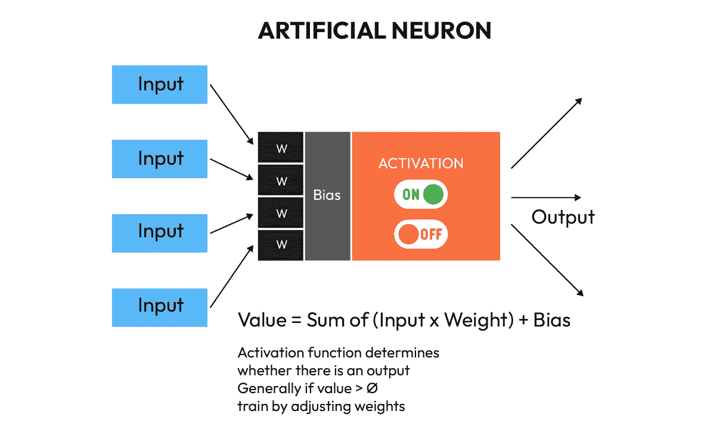

# 第四章：使用神经网络和监督学习识别对象

这是我们将开始将**机器人技术**和**人工智能**（**AI**）结合起来以完成我们在前几章中仔细规划的一些任务的章节。本章的主题是**对象识别** – 我们将教会机器人识别玩具，以便它可以决定要捡起什么，留下什么。我们将使用**卷积神经网络**（**CNNs**）作为机器学习工具，在图像中分离对象、识别它们并在相机帧中定位它们，以便机器人可以找到它们。更具体地说，我们将使用图像来识别对象。我们将拍照，然后查看计算机是否在那些照片中识别特定类型的对象。我们不会识别对象本身，而是识别对象的图像或图片。我们还将围绕对象放置边界框，将它们与其他对象和背景像素分开。

在本章中，我们将涵盖以下主题：

+   图像处理简要概述

+   理解我们的对象识别任务

+   图像处理

+   使用YOLOv8 – 一个对象识别模型

# 技术要求

如果您的机器人还不能行走，您将能够完成本章的所有任务而无需机器人。然而，如果摄像头在机器人上的位置正确，我们将获得更好的结果。如果您没有机器人，您仍然可以使用笔记本电脑和USB摄像头完成所有这些任务。

总体来说，以下是您完成本章任务所需的硬件和软件：

+   硬件：

    +   笔记本电脑

    +   Nvidia Jetson Nano

    +   USB摄像头

+   软件：

    +   Python 3

    +   OpenCV2

    +   TensorFlow

    +   可在[https://github.com/ultralytics/ultralytics](https://github.com/ultralytics/ultralytics)找到的YOLOv8

本章的源代码可在[https://github.com/PacktPublishing/Artificial-Intelligence-for-Robotics-2e](https://github.com/PacktPublishing/Artificial-Intelligence-for-Robotics-2e)找到。

在下一节中，我们将讨论什么是图像处理。

# 图像处理简要概述

大多数人对计算机图像、格式、像素深度甚至卷积都非常熟悉。我们将在以下章节中讨论这些概念；如果您已经了解这些，可以跳过。如果这是新领域，请仔细阅读，因为我们将要做的一切都基于这些信息。

图像在计算机中以**像素**或图像元素组成的二维数组形式存储。每个像素是一个小点。数千或数百万个小点构成了每一幅图像。每个像素是一个或一系列数字，描述了其颜色。如果图像仅是灰度或黑白图像，那么每个像素由一个数字表示，该数字对应于小点的明暗程度。到目前为止，这很简单。

如果图像是彩色图片，那么每个点有三个数字组合起来形成其颜色。通常，这些数字是**红、绿、蓝**（**RGB**）颜色的强度。组合（0,0,0）代表黑色（或所有颜色的缺失），而（255,255,255）是白色（所有颜色的总和）。这个过程称为加色模型。如果你用水彩而不是计算机像素工作，你会知道将你水彩盒中的所有颜色混合在一起会得到黑色——这是一个减色模型。红、绿、蓝是原色，可以用来制作所有其他颜色。由于RGB像素由三种颜色表示，所以实际图像是一个三维数组，而不是二维数组，因为每个像素有三个数字，形成一个（高度，宽度，3）的数组。因此，800 x 600像素的图片将表示为一个（800,600,3）维度的数组，或1,440,000个数字。这有很多数字。我们将非常努力地减少在任何给定时间处理的像素数量。

虽然**RGB**是一组可以描述像素的三个数字，但还有其他描述**颜色公式**的方法，这些方法有各种用途。我们不必使用RGB——例如，我们还可以使用**青色、黄色和品红色**（**CMY**），它们是RGB的互补色，如图*4**.2*所示。我们还可以使用**色调、饱和度和值**（**HSV**）模型来分解颜色，该模型通过色调（颜色的阴影）、饱和度（颜色的强度）和值（颜色的亮度）来分类颜色。HSV是某些计算非常有用的颜色空间，例如将彩色图像转换为灰度（黑白）。要将RGB转换为灰度像素，你必须做一些数学运算——你不能只是拉出一个通道并保留它。RGB到灰度的公式，如**国家电视系统委员会**（**NTSC**）定义的，如下所示：

*0.299*红 + 0.587*绿 + *0.114*蓝

这是因为不同波长的光在我们眼睛中的表现不同，我们眼睛对绿色更为敏感。如果你在HSV颜色模型中有颜色，那么创建灰度图像需要考虑*V*（值）并丢弃*H*和*S*值。正如你可以想象的那样，这要简单得多。这一点很重要，因为在本章中我们将进行大量的图像处理。但在开始之前，在接下来的部分，我们将讨论本章将要执行图像识别任务。

# 理解我们的目标识别任务

让计算机或机器人识别玩具的图像并不像拍两张照片然后说“如果图片 A 等于图片 B，那么是玩具”那么简单。我们需要做大量的工作才能识别出各种随机旋转、散布在不同位置且距离不同的物体。我们可以编写一个程序来识别简单的形状——例如六边形或简单的颜色块——但无法像填充狗玩具那样复杂。编写一个对图像进行某种分析并计算每个可能排列的像素、颜色、分布和范围的程序将极其困难，而且结果将非常脆弱——它会在光线或颜色发生最轻微的变化时失败。

从经验出发，我最近遇到了一个大型机器人，它使用传统的计算机视觉系统来寻找其电池充电站。那个机器人将一个旧、褪色的饮料机误认为是其充电器——让我们说，我不得不去买更多的保险丝。

我们将采取的做法是教机器人识别一组与我们从不同角度拍摄的玩具对应的图像。我们将通过使用一种特殊的**人工神经网络**（**ANN**）来实现这一点，该网络对图像执行卷积操作。它被归类为人工智能技术，因为我们不是通过编写代码来编程软件识别物体，而是训练一个神经网络，使其能够通过如何接近网络训练时学习到的标记像素组来正确地**分割**（从图像的其余部分分离）和**标记**（分类）图像中的像素组。而不是代码决定机器人的行为，而是我们训练网络时所使用的数据来完成这项工作。由于我们将通过提供分割和标记的图像来训练神经网络，因此这被称为**监督学习**。这涉及到告诉网络我们希望它学习的内容，并根据其表现的好坏来强化（奖励）网络。我们将在[*第 8 章*](B19846_08.xhtml#_idTextAnchor235)中讨论**无监督学习**。这个过程涉及到我们不对软件确切地说明要学习的内容，这意味着它必须自己确定这一点。

为了澄清，在本节中，我们将告诉人工神经网络（ANN）我们希望它学习的内容，在本例中是识别我们称之为“玩具”的一类物体，并在这些物体周围绘制边界框。这个边界框将告诉机器人的其他部分玩具是可见的，以及它在图像中的位置。

我将强调我们将使用的独特组件来完成识别图像中玩具的任务。你还记得[*第 3 章*](B19846_03.xhtml#_idTextAnchor043)中的故事板告诉我们做什么吗？


图 4.1 – 识别玩具用例

我们的图像识别器必须确定哪些是玩具，然后在图像中定位它们。这在前面的草图中有说明；标记为玩具的物体周围有圆圈。图像识别器不仅要识别它们是什么，还要识别它们在哪里。

# 图像处理

那么，现在我们有了图像，我们能用它做什么呢？你可能玩过Adobe Photoshop或其他图像处理程序，如GIMP，你知道可以在图像上执行数百种操作、过滤器、更改和技巧。例如，可以通过调整亮度使图像变得更亮或更暗。我们可以增加图像白色部分和黑色部分之间的对比度。我们可以通过应用高斯模糊过滤器使图像变得模糊。我们还可以通过使用如非锐化掩模之类的过滤器使图像（在一定程度上）变得更清晰。你还可以使用边缘检测过滤器，如Canny过滤器，来隔离图像的边缘，其中颜色或值发生变化。我们将使用所有这些技术来帮助计算机识别图像：


图4.2 – 应用到图像上的各种卷积

通过执行这些操作，我们希望计算机软件对图像的大小、拍摄照片的角度或**角度不变性**以及可用的照明，即**照明不变性**不敏感。在计算机视觉系统中，这些都是非常理想的——我们不希望一个AI系统只能从与原始图像相同的角度和距离识别我们的玩具。记住，我们将训练我们的视觉系统根据我们事先拍摄的标记训练图像来识别玩具，机器人将必须根据从训练集中学习到的内容来识别物体。在这里，我们将使用那些主要不基于大小、角度、距离或照明的图像特征。这些特征可能是什么？

如果我们从一个常见的家庭用品，比如一把椅子，从几个角度检查它，那么椅子的哪些部分不会改变？简单的答案是边缘和角落。椅子始终有相同数量的角落，并且我们可以从大多数角度看到一致数量的它们。它也有一致的边缘数量。

承认，这确实是对方法的一种简化的描述。我们将训练我们的神经网络（ANN）在一系列可能或可能不独特于该对象的所有图像特征上，并让它决定哪些有用，哪些无用。我们将通过使用一种通用的图像处理方法，称为**卷积**来实现这一点。

## 卷积

有时，你会遇到一些数学构造，将复杂任务转化为只是一些加法、减法、乘法和除法。几何中的向量就是这样工作的，在图像处理中，我们有**卷积核**。结果是，大多数常见的图像处理技术——边缘检测、角点检测、模糊、锐化、增强等等——都可以通过一个简单的数组结构实现。

很容易理解，在图像中，像素的邻居对像素本身的重要性与像素本身一样重要。如果你要去尝试找到盒子的所有边缘像素，你会寻找一种颜色在一侧，另一种颜色在另一侧的像素。我们需要一个函数，通过比较像素的一侧与另一侧的像素来找到边缘。

卷积核是一个矩阵函数，它将权重应用于像素邻居——或者我们正在分析的像素周围的像素。该函数通常写成这样，作为一个3x3的矩阵：

| -1 | 0 | 1 |
| --- | --- | --- |
| -2 | 0 | 2 |
| -1 | 0 | 1 |

表4.1 – 一个示例卷积核

**Sobel边缘检测**在*Y*方向上表示。这检测上下方向的边缘。每个块代表一个像素。正在处理的像素位于中心。像素两侧的邻居是其他块——顶部、底部、左侧和右侧。为了计算卷积，将相应的权重应用于每个像素的值，通过乘以该像素的值（强度），然后将所有结果相加。如果这幅图像是彩色的——RGB——那么我们将分别对每种颜色进行卷积计算，然后将结果合并。以下是将卷积应用于图像的示例：


图4.3 – Sobel边缘检测卷积的结果

结果图像与原始图像大小相同。请注意，我们只得到边缘作为结果——如果中心像素两侧的颜色相同，它们会相互抵消，我们得到零，或黑色。如果它们不同，我们得到255，或白色，作为答案。如果我们需要一个更复杂的结果，我们也可以使用5x5卷积，它考虑了每侧的两个最近像素，而不仅仅是其中一个。

好消息是，你不必选择要应用于输入图像的卷积操作——我们将构建一个软件前端，它会设置所有的卷积。这个*前端*只是程序的一部分，在开始训练之前设置网络。我们将使用的神经网络包将确定哪些卷积提供了最多的数据并支持我们想要的训练输出。

“但是等等，”我听到你说，“如果像素位于图像的边缘，而我们没有一边的相邻像素怎么办？”在这种情况下，我们必须向图像添加填充——这是一个额外的像素边界，允许我们考虑边缘像素。

在下一节中，我们将深入了解神经网络的内部结构。

## 人工神经元

什么是**神经元**？我们如何将它们组合成网络？如果你能记住你在生物学中学到的知识，一个生物或自然神经元有输入，或树突，将它们连接到其他神经元或传感器输入。所有输入都汇聚到一个中央体，然后通过轴突，或连接，通过其他树突离开，到达其他神经元。神经元之间的连接称为**突触**，这是一个信号必须跳过的微小间隙。神经元接收输入，处理它们，并在达到某个阈值水平后激活或发送输出。**人工神经元**是一种软件构造，它近似于你大脑中神经元的运作方式，是自然神经元的非常简化的版本。它有几个输入，一组权重，一个偏差，一个激活函数，然后作为网络的结果输出到其他神经元，如图所示：



图4.4 – 人工神经元的示意图

让我们详细描述每个组件：

+   **输入**：这是一个从其他神经元或作为网络输入接收的数字或值。在我们的图像处理示例中，这些是像素。这个数字可以是浮点数或整数——但它必须只是一个数字。

+   **权重**：这是我们为了**训练**神经元而改变的可调整值。增加权重意味着输入对我们的答案更重要，同样地，减少权重意味着输入的使用较少。为了确定神经元的值，我们必须组合所有输入的值。随着神经网络的训练，每个输入的权重都会进行调整，这有利于某些输入而牺牲其他输入。我们将输入乘以权重，然后将所有结果相加。

+   **偏差**：这是一个加到权重总和上的数字。偏差防止神经元陷入零，并改善训练。这通常是一个很小的数字。想象一下这样一个场景，一个神经元的所有输入都是零；在这种情况下，权重将没有任何效果。添加一个小偏差允许神经元仍然有输出，网络可以使用这一点来影响学习。没有偏差，输入为零的神经元无法进行训练（改变权重没有效果）并且是**卡住**的。

+   **激活函数**：这决定了神经元输出的值，基于其输入的加权和。最常见类型的是**ReLU（修正线性单元**） – 如果神经元的值小于零，输出为零；否则，输出是输入值 – 以及**S型函数**，这是一个对数函数。激活函数在网络中传播信息，并为神经元的输出引入非线性，这使得神经网络能够逼近非线性函数：


图4.5 – 常见激活函数

+   **输出**：序列神经网络中的每一层都连接到下一层。有些层是完全连接的 – 第一层的每个神经元都与第二层的每个神经元连接。其他层是稀疏连接的。在神经网络训练中有一个常见的流程称为**dropout**，其中我们随机移除连接。这迫使网络为它学习的每一点信息有多条路径，这加强了网络，并使其能够处理更多样化的输入。

+   **输出最大池化**：我们使用一种特殊的网络层（与全连接或稀疏层相比），称为最大池化，其中对应于图像中区域的神经元组 – 比如一个2x2像素块 – 被映射到下一层的单个神经元。最大池化神经元只从四个输入神经元中取最大的值。这具有下采样图像（使其变小）的效果。这允许网络将小特征（如Hot Wheels汽车的轮子）与较大特征（如引擎盖或挡风玻璃）关联起来，以识别玩具车：


图4.6 – 最大池化操作

现在您已经了解了神经网络由什么组成，让我们来探讨如何训练和测试一个神经网络。

## 训练CNN

我想要向您展示本章剩余部分代码中我们将要执行的操作的全过程。请记住，我们正在构建一个卷积神经网络（CNN），它检查视频帧中的像素，并输出图像中是否有一个或多个类似玩具的像素区域，以及它们的位置。以下图表显示了我们将逐步进行神经网络训练的过程：


图4.7 – CNN过程

对于这个任务，我决定使用一个现成的神经网络而不是从头开始构建。有很多好的CNN目标检测器可用，而且说实话，很难改进现有的模型结构。我为这本书选择的是称为**YOLOv8**的模型，其中*YOLO*代表*You Only Look Once*。让我们了解我们如何使用这个模型来完成我们的任务。

# 使用YOLOv8 – 一个目标识别模型

在我们深入YOLOv8模型细节之前，让我们谈谈为什么我选择了它。首先，对于任何我们可能使用的CNN，学习过程基本上是相同的。YOLO是一个强大的开源物体检测模型，背后有许多开发。它被认为是行业最佳，它已经能够完成我们所需要的任务——通过在图像周围绘制边界框来检测物体并显示它们的位置。因此，它告诉我们物体是什么，以及它们在哪里。正如您将看到的，它非常容易使用，并且可以扩展以检测除了它最初训练的类别之外的其他类别的物体。有许多YOLO用户可以提供大量支持，并为我们学习机器人AI物体识别提供了一个很好的基础。

如我在本章开头提到的，我们需要完成两个任务才能达到用机器人捡起玩具的目标。首先，我们必须确定机器人是否可以用它的摄像头检测到玩具（确定摄像头图像中是否有玩具），然后确定它在图像中的位置，这样我们就可以开过去并捡起它。在本章中，我们将学习如何检测玩具，而在[*第7章*](B19846_07.xhtml#_idTextAnchor221)中，我们将讨论我们如何确定距离并导航到玩具。

YOLOv8一次完成两项任务，因此得名。其他类型的物体识别模型，例如我在本书第一版中创建的模型，在图像中识别和定位物体需要两个步骤。首先，它发现图像中存在物体，然后在单独的步骤中确定物体在图像中的位置。这个单独的步骤会使用滑动窗口方法，取图像的一部分，并使用神经网络中的检测部分来表示“是”或“否”，如果该部分包含它所识别的物体。然后，它会将考虑的窗口在图像上滑动并再次测试。这个过程会重复，直到我们有一系列包含检测到的物体的图像部分。然后，一个称为*minmax*的过程会选择包含物体所有可见部分的最小框（min）。

YOLOv8通过结合两个神经网络采取不同的方法——一个检测它被训练来识别的物体，另一个训练根据物体的中心绘制边界框。YOLOv8的直接输出包括物体的检测和边界框。YOLOv8还可以通过像素*分割*图像，不仅识别包含物体的框，还包括属于该物体的所有像素。我们将使用边界框来帮助我们驾驶机器人到达玩具。

YOLOv8在一系列物体类别（大约80个）上进行了预训练，但我们仍然可以检查它是否已经能够检测我们想要检测的玩具。让我们测试YOLOv8检测我们玩具的能力。我们可以在PC上使用以下简单命令安装YOLOv8：

```py
pip install ultralytics
```

现在，为了测试我们在游戏室玩具照片上的检测，我们将使用YOLOv8检测模型中最小（就模型大小而言）的模型——`yolov8n.pt`）。这是Ultralytics与YOLOv8一起提供的预训练神经网络：

```py
yolo task=detect mode=predict model=yolov8n.pt source="test.png"
```

如以下图所示，现成的YOLOv8目标模型仅检测到一个颠倒的火柴盒车，并将其错误地标记为滑板：


图4.8 – YOLOv8输出，未针对我们的玩具进行特定训练

您必须承认，从这个角度看，这个小玩具车确实有点像滑板，但这不是我们想要的结果。我们需要检测图像中的所有玩具，而不仅仅是其中一个。我们该怎么办？

答案是我们可以向网络添加新的训练，获得YOLOv8的所有优势，并且我们的自定义对象也能被检测到。为此，我们可以使用一个称为**迁移学习**的过程。

下面是我们将如何训练我们的玩具检测器的概述，之后我们将更详细地讨论这些步骤：

1.  首先，我们将准备一个包含玩具房间图像的训练集。这意味着我们必须从机器人视角拍摄大量玩具的照片，使用机器人将使用的相同相机。我们希望从玩具的所有不同角度和侧面拍照。我按顺时针方向绕着房间走，然后逆时针走，每隔几英寸拍一张照片。在这个步骤中，我拍了48张照片。

1.  接下来，我们必须使用像RoboFlow（[https://roboflow.com](https://roboflow.com)）这样的数据标注程序来标注图像（您可以参考相关文档以获取详细说明）。该程序允许我们在想要识别的对象（玩具）周围绘制方框，并用标签进行标记——我们将使用名称`toy`。我们正在将包含玩具的图像部分分离出来，并告诉神经网络这种类型对象的名称：


图4.9 – 使用RoboFlow进行标注，一个免费的数据标注工具

1.  然后，我们必须将训练集分成三部分：一部分用于训练网络，一部分用于验证训练，另一部分用于测试网络。我们将创建包含87%图像的训练集，8%的验证集和5%的测试集。我们将训练数据和测试数据放在不同的文件夹中。RoboFlow在**生成**标签页下有相应的流程，其中有一个标记为**训练/测试分割**的部分。

1.  现在，我们必须将每张图像的训练值通过将不同图像的部分组合成马赛克来乘以。我们将从四张随机不同的图片中取部分并组合它们。这将使我们的训练集增加三倍，这个过程称为**数据增强**。这是RoboFlow内置的功能。我开始时有36张图片；经过增强后，我有99张：


图 4.10 – 瓦片数据增强从我们有限的图片数量中创建更多训练数据

为什么我们使用这种瓦片方法？我们仍然希望有有效的边界框。瓦片过程会调整任何与边缘相交的局部边界框的大小。

1.  接下来，我们将构建两个程序：训练程序，它在我们的台式计算机上运行并训练网络；以及工作程序，它使用训练好的网络来寻找玩具。训练过程可能不会在我们的机器人机载小计算机上运行，或者可能需要很长时间才能运行，所以我们将使用台式计算机来完成这项工作。

1.  现在，我们需要训练网络。为了实现这一点，我们必须做以下事情：

    1.  首先，我们必须将所有图像缩小以减少处理时间到合理的水平。

    1.  然后，我们必须使用均匀随机权重初始化网络。

    1.  接下来，我们必须对标记的图像进行编码，并将其输入到网络中。神经网络只使用图像数据来预测图片中包含的对象类别及其边界框。由于我们预先用正确的答案标记了图像并使用了正确的边界框，我们可以判断答案是否正确。如果答案是正确的，我们可以通过增加（训练值）来加强导致这个答案的输入权重。如果答案是错误的，我们可以减少权重。在神经网络中，期望结果和实际结果之间的误差称为**损失**。对每张图像重复这个过程。

    1.  现在，我们必须通过运行测试图像集来测试网络——这些图像是训练集中没有的相同玩具的图片。我们必须分析在这个集合上得到的输出类型（有多少是错误的，有多少是正确的）。如果这个答案超过90%，我们就停止。否则，我们返回并再次运行所有训练图像。

    1.  一旦我们对结果满意——我们通常需要50到100次迭代才能达到这个目标——我们就必须停止并存储训练网络中最终得到的权重。这是我们**训练好的CNN**。

1.  我们接下来的任务是找到玩具。为此，我们必须通过加载它并使用从实时机器人视频图像中获取的图像来**部署**训练好的网络。我们将从0%到100%得到包含玩具的图像的概率。我们将以部分扫描输入视频图像，并找出哪些部分包含玩具。如果我们对这个网络不满意，我们可以将其重新加载到训练程序中，并对其进行更多训练。

现在，让我们一步一步详细地介绍这个过程。在我们开始编写代码之前，我们还有一些理论需要讲解。

## 理解如何训练我们的玩具检测器

我们的首要任务是准备一个训练集。我们将把相机放在机器人上，使用遥操作界面（或者只是用手推动它）来驾驶机器人，每隔大约一英尺就拍一张静态照片。我们只需要包含玩具的图片，因为我们将会标注玩具。我们需要大约200张图片——越多越好。我们还需要一套白天有自然光和夜晚（如果你的房间在白天和夜晚之间改变照明）的图片。这给我们带来了几个优势：我们使用相同的房间和相同的相机在相同的照明条件下寻找玩具。

现在，我们需要对图像进行标注。我们将图像加载到RoboFlow中，创建一个名为`toydetector`的数据集。使用**上传**标签，拖放图像或选择包含图像的文件夹。

对于我们来说，这个过程相当直接。我们依次查看每张图片，并在任何玩具对象周围画一个框。我们按*Enter*键或输入`toy`。这需要一些时间。

当我们在图像中标注了大约160个玩具后，我们可以使用RoboFlow中的**生成**按钮来创建我们的数据集。我们必须设置预处理任务，将我们的图像调整到640x640像素。这使我们在机器人上的有限计算机容量得到最佳利用。然后，我们必须增强数据集以创建我们有限集合的额外图像，如前所述。我们将使用马赛克方法来增强数据集，同时保留边界框。为此，我们必须使用RoboFlow中的**生成**标签，然后点击**添加增强步骤**来选择将影响我们图像的操作类型。然后，我们必须添加马赛克增强来从我们的训练集中创建更多图像。现在，我们可以点击**生成**按钮来创建我们的数据集。

我们从48张我拍摄的图片（在步骤1中）开始；经过增强后，我们有114张。我们将设置测试/训练分割，使其包含99张训练图像，9张验证图像和6张测试图像（87%训练，8%验证和5%测试）。这使我们在有限的数据集上得到最佳利用。

要从RoboFlow下载我们的数据集，我们必须在计算机上安装RoboFlow的界面。它是一个Python包：

```py
pip install roboflow
```

然后，我们必须创建一个名为`downloadDataset.py`的简短Python程序。当你构建你的数据集时，RoboFlow将提供一个唯一的`api_key`值；这将是授权访问你账户的密码。它如下所示，我在这里放置了星号：

```py
from roboflow import Roboflow
rf = Roboflow(api_key="*****************")
project = rf.workspace("toys").project("toydetector")
dataset = project.version(1).download("yolov8")
```

在下一节中，我们将使用以下命令重新训练网络：

```py
yolo task=detect mode=train model=yolov8n.pt data=datasets/data.yaml epochs=100 imgsz=640
```

一旦我们完成这些，程序将产生大量的输出，如下所示：

```py
(p310) E:\BOOK\YOLO>yolo task=detect mode = val model=runs\detect\train3\weights\best.pt data=ToyDetector-1\data.yaml
Ultralytics YOLOv8.0.78 Python-3.10.10 torch-2.0.0 CUDA:0 (NVIDIA GeForce RTX 2070, 8192MiB)
Model summary (fused): 168 layers, 3005843 parameters, 0 gradients, 8.1 GFLOPs
..................
AMP: checks passed
optimizer: SGD(lr=0.01) with parameter groups 57 weight(decay=0.0), 64 weight(decay=0.0005), 63 bias
train: Scanning E:\BOOK\YOLO\datasets\ToyDetector-1\train\labels.cache… 99 images, 0 backgrounds, 0 corrupt: 100%|███
val: Scanning E:\BOOK\YOLO\datasets\ToyDetector-1\valid\labels.cache… 9 images, 0 backgrounds, 0 corrupt: 100%|██████
Plotting labels to runs\detect\train5\labels.jpg…
Image sizes 640 train, 640 val
Using 8 dataloader workers
Logging results to runs\detect\train5
Starting training for 100 epochs…
```

训练我们模型的一个关键部分是**训练优化器**。我们将使用**随机梯度下降（SGD**）来完成这项工作。SGD是那些有华丽名字的简单概念之一。随机只是意味着*随机*。我们想要做的是调整神经元的权重，以给出比第一次更好的答案——这就是我们通过调整权重来训练的内容。我们想要改变权重的一小部分——但朝哪个方向？我们想要改变权重的方向，以改善答案——它使预测更接近我们想要的样子。

为了更好地理解这一点，让我们做一个简单的思想实验。我们有一个神经元，我们知道它正在产生错误的答案并且需要调整。我们将增加一点权重并看看答案如何变化。它变得稍微糟糕了——数字离正确答案更远了。所以，我们必须减去一小部分——正如你可能想到的，答案变得更好。我们稍微减少了错误量。如果我们绘制神经元产生的错误图，我们会看到我们正在朝着零误差移动，或者图正在下降到某个最小值。另一种说法是，线的斜率是负的——趋向于零。斜率的大小可以称为**梯度**——就像你将山丘的斜率或陡峭程度称为梯度一样。我们可以计算偏导数（换句话说，就是误差曲线在此点的斜率），这告诉我们线的斜率。

我们调整整个网络上的权重以最小化真实值和预测值之间损失的方法被称为`Y1`、`Y2`和`Y3`。我们有三个权重——`W1`、`W2`和`W3`。我们将有偏差`B`和我们的激活函数`D`，它是ReLU整流器。我们的输入值是0.2、0.7和0.02。权重是0.3、0.2和0.5。我们的偏差是0.3，期望的输出是1.0。我们计算输入和权重的总和，得到0.21的值。加上偏差后，我们得到0.51。ReLU函数通过任何大于零的值，所以这个神经元的激活输出是0.51。我们的期望值是1.0，这来自真实（标签）数据。所以，我们的错误是0.49。如果我们将训练率值加到每个权重上，会发生什么？看看下面的图：


图4.11 – 反向传播如何调整权重

输出值现在上升到 0.5192。我们的错误下降到 0.4808。我们正在正确的道路上！我们错误斜率的梯度是 *(0.4808-0.49) / 1 = -0.97*。这里的 *1* 是因为我们到目前为止只有一个训练样本。那么，随机部分从何而来？我们的识别网络可能有 5000 万个神经元。我们不可能对每个神经元都进行所有这些数学运算。因此，我们必须对输入进行随机采样，而不是全部采样，以确定我们的训练是正面的还是负面的。

用数学术语来说，方程的斜率由该方程的导数提供。因此，在实践中，反向传播计算训练周期之间错误的偏导数，以确定错误的斜率，并据此确定我们是否正确地训练了网络。随着斜率的减小，我们降低训练速率到一个更小的数字，以便越来越接近正确答案：


图 4.12 – 梯度下降过程

现在，我们来解决下一个问题：我们如何将权重调整传播到神经网络层？我们可以在输出神经元处确定错误——即标签值减去网络的输出。我们如何将这个信息应用到前一层？每个神经元对错误的贡献与其权重成正比。我们必须将错误除以每个输入的权重，这个值现在就是链中下一个神经元的应用错误。然后，我们可以重新计算它们的权重，依此类推。这就是为什么神经网络需要如此多的计算能力：


图 4.13 – 反向传播错误

我们将错误反向传播回网络，从末端开始，一直传播到开始处。然后，我们从头开始进行下一轮。

在这一点上，我们可以测试我们的玩具检测器。让我们看看我们如何做到这一点。

## 构建玩具检测器

我们可以使用以下命令来测试我们的结果：

```py
yolo task=detect mode=predict model=last.pt source=toy1.jpg imgsz=640
```

程序产生了以下输出。我们可以在 `./runs/detect/predict` 目录中找到带有标记检测的图像，目录中附加的数字取决于我们运行检测的次数：

```py
Speed: 4.0ms preprocess, 44.7ms inference, 82.6ms postprocess per image at shape (1, 3, 640, 640)
Results saved to runs\detect\predict4
```

我们预测的结果显示在下面的图中：


图 4.14 – 玩具检测器在工作

通过这种方式，我们已成功使用神经网络创建了一个玩具检测器。检测器的输出，我们将在 [*第 5 章*](B19846_05.xhtml#_idTextAnchor159) 中使用它来指导机器人和机械臂驶向玩具并抓取它，看起来是这样的：

```py
"predictions": [
 {
 "x": 287.5,
 "y": 722.5,
 "width": 207,
 "height": 131,
 "confidence": 0.602,
 "class": "toy"
 },
```

对于每个检测，神经网络将提供一些信息。我们得到边界框中心的 `x` 和 `y` 位置，然后是那个框的高度和宽度。然后，我们得到一个置信度数字，表示网络对这个决策是检测的确定性。最后，我们得到物体的类别（是什么类型的物体），当然是一个玩具。

当我们运行神经网络的训练过程时，如果你查看 `runs/detect/train` 中的 `training` 文件夹，你会看到一系列图表。这些图表告诉我们什么？

我们首先需要查看的是 `F1_curve`。这是精确度和召回率的乘积。**精确度**是所有正例中正确分类的对象的比例。**召回率**是正确识别的正检测的比例。因此，精确度定义为以下：

精确度 = TP / (TP + FP)

精确度是真实正例数除以真实正例数和假正例数（被识别为检测但实际不是的项）。

召回率的定义略有不同：

召回率 = TP / (TP + FN)

在这里，召回率是真实正例数除以真实正例数加上假负例数。一个假负例是一个漏检或实际上存在但未被检测到的物体。

要创建 F1 曲线，我们必须将精确度和召回率相乘，并将其与 *置信度* 对应。图表显示了产生最佳结果（在精确度和召回率之间权衡）的检测置信度水平：


图 4.15 – F1 置信曲线

在这种情况下，置信度为 0.21 时，检测率为 0.87。这意味着我们得到了最佳的真实检测与误检测的比率。然而，这个最佳比率 – 87% – 发生在 0.21 的置信度 – 这是一个相当低的数字。在这个低置信度水平上的检测很难区分，可能是由于测量中的噪声引起的。可能更希望我们的峰值出现在更高的置信度水平。我尝试了几个方法来解决这个问题。我运行了 200 个 epoch 而不是 100，并将峰值 F1 置信度水平移动到 51%，但检测水平略有下降到 85%。然后，我将梯度下降技术从 SDM 更改为 **Adam**，这是一种自适应梯度下降技术，当接近我们的目标时，它会降低学习率。这可以通过以下代码实现：

```py
yolo task=detect mode=train model=yolov8n.pt data=datasets/data.yaml epochs=100 optimizer='adamW' imgsz=640
```

这产生了 88% 的真实检测率在 49% 置信度下的更令人满意的结果，我认为这将更好地为我们的小玩具检测器工作。在回顾我的检测时，有几个误报（家具和其他被检测为玩具的物体），所以我认为这个版本将是我们的玩具检测器神经网络。尽管我使用了一个相当小的数据集，但拥有更多不同角度的图片来工作也不会有害。在结束这一章之前，让我们简要总结一下到目前为止我们已经学到的内容。

# 摘要

在本章中，我们一头扎进了人工神经网络的世界。人工神经网络可以被视为一种逐步的非线性逼近函数，它逐渐调整自己以适应曲线，使所需的输入与所需的输出相匹配。学习过程包括几个步骤，包括准备数据、标记数据、创建网络、初始化权重、创建正向传递以提供输出，以及计算损失（也称为误差）。我们创建了一种特殊类型的人工神经网络，即卷积神经网络（CNN），来检查图像。网络使用带有玩具的图像进行训练，我们在图像上添加了边界框来告诉网络图像的哪一部分是玩具。我们训练网络，使其在包含玩具的图像分类中达到超过87%的准确率。最后，我们测试了网络以验证其输出，并使用Adam自适应下降算法调整我们的结果。

在下一章中，我们将从强化学习和遗传算法的角度探讨机器人臂的机器学习。

# 问题

1.  在本章中，我们经历了很多。你可以使用提供的框架来研究神经网络的特性。尝试几种激活函数，或者不同的卷积设置，看看训练过程中有什么变化。

1.  绘制一个人工神经元的图并标注各部分。查找一个自然的人类生物神经元，并将它们进行比较。

1.  真实神经元和人工神经元有哪些相同的特征？有哪些不同的？

1.  学习率对梯度下降有什么影响？如果学习率太大？太小？

1.  神经网络的第一层与输入有什么关系？

1.  神经网络的最外层与输出有什么关系？

1.  查找三种损失函数并描述它们的工作原理。包括均方损失和两种交叉熵损失。

1.  如果你的网络在训练后达到了40%的分类准确率并陷入停滞，或者无法进一步学习，你会做些什么改变？

# 进一步阅读

关于本章涵盖的主题的更多信息，请参考以下资源：

+   *《Python深度学习食谱》*，作者：Indra den Bakker，Packt出版社，2017年

+   *《用Python实现人工智能》*，作者：Prateek Joshi，Packt出版社，2017年

+   *《Python深度学习》*，作者：瓦伦蒂诺·佐卡，吉安马里奥·斯帕卡尼亚，丹尼尔·斯莱特，以及彼得·罗兰茨，Packt出版社，2017年

+   *《PyImageSearch博客》*，作者：阿德里安·罗斯布鲁克，可在[pyimagesearch.com](http://pyimagesearch.com)找到，2018年
