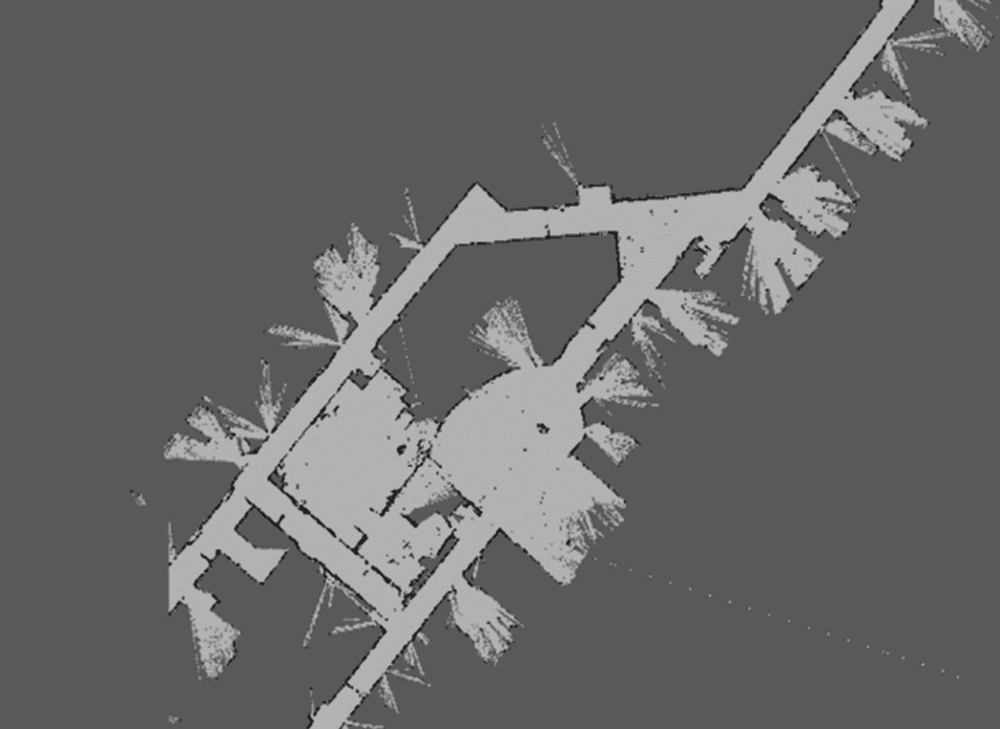
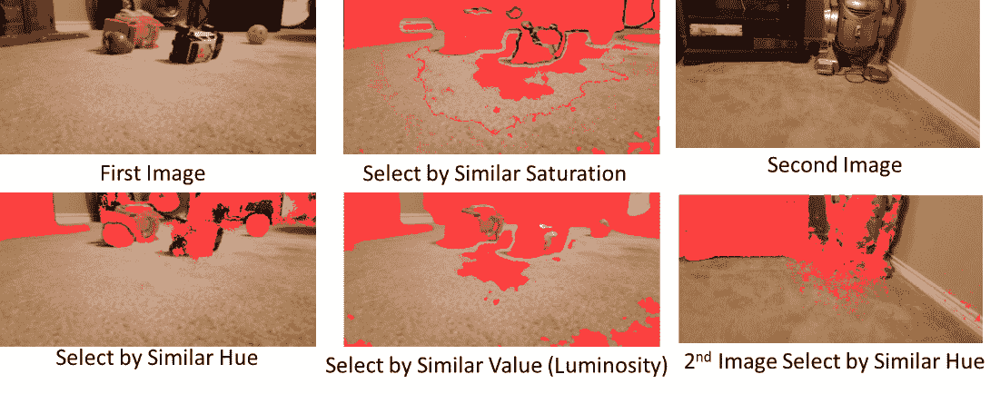
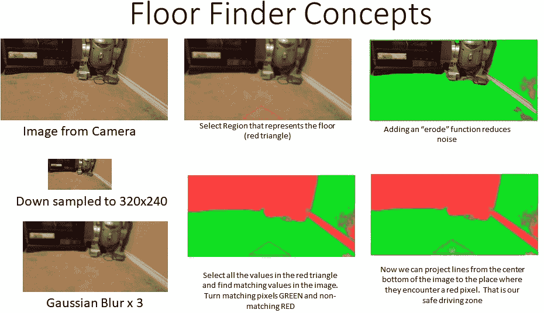
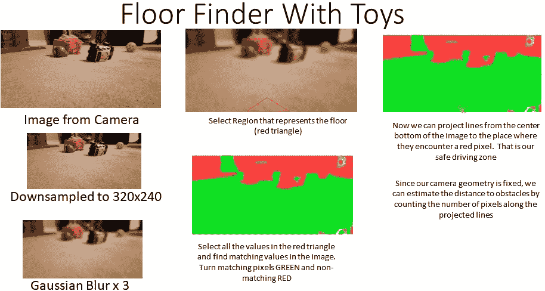
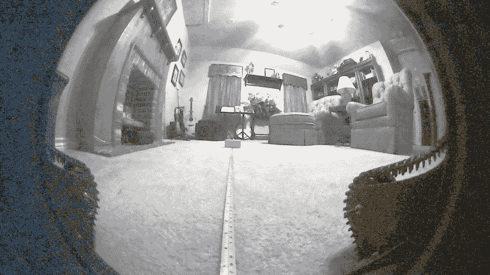
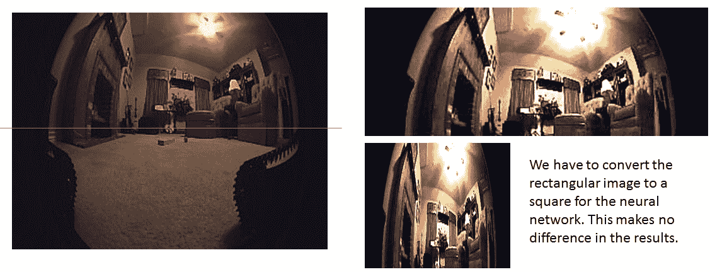
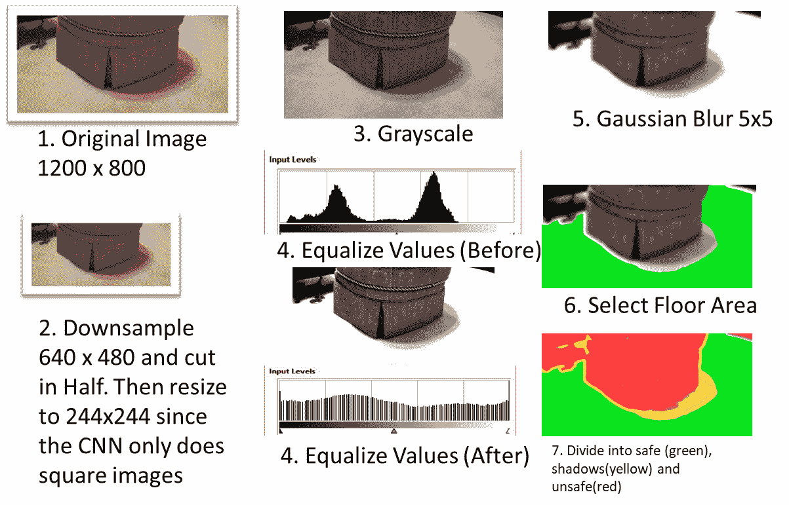
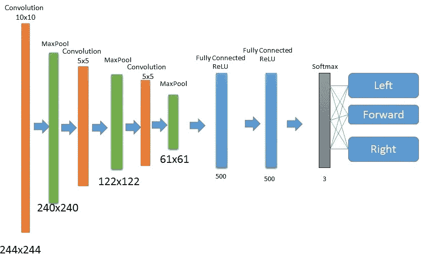

# 第七章：教机器人导航和避免楼梯

让我们快速回顾一下我们创建能够捡起玩具的机器人的目标。我们已经创建了一个玩具检测器并训练了机器人手臂。接下来我们的待办事项是什么？我们需要将机器人驱动到玩具的位置以便捡起它。这听起来很重要。

本章涵盖了我们的玩具抓取机器人助手的任务中的**导航**和**路径规划**。你必须承认这是机器人学中最困难的问题之一。任务分为两部分——确定你的位置（定位），然后确定你想去哪里（路径规划）。到目前为止，大多数机器人都会使用某种形式的**同时定位与地图构建**（**SLAM**）算法，该算法首先绘制房间地图，然后确定机器人在其中的位置。但这是否真的必要呢？首先，SLAM通常需要某种3D传感器，我们没有，而且需要大量的处理，我们不想这样做。我们还可以补充说，它不使用机器学习，而这本书是关于**人工****智能**（**AI**）的。

是否可以在不制作地图或使用测距传感器的情况下完成任务？你能想到任何其他清洁房间但不进行制图的机器人吗？当然可以。你可能甚至有一个Roomba®（我有三个），而且大多数型号根本不做任何制图——它们通过伪随机的统计清洁程序进行导航。

本章的任务是创建一个可靠的导航系统，用于我们的机器人，该系统能够适应我们的任务，即清洁单个房间或玩具层，并且使用我们已有的传感器。

本章将涵盖以下主题：

+   理解SLAM方法

+   探索替代导航技术

+   介绍用于避开障碍物的Floor Finder算法

+   实现神经网络

# 技术要求

我们需要**机器人操作系统版本2**（**ROS 2**）来完成本章。本书使用Foxy Fitzroy版本：[http://wiki.ros.org/foxy/Installation](http://wiki.ros.org/foxy/Installation)。本章假设你已经完成了[*第6章*](B19846_06.xhtml#_idTextAnchor205)，其中我们给了机器人声音和接收语音命令的能力。我们将使用Mycroft界面和语音文本到语音系统，称为Mimic：[https://github.com/MycroftAI/mimic3](https://github.com/MycroftAI/mimic3)。你可以在本书的GitHub仓库中找到本章的代码：[https://github.com/PacktPublishing/Artificial-Intelligence-for-Robotics-2e](https://github.com/PacktPublishing/Artificial-Intelligence-for-Robotics-2e)。

我们还将使用Python的**Keras**库([https://keras.io](https://keras.io))，这是一个强大的机器学习应用库，允许我们构建自定义神经网络。你可以使用以下命令安装它：

```py
pip install keras
```

你还需要**PyTorch**，可以使用以下命令安装：

```py
pip3 install torch torchvision torchaudio --index-url https://download.pytorch.org/whl/cu118
```

# 任务分析

就像我们为每一章做的那样，让我们回顾一下我们想要达成的目标。我们将驾驶机器人绕着房子转，寻找玩具。一旦我们有了玩具，我们将把它带到玩具箱，通过把它扔进玩具箱来把它放好。然后，机器人将去寻找更多的玩具。在这个过程中，我们需要避开障碍物和危险，包括一组会导致机器人损坏的向下楼梯。

备注

我在测试的第一部分用婴儿门封住了楼梯，在第二部分则在楼梯上放上了枕头。在机器人还在学习的时候，没有必要让它从楼梯上弹跳下来。

我们将假设这个任务列表中的任何一项都不需要机器人知道自己的位置。这是真的吗？我们需要找到玩具箱——这很重要。我们能否在不了解位置的情况下找到玩具箱？答案是，当然，机器人可以使用它的摄像头搜索玩具箱，直到找到它。我们之前在[*第4章*](B19846_04.xhtml#_idTextAnchor126)中开发了一种使用神经网络识别玩具箱的技术。

现在，如果机器人要完成更大的任务，比如清理一个100万平方英尺的仓库，那么我们就需要一张地图。但我们的任务是清理一个16 x 16英尺的房间。考虑到我们不能走得太远，而且我们无论如何都必须开车到玩具箱，寻找玩具箱所花费的时间并不那么重要。因此，我们将设定一个挑战，在不制作地图的情况下完成我们的任务。

备注

我曾经监督过麻省理工学院创建的一个机器人系统的评估。他们有一个不使用地图的导航系统，我非常怀疑。为了自卫，机器人实际上在测试中迷路了。现在，我正在制作一个无地图的导航器，他们可以提出批评。

我们还需要让机器人完成以下任务：

1.  在房间里导航，避开障碍物（玩具和家具）和危险（楼梯）。

1.  在房间里找到玩具（使用我们之前创建的玩具探测器）。

1.  驾驶到机器人手臂可以触及玩具的位置。

1.  用机器人手臂拿起玩具。

1.  把玩具拿到玩具箱。

1.  把玩具放进玩具箱。

1.  去找另一个玩具。

1.  如果没有更多的玩具，那么停止。

我们在其他章节中已经涵盖了找到玩具和拿起玩具的内容。在本章中，我们将讨论开车到玩具那里去拿它。

我非常喜欢电影《公主新娘》。它有剑斗、悬崖、两次智慧较量，还有**不同寻常的大老鼠**（**ROUS**）。它还包含了一个我们可以效仿的计划课程。当我们的英雄，巨人菲兹克，伊尼戈·蒙托亚，和韦斯利计划突袭城堡以营救公主时，韦斯利首先问的是“我们的责任是什么？”和“我们的资产是什么？”让我们为我们的用例做同样的事情：

+   **我们的责任**：我们有一个小型机器人，其传感器和计算能力非常有限。我们有一个房间里满是错位的玩具，还有一组机器人可能会掉下去的致命楼梯。

+   **我们的资产**：我们有一个带有全向轮的机器人，可以四处行驶，一个声音，一个摄像头和一个机器人臂。机器人通过Wi-Fi与控制计算机连接。我们有这本书。我们有一个颜色独特的玩具箱。还有许多**标准尺寸**的**玩具**（**TOUS**）。

无论我们是设计机器人还是入侵城堡，适当的下一步是做一些头脑风暴。你将如何解决这个问题？

我们可以使用SLAM制作地图，然后定位机器人在地图上的位置，并使用它来导航。虽然我们最终不会遵循这种方法，但让我们快速看看它是如何工作的。

# 理解SLAM方法学

SLAM是室内机器人导航的常见方法。在我们深入具体细节之前，让我们看看两个关键问题：

+   室内机器人驾驶中我们遇到的第一问题是我们没有地图。

+   我们遇到的第二个问题是，我们没有定位自己的参考框架——室内GPS不起作用。

这就是两个问题——我们需要一个地图，然后我们需要一种方法来定位自己在地图上。虽然SLAM以字母"S"代表“同时”，但事实上，大多数机器人在开始时制作地图，将其存储起来，然后稍后驾驶。当然，在制作地图的同时，机器人必须制作地图并定位自己在地图上——通常在中心位置。

SLAM是如何工作的？通常与SLAM相关的传感器是旋转的LIDAR。你可以把LIDAR想象成激光雷达——它使用激光测量物体距离，并旋转以收集机器人周围的所有数据。

我们可以将SLAM方法总结如下：

1.  机器人通过在圆形内旋转激光测距仪来测量房间的尺寸。

1.  返回的数据是一系列距离测量值，其中角度测量是列表中位置的函数。如果我们有一个圆周上360个测量的列表，那么列表中的第一个数字是0度，下一个是1度，以此类推。

1.  我们可以通过寻找角落、边缘、跳跃和不连续性来从LIDAR数据中提取特征。

1.  我们查看每个特征从后续测量中的角度和距离，并创建一个函数，给出机器人移动的最佳估计。

1.  我们使用这些信息将LIDAR数据从传感器中心坐标系转换到某种房间坐标系，通常是通过假设机器人的起始位置是坐标0,0。我们的变换，或者说数学变换，将是机器人身体框架的平移（移动）和旋转的组合。

1.  估计这种变换的一种方法就是使用**粒子**。我们在机器人可能移动的每一个可能点上创建机器人的运动空间样本，并在所有点上随机放置点。我们计算每个样本的变换，然后测试哪个样本最适合收集到的数据。这被称为**粒子滤波器**，是我用于大多数我的SLAM项目的技术。

更多细节，您可以参考[https://www.cs.cmu.edu/~16831-f14/notes/F12/16831_lecture04_dfouhey.pdf](https://www.cs.cmu.edu/~16831-f14/notes/F12/16831_lecture04_dfouhey.pdf)。

在长而特征不明显的走廊中，SLAM可能难以工作或根本无法工作，因为它没有任何信息可以工作——一个LIDAR扫描看起来就像下一个。为了帮助解决这个问题，许多SLAM系统需要向机器人添加其他传感器，这些传感器测量轮距或使用光流来测量运动，以提供额外的位置估计数据。以下是用ROS和RViz显示的由ROS制作的SLAM地图的示意图。机器人使用500个粒子来估计机器人位置的最佳变化，以使LIDAR数据与地图中其余数据对齐。这是我早期的一个机器人项目：



图7.1 – 由SLAM导航过程生成的地图

在SLAM过程中，我们必须做的是以下内容：

1.  首先，进行一次扫描，测量机器人到房间中所有物体的距离。

1.  然后，我们将机器人移动一段距离——例如，向前移动三英寸。

1.  然后，我们进行另一次扫描并再次测量距离。

1.  我们现在需要想出一个转换，将第二次扫描中的数据转换成与第一次扫描中的数据对齐。为此，两个扫描中必须有可以相关联的信息——角落、门道、边缘和家具。

你可以花大约100美元购买一个非常小的机器人LIDAR（例如，SLAMtec的RPLidar），并使用它来制作地图。有一个名为*Hector Mapping*的优秀ROS包，它使得使用这种LIDAR变得简单。你会发现SLAM不是一个可靠的过程，并且需要多次尝试才能生成一个可用的地图。一旦地图创建完成，如果房间中的任何东西发生变化，例如重新布置家具，你必须保持地图更新。

SLAM过程实际上非常有趣，不是因为单个扫描中发生了什么，而是因为扫描是如何拼接在一起的。有一个名为*手持式地图在RoboCup 2011救援竞技场*的优秀视频，由德国达姆施塔特大学的Hector SLAM作者制作，展示了地图制作过程。视频可在以下链接中找到：[https://www.youtube.com/watch?v=F8pdObV_df4list=PL0E462904E5D35E29](https://www.youtube.com/watch?v=F8pdObV_df4list=PL0E462904E5D35E29)。

我想快速提醒你关于SLAM，这样我们就可以讨论为什么我们不会使用它。SLAM是一个重要的话题，并且广泛应用于导航，但它绝不是解决我们问题的唯一方法。SLAM在我们目的中的弱点包括以下内容：

+   需要某种类型的扫描传感器，如LIDAR、超声波或红外线，这些可能很昂贵，机械复杂，并产生大量数据。我们希望保持我们的机器人便宜、可靠和简单。

+   如果机器人有轮式里程计，SLAM通常工作得更好，但我们的Albert机器人没有。全向轮在转弯时会滑动或打滑，以改变方向——我们没有阿克曼转向，比如车轮指向的汽车。当车轮打滑时，它是在没有转向的情况下在表面上移动，这使任何类型的轮式里程计无效，因为轮式里程计假设车轮始终在接触表面上转动。

+   SLAM不处理正在变化的平面图。Albert机器人必须处理房间内分布的玩具，这会干扰LIDAR并改变SLAM用于估计位置的平面图。当机器人捡起玩具并放回原处时，它也在改变平面图。

+   SLAM在计算上很昂贵。它需要使用传感器来开发地图，然后将实时传感器数据与地图进行比较，以定位机器人，这是一个复杂的过程。

+   如果数据模糊不清，或者没有足够的特点供机器人估计变化，SLAM就会遇到问题。我在没有特征的走廊以及高度对称的房间里也遇到过问题。

所以，为什么我要用这么多空间来谈论SLAM，尽管我并不打算教你们如何使用它？因为你们需要知道它是什么以及它是如何工作的，因为你们可能有一个需要制作地图的任务。关于SLAM有很多好的教程，但关于我接下来要教你们的，即使用AI在没有地图的情况下安全导航的内容，却非常少。

# 探索替代导航技术

在本节中，我们将探讨一些潜在的替代导航方法，这些方法现在我们可以用于我们的机器人，因为我们已经排除了SLAM方法：

+   我们可以随意驾驶，寻找玩具。当我们找到玩具时，机器人会捡起它，然后随意驾驶寻找玩具箱。当它看到玩具箱时，它会开到那里并放下玩具。但我们仍然需要一个避免撞到障碍物的方法。我们可以遵循一个叫做**运动结构**（**SfM**）的过程，从我们的单摄像头中获取深度信息，并使用它来制作地图。运动结构需要大量的纹理和边缘，而房屋可能没有。它还在地图中留下许多必须填充的空洞。运动结构使用视频图像中的视差来估计摄像头视场中物体的距离。这个领域已经有很多有趣的工作，我使用它创造了一些有希望的结果。视频图像必须有很多细节，这样过程才能将一个视频图像中的点与下一个视频图像中的点匹配起来。如果你对此感兴趣，可以参考以下关于SfM各种方法的调查文章：[https://www.ijcit.com/archives/volume6/issue6/IJCIT060609.pdf](https://www.ijcit.com/archives/volume6/issue6/IJCIT060609.pdf)。

+   你可能听说过一种叫做**地面寻找**的技术，它在其他机器人和自动驾驶汽车中得到了应用。我从Stephen Gentner在软件包*RoboRealm*中编写的复杂算法中学到了很多关于地面寻找的知识，这是一个用于原型设计机器人视觉系统的优秀工具。你可以在[http://www.roborealm.com](http://www.roborealm.com)找到它。

这一层面寻找技术就是我们将在本章中使用的。让我们在下一节详细讨论这个问题。

# 介绍地面寻找技巧

我在本章中将要介绍的是一种不同于RoboRealm或其他地面寻找算法的地面寻找技巧版本，但它能实现相同的结果。让我们为了便于理解，把这个简单概念分解开来。

我们知道机器人正前方的地面是没有障碍物的。我们以机器人前方区域的视频图像像素为例，寻找更远处的相同纹理。我们正在将图像中已知为地面的部分纹理与更远处的像素进行匹配。如果纹理匹配，我们将该区域标记为绿色，以显示该区域可行驶且无障碍。我们将在本章中使用这个技巧的某些部分。顺便问一下，你注意到我说的是*纹理*而不是*颜色*了吗？我们不是匹配地面的颜色，因为地面不是单一的颜色。我在楼上的游戏室里有一块棕色地毯，它的颜色变化仍然相当大。仅仅使用颜色匹配，这种方法是行不通的。我们必须匹配纹理，这可以用颜色、强度（亮度）、色调和粗糙度（表面颜色平滑度的度量）来描述。

让我们在游戏室的地板图像上尝试一些快速实验。在实际操作中涉及几个步骤：

1.  我们从相机获取的图像开始。为了加速处理并最大限度地有效利用带宽，我们将相机的原生分辨率——全分辨率为1900 x 1200——降低到仅为640 x 480。由于我们的机器人体积小，我们使用了一台小型计算机——Nvidia Jetson Nano。

1.  我们将这个方法应用到我们的图像处理程序中，使用**OpenCV**，这是一个开源的计算机视觉库，它也被集成到了ROS中。

1.  我们的第一步是使用**高斯模糊**函数对图像进行模糊处理。高斯模糊使用抛物线函数来减少图像中的高频信息量——通过减少相邻像素之间的差异来使图像变得模糊。为了获得足够的模糊效果，我不得不将模糊函数应用三次，使用一个5 x 5的**卷积核**。卷积核是一个矩阵函数——在这种情况下，一个5 x 5的数字矩阵。我们使用这个函数根据其邻居（周围的像素）来修改一个像素。这种平滑使颜色更加均匀，减少噪声，并使下一步更容易。为了模糊图像，我们从周围的像素中取一点——每边两个——并将其加到中心像素上。我们曾在[*第4章*](B19846_04.xhtml#_idTextAnchor126)中讨论过卷积核。

1.  我们指定机器人前方的一个区域为能够清晰看到地板的区域。我使用了一个三角形区域，但正方形区域也同样适用。我选择了三角形内发现的每种颜色，并抓取了所有具有15个单位该颜色值的像素。15个单位是什么意思？每种颜色都用一个从0到255的RGB值进行编码。我们的地毯颜色，棕色，在红、绿、蓝单位中大约是162、127和22。我们选择所有与该颜色相差15个单位的颜色，对于红色来说，是从147到177。这选择了与我们的地板颜色相似的区域。我们的墙壁是一种非常相似的棕色或米色，但幸运的是，有一个白色的踢脚板，我们可以将其隔离，这样机器人就不会试图爬上墙壁。

    颜色并不是匹配我们地板上像素的唯一方式。我们还可以寻找具有相似色调（无论颜色是亮是暗，都是颜色的阴影）的像素，具有相同**饱和度**（颜色的暗淡或明亮程度）的像素，以及具有相同值或**亮度**（与在单色图像或灰度图像中匹配颜色相同的结果）的颜色。我编制了一张图表来说明这个原理：



图7.2 – 通过各种属性（如颜色、色调或饱和度）的相似性选择图像中的像素

前面的图示展示了各种选择属性（颜色、色调、饱和度和亮度）作为工具来为我们的机器人进行地面定位的能力。在这个测试中，色调属性似乎提供了最佳结果。我在另一张图片上测试了它，以确保它正在正常工作。它似乎无法将踢脚线区分开来，而踢脚线不属于安全驾驶区域。

1.  我们选择所有与我们的地面颜色匹配的像素并将它们涂成绿色——或者更准确地说，我们在图像的副本中创建一个掩码区域，其中包含我们想要以某种方式指定的所有像素。例如，我们可以使用数字10。我们制作一个与我们的图像大小相同的空白缓冲区，并将该缓冲区中的所有像素都设置为10，这在另一张图像中将是地面。

    对掩码数据进行膨胀操作可以帮助在这方面。可能存在一些小孔或噪声，其中一两个像素没有完全匹配我们的地毯颜色——比如说有人掉落了一块饼干。膨胀函数通过选择一个小区域（例如3 x 3）并将掩码像素设置为10，只有当所有周围的像素也是10时，来降低掩码的细节水平。这减少了掩码的边界像素，并移除了任何可能是一两个像素大的小斑点和点。你可以从*图7.3*中看到，我非常成功地使用一个非常坚固的掩码隔离了地面区域。鉴于我们现在知道地面在哪里，我们将我们的掩码中的其他像素涂成红色，或者某个表示那里不安全行驶的数字。让我们使用255：



图7.3 – 我版本的地面定位算法

注意，在这种情况下，它非常成功地识别了安全驾驶的区域。投射的路径是必要的，以防止机器人试图沿着墙壁行驶。如果你能识别出角落里的机器人，你将获得额外的分数。

1.  我们的下一步可能需要你思考。我们需要识别安全驾驶的区域。在使用此过程时，有两种情况可能会给我们带来问题：

    +   地面中间可能有一个单独的物体，比如一个玩具，它的两侧都有绿色像素。

    +   我们还可能有一个凹形区域，机器人可以进入但不能出来。

    在*图7.3*中，你可以看到算法将墙壁像素涂成了绿色，因为它们与地面的颜色相匹配。在踢脚线处有一个强烈的红色禁止区域。为了检测这两种情况，我们从机器人的位置向上投射线条，并识别我们遇到的第一个红色像素。这设定了机器人可以行驶的边界。如果你从图像底部向上追踪直到遇到红色像素，并在第一个红色像素处停止，你也会得到类似的结果。让我们再次尝试地面定位过程，但向图像中添加一些玩具，以确保我们得到想要的结果：



图7.4 – 向图像中添加玩具以确定我们是否将玩具检测为障碍物

这似乎效果很好。我们能够找到一条良好的道路来驾驶。记住，我们在驾驶过程中不断使用地面探测器更新障碍物视图，并更新我们的路径。这个过程有一个缺点。如果一个玩具与地毯的颜色和纹理相匹配，那么我们可能很难找到它。你可以在物体上添加一条遮蔽胶带，以便相机能够看到。

1.  在这个过程中，我们可以使用的一个技巧是利用固定的相机几何形状来进行距离和尺寸估计。我们有一个“固定”的相机——它固定在机器人上，距离地面有一定高度，因此可以从像素的 `y` 值测量沿地面的距离。我们需要通过使用卷尺和一个盒子来仔细校准相机，将像素值与从机器人基座到障碍物所绘的相同路径线的距离相匹配。这些距离将是非线性的，并且仅在像素继续变化的距离内有效。由于相机垂直于地面，我们得到一定量的透视效果，这种效果在距离相机大约20英尺处减小到0。我的校准结果如下表：

    | **英寸测量** | **顶部距离** | **底部距离** |
    | --- | --- | --- |
    | 0 | 1080 | 0 |
    | 12 | 715 | 365 |
    | 24 | 627 | 453 |
    | 36 | 598.3 | 481.7 |
    | 48 | 581.5 | 498.5 |
    | 60 | 571.8 | 508.2 |
    | 72 | 565 | 515 |

表7.5 – 像素与英寸比较的测量表，用于确定比例

以下图像显示了在机器人相机视场中测量距离的技术。物体位于卷尺上距离机器人基座四英尺的位置。Albert在具有高清功能的网络摄像头中使用180度鱼眼镜头。我们需要在[*第9章*](B19846_09.xhtml#_idTextAnchor294)中做导航时使用宽视场：



图7.5 – 确定导航相机图像中像素的比例

需要注意的一点是，机器人无法进入的狭窄通道。我们可以根据距离和像素来估计宽度。一种常见的机器人技术是在所有障碍物周围放置一个等于机器人宽度一半的边界。如果有障碍物在两侧，那么两个边界将相遇，机器人将知道它无法进入。

在下一节中，我们将创建一个**卷积神经网络**（**CNN**）来处理我们的图像，并将它们转换为机器人命令——从本质上讲，通过在视频图像中看到地标或特征来教我们的机器人如何驾驶。

# 实现神经网络

那么，神经网络到底做什么呢？我们使用神经网络来预测输入与输出之间的某些关联。当我们使用CNN时，我们可以将一张图片与某些期望的输出关联起来。我们在上一章中做的是将类别名称（玩具）与某些图像关联起来。但如果我们尝试将其他东西与图像关联起来呢？

怎么样？我们使用神经网络来对来自相机的图像进行分类。我们手动驾驶机器人，使用摇杆，每秒大约拍照四次。我们记录下机器人在每张图片中的动作——前进、向右转、向左转或后退。我们使用这些信息来预测给定图像的机器人运动命令。我们制作了一个CNN，以相机图像作为输入，四个输出——前进、向左或向右的命令。这有一个优点，可以自动避免固定障碍和危险。当我们到达楼梯时（记得我在游戏室里有通往下方的楼梯，那会损坏机器人），机器人会知道要转身，因为这是我们训练时所做的——我们不会故意在训练中让机器人沿着楼梯下去（对吧？）。我们通过示例教机器人如何导航房间。

你现在可能正在对着这本书大喊大叫（你应该这么做）说，“那玩具怎么办？”除非，当然，你正在跟随我的思维过程，并且自己在想，“哦，这就是我们为什么花了那么多时间谈论地面定位器！”神经网络方法将帮助我们绕过房间，避免危险和家具，但不会帮助机器人避免训练集中没有的玩具。我们无法将它们放入这个训练集中，因为玩具永远不会出现在同一个地方两次。我们将使用地面定位器来帮助避免玩具。我们如何结合两者？神经网络为机器人提供更长的目标，地面定位器则修改这个目标以避免局部、短程物体。在我们的程序中，我们首先评估神经网络，然后使用地面定位器选择一条清晰的路线。

在这个主题上，我们还将为训练我们的机器人施展另一个技巧。由于我们的地面可能会发生变化，并且可能覆盖着玩具，我们将这部分从训练图像中排除。在将图像发送到神经网络之前，我们将图像切成两半，只使用上半部分。由于我们的相机是固定并且与地面平齐的，这给了我们只有房间上半部分可用于导航。我们的图像是180度的广角，因此我们有大量的信息可以处理。这应该能让我们在任何条件下都能导航：



图7.6 – 训练机器人驾驶的数据集仅包括图像的顶部

我们第二个问题是定位玩具箱。为此，我们需要创建一个新的图像训练集，它将代表一种替代的驾驶模式。我们在各种随机的位置启动机器人，然后简单地驾驶到玩具箱。我们使用与之前导航相同的流程 – 我们正在创建一个训练集，告诉机器人如何到达玩具箱。关键是获取每个可能起始位置的良好样本。我们确实有一些休息时间 – 如果地图上的一个点（房间中的位置）已经在一条路径上，我们就不需要再次覆盖它。换句话说，所有包含在其他路径中的点都不需要重复。我们仍然希望从这两组图像中至少有1,000张图像进行训练 – 一组是探索房间，另一组是驾驶到玩具箱。

我创建了一个简单的程序，它只允许操作员用操纵杆驾驶机器人。它每秒自动拍摄一张快照。每一帧都通过查看`cmd_vel`主题的值来标记，这是我们控制机器人底盘运动的方式。如果角速度Z项（`angular.z`）为正，我们正在向右转。如果它是负的，我们正在向左转，如果这个项为零（你猜对了），我们正在直行。我创建了一个独立程序，它与相机一起工作，并在接收到ROS `syscommand`主题上的`TAKE PIC LEFT`、`RIGHT`、`CENTER`或`BACK`命令时存储快照。这些程序将在本书的GitHub仓库中提供 – 我不会在这里包括它们。我们将每个类别的图片放在它自己的子目录中。

你可以将神经网络想象成这样工作：

1.  我们将图像展示给神经网络。

1.  它从该图像中提取特征，然后选择训练数据库中最像提供的图像特征的图像。

1.  训练数据库中的每张图片都与一个驾驶命令（左、中、右）相关联。因此，如果图像最接近机器人向左转的图像，那么网络将返回*向左转*。

现在让我们更详细地看看这些流程。

## 处理图像

现在，在我们将数据呈现给神经网络进行训练之前，我们需要进行几个步骤。机器人上的相机分辨率远远超出了网络所需的，我们希望使用神经网络中尽可能少的数据：



图7.7 – CNN的图像处理

让我们分解这个流程，使其更清晰：

1.  前面的图中的第一幅图像代表我们的原始图像。

1.  我们的第一步是将图像下采样到640 x 480。我们将图像切成两半，只保留上半部分，这样就消除了地板的考虑。我们将矩形图像调整大小为244 x 244，这是我们的神经网络处理的一个合适大小。

1.  我们将图像转换为灰度，这样我们只有一个通道需要处理，使用这个公式（由**国家电视标准委员会**（**NTSC**）提出）：

    *灰度 = 0.299 * R + 0.587 * G + 0.114 * B*

1.  我们下一步是对图像进行直方图均衡化，以获取所有可能值的整个范围。摄像头的原始输出既没有纯白色（`255`），也没有纯黑色（`0`）。最低值可能是`53`，最高值是`180`，范围是`127`。我们通过减去低值（`53`）并乘以缩放因子（`127`/`255`）来缩放灰度值。这扩大了图像的范围到全尺度，并消除了可能存在的许多光照和照明变化。我们试图向神经网络呈现一致的数据。

1.  下一步是对数据进行高斯模糊处理。我们希望减少图像中的一些高频数据，以平滑一些边缘。这是一个可选步骤，可能对您的环境不是必需的。我在机器人的视野中有很多细节，我觉得模糊会给我们更好的结果。它还填补了上一步中直方图均衡化过程留下的部分灰度值空缺。

1.  我们必须对数据进行归一化，将范围从`0-255`缩小到`0-1`。这是为了满足人工神经网络的输入要求。为了执行此操作，我们只需将每个像素除以`255`。我们还必须将数据从OpenCV图像格式转换为NumPy数组。所有这些都是CNN预处理的一部分。

1.  我们的网络是一个九层的CNN。我使用这种常见的架构，因为它是对**LeNet**的变体，LeNet被广泛用于此类任务（[http://vision.stanford.edu/cs598_spring07/papers/Lecun98.pdf](http://vision.stanford.edu/cs598_spring07/papers/Lecun98.pdf)）。然而，在我们的最终步骤中，我们不会使用由二元分类器确定的二元输出，而是使用具有四个输出的**Softmax分类器** – 前进、左转或右转。如果我们想的话，我们实际上可以创建更多的类别，并且有容易的右转和困难的右转，而不仅仅是单一级别的转向。我没有使用机器人新全向轮的完整功能，以保持这个问题简单。请记住，输出类别的数量必须与我们的训练集标签完全匹配。

    在我们的卷积神经网络（CNN）中，前六个层是成对的卷积神经网络，层间有最大池化层。这使得网络能够处理图像中逐渐增大的细节。最后的两个层是完全连接的，并使用**修正线性单元**（**ReLU**）激活。请记住，ReLU只取来自其他层的正值。这是我们的最终层，它是一个具有四个输出的Softmax分类器：



图7.8 – 我们神经网络的组织结构

就像任何其他神经网络训练任务一样，过程中的下一步是将输入数据分成训练集和验证集。让我们学习如何训练神经网络。

## 训练用于导航的神经网络

我们将使用80%的数据进行训练，20%进行验证。我们真的不能使用通过随机旋转重复图像来美化数据的过程，就像我们在玩具识别程序中所做的那样，因为我们不仅是在识别图像，而且是在使用它们进行方向导航。改变旋转会搞乱我们的方向。

现在，让我们把我们的训练程序组合起来。这个程序部分受到了Adrian Rosebrock的*pyImageSearch*博客以及Sullivan和Lawson在海军研究实验室发表的论文*Deep Obstacle Avoidance*的启发。你可以按照以下步骤进行：

1.  我们需要通过驾驶机器人并记录我们的驾驶动作来收集我们的训练数据。这把我们的数据分成了三个集合——左转、右转和直行。我们的训练图像有三个子文件夹来匹配我们的标签。我们读取数据，将其与标签关联，并预处理数据以供神经网络使用。

注意

我在我的台式计算机上运行训练，而不是在Jetson Nano上。稍后我们将使用完全训练好的网络在Jetson Nano上部署。

1.  这里列出了我们这个程序需要的导入项——相当多：

    ```py
    # import the necessary packages
    from keras.preprocessing.image import ImageDataGenerator from keras.optimizers import Adam
    from sklearn.model_selection import train_test_split from keras.preprocessing.image import img_to_array from keras.utils import to_categorical
    import matplotlib.pyplot as plt import numpy as np
    import cv2 import os
    from keras.models import Sequential
    from keras.layers.convolutional import Conv2D
    from keras.layers.convolutional import MaxPooling2D
    from keras.layers.core import Activation
    from keras.layers.core import Flatten
    from keras.layers.core import Dense
    from keras import backend as K
    ```

1.  这是CNN的设置：

    +   我们有三个卷积层，每个卷积层后面跟着一个`maxpooling`层。记住，每个`maxpooling`层都会将网络考虑的图像分辨率减半，也就是数据量的1/4，因为我们把宽度和高度都减半了。卷积层使用ReLU激活函数，因为我们不希望有任何负像素值。

    +   在卷积层之后，我们有两个各有500个神经元的全连接层。

    +   最后一层是我们的三个神经元输出层，包含一个Softmax分类器，它将输出每个分类（左、右和中心）的百分比。输出将看起来像`(0.8, 0.15, 0.05)`，三个数字加起来等于1。

    这是一个通用的卷积网络类，可以用于其他事物，因为它是一个通用的多类图像分类CNN：

    ```py
    class ConvNet():
        @staticmethod
        def create(width, height, depth, classes):
            # initialize the network
            network = Sequential()
            inputShape = (height, width, depth)
            # first set of CONV => RELU => POOL layers
            network.add(Conv2D(50, (10, 10), padding="same", input_shape=inputShape))
            network.add(Activation("relu"))
            network.add(MaxPooling2D(pool_size=(2, 2), strides=(2, 2)))
            # second set of CONV => RELU => POOL layers
            network.add(Conv2D(50, (5, 5), padding="same"))
            network.add(Activation("relu"))
            network.add(MaxPooling2D(pool_size=(2, 2), strides=(2, 2)))
            # third set of CONV => RELU => POOL layers
            network.add(Conv2D(50, (5, 5), padding="same"))
            network.add(Activation("relu"))
            network.add(MaxPooling2D(pool_size=(2, 2), strides=(2, 2)))
            # Fully connected ReLU layers
            network.add(Flatten())
            network.add(Dense(500))
            network.add(Activation("relu"))
            network.add(Dense(500))
            network.add(Activation("relu"))
            # softmax classifier
            network.add(Dense(classes))
            network.add(Activation("softmax"))
            # return the constructed network architecture
            return network
    ```

1.  现在，我们设置我们的学习计划。我们将运行25次训练，学习率为0.001。我们设置每个批次的图像数量为32张，如果我们内存不足，我们可以减少这个数量：

    ```py
    EPOCHS = 25 LEARN_RATE = 1e-3
    BATCH = 32 # batch size - modify if you run out of memory
    ```

1.  下一个部分加载所有我们的图像。我们在这里设置了图像所在的路径。我们将三种类型的训练图像放在名为`left`、`right`和`center`的文件夹中：

    ```py
    print ("Loading Images")
    images=[]
    labels=[]
    #location of your images
    imgPath = "c:\users\fxgovers\documents\book\chapter7\train\" imageDirs=["left","right","center"]
    for imgDir in imageDirs:
     fullPath = imgPath + imgDir
     # find all the images in this directory 
     allFileNames = 
     os.listdir(fullPath) ifiles=[]
     label = imgDirs.index(imgDir) # use the integer version of the 
     label # 0= left, 1 = right, 2 = center
     for fname in allFileNames:
       if ".jpg" in fname:
          ifiles.append(fname)
    ```

1.  现在，你可以参考我关于我们将要经历的图像预处理过程的图（*图7**.7*）。我们将把图像切成两半，只处理图像的上半部分。然后，我们将图像缩小到244 x 244以适应神经网络，神经网络需要正方形图像。由于我们不需要考虑颜色，只需形状，我们将图像转换为灰度（黑白）。这将进一步减少我们的数据。我们将对图像进行均衡化，这会将灰度颜色的范围重新缩放到0到255，从而平衡光照并设置对比度：

    ```py
    # process all of the images 
    for ifname in ifiles:
      # load the image, pre-process it, and store it in the data list image = cv2.imread(ifname)
      # let's get the image to a known size regardless of what was collected 
      image = cv2.resize(image, (800, 600))
      halfImage = 800*300 # half the pixels
      # cut the image in half -we take the top half 
      image = image[0:halfimage]
      #size the image to what we want to put into the neural network image=cv2.resize(image,(224,224))
      # convert to grayscale
      image = cv2.cvtColor(image, cv2.COLOR_BGR2GRAY) #equalize the image to use the full range from 0 to 255 # this gets rid of a lot of illumination variation 
      image = cv2.equalizeHist(image)
    ```

1.  接下来，我们有高斯模糊。这是一个可选项——如果你的房间没有很多细节，你可能想移除它。我的游戏室有很多家具，所以我认为减少噪声会提高性能：

    ```py
    # gaussian blur the image to remove high frequency noise # we use a 5x kernel
    image = cv2.GaussianBlur(img,(5,5),0)
    ```

1.  我们将图像转换为浮点数的NumPy数组，范围从0到1，而不是从0到255的整数集。这个神经网络工具包只允许NumPy数组作为输入。我们还把与标签相关的数字（左=`0`，右=`1`，中心=`2`）放入匹配的`labels` NumPy数组中：

    ```py
    # convert to a numpy array image = img_to_array(image)
    # normalize the data to be from 0 to 1
    image2 = np.array(image, dtype="float") / 255.0 images=images.append(image) labels.append(label)
    labels = np.array(labels) # convert to array
    ```

1.  我们将数据分成两部分——一个用于训练神经网络的训练集和一个用于验证训练集的测试集。我们将使用80%的图像样本进行训练，20%进行测试：

    ```py
    # split data into testing data and training data 80/20
    (trainData, testData, trainLabel, testLabel) = train_test_split(data, labels, test_size=0.20, random_state=42)
    ```

1.  我们必须将标签转换为张量，这仅仅是一种特定的数据格式：

    ```py
    # convert the labels from integers to vectors 
    trainLabel = to_categorical(trainLabel, num_classes=3) testLabel = to_categorical(testLabel, num_classes=3)
    ```

1.  现在，我们通过实例化`ConvNet`对象来构建我们的实际神经网络，这个对象实际上在Keras中构建我们的CNN。我们设置了优化器，它是**自适应动量估计**（**ADAM**），一种自适应梯度下降法。ADAM像带有摩擦的重球一样作用于误差梯度——它有一定的动量，但不会快速加速：

    ```py
    # initialize the artificial neural network print("compiling CNN...")
    cnn = ConvNet.build(width=224, height=224, depth=1, classes=3) opt = Adam(lr=LEARN_RATE, decay=LEARN_RATE / EPOCHS) model.compile(loss="categorical_crossentropy", optimizer=opt, metrics=["accuracy"])
    ```

1.  我们在这一步训练网络。这需要相当长的时间才能完成——从15分钟到一两个小时——具体取决于你有多少图像。我们希望训练结果至少达到80%。如果没有，可以增加一些周期来观察学习曲线何时趋于平稳。如果这仍然不起作用，你需要更多的训练图像。我目标是每个集合有1,000张图像，这大约需要50分钟的机器人驾驶时间：

    ```py
    # train the network
    print("Training network. This will take a while")
    trainedNetwork = model.fit_generator(aug.flow(trainImage, trainLabel, batch_size=BATCH),
    validation_data=(testImage, testLable), steps_per_epoch=len(trainImage) // BATCH,
    epochs=EPOCHS, verbose=1) # save the model to disk
    print("Writing network to disk") cnn.save("nav_model")
    ```

1.  现在我们已经完成了，所以我们将创建的模型保存到磁盘上，以便我们可以将其传输到机器人的电脑，即Nvidia Jetson Nano。

1.  现在，制作你的第二个驾驶训练集，从随机位置到玩具箱。选择随机位置，并使用摇杆将机器人驾驶到玩具箱。继续这样做，直到你有大约1,000张图像。将这些图像通过训练程序运行，并通过更改程序的最后一行将此模型标记为`toybox_model`：

    ```py
    cnn.save("toybox_model")
    ```

这太棒了——我们已经构建并训练了我们的神经网络。现在，我们需要将其用于驾驶机器人，我们将在下一节中这样做。

## CNN机器人控制实现

我们需要结合一个发送ROS命令的程序和我们的神经网络分类过程。我通过ROS的`syscommand`主题添加了一些命令，我使用这个主题向我的机器人发送非周期性命令。`syscommand`只是发布一个字符串，所以你可以用它来做几乎所有的事情。你可以按照以下步骤进行：

1.  我们从ROS、OpenCV2和Keras开始导入，因为我们将会结合这三个库中的函数：

    ```py
    import roslib import sys import rospy import cv2
    from std_msgs.msg import String
    from sensor_msgs.msg import Image
    from geometry_msgs.msg import Twist
    from cv_bridge import CvBridge, CvBridgeError
    from keras.preprocessing.image import img_to_array
    from keras.models import load_model
    import numpy as np
    ```

1.  这一部分是ROS接口。我喜欢以这种方式封装ROS接口，将所有的发布和订阅放在一个地方。我们需要设置几个主题——我们需要能够在`syscommand`主题上发送和接收命令。我们将向机器人的电机在`cmd_vel`主题上发布命令。我们从`image_topic`主题接收来自摄像头的图像。我们使用回调来处理在机器人上其他地方发布的主题事件。这些可以在任何时间调用。当我们向主题发布时，我们拥有更多的控制权，这通过`pubTwist`和`pubCmd`方法来处理。我添加了标志来接收命令和图像，这样我们就不小心重复处理相同的图像或命令两次：

    ```py
    class ROSIF():
     def  init (self):
      self.bridge = CvBridge()
      self.image_sub = rospy.Subscriber("image_topic",Image,self.callback)
      self.cmd_sub = rospy.Subscriber( "syscommand",String,self.cmdCallback) self.cmd_pub = rospy.Publisher( "syscommand",String,queue_size=10)
      self.twist_pub = rospy.Publisher("cmd_vel",Twist,queue_size=10)
      self.newImage = False
      self.cmdReceived=""
    def callback(self):
     try:
      self.image = self.bridge.imgmsg_to_cv2(data, "bgr8") 
      self.newImage = True
     except CvBridgeError as e:
      print(e)
    def cmdCallback(self,data):
     # receieve a message on syscommand
     self.cmdReceived = data.data
    def getCmd(self):
     cmd = self.cmdReceived
     self.cmdReceived = "" # clear the command so we dont do it twice
     return cmd
    ```

1.  下一个函数是程序其余部分获取摄像头系统最新图像的手段，该图像在ROS上发布在`image_topic`。我们获取最新图像并将`newImage`变量设置为`False`，这样我们就知道下次是否正在尝试连续两次处理相同的图像。每次我们获取到新图像时，我们将`newImage`设置为`True`，每次我们使用图像时，我们将`newImage`设置为`False`：

    ```py
    def getImage(self):
      if self.newImage=True:
        self.newImage = False
        # reset the flag so we don't process twice return self.image
        self.newImage = False
        # we send back a list with zero elements
        img = []
        return img
    ```

1.  这一部分向机器人发送速度命令，以匹配CNN预测的我们应执行的操作。CNN的输出是三个值之一：左转、右转或直行。这些作为神经网络中的三个枚举值之一——`0`、`1`或`2`输出。我们将它们转换回左转、右转和中心值，然后使用这些信息向机器人发送运动命令。机器人使用`Twist`消息发送电机命令。`Twist`数据消息旨在适应非常复杂的机器人、四旋翼飞行器和全向轮驱动系统，这些系统可以朝任何方向移动，因此它有很多额外的值。我们发送一个`Twist.linear.x`命令来设置机器人的前后速度，以及一个`Twist.angular.z`值来设置底座的旋转或转向。在我们的情况下，正的`angular.z`旋转值向右转，负值向左转。我们的最后一条语句将数据值作为`Twist`消息发布到`cmd_vel`主题：

    ```py
    # publishing commands back to the robot
    def pubCmd(self,cmdstr):
      self.cmd_pub.publish(String(cmdstr)):
    def pubTwist(self,cmd):
      if cmd == 0: # turn left 
        turn = -2
        speed = 1
      if cmd==1:
        turn = 2
        speed = 1
      if cmd ==3:
        turn=0 
        speed = 1 # all stop
      if cmd==4:
        turn = 0
          speed = 0
        cmdTwist = Twist()
        cmdTwist.linear.x = speed
        cmdTwist.angular.z = turn self.twist_pub.publish(cmdTwist)
    ```

1.  我们创建一个函数，通过一个命令来完成所有的图像处理。这正是我们为训练程序预处理图像的方式——正如你可能想象的那样。你可能觉得我先将图像放大，然后再缩小，这有点奇怪。这样做的原因是为了在图像的垂直部分有细节。如果我将它缩小到 240 x 240，然后将其切成两半，我会在之后拉伸像素以再次使其成为正方形。我喜欢在缩小时有额外的像素。这种技术的最大优点是，它不关心输入图像的分辨率——我们最终会得到正确尺寸和裁剪的图像。

    其他步骤包括将图像转换为灰度，对对比度范围进行均衡，这会扩展我们的颜色值以填充可用空间，并执行高斯模糊以减少噪声。我们通过将我们的整数 0-255 灰度值转换为 0 到 1 的浮点值来对图像进行归一化，以便神经网络使用：

    ```py
    def processImage(img):
    # need to process the image
    image = cv2.resize(image, (640, 480))
    halfImage = 640*240 # half the pixels
    # cut the image in half -we take the top half image = image[0:halfimage]
    #size the image to what we want to put into the neural network
    image=cv2.resize(image,(224,224))
    # convert to grayscale
    image = cv2.cvtColor(image, cv2.COLOR_BGR2GRAY)
     #equalize the image to use the ful
         image = cv2.equalizeHist(image)
    # gaussian blur the image to remove high freqency noise # we use a 5x kernel
    image = cv2.GaussianBlur(img,(5,5),0) # convert to a numpy array
    image = img_to_array(image)
    # normalize the data to be from 0 to 1
    image2 = np.array(image, dtype="float") / 255.0 return image2
    ```

1.  现在我们已经设置好了，我们进入主程序。我们必须初始化我们的 ROS 节点，这样我们才能与 ROS 发布/订阅系统通信。我们创建一个变量，mode，我们用它来控制要进入哪个处理分支。我们创建一个接口，允许操作员打开和关闭导航功能，并在正常导航和我们的玩具箱寻找模式之间进行选择。

    在本节中，我们将加载我们之前训练的两个神经网络模型：

    ```py
    # MAIN PROGRAM
    ic = image_converter()
    rosif = ROSIF()
    rospy.init_node('ROS_cnn_nav')
    mode = "OFF"
    # load the model for regular navigation
    navModel = load_model("nav_model")
    toyboxModel = load_model("toybox_model")
    ```

1.  本节开始处理循环，该循环在程序运行时执行。运行 `rospy.spin()` 告诉 ROS 系统处理任何可能等待我们的消息。我们的最后一步是暂停程序 0.02 秒，以便让 Raspberry Pi 处理其他数据并运行其他程序：

    ```py
    while not rospy.is_shutdown():
      rospy.spin()
      time.sleep(0.02)
    ```

因此，我们的导航章节到此结束。我们介绍了使用神经网络教机器人通过天花板上的地标来驾驶，以及如何避开障碍物和进行房间导航——而且无需地图。

# 摘要

本章介绍了一些在非结构化环境中进行机器人导航的概念，也就是说，在现实世界中，机器人的设计者无法控制空间的内容。我们首先介绍了 SLAM，以及基于地图导航的一些优缺点。我们讨论了 Roomba 如何通过随机交互和统计模型进行导航。我们为玩具收集机器人项目 Albert 选择的算法结合了两种主要依赖视觉传感器的算法。

第一项是 Floor Finder，这是一种我在 DARPA 大挑战获胜者使用时学到的技术。Floor Finder 算法使用近视（靠近机器人）来教远视（远离机器人）地板的纹理。然后我们可以将房间分成可以驾驶的安全区域和不可驾驶的区域。这解决了我们的避障问题。我们的导航技术使用训练好的神经网络通过将房间从地平线向上的图像（房间的上半部分）与行驶方向关联起来，来识别房间内的路径。这也教会了机器人远离楼梯。我们因为玩具在那里，所以从图像中排除了房间的下半部分，并使用相同的过程训练另一个神经网络来找到玩具箱。

这个过程与我们看到的 [*第 4 章*](B19846_04.xhtml#_idTextAnchor126) 中的过程相同，但训练图像都被标记了从该点到玩具箱的路径。这种组合使我们能够通过视觉教会机器人找到路径，而且不需要地图，就像你做的那样。

在下一章中，我们将介绍对象分类，并回顾一些其他路径规划方法。

# 问题

1.  关于 SLAM，最常用的传感器是什么，用于创建 SLAM 制作地图所需的数据？

1.  为什么当有轮式里程计数据可用时，SLAM 工作得更好？

1.  在 Floor Finder 算法中，高斯模糊函数是如何改善结果的？

1.  Floor Finder 的最后一步是从机器人位置向上追踪到第一个红色像素。这个步骤还可以通过什么其他方式完成（参考 *图 7**.3*）？

1.  为什么我们在进行神经网络处理之前要将图像水平切半？

1.  使用神经网络方法相比 SLAM 技术有什么优势？

1.  如果我们只用随机驾驶函数而不是神经网络，我们需要为机器人添加什么新的程序或函数才能达到相同的结果？

1.  我们在章节中提出的方法是如何避免楼梯的？你认为这足够吗？你会建议其他完成这项任务的方法吗？

# 进一步阅读

+   *《深度避障》*，作者 Sullivan 和 Lawson，由海军研究实验室，Rosebrock，Adrian 出版。

+   *《使用 Python 的人工智能食谱》*，作者 Ben Auffarth，Packt Publishing，2020年

+   *《使用 Python 的人工智能 - 第二版》*，作者 Prateek Joshi，Packt Publishing，2020年

+   *《Python 图像处理食谱》*，作者 Sandipan Dey，Packt Publishing，2020年
