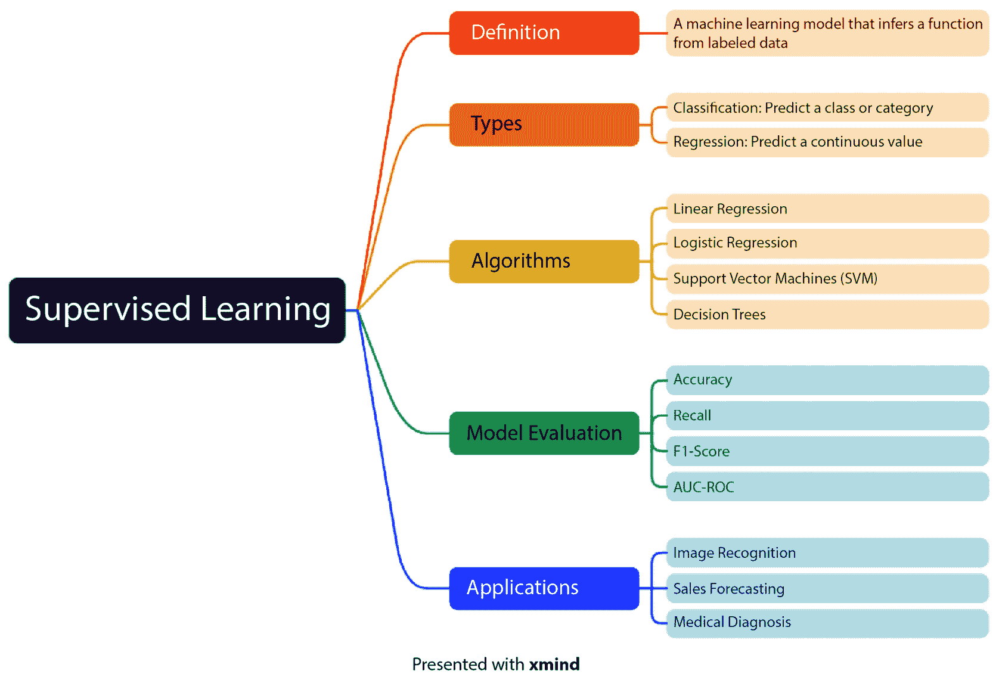
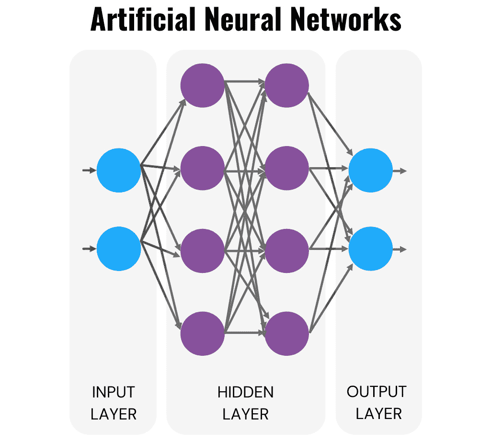

# 第二章：掌握基础 – AI 基础

在本章中，我们将扩展第一章中介绍的基础知识。本章旨在提供对在网页开发背景下至关重要的 AI 原则的全面理解。通过实际例子和互动练习，你不仅能理解 AI 的核心原则、技术和术语，还将学习如何在现实世界中应用这些原则。我们的目标是让你掌握 AI 技能，帮助你做出基于数据的决策，掌握机器学习基础，理解**自然语言处理**（**NLP**）和语言模型学习的复杂性，导航神经网络，并揭示**计算机视觉**（**CV**）的奥秘。通过获得这些知识，你将拥有在不断发展的 AI 领域中蓬勃发展的必要工具。

在本章中，我们将涵盖以下主要主题：

+   AI 基础 – 深入探讨

+   机器学习基础

+   用 NLP 改善网页交互

+   神经网络介绍

+   用计算机视觉赋能网页开发

现在，理解那些能够使你有效应用这些 AI 概念的技术要求至关重要。以下部分将概述你实现我们所提到的 AI 技术所需的必要工具和技术。

# 技术要求

以下是本章的技术要求：

+   Python 3.7+: [`www.python.org/downloads/`](https://www.python.org/downloads/)

+   库：

    +   `pandas`: [`pandas.pydata.org/`](https://pandas.pydata.org/)

    +   `sklearn`: [`scikit-learn.org/stable/index.html`](https://scikit-learn.org/stable/index.html)

在本章中，我们将深入探讨 AI 原则与网页应用开发之间的联系。AI 技术的应用，如机器学习和 NLP，可以显著改变我们开发和使用网页应用的方式。例如，机器学习算法可以用于个性化用户体验，根据用户行为和偏好推荐产品或内容。NLP 可以改善与聊天机器人的互动，使沟通更加流畅和直观。

# AI 基础 – 深入探讨

AI，即人工智能，是近年来迅速发展的一个概念。它是计算机科学的一个分支，专注于开发能够执行通常需要人类智能的任务的系统和算法。这些任务包括学习、推理、感知、理解和生成自然语言、语音和图像识别、决策以及解决复杂问题。通过复制人类的认知能力，AI 有潜力在医疗、金融等各个行业中带来革命性变化，提高效率和准确性。在今天这个技术迅速发展的时代，理解 AI 的原则和应用至关重要。

## AI 的历史之旅

在深入探讨 AI 框架的深水区时，理解塑造它们发展的历史背景至关重要。这个过程从回顾过去开始，追溯 AI 的根源和那些为复杂框架发展铺路的关键时刻。

让我们回顾一下古代文明对人工生命的迷恋。然而，直到 20 世纪中期，AI 才真正作为一门正式学科出现。像艾伦·图灵这样的开创性人物为 AI 奠定了概念基础，设想了能够表现智能行为的机器。

快进到 1950 年代，AI 的诞生发生在这一时期。**人工智能**这个术语被创造出来，并提出了创建具有类人智能的机器的雄心目标。随后，在 1956 年，具有划时代意义的达特茅斯会议标志着 AI 作为一门学科的正式诞生。约翰·麦卡锡和马文·明斯基等富有远见的与会者设想了一个机器能够学习、推理和解决问题的世界。

当我们进入 1960 年代时，AI 经历了一个既充满乐观又充满挫折的时期。早期的成功，如能够解决代数定理的程序，虽取得了成果，但也面临着挑战。随着 AI 在处理现实世界复杂性方面的局限性暴露，最初的乐观情绪逐渐消退。尽管如此，1970 年代转向了基于知识的系统，强调符号推理和专家系统的重要性。

然而，1980 年代带来了*AI 冬天*。由于期望未能实现和过度炒作的承诺，AI 的资金和兴趣急剧下降。

但别担心，20 世纪末 AI 迎来了复兴。机器学习、神经网络和计算能力的进步重新点燃了人们对这一领域的兴趣。语音识别和图像处理等实际应用开始出现，为 AI 注入了新的生命。

快进到 2000 年代，我们发现自己处于一个开源 AI 框架彻底改变了该领域的时代。这些框架，如由 Google 开发的 TensorFlow 和 PyTorch，使得全球开发者能够平等地使用先进工具。如今，AI 领域拥有一个多样化的框架生态系统，满足不同的需求。尽管 TensorFlow 和 PyTorch 依旧占据主导地位，但新兴框架如**开放神经网络交换**（**ONNX**）和 MXNet 也为 AI 的广阔可能性增添了色彩。

在接下来的章节中，我们将揭示这些人工智能算法的实际应用、机器学习的基本知识、神经网络、自然语言处理（NLP）、计算机视觉（CV）以及人工智能在实践中的运用，并通过实际操作带领你深入了解。历史背景如同指南针，指引我们穿越进步与创新的浪潮，塑造了今天强大的人工智能框架。敬请期待一场关于这些框架在网页开发领域的实际应用和战略利用的旅程。

当我们从人工智能历史的背景过渡到支撑今天人工智能编程的具体技术时，我们正在踏上一个旅程，这不仅突显了人工智能背后的科学原理，也展示了这些原理如何在现实世界的应用场景中得以实现。

## 理解人工智能编程背后的科学和技术

人工智能编程专注于认知技能，如学习、推理、自我纠错、感知、语言理解和创造力。它既是一门科学，也是受人类利用身体感知、学习、推理和行动方式启发的计算技术。人工智能编程旨在复制和增强这些认知能力，使机器能够执行通常需要人类智慧的任务。

以下是人工智能编程的核心支柱：

+   **学习**是人工智能编程的一个基本方面，它涉及通过经验获取知识并提高表现的能力。通过分析大量数据，人工智能系统可以识别模式、做出预测并据此调整行为。

+   **推理**是人工智能编程中的另一个关键技能。它涉及逻辑思考的能力、形成结论并根据可用信息做出决策。人工智能系统使用算法和规则处理数据，并生成逻辑推理或解决复杂问题的方案。

+   **自我纠错**是人工智能编程中的一个重要特性，它使机器能够检测并纠正自身输出中的错误或不准确性。通过反馈循环和持续学习，人工智能系统能够优化表现并随着时间的推移不断改进。

+   **感知**是指解读和理解来自环境的感官输入的能力。人工智能编程融合了计算机视觉（CV）和自然语言处理（NLP）等技术，使机器能够感知和理解视觉及文本信息。

+   **语言理解**是人工智能编程中的一个关键方面，它涉及理解和生成自然语言的能力。自然语言处理（NLP）技术使机器能够解读并响应口语或书面语言，使其能够执行诸如语言翻译或聊天机器人交互等任务。

+   **创造力**是人工智能编程力图复制的更高级技能。尽管机器可能没有与人类相同的创造力水平，但人工智能系统可以通过创新方式结合现有知识和模式，生成新颖的想法、设计或解决方案。

总的来说，人工智能编程是一个跨学科领域，结合了计算机科学、数学和认知科学的原理，用于开发智能系统。通过整合各种技术和算法，人工智能旨在创造能够学习、推理、自我修正、感知、理解语言，甚至展现一定创造力的机器。

接下来的部分将深入探讨人工智能的优缺点，提供一个平衡的视角，既有其变革潜力，也有其所带来的挑战和伦理考量。

## 人工智能的优缺点

人工智能已经成为我们现代世界的无处不在的存在，革新了多个行业，并塑造了我们的日常生活。理解人工智能的优缺点对应对其带来的复杂局面至关重要。

人工智能在多个领域提供了许多优势，其中一些优势如下：

+   **效率和自动化**：其中一个关键优势是效率和自动化，因为人工智能可以自动化重复性任务，使人类资源能够专注于更复杂和富有创意的工作。

+   **数据分析和洞察**：此外，人工智能在数据分析和从海量数据中提取有价值的洞察方面表现出色，这对于人工分析来说是一个挑战。

+   **全天候可用**：另一个优势是人工智能系统的全天候可用性，它们不知疲倦地工作，提供持续的服务和支持，特别是在客户服务和数据监控等应用中。

+   **准确性和精确性**：此外，人工智能确保任务的准确性和精确性，减少了误差范围，并有利于医疗诊断和制造过程等领域。

+   **创新和问题解决**：人工智能还通过解决复杂问题并生成新颖的解决方案促进创新，推动可实现的边界。

然而，也必须考虑人工智能的缺点：

+   **缺乏情商**：人工智能缺乏情商、同理心和直觉，这使得它在理解和适当回应人类情感及社会细微差别时存在挑战。

+   **职位流失**：此外，人工智能自动化某些任务可能导致职位流失，要求劳动市场发生转变，并需要掌握新技能。

+   **偏见和公平性问题**：偏见和公平性问题也随之而来，因为人工智能系统可能继承用于训练的数据中的偏见，导致歧视性结果。

+   **高初期成本**：此外，实施人工智能技术涉及大量的初期成本，无论是在基础设施还是熟练的人员方面，这可能对某些企业构成障碍。

+   **安全风险**：最后，人工智能存在安全风险，因为人工智能系统可能容易受到网络威胁，从而可能导致数据泄露和隐私问题。尽管存在这些缺点，但人工智能的优势是不可否认的，了解这些挑战有助于开发负责任且有益的人工智能系统。

+   **合格从业人员的短缺**：一个重要的缺点是合格从业人员的数量有限，难以构建人工智能工具。人工智能领域需要对复杂算法、数据分析和编程有深刻理解的人才。然而，需求远超供给，导致这一领域专家的稀缺。人才短缺不仅阻碍了人工智能技术的发展，还导致了企业在实施人工智能解决方案时面临更大的竞争和更高的成本。因此，合格从业人员的稀缺对人工智能的广泛应用和发展构成了重大挑战。组织必须通过投资教育和培训项目来解决这一问题，以弥合专业技能的差距，确保人工智能的可持续未来。

下一节将深入探讨人工智能系统的各种分类。我们将探索的人工智能类别提供了人工智能进化阶段的高层次视图，从为特定任务设计的系统到超越人类智能的假设实体。这些类别概述了人工智能的潜在发展轨迹以及其对社会和技术的整体影响。

## 探索人工智能的三个主要类别

作为网页开发者，深入理解人工智能的不同类别对有效利用其力量至关重要。在本节中，我们将探讨人工智能的三个主要类别：有限或弱人工智能、通用或强人工智能以及超智能人工智能。

有限或弱人工智能是指旨在高效执行特定任务的人工智能系统。这些人工智能系统具有较窄的关注点，在执行重复性任务方面表现优异。网页开发者可以利用这一类别的人工智能来自动化繁琐的流程、提升用户体验和简化工作流程。

接下来，通用或强人工智能代表了在人类范围内具备类人智能的人工智能系统。这些人工智能系统能够理解、学习并应用知识，其方式类似于人类智能。作为网页开发者，理解这一类别的人工智能为创造能够推理、计划和解决复杂问题的智能系统提供了机会。

最后，我们来谈谈超智能人工智能，它指的是在几乎每个方面都超过人类智能的人工智能系统。这些系统具有远超任何人类大脑能够理解的认知能力。虽然超智能人工智能仍处于猜测阶段，但作为网页开发者，我们有必要了解它的潜在影响及其伦理问题。

通过清楚地了解这三种主要类型的人工智能，网页开发人员可以在将人工智能融入项目时做出明智的决策。无论是利用有限人工智能的高效性，探索通用人工智能的可能性，还是考虑超智能人工智能的未来影响，跟上人工智能的发展无疑将塑造网页开发的未来。

接下来，我们将深入探讨人工智能的四种类型。随着我们从讨论人工智能的广泛类别——限制性、通用和超智能人工智能——过渡到更细致的审视，区分“类别”和“类型”这两个术语变得至关重要。我们接下来要探讨的“人工智能类型”是基于功能、能力和当前技术边界内的应用进行分类。这一区分让我们不仅能理解人工智能的未来潜力，还能从实际的、可应用的角度理解人工智能技术是如何在今天被开发、实施和互动的。

## 了解人工智能的四种类型

随着技术以空前的速度不断发展，理解塑造我们世界的不同类型的人工智能变得至关重要。从反应式机器到有限记忆、心智理论和自我意识人工智能，每一种类型都代表了不同水平的智能和能力。

排在首位的是**反应式机器**。这些是人工智能的基础，它们基于预定义规则运行，程序化执行特定任务。想象一个象棋程序，它根据一套规则操作，但永远不会从之前的游戏中学习。这就像拥有一个能下象棋的人工智能，但它无法提高自己的技能或适应新策略。很吸引人，对吧？

接下来，我们要讨论的是**有限记忆人工智能系统**。这些聪明的机器在一定程度上能够从历史数据中学习。它们依赖过去的经验来做出决策，但无法持续学习。想想自动驾驶汽车，它们利用传感器和过去的经验来导航道路。它们不能即时学习新的路线，但可以依赖记忆将你安全地从 A 点送到 B 点。

现在，让我们深入探讨**心智理论人工智能**的领域。这种类型的人工智能主要是理解和解读人类情感与意图。想象一个系统，它能将心理状态归因于他人，从而理解人类行为。尽管这种类型的人工智能仍然大多是理论性的，研究人员正探索它在人类与机器人互动中的潜力。这就像是在窥探人工智能与人类关系的未来！

最后，我们来到了 AI 的巅峰——**自我意识 AI**。这些机器不仅能理解人类的情感和意图，还具备自我意识。它们能够认识到自己的存在、意识，甚至情感。然而，值得注意的是，真正的自我意识 AI 仍然是一个复杂且不断发展的研究领域。我们还没完全达到那个阶段，但其潜力令人震惊！

值得一提的是，这些类别代表了一个光谱，AI 技术的发展是一个持续的过程。目前，AI 领域更多倾向于反应性机器和有限记忆系统。然而，科学家和工程师们在不断推动边界，致力于创造更为复杂和自主的 AI 能力。

在接下来的部分，我们将深入探讨特别与网页开发相关的实际方面。通过将理论与实践相结合，网页开发者可以利用 AI 的潜力，创造出更具吸引力、高效和智能的网页应用，站在技术创新的前沿。

## 探索 AI 的内部工作原理，面向网页开发者

作为一名网页开发者，你是否曾经好奇 AI 是如何运作的？不必再找了！现在，我们将带你通过五个关键步骤，展示 AI 的内部工作原理。从输入到处理，从输出到调整和评估，我们将为你逐一解释。理解 AI 的内部工作原理将为你打开一个充满可能性的世界。从改善用户体验到创建智能算法，潜力是无穷无尽的。但首先，让我们一起解开这些基础概念的神秘面纱：

+   **输入**：可以将输入看作是 AI 算法所依赖的原材料。它们可以是任何东西，比如文本、图像，甚至是声音。在接下来的章节中，我们将探讨这些输入是如何收集和准备好供 AI 系统消化的。

+   **处理**：一旦输入数据收集完成，AI 系统通过复杂的算法和模型发挥其魔力。我们将揭示其中涉及的过程，照亮这个被称为 AI 处理的黑箱。从数据分析到模式识别，你将更深入地理解 AI 是如何理解它所接收的输入的。

+   **输出**：AI 处理输入后会发生什么？接下来的章节将揭示 AI 生成的结果，无论是预测客户行为、生成推荐，还是创作原创内容。了解这些输出对网页开发的潜在影响，以及它们如何革新你的项目。

+   **调整**：AI 系统并非一成不变，它们会不断学习和适应。我们将深入探讨机器学习的世界，探索 AI 如何根据新的数据和经验调整其算法。你将理解训练模型的重要性，以及它在提高 AI 准确性和性能中的作用。

+   **评估**：这指的是评估 AI 的表现。衡量 AI 的成功至关重要，在这一部分，我们将探讨评估 AI 性能的各种方法。从精准度和召回率到混淆矩阵，你将了解开发者如何评估和优化 AI 模型。

当我们逐步推进时，处理阶段将揭示 AI 个性化推荐背后的秘密，为更智能、更具吸引力的用户体验铺平道路。但这仅仅是个开始。调整和评估的潜力就像是雕刻你最终的开发助手，优化其准确性，释放其在项目中的全部力量。

展望未来，我们将把重点转向 AI 的主要应用领域，这是 AI 革命性影响跨越多个行业的地方，彻底改变了我们与技术的互动。从机器学习的基本机制到语音识别的细微差别，再到自然语言处理的解释能力，以及计算机视觉的感知能力，AI 的应用范围广泛且多样。

## 主要的 AI 应用

我们遇到了一大批革新了各个行业的应用。从机器学习到语音识别，从自然语言处理（NLP）到计算机视觉（CV），甚至是文本、图像和音频的生成，AI 确实改变了我们与技术互动的方式。

让我们更详细地探讨一些 AI 的关键应用：

+   **机器学习**，即 AI 的支柱，使计算机能够从数据中学习并做出明智的决策。它已经广泛应用于无数场景，如流媒体平台（如 Netflix 或 Spotify）上的个性化推荐、金融机构中的欺诈检测，甚至是能够轻松驾驶复杂道路的自动驾驶汽车。

+   **语音识别**则使计算机能够理解和解读人类的语言。随着 Siri、Alexa 和 Google Assistant 等虚拟助手的兴起，这项技术变得越来越流行。无论是询问天气预报、设置提醒，还是甚至订购日常用品，语音识别使得与技术的互动变得更加流畅和自然。

+   **自然语言处理（NLP）**将 AI 推向一个新的高度，赋予计算机理解和处理人类语言的能力。这项技术在聊天机器人、翻译服务和情感分析中扮演着至关重要的角色。想象一下，你有一个可以与之对话、理解你的问题并提供准确回答的聊天机器人，这一切都得益于 NLP。

+   **计算机视觉（CV）**将 AI 引入视觉领域，使机器能够解读和理解图像和视频。它在多个领域发挥了重要作用，包括医疗保健，在那里它帮助诊断来自医学影像的疾病，以及安全系统，在那里它能够识别可疑活动或人员。

但我们的能力不仅仅限于数据和图像。AI 还进入了创造力的领域，涉及文本、图像和音频生成。这项技术可以生成逼真的文本、创造图像，甚至创作音乐。试想一下，艺术家、作家和音乐家与 AI 合作，共同推动创意的边界。

最后，AI 在**自动化**领域已经证明是一场游戏规则的改变者。通过自动化流程，企业可以节省时间、减少错误并提高效率。无论是通过聊天机器人自动化客户支持，还是通过机器人简化制造过程，AI 都具备改变行业并推动创新的力量。

如你所见，AI 已经成为我们现代生活中不可或缺的一部分，彻底改变了我们的生活和工作方式。从机器学习到自动化，可能性是无穷的。凭借我们在 AI 领域的专业知识和热情，我们致力于推动技术的边界，塑造一个技术与人类无缝协作的未来。

以下部分将揭示机器学习在网页开发中的重要性。通过探索其关键方面，我们旨在阐明这项技术在创造更直观、高效和定制化的在线体验中的作用。

# 机器学习基础

机器学习在网页开发领域至关重要。它在提升用户体验、改善网站功能以及实现个性化推荐方面发挥着重要作用。在这一部分，我们将深入探讨机器学习在网页开发中的重要性，并探索其各个方面——例如，为电子商务网站推荐系统，根据用户的浏览历史和购买模式推荐产品。这将帮助你理解机器学习算法如何分析数据并提供个性化的推荐。

## 什么是机器学习？

首先，让我们定义一下**机器学习**。它是人工智能（AI）的一部分，使计算机能够学习并在没有明确编程的情况下做出预测或决策。这种从数据中学习并随时间改进的能力，是机器学习在网页开发中如此强大的原因。

那么，机器学习是如何工作的呢？从本质上讲，它涉及将大量数据输入到可以分析并从中提取模式的算法中。这些算法随后利用这些模式进行预测或决策。算法接触到的数据越多，它在做出准确预测时就会越有效。

## 机器学习算法的类型

现在，我们将探索四种类型的机器学习：监督学习、无监督学习、半监督学习和强化学习。每种方法都有自己独特的方式来教授机器如何学习并进行预测。

### 监督学习

想象一下有一个机器学习模型，能够从标注数据中学习并做出预测。这正是**监督学习**的核心！这种前沿的方法使得机器能够从由专家精心标注的数据中推断出函数。让我们来探索一下这些会让你大吃一惊的不同类型的监督学习。

图 2.1：监督学习

那么，监督学习能做什么呢？它能解决两大类问题：回归和分类。在回归问题中，目标是预测连续值。无论是预测销售额还是估算房价，监督学习都能派上用场。另一方面，在分类问题中，目标是预测类别或标签。这在图像识别或医学诊断等任务中非常有用。

当然，为了让监督学习发挥其魔力，我们需要一套强大的算法。让我们来看看这个领域中的一些重量级算法。首先是**线性回归**，一种简单但有效的算法，可以帮助我们做出准确的预测。接着是**逻辑回归**，它非常适合解决分类问题。**支持向量机**（**SVMs**）也在其中，提供了一个多功能的工具，既可以用于回归任务，也可以用于分类任务。最后但同样重要的还有**决策树**，它可以帮助我们根据数据做出复杂的决策。

现在，让我们来讨论一下如何评估这些模型。毕竟，我们想知道它们的表现如何，对吧？有几个指标可以用来衡量它们的有效性。准确率、召回率、F1-得分和 AUC-ROC 只是其中一些关键指标，它们能够告诉我们模型的表现如何。

重要提示

准确率是最直观的指标之一，它衡量模型在所有预测中正确预测的比例。换句话说，它是正确正例和正确负例的数量除以所有案例的总数。虽然准确率对于了解模型的整体表现很有帮助，但在不平衡数据集的情况下，准确率可能会产生误导，因为某一类别可能比其他类别更为常见。

召回率量化了模型正确识别特定类别所有正实例的能力。它通过将真实正例的数量除以真实正例与假负例的总和来计算。这个指标在某些情况下尤为重要，比如在疾病诊断中，漏诊一个正实例的代价是巨大的。

F1-得分是一个将精确度和召回率结合成一个单一指标的度量，提供了两者之间的平衡。它的计算方法是精确度与召回率的乘积的两倍，除以精确度与召回率的和。当需要平衡精确度和召回率，且类别不平衡时，F1-得分特别有用。

**曲线下面积**（**AUC**）是**接收器操作特征曲线**（**ROC**）的一个指标，用于评估二分类模型的整体表现。ROC 曲线是一种展示模型在所有分类阈值下表现的图表，它将真正的正例率与假正例率进行对比。AUC 提供了一个跨所有分类阈值的模型表现的汇总指标，值越接近 1 表示模型越好。

那么，监督学习在现实世界中可以应用到哪些地方呢？可能性是无穷无尽的！从图像识别到销售预测，甚至到医学诊断，监督学习可以革新多个行业。想象一下一个世界，机器能够准确识别图像中的物体，预测未来的销售趋势，并帮助医生诊断疾病。这就是监督学习在实际中的强大力量。

监督学习是一个令人兴奋的领域，它让机器可以从有标签的数据中学习并进行预测。凭借其强大的算法、模型评估指标以及广泛的应用，监督学习正在改变我们解决问题和进行预测的方式。所以，让我们拥抱监督学习的潜力，开启一个机器能够真正理解和学习我们周围世界的未来。

### 无监督学习

**无监督学习**是一种强大的机器学习技术，允许机器在没有任何预先标签的情况下发掘数据中的隐藏结构。它就像在不知道最终图像是什么样子的情况下解谜。让我们深入探索无监督学习的迷人世界，这是机器学习的一个分支，能够从无标签数据中揭示隐藏的模式和结构。

让我们深入了解无监督学习的类型。**聚类**是其中的关键技术之一，它通过根据相似性将对象分组。想象一下将一组对象组织起来，使得同一组内的对象之间比与其他组的对象更为相似。这就像在拼拼图，找到之前隐藏的联系和关系。

另一种技术是**降维**，它涉及到减少考虑中的随机变量的数量。通过获得一组主要变量，我们可以简化复杂的数据，专注于最重要的方面。这就像整理一个凌乱的房间，使分析过程更加清晰高效。

现在，让我们探讨一些无监督学习中常用的强大算法。K 均值聚类算法帮助我们识别数据点中的模式和分组。层次聚类则使我们能够创建聚类的层次结构，揭示不同粒度级别下的关系。**主成分分析**（**PCA**）是另一个引人注目的算法，帮助我们理解推动数据的最重要变量。别忘了自编码器，它们在学习数据的紧凑表示方面表现出色。

在评估无监督学习模型的表现时，我们有一些有用的指标可供参考。**轮廓系数**衡量对象在其分配的聚类中适合的程度，提供有关聚类结果质量的洞见。另一方面，**Davies-Bouldin 指数**帮助我们评估不同聚类的分离度和紧凑度。这些评估工具使我们有信心对模型进行微调，以确保其最佳表现。

那么，我们如何将无监督学习应用于现实世界呢？客户细分是一个非常棒的应用，帮助企业了解其客户群体并相应地调整策略。异常检测是另一个强大的应用场景，使我们能够识别数据中的异常模式或行为。不要忘了图像压缩，无监督学习技术可以帮助我们在保持图像关键特征的同时，减少图像的大小。

总之，无监督学习为发现隐藏模式、减少复杂性和从未标记数据中获得洞见开辟了无限可能。凭借其多样化的算法和应用，这一领域不断革新我们分析和理解周围世界的方式。那么，让我们踏上这段引人入胜的旅程，揭开数据中隐藏的秘密吧！

当我们结束对无监督学习的探索，揭示其在发现隐藏模式、简化复杂性和从未标记数据中提取洞见的巨大潜力时，我们站在另一个激动人心领域的门槛上：半监督学习。

### 半监督学习

在广阔的机器学习领域中，存在一种引人入胜的方法，称为**半监督学习**。这一革命性模型利用了标记数据和未标记数据的潜力，取得了更优的训练结果。让我们深入探讨使半监督学习如此有趣的各个方面。

半监督学习的一个迷人之处是它提供了多种方法。其中一种方法是自训练，模型首先使用标记数据进行训练，然后利用这些标记数据为未标记数据进行标注。这个迭代过程使模型能够从自身的预测中学习，确保持续改进。

另一种有趣的方法是多视角训练，其中模型在数据的不同视角或特征集上进行训练。通过考虑多个视角，模型可以全面理解潜在模式，从而做出更准确的预测。

在半监督学习的领域中，一些算法因其卓越的能力而脱颖而出。**标签传播**，例如，通过将标记信息传播到未标记数据中，有效地扩展了模型的知识并完善了其预测。

**标签传播**，另一方面，利用标记数据和未标记数据点之间的相似性来传播标签并增强模型的理解。这一智能算法利用集体知识的力量，取得了卓越的结果。

**协同训练**是另一种在半监督学习领域中值得注意的算法。在这种方法中，多个模型相互合作并相互学习，共同提高预测能力。这种合作方法最大化了标记数据和未标记数据的潜力。

为了评估半监督学习模型的表现，涉及到多种评估指标。例如，**准确率**衡量模型与真实情况的对齐程度，提供了整体正确性的洞察。**召回率**则专注于模型正确识别相关数据点的能力，最小化假阴性。

**F1-score**，即精确率和召回率的结合，通过同时考虑模型在识别相关数据方面的有效性以及在做出正确预测方面的精确性，提供了一个全面的评估。这个指标确保了对模型性能的稳健评估。

半监督学习在各个领域中开启了令人兴奋的应用。在文本分类中，这一方法通过利用标记数据和未标记数据来准确地分类和组织大量的文本信息，从而表现出色。图像识别同样从半监督学习中受益匪浅，它使得图像的识别和分类更加精确。最后，在生物信息学领域，这一方法帮助研究人员从大型数据集中提取有价值的见解，彻底改变了生物系统的研究。

既然你已经了解了半监督学习的迷人方面，是时候发掘它巨大的潜力了。通过利用标记数据和未标记数据的力量，这一突破性的方法使机器能够以前所未有的准确性进行学习和预测。

在深入探讨了半监督学习的细微动态及其利用标记和未标记数据提升学习精度的能力后，我们将转向人工智能的另一个同样迷人的领域：强化学习。

### 强化学习

**强化学习**是机器学习中的一个迷人领域，智能体在其中进行决策过程，通过与环境互动以实现预期目标。在这种学习类型中，智能体通过行动结果的后果来学习，而不是依赖环境的预先学习模型。

强化学习主要有两种类型：**无模型**和**基于模型**。在无模型方法中，智能体依靠其经验并从行动结果中学习。该方法中的两种常见方法是**蒙特卡洛方法**和**时间差学习**。这些技术使智能体能够根据来自环境的实时反馈来学习和调整其决策过程。

另一方面，在基于模型的强化学习中，智能体采取更具战略性的方式。它学习环境的模型，并利用这些知识做出明智的决策。通过理解环境的运作方式，智能体能够优化其行动，从而更高效地实现目标。

在强化学习领域，已经开发了各种算法来增强学习过程。一些著名的算法包括**Q 学习**、**深度 Q 网络**（**DQN**）和**近端策略优化**（**PPO**）。这些算法提供了不同的决策方法，并在不同场景下提供独特的优势。

为了评估强化学习模型的表现，需要考虑多个因素。**累积奖励**衡量智能体在一段时间内实现目标的整体成功程度。**学习时间**表示智能体能够多快获得必要的知识和技能以做出最佳决策。最后，**学习的稳定性**评估智能体在多次迭代中学习过程的一致性和可靠性。

强化学习的应用广泛而多样。游戏玩法是其中一个受到显著关注的领域。通过训练智能体玩游戏，研究人员可以洞察机器如何学习复杂的策略并适应动态环境。机器人学是另一个强化学习具有巨大潜力的领域。通过使机器人从经验中学习，它们可以更高效、更有效地完成任务。最后，资源管理是强化学习可以优化资源分配和利用的领域，从而提高效率并降低成本。

因此，强化学习是一个令人兴奋的领域，提供了独特的决策和问题解决方法。通过各种算法和评估指标，智能体可以从经验中学习，并朝着实现目标的方向前进。从游戏到机器人技术再到资源管理的应用，强化学习有潜力革新各个行业，为更加智能和高效的未来铺平道路。

总结来说，机器学习基础的探索为我们提供了一个扎实的基础，使我们能够理解这个变革性领域所涵盖的复杂景观。我们踏上了一段激动人心的旅程，揭示机器学习的本质，深入其基本定义，并逐步探索各类学习算法的多样领域。从监督学习的指导原则——在标注数据中解读模式，到无监督学习的未知领域——在未标注数据中揭示隐藏的结构，再到强化学习推动的战略决策过程，每个方面都揭示了人工智能能力的独特维度。本节作为我们的忠实指南针，引领我们深入理解推动技术演进下一前沿的强大工具和方法论。当我们全身心地拥抱这些机器学习基础时，我们为一个由数据驱动的洞察力推动创新并重新定义网页开发领域的未来奠定了基础。

现在，我们将注意力转向一个迷人的应用领域，它正在重新塑造网络技术与用户之间的互动：网络互动中的 NLP。在接下来的部分，我们将深入探讨 NLP 如何弥合人类语言与计算机理解之间的鸿沟，使机器能够处理、理解甚至生成自然语言，从而丰富用户体验，并在网页开发中开辟新的维度。

# 网络互动中的 NLP

在今天的数字化环境中，用户互动是每个成功在线平台的核心。能够与技术无缝且直观地沟通，已成为提供卓越用户体验的关键区别因素。这正是自然语言处理（NLP）发挥作用的地方，它架起了人类与机器之间的桥梁，转变了我们与网络互动的方式。

想象一个世界，网站、聊天机器人和虚拟助手不仅能够理解你的话语，还能够理解其中的真实含义。有了 NLP，这一愿景成为了现实。通过利用先进的算法和机器学习技术，NLP 使计算机能够理解、解释并以自然、直观的方式回应人类语言。

命令式交互和令人沮丧的用户界面已经成为过去。自然语言处理（NLP）使技术能够理解人类语言的细微差别，包括上下文、情感，甚至讽刺。这项突破性的技术使得网站能够与用户进行更有意义、更个性化的对话，从而提高用户满意度、忠诚度，并最终实现商业成功。

自然语言处理（NLP）彻底改变了我们搜索网络的方式。传统的基于关键词的搜索引擎，往往需要通过无尽的搜索结果页面来筛选相关信息。而 NLP 通过理解你查询背后的意图，提供更加精准且具有上下文相关性的结果。这就像有一个知识渊博的向导，他能预测你的需求，并提供你所寻找的精确答案。

无论你是为了提升客户互动而努力的企业主，还是希望创建直观界面的网页开发者，NLP 都为你打开了无限可能的大门。通过利用语言的力量，你可以创造出既富有信息性，又具备对话性、引人入胜、难以忘怀的网页体验。

接下来的部分将揭开这一迷人领域背后所依赖的过程。我们将探索赋予机器不仅能解析文本，还能理解和生成类人语言的三大基础元素。

## 自然语言处理的关键组件

如果你曾经好奇过机器是如何理解和生成类似人类的文本的，那么你将会大开眼界。接下来，我们将深入探讨实现这一切的关键组成部分：文本处理、语言理解和语言生成——例如，在网站上使用 NLP 实现一个客服聊天机器人。这个例子展示了聊天机器人如何理解并回应用户的查询，提升用户互动和支持。

想象一下：你坐在办公桌前，桌子上堆满了纸张，纸上写满了字。这让人感到不知所措，对吧？这就是**文本处理**发挥作用的地方。这个令人惊叹的组件将这些大量的文本进行整理，使混乱变得有条理。就像有一个私人助理，他轻松地将所有文件分类并整理好，为你节省时间和精力。

然而，**语言理解**可就完全是另一回事了。语言理解就像你个人的语言侦探。它分析单词、句子，甚至上下文，以理解文本背后的含义。就像有一个朋友，即使你没有明确说出来，他也能知道你的意思。这个组件使得机器能够理解人类语言中的细微差别、幽默和情感。

现在，让我们转换一下话题，来谈谈**语言生成**。试想拥有一台能像诗人、故事讲述者甚至喜剧演员一样写作的机器。这个组件让文本焕发活力，将冷冰冰的数据转化为引人入胜的叙事。就像拥有一个 AI 伙伴，可以轻松地创造出吸引人并娱乐人心的内容。从写个性化的邮件到撰写引人注目的营销文案，语言生成是创作与人产生共鸣的内容背后的秘密武器。

所以，这就是驱动语言处理背后魔力的关键组件。文本处理、语言理解和语言生成相互配合，彻底革新了机器与文本的交互方式。拥有这些组件，可能性是无穷无尽的。

在接下来的部分，我们将深入探讨 LLMs 如何利用 NLP 的基础方面提供更深入的见解、创造更具吸引力的内容，并促进更直观的用户交互体验。准备好探索 LLMs 的力量如何塑造网页开发的未来，推动创建响应式、智能化和高度个性化在线体验的可能性边界。

## 大型语言模型在网页开发中的力量

**大型语言模型**（**LLMs**）是一种专门的 AI 类型，它通过大量文本的训练来理解现有内容并生成原创材料。它们具有令人瞩目的能力，可以为多种用途理解和生成语言。

LLMs 通过在计算密集型的自监督和半监督训练过程中，从文本文件中学习统计关系来获得这些技能。它们的一个主要应用是文本生成，在该应用中，它们反复获取输入文本并预测下一个标记或词语。

LLMs 由多个神经网络层组成，利用递归层、前馈层、嵌入层和注意力层来处理输入文本并生成输出内容。因此，LLMs 在 NLP 中发挥着至关重要的作用，并对网络交互产生了重大影响。

LLMs 在各种基于网络的功能中都有应用，例如虚拟助手、聊天机器人、自动翻译和情感分析。它们在提升用户体验和改善网络交互效率方面发挥着重要作用。

例如，流行的 LLMs 如 ChatGPT、Gemini（谷歌）和 BLOOM（BigScience）已经彻底改变了我们在线交流的方式。ChatGPT 为用户提供了对话 AI 功能，允许他们进行互动和动态对话。由谷歌开发的 Bard 驱动了搜索引擎的语言理解能力，使得搜索结果更加准确和相关。BLOOM，BigScience 推出的一款重要 LLM，在推动语言生成能力方面，尤其是在科学领域发挥了重要作用。

在网页开发中，LLM 使得创建智能聊天机器人成为可能，这些聊天机器人能够有效理解并回应用户的查询。这些聊天机器人可以集成到网站中，提供即时支持，回答常见问题，并引导用户完成各种流程。

LLM 还在自动翻译中发挥着重要作用，促进了不同语言之间的无缝交流。它们分析输入文本并生成准确的翻译，减少了语言障碍，促进了全球互联互通。

此外，LLM 还通过分析文本数据来进行情感分析，判断潜在的情感或情绪。这一应用在社交媒体监控、品牌声誉管理和客户反馈分析等领域具有广泛的应用价值。

大型语言模型（LLMs）在网页开发中是一次颠覆性的创新，彻底改变了我们在线互动、交流和获取信息的方式。它们理解和生成语言的能力为创建智能的基于网页的应用程序开辟了无限可能，提升了用户体验并简化了流程。随着 LLM 技术的进步，网页开发的未来将更加令人兴奋和创新。

在接下来的章节中，我们将深入探讨正在改变网页开发者和用户体验的 NLP 的实际应用。从提供即时个性化回应的聊天机器人的出现，到轻松管理我们日常任务的虚拟助手的复杂性，NLP 是这些进步的核心。

## NLP 在网页互动中的应用

NLP 的令人惊人的进展已经彻底改变了网页互动的世界。从聊天机器人和虚拟助手的引入，到搜索功能的改进，NLP 已成为无缝且直观的用户体验背后的推动力。

让我们探索一些改变游戏规则的 NLP 应用，它们正在重塑我们的数字体验：

+   **聊天机器人**在网络世界掀起了热潮，改变了我们与网站和应用程序互动的方式。这些智能虚拟助手旨在理解并回应人类语言，提供个性化的帮助和互动对话。试想一下，当你访问一个网站时，会遇到一个友好的聊天机器人，它可以帮助你找到所需的信息，回答你的问题，甚至帮助你完成购买。通过 NLP，聊天机器人能够理解你查询的背景，并提供相关且准确的回答，模拟人类式的互动。

+   **虚拟助手**，如 Siri 和 Alexa，已经成为我们日常生活中不可或缺的一部分。由自然语言处理（NLP）驱动，这些数字助手可以执行各种任务，从设置提醒和播放音乐到提供天气更新，甚至订购杂货。NLP 使得虚拟助手能够理解口头指令，并提取其中的意图，从而实现无缝且高效的互动。

+   **搜索功能**随着 NLP 的整合已经取得了长足的进展。过去依赖于关键词搜索的时代已经过去。现在，NLP 算法使搜索引擎能够理解用户查询背后的意图，并提供更准确的结果。例如，如果你搜索*附近的最佳意大利餐厅*，NLP 可以分析查询内容，并提供你周围高度评价的意大利餐厅列表。这一搜索功能的提升通过节省时间和提供更相关的信息，改善了用户体验。

现在，试想一下，能够轻松与来自世界各地的人沟通，没有任何语言障碍。NLP 模型可以帮你实现这一点！它们能够自动将文本从一种语言翻译成另一种语言，让语言障碍成为过去。无论你是在探索异国他乡，还是与全球各地的人们建立联系，NLP 模型都能确保你的话语永远不会在翻译中丢失。

最后，让我们谈谈**信息提取**。我们都知道，筛选大量文本以寻找特定信息可能会让人感到不堪重负。这时，NLP 模型就能派上用场！它们具备一种令人惊叹的能力，能够从海量文本中准确识别并提取你所需要的信息。就像拥有一个超级强大的搜索引擎，能够精确地提供你需要的内容，帮你节省时间和精力。

所以，就是这样！NLP 在网页交互中的应用已经彻底改变了我们与网站和应用程序的互动方式。从聊天机器人提供个性化帮助到虚拟助手简化我们的日常任务，NLP 让我们的在线体验更加顺畅和直观。随着 NLP 技术的持续进步，我们可以期待未来会有更多激动人心的发展，带我们走向一个人机交互真正自然的世界。

带着这种前瞻性的视角，让我们转向下一个部分，关于 NLP 的分类，以加深我们对这些技术如何组织和运作的理解。NLP 模型展现出丰富的多样性，不仅按照其目标进行分类——从理解到生成——还按其架构、方法和训练方式进行分类。这一分类方式揭示了 NLP 的广度和深度，展示了这些创新工具所运作和发展的框架。

## NLP 的分类

NLP 模型可以根据其目标、架构、方法或训练方式进行分类，每种分类提供了关于这些模型如何运作以及它们多样化应用的独特视角。NLP 模型可以根据其主要目标进行分类，包括理解和生成。NLP 模型的架构决定了其结构和功能。NLP 模型也可以根据其开发方法进行分类。NLP 模型的训练方法进一步区分了它们。让我们一起踏上这段发现之旅吧！

### NLP 模型的目标

NLP 模型主要根据其目标分为两类：

+   **理解模型**：旨在解码文本含义，这些模型能够理解作者的意图、上下文提示和情感基调，为情感分析、语言翻译和问答等应用奠定基础

+   **生成模型**：专注于文本生成，这些模型在创意文本生成方面表现突出——从诗歌、剧本到电子邮件都能生成——从而丰富了互动和内容创作

### NLP 模型的架构分类

NLP 模型的架构提供了另一种分类依据，涵盖以下内容：

+   **循环神经网络（RNN）**：非常适合处理顺序数据任务，如文本生成和机器翻译，尽管它们可能在处理长期数据依赖时存在困难

+   **长短期记忆（LSTM）**：增强对长序列数据的记忆能力，有利于语音识别和文本摘要，但计算需求较高

+   **门控循环单元（GRU）**：RNN 的简化变种，在计算效率与数据处理效果之间取得平衡，适用于与 RNN 和 LSTM 类似的应用

+   **变换器与 BERT**：这些模型引入了并行处理和双向学习，在捕捉上下文信息方面表现出色，适用于广泛的 NLP 任务，但需要大量数据和计算资源

### NLP 模型的训练方法

NLP 模型的训练方法差异较大，从以下列表可以看出：

+   **监督学习**：利用标记数据进行精确的模型训练，适用于有丰富标记数据集的任务

+   **无监督学习**：利用未标记数据中的模式来发现隐藏结构，非常适合探索性数据分析

+   **半监督学习**：结合标记数据和未标记数据，在标记数据稀缺的情况下优化学习效率

+   **迁移学习**：采用预训练模型并适配到特定任务，推荐在标记数据有限的情况下使用

+   **强化学习**：专注于顺序决策，指导模型基于奖励优化动作

### NLP 模型开发方法

NLP 模型可以根据其基础方法进行区分：

+   **基于规则的模型**：依赖于手动定义的规则进行任务处理，如语法分析和信息抽取。

+   **基于统计的模型**：使用概率方法进行决策，适用于建模和频率分析。

+   **基于机器学习的模型**：应用算法从数据中学习，适用于分类、回归和聚类任务。

理解这些分类不仅能增强我们对 NLP 能力的把握，还能指导选择适合特定任务的模型，架起理论知识与实际应用之间的桥梁。在接下来的部分中，NLP 技术将以此为基础，专注于在实际场景中应用这些分类的具体方法和策略，进一步深入探索 NLP 的奥秘。

### NLP 技术

在 NLP 领域，采用各种技术来分析和理解人类语言。这些技术在文本理解、语义解释甚至自动文本生成等任务中发挥着重要作用。让我们探索一些关键技术及其定义特征：

+   **词法分析**：这种技术将句子分解为词元，以识别它们的含义。它对于理解文本中的基本结构和意义单元至关重要。

+   **句法分析**：这种技术关注识别单词和短语之间的关系。它有助于理解语法和句法结构。

+   **语义分析**：语义分析涉及将句法结构与其意义相关联。它有助于对文本的语义进行解读，超越字面理解。

+   **自然语言理解**（**NLU**）：NLU 专门强调语义分析，更全面地理解文本的含义。它对于深入理解人类语言至关重要。

+   **自然语言生成**（**NLG**）：NLG 主要关注文本的自动生成。它使得生成响应或报告成为可能，从而提高效率和生产力。

+   **语用分析**：这种技术通过考虑上下文来理解说话者的意图。它超越了词语的字面意义，以更细致的方式解读文本。

+   **命名实体识别**（**NER**）：NER 是文本中实体的识别与分类。它在从非结构化文本中提取结构化信息方面起着至关重要的作用。

+   **关系抽取**：这种技术涉及识别和分类实体之间的关系。它有助于深入理解文本中的连接关系。

这些技术为分析和理解人类语言提供了强大的工具。每种技术都有其独特的特征和推荐的应用场景。通过利用这些技术，我们可以在自然语言处理领域开辟新天地，使我们能够以更有意义和更具影响力的方式理解和使用语言。

在下一节中，我们将开始一段旅程，揭开神经网络的基本原理，探索其架构、如何从数据中学习以及它们在推动自然语言处理和人工智能整体进步中的变革性作用。

# 神经网络简介

受人脑结构启发的计算系统被称为神经网络。这些系统旨在模仿人脑的惊人能力，例如模式识别、学习和决策。通过模拟神经元之间复杂的连接，神经网络能够处理海量数据并解决复杂问题。这项突破性技术已经彻底改变了多个领域，包括人工智能、机器人技术和数据分析。凭借其从经验中学习和适应的能力，神经网络已成为现代技术进步的重要工具——例如，使用一个简单的神经网络基于情感分析将客户评论分类为积极或消极。这个例子有助于你理解神经网络的基础知识及其在文本分析中的应用。

**人工神经网络** (**ANNs**) 就像一组互联的大脑细胞，每个细胞在处理信息时都有独特的角色。可以把它想象成一支由专业神经元组成的队伍，协同工作来解决复杂问题。

图 2.2: 人工神经网络

下一部分旨在剖析使这些数字网络能够运作的核心原理。我们将揭开神经网络如何模仿认知过程，学习数据、做出决策并不断发展的奥秘。

## 神经网络的基本概念

这些网络由节点层组成，包括输入层、一个或多个隐藏层以及输出层。每个节点或人工神经元通过自身的权重和阈值与其他节点相连。如果任何单一节点的输出超过了指定的阈值，该节点就会被激活并将数据传递到下一层。

但这里的关键是：分配给每个节点的权重决定了输入变量的重要性。权重越高，对输出的贡献就越大。这就像是给最关键的信息更多的权重。

所有输入值将与各自的权重相乘并加总。这一总和随后通过激活函数，决定最终输出。这就像是网络对其接收到的所有信息进行处理并提供有意义结果的方式。

到此为止，我们来谈谈这些神经网络的结构。它们是分层组织的，就像一个结构良好的团队。每一层都有自己独特的角色和目的。你可以将这些层看作是不同的部门，每个部门都在协作，共同实现一个目标。

这些神经网络的灵感来源于我们大脑中发现的生物神经元。它们通过**轴突**接收输入，并通过**树突**产生输出。就像它们有自己的一套小型电路系统，模仿我们大脑处理信息的方式。

但这里有个非常酷的部分：这些神经网络可以通过数据训练来做出预测。它们就像小小的脑细胞，随着时间的推移不断学习和适应。在现代应用中，一种叫做**深度学习**的特定训练方式被用来训练这些多层神经元。

输入会经过加权，并通过一种叫做激活函数的方式进行组合。这个函数负责将加权后的输入激活并生成输出值。它就像是将一切串联起来并生成最终结果的“秘密调味料”。

所以，就是这样！人工神经网络不仅令人着迷，而且是解决复杂问题的强大工具。它们就像一群专业化的大脑细胞，协同工作以理清我们周围世界的奥秘。

下一部分将更详细地探讨这种多样性。在这里，我们将分解神经网络可以采取的各种形式——每种形式都针对特定类型的任务和挑战。

## 神经网络的类型

神经网络是现代技术的核心组成部分，使机器能够学习并做出决策。它们模拟人脑的工作方式，处理信息并进行复杂的计算。在本节中，我们将探讨不同类型的神经网络，每种网络都有独特的特性和应用。

让我们从**前馈神经网络**（**FNN**）开始。在这种类型的网络中，信息沿一个方向流动，从输入到输出。它就像一条数据传送带，每个神经元处理它接收到的信息并将其传递下去。FNN 在图像识别、自然语言处理（NLP）甚至股票市场预测等任务中都非常有用。

现在，让我们了解一下循环神经网络（RNN）。与前馈神经网络不同，RNN 拥有反馈连接，允许它们保留短期记忆。这种记忆特性使得它们非常适合处理涉及顺序数据的任务，如语音识别、语言翻译和情感分析。RNN 擅长理解序列中的上下文和依赖关系。

最后，我们将探索**卷积神经网络**（**CNNs**）。这些网络旨在处理网格状的数据，如图像。CNN 在识别模式和提取视觉数据特征方面表现出色。凭借其检测边缘、形状和纹理的能力，CNN 已经彻底改变了计算机视觉（CV）领域，并广泛应用于物体检测、人脸识别和自动驾驶汽车等任务。

最后，神经网络有多种形式，每种形式都专门针对特定问题进行优化。FNN 适合线性处理信息，而 RNN 在理解序列数据方面表现出色。CNN 是处理图像相关任务的首选。了解这些神经网络类型的特点和应用，对于发挥它们的力量推动技术进步至关重要。

下一节将专门探讨教授神经网络精确执行任务的方法和实践。

## 训练神经网络

神经网络在各个领域中发挥着至关重要的作用，从图像识别到自然语言处理（NLP）。然而，为了让这些网络有效地执行任务，它们必须经过正确的训练。在本节中，我们将深入探讨训练神经网络的基础知识，包括反向传播、激活函数和正则化技术。

让我们开始吧。

**反向传播**是调整神经网络权重的基本算法，它基于误差来进行权重调整。通过计算预测输出与实际输出之间的误差，反向传播使我们能够以最小化误差的方式更新权重。这一迭代过程会持续进行，直到网络的性能达到可接受的水平。

**激活函数**是神经网络训练中的另一个关键组成部分。它根据神经元输入的加权和来决定输出。不同的激活函数，如 sigmoid 或 ReLU，可以用来引入网络中的非线性，使其能够建模输入与输出之间的复杂关系。

**正则化技术**用于防止过拟合，这是神经网络训练中的常见问题。过拟合发生在网络过于专注于训练数据，以至于无法很好地推广到新的、未见过的数据。正则化方法，如丢弃法（dropout），通过在训练过程中随机丢弃一部分神经元，迫使网络依赖不同的特征组合，从而减少对特定输入的依赖，缓解这一问题。

下一节将重点介绍如何利用迄今为止讨论的原则和技术来提升基于网页的应用和服务。

## 神经网络在网页开发中的应用

在今天快速发展的技术环境中，神经网络在 Web 开发中的应用变得越来越重要。神经网络受人脑启发，是可以用来增强 Web 开发各个方面的强大工具。在本节中，我们将探讨神经网络的重要性、其潜在的成果以及它们与 Web 开发原则和基础的关系。让我们通过一些具体的例子来了解神经网络在 Web 开发中的应用。

神经网络框架中的一个关键原则是理解什么构成输入。在 Web 开发的背景下，这些输入可以包括各种用户行为，如鼠标在屏幕上的移动、点击特定元素或在表单中输入信息。当我们将这些用户交互作为输入引入神经网络时，它使得网络能够分析并识别这些行为中的模式。通过这种分析，神经网络可以被训练成预测用户基于与网站的互动历史而产生的行为或偏好。例如，通过分析用户的浏览模式，神经网络可能能够预测出哪些产品或内容会吸引他们，从而通过根据他们的兴趣定制内容和推荐，提供更加个性化和吸引人的网站体验。神经元是神经网络的构建模块，负责处理和传输信息。在 Web 开发中，神经元可以类比为 Web 应用中的不同组件。例如，一个神经元可以代表一个特定的特性或功能，如搜索栏或推荐系统。通过组合和连接这些神经元，我们可以创建出复杂的神经网络，执行更高级的任务，如自然语言处理（NLP）或图像识别。

层次是神经网络的另一个重要方面。在 Web 开发中，层次可以与 Web 应用架构的不同阶段或组件进行比较。神经网络中的每一层都会从输入数据中提取和处理特定的特征。例如，在基于 Web 的图像识别系统中，第一层可能会提取基本特征，如边缘和颜色，而随后的层次则可能识别更复杂的模式，如物体或人脸。通过有效地组织层次，我们可以构建出能够处理复杂任务的强大神经网络，用于 Web 开发。

权重和偏差是神经网络中的参数，用于确定神经元之间连接的强度和影响力。在网页开发中，权重和偏差可以调整以优化神经网络的性能。例如，通过给某些输入或偏差赋予更高的权重，我们可以优先考虑网页应用中的特定特性或功能。这种灵活性使我们能够微调神经网络，以实现预期的结果，如更快的响应时间或数据处理的更高准确性。

因此，神经网络在网页开发中的应用具有巨大的潜力，可以改善用户体验并优化各种流程。通过理解和运用诸如输入、神经元、层、权重和偏差等概念，我们可以利用神经网络的强大能力，创建智能且高效的网页应用。作为开发者，保持对神经网络技术最新进展的关注，并探索创新的方式将其融入我们的网页开发实践中至关重要。通过共同努力，我们可以释放神经网络在塑造网页开发未来中的全部潜力。

下一部分深入探讨了如何将计算机视觉（CV）技术集成进网页开发，从而进一步推动网页开发的革命性进展。通过使机器能够解读并理解周围世界的视觉数据，计算机视觉为创建更具互动性、直观性和可访问性的网页应用打开了新的可能性。

# 通过计算机视觉赋能网页开发

现在，您将了解计算机视觉这一令人兴奋的领域及其在赋能网页开发中的应用。我们的最终目标是为您提供全面的理解，帮助您认识到计算机视觉如何提升网页开发流程，使机器能够根据视觉数据进行解读并做出决策。面部识别在网站用户身份验证中的应用是计算机视觉的一个绝佳实例。这个例子展示了计算机视觉如何提升安全性和用户体验，并促进日常生活中网页应用的便利性。

计算机视觉是一个专注于使机器能够理解和分析视觉信息的学科。通过利用计算机视觉的力量，开发者可以创建能够识别图像、检测物体和理解场景的网页应用。这为互动性和沉浸感十足的网页体验开辟了全新的可能性。

在当今视觉数据丰富的世界中，理解计算机视觉的基本原理至关重要。通过利用计算机视觉技术，开发者可以创建智能网页应用，自动处理和分析视觉信息，从而提升用户体验并提高效率。

## 计算机视觉中的关键概念

制作一个有说服力的简历展示对于展示你的技能和资历至关重要。在本节中，我们将探讨简历中的关键概念，并解释它们在图像处理与分析中的重要性。通过理解这些概念，你将深入了解如何将计算机视觉（CV）技术应用于各种任务，例如物体识别、图像分类、特征提取和场景理解。

计算机视觉中的一个重要概念是**图像处理**，它涉及在分析之前提高图像质量。预处理技术，如调整大小、标准化和滤波，用于改善整体图像质量。例如，调整图像大小可以帮助标准化其尺寸，从而便于分析。标准化将像素值调整到一个标准范围，减少了光照条件的变化。滤波技术，如噪声去除滤波器，可以去除图像中的不必要伪影，从而提高后续分析的准确性。

在网页开发中，可以使用预处理技术如调整大小、标准化和滤波，来改善网站上图像的视觉效果。例如，通过调整产品图像的大小和进行标准化，电子商务网站可以为用户提供一致且具有视觉吸引力的浏览体验。

另一个关键概念是**物体识别**，它专注于识别和定位图像或视频帧中的物体。像**区域卷积神经网络**（**R-CNN**）、**你只看一次**（**YOLO**）和**单次多框检测器**（**SSD**）等技术通常用于物体检测任务。例如，R-CNN 通过将图像划分为多个区域并使用 CNN 提取特征，从而实现准确的物体识别。YOLO 和 SSD 是实时物体检测算法，可以同时检测图像中的多个物体，适用于自动驾驶和监控系统等应用。

**图像分类**是计算机视觉中的另一个重要任务，它涉及为图像分配标签或类别。深度学习模型，如 CNN，在图像分类任务中表现优异。这些模型学习从图像中提取特征，并利用这些特征将图像分类到不同的类别中。例如，一个在大量猫狗图像数据集上训练的 CNN 模型可以根据已学到的特征，准确地将新图像分类为猫或狗。通过根据图像内容自动分类，网站可以执行社区准则，防止展示不当或攻击性内容。

**特征提取**在计算机视觉中扮演着至关重要的角色，它涉及从图像中识别关键特征。这个过程使得模型能够专注于重要方面并丢弃无关信息。例如，在人脸识别中，提取眼睛、鼻子和嘴巴的形状等特征，以独特地识别个体。特征提取技术根据任务的不同可能有所不同，可能包括边缘检测、纹理分析或形状识别等方法。例如，旅游网站可以从目的地图像中提取关键特征，如地标或自然景点，从而提高搜索的准确性。这样，用户可以更高效地找到他们想要的旅游目的地。

**场景理解**涉及对图像中整体情境及物体之间关系的解释。这个概念对于理解复杂场景并提取有意义的信息至关重要。例如，在自动驾驶系统中，场景理解对于识别和反应交通标志、行人及其他车辆至关重要。通过解读场景的上下文，一个房地产网站可以提供虚拟房产导览，让潜在买家在不亲自访问的情况下，探索空间并理解其布局。

因此，理解计算机视觉中的关键概念对于有效利用图像处理和分析技术至关重要。无论是增强图像质量、检测物体、分类图像、提取特征，还是理解场景，这些概念为各种计算机视觉应用提供了基础。通过利用计算机视觉的强大功能，我们可以在医疗、交通和安全等领域开辟新天地，彻底改变我们与视觉数据的互动方式。

## 计算机视觉在网页开发中的应用

近年来，计算机视觉（CV）已成为各个领域中越来越重要的技术。计算机视觉在网页开发中的潜力巨大。 在这一部分，我们将探索计算机视觉在网页开发中的潜在应用，并深入了解一些具体实例，以更好地理解其能力。

在网页开发中，计算机视觉可以以多种方式被利用。我们来看几个例子：

+   一个实际应用是在图像识别和处理上。通过使用计算机视觉算法，我们可以分析用户上传的图像并自动提取相关信息。这在电商网站中尤为有用，在这些网站上，产品图像可以自动标记描述性关键词，甚至基于视觉相似性生成产品推荐。

+   另一个 CV 可以极大提升网页开发的领域是用户体验。通过利用人脸识别技术，网站可以根据用户的情绪或反应个性化内容。例如，一个新闻网站可以根据用户的面部表情显示不同的文章或标题，确保他们看到的内容符合他们的兴趣和偏好。

+   CV 还可以用来优化网页的可访问性。通过将 CV 算法融入开发过程，网站可以更好地照顾视觉障碍用户。例如，CV 可以自动生成图片的 alt 文本，使其对屏幕阅读器可访问。此外，CV 还可以通过识别并根据用户需求调整字体大小、对比度和间距，来提高文本的可读性。

+   在网页安全领域，CV 也可以发挥至关重要的作用。人脸识别技术可以被整合进身份验证系统，提供额外的安全层级。网站不仅依赖密码或指纹识别，还可以通过分析用户的面部特征来验证其身份。这有助于防止未经授权的访问并保护敏感数据。

虽然这些只是一些例子，但计算机视觉（CV）在网页开发中的潜在应用是广泛的。通过利用 CV 算法的强大功能，网页开发者可以创建更个性化、更可访问和更安全的网站。需要牢记的是，CV 应用的开发需要深入理解网页开发原理和 CV 算法。通过了解 CV 技术的最新进展，我们可以继续探索并解锁其在网页开发中整合的更多可能性。

CV 在网页开发中的整合为改善用户体验、可访问性、安全性等方面提供了激动人心的机会。通过拥抱这项技术并探索其潜力，我们可以创建更能满足用户需求和偏好的网站。网页开发的未来无疑与 CV 的进步息息相关，掌握其力量并塑造数字化格局将是我们的责任。

## CV 的技术与工具

近年来，随着各种技术和工具的发展，CV 取得了显著进展。在本节中，我们将探讨一些在 CV 领域中使用的工具。

### 框架

CV 中最广泛使用的框架之一是**OpenCV**。OpenCV 作为一个开源库，提供了丰富的图像和视频分析工具。其跨平台支持使其成为不同操作系统上开发者的多功能选择。

另一个流行的框架是**TensorFlow**，由谷歌开发。TensorFlow 主要以其在深度学习和神经网络中的应用而闻名。凭借其丰富的预构建模型和算法，TensorFlow 已成为许多计算机视觉（CV）领域研究人员和从业人员的首选。此外，**TensorFlow Lite**是该框架的轻量级版本，针对移动设备和边缘设备进行了优化，支持设备端推理。

**PyTorch**，由 Facebook 开发，是另一个在计算机视觉社区中日益流行的框架。PyTorch 的特点是其动态计算图，使得模型构建和实验更加灵活。由于其易用性和强大的功能，它已成为研究人员的最爱。

**MediaPipe**是谷歌开发的一个全面的框架，用于构建多模态机器学习流水线。它支持包括计算机视觉、音频处理和文本分析等广泛任务。MediaPipe 尤其以其实时处理效率高而闻名，非常适合需要即时反馈和互动的应用。

### 库

除了框架，各种库在计算机视觉开发中也起着至关重要的作用。**Dlib**是一个机器学习工具包，提供如人脸识别和图像处理等功能。凭借其全面的算法集，Dlib 已成为涉及面部检测、地标估计等任务的重要工具。

**scikit-image**是计算机视觉生态系统中的另一个有价值的库。基于 NumPy、SciPy 和 Matplotlib 的基础，scikit-image 提供了用于图像分割、滤波和其他图像处理任务的广泛算法。其用户友好的界面使其对计算机视觉领域的初学者和专家都十分适用。

对于那些寻求专为计算机视觉应用设计的开源框架的开发者，**SimpleCV**是一个很好的选择。凭借其用户友好的界面和直观的 API，SimpleCV 简化了构建计算机视觉应用的过程，使其对不同经验水平的开发者都变得易于使用。

### 部署

高效地部署计算机视觉模型对实际应用至关重要。ONNX 是一种开源 AI 模型格式，促进了不同框架之间的互操作性。使用 ONNX，开发者可以轻松地在不同框架之间转换模型，从而实现无缝集成和高效部署。

**TensorFlow Lite**，如前所述，是针对移动设备和边缘设备优化的轻量级版本的 TensorFlow。它支持设备端推理，非常适合低延迟和实时处理至关重要的应用。

英特尔的**Open Visual Inference and Neural Network Optimization**（**OpenVINO**）工具包专为英特尔硬件上的计算机视觉应用设计。OpenVINO 有助于优化预训练模型，使其能够高效地部署在英特尔的 CPU、GPU 和 FPGA 上，从而实现高性能推理。

### 可视化

可视化和分析计算机视觉结果对于理解和改进模型至关重要。**Matplotlib**，一个二维绘图库，提供了广泛的工具用于可视化图像数据。它与 Jupyter Notebook 的无缝集成使其成为计算机视觉领域数据可视化的流行选择。

**TensorBoard**，一个用于 TensorFlow 的可视化工具，超越了基础的数据可视化功能。它使开发人员能够监控和分析训练过程，视觉化模型图形，并跟踪性能指标，成为模型开发和调试中的宝贵工具。

**OpenCV GUI**，一个图形用户界面模块，允许对图像和结果进行可视化检查。它提供了一个用户友好的界面用于调试计算机视觉应用，帮助开发人员快速识别并解决问题。

计算机视觉（CV）领域已经见证了技术和工具的显著进展。从 OpenCV、TensorFlow 和 PyTorch 等框架，到 Dlib、scikit-image 和 SimpleCV 等库，这些工具使开发人员能够构建复杂的计算机视觉应用。此外，ONNX、TensorFlow Lite 和 OpenVINO 等部署工具促进了高效的模型部署，而 Matplotlib、TensorBoard 和 OpenCV GUI 等可视化工具则帮助理解和改进 CV 模型。随着 CV 的不断发展，这些技术和工具将在塑造其未来中扮演关键角色。

# 总结

在本章中，你将对在 web 开发背景下的重要 AI 原则有了全面的了解。本章扩展了第一章中介绍的基础知识，旨在提升你的 AI 专业能力。

本章涵盖了多个主题，包括 AI 基础、机器学习要点、自然语言处理在 web 交互中的应用、神经网络入门以及通过 CV 助力 web 开发。学习这些内容为你提供了在不断发展的 AI 领域中蓬勃发展的必要工具。

这些课程对你至关重要，因为它们为 AI 原则及其在 web 开发中的应用提供了坚实的基础。理解 AI 基础、机器学习、自然语言处理（NLP）、神经网络和计算机视觉（CV）是如今迅速发展的技术环境中不可或缺的知识。

在下一章中，你将学习将 AI 集成到 web 项目中所面临的挑战和机遇。
