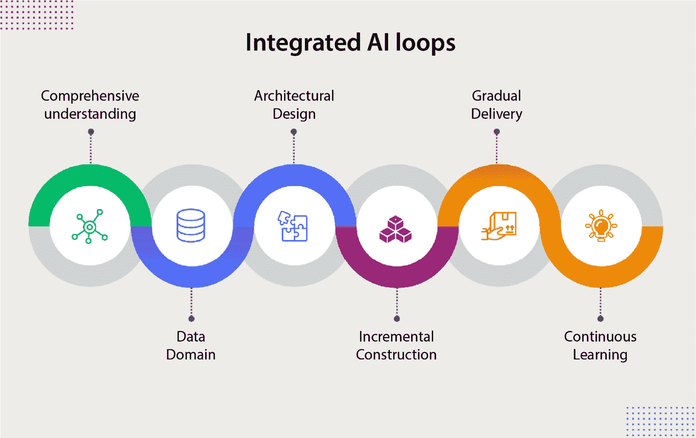

# 第三章：挑战与机遇——将 AI 融入网页项目

在本章中，我们将探讨将**人工智能**（**AI**）融入网页开发项目所面临的实际挑战和激动人心的机遇。我们将深入了解开发人员可能遇到的障碍，并提供有关如何优化机会以有效利用 AI 的见解。通过本章的学习，你将全面了解围绕 AI 集成的网页项目领域。总体而言，本章旨在为你提供必要的知识和技能，以应对将 AI 集成到网页项目中的挑战与机遇。本章中的信息不仅对本书的内容至关重要，而且在现实世界的背景下也非常关键，因为 AI 正日益成为网页开发的基本组成部分。那么，让我们深入探索 AI 在网页项目中的激动人心的集成之旅吧！

在本章中，我们将涵盖以下主要主题：

+   在网页开发中导航 AI 过程

+   为基于网页的 AI 选择和评估模型

+   AI 集成中的伦理考量

+   AI 实施中的风险缓解

+   使用可解释的 AI 使模型更易理解

# 技术要求

要跟随本例，你需要以下内容：

+   一台带有任何操作系统和互联网接入的计算机

+   必需的软件：

    +   Python 3.6 或更高版本 ([`www.python.org/downloads/`](https://www.python.org/downloads/))

    +   一个合适的 IDE 或文本编辑器，如 Visual Studio Code ([`code.visualstudio.com/`](https://code.visualstudio.com/))

    +   一个 Python 网页框架，如 Flask ([`flask.palletsprojects.com/`](https://flask.palletsprojects.com/)) 或 Django (https://www.djangoproject.com/)

    +   机器学习库，包括`scikit-learn`和`pandas`（可通过`pip`安装）

    +   MovieLens 数据集：从[`grouplens.org/datasets/movielens/100k/`](https://grouplens.org/datasets/movielens/100k/)下载 MovieLens 100K 数据集

+   可选但推荐：

    +   一个版本控制系统，如 Git ([`git-scm.com/`](https://git-scm.com/))，用于管理你的项目

    +   一个 Python 网页应用框架，如 Flask 或 Django，用于创建用户友好的界面

将 AI 融入网页开发需要深入理解 AI 过程、网页开发原理和 DevOps 实践。这三者构成了创建稳健且用户友好的网页应用的基础。

首先，让我们定义 AI 过程。它从明确问题和识别具体需求开始，例如，增强一个网页应用的推荐系统以提高用户参与度。接下来的步骤是数据收集和预处理，在这个阶段我们收集用户交互数据，并清理数据以去除噪音或不一致性。选择合适的 AI 模型至关重要；无论是推荐系统中的协同过滤还是基于内容的过滤，选择取决于应用的需求。然后，使用收集的数据训练模型，并应用各种优化技术以提高其准确性。最后，模型被部署并持续监控以保持其有效性。

另一方面，网页开发从精心规划开始，明确目标、目标用户和需求。这个阶段接着是设计应用的视觉和交互方面，通过创建线框图和原型图为开发打下基础。开发阶段涉及编码并将 AI 模型集成到网页应用中，确保无缝的功能。然后进行广泛的测试以保证可靠性和可用性，最后将产品部署并维护以确保最佳性能。

DevOps 实践是这个过程的核心，推动持续开发、集成、测试、部署和反馈。设置 CI/CD 管道进行自动化测试和部署，确保操作顺畅并持续改进。监控和反馈循环对于跟踪应用性能并做出必要的调整至关重要。

为了说明这些概念，我们可以考虑使用 Python 的`scikit-learn`库构建一个个性化的电影推荐系统。通过开发这样的系统，我们可以通过基于用户偏好的量身定制推荐来提升用户在电影流媒体平台上的体验。想象一下，系统从用户交互中学习，预测他们可能喜欢的电影，并不断改进推荐，保持用户的参与感。

# 在网页开发中导航 AI 过程

今天，AI 与网页开发的融合变得越来越重要。为网页开发量身定制的 AI 过程需要深刻理解 AI、网页开发和 DevOps 等各个过程。在本节中，我们将定义每个过程，并讨论它们在网页开发中的重要性。AI、网页开发和 DevOps 等独立过程的整合不仅仅是有益的，它正日益成为一种必需。此外，我们还将探讨将这三者整合以创造强大高效网页解决方案的可能性——集成的 AI 循环。

AI 为 web 应用程序带来了基于数据的决策和个性化的强大能力，而传统的 web 开发则侧重于创建面向用户的 web 服务组件。另一方面，DevOps 填补了软件开发和 IT 运维之间的空白，强调更短的开发周期、增加的部署频率和更可靠的发布，并与业务目标紧密对接。

这一问题的转折点在于，当这些流程各自独立时，可能会导致工作流程割裂，并且团队之间缺乏协同作用。例如，AI 团队如果与 web 开发团队独立工作，可能会开发出不适合实际用户体验的算法，或者在将其模型集成到现有 web 基础设施时遇到瓶颈。同样，如果 AI 和 web 开发团队在持续集成和交付管道方面不同步，DevOps 实践可能得不到充分利用。

为了应对这些问题，采用一种集成的方法至关重要，其中跨职能团队从一开始就共同合作。通过营造一个 AI 专家、web 开发人员和 DevOps 工程师共同协作的环境，组织可以确保 AI 模型在开发时考虑到最终用户体验，确保 web 应用程序能够适配这些模型，并且保证这些应用程序的部署平稳高效。这种集成策略不仅增强了每个领域的效果，而且有助于创建更强大、更用户友好且能更好应对现实需求的 web 解决方案。

## 定义流程

首先，让我们来看看 AI 过程。

**AI 过程**包括多个阶段，能够在 web 项目中开发和实现智能算法。

让我们来看一下这些步骤：

1.  这一过程始于定义问题和明确具体需求。

1.  接下来进行数据收集，紧接着是数据预处理这一关键步骤，以确保为 AI 模型提供高质量的输入。

1.  接下来选择合适的 AI 模型，考虑准确性、复杂性和可扩展性等因素。

1.  使用收集的数据对模型进行训练，并进行验证和调整，以优化其性能。

1.  最后，模型将被评估和解释，以获得洞察并做出明智的决策。AI 模型将被部署，并通过持续监控和维护确保其在实际场景中的有效性。

现在，我们将深入探讨 web 开发。

**网页开发**涵盖了创建和维护网站或网页应用程序的整个生命周期。它从精心规划开始，明确目标、目标受众和需求。接下来是设计阶段，在这一阶段，网站的视觉和互动方面被精心打造。开发涉及编码和构建网站功能。然后进行广泛的测试，确保网站的可靠性和可用性。成功测试后，网站会被部署，使用户可以访问。持续维护确保网站的最佳性能，并保持其与不断发展的技术同步。

最后，让我们来谈谈 DevOps。

**DevOps**是一套结合软件**开发**（**Dev**）和 IT**运维**（**Ops**）的实践方法。它旨在缩短系统开发生命周期，并提供高质量软件的持续交付。DevOps 过程包括持续开发、集成、测试、部署、监控和反馈。持续开发确保开发人员始终如一地交付新功能和改进。集成和测试持续进行，以便及早识别和解决问题。部署和监控确保顺利高效地运作。来自用户和利益相关者的持续反馈有助于改进软件，满足其不断变化的需求。

## 每个过程的重要性

每个过程在网页开发和 AI 集成中都扮演着至关重要的角色。**AI 过程**使得开发智能算法成为可能，这些算法能够增强用户体验并提供有价值的见解。**网页开发过程**确保创建出既美观又具功能性的网站。**DevOps**促进无缝协作、高效工作流和高质量软件的持续交付。虽然所有过程都很重要，但它们的重要性可能会根据具体项目的要求和目标而有所不同。

## 集成过程

集成 AI、网页开发和 DevOps 过程不仅是可能的，而且非常有益。通过结合这些过程，网页开发人员可以利用 AI 算法的力量来增强网站功能、用户体验和决策能力。DevOps 实践确保 AI 模型的顺利集成和部署，而网页开发为 AI 的实现提供平台。这一集成使开发人员能够创建智能化的网页解决方案，为用户和企业带来卓越的价值。以下是 DevOps、网页开发和人工智能（AI）过程的各个阶段对比。每个阶段代表了相应领域中的一个关键步骤，展示了这些领域在工作流程中的契合与差异。

| **阶段** | **DevOps** | **网页开发** | **人工智能** |
| --- | --- | --- | --- |
| 定义/规划 | 规划 | 规划 | 问题定义 |
| 数据收集 | - | - | 数据收集 |
| 数据预处理 | - | - | 数据预处理 |
| 架构/设计 | - | 设计 | 模型选择 |
| 开发 | 持续开发 | 开发 | 模型训练 |
| 测试 | 持续测试 | 测试 | 测试与评估 |
| 优化 | - | - | 模型优化 |
| 实施 |  | 实施 | 部署 |
| 监控 | 持续监控 | - | 监控 |
| 反馈 | 持续反馈 | - | - |
| 维护 | 持续运行 | 维护 | 持续改进 |

表 3.1：DevOps、网页开发与 AI 过程

在网页开发中导航 AI 过程需要具备 AI、网页开发和 DevOps 的专业知识。了解每个过程的重要性对于有效地将 AI 融入网页项目至关重要。通过将这些过程结合起来，开发人员可以利用 AI 的力量，创造出满足用户需求并推动业务增长的智能网页解决方案。

## AI 流程 – 精简 AI 之旅

要有效地将 AI 融入网页项目，至关重要的是按照一个结构良好的流程进行操作，这一流程被称为**AI 流程**。其中包含多个步骤，包括数据预处理、模型选择和部署策略，所有这些步骤旨在优化 AI 在网页项目中的集成。

让我们进入各个步骤：

1.  AI 流程的第一步是*定义当前的问题*。这一初始阶段包括确定需要 AI 解决方案的具体挑战。

1.  一旦问题被定义，我们就进入*数据收集*阶段。收集相关数据是至关重要的，这些数据将作为训练 AI 模型的基础。

1.  在数据收集之后，下一阶段是*数据预处理*。此步骤包括清理、转换和组织收集到的数据，以确保其质量和适合用于训练 AI 模型。数据预处理在提高模型的准确性和可靠性方面发挥着至关重要的作用。

1.  一旦数据被预处理，下一步是*选择最合适的 AI 模型*。这个阶段需要在模型选择上具备专业知识，需要考虑网页项目的具体需求。对不同 AI 模型及其优势的深入理解，对于做出明智的选择至关重要。

1.  在模型选择之后，选定的模型进入*训练阶段*。在这一阶段，AI 模型会从预处理的数据中学习，以做出准确的预测或分类。训练过程包括调整模型参数并优化其性能，以实现预期的结果。

1.  训练完成后，模型进入*测试与评估阶段*。会进行严格的测试以评估模型的表现，并识别潜在的不足之处。这个阶段有助于微调模型，确保其在部署前的可靠性。

1.  一旦模型被认为令人满意，它将进入*优化*阶段。这个阶段旨在进一步提升模型的性能、效率和可扩展性。通过实施优化策略，确保模型能够处理实时数据，并持续提供准确的结果。

1.  最终，经过充分优化的 AI 模型准备好进行*部署*。这一阶段包括将模型集成到网页项目中，使其可供用户或客户访问。需要仔细考虑，确保无缝集成和良好的用户体验。

然而，AI 的旅程并不以部署为终点。AI 管道的最后阶段是*持续改进*。随着新数据的出现和用户反馈的收到，模型会被精炼和更新，以适应不断变化的需求并在时间的推移中提高性能。

总结来说，**AI 管道**是一个系统化的过程，指导 AI 模型在网页项目中的开发、测试和部署。通过遵循这个明确的管道，网页开发者可以有效地利用 AI 的力量，确保项目的成功。

## 集成 AI 循环——简化网页应用的 AI 开发

在今天的数字时代，利用 AI 的力量已经成为开发前沿网页应用的关键。然而，开发和部署 AI 模型的过程往往复杂且耗时。这时，**集成 AI 循环**就发挥了作用。

AI 集成管道是*一个结构化的迭代、增量和持续的过程，旨在简化 AI 模型在网页应用中的开发和部署*。通过结合 AI 和 DevOps 领域的最佳实践，这个管道确保模型能够高效、有效地开发和部署，如*图 3.1*所示。



图 3.1：AI 循环集成过程

管道由*六*个相互连接的循环组成，每个循环都有其特定的目标。让我们更详细地探索这些循环：

1.  首先，我们有*全面理解循环*。这个循环的目标是明确 AI 模型将要解决的问题，识别功能性和非功能性的需求，建立质量标准，并理解项目的需求和优先级。这个循环还包括为评估模型表现定义成功指标。

1.  接下来是*数据领域循环*。在这个循环中，我们专注于收集、清理、转换和分析将用于训练和测试 AI 模型的数据。这确保了模型能够获得高质量的数据，以实现最佳性能。

1.  接下来是*架构设计循环*。其目标是定义系统架构，使 AI 模型能够与网页应用无缝集成。这包括设计系统、制作原型，并为当前任务选择最合适的 AI 模型。

1.  *增量构建循环*是 AI 模型被实现、测试、评估和优化的阶段。这个周期确保了模型的精准开发、严格测试，并且不断改进，以提供最佳的性能。

1.  一旦 AI 模型准备就绪，我们就进入*渐进交付循环*。这一周期涉及将 AI 模型与 web 应用集成，进行全面测试，最终将其部署到生产环境中。这确保了从开发到实际部署的平稳过渡。

1.  最后，我们进入*持续学习循环*。这个周期专注于持续监控 AI 模型在生产中的表现，收集用户反馈，并自动响应变化。这使得模型能够不断改进和增强其功能。

集成 AI 循环旨在提供一种结构化和迭代的方法，以高效且有效地在 web 应用中开发和部署 AI 模型。通过结合 AI 和 DevOps 的最佳实践，这一管道确保 AI 模型满足用户需求和商业目标。

在 web 开发中掌握适应 AI 过程的专业技能至关重要。这包括掌握数据预处理、模型选择和部署策略等技能，同时优化 AI 在 web 项目中的集成。

总结来说，AI 集成管道是一个强大的工具，它使组织能够更高效、更有效地开发和部署 AI 模型。通过遵循这一结构化和迭代的过程，开发人员可以创建满足用户需求并实现商业目标的 AI 驱动的 web 应用。拥抱 AI 集成管道是利用 AI 在 web 开发中最大潜力的一步。

在将集成 AI 循环确立为组织开发和部署 AI 模型时提高效率和效能的关键资产后，我们现在转向选择和评估基于 web 的 AI 模型这一至关重要的过程。选择合适的模型非常重要，因为它直接影响到 AI 在 web 应用中的集成性能和成功。在接下来的章节中，我们将深入探讨这个选择过程中的关键步骤和注意事项。我们将重点确保所选模型不仅满足应用的具体需求，还能保持所需的可靠性和准确性标准，以实现最佳的 AI 性能。这一步是将 AI 潜力转化为实际、以用户为中心的解决方案，并与商业目标对齐的基础。

# 选择和评估基于 web 的 AI 模型

选择正确的 AI 模型对于优化性能至关重要。本部分涵盖了定义模型选择标准、选择验证策略和选择适当的评估指标。使用交叉验证比较不同模型，如逻辑回归和聚类，帮助识别最适合任务的模型。使用准确率、精度和 AUC 等指标评估模型性能，确保所选模型满足应用需求。

例如，实施情感分析模型以评估客户对产品的反馈涉及使用**自然语言处理**（**NLP**）技术来预处理和分析文本数据。比较像朴素贝叶斯、支持向量机（SVM）和 BERT 等模型，可以帮助我们选择最有效的模型。这种方法确保 AI 系统不仅准确，而且高效且可扩展。

## 流程

选择和评估 AI 模型的过程可以分为以下几个阶段：

1.  **定义模型** **选择标准**。

    在这一阶段，定义用于评估候选模型的标准至关重要。这些标准包括以下内容：

    +   Web 应用的特定需求

    +   性能考虑

    +   与现有数据的契合度

    +   可扩展性

    +   实施难易度

    +   可解释性

    +   道德考虑

1.  **选择合适的** **验证策略**。

    验证策略决定了如何划分数据以评估模型的性能并估算其未来表现。以下是一些策略的示例：

    +   **训练-测试划分**：一种简单的划分方法，但在小数据集或类别不平衡的情况下可能存在局限性。

    +   **分层 k 折交叉验证**：在不同的折叠中保持类别比例，这对于分类问题非常重要。

    +   **交叉验证**：在多个数据分区上评估模型，提供更稳健的性能估计。

1.  **选择正确的** **评估标准**。

    选择正确的评估标准对机器学习项目的成功至关重要。它应该与商业目标保持一致，并反映出模型所需的价值和优化。性能评估指标可以按以下类别进行分类：

    +   **准确率**：模型正确预测的比例。

    +   **评分指标**：为模型性能提供单一分数，便于比较。例如，精度、召回率和 F1 分数。

    +   **曲线下面积（AUC）指标**：提供稳健的模型性能衡量，特别适用于类别不平衡的分类问题。

    选择正确的评价标准对于比较模型并选择最适合任务的模型至关重要。请记住，每个评价标准都有其局限性，通常会使用多个标准进行全面评估。

1.  **识别** **潜在模型**。

    在这一阶段，关键是识别能够满足先前定义要求的不同类型的人工智能模型。模型可以是有监督的（例如逻辑回归）或无监督的（例如聚类）。

1.  **训练与** **评估模型**。

    在确定潜在模型后，下一步是将其在训练数据集上进行训练，并在验证数据集上进行评估。在此过程中，可以进行超参数调整。

1.  **模型选择**。

    根据评估结果，选择最符合步骤 1 中定义的标准的模型。考虑的不仅仅是性能，还包括模型复杂性、训练时间和可解释性等因素。

1.  **模型测试**。

    最后，在测试数据集上测试选定的模型，以获得其性能的无偏估计。如果令人满意，该模型可以部署用于网页应用。

观察是什么？让我们来看看。

## 观察

选择和评估人工智能模型的过程是迭代的，可以随着时间的推移进行调整。本指南提供了一个稳固的框架，但也具有根据每个项目的细微差异进行调整的灵活性。成功的关键在于仔细选择标准、验证策略和评估指标，并与每个网页应用的具体目标保持一致。

在详细说明了为网页应用选择和评估人工智能模型的过程，强调了与项目目标一致的严格测试和选择标准的重要性后，我们必须将注意力转向人工智能集成中的道德考量。这一关键环节超越了技术层面，探讨了负责任的人工智能实施如何积极影响社会，并突显出优先考虑隐私、透明度和公平性的必要性。通过这一过渡，我们强调了不仅要关注如何构建和实现人工智能技术，更要关注为何以及为谁开发这些技术，确保技术进步能以公平和道德的方式造福每个人。

# 人工智能集成中的道德考量

当我们利用人工智能的力量进行网页开发时，必须正视并解决在这一过程中出现的道德考量。本节旨在探讨道德考量在人工智能集成中的重要性及其对社会的影响。

道德考量在确保人工智能在网页开发中负责任且可追责的使用方面发挥着至关重要的作用。作为开发者，我们必须在适应于网页开发的人工智能过程上培养专业技能。这涉及到理解数据预处理、模型选择和部署策略，同时优化人工智能在网页项目中的集成。

伦理考量的重要性在于它们能够防范人工智能系统中可能嵌入的偏见和歧视性做法。这些系统由大量数据驱动，如果数据未经过精心筛选，可能会延续社会不平等现象。通过以伦理的视角推进人工智能整合，我们可以积极努力减少这些偏见，确保公正和包容性的结果。

此外，人工智能对社会的影响不容小觑。基于人工智能的网页项目有潜力彻底改变各行各业，提高效率并增强用户体验。然而，如果缺乏伦理考量，这些进展可能会带来意想不到的后果。隐私侵犯、工作岗位流失和算法偏见等问题可能会出现，从而危及个人和社区的信任与福祉。

为了减轻这些风险，我们必须在人工智能整合过程中优先考虑伦理问题。这包括对人工智能系统进行持续评估和监控，重点关注透明度和问责制。通过采用以人为本的方法，我们可以确保人工智能作为一种工具，增强人类的能力，而非取代它们。

在将人工智能整合到网页开发中时，伦理考量至关重要。通过在网页项目中发展专门的人工智能流程，并优先考虑伦理实践，我们可以在充分发挥人工智能潜力的同时，避免偏见和负面的社会影响。作为开发者，我们有责任以诚信态度对待人工智能整合，确保它符合个人和社区的价值观和需求。只有通过伦理考量，人工智能才能真正为建立一个更加包容和公平的社会做出贡献。

## 伦理人工智能整合中的挑战

作为开发领域的专家，我们理解将人工智能整合到项目中的重要性。然而，我们必须解决几个挑战，确保人工智能的伦理使用。在本节中，我们将讨论四个关键挑战：人工智能模型中的偏见、缺乏可解释性、数据隐私问题和问责漏洞。

伦理人工智能整合中的主要挑战之一是*人工智能模型中的偏见*。人工智能系统的训练数据可能反映出社会中的偏见，导致歧视性结果。作为开发者，我们需要意识到这一偏见，并采取措施减轻其影响。这可能涉及确保数据多样性和代表性、定期审查人工智能系统，以及不断优化和改进模型，以最小化偏见。

另一个挑战是*AI 模型缺乏可解释性*。随着 AI 变得越来越复杂和先进，理解和解释这些模型所做决策变得越来越困难。缺乏透明性可能会导致不信任，并阻碍 AI 技术的普及。为了解决这一挑战，我们需要开发可解释的 AI 模型和技术，提供有关模型如何做出决策的洞察。这将有助于建立信任，并让用户理解和验证 AI 决策背后的推理。

**数据隐私**是 AI 集成中的一个重要问题。AI 系统依赖大量数据来进行训练和决策。然而，这些数据通常包含敏感的个人信息，因此保护用户隐私至关重要。作为开发人员，我们必须通过实施强大的安全措施、尽可能匿名化数据以及遵守相关隐私法规来优先考虑数据隐私。通过这样做，我们可以确保 AI 集成尊重用户隐私并保持信任。

我们在伦理 AI 集成中面临的最后一个挑战是*问责漏洞*。AI 系统可能会犯错或产生意外后果，从而引发责任和问责的问题。建立明确的问责线并确保有机制来解决出现的任何问题至关重要。这可以包括制定负责任的 AI 开发指南和框架、进行定期审计和评估，以及实施反馈循环以不断改进和解决任何不足之处。

将 AI 集成到网页开发项目中存在多个挑战，需要解决这些问题以确保道德使用。通过承认并积极解决 AI 模型中的偏见、促进可解释性、优先考虑数据隐私以及建立问责机制，我们可以应对这些挑战，创建更加道德和负责任的 AI 集成过程。作为开发人员，我们有责任在这些领域发展专业知识，并为 AI 在我们项目中的负责任集成而努力。

在探讨了伦理 AI 集成的关键挑战之后，包括解决偏见、确保可解释性、保护数据隐私和建立问责制，我们现在将重点转向缓解 AI 实施风险所需的积极措施。这一过渡强调了不仅要识别潜在的伦理陷阱，还要积极参与防止它们的策略。在下一节中，我们将深入探讨在网页开发项目中对 AI 部署进行伦理评估的案例研究。

### 案例研究——InnovaTech 的 AI 实施伦理评估

在本案例研究中，我们将研究初创公司 InnovaTech 实施的人工智能系统，该系统旨在优化招聘过程。该系统使用机器学习算法分析简历和技能测试表现，旨在消除候选人筛选中的人工偏见，并提高流程效率。然而，在实施后，出现了报告，表明该系统可能加剧了性别和种族偏见。

#### 案例研究目标

本案例研究旨在识别与人工智能系统实施相关的伦理挑战，并制定实际解决方案以缓解这些问题。它旨在促进关于开发人员和公司在部署人工智能技术时的责任的批判性讨论。

#### 背景

InnovaTech 是一家新兴的科技公司，旨在通过人工智能创新招聘流程。开发的系统承诺减少人为偏见并提高筛选过程的效率。然而，在实施几个月后，用户反馈开始表明系统偏袒某些特定人口群体，提出了关于该人工智能解决方案的公平性和伦理性的问题。

#### 确定的伦理问题

以下是已识别的伦理问题：

+   **数据偏见**：算法偏向某些人口群体，可能反映了训练数据中存在的偏见

+   **算法透明度**：人工智能系统如何做出决策的方式缺乏清晰度

+   **同意与隐私**：关于候选人数据如何被收集、使用和保护的担忧

#### 详细分析

现在，让我们更深入地分析一下：

+   **数据偏见**：我们将研究用于训练算法的数据集如何可能以某种方式组成，从而反映或延续现有的社会不平等

+   **透明度**：我们将讨论人工智能系统能够解释其决策的重要性，特别是在那些对人们生活产生重大影响的应用中，例如招聘过程

+   **同意与隐私**：我们将评估 InnovaTech 关于使用候选人数据的隐私政策，检查其是否符合如 GDPR 等法规的要求

#### 提出的解决方案

为有效解决人工智能实施中的挑战，可以提出几种战略解决方案。这些解决方案旨在增强人工智能系统的公平性、透明度和隐私性，确保它们可靠且符合伦理。

+   **数据审计与审核**：实施定期的审查和数据集审计，以识别和纠正偏见

+   **提高透明度**：开发一个界面，允许用户理解人工智能系统如何做出决策

+   **加强隐私政策**：审查并加强隐私政策，确保候选人完全了解他们的数据如何被使用

#### 讨论

这个案例研究提出了关于 AI 伦理角色的关键问题，以及公司如何应对实施公平和透明技术的挑战。讨论应包括多方视角的考虑，包括 AI 开发者、最终用户（公司和候选人）以及监管者的观点。

#### 结论

InnovaTech 案例研究是理解 AI 实施中伦理复杂性的一个重要例子。提出的解决方案旨在在技术创新与伦理责任之间创造平衡，确保技术为所有相关方的利益服务。

下一部分将深入探讨综合策略，不仅解决具体的伦理问题，还增强 AI 系统在应对一系列潜在风险时的整体韧性。

# AI 实施中的风险缓解

在网络开发领域，AI 技术的实施在快速发展的环境中提供了前所未有的机会，以提升用户体验、简化操作流程并解锁创新解决方案。然而，这一发展也带来了一系列伦理和操作风险，如果没有充分解决，这些风险可能会削弱 AI 所承诺的好处。这些风险包括决策算法中的偏见、隐私问题等，给开发者和组织带来了重大挑战。因此，必须以审慎的考虑和伦理意识来应对 AI 的实施。

为了有效应对这些挑战并确保在 Web 应用中负责任地部署 AI，必须采取多维战略。这一战略包括伦理 AI 框架的开发、建立多元和包容的开发团队、持续监控和维护 AI 模型，以及健全的数据治理实践等。通过采纳这些关键策略，开发人员和组织能够缓解与 AI 实施相关的潜在风险，确保 AI 技术以创新的同时，也具备伦理和社会责任感。让我们深入探讨这些策略。

## 伦理 AI 框架

作为开发人员，我们理解将 AI 融入项目中的重要性。它使我们能够提升用户体验并提供个性化的解决方案。然而，至关重要的是，我们必须在开发 AI 时始终保持强大的伦理框架。

培养在网络开发中运用 AI 过程的专业技能是我们优先考虑的事项。这包括理解数据预处理、模型选择和部署策略。通过优化 AI 在我们网络项目中的集成，我们确保伦理考量始终处于决策的前沿。

**伦理 AI 框架**作为我们的指南，帮助我们在整个开发过程中做出负责任的选择。这些框架帮助我们解决潜在的偏见问题，确保我们的 AI 算法公平和透明。通过遵循这些框架，我们可以减少意外后果和歧视性结果的风险。

伦理 AI 框架是结构化的指南或一套原则，旨在引导 AI 技术的开发、部署和使用，优先考虑伦理问题，如公平、问责制、透明性和对人权的尊重。

这些框架通常涵盖广泛的伦理问题，包括但不限于以下内容：

+   **偏见与公平**：确保 AI 系统不会延续或加剧对某些群体或个体的偏见，致力于为所有用户实现公平的结果

+   **透明性**：使 AI 系统的工作原理对用户和利益相关者可理解，帮助他们了解决策如何做出或结果如何产生

+   **问责制**：建立清晰的责任体系，确保 AI 系统的结果负责，并在发生损害时提供补救机制

+   **隐私与数据保护**：保护 AI 系统处理的个人数据，遵守数据保护法律和原则，确保用户隐私得到尊重

+   **安全与保障**：确保 AI 系统安全、可靠地运行，不对用户或公众造成风险

+   **人工监管**：保持人工对 AI 系统的控制，确保自动化决策可以被审查，并在必要时由人类干预

伦理 AI 框架通常借鉴跨学科的见解，包括哲学、法律、社会科学和计算机科学，以应对这些复杂问题。组织、政策制定者和开发者通常将其作为指南，进行风险评估、设计伦理 AI 解决方案，并实施治理结构，确保 AI 技术积极贡献于社会而非造成危害。

除了技术考虑，伦理 AI 框架还鼓励协作和跨学科讨论。我们积极与各领域的专家合作，获取多样化的视角和见解。这种协作方法使我们能够考虑 AI 项目的社会、文化和伦理影响。

通过遵循伦理 AI 框架，我们确保我们的 AI 解决方案能够惠及整个社会。我们认识到，作为网络开发者，我们有责任创造透明、公平、负责任的 AI 系统。通过持续学习和适应，我们努力改善我们的伦理 AI 实践，并为负责任的 AI 技术发展作出贡献。

## 多元化和包容性的 AI 开发团队

通过营造一个重视不同视角和经验的环境，我们可以创造出更有效、公平和伦理的 AI 系统。

我们团队中一个关键的优先技能是熟练掌握针对网页开发定制的人工智能流程。这涉及掌握数据预处理、模型选择和部署策略等多个技术方面。通过精炼这些技能，我们确保我们的人工智能解决方案能够无缝地融入网页项目，优化其性能和影响力。

然而，单纯关注技术专长是不够的。我们认识到团队组成中多样性的重大意义。通过汇聚来自不同背景、文化和身份的人，我们丰富了集体知识，拓宽了视野。这种多样性使我们能够开发更为强大的人工智能系统，因为它们设计时能够满足更广泛的用户群体和不同情境。

**包容性**是我们坚持的另一个基本价值观。我们相信每个人都应该拥有平等的机会参与并发表意见。通过创建一个安全和包容的空间，我们鼓励合作、开放对话和思想交流。这种包容性的环境促进了创造力和创新，使我们能够开发出真正满足多样化用户需求的人工智能解决方案。

为了确保我们的人工智能开发团队真正多样化和包容，我们积极寻求来自人工智能领域代表性不足群体的个体。我们提供导师支持、帮助和资源，帮助他们在工作中茁壮成长并取得成功。通过培养多样化的人才池，我们不仅促进了平等和社会正义，还发掘了丰富的未被开发的潜力和人才。

## 通过持续的监控和维护确保人工智能模型的最佳性能

在网页开发领域追求人工智能卓越的过程中，我们对持续监控和维护的承诺成为核心。这种坚定的专注确保了我们的人工智能模型在实际场景中的持续有效性。通过实施强大的监控系统，我们需要认真跟踪性能指标、准确性水平以及模型中可能存在的偏差。这种主动的方式使我们能够迅速识别并纠正任何问题，从而确保我们的人工智能解决方案的最佳功能。

为了达到这一运营卓越的标准，定期更新和重新训练我们的模型变得至关重要。我们意识到数据的动态特性，它的模式不断演变，因此我们在人工智能模型中积极拥抱灵活性。通过保持对最新进展和行业最佳实践的关注，我们不断提升模型的性能和准确性。

在针对网页开发定制的人工智能领域中，熟练掌握其导航技巧成为我们技能的一个显著标志。我们的团队拥有数据预处理技术、模型选择策略和部署优化方面的专业知识。这种熟练程度使我们能够将人工智能无缝地融入到网页项目中，释放其全部潜力，取得卓越成果。

持续监控和维护我们的 AI 模型，是确保其可靠性、准确性和公正性的保证。我们的总目标应是为客户提供符合其当前需求的 AI 解决方案，并具有随着需求变化而不断发展的适应能力。我们深知交付一致且高质量结果的重要性，因此，我们精心设计的监控和维护过程旨在准确实现这一目标。

## 可解释性和可理解性——提高模型的可解释性并有效地传达 AI 决策

在 AI 的动态环境中，不仅要培养驾驭 AI 流程复杂性的专业知识，还要理解**可解释性**和**可理解性**的重要性。随着 AI 无缝集成到各类网页开发项目中，提升模型的可解释性并阐明 AI 决策变得尤为重要。

提高模型的可解释性是一项每个 AI 从业者都应该培养的技能。通过在数据预处理、模型选择以及针对网页开发的部署策略方面获得专业知识，AI 专业人员可以优化 AI 在网页项目中的集成。这项技能使我们更好地理解 AI 模型的内部工作原理，从而准确地解释和传达它们的决策。

然而，如果我们不能有效地传达 AI 决策，仅仅提高模型的可解释性是不够的。沟通在与用户和利益相关者建立信任与透明度方面起着至关重要的作用。重要的是以清晰简洁的方式传达 AI 决策，确保技术人员和非技术人员都能轻松理解。

为了实现有效沟通，我们必须避免使用行话，并采用人性化的方法。通过采用信息性和原创性的语气，我们可以提供有价值的见解，而不会用技术术语让观众感到困惑。相反，我们应该努力以简单且易于理解的方式呈现复杂的 AI 决策，确保信息传达真实无误。

## 强大的数据治理——实施强有力的数据治理政策和数据质量保障

在数字时代，数据已成为各行各业企业的资产。然而，随着数据的丰富，便需要一个全面的数据治理框架。通过建立强大的数据治理体系并确保数据质量保障，您将能够优化 AI 在网页项目中的集成，确保获得准确且符合伦理的结果。

### 强大的数据治理

为了为成功的 AI 驱动网页开发打下基础，必须建立强有力的数据治理政策和程序。这包括为数据收集、存储和使用定义清晰的指导方针。通过这样做，您将创建一个确保个人信息隐私和安全的坚实框架。

数据治理的一个关键方面是实施**匿名化**和**加密**等技术。这些措施通过确保个人数据保持机密并且无法被未经授权的方访问，从而保护个人隐私。通过将这些技术纳入到你的 AI 模型中，你可以建立信任并增强用户的信心。

### 数据质量保障

正如俗话所说，*垃圾进，垃圾出*。在训练 AI 模型用于网页开发时，这一原则同样适用。确保数据质量保障对于实现准确可靠的结果至关重要。

为了避免 AI 模型中的偏见和不准确，使用干净、精确且具有代表性的数据至关重要。通过精心策划数据集并去除任何异常值或无关信息，你可以提高模型的表现，并最小化不公平或不准确结果的风险。

此外，处理缺失数据同样重要。缺失数据可能会引入偏见，并妨碍 AI 模型的有效性。通过实施缺失数据处理策略，如插补技术或数据增强，你可以缓解这些问题，并确保结果的完整性。

## 人类监督与干预——确保网页开发中 AI 的准确性与公平性

在网页开发领域迅速发展的 AI 技术中，维持持续的人类监督成为至关重要的组成部分。这种监督起到了保护作用，能够减轻系统可能无意中忽略的潜在错误和偏见。

除了技术能力外，人类监督的关键作用更是不可过分强调。它是识别 AI 系统可能引入的潜在错误或偏见的基石。

尽管 AI 技术不断进步，但机器并非万无一失。它们偶尔会产生不准确或有偏见的结果。此时，人类干预变得尤为重要。通过维持一定程度的人类监督，网页开发人员可以有效地发现并修正他们所使用的 AI 系统中的任何错误或偏见。

人类监督的主要责任之一是确保在网页开发项目中使用的 AI 模型的准确性。通过密切监控这些模型的表现，网页开发人员可以发现预期结果与实际结果之间的任何差异。这使他们能够进行必要的调整和改进，从而产生更可靠、更精确的 AI 应用。

偏见是 AI 系统中普遍存在的一个问题，因为它们可能无意中延续不公或歧视。人类监督使我们能够识别并解决这些偏见，确保用于网页开发项目的 AI 系统保持公平和无偏见。通过审查数据集、评估训练过程以及进行定期审计，开发人员可以最大限度地减少偏见结果的可能性。

## 揭示定期审计和文档记录在人工智能系统中消除偏见和确保公平性的重要性

我们遇到了一个需要关注的方面：定期审计和文档记录，以确保消除偏见和保障公平性。通过这样做，我们可以识别并纠正可能无意间进入算法中的任何偏见。这些审计是确保我们的人工智能系统公正、无偏见并与道德原则相一致的有力工具。定期审计使我们能够发现任何隐藏的模式或歧视性做法，从而让我们及时采取纠正措施。

另一个方面涉及文档在确保人工智能系统透明性和问责制中扮演的核心角色。保持对开发过程、数据来源和算法决策的详细记录，建立起一条全面的轨迹，揭示人工智能系统的内部运作。除了促进内部理解，详细的文档也为外部审查提供了机会，增进了用户和利益相关者的信任与信心。

**透明性**是负责任的人工智能开发的基石。通过定期审计我们的人工智能系统并保持详细的文档记录，我们展示了对透明性的承诺，提供了有关算法如何做出决策的洞察力。这种透明性使我们能够解决与偏见和公平性相关的任何问题，最终确保我们的人工智能系统对其行为负责。

在追求技术卓越的过程中，我们不应忽视人工智能开发中的人文因素。定期审计和文档记录不仅是技术流程，还是道德责任。因此，我们有能力塑造未来并影响人们的生活。通过采纳一种真实且人性化的方法，我们认识到人工智能系统对社会的影响，并努力创造一个更美好、更公正的世界。

本节讨论了在网络开发中实施人工智能时，降低风险和确保道德考虑的重要性。强调了需要一个道德人工智能框架来应对偏见，促进公平性和透明性，并保护用户隐私。本节还突出了多元化和包容性的人工智能开发团队的重要性，因为他们带来不同的视角和经验，能够创造更有效且无偏的人工智能系统。强调了需要持续监控和维护人工智能模型，以确保其最佳性能和准确性。此外，本节强调了可解释性和可理解性在有效传达人工智能决策中的重要性，并提出了建立强大的数据治理政策和数据质量保证的必要性。强调了人工监督在识别人工智能系统中的错误和偏见中的作用，以及定期审计和文档记录在确保公平性和透明性方面的重要性。

现在我们已经讨论了确保道德 AI 集成的复杂性，关注偏见缓解、数据治理和多元化视角的重要性，让我们过渡到下一个关键方面：可解释 AI——使模型易于理解。这个转变强调的不仅是负责任地部署 AI 系统，还要使其操作透明且能被所有利益相关者理解。通过使 AI 模型更加可解释，我们旨在弥合复杂算法与其现实应用之间的鸿沟，确保用户能够信任并有效地与 AI 驱动的解决方案互动。让我们探索如何揭开 AI 的神秘面纱，使其决策更加易于理解，过程更加可追溯。

# 通过可解释 AI 使模型易于理解

在本节中，我们将讨论如何构建超越单纯准确性的模型，拥抱真正理解的领域。这正是可解释 AI 概念作为指引之光的出现之处。从本质上讲，可解释的 AI 体现了 AI 系统解开其决策过程复杂性的能力，编织出一种不仅透明而且对用户深入理解的叙事。它是关于揭开技术魔法的面纱，确保 AI 体验成为一种对话，而不是算法的独白。

可解释 AI 指的是以一种人类能够理解其操作、决策和过程的方式开发 AI 系统。这是一种优先考虑透明度的 AI 方法，使用户和利益相关者能够理解 AI 模型如何做出预测或决策，以及这些决策是基于什么做出的。这种方法至关重要，原因如下：

+   **信任**：通过使 AI 系统可解释，开发者和公司可以与用户建立信任。当用户理解一个 AI 系统如何得出结论时，他们更可能信任其判断和建议。

+   **问责制**：可解释的 AI 促进了问责制。它允许检查和证明 AI 所做决策的合理性，使得能够识别出何时以及为何做出了错误的决策。这在医疗、金融和法律等敏感领域尤为重要，因为这些决策可能对人们的生活产生重大影响。

+   **调试与改进**：可解释的模型使开发者更容易识别 AI 决策过程中的错误或偏见。这不仅有助于调试，也有助于随着时间的推移优化和改进模型。

+   **合规性**：随着 AI 相关法规的日益增加，例如**欧盟**（**EU**）的**通用数据保护条例**（**GDPR**），其中包括对解释权的规定，可解释性在许多情况下成为法律要求。

+   **伦理决策**：可解释 AI 通过揭示模型如何考虑各种因素，支持伦理决策，帮助确保 AI 系统不会延续或加剧偏见。

伦理考虑在讨论可解释 AI 时也变得至关重要。通过为决策提供解释，AI 模型可以帮助防止偏见或歧视性行为。它使得评估所考虑因素变得公平，确保透明度和问责制。

此外，可解释 AI 对于合规性至关重要。例如，欧盟的 GDPR 要求处理个人数据的 AI 系统必须具有透明性和可解释性。类似地，欧盟提出的《人工智能指令》强调了可解释性作为负责任的 AI 开发和使用的基本原则。

为了实现可解释性，AI 开发者可以采用多种技术和方法，包括但不限于以下内容：

+   **模型透明性**：使用本身就能提供更多透明度的简化模型，如线性回归或决策树，在这些模型中，决策过程更容易理解。

+   **特征重要性**：突出模型在做出预测时认为最重要的特征（输入变量），这能提供对模型推理过程的洞察。

+   **事后解释**：在复杂模型（如深度学习）做出预测后，应用工具和技术来解释其行为。例子包括**局部可解释模型无关解释**（**LIME**）和**夏普利加性** **解释**（**SHAP**）。

+   **可视化**：利用图形化的数据和模型决策表示，使 AI 系统的工作原理对非专业用户更为易懂。

将可解释性融入 AI 开发，确保 AI 系统不仅强大且准确，还能与社会对透明性、公平性和问责制的价值观保持一致。随着我们将 AI 逐步整合进日常生活中的各个方面，通过可解释的 AI 让 AI 变得易于理解，将是实现这些目标的关键。

理解可解释 AI 的重要性至关重要，原因有很多。首先，它促进了对 AI 技术的信任和采纳。当用户能够理解模型如何做出特定决策时，他们更有可能信任其输出并有效使用它。在医疗或金融等敏感领域，这一点尤其重要，因为 AI 系统做出的决策可能会产生重大后果。

现在，你可能想知道为什么或如何可解释 AI 对用户更为友好。让我们来解答这个问题。

可解释 AI 允许用户通过多种方法和工具来理解 AI 模型的决策过程，这些方法和工具旨在揭示和解释这些系统的内部运作和逻辑。以下是可解释 AI 如何促进这一理解：

+   **简化模型**：一些人工智能模型，如决策树或线性回归，本身更具可解释性，因为它们的决策过程直接且合乎逻辑。这些模型使用清晰的规则系统或加权因素，易于跟随和理解。

+   **特征重要性**：该技术识别并排名在模型决策过程中最具影响力的特征（输入变量）。通过理解哪些特征被赋予更多的重要性，用户可以了解模型是如何做出决策的。例如，在一个贷款审批的人工智能系统中，模型可能将信用评分、收入和就业历史视为影响决策的主要因素。

+   **模型无关工具**：如**局部可解释模型无关解释**（**LIME**）和**夏普利加性解释**（**SHAP**）等工具可以与任何人工智能模型一起使用，为单个预测提供解释。这些工具将模型的预测分解为易于理解的格式，展示每个特征如何影响最终决策，即便是像神经网络这样复杂的模型也能适用。

+   **可视化技术**：可视化可以使复杂的数据和模型更易于理解。例如，热图可以显示在图像识别任务中，模型决策过程中最重要的图像部分。类似地，决策树可以通过可视化展示从特征到结果的路径。

+   **基于示例的解释**：提供类似案例或人工智能系统过去做出的决策示例，可以帮助用户理解决策背后的理由。例如，如果一个人工智能系统推荐某种药物，它也可能提供类似病患档案和该药物使用结果的示例。

+   **反事实解释**：这些解释描述了改变某些输入变量如何可能改变结果。例如，在一个贷款被拒的案例中，反事实解释可能表明，提高收入水平或减少债务金额可能会导致审批，从而帮助用户理解决策标准。

用户，特别是那些没有技术背景的用户，可以利用这些方法深入了解人工智能的决策过程。对于关键应用领域，如医疗或金融，了解人工智能决策的依据可以增强对技术的信任，确保其被负责任且有效地使用。此外，这种理解还可以促使用户提供更准确和相关的数据，以提高人工智能系统的性能，形成一个反馈循环，增强人工智能的可靠性和可信度。

然而，实现模型可解释性并非没有挑战。深度学习模型因其复杂性和黑盒特性而使得理解其决策过程变得困难。简化与准确性之间的平衡是一种需要小心管理的权衡。

为了解决这些挑战，出现了多种模型可解释性技术。特征重要性分析帮助我们理解哪些变量对模型输出的影响最大。像 LIME 和 SHAP 这样的技术提供了对模型局部行为的洞察，帮助用户理解单一预测。决策树和基于规则的模型提供了比复杂深度学习架构更易于解释的替代方案。

可解释 AI 在使 AI 模型易于理解和透明化方面起着至关重要的作用。它对建立信任、确保伦理实践以及遵守监管要求至关重要。尽管存在挑战，但模型可解释性的技术不断发展，使我们能够在准确性和可理解性之间找到合适的平衡。

现在，我们已经探讨了可解释性在 AI 中的重要性以及实现它的各种技术，让我们深入了解一个实际应用，看看这些概念如何付诸实践。个性化电影推荐是 AI 如何根据个人偏好进行调整，同时保持透明度和可理解性的一个有趣示例。通过这个示例，我们将研究如何应用可解释的 AI 技术来提高用户信任和满意度，展示复杂算法预测与用户理解电影推荐生成过程之间的平衡。从理论到应用的过渡突显了使 AI 模型不仅强大，而且对最终用户来说也能访问和透明的实际好处。

# 将 AI 集成到 Web 项目中的示例——使用 AI 进行个性化电影推荐

在本章中，我们将深入探讨一个实际的示例，展示如何将 AI 技术应用于丰富 Web 应用程序的功能。具体来说，我们将探索如何使用 Python 的`sklearn`库构建一个个性化电影推荐系统。这个库提供了广泛的机器学习和数据分析工具与算法，是开发者在将 AI 能力融入项目时的宝贵资源。

本示例的目的是展示如何利用 AI 通过个性化推荐增强电影流媒体平台的用户体验。基于对用户偏好模式和电影特征的详细分析，AI 算法能够识别相似性和关联性，从而建议那些更有可能吸引特定用户的电影。通过这个示例，我们不仅希望展示 AI 在 Web 开发中的具体应用，还要突出在将 AI 技术集成到现有 Web 项目中时所面临的挑战和机遇。这个示例为 AI 的变革潜力提供了一个窗口，揭示了它如何被用来创造更丰富、更动态和个性化的 Web 体验。

### 项目概述

展示在现实世界中集成 AI 到网页项目中的应用，开启创建高度个性化用户体验的大门。设想一下，用户会根据其观看历史收到量身定制的电影推荐。在本示例中，我们将演示如何构建一个简单的网页应用，通过利用 AI 基于 MovieLens 数据集提供个性化的电影建议。

### 示例的关键特性

在我们的示例中，主要特性围绕着将 AI 集成到基于 MovieLens 数据集的个性化电影推荐网页应用中的过程。以下是示例的关键特性：

+   **高度个性化的电影推荐**：用户体验到个性化的旅程，电影推荐会根据他们的观看历史精确地定制以满足他们的偏好。

+   **MovieLens 数据集的利用**：本示例的核心是利用 MovieLens 数据集，这是一个包含用户电影评分的著名数据集。

+   `scikit-learn` 库

+   **决策树分类器**：示例中使用的机器学习模型是决策树分类器，因其在此场景下的简单性和有效性而被选用。

+   **模型准确度评估**：训练后的模型在测试集上进行评估，从而为其在预测电影评分方面的有效性提供了见解。

接下来，让我们深入了解 `sklearn` 库。

## 介绍 `sklearn` 库

`sklearn` 库是实现 Python 中 AI 算法的热门选择。它提供了一整套工具，用于数据预处理、模型选择和评估。此外，`sklearn` 提供了多种机器学习算法，包括协同过滤和基于内容的过滤，这些通常用于推荐系统中。

为了将 AI 集成到我们的电影推荐网页应用中，我们首先需要对数据进行预处理。这包括清洗数据、处理缺失值，并将分类变量转换为数值变量。`sklearn` 提供了便捷的函数和类来完成这些任务，使预处理步骤变得简单易行。

接下来，我们将为电影推荐选择一个合适的机器学习算法。`sklearn` 提供了多种选择，例如最近邻、矩阵分解和深度学习模型。算法的选择将取决于我们数据的具体特征和我们希望优化的性能指标。

一旦我们训练好了 AI 模型，就可以使用它为我们的网页应用生成电影推荐。`sklearn` 提供了基于训练模型进行预测的函数，让我们可以根据用户的偏好以及数据库中电影的特征向用户推荐电影。

## 开始使用 – 加载 MovieLens 数据集并训练机器学习模型

在本节中，我们将向您展示如何将 AI 集成到您的电影推荐 Web 应用程序中。第一步是加载 MovieLens 数据集并训练机器学习模型。我们将使用 `scikit-learn`，一个流行的 Python 机器学习库。

首先，您需要导入必要的库和模块。在本示例中，我们将使用 pandas、scikit-learn 的 `train_test_split` 函数、`accuracy_score` 和 `DecisionTreeClassifier`。

通过执行前面的代码，您将能够加载 MovieLens 数据集并将其拆分为训练集和测试集。然后，使用用户 ID 和书籍 ID 作为特征，评分作为目标变量来训练决策树分类器。最后，将计算并打印模型的准确性。

### 步骤代码

提供的代码演示了将 AI 集成到 Web 应用程序中以提供个性化电影推荐的过程。以下是对每一步代码的详细解释和注释：

1.  代码首先导入了必要的库：

    ```py
    import pandas as pd
    from sklearn.model_selection import train_test_split
    from sklearn.metrics import accuracy_score
    from sklearn.tree import DecisionTreeClassifier
    ```

    +   `pandas` 是一个用于数据分析的 Python 库

    +   `sklearn.model_selection` 提供了将数据集拆分为训练集和测试集的函数

    +   `sklearn.metrics` 提供了用于计算模型性能度量的函数

    +   `sklearn.tree` 提供了用于决策树的类

    在这一步中，导入了必要的库，如 `pandas` 和 `scikit-learn`。`pandas` 用于数据处理，而 `scikit-learn` 提供机器学习的工具。

1.  以下代码加载了 MovieLens 数据集：

    ```py
    ratings = pd.read_csv('https://raw.githubusercontent.com/zygmuntz/goodbooks-10k/master/ratings.csv')
    ```

    数据集从指定的 URL 读取。`ratings.csv` 文件包含以下字段：

    +   `user_id`：评分用户的 ID

    +   `book_id`：被评分的书籍 ID

    +   `rating`：用户的评分，从 1 到 5 星

1.  以下代码将数据集拆分为训练集和测试集：

    ```py
    train, test = train_test_split(ratings, test_size=0.2)
    ```

    `train_test_split()` 函数将数据集拆分为两部分，其中 80% 的数据用于训练集，20% 的数据用于测试集。`test_size` 参数指定测试集的大小。

重要信息

数据集使用 scikit-learn 的 `train_test_split()` 函数拆分为训练集和测试集。这对于评估模型在训练过程中未见过的数据上的表现至关重要。

1.  以下代码在训练集上训练一个决策树分类器：

    ```py
    clf = DecisionTreeClassifier()
    clf.fit(train[['user_id', 'book_id']], train['rating'])
    ```

    `DecisionTreeClassifier()` 类用于创建一个决策树分类器。`fit()` 方法用于在训练集上训练分类器。`X` 参数指定训练数据，`y` 参数指定训练标签。

    决策树分类器在训练数据上初始化并进行训练，训练数据包括 `user_id` 和 `book_id` 列，以及 `rating` 目标变量。

1.  这是一个机器学习模型，用于进行预测。以下代码对测试集进行预测：

    ```py
    predictions = clf.predict(test[['user_id', 'book_id']])
    ```

    `predict()` 方法用于通过训练好的分类器进行预测。`X` 参数指定测试数据。预测结果表示测试集中电影的预测评分。

1.  以下代码计算模型的准确率：

    ```py
    accuracy = accuracy_score(test['rating'], predictions)
    print('Accuracy:', accuracy)
    ```

    `accuracy_score()` 函数用于计算模型的准确率。`y_true` 参数指定实际标签，`y_pred` 参数指定模型做出的预测。

重要信息

模型的准确率是通过将预测结果与测试集上的实际评分进行比较来计算的。准确率是评估分类模型性能的常用指标，并提供了衡量模型如何在新数据上进行泛化的标准。

代码输出如下：

```py
Accuracy: 0.92
```

该输出表明模型在测试集上的准确率为 92%。这意味着模型正确预测了 92% 测试数据的评分。

提示

需要注意的是，这只是将 AI 集成到电影推荐网页应用中的一种方法。根据您的具体需求和偏好，您可能需要探索其他算法和技术。

本节为我们的电影推荐网页应用奠定了基础，将 AI 无缝集成到项目中。我们涵盖了如何加载和训练机器学习模型，使用 MovieLens 数据集，并讲解了将其集成到网页应用中的步骤。这只是一个迭代过程的开始。通过将训练好的模型集成到 Flask 或 Django 等网页框架中，开发人员可以创造个性化的用户体验。这个示例不仅是一个实际演示，也是为构建智能且以用户为中心的网页功能铺路。根据用户互动和不断变化的偏好，持续优化和调整 AI 模型至关重要。随着开发人员的推进，他们可以在特定项目需求下探索、增强和定制这个示例，从而为用户创造出复杂的个性化体验。

# 总结

本章探讨了将 AI 集成到网页开发项目中的挑战与机遇。它讨论了开发人员可能面临的障碍，并提供了如何优化利用 AI 的机会的见解。在本章结束时，您将全面理解 AI 在网页项目中的集成。所呈现的信息不仅对本书的内容至关重要，在现实世界中，AI 在网页开发中的作用也日益重要。

本章讨论了将人工智能融入 Web 开发项目的挑战和机遇。内容涵盖了多个话题，如在 Web 开发中导航 AI 流程、选择和评估 Web 基础的 AI 模型、AI 集成中的伦理考量、AI 实施中的风险缓解，以及使 AI 模型易于理解。本章旨在为读者提供将 AI 有效集成到 Web 项目所需的知识和技能，同时也涉及伦理问题和潜在风险。

在下一章，你将学习关于流行的 AI 和机器学习语言、框架及工具的内容。
