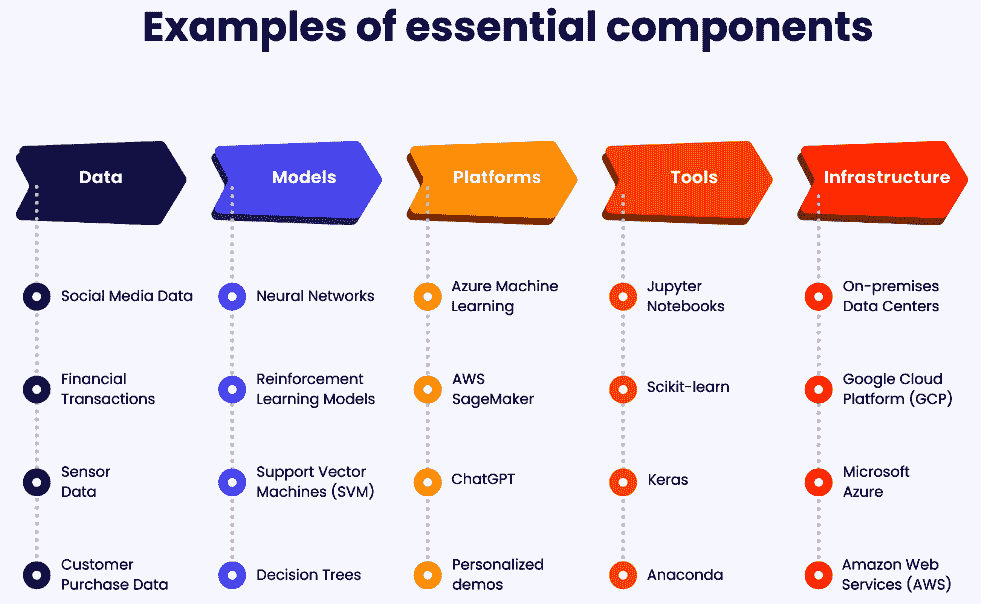
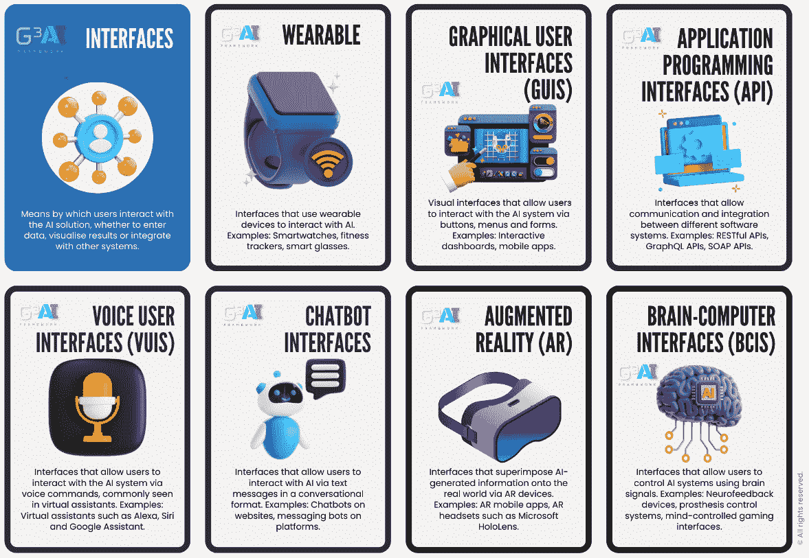
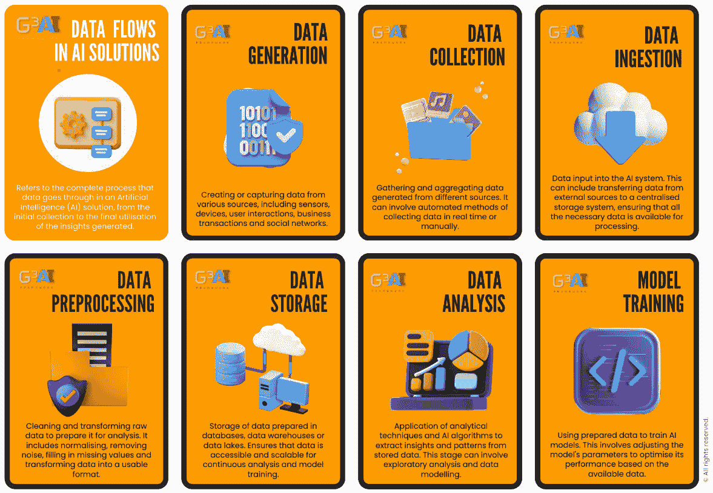
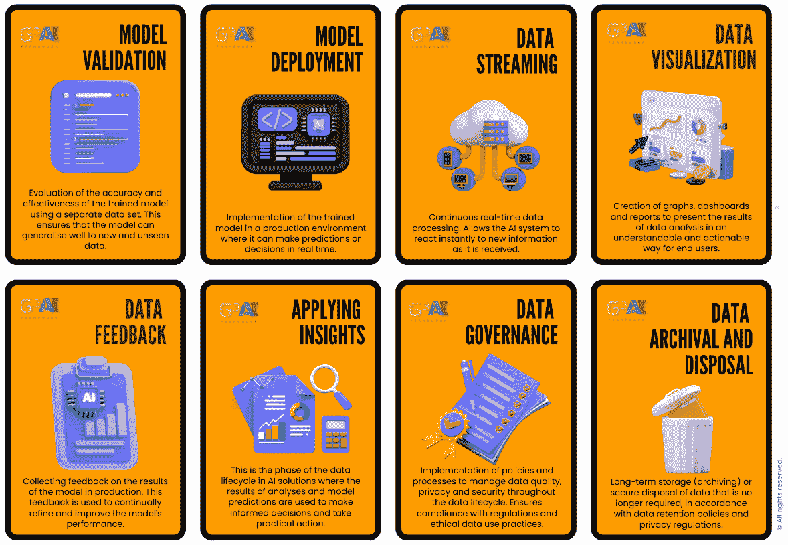
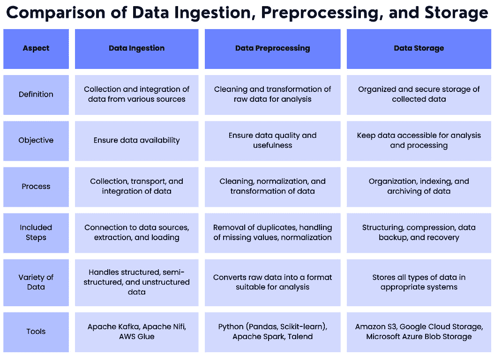
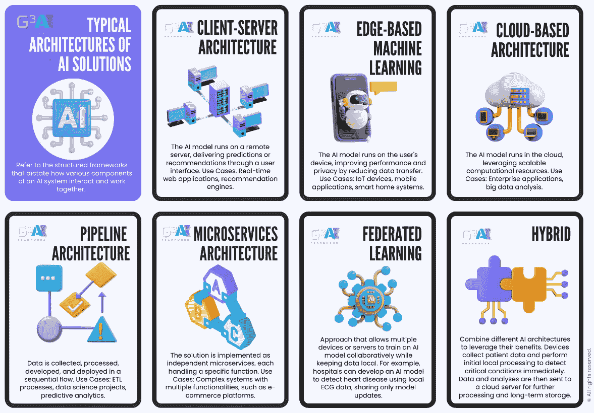
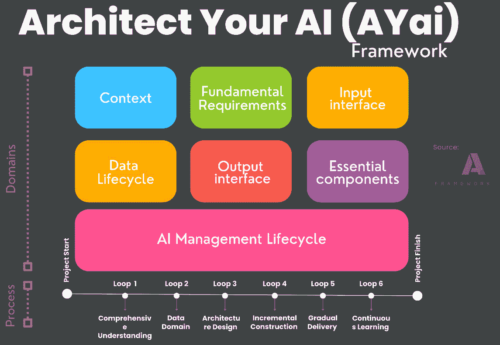

# 第五章：未来蓝图——架构有效的 AI 解决方案

在本章中，我们将探讨 AI 架构的世界及其在构建有效 AI 解决方案中的关键作用。我们将深入了解 AI 架构的基础知识，并讨论精心设计的框架在优化 AI 提供的机会中的重要性。本章的主要目标是为架构有效的 AI 解决方案提供洞察。本文中所呈现的信息对于现代世界中的开发者和企业至关重要。AI 有潜力彻底改变网页开发，理解其基本原理对于保持竞争力至关重要。通过学习本章中概述的技能，您将能够设计可扩展且高效的解决方案，长期维护和适应 AI 架构，评估并选择合适的框架，并将架构原则应用于实际的网页开发案例中。

现在，让我们深入探讨本章的主要主题：

+   AI 架构基础

+   可扩展且高效的 AI 解决方案

+   确保可维护性和适应性

+   架构未来——通过 AI 架构框架释放 AI 解决方案的力量

+   真实世界的 AI 架构应用案例——OpenAI 的 ChatGPT

+   **构建您的 AI**（**AYAI**）框架介绍

# AI 架构基础

**人工智能**（**AI**）架构领域涵盖了多方面的内容，这些内容对于 AI 解决方案的成功开发和部署至关重要。一个稳固的架构确保数据的高质量和相关性，模型的有效训练，平台的高效运行，工具的有效使用，基础设施的可靠性，以及用户友好的界面。本节提供了 AI 架构基础知识的概述，包括其定义、AI 架构师的角色、稳固架构的重要性和涉及的基本组件。

首先，让我们定义 AI 架构。AI 架构指的是 AI 解决方案的整体结构和设计。它包括各个组件及其相互作用，如数据、模型、平台、工具、基础设施和接口。这些组件协同工作，以实现创建和部署能够执行特定任务的 AI 系统。

AI 架构师的职责包括分析 AI 系统的需求、设计架构、选择适当的组件、确保数据质量、训练和评估模型、开发和部署 AI 解决方案，并持续优化系统性能。他们必须深入理解 AI 技术、数据管理、软件开发和基础设施。

在 AI 开发中，拥有坚实的架构至关重要。良好设计的架构确保 AI 解决方案能够处理大量数据，高效地处理数据，并生成准确且有意义的见解。它还可以与现有系统轻松集成、具有可扩展性，并适应未来的变化。一个坚实的架构为强大可靠的 AI 解决方案奠定了基础。

在下一小节中，我们将详细探讨这些基本组件，突出每个组件在创建复杂、有效且高效的 AI 解决方案中的关键作用。

## 基本组件

AI 架构的基本组件包括数据、模型、平台、工具、基础设施和接口。数据作为基础，提供训练和验证 AI 模型所需的信息。高质量和相关的数据对于确保 AI 解决方案的准确性和有效性至关重要。

*图 5**.1* 提供了构建 AI 架构时涉及的关键元素的可视化表示。它将这些元素分为六个主要类别：数据、模型、平台、工具、基础设施和接口。

图 5.1：基本组件示例

*图 5**.1* 总结了这些组件如何相互作用并促进 AI 解决方案的整体功能性和效率。让我们深入了解 AI 架构中至关重要的组件：

+   *数据*构成任何 AI 解决方案的基础。高质量和相关的数据对于训练准确的模型并实现最佳性能至关重要。AI 系统应设计为能够处理多样化的数据来源，确保数据质量，并有效地预处理数据以进行训练和推理。

+   *模型*是学习执行所需任务的组件。AI 模型可以通过各种技术进行训练，包括监督学习、无监督学习和强化学习。AI 架构师根据当前问题和可用数据选择并设计合适的模型。

+   *平台*是执行 AI 模型并提供必要的输入和输出接口的软件。它在管理模型执行、处理数据生命周期以及促进 AI 系统不同组件之间的通信方面起着至关重要的作用。

+   *工具*用于开发、训练和部署 AI 模型。它们可以分为两种类型：用于编写代码的软件开发工具和用于训练和评估模型的机器学习工具。AI 架构师根据项目需求和开发团队的专业知识选择和使用最合适的工具。

+   *基础设施*可以是本地部署的，也可以是基于云的。它提供支持 AI 系统操作所需的计算资源、存储和网络能力。AI 架构师根据可扩展性、安全性和成本效益等因素，确定基础设施的要求。

一个稳固的 AI 架构对于构建有效且高效的 AI 解决方案至关重要。它涉及多个组件，如数据、模型、平台、工具、基础设施和接口。AI 架构师在设计和监督 AI 系统的开发中扮演着至关重要的角色。通过考虑每个组件的重要性并确保它们的无缝集成，精心设计的架构能够使 AI 系统提供准确且可靠的结果。

## 接口在 AI 解决方案中的关键作用

在为网页项目设计可扩展且高效的 AI 解决方案时，我们必须理解接口所起的关键作用。接口是心智图的中心，负责数据收集、模型训练和 AI 解决方案的整体可用性。

*图 5.2* 提供了与 AI 解决方案交互的各种接口的概述。这些接口促进了不同的数据输入方式、结果可视化以及将 AI 系统与其他技术集成的方式。它们从传统的图形界面到先进的脑机接口，突出了用户与 AI 系统交互的多样化方式。

图 5.2：接口（此图来自 G³ AI Global）

*图 5.2* 详细介绍了八种不同类型的接口（即用户与 AI 解决方案互动的方式，无论是输入数据、可视化结果还是与其他系统集成）：

+   **可穿戴设备**：利用可穿戴设备与 AI 进行交互的接口。示例包括智能手表、健身追踪器和智能眼镜。重要性：可穿戴设备提供了便捷、无缝的方式来实时收集数据并与 AI 系统互动。

+   **图形用户界面**（**GUIs**）：通过按钮、菜单和表单，允许用户与 AI 系统交互的视觉接口。示例包括互动仪表盘和移动应用程序。GUI 使得用户可以通过直观的视觉元素轻松地浏览和使用 AI 系统。

+   **应用程序编程接口**（**APIs**）：允许不同软件系统之间进行通信和集成的接口。示例包括 RESTful API、GraphQL API 和 SOAP API。API 使不同的软件系统能够协同工作，扩展 AI 解决方案的功能性和互操作性。

+   **语音用户接口**（**VUIs**）：允许用户通过语音命令与 AI 系统交互的接口，常见于虚拟助手如 Alexa、Siri 和 Google Assistant。语音用户接口提供了一种免提、自然的与 AI 交互的方式，使其对更广泛的用户群体更加可及。

+   **聊天机器人接口**：允许用户通过文本消息以对话格式与 AI 进行交互的接口。例子包括网站上的聊天机器人和平台上的消息机器人。聊天机器人接口便于用户与 AI 系统进行互动式交流，提升了用户体验和参与感。

+   **增强现实**（**AR**）：通过 AR 设备将 AI 生成的信息叠加到现实世界中的接口。例子包括 AR 移动应用和如 Microsoft HoloLens 的 AR 头戴设备。AR 接口通过叠加有用的信息丰富了用户对现实的感知，改善了决策过程和与环境的互动。

+   **脑机接口**（**BCIs**）：允许用户通过脑信号控制 AI 系统的接口。例子包括神经反馈设备、假肢控制系统和脑控游戏接口。脑机接口代表了一种前沿的交互方式，能够实现大脑与 AI 系统之间的直接通信，这对残疾人士具有显著的帮助。

这些接口展示了用户与 AI 系统交互的多样性和创新性。从可穿戴技术到脑机接口，每种接口类型都提供了独特的优势，使 AI 更加易于访问、高效，并与日常生活和技术的各个方面更紧密地融合。

通过这些接口，用户可以输入数据、检索信息并整合外部数据源，确保为 AI 模型训练提供全面且多样化的数据集。顺畅高效的数据收集过程直接影响 AI 解决方案的准确性和有效性。

接口与模型训练之间的联系强调了交互在改进 AI 预测中的重要性。接口使开发人员能够微调模型，整合用户反馈，并持续提升性能，通过用户交互实现反复训练过程。

最终阶段展示了接口如何在将 AI 解决方案生成的预测或结果传递给终端用户时发挥关键作用。GUI、CLI 或 API 为用户提供了有效访问和利用 AI 解决方案预测的手段。无论是通过视觉吸引力的界面，还是基于命令的直接交互，接口确保终端用户能够轻松无缝地从 AI 解决方案中受益。

接口是 AI 解决方案的核心，在每个阶段都起着至关重要的作用。图形用户界面（GUIs）、命令行接口（CLIs）和应用程序编程接口（APIs）使数据收集、模型训练和向最终用户提供预测变得高效。通过了解接口的重要性并充分利用其功能，开发人员可以为 Web 项目设计可扩展和高效的 AI 解决方案，从而增强用户体验并推动 AI 领域的创新。

# 面向 Web 项目的可扩展和高效的 AI 解决方案架构

在今天快速发展的技术环境中，对可扩展和高效 AI 解决方案的需求已达到前所未有的高度。为了满足这一需求，组织必须关注可扩展性、计算资源效率、扩展策略、数据生命周期和典型架构等关键方面。通过优先考虑这些因素，企业可以确保最佳性能，释放 AI 的全部潜力。

可扩展性在成功实施 AI 解决方案中起着关键作用。它指的是 AI 系统在不影响性能的情况下处理不断增加的工作负载和适应日益增长的需求的能力。通过在设计 AI 系统时考虑可扩展性，组织可以确保其解决方案能够无缝处理大量数据和用户交互。

计算资源的效率对于人工智能解决方案的最佳运行至关重要。通过有效利用计算资源，组织可以实现更快的处理时间、降低成本，并提高整体性能。这涉及到优化算法、利用并行处理技术以及使用云计算平台高效分配工作负载。

制定有效的 AI 解决方案扩展策略对于长期成功至关重要。根据具体需求，组织可以采用多种方法，如水平扩展、垂直扩展或两者的结合。水平扩展涉及增加更多的机器或节点以分配工作负载，而垂直扩展则侧重于增强现有机器的能力。通过仔细考虑可扩展性的需求，组织可以确保其 AI 解决方案能够随业务需求的增长而扩展。

对于希望充分利用 AI 潜力的组织来说，需求是可扩展和高效的 AI 解决方案。通过在 AI 实施中优先考虑可扩展性、优化计算资源、采用有效的扩展策略，并设计高效的数据生命周期，组织可以解锁 AI 的力量，推动创新、改善决策，并在当今数字化环境中实现竞争优势。

## 数据生命周期在构建高效 AI 解决方案中的重要性

**数据生命周期**在高效的人工智能解决方案的开发和实施中起着至关重要的作用。这些流程描述了数据如何在解决方案中流动，确保数据被有效收集、处理和存储。通过精心设计数据生命周期，组织可以优化其人工智能系统，提供准确和及时的洞察。

*图 5.3* 和 *5.4* 提供了人工智能解决方案中数据生命周期的全面概述，详细描述了数据生命周期中的每个关键步骤。从数据生成到数据归档和销毁，这些步骤概述了在人工智能系统中有效管理和利用数据所需的整个过程。了解这些步骤将帮助你构建强大的人工智能模型，并确保数据质量和安全性。

图 5.3：人工智能解决方案中的数据生命周期 1（此图来自 G³ AI Global）

*图 5.3* 介绍了人工智能解决方案中数据生命周期的初始阶段：

+   **数据生成**：从各种来源（如传感器、设备和社交网络）采集数据。

+   **数据采集**：从不同来源（自动和手动）收集和汇总数据。

+   **数据摄取**：将数据传输到集中系统中进行处理。

+   **数据预处理**：清洗和转换原始数据，以便为分析做好准备。

+   **数据存储**：将准备好的数据存储在数据库、数据仓库或数据湖中，以便访问和扩展。

+   **数据分析**：应用分析技术和人工智能算法提取洞察和模式。

+   **模型训练**：使用准备好的数据训练人工智能模型，基于数据优化其性能。

*图 5.4* 继续讲解数据生命周期的后续阶段：

+   **模型验证**：使用独立的数据集评估训练模型的准确性和有效性。

+   **模型部署**：将训练好的模型部署到生产环境中，以进行实时预测或决策。

+   **数据流处理**：连续的实时数据处理，使人工智能系统能够即时响应新信息。

+   **数据可视化**：创建图表、仪表盘和报告，以便以易于理解的方式展示分析结果。

+   **数据反馈**：收集有关模型性能的反馈，不断优化和改进模型。

+   **应用洞察**：利用分析结果和模型预测做出明智决策并采取实际行动。

+   **数据治理**：实施政策，管理数据质量、隐私和安全性，贯穿整个数据生命周期。

+   **数据归档与销毁**：存储或安全销毁不再需要的数据，符合数据保留政策和隐私法规。

图 5.4：人工智能解决方案中的数据生命周期 2（此图来自 G³ AI Global）

这些图表共同展示了在 AI 解决方案中管理数据的全面工作流程和最佳实践，确保数据在保持高质量和安全标准的同时，得到有效处理、分析和利用。

在 AI 解决方案中，数据管理涉及几个关键步骤，每个步骤都有其独特的过程和目标。这三个基本步骤是数据摄取、数据预处理和数据存储。理解这些阶段之间的差异和关系，对于构建稳健且高效的数据解决方案至关重要。*图 5.5* 比较了数据摄取、数据预处理和数据存储的主要方面。

图 5.5：数据摄取、数据预处理和数据存储的比较

数据摄取是指从各种来源收集和整合数据，确保所有相关数据可供进一步处理。数据预处理包括清理和转换原始数据，以提高其质量和分析的实用性。最后，数据存储则涉及对这些数据的有序和安全存储，确保数据在未来分析和处理时仍可访问。每个阶段使用不同的工具和技术来处理数据的多样性和体积，确保数据生命周期的有效和高效管理。

值得注意的是，监控和维护数据生命周期对其持续高效至关重要。定期监控数据生命周期使组织能够及时识别并解决系统中的瓶颈或低效问题。通过主动维护数据生命周期，组织可以确保其 AI 解决方案在数据量和复杂性增加的情况下，依然能够提供准确和可靠的结果。

因此，数据生命周期在产生高效的 AI 解决方案中至关重要。通过精心设计数据在解决方案中的流动方式，组织可以优化数据收集、处理和存储。这种优化的数据流动使 AI 系统能够提供准确且及时的洞察，帮助组织做出明智的决策。为了构建成功的 AI 解决方案，组织必须优先考虑数据生命周期的设计和管理，确保其持续的高效性和有效性。

## AI 解决方案的典型架构

许多架构为构建高性能、可扩展的网络项目解决方案提供了基础。不同的架构具有独特的优势，可以根据性能、隐私、可扩展性和可用性等因素进行选择。

*图 5**.6* 提供了 AI 解决方案中典型架构的深刻概述。它展示了多种结构化框架，说明了 AI 系统中不同组件如何相互作用并协同工作。每种架构类型都附有简要描述和应用案例，展示了每种方法的多样性和特定性。

图 5.6：AI 解决方案的典型架构（此图来自 G³ AI Global）

让我们探索一些典型的 AI 解决方案架构，并讨论它们的特点和应用场景：

+   一种常见的架构是*客户端-服务器架构*。在这种设置中，AI 模型在远程服务器上执行，预测或推荐结果通过用户界面传送给用户。这种架构允许集中处理，适用于需要实时响应的项目。

+   另一种架构是*边缘计算架构*。在这种方法中，AI 模型在用户设备上执行。这有助于提高性能和隐私性，因为它减少了将数据传输到远程服务器的需求。然而，这也可能需要设备更多的资源。

+   对于需要高可扩展性或高可用性的解决方案，*基于云的架构*是一个流行的选择。在这种架构中，AI 模型在云端执行，利用可用的计算能力和资源。这种架构适用于具有不同工作负载的项目，并且易于扩展。

+   *管道架构*是另一种方法，其中数据按顺序收集、准备、开发和部署。这种架构确保数据流动的系统性，从而实现高效的处理和分析。

+   相比之下，*微服务架构*将解决方案实现为独立的微服务。每个组件独立运行，从而提高灵活性并简化维护。这种架构适用于具有多种功能的复杂项目。

+   为了兼具两者的优势，*混合架构*结合了不同的架构，以便利用它们各自的好处。例如，可以在云端训练 AI 模型，以充分利用计算能力，然后将其部署到用户设备上，以增强性能和隐私性。

+   在*联邦学习架构*中，AI 模型在多个设备或服务器上进行训练。这种方法使得数据能够保持在本地，从而提高隐私性并减少带宽需求。这种架构特别适用于因隐私或安全问题无法轻易传输数据的场景。

+   *预构建架构*通常托管在云端，提供现成的 AI 项目解决方案。它们提供了一种便捷高效的方式来实现 AI 功能，无需进行大量开发。

在为网页项目设计 AI 解决方案时，考虑最适合项目需求的架构至关重要。每种架构选项都有其独特的优势，并有助于解决方案的可扩展性和效率。通过仔细选择架构，开发者可以确保在 AI 项目中实现最佳性能和用户体验。可扩展性、计算资源效率、数据生命周期和正确的架构是构建可扩展且高效的网页项目 AI 解决方案的关键因素。

## 设计 AI 解决方案——逐步指南

现在，我们将探讨设计 AI 解决方案的过程，并讨论其在当今商业环境中的重要性。随着 AI 持续革新各行各业，理解业务目标并实施有效的解决方案已变得至关重要。

为了开始设计过程，必须*确定明确的目标*。通过清晰地定义业务目标，我们可以相应地调整 AI 解决方案。此外，识别公司的具体需求使我们能够定制解决方案以满足这些要求。

为了确保我们能够跟上最新的技术进展和可能性，进行全面的研究至关重要。这项研究可以包括分析市场报告、探索专业网站、咨询技术公司，甚至利用社交媒体平台的见解。这种全面的方法使我们能够收集有价值的信息，并了解新兴趋势和机会。

一旦我们收集了大量信息，就该进入选择和评估阶段。构建原型和测试解决方案使我们能够评估其可行性和有效性。在这一阶段获取反馈至关重要，因为它帮助我们发现需要解决的潜在问题。通过积极倾听反馈，我们可以完善和改进解决方案，更好地满足业务需求。

在选择最合适的 AI 解决方案后，下一步是实施。这涉及将解决方案与现有系统集成，确保无缝过渡。此外，建立明确的成功标准以衡量已实施解决方案的有效性也至关重要。通过设定这些标准，我们可以监控性能，并进行必要的调整，确保最佳结果。

## 解决方案的实施

本节将探讨在商业环境中实施 AI 解决方案的关键步骤。一旦理解了公司目标和具体需求，且合适的解决方案已被研究和评估，就可以进入实施阶段。

实施 AI 解决方案的基本步骤是*与现有系统集成*。这涉及确保新技术与公司基础设施和流程的无缝对接。必须考虑兼容性、数据传输和安全协议等因素。通过成功集成这些解决方案，我们可以最大化它们的潜力，确保顺利过渡。

实施过程中需要考虑的另一个重要方面是*确保成功标准*。这涉及设定具体的衡量标准和基准，评估 AI 解决方案的效果和影响。通过从一开始就定义这些标准，我们可以评估已实施的解决方案是否达到了预期的目标。定期的监控和评估将使我们能够在过程中进行必要的调整和改进。

在整个实施过程中，保持与所有利益相关方的*沟通*至关重要。这确保每个人都对进展保持一致和了解。用户和员工的反馈在这一阶段尤为宝贵，因为它帮助我们识别问题或改进空间。通过积极寻求并处理这些反馈，我们可以优化解决方案，确保其持续成功。

实施 AI 解决方案需要一种战略性的方法，涵盖与现有系统的集成以及设定明确的成功标准。通过遵循这些指导方针，我们可以确保解决方案有效地推动公司整体目标的实现。实施 AI 解决方案可能会遇到挑战，但通过周密的规划和持续的评估，我们能够克服这些挑战，释放这一变革性技术的全部潜力。

在接下来的子章节中，我们将深入探讨维护 AI 系统的重要性以及在面对不断发展的技术环境和组织需求时适应性的重要性。通过定期更新、监控以及灵活应对新挑战，AI 系统能够保持其相关性和有效性，为 AI 项目的持久成功做出贡献。

# 确保可维护性和适应性

为了确保 AI 架构的长期成功，优先考虑维护 AI 系统至关重要。这涉及定期监控和更新系统，确保它们始终保持最佳性能。通过定期维护 AI 系统，我们可以识别和解决可能出现的问题或限制，确保系统始终高效有效。

维护 AI 系统的一种方法是通过*持续的测试和监控*。这可以帮助我们检测任何性能问题或错误，并采取适当的措施来解决这些问题。此外，定期更新和增强 AI 系统可以提高其性能和功能，并解决可能出现的安全漏洞。

随着技术和业务需求的变化，AI 架构必须*能够适应这些变化*。这意味着能够根据新的需求和挑战修改和调整 AI 系统。适应变化的需求可以确保 AI 系统在满足组织需求时依然具有相关性和有效性。

为适应变化的需求，拥有灵活且可扩展的 AI 架构至关重要。这使得新数据源、技术和算法的集成变得更加容易。此外，定期评估 AI 系统及其性能可以帮助发现需要改进和调整的领域。

确保 AI 系统的*耐用性*对于其长期成功至关重要。耐用性指的是 AI 系统在面对环境变化（如技术进步、新的业务需求和用户需求变化）时，仍能保持稳定并适应这些变化的能力。

保证耐用性的最佳实践之一是设计具有模块化思想的 AI 系统。通过将系统拆分为更小的独立模块，可以更容易地修改和调整单个组件，而不会影响整个系统。这使得在进行更改时具有更大的灵活性和敏捷性。

另一个最佳实践是*定期评估和更新*AI 系统，以纳入该领域的新进展和最佳实践。这可以确保系统始终保持最新状态，并继续提供最佳性能。

总之，维护和调整 AI 架构对于其长期成功至关重要。通过优先考虑维护、适应变化的需求并遵循最佳耐用性实践，组织可以确保其 AI 系统在应对需求时仍然高效、有效且具有相关性。

下一部分旨在阐明打造具有弹性和影响力的 AI 解决方案背后的全面战略。这一过程将引导我们深入了解如何将 AI 架构与预定用户的具体需求和目标对接。我们将探讨数据如何在系统中流动——从进入点到最终目的地，同时确保在每个阶段的数据完整性和可用性。此外，本部分还将扩展到 AI 解决方案的结构设计，突出关键组件，如模型、平台、工具和框架，这些组件共同促进了一个强大的 AI 生态系统。

# 构建未来——通过 AI 架构框架释放 AI 解决方案的潜力

在本节中，我们将深入探讨 AI 架构框架的关键方面，重点了解目标受众、解决方案目标以及要解决的问题。我们还将探索解决方案中的数据生命周期，包括输入接口、数据来源、数据收集、数据准备、数据存储和数据交付。此外，我们将讨论架构设计，涵盖模型、平台、工具、框架、典型架构，以及最终用户如何与解决方案进行互动。最后，我们将涉及 AI 架构中学习和改进的重要性。

**AI 架构框架**是一个综合结构，旨在指导 AI 解决方案的开发和实施。我们的框架以其系统化的方法脱颖而出，涵盖从理解目标到实际实施的各个方面，在整个过程中促进效果和效率的提升。

下一小节重点介绍将 AI 项目建立在对目标受众的深入理解和清晰定义的解决方案目标上的重要性。

## 上下文

为确保任何 AI 解决方案的成功，深入*理解目标受众*是至关重要的。通过识别最终用户，我们可以根据他们的具体需求和偏好定制解决方案。此外，我们需要明确解决方案目标，定义我们的 AI 解决方案旨在实现的目标。这些目标将作为整个开发和实施过程的指导原则。

此外，我们必须清楚地了解我们要解决的问题。通过识别当前的问题，我们可以设计出有效的解决方案，全面地解决问题。此外，将问题进行分类并确定其类型也很重要，这有助于更好地指导开发过程。

可扩展性和计算机效率是 AI 架构中的重要考虑因素。解决方案应能够处理增加的工作负载，而不影响其性能。此外，它应有效利用计算资源，以最大化效率。维护和升级也应纳入考虑，确保解决方案可以根据需要轻松进行维护和升级。

性能指标在评估解决方案的表现中起着至关重要的作用。通过建立可衡量的指标，我们可以评估解决方案在实现目标方面的效果。此外，解决方案应经过严格的测试和评估，以确保其在实际应用场景中的有效性。

安全性和隐私在 AI 架构中至关重要。必须采取措施保护数据和用户隐私，防止潜在的泄露或未经授权的访问。此外，还应考虑伦理问题，解决使用 AI 可能引发的任何伦理问题。

## 数据生命周期

*AI 解决方案中的数据生命周期*是一个关键的方面。输入接口决定了解决方案如何从各种来源接收数据。这些来源可以包括数据库、API 或传感器输入等。数据收集涉及从这些来源收集所需的数据，确保其全面且准确。

一旦收集到数据，就需要进行准备工作，这包括清理和格式化数据，使其适合分析和处理。准备好的数据随后会存储在合适的数据存储系统中，考虑到可扩展性、安全性和可访问性等因素。

数据交付是数据生命周期中的另一个关键步骤。这涉及以用户友好且易于理解的方式向最终用户呈现分析后的数据。输出接口在数据交付中发挥着重要作用，可能包括可视化、报告或交互式接口。

## 架构设计

*AI 解决方案的架构设计*包含了多个元素。模型是解决方案的概念性结构，概述了不同组件如何相互作用并协同工作，以实现预期的目标。平台，无论是硬件还是软件，提供了解决方案运行的环境，影响其性能和能力。

工具和框架对于开发和运营 AI 解决方案至关重要。它们包括软件或系统，这些软件或系统有助于实现和管理解决方案，例如编程语言、开发平台和 AI 专用框架。选择合适的框架对架构的成功至关重要，因为不同的框架提供不同的功能和适用性，适合不同的 AI 应用。

理解类似解决方案中常用的典型架构可以为设计 AI 架构提供宝贵的见解和指导。通过研究和学习成功的架构，我们可以借鉴经过验证的方法，并将其调整到我们特定的上下文中。

最后，必须考虑最终用户如何与解决方案互动。用户体验应该是直观和流畅的，使用户能够轻松访问和使用 AI 功能。此外，我们还应专注于使解决方案随着时间的推移能够学习和改进，利用数据提升其性能并适应不断变化的环境。

AI 架构框架提供了一种全面而系统的方法，用于开发和实施 AI 解决方案。通过了解目标受众、定义解决方案目标以及解决当前问题，我们可以设计出有效的架构。数据生命周期和架构设计的各个方面确保解决方案能够有效地处理数据，利用合适的工具和框架，并提供无缝的用户体验。通过持续的学习和改进，AI 架构可以不断发展和适应，以满足 AI 领域不断变化的需求。

接下来，我们将深入探讨创建复杂 AI 系统的精妙之处，这些系统能够理解和生成类人文本。

# 现实世界中的 AI 架构应用案例——OpenAI 的 ChatGPT

在快速发展的数字时代，生成类人文本的能力变得越来越重要。无论是草拟邮件、编写代码、创作书面内容，还是与用户聊天，人工智能都有潜力改变这些任务。然而，开发一种能够理解和生成类人文本的 AI 是一个复杂的问题，需要全面而系统的方法。

这就是**OpenAI 的 ChatGPT**发挥作用的地方。ChatGPT 是一种人工智能解决方案，利用**生成式预训练变换器**（**GPTs**）的强大功能，根据提供的输入生成类人文本。它旨在服务广泛的用户群体，从普通大众到企业和开发者，并可用于各种应用场景。

ChatGPT 的开发和实施受到 AI 架构框架的指导，这是一个全面的结构，促进了所有过程阶段的有效性和效率。该框架确保解决方案不仅在技术上是稳健的，而且对用户友好并负有伦理责任。

接下来，*上下文*子章节将引导我们进入这一旅程的基础阶段。在这里，我们重点关注理解核心挑战，并识别我们多样化受众的不同需求，包括普通大众、企业和开发者。

## 上下文

我们在 AI 旅程中的第一步是*理解上下文*。我们的目标受众是普通大众、企业和开发者。我们的 AI 解决方案——ChatGPT 的目标，是根据提供的输入生成类人文本。这可以用于各种应用，比如草拟邮件、编写代码、创作书面内容等。

我们需要理解我们试图解决的问题：需要一种能够理解和生成类人文本的 AI。通过识别当前问题，我们可以设计出有效的解决方案，全面应对这个问题。以下是我们项目的关键方面的全面列表，涵盖了从识别目标受众到解决关键操作和伦理问题的各个方面：

+   **目标受众**：普通大众、企业和开发者。

+   **解决方案目标**：根据提供的输入生成类似人类的文本。

+   **待解决问题**：需要一个能够理解并生成类似人类文本的 AI。

+   **AI 类型问题**：自然语言处理问题。

+   **可扩展性**：该模型是可扩展的，能够处理大量的同时请求。

+   **计算效率**：该模型高效使用计算资源，以实时生成响应。

+   **维护与升级**：该模型会根据用户互动和反馈不断进行监控和改进。

+   **性能指标**：为了衡量我们 AI 解决方案的成功，我们采用一套全面的指标，聚焦于三个关键方面：

    +   **响应的准确性**：该指标评估 AI 输出与预期或期望结果的匹配程度。这是衡量系统基于接收到的输入提供正确且适用的答案或内容的能力。

    +   **生成内容的相关性**：除了准确性，我们还评估 AI 生成内容与用户查询或需求的相关性。这确保了解决方案不仅理解请求，还能提供在上下文中恰当且有用的信息或内容。

+   **用户满意度**：我们 AI 有效性的最终指标是用户的满意度。通过反馈和使用数据，我们评估解决方案如何满足其受众的需求和期望，持续优化我们的方式以提升用户体验。

+   **测试与评估**：该模型不断进行测试和评估，以确保其性能和效果。

+   **安全与隐私**：所有数据都以安全的方式存储和传输，并设有访问控制以防止未经授权的访问。

+   **伦理考虑**：该模型设计公正无偏，并尊重用户的隐私和机密性。确保 AI 模型的完整性，经过严格测试，遵守最高的安全与隐私标准，并遵循伦理指导原则，是我们开发过程中的基本原则。

随着我们从这些核心原则过渡到 AI 解决方案的操作机制，下一个需要探讨的关键方面是数据生命周期。

## 数据生命周期

在 AI 解决方案中的*数据生命周期*是需要重点考虑的关键方面。我们的输入接口是通过聊天界面或 API 接收用户输入。我们使用来自互联网的大规模数据集进行训练。这些数据集是通过自动化方式收集的，并为分析做好准备。准备好的数据随后被存储在一个安全且可扩展的数据存储系统中。以下是数据生命周期各阶段的简要概述：

+   **输入接口**：通过聊天界面或 API 接收用户输入

+   **数据来源**：来自互联网的大规模数据集

+   **数据收集**：数据通过自动化方式收集

+   **数据准备**：为分析准备数据，包括清洗和格式化

+   **数据存储**：准备好的数据存储在一个安全且可扩展的数据存储系统中。

+   **数据交付**：模型根据输入数据生成答案并将其传递给用户。

+   **输出接口**：模型的回答通过聊天接口或 API 传递给用户。

在下一小节中，我们将探讨我们 AI 解决方案的架构设计，这是支撑我们系统操作效率和可扩展性的关键部分。该设计详细介绍了底层模型，包括其概念框架以及各个组件之间的相互作用。我们架构的核心是使用一种名为 GPT 的机器学习模型，它因能够理解和生成类似人类的文本而闻名。我们的解决方案托管在一个强大的云平台上，确保了高可用性和可访问性，使得通过 API 的无缝交互成为可能。这个架构不仅支持自然语言理解和生成所需的复杂处理能力，还提供了灵活性和可扩展性，能够适应不断变化的需求和技术。

## 架构设计

*AI 解决方案的架构设计*包括多个元素。模型指的是解决方案的概念结构，概述了不同组件之间如何相互作用。我们使用的机器学习模型被称为 GPT。该模型托管在基于云的平台上，可以通过 API 进行交互。

多种机器学习框架和库用于训练和部署模型。用户通过聊天接口或 API 与模型交互。

模型的性能会根据用户交互和反馈不断进行监控和改进。这确保了解决方案在时间推移中保持有效，并能适应不断变化的条件。

所有数据都通过安全存储和传输，且设置了访问控制，以防止未经授权的访问。该解决方案符合所有相关的数据保护法规。从技术基础到实际应用和影响的转变，以下部分将更详细地探讨每个组件：

+   **模型**：模型指的是解决方案的概念结构，在本案例中指的是 GPT。

+   **平台**：模型托管在基于云的平台上。

+   **工具**：用于训练和部署模型的各种机器学习工具和库。

+   **框架**：模型是使用多种机器学习框架进行训练和部署的。

+   **典型架构**：ChatGPT 的架构是典型的自然语言处理解决方案，使用深度学习模型。

+   **使用该解决方案**：用户通过聊天接口或 API 与模型进行交互。

+   **学习与改进**：模型通过用户反馈和与用户的交互不断从数据中学习并逐渐改进。

本案例展示了 AI 架构框架如何引导开发一个高效的 AI 解决方案，满足用户需求并解决现实问题。它强调了理解问题和受众、设计合适的架构以及确保持续学习和改进的重要性。它还突出了数据生命周期的关键作用，以及需要考虑安全性和隐私的问题。

通过遵循这些步骤并考虑这些因素，我们可以确保我们的 AI 解决方案不仅在技术上稳健，而且用户友好且符合伦理责任。这种全面的方法是我们 AI 架构框架的独特之处，也确保了我们 AI 解决方案的成功。

AI 架构框架提供了一个系统化的方法来开发和实施 AI 解决方案，促进了所有阶段的效果和效率。它是任何希望利用 AI 力量的组织的宝贵工具。

# AI 架构设计（AYAI）框架简介

**AI 架构设计**（**AYAI**）是一个框架，为开发 AI 解决方案提供了一种结构化的方法。它作为 AI 项目的上下文、关键组件、数据流程、解决方案生命周期和需求的可视化表示。AYAI 框架是参与开发过程的团队和利益相关者的宝贵工具，因为它有助于对齐他们的理解和期望。

AYAI 框架是为多元化的受众设计的，包括 AI 领域的架构师和专家、AI 产品经理、企业架构师、业务分析师、经理和高管、开发者社区以及决策者。它是一个协作工具，促进了沟通，并确保所有相关方对项目目标和需求有共同的理解。

AYAI 框架的重要性在于它能够提供 AI 解决方案的清晰简洁概览。它使得利益相关者能够识别目标受众、解决方案目标以及需要解决的问题。通过利用 AYAI 框架，团队可以简化开发过程，提高效率，改善决策。

这种方法旨在将关键组件和考虑因素提炼成一个有凝聚力的框架。无论你是经验丰富的 AI 架构师，还是刚刚开始将 AI 融入项目的旅程，这个框架都提供了一种结构化的视角，帮助你应对设计有效 AI 解决方案的复杂性。AYAI 框架由领域和集成的 AI 循环流程组成，正如*图 5**.7*所示。

图 5.7：AYAI 框架（此图来自 G³ AI Global）

通过使用这个框架，架构师和团队可以共同绘制、可视化并完善他们的 AI 架构，促进开发生命周期中的有效沟通和战略决策。

为了有效使用 AYAI 框架，遵循结构化方法至关重要：

+   首先，确定**目标受众**，包括客户、最终用户、内部利益相关者、外部利益相关者、网页开发人员和决策者。了解他们的需求、期望和痛点，以便使解决方案与他们的要求保持一致。

+   接下来，定义**解决方案目标**。这些目标应集中在最大化运营效率、提高用户满意度、减少运营成本、改善决策、促进数据分析和增强内容个性化上。明确陈述这些目标将指导开发过程，并确保解决方案能够达到预期的结果。

+   确定**待解决的问题**。这可能包括优化流程、预测分析、异常检测、数据分类、内容推荐或问题诊断。理解问题是设计有效 AI 解决方案的关键，它可以满足目标受众的特定需求。

+   不同类型的问题可能需要不同的解决方法。分类、回归、聚类、知识发现、**自然语言处理**（**NLP**）、计算机视觉和强化学习是开发 AI 解决方案时可能遇到的问题类型。选择合适的问题类型对于选择正确的算法和模型至关重要。

+   继续讨论 AI 解决方案的**基本要求**，*可扩展性*是一个关键方面。解决方案应能够在不影响性能的情况下处理不断增加的工作负载。评估系统在扩展和管理更大量数据及请求时的效率至关重要。让我们来看一下 AI 解决方案的基本要求：

    +   **计算效率**专注于优化 AI 解决方案的计算组件性能。这包括高效的数据处理、模型训练和算法执行。最大化资源利用是实现计算效率的关键考虑因素。

    +   **维护和升级**对于 AI 解决方案的长期稳定性和相关性至关重要。这包括主动维护、修复漏洞、安全更新和功能增强。持续的管理确保解决方案保持可靠并保持最新状态。

    +   **测试和评估**确保 AI 解决方案的正确运行和有效性。集成测试、性能测试、模型评估和结果验证是确保解决方案可靠性和准确性的必要过程。

    +   **安全性和隐私**在 AI 解决方案中至关重要。保护数据并确保系统的整体安全性涉及实施防止未经授权访问的措施、加密敏感数据、遵守隐私法规以及遵循伦理和法律标准。

    +   **伦理考虑**在 AI 解决方案开发中至关重要。模型决策的透明性、数据处理的公平性、防止算法偏见以及遵循伦理原则对解决方案的负责任和伦理实施至关重要。

    +   **输入接口**是接收或收集外部数据到 AI 系统的机制。这些可以包括用户输入、数据流或 API 集成。设计有效的输入接口确保数据能够无缝地集成到 AI 解决方案中。

+   **数据生命周期**表示数据在 AI 系统中的整个过程。它包括如预处理、存储以及最终输出或决策阶段等过程。理解数据生命周期对于确保准确和有意义的结果至关重要。

+   **输出接口**是 AI 系统呈现或传递结果、预测或洞察的通道。这些接口可以包括视觉显示、报告、API 响应或任何向最终用户或其他系统传递系统输出的方式。有效的输出接口能增强用户体验并促进 AI 解决方案的利用。

+   **AI 解决方案的关键组件**包括模型、平台、工具和框架：

    +   *模型*代表 AI 解决方案中使用的核心算法或数学框架。选择合适的模型至关重要，这取决于问题类型、参数、架构和训练策略。

    +   *平台*是 AI 模型部署和执行的环境。它可以是本地部署、基于云的或混合基础设施。根据可扩展性、性能、成本、部署便利性和集成能力评估平台选项至关重要。

    +   *工具*包括在 AI 解决方案开发生命周期中使用的软件和应用程序。**集成开发环境**（**IDEs**）、数据处理工具和模型评估工具是必要工具的示例。选择合适的工具会影响开发效率、协作以及整体工作流程。

    +   *框架*是支持 AI 模型开发、训练和部署的综合软件结构。流行的框架包括 TensorFlow、PyTorch 和 scikit-learn。选择框架时应考虑易用性、社区支持以及与所选编程语言的兼容性等因素。

+   **AI 管理生命周期**包括迭代开发和测试、实施、发布及持续运营，以及持续学习和演进。它为在实际环境中有效开发和利用 AI 解决方案提供了路线图。通过不断学习和随时间实施改进，确保解决方案始终保持相关性和有效性。

简而言之，AYAI 框架是一个强大的 AI 解决方案开发工具。通过遵循结构化的方法并考虑目标受众、解决方案目标以及需要解决的问题，团队可以设计和实施有效的 AI 解决方案。AYAI 框架提供了一个全面的概述，涵盖了整个开发生命周期中的关键组成部分、需求和考虑因素。在该框架的指导下，AI 解决方案的开发可以变得更加高效、流畅和有效。

# 总结

在这一章中，我们探讨了 AI 架构的世界及其在构建有效 AI 解决方案中的关键作用。我们讨论了 AI 架构的基础知识，强调了设计良好的框架在优化 AI 所提供机会中的重要性。本章的主要目标是为开发人员和企业提供有关如何设计有效 AI 解决方案的见解，这是现代世界中至关重要的技能。通过学习本章中概述的技能，个人可以设计可扩展和高效的解决方案，维护和适应 AI 架构以实现长期成功，评估并选择合适的框架，并将架构原则应用于实际的 Web 开发用例。

我们还深入探讨了 AI 解决方案的可扩展性、效率和实施问题，以及维护和适应 AI 系统的重要性。此外，我们还探讨了 AI 架构框架，并介绍了**架构你的 AI**（**AYAI**）框架，它指导 AI 解决方案的开发和实施，并讨论了 AI 架构在生成类人文本中的实际应用案例。

在下一章中，我们将重点讨论设计智能及其如何通过 AI 创造以用户为中心的体验。

# 第二部分：塑造未来：创建前沿的 AI 应用

在这一部分，我们深入探讨了如何为 Web 开发创建高级 AI 应用，重点利用 AI 构建以用户为中心的体验，识别模式以个性化用户旅程，并通过 GitHub Copilot 等编程助手提高生产力。你将学习如何创建带有情感分析的聊天机器人，实现实时翻译、语音识别和转录，并开发动态内容个性化和推荐系统。此外，我们还涵盖了如何将聊天机器人与 Telegram 等平台集成。本部分将为你提供实施 AI 解决方案所需的技能，确保开发出高效、个性化且富有吸引力的 Web 应用。

本部分包括以下章节：

+   *第六章*，*设计智能 – 使用人工智能创造以用户为中心的体验*

+   *第七章*，*识别模式 – 使用人工智能个性化用户旅程*

+   *第八章*，*编码助手 – 现代开发中的秘密武器*

+   *第九章*，*更智能的用户互动 – 通过先进的人工智能提升用户参与度*

+   *第十章*，*智能测试策略 – 用人工智能洞察力加强网页应用安全*
