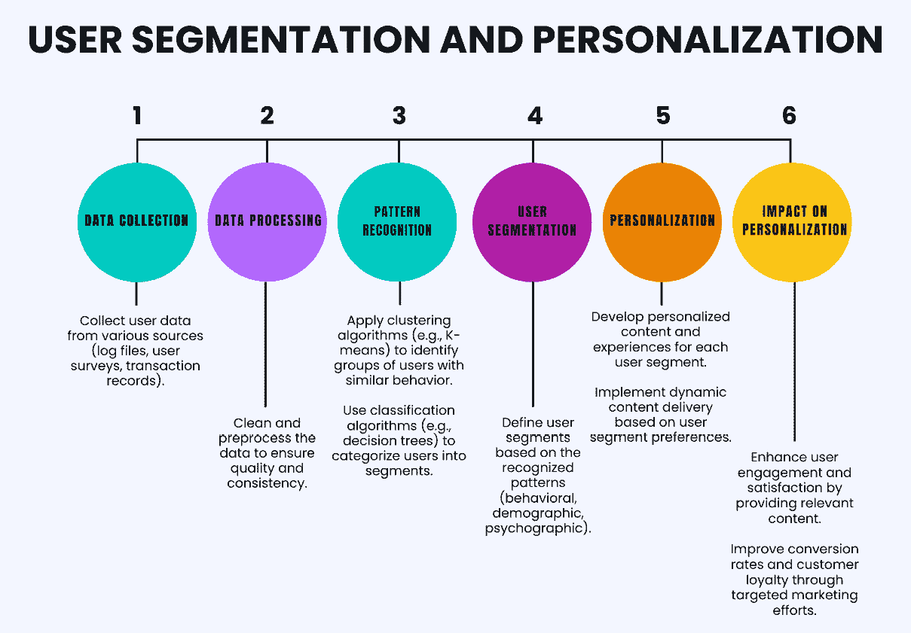
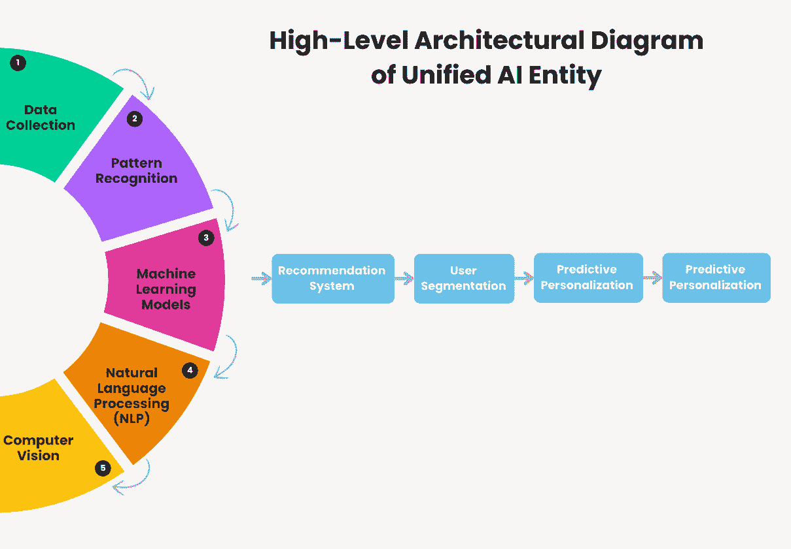

# 第七章：识别模式——利用人工智能个性化用户旅程

本章将介绍在网页开发中如何运用人工智能进行模式识别，探讨如何通过人工智能个性化用户旅程。你将深入了解识别用户行为、偏好和互动模式的重要性，以便为每个用户量身定制网页体验。本章还将涉及预测算法和推荐算法的实现，并指导你如何将这些算法集成到统一的人工智能实体中。

本章的最终目标是帮助你将模式识别和人工智能个性化技术应用到自己的网页项目中，从而为用户创造更具吸引力、相关性和满足感的体验。

本章非常重要，因为利用人工智能进行模式识别和个性化是提升用户体验、为企业创造价值的强大策略。它们使你能够创造独特的全渠道、语音辅助和沉浸式用户旅程。然而，它们也需要在用户隐私、泛化、同意和透明度方面小心谨慎。因此，你需要了解实现这些策略的概念、工具和最佳实践，以便高效且符合伦理地实施这些策略。

本章的主要内容如下：

+   破解模式识别原则的密码

+   利用人工智能进行个性化

+   个性化的预测算法

+   实现推荐系统

+   创建统一的人工智能实体

# 技术要求

在我们深入探讨项目的具体内容之前，确保我们拥有所有必要的工具和库是至关重要的。以下是你需要设置开发环境的技术要求：

+   Python 3.7 或更高版本 ([`www.python.org/downloads/`](https://www.python.org/downloads/))

+   Pandas ([`pandas.pydata.org/`](https://pandas.pydata.org/))

+   NumPy ([`numpy.org/`](https://numpy.org/))

+   Sklearn ([`scikit-learn.org/stable/index.html`](https://scikit-learn.org/stable/index.html))

+   你可以在 GitHub 上下载完整的项目：[`github.com/PacktPublishing/AI-Strategies-for-Web-Development/blob/main/ch7/Movie_recomendation.ipynb`](https://github.com/PacktPublishing/AI-Strategies-for-Web-Development/blob/main/ch7/Movie_recomendation.ipynb)

现在，让我们深入探讨本章的第一个主题。

# 破解模式识别原则的密码

我们将探讨使我们能够辨识和解读用户行为中复杂模式的基础方法。理解这些原则对于有效部署人工智能、个性化和增强用户旅程至关重要。通过掌握这些技术，你将能够创建不仅满足而且预测用户需求的人工智能驱动的解决方案，使每一次互动更加直观和有影响力。

我们理解识别用户行为模式的重要性。这对于增强用户体验并使其更加个性化至关重要。通过识别这些模式，我们可以更好地理解用户需求和偏好，从而提供更相关和引人入胜的体验。

AI 在这一过程中发挥着关键作用，使我们能够为增强体验而个性化用户旅程。借助 AI，我们可以分析大量用户数据并识别那些手动检测起来难以，甚至不可能检测到的模式。

## 理解模式识别的原则

模式识别是一种基本技能，使我们能够理解和解释周围的世界。在 AI 的背景下，模式识别是根据基础模式或规律识别和分类数据的能力。模式识别的原则根植于数据可以基于共同特征进行分类的理念。这些特征可以是对象的颜色或形状等简单特征，也可以是随时间变化的用户行为等复杂特征。

模式识别的主要原则包括以下几点：

+   **特征表示**：这涉及确保数据以突出重要方面的方式表示。这包括选择捕捉数据本质的正确特征。

+   **相似性和距离测量**：识别模式通常涉及比较数据点并确定它们的相似性。这需要有效的方法来测量数据点之间的距离或相似性。

+   **分类和决策**：这涉及确定数据点所属的类别。这一原则涉及定义分类的决策边界和规则。

+   **从数据中学习**：这涉及开发能够从示例中学习的模型。这一原则支持使用能够随着接触更多数据而提高性能的算法。

+   **泛化**：这涉及确保模型识别的模式可以应用于新的、未见过的数据。一个良好的模式识别系统应该能够从训练数据泛化到任何其他数据。

+   **对噪声和变异的鲁棒性**：这涉及在数据存在噪声或以意想不到的方式变化时仍能准确识别模式。

+   **适应性**：这涉及系统能够适应新模式和随时间变化的能力。

模式识别原则根植于数据可以基于共同特征进行分类的理念。这些特征可以是对象的颜色或形状等简单特征，也可以是随时间变化的用户行为等复杂特征。现在，让我们来看看用于实现这些原则的关键技术：

+   **聚类**：这种技术根据相似性将数据点分组，通常使用 K 均值、层次聚类或 DBSCAN 等算法。聚类有助于识别数据中的自然分组，这对于市场细分、异常检测和图像分割非常有用。例如，它可能涉及使用 K 均值根据购买行为将客户分为不同组。

+   **分类**：分类涉及根据数据点的特征将其分配到预定义的类别中。常见的算法包括决策树、**支持向量机**（**SVM**）和神经网络。这种技术广泛应用于垃圾邮件检测、情感分析和医学诊断。例如，使用支持向量机识别垃圾邮件。

+   **异常检测**：这种技术识别与正常数据显著偏离的数据点。像隔离森林或一类支持向量机（One-Class SVM）以及自编码器等算法通常用于异常检测，这在欺诈检测、网络安全和预测性维护中至关重要。例如，使用隔离森林检测信用卡使用中的欺诈交易。

+   **特征提取**：它涉及将原始数据转换为一组更好地表示潜在结构的特征。像**主成分分析**（**PCA**）、**线性判别分析**（**LDA**）和**t 分布随机邻域嵌入**（**t-SNE**）等技术常被使用。例如，可以使用 PCA 减少图像数据集的维度，以进行面部识别。

+   **序列分析**：这种技术分析序列数据，以识别**隐马尔可夫模型**（**HMM**）模式。**递归神经网络**（**RNN**）和**长短期记忆**（**LSTM**）网络是用于语音识别、DNA 序列分析和时间序列预测等应用的典型算法。例如，使用 LSTM 网络预测股市价格。

+   **深度学习**：它利用具有多层的神经网络（深度神经网络）来建模数据中的复杂模式。**卷积神经网络**（**CNN**）在图像识别方面特别有效，而 RNN 和 LSTM 适用于处理序列数据。例如，使用 CNN 识别图像中的物体。

通过利用这些原则和技术，人工智能系统能够分析大量数据，识别复杂模式，并提供有价值的洞察，支持个性化用户体验、预测性维护和先进的决策支持系统等应用。模式识别是一项可以通过实践和经验不断提高的技能。我们拥有的数据越多，识别模式的准确性和效果就越高。

## 模式识别的关键组成部分

模式识别的关键组成部分包括数据收集、模式识别算法和用户细分。每个组成部分在个性化用户旅程中都扮演着至关重要的角色。让我们深入了解一下这些组成部分：

+   **数据收集**是模式识别的第一个组成部分。我们力求收集多样化的用户数据点，这些数据点可以包括用户互动、偏好和历史数据。这些数据为我们提供了用户行为的全面视图，使我们能够识别出显著的模式。以下是数据收集方法的一些例子：

    +   **日志文件**：跟踪用户在网站或应用上的活动

    +   **用户调查**：收集用户关于其偏好和体验的直接反馈

    +   **交易记录**：收集电商平台的购买历史

+   **模式识别算法**是接下来要讨论的组成部分。机器学习算法是识别模式的强大工具。我们使用多种模式识别算法，包括聚类、分类和异常检测。这些算法使我们能够分析收集到的数据，并识别可用于个性化用户体验的模式。以下是数据收集方法的一些例子：

    +   **聚类**：将相似的数据点归为一类。

    +   **分类**：将数据点分配到预定义的类别中。

    +   **异常检测**：识别与正常情况显著偏离的数据点。

+   **用户细分**是模式识别的第三个关键组成部分。通过根据行为模式对用户进行分组，我们可以为特定细分群体个性化体验。这使我们能够满足每个细分群体的个别需求和偏好，提供更加个性化和相关的体验。以下是用户细分的一些例子：

    +   **人口统计信息**：年龄、性别、地点。

    +   **行为数据**：浏览历史、购买行为。

    +   **心理图谱数据**：兴趣、生活方式、价值观。

这一过程使我们能够以更细致的方式理解用户的需求和偏好，从而有效地满足个别用户的需求。随着我们不断完善技术并从数据中汲取经验，我们期待提供更加个性化和有影响力的用户旅程。*图 7.1* 展示了从数据收集到个性化影响的流程，提供了这些元素相互连接的清晰路线图。



图 7.1：用户细分与个性化之间的相互关系

有效的用户细分和个性化需要一种系统化的方法来收集、处理和分析数据。通过了解用户的特定行为、人口统计学特征和心理学特征，企业可以提供与用户个人层面产生共鸣的定制化体验。这些过程的持续优化确保了个性化工作始终保持相关性和影响力，最终有助于推动企业持续增长和提高客户满意度。

接下来，我们将通过实际案例和实例，展示这些技巧如何有效应用，提供你可操作的知识，帮助你在自己的工作中应用这些技巧。

# 个性化技巧 – 一种实用的方法

在数字化环境中，个性化已经从一种奢侈品转变为一种必需品。个性化指的是根据个人需求和偏好调整用户体验的艺术，特别是在网页和应用界面中。通过这种方法，可以通过动态调整内容、功能和用户交互来提供更相关且富有吸引力的体验，所有这些都基于用户数据。在这里，我们将探讨一些我们在有效个性化网页和移动应用体验中所使用的关键技巧。

## 动态内容交付

每个用户的独特性是推动我们前进的动力。我们实时调整内容，根据用户的行为塑造它。这可以表现为个性化的产品推荐和信息，满足用户的特定需求和兴趣。通过这种方式，我们不仅提升了用户体验，还增加了互动和转化的可能性。

动态内容交付就像是一场舞蹈，节奏随着舞者的步伐变化而变化。协同过滤就像我们的 DJ，分析用户行为和偏好，推荐他们可能喜欢的项目。另一方面，基于内容的过滤就像我们的编舞，建议与用户已互动过的内容（或步骤）相似的内容。它通过分析项目的特征，推荐与用户已感兴趣的内容相似的项目。深度学习模型，则是我们的舞池灯球，通过神经网络反映并放大用户的动作。这些模型能够捕捉到用户行为中复杂的非线性模式，为更准确的预测铺平道路。

## 预测性个性化

积极主动是预测用户需求和偏好的关键。我们甚至在用户提出请求之前就提供相关建议。这通过分析用户数据、识别行为模式和趋势使得我们能够预测用户可能接下来需要或想要的内容。

预测个性化就像是在舞者甚至还没有移动之前就能够预测出他们的下一步。矩阵分解，我们的“算命师”，通过分解用户-物品交互矩阵来预测用户的下一步。它识别出潜在因素，解释观察到的交互，并利用这些因素预测未来的交互。决策树，我们的“历史学家”，研究用户的过去动作来预测他们的未来动作。它们创建一个基于决策的模型来进行预测。神经网络，我们的“艺术家”，捕捉并解读用户舞蹈中的复杂模式。这些模型能够学习在高维空间中表示用户行为，从而提高预测的准确性。

## 行为定向

理解过去的用户行为对于提供特定内容至关重要。这包括优化广告和促销活动，针对那些曾经对类似产品或服务表现出兴趣的用户。通过这样做，我们可以提高内容的相关性，并增强营销活动的效果。

行为定向就像是能够为每个舞者（用户）播放完美的旋律。用户细分，我们的“指挥家”，根据舞者的相似节奏对他们进行分组。它识别出具有相似行为的用户群体，从而能够为每个群体提供个性化内容。序列模式挖掘，我们的“作曲家”，识别出每个用户舞蹈中的频繁序列。它识别出常见的行为模式，并将它们按照顺序进行预测，以预测未来的行为。监督学习，我们的“音乐制作人”，根据用户过去的舞蹈来预测他们对特定旋律的反应。它通过历史数据来训练一个模型，该模型能够预测用户对新数据的反应。

个性化是一段旅程，而非终点。我们必须不断地实验、学习和优化我们的技术，以便为用户提供最佳的体验。我们相信，通过个性化用户体验，我们可以与用户建立更强大、更有意义的关系，从而提升客户的满意度和忠诚度。最终，这才是我们真正关注的。

虽然文中描述的技术侧重于动态内容传递、预测个性化和行为定向，但实际选择的旋律（或算法）可能会根据舞者的具体节奏（或实现需求）有所不同。人工智能在模式识别中的应用是这个过程中的一项关键技能，它让我们更好地理解我们的舞者（或用户），并更有效地满足他们的需求。毕竟，我们的目标是为每个舞者（或用户）提供一个独特且个性化的舞蹈（或体验）。

现在，我们将深入探讨驱动预测个性化的具体算法。这个讨论将帮助我们更清楚地理解背后个性化策略的技术机制，突显其在打造个性化用户旅程中的重要性。

# 个性化的预测算法

我们生活在一个个性化是提升用户体验的关键的时代。预测算法是这种个性化的核心。它们基于机器学习技术，利用历史数据来预测未来的行为或结果。这些算法在个性化中的重要性巨大，因为它们使企业能够为每个用户提供独特的、个性化的体验，从而提高客户满意度和忠诚度。

## 关键预测算法技术

现在，让我们探讨一下使这种先进个性化成为可能的关键预测算法技术：

+   **协同过滤**是一种基于用户-项目交互识别用户偏好的技术。它能够识别用户选择中的隐藏模式和趋势，从而实现更加精确的个性化。协同过滤主要有两种方法：基于记忆的方法和基于模型的方法。基于记忆的方法使用过去的用户评分来计算预测，而基于模型的方法则利用这些评分训练模型来进行预测。

+   **基于内容的过滤**，则利用用户的个人资料和项目特征进行推荐。它通过提取项目的特征并根据用户的过去互动创建用户档案来进行推荐。基于内容的过滤能够提供高度个性化的推荐，但可能在新用户或新项目面前遇到困难。

+   **混合模型**结合了协同过滤和基于内容的过滤方法，以提高推荐的准确性。它们随着时间的推移调整个性化，以适应用户偏好的变化，提供更加动态和个性化的用户体验。

随着我们进入下一部分，我们将深入探讨驱动这些预测技术的模型类型。

## 机器学习模型

有不同类型的机器学习模型在 AI 驱动的个性化世界中扮演着至关重要的角色。通过了解每个模型的功能和应用，开发者可以更好地设计增强用户参与度和满意度的系统。

这里有一些关于这些模型的更多细节：

+   **决策树**是一种基于一系列分层决策做出预测的模型。它们可以处理分类数据和数值数据，通常与其他模型结合使用，如随机森林等集成方法，以提高预测的准确性。

+   **神经网络**，特别是深度学习神经网络，非常适合个性化，因为它们可以学习数据中的复杂模式。它们通过一系列隐藏层从数据中提取高级特征，使它们能够学习更复杂的表示。然而，训练和泛化这些模型可能具有挑战性。

+   **回归模型**用于数值预测用户偏好。它们可以是线性或非线性的，并因其可解释性而受到重视。它们能够建模变量之间的复杂关系，并可用于预测广泛的结果。

预测个性化面临一些挑战，例如冷启动问题，即对于新用户或新项目很难进行推荐。此外，数据隐私问题和对实时处理及可扩展性的需求也是重大问题。

接下来，我们将深入探讨这些模型的实际应用。本节将展示我们讨论的理论工具如何应用于现实场景，帮助解决实际问题并提升各领域的用户体验。

## 个性化技术的广泛应用

预测算法在个性化应用中的范围广泛，从电子商务推荐、流媒体服务中的内容个性化，到个性化营销活动和自适应学习平台。

以下是一些应用实例：

+   预测算法在电子商务中发挥着关键作用，通过提供个性化推荐来提升用户体验。它们分析用户的历史行为、偏好以及与各种产品的互动，从而推荐用户可能感兴趣的商品。这不仅增强了用户的购物体验，也提高了电子商务平台的销售和客户留存率。

+   在流媒体服务领域，预测算法用于个性化内容推荐。通过分析用户的观看历史、评分和偏好，这些算法能够推荐符合用户口味的电影、电视节目或歌曲。这确保了用户总能找到感兴趣的内容，从而增加了用户参与度和满意度。

+   预测算法也被用于营销，创建个性化的营销活动。通过了解用户的行为、兴趣和人口统计信息，营销人员可以针对每个用户量身定制信息和优惠。这种个性化的方式使得营销活动更有效，并提高了投资回报率。

+   在教育领域，预测算法被应用于自适应学习平台。这些平台利用预测算法来了解学生的学习风格、优点和弱点，然后相应地调整学习材料，提供个性化的学习体验。这可以改善学习成果，并为学生提供更具吸引力的学习体验。

预测个性化的未来趋势包括可解释的人工智能（Explainable AI），旨在使个性化算法更具透明性，以及联邦学习（Federated Learning），它可以在保护隐私的同时实现个性化。此外，预测分析与**物联网**（**IoT**）的结合也是一个有前景的领域。

预测算法在个性化中起着重要作用，平衡了准确性和用户隐私。随着技术的进步，用户个性化将继续发展，提供越来越个性化和增强的体验。

接下来，我们将探讨如何实现推荐系统，这是预测算法的一个实际应用。本节将引导你了解开发有效推荐系统所需的步骤和注意事项，这些系统可以提供个性化的体验。有效实现这些系统的理解对于充分发挥人工智能在个性化方面的潜力至关重要。

# 实现推荐系统

推荐系统利用机器学习的力量，建议用户可能感兴趣的产品、服务或内容，从而在提高用户参与度和满意度方面起着关键作用。这些系统在电子商务、流媒体服务和内容平台等领域尤其重要。通过分析用户行为、偏好和互动数据，推荐系统可以提供高度个性化的体验，专门满足个体用户的需求和口味。

这些系统利用多种机器学习技术，准确预测并推荐用户可能喜欢的项目，基于他们过去的互动。我们将在以下示例中更详细地探讨这些想法。

## 示例 – 一个基于机器学习的电影推荐系统

本项目旨在构建一个基于机器学习的电影推荐系统。目标是根据用户的观看历史和偏好，为其提供电影推荐。在这个项目中，我们将使用一种叫做协同过滤的技术来进行电影推荐。**协同过滤**是一种通过收集多个用户的偏好（协作）来对用户兴趣进行自动预测（过滤）的方法。协同过滤方法的基本假设是，如果 A 和 B 在某个问题上的意见一致，那么 A 也更有可能在另一个问题上和 B 的意见一致。

### 关键特性

该项目涉及训练一个机器学习模型，识别用户历史数据中的模式，然后利用这个模型进行推荐。项目的工作流程如下：

1.  **数据预处理**：首先清理并准备数据进行分析是非常重要的，这包括处理缺失值。

1.  **机器学习模型训练**：利用**奇异值分解**（**SVD**）算法，在历史用户数据上训练模型。

1.  **模型评估**：使用**均方根误差**（**RMSE**）和**平均绝对误差**（**MAE**）指标评估训练模型的性能。

1.  **实时推荐**：使用训练好的模型提供实时电影推荐。

接下来，让我们来看一下数据描述。

### 数据描述

本项目使用的数据来自 MovieLens，这是一个包含用户评分的电影数据集。数据集包括用户 ID、电影 ID、评分和时间戳等信息。数据包含在 `links.csv`、`movies.csv`、`ratings.csv` 和 `tags.csv` 文件中。我们在本项目中使用的数据集可以在 MovieLens 网站上找到，你可以通过以下链接直接下载：

[`files.grouplens.org/datasets/movielens/ml-latest-small.zip`](https://files.grouplens.org/datasets/movielens/ml-latest-small.zip)

这个数据集被称为 `ml-latest-small`，它因其适中的规模和数据的干净程度而成为机器学习项目的热门选择。它包含 100,000 条评分和 3,600 个标签，适用于 600 个用户的 9,000 部电影。

### 构建推荐系统的逐步过程

在这段 Python 代码中，我们将使用一种名为协同过滤的机器学习技术实现一个电影推荐系统。代码分为几个步骤，每个步骤在构建推荐系统的过程中执行特定任务：

1.  **导入必要的库**：在这一步中，我们将设置项目所需的库。为此，将以下代码行添加到你的 Python 脚本中：

    ```py
    # Install the Surprise library
    !pip install scikit-surprise
    import pandas as pd
    from surprise import Dataset, Reader, SVD
    from surprise.model_selection import train_test_split
    from surprise import accuracy
    import urllib.request
    import zipfile
    import os
    ```

    此配置导入了项目中将使用的必要 Python 库。pandas 用于数据操作和分析，`surprise` 用于推荐算法，`urllib.request` 用于下载数据集，`zipfile` 和 `os` 用于文件解压和处理。

1.  **加载数据**：接下来，我们需要从 CSV 文件中加载数据。将以下代码行添加到你的 Python 脚本中：

    ```py
    # Download the MovieLens dataset
    url = 'https://files.grouplens.org/datasets/movielens/ml-latest-small.zip'
    urllib.request.urlretrieve(url, 'ml-latest-small.zip')
    # Unzip the downloaded file
    with zipfile.ZipFile('ml-latest-small.zip', 'r') as zip_ref:
        zip_ref.extractall()
    # Full path to the files
    movies_file = os.path.join('ml-latest-small', 'movies.csv')
    ratings_file = os.path.join('ml-latest-small', 'ratings.csv')
    # Load the data
    movies = pd.read_csv(movies_file)
    ratings = pd.read_csv(ratings_file)
    ```

    此配置使用 pandas 的 `read_csv` 函数从 CSV 文件中加载电影和评分数据。

1.  `surprise` 库。将以下代码行添加到你的 Python 脚本中：

    ```py
    # Prepare the data for the Surprise library
    reader = Reader(rating_scale=(0.5, 5.0))
    data = Dataset.load_from_df(
        ratings[['userId', 'movieId', 'rating']], 
        reader
    )
    ```

    此配置通过指定评分范围并加载 `DataFrame` 来准备数据，以便与 `surprise` 库一起使用。

1.  **将数据分为训练集和测试集**：接下来，我们需要将数据分为训练集和测试集。将以下代码行添加到你的 Python 脚本中：

    ```py
    # Split the data into training and test sets
    trainset, testset = train_test_split(data, test_size=0.2)
    ```

    此配置使用`surprise`的`train_test_split`函数将数据分为训练集和测试集。80%的数据将用于训练模型，剩下的 20%用于测试。

1.  **训练模型**：在这一步中，我们将在训练数据上训练 SVD 模型。将以下代码行添加到你的 Python 脚本中：

    ```py
    # Train the SVD model
    algo = SVD()
    algo.fit(trainset)
    ```

    此配置在训练数据上训练 SVD 模型。

1.  **进行预测**：我们将对测试集进行预测。将以下代码行添加到你的 Python 脚本中：

    ```py
    # Make predictions on the test set
    predictions = algo.test(testset)
    ```

    此配置使用训练好的 SVD 模型对测试集进行预测。

1.  **评估模型性能**：接下来，我们将使用 RMSE 和 MAE 指标评估模型的性能。将以下代码行添加到你的 Python 脚本中：

    ```py
    # Evaluate the model's performance
    rmse = accuracy.rmse(predictions)
    mae = accuracy.mae(predictions)
    print(f'RMSE: {rmse}')
    print(f'MAE: {mae}')
    ```

    该配置计算并打印 RMSE 和 MAE 指标，以评估 SVD 模型的性能。

1.  **实时推荐**：为了基于训练好的模型提供实时电影推荐，请在 Python 脚本中添加以下几行：

    ```py
    # Function to recommend movies in real-time using SVD model
    def get_movie_recommendations(
        algo, 
        movie_title, 
        movies, 
        ratings, 
        num_recommendations=5
    ):
    ```

    函数定义及其参数如下：

    +   `algo`：已经在电影评分数据集上训练过的 SVD 模型。

    +   `movie_title`：我们想要寻找相似推荐的电影标题

    +   `movies`：一个包含电影信息的 DataFrame，包含 `movieId` 和 `title`。

    +   `ratings`：一个包含用户评分的 DataFrame，其中包括 `userId`、`movieId` 和 `rating`。

    +   `num_recommendations`：返回的电影推荐数量（默认值为五部）

1.  对应给定 `movie_title` 的 `movieId`，来自 `movies` DataFrame：

    ```py
    movie_id = (
        movies[movies['title'] == movie_title]['movieId'].
        values[0]
    )
    ```

1.  `userId` 来自评分数据框中已评分的给定电影（`movie_id`）：

    ```py
    users_who_rated_movie = (
        ratings[ratings['movieId'] == movie_id]['userId']
        .unique()
    )
    ```

1.  `movieId` 来自 `ratings` DataFrame，这些用户也对这些电影进行了评分：

    ```py
    other_movie_ids = (
        ratings[ratings['userId'].isin(users_who_rated_movie)]
        ['movieId']
        .unique()
    )
    ```

1.  `movieId` 在 `predicted_ratings` 列表中：

    ```py
    # Predict ratings for all other movies by these users
    other_movie_ids = (
        ratings[ratings['userId'].isin(users_who_rated_movie)]
        ['movieId']
        .unique()
    )
    ```

1.  根据预测评分值降序排列的 `predicted_ratings` 列表：

    ```py
        # Sort by predicted rating
        predicted_ratings.sort(key=lambda x: x[1], reverse=True)
    ```

1.  `num_recommendations` 部分电影，基于预测评分的最高分：

    ```py
    # Get top N movie recommendations
    top_n_movies = [
        movie_id 
        for movie_id, rating in predicted_ratings[:num_recommendations]
    ]
    ```

1.  将推荐电影的 `movieId` 转换回电影标题：

    ```py
    # Get movie titles
    recommended_movie_titles = movies[movies['movieId']
        .isin(top_n_movies)]['title'].tolist()
    ```

1.  **返回推荐结果**：返回推荐电影标题的列表：

    ```py
        return recommended_movie_titles
    ```

1.  **示例用法**：最后，这是使用该函数的示例：

    ```py
    # Example usage
    recommended_movies = get_movie_recommendations(
        algo, 'Toy Story (1995)', 
        movies, 
        ratings
    )
    print("Recommended movies for 'Toy Story (1995)':")
    print(recommended_movies)
    ```

    我们调用 `get_movie_recommendations` 函数，传入训练好的 `algo` SVD 模型、感兴趣电影的标题（在此为 `《玩具总动员 (1995)》`）、`movies` DataFrame 中的电影列表以及 `ratings` DataFrame 中的评分。

1.  `0.8745` 表示，平均而言，预测的电影评分与实际评分之间的偏差大约为 0.87（评分范围从 0.5 到 5.0）。这个相对较低的值表明模型预测相当准确。同样，`0.6728` 的 MAE 值表示，预测评分与实际评分之间的平均绝对差异约为 0.67。两个指标都证明了 SVD 模型在准确预测用户偏好方面的有效性，使其成为提供个性化电影推荐的可靠选择：

    ```py
    RMSE: 0.8745
    MAE: 0.6728
    RMSE: 0.8745291344925908
    MAE: 0.67281523909186
    ```

    结果是一个推荐电影的列表，随后会打印出来。

1.  **推荐电影列表：** **《玩具总动员 (1995)》**：

    ```py
    ['Shawshank Redemption, The (1994)', 'Dr. Strangelove or: How I Learned to Stop Worrying and Love the Bomb (1964)', '12 Angry Men (1957)', 'Cool Hand Luke (1967)', 'Boondock Saints, The (2000)']
    ```

到了代码的末尾，我们将拥有一个功能齐全的电影推荐系统，能够为用户提供实时推荐。这个系统可以根据具体需求进一步改进和定制。现在，让我们深入了解代码。前面的代码应该会打印出五部最符合用户评分的与 *《玩具总动员 (1995)》* 相似的电影。

本项目展示了如何使用机器学习和协同过滤实现一个简单的推荐系统。步骤包括数据预处理以处理缺失值，训练 SVD 模型，并使用 RMSE 和 MAE 指标评估模型。此外，项目还包括一个实时推荐功能，可以根据用户输入即时推荐电影。

从这里，你可以尝试不同的模型和技术，进一步改进系统。例如，你可以尝试其他协同过滤方法，如 KNN 或矩阵分解技术。实时适应功能确保系统能够根据用户当前的活动提供即时个性化推荐，从而提升用户体验。

随着我们向 AI 的集成方法迈进，我们将在*创建统一人工智能实体*部分迈出下一步。这一概念通过将多个 AI 功能融合为一个无缝的整体，突破了传统 AI 应用的边界。通过这样做，我们能够增强其在各个平台和行业中的能力和潜在影响。

# 创建统一的人工智能实体

你能想象一个现实世界，人工智能不仅仅是由孤立的系统组成，而是一个统一的实体，和谐地共同工作吗？这就是我们通过创建统一的 AI 实体所追求的目标。这种方法代表了人工智能发展的一个重要里程碑，它将多个 AI 学科和技术融合为一个统一的整体。

## 探索统一人工智能实体的主要组件

统一的人工智能实体不仅仅是一个单一的实体，而是由不同的 AI 组件组成的交响乐，每个组件都在和谐中发挥作用，共同创造一个更强大、更高效的系统。这些组件各自具有独特的能力，汇聚在一起形成一个紧密的整体，就像交响乐中的乐器一样。每个组件都是不可或缺的，并为系统的整体性能做出贡献。让我们来更详细地看看这些关键角色：

+   **机器学习模型**：这些就是我们 AI 交响乐中的音乐家。每个模型都在特定领域进行训练，提供独特的专业知识和见解。它们共同促进统一人工智能实体的整体智能和多功能性。

    几个机器学习模型共同构成了统一的实体。它们相互连接，促进协作学习，使每个模型能够从其他模型的经验中学习和受益。这些模型的多样性使得统一的人工智能实体能够处理各种任务和问题，从预测趋势到检测异常。

+   **自然语言处理**（**NLP**）：这是我们 AI 交响乐的指挥。它确保所有组件同步运行，促进它们之间的沟通和理解。NLP 在使统一的 AI 实体理解并回应人类语言方面起着至关重要的作用，使其更加直观和用户友好。

    NLP 的作用对于改善组织内的沟通至关重要。它与机器学习相结合，更准确地理解上下文并解释用户的意图。NLP 使得统一的 AI 实体能够理解并回应自然语言的查询，从而使其更易于访问和使用。

+   **计算机视觉**：计算机视觉是我们 AI 交响乐的眼睛。它赋予统一的 AI 实体感知和解读视觉世界的能力，从而增强它对环境的理解和互动。

    计算机视觉使统一实体具备视觉感知和识别的能力。它与机器学习协同工作，分析图像并理解我们周围的视觉世界。计算机视觉对于需要解释视觉数据的任务至关重要，比如识别图像中的物体或自主导航。

在我们探索了统一 AI 实体的关键组成部分后，让我们深入探讨**互联性**这一关键概念。这个基础性方面充当了重要的纽带，将各种 AI 能力无缝集成在一起。通过促进信息和见解在不同 AI 领域之间的流动，互联性确保我们的统一 AI 实体作为一个连贯和高效的整体运行。在接下来的部分，我们将揭示这一互联性如何不仅提升各个组件的性能，还能提高 AI 系统的整体功能性和效率。

## 通过互联性增强 AI

我们统一的 AI 实体中的互联性指的是各个 AI 组件之间的集成和协调工作，如机器学习、NLP 和计算机视觉。通过这种集成，这些不同的系统能够有效地沟通、无缝地共享数据，并协同工作，以实现共同的目标。这意味着要创建一个系统，其中每个组件不仅能独立运作，还能与其他组件协作，提升整体的性能和能力。

在数据成为新石油的时代，互联性确保这一宝贵资源在 AI 实体的不同组件之间无缝流动。它就像一套设计良好的高速公路系统，允许数据快速而高效地从一个组件传递到另一个组件。

然而，互联互通不仅仅是数据流的问题。它还关系到促进不同 AI 组件之间的协作。就像在一个成功的团队中，每个组件——机器学习、自然语言处理和计算机视觉——都带来了独特的优势。它们一起工作，互相学习，并相互支持，以实现最佳的结果。

此外，互联互通使得统一知识库的创建成为可能。这个共享的知识库增强了我们 AI 实体的集体智慧，提升了问题解决能力。

## 技术挑战与解决方案

在统一的 AI 实体中实现互联互通面临着多个技术挑战。我们将在这里概述这些挑战并提出有效的解决方案：

+   **数据互操作性**：确保数据可以在不同的 AI 组件之间共享和理解是一个重大挑战。标准化的数据格式和协议对于解决这一问题至关重要。使用标准化的数据格式，如 JSON 和 XML，来促进数据交换。实施 API 和中间件，在系统之间转换数据格式，确保互操作性。

+   **实时数据处理**：对于一个凝聚的 AI 实体，数据必须实时处理，以提供及时的洞察和行动。采用流处理框架，如 Apache Kafka 和 Apache Flink，来处理实时数据流。使用边缘计算在数据源处处理数据，从而减少延迟并提高响应时间。

+   **系统可扩展性**：随着数据量的增长，AI 系统必须能够扩展以应对增加的负载，而不会影响性能。利用分布式计算系统，如 Hadoop 或 Spark，进行大规模数据集的并行处理。利用云基础设施（如 AWS、Google Cloud 或 Azure）提供可扩展的资源，能够根据需求进行调整。

通过确保数据互操作性、实施实时数据处理能力，并设计可扩展的系统，我们可以创建一个强大且凝聚的 AI 框架。这种集成方法不仅增强了各个 AI 组件的功能和效率，还最大化了统一系统的整体性能和能力。

## 互联互通的关键方面

本质上，互联互通将一组独立的 AI 组件转变为一个凝聚的、智能的和高效能的统一 AI 实体。它是将一切粘合在一起的胶水，或是将 AI 组件的交响乐指挥成和谐整体的指挥。让我们更详细地探索这个迷人的概念。让我们探索互联互通的关键方面：

+   **数据共享与集成**：数据就像是流动在我们 AI 实体体内的血液，连接着所有组件并使它们协同工作。这就是为什么我们如此重视数据共享与集成。

+   **跨功能协作**：协作是我们 AI 实体的本质。每个组件——机器学习、自然语言处理和计算机视觉——共同工作，增强并互补彼此的技能。

+   **统一知识库**：统一知识库就像我们 AI 实体的集体记忆。它使所有组件能够访问并使用任何一个组件获得的知识，从而提高 AI 的整体学习和适应能力。

简而言之，互联互通是我们统一 AI 实体的基石。它是将各个组件联系在一起的无形力量，使它们能够作为一个整体进行运作。通过数据共享和集成、跨功能协作和统一的知识库，互联互通将一系列独立的 AI 组件转变为一个强大、统一的实体。它是使我们的 AI 实体超越单纯组件之和的关键，使其能够学习、适应并以个别组件无法实现的方式进化。随着我们在 AI 领域不断探索和创新，互联互通的作用将在构建能够真正理解和与周围世界互动的智能系统中变得更加重要。

在深入探讨实施细节时，理解使成功集成成为可能的策略和方法至关重要。我们将考察实现各个组件成功融合的实际步骤和考虑事项，确保它们和谐地合作以实现我们的目标。

## 实施策略

构建统一 AI 实体就像拼装一副复杂的拼图。每一块都必须完美地与其他部分契合，以形成一个连贯且功能完善的整体。

正如我们在关于架构有效 AI 解决方案的章节中所探讨的，特别是在**架构您的 AI**（**AY****AI**）部分，我们需要考虑多个领域来设计 AI 解决方案：挑战、基本要求、输入接口、数据流、输出接口、核心组件以及解决方案生命周期。

在构建统一 AI 实体的背景下，我们已经高层次地覆盖了一些与设计相关的领域，但我们不能忘记探索与有效实施相关的领域。特别是，我们必须关注生命周期中与核心组件和问题相关的部分，尤其是持续学习的能力。让我们来探讨我们是如何应对这一挑战的。

**设计我们的统一 AI 实体架构**是一项精妙的平衡行为。一方面，我们需要确保每个组件——机器学习、自然语言处理和计算机视觉——能够独立运行；另一方面，这些组件需要无缝集成，形成一个统一的实体。

这就像设计一座城市，每个街区都有自己独特的特点，但所有街区都连接在一起，形成一个统一的城市景观。就像人类一样，我们的统一 AI 实体需要**持续学习**并适应新信息和变化的环境。为了促进这一点，我们已经建立了一个持续学习的框架。该框架包括整合推荐算法，帮助我们的 AI 实体更有效地理解和预测用户需求。这就像一个学校，课程内容不断更新，以反映最新的知识和趋势。

*图 7.2* 展示了构成统一 AI 实体的各种核心组件的集成与互动。主要组件包括数据收集、模式识别、机器学习模型、自然语言处理（NLP）和计算机视觉。每个组件在数据处理和分析中都发挥着至关重要的作用，最终形成推荐系统、用户细分、预测性个性化，并最终汇聚成个性化的用户体验。



图 7.2：统一 AI 实体的高层次架构图

上述图表突出了组件之间互联互通的重要性。数据收集为模式识别提供输入，模式识别反过来为机器学习模型提供信息。自然语言处理和计算机视觉则补充了这些模型，提供了对数据的更深刻理解。这种持续和集成的流程导致了高效的推荐系统、精确的用户细分和预测性个性化，最终创造了一个高度个性化且有效的用户体验。

通过这些策略，我们的目标是创建一个统一的 AI 实体，它不仅智能且有能力，而且具备适应性并持续发展。这是一个具有挑战性的任务，但我们相信，这是一段值得踏上的旅程。

# 总结

在本章中，你开始了探索 Web 开发领域中的模式识别的旅程。你发现，AI 如何通过识别用户行为、偏好和互动中的模式，来个性化用户旅程，从而为每个人量身定制网络体验。

然后你转向了推荐系统的实现，深入了解了这些系统如何向用户推荐相关内容。最后，你学习了统一 AI 实体的概念，并了解了如何将所有这些元素集成到一个实体中，以提供一个连贯且个性化的用户体验。

此外，你还承担了一个项目，使用机器学习构建了一个电影推荐系统。该项目的目的是根据用户的观看历史和偏好，为用户提供电影推荐，从而将你在本章中学到的技能付诸实践。

这些技能包括理解模式识别原理、应用定制化技术、实施预测算法、整合推荐算法，以及理解统一的 AI 实体。

随着我们前进，准备好发现编码助手如何改变你的开发方法并提高你的生产力。这些工具正成为现代开发的必备部分，帮助你简化流程并提升效率。下章见！
