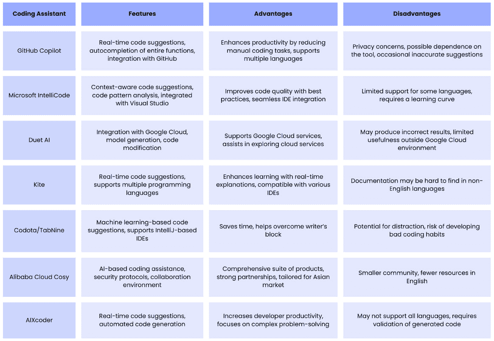
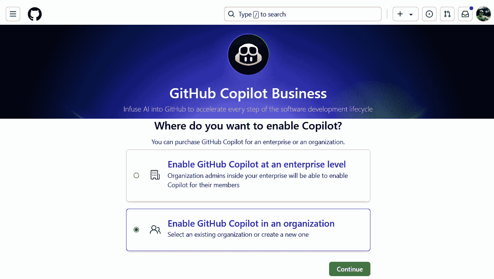
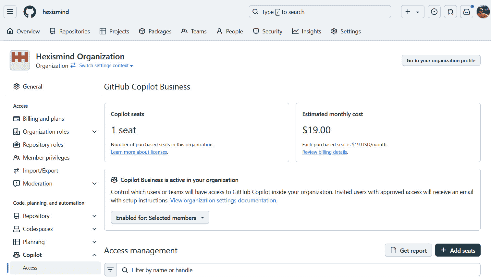
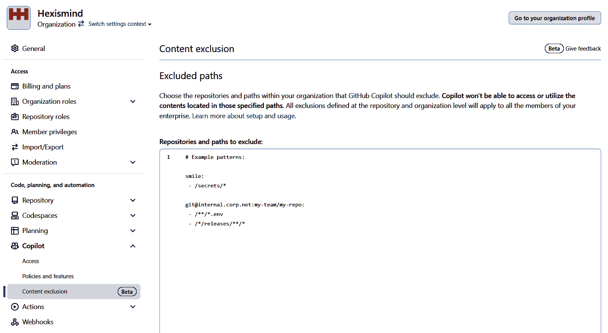
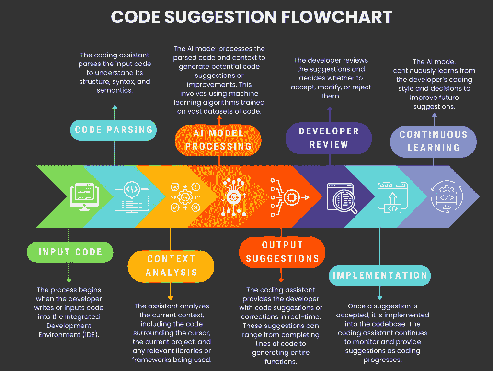
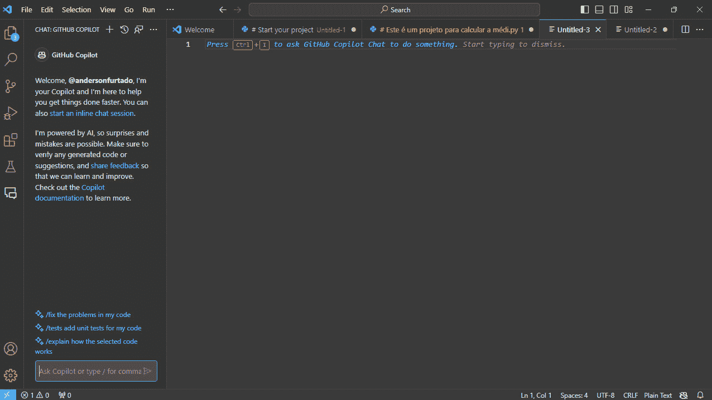
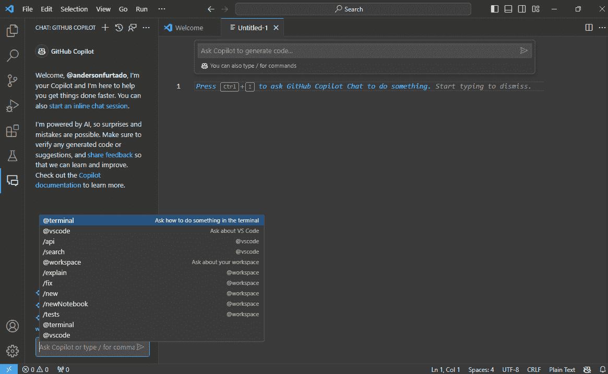
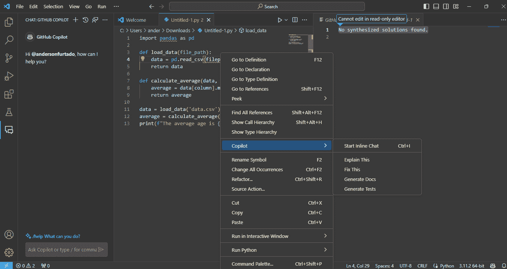

# 第八章：编码助手 —— 现代开发中的秘密武器

在本章中，我们将深入探讨**编码助手**的领域，了解这些工具如何成为现代软件开发中的秘密武器。本章提供了对这些工具的功能、优势和实际应用的洞察，帮助读者充分发挥编码助手的潜力，以提高生产力和代码质量。

本章结束时，你将对编码助手有一个扎实的理解，了解如何在应用中使用它们。你还将学会如何使用编码助手处理复杂的状态逻辑，并有效地调试应用。

本章的主要内容如下：

+   掌握编码助手

+   将编码助手集成到你的工作流程中

+   通过智能代码建议最大化生产力

+   使用智能调试检测和修复错误

+   通过代码审查协助简化协作

# 掌握编码助手

我们生活在一个技术不断发展的时代，软件开发也不例外。其中一项创新就是编码助手。它们是帮助开发人员编写代码的软件工具，利用人工智能建议改进和修正，使得编码过程更加高效。我记得第一次在开发项目中使用 GitHub Copilot 的时候，效果立竿见影：我实现复杂功能的速度显著提高。不仅节省了时间，我还学到了新的最佳实践。

编码助手的好处有很多，以下是其中一些：

+   首先，它们提高了生产力

+   想象一下，你不再需要花费几个小时查找函数的正确语法；编码助手会即时建议所需的代码

+   它们实时检测错误并提出修正建议，从而减少错误并使代码更加简洁高效

+   开发人员可以通过与这些工具的互动，学习新的技术和最佳实践

有几个编码助手的例子，每个都有其独特的特点、优点和缺点。

以下是一些最常用的编码助手：Duet AI、Kite、Codota、TabNine、GitHub Copilot、Microsoft IntelliCode、阿里云 Cosy 和 AIXcoder。为了比较这些工具，我们创建了一个对比矩阵，比较了它们的特性、优点和潜在的缺点。*图 8.1* 提供了一个清晰简洁的概览，帮助开发人员选择最适合自己需求的助手。



图 8.1：编码助手概览

对比矩阵提供了不同编码助手的宝贵视觉总结，突出显示了它们的关键特性、优势和劣势。通过查看此矩阵，开发人员可以根据自己的开发工作流程、项目需求和个人偏好做出明智的决策，选择最合适的工具。

在为项目选择合适的编程助手时，了解不同 AI 框架的独特优缺点至关重要，因为这些工具通常针对特定框架进行了优化。这样的理解将帮助你选择最适合项目需求的编程助手，并补充所选技术栈。

编程助手的选择可能会受到项目需求的影响，如下所示：

+   **编程语言专业化**：编程助手通常专注于某些编程语言。例如，TabNine 在 JavaScript 开发中表现出色，提供精确且有上下文的建议，非常适合 Web 开发人员。相比之下，AIXcoder 因其与 Python 中特定机器学习框架的集成而受到高度评价，这对数据科学家来说是一个福音。

+   **集成开发环境**（**IDE**）**集成**：编程助手的有效性可以通过其与流行 IDE（如**Visual Studio**（**VS**）Code、IntelliJ IDEA 和 Eclipse）的集成功能得到显著提升。这种集成允许开发者在编码环境中直接使用助手，提供无缝访问智能代码补全、重构工具等功能，这些都能加快开发时间并减少编码错误。

+   **机器学习特性**：一些编程助手使用机器学习算法来分析你的编码模式和代码上下文。这使得它们能够提供更精确且与上下文相关的代码建议。例如，如果你正在进行机器学习项目，助手可能会建议如何优化数据预处理或根据当前开发的模型调整超参数。

+   **成本效益**：编程助手的价格范围各异，包括免费和付费选项。对于小型项目或个人开发者，免费版本可能足够，提供基本的代码补全和语法高亮。对于大型企业或更复杂的项目，付费助手可能提供额外的功能，如与公司数据库的更深层次集成、代码的高级安全特性以及团队协作工具。

编程助手是现代开发中的秘密武器。它们不仅提高了生产力，还促进了更高的代码质量和持续学习。随着技术的不断发展，我们可以预期在这一领域会有更多的改进和创新。

接下来，让我们探讨编程助手与**代码生成器**之间的区别。理解这些差异是有效地将这些工具整合到工作流程中的关键，确保你为正确的任务选择合适的工具，并最大化开发效率。

## 代码生成器

代码生成器是一种自动化创建代码的工具。AI 驱动的代码生成器有助于简化编码过程、自动化常规任务，甚至预测并建议代码片段。它们可以快速且准确地生成结果，但始终建议在将生成的代码用于生产环境之前进行审查和测试。例如，在使用由 AWS 开发的 Amazon CodeWhisperer 时，我注意到它能够提供从代码片段到完整函数的实时代码建议。此外，CodeWhisperer 还能够识别难以发现的安全漏洞并提出修复建议。然而，这项商业服务可能对配置较低的机器造成较大压力。

这两种工具的目标都是提高软件开发过程的效率和生产力。然而，选择代码助手还是代码生成器，取决于你项目的具体需求和你的工作风格。

现在你已经了解了代码助手和代码生成器之间的区别，让我们更仔细地看一下一个代码助手：GitHub Copilot。

## 理解 GitHub Copilot

在我的开发项目中，我发现 GitHub Copilot 是一款革命性的 AI 驱动助手。它像一个配对程序员一样，在你输入代码时提供自动完成功能。它与众不同的地方在于，能够通过提供上下文感知的推荐来提高编码效率，无论是开始编写新的代码块，还是仅仅以自然语言表达你的编码思路。该工具有效地利用你正在编辑的文件的细节以及相关文件，确保建议的相关性并无缝地集成到你的文本编辑器中。这种强大的能力得益于 GitHub、OpenAI 和 Microsoft 的合作努力，利用先进的生成式 AI 模型，提供实时编码辅助，完美适应你的特定编码环境。

GitHub Copilot 提供的建议的可靠性直接与公共仓库中某种语言的普及程度相关。例如，像 JavaScript 这样具有广泛代表性的语言，能够从强大的支持和高质量的建议中受益。相反，较不知名的语言由于训练数据中示例较少，可能无法获得相同的准确度。根据我的亲身体验，使用 JavaScript 和 Copilot 结合时，感觉非常流畅和直观，经常能够得到有用的建议。然而，当切换到一个冷门语言时，建议的质量明显下降，这突显了训练数据的数量和多样性的重要性。

关于 GitHub Copilot 的知识产权和开源问题需要谨慎考虑。Copilot 背后的 AI 模型是基于公共代码进行训练的，但并不会存储这些代码，这意味着它们并不是在从代码库中复制粘贴。重要的是要理解，虽然 Copilot 使用这些训练数据生成代码，但它在生成过程中不会保留任何特定的源代码，从而在实用性和知识产权之间保持了平衡。

当涉及到代码补全时，Copilot 在幕后勤奋工作，像侦探一样拼凑线索。它分析你编辑器中的代码，关注光标周围的行，甚至其他打开的文件。所有这些信息都会输入到 Copilot 的模型中，模型会生成一个关于你接下来可能会做什么的概率预测。这个过程几乎让人觉得像是魔法一样，因为你会看到工具建议的代码完美地契合你当前的上下文，使得开发变得更加流畅和直观。

在基于聊天的场景中，Copilot 充当指挥的角色，通过将**上下文摘要**与您提交的问题融合，形成一个上下文提示。这一信息的综合处理会被 Copilot 的模型处理，然后预测并建议最合适的回答。这种方法使 Copilot 成为一个互动助手，能够理解并精准回答问题，提升整体的编码体验。

当你在 GitHub Copilot Chat 中提问时，客户端会自动利用当前上下文的各个方面来构建发送给模型的问题。这个上下文可能包括你工作空间中的各种信息。下面是一个细分：

+   **你当前在活动文档中打开的代码文件**：这是你正在处理的文件。该文件的内容为问题提供了重要的上下文。

+   **你在文档中选择的部分（或当前光标位置的代码块）**：这是你专注的代码部分。如果你高亮了某一段代码，或者光标处于某个特定位置，这将为问题提供更具体的上下文。

+   **在编辑器中打开的相关文档摘要或来自工作空间的文档摘要**：如果你在编辑器中打开了其他文件，或者工作空间中有与当前文件相关的其他文件，这些文件的摘要也可以提供额外的上下文。

+   **关于错误、警告、消息或异常的信息（来自错误列表）**：如果错误列表中有任何错误、警告或其他消息，这些信息有助于模型理解你可能正在尝试解决的问题。

+   **工作空间的整体信息，如框架、语言和依赖项**：工作空间的整体设置，包括你使用的编程语言、正在使用的框架，以及项目所依赖的任何依赖项，也能为问题提供有用的上下文。

+   **工作区、项目或仓库中的相关文件部分**：如果工作区、项目或仓库中有与当前文件或当前问题相关的其他文件，这些文件的部分内容也可以用来提供上下文。

更多信息

您可以在这里使用并了解更多关于 GitHub Copilot 的信息：

[`github.com/features/copilot`](https://github.com/features/copilot)

通过利用这些信息来形成问题，GitHub Copilot Chat 可以提供更准确、更相关的建议。这是一种确保模型尽可能了解您正在尝试做什么的方式，以便提供最佳帮助。

GitHub Copilot 是一个多功能扩展，适用于多种 IDE，包括 VS Code、VS、Vim、Neovim、JetBrains IDE 包以及 Azure Data Studio。其功能旨在简化您的编码工作流程。主要亮点包括：

+   **自动补全功能**：GitHub Copilot 不仅可以建议代码行，还可以建议整个函数和测试，大大加快编码过程并减少样板代码。

+   **多语言代码支持**：GitHub Copilot 是一个多语言支持的工具，意味着它能理解并提供多种编程语言的帮助。无论您使用的是 JavaScript、Python 等广泛使用的语言，还是一些较为冷门的语言，GitHub Copilot 都能为您提供支持。这得益于其训练过程中使用的各种公共代码库。

+   **学习并适应编码风格**：GitHub Copilot 的特点之一是它能够学习并适应您的编码风格。您使用的越多，它就越了解您的编码习惯和偏好。随着时间的推移，它会提供越来越符合您编码习惯的建议，感觉就像一个真正个性化的助手。

更多信息

在这里阅读更多关于 GitHub Copilot 功能的信息：

[`github.com/features/copilot`](https://github.com/features/copilot)

要开始使用 GitHub Copilot，您需要设置一个免费试用或订阅。激活后，您可以在 GitHub 账户中调整设置，以自定义建议并管理遥测数据。这种适应性确保 GitHub Copilot 始终是一个符合您特定需求的有价值工具。例如，*图 8**.2* 展示了如何屏蔽或允许匹配公共代码的建议：



图 8.2：启用或禁用重复检测

您可以通过修改用户设置来控制 GitHub 是否收集和保存您的提示和建议，以及它们是否会被进一步处理并与微软共享。

了解了什么是代码助手，它们提供的好处，以及它们与代码生成器的区别后，让我们来看一下如何将它们集成到您的工作流程中。

# 将编码助手集成到您的工作流程中

我们发现自己沉浸在一个动态的技术景观中，AI 工具的整合成为提升软件开发效率的重要工具。编码助手是强大的工具，可以帮助开发者提高生产力，改善代码质量，并减少压力。然而，要充分利用这些工具的潜力，将它们无缝集成到工作流程中非常重要。

使用 AI 编码助手对软件开发有重要影响。它们不仅加快了开发过程，还帮助保持代码一致性并减少编码错误。通过利用 AI 从大量数据中学习的能力，这些工具可以提供难以人工生成的见解和建议。

然而，事情并非一帆风顺。在整合 AI 编码助手时，存在显著的挑战和限制。这些问题包括从复杂代码库导航到管理专有语言，以及调整 AI 以适应开发者独特的编码风格。认识到这些限制至关重要。例如，我发现虽然 AI 在像 JavaScript 这样的流行语言中表现出色，但在小众或较不常见的框架中可能表现不佳，需要更多的手动适应。

让我们深入实际操作。例如，在 VS Code 中设置和使用 GitHub Copilot 可以极大地增强您的工作流程。接下来的逐步指南将带领您完成这个过程，确保您能有效利用编码助手的所有优势。

## 在 VS Code 中设置 GitHub Copilot – 逐步指南

GitHub Copilot，集成到 VS Code 中，是一个强大的扩展，提供多种功能。以下是 GitHub Copilot 在 VS Code 中的一些关键功能：

+   **实时代码建议**: Copilot 在您输入时提供实时代码建议，帮助加快编写速度。

+   **支持多种编程语言**: 它支持各种编程语言，允许开发者在不同的环境和项目中工作。

+   **从注释生成代码**: Copilot 可以根据您编写的注释生成代码，因为它能够理解开发者的意图。

+   **重构辅助**: 它可以帮助进行代码重构，提供改善现有代码结构和效率的建议。

+   **上下文敏感和定制化建议**: 建议是上下文敏感的，根据周围的代码调整以提供更相关的解决方案。此外，Copilot 还会从开发者特定的编码模式中学习。

+   **代码文档**: 它可以自动生成函数和代码片段的评论和文档。

+   **用于编码模式的机器学习**: 它利用机器学习理解和建议基于常见编码实践的模式。

+   **与单元测试的兼容性**：它可以根据现有代码自动生成单元测试代码。

+   **高效的代码审查**：它通过提供一致且相关的建议，促进代码审查过程。

+   **生成示例和原型的简便性**：它能够快速生成示例或代码原型，帮助可视化提出的解决方案。

+   **与其他 VS Code 扩展的集成**：它可以与 VS Code 中的其他扩展和工具协同工作，扩展其功能。

+   **授权和与 GitHub 集成的简便性**：它提供了一个简单的界面来授权和与 GitHub 账户集成，从而简化项目协作。

通过按照这些步骤，你将顺利将 AI 编程助手集成到工作流程中，从而提升生产力和代码质量。

GitHub Copilot 是一个强大的 AI 编程助手，能够显著提升你在与 VS Code 集成时的编码效率。以下是一个详细的分步指南，帮助你在 VS Code 环境中设置 GitHub Copilot：

1.  **开始安装过程**：首先前往 VS Code 市场并搜索 GitHub Copilot 扩展。只需点击**安装**即可将扩展添加到你的 VS Code 设置中。

1.  **打开 VS Code**：点击**安装**后，会弹出提示要求你打开 VS Code。点击**打开 VS Code**。此操作将直接带你进入 VS Code 环境。

1.  **安装扩展**：在 VS Code 中，你将看到**扩展：GitHub Copilot**标签。点击**安装**将扩展添加到你的 IDE。这一操作将把 GitHub Copilot 集成到你的 VS Code 环境中，帮助你编写代码时提供支持。

1.  **首次登录 GitHub**：如果这是你第一次将 VS Code 与 GitHub 账户连接，系统会提示你直接从 VS Code 登录。这一步骤至关重要，它使 GitHub Copilot 能够访问你的编码历史，提供更具针对性的编码建议。

1.  **无缝自动授权**：对于之前已将 VS Code 与 GitHub 关联的用户，GitHub Copilot 会识别你的设置并自动完成授权。这一便捷功能消除了在使用 GitHub Copilot 时重复授权的需求。

1.  **排查缺失的授权提示**：如果授权提示没有出现，简单点击 VS Code 下方面板中的铃铛图标。这将显示所需的授权提示。

1.  **授予必要的权限**：点击提示后，浏览器会打开 GitHub 页面，要求授予 GitHub Copilot 权限。点击**授权 VS Code**以授予这些权限，确保 Copilot 拥有协助你工作的所有必要权限。

1.  **完成身份验证**：通过确认 VS Code 中的身份验证来完成设置过程。一个对话框将在 VS Code 中出现，您应点击 **打开** 来完成身份验证，并开始享受 GitHub Copilot 的高级功能。

完成这些设置后，您现在可以将 GitHub Copilot 集成到您的开发过程中。利用它来简化您的工作流，但始终运用您的批判性思维和专业知识，做出项目编码中的最终决策。

## 使用 GitHub Copilot 的先决条件

解锁 GitHub Copilot 的全部潜力是一个简单的过程，但它需要几个关键的先决条件：

+   **激活 GitHub Copilot 订阅**：在开始使用 GitHub Copilot 与 VS Code 配合之前，请确保您有一个有效的 GitHub Copilot 订阅。有关账单和订阅的详细信息，请参考 [`github.com/features/copilot#pricing`](https://github.com/features/copilot#pricing) 文档中的 **GitHub Copilot 计费介绍**。

+   -**安装 VS Code**：GitHub Copilot 与 VS Code 无缝集成，因此确保系统上已安装 VS Code。如果尚未安装，请访问 VS Code 下载页面，获取下载和安装最新版本的指导。

满足这两个先决条件后，您就可以在 VS Code 环境中充分利用 GitHub Copilot 的强大功能。现在，让我们开始这段由智能建议和提升生产力驱动的编码之旅。

## 在团队环境中管理编码助手：GitHub Copilot

在协作开发环境中，管理像 GitHub Copilot 这样的编码助手至关重要，以确保工作顺利进行。它有助于保持一致性、简化工作流并促进团队成员之间的更好协作。不过，在团队中使用 Copilot 的复杂性可能会带来一些挑战。以下是一个实用的指南，帮助您管理 Copilot 访问权限、设定适当的策略并处理团队的内容排除：

### 启用和设置 Copilot Business

要开始使用 GitHub Copilot Business，您需要正确设置它。以下是相关步骤：

+   设置订阅：确保您的组织拥有 Copilot Business 订阅。

+   配置设置：在设置 | Copilot 部分配置访问权限、策略和内容排除。

+   配置网络设置：如果需要，配置您的网络设置，例如 HTTP 代理或防火墙，以允许 Copilot 在您的企业网络上运行。

+   分配席位：通过设置 | Copilot | 访问部分将 Copilot 座位分配给个人或团队。

完成这些步骤后，您的组织将能够有效地利用 GitHub Copilot Business。

### 管理 Copilot Business

对 Copilot Business 的适当管理对于保持控制和最大化效益至关重要。以下是您需要做的事项：

+   **查看审计日志**：访问您组织的 Copilot Business 审计日志，了解用户执行的操作，如设置更改或座位分配。

+   **管理访问权限**：

    +   **为所有成员启用访问权限**：在设置 | Copilot | 访问部分为您组织的所有当前成员和未来成员启用 Copilot。

    +   **为特定用户启用访问权限**：选择“已选择成员”并单独添加用户或上传 CSV 文件。

    +   **撤销访问权限**：通过 Copilot | 访问部分撤销个人或整个组织的访问权限。

    +   **查看使用数据**：在设置 | Copilot | 访问部分查看您组织的 Copilot 使用数据，例如已分配的座位数量和预估的费用。您还可以下载报告或按最后使用时间排序用户列表。

有效的管理确保了 Copilot 在您的组织中被适当且高效地使用。

在 *图 8**.3* 中，您可以看到如何管理 GitHub Copilot Business 访问权限，特别是关于 Copilot 座位分配的内容。此可视化展示使用户能够查看在 Copilot Business 订阅下分配的座位数量，并估算相关的月度费用。此外，它还提供了访问详细信息的全面视图，使管理员能够有效监控和管理 Copilot 座位在组织中的使用情况。


图 8.3：如何管理 GitHub Copilot Business 访问权限

替代方法

探索不同的方式查看和管理 Copilot 座位，跟踪它们的使用情况，并估算相关的月度费用。关注 Copilot 座位的分配情况，确保它们在您的团队中得到有效使用。全面了解 GitHub Copilot Business，包括座位分配和相关费用的详细信息。

### 管理策略

为了根据您的组织需求定制 GitHub Copilot，您需要配置相关策略。以下是操作步骤：

+   **建议匹配**：在设置 | Copilot | 策略部分选择“允许”或“阻止”来控制是否允许 Copilot 的建议与 GitHub 上的公共代码匹配。

+   **使用 GitHub Copilot Chat**：在设置 | Copilot | 策略部分选择“允许”或“阻止”来启用或禁用您组织的聊天功能。

配置这些策略有助于您保持对 Copilot 使用的控制，确保它符合您组织的标准。

*图 8**.4* 展示了 GitHub Copilot Business 的策略和功能配置。它展示了如何管理建议匹配策略并启用或禁用组织内的 GitHub Copilot Chat。组织管理员可以使用这些设置根据需求调整 Copilot 的行为。



图 8.4：政策与功能

替代方法

设置 GitHub Copilot Business 政策，以确保该工具根据您组织的具体需求进行操作。监督建议匹配的政策，并管理 GitHub Copilot Chat 的功能。根据您组织的偏好和操作需求调整 Copilot Business 设置。

### 配置内容排除

为了进一步自定义 GitHub Copilot 的功能，您可以设置内容排除。按照以下步骤操作：

+   **配置排除项**：排除特定文件或目录不被 Copilot 用于代码补全和建议。

+   **配置仓库设置**：在“设置 | Copilot”部分定义特定于仓库的内容排除。

+   **配置组织设置**：定义适用于 [GitHub.com](http://GitHub.com) 或其他位置的任何基于 Git 的仓库的排除项。

+   **配置受影响的人员**：排除项仅适用于具有 Copilot 座位的同一组织成员。

    这些设置可以确保 Copilot 不使用敏感或无关的内容，从而提供更准确、合适的建议。

    *图 8.5* 提供了详细的步骤，展示如何在组织内为 GitHub Copilot 设置内容排除。它概述了仓库管理员和组织所有者识别并管理应排除在代码补全建议之外的文件的过程。此图还说明了在仓库和组织级别设置排除的可用选项，确保特定文件不会影响 Copilot 提供的建议。



图 8.5：内容排除

替代方法

设置内容排除设置，以防止某些文件出现在 GitHub Copilot 的代码补全建议中。通过在您的仓库或组织内配置内容排除，来微调 Copilot 的功能。确保特定文件不会影响 Copilot 的代码建议，方法是应用适当的内容排除设置。

### 传播更改并检查效果

在更改设置后，您需要确保它们已正确应用。以下是操作方法：

+   **等待或重新加载**：内容排除的更改可能需要最多 30 分钟才能在您的 IDE 中生效。或者，按照不同 IDE 的说明手动重新加载设置。

+   **检查效果**：打开受排除影响的文件，确认 Copilot 被禁用（没有建议），且其内容不会用于其他文件中的建议。

通过验证这些更改，您可以确保您的配置按预期工作。

实用技巧

使用审计日志跟踪用户活动，确保 Copilot 的负责任使用。

根据团队的需求和安全考虑设置政策。

定期审查并更新内容排除，以确保所需的代码覆盖。

鼓励团队成员熟悉 Copilot 的功能和局限性。

有效管理 GitHub Copilot 商业版功能需要多方面的措施。您需要审计使用情况、配置访问权限、设定政策并控制内容排除。这些步骤有助于组织充分利用 Copilot，同时保持控制并根据特定需求进行定制。

我们已经涵盖了如何管理这些功能，包括审计操作、配置访问权限和定义政策。有了这个坚实的基础，我们现在可以进一步改善我们的编码实践。

接下来，让我们探索这些管理策略如何帮助我们使用智能代码建议。这将提升生产力，并优化我们的开发工作流程。

# 最大化生产力与智能代码建议

在快速发展的软件开发世界中，最大化生产力至关重要。一种强大的方法是利用智能代码建议。编码助手利用先进的算法预测并推荐您可能需要的下一个代码片段。

接下来的部分，*快速代码编写*，将展示使用这些建议的实际应用和技巧。这些方法可以显著加快编码任务的速度，并提高软件开发的效率。我们将深入探讨如何将这些创新无缝集成到您的编码环境中。

*图 8.6* 展示了不同的编码助手，如 GitHub Copilot、Kite 和 Duet AI，如何与各类 IDE（包括 VS Code、IntelliJ IDEA 等）进行集成。该可视化图有助于理解这些工具如何融入您的开发工作流程，突出了助手与 IDE 之间的互动和兼容性。



图 8.6：代码建议流程图

该图展示了编码助手如何与各种 IDE 连接，使用线条和箭头来指示兼容性和支持。例如，GitHub Copilot 与 VS Code 的链接表示该助手可以在此 IDE 中用于实时代码建议。另一方面，Duet AI 与 Google Cloud 产品的连接展示了它与 Google 生态系统的深度集成。这些线条代表了集成路径，帮助可视化不同工具在不同开发环境中的实现，从而提高编码效率和质量。

这种可视化表示使得理解如何在您的开发过程中利用这些工具变得更加容易。每条连接线都突出了通过这些助手与开发环境的无缝集成，如何提升效率和改善代码质量。

## 快速代码编写

速度是软件开发中的关键因素。通过实时代码建议，您可以加速编码过程。GitHub Copilot 等编码助手提供与您正在编写的内容相关的代码建议，使您可以更多地关注代码逻辑而不是语法。

让我们逐步看一下使用 GitHub Copilot 在 VS Code 上进行文本补全的示例：

1.  打开 VS Code 并导航到您正在处理的 Python 文件。

1.  从以下注释描述项目开始，例如：

    ```py
    # This is a project to calculate the average of a list of numbers
    ```

1.  开始输入您的代码。例如，如果您正在编写一个计算数字列表平均值的函数，您可能会开始输入以下内容：

    ```py
    def calculate_average(
    ```

1.  当您输入时，Copilot 将开始提供实时代码补全。例如，它可能建议您使用 `numbers):` 来完成前一行。

1.  按下 *Tab* 键以接受建议。

1.  继续编写您的代码。Copilot 将继续提供相关的建议。例如，它可能建议完整函数体来计算数字列表的平均值。

1.  当您完成编写代码时，可以使用 Copilot 来查找优化代码的更好方法。

*图 8**.7* 表示 GitHub 对 VS Code 的授权请求。当用户希望将他们的 GitHub 账户与 VS Code 集成时，这是一个标准流程。在本例中，用户是 `andersonfurtado`，**GitHub for VS Code by Visual Studio Code** 应用程序正在请求访问用户的账户。


图 8.7：GitHub 对 VS Code 的授权请求

授权过程是一项安全措施，确保用户明确授权 VS Code 访问其 GitHub 账户。请求的访问权限包括对个人用户数据和电子邮件地址的只读访问。一旦用户授权此访问，他们将被重定向到 [`vscode.dev`](https://vscode.dev)。此集成允许用户直接在 VS Code 中使用 GitHub 的功能，增强其编码工作流程。需要注意的是，此过程应仅在安全环境中完成，以保护用户的个人信息。

重要说明

在开始示例之前，重要提醒，您需要在 GitHub 上为 VS Code 授权。这可以通过您的浏览器完成。在某些情况下，为了使 GitHub 上的授权请求消息出现，您可能需要重新启动 VS Code。

透过 VS Code 的世界，*图 8**.8* 捕捉了 GitHub Copilot 状态图标焕发生机的时刻。这个图标嵌入在 VS Code 窗口底部的状态栏中，表明 GitHub Copilot 正在活动并准备好协助智能代码建议。



图 8.8：带有 GitHub Copilot 状态图标的 VS Code

GitHub Copilot 状态图标不仅仅是一个符号，它是 VS Code 界面中的一个互动网关。当 GitHub Copilot 处于活动状态时，图标会亮起，表明 AI 驱动的代码建议正在运行。用户可以与该图标互动，深入了解与 GitHub Copilot 相关的更多选项，例如调整设置或发现当前版本。此图标在用户体验中起着至关重要的作用，提供了一种无缝的方式，让用户可以直接从 VS Code 界面中导航和与 GitHub Copilot 互动。在新版中，你可以使用 *Ctrl* + *I* 来请求 GitHub Copilot Chat 执行某项任务，或者点击右下角的图标来打开 Copilot Chat。

在探索了 GitHub Copilot 状态图标的互动功能及其在提升编码效率中的作用之后，我们现在准备深入探讨其更多的能力。以此为基础，让我们一起探索如何进一步利用 GitHub Copilot Chat 在 VS Code 中提升我们的编码工作流。

## 在 VS Code 中利用 GitHub Copilot Chat 的强大功能

GitHub Copilot Chat 是一款突破性的工具，作为 AI 编程助手，帮助开发者更高效地在软件开发领域中航行。它可以执行多种任务，是每个开发者不可或缺的资源。

*图 8.9* 说明了在 VS Code 中使用 GitHub Copilot Chat 的 `task` 命令。此功能允许用户请求特定任务，例如生成代码、询问现有代码的问题，甚至创建新的 Jupyter Notebook。



图 8.9：GitHub Copilot 中的任务命令

在聊天中输入`/`，将显示一个可能任务的列表，提供与 GitHub Copilot 的轻松高效互动。这一功能突出了 GitHub Copilot 作为 AI 编程助手的多功能性，能够协助完成广泛的软件开发任务。

通过在 Copilot Chat 中输入`/`，你可以执行以下任务：

+   **询问有关当前工作区文件的问题**：GitHub Copilot 可以提供有关工作区文件的见解，帮助你更好地理解现有代码

+   **解释所选代码的工作原理**：如果你在理解一段代码时遇到困难，GitHub Copilot 可以提供详细的解释

+   **为所选代码生成单元测试**：GitHub Copilot 可以为所选代码生成单元测试，帮助确保你的代码按预期工作

+   **为所选代码提出修复方案**：如果 GitHub Copilot 检测到所选代码中存在问题，它可以建议修复方案

+   **为新工作区生成代码**：如果你正在启动一个新项目，GitHub Copilot 可以生成代码来帮助你启动工作区

+   **创建新的 Jupyter Notebook**：GitHub Copilot 可以为你创建新的 Jupyter Notebook，帮助你整理和可视化数据

+   **询问有关 VS Code 的问题**：如果你对如何使用 VS Code 有疑问，GitHub Copilot 可以提供答案。

+   **为工作区搜索生成查询参数**：GitHub Copilot 可以生成查询参数，以帮助你在工作区中进行搜索。

+   **询问有关开发 VS Code 扩展的问题**：如果你对开发自己的 VS Code 扩展感兴趣，GitHub Copilot 可以提供指导。

+   **询问如何在终端中执行某些操作**：如果你需要帮助在终端中运行命令，GitHub Copilot 可以提供逐步的指引。

以下是如何在 VS Code 中使用 GitHub Copilot Chat 的逐步示例：

1.  **打开 VS Code**：在你的电脑上启动 VS Code。

1.  **激活 GitHub Copilot**：如果你还没有安装 GitHub Copilot 扩展，可以在 VS Code 扩展商店中找到它。安装完成后，GitHub Copilot 图标应该出现在屏幕底部的状态栏中。

1.  **启动 Copilot Chat**：有两种方式可以启动 Copilot Chat：

    +   按下键盘上的 *Ctrl* + *I*。

    +   点击屏幕右下角状态栏中的 GitHub Copilot 图标。

1.  `用 Python 编写一个反转字符串的函数`。

1.  **使用代码建议**：GitHub Copilot 将根据你的查询生成代码建议。你可以通过按 *Ctrl* + *Enter* 来接受建议，或者你可以请求其他替代方案。

1.  **与 Copilot Chat 互动**：你可以继续与 Copilot Chat 互动，提出额外的问题或请求更多的代码建议。

请记住，尽管 GitHub Copilot 是一个强大的代码辅助工具，但始终理解你正在编写的代码并确保其符合你的特定需求是非常重要的。

虽然 GitHub Copilot 是一个非常宝贵的工具，但重要的是要保持参与并理解你整合到项目中的代码。了解这一点后，让我们继续探索如何通过使用 GitHub Copilot 的多语言功能，进一步扩展你的编码可能性，从而提升开发工作流。

## 使用多语言功能

编程助手是支持多种编程语言的强大工具。这在多语言开发环境中特别有用，在这种环境中，项目的不同部分可能用不同的语言编写。

让我们看一个使用 Copilot 进行 Web 开发的示例。假设你正在开发一个 Web 项目，前端使用 JavaScript（React）编写，后端使用 Python（Django）编写；在这种情况下，请按照以下步骤操作：

1.  打开 VS Code，并导航到你正在开发前端的 JavaScript（React）文件。

1.  开始编写你的代码。Copilot 将建议 JavaScript 代码补全。

1.  如果你切换到后端的 Python（Django）文件，Copilot 将开始建议 Python 代码补全。

1.  这使你能够在不同的编程语言之间轻松切换，而不会失去生产力，同时在两个项目中保持一致性和高效性。

如 GitHub Copilot 等编码助手能够处理多种语言，这对于在多语言环境中工作的开发者来说至关重要。这些工具提供各种编程语言的相关代码建议，允许开发者在不牺牲生产力的情况下在语言间无缝切换。这一功能在 Web 开发中尤其有益，因为前端和后端通常使用不同的语言。因此，多语言能力对于提升开发者的效率和生产力至关重要。

了解 GitHub Copilot 及类似工具如何通过其多语言支持提升生产力，为进一步优化我们的编码实践奠定基础。在接下来的章节中，我们将深入探讨一些基本的代码优化技巧，以简化开发过程并提升代码效率和可读性。

## 代码优化技巧

代码建议不仅仅是加速写作过程，它们还专注于优化和提升代码效率。像 GitHub Copilot 这样的工具提供了如何优化代码的宝贵建议，使代码更高效，整体质量更好。通过提供这些优化建议，编码助手帮助确保你的代码运行得更加顺畅和有效。以下是一些使用 GitHub Copilot 进行代码优化的示例：

+   **使用合适的数据结构**：正确的数据结构能显著提高代码的效率。例如，如果你在处理大量数据，Copilot 可能会建议使用集合（set）而不是列表（list），以加快搜索操作。

+   使用`sum()`函数而非`for`循环。

+   使用`Car`类和适当的方法。

+   **使用 Copilot 检查更好的代码优化方式**：在编写完代码后，你可以使用 Copilot 检查是否有更好的方式来优化你的代码。它可能会建议重构，以提高代码的效率和可读性。

掌握代码自动完成对于任何开发者都非常重要。借助智能代码建议，你可以更快速地编写代码，轻松处理多种语言，并确保你的代码在性能上得到优化。这个强大的工具能够显著提升你的生产力，帮助你成为更高效的开发者。明智使用它，看看你的效率如何飞跃。

讨论了代码自动完成功能的好处后，让我们将注意力转向另一个重要方面：**智能调试**。与传统的调试方法不同，这项技术不仅能检测错误，还能提供解决方案。它简化了开发过程，并确保更高的代码质量。通过利用智能调试，你可以进一步提升编码效率，编写更简洁、更可靠的代码。让我们更详细地探讨这个强大的工具。

# 使用智能调试来检测和修复错误

调试是一项艺术，需要耐心、精确和对代码的深刻理解。在软件开发的世界里，智能调试脱颖而出，成为一项重要技能。它涉及使用先进的技术和工具来高效地检测和修复错误。其中一些技术包括**实时错误检测**、静态代码分析、逐步调试和反向调试。让我们详细看一下几种技术。

## 实时错误检测

实时错误检测是一项先进的功能，它允许开发者在代码引入错误的同时，及时发现并修复这些错误。像 GitHub Copilot 这样的工具能够根据你正在编写的代码的上下文，建议修正代码错误。然而，GitHub Copilot 并不会实时修正你的代码，因为它没有与开发环境直接互动的能力。

下面是一个示例，展示 GitHub Copilot 如何为 Python 中常见的代码错误提供修正建议。

假设你有以下带有错误的代码：

```py
for i in range(10)
    print(i)
```

这里的错误是`for`循环行末缺少一个冒号（`:`）。GitHub Copilot 可能会建议以下修正：

```py
for i in range(10):
    print(i)
```

在我们充分理解实时错误检测及其好处后，我们可以探索另一个具有变革性的功能。我们在高级开发工具中的下一步旅程是利用 IDE（如 VS Code）中的聊天功能进行调试。这种创新的方法不仅简化了调试过程，还提高了其效果。通过利用对话式 AI，开发者可以直接与工具进行互动，以更直观、便捷的方式获取解决方案和见解。

让我们更深入地探讨这些聊天功能如何彻底改变你的调试过程，使其更加流畅和高效。这种方法通过提供实时帮助和上下文理解，提升了传统调试体验，最终帮助你更快速、更准确地解决问题。

## 使用聊天和 VS Code 进行调试

你也可以通过聊天使用 GitHub Copilot 进行调试。通过提交有问题的代码并描述意外行为，Copilot 可以提供潜在的解决方案或修正意见。请记住，GitHub Copilot 无法直接运行或调试代码；它只能根据你提供的信息提出建议。开发者负责实现和测试这些建议的修正。

考虑以下针对带有错误的 Python 代码块的处理过程：

1.  **提供有问题的代码**：你可以通过提供导致问题的代码开始。例如，你可能有一个本应加法运算的函数，但实际上却在做减法：

    ```py
    def add(a, b):
        return a – b
    ```

1.  使用`/fix`命令获取修正建议。例如，你可以在 GitHub Copilot 聊天框中输入`/fix`。

1.  `加法函数在做减法，而不是` `做加法`。

1.  **获取建议**：根据你的代码和问题描述，GitHub Copilot 可以建议一个可能的修正。聊天框会返回类似如下内容：

    你的 Python 函数似乎有一个逻辑错误。这个函数本应进行加法运算，但它却在做减法。以下是修正后的代码：

    ```py
    def add(a, b):
        return a + b
    ```

1.  **实施修正**：最后，你可以在 VS Code 中实现建议的修正。你可以直接在 VS Code 中输入建议的修正。

实际的建议将取决于你的函数的复杂性和代码的上下文。这是一个简单的示例，用于说明这一过程。

在通过聊天了解了 GitHub Copilot 如何在 VS Code 中协助调试后，我们将探讨另一个旨在简化编码过程的强大功能。GitHub Copilot 中的**修复此项**功能进一步增强了代码建议的能力，主动提出更改以修正代码中的特定问题。

## 使用“修复此项”功能调整代码

GitHub Copilot 是一款帮助开发者编写代码的 AI 工具。它拥有多个功能，每个功能旨在提升编码过程中的不同方面。例如，**修复此项**功能以其能够根据代码上下文建议修正或改进而脱颖而出。这与其他功能，如**聊天**和**内联文本补全**有所不同。以下是它们的比较：

+   **聊天**：这个功能允许开发者与 AI 进行对话互动，询问问题或寻求编码问题的建议。

+   **内联文本补全**：另一方面，这个功能在开发者输入代码时提供实时建议，帮助自动完成代码行或代码块。

+   **修复此项**：通过右键点击特定代码上下文，进入**Copilot**菜单访问，此功能采用更加主动的方法。它会分析选中的代码，并建议修正或改进，节省开发者手动调试或优化代码的时间和精力。

*图 8.10* 说明了如何访问**修复** **此项**功能。



图 8.10：访问“修复此项”功能

以下是访问该功能、获取建议以及决定是否接受或拒绝建议的逐步指南：

1.  右键点击你希望修正或改进的代码。

1.  在出现的菜单中，将鼠标悬停在**Copilot**选项上。

1.  在**Copilot**子菜单中，选择**修复此项**选项。

1.  GitHub Copilot 将分析代码上下文，并建议一个修正或改进。

1.  你可以预览建议，并决定是否接受或拒绝。如果接受，建议将应用于你的代码。

最后，GitHub Copilot 的“Fix This”功能是开发人员日常工作中的宝贵工具。它不仅有助于高效地纠正和改进代码，还作为一个优秀的学习工具，帮助开发人员熟悉新技术和编码最佳实践。这个功能，连同 GitHub Copilot 提供的其他功能，使其成为现代开发人员的全面且不可或缺的工具。

现在我们理解了 GitHub Copilot 的“Fix This”功能如何简化代码调整，让我们把注意力转向另一个强大的功能。在接下来的部分中，我们将探索 GitHub Copilot 如何生成单元测试。这个功能有助于全面的测试过程，确保你的代码健壮且可靠。

## 使用 GitHub Copilot 生成单元测试

要使用 GitHub Copilot 生成单元测试，你可以先写一个注释，表示你想为特定函数创建一个单元测试。GitHub Copilot 随后会根据上下文生成一个建议。假设你有以下函数：

```py
def multiply(a, b):
    return a * b
```

这是生成单元测试的逐步指南：

1.  **开始编写单元测试**：你可以像这样开始编写单元测试：

    ```py
    def test_multiply():
        # ...
    ```

1.  **获取建议**：在定义函数后启动单元测试，GitHub Copilot 可以生成以下完整的单元测试：

    ```py
    def test_multiply():
        assert multiply(2, 3) == 6
        assert multiply(-1, -1) == 1
        assert multiply(0, 0) == 0
    ```

1.  **实施建议**：你可以直接在 VS Code 中的代码中实施单元测试建议。

这是一个简单的示例，实际的建议将根据你函数的复杂性和代码的上下文而有所不同。这个示例演示了整个过程。

精通智能调试技术以进行错误检测和解决是每个开发人员必备的技能。在 AI 编程助手的帮助下，我们可以提升这一技能，使我们的编码过程更加高效和富有生产力。实时错误检测、采纳调试最佳实践、通过聊天进行调试以及生成单元测试是掌握这些技术的关键组成部分。通过这些技能，我们可以编写更简洁、更高效且更少错误的代码。智能调试不仅是一项技能，更是一种思维方式，让我们能够编写出更好、更高效的代码。

通过清晰理解 GitHub Copilot 如何提升我们的单元测试能力，让我们继续前进，探索如何通过有效的代码审查协助来增强协作并简化我们的编码实践。

# 通过代码审查协助简化协作

高效的协作和代码质量是软件开发的两个基本支柱。在本节中，我们将探讨如何在 VS Code 中使用 GitHub Copilot，成为这个过程中强有力的盟友。

## 增强代码审查过程

在代码审查领域，GitHub Copilot 的角色具有变革性。以下是具体方式：

+   **提供上下文感知的代码建议**：在审查过程中，提供上下文敏感的代码建议，帮助加速审查过程

+   **突出潜在错误或风格问题**：潜在的错误或风格问题会被突出显示，允许在提交前进行修正

+   **自动化重复任务，如格式化和注释**：重复任务，如格式化和注释，得以自动化，节省了宝贵的时间

+   **与代码审查平台集成以简化工作流程**：与代码审查平台（如 GitHub）集成，简化了工作流程

+   **提供替代方案或改进的建议**：提供替代方案或改进的建议，有助于提高代码质量

+   **标记偏离编码标准的代码**：偏离编码标准的代码会被标记，确保代码的一致性

通过这些功能，代码审查过程变得更加高效和有效。

## 确保代码质量

质量在代码开发中是不可妥协的。以下是 GitHub Copilot 如何确保质量的方式：

+   **一致性地执行编码标准**：编码标准被一致地执行，有助于保持代码的一致性和可读性

+   **跟踪代码质量指标的变化**：代码质量指标随着时间的推移进行跟踪，提供了有关代码质量的宝贵见解

+   **建议进行重构以提高可维护性**：会建议进行重构，以提高代码的可维护性

+   **自动生成代码文档**：自动生成代码文档，节省时间并确保代码易于理解

+   **识别潜在的安全漏洞**：识别潜在的安全漏洞，有助于保护代码免受威胁

这些功能确保你编写的代码具有最高的质量。

## 团队协作功能

团队协作是成功软件开发的核心。以下是 GitHub Copilot 如何促进团队协作的方式：

+   **轻松共享代码片段和建议**：可以轻松共享代码片段和建议，促进协作。

+   **提供异步代码反馈**：可以异步地提供代码反馈，从而促进高效的团队协作。

+   **解决代码合并冲突**：在代码合并过程中解决冲突，确保顺利的合并过程。

+   **促进知识转移和集体学习**：促进知识转移和集体学习，帮助团队共同学习和成长。

+   **跟踪团队进度和贡献**：跟踪团队进度和贡献，提供关于团队表现的宝贵见解。通过这些功能，你的团队能够更有效、更高效地协作。

将 GitHub Copilot 集成到 VS Code 中可以显著提升协作和代码质量。通过将 Copilot 嵌入到我们的工作流程中，我们可以提高团队的生产力并保持持续的代码改进。要使用这些功能，请在 VS Code 中安装 GitHub Copilot 扩展，并将其链接到你的 GitHub 账户。一旦设置完成，就可以在 VS Code 编辑器中直接使用 Copilot。

这就结束了我们关于 GitHub Copilot 如何通过代码审查帮助提升协作的讨论。我们希望这些信息对你有所帮助，并带来了深刻的启示。

# 总结

在本章中，你已经了解了编码助手的领域，并探索了这些工具如何成为现代开发中的秘密武器。你全面了解了它们的功能和优势，并学会了如何在应用中使用它们，以提高生产力和代码质量。你掌握了将编码助手集成到工作流程中的技巧，通过智能代码建议最大化生产力，并通过代码审查帮助简化协作。

你还熟练掌握了使用编码助手处理复杂状态逻辑并有效调试你的应用程序。到目前为止，你不仅理解了编码助手的基本概念和功能，还学会了如何将它们无缝集成到你的开发工作流程中。你已有效利用代码自动补全提高生产力，掌握了智能调试技术进行错误检测和解决，并通过高效的代码审查帮助优化了协作。

当我们进入下一章时，我们将继续加强内容的逻辑流畅性。
