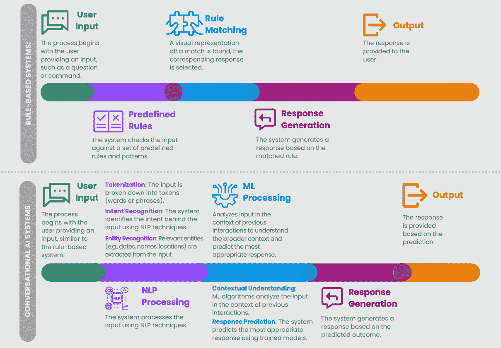

# 第九章：更智能的用户互动 – 通过高级 AI 提升用户参与度

在本章中，我们将探索`TextBlob`库和使用**spaCy**的**命名实体识别**（**NER**）。此外，我们还将通过**SQLAlchemy**实现数据库交互，并构建一个 Telegram 机器人，展示如何将聊天机器人与消息平台集成。

本章的主要内容如下：

+   解开用户互动中的高级 AI

+   解开对话式 AI 的奥秘

+   创建聊天机器人的对话体验

+   利用语音识别的力量

+   分析语言模式以实现个性化互动

+   生成性语言模型与内容创作的未来

+   AI 电影推荐聊天机器人的示例

本章结束时，你将学会如何利用高级 AI 的基础知识进行用户互动。你将学会如何设计并集成聊天机器人来实现对话体验。你还将知道如何实现语音识别以增强用户的可访问性。此外，你将学会如何利用**自然语言处理**（**NLP**）分析语言模式以实现个性化互动，并探索像 ChatGPT 这样的生成性语言模型在内容创作中的可能性。

# 技术要求

在这个项目中，我们将使用 Python 3.7 或更高版本，以及以下 Python 库：

+   `pandas` ([`pandas.pydata.org/`](https://pandas.pydata.org/))

+   `NumPy` ([`numpy.org/`](https://numpy.org/))

+   `sklearn` ([`scikit-learn.org/stable/index.html`](https://scikit-learn.org/stable/index.html))

+   `SQLAlchemy` ([`www.sqlalchemy.org/`](https://www.sqlalchemy.org/))

+   `TextBlob` ([`textblob.readthedocs.io/en/dev/`](https://textblob.readthedocs.io/en/dev/))

+   `spaCy` ([`spacy.io/`](https://spacy.io/))

+   `nest-asyncio` ([`github.com/erdewit/nest_asyncio`](https://github.com/erdewit/nest_asyncio))

+   `python-telegram-bot` ([`python-telegram-bot.readthedocs.io/en/stable/`](https://python-telegram-bot.readthedocs.io/en/stable/))

本章中使用的所有示例和源代码都可以在我们的 GitHub 仓库中找到。你可以访问并下载代码，跟随项目并根据需要进行定制。请访问以下链接以探索本章的代码仓库：

[`github.com/PacktPublishing/AI-Strategies-for-Web-Development/tree/main/ch9`](https://github.com/PacktPublishing/AI-Strategies-for-Web-Development/tree/main/ch9)

# 解开用户互动中的高级 AI

**高级 AI**正在改变我们开发和与网页互动的方式。这是一种能够让机器学习、适应并独立执行复杂任务的技术。在网页开发中，高级 AI 可用于多种应用，从内容个性化到搜索引擎优化。

例如，通过使用 Google Analytics 等工具实现用户行为追踪，并利用聚类算法对相似用户行为进行分组，可以显著增强个性化工作。这种方法有助于根据之前的互动定制用户体验，从而提高用户参与度和留存率。此外，采用语义搜索和向量空间模型等搜索引擎优化技术可以大大提高搜索效率，使用户能更有效地找到所需内容。

这种方法也正在用于改进 Python 中的`SpeechRecognition`库以进行音频转录，并利用 Google Translate API 实现网页内容的自动翻译。

此外，先进的人工智能有潜力改变用户互动，提供更个性化、高效和自适应的体验。当我们深入探讨先进人工智能领域时，我们的下一个重点将是理解**对话式人工智能**，这是改变用户与技术互动方式的关键组成部分。

# 揭开对话式人工智能的神秘面纱——深入探讨其类型、技术和应用

想象一个世界，机器不仅能理解人类语言，还能以与人类响应难以区分的方式作出回应。这就是对话式人工智能的魅力。与传统的基于规则的系统相比，后者仅限于预定义规则，对话式人工智能则实现了跨越，它使用**机器学习**（**ML**）和自然语言处理（NLP）技术以更自然、更具上下文感知的方式理解并回应。

处理和响应用户输入的系统有多种类型，从简单的基于规则的系统到更复杂的对话式人工智能系统不等。基于规则的系统通过遵循预定义的规则和模式来生成响应。它们简单直接，但往往缺乏灵活性和适应性。另一方面，对话式人工智能系统利用先进技术如 NLP 和机器学习（ML）来理解和响应用户输入，以更自然和上下文感知的方式进行互动。*图 9.1*对比了这两种系统，展示了基于规则的系统的线性和刚性特性与对话式人工智能系统动态和复杂的方法。



图 9.1：基于规则的系统与对话式 AI 系统

基于规则的系统与对话式 AI 系统之间的视觉对比突出了现代 AI 系统的额外复杂性和精密度。尽管基于规则的系统遵循线性路径并依赖预定义规则，但对话式 AI 系统则利用 NLP 技术理解用户意图，并通过 ML 算法分析上下文，预测最佳响应。

对话式人工智能有许多形式，每种形式都有其独特的特点和应用。以下是一些示例：

+   **聊天机器人**：这些数字化助手模拟人类对话，通常用于客户服务中回答常见问题。例如，像 Amelia 这样的聊天机器人帮助用户导航保险服务，而 Eva – 被一家大型银行雇用 – 则协助客户处理从账户余额到最近交易等银行咨询事务。

+   **虚拟助手**：以 Siri、Alexa 和 Google Assistant 为代表的这类对话型人工智能，它们比聊天机器人更为先进，能够执行多种任务，从回答问题到控制智能家居设备。

+   **语音助手**：这些系统使用语音数据与用户互动。当用户无法或不愿使用文本界面时，它们非常有用。例如，Amazon Alexa 和 Google Assistant 帮助用户执行各种活动，从控制智能家居设备到回答问题和播放音乐。

+   **对话系统**：这些系统是能够管理多轮对话的幕后推手，能够在对话过程中保持上下文的连贯性。例如，IBM watsonx Assistant 就是一个典型的例子，它被用于客户服务中处理复杂的咨询，并根据持续的对话提供一致的回应。

机器学习（ML）是对话型人工智能的“大脑”。它使用能够从数据中学习的算法，使人工智能随着时间的推移不断改进回应。这一学习过程类似于人类学习，经验积累带来了知识和技能的提升。

与此同时，NLP 是对话型人工智能的核心。它涉及运用计算技术分析和合成自然语言和语音。这一能力使人工智能能够理解人类语言的自然形式，包括同义词、俚语，甚至是拼写错误。

当需要与用户进行自然直观的互动时，对话型人工智能表现得尤为出色。它在客户服务应用中尤其有用，能够快速准确地回答常见问题，从而使人工服务人员可以集中精力处理更复杂的事务。

对话型人工智能确实是一种革命性的技术互动方式。它就像是一座桥梁，连接着我们人类与机器，使我们能够像与彼此沟通一样与机器进行交流。这见证了我们在让机器理解我们方面取得的进展，也为我们提供了一窥未来的机会，届时机器将能够更好地理解我们。

简而言之，对话型人工智能通过利用先进的机器学习（ML）和自然语言处理（NLP）技术，为增强用户互动和参与提供了强大的工具。随着我们在这一领域不断进步，未来我们可以期待看到更加复杂且无缝的用户交互。在接下来的子章节中，我们将探讨如何通过聊天机器人创建对话体验，深入研究对话型人工智能的实际应用。

# 创建与聊天机器人互动的对话体验

在我们的数字时代，我们不断接触到新的互动形式。其中一种创新就是聊天机器人，它是一个正在改变我们与虚拟世界沟通方式的数字助手。从本质上讲，聊天机器人是用来模仿人类对话的计算机程序，旨在以真实和直观的方式与用户交流。

它们正在渗透我们数字生活的各个方面，从客户支持到教育和健康。然而，究竟是什么让聊天机器人变得高效呢？它们如何提升我们的数字互动并创造更丰富、更具吸引力的对话体验？

在本节中，我们将深入探索聊天机器人的世界。我们将探讨它们在用户互动中的角色，了解它们是如何工作的，并发现它们如何被用来创造更真实、更具吸引力的对话体验。我们将揭开这些数字助手背后的秘密，发现它们如何重新定义我们在数字世界中的交流方式。

## 掌握聊天机器人对话界面设计的艺术

在聊天机器人的语境中，成功互动的基石在于设计**自然的对话流程**。这意味着聊天机器人应该跟上对话的节奏，以逻辑且连贯的方式回应用户的提问。像**Rasa NLU**这样的库中的意图识别技术帮助聊天机器人理解用户的提问。通过状态管理设计对话路径并实施反馈循环，可以根据用户的互动优化聊天机器人的回应。这些策略确保聊天机器人提供准确且具有上下文相关性的回应，从而提升整体用户体验。

为了实现自然的对话流程，理解人类语言的细微差别并编程使聊天机器人能够直观回应至关重要。以下是创建这种流程的分步指南：

1.  **理解用户意图**：创建自然对话流程的第一步是理解用户在对话过程中想要实现的目标。

1.  **设计对话路径**：一旦你理解了用户的意图，接下来的步骤是设计一条对话路径，引导用户朝着实现他们目标的方向前进。

1.  **实现自然语言处理（NLP）**：NLP 技术可以确保聊天机器人以自然直观的方式理解并回应用户的提问。

1.  **测试并优化对话流程**：最后，应通过真实用户测试对话流程，并根据他们的反馈进行优化。

对话界面设计的另一个关键方面是制定**用户友好的回应**。我们认为，聊天机器人应该能够以清晰友好的方式进行沟通，而不是使用术语或复杂的技术语言。为了实现这一目标，我们努力创建既具有信息性又易于理解的回应。以下是如何创建用户友好回应的分步指南：

1.  **理解用户的查询**：构建用户友好响应的第一步是理解用户的查询。

1.  **简洁明了地回应**：一旦理解了用户的查询，下一步就是设计简洁明了、直接回应用户查询的回应。

1.  **使用简单易懂的语言**：响应应该使用简单易懂的语言，便于用户理解。

1.  **测试并优化响应**：最后，响应应该通过真实用户进行测试，并根据他们的反馈进行优化。

因此，聊天机器人的对话界面设计是一个复杂的过程，涉及到理解人类语言并设计自然且用户友好的回应。我们始终在寻求改进和提升聊天机器人的方法，以为用户提供最佳的体验。

## 创建引人入胜的对话的建议

创建引人入胜的对话是一门艺术。我们相信，一个好的聊天机器人不仅应能进行信息传递，还应能进行富有吸引力和趣味性的对话。以下是我们可以实现这一目标的一些建议：

+   **自然流畅**：创建引人入胜对话的第一步是确保对话自然流畅。这意味着聊天机器人必须能够跟上对话的节奏，逻辑清晰地回答用户的问题。

+   **语境意识**：一个好的聊天机器人必须具备语境意识。这意味着它必须能够理解对话的语境并做出相应的回应。例如，如果用户正在谈论一部电影，聊天机器人应该能够识别这一点，并以相关的电影信息作出回应。

+   **幽默感**：幽默可以成为创造引人入胜对话的强大工具。一个能够开玩笑或对特定问题做出幽默回应的聊天机器人，会让用户更愿意与之交流。

+   **个性**：聊天机器人应该具备个性。这有助于使对话更加有趣且吸引用户。聊天机器人的个性可以体现在它说话的方式、选择的词汇以及回答问题的方式上。

+   **同理心**：最后，一个好的聊天机器人必须能够展现同理心。这意味着它必须能够理解用户的情感，并以展示理解和关心的方式做出回应。

为聊天机器人设计引人入胜的对话是一个复杂的过程，需要深刻理解人类语言，并具备创造自然、符合语境且富有幽默感、个性和同理心的回应的能力。

## 构建聊天机器人架构——了解不同类型的聊天机器人

一旦你设计了引人入胜的对话，下一步就是构建聊天机器人架构。聊天机器人主要有三种类型：基于规则的、基于检索的（或基于 AI 的）和混合型。

对于基于规则的聊天机器人，首先要定义一组明确的规则和决策树。可以想象编写一个对话脚本，其中每个用户输入都会走向特定路径，并触发预定义的回答。这种方法非常适合处理简单、重复的任务，确保一致性和可预测性。

对于基于检索的聊天机器人，方法转向使用机器学习算法。在这里，聊天机器人变得更加动态，它可以分类用户输入，并从庞大的数据库中获取最合适的回答。这就像是有一个知识丰富的助手，可以根据过去的互动提供多样的答案。

混合型聊天机器人结合了两者的优点。通过将决策树的结构化规则与机器学习模型的灵活性相结合，这些聊天机器人可以处理简单和复杂的互动。它就像是一个聪明的助手，不仅能够按照脚本操作，而且在必要时还能灵活应变，提供无缝且多样化的用户体验。

每种类型都有其自身的优点、缺点和基本架构。让我们来看看这些类型：

+   **基于规则的聊天机器人**：这些聊天机器人按照特定的规则集进行编程，只能响应特定的命令。它们易于构建，但在处理复杂或模糊的查询时可能会遇到困难。基于规则的聊天机器人最适合处理简单、直接的任务，比如回答常见问题或指导用户完成逐步过程。一个基于规则的聊天机器人例子是零售网站上的客服机器人，它根据特定的查询，如*我的订单在哪里？*或*我如何退货*，指导用户了解退货政策或跟踪订单状态。

+   **基于检索（或基于 AI）的聊天机器人**：这些聊天机器人使用机器学习算法从预定义的回答集合中检索最佳回答。它们比基于规则的聊天机器人更灵活，但仍然依赖于预定义的回答集合。基于检索的聊天机器人最适合处理需要更深入理解对话上下文的任务。一个例子是技术支持机器人，它利用过去互动的上下文，为更复杂的问题提供故障排除方案，例如“*为什么我的设备无法连接到* *Wi-Fi？*”

+   **混合型聊天机器人**：这些聊天机器人结合了基于规则和基于检索的聊天机器人的特点。它们可以响应各种查询，提供更自然、更像人类的回答。混合型聊天机器人非常适合那些既需要基于规则聊天机器人的简易性，又需要基于检索聊天机器人灵活性的任务。一个例子是个人助手机器人，它帮助完成日常任务，如设置提醒或预定约会，同时也能就新闻话题或用户偏好进行更动态的对话。

**聊天机器人的基本架构**包括集成一个**渠道**（对话发生的地方，例如 WhatsApp）、可用的**内容**（对话中将说什么以及使用的额外资源，如 GIF、文件等），以及负责其创建的**软件**。

让我们通过以下顺序步骤来探讨**聊天机器人架构设计过程**：

1.  **需求**：定义目标客户、优缺点，以及解决方案将提供的益处。

1.  **规格**：制定产品规格，识别机器人的功能和特性。

1.  **对话流程**：构建代表用户交互的对话流程。

1.  **架构**：定义机器人的架构，包括选择聊天机器人类型（基于规则的、基于检索的或混合型）。

1.  **开发**：根据规格开始构建机器人。

1.  **测试**：通过真实用户测试机器人，并根据他们的反馈进行改进。

1.  **部署**：将机器人部署到选择的通信渠道上。

1.  **推广**：推广机器人以吸引用户。

创建一个成功的聊天机器人需要理解人类语言、设计有趣的对话并构建合适的聊天机器人架构。这是一个复杂的过程，要求深入了解不同类型的聊天机器人及其优缺点。然而，通过正确的方法，是可以创建提供丰富和引人入胜的对话体验的聊天机器人的。

随着我们继续前行，下一站将是将聊天机器人与现有系统集成。在接下来的小节中，我们将探讨如何将聊天机器人与后端数据库、API 和服务连接，以确保持续访问信息和功能。这种集成对于聊天机器人提供准确、实时的响应至关重要。

## 将聊天机器人与现有系统集成——将聊天机器人连接到数据库、API 和服务

优秀聊天机器人使用的一个关键方面是将聊天机器人与现有系统集成。这涉及将聊天机器人连接到后端数据库、API 和各种服务，以确保持续访问信息和功能。这种集成使得聊天机器人能够为用户查询提供准确、实时和具有上下文相关性的回答，从而提升整体用户体验。

将聊天机器人与现有系统集成对于实现用户与后端技术之间的无缝交互至关重要。以下是如何连接聊天机器人以增强其功能和用户体验的方式：

+   `SQLAlchemy`，一个强大的`SQLAlchemy`可以用于为聊天机器人设置数据库，以及提供的代码中采取的步骤：

    ```py
    # Install the necessary libraries
    !pip install sqlalchemy pandas openpyxl scikit-surprise
    # Import the libraries
    import pandas as pd
    from sqlalchemy import create_engine, Column, Integer, String, Float
    from sqlalchemy.orm import declarative_base, sessionmaker
    from surprise import Dataset, Reader, SVD
    import urllib.request
    import zipfile
    import os
    # Define the SQLAlchemy models
    Base = declarative_base()
    class Movie(Base):
        __tablename__ = 'movies'
        movieId = Column(Integer, primary_key=True)
        title = Column(String)
        genres = Column(String)
    class Rating(Base):
        __tablename__ = 'ratings'
        userId = Column(Integer, primary_key=True)
        movieId = Column(Integer, primary_key=True)
        rating = Column(Float)
        timestamp = Column(Integer, primary_key=True)
    # Create the SQLite database and tables
    engine = create_engine('sqlite:///movielens.db')
    Base.metadata.create_all(engine)
    # Create a session
    Session = sessionmaker(bind=engine)
    session = Session()
    # Insert data into the movie table
    movies_data = movies.to_dict(orient='records')
    existing_movies = {
        movie.movieId 
        for movie in session.query(Movie.movieId).all()
    }
    new_movies = [
        Movie(**data) 
        for data in movies_data 
        if data['movieId'] not in existing_movies
    ]
    session.bulk_save_objects(new_movies)
    # Insert data into the ratings table
    ratings_data = ratings.to_dict(orient='records')
    existing_ratings = {
        (rating.userId, rating.movieId, rating.timestamp) 
        for rating in session.query(Rating.userId, Rating.movieId, 
            Rating.timestamp
        ).all()
    }
    new_ratings = [
        Rating(**data) 
        for data in ratings_data 
        if (data['userId'], data['movieId'], data['timestamp']) 
        not in existing_ratings
    ]
    session.bulk_save_objects(new_ratings)
    # Commit session
    session.commit()
     shows how to configure a SQLite database using SQLAlchemy. We start by creating an engine that connects to a SQLite database named movies.db. Next, we define the ORM classes for the Movie and Rating tables, specifying the columns and their data types. We then create the tables in the database and configure a session to interact with the database.
    ```

    示例使用的是 SQLite，它本身不支持加密。然而，在生产环境中，你应该使用支持加密的数据库（例如，带有 SSL 的 PostgreSQL 或 MySQL）。此外，安全地管理敏感信息至关重要。使用环境变量存储数据库 URL、API 密钥和认证令牌，确保这些敏感信息不会硬编码在源代码中，从而减少暴露的风险。通过配置应用程序在运行时访问这些变量，你可以增强安全性并保持更高的数据保护级别。当在生产环境中部署应用程序时，这种做法尤为重要，因为安全是首要任务。

    有关完整的实现，包括插入数据和查询数据库，请参考[`github.com/PacktPublishing/AI-Strategies-for-Web-Development/tree/main/ch9/MovieLens_SQLAlchemy_Database_Creation.ipynb`](https://github.com/PacktPublishing/AI-Strategies-for-Web-Development/tree/main/ch9/MovieLens_SQLAlchemy_Database_Creation.ipynb)。

+   **与 API 集成**：聊天机器人可以与各种 API 集成，以访问服务和功能。例如，一个旅行聊天机器人可以与天气预报 API 集成，提供用户旅行目的地的更新天气信息。为此，你需要将聊天机器人注册到 API 提供商处，获取一个 API 密钥，然后使用这个密钥从聊天机器人向 API 发出请求。

+   **连接到服务**：聊天机器人还可以连接到各种服务，以提供额外的功能。例如，一个生产力聊天机器人可以连接到日历服务，帮助用户安排会议和提醒。这将涉及将你的聊天机器人注册到服务提供商处，获取必要的身份验证凭证，然后使用这些凭证从聊天机器人与服务进行交互。

聊天机器人与现有系统的集成是聊天机器人开发中的一个重要步骤。它不仅增强了聊天机器人的功能，还大大改善了用户体验。随着我们在这个领域的不断探索和创新，我们期待发现更多让我们的聊天机器人更智能、更灵敏、更易用的方法。

随着我们在这段激动人心的旅程中前行，我们的下一个小节将深入探讨聊天机器人开发的另一个关键方面。在这里，我们将深入探讨对话式 AI 的实际应用，探索如何创建更加引人入胜和自然的聊天机器人互动。

## 使用自然语言工具包（NLTK）构建聊天机器人的逐步指南

在即将进行的讨论中，我们将采取实践方法，并逐步介绍如何使用**自然语言工具包**（**NLTK**）构建聊天机器人的指南。本指南将提供如何设计、实现和优化使用 Python 中最流行的语言处理库之一来处理人类语言数据的实用理解。因此，请继续关注聊天机器人领域的精彩之旅！

NLTK 在 Python 社区内作为一个突出的工具包，用于处理和分析人类语言数据。它提供了友好的接口，涵盖了超过 50 个语料库和词汇资源，包括 WordNet。此外，NLTK 还包括了广泛的文本处理库，支持分类、分词、词干提取、标注、解析和语义推理等各种任务，使其成为从事自然语言处理的开发人员和研究人员不可或缺的资源。它包装了高效的数值库**Theano**和**TensorFlow**，并允许您仅需几行代码即可定义和训练神经网络模型。

这里是如何使用 NLTK 创建一个简单的基于规则的聊天机器人的逐步指南：

1.  `NLTK`库以及来自`nltk.chat.util`的`Chat`和`reflections`模块：

    ```py
    import nltk
    from nltk.chat.util import Chat, reflections
    ```

1.  **定义模式和响应对**：我们需要定义一个模式和响应列表。每个模式是一个正则表达式，用于匹配用户输入，相应的响应是聊天机器人将会回复的内容：

    ```py
    pairs = [
        [
            r"my name is (.*)",
            ["Hello %1, How are you today ?",],
        ],
        [
            r"hi|hey|hello",
            ["Hello", "Hey there",],
        ],
        [
            r"quit",
            ["Bye. It was nice talking to you. See you soon :)"]
        ],
    ]
    ```

1.  **定义聊天机器人函数**：此函数初始化聊天机器人并开始对话：

    ```py
    def chatbot():
        print("Hi, I'm a chatbot. You can start a conversation with 
            me now.")
    ```

1.  通过传入模式和响应对以及反射模块创建`Chat`对象：

    ```py
        chat = Chat(pairs, reflections)
    ```

1.  在`Chat`对象上调用`converse()`方法来开始对话：

    ```py
        chat.converse()
    ```

1.  运行聊天机器人的`chatbot()`函数：

    ```py
    if __name__ == "__main__":
        chatbot()
    ```

    此代码使用 NLTK 库创建一个简单的基于规则的聊天机器人。聊天机器人可以根据定义的模式和响应对用户输入进行响应。响应中的`%1`将被用户输入捕获的`(.*)`组替换。如果用户输入`quit`，聊天机器人将结束对话。

实际上，使用 NLTK 创建聊天机器人是一个迷人的过程。此示例演示了如何创建一个简单的基于规则的聊天机器人。但请记住，创建更高级的聊天机器人可能需要更复杂的模式和响应，可能还需要使用机器学习技术。

随着我们继续探索聊天机器人开发的广阔领域，下一个主题将带领我们进入语音识别的领域。利用语音识别的强大能力可以显著增强聊天机器人的功能，使其能够以更自然和直观的方式与用户交互。

# 利用语音识别的强大能力

我们处于一场技术革命的前沿，其中**语音识别**正在改变我们与设备互动的方式。曾被认为是科幻小说的技术，现在已经成为一种日常现实，在改善无障碍性方面发挥着至关重要的作用。

语音识别不仅仅是现代的便利工具；它是一个赋能工具。它允许那些在传统用户界面上可能存在困难的个人——无论是由于身体、视力或其他类型的障碍——以更直观、自然的方式控制和与技术互动。

无障碍性是语音识别产生重大影响的领域。通过仅用声音控制设备和获取信息，我们正在消除障碍，开启无限的可能性。这对那些由于各种限制，可能之前被数字革命排除在外的人群尤为重要。

然而，尽管有了进展，仍然存在一些需要克服的挑战。语音识别的准确性和语境理解仍是需要改进的领域。我们致力于提升这些技术，确保它们具有包容性，满足所有用户的需求。

此外，随着语音识别变得越来越复杂，新的伦理和安全挑战也随之而来。一个这样的挑战是技术被滥用来模仿他人声音。人工智能技术现在可以惊人地准确地复制一个人的声音，这为潜在的滥用行为打开了大门。这包括创建伪造的语音录音，用于欺骗他人或实施欺诈。

语音识别正在重新定义人机交互，并在改善无障碍性方面发挥关键作用。我们期待看到这一技术如何继续发展，塑造我们的数字未来，同时解决新出现的挑战，确保技术得到负责任和安全的使用。

## 网络开发者的实用指南——实现语音互动

我们处于人机交互革命的前沿：语音时代。语音激活的应用程序正变得越来越普遍，为用户提供直观和自然的界面。以下实用指南将引导你了解在 Web 应用程序中实现语音互动的基本步骤：

+   **理解口语语言**：语音激活应用程序的构建从理解口语语言开始。这涉及到自然语言处理（NLP）和机器学习（ML）技术的使用。一些流行的库包括以下内容：

    +   **谷歌的语音转文本 API**：该 API 允许应用程序将音频转换为文本，然后可以使用 NLP 进行处理。

    +   **微软的 Azure AI 语音服务**：该服务提供多种功能，包括语音转文本和文本转语音合成。

    +   **Mozilla 的 DeepSpeech**：这是一个开源的语音识别模型。

+   **解释用户意图**：将语音转换为文本后，下一步是理解用户的意图。可以使用诸如谷歌的 Dialogflow 或微软的**语言理解智能服务**（**LUIS**）等技术来实现这一点。两者都允许您创建意图和实体来捕获用户文本的含义。

+   **提供有意义的响应**：在理解用户意图后，应用程序应提供有意义的响应。这可能涉及执行操作（如播放歌曲或设置闹钟）或向用户提供信息。在这里，像是谷歌的文本转语音 API 或微软的 Azure 文本转语音可以用来将文本转换为语音。

+   **考虑隐私和安全性**：隐私和安全性在开发语音激活应用程序时至关重要。确保用户交互是安全的，并且他们的数据得到最大程度的保护非常重要。这包括实施强大的安全和隐私措施，如数据加密和用户认证。此外，考虑到数据匿名化和数据最小化等技术以保护用户的隐私也非常重要。

+   **测试和迭代**：最后，重要的是与真实用户测试应用程序，确保满足他们的需求。这可以包括进行可用性测试，收集用户反馈，并根据反馈调整应用程序的设计和功能。像是谷歌优化或微软 Clarity 这样的工具可以用于 A/B 测试和用户行为分析。谷歌优化是一个平台，允许您在网站上进行 A/B、多变量和重定向测试，而微软 Clarity 是一种用户行为分析工具，提供关于用户如何与您的网站进行交互的见解。

在网络应用程序中实现语音交互是一个激动人心的挑战，为改善用户体验提供了机会。通过正确的方法，网络开发人员可以引领创造不仅理解口语的应用程序，而且能以有意义和有用的方式进行响应的应用程序。

现在我们已经探讨了实现语音交互的理论和实际考虑，让我们深入一个实际的例子。在接下来的部分中，我们将使用`SpeechRecognition`库来转录音频。这将使我们能够看到这些概念如何在实践中应用，并为您自己在语音激活应用程序开发中提供一个坚实的基础。

## 使用 SpeechRecognition 库进行音频转录 – 网络开发者的逐步指南

语音激活应用程序越来越普及，为用户提供直观自然的界面。以下实用指南将指导您在您的网络应用程序中实现语音交互的基本步骤：

1.  导入`speech_recognition`库作为`sr`：

    ```py
    import speech_recognition as sr
    ```

1.  创建一个`Recognizer`对象，用于识别语音：

    ```py
    r = sr.Recognizer()
    ```

1.  使用麦克风作为音频源。`listen()`方法用于捕捉来自麦克风的音频：

    ```py
    with sr.Microphone() as source:
        print("Fale algo:")
        audio = r.listen(source)
    ```

1.  尝试使用 Google 语音识别来识别音频。如果音频被成功识别，打印转录文本。如果 Google 语音识别无法理解音频，或者从服务请求结果时出现问题，打印适当的错误信息。参考以下代码：

    ```py
    try:
        print("You said: " + r.recognize_google(audio, 
            language='en-EN'))
    except sr.UnknownValueError:
        print("Google Speech Recognition didn't understand the 
            audio")
    except sr.RequestError as e:
        print("It was not possible to request results from the 
            Google Speech Recognition service; {0}".format(e))
    ```

通过遵循这些步骤，你已经搭建了一个使用 SpeechRecognition 库进行音频转录的基本系统。这只是开始——这个强大的库有许多更多的功能和可能性等待探索。在你继续开发语音激活应用时，记得考虑一些重要因素，如用户体验、隐私和安全性。

接下来，我们将讨论的主题是分析语言模式以实现个性化互动。这包括理解我们如何分析用户的语言模式，从而在语音激活应用中创建更具个性化和更有效的互动。

# 分析语言模式以实现个性化互动

这是用户互动不再适用一刀切的方法的时候。个性化是打造有意义且吸引人的体验的关键。通过调整我们的互动方式以满足每个用户的独特需求和偏好，我们可以提高用户满意度并大幅提升应用的效果。

**语言分析**是个性化互动的关键。通过解码用户的口语或书面语言，我们可以深入了解他们的需求、偏好和行为。这一宝贵信息使我们能够调整互动方式，更好地服务每个用户。例如，《*AI Strategies for Web Development*》书中的 AI 电影推荐聊天机器人项目就展示了这些技术的实际应用。

在这个示例中，采用了高级技术，如情感分析和命名实体识别（NER），来增强用户互动。以下是这些技术实施的简要概述：

```py
from textblob import TextBlob
import spacy
# Load spaCy model
nlp = spacy.load("en_core_web_sm")
# Function for sentiment analysis
def analyze_sentiment(text):
    blob = TextBlob(text)
    return blob.sentiment
# Function for named entity recognition
def extract_entities(text):
    doc = nlp(text)
    entities = [(ent.text, ent.label_) for ent in doc.ents]
    return entities
```

使用 TextBlob，情感分析功能评估用户输入的情感基调，提供他们的情绪和态度的洞察。这是通过`analyze_sentiment`函数实现的，返回文本的极性（积极或消极的程度）和主观性（个人意见的程度）。

使用`spaCy`，`extract_entities`函数处理文本并提取这些实体，有助于理解上下文并根据需要定制响应。这通过让系统更具上下文感知能力并能够响应特定的用户输入，从而提升了互动质量。

极性范围从`-1`（负面）到`1`（正面）。例如，`-0.5`的极性表示负面情感。主观性范围从`0`（客观）到`1`（主观）。主观性分数为`1`意味着文本完全基于个人意见或情感。

通过整合这些技术，聊天机器人可以提供更加上下文感知和个性化的回应，显著提升用户体验。例如，如果用户表示感到*悲伤*，聊天机器人可以推荐振奋人心的电影。相反，如果情感是积极的，聊天机器人可能会建议与用户当前情绪相符的电影。

情感分析与命名实体识别（NER）相结合，可以更深入地理解用户输入，使互动更加有意义并根据个人偏好量身定制。

如果你需要更实用的指南和更详细的实现方法，可以参考*《Web 开发中的 AI 策略》*一书中提供的示例，该书可在 GitHub 上获取：

[`github.com/PacktPublishing/AI-Strategies-for-Web-Development/blob/main/ch9/Movie_Recommendation_with_Sentiment_Analysis_CLI.ipynb`](https://github.com/PacktPublishing/AI-Strategies-for-Web-Development/blob/main/ch9/Movie_Recommendation_with_Sentiment_Analysis_CLI.ipynb)

通过语言分析的魔力，我们可以勾画出**用户画像**。这可能揭示一些信息，比如用户的兴趣、对特定话题的了解程度，甚至他们的情感状态。这些洞察可以用来为我们与用户的互动增添个性化的层次。通过根据每个用户的独特需求和偏好来调整互动，我们可以提升用户满意度并大幅增强应用效果。

这里有一份逐步指南，教你如何利用语言分析的力量来个性化用户互动：

1.  **选择合适的工具**：语言分析领域充满了各种库和工具。一些受欢迎的工具包括 NLTK、spaCy、TextBlob、Google Cloud 自然语言 API 和 Microsoft Azure 文本分析 API。选择一个最适合你需求的工具。

1.  **预处理数据**：在你分析语言数据之前，首先需要清理数据。这可能包括去除标点符号、将所有字母转换为小写、去除无关词汇（也叫**停用词**），以及词形还原（将单词还原为其基础形式）等。

1.  **提取特征**：一旦数据被清理干净，你就需要提取可用于分析的特征。这可能包括词频、特定单词或短语的出现、句法复杂性等。

1.  **情感分析**：情感分析是一种强大的技术，能够帮助我们理解用户交流的情感基调。通过关注用户的情感，我们可以调整回应，以更好地满足他们的情感需求。

1.  **命名实体识别（NER）**：NER 可以用来识别文本中的人物、地点、组织和其他实体。这对于理解互动的背景非常有用。

1.  **意图识别**：意图识别可以用来理解用户在互动背后的目标。这可以通过使用机器学习技术将互动分类到不同的意图类别中来实现。

1.  **个性化互动**：最后，基于语言分析，你可以个性化与用户的互动。这可以包括根据用户的情感调整回应，并根据用户的偏好推荐相关的产品或服务等。

通过这种方式，语言分析成为了个性化用户互动的强大工具。通过理解用户的语言模式，我们可以创造更具个性化、更有意义和更有效的体验。

在探索了语言分析在提升用户互动方面的多种应用后，让我们深入探讨这些洞察如何为更复杂的沟通策略铺平道路。正如我们所看到的，理解并利用语言模式可以显著提升用户体验的个性化水平。现在，让我们将焦点转向生成式语言模型的潜力及其在内容创作中的变革性作用，进一步扩展我们与用户进行有意义互动的工具箱。

# 生成式语言模型与内容创作的未来

生成式语言模型，包括基于 Transformer 的模型如 GPT 和 BERT，正在彻底改变自然语言处理领域。这些模型经过大量文本的训练，使其能够学习人类语言的句法和语义结构。最佳语言模型的选择取决于项目的具体需求。需要考虑任务的复杂性、可用的训练数据量和计算能力等因素。

生成式语言模型在内容创作中有广泛的应用。它们可以用于自动生成文章摘要、草拟博客文章、创作视频脚本等等。例如，OpenAI 就使用生成式语言模型生成了在其网站上发布的博客文章。这些文章由模型自动生成，在发布前由人工编辑审核。

在网页开发领域，自动化内容生成是一项宝贵的工具。有几个库，如`NLTK`、`spaCy`和`StanfordNLP`，可以帮助将生成式语言模型整合到开发工作流中。

在选择 GPT-3 和 BERT 等不同模型时，必须考虑它们各自的优缺点。GPT-3 由于其大容量和生成连贯且语境相关的文本的能力，非常适合需要创意内容生成的任务。然而，它的体积和计算需求可能成为限制。另一方面，BERT 在理解文本的语境和含义方面表现出色，适合进行文本分类和问答等任务。通过使用 Hugging Face 的 Transformers 库等框架，可以对这些模型进行微调，以适应特定任务的需求，该库提供了工具和预训练模型来简化这一过程。

通过讨论这些模型之间的权衡，并提供如何使用 Hugging Face 的 Transformers 库微调它们的实际示例，开发人员可以更好地理解如何利用这些强大的工具来满足项目的特定需求。

## 将生成性语言模型集成到您的开发工作流程中的逐步指南

要将生成性语言模型集成到您的开发工作流程中，您可以按照以下步骤进行操作：

1.  选择最适合您需求的生成性语言模型。

1.  使用 NLP 库加载并使用模型。

1.  开发一个 API 来暴露模型的功能。这可能涉及定义端点路由，实施请求处理函数，并设置身份验证和授权。

1.  将 API 集成到您的开发工作流程中。这可能涉及将 API 调用添加到您的代码中，设置触发器来调用 API，并实现处理 API 响应的逻辑。

生成性语言模型正在塑造内容创作的未来。它们提供了一种强大而高效的方法来创建个性化的高质量内容。随着技术的不断发展，我们期待着看到它如何继续推动内容创作中的创新。在接下来的部分中，我们将使用 GPT-2 Simple 库来生成文本，进一步探索这些模型的能力。

## 探索使用 GPT-2 Simple 进行文本生成

在本节中，我们将深入探讨生成性语言模型在文本生成中的实际应用。具体来说，我们将使用 **GPT-2 Simple** 库，这是一个强大的工具，简化了利用 OpenAI 开发的 GPT-2 模型的过程。这个库提供了一种简便高效的方式来生成文本，使其成为 NLP 领域中无论是初学者还是有经验的从业者的优秀资源。为此，请按照以下步骤操作：

1.  将 `gpt_2_simple` 库导入为 `gpt2`：

    ```py
    import gpt_2_simple as gpt2
    ```

1.  下载 GPT-2 模型。`"124M"` 模型是较小的模型之一，是一个很好的起点：

    ```py
    gpt2.download_gpt2(model_name="124M")
    ```

1.  启动 TensorFlow 会话并加载 GPT-2 模型：

    ```py
    sess = gpt2.start_tf_sess()
    gpt2.load_gpt2(sess, model_name="124M")
    ```

1.  使用 GPT-2 模型生成文本。生成的文本以前缀 `"The future of AI is"` 开头，并且长度为 100 个 token：

    ```py
    text = gpt2.generate(
        sess, 
        model_name="124M", 
        prefix=" The future of AI is", 
        length=100, 
        return_as_list=True
    )[0]
    ```

1.  打印生成的文本：

    ```py
    print(text)
    ```

的确，GPT-2 Simple 库提供了一种强大且易于访问的方式来生成多样化且富有创意的文本，为内容创作和基于语言的应用打开了新的大门。在我们利用生成语言模型的能力时，我们不仅在增强对这些模型的理解，还在探索创新的应用方法。

随着我们的进展，我们将继续深入探索更多先进的技术和库，这些工具使我们能够进一步发挥生成语言模型的能力。这一探索将在我们开始下一个项目——AI 电影推荐聊天机器人时变得尤为重要。

# AI 电影推荐聊天机器人的示例

在这个项目中，我们将使用**MovieLens**数据集开发一个电影推荐聊天机器人。这个聊天机器人将根据用户评分的相似性理解用户的偏好，并推荐合适的电影。

## 项目概述

本项目的工作流程包括以下步骤：

1.  **Telegram 令牌**：为 Telegram 机器人生成令牌（见*配置机器人详细步骤*小节）。

1.  **数据预处理**：加载并准备数据以进行进一步处理。

1.  **机器学习模型训练**：使用预处理的数据训练我们的机器学习模型。

1.  **聊天机器人实现**：使用训练好的模型实现聊天机器人的功能。

1.  **聊天机器人测试与评估**：测试聊天机器人并评估其性能。

## 关键特性

以下是聊天机器人的关键特性：

+   **电影推荐**：聊天机器人根据给定的电影标题提供推荐。

+   **用户友好的聊天界面**：它与 Telegram 交互，使用简单。

## 数据描述

我们将使用 MovieLens 数据集，这是一个广泛使用的电影推荐数据集。该数据集包含用户、用户评分和他们评分的电影的信息。你可以访问并下载数据集，链接地址为[`files.grouplens.org/datasets/movielens/ml-latest-small.zip`](https://files.grouplens.org/datasets/movielens/ml-latest-small.zip)。

## 步骤分解的 Python 代码

让我们深入研究逐步实现聊天机器人的 Python 代码，使用 MovieLens 数据集：

1.  **安装必要的库**：首先，我们需要为项目安装所需的库：

    ```py
    !pip install sqlalchemy pandas scikit-surprise textblob spacy python-telegram-bot nest-asyncio
    !python -m spacy download en_core_web_sm
    ```

1.  **导入所需库**：接下来，我们必须导入数据处理、模型训练和聊天机器人实现所需的库：

    ```py
    import threading
    import asyncio
    import pandas as pd
    from surprise import Dataset, Reader, SVD
    import urllib.request
    import zipfile
    import os
    from sqlalchemy import create_engine, Column, Integer, String, Float
    from sqlalchemy.orm import declarative_base, sessionmakerfrom textblob import TextBlob
    import spacy
    from telegram import Update
    from telegram.ext import Application, CommandHandler, MessageHandler, filters, CallbackContext
    import nest_asyncio
    from google.colab import userdata
    ```

1.  `spaCy 模型`用于命名实体识别（NER）：

    ```py
    # Load spaCy model
    nlp = spacy.load("en_core_web_sm")
    ```

1.  **应用补丁以允许在 Jupyter Notebook 中使用 asyncio**：我们应用一个补丁来启用在 Jupyter Notebook 中进行 asyncio 操作：

    ```py
    nest_asyncio.apply()
    ```

1.  **下载并解压 MovieLens 数据集**：我们需要下载并提取 MovieLens 数据集：

    ```py
    url = 'https://files.grouplens.org/datasets/movielens/ml-latest-small.zip'
    urllib.request.urlretrieve(url, 'ml-latest-small.zip')
    with zipfile.ZipFile('ml-latest-small.zip', 'r') as zip_ref:
        zip_ref.extractall()
    movies_file = os.path.join('ml-latest-small', 'movies.csv')
    ratings_file = os.path.join('ml-latest-small', 'ratings.csv')
    ```

1.  `pandas`数据框：

    ```py
    movies = pd.read_csv(movies_file)
    ratings = pd.read_csv(ratings_file)
    ```

1.  **将数据插入数据库**：我们需要配置 SQLite 数据库并插入数据：

    ```py
    # Configure the SQLite database
    DATABASE_URL = 'sqlite:///movies.db'
    engine = create_engine(DATABASE_URL)
    Base = declarative_base()
    # Define the ORM classes
    class Movie(Base):
        __tablename__ = 'movies'
        movieId = Column(Integer, primary_key=True)
        title = Column(String)
        genres = Column(String)
    class Rating(Base):
        __tablename__ = 'ratings'
        id = Column(Integer, primary_key=True, autoincrement=True)
        userId = Column(Integer, index=True)
        movieId = Column(Integer, index=True)
        rating = Column(Float)
        timestamp = Column(Integer)
    # Create the tables in the database
    Base.metadata.create_all(engine)
    # Configure the session
    Session = sessionmaker(bind=engine)
    session = Session()
    # Download and unzip the MovieLens dataset
    url = 'https://files.grouplens.org/datasets/movielens/ml-latest-small.zip'
    urllib.request.urlretrieve(url, 'ml-latest-small.zip')
    with zipfile.ZipFile('ml-latest-small.zip', 'r') as zip_ref:
        zip_ref.extractall()
    # Full path to the files
    movies_file = os.path.join('ml-latest-small', 'movies.csv')
    ratings_file = os.path.join('ml-latest-small', 'ratings.csv')
    # Load the data
    movies = pd.read_csv(movies_file)
    ratings = pd.read_csv(ratings_file)
    # Insert the data into the database
    movies.to_sql(
        'movies', 
        engine, 
        if_exists='replace', 
        index=False
    )
    ratings.to_sql(
        'ratings', 
        engine, 
        if_exists='replace', 
        index=False
    )
    ```

1.  `Surprise`库：

    ```py
    # Prepare the data for the Surprise library
    reader = Reader(rating_scale=(0.5, 5.0))
    data = Dataset.load_from_df(
        ratings[['userId', 'movieId', 'rating']], 
        reader
    )
    # Split the data into training and test sets
    trainset = data.build_full_trainset()
    ```

1.  **训练奇异值分解**（**SVD**）**模型**：接着，我们必须在训练数据上训练 SVD 模型：

    ```py
    # Train the SVD model
    algo = SVD()
    algo.fit(trainset)
    ```

1.  **定义电影推荐功能**：接下来我们将定义一个根据给定电影标题推荐电影的功能：

    ```py
    # Function to get movie recommendations from the database
    def get_movie_recommendations_from_db(
            movie_id, num_recommendations=5):
        users_who_rated_movie = session.query(Rating.userId).filter(
            Rating.movieId == movie_id
    ).distinct().all()
    users_who_rated_movie = [u[0] for u in users_who_rated_movie]
    other_movie_ids = session.query(Rating.movieId).filter(
        Rating.userId.in_(users_who_rated_movie)
    ).distinct().all()
    other_movie_ids = [m[0] for m in other_movie_ids]
    predicted_ratings = []
    for mid in other_movie_ids:
        if mid != movie_id:
            predicted_ratings.append(
                (mid, algo.predict(uid=0, iid=mid).est)
            )
    predicted_ratings.sort(key=lambda x: x[1], reverse=True)
    top_n_movies = [movie_id for movie_id, rating 
                    in predicted_ratings[:num_recommendations]]
    recommended_movies = session.query(Movie.title).filter(
        Movie.movieId.in_(top_n_movies)
    ).all()
    return [m[0] for m in recommended_movies]
    # Function to check if a movie title exists
    def check_movie_title(title, session):
        result = session.query(Movie).filter(
            Movie.title.ilike(f'%{title}%')
        ).all()
        return result
    # Function for sentiment analysis
    def analyze_sentiment(text):
        blob = TextBlob(text)
        return blob.sentiment
    # Function for named entity recognition
    def extract_entities(text):
        doc = nlp(text)
        entities = [(ent.text, ent.label_) for ent in doc.ents]
        return entities
    ```

1.  **设置 Telegram 机器人**：我们接下来将设置一个 Telegram 机器人与用户互动并提供电影推荐：

    ```py
    # Token for your bot (Using 'secrets' functionality in
      Google Colab)
    TOKEN = userdata.get('YOUR_TELEGRAM_BOT_TOKEN')
    # Function to start the bot
    async def start(update: Update, context: CallbackContext) -> None:
        await update.message.reply_text(
            "Welcome to the Movie Recommendation CLI!\n"
            "Enter a movie title or a message (or ‹exit› to quit):"
        )
    # Function for handling text messages
    async def handle_message(update: Update, context: CallbackContext) -> None:
        user_input = update.message.text.strip()
        if user_input.lower() == 'exit':
            await update.message.reply_text("Goodbye!")
            return
    # Sentiment analysis
    sentiment = analyze_sentiment(user_input)
    await update.message.reply_text(
        f"Sentiment Analysis: Polarity = {sentiment.polarity}, "
        f"Subjectivity = {sentiment.subjectivity}"
    )
    # Recognition of named entities
    entities = extract_entities(user_input)
    await update.message.reply_text(
        f"Named Entities: {entities}"
    )
    # Movie search
    found_movies = check_movie_title(user_input, session)
    if found_movies:
        context.user_data['found_movies'] = found_movies
        movie_list = '\n'.join(
            f"{idx+1}. {movie.title} (ID: {movie.movieId})"
            for idx, movie in enumerate(found_movies)
        )
        await update.message.reply_text(
            f"Found {len(found_movies)} movie(s):\n{movie_list}\n\n"
            "Please enter the number of the movie for recommendations:"
        )
    else:
        await update.message.reply_text(
            f"No movies found with title '{user_input}'. Please try " 
            f"again"
        )
    # Function to recommend movies
    async def recommend_movies(
        update: Update, 
        context: CallbackContext
    ) -> None:
        try:
            idx = int(update.message.text.strip()) - 1
            found_movies = context.user_data.get('found_movies', [])
            if 0 <= idx < len(found_movies):
                movie = found_movies[idx]
                recommendations = get_movie_recommendations_from_db(
                    movie.movieId
                )
                if recommendations:
                    rec_message = '\n'.join(
                        f"{i+1}. {rec}" for i, rec in 
                        enumerate(recommendations)
                    )
                    await update.message.reply_text(
                        f"Recommendations for '{movie.title}':\n"
                        f"{rec_message}"
                    )
                else:
                    await update.message.reply_text(
                        f"No recommendations found for '{movie."
                        f"title}'."
                    )
            else:
                await update.message.reply_text(
                    "Invalid selection. Please enter a valid number."
                )
    except (ValueError, IndexError):
        await update.message.reply_text(
            "Invalid selection. Please enter a valid number."
        )
    await update.message.reply_text(
        "Enter a movie title or a message (or 'exit' to quit):"
    )
    ```

1.  **配置并运行机器人**：然后我们必须配置机器人以使用已定义的功能并开始轮询更新：

    ```py
    # Function to run the bot
    def run_bot():
        asyncio.set_event_loop(asyncio.new_event_loop())
        application = Application.builder().token(TOKEN).build()
        application.add_handler(CommandHandler("start", start))
        application.add_handler(
            MessageHandler(
                filters.Regex(r'^\d+$'), 
                recommend_movies
            )
        )
        application.add_handler(
            MessageHandler(
                filters.TEXT & ~filters.COMMAND, 
                handle_message
            )
        )
        asyncio.get_event_loop().run_until_complete(
            application.run_polling(stop_signals=None)
        )
    # Bot configuration
    def main():
        thread = threading.Thread(target=run_bot)
        thread.start()
    if __name__ == '__main__':
        main()
    ```

通过这些步骤，我们已经设置了一个功能齐全的 Telegram 机器人，能够根据用户输入推荐电影。此机器人利用 MovieLens 数据集和 `Surprise` 库训练一个 SVD 模型进行协同过滤。

## 配置机器人详细步骤

本节提供了一个逐步指南，指导如何使用 BotFather 和 python-telegram-bot 库配置 Telegram 机器人。按照这些说明设置你的机器人并将其集成到你的应用中。

1.  `/``newbot` 命令。

1.  `Bot`（例如，`MovieRecBot`）。

1.  **复制令牌**：创建机器人后，BotFather 会提供给你一个令牌。复制此令牌以便后续使用。

+   **安装** **python-telegram-bot 库**：

    1.  打开终端或命令提示符。

    1.  运行以下命令以安装必要的库：

    ```py
    pip install python-telegram-bot
    ```

    +   `'YOUR_TELEGRAM_BOT_TOKEN'`，替换为从 BotFather 复制的令牌：

```py
# Token for your bot
TOKEN = userdata.get('YOUR_TELEGRAM_BOT_TOKEN')
```

适用于 Google Colab 用户的秘密功能说明

本笔记本设计为在 Google Colab 上运行。如果你使用的是 Google Colab，你需要在 `secrets` 功能中包含令牌：

`YOUR_TELEGRAM_BOT_TOKEN`

**值**：插入按照前述小节说明在 Telegram 上由读取器生成的令牌

如果你使用的是 Google Colab 以外的环境，你需要调整代码以包含令牌。

对于在 Google Colab 以外的环境中的用户，需要对代码进行调整。

适用于不使用 Google Colab Secret 用户的说明

如果你使用的是 Google Colab 以外的环境，你需要调整代码以直接包含令牌：

# 你的机器人的令牌（将 `'YOUR_TELEGRAM_BOT_TOKEN'` 替换为你实际的令牌）`TOKEN = '``YOUR_TELEGRAM_BOT_TOKEN'`。

通过这些步骤，我们已经设置了一个功能齐全的 Telegram 机器人，能够根据用户输入推荐电影。此机器人利用 MovieLens 数据集和 `Surprise` 库训练一个 SVD 模型进行协同过滤。

## 测试聊天机器人

测试聊天机器人，按照以下步骤操作：

1.  确保已安装必要的库。

1.  运行提供的代码以启动机器人。

1.  打开 Telegram 并使用机器人令牌搜索你的机器人。

1.  通过输入 `/start` 与机器人开始对话。

1.  向机器人发送数据集中的电影标题，例如 `Toy` `Story (1995)`。

1.  机器人应该会根据你的输入回应一份推荐的电影列表。

聊天机器人将能够根据用户的偏好推荐电影。通过添加更多功能，例如基于评分的推荐，它还可以进一步改进。

本项目演示了如何使用 MovieLens 数据集和`Surprise`库创建一个人工智能驱动的电影推荐聊天机器人。虽然这个示例提供了一个基本的实现，但在实际应用中还有几个限制需要考虑。该模型需要处理上下文理解和错误路径，并且与现有的电影数据库进行集成。此外，使用生成式人工智能可以增强类人交互，使推荐更加自然和个性化。使用像协同过滤这样的机器学习模型来进行个性化内容推荐只是开始；进一步的优化是必要的，以创建一个完全功能和用户友好的聊天机器人。

你可以在 GitHub 上下载完整项目：[`github.com/PacktPublishing/AI-Strategies-for-Web-Development/blob/main/ch9/Movie_Recommender_with_Telegram_Bot.ipynb`](https://github.com/PacktPublishing/AI-Strategies-for-Web-Development/blob/main/ch9/Movie_Recommender_with_Telegram_Bot.ipynb)

# 小结

在本章中，我们深入探讨了用于用户交互的高级人工智能领域。我们踏上了一段开发多个令人兴奋的项目之旅，这些项目增强了用户参与度并创造了更具沉浸感的网页体验。我们向你介绍了我们的项目——一个人工智能电影推荐聊天机器人，并使用`ChatterBot`库创建了一个简单的聊天机器人。

我们通过使用`SpeechRecognition`库来转录音频，探索了语音交互的强大功能，并使用`TextBlob`库深入研究了情感分析。我们还通过使用 GPT-2 Simple 库进入了生成式人工智能的世界，用以生成文本。

在下一章中，我们将深入探讨智能测试策略，并学习如何利用人工智能洞察来强化网页应用。敬请期待！
