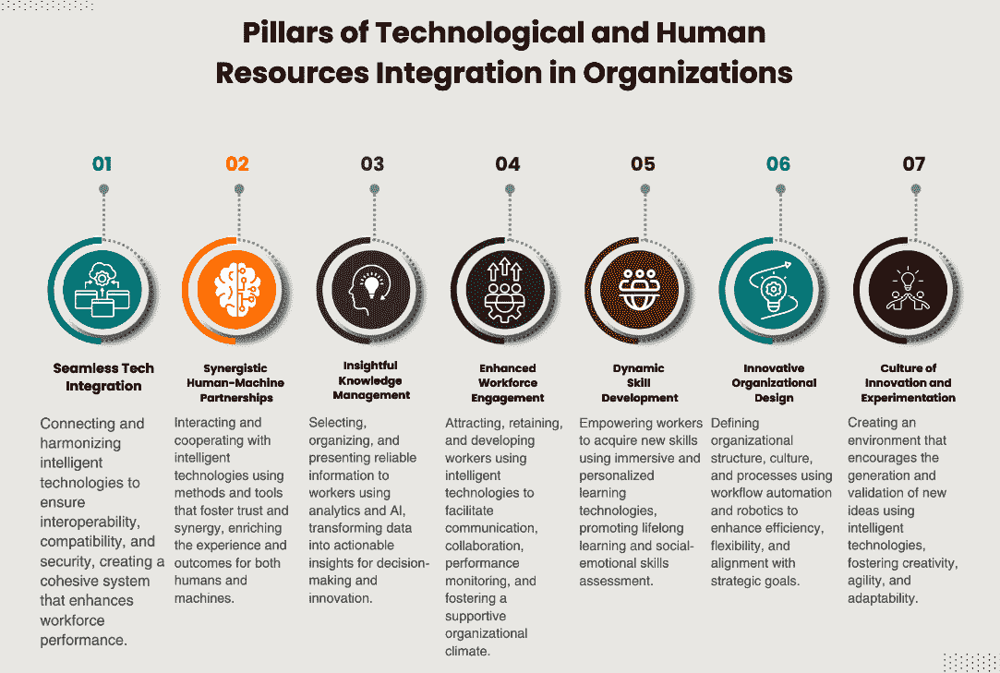
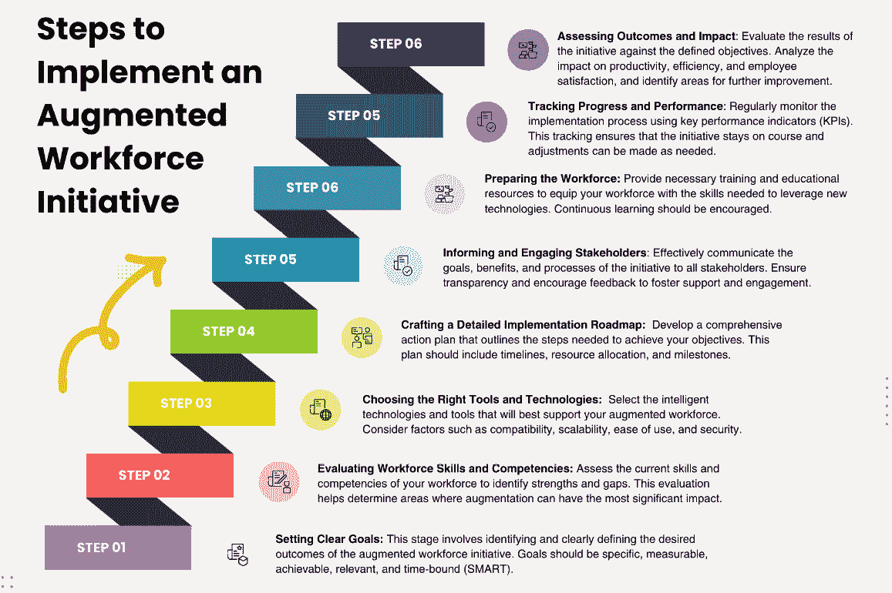

# 第十一章：增强型劳动力——人工智能对网页开发岗位的影响

随着数字化环境的不断发展，网页开发领域的岗位和职责也在不断变化。本章将深入探讨人工智能对网页开发岗位的变革性影响，探索通过建立智能技术、劳动力分析和技能增强的连接性网络来优化人力资源价值的策略。重点是加速并扩展人才建设，在增强型连接劳动力的背景下提升团队效能。

本章我们将涵盖以下主要内容：

+   概念化增强型劳动力

+   应对网页开发岗位中的人工智能革命

+   加速数字技能提升与缩短能力达标时间

+   开始实践——实施的实际步骤

在本章结束时，你将理解增强型劳动力的相关概念，培养适应性思维，以应对快速变化的网页开发岗位市场，并能够实施一项连接性战略，优化智能技术和数据分析在网页开发岗位中的应用。此外，你还将能够识别并适应推动数字技能加速提升与缩短能力达标时间的力量，执行具体步骤启动增强型连接劳动力计划，关注关键结果和劳动力细分。

# 概念化增强型劳动力

技术的快速发展带来了组织运作方式的根本性变化。在我们迈入数字化转型时代时，**增强型劳动力**的概念作为一种关键策略，已经成为组织提升竞争力的重要手段。通过利用智能技术，组织能够增强员工的技能和能力，从而提高效率、生产力和创新力。Gartner 预测，到 2027 年，25%的首席信息官将利用增强型连接劳动力计划，将关键岗位的能力达标时间缩短 50%（详情见[`emt.gartnerweb.com/ngw/globalassets/en/publications/documents/2024-gartner-top-strategic-technology-trends-ebook.pdf?_gl=1*gbpyoj*_ga*NDA3OTY3NTczLjE3MDIwODkwMDQ.*_ga_R1W5CE5FEV*MTcwMjIxNTg5My4zLjEuMTcwMjIxNjQ5MC41NC4wLjA`](https://emt.gartnerweb.com/ngw/globalassets/en/publications/documents/2024-gartner-top-strategic-technology-trends-ebook.pdf?_gl=1*gbpyoj*_ga*NDA3OTY3NTczLjE3MDIwODkwMDQ.*_ga_R1W5CE5FEV*MTcwMjIxNTg5My4zLjEuMTcwMjIxNjQ5MC41NC4wLjA))。

增强型劳动力的概念涉及使用智能技术来开发人类人才，提升工人的技能，使其能够执行更复杂、更具创意和战略性的任务，同时技术接管更为常规、重复性和危险的任务。此外，增强型劳动力的概念结合了数字与物理，创造出混合与集成的工作环境，使得工人能够以自然和直观的方式与机器、数据和信息进行互动。

最后，增强型劳动力的概念强调人类和智能技术以互补和协同的方式共同创造价值，旨在优化对组织、客户和社会的成果和影响。

要理解和应用增强型劳动力的概念，必须考虑在组织内推动技术与人力资源集成的不同聚焦维度，即战略、技术和组织层面的方面。

*图 11.1* 突出了在组织内实现技术和人力资源顺畅集成的主要元素。这些支柱包括无缝的技术集成、人类与机器之间的协同伙伴关系的建立、深刻的知识管理以及提升员工参与度。

图 11.1：组织中技术与人力资源集成的支柱

这七个支柱为那些希望在数字化转型过程中提升运营和文化的组织提供了坚实的基础。*图 11.1* 作为商业领袖的战略视觉指南，帮助他们利用技术提升员工表现并实现战略目标。我们将在这里解释每一个支柱：

+   **无缝技术集成**：技术集成是将构成增强型劳动力的不同智能技术通过标准、协议和接口连接和协调的过程，这些标准确保它们的互操作性、兼容性和安全性。技术集成使得智能技术能够相互通信、同步和互补，创造出一个紧密而高效的系统，提升增强型劳动力的表现和价值。

+   **协同人机伙伴关系**：人机协作是与增强型劳动力中智能技术进行互动和合作的过程，使用有利于人机之间信任、透明度和协同作用的方法、工具和实践。人机协作使得人类与机器能够互相支持、互补和提升，创造出一种合作与互学的关系，丰富增强型劳动力的体验和成果。

+   **深刻的知识管理**：知识管理是通过使用智能技术，如分析、人工智能和**机器学习**（**ML**），选择、组织和呈现相关且可靠的信息给员工的过程。这些技术可以筛选、分析和综合大量数据，将其转化为洞察力和建议，帮助员工做出决策、解决问题和推动创新。知识管理还涉及创建接口和平台，方便信息的访问、共享和更新，以及促进员工与机器之间的协作。

+   **增强的员工参与度**：人力资源管理是吸引、留住、发展和激励员工的过程，利用智能技术，如应用程序、移动设备和可穿戴设备，这些技术可以实现持续的沟通、协作和反馈。这些技术还能够监控和评估员工的表现、生产力和福祉，提供数据和指标来指导认可、奖励和改进措施。人力资源管理还意味着创造一种文化和组织氛围，鼓励员工信任、自治、多样性和包容性，同时帮助他们适应变化和新技术。

+   **动态技能发展**：技能发展是通过使用智能技术帮助员工获得新技能和能力的过程，这些技术提供沉浸式、个性化和有趣的学习体验。这些技术允许模拟和实践真实且复杂的场景，并提供实时的反馈和指导。技能发展分为两个子过程：终身学习和社会与情感技能评估：

    +   **终身学习**：终身学习是促进员工不断更新和进化的子过程，使用智能技术，如增强现实、混合现实和游戏化，这些技术提供有趣、激励和自适应的学习体验。这些技术让员工能够根据自己的需求、偏好和目标，以自主、灵活和个性化的方式学习。终身学习还包括创造一种鼓励员工好奇心、实验和反思的文化和学习环境，以及对其学习成果的认可和欣赏。

    +   **社会和情感技能评估**：社会和情感技能评估是通过使用聊天机器人、虚拟助手、虚拟现实和人工智能等智能技术，测量和提升员工社会和情感技能的子过程，这些技术提供了逼真、沉浸式和富有同理心的互动。这些技术使员工能够练习并获得关于其社会和情感技能的反馈，例如沟通、协作、领导力、谈判和同理心等。社会和情感技能评估还包括创建一种文化和工作环境，鼓励这些技能的发展和应用，并得到领导者和同事的支持与指导。

+   **创新的组织设计**：组织设计是定义组织结构、文化和工作流程的过程，利用工作流、自动化和机器人等智能技术，以提高效率、灵活性和创新性。这些技术使得人类与机器之间的活动和互动得以集成和协调，同时优化资源和成本。组织设计还包括定义员工和领导者的角色、责任和能力，并使其与组织的战略、使命和愿景保持一致。

+   **创新和实验文化**：组织的创新和实验文化意味着创造和维持一个鼓励新思想、新产品和新服务的生成与验证的环境和思维模式，利用集成增强型劳动力作为灵感、信息和反馈的来源。创新和实验文化使人类与机器能够更加富有创造力、敏捷和适应力，创造出具有创新性和颠覆性的解决方案，为增强型劳动力创造附加价值和差异化优势。

增强型劳动力的概念对组织和员工来说既是机遇也是挑战，员工和组织需要为一个日益混合、集成和智能化的未来工作模式做好准备。因此，理解并应用增强型劳动力的概念是必要的，这涉及到战略、技术和组织等各个方面，旨在与智能技术合作，优化人力劳动力的表现和潜力。

增强型劳动力也要求工人和领导者在思维方式和行为上做出改变，他们需要适应、学习、协作，并且相互信任以及与机器建立信任关系，同时重新定义他们的角色、技能和工作流程。因此，构建增强型劳动力是利用智能技术开发人类人才的一种方式，这些技术扩展了他们的能力和可能性，创造出更高效、更具生产力、更有资格且更满意的劳动力。然而，这一转型也为从事网页开发领域的专业人员带来了挑战和机遇，他们需要为人工智能对其职业的影响做好准备。在接下来的部分，我们将探讨如何在网页开发职业中应对人工智能革命，提出战略、趋势和在这个瞬息万变的环境中脱颖而出的技巧。

# 在网页开发工作中应对人工智能革命

在不断发展的网页开发工作领域，人工智能和增强型劳动力的兴起带来了重大变化。作为这一领域的专业人士，培养适应性思维至关重要，这能帮助我们成功应对这场革命。

应对人工智能革命的第一步是理解网页开发工作中的变化。人工智能技术，如机器学习和自然语言处理，已经彻底改变了网站和应用程序的开发方式。在增强型劳动力的帮助下，将人类专长与人工智能能力相结合，以前需要大量时间的任务现在可以自动化，从而让开发人员能够专注于工作中更复杂和富有创意的方面。

要在这个新时代中蓬勃发展，培养适应性思维至关重要。这意味着要花时间学习新的编程语言，探索人工智能框架，并时刻关注行业中涌现的新趋势。通过采取积极主动的学习方式，我们可以保持领先地位，并在不断变化的就业市场中保持相关性。

除了持续学习，灵活性和敏捷性也是应对网页开发工作中人工智能革命的关键特质。随着人工智能技术的引入，网页开发人员的角色和职责正在不断演变。仅仅专注于编码和技术技能已经不再足够。开发人员还必须具备强大的问题解决能力、适应能力以及与人工智能系统合作的意愿。具备灵活性和敏捷性使我们能够迎接新的机会，并适应行业需求的变化。

随着 AI 成为网站开发的一个重要组成部分，人类与机器的协作变得尤为重要。与其将 AI 视为对工作安全的威胁，我们应该将其视为一种增强我们能力的工具。通过利用 AI 系统的优势，比如自动化重复性任务和分析大量数据，我们可以简化工作流程，向客户提供更高效和更有效的解决方案。拥抱这种协作为网站开发领域的创新与增长铺平了道路。

本质上，驾驭 AI 革命在网站开发工作中的应用需要一种适应性思维方式。通过理解行业的变化，拥抱持续学习，保持灵活和敏捷，并与 AI 系统协作，我们可以为成功铺平道路。

# 在网站开发中战略性地实施增强型劳动力

如今，网站开发在企业成功中扮演着至关重要的角色。为了跟上对创新且用户友好的网站日益增长的需求，公司需要优化其员工队伍。现在，我们将探讨为增强型劳动力实施“连接性战略”，这一战略旨在最大化智能技术和数据分析的使用。

为了在网站开发行业保持竞争力，拥抱智能技术至关重要。通过将 AI 和机器学习算法集成到我们的工作流程中，我们可以自动化耗时的任务，提高效率，并增强整体工作质量。利用 AI 驱动的工具，我们可以简化代码生成、错误检测和性能优化等过程。

**数据分析**是一种强大的工具，可以为网站性能和用户行为提供有价值的洞察。通过利用分析工具，我们可以收集定量和定性数据，以做出明智的决策并推动持续改进。通过分析用户行为，我们可以识别痛点，优化用户体验，并最终提高转化率。此外，数据分析还可以帮助我们跟踪开发团队的表现，识别瓶颈，并有效分配资源。

要充分优化智能技术和数据分析的使用，实施**连接性战略**至关重要。该战略涉及促进网站开发中不同利益相关者之间的合作与沟通，包括开发人员、设计师、数据分析师和项目经理。通过拆除部门间的障碍，并鼓励跨学科团队之间的合作，我们可以确保每个人都朝着交付高质量网站的共同目标前进。

以下是实施连接性战略的一些建议：

+   与其他使用智能技术的网页开发人员协作。您可以与其他使用智能技术的开发人员分享经验、挑战、解决方案和想法，从而创建一个学习与创新的网络。

+   跟上智能技术的趋势和进展。您应当了解智能技术的新工具、功能、特性和应用，这些都能进一步提升您的工作效率和附加值。

+   尊重智能技术使用的伦理和法律原则。您应负责任、透明、公平和安全地使用智能技术，尊重参与您工作的人员的权利、隐私和尊严。

为了实施一个优化智能技术和分析在网页开发岗位中使用的连接策略，我们建议采取以下措施：

+   确定可以通过智能技术自动化或支持的任务。例如，您可以使用低代码或无代码工具来创建用户界面，使用虚拟助手回答客户的常见问题，使用云平台托管和管理您的项目，或使用自动化测试工具来确保代码质量。

+   选择最适合您需求的智能技术工具。您应考虑成本、易用性、兼容性、安全性、可靠性和可扩展性等因素。同时，您还应评估智能技术对您的生产力、满意度、动机和身心健康的影响。

+   培训并适应智能技术工具。您必须学会如何有效高效地使用智能技术工具，充分利用其特性和功能。您还应准备好适应工具的变化与更新，以及它们可能提供的反馈和建议。

+   促进协作。鼓励不同团队之间的开放沟通与协作，以分享知识和最佳实践。

+   实施 AI 驱动的工具。将 AI 驱动的工具和平台融入开发过程中，以自动化重复性任务并提高生产力。

+   建立数据驱动的决策机制。通过利用分析工具来指导决策，并持续监测和优化网站性能，实施数据驱动的方式。

+   监控并评估增强型工作团队的表现。您应使用分析工具来衡量和跟踪增强型工作团队的成果，如质量、速度、准确性、创新和客户满意度。您还应使用分析工具来识别改进领域、学习机会和最佳实践。

实施增强型网页开发劳动力的连接性策略对于在数字时代保持竞争力至关重要。通过利用智能技术和分析的力量，公司可以优化网页开发流程，改善用户体验，并推动业务增长。通过遵循描述的逐步实施过程，公司可以确保平稳过渡到更加高效和有效的网页开发工作流程。

更重要的是，提前采纳这一策略的网页开发者将不会被市场变化和挑战所震惊，他们将具备应对未来的能力。他们将拥有比竞争对手更大的竞争优势，能够快速适应新需求和新机会。

在下一章中，我们将探讨加速数字技能发展并缩短网页开发者掌握能力时间的新兴力量。

随着我们继续探索 AI 在网页开发中的变革性影响，理解那些不仅在增强而且加速数字技能获取的动力学至关重要。接下来的章节将深入探讨那些简化网页开发者提升能力路径的新兴力量。让我们一起探索这些力量如何塑造网页开发的未来，并且它们对这个领域的专业人士意味着什么。

# 加速数字技能并缩短能力掌握时间

对于具备 AI 和其他增强技术专长的网页开发者的需求正在上升。这些技术正变得日益重要且不可或缺，推动了该领域中新角色和新专业的出现。此外，网页开发者所需的技能和能力也在不断演变，不仅仅包括技术能力，还包括社交、情感和创造性技能。此外，组织正在转变其文化和价值观，促进创新和实验，将增强技术作为灵感、信息和反馈的来源。

随着这些技术成为网页开发的核心，具备 AI 专业知识的开发者将成为抢手人才，用于创造创新的智能解决方案。通过利用 AI，网页开发者可以构建先进的功能，优化用户体验，并提供个性化内容。能够将 AI 整合到网页开发过程中，将是那些希望在数字时代保持竞争力的组织的关键。

随着网页开发的复杂性不断增加，基于人工智能的平台和服务应运而生，为开发者提供了更高的便捷性、灵活性和质量。这些平台利用人工智能算法来自动化重复性任务、简化工作流程，并促进开发者之间的协作。通过使用基于人工智能的工具和框架，网页开发者可以加快开发进程，更专注于打造独特且以用户为中心的体验。基于人工智能的平台和服务正在彻底改变网页开发者的工作方式，使他们能够以更高效的方式创建复杂的网页应用。

在这个充满变化的环境中，适应能力的技能变得至关重要。网页开发者不仅需要不断更新他们的技能，还要紧跟最新的技术趋势和创新，才能在这些新角色中脱颖而出。适应能力不仅能帮助开发者应对快速的技术变化，还能让他们把握新机遇，迎接竞争激烈的网页开发环境中的挑战。因此，这种快速适应新工具和技术的能力对于在网页开发领域持续成功和保持相关性是不可或缺的。诸如基于人工智能的网页开发、增强现实网页设计以及数据驱动的用户体验/用户界面开发等专业领域正在兴起，以应对对专业知识的需求。网页开发者需要持续更新技能，并紧跟最新的趋势，以在这些新角色中取得成功。

除了已经强调的关键适应能力外，其他技能如协作、沟通和解决问题的能力，正变得对网页开发者来说不可或缺。这些技能是有效在跨学科团队中工作和管理复杂项目的基础。此外，创造力和对以人为本设计原则的深刻理解，对于创造吸引人且直观的网页体验至关重要。

随着数字化环境的发展，网页开发者需要灵活应对日益增加的数字技能需求和缩短的能力掌握时间。人工智能和增强技术的整合为网页开发者带来了挑战与机遇。通过在这些领域中获得专业知识并发展多元化的技能，网页开发者能够将自己置于创新的前沿，推动网页开发的未来。拥抱变化的环境，并不断更新技能，将是保持相关性和竞争力的关键，尤其是在这个充满活力的网页开发领域中。

在接下来的部分，我们将提供具体步骤，不仅帮助你适应这些变化，还能让你在其中蓬勃发展。让我们深入探讨一些可以赋能你的可操作性策略，让你在这个充满变化的领域中持续发展，保持竞争力。

# 入门——实施的实际步骤

你知道你的工作涉及创建和维护网站及 Web 应用程序，使用不同的语言、框架和工具。但你也知道，由于新技术、趋势和市场需求，你的工作不断在发展。

为了保持最新并保持竞争力，你需要发展和提升你的数字技能，即使用数字工具有效的知识、态度和行为。此外，你还需要减少能力时间，即获取并展示你的职业和个人背景所需的数字技能的时间。

但如何在不妥协学习和表现质量的情况下，快速高效地做到这一点呢？如何启动一个旨在提高生产力、质量、创新和工作满意度的连接和增强员工计划？*图 11.2* 直观地展示了有效整合智能技术到员工队伍中的关键阶段。这份逐步指南旨在帮助组织系统地增强员工能力，确保顺利过渡到增强型员工模型。通过遵循这些步骤，组织能够实现生产力、效率和创新的提升。

图 11.2：实施增强型员工计划的步骤

通过可视化实施过程，*图 11.2* 为希望通过智能技术优化员工队伍的组织提供了一份实用的路线图。在这里，我们提供了一份关于如何开始这一变革性过程的全面指南：

1.  **明确你的目标**：实施增强型连接员工计划的第一步是明确你的目标。确定你希望实现的预期结果，无论是提升协作、优化效率，还是增强员工满意度。通过设定这些目标，你可以有效地对齐你的努力，并衡量计划的成功。

1.  **评估当前员工能力**：在开始实施之前，评估当前员工的能力至关重要。评估员工的技能和能力，识别需要解决的差距，并确定增强连接性能够带来最大影响的领域。这项评估将帮助你根据员工的独特需求量身定制你的计划。

1.  **选择技术和工具**：选择将用于连接和增强员工队伍的技术和工具，考虑到资源的可用性、可访问性、兼容性和安全性。

1.  **制定路线图**：在明确了目标并了解了当前的能力后，接下来是制定实施的路线图。将你的计划分解为可管理的阶段，设定现实的时间表和里程碑。考虑所需资源、可能面临的挑战，以及确保实施过程顺利成功的必要支持。

1.  **沟通与教育**：沟通与教育是获取支持和激发热情的关键，尤其对于增强型连接劳动力计划。清晰地向所有利益相关者（包括员工、经理和高层）传达这些计划的好处。提供培训和教育资源，确保每个人都具备所需的知识和技能，能够理解并利用增强型连接。

1.  **监控与评估**：一旦你的计划开始实施，定期监控和评估其进展至关重要。制定与目标一致的**关键绩效指标**（**KPIs**），并持续跟踪这些指标。征求员工和利益相关者的反馈，以发现改进的领域，并作出必要的调整。这个迭代过程确保了你的计划始终有效，并能够适应不断变化的需求。

通过遵循这些实际步骤，你可以成功实施增强型连接劳动力计划。记得定义目标、评估现有能力、制定路线图、沟通、教育，并持续监控和评估你的计划。采用战略性和以人为本的方法，你可以释放增强型连接劳动力的全部潜力，推动创新、合作与成功。

# 总结

在本章中，你了解了增强型劳动力的概念，这是一种通过智能技术、劳动力分析和技能增强来优化人类劳动者价值的策略。你还学会了如何应对网页开发职位中的 AI 革命，这正在改变网站和 Web 应用程序的创建与维护方式。

你已经学习了如何实施连接性策略，这是一套将人力、流程和技术整合与对齐的实践和工具，适用于网页开发。你学会了如何识别并适应新兴力量，以及加速数字技能和缩短熟练时间的驱动因素，这对于在数字时代保持更新和竞争力至关重要。你学会了如何启动增强型连接劳动力计划，按照实际步骤规划、执行和评估你的计划，专注于结果和劳动力的各个细分领域。

在下一章，我们将探讨机器用户如何重塑数字化格局，使许多人类可读的数字门面变得过时。
