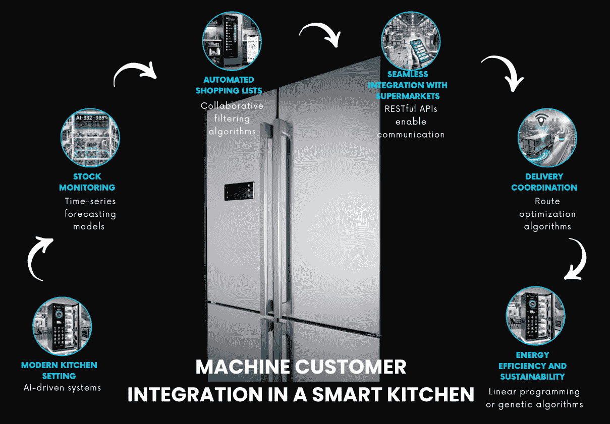

# 第十二章：揭示机器用户 – 导航人类与机器的交汇点

本章将探讨机器用户这一现象，它是代表人类或其他机器与数字界面互动的软件代理。我们将了解它们如何改变数字领域，令许多为人类设计的在线商店变得过时。我们还将学习如何调整网页开发范式，以满足这些新客户的需求和期望。

本章将涵盖以下主要内容：

+   解码机器顾客 – 理解消费主义未来的市场机会与情景

+   案例研究 – 自动驾驶汽车的加油站服务

+   对购买和商业的影响

+   为未来的机器顾客做准备

到本章结束时，你将掌握理解和分析机器用户的技能，辨别他们的偏好和行为，创造探索市场机会和影响的战略情景，获得设计专门面向机器用户的数据源和 API 平台的专业知识，评估物联网产品和机器用户带来的市场机会，并提升战略思维的能力，以便在机器用户时代使你的业务蓬勃发展。

# 解码机器顾客 – 理解消费主义的未来

在这一部分，我们将介绍**机器顾客**（**MC**）的概念，并探讨其与人类用户的区别。随着技术的进步，企业如今拥有了创造自己顾客的能力，这是 Gartner 在其文章《*Gartner 2024 年十大战略技术趋势*》中指出的趋势（你可以在这里找到该文章链接：[`www.gartner.com/en/articles/gartner-top-10-strategic-technology-trends-for-2024`](https://www.gartner.com/en/articles/gartner-top-10-strategic-technology-trends-for-2024)）。MC 的到来将彻底改变数字商业领域，因此企业必须理解并适应这一新现象。

企业可以利用人工智能和机器学习的力量，通过各种先进技术和工具开发和管理 MCs。**自然语言处理**（**NLP**）使得虚拟助手的创建成为可能，这些助手能够理解并进行类似人类的对话，促进有效的客户互动。强化学习算法在通过从过去的互动中学习并不断优化决策过程中，发挥了至关重要的作用。用于预测分析的机器学习模型能够预测客户需求和偏好，从而提供个性化的推荐。TensorFlow、PyTorch 和 scikit-learn 等基本工具提供了构建、训练和部署这些复杂模型所需的框架。此外，人工智能驱动的聊天机器人和虚拟助手可以通过提供实时、定制化的响应，显著增强客户支持，确保顺畅高效的用户体验。

MC 代表了一类新型消费者，他们不受人类局限的束缚。与人类消费者不同，MCs 基于算法、客观数据、逻辑和模式理性运作。它们没有情感、个人经验和主观解读。这一根本差异带来了公司与客户互动方式的范式转变，并突显了企业需要发展理解和分析机器用户的技能，洞察其偏好和行为。

虽然人类用户受到情感、经验和主观性的影响，MCs 仅依赖逻辑和模式。这一决策过程的差异对那些希望同时迎合这两类消费者的企业具有深远的意义。公司必须调整战略，以适应这些以数据驱动、客观为基础的 MCs 的独特特征。

MCs 擅长基于可衡量和客观的数据进行*信息处理*。它们能够在极短的时间内分析大量信息，而人类用户则需要更多的时间。相比之下，人类用户在处理信息时会考虑细微差别、主观性和个人解读。

MCs 的兴起给企业带来了诸多挑战。适应这一新兴消费群体需要公司发展新的技能，包括理解和分析机器用户。此外，企业必须架构必要的数据源和 API 平台，以服务 MCs，确保其数字化门面在这一转型过程中保持相关性。Gartner 预测，到 2028 年，MCs 将使 20% 的人类可读数字门面过时。

随着我们深入探讨人工智能和机器学习的实际应用，越来越明显的是，这些技术如何能够转变日常家用电器。高级算法和数据结构的集成不仅提高了便利性，还促进了可持续性和效率，在日常任务管理中发挥了重要作用。为了更好地说明这一点，让我们探讨一个具体的使用案例——智能冰箱如何与本地超市无缝连接，展示人工智能驱动的创新在现实环境中的潜力。

## 使用案例 – 与本地超市连接的智能冰箱

在繁忙的城市环境中，配备人工智能和机器学习功能的智能冰箱正在革新家庭管理食品的方式。这些先进的家电通过传感器和算法来监控食物库存、跟踪过期日期，甚至根据现有食材推荐食谱。

在像旧金山这样的城市中，一个家庭使用与本地超市网络连接的智能冰箱。该冰箱配备了人工智能和机器学习功能，监控牛奶和鸡蛋的存货，当存货低时会提醒用户。在一个忙碌的工作日，冰箱检测到牛奶即将用完，自动向附近的超市下单。超市的人工智能系统确认订单、准备配送，几小时内商品就送达了家庭的门口。这种由人工智能和机器学习驱动的无缝集成，节省了时间，减少了浪费，并确保家庭始终有新鲜的食品供应。

*图 12.1* 展示了将 MC 集成到智能厨房中的相关概念。它演示了人工智能和先进算法如何转变家庭管理，从库存监控到高效的产品配送。

图 12.1：智能厨房中的 MC 集成

智能冰箱与本地超市连接的实现涉及几个关键技术组件：

+   **库存监控与通知**：智能冰箱利用先进的 AI 驱动传感器监控食物的数量和新鲜度，使用机器学习算法，如时间序列预测和回归模型，分析使用模式并预测物品何时会耗尽。时间序列预测模型，如**自回归积分滑动平均**（**ARIMA**）和**长短期记忆**（**LSTM**）网络，分析历史消费数据以预测未来库存水平，而回归模型，包括线性回归和更复杂的技术如随机森林回归器，根据使用模式预测物品的消耗速率。数据库存储历史使用数据，数据数组或张量表示当前库存水平，用于实时分析。这些模型通过历史消费数据进行训练，以学习随时间变化的使用模式，验证通过使用独立数据集进行，以确保准确预测库存消耗。

+   **自动化购物清单**：基于消费模式和当前库存水平，机器学习算法生成一个个性化的自动化购物清单，根据家庭偏好和饮食需求进行调整，用户也可以手动调整。协同过滤算法，如矩阵分解或**K 近邻**（**KNN**），根据相似用户的偏好和行为推荐商品，而分类算法如决策树或逻辑回归根据历史消费数据将商品分类为必需品或可选品。数据库中维护的偏好矩阵和用户档案存储并更新购物清单。这些算法通过过去购买和用户偏好的数据集进行训练，通过将算法推荐与实际用户偏好和调整进行对比来进行验证。

+   **与超市的无缝集成**：智能冰箱通过集成应用程序与本地超市连接，在需要时补充商品，AI 系统自动向首选超市下订单。房主可以选择在订单完成之前批准订单，或让系统自动处理。RESTful API 促进冰箱与超市系统之间的通信，而 AI 算法根据价格、距离和过去的用户偏好等因素推荐最佳超市。JSON 对象和 API 端点处理冰箱与超市系统之间的数据交换。机器学习模型通过交易数据进行训练，以优化超市选择和订单下单，API 调用经过测试和验证，以确保数据传输的准确性和安全性。

+   **配送协调**：一旦下单，超市将使用其 AI 系统准备食品进行配送。业主可以实时跟踪配送状态，并接收预计到达时间的通知。配送系统使用路线优化算法，如 Dijkstra 算法或 A*搜索算法，来优化配送路线，而使用流处理框架处理的 GPS 数据提供实时更新。图数据结构表示配送路线，实时数据流通过事件驱动架构处理。路线优化模型使用历史配送数据进行训练，实时跟踪系统通过实际数据测试验证，以确保准确性和可靠性。

+   **能源效率与可持续性**：通过优化食品购买和减少食物浪费，具备人工智能和机器学习技术的智能冰箱有助于实现更可持续的生活，确保只购买和及时消费必要的物品。这促进了更好的资源管理。诸如线性规划或遗传算法等优化算法可以优化购买计划和数量，减少浪费，而人工智能模型则预测购买对环境的影响，并建议替代方案以减少碳足迹。优化问题使用矩阵表示，可持续性指标存储在数据库中。优化模型通过食物消费和浪费模式的数据进行训练，可持续性模型通过实际数据验证，以确保准确的预测和减少浪费的推荐。

理解 MC 和人类用户之间的区别，对于公司在数字时代的成功至关重要。然而，为了利用 MC 所提供的市场机会，还需要创建战略场景，探索这种新型消费者可能带来的需求、挑战和影响。这就是我们将在下一部分看到的内容。

# 市场机会与场景

MC 的出现是一个突破性的趋势，预计将彻底改变市场。随着公司获得创造自己客户的能力，其潜在影响巨大。根据 Gartner 的预测，到 2028 年，将有 150 亿个连网产品表现得像客户一样，届时这些[机器将在 2030 年左右影响万亿美元的购买](https://www.gartner.com/en/articles/gartner-top-10-strategic-technology-trends-for-2024)。

为了支持 150 亿个连网产品的广泛连接，必须有一个强大且可扩展的技术基础设施。这个基础设施依赖于云计算、边缘计算和物联网平台，它们在管理如此庞大的网络的数据和通信需求方面起着至关重要的作用。

从传统的锁定客户到自由客户，最终到创造性客户的过渡是由先进的机器学习模型和人工智能技术支撑的。过渡的每个阶段都利用特定的人工智能技术来提升客户体验、个性化和互动。

根据购买决策的自主性和复杂性，MCs 的演变分为三个阶段（[`www.gartner.com/en/articles/machine-customers-will-decide-who-gets-their-trillion-dollar-business-is-it-you`](https://www.gartner.com/en/articles/machine-customers-will-decide-who-gets-their-trillion-dollar-business-is-it-you)）。

MCs 的兴起代表了企业在面对市场机会时的一种重要转变。正如 Gartner 文章中所详细描述的，MCs 的演变分为三个不同的阶段，这些阶段基于其在做出购买决策时的自主性和复杂性：

1.  **绑定客户**：这些机器作为与其所有者并肩的共同客户，执行有限的功能并在预设规则下操作。

1.  **自由客户**：这一阶段的机器可以自主选择不同的供应商和服务，并根据成本效益分析做出决策。

1.  **创造性客户**：这是最先进的类别，这些机器能够自主创造新的需求和解决方案，利用学习算法和人工智能。

对于绑定客户，技术基础设施在很大程度上依赖于云计算和集中式数据存储。像 AWS、Google Cloud 和 Azure 这样的云平台提供了必要的计算能力和存储功能，以处理大规模数据集并执行复杂的计算。推荐系统等机器学习模型在这一阶段至关重要。协同过滤和基于内容的过滤通过矩阵分解和最近邻等算法实现，并由基于云的机器学习服务支持。监督学习模型用于预测客户行为和客户分段，并利用云资源进行训练和部署，从而确保可扩展性和可用性。

随着客户发展为自由客户，基础设施必须支持更动态和实时的互动。这是通过云计算和边缘计算的结合来实现的。云平台继续处理繁重的计算任务，而边缘设备则执行本地计算以减少延迟并提高响应速度。NLP 支持的聊天机器人和虚拟助手，要求具备实时处理能力。情感分析工具在云和边缘环境中运行，以快速处理客户反馈。基于强化学习的模型根据持续的互动调整推荐，利用边缘计算进行实时决策，而云则支持模型训练和更新。多臂赌博机算法通过在边缘运行实验平衡探索和开发，云端则汇总结果以获得更广泛的洞察。无监督学习模型，如聚类和异常检测，采用混合方式处理本地和集中数据，确保及时和相关的洞察。

在创造性客户阶段，基础设施必须促进高水平的互动和内容生成。这个阶段严重依赖混合云和边缘计算架构。生成模型，如**生成对抗网络**（**GANs**）和**变分自编码器**（**VAEs**），需要云环境中由 GPU 提供的大量计算能力。这些模型生成新的内容并个性化体验，必须依赖可扩展的云基础设施进行训练和部署。先进的自然语言处理（NLP）技术，如使用 GPT-3 等模型进行文本生成，运行在云平台上以处理强大的计算需求。语义搜索能力提高了用户查询的理解，利用优化过的分布式数据库和搜索引擎，适应云和边缘环境。支持共同创作和互动反馈的人机协作工具，依赖于边缘计算实现实时数据处理，同时云端聚合和优化 AI 模型。深度学习模型，包括用于图像和视频内容创作的**卷积神经网络**（**CNNs**）和用于序列生成的**循环神经网络**（**RNNs**），借助基于云的 AI 服务的计算能力，边缘设备为互动应用提供即时处理能力。

这些技术改变了客户体验，将用户从被动接收者转变为数字商务领域的积极参与者。为了利用这一新兴的 MC 趋势，企业需要主动识别并利用 MC 所带来的市场*机会*。以下是一些需要考虑的关键机会：

+   **定制化**：根据机器驱动的偏好定制产品和服务。随着机器变得更加复杂，企业可以创建符合其特定需求和偏好的个性化体验。

    推荐系统和个性化算法在实现这种定制化方面发挥着至关重要的作用。这些系统分析大量数据，以理解用户行为和偏好，从而帮助企业提供量身定制的推荐和体验。例如，Netflix 等流媒体服务使用协同过滤算法，根据用户的观看历史和偏好推荐电影和节目。类似地，Amazon 等电商平台利用基于内容的过滤算法，推荐与用户过去购买和浏览行为匹配的产品。这些系统的数据管道包括收集用户数据，使用机器学习模型对其进行处理和分析，并根据新数据不断更新推荐内容。矩阵分解、深度学习和自然语言处理等技术通常用于提高推荐的准确性和相关性。通过利用这些先进的算法，企业可以为其机器和人类客户创造高度个性化和富有吸引力的体验。

+   **算法营销**：利用数据驱动的洞察来制定有针对性且有效的营销策略。通过分析机器生成的数据，企业可以获得关于客户行为和偏好的有价值的洞察，从而能够传递高度相关和个性化的营销信息。

+   **预测分析**：利用机器生成的数据来预测市场趋势。通过分析机器数据中的模式和趋势，企业可以对未来的市场趋势做出明智的预测，帮助它们保持竞争优势。

+   **AI 集成**：为机器交互提供 AI 解决方案的企业机会。随着机器在客户交互中的普及，企业可以开发 AI 解决方案，提升客户体验并优化性能。

通过清晰地了解 MC 如何革新市场动态及其带来的战略机会，我们可以深入探讨企业在成功将这些技术整合到运营中的实践考虑事项。

## 考虑事项

MC 的崛起也带来了企业需要考虑的各种场景。这些场景包括以下内容：

+   **提高效率**：机器可以加速并提高决策的精确度，从而提高各行业的效率。企业可以利用机器驱动的洞察来简化操作，做出更加明智的决策。

    为了将机器驱动的洞察整合到商业运营中，公司使用先进的数据分析平台和实时处理框架。这些技术能够高效处理和分析大量数据，提供可操作的洞察。像 Apache Hadoop 和 Spark 这样的平台支持批处理和实时分析，从而实现及时的数据处理和决策制定。实时处理框架，如 Apache Kafka 和 Flink，促进了持续的数据收集和分析，使得企业能够即时应对变化和趋势。通过整合这些技术，企业能够提升运营效率和战略决策能力。

+   **新的收入来源**：通过机器驱动的交易探索盈利机会。随着 MC（机器客户）的普及，企业可以开发创新的商业模式和收入来源，利用这一新兴市场。

+   **人机互动中的挑战**：适应机器主导某些市场领域的情境。企业需要调整其战略和流程，以确保人类和机器之间的有效互动与合作。

+   **伦理考量**：解决与数据隐私和算法偏见相关的问题。随着机器在客户互动中的日益深入，企业必须优先考虑伦理实践，确保客户数据的保护并尽量减少算法偏见。

将 MC 融入商业模型带来了显著的变革和考量。这些变化包括提高运营效率、创造创新的收入来源、解决人机互动中的独特挑战以及伦理问题。企业必须战略性地应对这些情境，充分发挥机器驱动交易和互动的潜力，同时确保在技术进步和伦理责任之间保持平衡。

## 行业特定的机会

不同的行业将受到 MC 崛起的不同影响。以下是一些需要考虑的行业特定机会：

+   **金融**：为 MC 提供自动化金融咨询服务。通过利用 AI 和机器学习，企业能够为 MC 提供个性化的财务建议和投资策略。

    在自动化金融咨询服务中，机器学习模型，如线性回归、决策树和神经网络，被广泛应用于预测分析和风险评估。线性回归通过历史数据预测金融趋势，而决策树则通过评估不同情境来帮助投资决策。神经网络处理庞大的数据，以提供个性化的财务建议，并识别复杂的市场模式。

    预测分析利用这些模型来预测市场趋势、股价和投资回报。为了进行风险评估，逻辑回归和支持向量机通过分析市场波动、经济指标和个人投资行为，评估金融风险和潜在损失。

+   **零售**：基于机器偏好的定制化购物体验。通过分析机器数据，企业可以创造个性化的购物体验，符合 MC 的偏好和需求。

+   **医疗保健**：AI 驱动的诊断和个性化治疗计划。机器可以分析大量健康数据，帮助企业提供准确的诊断和个性化治疗计划。

+   **技术**：为机器互动开发先进的 AI 解决方案。随着机器的普及，专注于 AI 解决方案的企业可以开发先进技术，优化机器互动并提升整体客户体验。

这些发展有望重新定义企业在各个行业中的运营方式，提供更加精确和高效的服务，满足 MC 的能力和需求。

## 在竞争激烈的市场中蓬勃发展

在这一快速发展的环境中，企业需要通过采用创新策略并与 AI 驱动企业合作，保持竞争力。MC 的竞争格局包括：

+   **创新产品**：专门为机器驱动市场设计的前沿解决方案的公司。这些公司处于创新的前沿，正在塑造 MC 互动的未来。

+   **适应策略**：那些正在调整战略以迎接 MC 崛起的成熟企业。这些企业正在积极地将机器融入运营，并利用这一趋势所带来的机会。

+   **合作与伙伴关系**：传统企业与 AI 驱动企业之间的合作机会。通过与 AI 驱动公司合作，传统企业能够利用其专业知识和资源来增强 MC 产品。

这些联盟使传统企业能够借助先进的 AI 专业知识和资源，增强其产品并在 MC 市场中占据有利地位。

## 理解法规和趋势

随着 MC 的普及，企业需要在监管环境中应对挑战，以确保合规性和道德实践。监管环境中的关键考虑因素包括：

+   **数据保护**：遵守确保机器生成数据隐私和安全的相关法规。企业必须采取强有力的数据保护措施，以保障客户信息并维持信任。

    为确保 AI 系统中的数据保护，企业采用加密、访问控制和遵守包括 GDPR 和 CCPA 在内的法规等策略。像 AES 这样的加密技术可以保护传输中的数据和静态数据，使其在没有适当密钥的情况下无法读取。访问控制机制，如**基于角色的访问控制**（**RBAC**）和**多因素认证**（**MFA**），限制数据访问仅限于授权用户。

    合规框架要求透明的数据处理、用户同意以及数据访问、修改或删除的权利。定期审计和**数据保护影响评估**（**DPIAs**）确保持续合规。监控包括使用先进的安全工具，如 SIEM 系统，进行持续的网络活动监控和自动威胁警报，确保迅速的事件响应。这些措施保护机器生成的数据，确保合规性并维护客户信任，这是 AI 系统成功的关键。

+   **道德 AI 实践**：在 MC 场景中道德使用 AI 的行业标准。企业在开发和部署 AI 解决方案时，必须优先考虑道德问题，以确保公平、透明和问责。

尽管道德在保持我们已有机会中起着重要作用，但趋势帮助我们创造新的机会。MC 的未来充满了几个令人兴奋的趋势，企业应当预见到这些趋势。紧跟趋势对于保持相关性至关重要。

这些*趋势*包括以下内容：

+   **AI 应用的扩展**：预见 AI 在各种市场领域的增长。预计 AI 将在各行各业中发挥更大作用，推动创新并转变客户体验。

+   **消费者接受度**：追踪消费者采纳机器驱动服务的速度。随着消费者越来越习惯与机器互动，企业需要调整策略以符合不断变化的消费者偏好。

+   **新行业的兴起**：识别可能因 MC 的普及而发展的行业。随着 MC 的普及，新的行业和商业模式可能会出现，为创新型企业提供机会。

MC 的兴起为企业提供了显著的市场机会和独特的场景。通过拥抱定制化、算法营销、预测分析和 AI 整合，企业可以将自己定位于这一新兴趋势的前沿。此外，企业还需要在与人类互动的挑战中找到应对方法，并解决道德问题，以确保在这个新时代的负责任和可持续发展。通过利用行业特定的机会并保持在不断变化的市场中的竞争力，企业可以在 MC 时代蓬勃发展。

# 案例研究 – 自主驾驶汽车的加油站服务

AI 正在改变各个行业和领域，为企业和客户创造新的机会和挑战。AI 的一个新兴应用是将 AI 解决方案与 MCs 集成，即能够代表人类所有者或用户自主购买商品或服务的设备或系统。这种类型的 AI 集成需要仔细考虑设计和实施方面，以及 AI 驱动交易的伦理和社会影响。

这使得在当今商业环境中，设计系统和架构以无缝整合 AI 与 MCs 的互动变得至关重要。它涉及创建一个框架，使企业能够有效利用 AI 能力，以满足其机器驱动客户群体的需求和期望。

本节将介绍一个关于为自动驾驶汽车加油站服务架构设计 AI 集成的案例研究。我们将使用**构建您的 AI**（**AYAI**）**画布**作为框架来指导我们的分析和讨论。AYAI 画布提供了一个全面的概览，涵盖了设计和实施 AI 解决方案的关键组件和考虑因素。它将各种方面划分为几个核心类别：

+   **需求**：目标受众包括自动驾驶汽车的车主和运营商。主要目标是自动化加油服务，减少等待时间，优化燃料分配。需要解决的问题是确保自动驾驶汽车的高效及时加油，处理预测分析和优化挑战。这个问题涉及处理来自各种传感器和历史记录的大量数据，以提供实时解决方案。

+   **运营管理**：可扩展性至关重要，因为系统需要处理越来越多的自动驾驶汽车和加油站。通过使用基于云的平台（如 AWS 或 Azure）进行数据处理和存储，以及边缘计算设备进行加油站的实时决策，可以实现计算效率。维护和升级涉及定期更新机器学习模型和数据处理管道，利用版本控制系统。测试和评估需要通过持续监控模型性能来进行，使用的指标包括准确性、**平均绝对误差**（**MAE**）和吞吐量。安全性和隐私性通过加密（例如 AES）、访问控制机制（例如 RBAC）以及遵守 GDPR 和 CCPA 等法规来维护。伦理考虑包括确保数据透明度和用户同意数据收集。

+   **基本组成部分**：该模型包括用于预测燃料需求的回归模型、用于优化加油站布局的聚类算法，以及用于自动驾驶汽车路线规划的强化学习。该平台涉及云服务以进行可扩展的数据处理和存储，并使用边缘计算设备进行实时分析。工具和框架包括用于数据处理的 Apache Spark、用于模型训练的 TensorFlow、用于容器化的 Docker 以及用于编排的 Kubernetes。

+   **数据流**：输入接口包括车辆传感器、加油站传感器和用于数据收集的 API。数据源包括实时传感器数据、历史加油模式和交易记录。数据收集方法包括物联网设备和 API，而数据准备包括清洗、标准化和转换。数据存储解决方案包括基于云的数据库，如 PostgreSQL，以及 MongoDB 等 NoSQL 选项。数据传输机制包括实时仪表板用于监控，以及通过 API 向自动驾驶汽车提供加油指令。

+   **架构设计**：架构包括用于数据收集的传感器、用于可扩展处理和存储的云基础设施，以及用于实时分析的边缘计算设备。典型用例包括预测燃料需求以避免短缺、优化加油站布局以减少等待时间以及将车辆引导至最近的可用站点。学习和改进机制包括使用更新数据进行持续的模型训练、通过实时数据的反馈回路来改进预测，以及定期的性能评估。

AYAI 画布，如在*第五章*中展示的，是一个全面的指南，确保对 AI 解决方案需求的深入理解，并促进开发过程中各利益相关者之间的有效沟通。

在接下来的部分，我们将详细探讨这些类别。

## 需求

AYAI 画布的第一个类别是需求，它定义了 AI 解决方案的范围和目标。在我们的案例研究中，需求如下：

+   **目标受众**：AI 解决方案的目标用户或利益相关者包括加油站业主、自动驾驶汽车的车主或用户以及汽车制造商或服务提供商。加油站业主希望为自动驾驶汽车提供便捷高效的服务，从而增加客户群和收入。自动驾驶汽车的车主或用户希望确保他们的汽车在需要时得到加油，而无需手动干预或担心油价和油品质量。汽车制造商或服务提供商希望提升汽车的功能性和性能，为客户提供无缝且令人满意的体验。

+   **解决目标**：AI 解决方案旨在实现的具体目标是使自动驾驶汽车能够自动检测加油需求，定位最近且最合适的加油站，协商最优的价格和支付方式，并安全顺利地完成加油过程。AI 解决方案还应向利益相关者提供反馈和报告，使他们能够监控和评估服务质量和客户满意度。

+   **待解决的问题**：AI 解决方案将解决的问题是缺乏一个标准化且可靠的自动驾驶汽车加油服务，这可能导致利益相关者的不便、低效或安全风险。目前的解决方案依赖人工干预、手动输入或预定义规则，这些方法可能不具备最优性或无法适应现实世界中的动态复杂场景。

+   **问题类型**：该问题可以从多个角度来考虑：

    +   它可以被归类为多目标优化问题，AI 解决方案需要平衡多个可能相互冲突的标准，如成本、时间、距离、质量、安全性和偏好。

    +   该问题还可以视为一个多智能体问题，AI 解决方案需要与多个潜在竞争的智能体进行交互与协调，如其他自动驾驶汽车、加油站或人类驾驶员。

    +   该问题还可以看作是一个强化学习问题，AI 解决方案需要从自身的行动和结果中学习，并从其他智能体的反馈和行为中获取信息。

通过对我们 AI 解决方案需求的全面理解，我们已经定义了目标受众、解决目标、待解决的问题以及问题的性质。这些基础知识至关重要，因为它为 AI 解决方案的有效开发和部署奠定了基础，确保它能满足所有相关方的需求和期望。现在，让我们探讨 AI 解决方案的下一个关键阶段：操作管理。

## 操作管理

AYAI 画布的第二个类别是操作管理，用于评估 AI 解决方案的可行性和可持续性。在我们的案例研究中，操作管理方面如下：

+   **可扩展性**：

    +   AI 解决方案应能够应对不断增加的工作负载和需求，随着自动驾驶汽车和加油站数量的增长。

    +   AI 解决方案还应能够适应不同的环境和条件，如交通、天气或法规。

    +   AI 解决方案还应使用可扩展和分布式架构，如云计算、边缘计算或点对点网络，以确保高可用性、可靠性和性能。

+   **计算效率**：

    +   AI 解决方案应能够及时且准确地处理大量复杂数据，并执行复杂且动态的计算。

    +   AI 解决方案还应能够优化计算资源的使用，如内存、带宽或能源，以减少成本和环境影响。

    +   AI 解决方案应使用高效且强大的算法，如深度学习、进化算法或群体智能，以实现高准确性、速度和灵活性。

+   **维护** **和升级**：

    +   AI 解决方案应能够随着利益相关者的需求和期望变化，维持并升级其功能和性能。

    +   AI 解决方案还应能够检测并修复错误、漏洞或异常，并防止或从故障、攻击或灾难中恢复。

    +   AI 解决方案应使用自动化和持续的流程，如 DevOps、测试或监控，以确保高质量、安全性和韧性。

+   **测试** **和评估**：

    +   AI 解决方案应能够使用多种方法和指标测试和评估其功能性和性能，以及利益相关者的满意度和信任度。

    +   AI 解决方案还应能够将其结果和成果，以及成本和效益，与其他替代方案或竞争对手进行比较和基准测试。

    +   AI 解决方案应使用严谨和透明的方法，如实验、模拟或调查，以确保高有效性、可靠性和问责制。

+   **安全性** **和隐私**：

    +   AI 解决方案应能够保护利益相关者的数据和交易，以及 AI 系统的完整性和机密性，免受未经授权或恶意的访问、使用或修改。

    +   AI 解决方案还应能够遵守有关数据和交易的收集、存储和处理的法律和伦理标准及法规，以及利益相关者的偏好和同意。

    +   AI 解决方案应使用先进且安全的技术，如加密、认证或区块链，以确保高度的隐私、信任和合规性。

+   **伦理考量**：

    +   AI 解决方案应能够将伦理考量融入其设计和实施过程中，以及其行为和结果中，尊重利益相关者和社会的价值观与原则。

    +   AI 解决方案还应能够向利益相关者和监管者解释和辩护其决策和行为，以及其中的风险和不确定性，确保高度的透明度、公正性和问责制。

    +   AI 解决方案应使用伦理和以人为本的方法，如价值敏感设计、伦理框架或可解释的 AI，以确保高度的责任感、道德性和可接受性。

在全面审视我们人工智能解决方案的运营管理方面后，我们现在可以确保它满足可扩展性、计算效率、维护、测试、安全性、隐私保护和伦理考量等方面的需求。这些关键元素构成了一个有效、可持续且值得信赖的人工智能系统的骨干。接下来，让我们探讨那些关键组件，它们将帮助我们实现这些运营目标，并交付一个强大且可靠的人工智能解决方案。

## 关键组件

AYAI 画布的第三个类别是关键组件，指定了人工智能解决方案的技术元素和选择。在我们的案例研究中，关键组件如下：

+   **模型**：人工智能解决方案中使用的模型或算法是一个混合模型，结合了多种技术和范式，如深度神经网络、遗传算法和多智能体系统。该混合模型能够利用每种技术和范式的优势，并克服其局限性，从而实现高性能和适应性。它还能够实现多个人工智能模型或代理的集成与协调，达到高功能性和多样性。

+   **平台**：人工智能模型运行的基础设施是一个混合平台，结合了多种架构和技术，如云计算、边缘计算和点对点网络。该混合平台能够提供高可用性、可靠性和可扩展性，同时具有低延迟、成本和能耗。它还能够实现多个人工智能模型或代理的分布和协作，从而提高效率和稳健性。

+   **工具**：开发、训练和部署人工智能解决方案所需的工具是一个混合工具集，结合了多个框架和库，如 TensorFlow、PyTorch 和 OpenAI。这个混合工具集能够提供高功能性、灵活性和兼容性，同时具有较低的复杂性、时间和精力消耗。它们还可以支持多个人工智能模型或代理的使用和重用，从而实现高生产力和创新。

+   **框架**：与解决方案需求相匹配的 AI 框架是一个混合框架集合，结合了多个标准和指南，如 IEEE、ISO 和 AI HLEG。这个混合框架集合可以提供高质量、安全性和合规性，减少风险和不确定性，同时还能够促进多个 AI 模型或代理的协调与对齐，实现高度的透明度、公平性和问责制。在建立了我们的 AI 解决方案所需的关键技术要素，包括模型、平台、工具和框架后，我们现在有了一个坚实的基础来进行开发和部署。这些核心组件在确保 AI 解决方案的最佳性能、适应性以及高标准的质量、安全性和合规性方面至关重要。接下来，让我们深入探讨 AI 解决方案的数据流方面，这对于其操作成功和有效性至关重要。

在建立了关键技术要素之后，接下来让我们深入探讨 AI 解决方案的数据流方面。它包括数据如何被收集、处理、存储和传递，这些是利用数据驱动的洞察和做出明智决策的关键步骤。

## 数据流

AYAI Canvas 的第四类是数据流，它识别了 AI 解决方案的数据来源和处理流程。在我们的案例研究中，数据流如下：

+   **输入接口**：输入接口是数据进入系统的方式，例如传感器、摄像头、GPS 或语音。输入接口必须能够捕捉并传输相关和准确的数据，如汽车的位置、速度、油量或目的地，以及加油站的可用性、价格和质量。AI 系统中的输入接口使用不同的格式和协议来捕捉和传输数据。传感器使用如 JSON 或 XML 的格式，并通过 MQTT 或 HTTP 进行传输。摄像头以 JPEG 或 MP4 格式捕捉图像或视频，并使用 RTSP 进行传输。GPS 数据通常采用 NMEA 格式，并通过 HTTP 或 HTTPS 进行传输。语音数据以 WAV 或 MP3 格式捕捉，并通过 REST API 进行处理。集成涉及 IoT 网关，将这些格式和协议统一起来，确保数据的一致性和准确性传输到 AI 系统进行分析。例如，传感器通过 MQTT 发送 JSON 数据，摄像头使用 RTSP 传输 JPEG 图像，GPS 通过 HTTP 传输 NMEA 数据，语音命令通过 REST API 处理。

+   **数据来源**：数据来源是 AI 模型的数据起源，例如 Google Maps、Google Drive 或加油站的数据库。数据来源必须提供相关且可靠的数据，如加油站的位置、价格或质量，以及自动驾驶汽车的偏好和历史。这些数据来源应该使用标准化和兼容的协议和格式，如 JSON、XML 或 CSV，以便于数据集成和处理。

+   **数据收集**：数据收集是收集与 AI 模型相关数据的策略，如网页抓取、网络服务或传感。数据收集必须能够高效且准确地获取和传输数据，考虑数据的频率、量级或质量等方面。为了进行数据收集，我们必须使用适当且可靠的技术和工具，如 Beautiful Soup、RESTful API 或 MQTT，以确保数据的可用性和可靠性。

+   **数据准备**：数据准备是为 AI 模型准备数据的过程，如数据清洗、转换或分析。在数据准备过程中，我们必须能够改善和优化数据的质量和实用性，考虑数据的一致性、完整性或相关性等方面。我们可以使用有效且强大的方法和库，如 pandas、NumPy 或 scikit-learn，以确保数据的质量和实用性。

+   **数据存储**：数据存储是存储数据的解决方案，如 Google Cloud Storage、MongoDB 或 SQLite。该解决方案必须能够以安全且可扩展的方式存储和管理数据，考虑到数据的大小、类型或结构等方面。数据仓库必须使用适当且安全的系统和技术，如 SQL、NoSQL 或区块链，以保证数据的完整性和隐私性。

+   **数据交付**：数据交付是指结果或预测的交付方式，例如 Google Assistant、Telegram 或电子邮件。我们选择的数据交付系统必须能够以方便且易于理解的方式交付和呈现数据，考虑到数据的格式、内容或反馈等方面。它应使用适当且互动的界面和渠道，例如聊天机器人、仪表盘或报告，以确保数据的满意度和信任度。

通过对数据流过程的全面理解，我们已经建立了一个清晰的路径，说明数据将如何在我们的 AI 解决方案中被捕获、处理和利用。这确保了我们的系统能够高效、有效地处理来自各种来源的数据，保持高质量的数据标准，并为利益相关者提供有意义的见解。接下来，让我们继续讨论我们 AI 解决方案的架构设计，它将这些数据流组件整合成一个紧密而强大的系统。

## 架构设计

第五个 AYAI Canvas 类别是架构设计，探索 AI 解决方案的类型、用例以及学习和改进机制。在我们的案例研究中，架构设计如下：

+   **架构类型**：架构类型是指 AI 解决方案的组件和过程的组织和连接方式，如分层架构、面向服务的架构或事件驱动架构。架构类型必须能够满足 AI 解决方案的需求和目标，考虑到解决方案的模块化、灵活性或互操作性等方面。它们应使用适当且一致的模式和模型，如 MVC、SOA 或 EDA，以确保解决方案的清晰性和一致性。

+   **使用解决方案**：使用案例是 AI 解决方案的实际应用场景，如路线规划、价格谈判或燃料供应。使用案例应能够展示并验证 AI 解决方案的功能和性能，考虑到解决方案的有效性、效率或安全性等方面。使用案例还应使用现实且相关的示例和模拟，如 Google Maps、Google Pay 或 Google Car，以确保解决方案的适用性和可靠性。

+   **学习与改进**：学习与改进机制是 AI 解决方案学习和自我改进的方式，如监督学习、无监督学习或强化学习。学习与改进机制必须能够适应和优化 AI 解决方案，考虑到解决方案的准确性、速度或复杂性等方面。学习与改进机制还必须使用适当且先进的技术和算法，如深度学习、遗传算法或 Q 学习，以保证解决方案的智能性和进化。

AYAI Canvas 作为一种整体指导，确保全面理解 AI 解决方案的需求和考虑因素，并促进开发过程中各方的有效沟通。

为 MC 集成 AI 进行架构设计需要仔细考虑数据基础设施、机器学习模型、实时处理、微服务、API 和可扩展性等方面。通过拥抱这些组件并获得该领域的专业知识，企业可以有效地利用 AI 能力，为机器驱动的客户群体提供卓越的体验。此外，他们还需要分析这些解决方案对购物和商业的影响，既从消费者的角度，也从供应商的角度。在接下来的部分，我们将讨论 AI 与 MC 的集成如何影响购买模式、偏好和行为，以及策略、优惠和商业模式。

# 对购买和商业的影响

MC 对购买和商业的影响不容忽视。在评估这一新兴趋势所带来的市场机会时，理解 MC 给企业和消费者带来的影响及潜在好处是非常重要的。

MC（指的是在消费者互动中使用人工智能和机器学习）的兴起彻底改变了企业的运营方式。这些智能系统能够分析海量数据、预测消费者行为并提供个性化推荐，从而最终提升整体购物体验。

协同过滤和基于内容的过滤等机器学习模型在预测消费者行为和提供个性化推荐中发挥着关键作用。协同过滤利用用户互动（例如评分、购买历史）根据相似用户的偏好推荐产品，像 k-NN 等算法在其中起着重要作用。基于内容的过滤通过分析与用户过去互动相关的产品属性来推荐项目，采用如 TF-IDF 和余弦相似度等技术。

MC 的一个关键优势是能够提供*个性化推荐*，根据每个个体的偏好量身定制。通过分析过去的购买、浏览历史和其他相关数据，这些系统可以提供符合客户兴趣的个性化产品建议。这种个性化的程度不仅为消费者节省了时间，还通过提供更相关、更愉快的购物体验来提高客户满意度。

MC 还为企业带来了显著的好处，特别是在*提高效率和降低成本*方面。通过自动化采购流程中的各个环节，例如库存管理和订单履行，企业可以精简运营，更有效地分配资源。这不仅消除了人为错误，还减少了劳动力和运营成本，最终提高了利润。

MC 的存在为企业开辟了新的市场机会。凭借能够实时分析市场趋势和消费者行为的 AI 驱动系统，企业可以*识别未开发的客户群体*并相应调整营销策略。这种精准的方式使企业能够更好地理解客户的需求和偏好，从而提高销量并增强市场竞争力。

尽管 MC 的好处显而易见，但需要处理道德问题并在自动化与人工互动之间保持平衡。尽管 AI 驱动的系统能够提供个性化推荐，但一些顾客仍然可能更喜欢人工协助和人工接触。因此，企业需要在自动化和保持人工互动选项之间找到平衡，确保尊重顾客的偏好。

MCs 对购买和商业的影响是不可否认的。这些智能系统有潜力革新商业运作方式，提供更高的个性化、效率和成本降低。通过拥抱这一新兴趋势并利用 AI 的力量，企业可以开辟新的市场机会，提供无缝的购物体验。然而，至关重要的是要在自动化与人类互动之间找到平衡，确保满足客户的偏好。

# 为未来与 MCs 的合作做准备

在我们穿越不断发展的技术景观时，提升我们从战略角度思考未来的能力至关重要。在这个机器使用者的时代，企业必须在这一新范式中为自己定位，以便在其中蓬勃发展。通过拥抱 MCs 的潜力，我们可以为增长和成功打开无尽的可能性。

为了与 MCs 高效合作，专业人士应当培养特定的技术技能和知识领域，包括数据科学、AI 模型训练、API 开发和网络安全。数据科学专业知识对分析和解读大数据集以得出可操作的洞察至关重要。AI 模型训练涉及理解并应用机器学习算法来构建和优化智能系统。熟练掌握 API 开发对于创建和整合不同软件系统之间有效沟通的接口至关重要。网络安全知识对于保护数据和系统免受威胁、确保隐私和合规性至关重要。

与 MCs 在商业中互动的策略提示

-**识别您所在行业和细分市场中的潜在 MCs**：哪些机器可以从您的产品或服务中受益？它们的特点、能力和限制是什么？它们的目标、动机和挑战是什么？

-**分析可能影响 MCs 的未来趋势和情境**：有哪些外部因素可能影响 MCs 的行为和需求？可能会出现哪些机遇和威胁？最可能和最理想的情境是什么？

-**为 MCs 创建独特且具有差异化的价值主张**：您的产品或服务如何满足 MCs 的需求和期望？您的产品或服务如何从竞争中脱颖而出并创造竞争优势？您的产品或服务如何适应变化并与 MCs 共同发展？

-**与 MCs 建立信任与合作关系**：您如何与 MCs 沟通您的价值并激发互动？如何收集和利用 MCs 的数据和反馈来改善您的产品或服务？您如何在尊重 MCs 的自主性和隐私的同时，建立信任与合作关系？

为了与 MCs 一起为未来做好准备，我们必须首先培养战略思维。这意味着要超越当前，设想随着技术不断进步可能出现的潜在场景。通过积极寻求创新和适应的机会，我们可以将我们的企业定位于这场数字革命的前沿。

为了有效地服务 MCs，深入理解它们的需求和偏好至关重要。通过分析数据和利用人工智能，我们可以获得有价值的洞察，了解它们的行为和期望。这些知识将使我们能够定制我们的产品和服务，以满足它们的需求，确保无缝且个性化的体验。

虽然机器可能是未来的客户，但必须记住，它们最终是由人类设计和编程的。因此，在与 MCs 互动时，保持人性化的触感至关重要。通过培养信任、真实性和同理心，我们可以与这些数字实体建立有意义的联系，从而确保长期的忠诚度和满意度。

合作是 MCs 时代的关键。通过与科技公司和领域专家建立战略合作伙伴关系，我们可以利用他们的知识和专业技能推动我们的业务发展。这些合作伙伴关系可以提供尖端技术，促进创新，并开辟新的增长渠道。

在这个快速变化的环境中，拥抱持续学习和适应的文化至关重要。通过紧跟最新的技术进展和行业趋势，我们可以主动识别增长和发展的机会。这种思维方式将使我们能够保持领先地位，并确保我们为可能出现的任何挑战做好准备。

与 MCs 一起为未来做好准备需要战略思维、深入了解它们的需求，并致力于持续学习和适应。通过拥抱这些原则，我们可以将企业定位为在这个技术时代中蓬勃发展的先驱。让我们拥抱 MCs 的潜力，开启一个充满无限可能的未来。

# 摘要

在这一章中，我们探讨了机器用户现象及其如何改变数字领域。我们学习了如何调整网页开发范式，以适应这些新型客户，并涵盖了诸如解码机器用户、市场机会和场景以及为 AI 集成架构等主题。

我们培养了理解和分析机器用户的技能，创建战略场景，构建数据源和 API 平台以服务机器用户，并评估物联网产品带来的市场机会。最终，我们磨练了从战略角度思考未来并将企业定位于在机器用户时代中蓬勃发展的能力。

在下一章中，我们将开始探索与 AI 增强开发一起走向软件工程的未来。
