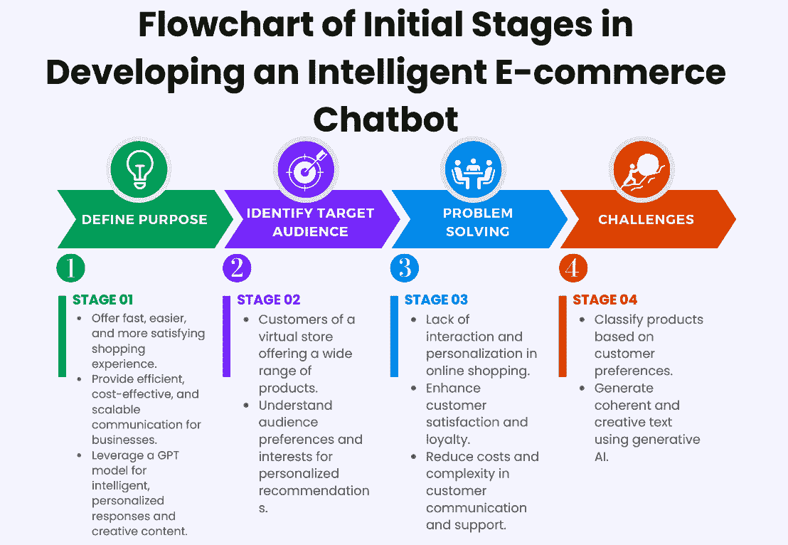

# 第十四章：从构想到现实 – 打造智能网络应用

随着我们进入一个由智能技术主导的时代，本章将探讨**人工智能**（**AI**）在打造智能网络应用中的关键作用。从基础能力到广泛的应用场景，读者将了解如何通过 AI 和连接的数据增强智能应用，并看到它们如何重塑消费者和企业的互动。

本章将深入探讨与用户互动相关的高级 AI 原理，以及如何通过 AI 自动化重复任务。第一部分将向你介绍独立应用实体的解耦架构原理。接下来，我们将掌握将 AI 算法与多样化数据集之间的鸿沟连接的技能。最后，我们将创建数据驱动的业务洞察，理解 AI 如何为业务分析提供支持，帮助做出具有洞察力的决策。

本章将覆盖以下主要内容：

+   智能应用 – 革新技术的未来

+   为电子商务构建智能聊天机器人 – 打下基础

+   数据与设计 – 为电子商务创建智能聊天机器人

+   部署和用户参与 – 利用人工智能进行业务分析和网络应用

+   通过学习进化 – 解锁 AI 在业务分析中的潜力

到本章结束时，你将深入理解与用户互动相关的高级 AI 原理。你将掌握通过 AI 自动化重复任务的原理。你还将学会如何为独立的应用实体设置支持解耦架构。你还将掌握将 AI 算法与多样化数据集之间的鸿沟连接的技能。你还将理解 AI 如何为业务分析提供支持，从而做出有洞察力的决策。

# 智能应用 – 革新技术的未来

在数字化转型的时代，智能应用正成为技术进步的基石，正如 Gartner 报告中所强调的。根据 Gartner 的预测，到 2026 年，30%的新应用将融入人工智能，以推动个性化和自适应用户界面，这一比例相比目前不到 5%的水平显著增加。这表明，应用程序正朝着更动态、更响应式的方向发展。你可以在 Gartner 网站上阅读更多关于这一趋势的信息（[`emt.gartnerweb.com/ngw/globalassets/en/publications/documents/2024-gartner-top-strategic-technology-trends-ebook.pdf?_gl=1*gbpyoj*_ga*NDA3OTY3NTczLjE3MDIwODkwMDQ.*_ga_R1W5CE5FEV*MTcwMjIxNTg5My4zLjEuMTcwMjIxNjQ5MC41NC4wLjA`](https://emt.gartnerweb.com/ngw/globalassets/en/publications/documents/2024-gartner-top-strategic-technology-trends-ebook.pdf?_gl=1*gbpyoj*_ga*NDA3OTY3NTczLjE3MDIwODkwMDQ.*_ga_R1W5CE5FEV*MTcwMjIxNTg5My4zLjEuMTcwMjIxNjQ5MC41NC4wLjA))。

智能应用具有自动化和增强各种任务的能力，适用于广泛的使用场景。凭借其先进的能力，这些应用可以独立完成任务，或与其他应用协作，将生产力提升到一个新的高度。

那么，为什么智能应用现在如此流行？答案就在于生成式人工智能的变革力量。通过利用人工智能的潜力，这些应用能够为客户、用户、产品拥有者、架构师和开发者提供真正智能的体验。这转化为通过为每个用户量身定制应用体验，从而改善结果和数据驱动的决策。

此外，智能应用还融入了来自交易和外部来源的宝贵数据。通过整合这些数据，这些应用能够在应用内部为业务用户提供有价值的洞察力。这消除了对独立的商业智能工具的需求，从而简化了对其业务状态的评估和理解。

要迈向智能应用的旅程，建立卓越中心或专门团队以捕捉、解释、编目、映射并监控智能应用的广度和深度至关重要，这将确保您清晰地了解智能应用如何改变企业应用的范围、目的和功能。

此外，促进组织内对智能应用及其潜在使用案例的共同理解也非常重要。通过这样做，您可以充分挖掘这些应用的潜力，并最大化它们的使用价值。

随着智能应用在中长期内的范围和应用领域的扩展，评估其对您更广泛的应用和服务组合的影响同样至关重要。通过将智能应用融入到您的整体战略中，您可以领先一步，充分利用这项开创性技术带来的好处。

根据高德纳（Gartner）的数据，到 2026 年，30%的新应用将利用人工智能驱动个性化的自适应用户界面，相较于当前不足 5%的比例，这是一个显著的增长。这个统计数字突显了智能应用在塑造未来技术中日益增长的重要性和相关性。

简而言之，智能应用有可能彻底改变我们与技术的互动方式。通过将人工智能和互联数据注入到我们的应用中，我们可以释放出全新的智能和效率层次。组织必须拥抱这一变革性趋势，利用智能应用的力量在未来的竞争环境中保持领先。

# 构建电子商务智能聊天机器人——奠定基础

本节将介绍开发智能电子商务网站应用程序的初期阶段。我们的目标是创建一个能够与客户互动、提供产品推荐并处理订单的聊天机器人。受到现实中 Etsy 平台的启发，Etsy 是一个销售手工艺品和创意产品的平台，我们的聊天机器人将模拟客户浏览网站时的对话。

为了更清楚地理解我们智能聊天机器人在电子商务开发的初期阶段，以下是*图 14.1*。

图 14.1：智能电子商务聊天机器人开发初期阶段的流程图

为了开始对话，让我们创建一个基本的流程图，展示聊天机器人的使用场景：

1.  首先，我们需要定义我们聊天机器人的*目标*。我们的目标是为客户提供更快速、更轻松和更令人满意的购物体验。此外，我们还希望为企业提供一个高效、低成本、可扩展的沟通解决方案。通过利用 OpenAI 强大的 GPT 模型，我们的聊天机器人将能够生成智能和个性化的回应，以及创意内容，如诗歌、故事和音乐。以下是聊天机器人将提供的具体功能，以实现这些目标：回答常见问题，处理订单处理，提供产品推荐，提供客户支持，个性化互动，处理促销和折扣，多渠道支持，以及收集反馈。

1.  接下来，我们必须确定我们的*目标受众*。我们的聊天机器人是为一个虚拟商店的客户设计的，该商店提供各种类别的广泛产品，包括艺术、珠宝、服装、家居装饰、玩具、电子产品、体育、书籍、音乐和健康。通过了解我们的受众偏好和兴趣，我们的聊天机器人将能够搜索、推荐并展示相关和个性化的产品。

1.  我们要解决的*问题*是在线购物中缺乏互动和个性化。这可能导致客户满意度和忠诚度低下，同时也增加了客户沟通和支持的成本与复杂度。通过提供一个能够理解并迎合个人偏好的聊天机器人，我们可以提升整体购物体验，并建立更强的客户关系。

我们的聊天机器人将面临两大类主要问题：

+   首先，它需要根据客户偏好对产品进行分类。这涉及到分析客户数据并识别相关的类别和标准。

+   其次，我们的聊天机器人需要根据提示生成连贯且富有创意的文本。这需要利用 GPT-3 模型的自然语言处理能力。

为了确保可扩展性，我们将使用 **Firebase** 作为我们的云服务。Firebase 提供了多种 Web 和移动应用开发及运营解决方案，包括数据库管理、身份验证、存储、托管和分析。通过 Firebase，我们的聊天机器人能够自动扩展，以应对更高的需求和数据量，同时不影响性能。

在深入探讨我们聊天机器人的具体功能和特点之前，先简要概述一些对于其开发和运行至关重要的关键方面：

+   **计算能力**：高效的计算能力对于我们的聊天机器人至关重要。通过利用基于深度神经网络的 GPT-3 模型，我们能够实现快速而准确的任务执行，同时最大限度地减少资源使用。这些神经网络通过大量数据进行学习和适应，从而能够产生高质量的结果。

+   **维护与更新**：维护与更新对于聊天机器人的持续改进至关重要。通过使用 GitHub 作为版本控制和协作平台，我们可以管理和共享聊天机器人的源代码，跟踪变更和贡献，并促进持续集成和交付。这使我们能够迅速修复错误、增强功能，并整合新特性。

+   **测试与评估**：为了确保聊天机器人满足要求并正常运行，必须进行严格的测试与评估。我们将使用基于 Python 的工具 Streamlit 来实现这一目标。Streamlit 提供了一个图形界面，可以用来测试和评估聊天机器人，并实时显示结果和指标。

+   **数据安全与隐私**：数据安全与隐私是我们最重要的关注点。我们将使用 Firebase 来保护产品、订单和用户数据，通过加密、身份验证和安全规则来确保这一点。这确保了聊天机器人能够可靠地保护敏感信息，防止未经授权的访问、不当修改和意外丢失。

+   **伦理考量**：最后，伦理考量将被纳入我们的解决方案中。遵循 AI 的伦理原则，我们的聊天机器人将尊重自主性、避免伤害、促进福祉、维护公平、确保可解释性、承担责任并优先考虑隐私。这些原则引导着 AI 的开发和应用，以一种有益、公正和人道的方式进行。

通过为我们的智能聊天机器人奠定基础，我们可以创建一个强大的工具，彻底改变电子商务，通过提供个性化和引人入胜的客户体验。我们的聊天机器人将专注于用户互动和先进的 AI 原则，改变客户在线购物的方式。

既然我们已经建立了智能聊天机器人的基础组件，现在让我们进入下一个关键阶段：数据与设计。在本节中，我们将探讨如何有效利用数据，并设计一个不仅智能，而且直观且用户友好的聊天机器人，适用于电子商务环境。

# 数据与设计 – 为电子商务创建智能聊天机器人

在本节中，我们将深入探讨我们项目的数据收集、分析和架构设计方面，展示我们如何为电子商务平台构建一个智能聊天机器人。我们的目标是为客户提供一个由 AI 驱动的独特和个性化的购物体验。

为了实现这一目标，我们选择了使用 OpenAI 的**GPT 模型**。这个最先进的自然语言处理模型以其根据提示生成连贯和富有创意的文本的能力而闻名。GPT 基于深度神经网络构建，可以从大量数据中学习和适应，从而确保高质量的结果。

对于我们的 Web 应用平台，我们选择了**Flask**和**Node.js**/**Express**作为框架。Flask 让我们能够快速轻松地使用 Python 创建 Web 应用，提供了简洁性、灵活性，并支持众多扩展。Node.js 和 Express 提供了一个强大的框架，用于创建高效可靠的后端功能，处理高并发操作，管理异步任务，并促进实时通信。此外，我们还使用**Firebase**作为我们的云服务平台，提供包括数据库服务、身份验证、存储、托管和分析等在内的多种 Web 和移动应用开发解决方案。

通过结合使用 Flask 和 Node.js/Express，我们能够充分发挥每个框架的优势。Flask 将处理核心 Web 应用逻辑，而 Node.js/Express 将管理高性能的后端操作。这样的组合确保了我们的智能聊天机器人解决方案既全面、高效又可扩展。

为了实现聊天机器人的功能，我们正在使用各种工具和库。`pandas`和`numpy`用于数据处理，`nltk`用于自然语言处理，`firebase_admin`用于连接和与 Firebase 进行交互。

我们的聊天机器人通过电子商务平台上的聊天界面与客户互动。客户可以输入他们的问题、请求和指令，聊天机器人则提供答案、推荐和确认。我们的聊天机器人数据源是一个包含超过 40,000 个电子商务产品的在线数据库。该数据库包含产品名称、价格、类别、描述和图片等信息。

我们选择了 NoSQL 数据库，因为它具有优越的可扩展性、无缝的集成能力和强大的性能。NoSQL 数据库擅长管理大规模数据集，并且能够横向扩展，非常适合我们聊天机器人需要处理的动态和庞大的产品信息。此外，NoSQL 数据库提供的灵活数据模型使其能够轻松适应电子商务环境中常见的多变和变化的数据结构。这种适应性支持快速开发和迭代，确保我们的聊天机器人能够提供实时响应，并在数据量增加时保持高性能。

数据收集通过下载电子商务产品数据库进行。此外，聊天机器人通过聊天界面收集客户订单数据。我们随后对收集的数据进行准备，包括清洗和转换，使其能够被聊天机器人使用。这包括删除不完整的产品信息，将价格转换为本地货币，基于产品描述对产品进行分类，并将产品描述向量化以用于产品推荐。

Firebase 作为我们的*存储解决方案*，负责存储产品和客户订单数据。它为 Web 和移动应用提供实时数据库服务，用于数据存储和同步，并提供云存储用于文件存储和传递，包括产品图片。

聊天机器人通过聊天界面提供回应、推荐和确认，允许客户进行互动并查看结果。此外，必要时，它还会向客户提供通知。

在架构方面，我们的聊天机器人遵循典型的客户端-服务器架构用于 Web 应用。客户端是电子商务平台上的聊天界面，而服务器是实现聊天机器人的 Web 应用。我们还利用微服务架构来集成 OpenAI API 和 Firebase。每个微服务代表一个特定的功能或方法，如产品搜索、推荐生成、订单处理、响应生成和数据存储。

客户使用我们的聊天机器人询问产品、检查库存情况、查询价格和运输选项。根据客户的偏好和兴趣，他们还可以收到个性化的产品推荐，并且可以下单购买产品。聊天机器人会根据客户互动不断学习和改进其推荐和回应，包括反馈、评分、评论以及客户数据（如搜索和购买历史）。它还会跟进行业趋势和技术进展，提供最新的产品信息和功能。

通过开发这个智能电商聊天机器人，我们旨在彻底改变在线购物体验，为客户提供个性化的帮助、相关的推荐以及无缝的订单处理。借助 AI 的力量，我们正在创建一个变革性的平台，提升客户的满意度和参与度。

随着我们继续推进智能聊天机器人项目，下一阶段至关重要，即对 AI 构建模块进行精细集成。下一部分将引导我们完成智能功能的集成，这些功能对于打造一个智能电商聊天机器人至关重要。

## AI 集成构建模块——集成智能功能以打造智能电商聊天机器人

当我们开始创建一个智能电商聊天机器人的旅程时，我们面临着将各种 AI 构建模块进行集成的任务。我们的目标是创建一个能够有效与客户互动、回答他们的问题、推荐产品并处理订单的聊天机器人。为了实现这一目标，我们将同时处理后端和前端开发，以及智能功能（如推荐系统）的集成。此外，我们还将强调彻底测试的重要性，以确保最佳的功能性和性能。

让我们开始这段旅程：

+   首先，我们需要了解独立应用实体的解耦架构原则。通过解耦聊天机器人的不同组件，我们可以确保在未来的更新和改进中具有灵活性和可扩展性。

+   对于服务器端逻辑和数据库集成，我们将同时使用 Flask 和 Node.js/Express。Flask 将处理核心的 Web 应用逻辑，而 Node.js 和 Express 将负责高性能的后端操作。这种组合为创建高效且可靠的后端功能提供了强大的框架。在它们的帮助下，我们可以无缝地将聊天机器人与必要的数据库进行集成，确保顺畅的数据检索和存储。

+   为了利用 OpenAI API 提供的智能功能，我们将使用 LangChain。这个强大的工具使我们能够利用自然语言处理的潜力，根据对话的上下文和产品数据生成智能回复。通过集成这一技术，我们的聊天机器人能够为客户提供个性化和相关的信息，提升他们的整体体验。

    LangChain 在这一集成中尤其有用，因为它简化了与 OpenAI API 连接的过程。它的模块化设计使得各种 AI 功能的实现更加灵活和高效。此外，LangChain 支持提示工程，这是创建精准且与特定情境相关的定制化回复所必需的。

    例如，如果客户询问：“你能推荐一个送给科技爱好者的礼物吗？”LangChain 帮助聊天机器人理解这个问题，利用 GPT 模型生成个性化的回答。聊天机器人可能会建议如最新款的智能音响、智能手表或无线耳机等选项，从而提供有帮助且引人入胜的互动体验。

+   测试是开发高质量聊天机器人的关键环节。我们将使用 Jest 和 Cypress 来进行全面的单元集成和端到端测试，以确保我们的 Web 应用程序正常运行，提供准确的回应并与客户进行流畅的互动。

本节提供了构建智能电商聊天机器人所需的知识和工具。通过整合 AI 功能，如推荐系统，并对我们的应用程序进行充分测试，我们可以创建一个有效与客户互动、提升购物体验并高效处理订单的聊天机器人。让我们一起开始构建电商智能聊天机器人的旅程。

正如我们已经探讨了构建智能电商聊天机器人的基础要素，现在我们需要将系统实施到实际环境中，并与真实用户进行互动。下一节将指导我们完成聊天机器人上线的最后阶段，并利用 AI 增强业务分析和 Web 应用程序管理。

# 部署与用户互动—利用 AI 进行商业分析和 Web 应用程序管理

AI 的整合在通过有效的商业分析进行深刻决策方面变得越来越重要。通过利用 AI 算法和多样化的数据集，我们可以发掘出有价值的见解，推动组织前进。在本节中，我们将探讨部署 Web 应用程序和吸引用户的最佳实践，以最大化其潜力。

让我们开始：

+   **使用 Netlify 部署 Web 应用程序**：为了确保无缝的用户体验，选择一个可靠的平台来部署 Web 应用程序至关重要。Netlify 提供了一整套简化部署流程的功能，让您可以专注于交付高质量的产品。通过 Netlify，您可以轻松部署 Web 应用程序，并享受其强大的性能和可扩展性。

    此外，虽然有多种替代部署选项，如 AWS、Heroku、Google Cloud Platform 和 Microsoft Azure，但我们选择了 Netlify，因为它简单、功能集成、性能强大、可扩展且具有成本效益。Netlify 的用户友好界面和与 Git 仓库的无缝集成，使其成为开发人员高效部署和管理 Web 应用程序的理想选择。

+   **通过 Google Analytics 和 Firebase Performance Monitoring 跟踪和提高绩效**：一旦你的网络应用程序部署完成，监控其性能和用户行为以识别需要改进的地方变得至关重要。Google Analytics 提供强大的跟踪能力，提供有关用户参与度、流量来源和转化率的宝贵见解。此外，Firebase Performance Monitoring 允许你测量关键绩效指标，如应用启动时间和网络延迟，从而优化你的网络应用程序的性能。

+   **通过社交媒体和搜索引擎优化（SEO）技术推广和宣传你的网络应用程序**：为了触及更广泛的受众并最大化用户参与度，利用社交媒体和 SEO 技术是至关重要的。利用 Facebook、Twitter 和 Instagram 等平台来宣传你的网络应用程序，并与目标受众互动。此外，实施有效的 SEO 策略，如*关键词优化*和*链接建设*，可以显著提高你的网络应用程序在搜索引擎结果中的可见性。

通过遵循之前提到的最佳实践——利用 Netlify 等平台进行部署，使用 Google Analytics 和 Firebase Performance Monitoring 进行跟踪，并借助社交媒体和 SEO 技术进行推广——你可以确保无缝的用户体验。这些策略在推动你的网络应用程序成功方面起着关键作用，使你的组织能够通过基于 AI 驱动的数据分析做出有洞察力的决策，从而在当今竞争激烈的环境中蓬勃发展。

在建立了网络应用程序部署和用户参与的最佳实践的坚实基础后，让我们现在来探讨下一个关键阶段：利用 AI 的力量进行商业分析。在本节中，我们将探讨如何通过利用 AI 来提升决策过程，持续学习和适应。

# 通过学习进化——解锁 AI 在商业分析中的潜力

随着技术领域以前所未有的速度发展，企业面临着迫切需要适应并利用 AI 在分析工作中转变性能力的挑战。深入理解 AI 在商业分析中的作用，使我们能够做出明智决策，推动增长并确保成功。在这一部分，我们将深入探讨持续学习过程的最佳策略，包括跟踪绩效指标、收集用户反馈、进行 A/B 测试以及根据需要反复重新训练 AI 模型。

让我们深入了解一下这些策略：

+   为了有效跟踪你的 AI 模型的性能指标，我们建议利用 LangChain 和 OpenAI Playground。这些工具提供了一个全面的框架，用于定义和监控关键指标，如准确率、精确率、召回率和 F1 分数。通过密切关注这些指标，你可以评估 AI 模型的效果，并实时发现需要改进的领域。

+   用户反馈是一个宝贵的资源，能够帮助你完善和提升 AI 模型。Firebase Feedback 和 Google Forms 是收集和分析用户反馈的优秀工具。通过主动向用户征求意见，你可以获得有关他们体验的宝贵洞察，识别出任何痛点或需要优化的领域。这种以用户为中心的方法确保你的 AI 模型与目标受众的需求和期望保持一致。

+   进行 A/B 测试是 AI 模型开发中的一项重要实践。像 VWO、Adobe Target 和 AB Tasty 这样的平台提供了强大的工具，用于比较不同版本的 AI 模型。通过同时测试多个变体，你可以收集每个版本的性能数据，并做出数据驱动的决策，选出表现最好的模型。A/B 测试让你能够基于实际结果迭代和优化模型，确保持续改进和最佳性能。

    让我们看一个例子。你有两个版本的产品推荐算法：模型 A（当前）和模型 B（新版本）。为了确定哪个模型表现更好，你可以进行 A/B 测试。你的用户中一半与模型 A 互动，另一半与模型 B 互动。你会监控点击率、转化率和用户参与时长等指标。如果模型 B 显示出更高的点击率和转化率，你可能会决定将其作为新的标准。通过根据这些实际结果进行迭代，你可以确保你的 AI 模型不断改进，并与用户需求保持一致。

+   最后，接受 AI 模型开发中持续学习和演化的概念是至关重要的。利用 LangChain 和 OpenAI Playground，根据需要重新训练和更新你的 AI 模型。通过结合用户反馈和测试结果，你可以对模型进行微调，以提供最佳性能。这个迭代过程确保你的 AI 模型在瞬息万变的商业环境中依然保持相关性和有效性。

理解 AI 如何为商业分析做出贡献，对于做出能够推动增长和成功的深刻决策至关重要。通过遵循本节中概述的最佳实践，你可以释放 AI 在商业分析工作中的全部潜力。接受持续学习和演化的理念，见证你的 AI 模型如何推动你的业务向前发展。

在我们深入探讨将 AI 用于商业分析和 Web 应用管理的详细内容之前，让我们回顾一下迄今为止在构建电子商务智能聊天机器人过程中涉及的关键要点。我们已经探讨了将 AI 能力集成到聊天机器人中所需的基本组件和策略。

# 总结

在本章中，我们踏上了在 AI 主导的新时代中打造智能 Web 应用的旅程。通过探索基础原则和多种应用场景，我们揭示了 AI 驱动的解决方案对消费者体验和商业运作的变革性影响。

我们从深入研究与增强用户互动并通过自动化简化操作流程的先进 AI 原理开始。首先介绍了去耦架构，以促进独立的应用实体，然后我们探讨了将 AI 算法与不同数据集结合的复杂性，释放智能应用的全部潜力。

我们的探索最终导致了数据丰富的商业洞察力的创造，以及 AI 在通过强大的商业分析促进明智决策中的关键作用。从革新技术未来到为电子商务部署智能聊天机器人，再到利用 AI 进行用户互动和分析，我们涉及了一系列旨在赋予您可操作的洞察和实用技能的主题。

随着本章的结束，我们深入理解了先进 AI 原理及其在打造智能 Web 解决方案中的应用，接下来我们将准备进入旅程的下一阶段。在下一章中，我们将深入探讨采纳 AI 技术所固有的伦理维度和风险管理策略，确保我们的数字化探索始终以信任和责任为原则。
