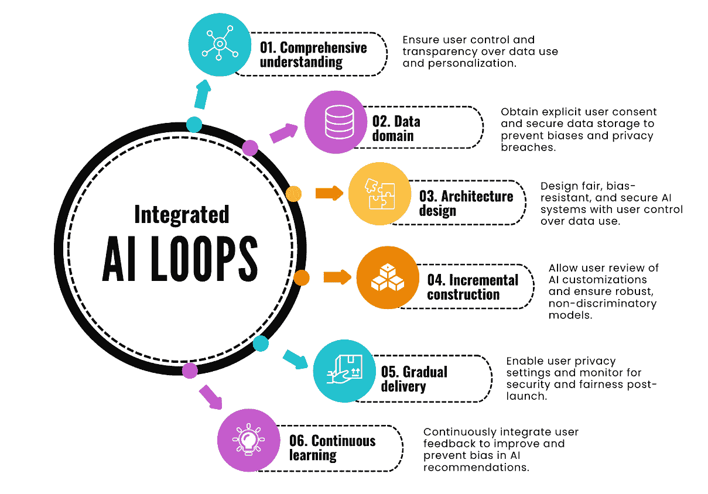

# 第十五章：数字领域的守护者——在 AI 中导航信任、风险和伦理

本章讨论 AI 中的伦理、信任和风险因素是至关重要的，因为它们直接影响 AI 技术的开发、部署和控制。随着 AI 在我们日常生活和全球基础设施中的作用日益重要，围绕其使用的伦理问题变得尤为重要。本章强调将伦理考量嵌入 AI 系统中的重要性，以防止偏见、保护人权，并确保 AI 技术的部署与社会价值观和法律标准一致。我们将涵盖从*AI 伦理*的基本原则到*AI 模型治理*的实际策略，利用创新的 AI TRiSM 框架。

**AI TRiSM**代表**AI 中的信任、风险和安全管理**。它通过促进透明度、管理风险和实施强有力的安全措施，致力于确保 AI 系统是可信的、安全的，并与伦理保持一致。

在本章中，我们将深入探讨 AI 专业人士在 Web 开发和通过 AI TRiSM 框架创造商业价值中的关键角色。AI 专业人士在将 AI 技术融入并推动 Web 开发中的作用至关重要。他们的专业知识对利用 AI 提升用户体验、优化后端操作和确保伦理的 AI 实施至关重要。

此外，我们将探讨如何将 AI TRiSM 框架应用于创造可观的商业价值。该框架帮助组织将 AI 战略与业务目标对齐，专注于信任、风险和安全，以推动增长、创新和竞争优势。我们将讨论将 AI TRiSM 原则融入日常业务流程和决策中的实际策略，展示它如何促进一个强大的治理模型，从而提升 AI 的可靠性和有效性。

本章的主要内容包括以下几个方面：

+   AI 伦理的基本原则

+   构建和实施 AI 模型的治理框架

+   理解并应用 AI TRiSM 框架

+   通过 TRiSM 创造商业价值

在本章结束时，你将对如何应对 AI 中的伦理和治理挑战有一个扎实的理解，并且能够将本章学到的概念应用于开发可靠和负责任的 AI 技术。

# AI 伦理的基本原则

AI 革命带来了许多伦理挑战，这些挑战在深刻且复杂的方式上塑造着我们的世界。数据隐私、算法偏见以及 AI 可能加剧甚至延续社会不平等的问题，成为这些挑战的前沿问题。

**算法偏见**指的是 AI 系统中的系统性错误，导致不公平的结果，通常使某些群体处于不利地位。例如，一个招聘算法如果持续拒绝来自特定人口群体的候选人，就表现出了算法偏见。

**社会不平等**涉及不同社会群体在资源和机会上的差异，如果管理不当，AI 可能会无意中加剧这些差异。例如，用于贷款审批的 AI 系统如果基于有偏见的历史数据进行训练，可能会不成比例地拒绝某些种族群体的贷款申请。

本章开启了一段重要的旅程，帮助我们理解 AI 伦理如何不仅塑造着我们的现在，还在塑造着我们的未来。本章是理解 AI 伦理如何塑造我们现在与未来的关键旅程。我们将涵盖从 AI 伦理的基本原则到使用创新的 AI TRiSM 框架进行 AI 模型治理的实际策略。

AI 伦理的核心是随着 AI 系统变得更加复杂和普及而出现的伦理困境。这些困境错综复杂，涉及多个层面，常常挑战传统的伦理与道德观念。主要问题包括：

+   **算法决策的透明性**：确保 AI 系统做出的决策能够被人类理解和解释。缺乏透明性可能导致人们对 AI 产生不信任并滥用其功能。

+   **AI 行为的问责制**：确定当 AI 系统犯错或造成损害时，谁应当负责。这包括 AI 系统的创建者、运营者和用户。

+   **确保公平性并避免偏见**：防止 AI 系统延续或放大社会中已有的偏见。AI 系统应当设计成公平对待所有个体，无论其背景如何。

+   **数据的隐私和安全**：保护 AI 系统使用的海量数据免受未经授权的访问和滥用。这包括保障个人信息和确保数据的完整性。

为了成功地应对 AI 时代，我们必须理解这些困境并做好应对准备。在接下来的章节中，我们将详细识别和分析这些困境，探索其影响并讨论潜在的解决方案。

AI 中的伦理涉及权衡诸如数据隐私、算法偏见以及 AI 对社会的影响等复杂问题。在一个算法做出影响人类生活决策的世界中，准确识别和分析这些伦理困境至关重要。

我们在这里讨论的原则支撑着人工智能技术的负责任发展与部署，确保它们为社会带来积极的影响，同时降低风险。通过理解透明性、问责制、公平性和隐私的重要性，我们为构建更具伦理的人工智能系统奠定了基础。接下来，让我们继续探索人工智能发展中的关键伦理原则，这些原则对于构建真正提升我们生活而不妥协我们价值观的技术至关重要。

## 人工智能发展的关键伦理原则

人工智能中的伦理考量是构建系统的基础，这些系统不仅提升技术能力，还要保护人类利益和社会规范。我们即将探讨的原则确保人工智能系统在尊重人类自主性、促进公平性并防止伤害的方式下运作。这个框架不仅提升了人工智能系统的可信度，还使它们的功能与人类价值观和伦理标准保持一致。以下是必须纳入人工智能开发中的关键伦理原则：

+   **尊重人类自主性**：这是人工智能伦理的基本原则之一。人工智能必须尊重人类自由做出知情决策的能力，不得进行操控、胁迫或欺骗。这意味着人工智能必须确保用户的同意，并确保透明度。

+   **透明性**：在开发人工智能驱动的电子商务平台时，开发者必须确保在使用客户数据方面的透明性。客户必须被明确告知他们的信息将如何用于个性化和产品推荐。此外，必须为客户提供主动决定是否以及如何使用其数据的选项，从而增强他们对个人信息的控制。这种做法不仅建立了信任，还符合在智能系统开发中用户隐私和数据保护的最佳实践。

+   **防止伤害**：这是另一个基本原则。人工智能必须避免或最小化对人类健康、安全、尊严、权利以及福祉和环境的风险与负面影响。人工智能模型的开发、实施和使用必须负责任、符合伦理并合法，遵循预防、比例和问责原则。人工智能还必须具备稳健性、可靠性、安全性和抗压性，避免错误、失败、攻击或滥用。

    防止伤害原则要求开发者谨慎行事，进行广泛的测试和风险评估，以预防和减轻潜在的伤害。这种前瞻性的做法确保人工智能系统不会无意中对用户或环境造成伤害。

+   **比例性**要求人工智能系统的利益应当大于其风险。该原则确保所采取的措施与风险水平相匹配，在创新与必要的安全与伦理保障之间保持平衡。

+   **问责制**对于维持人工智能系统的信任和完整性至关重要。它确保所有人工智能输出都是可追溯的，并且有机制使开发者和操作员承担责任。这包括保持详尽的文档、启用审计并提供解决任何错误或偏见的手段。

+   **正义与公平**：人工智能伦理中的关键原则，正义与公平确保人工智能系统在运行时不会产生偏见和歧视。这些原则通过要求人工智能系统平等对待所有用户，不论背景或人口特征，来促进公平。实施这些原则包括设计透明、可审计、可调整的算法，以防止和纠正偏见，从而促进更大的包容性和公平。这一承诺有助于建立对人工智能应用的信任，并支持跨各种背景的伦理合规。

+   **隐私与安全**：保护个人数据并确保遵守隐私法律至关重要。这包括保护数据不受未经授权的访问和滥用，保持数据完整性，并确保用户能够控制自己的信息。

开发者必须进行严格的安全测试，以确保人工智能模型不易受到可能危及客户数据隐私的网络攻击。

此外，正义和公平是人工智能伦理中的关键原则。人工智能必须公正、客观、不歧视，尊重平等、多样性和人权不受侵犯。它必须是透明的、可审计的和可验证的，能够检测和纠正偏见、错误或不公正。人工智能必须是包容性的、可访问的和民主的，确保所有受影响或感兴趣的人都能参与、代表并表达声音。

此外，人工智能必须根据用户反馈进行调整，考虑到不同人口群体，以避免个性化结果中的歧视和偏见。

## 人工智能项目中的预防措施示例

为了确保人工智能技术的伦理和负责任的部署，实施预防措施以应对潜在风险和挑战至关重要。这些措施有助于减轻负面影响，并提高人工智能系统的可信度和可靠性。以下是各行业在其人工智能项目中成功实施预防措施的一些示例：

+   **广泛的测试与模拟**：在将人工智能系统部署到关键应用领域，如医疗保健或自动驾驶之前，必须进行广泛的测试和模拟，以识别和缓解潜在的风险。例如，无人驾驶汽车公司进行数百万英里的模拟，以确保其算法能够安全处理各种情景。

+   **偏见审计**：定期对 AI 算法进行审计，以检测和纠正偏见。例如，一些公司使用公平意识算法来审计招聘工具，确保其不会歧视任何特定群体。

+   **可解释性工具**：实施使 AI 决策透明和可解释的工具。例如，在金融领域，用于信用评分的 AI 系统必须提供清晰的理由来说明其决策，确保客户了解为何自己被批准或拒绝信贷。

+   **用户控制机制**：为用户提供控制其数据使用方式的权利，并提供选择退出的选项。例如，社交媒体平台允许用户管理其隐私设置，控制收集的数据类型及其使用方式。

通过融入这些预防性措施，组织能够更好地应对 AI 部署中的伦理复杂性。这些做法有助于增加对 AI 技术的信任和接受，为其成功融入我们生活的各个方面铺平道路。

总之，伦理考量是负责任 AI 开发的核心。理解并应用 AI 开发中的关键伦理原则至关重要，以确保 AI 系统尊重人类自主权，防止伤害，并维护公正与公平。在《*集成 AI 循环：简化 Web 应用程序 AI 开发*》第三章的子章节中，详细介绍了集成 AI 循环框架，从问题定义的初始阶段到持续学习和改进，在每个决策过程中都必须融入这些伦理概念。尊重用户同意、保护数据隐私、确保系统稳健性和促进公平不仅是伦理要求，也是构建值得信赖和可靠的 AI 系统的必要条件。通过遵循这些原则，AI 专业人员和开发者可以为 AI 技术的负责任发展做出贡献，最终造福整个社会。

我们已经深入探讨了负责任 AI 开发所必需的关键伦理原则。接下来，我们将探讨这些伦理概念如何在 AI 系统开发中得到实际应用。这包括将抽象的伦理标准转化为可操作的指南，进而影响 AI 的设计、实施和运营。

## 在 AI 开发中应用伦理概念

将伦理概念应用于人工智能（AI）开发是构建负责任且可靠的 AI 系统的重要方面。这涉及将抽象的伦理原则转化为具体的指导方针，以指导 AI 模型的创建和实施。

AI 专业人员必须具备在 AI 项目的整个生命周期内做出伦理决策的能力，从构思到部署，再到持续维护。这需要对开发过程中的每一个决策的伦理影响有透彻的理解。

在前面的章节中，我们探讨了 AI 伦理的基本原则，强调了透明度、问责性、公平性和隐私的重要性。这些原则不仅仅是理论性的，而是作为实际指导方针，塑造了 AI 技术负责任的开发和部署。为了增强理解和记忆，我们呈现了*图 15.1*，它以集成 AI 循环框架为基础，图示了这些伦理原则如何贯穿整个 AI 开发生命周期：

图 15.1：集成 AI 循环框架中的道德考量

通过在集成 AI 循环**框架**中视觉化地映射伦理考虑因素，我们能更好地理解如何有效实施这些原则。这种方法确保了 AI 系统的开发和部署与社会价值观和伦理标准保持一致。

### 循环 – 全面理解

在定义 AI 驱动的电子商务平台的问题和范围时，重要的是确保用户对其选择和决策（包括产品个性化和推荐）有控制权。

在建立质量标准和成功度量标准时，应考虑如何从一开始避免对客户数据隐私和安全的风险。

在确定目标受众和客户群时，避免歧视和偏见，确保所有群体受到公平和平等对待。

这里是循环的最佳实践：

+   **透明性**：清楚地告知用户他们的数据将如何使用及其目的。

+   **知情同意**：获取用户对数据收集和使用的明确同意。

+   **用户参与**：允许用户控制其偏好和决策。

+   **自动回复**：确保自动回复具有透明性，并允许用户反馈以改进 AI 的互动方式。

### 循环 – 数据领域

在收集数据时，必要时从用户那里获取明确的同意，并透明地说明这些数据将如何使用。

确保收集的数据安全存储，以避免隐私泄露和信息泄露。

要注意避免包含可能会在 AI 模型中引入偏见和歧视的数据。

这里是循环的最佳实践：

+   **明确同意**：在收集数据之前，始终要获取用户的明确同意。

+   **数据使用透明度**：清楚地说明数据的收集和使用方式及原因

+   **数据安全**：使用加密和其他安全措施保护收集的数据。

+   **偏见预防**：定期进行审核，识别和清除存在偏见的数据。

+   **自动数据处理**：实施自动化数据处理技术，确保数据安全和隐私措施的一致应用。

### 循环 – 架构设计

在架构设计时，确保用户对其信息的使用和个性化有控制权。

选择最小化风险并保证数据安全的 AI 技术，如公平且安全的推荐系统——例如隐私保护算法。这些是在 AI 系统中应用的特定方法或算法，用于保护用户数据，确保在**机器学习**（**ML**）等过程中不会泄露个人信息，从而维护隐私。

评估 AI 技术可能存在的算法偏见，并选择最有效和最公平的技术。例如，审计算法的偏见、实施公平性约束或使用旨在公平的算法（如那些调整推荐以防止强化现有偏见的算法）是确保 AI 系统公正运行的关键。

以下是循环最佳实践：

+   **用户控制**：确保用户能够决定其信息如何被使用和个性化。

+   **架构中的安全性**：从一开始就将隐私保护和安全算法纳入架构。

+   **偏见评估**：使用审计工具识别并减轻算法中的潜在偏见。

+   **自动化安全检查**：在系统架构中集成自动化安全检查，持续监控并解决漏洞。

### 循环 – 增量建设

在实施 AI 模型时，给予用户审查并调整系统所做的定制和推荐的选项。

进行严格的安全测试，以识别并修复任何可能威胁客户数据隐私或安全的漏洞。

确保 AI 模型不会歧视或侵犯特定客户群体的权益。

以下是循环最佳实践：

+   **用户审查**：允许用户审查并调整系统所做的定制和推荐。

+   **安全测试**：进行严格的测试以识别并修复漏洞。

+   **非歧视**：确保 AI 模型不会歧视特定客户群体。

+   **自动化更新**：使用自动化流程定期更新 AI 模型和算法，确保它们保持稳健和公平。

### 循环 – 渐进交付

在上线时，让用户控制其隐私和个性化设置。

在系统上线后，密切监控以检测任何安全或隐私问题，并及时响应。

确保系统不会对任何用户群体进行歧视或不公平的对待。

以下是循环最佳实践：

+   **隐私设置**：在上线时让用户控制其隐私和个性化设置。

+   **持续监控**：在上线后持续监控系统，及时发现并解决任何安全或隐私问题。

+   **公平性验证**：确保系统不会对任何用户群体造成不公平的劣势。

+   **自动化警报**：实施自动化警报系统，实时通知开发人员任何检测到的偏见或安全漏洞。

### 循环 – 持续学习

随着用户兴趣的变化，保持他们调整偏好和设置的能力。

使用通过用户反馈和性能数据收集的信息，持续改进系统，并避免隐私和安全风险。

响应用户行为的变化，确保系统不会在推荐中引入偏见或不公平。

以下是循环的最佳实践：

+   **反馈整合**：使用用户反馈持续改进系统，避免隐私和安全风险。

+   **适应性**：保持用户根据兴趣变化调整偏好和设置的能力。

+   **偏见检测**：确保系统能够适应，同时不会在推荐中引入偏见或不公平。

+   **自动化学习**：实施自动化学习机制，以无缝整合用户反馈并相应地更新 AI 模型。

在之前的讨论中（*第三章*），我们介绍了集成 AI 循环框架的概念。 这个框架对于 AI 模型在 Web 应用中的结构化和有效开发与部署至关重要，确保它们能够高效地满足用户需求和业务目标。以下是集成 AI 循环框架中每个阶段需要考虑的一些伦理方面，确保 AI 的开发与实施符合伦理和责任。

在概述了集成 AI 循环框架的关键阶段后，我们现在将注意力转向这些技术伦理应用所必需的基本组成部分：为 AI 模型构建和实施治理框架。 下一节将深入探讨组织如何建立强大的治理结构，这些结构不仅符合监管标准，而且贯穿 AI 开发和部署生命周期中的每个阶段，体现伦理实践。

# 为 AI 模型构建和实施治理框架

在人工智能日益成为我们生活中心的时代，AI 模型的强有力治理需求比以往任何时候都更加迫切。**治理**在人工智能中指的是一套确保 AI 负责任地开发和使用的政策、程序和实践。 本节探讨了如何有效地构建和实施 AI 模型的治理框架，确保它们公平、值得信赖、安全，并且最重要的是，对社会有益。

## 了解治理的重要性

人工智能模型中的治理对于缓解风险至关重要，包括与偏见、隐私、安全和可靠性相关的风险。有效的治理确保人工智能模型以伦理、透明和负责任的方式开发和使用，从而促进公众信任并推动人工智能的广泛应用。此外，强有力的治理对于人工智能项目的长期可持续性至关重要，确保它们能够适应法律、法规和社会期望的变化。

治理框架为决策和人工智能模型的管理提供了结构。它们包括以下方面的指南：

+   **伦理影响评估**：评估人工智能模型对个人和社会可能产生的影响

+   **透明性与可解释性**：确保人工智能模型做出的决策是可以理解和有根据的

+   **隐私和数据保护**：保护个人信息并确保遵守隐私法。

+   **安全性**：实施安全措施，保护人工智能模型免受操纵和攻击

+   **持续监控与评估**：建立流程以监控人工智能模型的表现，并不断评估其影响

为了指导组织在伦理、透明和负责任的人工智能开发和使用方面，全球领先的组织已经制定了多个关键治理框架：

+   **可信赖人工智能伦理指南（欧盟委员会）**：由欧盟委员会制定，该框架强调了可信赖人工智能的必要性，聚焦七个关键要求：人工监督、稳健性和安全性、隐私和数据治理、透明度、多样性、非歧视和公平、社会和环境福祉以及问责制。

+   **人工智能原则（经济合作与发展组织 – OECD）**：经济合作与发展组织的原则强调推动创新且可信赖的人工智能，并尊重人权和民主价值观。这些原则将透明度、稳健性、安全性、公平性和问责制作为人工智能发展和使用的基础。

+   **蒙特利尔人工智能负责任发展宣言**：蒙特利尔宣言概述了负责任的人工智能发展的 10 条原则，包括福祉、尊重自主权、隐私和亲密关系保护、团结、民主参与、公平、包容性多样性、谨慎、责任和可持续发展。

+   **电气和电子工程师协会（IEEE）伦理对齐设计**：由 IEEE 制定的这一系列建议，旨在确保人工智能和机器人系统在开发时将伦理放在首位。该文件涉及人权、福祉、数据透明度和问责制，旨在鼓励技术的负责任创新。

最后，探讨具体的治理框架，如欧洲委员会的《可信赖 AI 伦理指南》、经济合作与发展组织（OECD）的 AI 原则、蒙特利尔《负责任的人工智能发展宣言》和 IEEE 的《伦理对齐设计》，凸显了全球在促进伦理、透明和负责任的 AI 发展与使用方面的承诺。这些框架共同体现了一种全面的 AI 治理方法，强调了人类监管、伦理完整性、包容性和环境考量的重要性。

这些框架的多样性反映了 AI 的多面性以及必须解决的广泛问题，以负责任地利用其潜力。从确保稳健性和安全性到倡导非歧视、公平性和民主参与，所列出的原则引导组织创建不仅推动技术创新而且维护和促进社会价值观与人权的 AI 系统。

随着 AI 的不断发展并渗透到社会各个领域，实施这些治理框架变得越来越重要。它们不仅为伦理 AI 开发提供了蓝图，而且还呼吁组织、开发者、政策制定者和利益相关者共同合作，致力于负责任地管理 AI 技术。通过遵循这些指南，AI 社区可以在复杂的伦理环境中航行，降低风险，确保 AI 作为一种积极的力量，推动社会进步并促进所有人的福祉。

迈向负责任 AI 的旅程仍在继续，需要持续的努力、对话和适应。所讨论的框架提供了坚实的基础，但在实现伦理、透明和负责任的 AI 方面的最终成功，将取决于对这些原则的集体承诺以及随着技术和社会需求变化愿意不断发展治理实践。随着我们向前迈进，让我们将这些框架视为指引，指引我们走向一个 AI 不仅推动技术可能性的边界，而且与我们最深切的价值观和对公正、平等世界的追求相契合的未来。

## 实施治理框架的考虑因素

有效实施治理框架需要采取全面的方法，涉及多个利益相关者，包括 AI 开发者、最终用户、监管者以及更广泛的社会。关键步骤包括以下几点：

+   **政策定义**：建立反映伦理价值观和组织目标的明确政策

+   **程序开发**：制定详细的程序来应用政策，包括伦理影响评估和安全审查流程的方法

+   **培训与意识提升**：确保所有参与创建和管理 AI 模型的人了解治理原则，并知道如何应用这些原则

+   **反馈机制**：实施机制来收集用户和其他利益相关者的反馈，允许 AI 模型的持续改进。

建立稳健有效的 AI 治理的本质在于一种全面和包容性的方法。这个过程需要包括 AI 开发者、最终用户、监管者以及整个社会在内的多方利益相关者积极参与。通过定义清晰的政策、制定精确的程序、营造持续教育和意识的环境，并建立开放反馈渠道，组织可以创建一个治理框架，既符合道德价值和组织目标，也能够适应 AI 技术和其对社会影响的不断变化。

迈向负责任的 AI 治理的旅程仍在继续，并需要对这些基础步骤的承诺。随着我们前行，集体努力以勤奋和远见实施这些框架，将在塑造 AI 的未来中发挥至关重要的作用——这是一个技术在道德责任、透明度和问责制的界限内运作，确保所有相关利益方的福祉的未来。

当我们结束关于治理框架实施的讨论时，很明显，这条道路充满挑战，例如 AI 技术的迅速发展、AI 应用的广泛性以及全球法律和法规的差异；然而，这些障碍并非无法克服。应对这一复杂局面的关键在于促进国际合作、建立全球 AI 治理标准，并投入资源进行深入研究，以加深我们对 AI 社会影响的理解。这种主动的方式不仅有助于克服障碍，也为负责任和道德的 AI 开发与使用奠定了基础。

向负责任的 AI 治理过渡既是一个旅程，也是一个承诺。它涉及采纳和适应重要的 AI 治理框架，使组织能够在其 AI 事业中培养信任、公正、安全和可持续性。这一战略重点不仅提升了 AI 的社会效益，也减少了与其部署相关的固有风险和挑战。

向前看，这一旅程中的下一个关键步骤是理解并应用 AI TRiSM 框架。这个框架代表了 AI 治理工具库中的一个关键工具，提供了一种结构化的方法来应对 AI 模型中的信任、风险和安全问题。通过整合 AI TRiSM 框架中概述的原则和策略，组织可以进一步巩固其承诺，开发不仅具有创新性，而且符合伦理标准和社会价值的 AI 技术。接下来的部分将深入探讨 AI TRiSM 框架的复杂性，提供有关其应用和为 AI 治理领域带来的实际益处的洞见。

# 理解并应用 AI TRiSM 框架

在人工智能融入我们生活的方方面面，从个人助手到复杂的决策系统的时代，解决信任、风险和安全问题不仅是必要的，更是战略上的必要。Gartner 的 AI TRiSM 框架提供了一个*全面的指南，强调了治理、可靠性、公正性、安全性、稳健性、有效性和隐私在 AI 系统中的重要性*。这个框架不仅有助于模型的解释和可解释性，还增强了隐私保护、模型操作和抵御对抗性攻击的能力。通过整合这些原则（如 Gartner 所提议的），本节将探讨 AI TRiSM 如何作为一盏指路明灯，引领我们在复杂且常常充满挑战的 AI 治理领域航行，确保 AI 系统对用户和企业都既可信又有益([`www.gartner.com/en/articles/what-it-takes-to-make-ai-safe-and-effective`](https://www.gartner.com/en/articles/what-it-takes-to-make-ai-safe-and-effective))。

## AI TRiSM 的核心

AI TRiSM 框架体现了人工智能领域中的一个关键目标：创造一个 AI 决策不仅清晰、公正，而且坚固安全的世界。这个框架由 Gartner 开发，致力于构建一个强大的数字环境，建立对 AI 技术的深度信任。

该框架正在积极实施，并被认为是一个前沿技术趋势，预计将转变未来企业的运作。采用这一框架的公司报告称采纳率提高了多达 50%，主要得益于模型准确性的提升，正如 Gartner 所指出的([`www.gartner.com/en/articles/what-it-takes-to-make-ai-safe-and-effective`](https://www.gartner.com/en/articles/what-it-takes-to-make-ai-safe-and-effective))。

这就是 AI TRiSM 背后的愿景：促进一个我们可以完全信任 AI 驱动决策的数字环境。它基于三个基础支柱：

+   **信任**：开发可靠的 AI 系统，让利益相关者可以依赖，强调公平、透明和问责

+   **风险**：主动识别并减轻 AI 技术对个人和社会可能产生的不利影响

+   **安全**：确保 AI 系统对威胁的强大抵御能力，从而保护数据完整性和系统功能

这一基础确保了随着我们进一步迈入数字时代，我们对 AI 的依赖建立在透明、公平和安全的系统之上。最终，AI TRiSM 使我们能够以促进用户信任、保护个人和社会免受伤害，并确保数字生态系统抵御新兴威胁的方式，充分发挥 AI 的潜力。通过这一点，我们可以真正实现 AI 的益处，确保其为人类的进步而工作。

## AI TRiSM 中的实施与职责

实施 AI TRiSM 不仅仅是一个技术任务；它是一项共同的责任，需要细致入微的方法。*AI 系统的建设者和所有者*负责确保模型的可解释性、管理和安全性。这包括创建透明的 AI 系统，使决策可以轻松理解和辩护，确保模型得到持续监控和更新，以反映最新的数据和道德标准，并实施强有力的安全措施，防止攻击和漏洞。

对于*AI 系统用户*，重点转向异常检测、数据保护和应用安全。这意味着用户必须具备识别 AI 输出中的意外或异常模式的能力，保护个人和敏感数据，并确保 AI 系统的应用层免受潜在威胁。这强调了对 AI 系统内部运作和可能影响其性能与完整性的外部因素的全面理解的重要性。

AI TRiSM 的*真正*有效性超越了技术控制，拥抱组织治理。这涉及到建立一种隐私、公平和偏见控制的文化，反映社会价值观。它要求建立可衡量的工作流程和政策，不仅符合法律标准，还推动道德 AI 的使用。AI TRiSM 背景下的**组织治理**意味着创建一个生态系统，在该生态系统中，AI 的伦理影响持续地与不断变化的社会标准进行对比评估，确保 AI 技术的开发和使用符合伦理、负责任，并与社会价值观相一致。

向 AI TRiSM 的转变正逐渐获得势头，承诺通过提高模型的精确性、一致性以及更重要的公正性，增强 AI 项目的价值，特别是在 AI 驱动的应用中。这是对需要采取集成化的信任、风险和安全管理方法的认识不断增长的体现，这种方法不仅仅是合规，更是为了在人与 AI 系统之间建立真正的信任。随着人工智能越来越融入我们的日常生活，AI TRiSM 的原则成为确保这些技术负责任地应用的重要指南。

## 开启 AI TRiSM 之旅

开始 AI TRiSM 之旅的第一步是建立一个专门的工作小组，聚焦于 AI TRiSM 工作，促进跨部门合作，管理作为 AI TRiSM 一部分的全面工具集。组织应明确可接受使用的政策，并建立系统来记录和批准对 AI 模型的访问。这一初步步骤对于为成功实施 AI TRiSM 奠定基础至关重要，同时确保人工智能系统始终尊重伦理、责任和人类价值。

在为开启 AI TRiSM 之旅奠定基础步骤之后，我们现在明白了结构化协作和明确治理的重要性，以便将 AI 实践与组织的价值观和伦理对齐。这一战略设置不仅确保人工智能系统在伦理边界内运行，而且促进了不同组织部门之间的平滑整合。

向前迈进时，至关重要的是将这些结构化的实践转化为切实的商业价值。接下来的部分将深入探讨如何利用这些 TRiSM 原则来提升商业运营，推动创新，并保持市场竞争优势。

# 通过 TRiSM 创造商业价值

在人工智能的动态世界中，TRiSM 原则不仅作为安全保障，更是解锁前所未有商业价值的基石。接下来，我们将深入探讨组织如何应用 TRiSM 来实现运营卓越，确保道德合规，并推动创新。

利用 TRiSM 增强决策过程对于在组织内充分发挥人工智能的潜力至关重要。这一战略方法确保人工智能系统不仅可靠，而且在一个不妥协于准确性或完整性的框架内运行。此过程的关键组成部分涉及 Gartner 提出的四大支柱在 AI TRiSM 框架中的应用，这些支柱共同通过有效管理风险来促进决策能力的提升：

+   **可解释性/模型监控**：可信 AI 系统的核心原则是可解释性。通过使 AI 模型易于理解，并使其操作透明，组织可以让利益相关者信任 AI 生成的洞察力。这种信任对于在关键决策过程中利用 AI 至关重要。持续的模型监控确保随着时间推移这种信任得以维持，因为利益相关者可以看到模型持续按预期运行，保持其完整性和相关性。

+   **ModelOps**：ModelOps（模型操作）是管理 AI 模型中的关键实践。它涉及通过持续集成、交付和监控将机器学习（ML）模型集成到生产环境中。这种方法确保 AI 驱动的决策随着时间的推移保持准确和有效。通过采纳 ModelOps，组织能够保持并提升 AI 驱动决策的质量。ModelOps 的整合代表了一种积极的态度，旨在维持高质量的 AI 功能。它能够快速检测并响应 AI 模型中的任何异常，确保决策过程基于最新且准确的信息。这减少了基于过时或错误数据做出决策的风险，从而提高了操作的可靠性和效率。此外，这种主动的异常检测和模型管理方法减少了停机时间，确保 AI 系统以最佳效率运行。

+   **AI 应用安全**：加强 AI 应用程序抵御对抗性攻击的能力是保持决策过程完整性的关键。安全的 AI 应用程序不容易受到攻击，确保推动组织决策的数据和洞察力准确且未被篡改。TRiSM 的这一安全性方面直接促进了 AI 系统的可靠性，这是在决策对组织有重大影响时至关重要的因素。

+   **隐私**：实施强有力的隐私保护措施对于维护利益相关者的信任至关重要，特别是在基于个人或敏感信息做出决策时。通过保护这些信息，组织展示了其对伦理问题的承诺，从而进一步增强了 AI 驱动决策过程的可信度。隐私保护措施确保组织尊重和保护个人权利，这对于利益相关者在信任 AI 系统时日益成为决定性因素。

TRiSM 的四大支柱与增强的决策过程之间的相互关系显而易见。通过确保 AI 模型可解释、持续监控异常、抵御对抗性攻击并尊重隐私，组织可以显著提高 AI 系统的可信度和可靠性。这反过来又增强了组织基于 AI 洞察做出明智、准确和伦理决策的能力。采用全面的 TRiSM 方法不仅可以减轻与 AI 部署相关的风险，还可以通过改进决策能力释放 AI 带来的巨大商业价值。

## 实施 TRiSM 以创造商业价值

为了有效地利用 TRiSM 创造商业价值，组织应考虑以下战略步骤：

+   **将 TRiSM 融入企业战略**：将 TRiSM 倡议与更广泛的商业目标对齐，以确保 AI 部署有助于实现战略目标。

+   **建立 TRiSM 治理框架**：创建一个结构化的治理模型，定义 AI 开发和部署中 TRiSM 的角色、责任和流程。

+   **制定并执行伦理 AI 使用政策**：制定清晰的政策，指导伦理 AI 开发，重点关注公平性、隐私和透明度。确保这些政策在整个组织中得到积极执行和遵守。

+   **定期进行风险评估和安全审计**：定期评估 AI 系统，识别潜在风险和漏洞，及时采取纠正措施。

+   **实施持续的模型监控和管理**：利用 ModelOps 定期更新、测试和监控 AI 模型，确保其性能符合伦理和商业标准。

+   **培养持续改进的文化**：鼓励组织文化，拥抱 TRiSM 原则，推动 AI 系统的持续学习、适应和增强。

+   **利益相关者参与**：与客户、员工、监管机构和合作伙伴互动，收集意见和反馈，确保 TRiSM 倡议全面且解决更广泛的社会问题。

将 TRiSM 原则融入 AI 战略不仅仅是风险管理——它体现了通过将信任、风险和安全作为创新、运营卓越和战略决策的基础支柱来促进创新的承诺。这种全面的方法使组织能够熟练应对数字时代的复杂性，释放前所未有的增长、差异化和持久成功的机会。

当 TRiSM 应用于网页开发领域时，AI 专业人士的角色变得愈加重要。这些专家的任务是将 TRiSM 原则融入网页开发项目的核心，确保 AI 驱动的功能和特性不仅符合最高的可信度和安全标准，还积极贡献于网站或应用程序的整体价值主张。

通过将 TRiSM 嵌入到人工智能增强的网页开发核心，专业人士可以创造出更加安全、可靠和符合伦理的网页应用程序。这一战略整合不仅解决了数字化领域当前的挑战，还为网页平台赢得了持续的竞争优势和创新，体现了组织在使用 AI 技术时对于卓越和伦理责任的更广泛承诺。

## AI 专业人士在网页开发中的关键角色

将 TRiSM 原则融入到网页开发领域，标志着组织在创建和增强数字平台方面的一个关键转变。随着人工智能不断重新定义网页应用程序的能力和功能，AI 专业人士在这一领域的作用变得越来越重要。他们的专业知识不仅是技术上的必需，更是在实施 TRiSM 过程中，确保网页应用程序不仅具备创新性和以用户为中心的特点，而且在安全性、可信度和伦理对齐方面具有战略意义。

现在，让我们探索 AI 专业人士在网页开发中战略性实施 TRiSM 的角色：

+   **将信任嵌入核心**：AI 专业人士在将信任嵌入网页开发过程中扮演着关键角色。这包括设计透明且可解释的 AI 系统，确保用户能够理解并信任 AI 驱动的网页应用程序元素。通过优先考虑信任，AI 专家帮助建立用户信任的基础，这是网页平台长期成功和推广的关键。

+   **主动风险管理**：数字化领域充满了潜在的风险，从数据泄露到伦理困境。网页开发中的 AI 专业人士需要在开发过程中早期识别这些风险，并整合强有力的风险管理策略。这包括进行伦理影响评估，并采用 ModelOps 进行 AI 模型的持续监控和改进，确保网页应用程序与组织的价值观和用户的期望保持一致。

+   **确保各方面的安全性**：安全性是 TRiSM 中一个不可妥协的方面，AI 专业人员为保障网页应用免受对抗性攻击和漏洞的影响做出了重要贡献。这包括开发具有内建抵抗力的 AI 系统，以防范网络威胁，并实施全面的数据保护措施，保护用户信息。AI 专家所采取的安全措施不仅保护了网页应用程序的完整性，还加强了用户的信任。

+   **倡导隐私和伦理 AI 使用**：AI 专业人员是倡导隐私和伦理 AI 使用的前沿力量。他们确保 AI 驱动的功能符合全球隐私法规和伦理标准，解决数据滥用和算法偏见等问题。这种倡导对于应对 AI 的伦理复杂性至关重要，在网页开发社区中培养责任感和透明度的文化。

AI 专业人员的贡献不仅仅体现在 TRiSM 原则的技术实现上。他们还作为组织变革的催化剂，推动伦理 AI 实践的采纳，并培养一种注重信任、风险和安全考虑的创新文化。通过将 TRiSM 集成到网页开发中，AI 专业人员不仅提升了网页应用程序的功能性和伦理质量，还帮助组织在日益竞争激烈和数字化驱动的市场中蓬勃发展。

通过更深入理解 AI 专业人员在网页开发中实施 TRiSM 所扮演的关键角色，我们可以清楚地看到他们的专业知识对于数字创新和安全性领域的重要性。

随着我们继续在将 AI 集成到网页环境中的复杂性中前行，将这些努力与全球标准和指南对接变得至关重要。接下来，我们将深入探讨**国际标准化组织**（**ISO**）关于 TRiSM 实施的标准，这些标准提供了一个结构化的框架，指导组织有效地将信任嵌入、管理风险并确保安全性，尤其是在其 AI 驱动的网页应用中。这些标准为组织提供了一张路线图，帮助他们在发挥 AI 最大潜力的同时，保持最高水平的诚信和伦理责任。

## ISO 标准和指南用于 TRiSM 实施

AI 专业人员在这一领域的角色包括对实施 TRiSM 所需的各类标准、指南和框架的深刻理解。这些标准涵盖了诸如**国际标准化组织**（**ISO**）的国际标准、指南和专门设计用于应对 AI 强化网页应用中信任、风险和安全问题的框架。

AI 专业人员必须熟悉几项关键的 ISO 标准，这些标准为 TRiSM 在网页开发中的应用奠定了基础：

+   **ISO/IEC 27001**：本标准概述了信息安全管理体系（**ISMS**）的最佳实践，提供了管理敏感公司信息的系统化方法，确保其安全性

+   **ISO/IEC 27701**：扩展*ISO/IEC 27001*，本标准聚焦于隐私信息管理，提供关于保护个人数据以及更广泛信息安全风险的指导

+   **ISO/IEC 30500**：专为 AI 系统设计，本标准提供了建立、实施、维护和持续改进 AI 伦理管理体系的指南

针对 Web 开发中的 AI 信任、风险与安全管理，相关的 ISO 标准可能包括以下内容：

+   **ISO/IEC** **27001**：信息安全管理体系（**ISMS**）

+   **ISO/IEC 27701**：隐私信息管理

+   **ISO/IEC 27018**：云中个人数据保护的实践规范

+   **ISO/IEC 27017**：云服务安全

在人工智能方面，专业人员可能会参考以下的指南和框架：

+   **ISO/IEC TR 24028:2020**：信息技术 — 人工智能 - 人工智能可信度概述

+   **ISO/IEC TR 24027:2021**：信息技术 — 人工智能 - AI 系统中的偏见与 AI 辅助决策

+   **ISO/IEC 22989:2022**：信息技术 — 人工智能 - 人工智能概念与术语

+   **ISO/IEC 23894:2023**：信息技术 — 人工智能 - 风险管理指南

+   **ISO/IEC 38507:2022**：信息技术 — IT 治理 - 组织使用人工智能的治理影响

+   **ISO/IEC TR 24368:2022**：信息技术 — 人工智能 - 伦理与社会问题概述

+   **ISO/IEC 42001:2023**：信息技术 — 人工智能 - 管理系统

+   **ISO/IEC 8183:2023**：信息技术 — 人工智能 - 数据生命周期框架

+   **ISO/IEC 5338:2023**：信息技术 — 人工智能 - AI 系统生命周期过程

+   **ISO/IEC 5339:2024**：信息技术 — 人工智能 - AI 应用指南

+   **ISO/IEC TR 5469:2024**：人工智能 — 功能安全与 AI 系统

除了 ISO 标准外，Web 开发中的 AI 专业人员还应熟悉几个关键框架和指南，进一步支持 TRiSM 的整合：

+   **NIST AI 风险管理框架 (RMF)**：由**美国国家标准与技术研究院**（**NIST**）开发，AI RMF 提供了一种结构化的方法来管理 AI 系统中的风险，专注于可信性和公众参与。

    一个显著的有效 AI 风险管理的例子可以在一家领先的欧洲银行的呼叫中心优化和客户信用决策方法中看到。根据麦肯锡公司的报告《面对人工智能风险》（[`www.mckinsey.com/capabilities/quantumblack/our-insights/confronting-the-risks-of-artificial-intelligence/`](https://www.mckinsey.com/capabilities/quantumblack/our-insights/confronting-the-risks-of-artificial-intelligence/)），该银行应用了先进的分析和 AI 能力，同时遵循严格的风险管理原则。该银行实施了一套强大的业务原则，详细说明了机器在影响客户财务健康的决策中如何以及在哪里使用，确保在关键决策过程中进行人工监督。这种结构化的风险识别和缓解框架使银行能够优先考虑风险，强制执行适当的控制，并确保其 AI 驱动的倡议在透明性、公平性和问责性方面。这种方法展示了金融机构如何在利用 AI 技术的同时有效管理 AI 风险。

+   **欧盟诚信 AI 伦理指南**：这些指南强调了 AI 系统需合法、道德和稳健，通过道德影响评估和持续的道德监控提供了实现可信 AI 的见解。

+   **IEEE 道德对齐设计**：这一系列来自 IEEE 的建议为在 AI 系统中优先考虑人权和福祉提供了全面的路线图，包括透明性和问责性的详细指导。

TRiSM 原则的整合，以全面理解相关 ISO 标准、伦理指南和风险管理框架为指导，对于负责 Web 开发的 AI 专业人员至关重要。这种整体方法不仅增强了 Web 应用程序的安全性和可靠性，还确保它们符合全球伦理标准，为数字领域的可持续增长和长期成功铺平了道路。

# 摘要

本章全面探讨了 AI 伦理考虑、治理模型以及 AI TRiSM 框架在 AI 领域的关键作用。我们深入探讨了 AI 模型所需的重要伦理，揭示了增强 AI 系统的可信度和安全性所需的治理复杂层面。

本章的见解对于任何希望成功应用 AI、确保其应用对社会公平、安全和有益的人来说都是至关重要的。

接下来，我们将进入下一个章节，探索前沿的开发环境以及推动人工智能技术发展的最新进展。这个章节将为您提供有关人工智能动态变化的深入见解，帮助您为定义我们未来的技术趋势做好准备。

# 第四部分：未来之路 – 预见人工智能和网页开发的趋势

本书的最后部分，我们展望了人工智能和网页开发的未来。本节内容涵盖了新兴的开发环境、前沿的人工智能技术、新现实和界面与网页开发的融合，以及不断变化的监管环境。通过理解这些趋势，包括 G³人工智能框架、欧盟人工智能法案和 ISO/IEC 42001 标准，您将能在人工智能和网页开发的前沿保持领先地位。G³人工智能框架至关重要，因为它整合了人工智能应用的治理、管理和战略指导，确保负责任和透明的人工智能实践。这些知识将确保您的项目既具创新性，又符合新标准，同时强调开发者和组织领导者在维护伦理人工智能实践和降低风险方面的共同责任。

本部分包含以下章节：

+   *第十六章*，*下一代开发环境与人工智能技术进展*

+   *第十七章*，*新兴现实与界面*

+   *第十八章*，*人工智能监管与治理 – 遵守欧盟人工智能法案和 ISO/IEC 42001 标准*
