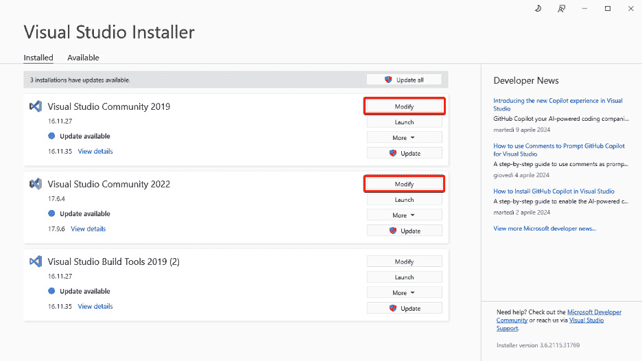
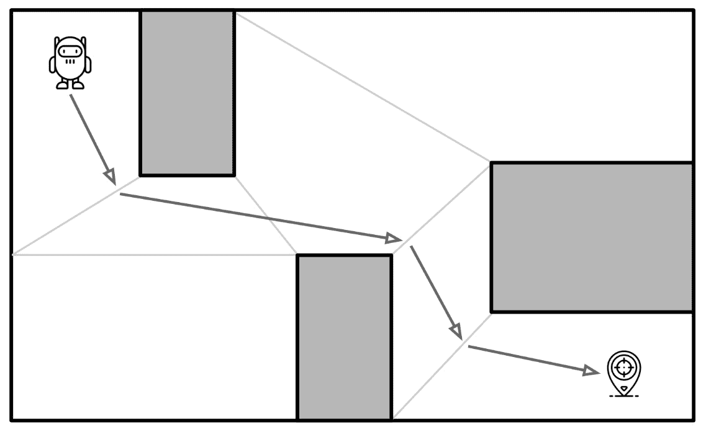
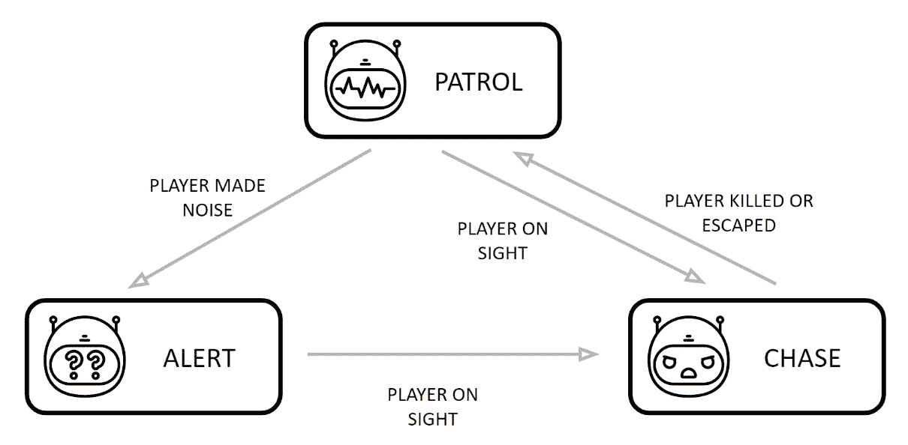
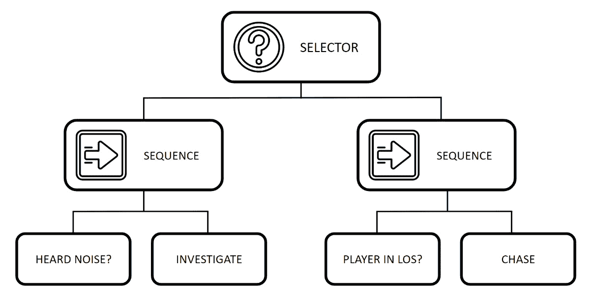

# 第一章：AI 游戏开发入门

欢迎来到虚幻引擎中**人工智能**（**AI**）开发的迷人世界！我非常高兴您选择了我和我的书作为您在这个有时令人畏惧的 AI 编程领域的向导。请放心，我致力于让这次体验尽可能轻松愉快。

在本书中，您将获得创建涉及 AI 技术使用的虚幻引擎游戏所需的所有技能，并学习如何在运行时处理它们。我们将从基础知识开始，例如在游戏关卡内移动代理，并逐步过渡到更高级的主题，例如创建复杂的行为和管理多个 AI 实体（甚至数十个或数百个）。通过这次旅程的结束，您将能够制作出能够挑战玩家的强大对手；更重要的是，您将对 AI 开发的潜在陷阱以及如何避免它们有深刻的理解。

在本章中，我将向您介绍一些关于 AI 开发的常用关键词；这些概念将作为本书的温和引言，为您深入探索虚幻引擎中 AI 编程的迷人世界打下基础。

在本章中，我们将涵盖以下主题：

+   AI 介绍

+   游戏开发中的 AI 理解

+   解释视频游戏中的 AI 技术

# 技术要求

我想您已经知道，**虚幻引擎编辑器**在硬件要求方面可能相当苛刻。然而，您无需感到害怕，因为本书主要关注游戏编程，而不是实时视觉效果。

在本节中，我们将探讨遵循本书所需的硬件和软件要求。此外，我们还将讨论一些对您的旅程有益的先决知识。

## 先决知识

在我们深入游戏开发中 AI 的精彩世界之前，我想善意地提醒您，这本书是为那些已经具备一些使用虚幻引擎知识的人设计的。因此，您必须已经熟悉以下主题：

+   **虚幻引擎**：了解这个软件界面、工具和工作流程的基本知识是必不可少的。

+   **游戏开发基础**：掌握一般的游戏开发原则和术语将极大地帮助您理解本书中讨论的概念。

+   **编程知识**：由于本书侧重于游戏开发，我们假设您有一些编程经验。理想情况下，您至少应该熟悉虚幻引擎的可视化脚本系统（**蓝图**），并在一定程度上熟悉 C++。

注意

如果你刚开始接触虚幻引擎，我强烈建议探索一些入门书籍或资源，以便熟悉其基础知识。一个惊人的起点是*《虚幻引擎 5 蓝图视觉脚本编程》*，由*Marcos Romero*，*Packt Publishing*编写，它将指导你了解使用蓝图在虚幻引擎中进行编程的主要功能。

在这本书中，只要可能，我会通过使用蓝图和 C++两种技术来展示技术。如果你需要 C++的温和介绍，你将在本书末尾找到一个宝贵的附录，该附录深入探讨了在虚幻引擎环境中 C++编程的复杂性。这个快速指南也旨在帮助你了解 C++在虚幻引擎框架中是如何工作的。

## 硬件要求

在撰写本书时，Epic Games 官方推荐以下基本要求。如果你的硬件至少满足这些规格，你可以在阅读章节时获得愉快的体验：

+   **Windows 操作系统**：

    +   **操作系统**：Windows 10 或 11 64 位版本

    +   **处理器**：四核 Intel 或 AMD，2.5 GHz 或更快

    +   **内存**：8 GB RAM

    +   **显卡**：DirectX 11-或 12 兼容的显卡

+   **Linux**：

    +   **操作系统**：Ubuntu 22.04

    +   **处理器**：四核 Intel 或 AMD，2.5 GHz 或更快

    +   **内存**：32 GB RAM

    +   **显卡**：配备最新 NVIDIA 二进制驱动程序的 NVIDIA GeForce 960 GTX 或更高版本

    +   **视频内存**：8 GB 或更多

+   **macOS**：

    +   **操作系统**：最新的 macOS Ventura

    +   **处理器**：四核 Intel，2.5 GHz

    +   **内存**：8 GB RAM

    +   **显卡**：兼容 Metal 1.2 的显卡

我使用以下硬件编写了这本书：

+   **台式机**：

    +   **操作系统**：Windows 10 64 位版本

    +   **处理器**：Intel Core i9 9900K

    +   **内存**：64 GB RAM

    +   **显卡**：NVIDIA GeForce RTX 3090ti

+   **笔记本电脑**：

    +   **操作系统**：Windows 11 64 位版本

    +   **处理器**：Intel Core i7 13650HX

    +   **内存**：8 GB RAM

    +   **显卡**：NVIDIA GeForce RTX 4060

## 软件要求

本书假设你已经安装并完全在计算机上运行了**Epic Games Launcher**和**虚幻引擎 5**。

注意

在撰写本书时，虚幻引擎的最新版本是 5.4，但你将能够跟随任何比 5.4 更新的版本。

此外，由于我们还将使用 C++，你需要一个支持此语言和虚幻引擎的 IDE。如果你已经有了一些经验，那么你很可能已经安装了 Visual Studio 2019/2022 或 JetBrains Rider；如果没有，你需要安装其中之一来跟随 C++编码部分。

### 设置 Visual Studio 以进行 C++虚幻引擎开发

一旦安装了 Visual Studio，你还需要以下额外组件才能使其与虚幻引擎正常工作：

+   **C++** **性能分析工具**

+   **C++ AddressSanitizer**

+   **Windows 10 SDK**

+   **虚幻引擎安装程序**

要包含这些工具，请按照以下步骤操作：

1.  打开 **Visual Studio 安装程序**。

1.  从你的 Visual Studio 安装中选择 **修改**，选择你将要使用的版本：

图 1.1 – 选择 Visual Studio 安装程序版本

1.  一旦 **修改** 模态窗口打开，在顶部栏中，确保你处于 **工作负载** 部分。

1.  然后，通过点击复选标记激活 **使用 C++ 进行游戏开发** 选项。

1.  接下来，如果它已关闭，请从右侧边栏打开 **安装详情** | **使用 C++ 进行游戏开发** | **可选**。

1.  选择以下字段，如图 *图 1* *.2* 所示：

    +   **C++ 性能分析工具**

    +   可用的最新 **Windows 11 SDK** 版本

    +   **C++ AddressSanitizer**

    +   **IDE 对 Unreal Engine 的支持**（可选）

    +   **Unreal Engine 安装程序**

图 1.2 – 工作负载部分

1.  点击 **下载时安装** 按钮（或 **下载全部，然后安装**）以开始安装过程。

备注

Unreal Engine 的 **IDE 支持** 集成是 Visual Studio 2022 中引入的一个扩展，它为 Unreal Engine 的类、函数和属性添加了一些实用的功能，例如蓝图引用、蓝图资源和 CodeLens 提示。尽管不是强制性的，但我强烈推荐使用它，因为它将使你的开发者生活变得更加轻松！

完成下载和安装过程后，你将完全准备好开始使用 Unreal Engine 开发自己的 C++ 游戏。

现在你已经成功设置了系统，是时候熟悉 AI 环境中的关键术语了。这将为你提供一个坚实的基础，以便更有效地理解和导航 AI 世界。

# 介绍 AI

人工智能已成为各个行业的变革力量；在广义上，人工智能涉及在机器中模拟人类智能，这些机器被编程为像人类一样思考和（有时）学习。

因此，开发 AI 意味着研究使机器能够感知其环境、从数据中学习、推理并做出决策以实现既定目标的方法和软件。

人工智能包括各种子领域和应用，包括以下内容：

+   **机器人技术**：开发能够与物理世界交互的智能机器

+   **自然语言处理**：计算机理解和生成人类语言的能力

+   **机器学习**：使用算法和统计模型使计算机能够从数据中学习并做出预测或决策，而无需明确编程

+   **深度学习**：机器学习的一个分支，利用神经网络来模拟人类大脑中观察到的决策能力

+   **计算机视觉**：计算机理解和解释图像或视频中的视觉信息的能力

更重要的是，AI 在娱乐行业中取得了显著的进步，正在改变内容创作、消费和个性化的方式。以下是关于 AI 对娱乐行业影响的几个关键点：

+   **生成式 AI**：这种技术可以创建故事、剧本和图像等输出，并有可能彻底改变娱乐行业的内容创作。

+   **个性化推荐**：AI 赋能的工具正被用于帮助用户发现符合他们偏好的内容，通过提供个性化的建议。这些推荐基于用户行为、观看历史和其他数据，从而提升用户体验。

+   **数据驱动洞察**：通过分析用户行为，AI 使娱乐行业能够从诸如偏好和趋势等数据中获得宝贵的见解，并有助于公司更好地了解他们的受众，并在内容制作、分发和营销方面做出基于数据的决策。

然而，正如古老的谚语所说，“*权力越大，责任越大*。”AI 的采用带来了许多挑战和考虑。关于 AI 生成内容的知识产权和版权问题的讨论已经发生，并且仍在继续。此外，人们对 AI 对各个行业就业的影响越来越担忧，因为某些角色可能会因 AI 技术的进步而面临中断或转变。

利用 AI 的伦理是一个重要的主题，它深入探讨了与这些系统利用相关的道德考虑和影响。随着 AI 技术以越来越快的速度发展，它对社会、个人和环境的影响引发了深刻的伦理担忧。

虽然不可否认 AI 有潜力提高效率和生产力，但它也可能导致特定行业的就业岗位减少；因此，有些人认为实施减轻对工人和社会不利影响的措施是强制性的。

您刚刚接触到了一些关于人工智能（AI）的常见术语。现在，让我们将焦点转向理解人工智能在游戏开发领域的具体应用。在接下来的这一节中，我们将深入探讨其基础，为您提供对其原则和运作方式的基本理解。

# 理解游戏开发中的 AI

当应用于游戏开发时，AI 被用于创建能够执行任务而无需明确编程的智能系统。这些系统根据经验进行适应和改进其性能，从而提升整体的游戏体验。例如，游戏角色已经使用了多年的 AI，使它们能够表现出看似智能的行为。甚至四个标志性的吃豆人鬼魂也被编程为具有独特和不同的行为！

在游戏开发中，人工智能的应用远远超出了对**非玩家角色**（**NPC**）或敌人的控制。它包括一系列多样化的应用，这些应用正在革新游戏设计、开发和玩家体验。通过利用人工智能，游戏开发者可以引入创新和沉浸式的游戏元素，使玩家在游戏过程中着迷。

如果你选择了这本书，那么你很可能渴望掌握游戏人工智能编程的基本原理，并将这些知识应用到创造你的下一个大作中。作为一名人工智能程序员，你将拥有创造令人惊叹的对手、创建帮助玩家实现目标的 NPC，或者仅仅发明新的和吸引人的行为，使你的游戏达到前所未有的愉悦程度；这将是一项极具回报的挑战！

然而，重要的是要注意，人工智能视频游戏编程可能带来重大挑战，需要长时间工作，并可能导致压力。在开始这条职业道路之前，意识到这些潜在陷阱至关重要。为了避免这样的挫折，必须对人工智能的工作方式有一个坚实的理解，使玩家能够享受到无缝和愉快的游戏体验。更重要的是，理解这个主题还涉及解决可能出现的计算机问题并有效地解决它们。请放心，这些问题迟早会浮出水面！

在接下来的部分，你将得到对游戏中使用的主要人工智能技术的温和介绍，以及使它们与众不同的独特特征。

# 解释视频游戏中的 AI 技术

人工智能在提升游戏体验方面发挥着关键作用，使游戏更加沉浸和刺激。因此，对人工智能发展背后的基本原理及其工作方式有一个全面的理解至关重要。这种知识将赋予游戏开发者有效利用人工智能潜力的能力，创造出丰富和吸引人的游戏玩法，使玩家保持参与和着迷。

想想《刺客信条》系列，它以其开放世界的游戏玩法而闻名，其中使用了复杂的 AI 行为来控制 NPC。在更高级的水平上，像《反恐精英》这样的游戏引入了由 AI 控制的玩家角色——称为**机器人**（bots）——可以创建和管理来代替真实玩家。

最后，人工智能在游戏开发中的未来充满了令人兴奋的可能性和创新，因为人工智能正在被用来创造动态和自适应的游戏叙事。通过观察玩家的行为和偏好，人工智能算法可以构建独特的叙事分支、挑战和奖励，这些内容将针对每个玩家量身定制。

在本节中，我将简要概述在游戏中常用的一些 AI 技术。在本书中，你将有机会探索这些技术，并了解它们在 Unreal Engine 中的应用。对于那些本书中不会涉及的技术，你将有很多机会自己探索和深入研究。游戏中的 AI 世界广阔且不断演变，为实验和创新提供了无限的可能性。所以，如果这里没有涵盖某个特定技术，请不要气馁 – 探索之旅仍在继续，有无数资源可以帮助你开启 AI 游戏开发的全新视野。

## 寻路

**寻路**对于游戏环境中的高效导航至关重要，它指的是在模拟从一个点到另一个点的移动过程中确定最佳路径的过程。它可以由自主代理，如 NPC 或对手使用，但在点选游戏中也很有用，其中你的角色需要到达特定位置。寻路涉及在避开障碍物的同时找到从一个位置到另一个位置的最佳路径；在这些情况下，通常使用 `A` 算法等算法。NPC 可以使用这种技术来规划他们的移动，无论是为了避免敌方单位、找到捷径还是跟随航点。

在游戏开发中最常见的寻路技术是通过使用 **导航网格** – 或 **nav mesh**，这是一种表示关卡可通行表面的数据结构。*图 1.3* 展示了 AI 在 nav mesh 中的移动示例：

图 1.3 – AI 在导航网格中的移动

## 基于规则

**基于规则的系统**指的是一种基于一组预定义规则运作的 AI。这些规则由人类编写，并决定了系统的行为和决策；这意味着根据某种输入遵循规则以产生预定的结果。简单来说，这些规则通常被称为 *if 语句*，因为它们通常遵循 *如果某事为真，则执行另一件事* 的结构。尽管有限，但这些系统相对容易实现和管理，因为规则中编码的知识是模块化的，规则可以按任何顺序编写。这为编码和修改系统提供了很大的灵活性。

## 有限状态机

**有限状态机**（**FSM**）是 AI 开发中常用的一种技术，它涉及将对手或 NPC 的行为分解为不同的状态，其中每个状态代表特定的行为或动作。当满足某些条件或事件时，状态之间的转换被触发。例如，哨兵角色可能具有巡逻、警报或追逐等状态，当角色发出噪音或被发现时（因为他们处于视线范围内），就会发生转换。FSMs 提供了一种清晰和有序的方式来控制 NPC 的行为，尤其是在具有预定义动作序列的游戏中。

*图 1.4*展示了简单有限状态机（FSM）的示例，包括状态和条件：

图 1.4 – 有限状态机

## 行为树

**行为树**是用于控制 AI 行为的分层结构。它由代表特定动作或条件的节点组成。树结构允许根据条件本身进行动作排序和决策。系统将从根节点遍历到叶节点，在途中执行动作或评估条件。行为树提供了一种灵活和模块化的 NPC 行为方法，允许进行复杂和动态的决策。行为树可以包括选择器、序列、条件或动作节点。*图 1.5*展示了行为树，其中选择器决定将执行树的哪个部分，序列节点将按照预定义的顺序执行一系列任务。

图 1.5 – 行为树

如果你对这些术语不熟悉，不要担心！我将在*第七章*，“介绍行为树”中解释它们。

## 机器学习 AI

**机器学习**涉及使用数据和算法训练 AI 模型，以使 NPC 能够随着时间的推移学习和改进其行为。这种技术允许 NPC 根据之前游戏中的模式和经验来适应、做出决策和应对不可预测的情况。机器学习可以为 NPC 提供更动态、更真实和更有吸引力的交互，因为他们的行为通过迭代和学习玩家的行为而演变。

一个使用机器学习的游戏示例是 DeepMind 开发的*AlphaGo*（[`deepmind.google/technologies/alphago/`](https://deepmind.google/technologies/alphago/)），它通过使用机器学习技术计算概率并在游戏中做出战略决策，掌握了古老的中文游戏*围棋*。

## 强化学习

**强化学习**是一种机器学习系统，其中 NPC 通过试错来学习，根据其行为获得反馈或奖励。NPC 探索游戏环境，采取行动，并从后果中学习。强化学习使 NPC 通过最大化奖励和最小化惩罚来优化其行为。这种技术可以使 NPC 表现出适应性和战略性的决策，增强游戏的挑战性和沉浸感。强化学习通常在开发过程中使用，以便在游戏发布时创建一个功能性的系统。由于强化学习的性质，有时结果可能不符合预期，NPC 可能会表现出奇怪或古怪的行为。

## 生成式 AI

如前所述，生成式 AI 正在越来越多地应用于游戏开发中，提供了新的可能性，并正在改变游戏开发的各个方面。其中一些方面包括创建更真实的 NPC，其行为超越了固定模式，以及使决策系统对玩家更具适应性和吸引力。

尽管生成式 AI 在游戏开发中仍处于初期阶段，其全部潜力仍有待挖掘，但它已经显示出在改变游戏行业各个方面的有希望的能力。

# 摘要

在本章中，我们探讨了 AI 发展的基本原理，并看到了它在游戏行业中的应用。在下一章中，我将向您介绍虚幻引擎提供的令人难以置信的潜力以及如何利用其框架在游戏中创建智能和沉浸式的 AI。准备好进行一次激动人心的探索，让我们带着您最喜欢的游戏引擎一起深入 AI 游戏编程的迷人领域！

# 致谢

本章中的示例是在 Flaticon 的*Basic Miscellany Lineal*图标（[`www.flaticon.com/`](https://www.flaticon.com/)）的帮助下创建的。
