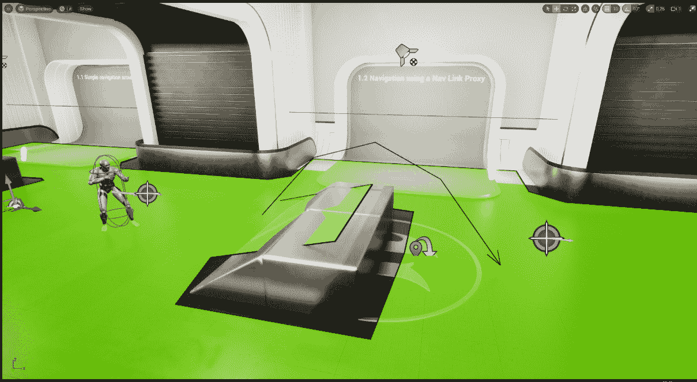
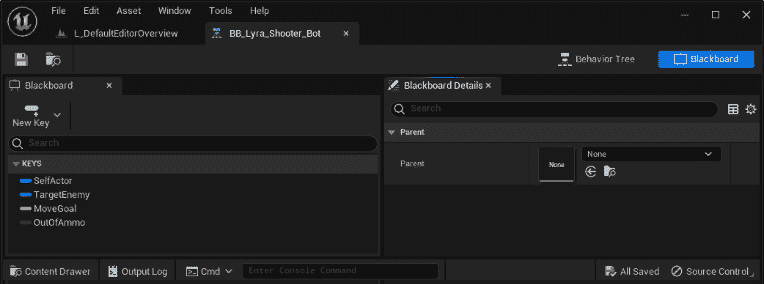
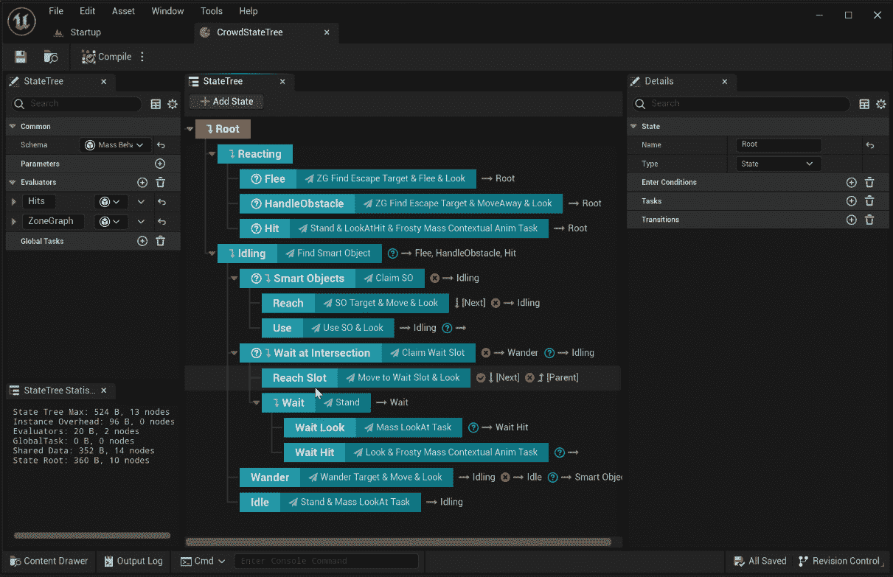
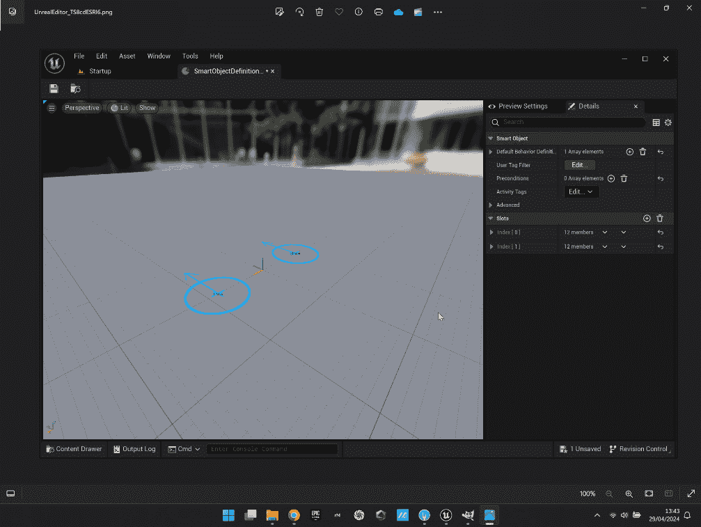
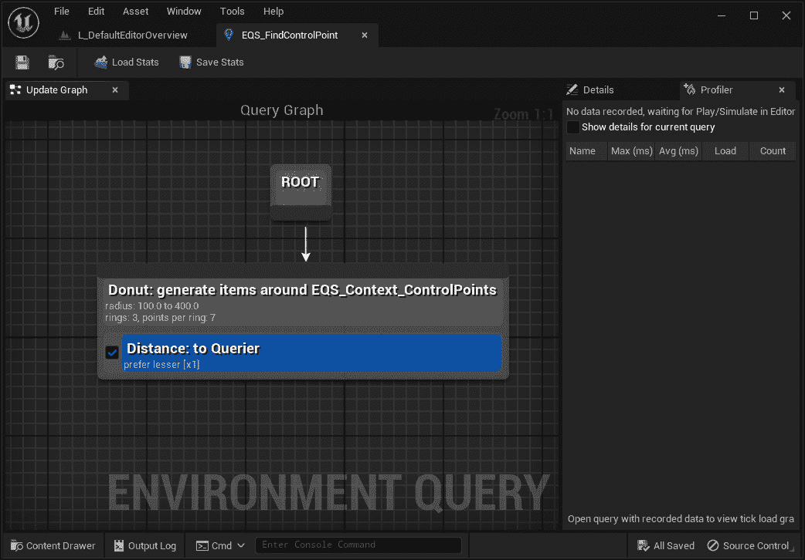
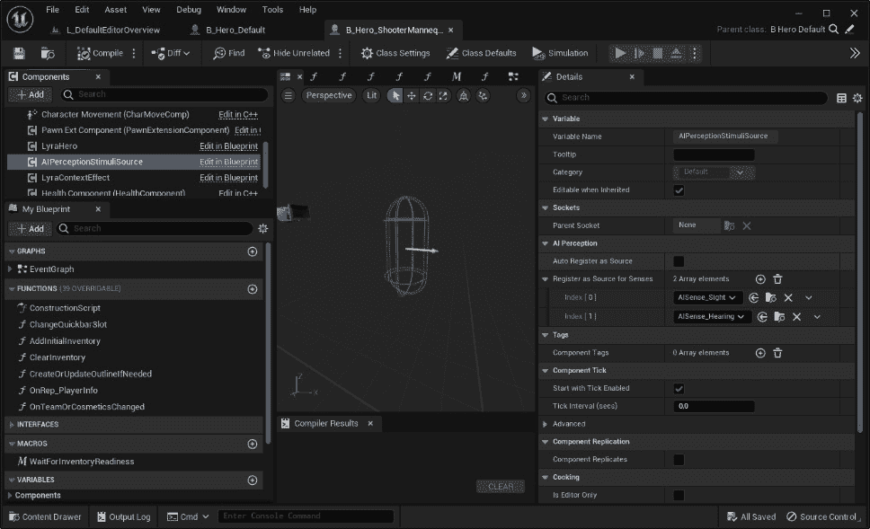
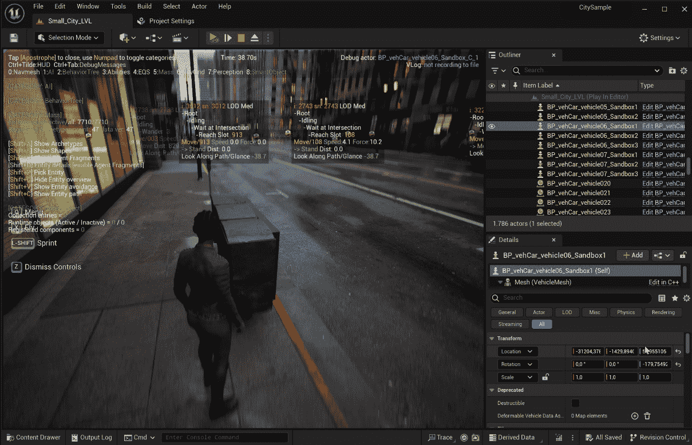

# 第二章：介绍虚幻引擎 AI 系统

欢迎来到使用虚幻引擎进行 AI 编程的激动人心的世界！在本章中，我将向您介绍虚幻引擎的强大工具，这些工具将为您的虚拟世界带来生命和智能。通过探索虚幻引擎 AI 系统的各个方面，例如使用**导航系统**移动代理、通过**行为树**和**黑板**实现半智能行为，以及整合智能对象和**大量实体**等功能，您将全面了解这个强大框架提供的卓越能力。

掌握这些技能将使你跻身精英游戏程序员的行列——谁不想成为其中的一员呢？

到本章结束时，你将清晰地了解使用虚幻引擎 AI 系统可以完成什么，这将赋予你在项目中创建高级 AI 角色的能力。

在本章中，我们将涵盖以下主题：

+   了解虚幻引擎游戏框架

+   展示虚幻引擎 AI 系统

+   理解高级 AI 功能

# 技术要求

本章没有技术要求需要遵循。

# 了解虚幻引擎游戏框架

如您可能已经知道，虚幻引擎提供了一个现成的系统，称为**游戏框架**（**GF**），它包含了许多开发游戏所需的功能；这包括从拥有先进的输入系统到常见的入口点，这些入口点将允许您轻松访问数据或游戏状态。

以下是一些关键点，解释为什么 GF 如此重要：

+   **结构和组织**：GF 提供了一种结构化和组织化的游戏开发方法。它提供了一套系统、类和接口，它们协同工作以创建游戏的核心结构。

+   **游戏逻辑和进度**：该框架包含预定义的概念，有助于定义游戏的逻辑、进度和组织结构。

+   **玩家和 AI 控制**：GF 包括处理玩家输入和游戏世界中角色决策的系统。这包括玩家和 AI 控制，这对于创建交互性和沉浸式游戏体验至关重要。

+   **实用函数**：该框架提供了一组实用函数库，这些函数有助于处理常见的游戏操作和交互。这些函数可以简化游戏逻辑，并提高实现各种功能的效率。

+   **灵活性和集成**：GF 非常灵活，与虚幻引擎深度集成。它使用常见的游戏编程模式，并执行大量工作，使开发者能够专注于构建游戏，而不是创建自己的游戏框架。

作为个人反思，我发现多年来使用和理解 GF 显著提高了我对游戏编程最佳实践的总体理解。

显然，管理 AI 系统也是 GF 工作的一部分，因此，在接下来的小节中，我将为您提供一个关于 GF 中可用的关键 AI 功能的简要介绍，使您能够为使用它们做好准备。

## 演员（Actors）和组件（components）

我很确定您已经熟悉 Unreal Engine 中的**演员**和**组件**，但以防万一，让我们对这两个概念进行快速复习。

在 Unreal Engine 中，**Actor**类指的是可以放置在关卡中的任何实体，无论是摄像机、静态网格还是玩家的角色。演员可以经历变换，如平移、旋转和缩放。

演员充当着称为**组件**的专用类的容器，这些组件在控制移动、渲染等方面发挥着各种作用。在演员内部有三种类型的组件，它们各自发挥着不同的作用：

+   **演员组件**（Actor components）: 这些主要包含演员的代码逻辑。它们处理各种功能和交互，但没有任何视觉表示。

+   **场景组件**（Scene components）: 这些用于在演员内定位和定位其他组件。它们作为变换（如平移、旋转和缩放）的参考点，但没有任何可见的存在，主要用于组织目的。

+   **原始组件**（Primitive components）: 这些负责在关卡内表示演员的视觉表现。它们可以被玩家或其他对象渲染和交互。

通过组合这些组件，游戏开发者可以创建具有功能和视觉方面的复杂和交互式演员。

## 主要 GF 元素（Main GF elements）

Unreal Engine 的 GF 是一个综合性的类集合，它作为构建游戏体验的模块化基础。在这个框架中，游戏开发者可以自由选择最适合游戏的特定元素，同时确保这些类被精心设计，可以无缝协作并相互增强。

在接下来的小节中，我们将介绍涉及的主要元素，以便您对事物的工作原理有一个清晰的了解。

### 游戏实例（GameInstance）

**GameInstance**类充当后台操作的管理器（即，它不是一个 Unreal Engine 演员）；当引擎启动时创建一个实例，并且实例在引擎关闭前保持活动状态。其主要目的是跟踪数据和按需执行代码。

游戏实例提供了一个方便的中心枢纽，用于管理持久数据，例如保存游戏系统，并作为其他子系统的管理器，提供对游戏流程的便捷控制。

### 游戏模式（GameMode）

与 **GameInstance** 类不同，**GameModeBase** 或其直接后代 **GameMode** 实例仅在单个关卡中存在，并在关卡本身加载和世界构建后立即创建。这个类作为管理器来处理游戏会话，每个关卡都可以有自己的不同游戏模式逻辑。其主要作用是创建剩余的框架角色。

### GameState 和 PlayerState

**GameState** 和 **PlayerState** 是专门的角色，在跟踪游戏状态和参与玩家的状态中扮演着关键角色。游戏状态负责存储和处理游戏中所有玩家相关的数据，而玩家状态则专注于特定玩家。鉴于它们固有的特性，这些类在多人游戏中找到其主要应用，无论这些游戏是在线上还是本地进行。

### 物品和角色

**pawn** 指的是所有可以在游戏世界中由玩家或 AI 实体控制的角色的基类。它作为实体的物理表示，处理其实体在游戏世界中的参与，包括碰撞和其他物理交互。它还通常用于确定实体的视觉外观。

**Pawn** 类通过更高级的 **Character** 类获得了额外的功能。角色类专门设计用来以垂直方式表示玩家，使他们能够在关卡内执行广泛的动作，如行走、奔跑、跳跃和游泳。顺便提一下，角色类还包含了用于多人处理的基本功能。

### 控制器

**Controller** 类负责管理决定玩家在游戏世界中行为的逻辑。两种广泛使用的控制器类是 **PlayerController** 和 **AIController**；第二个选项是我们热切期待的，原因很明显。

玩家控制器类作为一个管理实体，能够处理来自人类玩家的输入，使他们能够与游戏环境互动，并促进他们的整体游戏体验。另一方面，AI 控制器通过使用行为树、状态树、导航等来管理 AI 实体的行为。

玩家控制器和 AI 控制器类可以在运行时通过拥有角色或 pawn 来管理它们。

## GameplayStatics

Unreal Engine 提供了一个非常有用的函数库，称为 **GameplayStatics**，它为游戏相关的任务提供了各种实用函数。这些函数可以用于在引擎内执行常见的游戏操作和交互。

这些函数的一些例子包括生成和销毁演员、检索有关游戏世界的信息、管理游戏标签、操作游戏实例等。这些函数可以从蓝图可视化脚本和 C++编程中访问和使用，可以简化游戏逻辑，并在运行时作为管理和操作游戏元素的有价值工具。

现在我已经分享了一些虚幻引擎 GF 知识，准备好进入本书中最精彩的部分（至少在这个书的背景下）：AI 如何深入引擎的复杂运作，为你提供踏上创造自己游戏逻辑的奇妙旅程的知识！

# 展示虚幻引擎 AI 系统

考虑到您可利用的先前描述框架的强大功能，虚幻引擎提供全面且强大的 AI 系统可能不会令人惊讶。

在本节中，我们将展示可用于虚幻引擎 AI 程序员的工具全面系列，以及它们主要功能的简要描述。首先，让我们检查导航系统及其功能。

## 导航系统

虚幻引擎**导航系统**允许 AI 实体，称为**代理**，通过路径查找算法在关卡中移动。

导航系统将通过使用碰撞来从关卡中现有的几何形状创建一个**导航网格**。这个网格随后被分割成瓦片，这些瓦片进一步被分割成多边形，从而形成一个图。系统内的代理使用这个图来导航到它们的目标地点。多边形有一个指定的成本，这有助于代理根据最低的总成本确定最优化路径。此外，导航系统包括一系列可调整的组件和设置，可以修改导航网格生成过程。这些修改可能包括对多边形成本的调整，影响关卡内代理的导航行为。最后，系统允许连接导航网格中的非连续区域，例如平台和桥梁，从而在这些空间元素之间实现无缝导航。*图 2.1* *.1* 展示了在 Epic Games Launcher 上免费提供的**内容示例**项目中的一个关卡；绿色区域是导航网格，左侧的角色是 AI 代理。

图 2.1 – 导航系统

本书*第二部分*将致力于理解虚幻引擎导航系统以及如何对其进行优化和调试。

## 行为树

在 Unreal Engine 中，行为树是创建游戏中 NPC AI 的有价值工具。行为树资产的主要功能是执行包含逻辑指令的分支。在 Unreal Engine 中，行为树以与蓝图非常相似的方式创建——这意味着您将使用某种类型的可视化脚本方法——在这里，将具有特定功能附加的节点序列添加并连接起来，形成一个行为树图。

*图 2.2*描绘了来自 Epic Games Launcher 上可用的**Lyra 入门游戏**项目的一部分行为树：

图 2.2 – 行为树示例

为了确定哪些分支应该执行，行为树依赖于另一个称为黑板的资产，它作为行为树本身的*大脑*。*图 2.3*显示了与之前行为树相对应的黑板：

图 2.3 – 黑板示例

行为树和黑板在 AI 游戏编程中非常重要；这就是为什么我将本书的*第三部分*专门用于这个主题。

## 质量实体

**质量实体**系统是一个以游戏玩法为中心的计算框架，为游戏中的行为元素提供了一种范式；它旨在处理大量**实体**并便于对骨骼和静态网格进行行为控制。

*图 2.4* 显示了来自**城市样本**项目（可在 Epic Games Launcher 上获取）的屏幕截图，该项目利用质量实体进行人群和交通控制：

图 2.4 – 质量实体应用

注意

在撰写本书时，质量实体仍被标记为实验性；因此，应谨慎使用，因为随着时间的推移，事物可能会出现故障或发生变化。

本书*第四部分*将介绍质量实体。

## 状态树

**状态树**是一种多功能的分层状态机，它将行为树的一些功能与状态机的一些功能相结合。使用这个系统（以树状结构组织）开发者将能够创建高度可执行的逻辑，同时保持结构化和适应性。*图 2.5*显示了上述**城市****样本**项目中的状态树：

图 2.5 – 状态树示例

我将在本书的*第四部分*中向您展示状态树是如何工作的。

## 智能对象

在 Unreal Engine 中，**智能对象**代表可以在级别中通过预留系统使用的一组活动，该系统确保一次只有一个 AI 代理可以使用智能对象，防止其他代理使用它，直到它再次可用。这些对象放置在级别上，可以被 AI 代理和玩家交互。智能对象包含进行这些交互所需的所有信息，并且可以在运行时使用专用过滤器查询。*图 2.6*显示了来自**City Sample**项目的智能对象资产：

图 2.6 – 智能对象示例

智能对象将在本书的*第四部分*中介绍。

## 环境查询系统

**环境查询系统**（**EQS**）从环境中收集数据，使 AI 能够通过各种测试来查询数据。这个过程导致选择一个与提出的问题最匹配的项目。

查询可以从行为树中调用，并用于根据执行测试的结果做出如何继续的决定。*图 2.7*展示了来自**Lyra Starter Game**项目的环境查询。

图 2.7 – 环境查询示例

注意

在撰写本书时，EQS 仍被标记为实验性，因此您应谨慎使用，因为随着开发进程的进行，事物可能会出错或改变。

我将在本书*第四部分*的末尾向您介绍 EQS，就在您对行为树的工作原理有了扎实理解之后。

## AI 感知系统

**AI 感知系统**为 pawns 提供了从环境中接收数据的另一种方式，例如声音从哪里传来或 AI 是否看到了什么。它通过为 AI 提供感官数据来允许 AI 产生意识。该系统允许数据源创建刺激，以便数据监听器可以定期更新它们。该系统用于在游戏中启用 AI 感知，并可以响应一系列可定制的传感器。

*图 2.8*显示了一个带有刺激源组件的**Lyra Starter Game**中的角色：

图 2.8 – AI 感知示例

本书*第四部分*将介绍 AI 感知，以及行为树，使您的 AI 角色能够意识到其周围的环境。

## AI 调试

没有一个严肃的框架会没有调试系统。**调试**是软件开发的一个基本方面，允许开发者识别和修复其代码中的错误或缺陷。它在确保框架的可靠性和功能方面发挥着关键作用。

正因如此，虚幻引擎提供了一套完整的工具和功能，以帮助开发者调试 AI，包括可视化调试工具、行为树可视化以及 AI 模拟模式。这些工具允许开发者实时检查和修改 AI 行为，识别诸如路径查找错误或决策异常等问题，并在游戏环境中对 AI 性能进行必要的调整。

*图 2.9* 显示了启用 AI 调试工具时的**城市样本**项目操作：

图 2.9 – 在关卡中启用的调试工具

在整本书中，我将展示根据你将使用的工具，调试游戏的不同技术。这些技术将赋予你高效追踪和解决游戏代码逻辑中错误、bug 和其他问题的能力。

在本节中，我向您展示了虚幻引擎 GF 中可用的主要 AI 功能；在下一节中，我将介绍一些在引擎中实现的新技术，这些技术涉及**机器学习**（**ML**）系统。

# 理解高级 AI 功能

现在你已经对虚幻引擎中可用的主要 AI 功能有了基本的了解，我想向你介绍一些最实验性和在一定程度上与游戏玩法无关的功能。

注意

请记住，这些功能目前仍处于实验或 beta 版本，因此需要谨慎处理。

## 学习代理

**学习代理**是一个专门设计的实验性插件，旨在使你能够使用机器学习训练 AI 角色。此插件提供了一个独特的机会，可以增强或甚至取代传统的游戏 AI 系统，如行为树或状态机。通过学习代理，你可以利用强化学习和模仿学习的方法来创建智能和自适应的 AI 角色。

此插件的主要目标是提供一套强大的解决方案，用于在虚幻引擎中实现角色决策。然而，其潜在应用范围远超游戏开发。例如，学习代理可以通过创建执行特定动作和场景的 AI 角色来自动化测试流程。这有助于识别潜在问题并确保游戏的健壮性。

尽管仍在开发中，这个插件已经相当令人印象深刻，随着时间的推移，你应当期待更多改进。

## 神经网络引擎

**神经网络引擎**（**NNE**）插件为开发者提供了一个 API，允许统一访问不同的神经网络推理引擎。这使得程序员可以根据需要无缝地在推理运行时之间切换，优化他们的用例并有效地针对特定平台。

如果你熟悉虚幻引擎的**渲染硬件接口**（**RHI**），你可以将 NNE 视为类似；它是一个主要目的是从不同的推理运行时抽象出来的工具。

## ML Deformer

**ML Deformer** 是一个插件，它提供了一个 API 来访问不同的 ML 推理运行时实现，允许开发者近似复杂的变形模型并提高角色网格变形的质量。

ML Deformer 专门设计用于在实时游戏引擎中为角色创建精确的非线性变形系统。它利用一些内部虚幻引擎工具在 GPU 上执行计算，优化性能。一个名为**ML Sample Project**的示例项目可在虚幻引擎市场上找到，其结果相当惊人；*图 2.10*展示了我的同事 Giovanni Visai 从上述示例项目开始的照明测试：

图 2.10 – ML Deformer 插件在行动中

## ML 布料模拟

**ML 布料模拟**系统为开发者提供了一个高保真和高性能的实时布料模拟解决方案。该系统在产生与预模拟数据相当质量的服装网格的同时，保持快速高效的性能，并使用最少的内存。

总之，将 ML 功能集成到虚幻引擎中为开发者打开了无限可能。通过利用这些技术，开发者将能够在他们的项目中创建更沉浸式、智能和动态的体验。

# 摘要

在本章中，我向你介绍了虚幻引擎 GF 中可用的关键功能。之后，我概述了主要的 AI 系统，从导航系统开始，逐步到行为树。此外，我还讨论了更高级的系统，如 Mass Entity 和状态树。最后，我向你介绍了实验性功能，如学习代理和 NNE 插件。

恭喜！你已经到达了本书*第一部分*的结尾。在接下来的章节中，准备好深入探索导航系统以及如何创建基本的 AI 角色，它们将在这个系统中导航。所以，卷起袖子，让我们开始创造一些惊人的东西吧！

# 第二部分：理解导航系统

在本书的第二部分，你将深入了解虚幻引擎导航系统的基本功能。从那里，你将创建自己的项目并学习如何实现一个由 AI 代理可导航的完整工作环境。

本部分包括以下章节：

+   *第三章* ，*展示虚幻引擎导航系统*

+   *第四章* ，*设置导航网格*

+   *第五章* ，*改进代理导航*

+   *第六章* ，*优化导航系统*
