# 第三章：展示虚幻引擎导航系统

虚幻引擎**导航系统**是一个复杂的框架，它使受人工智能控制的实体能够在游戏关卡中无缝导航和交互。它提供了一套工具和算法，允许游戏开发者定义和创建路径、障碍物和移动行为。通过使用导航系统，您将能够模拟受人工智能控制的实体的真实移动和行为模式，增强虚拟环境的沉浸感和可信度。由于该系统集成了诸如**路径查找算法**、**碰撞避免**和**动态障碍物处理**等高级功能，因此理解其全部潜力对于有抱负的人工智能程序员来说是一项关键技能。

到你读完本章的时候，你将深刻理解这个特定部分的游戏框架是如何运作的。有了这些知识，你将完全准备好开始与系统本身进行积极的工作。

在本章中，我们将涵盖以下主题：

+   介绍人工智能移动

+   理解路径查找

+   使用项目模板测试导航系统

# 技术要求

本章没有技术要求需要遵循。

# 介绍人工智能移动

当涉及到在虚拟环境中移动人工智能实体时，我们面临着众多挑战，并且没有通用的解决方案。解决每个问题的方法取决于将要面对的每种独特特征，这取决于正在开发的游戏类型。例如，人工智能的目标是一个静止的物体——比如一个拾取物——还是它是一个不可预测移动的物体，比如玩家角色？此外，人工智能是否只需要在没有特定目的地的情况下四处游荡，或者它是否有一个预定义的模式——比如作为巡逻哨兵？

此外，作为一名开发者，你还需要考虑不同的地形、障碍物和危险区域等因素。在更容易和更危险——但更快捷——的路径之间做出选择，在运行时可能会产生重大影响。这些只是涉及在关卡内移动人工智能所涉及的一些考虑因素，随着你遇到不同的场景，你可能会面临不同的问题。理解和正确处理所有相关变量对于提供最佳玩家体验至关重要。

那么，在人工智能运动中，特别是路径查找中，涉及的主要实体有哪些？它们如何合作以使玩家的体验完美无瑕？我将在几秒钟内告诉你所有关于它的事情！

## 理解导航网格

在虚幻引擎中，导航系统基于**导航网格**——或**nav mesh**——通过将可导航空间划分为多边形来实现，这些多边形随后被划分为三角形以提高效率。每个三角形随后被视为到达特定位置的图的一个节点，当两个三角形相邻时，它们的相应节点相连。*图 3* *.1* 描述了一个带有上述网格的游戏关卡，该网格由三角形划分：

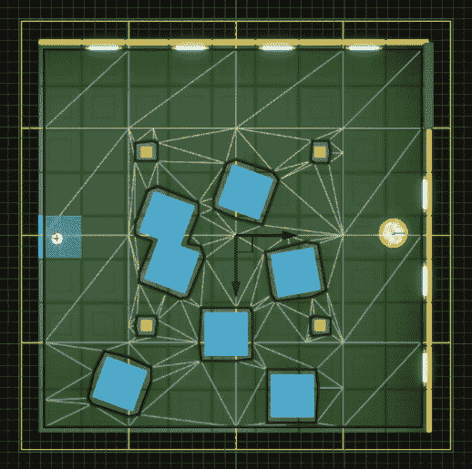

图 3.1 – 导航网格示例

使用此图表，您可以应用任何类型的路径查找算法——例如**A 星**（**A***），我将在本章后面解释——并且生成的过程将在这些三角形之间生成一条路径，AI 角色可以穿越。

幸运的是，除非您真正需要深入了解修改导航系统核心结构的复杂性，否则没有必要立即深入这种细节。了解生成的三角形集合形成一个连贯的图，该图是路径查找算法的基础，就足以充分利用导航系统。

要在虚幻引擎中生成导航网格，您只需在关卡中添加一个或多个**导航网格边界体积**演员，并更改其大小以适应您的需求。

注意

在虚幻引擎中，**体积**类指的是一种可以影响其作用区域内其他演员行为的特殊演员。体积用于定义各种效果，如照明，并可以修改玩家或其他对象与游戏世界的交互方式。虚幻引擎中常见的体积类型包括触发体积、光子重要性体积、后期处理体积，以及显然的导航网格边界体积。

*图 3* *.2* 展示了一个添加到关卡中的**导航网格边界体积**演员；黄色线条标记了该体积本身。

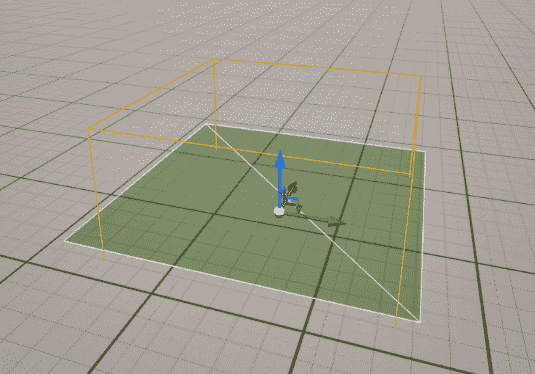

图 3.2 – 导航网格边界体积

此演员相当简单，您唯一可以采取的操作是调整其扩展。从上一张图片中，您可能已经注意到一个由两个三角形组成的绿色网格；这个相当简单的形状是由另一个演员生成的：**Recast Nav Mesh**，通常在第一次将导航网格边界体积添加到关卡时自动生成。

此演员负责生成 AI 实体可使用的可通行区域，它将使用此区域进行自己的高效和准确的路径查找计算；通常，一旦您在关卡中添加导航网格边界体积，就会自动生成其实例。

应该注意的是，大多数可用的**RecastNavMesh**演员设置都可以在您的编辑器**项目设置**中使用预定义值设置——这可以通过**文件**菜单打开——通过选择**引擎 - 导航网格**部分，如图*图 3* *.3* 所示：

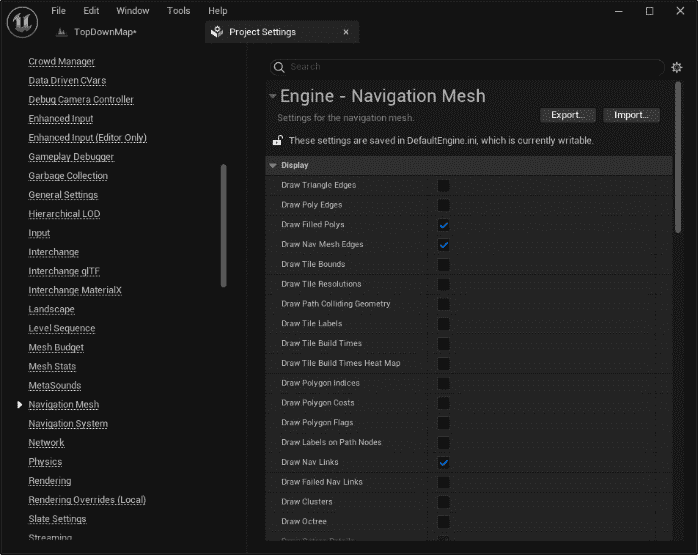

图 3.3 – 导航网格设置部分

现在你已经了解了在虚幻引擎中创建导航网格的方法，重要的是要知道你可以通过使用可用的修改器系统来调整它，以增强其趣味性和现实感。

## 修改导航网格

导航系统由各种演员和组件组成，这些组件会改变导航网格的生成，例如穿越多边形的成本。这些调整会影响 AI 代理在你的级别中的移动方式。

### 导航修改器体积

最简单的一个是**导航修改器体积**演员，其任务是……好吧，就是修改导航网格！一旦你在你的级别中定位了这个体积，你将可以选择如何修改 AI 代理对其路径搜索的感知 – 你可以将其指定为不可通行的地形、困难地形，甚至障碍物。*图 3.4* 显示了设置了三种不同成本设置的三个修改器体积：

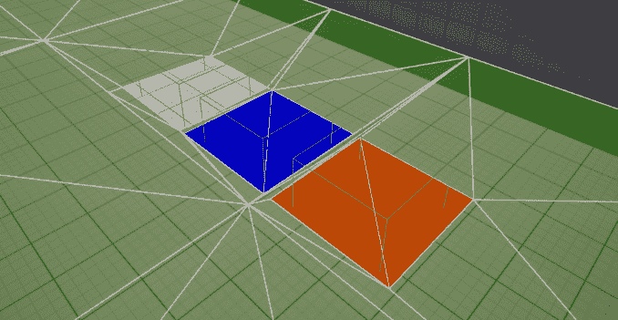

图 3.4 – 三个导航修改器在行动

如果你正在考虑创建自己的导航网格修改器，那么，这是可能的；你只需要扩展**UNavArea**类，设置其参数，然后你就可以出发了！

### 导航查询过滤器

作为调整 AI 代理生成路径时导航系统行为的额外方法，你可以利用**导航查询过滤器**。这种方法包括与一个或多个特定区域相关的信息，并提供覆盖分配给这些区域的成本值的灵活性。通过实现查询过滤器，你将能够根据 AI 代理在游戏世界中穿越各个区域时的导航模式进行定制，这将让你能够微调和优化 AI 实体的移动。 

### 导航链接代理

当你开始设计可通行地形时，你很可能会引入缺口或不同海拔的区域；我想你可能需要你的 AI 角色从一个侧面跳到另一个侧面。这正是导航链接代理被创建的原因；这个演员将连接导航网格中缺少直接导航路径的两个区域。*图 3.5* 显示了这样一个链接，连接了两个不同高度的区域：

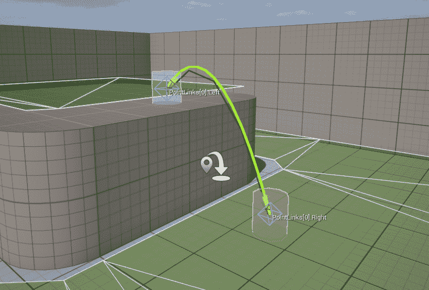

图 3.5 – 导航链接代理

在你的工具箱中有这样一款有用的工具，你将能够让你的角色跳跃、坠落，并执行令人叹为观止的杂技，无缝地从一种违反重力的动作过渡到另一种。

### 运行时导航网格生成

默认情况下，虚幻引擎设置为静态生成导航网格 – 这意味着网格是在离线生成的，无法在运行时更改。然而，如果你需要一个更灵活的生成导航网格的方式，你可以选择**动态网格生成**系统，这将允许你在不同情况下更新网格 – 例如，通过添加移动实体。可以通过打开**项目设置**，然后转到**引擎 - 导航网格**部分，并在**运行时**类别中选择**运行时生成**选项来为整个项目启用运行时生成：

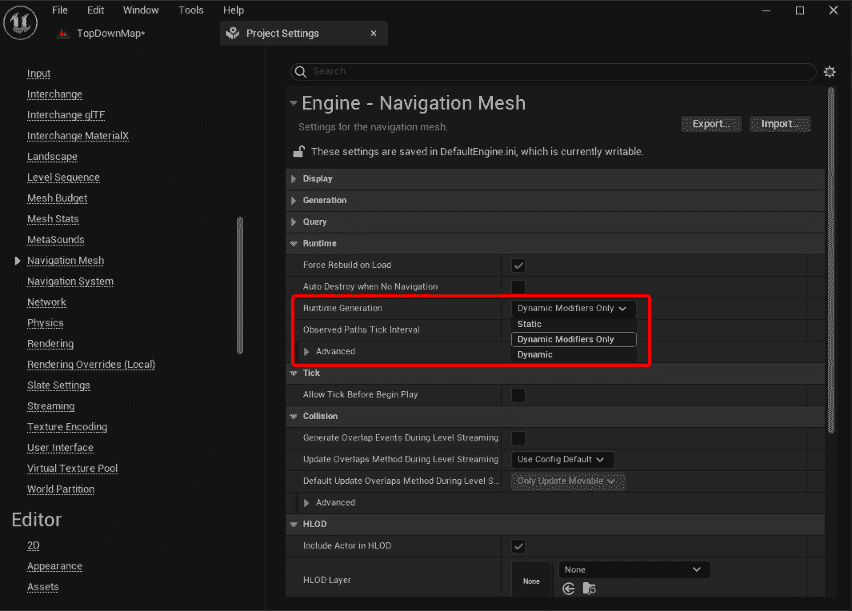

图 3.6 – 启用运行时生成

或者，你也可以只为单个关卡启用它，通过在**Recast Nav** **网格**演员中更改**运行时生成**属性。

### 调用者

**导航调用者**是一个演员组件，它将在运行时为人工智能代理生成导航网格。它用于消除预先计算网格的需求，并允许在游戏世界中动态导航。这个特性在拥有广阔地形 – 例如，一个开放世界 – 需要大量时间来生成导航网格时特别有用；通过调用者，系统将在运行时自行生成网格，但仅限于演员周围的一小片区域。

现在你已经了解了导航网格的创建和调整方法，那么让我们来探索谁或什么会通过它移动。

## 人工智能代理

在虚幻引擎的导航系统中，**代理**是一个能够通过导航网格在游戏世界中导航的人工智能角色或实体。代理将使用导航网格数据来计算路径、避开障碍物，并在环境中智能地移动。一个关卡中的每个代理通常代表一种特定的角色类型，例如玩家角色 – 例如，在一个点击式游戏中 – 敌人 AI，或任何需要在游戏世界中移动的实体。

要在关卡内移动一个代理，你通常会使用**Pawn**或**Character**演员。

将代理移动到位置或演员的最简单方法之一是使用**简单移动到位置**或**简单移动到演员**蓝图节点。

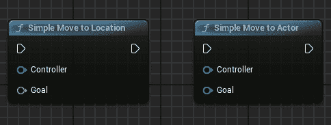

图 3.7 – 简单移动节点

或者，你可以使用相应的 C++ 方法，分别称为**SimpleMoveToLocation()**和**SimpleMovetoActor()**。

显然，在虚幻引擎中，你可以创建比仅仅将代理移动到单个点更复杂的动作；这一点我们将在从*第八章*，“设置行为树”开始时进行探讨。

## 避免碰撞

基本路径查找算法对于寻找绕过静止物体的路线是有效的；然而，当涉及到移动障碍物——如玩家角色或其他 AI 代理——时，需要一个更合适的系统。这就是为什么虚幻引擎提供了两个**避免**系统，以防止移动实体之间的碰撞：

+   **互逆速度障碍**（**RVO**）系统计算每个代理的速度向量，考虑附近的代理，并假设它们在计算的每个时间步中以恒定速度移动。选择的最优速度向量是与代理期望速度方向上最接近的代理速度。此系统包含在角色移动组件中。RVO 不使用导航网格进行避免，因此它可以与导航系统分开用于任何角色。

+   **绕路人群管理器**计算一个倾向于代理方向的粗略速度样本，与标准 RVO 方法相比，在避免质量上有了显著提升。任何通过**ADetourCrowdAIController**类扩展**Pawn**类的演员都可以使用此系统。

你将在*第五章*中了解到避免，*提高* *代理导航*。

在本节中，你已经了解了路径查找中涉及的主要元素以及它们与环境之间的交互。

在下一节中，我将提供有关路径查找工作原理的更多详细信息。

# 理解路径查找

如你所知，虚幻引擎使用**路径查找**在级别中移动代理；在本节中，我将深入探讨内部的工作原理。虚幻引擎利用了 A*算法的通用版本，这是计算机科学中广泛使用的图遍历和路径查找算法。以其完备性、最优性和效率而闻名，其主要目标是确定加权图中指定源节点和指定目标节点之间的最短路径。

此图是级别的基于节点的表示，其中节点代表相互连接并可通行的区域，并且包含有关相邻节点和到达它们的通行成本的信息。

A*使用启发式函数来估计从每个节点到目标位置的成本；这种试错系统有助于引导搜索走向最有希望的路径，提高效率。

在路径查找过程中，算法维护两个列表：其中一个包含尚未评估的节点，而另一个包含已经评估过的节点。算法通过考虑其成本以及从上一个节点到达它的成本来评估每个节点。它从开放列表中选择总成本最低的节点进行进一步评估。一旦到达目标节点，算法通过从目标节点回溯到起始节点，沿着节点之间的连接重建路径。

虚幻引擎的版本通常包括后平滑操作，以提高生成路径的质量。后平滑调整路径，使其更加自然，并更有效地避开障碍。

如果你想要深入了解导航网格生成的工作原理以及路径搜索是如何计算的，我的建议是查看 GitHub 上可用的虚幻引擎源代码（[`github.com/EpicGames/UnrealEngine`](https://github.com/EpicGames/UnrealEngine)）；特别是，你应该查找位于**Engine/Source/Runtime**文件夹中的**NavigationSystem**和**NavMesh**模块。

注意

要访问虚幻引擎源代码，你需要成为 Epic Games GitHub 组织的一部分。订阅是免费的，没有理由你不应该参与其中。

例如，通过检查虚幻引擎源代码中的**DetourNavMeshQuery**类，你可以了解 A* 寻路算法的使用方式以及成本是如何计算的，或者如何在路径上找到一个瓦片。

看来你已经对在虚幻引擎中如何处理路径搜索有了一些了解，所以我认为是时候通过探索一个真实案例场景来深入一个实际示例了；我们将从创建一个基于模板的项目开始。

# 使用项目模板测试导航系统

在本节中，我们将查看一个使用虚幻引擎导航系统的项目，并使用项目模板来完成它——使用预制的项目，如模板，为你提供了一个在特定主题上获得实践经验的有价值的机会，节省了你从头开始构建项目所需的时间和精力。

一旦项目创建完成，我们将快速分析导航网格生成系统以及模板如何处理运行时的人物移动。

在这里，你将开始通过使用**俯视**项目，这是在**Unreal** **项目浏览器** **GAMES**类别中可用的模板之一，来创建一个游戏原型。

## 设置项目

一旦你准备好了，你可以启动 Epic Games Launcher 并按照以下步骤操作：

1.  从可用的模板中选择**GAMES** | **Top Down**。

1.  根据个人喜好将项目设置为**蓝图**或**C++**。

1.  为你的项目命名——任何名字都可以。

1.  将其他设置保留为默认值。

1.  点击**创建**按钮。

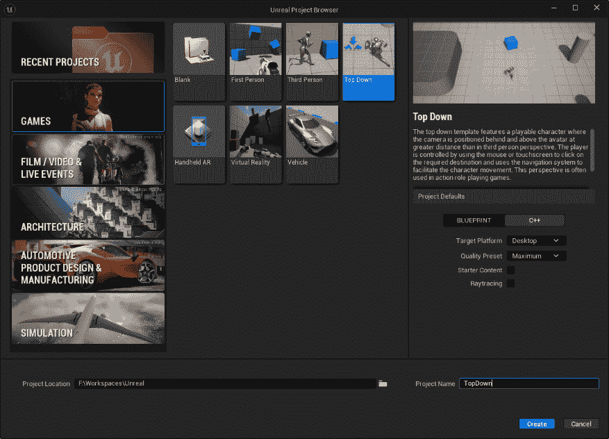

图 3.8 – 项目设置

一旦项目创建并打开，你就可以开始分析它了。

## 分析导航网格

我们现在将简要浏览生成的关卡以及有助于导航网格生成的演员。

在**大纲**视图中，你会注意到有一个名为**导航**的文件夹，包括三个演员：

+   **导航网格** **边界体积**

+   **重构** **导航网格**

+   **导航** **链接代理**

让我们详细分析每个元素。

### 导航网格边界体积

如您从本章前面的部分中已经了解的那样，**NavMeshBoundsVolume** 实体负责定义导航网格将被计算的区域。通过选择它，您将注意到一个黄色边缘的区域被显示出来，包围了所有游戏级别，如图 3.9* 所示：

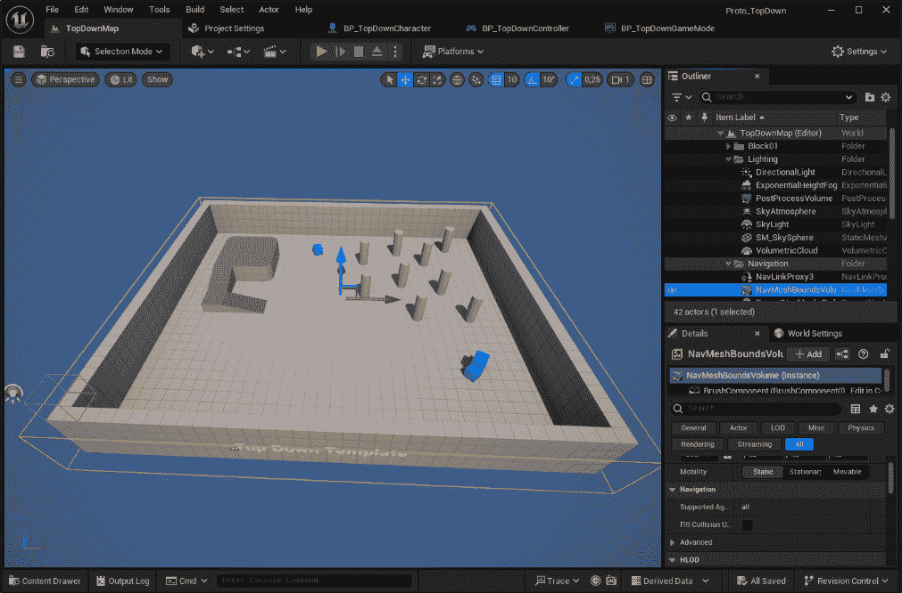

图 3.9 – 导航网格边界体积

您无法对此实体做太多；只需调整其大小，导航网格将重新计算。

### 重新构建导航网格

**RecastNavMesh** 实体将负责导航网格的生成；默认情况下，它在 Unreal Engine 编辑器中没有可见的表示。但是，如果您按键盘上的 *P* 键，导航网格将在编辑器界面中变得可见并可访问。图 3.10* 显示了在此实体可见后级别的样子：

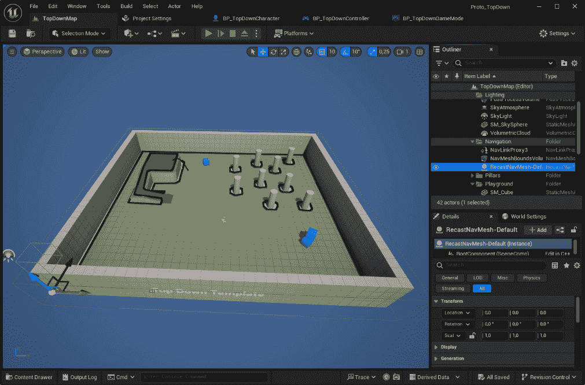

图 3.10 – 重新构建导航网格

在*第六章*，“优化导航系统”中，我将向您展示一些使用此实体优化网格生成的技术。现在，您只需检查**详细信息**窗口中的**显示**类别；在这里，您将能够访问一系列可视化工具，这些工具将在本书后面的内容中非常有用。例如，在图 3.11* 中，我展示了级别的各个部分——称为**瓦片**——以及它们的标签和生成的多边形：

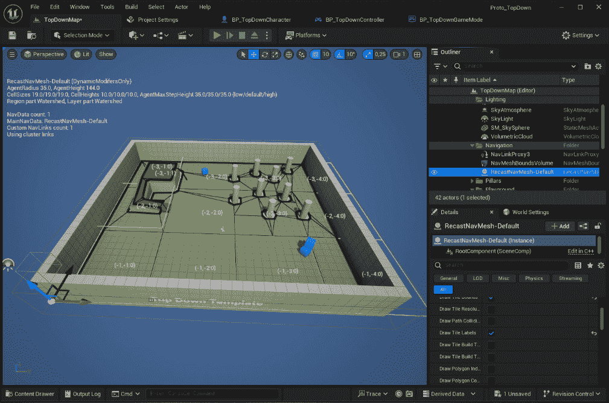

图 3.11 – Recast Nav Mesh 实体的某些显示设置

您可能已经注意到，级别上的蓝色立方体实体以任何方式都没有影响导航网格。这是因为它们已被配置为不会影响导航；由于它们是可移动对象，我们不希望它们在周围创建不可导航区域。

作为简单的测试，在**详细信息**面板中，您可以查找**始终影响导航**属性并启用它；导航网格将立即重新计算，立方体将在其中挖一个洞，如图 3.12* 所示：

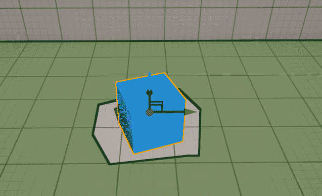

图 3.12 – 蓝色立方体实体雕刻导航网格

上述属性表示该对象将是导航区域中的障碍物，并且生成的洞将是网格中的不可导航区域。

请注意，让这样的可移动对象雕刻导航网格可能会产生不期望的结果；默认情况下，导航网格是静态的，无法在运行时进行更改。这意味着即使对象被移动，不可导航区域也将保持固定，尽管看不见，但会阻碍玩家角色进入或穿越它。

### 导航链接代理

在此示例中，最后一个导航网格实体是一个 **NavLinkProxy** 实体，在我们的级别中，它将允许玩家角色从平台上跳下来。

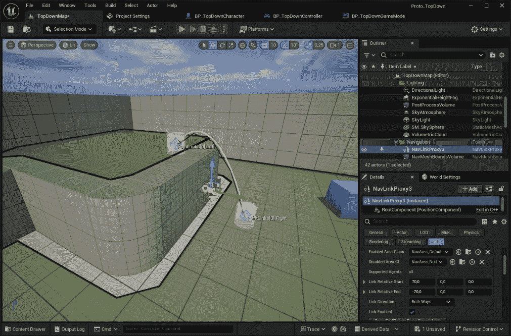

图 3.13 – 级别中的导航链接代理

现在您已经理解了导航网格的结构，让我们来检查角色控制器，以了解玩家角色是如何操纵的。

## 分析角色控制器

根据您在创建项目时的选择——蓝图或 C++——您将拥有两种略有不同的角色控制器版本。

### 蓝图角色控制器

移动控制器角色的代码相当简单，可以在**BP_TopDownController**中找到——位于**Content/TopDown/Blueprints**文件夹中。

一旦打开蓝图类，在**函数**选项卡中找到**MoveTo**函数并打开它；您将找到用于使玩家角色通过导航网格移动的**简单移动到位置**节点。

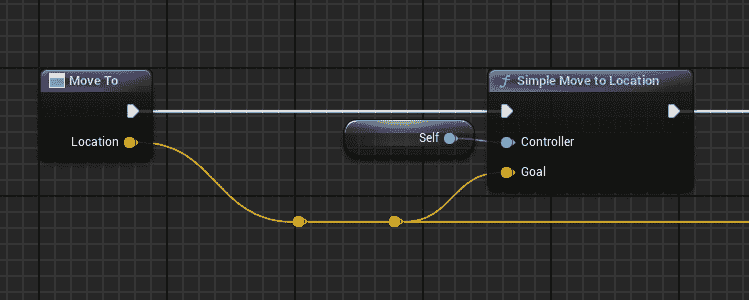

图 3.14 – MoveTo 函数

这就是您需要用来将玩家角色移动到级别中预定义位置的所有内容。

### C++角色控制器

同样的逻辑可以在 C++生成的项目中找到；只需打开为玩家控制器生成的**.cpp**类，查找**OnSetDestinationReleased()**方法；您将找到以下代码行：

```py
UAIBlueprintHelperLibrary::SimpleMoveToLocation(this, CachedDestination);
```

这个辅助函数将启动您的代理的导航过程。

## 测试项目

现在您已经了解了参与此项目的所有演员，您可以简单地按**播放**按钮开始测试导航系统的工作方式。特别是，您会注意到角色将通过选择最短路径移动到目标点。

此外，一旦在左侧的升高平台上，它将能够跳下，这要归功于在该位置添加的导航链接代理。

# 摘要

在本章中，我向您介绍了虚幻引擎导航系统的关键组件。我们首先讨论了生成导航网格的过程，这对于 AI 代理在环境中导航至关重要。然后，我简要解释了路径查找算法的工作原理，使 AI 角色能够高效地找到路径。最后，我强调了使用**自上而下**项目模板的好处，该模板有效地利用了导航系统。

到现在为止，您应该已经很好地理解了虚幻引擎 AI 导航系统提供的功能。我想您一定渴望开始编码，这正是我们在下一章将要做的！
