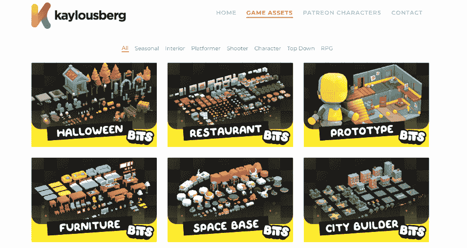

# 第四章：设置导航网格

我相当确信，到现在为止，你已经意识到在 AI 游戏开发中，一个关键要素是建立一个完全功能化的导航网格。这个实体作为基石，用于精确有效地引导 AI 控制的代理穿越游戏世界。

在本章中，我们将开始将这种理解付诸实践，通过启动一个新项目。到本章结束时，你将在自己的项目中开发和完善导航系统的实际经验。

这项知识将成为塑造你作为 AI 程序员道路上的一个关键里程碑，推动你朝着创造颠覆游戏行业的突破性游戏迈进！

在本章中，我们将涵盖以下主题：

+   介绍 Unreal 敏捷竞技场

+   创建 AI 代理

+   设置基本关卡

+   添加导航修改器

+   与导航链接代理一起工作

# 技术要求

要跟随本章内容，你应该已经按照*第一章*中解释的，设置了 Visual Studio（或 JetBrains Rider）以及所有 Unreal 依赖项，*入门 AI 游戏开发*。

你将使用本书配套仓库中可用的某些入门内容，该仓库的网址为[`github.com/PacktPublishing/Artificial-Intelligence-in-Unreal-Engine-5`](https://github.com/PacktPublishing/Artificial-Intelligence-in-Unreal-Engine-5)。通过此链接，找到本章的相应部分，并下载以下**.zip**文件：**Unreal 敏捷竞技场 –** **入门内容**。

如果你在这章中迷路了，在仓库中，你还可以在这里找到最新的项目文件：**Unreal 敏捷竞技场 –** **第四章** **结束**。此外，为了完全理解本章内容，在我引导你了解设置 AI 代理的关键特征的同时，你需要具备一些关于 Blueprint 视觉脚本的基本知识。

# 介绍 Unreal 敏捷竞技场

要启动一个成功的项目，拥有坚实的基础至关重要。想象一下，你开始阅读一本短篇小说，开头是这样的：

*在一个隐藏在不起眼的建筑下的秘密地下实验室中，一位名叫马克斯博士的古怪科学家在他的最新发明上辛勤工作：AI 木偶。这些木偶并非普通的木偶；它们配备了先进的 AI 技术，使它们能够以最* *意想不到的方式*与环境互动。*

*马克斯博士以其古怪个性和疯狂的想法而闻名。他相信这些木偶是理解人类行为和改善社会互动的关键。在他的忠实伙伴，维多利亚教授的陪伴下，他开始了一系列* *令人捧腹的实验*。

嗯，看起来你已经找到了创建视频游戏行业下一个大热门的完美起点，你的任务是制作出令人惊叹的 AI 智能体，它们将通过与虚拟环境的无缝交互震撼游戏世界！

## 解释项目概述

你将要工作的项目将是一组**健身房**级别，在那里你将为你的 AI 智能体创建不同的行为。

注意

在游戏开发中，健身房通常指的是一个开发者可以测试和训练他们的 AI 算法和模型的训练环境。这个术语在强化学习的背景下也经常被使用，在那里 AI 智能体通过在模拟环境中试错来学习玩游戏。为了这本书的目的，我们将坚持第一种定义。

在我看来，在健身房工作是一个游戏原型阶段中最有趣的部分之一，因为你不需要过多担心事物是否完美运行；你可以尝试各种各样的事情，最终你很可能会想出富有创意和非常规的解决方案！

因此，首先，我提供了一个项目模板——称为 Unreal Agility Arena——你将在本书的其余部分使用它。在下载并在虚幻引擎中打开它之后，我们的主要焦点将是创建自包含的级别来实验到目前为止获得的知识。这将涉及处理小任务并有效地解决它们。

一旦你达到*第七章*，“介绍行为树”，你将准备好迎接更具挑战性的内容，事情会变得有点困难，但我也向你保证——这将更加吸引人和有趣！

注意

由于这本书是关于 AI 游戏编程而不是游戏设计，因此平衡游戏机制不会是游戏玩法的主要焦点。相反，重点将在于确保事物有效运行。

第一步是打开项目，深入挖掘我为你准备的丰富资源。那么，让我们开始吧！

## 开始项目

虽然这个项目将主要关注健身房级别，但我们追求的是视觉上吸引人的，或者正如我们游戏开发者喜欢说的——*诱人*的外观和感觉。我明白你们中的许多人可能没有 3D 建模的背景（我也没有！）。这就是为什么我们将使用凯·卢斯伯格（[`kaylousberg.com/`](https://kaylousberg.com/)）提供的某些出色的资产，这些资产可用于个人和商业用途。

图 4.1 – 凯·卢斯伯格的网站

注意

在这个项目中，我主要使用了**Prototypes Bits Extra**包，一旦购买了许可证，这个包就可以免费分发。如果你打算将模型用于商业项目，请考虑也从凯的网站上购买许可证。

在本章开头提供的链接中下载文件后，解压它，通过双击 **UnrealAgilityArena.uproject** 文件来打开项目。

一旦项目打开，请检查 **Content** 文件夹中的内容。您将看到以下子文件夹：

+   一个包含我用 Unreal Engine **建模工具** 创建的一些额外模型的 **_GENERATED** 文件夹

+   一个包含 Kay 所有模型的 **KayKit** 文件夹

+   一个包含一些预制关卡，这些关卡已准备好使用的 **Maps** 文件夹

+   一个包含项目资产所需的某些材质的 **Materials** 文件夹

+   一个包含项目材料使用的某些纹理的 **Textures** 文件夹

+   一个包含我们将要使用的某些 Niagara 效果的 **Vfx** 文件夹

在我们可利用的所有资源下，我们准备开始为项目创建元素，首先是一个将在我们的关卡中导航的代理。

# 创建 AI 代理

作为测试路径查找系统的第一步，我们将创建一个代理，其唯一目标是到达关卡内的一个目标演员；它不会有什么特别之处，只是一个能够到达关卡内目标点的演员。

让我们从在 **Content Drawer** 内创建一个新的文件夹并命名为 **Blueprints** 开始。双击新创建的文件夹以打开它并执行以下步骤：

1.  右键单击 **Content Drawer**，然后从打开的菜单中选择 **Blueprint Class** 。

1.  从将打开的 **Pick Parent Class** 窗口中，选择 **Character** ，如图 *Figure 4* *.2* 所示：

Figure 4.2 – Character creation

1.  将新创建的资产命名为 **BP_NavMeshAgent** 。

1.  双击它以打开它。

如您可能已经知道，**Character** 类指的是一种特定的 pawn 类型，它被设计用来以垂直方式表示玩家或 AI 代理，允许他们在游戏世界中行走、跳跃、飞行和游泳。

我们将首先给它一个视觉表示，并设置主要值。

## 创建代理

在 **Blueprint** 类打开且选择 **Viewport** 选项卡的情况下，找到 **Details** 面板并按照以下步骤操作：

1.  打开 **Skeletal Mesh Asset** 属性下拉菜单并选择 **Dummy** 资产。

1.  打开 **Anim Class** 属性下拉菜单并选择 **ABP_Dummy** 资产。

1.  在 **Character Movement (Rotation Settings)** 类别中，找到 **Max Walk Speed** 属性并将其值设置为 **500.0 cm/s** 。

1.  在 **Character Movement (Rotation Settings)** 类别中，找到 **Rotation Rate** 属性并将 *`Z`* 值设置为 **640.0°** 。

1.  在同一类别中，勾选 **Orient Rotation to** **Movement** 复选框。

1.  在 **Shape** 类别中，将 **Capsule Half Height** 属性设置为 **120.0**，将 **Capsule Radius** 属性设置为 **50.0** 。

1.  在 **Pawn** 类别中，取消勾选 **Use Controller Rotation** **Yaw** 属性。

之前的步骤相当直接，它们将仅设置角色网格，分配一个动画蓝图（该蓝图已经为您创建）以及，最后，设置胶囊组件大小和移动旋转设置。代理的最终结果显示在*图 4* *.3* 中：

图 4.3 – 代理蓝图

代理几乎准备好了，我们只需要添加一些简单的代码逻辑，使其能够到达关卡中的目标。

## 添加导航逻辑

打开**事件图**选项卡并按照以下步骤操作：

1.  在图中添加一个**获取 AIController**节点，并将其输入的**受控演员**引脚连接到一个**指向****自我**节点。

1.  从**Get AIController**节点的输出**返回值**引脚点击并拖动，并将一个**移动到演员**节点添加到图中。

1.  将**Event BeginPlay**节点的输出执行引脚连接到**移动到演员**节点的输入执行引脚。

1.  从**Move to Actor**的输入**目标**引脚，点击并拖动，并在释放后选择**提升为变量**选项；为新创建的变量命名为**TargetActor**。

1.  在**我的蓝图**选项卡中，选择**TargetActor**变量，并在其**详细**面板中检查**实例****可编辑**属性。

    这相当简单；在游戏开始时，代理将尝试导航到目标演员；将变量设置为**实例可编辑**将使其在关卡中可见，以便拾取代理目的地。您刚刚创建的视觉脚本代码显示在*图 4* *.4* 中：

图 4.4 – 蓝图图

我们可能不是那么聪明的代理现在已经完全装备好，可以导航到指定的目标位置。在接下来的部分中，我们将为代理创建一个合适的环境，使其可以自由移动和探索。

# 设置基本关卡

我们现在将创建我们的第一个关卡并开始测试代理的路径查找系统。项目模板包含我为您创建的一些预制件，特别是用于快速原型设计地图的**打包关卡演员**集和一个**关卡实例**用于设置照明系统。您完全可以创建自己的游戏关卡，但在这一阶段，我的建议是跟随我将要进行的操作。

注意

在 Unreal Engine 中，关卡实例允许您创建关卡或关卡部分的可重用实例；这样，您可以有效地复制和重用关卡设计的一部分，而无需从头开始重新创建。打包关卡演员是一种优化的关卡实例类型，只能包含静态网格。关卡实例和打包关卡演员在您需要在关卡中重复使用复杂或重复元素时特别有用。

## 创建关卡

要创建我们的第一个健身房，请按照以下步骤操作：

1.  从主菜单中选择**文件** | **新建级别**。

1.  导航到**Maps/LevelInstances**文件夹，并将**LI_Lighting**的实例拖动到您的级别中；将其变换**位置**设置为**(0, 0, 0)**。

1.  导航到**Maps/PackedLevelActors**文件夹，并将**PLA_Lab_01**的实例拖动到你的级别中；将其变换**位置**设置为**(0, 0, 0)**。

1.  从**KayKit/PrototypeBits/Models**文件夹中，将一些障碍物拖动到级别中，以使您的代理更加有趣；我的级别如图*图 4* *.5* 所示：

图 4.5 – 基础级别

1.  将级别保存在**Maps**文件夹中，并命名为**Gym_NavMesh_01**。

## 添加导航网格

现在，您可以为级别添加导航网格：

1.  从工具栏中的**快速添加到项目**按钮，选择**Nav Mesh Bounds Volume**并将实例拖动到级别中；将自动添加**Recast Nav Mesh**演员以及体积。

1.  将体积的**位置**设置为**(0, 0, 0)**和**缩放**设置为**(20, 20, 1)**。

1.  在级别内点击并按下键盘上的`P`键以显示生成的导航网格，如图*图 4* *.6* 所示：

图 4.6 – 导航网格

如您所见，您添加的障碍物将雕刻导航网格，并为即将添加的代理增添更多趣味。

## 添加代理

作为最后一步，我们需要添加代理和要到达的目标点。所以，让我们先做这个：

1.  从**Vfx**文件夹中，拖动**NS_Target** Niagara 系统的实例并将其放置在导航网格上的任何位置。

1.  从**Blueprints**文件夹中，拖动**BP_NavMeshAgent** Blueprint 的实例并将其放置在级别中蓝色的瓷砖上；**位置**值应大约为**(-1650, 30, 180)**。

1.  在选择代理后，在**细节**面板中找到**目标演员**属性，并从下拉菜单中将其值设置为**NS_Target**，这是之前添加的 Niagara 系统。最终级别应类似于*图 4* *.7*：

图 4.7 – 最终级别

现在级别已经完成，我们可以开始测试它。

## 测试健身房

现在健身房已经完成，您可以从测试代理开始，看看它在级别中的行为如何。

您可以直接在工具栏中点击**播放**按钮，或者使用**模拟**按钮，它不会进入播放模式，但会显示级别如何工作的模拟。在这个上下文中，我个人更喜欢第二种选择，因为它会保持导航网格可见。

一旦开始模拟，您将看到代理通过最短路径到达目标演员。您可以自由地实验障碍物，以检查代理在不同场景下的行为。

在本节中，你已经开始亲手实验路径查找系统的运作方式。你通过创建一个智能体和一个简单的健身房环境来实现这一点，以便智能体进行导航。

在下一节中，你将向导航网格添加修饰符，以给你的智能体增加一些挑战。

# 添加导航修饰符

在本节中，我们将创建另一个健身房，以便我们可以测试导航网格修饰符——这些修饰符可以用来定义进入区域成本不同于常规导航网格的区域。

我们将首先创建关卡，然后添加修饰符。

## 创建关卡

要创建我们的第二个健身房，请按照以下步骤操作：

1.  从主菜单选择 **文件** | **新建关卡** 。

1.  导航到 **Maps/LevelInstances** 文件夹，并将 **LI_Lighting** 实例拖动到你的关卡中；将它的变换 **位置** 设置为 **(0, 0, 0)** 。

1.  导航到 **Maps/PackedLevelActors** 文件夹，并将 **PLA_Lab_04** 实例拖动到你的关卡中；将它的变换 **位置** 设置为 **(0, 0, 0)** 。

1.  将关卡保存在 **Maps** 文件夹中，并命名为 **Gym_NavMesh_02** 。

    现在，通过以下步骤重复你为之前健身房所做的相同步骤：

1.  添加 **Nav Mesh Bounds Volume** 行为，并设置其边界以覆盖整个可通行区域。

1.  在关卡蓝色瓷砖的对侧添加 **NS_Target** Niagara 系统。

1.  在蓝色瓷砖上添加 **BP_NavMeshAgent** 蓝图，并将 **目标行为者** 属性值设置为 **NS_Target** 。现在关卡应该看起来像 *图 4.8* ：

图 4.8 – 更新的导航网格

到目前为止，一切与之前的健身房相当相似；我们现在将插入一个修饰符，看看它的表现如何。

## 添加修饰符

我们现在准备通过添加修饰符来改变路径查找系统的行为。为此，请按照以下步骤操作：

1.  从工具栏中的 **快速添加到项目** 按钮选择 **Nav Modifier Volume** 并将实例拖动到关卡中。

1.  将体积的 **位置** 设置为 **(0, 0, 0)** 和 **缩放** 设置为 **(5, 20, 1)** 。

    你会注意到导航网格已经被修改，并且在放置棕色（让我们说泥泞的）瓷砖的地方被雕刻出来。

图 4.9 – 添加了修饰符的关卡

如果你现在测试关卡，你会看到智能体向目标点移动，但在泥泞地形旁边停止；这是因为修饰符体积改变了导航网格，现在智能体无法到达其目标。

通过选择 **Nav Modifier Volume** 行为并在 **细节** 面板中检查 **区域类** 属性，你会注意到它已被设置为等于 **NavArea_Null** 的值。此值将该区域应用于无限成本，使其对智能体来说无法穿越。

图 4.10 – 区域类属性

如果您尝试将此值设置为**NavArea_Default**，您会注意到导航网格的行为将像没有修饰符一样，这正是此值所做的那样；遍历此部分的成本与常规网格的成本相同。通过现在测试健身房，您会注意到智能体会穿过泥泞地形并到达目标点。

如果您需要检查导航网格中每个多边形的遍历成本，可以通过选择**Recast 导航网格**演员，并在**详细信息**面板中检查**绘制多边形成本**属性来完成。*图 4.11* 显示了在关卡中的成本可视化：

图 4.11 – 导航网格遍历成本

让我们使关卡更有趣，并添加一些自定义修饰体积。

## 改进关卡

现在让我们为我们的智能体创建一个安全路径，以免它在泥泞区域弄脏脚。我们将通过使用一些额外的模型来创建一条通道。为此，请按照以下步骤操作：

1.  在**KayKit/PrototypeBits/Models**文件夹中，找到**Pallet_Large_Pallet_Large**模型。

1.  将此模型的三个实例拖放到关卡中，以在泥泞区域创建通道，如图 4.12 所示：

图 4.12 – 桥梁

是时候为桥梁添加另一个修饰符了：

1.  修改关卡中之前添加的**导航修饰体积**演员的大小，使其覆盖河流左侧的泥泞通道。

1.  在关卡中添加另一个**导航修饰体积**演员，使其覆盖河流右侧的泥泞通道。

1.  在关卡中添加一个第三个**导航修饰体积**演员，并将其放置以创建覆盖整个桥梁的区域。

在 Unreal Engine 中，**导航修饰体积**是一个用于更改导航网格生成方式的演员，可以添加到关卡中以指定导航网格本身的某些区域。

您现在应该有三个修饰符创建的完全无法通行的区域，如图 4.13 所示：

图 4.13 – 带有修饰符的桥梁

现在我们已经添加了一条安全通道，我们将创建自定义修饰符以进行不同的设置实验。

## 创建自定义修饰符

修饰符是扩展**NavArea**类的蓝图；这意味着您可以通过子类化此类型并设置自己的参数来创建自己的修饰符。

我们现在将创建一个用于泥泞表面的和一个用于桥梁的修饰符。让我们从第一个开始：

1.  打开**内容抽屉**，在**蓝图**文件夹中，右键单击并选择**蓝图类**。

1.  从**所有类**下拉列表中选择**NavArea**类型。

1.  将新创建的资产命名为**NavArea_Mud**并双击它以打开。

1.  按以下方式更改其值：

    +   将**默认成本**更改为**10.0**。

    +   将**固定区域进入成本**更改为**2.0**。

    +   将**绘制颜色**更改为你选择的易于识别的颜色。

图 4.14 – 污泥导航区域的成本设置

虽然**绘制颜色**值几乎不言自明——它将被用来为体积覆盖的导航网格区域着色——**默认成本**是应用于穿越该区域整体成本的一个乘数。这意味着路径查找系统将计算穿越成本乘以**默认成本**的值。另一方面，**固定区域进入成本**是一次性应用的成本——当代理进入体积覆盖的区域时。在这种情况下，我们选择了进入泥泞区域的固定成本和穿越它的高成本。

现在，让我们为桥梁区域执行相同的步骤：

1.  打开**内容抽屉**，在**蓝图**文件夹中，右键单击并选择**蓝图类**。

1.  从**所有类**下拉列表中，选择**NavArea**类型。

1.  将新创建的资产命名为**NavArea_Bridge**并双击它以打开。

1.  按以下方式更改其值：

    +   将**默认成本**更改为**5.0**。

    +   将**固定区域进入成本**更改为**0.0**。

    +   将**绘制颜色**更改为你选择的易于识别的颜色。

图 4.15 – 桥梁导航区域的成本设置

在这种情况下，我们希望为代理创建一条更简单的路径，因此我们将固定成本设置为**0.0**，并将穿越成本设置为更低的值。

我们现在需要将这些类应用到关卡中的修饰符上。

## 应用自定义修饰符

我们现在准备好获取新创建的类并将它们应用到关卡修饰符上。为此，请按照以下步骤操作：

1.  选择两个泥**导航修饰体积**，在**详细信息**面板的**区域类**属性下拉列表中，选择**NavArea_Mud**。

1.  选择桥梁**导航修饰体积**，在**详细信息**面板的**区域类**属性下拉列表中，选择**NavArea_Bridge**。

导航网格应该已更新，并应看起来像*图 4.16*中所示：

图 4.16 – 修改后的导航网格区域

注意

根据你创建桥梁的方式，你可能会有比我更不规则的修饰区域；此外，导航网格可能生成得不够完全可通行。为了解决这些问题，你需要稍微调整模型面板的*`Z`*值和修饰区域的大小。

我们最终准备好测试这个关卡。

## 测试关卡

要测试你的健身房，只需开始关卡模拟；你应该看到你的代理走向桥梁，穿过它，并到达目标点。尽管泥泞的地形是可通行的，但穿过它的成本比穿越桥梁要高。

为了双重检查，请在桥梁上添加一些不可通行的障碍物，就像我在*图 4.17*中做的那样：

图 4.17 – 被阻挡的桥梁

如果你开始模拟，你会看到代理直接走向目标点；尽管泥泞的地形有很高的通过成本，但没有其他可行的解决方案，所以代理将选择它。

这部分内容到此结束，你学习了如何使用修饰符。在下一节中，我将向你展示另一种使用链接代理修改导航网格的方法。

# 与导航链接代理一起工作

如我们已在*第三章*中看到的，*介绍虚幻引擎导航系统*，**导航链接代理**是一个用于定义代理可以导航的特定区域的演员，即使关卡的一部分无法穿越。**导航链接代理**放置在游戏世界中，以标记起点和终点，创建一个导航链接。此链接将在两个可能无法直接到达的区域之间提供连接——可以是单向或双向的。

为了检查这个链接是如何工作的，我们将创建一个新的健身房。

## 创建关卡

要创建这个新的健身房，请按照以下步骤操作：

1.  从主菜单中选择**文件**|**新建关卡**。

1.  导航到**Maps/LevelInstances**文件夹，并将**LI_Lighting**实例拖动到你的关卡中；将其变换的**位置**设置为**(0, 0, 0)**。

1.  导航到**Maps/PackedLevelActors**文件夹，并将**PLA_Lab_03**实例拖动到你的关卡中；将其变换的**位置**设置为**(0, 0, 0)**。

1.  将关卡保存在**Maps**文件夹中，并命名为**Gym_NavMesh_03**。

这个健身房中间有一个宽阔的水道，还有一个桥梁，如*图 4.18*所示：

图 4.18 – 健身房

现在，让我们添加几个导航网格——每个可通行区域一个——以及代理和目标点：

1.  添加两个**导航网格边界体积**演员，并设置它们的边界，以便覆盖河流两侧的可通行区域。

1.  在关卡蓝色瓷砖的对侧添加**NS_Target** Niagara 系统。

1.  在蓝色瓷砖上添加**BP_NavMeshAgent**蓝图，并将**目标演员**属性值设置为**NS_Target**。现在关卡应该看起来像*图 4.19*：

图 4.19 – 带有导航网格的健身房

如果你现在测试你的训练场，你会注意到你的智能体走向目标点，但在水道附近停下。嗯，我想这就像一只企鹅穿着燕尾服参加一个盛大的派对一样出人意料——没有联系，所以不可能有成功的路径搜索！

现在让我们让智能体穿过这座桥。

## 添加导航链接代理

要添加一个连接水道两边的链接，请按照以下步骤操作：

1.  在工具栏中的**快速添加到项目**按钮中选择**导航链接代理**，并将一个实例拖到关卡中。

    你会注意到这个演员有几个菱形的小工具，分别称为**PointLinks[0].Left**和**PointLinks[0].Right**；这些是形成你的链接代理的连接点。

图 4.20 – 两个点链接之一

1.  选择每个点链接并将它们移动到桥梁的两侧，如图 *图 4.21* 所示：

图 4.21 – 一个导航网格代理

**点链接**属性是一个可以用来在不可达位置之间创建连接的元素列表。默认情况下只有一个，但你可以添加任意多个。

## 测试训练场

既然这个训练场也完成了，你可以测试它来看看你的智能体表现如何。一旦模拟开始，你会看到智能体通过桥梁到达目标点，就像上面存在导航网格一样。

注意

如果你尝试在桥上放置一些障碍物，你会注意到你的智能体直接冲过去然后停下；这是因为桥上实际上没有导航网格，而是一个直接的链接。这意味着导航链接代理是一个强大的工具，但需要明智地使用。

在本节中，你看到了如何使用导航链接代理连接导航网格中不可达的部分；有了这些新知识，你就可以让你的 AI 朋友们做一些史诗般的悬崖跳水，并完成各种古怪的花样了！

# 摘要

在本章中，你开始使用导航系统；从简单的可导航区域开始，你添加了一些障碍物并检查了智能体的行为。接下来，你学习了如何通过添加不可穿越区域或困难地形来修改可通行区域。最后，你了解了一些如何连接导航网格不连续部分的方法。

所有这些知识都是至关重要的，因为它帮助你的 AI 代理确定他们可以去哪里而不会撞到墙壁或陷入混乱的迷宫。你可以把导航网格想象成你数字伙伴的 GPS，确保他们不会在虚拟荒野中迷路！

在下一章中，我们将更深入地探讨导航网格的领域；准备好在 Unreal Engine 中创建更多高级和迷人的内容吧！
