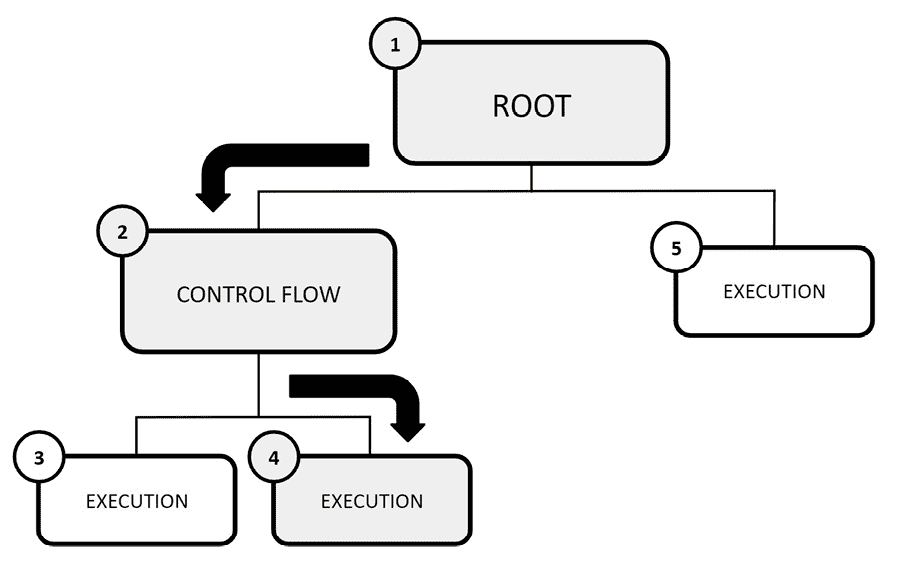
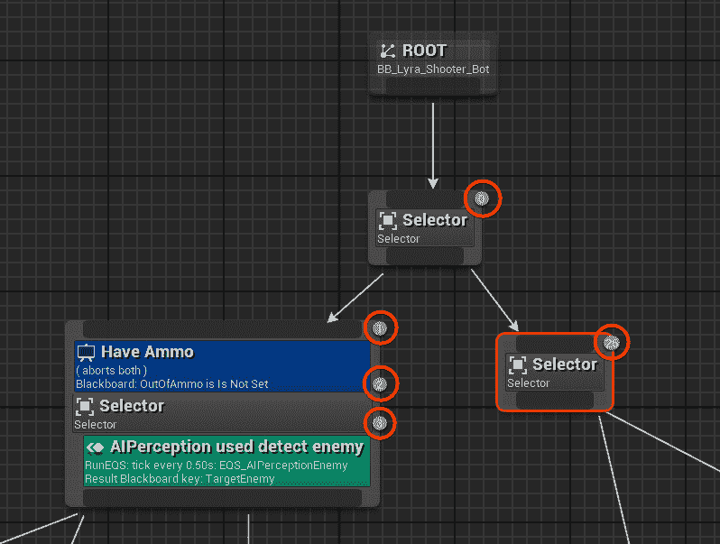
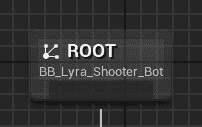
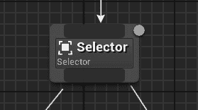
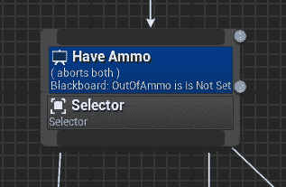
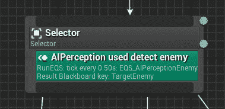
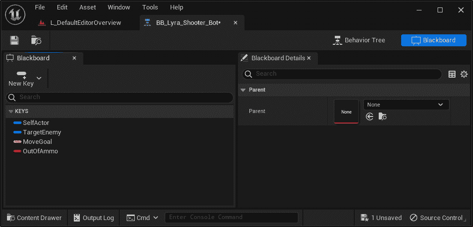
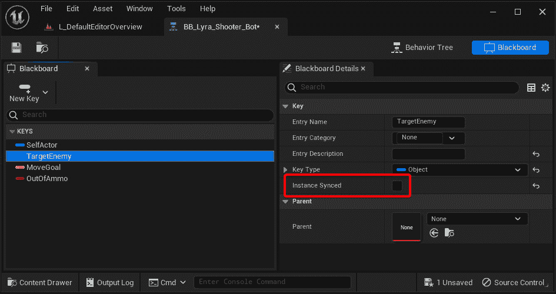

# 第七章：介绍行为树

在游戏开发的世界里，**行为树**是控制 AI 角色决策过程的分层结构，决定他们在游戏中的行动和反应。作为一名游戏程序员，深入研究行为树的复杂性至关重要，因为它将赋予你制作动态、智能和吸引人的虚拟实体的能力，从而增强玩家的游戏体验。

本章旨在提供对行为树和黑板以及它们在虚幻引擎中的应用的温和介绍。

在本章中，我们将涵盖以下主题

+   解释行为树

+   理解虚幻引擎中的行为树

+   理解黑板

# 技术要求

遵循本章没有技术要求。

# 解释行为树

在更广泛的意义上，行为树是一种在计算机科学的许多领域使用的数学模型，包括视频游戏。它以模块化的方式概述了有限任务集之间的转换。行为树的力量在于它们能够从简单的组件中创建复杂的任务，而不必深入了解每个组件的实现细节。虽然行为树与分层状态机有一些相似之处——状态以分层组织，允许更好地重用行为——但主要区别在于任务，而不是状态，是行为的基本元素。主要优势在于它们的直观性，使得它们更不容易出错；这就是为什么它们在游戏开发行业中非常受欢迎。

今天的视频游戏越来越复杂，导致 AI 角色的复杂性成比例增加。因此，这些角色或代理的维护至关重要。与状态数量增加时难以维护的有限状态机系统不同，行为树为决策过程提供了实际且可扩展的解决方案。当代理执行行为树时，它会进行**深度优先搜索**以定位和执行最低级别的叶节点。

行为树相较于其他系统的关键优势在于它们的可扩展性、表达性和可扩展性。与其他系统不同，行为树不涉及状态之间的显式转换；相反，树中的每个节点都指定如何运行其子节点。这种无状态的性质消除了跟踪先前执行节点以确定下一组行为的需求。行为树的表达性源于对各种抽象级别、隐式转换和复合节点复杂控制结构的运用。

此外，在行为树中，转换是通过树节点之间交换的调用和返回值发生的，促进了双向控制转移机制。

## 行为树结构

行为树以树结构的形式直观表示，节点分为**根节点**、**控制流**和**执行**——或**任务**。在这个表示中，每个节点可能有一个父节点和一个或多个子节点。特别是以下几点值得注意：

+   根节点没有父节点，只有一个子节点

+   控制流节点有一个父节点和至少一个子节点

+   执行节点有一个父节点，没有子节点

行为树的执行从根节点开始，它向其子节点发送执行触发器。

每当达到控制流节点时，它将控制树内的执行和决策流程，根据某些条件或规则确定应该执行哪些任务或子树。

每次触发执行节点时，它将执行一个特定的任务，如果任务正在进行，则向其父节点报告状态为*运行*，如果目标实现，则报告状态为*成功*，如果任务未成功，则报告状态为*失败*。

*图 7.1* 显示了一个行为树执行示例，从根节点开始，到控制流节点，最后执行一个任务：

图 7.1 – 行为树示例

注意

行为树节点从上到下、从左到右执行；这也是它们通常编号的方式。

不言而喻，实现行为树的方式不止一种。这就是为什么在下一节中，我将深入探讨虚幻引擎系统的所有细节。

## 虚幻引擎中的行为树是什么？

在虚幻引擎中，行为树是类似蓝图——即，通过添加和链接具有特定功能的节点集来形成**行为树图**的资产。在行为树中执行逻辑时，使用一个称为黑板的单独资产——关于这一点将在本章后面提供更多详细信息——来保留行为树需要做出明智决策的信息。

行为树由一个**BehaviorTreeComponent**实例处理，该实例由**AIController**实例持有。需要注意的是，组件不是自动附加到控制器上的；您需要通过 C++或蓝图来添加它。如果没有组件，它将在运行时自动创建。

当比较虚幻引擎的行为树与其他行为树系统时，需要记住的一个关键区别是它们的事件驱动特性，这防止了代码的持续执行。而不是持续检查相关变化，虚幻引擎的行为树会监听可以触发树修改的事件。使用事件驱动架构提供了性能提升和调试能力的好处——这一点我将在接下来的章节中展示。

## 行为树节点实例化

需要注意的是，行为树在您的项目中作为**共享对象**存在；这意味着所有使用行为树的代理将共享相同的实例，并且所有共享对象都无法存储特定于代理的数据。使用共享节点的主要优势是提高 CPU 速度和减少内存使用。

可以通过多种方式利用特定于代理的数据 – 其中一种是我们将在本章后面看到的黑板 – 以提供更多关于如何使用行为树的灵活性。

另一种方法是实例化单个节点；这将使每个使用行为树的 AI 代理获得节点的唯一实例，但代价是更高的性能和内存使用。使用此方法的一个节点示例是**播放动画**任务。

## 执行顺序

如前所述，行为树节点是从上到下、从左到右执行的，虚幻引擎也不例外。节点按照此惯例编号，以便轻松跟踪执行顺序。*图 7.2*展示了来自**Lyra 入门游戏**项目的行为树，显示了带有相应序列号的节点：

图 7.2 – 行为树序列

备注

在虚幻引擎中，根节点不会被编号，因为它不被视为序列的一部分。

在本节中，您已经得到了对行为树及其执行方式的温和介绍。下一节将深入探讨虚幻引擎系统，帮助您更好地理解如何有效地将行为树融入您的游戏中。

# 理解虚幻引擎中的行为树

理解行为树及其构成对于在虚幻引擎中设计有效的 AI 系统至关重要；在本节中，我将向您介绍与行为树相关的关键概念，以帮助您开始开发自己的 AI 角色。

在虚幻引擎中，行为树有五种类型的元素：

+   根节点

+   任务节点

+   组合节点

+   装饰器

+   服务

为了让您对每种类型有一个全面的理解，我将分别介绍它们，确保清晰地展示它们各自的功能。

## 根节点

根节点作为行为树的起始点；它在树中占据一个独特的位置，并受一套特殊规则的约束：

+   树结构中只能有一个此类节点

+   它只能有一个连接，如果此连接被移除，则整个树将禁用

+   它不支持附加装饰器或服务节点

图 7.3 – 根节点

## 任务节点

任务节点负责执行诸如移动 AI 或调整黑板值等操作。任务将不会停止其执行，直到报告失败或成功的结果。

任务节点也可以附加一个或多个装饰器或服务，允许在游戏环境中实现更复杂的行为和交互。

任务节点

任务以紫色标识。

图 7.4 – 任务示例

Unreal Engine 包含一组预构建的任务，这些任务可供使用。这些任务解决了开发者可能需要的大多数通用场景。然而，任务可以被扩展，以便您创建自己的自定义节点。

这里是部分任务列表，这些任务将作为标准功能提供：

+   **完成结果**：一旦执行，此节点将立即以定义的结果完成 - **成功**、**失败**、**中止**或**进行中**

+   **移动到**：一旦执行，它将通过使用导航系统将 AI 代理移动到目标位置

+   **直接移动**：一旦执行，它将不使用导航系统将 AI 代理移动到目标位置

+   **等待**：一旦执行，它将使行为树在此节点上等待，直到经过指定的时间

+   **播放动画**：一旦执行，此节点将播放指定的动画资源

+   **播放声音**：一旦执行，此节点将播放指定的声音

正如您所看到的，任务代表 AI 代理可以执行的单个动作或操作；您可以使用它们创建简单的动作，或将多个任务组合以创建更复杂的行为。

## 复合节点

复合节点定义了分支的根并设置其执行规则；此外，它们是唯一可以应用于行为树根节点的节点。

复合节点也可以应用装饰器和服务，从而使其逻辑更加复杂。一旦应用了服务，它将在复合节点的子节点执行期间保持活跃。

复合节点

复合节点以灰色标识。

有三种复合节点可用：

+   **选择器**

+   **简单并行**

+   **序列**

让我们逐一检查它们。

### 选择器

选择器节点按从左到右的顺序执行其子节点，并且它们会在任何一个子节点成功时立即停止执行。当一个选择器节点的子节点成功时，选择器本身被认为是成功的。另一方面，如果选择器的所有子节点都失败，选择器节点本身将被标记为失败。

图 7.5 – 选择器节点

### 简单并行

简单并行节点允许在完整树的同时执行单个主任务节点。主任务完成后，您可以通过**完成模式**属性决定节点是否应立即完成，停止次要树，还是等待次要树完成后再完成。

图 7.6 – 简单并行节点

### 序列

序列节点从左到右依次运行其子节点。当子节点失败时，将停止执行。如果子节点失败，序列也会失败。与选择器不同，序列的成功只有在所有子节点都成功时才会实现。

图 7.7 – 序列节点

## 装饰器

装饰器——有时也被称为条件——用于确定树中的分支，甚至单个节点是否可以执行。它们必须附加到复合节点或任务节点上。

装饰器在确定行为树中分支的执行路径方面起着至关重要的作用；它们本质上充当决策者，评估特定分支或单个节点是否应该继续执行。它们作为条件，评估继续沿着特定分支前进的可行性，如果任务——或子树——注定要失败，则发出预防性失败的信号。这种预防性操作有助于防止装饰器尝试执行注定要失败的任务——或子树——这可能由于各种原因（如信息不足或目标过时）而失败。

装饰器

装饰器以蓝色标识。

图 7.8 – 应用到选择器的装饰器

Unreal Engine 包含一组预构建的装饰器，这些装饰器可以随时使用，但可以扩展以允许您创建自己的自定义装饰器。

这里是一个部分列表，列出了一些您将作为标准功能可用的任务：

+   **黑板**：将检查在给定的黑板键上是否设置了值——或者没有设置值

+   **复合**：通过使用**AND**、**OR**和**NOT**节点，可以创建比内置节点更高级的逻辑

+   **冷却**：将锁定节点或分支的执行，直到经过预定义的时间

+   **路径存在**：将检查两点之间是否存在路径

+   **循环**：将无限期地循环节点或分支——或者如果设置了次数，则循环指定次数

大多数装饰器都包括一个**逆条件**属性，这将让您……反转条件，从而提供更多灵活性。例如，您可以在行为树中使用相同的装饰器，在相反的条件下执行不同的任务。

例如，您可以使用**路径存在**将 AI 代理移动到目标点，并在另一个**路径存在**实例上使用**逆条件**来寻找替代目标点。

总之，装饰器作为决策点，确定行为树中的特定动作或分支是否应该执行。

## 服务

服务可以附加到复合节点或任务节点上，并在其分支活动时以特定间隔运行——在**间隔**属性中定义。它们通常用于执行检查和更新黑板。

一旦由任务或组合触发，服务将保持执行，无论在所属节点下执行的父级-子级级别数量如何。

服务

服务以绿色标识。

图 7.9 – 应用到选择器的服务

服务对于您正在开发的行为树非常具体；这意味着，很可能会需要创建自己的自定义服务。然而，虚幻引擎提供了两个预先构建的服务，它们可以随时使用：

+   **默认焦点**：这允许从 AI 控制器快速访问一个演员，而不是使用黑板键。

+   **运行 EQS**：这可以用来定期执行 EQS – 更多内容请参阅*第十一章* ，*理解环境查询系统* – 在指定的间隔。它还可以更新指定的黑板键。

在介绍了构成行为树的各种节点类型之后，现在是时候进入下一节，以便深入了解黑板资产。

# 理解黑板

在虚幻引擎中，黑板是行为树的关键组件；它充当一个内存空间 – 类似于大脑 – AI 代理可以在其决策过程中读取和写入数据。这意味着开发者将能够查询和更新其中存储的信息。

黑板作为**黑板数据**资产创建，将被分配给行为树，并包含一组变量 – 命名为键 – 存储预定义类型的特定信息。这些键可以在运行时访问和操作，以影响 AI 角色的决策。

图 7.10 – 黑板示例

键可以设置为**实例同步**；在这种情况下，键本身将在所有黑板实例之间同步。这种同步确保对键值的任何更改都将一致地反映在共享相同行为树和黑板的 AI 代理的所有实例中。

图 7.11 – 实例同步属性

黑板可以存储多达 255 个键，并支持以下数据类型：

+   **FVector**

+   **FRotator**

+   **布尔值**

+   **Int32**

+   **浮点数**

+   **UClass**

+   **UObject**

+   **FName**

+   **UEnum**

+   **FString**

注意

黑板不能存储数组。

**BlackboardComponent**实例将允许您从黑板查询数据并将数据存储在黑板本身中。创建系统遵循与**BehaviorTreeComponent**类似的模式，如本章前面所述。

尽管它表面上看起来很简单，但理解黑板的工作原理对于确保您的 AI 代理有效运行至关重要。

# 摘要

在本章中，我们介绍了行为树系统。从简要的理论概述开始，我们了解了行为树在虚幻引擎中的工作方式，并学习了构成整个系统的关键组件。最后，我们讨论了黑板资产，这是行为树有效运行的关键元素。

准备迎接下一章，我们将引导你重新投入行动，并为你制作一个专门为我们的虚拟角色构建的行为树。具体来说，你将创建自己的自定义服务和任务，以便为即将到来的 AI 代理提供一个合适的 AI 大脑。做好准备吧，因为事情即将变得有趣而狂野——有时甚至令人愉快地混乱！
